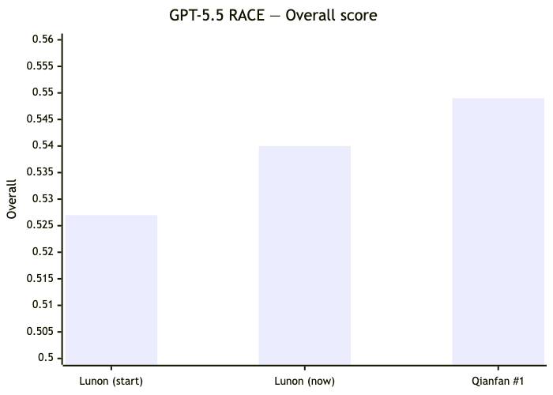

<p align="center">
  
</p>

<h1 align="center">Lunon Deep Research</h1>

<p align="center"><i>An autonomous research agent that turns one question into a cited, PhD-level report.</i></p>

<p align="center">
  
  
  
  
</p>

<p align="center">
  <a href="#results">Results</a> ·
  <a href="#how-it-works">How it works</a> ·
  <a href="#run-it">Run it</a> ·
  <a href="#reproducing-our-benchmark-results">Reproduce</a> ·
  <a href="#about-lunon">About</a>
</p>

---

You give it a hard question. It scopes what you're really asking, researches the open web, drafts a structured report section-by-section, then edits the whole thing down to something a senior analyst would actually hand you — tight, scannable, and sourced. It's the engine behind [Lunon](https://lunon.ai)'s research work, and we benchmark it in the open on [DeepResearch Bench](https://github.com/Ayanami0730/deep_research_bench) (DRB).

## Results

DeepResearch Bench scores 100 expert-written tasks (50 EN / 50 ZH) with **RACE** — a pairwise judge across Comprehensiveness, Insight, Instruction-Following, and Readability. Here's where we land on the **GPT-5.5 evaluator**, next to the current #1:

| Model | **Overall** | Readability | Insight | Comprehensiveness | Instruction |
| --- | --- | --- | --- | --- | --- |
| 🥇 Reference model (#1) | **0.549** | 0.480 | 0.572 | 0.557 | 0.543 |
| **Lunon Deep Research** | **0.540** | **0.504** 🔼 | 0.553 | 0.541 | 0.539 |

<p align="center">
  
</p>

The headline: **we beat the #1 model on Readability** (0.504 vs 0.480) — the dimension we used to lose to everyone — and sit a hair behind it on raw research depth. Net, that's second on the board and closing.

> **Honest footnotes.** These are our scores from the *official* harness (GPT-5.5 judge + GPT-5.4-mini cleaner) on the 100 DRB tasks; the public GPT-5.5 leaderboard is still launching, so treat them as a verified pre-print, not a posted rank. The reference model's numbers are from the same harness on the matching tasks. RACE strips citations before judging — we trade some citation density for that readability win, which the separate FACT metric will reflect.

## How it works

One question flows through four stages — **plan → research → write → edit** — each handing typed state to the next:


A few things we found mattered more than expected:

- **A depth contract, not just a prompt.** The architect emits a *typed* plan — explicit research queries plus acceptance criteria — so coverage is something the engine can check and the writer can't quietly skip.
- **Deterministic safety nets beat prompt-nagging.** Models ignore soft instructions, so structure (citation normalization, heading numbering, cross-reference repair) is enforced by post-passes, not hoped for.
- **The last edit is the biggest lever.** A whole-article *readability rewrite* takes a sprawling, over-structured draft and tightens it into a reference-length report. That single stage moved our RACE overall from 0.527 → 0.540 and readability from 0.427 → 0.504 — past the #1 model. It's fail-soft (a bad rewrite ships the original draft) and toggleable via `DR_READABILITY_REWRITE=off`.
- **It's tested.** A broad unit-test suite, with deterministic post-passes pinned against their live constants.

**Model stack:** Claude Opus 4.8 for planning / writing, GPT-5.5 for intent / criteria / refining / scoring, and Nemotron-3 specialists (via OpenRouter) for parallel research. Each role is swappable with one env var (`DR_ROLE_<ROLE>=…`).

## Run it

```bash
git clone https://github.com/LunonAI/lunon-deep-research
cd lunon-deep-research
pip install -r requirements.txt
cp .env.example .env        # add your OpenAI / Anthropic / OpenRouter / Exa / Jina keys
export DRB_PHASE=P1         # cost-attribution guard — the engine refuses to run unset
```

```python
from deep_research import deep_research

report = deep_research("How will solid-state batteries reshape the EV supply chain by 2030?", language="en")
print(report["article"])
```

Or run a whole query file (the DRB format, `{id, prompt, language}` per line):

```bash
DRB_PHASE=P1 python -m deep_research.adapter --query-file queries.jsonl --out reports.jsonl --workers 4
```

## Repository structure

```
lunon-deep-research/
├── deep_research/          # the agent
│   ├── pipeline/           #   plan → research → write → edit stages
│   ├── clients/            #   Anthropic / OpenAI / OpenRouter wrappers
│   ├── orchestrate.py      #   the end-to-end flow
│   └── adapter.py          #   batch runner (resumable, incremental)
├── scripts/                # generation + grading helpers
├── tests/                  # unit + integration tests
└── requirements.txt
```

## Reproducing our benchmark results

The benchmark's own verification is intentionally output-based: you send the generated reports to the DRB maintainers and they re-score them with their harness. Our submission is the 100 reports this engine produced (`{id, prompt, article}` JSONL). To regenerate them yourself, run the engine against the unmodified DRB query set (`data/prompt_data/query.jsonl` from the [benchmark repo](https://github.com/Ayanami0730/deep_research_bench)) and submit the output per their [instructions](https://github.com/Ayanami0730/deep_research_bench#submit-to-leaderboard).

## About Lunon

[Lunon](https://lunon.ai) is an AI-native consulting firm — commercial due diligence, market assessments, and technology assessments for private equity and global enterprises. We benchmark in the open because DRB measures, on a shared and contested task set, exactly what our clients pay for: accurate, well-sourced, deeply-synthesized research. The work that moves our score is the same work that improves the deliverable.

## License

MIT — see [`LICENSE`](LICENSE).

## Acknowledgments

DeepResearch Bench is built and maintained by the USTC team — thanks to Du Mingxuan and Li Ruizhe for the benchmark and the independent re-scoring, and to the open-evaluation community that keeps claims like these checkable.
