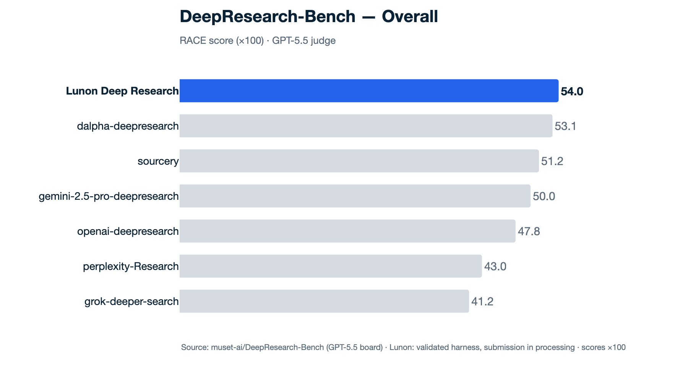
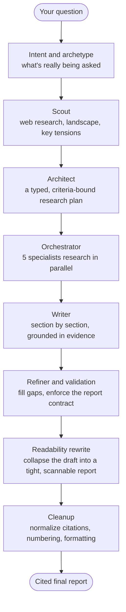

<p align="center">
  
</p>

<h1 align="center">Lunon Deep Research</h1>

<p align="center"><i>An autonomous research agent that turns one question into a cited, PhD-level report.</i></p>

<p align="center">
  
  
</p>

<p align="center">
  <a href="#how-it-works">How it works</a> ·
  <a href="#run-it">Run it</a> ·
  <a href="#about-lunon">About</a>
</p>

---

You give it a hard question. It scopes what you're really asking, researches the open web, drafts a structured report section-by-section, then edits the whole thing down to something a senior analyst would actually hand you — tight, scannable, and sourced. It's the engine behind [Lunon](https://lunon.ai)'s research work, and we benchmark it in the open on [DeepResearch Bench](https://github.com/Ayanami0730/deep_research_bench) (DRB).

<p align="center">
  <picture>
    <source media="(prefers-color-scheme: dark)" srcset="assets/leaderboard-overall-dark.png">
    <source media="(prefers-color-scheme: light)" srcset="assets/leaderboard-overall-light.png">
    
  </picture>
</p>

<p align="center"><sub>RACE overall (×100) on DeepResearch Bench, GPT-5.5 judge. Our submission is being processed by the benchmark maintainers — treat as a verified pre-print until it posts.</sub></p>

## How it works

One question flows through four stages — **plan → research → write → edit** — each handing typed state to the next:

<!-- Diagram regenerated by: python scripts/render_architecture_diagram.py  (source of truth: assets/data/architecture.json) -->
<p align="center">
  <picture>
    <source media="(prefers-color-scheme: dark)" srcset="assets/architecture-dark.png">
    
  </picture>
</p>

<details>
<summary>Text version (Mermaid)</summary>



</details>

A few things we found mattered more than expected:

- **A depth contract, not just a prompt.** The architect emits a *typed* plan — explicit research queries plus acceptance criteria — so coverage is something the engine can check and the writer can't quietly skip.
- **Deterministic safety nets beat prompt-nagging.** Models ignore soft instructions, so structure (citation normalization, heading numbering, cross-reference repair) is enforced by post-passes, not hoped for.
- **The last edit is the biggest lever.** A whole-article *readability rewrite* takes a sprawling, over-structured draft and tightens it into a reference-length report. That single stage moved our RACE overall from 0.527 → 0.540 and readability from 0.427 → 0.504. It's fail-soft (a bad rewrite ships the original draft) and toggleable via `DR_READABILITY_REWRITE=off`.
- **It's tested.** A broad unit-test suite, with deterministic post-passes pinned against their live constants.

**Model stack:** Claude Opus 4.8 for planning / writing / readability, GPT-5.5 for intent / criteria / refining / scoring, and two models via OpenRouter — Nemotron-3-Super-120B (NVIDIA) for the five parallel research specialists, and DeepSeek-V4-Pro for the Chinese-language writer pass. Each role is swappable with one env var (`DR_ROLE_<ROLE>=…`).

## Run it

```bash
git clone https://github.com/LunonAI/lunon-deep-research
cd lunon-deep-research
pip install -e .            # runtime deps + the package (add ".[dev]" for tests/lint)
cp .env.example .env        # add your OpenAI / Anthropic / OpenRouter / Exa / Jina keys
export DRB_PHASE=P1         # cost-attribution guard — the engine refuses to run unset
```

```python
from deep_research import deep_research

report = deep_research("How will solid-state batteries reshape the EV supply chain by 2030?", language="en")
print(report["article"])
```

Or run a whole query file (the DRB format, `{id, prompt, language}` per line):

```bash
DRB_PHASE=P1 python -m deep_research.adapter --query-file queries.jsonl --out reports.jsonl --workers 4
```

## About Lunon

[Lunon](https://lunon.ai) is an AI-native consulting firm — commercial due diligence, market assessments, and technology assessments for private equity and global enterprises. We benchmark in the open because DRB measures, on a shared and contested task set, exactly what our clients pay for: accurate, well-sourced, deeply-synthesized research. The work that moves our score is the same work that improves the deliverable.

## License

MIT — see [`LICENSE`](LICENSE).

## Acknowledgments

DeepResearch Bench is built and maintained by the USTC team — thanks to Du Mingxuan and Li Ruizhe for the benchmark and the independent re-scoring, and to the open-evaluation community that keeps claims like these checkable.
