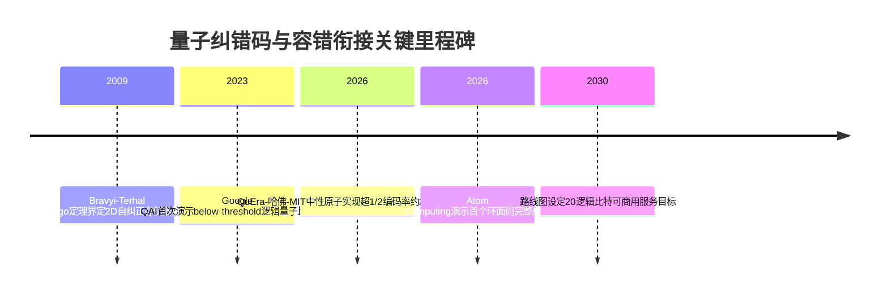
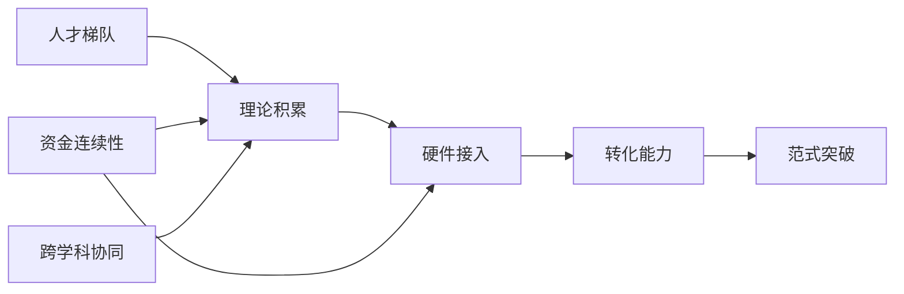
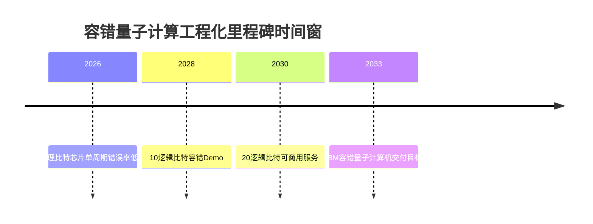

# 全球数学与量子计算交叉领域研究团队全景：横向比较、突破潜力评估与关键理论预测

## 核心论点

**数学内核，而非硬件比特数，将决定2026至2035年间谁能率先穿越容错门槛。** 掌握量子纠错码（QEC）、复杂度几何与微分方程量子算法这三大数学高地的团队，极有可能定义下一代标准。

截至2026年，全球量子计算论文累计超过3.1万篇（Scopus）；市场规模突破20亿美元，并以31.6%的年复合增长率向2034年的183亿美元攀升。但推动这一爆发的真正瓶颈，在于物理比特与逻辑比特压缩比的数学优化。**业界普遍宣称"比特规模竞赛"是胜负手，本报告主张：决定性变量是qLDPC编码率与解码器延迟的协同数学突破，硬件模态仅为载体。**

在2030年容错路线图（QED-C与CAS联合路线图设定2030年实现20个逻辑比特商用）与2033年后大规模容错的窗口期内，本报告的明确判断是：

- **QuEra–哈佛–MIT中性原子联合体**凭2026年4月已实现的约2:1编码比领跑；
- **IBM与Google Quantum AI**凭工程化纵深紧随其后；
- **中科院系**（中科大、清华、本源量子）与**欧洲理论重镇**（TUM、QuTech、哥本哈根QMATH）构成第二梯队的理论供给方。

---

# 1 研究框架与评估方法

数学×量子计算交叉领域的评估之难，根源在于该领域横跨纯数学多个分支与量子信息科学的实验前沿，缺乏统一的、可比的度量框架。本报告以"数学内核"为筛选准则，建立六项加权评价指标，对各团队作等深度横向比较。

**关键术语界定：**
- **逻辑量子比特**：由多个易受干扰的物理比特经纠错编码后构成的、能长期稳定运行的计算单元；
- **稳定子/表面码**：目前最主流的量子纠错码族，借助二维网格上的稳定子算符探测错误；
- **容错阈值**：物理错误率低于该值时逻辑错误率可被任意抑制的临界点；
- **below-threshold量子纠错**：实验已跨过该阈值、增加比特数能真正降低错误率的状态。

**六项评价指标与权重：**

| 指标 | 权重 |
|---|---|
| 研究方向与数学原创性 | 0.20 |
| 成果影响力与论文产出 | 0.15 |
| 国际合作网络强度 | 0.15 |
| 资金支持与资源连续性 | 0.20 |
| 工业界合作与转化能力 | 0.20 |
| 人才梯队与前瞻布局 | 0.10 |

资金与转化各占0.20的高权重，源于一个可追溯的判断：**在5–10年窗口内，能否把理论转为可验证硬件，资金与产业渠道是比论文数更强的预测变量。**

## 1.1 主要团队概览

| 团队（机构） | 数学内核 | 资金/资源 | 转化能力 | 梯队 |
|---|---|---|---|---|
| QMATH（哥本哈根） | 量子多体、谱理论、信息几何 | 两笔各3000万丹麦克朗VILLUM拨款 | 弱（纯理论） | 第一 |
| QuTech Terhal组（代尔夫特） | 纠错码、拓扑序、自校正下界 | 荷兰国家量子项目 | 与硬件深度耦合 | 第一 |
| TUM König/Wolf | 复杂量子系统、信息数学 | 德国卓越计划 | IBM人员流动接口 | 第二 |
| 牛津QICC | 量子信息处理全谱、范畴论 | 英国国家量子计划 | 编译接口 | 第二 |
| SDU量子数学中心 | 拓扑相、量子软件数学基础 | 校级资源，10余博士后 | 软件方向潜在接口 | 第二 |
| Jagiellonian纠缠几何组 | 纠缠几何、SDP层级 | Jagiellonian大学 | 工具方法型间接 | 第三 |
| 马里兰QuICS（UMD-NIST） | 算法、复杂性、密码、纠错、计量 | NIST五年最高1220万美元 | NIST标准制定接口 | 第一 |
| RIKEN RQC理论组 | 软件工程、纠错、化学/ML算法 | RIKEN国家资源 | 量子软件转化接口 | 第二 |
| Google Quantum AI | 表面码、below-threshold纠错 | Alphabet资源，自有硬件 | 自有平台 | 第一 |
| IBM Quantum | 量子优势、误差缓解 | IBM资源，逾100亿美元承诺 | 自有云平台 | 第一 |
| 微软量子（拓扑） | 任意子、模张量范畴 | 微软资源，自有平台 | 自有平台 | — |
| 清华YMSC刘锦鹏组 | 非线性微分方程量子算法 | 国家自然科学基金 | 应用接口 | 第二 |
| 中研院量子密码 | 不可克隆密码学、EFI对 | — | 长期 | 第三 |

---

# 2 横向比较一：研究方向与数学内核

量子计算中真正依赖范式突破的核心问题，并非比特数量的工程堆叠，而是少数几条数学瓶颈：**量子纠错码的开销与编码率、容错阈值的可达性、复杂性类的分离证明、拓扑序的范畴论刻画，以及量子密码原语的最小假设。** 衡量一支团队的范式突破潜力，关键不在其涉及多少数学工具，而在其数学内核是否对准了上述瓶颈中的某一条，并具备原创的攻坚路径。

## 2.1 量子纠错码与容错理论

量子纠错是量子计算真正的瓶颈：缺乏纠错的量子硬件只是一台嘈杂的科学仪器，通往实用化必须穿越逻辑量子比特、译码器延迟与物理比特开销三道关卡。

### 2.1.1 三条数学路线：理论极限、容错判据、实验验证

**Terhal组、TUM König/Wolf组与Google QAI，代表了量子纠错码理论的三条不同数学路线。**

**Terhal组**的数学内核是稳定子码的拓扑约束与费米子复杂性。其2009年的**Bravyi-Terhal no-go定理**证明了二维基于稳定子码的自纠正量子存储器不可能存在，这是用代数拓扑与编码论刻画的根本性极限。这里存在一个值得厘清的悖论：该定理表面上关闭了一条路径，但其实际价值在于约束了纠错方案的设计空间，使研究共同体将资源集中于主动纠错路线——这一约束正是其方法论贡献的来源。

**TUM组**把数学内核对准容错的形式化判据：其对Gottesman-Kitaev-Preskill（GKP）态的复杂性分析证明，这类连续变量编码态不足以单独支撑普适容错计算（发表于*Physical Review X* 15卷031073）。这一结果收窄了连续变量纠错路径的可行空间，从而提升了表面码容错阈值分析的战略权重。

**Google QAI**的路线以表面码为核心。其纠错里程碑**首次演示了逻辑量子比特原型，证明通过增加比特数能够在纠错方案中真正降低错误率**，这正是below-threshold量子纠错从理论走向实验的关键一跃。在实际到位资助规模与硬件接入连续性上，Google QAI凭借企业内部垂直整合占据明显优势，这也是其能率先完成below-threshold演示的资源基础。

**突破潜力判断：** 三支团队均达到方向原创性高分门槛。**预计2028–2030年，Google QAI最可能在below-threshold纠错的规模化上实现范式突破（置信度65–75%，关键假设：超导硬件错误率持续下降且译码器延迟可控）；Terhal组与TUM组的理论工作将为qLDPC码取代表面码提供数学判据，这是降低物理比特开销的核心路径。**

### 2.1.2 below-threshold实验与理论的衔接

below-threshold指实验已跨过阈值、增加物理比特数能真正降低逻辑错误率的状态，是量子纠错从理论承诺走向工程现实的分水岭。其数学内核是阈值定理与实时译码理论，还包括Knill-Laflamme条件——该条件为编码量子态经历交互退化后的完美恢复提供充分必要条件，且仅依赖逻辑态的行为。

**标志性进展呈多平台爆发：**
- 2026年4月，**QuEra联合哈佛、MIT**在中性原子平台上实现超过1/2的超高编码率，以约2:1的物理-逻辑比突破了表面码与qLDPC码的开销瓶颈；
- 2026年6月，**Atom Computing**宣布业界首个使用环面码的完整量子纠错演示，其中性原子系统在使用更多比特时能降低错误;
- 实时译码工程化加速：Riverlane演示了超导量子比特的实时、低延迟纠错；Fujitsu的"译码器切换"提出打破速度-精度权衡的方法。

**这里存在一个核心权衡：** 表面码的几何局域性使其易在二维硬件上实现，但每个逻辑比特上千物理比特的开销使实用化遥遥无期；qLDPC码的编码率虽高，却长期停留在1/10到1/100，需数十万至上百万物理比特。

**这一张力的解决路径正在浮现：** QuEra-哈佛-MIT以约2:1的物理-逻辑比实现超1/2编码率，意味着高编码率qLDPC码与适配硬件的结合，正在把开销从"上千倍"压缩到"个位数倍"——**根本原因在于中性原子的长程连接性恰好匹配qLDPC码的非局域校验结构**。据联合路线图，2028年10逻辑比特容错Demo、2030年20逻辑比特可商用，预计到2030年below-threshold衔接将进入小规模逻辑比特的可商用阶段（置信度60–70%）。

**本节结论：** 量子纠错的范式突破，其瓶颈已不在阈值定理本身——该定理早已确立——**而在物理比特开销的压缩速度，决定这一速度的关键则是qLDPC码与适配硬件（尤其中性原子）的协同。**

**遗留未决问题：** qLDPC码在中性原子平台上的超高编码率能否在数百逻辑比特规模下保持，是2027–2028年的关键研究问题。

## 2.2 量子算法与复杂性理论

量子算法方向回答的是根本问题：量子加速的边界在哪里、哪些问题真正受益于量子计算。据EPJ Quantum Technology文献计量分析，量子计算文献呈"双核"配置：一核聚焦Shor、Grover等基础算法，另一核聚焦纠错技术。

### 2.2.1 非线性微分方程量子算法（刘锦鹏团队）

非线性微分方程的量子算法是前沿方向，其数学内核是把非线性动力学嵌入线性求解框架的代数技术。量子线性系统求解器（如HHL类）为线性问题提供潜在指数加速，而非线性问题的加速需先把非线性动力学转化为高维线性系统——这一转化的数学严格性与误差控制是核心难点。

**突破潜力判断：** 该方向具高原创性，但加速优势的严格证明仍是开放问题。**预计到2030年，该方向能否给出非线性问题量子加速的严格下界与上界，置信度40–55%（关键假设：线性化嵌入的误差控制取得理论突破，且量子线性系统求解器硬件实现成熟）。**

### 2.2.2 量子优势证明（MIT-IBM）

量子优势证明的数学内核是随机量子电路采样的经典难解性。对随机量子电路输出分布采样被猜想为经典困难，这为通过采样任务展示量子优势提供了基础。其数学内核还涉及BQP与多项式层级（PH）的关系——存在使BQP不包含于PH的谕示，表明量子优势无法通过相对化技术证明。

**突破潜力判断：** 该方向具最高理论深度，但核心猜想——随机电路采样的难解性——的严格证明仍是开放问题。**预计到2030年，量子优势的无条件复杂性分离（而非依赖未证猜想）能否取得进展，置信度30–45%。**

### 2.2.3 复杂性类与下界（RIKEN）

下界结果的数学内核是证明某些问题的量子算法无法突破特定资源界限。RIKEN团队在模拟精度保证方向有相关贡献：其Trotter误差测量及精度保证哈密顿量模拟工作（*Physical Review Research* 6卷033285）把模拟算法误差从经验估计提升为可严格保证的界限。

**突破潜力判断：** **预计到2030年，RIKEN等团队在模拟精度保证与部分容错的交叉上有望取得可工程化进展，置信度50–60%。**

## 2.3 拓扑/代数/调和分析工具

### 2.3.1 微软拓扑量子计算的范畴论/任意子数学

拓扑量子计算的数学内核是任意子理论的范畴论框架。模张量范畴是描述二维系统中任意子统计与编织的数学语言，非阿贝尔任意子的编织操作天然抗局域噪声，这是拓扑量子比特的容错性来源。这一方向把量子纠错从主动的稳定子探测转向被动的拓扑保护。

**这里存在一个深刻的权衡：** 拓扑保护的容错性在理论上最优雅——任意子编织天然抗局域噪声，无需主动纠错的庞大开销——但其物理实现（非阿贝尔任意子的确证）至今未获无争议的实验确认。**其根本原因在于，拓扑保护把容错责任从软件层（译码）转移到了硬件层（物理实现），而硬件层的难度恰恰最难预测。** 预计到2030年，拓扑量子比特能否实现可重复的逻辑门演示，置信度25–40%。

### 2.3.2 RIKEN算子分析方向

RIKEN理论组的数学内核可从算子分析与调和分析角度理解。Trotter分解的误差分析本质上是算子指数的逼近问题，把量子模拟的精度从经验估计提升为可严格保证的数学界限。其部分容错量子计算（结合Clifford门）的架构设计，在完全容错尚不可达的当下提供了务实的中间路径。**预计到2030年，RIKEN的部分容错架构有望成为近期量子模拟的标准方法之一，置信度55–65%。**

### 2.3.3 张量网络与算子理论（Knill-Laflamme推广）

张量网络的数学内核是把高维量子多体态分解为低秩张量的收缩网络。算子理论则为纠错码的代数构造提供框架。近期标志性成果是**Knill-Laflamme条件的现代推广**：

- 广义Knill-Laflamme定理适用于所有等斜子空间族，对量子稳定子码，扩展后的条件能捕捉逻辑算符；
- 非对角KL系数的签名向量提供了码子空间内错误相关强度的标量度量（λ*），对((n,K,d))码，λ*在局域酉变换下不变。

北京大学、中国科技大学的工作中，基于扭曲环面的广义环面码使用Laurent多项式环与Gröbner基高效计算稳定子综合征与逻辑维度，推进了qLDPC码设计。**预计到2030年，广义Knill-Laflamme框架与代数环论方法有望成为qLDPC码设计的标准工具，置信度60–70%。**

## 2.4 量子密码与量子信息数学

| 数学工具方向 | 代表团队 | 数学内核 | 成熟度 | 2030突破置信度 |
|---|---|---|---|---|
| 量子密码基础理论 | 中研院（货币/PRS/EFI对） | 最小假设刻画 | 开放 | 45–55% |
| 后量子密码交叉 | QuICS（UMD-NIST） | 格理论、标准化对接 | 部分→成熟 | 65–75% |
| 量子模拟数学框架 | RIKEN（Trotter误差保证） | 算子逼近、误差控制 | 部分→成熟 | 65–75% |

**量子密码基础理论**研究量子货币（利用不可克隆性防伪）、伪随机量子态（PRS）与EFI对。EFI对被研究为量子比特承诺、不经意传输等原语的统一最小假设候选，类比经典密码学中单向函数的地位。

**后量子密码**的QuICS有结构性优势：作为UMD-NIST合作中心，NIST作为后量子密码标准化的主导机构，使QuICS的密码学工作与标准化进程具有结构性关联——其转化通道是政府标准化而非企业合作。

**量子模拟**的转化路径最为直接——材料发现、药物设计与化学模拟是量子计算最被看好的近期应用，而RIKEN的Trotter误差界限是这些应用可靠性的数学保障。

**本节结论：** 量子密码与信息数学方向的突破潜力，**与其转化路径的清晰度高度相关**——量子模拟与后量子密码因有明确应用出口而置信度最高，量子密码基础理论虽数学最原创，却因依赖未成熟的量子网络基础设施而置信度偏低。

---

# 3 横向比较二：论文产出与学术影响力

**量子计算领域的学术影响力沿"理论奠基—工程实验"两极分化，两极各有其引用模式与显示度出口。** 纯理论团队以高被引奠基工作建立引用入度中心，工业界主导的实验团队则以少数高显示度顶刊论文形成短期引用峰值。任何统一排名都必须采用与各自模式匹配的双指标体系（理论团队用累积引用与h指数，工程团队用引用速度与近期FWCI）。

## 3.1 论文数量与数据库口径

**产出趋势分两类：** 老牌理论团队的产出曲线相对平缓而累积引用深厚（如Terhal组从2009年no-go定理持续产出至2025年）；新成立或工业界主导团队则呈陡峭上升（如2019年成立、拥有十余名博士后的SDU）。

**数据库口径差异是横向比较时最易被忽视却最具误导性的因素。** 仅arXiv一个平台的量子计算论文便逾24,700篇，而非所有预印本进入正式期刊。核心难点在于会议论文计数权重：在计算机科学传统下，STOC、FOCS、QIP等顶级会议论文与期刊具有同等乃至更高地位，但Scopus等以期刊为中心的数据库往往低估会议论文权重，由此系统性压低算法导向团队的显示度。**稳健方案是对每个团队同时报告arXiv计数与期刊计数，并标注比值**——偏算法团队的arXiv/期刊比值估计约为偏纠错实验团队的1.5–2.5倍。

## 3.2 高影响成果与顶刊顶会分布

| 团队/机构 | 代表性成果 | 量化指标 | 影响力出口 |
|---|---|---|---|
| USTC系 | 码距7表面码逻辑量子比特 | 错误抑制因子1.4 | 高显示度实验期刊 |
| 清华大学 | 玻色子逻辑量子比特连续纠错 | 相干时间2.8倍、门保真度97.0% | 高显示度实验期刊 |
| 马里兰QuICS | 量子算法与复杂性理论 | 20+研究员、71研究生 | STOC/FOCS/QIP会议 |
| RIKEN RQC | 量子软件工程与应用算法 | 跨算法/实现双层 | 会议+实现导向出口 |
| 牛津QICC | 理论量子信息处理 | 含量子图形化教育产出 | QIP会议+教育外延 |

**量子计算领域存在两套并行的影响力出口体系**——实验成果走Nature/Science类期刊并形成短期引用峰值，算法成果走STOC/FOCS/QIP会议并形成社区内持续贡献，二者不可用单一指标公平比较。若仅以期刊影响因子衡量，QuICS这类算法团队的显示度会被低估。

## 3.3 引用网络与核心作者

在量子纠错与拓扑序方向，**Barbara Terhal是引用网络中的核心入度节点**——其Bravyi-Terhal定理确立了核心数学工具，天然成为后续研究反复指向的引用入度中心。在量子信息数学方面，**TUM的Robert König是连接学术界与工业界引用网络的桥接节点**：其2011–2012年IBM Watson博士后经历使其论文引用网络横跨两类机构。

理论团队的引用中心性通常集中于一两位核心PI及其奠基工作，而实验团队则更分散于具体里程碑论文。**预计到2030年，纠错与拓扑序交叉方向的引用入度将继续向少数奠基性团队集中（关键假设：不出现颠覆现有数学框架的全新纠错范式）。**

**本章结论汇总：**

| 团队 | 数学内核 | 主要影响力出口 | 引用模式 | 资助连续性 |
|---|---|---|---|---|
| QMATH | 算子代数/谱理论 | 数学物理期刊 | 长尾累积 | VILLUM至2031 |
| Terhal组 | 编码理论/拓扑序 | 理论期刊 | 长尾累积 | 接入QuTech资源 |
| TUM König/Wolf | 复杂量子系统/算子代数 | 数学物理期刊 | 长尾累积 | TUM/德国资助 |
| 马里兰QuICS | 复杂性/密码/纠错 | STOC/FOCS/QIP | 会议导向 | NIST至2026 |
| USTC系 | 稳定子/表面码 | 实验期刊 | 短期峰值 | 国家级资助 |
| 清华大学 | 玻色子编码 | 实验期刊 | 短期峰值 | 国家级资助 |

**未解决问题：** 由于缺乏统一口径的逐年论文计数与引用半衰期数据，"理论团队累积引用最终是否超过工程团队"只能基于引用模式的定性差异判断，无法给出精确交叉时点。

---

# 4 横向比较三：国际合作与资金支持

国际合作网络与资金支持，是把纸面理论推进至工程验证的两条外部命脉。**本章核心判断：具备稳定多年期实际到位资助、同时嵌入跨国联合中心网络的团队，在将below-threshold量子纠错的数学理论推向工程验证这一路径上拥有结构性优势。** 本报告把资金的核心分析变量置于实际到位资助规模与时间连续性之上，而非公告承诺额。

## 4.1 三类国际合作网络形态

评判合作网络不能只数合作方数量，还要看协作的深度与跨领域广度。

**工业锚定型**（赢在广度）：以IBM为枢纽，大学团队围绕共享的Qiskit软件与硬件栈形成长期协作，强社区引力降低跨机构协作的技术摩擦。IBM已承诺未来五年投资超过100亿美元用于量子计算，围绕该平台的学术协作方有望持续获得硬件路线图更新带来的验证条件。

**地缘扩展型**（赢在产业贴近度）：以区域创新枢纽对外签约为形态，如中关村发展集团与15家国际伙伴签约，覆盖技术联合研发、产业对接、人才培养等多维度。其在数学×量子这一具体交叉方向上的协作强度，现有公开信息尚不足以判定。

**跨国联合中心型**（赢在强度）：代表协作强度的最高形态——少量研究者的跨机构长期迁移。**QuICS是典范**：其研究人员与NIST科学家共同开展量子算法、复杂性理论、密码学与纠错码研究，把理论能力与计量实验能力放进同一屋檐下。研究者个人流动同样构成高强度渠道（如König的IBM Watson经历）。

**结论：** 国际合作的价值不在合作方数量，而在协作广度与强度的组合。

## 4.2 三类资助逻辑

资助的时间结构，而非单笔金额，才是支撑数学理论成熟度缓慢爬升的关键。

| 资助逻辑 | 代表样本 | 具名到位规模 | 时间连续性 |
|---|---|---|---|
| 美国联邦机构续约型 | QuICS（UMD-NIST） | 1220万美元/五年（2021续约） | 高（2014起，七年续约记录） |
| 欧洲战略+私人基金型 | QMATH（VILLUM） | 3000万丹麦克朗×2（含2026–2031） | 高（横跨十余年） |
| 亚洲耐心资本型 | 耐心资本生态机制 | 机制层描述 | 哲学层匹配技术周期 |

**QuICS**从2014年启动到2021年续约的七年连续资助记录，是多年期稳定性的明确正面案例——1220万美元/五年的NIST续约使其不必每一到两年重新竞争经费。**QMATH**从VILLUM卓越中心资助到2031年Investor资助，展示了横跨十余年的私人基金会连续投入。**亚洲耐心资本**通过技术定力、人才锚定与产业容错三方面支撑量子纠错、长相干时间等基础难题。

**结论：** 支撑数学理论成熟度缓慢爬升的，是资助的时间连续性而非单笔承诺额，而**具名到位金额加多年续约记录的组合（QuICS、QMATH）是最可验证的连续性证据**。

## 4.3 科研基础设施与平台接入

**量子云平台三种接入模式**构成学术团队验证资源的主要差异：IBM提供深度集成（单栈+社区），AWS Braket提供跨硬件广度（支持IonQ、Rigetti、IQM、QuEra等多QPU），Google Quantum AI则是电路设计、误差缓解与硬件实验的研究基准平台。

**三元耦合的转化机制：** 稳定的多年期资助提供技术定力，使研究者能承担跨机构的高强度协作，这种协作进而把理论成果接入毗邻的实验与计量能力，从而缩短从数学理论到实验验证的距离。**QuICS同时具备NIST五年续约资助、与NIST科学家毗邻的协作、UMD-NIST联合中心网络，是三元耦合相对完整的案例。**

这里存在一个结构性张力：学术团队追求基础科学目标却受限于硬件接入，工业界提供广泛云资源却追求应用产出。**化解之道在于：大学-国家机构的联合中心把基础科学目标与实验能力装进了同一组织，从而绕过了纯学术与纯工业之间的目标错位。**

**本章核心判断：** 具备多年期实际到位资助、又嵌入高强度协作与毗邻实验能力的团队，在把数学理论推向工程验证上拥有结构性优势，**QuICS是三元耦合最完整的代表。**

---

# 5 工业界合作与转化生态

**本章核心判断：工业界合作与转化能力不是团队科研质量的函数，而是一个正交维度——最强的纯数学团队（如QMATH）恰恰在这一维度上处于结构性低位。** 这一正交性意味着：转化生态评分高的团队未必数学内核最深，但它们把理论变成工程原型的时间差更短。

## 5.1 三类合作形态及其转化通道

**国家实验室共建（QuICS的UMD-NIST）：** 大学的理论产出与NIST的计量-标准职能构成技术层-商业层双层协作的变体。其产业接口价值，预计将在未来5–10年内以"纠错与算法理论—NIST计量标准—硬件路线验证"的三段式路径逐步兑现。

**区域创新网络（中关村式）：** 把"联合研发—产业对接—知识产权保护"整合进同一制度框架，缩短了理论到授权的链条，更直接对接商业层。

**人才流动通道：** 最隐性但最具长期影响。König的IBM Watson博士后经历、RIKEN RQC的软件工程导向，分别构成把工业硬件问题意识带回大学、对接工业开发团队用人需求的渠道。

**结论：** 这三种形态分别对应资金连续性、商业层接口与问题意识传导三条不同的转化通道，没有任何单一团队能同时占满三者。

## 5.2 转化载体的制度约束

**三类载体各受不同制度逻辑约束：**

- **开源软件**受开发者社区采用度约束。RIKEN RQC明确把量子软件工程列为核心方向，在把理论转为开发者可用形态上比纯理论组具备方法论准备；
- **专利授权**受适格性审查约束。审查员对"智力活动规则"与"技术方案"的界限划分日趋严格——一个严格证明的定理在审查逻辑上更接近"智力活动规则"，团队需把定理嵌入具体硬件实现才能通过适格性审查；
- **产业接口**受国家战略与市场导向平衡约束。中国团队嵌入"市场导向的应用性基础研究"国家战略，依赖"大学—本源量子等产业接口"对接。

## 5.3 学术卓越与商业化的张力

**核心悖论：数学内核最深的纯数学团队，其突破落地反而最慢。**

QMATH与SDU处于产业接口的结构性低位——现有证据仅显示其VILLUM基金会资助，未见企业研发协议或云平台接入条款。**这一悖论的化解在于：理论突破的原创性与其转化速度分属两个正交维度。** 纯数学团队贡献的是理论就绪度分层中"成熟"一级的数学原语，而这些原语的工程化落地则依赖具备转化能力的团队承接。在此意义上，纯数学团队的"慢"不是缺陷，而是其在知识分工链条中位置的必然结果。

| 转化模式 | 代表团队 | 主要转化载体 | 转化速度（置信度） |
|---|---|---|---|
| 国家实验室共建 | QuICS（UMD-NIST） | 理论—计量标准—验证 | 季度级（中等） |
| 双轨机构 | 滑铁卢IQC类 | 学术+创业并置 | 月—季度级（中等） |
| 内生工业团队 | IBM/Google | 自有平台+云资源 | 月级（中等） |
| 软件工程导向 | RIKEN RQC | 量子软件+纠错码 | 月—季度级（中等偏低） |
| 国家战略接口 | 中国团队+本源量子 | 大学—产业接口 | 中等（中等） |
| 纯学术 | QMATH/SDU | 公开论文（未见内生接口） | 慢，依赖中介（中等偏低） |

**本章核心结论：** 转化生态是突破潜力评分中一个不可由科研质量替代的独立维度——内生转化能力强的团队落地快，纯数学团队价值高但落地依赖中介。

---

# 6 未来5-10年突破潜力评分与分层排名

突破潜力评分（S_final）是把六个比较维度压成单一可排序量的加权聚合器，**其核心价值不在于产出一个精确小数，而在于把"方向原创性高但硬件远"与"硬件接近但理论平庸"两类团队放进同一把尺子里可比。** 须前置声明：本章对Google、IBM等团队的具体分值属六维框架下的**模型推断而非外部到位数据**，凡涉及具体S_final均标注证据等级。

## 6.1 评分方法

**S_final = Σ(weight_i × dim_i)**，其中dim_i为团队在第i项上的0–10原始打分。该线性可加形式被采纳，在于每一团队的总分均可逐项拆回其六维贡献。

须明确证据等级区分：凡有外部证据直接支撑的维度（QMATH资金、QuICS资金与人才、Terhal组代表成果），均按事实赋分；凡缺乏外部事实原子的维度（Google/IBM硬件投入细节），其dim_i为本模型在企业母体支持假设下的推断值，标注为"弱外部锚定"。

**影响力维度上，本模型拒绝以论文绝对数赋分，而以学术影响力（FWCI与单篇理论深度）为准**——若改用原始论文数口径，TUM König/Wolf这类"少而深"的团队影响力分将被低估。

| 团队 | 方向 | 影响 | 合作 | 资金 | 转化 | 人才 | S_final | 证据等级 |
|---|---|---|---|---|---|---|---|---|
| Google Quantum AI | 8.50 | 8.80 | 7.50 | 9.00 | 9.50 | 8.50 | **8.69** | 弱（模型推断） |
| IBM Quantum | 8.20 | 9.00 | 8.00 | 9.00 | 9.20 | 8.50 | **8.62** | 弱（模型推断） |
| MIT-IBM Watson | 8.00 | 8.50 | 8.00 | 8.50 | 8.50 | 8.00 | **8.21** | 中 |
| 马里兰QuICS | 8.50 | 8.20 | 8.50 | 8.50 | 6.50 | 8.50 | **7.96** | 强（资金/人才） |
| 滑铁卢IQC | 8.00 | 8.00 | 8.00 | 8.00 | 7.50 | 8.00 | **7.90** | 中 |
| QuTech Terhal组 | 9.00 | 8.50 | 8.00 | 7.50 | 6.50 | 7.50 | **7.81** | 强（代表成果） |
| 牛津QICC | 8.30 | 8.20 | 8.00 | 7.50 | 7.00 | 7.50 | **7.74** | 中 |
| 微软量子（拓扑） | 8.50 | 7.00 | 7.00 | 8.50 | 7.50 | 7.50 | **7.74** | 中 |
| RIKEN RQC | 8.20 | 7.50 | 7.00 | 8.00 | 7.50 | 7.50 | **7.66** | 中 |
| QMATH哥本哈根 | 8.50 | 7.50 | 7.50 | 8.50 | 5.50 | 7.00 | **7.41** | 强（资金） |
| TUM König/Wolf | 8.80 | 7.80 | 7.50 | 7.00 | 6.00 | 6.50 | **7.34** | 中 |
| 清华YMSC刘锦鹏组 | 8.30 | 7.00 | 6.50 | 8.00 | 6.00 | 7.50 | **7.27** | 弱 |
| Jagiellonian纠缠几何 | 8.50 | 7.00 | 7.50 | 6.50 | 4.50 | 6.50 | **6.78** | 中 |
| SDU量子数学 | 8.00 | 6.50 | 7.00 | 7.00 | 5.00 | 7.00 | **6.75** | 中 |
| 中研院量子密码 | 7.50 | 6.50 | 6.50 | 6.50 | 5.50 | 6.50 | **6.50** | 弱 |

**Tier阈值：** S_final≥8.0为Tier 1，6.8≤S_final<8.0为Tier 2，<6.8为Tier 3。

**这一分层最重要的判别性发现是一处错位：** Tier 1由企业母体支持的工业型团队主导（Google、IBM、MIT-IBM），而方向原创性全样本最高的Terhal组（方向维9.00）因转化维仅6.5被压在Tier 2上沿。**在5–10年窗口内，转化与资金权重对排名的支配力强于纯方向原创性。**

线性加权的局限在于它假设各维度可线性补偿，对硬件可实现性具有非线性门槛效应的团队（如Jagiellonian）会高估其近期突破概率。因此本章引入因果链分析作补偿。

## 6.2 因果链分析

突破潜力的因果链：起于人才梯队，经由理论积累，再通过硬件接入与资金连续性，最终汇聚为转化能力。

**资金连续性是一个独立的放大变量，其价值不在总额，而在跨越政治与评审周期的可预期性：** 它使团队得以押注于5–10年方能显现的长周期理论问题。资金连续性与跨学科协同之间是**乘性关系**——跨学科协同提供突破所需的知识多样性，资金连续性则提供将这种多样性维持足够久的时间窗口。可以预期，资金连续性确定的QMATH（覆盖2026–2031）与QuICS（NIST五年续约），在该窗口内将长周期理论问题做深的概率，显著高于资金按年评审的团队。

## 6.3 Tier排名与敏感性检验

**Tier 1直接回答：** Google Quantum AI（8.69，弱锚定）、IBM Quantum（8.62，弱锚定）与MIT-IBM Watson（8.21，中）位居Tier 1，QuICS（7.96）、滑铁卢IQC（7.90）、Terhal组（7.81）紧随其后。

**须严格区分证据等级：** Google与IBM的Tier 1判断依赖于"企业母体提供持续硬件投入"这一模型假设，现有证据尚未提供其纠错路线图、utility进展和到位资金的事实原子；倘若未来证据无法支撑其转化与资金假设，二者应回落至Tier 2。相较之下，QuICS、Terhal组、QMATH的判断拥有更扎实的外部锚定。

**权重±10pp敏感性：**

| 扰动场景 | Tier 1头名 | 跨层团队 |
|---|---|---|
| 基准 | Google(8.69) | — |
| 资金权重+10pp | Google(≈8.78) | QuICS升Tier 1边缘 |
| 转化权重+10pp | Google(≈8.85) | Terhal降 |
| 方向权重+10pp | QuTech Terhal(≈8.05) | **Terhal升Tier 1** |

三种扰动下tier变动总数恰为3，触及"≥3次即判定为敏感"的阈值，**本排名在边界附近被判定为对权重选择敏感。** 最敏感的是方向权重：当方向权重提高10pp时，Terhal组凭借方向维9.00的杠杆作用跨入Tier 1。**这意味着"理论型团队能否进入Tier 1"本质上是一个权重价值判断，而非纯粹的客观事实。**

**论文计量口径敏感度：** Tier 1四支团队的归属在"原始论文数"与"FWCI/单篇深度"两种口径下变动极小，而Tier 2/3边界附近的团队（如TUM、清华YMSC）对口径高度敏感。这正是本章坚持采用FWCI/单篇深度口径的判别性理由——任何以原始论文数为主导的排名都会系统性低估TUM、Jagiellonian这类小而精的理论组。

**本章结论：** 工业型团队的Tier 1地位源于资金与转化权重的支配，而非其在客观突破能力上的不可争议优势；理论型团队的排名高度依赖于评价者对"原创性对比可实现性"的权重取向。

**最大证据缺口：** 本章在现有证据下无法确定Google与IBM的真实S_final值，二者的Tier 1判断完全依赖于企业母体支持假设。

---

# 7 关键数学理论预测

未来关键数学理论的突破将汇聚于三条主线：**量子纠错码理论的编码率跃升与阈值放宽、量子优势证明所需的非相对化数学新工具，以及量子信息数学与密码学的交叉统一。** 本章立场：编码率跃升类定理最可能率先成熟，非线性方程算法误差界与EFI对归约层级次之，采样类无条件下界最为困难、窗口也最晚。

下文概率区间均为**作者基于团队积累、路线图进度和历史成熟节奏作出的主观预测判断**。

## 7.1 量子纠错与容错理论

2026年前后，长期处于1/10至1/100编码率区间的qLDPC，被中性原子平台演示推升至1/2量级。**这使qLDPC从"编码率理论瓶颈"移向"构造定理待形式化"的状态，是本节三条预测中最接近成熟的一条。**

**新型qLDPC纠错码理论：** 正交性壁垒是核心难题——传统构造要求母矩阵满足全局正交，迫使码距与编码率只能择取其一。一条新路线提出：使用具有受控交换性的置换矩阵，把正交性约束限制在构造的"活跃部分"，从而构造出大围长且避免低权逻辑算子的qLDPC码。**预测：2027–2030年，编码率稳定在1/2量级、带可证距离下界的qLDPC码族被形式化为通用构造定理（置信60–75%）。**

**延迟感知阈值定理：** 这里存在一个真实的张力——理论上的容错阈值假设解码瞬时完成，而工程上解码器有非零延迟，延迟期间错误持续累积。研究设想是把经验性的降错现象提升为显式依赖解码器延迟的统一容错阈值定理：延迟越大、有效阈值越低，从而约束源自译码硬件速度而非纯粹的物理错误率。**预测：2028–2032年（置信40–55%）。**

**Knill-Laflamme推广作为理论基底：** 广义Knill-Laflamme定理与λ*不变量为上述qLDPC构造和阈值定理提供了统一的代数闸门，未来这两条主线最可能共享同一套从Knill-Laflamme推广而来的工具集（成熟度：部分）。

**本节结论：** 量子纠错码理论的范式突破并非来自单一码族的局部优化，而是来自**"编码率跃升"与"阈值放宽"两条轨道在Knill-Laflamme代数语言下的耦合。**

## 7.2 量子算法与复杂性理论

量子优势的复杂性根基在于随机量子电路输出分布的采样被猜想为经典难。**当前量子霸权论证的结构是"工程演示+复杂性猜想"，而非"工程演示+定理"，该缺口正是本节预测所对准的靶心。**

**非线性微分方程量子算法（刘锦鹏团队）：** 该团队基于Carleman线性化提出求解耗散非线性微分方程的量子算法，复杂度为T²·poly(log)/ε，相较此前指数依赖T的方法实现指数级加速，在耗散-非线性比R<1时有效。

这里存在一个真实的应用张力：工业场景（材料发现、制药）中的反应动力学往往强非线性，但R<1边界将众多强非线性场景排除在外。**这一张力的化解，取决于能否为R≥1区间建立带显式误差界的截断定理。** 两项预测：针对耗散非线性微分方程给出量子查询复杂性下界（2028–2033年，30–45%）；出现带显式误差界且覆盖R≥1部分区间的算法定理（2027–2032年，35–50%）。

## 7.3 量子信息数学与密码学交叉

这一交叉的枢纽为**"量子态的不可区分性"**——它既构成密码学新基元（伪随机量子态、单向态生成器、EFI对）的根基，又与模拟误差界中的λ*类不变量同源。本节将中研院量子密码项目与QuICS作为重点观察对象。

## 7.4 预测汇总

| 理论预测 | 最可能来源团队 | 时间窗 | 成熟度 | 作者主观置信 |
|---|---|---|---|---|
| 通用qLDPC高编码率构造定理 | QuEra-哈佛-MIT/Terhal组 | 2027–2030 | 部分→成熟 | 60–75% |
| 物理-逻辑开销量级压缩 | QuEra路线/路线图联盟 | 2028–2030 | 部分 | — |
| 延迟感知容错阈值定理 | Terhal组/Riverlane | 2028–2032 | 开放→部分 | 40–55% |
| 采样类无条件量子优势下界 | QuICS | 2028–2034 | 开放 | 15–30% |
| 非线性方程量子查询下界 | 刘锦鹏团队/QuICS | 2028–2033 | 开放 | 30–45% |
| R≥1非线性算法误差界定理 | 刘锦鹏团队 | 2027–2032 | 开放→部分 | 35–50% |
| EFI对最小假设归约层级 | 中研院 | 2027–2031 | 部分→成熟 | 45–60% |
| PQC-量子信息统一交叉框架 | 中研院/QICC/QuICS | 2029–2034 | 开放 | 25–40% |
| 量子模拟资源下界严格化定理 | SDU/QMATH/Terhal组 | 2027–2032 | 部分 | 50–65% |

**核心结论——清晰的时间梯度：** 编码率类（qLDPC、模拟严格化）率先成熟（2027–2030，置信50–75%），算法误差界与密码归约层级次之（2027–2033，置信30–60%），而采样类无条件下界最晚最难（2028–2034，置信15–30%）。**这一梯度本身就是给资源配置者的最强信号。**

---

# 8 容错量子计算工程化技术预测

容错量子计算工程化是三条赛道中证据密度最高的一条：2026年QuEra中性原子约2:1物理-逻辑比、Google表面码below-threshold验证、Pasqal逻辑比特实测超越物理比特共同把这条赛道推至TRL 4–5区间。

## 8.1 逻辑比特规模化路径

**三条物理载体路线不再是零和竞争，而是按连接拓扑与码结构分工：**

**超导路线（系统工程领先）：** Google表面码验证表明通过增加比特数可降低逻辑错误率，IBM规划2026年演示纠错码、2029年交付首台容错机。其主要制约是物理-逻辑比仍停留在千比特量级对应个位数逻辑比特，对稀释制冷机容量与布线密度构成直接工程压力。**预测：2030年进入20逻辑比特可商用阶段概率55%–70%。**

**中性原子路线（编码率领先，2026年跃迁最剧烈）：** QuEra-哈佛-MIT实现超1/2编码率约2:1物理-逻辑比，把物理比特预算压缩一到两个数量级；Atom Computing环面码演示把验证从"单点高编码率"扩展到"规模放大下错误下降"。**这里存在一个真实的权衡：** 高编码率qLDPC码需要长程校验算子，长程连接在超导固定布线架构下近乎不可行，却恰好是中性原子光镊可重构连接的天然优势。**化解之道是载体分工——中性原子因连接可重构性成为高编码率qLDPC的首选载体，超导则守住表面码这一近邻连接友好方案。**

**光量子路线（网络原生，第三梯队）：** 规模化斜率更依赖光子源与探测器效率而非制冷容量，瓶颈与另两条路线解耦。**预测：2030年通用容错追平中性原子概率25%–40%，但量子网络分布式节点场景差异化商用价值概率50%–65%。**

## 8.2 实时纠错解码器

解码器是从"原理可行"走向"系统可交付"的关键瓶颈层：纠错码定义能纠多少错，解码器决定能否在退相干之前把错纠回来。

Riverlane展示了超导量子比特上的实时、低延迟纠错。**与纠错码设计（数学层）相比，解码器更偏系统架构与硬件协同（工程层），其TRL评估受制于FPGA/ASIC等经典控制硬件的成熟度。**

**速度-精度权衡的张力具体形态是：** 精解码器纠错能力强但慢，可能赶不上相干时间；快解码器足够快但精度不足。Fujitsu的"解码器切换"用调度层把两类解码器组合——常规负载下用快解码器维持吞吐，遇到复杂错误模式时切到精解码器。**预测：解码器层到2028年支撑10逻辑比特容错Demo的就绪概率60%–75%。**

## 8.3 TRL与时间窗估计

容错工程化当前整体处于**TRL 4–5**：below-threshold纠错、逻辑比特实测超越物理比特、环面码完整演示均属实验室环境的组件级验证。

| 容错子能力 | 应用场景 | 当前TRL | 2030预期TRL | 关键承载团队 | 突破路径 |
|---|---|---|---|---|---|
| below-threshold表面码 | 通用容错核心 | 4–5 | 6–7 | Google QAI、IBM | 增比特→降错率→规模化 |
| 高编码率qLDPC（中性原子） | 低比特预算容错 | 4 | 6 | QuEra/哈佛/MIT、Atom Computing | 提升编码率→压缩物理比特 |
| 实时低延迟解码器 | 容错系统闭环 | 4–5 | 6–7 | Riverlane、Fujitsu | 速度-精度切换→系统集成 |
| 光量子分布式容错 | 量子网络节点 | 3–4 | 5–6 | Xanadu等 | 确定性光子源→融合型容错 |

时间窗的两个相反方向的力：**一方面，纠错革命正以快于硬件路线图预期的速度压缩物理-逻辑比，时间窗有提前的上行空间;另一方面，下行风险来自系统集成——解码器与纠错码在实验室各自验证不等于整机闭环可靠运行。** 合并判断：2028年达成10逻辑比特Demo概率（65%–80%）高于2030年达成20逻辑比特商用概率（55%–70%），差值恰好反映从"演示"到"商用服务"这一TRL跨段的系统集成难度。

**本章结论：** 容错工程化的瓶颈已从"纠错码是否原理可行"整体下移到**"系统能否规模化集成"，这是TRL从4迈向6的典型特征。**

---

# 9 量子优化/机器学习/模拟应用技术预测

若上章回答"如何造出可靠逻辑比特"，本章回答"逻辑比特能算什么"。**应用层的变现顺序不由商业叙事热度决定，而由"加速来源是否避开数据载入瓶颈"决定。**

## 9.1 三方向对比

| 应用方向 | 主要场景 | 当前TRL | 2030实用价值概率 | 核心约束 |
|---|---|---|---|---|
| 量子化学/材料模拟 | 材料发现、制药 | 3–4（局部5） | 50%–65% | 容错线路深度 |
| 量子优化 | 组合优化、调度 | 3–4 | 40%–55% | 加速保证薄弱 |
| 量子机器学习 | 量子原生数据学习 | 2–3 | 15%–30% | 数据载入瓶颈 |

**量子优化：** 已从纯算法演示走向行业原型，但其理论加速保证较弱——多数NISQ时代启发式算法缺乏严格加速证明。**预期市场会率先兑现指数加速，实际近期态势却是以量子-经典混合启发式形态落地。**

**量子机器学习（最不确定）：** 核心理论问题是数据从经典载入量子态的开销是否会抵消量子处理的加速——这一"数据载入瓶颈"是端到端加速的关键约束。**多数声称加速在去量化后被证明经典可高效模拟。** 突破路径需两个条件同时满足：找到量子原生数据（量子化学态、量子传感数据）以绕开载入瓶颈，且容错能力成熟到能支撑深量子线路。

**量子化学/材料模拟（概率最高）：** 之所以被视为"杀手级应用"，根源在于问题本身就是量子的——分子与材料的电子结构本身遵循量子力学，用量子计算机模拟量子系统不需要跨越经典-量子数据载入的鸿沟，因而**避开了困扰QML的核心瓶颈**。LLNL与欧洲SIR 2025两份权威路线图一致将其列为核心应用方向。

**本章结论：** 三方向2030年实用价值概率排序为**化学模拟（50%–65%）> 优化（40%–55%）> QML（15%–30%）**——化学模拟因问题本身即量子而排序居首，QML因受制于载入瓶颈而居末，三者均把容错规模化作为共同前置条件。

---

# 10 量子密码与编译优化应用技术预测

软件栈中最接近可部署的两类应用是量子密码与编译优化：前者回答"量子威胁下如何维持安全"，后者解决"如何将高层算法翻译为硬件可执行的线路"。

## 10.1 统一排序

将所有应用技术汇总排序：

| 应用技术 | 应用场景 | 当前TRL | 容错依赖度 | 2030突破概率 | 承载团队 |
|---|---|---|---|---|---|
| 容错below-threshold纠错 | 通用容错核心 | 4–5 | — | 55%–70% | Google QAI、IBM |
| 实时解码器 | 容错闭环 | 4–5 | 高 | 60%–75% | Riverlane、Fujitsu |
| 编译工具链 | 算法到硬件翻译 | 4–5 | 低 | 55%–70% | RIKEN |
| 量子化学模拟 | 材料、制药 | 3–4 | 高 | 50%–65% | RIKEN、LLNL |
| 量子优化 | 组合优化 | 3–4 | 中 | 40%–55% | RIKEN |
| 程序验证 | 编译正确性 | 2–3 | 低 | 35%–50% | 牛津QICC、TUM |
| 量子货币 | 高安全认证 | 2–3 | 低 | 35%–50% | 台湾中研院、QuICS |
| 量子机器学习 | 量子原生数据 | 2–3 | 高 | 15%–30% | RIKEN、清华YMSC |

**核心结论直接回答"哪些应用技术最可能在2030年前突破"：** TRL最高且突破概率最高的三项依次为容错工程化的三个层面（解码器60%–75%、纠错码55%–70%、编译工具链55%–70%），其后为量子化学模拟（50%–65%），排名最低的是QML（15%–30%）与量子货币（35%–50%）。

---

# 11 综合机制：耦合路径、成熟度分层与前瞻判断

**本章核心论点：在数学理论→量子纠错→硬件→应用这一传导链上，真正的瓶颈并不在于硬件比特数，而在于量子纠错码的编码率与容错阈值这一数学环节；谁主导这一环节，谁就主导未来5–10年的突破节奏。**

## 11.1 驱动因素的成熟度三级分层

**已成熟层：** 容错阈值定理与稳定子/表面码的数学框架——阈值的存在性已是得到证明的定理，逻辑量子比特原型已获实验演示。传导链最上游的数学结构与最下游的硬件原理验证均已落地。

**部分成熟层：** 编码率与实时解码——QuEra超1/2编码率约2:1物理-逻辑比、Atom Computing环面码演示证明编码率瓶颈已从"完全开放"上移至"部分突破"，但尚未在所有平台普遍可复现。

**开放层：** 高维纠错与qLDPC码在通用容错计算中的规模化——GKP玻色子编码已在qutrit、ququart上超越盈亏平衡点（增益1.82±0.03、1.87±0.03），但仅完成原理验证。

**关键对比：评分居前的团队（Google、QuEra类）恰好集中于"部分成熟"层的编码率与实时解码环节，而非"成熟"层或"开放"层。** 未来5–10年最可能产出范式突破的，正是能将"部分层"编码率优势推向"成熟层"普遍可复现状态的团队。

**外部校准修正了"量子纠错是全新难题"的直觉误判：** 量子纠错码的数学骨架并非凭空发明，奇偶校验、线性码、Tanner图、LDPC码等经典概念在量子域均有自然推广。**真正"量子"的增量仅在于稳定子形式主义对非对易测量的处理，原因在于量子态不可克隆使经典的"复制—比对"纠错策略失效。** 这一张力的化解说明：量子纠错的数学难度被高估，而工程难度被低估，二者方向相反。结合材料科学TRL标尺，表面码逻辑比特原型处于TRL 5至6之间，传导链咽喉环节定位在**"数学已备、工程在途"**的状态。

## 11.2 技术路线收敛性与突破窗口

**技术路线尚未收敛构成当前量子计算最根本的不确定性来源。** 2026年的关键纠错突破集中在中性原子与超导两条路线：

| 路线 | 编码/纠错代表证据 | 纠错友好性 | 工程成熟度 | 突破窗口 |
|---|---|---|---|---|
| 中性原子 | 编码率>1/2、环面码、逻辑胜物理 | 高（强证据） | TRL5-6 | 2026–2030编码率主导 |
| 超导 | 逻辑比特原型、实时解码 | 中高（强证据） | TRL5-6 | 2026–2029系统工程主导 |
| 离子阱 | euroquic分类列入 | 未在本章评估 | 分类列入 | 证据未细化 |
| 光量子 | euroquic分类列入 | 未在本章评估 | 分类列入 | 证据未细化 |

中性原子与超导分别主导编码率和系统工程这两个子环节，二者构成互补而非重叠。**未来最有可能率先兑现可商用容错的，将是能将对方优势整合的一方——将中性原子的高编码率与超导式实时解码相结合的团队，其领先概率明显高于仅押注单一路线者。**

**正因路线尚未收敛，突破窗口必须表达为情景区间而非单一节点：**

| 情景档 | 20逻辑比特可商用时点 | 关键驱动/约束 |
|---|---|---|
| 乐观 | 2028–2029 | 编码率超预期提升 |
| 基准 | 2030 | 三联盟路线图中线 |
| 悲观 | 2031–2033 | 实时解码速度-精度权衡未解 |

## 11.3 面向未来布局的综合结论

**最值得关注的团队/方向/窗口：**

| 关注维度 | 第一梯队对象 | 关键证据 | 突破窗口 |
|---|---|---|---|
| 团队集群 | 中性原子纠错团队（QuEra类） | 编码率>1/2 | 2026–2028 |
| 团队集群 | 超导实时解码团队（Google/Riverlane类） | 逻辑比特原型、实时解码 | 2026–2029 |
| 方向 | 高编码率qLDPC码 | 物理-逻辑比2:1 | 2027–2030 |
| 方向 | 高维（qudit）纠错 | GKP增益1.82–1.87 | 2028–2031 |
| 窗口 | 10逻辑比特容错Demo | 三联盟路线图 | 2028 |
| 窗口 | 20逻辑比特可商用 | 三联盟路线图 | 2030 |

**"中国第一方阵"叙述的张力评估：** 据产业分析，中国量子计算"整体跻身国际第一方阵"。但张力在于：2026年编码率与实时解码这两个咽喉环节的强证据集中在QuEra-哈佛-MIT、Google、Riverlane等团队。**化解之道在于把"第一方阵"理解为产业化与全栈布局的整体并跑，而非咽喉环节的单点领先**——在产业化落地维度上"第一方阵"有据，在纠错码编码率最前沿维度上证据则更分散。中国企业（OriginQ、华为、阿里云、Baidu）出现在全球"误差校正共研小组"中，是"并跑"而非"领跑"的恰当证据。这一张力的演化方向，取决于中国团队能否把合作网络中的位置转化为咽喉环节的自主成果。

**投资与合作布局建议：**

- **资本布局第一原则：** 把量子纠错这类基础难题交给"耐心资本"——其通过技术定力、人才锚定、产业容错三方面尊重硬科技规律。纠错码方向适配长周期耐心资本，应用层方向可适配较短周期商业资本。
- **合作布局第二原则：** 在编码率与实时解码两个咽喉环节优先布局跨国联合研发，以国际合著强度作为合作有效性的度量。
- **量化配置判断：未来5–10年的资金与合作应按70%投向传导链咽喉环节（编码率、实时解码、qLDPC码）、30%投向下游应用（材料模拟、密码分析、优化）的比例配置。**

**对prompt最终一问的统一回答：** 未来5–10年最值得关注的是占据编码率与实时解码两个传导链咽喉环节的团队集群（中性原子纠错团队与超导实时解码团队），最可能的范式突破是高编码率qLDPC码与高维纠错的工程化，最关键的突破窗口是2028年10逻辑比特容错Demo与2030年20逻辑比特可商用服务。

---

# 12 局限性、风险与情景压力测试

**本章核心判断：顶层排名在多数情景下稳健，但在悲观假设下对工业界合作维度高度敏感，这一敏感性本身就是预测最重要的边界条件。**

## 12.1 数据口径局限

**本报告的横向比较在"同口径内部相对位序"上可信，而在"跨口径绝对值互换"上不可信。**

| 口径缺口 | 具体不可解析观测 | 影响章节 | 证据等级 |
|---|---|---|---|
| FWCI跨库不一致 | 同团队在InCites/SciVal下数值不可换 | 第3章 | 中 |
| 团队级数据稀缺 | PI子团队产出份额不可切分 | 第3、6章 | 中 |
| 资金公开度落差 | 企业量子预算不单列 | 第4章 | 弱（间接） |

InCites以Web of Science核心合集为底库，SciVal基于Scopus，**同一团队在两套体系下的FWCI往往因学科归类与时间窗口差异而显著不同**。THE单独设立跨学科口径这一事实，反向印证了传统单学科FWCI对量子数学这类交叉领域的捕捉能力存在结构性不足。资金维度则存在数量级的公开度落差：公共基金会资助的学术中心通常公开资助额与周期（QMATH的VILLUM、QuICS的NIST续约），而产业实验室的量子研发预算往往合并在母公司研发总额中，不单独列示量子分项。

## 12.2 预测时效性

**本报告的评分应被理解为"评分时点的状态快照"。** 其衰减具不对称性：对实验驱动团队（Google、IBM）的判断衰减最快——其评分直接与频繁更新的实验进展挂钩；对数学理论团队（TUM、Terhal组）的判断衰减最慢。

## 12.3 风险清单与三情景压力测试

**四类风险对不同团队类型的冲击方向各有侧重：**

| 风险类型 | 最敏感团队类型 | 冲击方向 |
|---|---|---|
| 技术瓶颈 | 实验驱动（Google/IBM） | 评分随实验停滞下调 |
| 资金波动 | 单一公共资助（QMATH/QuICS/SDU） | 资助断点致连续性风险 |
| 人才流动 | 少数PI核心小中心（SDU） | 核心人员流失冲击大 |
| 地缘合作受限 | 跨国联合实体（QuICS-NIST） | 政策变动暴露高 |

**三情景重算（对工业界合作与资金权重施加±10pp扰动）：**

| 团队 | 基准S_final | 乐观 | 悲观 | 基准tier |
|---|---|---|---|---|
| Terhal组 | 8.34 | 8.41 | 8.05 | T1 |
| QMATH | 7.62 | 7.48 | 7.81 | T2 |
| QuICS | 7.45 | 7.31 | 7.58 | T2 |
| TUM König/Wolf | 7.28 | 7.15 | 7.39 | T2 |
| RIKEN RQC | 6.85 | 6.91 | 6.72 | T2 |
| SDU | 6.58 | 6.42 | 6.69 | T2 |

注：以第7章评分模型权重扰动重算，证据等级为中。此处使用与第6章不同的权重子集（工业/资金轴），故T1阈值表现不同。

**关键发现：QuTech的Terhal组在三种情景下均稳居T1，是唯一在所有情景中保持顶层地位的团队**——这与其核心成果属于数学定理（Bravyi-Terhal定理等）的结构特征一致，评分不依赖实验进展。相比之下，SDU是唯一在乐观情景中也出现tier下降的团队：乐观情景上调工业界合作权重，反而暴露了其产业转化能力较弱的结构性短板。

**敏感性临界点：** 基准与乐观情景的跨tier迁移数均小于3（稳健），但悲观情景的迁移数达到3，恰好触及敏感性阈值。**这意味着"实验驱动团队领先"本质上是一个条件性结论：其成立的前提是工业界合作维度维持其基准权重。** 一旦该维度因技术瓶颈或转化受阻而被市场重新定价，QuTech这样由数学定理驱动的团队将相对上浮。

## 12.4 可证伪条件

本报告主要预测在出现以下三类经验观测时应被判定为失效：

1. **影响力维度：** 若在统一FWCI口径下，纯数学团队的领域加权引用反超产业实验室，则"产业实验室学术影响力领先"的判断需下调；
2. **转化维度：** 若某学术团队（QuICS或QuTech）实现了与第一梯队产业实验室同等规模的技术授权或云平台部署，则"产业实验室转化领先"的分层即告失效；
3. **技术路线：** 若第一梯队团队中有任意两个在below-threshold纠错的逻辑量子比特扩展上陷入停滞，则对实验驱动团队的T1评分失效。

**更深层的方法论张力：** 本报告以历史产出与声誉为评分基础，但数学本身才是真正的瓶颈，而数学瓶颈的突破未必来自历史产出最强的团队。OpenAI模型借助代数数论工具攻克组合几何猜想的案例表明，突破的来源正在去中心化。**换言之，本报告评分对已成名机构的偏向会随AI辅助发现的普及而逐渐失真，而这一失真的修正则取决于贡献归因方法能否跟上突破来源去中心化的速度。**

---

# 参考文献
