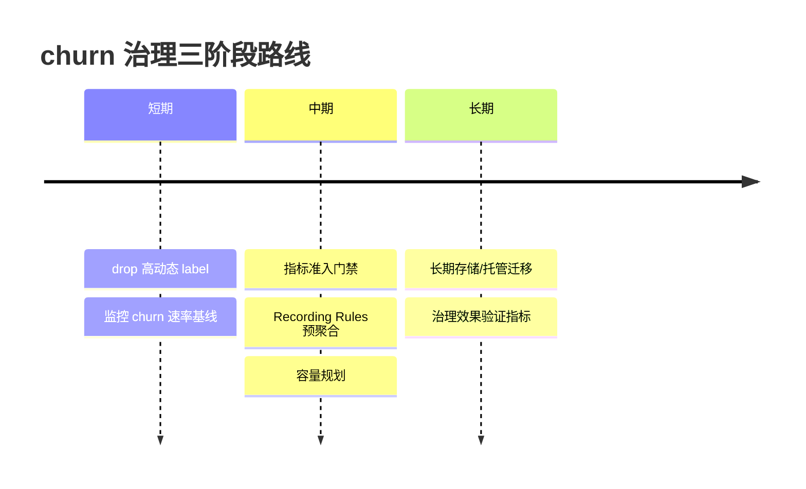

# Prometheus 高流失率：影响机理、系统治理与云厂商方案评估

## 摘要：核心结论先行

高流失率（churn rate，单位时间内 time series 新增与消亡的比率）不是样本量问题，而是把 Prometheus 监控推向不可持续的真正导火索。它通过时间序列基数的指数级膨胀，沿内存、查询、远程写、告警延迟逐级放大，最终演变为全链路监控雪崩。

**典型案例佐证其破坏力**：某微服务误将 `user_id` 设为标签，可在 7 分钟内使单服务维度从 200 暴增至 120,000，直接拖垮 VictoriaMetrics 集群[WEBKT 2026, "OpenTelemetry Collector 动态标签裁剪与熔断机制"](https://www.webkt.com/article/13600)；在一个 50 人工程组织中，基数贡献了可观测性账单的 50–70%，三年内月支出从 8,000 美元攀升至 90,000 美元[DEV Community 2026, "The $90k Observability Bill"](https://dev.to/muskan_8abedcc7e12/the-90k-observability-bill-why-your-cardinality-limit-is-the-one-knob-that-matters-4h43)。

**一个关键的反直觉结论**：与"缩短采集间隔会加剧 churn"的普遍主张相悖，实测表明 churn 由 Pod 创建/销毁速率决定——采集间隔从 15s 缩短至 5s 仅使样本数增加三倍，对 churn 毫无削减[SumGuy's Ramblings,「Prometheus Scrape Intervals」](https://sumguy.com/prometheus-scrape-intervals/)。

**本报告的最终结论如下**：

- **工程级治理（`metric_relabel_config` 的 labeldrop 与 recording rule）是零迁移、零成本的第一道防线，应优先落地。**
- **架构级方案中**，VictoriaMetrics 在内存效率上领先（峰值内存仅为 Prometheus 的 1/5.3），Grafana Mimir 以 O(1) 查询胜出，Thanos 以非侵入式 sidecar 取胜。
- **云厂商方案**依"自适应聚合成熟度"排序为 Grafana Cloud > 火山引擎 VMP > 阿里云/腾讯云托管 Prometheus。

报告核心命题：**Prometheus 高 churn rate 并非边缘运维细节，而是决定监控系统内存占用、查询延迟与长期成本的结构性变量。** 展望 2027 年，随着 Agent 时代可观测目标从 CPU/QPS 扩展至 token 消耗与上下文窗口占用[火山引擎 2026, "Agent 时代的可观测对象扩展"](https://developer.volcengine.com/articles/7633006078372315172)，基数治理将从"可选优化"转变为"准入门槛"。

## 1 概念辨析：高流失率到底是什么

治理须奠基于精确定义。Prometheus 语境下的高流失率，专指 TSDB 内部 time series 在单位时间内被频繁创建与淘汰的速率，绝非业务意义上的客户/用户流失。三个术语在工程现场常被混淆，但度量口径、压力路径与治理手段截然不同。

### 1.1 三个核心术语的辨析

| 概念轴线 | 视角 | 核心问题 | 主要可观测指标 | 主要压力路径 | 首要治理方向 |
|---|---|---|---|---|---|
| churn rate（序列流失率） | 速率（流量） | 每秒多少序列被创建/淘汰 | `rate(...head_series_created_total[5m])` | 内存 + 倒排索引 | 抑制序列身份翻新 |
| cardinality（基数） | 瞬时（存量） | 此刻多少条不同序列 | head block active series | 内存 + 倒排索引 | 降基数（削减标签维度） |
| 采样量 | 体积 | 每条序列上多少样本点 | 样本写入速率 | 磁盘 + 写入 I/O | 放宽 scrape 间隔/下采样 |

**churn 是流量，cardinality 是存量，采样量是体积——三者必须分开度量。** 一个系统即使瞬时 active series 只有十万量级，若每分钟数万条序列新陈代谢，它对 head block 与倒排索引的压力可能远高于一个百万量级但身份长期稳定的系统。

**最危险的误判是把 churn 当 cardinality 处理**：团队看到瞬时 active series 不高即误判系统健康，却放任序列翻新，让倒排索引与 WAL 持续累积，最终在 compaction 与查询期集中爆发为延迟飙升。

**churn 与 cardinality 会相互放大**：每条被创建的新序列在停止上报后不会立刻消失，要等 head block 切分、压缩与陈旧判定走完才被清理。在这段重叠窗口内，新旧序列同时存在，使瞬时 active series 被推高到高于"任一时刻真正在上报的目标数"的水平[OneUptime Blog, "How to Manage Short-Lived Metrics in Istio."](https://oneuptime.com/blog/post/2026-02-24-how-to-manage-short-lived-metrics-in-istio/view)。**因此 churn 与高 cardinality 不是非此即彼的两种故障，而是同一故障在时间与瞬时两个切面上的投影。**

### 1.2 churn 的两条来源：label churn 与 target churn

**label churn**：同一采集目标内部，某条 metric 因标签取值不断变化而持续派生新序列。`request_id`、`trace_id`、`session_id`、`user_id`、`pod_uid`、`container_id` 这类标签往往并非高基数，而是接近无上界——每次取值变化都创建一条全新序列[Juejin（掘金），"Prometheus 指标治理：无界 label 与 churn."](https://juejin.cn/post/7615224961281982527)。其特征是：采集目标数量稳定，但每个目标内部的序列集合不断翻新。

**target churn**：采集目标本身不断出现与消失。在 Kubernetes 中，target churn 与 Pod 生命周期紧密耦合——Pod 创建或删除时，服务发现会更新后端列表，可能出现新目标未及时发现、或仍在抓取已删除 Pod 的现象[RayByte，"Kubernetes 服务发现与 Pod 生命周期对监控目标的影响."](https://raybyte.cn/post/2026/5/12/919f683c)。

两者治理落点不同：**label churn 治在采集侧的标签裁剪与 relabeling；target churn 治在服务发现配置与架构层的承接组件。** 二者常叠加：一组短生命周期 Pod 若每个又携带 `request_id`，两条路径会在序列创建速率上相乘式放大。

### 1.3 高流失率的四类典型成因

| 成因类别 | 维度 | 典型来源 | 主要治理落点 |
|---|---|---|---|
| 动态标签 | label churn | request_id、trace_id、user_id、pod_uid 等无界标签 | 采集侧 relabeling drop[Juejin（掘金），"Prometheus 指标治理：无界 label 与 churn."](https://juejin.cn/post/7615224961281982527) |
| K8s 短生命周期 Pod | target churn | 扩缩容/滚动发布导致 Pod 频繁重建 | Recording Rules 预聚合到稳定维度[OneUptime Blog, "How to Manage Short-Lived Metrics in Istio."](https://oneuptime.com/blog/post/2026-02-24-how-to-manage-short-lived-metrics-in-istio/view) |
| 服务发现/临时任务 | target churn | 短任务按 job_id 唯一、SD 目标抖动 | Pushgateway/专门承接组件[DoIT Blog, "Monitoring Short-Lived Kubernetes Jobs at Scale."](https://www.doit.com/blog/monitoring-short-lived-kubernetes-jobs-at-scale) |
| Exporter 设计不当 | label churn（上游） | 缺乏统一标签命名/取值规范 | 埋点侧规范 + 组织级治理[Juejin（掘金），"Prometheus 指标治理：无界 label 与 churn."](https://juejin.cn/post/7615224961281982527) |

**动态标签**是最常见也最尖锐的一类。其危险在于隐蔽性与放大性：低流量下携带 `user_id` 的 metric 看似无害，一旦上量序列数随独立用户数线性甚至更快膨胀。这组无界标签所承载的信息（trace、用户 id）本质属于日志或链路追踪范畴，而非指标范畴；把它们误放进 label，相当于让时序数据库承担本应由 trace/log 系统承担的高基维度。正确处置不是"限制其基数"，而是直接排除在指标体系之外[Juejin（掘金），"Prometheus 指标治理：无界 label 与 churn."](https://juejin.cn/post/7615224961281982527)。

**Kubernetes 短生命周期 Pod** 与动态标签有一个关键差异：Pod 维度的指标本身常有监控价值，不能简单丢弃。这构成真实张力——既要监控每个 Pod，又要避免 `pod_uid` 高频翻新制造海量短命序列。常见解法是用 Recording Rules 把 `pod` 粒度上移到 `deployment` 或 `service` 粒度，在保留运维价值的同时降低翻新速率，代价是丢失单 Pod 细粒度可见性，需以服务级 SLO 弥补。

**Exporter 设计缺陷**是前三类的共同上游。一个没有统一标签规范的组织，会让高风险标签从多个来源各自渗入。**治理上存在"事后拦截 vs 事前规范"的根本权衡**：采集侧裁剪见效快但覆盖有限、需持续追加规则；埋点侧规范治本但落地周期长、依赖跨团队协同。合理解法不是二选一，而是用采集侧裁剪即时止血、用埋点规范长期收敛，两条路径在时间尺度上互补。

## 2 影响机理与因果链

高 churn 的破坏力不在任一单点，而在于它沿写入路径注入的压力会逐级传导到内存、查询与成本，形成一条放大链。

### 2.1 对 TSDB 写入路径的影响

Head block（TSDB 内存中尚未持久化的最新数据块）是所有写入压力的第一承压点。新采集样本先写入内存 memtable 并记录到 WAL，达到阈值后刷写为不可变 block，后台 compaction 再合并这些 block[作阳, Prometheus 3.4.0 源码分析](https://www.cnblogs.com/zuoyang/p/19046762)。

**Head block 膨胀的机制**：高 churn 下，head block 内需同时维护大量"刚出现但很快消亡"的 active series，其元数据增长速度由新增 series 的速率决定，而非瞬时存活的 series 总数决定。**关键差异**：即使两种负载在任一时刻的 active series 数相近，高 churn 负载的累计 series 总数（含已消亡但尚未被 GC 回收的 stale series）会显著更高——这意味着仅看 `prometheus_tsdb_head_series` 瞬时值会低估真实压力。

**WAL 写入放大与重放翻倍失真**：每条新 series 首次出现都会在 WAL 中写入一条 series 记录，于是"series 元数据写入"随 churn 速率线性增长。这一放大在重启重放阶段表现最极端：启动时 WAL replay 把 series 加载进内存，`prometheus_tsdb_head_series` 会迅速飙升到约为先前值的两倍，随后才回落到预期值[GitHub issue #13385](https://github.com/prometheus/prometheus/issues/13385)。**对高 churn 实例尤其危险**——若在重启窗口内读取 head_series 作为容量规划依据，会得到约两倍于真实值的失真读数。

**compaction 压力**：高 churn 提高了 compaction 必须处理的 series 翻新量，短命 series 落盘形成的 block 索引部分因包含大量唯一标签组合而更大，合并开销随之上升。社区 issue #13616 曾提案引入按 stale series 数触发的积极 compaction，从侧面反映默认定时 compaction 面对高 churn 翻新速率时不够及时[GitHub issue prometheus/prometheus #4115](https://github.com/prometheus/prometheus/issues/4115)。这意味着高 churn 实例的磁盘 I/O 压力呈现周期性尖峰而非平滑上升。

### 2.2 对内存、CPU 与磁盘 I/O 的影响

**内存账单由两部分构成**。其一是固定开销：Prometheus head block 中每条 active series 约占 3 KB 内存，每新增 10 万条未被回收的 series，head block 内存就增加约 300 MB[Systems Explained](https://systeminternals.dev/observability/cardinality/)。其二是倒排索引膨胀：无界标签（如 trace_id）的每一个新取值都会在倒排索引中新增条目，这些条目即使对应 series 已停止上报，在被 GC 回收前仍驻留内存[RayByte](https://raybyte.cn/post/2026/5/27/ddba2664)。

**"churn 内存能否自愈"是社区长期争议的核心**。理论上 `prometheus_tsdb_head_series` 由默认 2h 的 `storage.tsdb.min-block-duration` 控制，每两小时回收一次[GitHub issue prometheus/prometheus #4115](https://github.com/prometheus/prometheus/issues/4115)[阿里云可观测监控 Prometheus 版计费方式](https://www.alibabacloud.com/help/zh/prometheus/product-overview/billing-description/)。但 issue #12712 报告了反例："我们有持续不断新增标签取值的指标……这些 series 通常只存活几个小时"[GitHub issue prometheus/prometheus #12712](https://github.com/prometheus/prometheus/issues/12712)。

**这一争议的解法在于区分两种 churn 形态**：

- "一次性翻新后稳定"的 churn（如一次滚动发布）能被 2h GC 自愈；
- "持续不断翻新"的 churn（如持续注入 trace_id）无法自愈，因为翻新速率稳定高于回收所能追赶的上限。

**还有第二层滞后**：即使 head 在逻辑层完成回收，进程持有的物理内存也未必立即归还操作系统。Go 的每线程分配器缓存会在分配尖峰期保留内存[time2project.com 2026, "Why Go's Memory Management Isn't What the Documentation Claims."](https://time2project.com/why-gos-memory-management-isnt-what-the-documentation-claims/)；`debug.FreeOSMemory` 虽能强制归还，却过于重量级、无法对常规波动及时反应[Go Project 2019, "Proposal 30333 – Smarter Scavenging."](https://go.googlesource.com/proposal/+/show/aa701aae530695d32916b779e048a3e18311a2e3/design/30333-smarter-scavenging.md)。**因果链由此成形**：高 churn 抬升历史 active series 峰值 → 抬升堆分配峰值 → 触发 Go 分配器缓存滞留 → RSS 居高不下，即使 churn 回落后仍难以回收。这解释了为何"降基数"常常不能立即反映为内存下降。

### 2.3 对查询、告警与远程写入的影响

**这三条下游链路的退化都源于同一根因——series 翻新导致扫描集/缓存膨胀——且都表现出对横向扩展的抵抗性。**

**范围查询变慢**：同一条 PromQL 在高 churn 实例上会命中更多历史 series（含已消亡但仍在查询窗口内的 series），扫描集变大，P99 延迟退化[Volcengine Article](https://developer.volcengine.com/articles/7490493002389929996)。这一退化对"大范围 + 高选择性"查询尤其敏感——查询时间跨度越大，落入窗口的历史 churn series 越多。**单纯横向扩展查询层不能根治**，须结合降基数或预聚合从源头缩小扫描集。

**告警评估延迟**：告警规则依赖周期性 PromQL 求值，查询退化使每轮评估变慢，逼近或超过评估间隔时出现积压，告警触发与恢复随之延迟。**这正是用 Recording Rules 解耦告警评估与 churn 的动因**：预聚合把高频翻新的明细 series 汇聚为少量稳定的聚合 series，告警规则转而查询后者，评估扫描集与 churn 脱钩。

**remote write backlog 增大**：remote write 为 WAL 中每条 series 保留一份从 series ID 到标签集的缓存映射，高 series churn 会扩大这份缓存，抬高内存占用并导致队列积压[Prometheus Remote Write Tuning](https://prometheus.io/docs/practices/remote_write/)。一个反直觉的观测是：队列积压时，即使把分片数显著上调到 50 也几乎无法提升吞吐，最好情况只看到 650k samples/sec[GitHub Issue #17277](https://github.com/prometheus/prometheus/issues/17277)——**单纯增加 remote write 分片的边际收益急剧递减**，因为瓶颈已从本地分片转移到下游接收端处理能力。

### 2.4 终端后果：OOM 风险与成本激增

**OOM 是稳定性维度最严重的后果**。当 OpenTelemetry Prometheus receiver 为每条唯一 series 保留状态、旧 series 不被清理时，内存将无限增长[OneUptime Blog](https://oneuptime.com/blog/post/2026-02-06-troubleshoot-collector-memory-growth-prometheus-receiver/view)。这条链路具有自我放大性：OOM 后 Prometheus 重启，触发 WAL replay 使 head_series 翻倍[GitHub issue #13385](https://github.com/prometheus/prometheus/issues/13385)，重放期间瞬时内存甚至高于正常运行态，若容器内存 limit 不足以容纳翻倍峰值，就陷入"OOM → 重启 → 重放翻倍 → 再 OOM"的崩溃循环。**为高 churn 实例规划内存 limit 时，须以 WAL replay 峰值而非稳态 head_series 为基准。**

**成本激增的严重程度取决于计费口径**。阿里云标准版（90 天保留）在中国大陆为每 GB 0.062 美元、香港/海外 0.087 美元；旗舰版（180 天）大陆 0.093 美元、海外 0.13 美元[阿里云可观测监控 Prometheus 版计费方式](https://www.alibabacloud.com/help/zh/prometheus/product-overview/billing-description/)——当计费与存储量挂钩时，高 churn 产生的每条短命 series 即使只存活几小时仍贡献样本到账单。华为云 AOM 则采用不同计费边界：由 CCE 采集的基础容器指标免费，仅上报的自定义指标计费[Huawei Cloud AOM Billing Items](https://support.huaweicloud.com/intl/en-us/price-aom2/aom_07_0005.html)。**同样的 churn 水位在不同计费模型下的成本后果可能相差悬殊。**

## 3 诊断、量化与定位方法

churn 诊断不是单一指标读数，而是一条"速率视角发现 → 三级维度归因 → 基线对照守护"的闭环漏斗，且每一环都须显式处理重启翻倍失真。

### 3.1 关键诊断指标与 PromQL

衡量 churn 的核心抓手是 `prometheus_tsdb_head_series`（瞬时水位）与 `prometheus_tsdb_head_series_created_total`（累计翻新）这对互补视角。**后者的诊断价值不在绝对读数，而在它的一阶导数**：`rate(prometheus_tsdb_head_series_created_total[5m])` 给出每秒新增序列速率[Chenlujjj's Blog, "Prometheus 术语笔记."](https://chenlujjj.github.io/monitor/prometheus-term-note/)。

| 计算口径 | PromQL 示例 | 用途 |
|---|---|---|
| 单实例 churn rate | `rate(...head_series_created_total[5m])` | 实例级实时监控 |
| 集群总 churn rate | `sum(rate(...head_series_created_total[5m]))` | 全局水位 |
| 相对 churn rate | `rate(...head_series_created_total[5m]) / prometheus_tsdb_head_series` | 归一化、跨实例可比 |
| 长窗平滑 churn | `rate(...head_series_created_total[1h])` | 趋势基线、降抖动 |

**绝对 churn rate 跨实例缺乏可比性**：大实例每秒新增千条与小实例每秒新增千条，对内存的相对冲击截然不同。因此实践中常用**相对 churn rate**（速率除以瞬时基数），得到无量纲的翻新强度。

**对 `head_series_created_total` 求 rate 恰好规避重启翻倍失真**——rate 读取的是累计计数在窗口内的增量速率，而非瞬时水位[Chenlujjj's Blog, "Prometheus 术语笔记."](https://chenlujjj.github.io/monitor/prometheus-term-note/)。**因此构建 churn 诊断面板时，应以 `rate(...created_total)` 为速率主读数、以 `head_series` 为容量辅读数，并对后者叠加重启窗口过滤。**

**窗口选择存在固有张力**：短窗口（5m）灵敏但易误报，长窗口（1h）平滑但响应滞后。实务解法是分层——用 5m 窗口驱动实时告警，用 1h 窗口驱动容量趋势面板。

**采集侧辅助指标**提供从抓取目标视角归因 churn 的线索：`scrape_series_added` 给出单次抓取新出现的序列数，按 job 聚合其 rate 并取 `topk`，就能把翻新归因到具体抓取目标。这把"谁在引入新序列"的问题从 TSDB 侧前移到采集侧，避免对全量序列做昂贵的 `count by(__name__)` 聚合。需注意：若设置了 `sample_limit` 导致某次抓取被截断，`scrape_series_added` 读数将低估真实翻新量。

### 3.2 TSDB 分析工具

**在线端点 `/api/v1/status/tsdb`** 返回当前 head block 的 cardinality 快照，列出每 metric 的序列数、每个 label name 及其 distinct 取值数[Adding TSDB Stats Page in React UI PR #6281.](https://github.com/sylr/prometheus/commit/a85e7aac0e4b32bcc6fabbb6f4059842124bc05a)。**它的价值在于瞬时瓶颈快速定位，零成本、无需停机；局限是只有瞬时视角而无时间维度。**

**离线工具 `promtool tsdb analyze`** 逐 block 剖析已落盘数据，输出序列数、distinct label names 数、postings 条目总数[Robust Perception, "Using tsdb analyze to investigate churn and cardinality."](https://www.robustperception.io/using-tsdb-analyze-to-investigate-churn-and-cardinality)。典型输出可派生两个诊断启发式：`Series ÷ Postings unique` 反映 label 取值丰富度（比值越高暗示存在高基数 label）；`Postings entries ÷ Series` 反映平均每条序列携带的 label 对数。**它独特价值在于提供时间维归因——逐 block 对比可定位 churn 在哪个时段飙升；代价是需读取磁盘 block，宜对快照或副本运行并纳入定时离线任务。**

**三级归因漏斗**遵循"由轻到重、逐级收窄"：

| 归因层级 | 工具/指标 | 输出粒度 | 第一跳成本 |
|---|---|---|---|
| job 维度 | `topk(rate(scrape_series_added[5m]))` | 抓取目标 | 轻（采集侧计数） |
| metric 维度 | `/api/v1/status/tsdb` seriesCountByMetricName | metric 名 | 轻（在线端点） |
| label 维度 | `promtool tsdb analyze` / labelValueCountByLabelName | label name | 重（离线/磁盘） |

**这条漏斗归因出的高 churn label，正是下一步源头治理的输入清单**——诊断出的每个高基数 label，都对应一个具体的治理决策点。

### 3.3 可视化与持续监控

**核心面板是 active series 水位与 churn rate 趋势的并列呈现**：前者用 `prometheus_tsdb_head_series` 画水位曲线，后者用 `rate(...created_total[5m])` 画翻新速率曲线[Chenlujjj's Blog, "Prometheus 术语笔记."](https://chenlujjj.github.io/monitor/prometheus-term-note/)。两条曲线叠看，就能区分"总量在涨但翻新平稳"（稳态增长）与"总量平稳但翻新剧烈"（高 churn）两种状态。

**面板设计必须显式处理重启翻倍失真**：在 active series 面板上叠加进程启动时间的 annotation，把重启窗口标出，提示该窗口内的 head_series 尖峰属于 WAL replay 假象[GitHub issue #13385](https://github.com/prometheus/prometheus/issues/13385)。

**churn 告警规避误报有两条路径**：优先对速率视角的 `rate(...created_total[5m])` 设告警（不受 replay 污染）；对必须监控 head_series 的场景，叠加 `for` 持续时长条件过滤掉重启尖峰。告警分级建议双层——warning 对应相对 churn 持续偏高，critical 对应相对 churn 高且 head_series 逼近内存红线。

**容量基线的正确口径不是稳态 head_series，而是稳态水位叠加重启翻倍余量**——若只按稳态规划而不给翻倍留余量，重启瞬间的内存需求就可能触顶[GitHub issue #13385](https://github.com/prometheus/prometheus/issues/13385)。成本基线需区分自建与托管：托管下 churn 的成本敏感性高度依赖计费口径，若计费仅覆盖自定义指标（如华为云），则发生在基础指标上的 churn 不直接计费[Huawei Cloud AOM Billing Items](https://support.huaweicloud.com/intl/en-us/price-aom2/aom_07_0005.html)。

## 4 工程级治理方案（源头与采集层）

工程级治理是成本最低、收益最直接的一层，它把问题拦截在 series 形成之前或写入 TSDB 之前。三条动作在治理链上位置依次后移——设计治理在 series"不产生"层面工作，relabel 在"写入 WAL 前"剥离，预聚合在"查询展开"层面降负——互补而非替代。

### 4.1 指标与标签设计治理

**禁用高动态 label 是不可协商的红线**。Prometheus 官方明确禁止将用户 ID、邮件地址或其他无界数值集合作为 label，因为每个唯一标签值都会创建一条独立 series[Prometheus 中文文档,《指标和标签命名》](https://prometheus.ac.cn/docs/practices/naming/)。需区分两类：显式业务标识符（`user_id`、`order_id`、`request_id`、`email`）与隐式高基数维度（含动态参数的完整 URL 路径、含随机后缀的 `pod` 名、嵌入临时主机名的 `instance`）。设计层处置并非 drop，而是"不引入"——在埋点与指标评审阶段即拒绝写入 label。

**Histogram 桶爆炸是被低估的放大路径**。每个 histogram bucket 都创建一条独立 series，桶数过多（如超过 10 个）会成倍放大 series 数量[Quant67,「Metrics Architecture」](https://quant67.com/post/architecture/66-metrics-architecture/metrics-architecture.html)，与 label 维度叠加后产生乘法效应。现代化解法是**原生直方图（native histograms）**——它将"桶数与 label 基数的乘积膨胀"压缩为单条稀疏编码的 series，于 2022 年 v2.40.0 引入、v3.8 转为稳定[Prometheus Documentation,「Native Histograms」](https://prometheus.golang.com.tw/docs/specs/native_histograms/)。存量系统尚未升级时，把桶数从十余个收敛到 5–8 个关键分位附近是立竿见影的过渡手段。

**准入与审计机制**面向规模化：在 CI 中加入对新增 metric 的 label 命名规则匹配与 histogram 桶数阈值告警，使违规变更在合入前被拦截。审计核心产出为"高基数指标 Top-N"清单，清理动作分两路——无价值指标直接下线，有价值但维度过载的指标转入 relabel 剥离或预聚合降维。

**设计治理的现实定位是"长期纪律"而非"应急手段"**：它根治新增 cardinality，却无力快速削减存量峰值，后者必须依赖采集侧的即时 drop。

### 4.2 采集侧 relabel 与 drop 规则

**`metric_relabel_configs` 是采集侧降基数的主力武器**。对 `user_id` 这样的 label 使用 `action: labeldrop`，该 label 会在样本写入 WAL 之前被移除，根本不会贡献到 series churn[阿里云,《metric_relabel_configs 使用场景示例》](https://help.aliyun.com/zh/prometheus/developer-reference/examples-of-common-metric-relabel-configs-usage-scenarios)。**这是 relabel 路径相对设计治理的关键时序优势**——即便上游组件无法改造，采集端也能即时切断一条 cardinality 来源。

需区分两个阶段：`relabel_configs` 作用于抓取"之前"的 target 层面（改写 `__address__`、`job`、`instance`）；`metric_relabel_configs` 作用于抓取"之后、入库之前"的每条样本。剥离掉随 Pod 重建变化的高动态 label 后，原本"每个 Pod 一条新 series"的高 churn 模式会坍缩为"整个服务一条稳定 series"。代价是被丢弃的维度永久不可查询，因此 drop 前必须经审计确认无分析价值。

**scrape 间隔与 `sample_limit` 常被误用作 churn 治理手段，但二者均无能为力**：

- 实测显示，将抓取间隔由 15s 缩短至 5s，每分钟样本数增至三倍（从 20000 升至 60000），但这并不降低 series churn——churn 由 Pod 创建销毁频率决定，而非抓取频率[SumGuy's Ramblings,「Prometheus Scrape Intervals」](https://sumguy.com/prometheus-scrape-intervals/)。**scrape 间隔只影响每条 series 的采样密度，不影响 series 数量与流失速率，二者正交。**
- `sample_limit` 属于 per-scrape、per-target 的瞬时上限，能拒绝某次抓取超标，却完全无法感知跨多次抓取累积产生的 churn 总量[GitHub Issue prometheus/prometheus #17109](https://github.com/prometheus/prometheus/issues/17109)。一个 target 即便每次抓取均未超限，只要每次吐出的是"一批全新 series"，累积 churn 仍不受约束。issue #16427 还揭示其允许创建超出 limit 数量的 series[GitHub Issue prometheus/prometheus #16427](https://github.com/prometheus/prometheus/issues/16427)。

**这正是源头与采集层治理无法独立闭环的结构性原因**——要为累积 churn 总量封顶，需在采集层之外另设写入侧配额机制。

**target 与服务发现治理**沿两条主线展开："少发现"（用 `relabel_configs` 在 target 层 keep/drop，仅保留需监控的目标）与"稳标识"（将含随机后缀的 `pod` 名归一化为稳定的服务级标识）。其复杂度高于单纯 labeldrop，需对集群拓扑与 relabel 正则有整体设计，配置错误可能导致关键 target 被误丢、产生监控盲区。

### 4.3 Recording Rules 与预聚合

**Recording Rules 是查询期降负机制**。它按固定间隔评估计算成本高昂的 PromQL 表达式，将结果保存为专用 series；后续查询读取这条已聚合的 series，而非在大量原始 series 上重新计算[Prometheus 官方文档,《定义记录规则》](https://prometheus.ac.cn/docs/prometheus/latest/configuration/recording_rules/)。**其核心价值在于将"高基数原始 series 的实时聚合"从查询时刻前移至录制时刻，以一次预计算换取无数次廉价读取。**

需厘清能力边界：它降低的是"查询/评估期"的展开成本，**并不减少入库的原始 active series 数量**——原始高基数 series 仍按原样写入 TSDB。换言之，录制规则治标于查询负载，不治本于入库 cardinality。其维护负担在于规则集需随看板与告警演进同步更新，否则无人读取的"僵尸聚合 series"反而徒增 cardinality。

**降采样与保留周期**：原生 Prometheus 提供本地保留配置但不提供多分辨率自动降采样。需注意 series 的"逻辑消亡"与"物理回收"之间存在时间差。此外，由于 Go 运行时的内存归还行为[time2project.com 2026.](https://time2project.com/why-gos-memory-management-isnt-what-the-documentation-claims/)[Go Proposal 30333 2019.](https://go.googlesource.com/proposal/+/show/aa701aae530695d32916b779e048a3e18311a2e3/design/30333-smarter-scavenging.md)，即便清理大量 series，进程 RSS 的下降速度仍可能受制约——不能仅凭 series 数下降便推断内存即时回落。**真正的多分辨率自动降采样能力须依赖架构层的远程存储方案。**

**限额与准入控制存在原生缺口**：要为整个实例或租户的 active series 总量、churn 总量设置硬性上限，仅靠 scrape 配置无从实现。**这构成源头与采集层治理的能力天花板**——工程级动作能把 cardinality 与 churn 压低到合理区间，却无法提供一道"总量不可逾越"的硬护栏，该护栏只能由架构层的写入侧配额提供。

### 4.4 本章小结

| 治理动作 | 作用层次 | 治理效果 | 复杂度 | 关键局限 |
|---|---|---|---|---|
| 禁用高动态 label | series 产生前 | 根治（仅对新增） | 高 | 无法削减存量峰值 |
| 原生直方图/桶收敛 | series 产生前 | 根治（Histogram 类） | 中 | 存量需逐个迁移 |
| metric_relabel drop | 写 WAL 前 | 即时削减存量 | 低 | 维度永久不可查 |
| sample_limit | 单次抓取 | 弱（仅防爆） | 低 | 无法限累积 churn[GitHub Issue prometheus/prometheus #17109](https://github.com/prometheus/prometheus/issues/17109) |
| target/服务发现治理 | 抓取前 | 中 | 中高 | 误丢致盲区 |
| 录制规则 | 查询/评估期 | 治标（查询负载） | 低 | 不减入库总量 |
| 写入准入/配额 | 写入前（缺口） | 概念最强但原生缺失 | 待架构层 | 原生不具备[GitHub Issue prometheus/prometheus #16427](https://github.com/prometheus/prometheus/issues/16427) |

**源头治理能把问题压到"可控区间"，但存在一道无法靠自身闭合的能力天花板：为 churn 总量封顶的硬护栏只能由架构层提供。**

## 5 架构级扩展方案（分布式与长期存储）

架构方案不直接削减 churn 本身，而是将高 churn 引发的写入与查询压力从单台 Prometheus 分散至多实例、分布式存储与对象存储后端。

### 5.1 分片与联邦

**分片把 churn 压力横向分摊。** 功能分片按业务维度切分，边界清晰但负载可能不均；hashmod 分片对 `__address__` 哈希取模均匀散列，规避倾斜但查询侧需跨所有分片聚合。**分片的本质是分摊而非消除**：总 churn rate 不变，只是被均匀分配，使各实例的 head block 与倒排索引压力降至可承受范围。

**分层联邦在分片之上构建汇聚树。** Prometheus 的 federation 本质仍是 pull-based 抓取，不提供集群化、共享存储或自动分片[groundcover, "Prometheus Federation Explained."](https://www.groundcover.com/learn/observability/prometheus-federation)。其缓解 churn 的关键在于：上层只汇聚低基数聚合结果而非原始高基数 series——下层叶子实例就地运行 Recording Rules 预聚合，上层只联邦拉取预聚合后的低基数结果。**脱离 Recording Rules 的裸联邦只会把 churn 压力原样搬到上层。**

| 维度 | 功能/hashmod 分片 | 分层联邦 | Remote Write 全局存储 |
|---|---|---|---|
| 对 churn 的作用 | 分摊到多实例 | 上层免受冲击 | 卸载到后端 |
| 全局原始查询 | 需额外聚合层 | 不支持（仅聚合） | 支持 |
| 复杂度 | 中 | 中 | 高 |
| 适用规模 | 百万级 series | 多集群聚合视图 | 千万级及以上 |

分片联邦最适宜"源头治理已尽、单机已满、但尚未达到需要分布式存储规模"这一中间地带，但全局查询的天然局限决定了它们无法独立支撑超大规模与长期存储需求。

### 5.2 Remote Write 与三类长期存储后端

Remote Write 把存储从 Prometheus 进程解耦，让本地实例只承担短期采集，长期数据交由专门后端[阿里云开发者社区，"Prometheus 多实例数据统一管理与全局视图实现方案"。](https://developer.aliyun.com/article/1477990)。三类后端对应三种治理哲学：

**Thanos：无侵入卸载历史。** 通过 Sidecar 复用原生 TSDB，不重写存储层[CSDN，"Thanos、Cortex/Mimir 和 VictoriaMetrics 架构与理念异同"。](https://blog.csdn.net/qq_21383435/article/details/160636922)，接入成本最低——只需在每台 Prometheus 旁部署一个 Sidecar。Sidecar 上传数据块到对象存储，Store Gateway 提供历史查询，Compactor 负责压缩清理。**代价是查询性能**：Thanos 的全局查询复杂度为 O(N)，需遍历每个 Sidecar/Receive[颇忒脱的技术博客，"Prometheus 集群架构对比"。](https://chanjarster.github.io/post/prometheus/cluster-arch-compare/)，大规模下线性恶化。就 churn 而言 Thanos 是"间接缓解"——卸载历史、缩短本地保留，但本地实例的 head block 仍需承载全部实时 active series 写入。

**Cortex/Mimir：重构存储换多租户与 O(1) 查询。** Mimir 用一致性哈希把全局查询定位复杂度从 O(N) 压到 O(1)[颇忒脱的技术博客，"Prometheus 集群架构对比"。](https://chanjarster.github.io/post/prometheus/cluster-arch-compare/)，这是它相对 Thanos 的核心架构优势——集群扩大时查询定位成本保持恒定。多租户能力是另一项关键产出，能按租户隔离数据、配额与查询，当某租户高 churn 导致 series 暴涨时把影响隔离在该租户内。**代价是显著上升的运维复杂度**——多个微服务组件，部署调优心智负担远高于 Thanos。

**VictoriaMetrics：自研引擎在实时层压低内存。** 在高 churn 场景下其存储优势集中体现在内存占用：SSD 盘压测中 Prometheus 最大内存 14GB，是 VictoriaMetrics 2.6GB 的 5.3 倍[微信公众号，"Prometheus 压测后续:解密 HDD 磁盘下的性能瓶颈"。](https://mp.weixin.qq.com/s/hxN9638n1W2nTfVjXiSQpA)；另一对比中 VictoriaMetrics 最多用 1GB，而 Prometheus 内存持续攀升甚至被 OOM Killer 杀死[dbi Blog, "Prometheus vs VictoriaMetrics"。](https://www.dbi-services.com/blog/prometheus-vs-victoriametrics/)。**它是三类后端中唯一在实时采集阶段就显著减压的方案**——Thanos 卸载历史、Mimir 隔离租户，二者都不改变本地实时内存压力，而 VictoriaMetrics 以低内存引擎直接承接高 churn 写入。它还内建 `vm_new_timeseries_created_total` 指标直接度量 churn 速率，自带诊断能力。

### 5.3 存储后端选型对比

| 评估维度 | Thanos | Cortex/Mimir | VictoriaMetrics |
|---|---|---|---|
| 架构理念 | 无侵入 Sidecar[CSDN，"Thanos、Cortex/Mimir 和 VictoriaMetrics 架构与理念异同"。](https://blog.csdn.net/qq_21383435/article/details/160636922) | 重构存储多租户[CSDN，"Thanos、Cortex/Mimir 和 VictoriaMetrics 架构与理念异同"。](https://blog.csdn.net/qq_21383435/article/details/160636922) | 自研引擎极致压缩[CSDN，"Thanos、Cortex/Mimir 和 VictoriaMetrics 架构与理念异同"。](https://blog.csdn.net/qq_21383435/article/details/160636922) |
| 全局查询复杂度 | O(N)[颇忒脱的技术博客，"Prometheus 集群架构对比"。](https://chanjarster.github.io/post/prometheus/cluster-arch-compare/) | O(1) 一致性哈希[颇忒脱的技术博客，"Prometheus 集群架构对比"。](https://chanjarster.github.io/post/prometheus/cluster-arch-compare/) | 自研引擎内聚合 |
| 多租户能力 | 弱 | 强[CSDN，"Thanos、Cortex/Mimir 和 VictoriaMetrics 架构与理念异同"。](https://blog.csdn.net/qq_21383435/article/details/160636922) | 中（Enterprise 增强） |
| 内存/资源占用 | 继承 Prometheus | 多组件，中等 | 极低，约 1/5[微信公众号，"Prometheus 压测后续:解密 HDD 磁盘下的性能瓶颈"。](https://mp.weixin.qq.com/s/hxN9638n1W2nTfVjXiSQpA) |
| 实施复杂度 | 低 | 高 | 低-中 |
| 接入迁移负担 | 低[CSDN，"Thanos、Cortex/Mimir 和 VictoriaMetrics 架构与理念异同"。](https://blog.csdn.net/qq_21383435/article/details/160636922) | 高[CSDN，"Thanos、Cortex/Mimir 和 VictoriaMetrics 架构与理念异同"。](https://blog.csdn.net/qq_21383435/article/details/160636922) | 中（Remote Write）[阿里云开发者社区，"Prometheus 多实例数据统一管理与全局视图实现方案"。](https://developer.aliyun.com/article/1477990) |
| 对高 churn 缓解 | 间接（卸载历史） | 间接（租户隔离） | 直接（低内存承接）[dbi Blog, "Prometheus vs VictoriaMetrics"。](https://www.dbi-services.com/blog/prometheus-vs-victoriametrics/) |

**核心权衡**：接入成本与扩展性能在 Thanos 与 Mimir 之间呈反向关系——Thanos 接入成本最低但 O(N) 查询大规模下线性恶化，Mimir 高复杂度换来 O(1) 查询与多租户。VictoriaMetrics 不靠架构形态取胜，而靠自研引擎的极低内存占用，在高 churn 实时写入这一最痛场景下给出唯一的直接缓解。

**直接换后端 vs 先治理标签的路线之争**：快猫记录的 Zepto 案例提供量化背景——平均 800–900 万活跃序列，预测一年内增长到 6000 万[快猫星云 Flashcat，"Breaking the Metrics Ceiling: Zepto's Observability Evolution with Mimir"。](https://flashcat.cloud/blog/breaking-the-metrics-ceiling-zeptos-observability-evolution-with-mimir/)。**这场争论的本质是次序与配比，而非二选一**：纯"先换后端"会把未治理的高 churn 原样搬到新后端；纯"先治理"在近 7 倍增长预测面前杯水车薪。**路线选择高度依赖规模**——百万级以下、增长平缓的团队，源头治理往往以最低迁移负担解决问题；Zepto 这类面临 6000 万级增长的团队，存储后端替换从"可选优化"变为"生存必需"。

**迁移风险集中在两层**：迁移过程的数据连续性（建议双写并行、切流前用 `vm_new_timeseries_created_total` 对齐基线）；长期存储为压缩成本引入的准确性损失（降采样越激进成本越低但精度越损，解法是分层保留——近期原始分辨率、历史降采样）。迁移效果验证须包含 active series 计数、写入延迟与积压、关键 PromQL 结果一致性三项的逐项比对。

**架构方案与源头治理的关系不是替代而是接续**：源头治理削减总量，架构扩展承接削减后仍超单机的规模；二者的次序与配比由 active series 规模量级决定。

## 6 云厂商现有方案盘点

**核心判断**：就公开可查材料而言，主流云厂商普遍将 churn rate 并入高基数与用量计费叙事，真正将降基数作为一等能力暴露给用户的，是 Grafana Cloud 与 Chronosphere 这两家第三方方案。

### 6.1 海外云厂商

**AWS Amazon Managed Service for Prometheus（AMP）**：属云厂商原生托管 Prometheus 兼容服务，采集侧对齐 Remote Write 协议，使已有本地 Prometheus 能以较低改造成本外推。但公开材料未提供等价于 Google 的 PromQL 版本锚点，函数级兼容性需另行查证。无以"churn rate"命名的专项诊断面板——定位序列新增速率需基于 `scrape_series_added` 等开源指标自建视图。**就 churn 主动诊断而言，托管层更像承接了 churn 产生的写入洪峰，而非提供定位洪峰来源的工具。** 综合评级：托管形态给出"承接而非根治"的缓解，迁移成本低是正面得分，核心局限是缺少面向 churn rate 的独立诊断视角。

**Google Cloud Managed Service for Prometheus（GMP）**：三家海外方案中对兼容性边界给出最明确量化锚点的一家——其 PromQL 与 Prometheus 2.44 版相当，2.44 之后新增函数可能不受支持[Google Cloud Observability](https://docs.cloud.google.com/stackdriver/docs/managed-prometheus/promql-differences?hl=zh-cn)。**这一明码标出的兼容边界对评估迁移风险的团队更友好**：依赖较新 PromQL 函数的录制规则迁入前需逐条核对。其差异化价值在可扩展性的"无配额扩展"叙事，但核心局限仍是缺少独立 churn 诊断面板。

**Azure Monitor managed service for Prometheus**：架构上有明确公开事实——其指标时序库与 Azure Monitor Metrics 使用同一平台[Microsoft Azure 2023, "Introducing Azure Monitor managed service for Prometheus."](https://techcommunity.microsoft.com/blog/azureobservabilityblog/introducing-azure-monitor-managed-service-for-prometheus/3600185)，指标最长保留 18 个月[Overview of Azure Monitor with Prometheus](https://learn.microsoft.com/en-us/azure/azure-monitor/metrics/prometheus-metrics-overview)。**"复用既有平台"取向意味着 Prometheus 指标能与 Azure 既有指标纳入同一存储与查询平面**，降低双套系统的运维割裂。工作区切分被精确限定在主权云隔离场景[Best practices for scaling Azure Monitor Workspaces](https://learn.microsoft.com/en-us/azure/azure-monitor/metrics/azure-monitor-workspace-scaling-best-practice)，并非"单工作区规模过大就必须切分"的一般结论。差异化在可靠性与迁移负担——成熟平台叠加 18 个月长保留是正面得分。

### 6.2 国内云厂商

**阿里云 Prometheus/ARMS**：对兼容能力与计费口径都给出公开文档。支持自定义多维数据模型、HTTP API 与 PromQL 查询[阿里云可观测监控 Prometheus 版产品优势](https://help.aliyun.com/zh/prometheus/product-overview/benefits)——但用语是"支持 PromQL 查询"而非"完整 PromQL 兼容"，未给出版本锚点。计费在国内厂商中最透明之一：标准版 90 天每 GB 0.062（内地）/0.087（海外）美元，旗舰版 180 天 0.093/0.13 美元[阿里云可观测监控 Prometheus 版计费方式](https://www.alibabacloud.com/help/zh/prometheus/product-overview/billing-description/)。**按 GB 存储计费意味着 churn 制造的历史块体积直接体现在账单上，保留期越长、单价越高，高 churn 在长保留配置下边际成本更高。** 其差异化价值在计费透明度，而非 churn 治理能力本身。

**腾讯云 Prometheus 监控（TMP）**：本章证据集内最突出的事实是其按样本条数分档计费的完整价目表——15 天存储下，0~200 百万条/天为 0.19 美元/百万条，800~1500 百万条降至 0.06，1500 百万以上 0.05；30 天存储相应更高[腾讯云 Prometheus 监控服务](https://www.tencentcloud.com/zh/pdf/document/1116/43147)。**腾讯云把 churn 直接映射到"样本条数/天"这一计费维度，是"churn 被并入用量计费叙事"判断在国内厂商上最清晰的佐证**——降 churn 等价于降低每日样本量从而降低计费档位。其阶梯定价带来一个值得指出的张力：高 churn 抬高样本量本是负面，但样本量越大单价越低——解法是，阶梯价压低的是单价，总账单仍随样本量单调上升，因此降 churn 仍能降低绝对成本，只是边际节省率随量级递减。

**华为云 AOM**：提供完全托管且与开源 Prometheus 生态完全兼容的服务，内置开箱仪表盘[Huawei Cloud, "Prometheus Monitoring Overview," AOM User Guide.](https://support.huaweicloud.com/intl/en-us/my-kualalumpur-1-usermanual2-aom/mon_01_0083.html)。计费边界显式特殊：基础指标（如 CCE 容器指标）免费，仅上报的自定义指标计费[Huawei Cloud AOM Billing Items](https://support.huaweicloud.com/intl/en-us/price-aom2/aom_07_0005.html)。

## 7 方案选型权衡与量化评估

**重要声明**：本章所有维度分值、权重与 Tier 阈值均为作者基于产品事实所做的建模参数与主观评分，并非厂商官方基准。证据能直接支撑的仅是各方案的离散事实（如查询复杂度、计费维度、保留期），评分是在这些事实之上的分析性外推。

### 7.1 六维评估框架与量化指标

六个评估维度对应六项 rubric，将"哪个方案更好"分解为可独立判定的子问题，每个再绑定可观测指标：

| 评估维度（权重） | 主量化指标 | 对 churn 的敏感方向 |
|---|---|---|
| 治理效果（0.30） | series churn rate / active series | 直接正相关 |
| 成本（0.20） | 内存占用 / GB / 样本数 | churn 抬高内存与计费量 |
| 可扩展性（0.15） | samples/sec / label cardinality | 高 churn 推高吞吐需求 |
| 实施与运维复杂度（0.15） | 组件数 / 配置项数 | 间接 |
| 可靠性（0.10） | remote write backlog | churn 尖峰易触发限流积压 |
| 迁移与维护负担（0.10） | 人天 / 月度告警噪声 | 间接 |

**六维拆分的核心价值在于将彼此可替代性极低的约束分离开来，使任何一个维度的劣势都无法被另一个维度的优势在评分阶段悄然掩盖。** 例如实施复杂度与维护负担是两个常被混淆的维度——Thanos 的 sidecar 初次实施复杂度低于需重构存储的 Mimir，但随集群扩大其 O(N) 查询会逐年抬升日常排障的维护负担。

**一条非显性的决策逻辑链**：高 churn 推高 head block 内存与 remote write backlog 风险 → 放大自建方案的运维监控负担 → 运维负担累积侵蚀自建方案的成本压缩比优势。**换言之，churn 越高，自建方案"省钱"的账越容易被"费人"的账抵消**，这条从 churn 经运维负担传导至总拥有成本的链条，正是中型团队最易低估的隐性成本。据报道某企业一年为可观测性耗费 4.5 亿元[InfoQ，《一年为可观测性狂烧 4.5 亿》。](https://www.infoq.cn/article/Ozc6Cyi65spmUqFIiaLg)，根因往往正是缺少将成本绑定到 samples/sec 与内存这类可早期预警的量化指标。

### 7.2 方案 Tier 分级（作者主观评分模型）

加权评分模型权重设为：治理效果 0.25、可扩展性 0.20、可靠性 0.20、成本 0.15、复杂度 0.10、维护负担 0.10（反映"治理效果与稳定性优先于初次实施便利"的立场）。

| 方案 | S_final | Tier |
|---|---|---|
| Grafana Cloud (Mimir) | 8.36 | T0 |
| 阿里云 ARMS | 8.12 | T0 |
| AWS AMP | 7.92 | T1 |
| GMP | 7.85 | T1 |
| Azure Monitor Prometheus | 7.62 | T1 |
| 腾讯云 TMP | 7.61 | T1 |
| VictoriaMetrics（自建） | 7.55 | T1 |
| 火山引擎 VMP | 7.45 | T2 |
| 华为云 AOM | 7.39 | T2 |
| Cortex/Mimir（自建） | 7.39 | T2 |
| Thanos（自建） | 6.42 | T2 |

*Tier 阈值由作者设定：T0≥8.0、7.5≤T1<8.0、T2<7.5。GMP 与火山引擎 VMP 的产品细节未在证据覆盖范围内，分值系作者保守估计。Chronosphere 因缺乏可量化产品事实未纳入。*

**Grafana Cloud (Mimir) 与自建 Cortex/Mimir 的对比尤具启发**：二者底层共享同一查询引擎，却因托管形态使前者在实施复杂度（8.50 对 4.50）与维护负担（9.00 对 4.50）整体抬高。**这清晰揭示：在本权重体系下，是"托管 vs 自建"的形态差异，而非底层引擎差异，主导了 S_final 的高低。**

**Thanos 与 Cortex/Mimir 的同源对照**：由证据明确支撑的差异是 Thanos 无侵入复用原生 TSDB、Mimir 重构存储层[CSDN，"Thanos、Cortex/Mimir 和 VictoriaMetrics 架构与理念异同"。](https://blog.csdn.net/qq_21383435/article/details/160636922)；查询层 Thanos O(N) 遍历 vs Mimir O(1) 一致性哈希[颇忒脱的技术博客，"Prometheus 集群架构对比"。](https://chanjarster.github.io/post/prometheus/cluster-arch-compare/)。正是这一 O(N) 对 O(1) 差异使两者可扩展性分值拉开（6.50 对 8.80），进一步将 Thanos 压至全表末位——需重申，该差距与"末位"属模型输出，证据仅支持复杂度量级本身的差异。

### 7.3 敏感性分析

在 ±10pp 权重扰动下重算，全表大多数方案 Tier 保持稳定，跨档变动控制在 2~3 个以内。实质性跨 Tier 上行集中于两个边界案例：**成本权重上调时，VictoriaMetrics（成本评分全表最高，依据其自研引擎高压缩比[CSDN，"Thanos、Cortex/Mimir 和 VictoriaMetrics 架构与理念异同"。](https://blog.csdn.net/qq_21383435/article/details/160636922)）逼近并越过 T0；治理效果权重上调时，AWS AMP 短暂突破 8.0 进入 T0。**

**对变动最敏感的权重是维护负担**：每上调 10pp，自建方案普遍下挫、托管方案普遍上行，因为自建评分（4.50~5.50）系统性低于托管（8.00~9.00）。**由此推出一条前瞻判断**：随着 GitOps 与平台工程团队将"长期运维成本"权重逐年抬高，若维护负担权重从 0.10 升至 0.20，自建分布式方案 Tier 将整体下沉一档；预计到 2027 年，缺乏强自建运维团队的组织会进一步向托管服务倾斜。

### 7.4 场景化匹配

**全局 Tier 榜单预设了一个实际不存在的"平均团队"。真实决策始终受具体约束驱动。**

**中小团队：优先治理标签 + 托管服务。** 核心约束在人力而非技术上限。推荐路径分两步：第一步在采集侧用 relabeling 丢弃高基数无用标签（不改业务代码、不引入新组件，投入产出比最高）；第二步将长期保留交由托管服务。阿里云 ARMS 与 Grafana Cloud (Mimir) 在维护负担维度领先，正对应"把运维卸载出去"的首要诉求；阿里云还提供成熟三阶段迁移路径[阿里云，《自建 Prometheus 迁移全流程方案》。](https://help.aliyun.com/zh/prometheus/use-cases/migrate-self-built-open-source-prometheus-to-alibaba-cloud-managed-prometheus-service)。**关键裁决**：无论选哪个托管服务，写入侧的 relabeling 都不能省——托管缓解的是存储与查询运维，而非 churn 根因。

**大规模 K8s 集群：指标准入 + 分片 + 长期存储。** 需要纵深防线：第一道是写入侧指标准入（Cortex/Mimir 的多租户隔离为按租户施加配额提供基础[CSDN，"Thanos、Cortex/Mimir 和 VictoriaMetrics 架构与理念异同"。](https://blog.csdn.net/qq_21383435/article/details/160636922)）；第二道是查询架构选择（O(1) 与 O(N) 差异会成为日常排障体验的分水岭，active series 越高 O(N) 代价放大越严重[颇忒脱的技术博客，"Prometheus 集群架构对比"。](https://chanjarster.github.io/post/prometheus/cluster-arch-compare/)）；第三道是长期存储与降采样。**决定性变量不是单一方案，而是"准入+分片+长存"三层是否齐备**——缺了写入侧准入，再强的存储后端也只是把基数爆炸成本从查询侧转移至存储侧。预计到 2027 年，纯靠扩大存储后端而不在写入侧做准入的架构成本曲线将不可持续，指标准入将从"可选优化"演变为大规模平台的"准入门槛"。

**成本敏感场景：聚合 + 降采样。** 核心是利用聚合与降采样在保真度与账单间受控权衡，并将选型与计费维度精确对齐。**一个必须澄清的反直觉点**：在腾讯云样本阶梯计费下，单价随日均样本量增大而递减[腾讯云 Prometheus 监控服务](https://www.tencentcloud.com/zh/pdf/document/1116/43147)，因而降低样本总数虽减少计费总量，却可能使单位样本进入更高单价档位。**因此"聚合是否省钱"取决于底层是按样本阶梯计费还是按存储 GB 计费**——在按 GB 计费的阿里云模型下，聚合带来的存储减少可直接转化为账单下降[阿里云可观测监控 Prometheus 版计费方式](https://www.alibabacloud.com/help/zh/prometheus/product-overview/billing-description/)。降采样作用于历史区间，可采用"近精远疏"分层保留。需提醒：Azure 18 个月保留约为阿里云旗舰版 180 天的三倍[Overview of Azure Monitor with Prometheus](https://learn.microsoft.com/en-us/azure/azure-monitor/metrics/prometheus-metrics-overview)，同样的高 churn 序列会被持久化更久，因此选用长保留的成本敏感团队更应在写入侧先做好降基数与聚合。

**三类场景反复印证同一条主线：托管服务缓解的是运维与存储，而 churn 的根因始终要在写入侧治理，这一点跨场景不变。**

## 8 综合：耦合路径、成熟度分层与落地路线

### 8.1 影响与方案的耦合路径

**churn 的各根因并非线性叠加，而是彼此咬合、相互放大的反馈环。** 动态 label 是放大环的起点：`request_id`、`trace_id`、`user_id` 等接近无上界的标签每次取值变化都创建新序列[Juejin（掘金），"Prometheus 指标治理：无界 label 与 churn."](https://juejin.cn/post/7615224961281982527)，使 churn 与 cardinality 从两个观察维度变成互为因果的同一问题。其因果链为：无上界标签每次变化创建新序列 → cardinality 持续累积 → 膨胀倒排索引 → 拖慢所有依赖标签匹配的查询，从而把局部标签设计失误放大为全局查询退化与存储成本失控[DEV Community 2026, "Why Cardinality Explosion Is Always a Problem"](https://dev.to/merbayerp/why-cardinality-explosion-is-always-a-problem-512e)。

**LLM/Agent 场景把放大环推向临界。** 可观测对象已从 CPU/QPS 扩展到 Token 消耗、上下文窗口占用、队列深度，监控目标扩展到 LLM 调用路径、向量检索、Agent 应用[火山引擎 2026, "Agent 时代的可观测对象扩展"](https://developer.volcengine.com/articles/7633006078372315172)。一个典型两难现场：团队为防成本翻倍被迫剥离 `prompt_hash`，但被删掉的恰恰常是唯一能定位故障的维度——受损 prompt 会隐藏在被平滑掉的"始终失败"长尾里[天盘 2026, "LLM Telemetry Cardinality Crisis 与 APM 盲点"](https://tianpan.co/zh/blog/2026-04-28-llm-telemetry-cardinality-crisis-apm-blind-spots)。**核心矛盾是可观测性价值与成本都与 cardinality 正相关，二者无法同时最优；解法不是二选一，而是区分"应当保留的高价值维度"与"无上界噪声维度"**——前者通过预聚合保留可观测性，后者通过源头丢弃控制成本。

**两类方案作用于放大环的不同断点。** 工程治理（relabel/drop、采集端裁剪、预聚合）作用于前段（新增序列的产生）；架构扩展（分布式与长期存储）作用于后段（已产生序列的承载）。WEBKT 的 OpenTelemetry Collector 动态标签裁剪与熔断已稳定运行 14 个月、拦截 23 次潜在爆炸事故[WEBKT 2026, "OpenTelemetry Collector 动态标签裁剪与熔断机制"](https://www.webkt.com/article/13600)；火山引擎 VMP 则示范"采集端 + 存储端"两级聚合的前后段结合[AI 内参 2025, "火山引擎 VMP 查询预聚合策略"](https://www.neican.ai/insights/aiprometheus-20250912101005005-2/)。**前段治理决定进入系统的序列规模，后段架构决定系统能承载多大规模，二者呈相乘而非相加关系。**

**互补区与替代区的边界取决于业务自然增长曲线**：序列规模稳定时前段治理可独立解决，架构升级可延后；序列随业务持续增长时前段治理只能压平增速、无法消除增量，后段架构便从"可选"变为"必需"。WEBKT 拦截的是"爆炸事故"尖峰[WEBKT 2026, "OpenTelemetry Collector 动态标签裁剪与熔断机制"](https://www.webkt.com/article/13600)，而 DEV Community 记录的三年成本曲线（8000→90000 美元/月，cardinality 占 50%–70%[DEV Community 2026, "The $90k Observability Bill"](https://dev.to/muskan_8abedcc7e12/the-90k-observability-bill-why-your-cardinality-limit-is-the-one-knob-that-matters-4h43)）刻画的是"自然增长"长期累积，必须由成本可控的长期存储承接。

**累积维度缺乏原生限流，这一缺口塑造了所有可靠方案的形态。** issue #17109 指向引擎对累积 churn 缺乏内建限流。WEBKT 将治理实现在 Collector、VMP 将降基数放在采集端与存储端，**其共同点是治理逻辑都被前移至引擎之外**[WEBKT 2026, "OpenTelemetry Collector 动态标签裁剪与熔断机制"](https://www.webkt.com/article/13600)[AI 内参 2025, "火山引擎 VMP 查询预聚合策略"](https://www.neican.ai/insights/aiprometheus-20250912101005005-2/)。**当前现实判断是：团队的可行选择是采集层旁路，而非等待引擎补齐。**

**内存自愈争议受 Go 运行时约束。** Go 每线程分配器缓存在尖峰期保留内存不及时归还[time2project.com 2026, "Why Go's Memory Management Isn't What the Documentation Claims."](https://time2project.com/why-gos-memory-management-isnt-what-the-documentation-claims/)，`FreeOSMemory` 虽能强制归还却过重[Go Project 2019, "Proposal 30333 – Smarter Scavenging."](https://go.googlesource.com/proposal/+/show/aa701aae530695d32916b779e048a3e18311a2e3/design/30333-smarter-scavenging.md)，Drainability 框架进一步指出粗粒度非重定位分配器只有生命周期对齐时才有界保留[blackwell-systems 2026, "Drainability Framework," GitHub.](https://github.com/blackwell-systems/drainability-framework)。**因果链**：动态 label 制造序列尖峰 → 触发内存分配尖峰 → Go 缓存在尖峰后保留内存却未及时归还 → 强制归还又因过重无法常态化 → 使"churn 退去后内存仍居高不下"成为难以自动消解的状态。**因此对内存自愈不应抱"引擎自动收敛"预期，方案设计须将扩容与重启兜底作为既定约束。**

**统一的结构性判断**：churn 治理的本质，是在一条"动态 label → 高基数 → 内存 → 查询"的单调放大环上选择正确的断点下刀，而 Prometheus 的原生能力缺口决定了最有效的断点都在引擎之外。

### 8.2 方案成熟度分层

| 成熟度层 | 代表方案 | 关键约束 | 选型纪律 |
|---|---|---|---|
| 成熟 | relabel/drop[Juejin（掘金），"Prometheus 指标治理：无界 label 与 churn."](https://juejin.cn/post/7615224961281982527)、查询预聚合[AI 内参 2025, "火山引擎 VMP 查询预聚合策略"](https://www.neican.ai/insights/aiprometheus-20250912101005005-2/)、托管 Prometheus[Microsoft Azure 2023, "Introducing Azure Monitor managed service for Prometheus."](https://techcommunity.microsoft.com/blog/azureobservabilityblog/introducing-azure-monitor-managed-service-for-prometheus/3600185)[Huawei Cloud, "Prometheus Monitoring Overview," AOM User Guide.](https://support.huaweicloud.com/intl/en-us/my-kualalumpur-1-usermanual2-aom/mon_01_0083.html) | 丢弃存在误伤风险、不减少存储总量、厂商绑定 | 优先落地 |
| 部分成熟 | 自动 cardinality 治理[WEBKT 2026, "OpenTelemetry Collector 动态标签裁剪与熔断机制"](https://www.webkt.com/article/13600)、adaptive metrics[OpenTelemetry 2025, "Prometheus 资源属性处理三种方法"](https://opentelemetry.org.cn/blog/2025/ux-research-prometheus-otel/) | 阈值需调优、标准尚未普及 | 谨慎落地，配套运维 |
| 开放问题 | churn 原生限流（issue #17109）、head 内存自愈[time2project.com 2026, "Why Go's Memory Management Isn't What the Documentation Claims."](https://time2project.com/why-gos-memory-management-isnt-what-the-documentation-claims/)[Go Project 2019, "Proposal 30333 – Smarter Scavenging."](https://go.googlesource.com/proposal/+/show/aa701aae530695d32916b779e048a3e18311a2e3/design/30333-smarter-scavenging.md)[blackwell-systems 2026, "Drainability Framework," GitHub.](https://github.com/blackwell-systems/drainability-framework) | 引擎层无解 | 不纳入依赖 |

**成熟层**：relabel/drop 作用于放大环起点，成熟度最高，因丢弃哪些 label 可枚举、可审查、可回归测试，不依赖运行时动态判断[Juejin（掘金），"Prometheus 指标治理：无界 label 与 churn."](https://juejin.cn/post/7615224961281982527)；查询预聚合在不丢弃原始维度的前提下缓解查询退化，但不减少存储侧原始序列总量[AI 内参 2025, "火山引擎 VMP 查询预聚合策略"](https://www.neican.ai/insights/aiprometheus-20250912101005005-2/)；托管 Prometheus 以采购换工程，将扩展性、可靠性、长期存储让渡给厂商。

**部分成熟层**：自动 cardinality 治理的"自动"覆盖了执行（熔断超阈值自动触发）但未覆盖策略（什么该裁、阈值设多高仍需工程判断），WEBKT 14 个月稳定运行的前提正是持续的规则维护[WEBKT 2026, "OpenTelemetry Collector 动态标签裁剪与熔断机制"](https://www.webkt.com/article/13600)；adaptive metrics 的隔离机制成熟，但"自适应"决策逻辑仍在快速演进、缺乏跨厂商统一标准。

**开放问题层**：churn 原生限流在引擎层根本不存在，所有可靠限流均被前移至 Collector 或托管后端——**任何宣称"在 Prometheus 引擎内部解决累积 churn 限流"的方案都应被视为未经生产验证**；head 内存自愈受 Go 运行时与分配器结构层面约束[time2project.com 2026, "Why Go's Memory Management Isn't What the Documentation Claims."](https://time2project.com/why-gos-memory-management-isnt-what-the-documentation-claims/)[Go Project 2019, "Proposal 30333 – Smarter Scavenging."](https://go.googlesource.com/proposal/+/show/aa701aae530695d32916b779e048a3e18311a2e3/design/30333-smarter-scavenging.md)[blackwell-systems 2026, "Drainability Framework," GitHub.](https://github.com/blackwell-systems/drainability-framework)，并非配置调优所能解决。**选型纪律**：凡是依赖引擎原生累积限流或内存自愈的方案，都应被归入"开放问题"层而非"可落地"层。

### 8.3 分阶段落地推荐路线

| 阶段 | 核心动作 | 作用断点 | 验证指标 | 关键依赖 |
|---|---|---|---|---|
| 短期止血 | drop 无上界 label[Juejin（掘金），"Prometheus 指标治理：无界 label 与 churn."](https://juejin.cn/post/7615224961281982527) | 放大环起点 | churn 速率、active series 总量 | 区分噪声维度与诊断维度[天盘 2026, "LLM Telemetry Cardinality Crisis 与 APM 盲点"](https://tianpan.co/zh/blog/2026-04-28-llm-telemetry-cardinality-crisis-apm-blind-spots) |
| 中期治理 | 准入门禁 + Recording Rules + 容量规划[AI 内参 2025, "火山引擎 VMP 查询预聚合策略"](https://www.neican.ai/insights/aiprometheus-20250912101005005-2/) | 新增 + 查询 | 查询延迟、cardinality 占比 | 跨团队流程协作 |
| 长期架构 | 迁移长期存储/托管[Overview of Azure Monitor with Prometheus](https://learn.microsoft.com/en-us/azure/azure-monitor/metrics/prometheus-metrics-overview)[Huawei Cloud, "Prometheus Monitoring Overview," AOM User Guide.](https://support.huaweicloud.com/intl/en-us/my-kualalumpur-1-usermanual2-aom/mon_01_0083.html) | 内存 + 存储承载 | 成本、可观测性成熟度 | 必须在治理之后[Huawei Cloud AOM Billing Items](https://support.huaweicloud.com/intl/en-us/price-aom2/aom_07_0005.html) |

**短期止血**：第一动作是丢弃无上界 label（`request_id`、`trace_id`、`session_id`、`user_id`、`pod_uid`、`container_id`[Juejin（掘金），"Prometheus 指标治理：无界 label 与 churn."](https://juejin.cn/post/7615224961281982527)），以最小工程改动切断放大环起点。**必须设置安全护栏**——丢弃对象限于"接近无上界且无诊断价值"的 label，对"高基但有诊断价值"的维度（租户、错误类型）应改用预聚合而非直接丢弃[天盘 2026, "LLM Telemetry Cardinality Crisis 与 APM 盲点"](https://tianpan.co/zh/blog/2026-04-28-llm-telemetry-cardinality-crisis-apm-blind-spots)。区分标准很简单：该维度取值空间是否有业务上的天然上界。同时建立 churn 速率基线监控，否则无法判断丢弃是否生效。

**中期治理**：用 Recording Rules 系统化地把高基数原始序列预聚合为低基数派生序列[AI 内参 2025, "火山引擎 VMP 查询预聚合策略"](https://www.neican.ai/insights/aiprometheus-20250912101005005-2/)——为短期被保留的"高基但有诊断价值"维度提供低成本查询路径。三者构成递进：丢弃处理无上界噪声，准入处理新增维度，预聚合处理保留维度的查询成本。同时建立容量与成本基线，把"被动应对增长"变为"主动规划容量"——为 active series 总量设定季度预算，超预算即触发治理评审，这个触发条件正是连接中期与长期阶段的枢纽。

**长期架构**：迁移到长期存储或托管 Prometheus，承接前两阶段压不住的自然增长[Overview of Azure Monitor with Prometheus](https://learn.microsoft.com/en-us/azure/azure-monitor/metrics/prometheus-metrics-overview)[Huawei Cloud, "Prometheus Monitoring Overview," AOM User Guide.](https://support.huaweicloud.com/intl/en-us/my-kualalumpur-1-usermanual2-aom/mon_01_0083.html)。**迁移有两类风险必须显式管理**：隔离与合规边界（跨云迁移需预先规划 workspace 拓扑[Best practices for scaling Azure Monitor Workspaces](https://learn.microsoft.com/en-us/azure/azure-monitor/metrics/azure-monitor-workspace-scaling-best-practice)）；计费风险（华为云 AOM 仅自定义指标收费[Huawei Cloud AOM Billing Items](https://support.huaweicloud.com/intl/en-us/price-aom2/aom_07_0005.html)，迁移前若未做好 label 丢弃与预聚合，把未治理的高基数自定义指标整体迁入，会把"序列爆炸"直接转化为"账单爆炸"）。**这是长期迁移与前两阶段之间最关键的依赖：迁移必须在治理之后，而非之前。** 量化判据：迁移成本主要由治理后的自定义指标 cardinality 决定，因此前两阶段每降低一个数量级的 cardinality，长期托管成本就对应下降一个数量级。

**治理效果验证须闭环于四项指标**：active series 总量（治理效果）、churn 速率（起点是否压住）、查询延迟（放大环末端是否缓解）、可观测性成本（cardinality 占比是否下降）。这四项分别对应放大环的四个断点。**只有当四项指标同步改善，才能确认放大环的四个断点都被有效封堵。**

**最终结论**：高流失率有系统的解决方案，但它不是单一银弹，而是一条按断点下刀、按成熟度排序、按依赖关系定序的递进路线。两条铁律是：**迁移必须在治理之后**（否则序列爆炸变账单爆炸），以及**效果必须用 active series、churn、查询延迟、成本四项指标闭环验证**。

## 9 局限性与未来研究方向

本报告的结论是有边界的推荐，而非无条件的定论。其证据基础在三个维度存在系统性约束。

### 9.1 数据粒度与证据局限

**churn 内存自愈争议缺乏统一基准测试。** "内存能否自动回收、多久回收"这一争议，本报告所收集的证据中没有一套面向 Prometheus TSDB 的统一基准测试可供引用——现有证据仅提供分配器层面的类比性支撑（Go 每线程缓存行为[time2project.com 2026, "Why Go's Memory Management Isn't What the Documentation Claims."](https://time2project.com/why-gos-memory-management-isnt-what-the-documentation-claims/)、Go 提案 30333[Go Project 2019, "Proposal 30333 – Smarter Scavenging."](https://go.googlesource.com/proposal/+/show/aa701aae530695d32916b779e048a3e18311a2e3/design/30333-smarter-scavenging.md)）。**这意味着第 2 章关于 OOM 风险的因果判断在定性方向上有佐证，但在定量阈值上仍属工程经验而非基准实测。** 这是值得投入的基准测试方向：固定 active series 数、系统性变化 churn rate、观测 RSS 与归还延迟曲线，能把"内存自愈"从争议变为可复现的工程事实。

**云厂商内部机制不透明导致评估依赖公开文档。** 托管方案的内部降基数实现不公开，且文档详略在厂商之间差异很大——Azure 披露平台与保留期[Microsoft Azure 2023, "Introducing Azure Monitor managed service for Prometheus."](https://techcommunity.microsoft.com/blog/azureobservabilityblog/introducing-azure-monitor-managed-service-for-prometheus/3600185)[Overview of Azure Monitor with Prometheus](https://learn.microsoft.com/en-us/azure/azure-monitor/metrics/prometheus-metrics-overview)但未覆盖倒排索引膨胀的处理细节，火山引擎 VMP 披露了较具体的两级聚合机制[AI 内参 2025, "火山引擎 VMP 查询预聚合策略"](https://www.neican.ai/insights/aiprometheus-20250912101005005-2/)。**各厂商披露粒度的不对等可能使评级相对排序受披露详略影响，而非纯粹反映实际能力差距。** 与之对照，VictoriaMetrics、Thanos、Cortex/Mimir 以开源形式发布，机制判断可验证性更高。**因此本报告对托管方案的评级应被理解为"基于已披露能力的下限估计"。**

### 9.2 范围与时效局限

**聚焦 Prometheus 生态，未覆盖全部商业 APM。** 本报告系统性排除了 Datadog、New Relic、Dynatrace 等专有数据模型的商业 APM。**本报告的推荐路线仅在"已决定留在 Prometheus 生态"这一前提下成立**；跨生态 TCO 对比需另一份把商业 APM 纳入同一矩阵的研究。

**云厂商产品迭代快，能力对比有时效性。** 阿里云仅 2024 年 7 月就新增多项接入功能[阿里云文档（2024），《Prometheus 产品概述·功能更新记录》。](https://www.alibabacloud.com/help/zh/prometheus/product-overview/2024)，火山引擎 2025–2026 年持续发布 AI 可观测能力[火山引擎 2025, "http_request_total 基数算例"](https://developer.volcengine.com/articles/7487815638971318326)。**本报告第 6、7 章的相对排序在 2026 年之后某个时点可能不再成立**，且托管方案的时效风险高于可追踪发布记录的开源方案。

### 9.3 案例代表性与可证伪点

**案例代表性偏差**：本报告引用的治理案例（快猫、Zepto、WEBKT 等）系统性偏向"有能力公开分享经验的中大规模团队"，大量未发声的中小团队的真实处境不在样本之内。**因此本报告"源头治理可行"的乐观判断，可能高估了缺乏专职运维团队的小团队的落地难度。**

**可证伪点①："托管方案必然降本"存在明确反例条件。** 第一类反例来自计费结构：华为云 AOM 对基础指标免费但自定义指标按量计费[Huawei Cloud AOM Billing Items](https://support.huaweicloud.com/intl/en-us/price-aom2/aom_07_0005.html)，当高 churn 负载主要由自定义指标构成时，托管按量计费反而可能高于自建固定成本。第二类反例来自隔离要求放大固定开销（主权云强制多 workspace 拆分[Best practices for scaling Azure Monitor Workspaces](https://learn.microsoft.com/en-us/azure/azure-monitor/metrics/azure-monitor-workspace-scaling-best-practice)）。**正确表述应是"托管方案在中小规模、以基础指标为主的场景下通常具备降本潜力"，而非无条件"必然降本"。**

**可证伪点②："先治理标签优于替换存储"在超大规模下存在失效边界。** 其失效机理：active series 规模极大时源头治理主要依赖聚合，而过度预聚合会丢失原始维度 → 下游告警规则失去区分能力 → 真实故障时无法定位根因。相邻领域有量化佐证可类比（Lost in Compaction 记录"关键词存活 82–93% 但 LLM 召回仅 0–7%"[profff 2026, "Lost in Compaction," GitHub.](https://github.com/profff/lost-in-compaction)；Facts as First-Class Objects 记录"级联 compaction 侵蚀 54% 项目约束而模型仍完全自信"["Facts as First-Class Objects," arXiv:2603.17781 2026.](https://www.arxiv.org/pdf/2603.17781)）——**需指出这是跨领域类比风险，而非监控预聚合导致告警失效的直接实测证据。** 缓解方向是对确有诊断价值的维度保留原始粒度，仅对确认无价值的维度聚合。随着 AI Agent 渗透率上升，这类高 churn、短时高基数负载会更频繁出现，使"降基数 vs 保语义"的取舍更具现实意义。

### 9.4 结论可靠性梯度与未来方向

**本报告三类核心结论的证据强度呈明显梯度，读者应赋予不同的怀疑权重**：

| 结论类型 | 证据强度 | 采纳建议 |
|---|---|---|
| "源头治理优先"工程原则 | 较硬（WEBKT 14 个月、23 次拦截等案例支撑） | 可较放心采纳 |
| "托管降本"经济结论 | 条件性最强（依赖计费结构与规模前提） | 需核对自身计费与规模 |
| "厂商能力排序" | 时效性最脆（内部不透明且迭代迅速） | 需核对最新文档 |

**未来研究的三个具体缺口**：其一，构建 Prometheus TSDB 专项 churn 内存基准，把 OOM 因果链从定性推进到定量；其二，把商业 APM 纳入同一 TCO 矩阵，回答跨生态选型问题；其三，针对 Agent 类负载专门研究"降基数 vs 保语义"权衡。这三个方向共同指向同一目标：把本报告中证据最弱的环节逐一转化为可实测、可外推的工程结论。

**核心 takeaway：本报告给出了一条在当前证据下最可辩护的路线，同时诚实标定了这条路线会在哪些具体条件下失效，使读者能在自身场景中判断它是否仍然成立。**

## References
