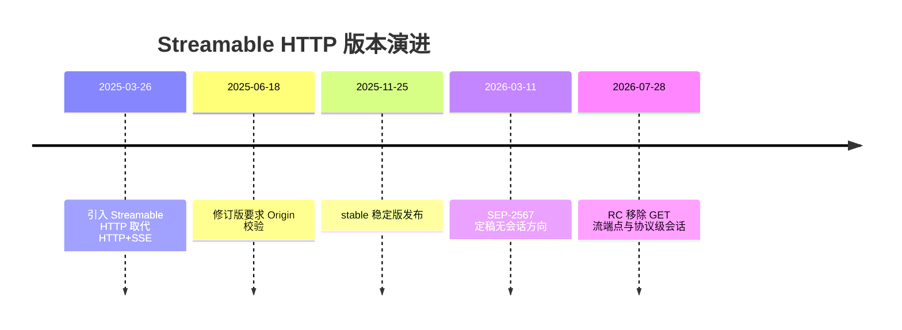
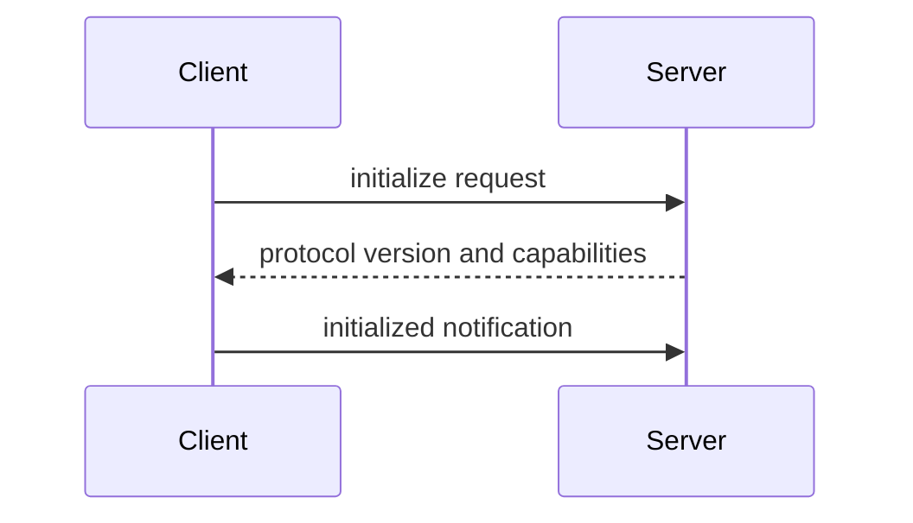
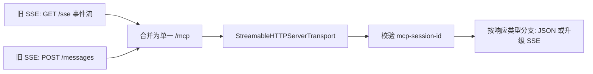

# Anthropic MCP Streamable HTTP 传输的工程实现方案

## 摘要

Streamable HTTP 以单一 `/mcp` 端点替代了旧有 HTTP+SSE 的双端点模型，并把"是否升级为流"的决策交由服务端在逐请求协商中完成——这正是 2025-03-26 规范修订的核心工程动机。其量化收益已被腾讯云、Umayun 与 Higress 实测验证：在 1000 并发用户场景下，旧 SSE 需维持逾 1000 条 TCP 长连接，延迟从 18ms 非线性劣化至 1.5s；而 Streamable HTTP 仅需数十条连接，相同负载下的执行时间被压缩至约四分之一。

值得注意的是一个反向信号：2026-03-11 定稿的 SEP-2567 与 2026-05-21 发布的 2026-07-28 RC 移除了 GET 流端点与协议级会话，改用服务端铸造的显式状态句柄，走向无会话 MCP。这说明 `Mcp-Session-Id` 机制本身已被官方判定为扩展性负债而非资产。

本报告以官方 TypeScript 与 Python SDK 源码为锚，贯通协议机制、部署运维直至 2026 年的去会话化演进。**核心主张是：Streamable HTTP 的工程可靠性，由会话标识头的校验与可选事件存储这两条在 SDK 调用链中可观测的路径共同支撑。**

---

## 1 研究框架与方法论

### 1.1 版本基准与排除范围

本报告以 **2025-11-25 stable 版本为主基准**，同时把 2025-03-26（引入期）、2025-06-18 与 2026-07-28 RC 作为对照点。这一选择有直接证据支撑：据 googleapis/mcp-toolbox 的 issue 记录，2025-06-18 与 2025-11-25 两版规范均要求服务端对所有入站 Streamable HTTP 连接校验 Origin 头，以防御 DNS 重绑定攻击。就 Origin 校验而言两版一致，因而可把较晚的 stable 版当作主基准。**对 2026-07-28 RC 的处理策略，是把它当作潜在破坏性变更的观察窗口，而非主基准。**

研究范围限于 **MCP 在 HTTP 传输之上叠加的特定语义**——会话标识头、可选事件存储、JSON-RPC 消息处理——而非通用 HTTP 流式技术本身。在 SDK 层面这种叠加语义可观测：TypeScript SDK 的 `WebStandardStreamableHTTPServerTransport` 会提取并校验 `mcp-session-id` 头、可选地经 EventStore 存储消息、并写回 JSONRPCMessage 或 SSE 事件。

明确排除三类对象：WebSocket 通用方案（仅作传输选型层面定性对照）、非 MCP 的通用 HTTP 流式与裸 SSE（属底层构件）、以及 Anthropic 的其他产品能力。

一个常见误解需澄清：把 Streamable HTTP 等同于"带 SSE 的 HTTP"会抹掉其工程价值。从 Python SDK 调用链可见，客户端**只在服务端响应头包含 `text/event-stream` 时才转入 SSE 迭代处理**，即 SSE 只是响应模态之一，而非传输的全部。

### 1.2 六维评估 Rubric 与成熟度评级

本报告设定六个评估维度并按对"可靠落地"的影响分配权重：

| 维度 | 权重 | 说明 |
|---|---|---|
| 协议正确性 | 0.22 | "能不能用"的底线 |
| 会话可靠性 | 0.20 | "能不能用"的底线 |
| 可恢复性（续传） | 0.16 | 断点续传能力 |
| 安全 | 0.18 | Origin 校验为规范强制项 |
| 可部署性与运维 | 0.14 | 上线运行约束 |
| 迁移成本 | 0.10 | 一次性投入 |

协议正确性与会话可靠性合计占 0.42，是底线；安全占 0.18，因为 Origin 校验是规范强制项；迁移成本仅占 0.10，因为它是一次性投入而非持续运行期约束。

成熟度采用**三档评级**：当一个维度同时有明文规范要求与 SDK 调用链证据佐证时评为"成熟"；只有单侧证据时评为"部分"；规范留白且实现各异时评为"开放"。

以 Origin 校验为例：2025-06-18 与 2025-11-25 规范均明文要求服务端校验，而 cpp-mcp-sdk 文档显示启用校验后非法 Origin 得到 HTTP 403、缺失 Origin 头的请求默认被接受。**因此"Origin 校验的存在性"评为成熟，"缺失头处置"因规范未统一明言、实现默认放行，评为开放。**

### 1.3 术语统一与证据锚定原则

本报告固定以 **`/mcp`** 指称承载 JSON-RPC 消息的单一 HTTP 端点。核心术语一次性定义如下：

- **Mcp-Session-Id**：以 HTTP 头承载的 MCP 会话标识；缺失或非法的 ID 将被以 400/404 拒绝。
- **EventStore / resumability**：由可选 EventStore 存储步骤支撑的可恢复能力。
- **Accept 协商**：客户端声明可接受响应类型、服务端据此返回 JSON 或 SSE 流。
- **Stateless / Stateful Server**：服务端是否在请求之间保留会话状态。

本报告的证据由两类锚定：一类是**明文规范要求**（如 Origin 校验的强制性），另一类是 **SDK 调用链**（如会话头校验与可选 EventStore 存储步骤）。凡提出"设计动因""因果催生"这类判断，均标注为作者分析；凡提出"规范要求""SDK 实现"，均有对应证据佐证。

这一原则带来一个张力：**SDK 证据能证明"某步骤存在"，却不能独立证明"该步骤为何存在"**。例如调用链显示存在可选 EventStore 存储，但"它是为断连续传而设"属于需由设计文档佐证的解读。本报告的处理是把"步骤存在"记为证据事实、把"步骤用途"记为分析主张，二者显式分离。

---

## 2 设计动机与版本演进

### 2.1 旧 HTTP+SSE 传输的工程局限

旧版传输把一次逻辑会话拆成两个物理端点：一个 GET 端点维持 SSE 长连接用于服务端推送，一个独立 POST 端点用于客户端发送消息。这种结构在集群与无服务器环境下问题接踵而至。

**双端点的核心负担在于：客户端必须同时维护两条逻辑关联但物理独立的连接，而基础设施层却无法感知二者属于同一会话。** 据 Toolradar 分析，旧 SSE 传输对负载均衡器、无服务器函数和防火墙都造成困难，根源正在双端点结构。负载均衡器若采用普通轮询，POST 请求很可能被路由到与 GET 长连接不同的后端实例，于是服务端响应无处可发。要修复这一点，运维必须在网关层引入会话亲和性（sticky session），这本身就是额外的部署复杂度。

第二重局限是 **GET 长连接的资源占用模型与无服务器/弹性集群的计费模型根本冲突**。据腾讯云测试，1000 并发用户下旧 SSE 需维持上千个并发 TCP 连接，而同等负载下 Streamable HTTP 仅需数十个连接——约两个数量级的差距。在 AWS Lambda 等函数计算平台，单次执行有最长运行时限与连接保持限制，一条需持续数分钟的 GET 长连接无法在"按请求计费、随时回收"的模型里存活。

关于断线恢复：旧 SSE 长连接一旦中断，客户端必须重新建立 GET 连接。**Streamable HTTP 引入的 EventStore / resumability 机制正是为补齐这一缺口而设计的可选能力**，它通过事件 ID 让重连得以从断点续接。这说明可恢复性是新传输相对旧传输的增量能力，而非被改进的旧特性。

### 2.2 Streamable HTTP 的核心问题链

旧方案的局限一旦摊开，Streamable HTTP 的设计目标就清晰了：**用单端点收敛通信、用可选 SSE 让简单请求退化为普通 HTTP。**

单端点的工程价值可展开为因果链：旧双端点要求基础设施识别并维系 GET 与 POST 的会话归属，这导致负载均衡器必须配置会话亲和性、防火墙必须放行两类不同语义的连接、无服务器平台必须为长连接破例；单端点把通信收敛到同一 URL 路径后，负载均衡器面对的就是一组到同一路径的请求，**从而把适配成本从"需要会话亲和性"降到"普通 HTTP 反向代理即可"**。

需要辨析的是，单端点并不等于无会话。2025-11-25 stable 阶段的单端点方案仍使用 `Mcp-Session-Id` 维系状态，单端点解决的是"双端点配对"的基础设施难题，而非"彻底无状态"——后者要到 2026-07-28 RC 移除协议级会话后才实现。

可选 SSE 的工程收益体现在代理与 CDN 友好性上：普通 HTTP 请求-响应是反向代理、API 网关、CDN 边缘节点最熟悉的流量形态；一旦请求退化为这种形态，它就能复用现有基础设施的全部能力。这与旧方案"无论交互复杂度一律走长连接"形成鲜明对照。其解决之道在于响应协商——把"是否流式"从连接级属性降格为请求级属性。

### 2.3 为什么不选 WebSocket

MCP 明确没有把 WebSocket 纳入标准传输。据官方规范，协议当前只定义 stdio 和 Streamable HTTP 两种标准传输，以保持协议简单、避免 WebSocket 升级握手的复杂度。

WebSocket 的代价首先在于它脱离了标准 HTTP 请求-响应语义：握手成功后连接进入一种 HTTP 中间件大多不理解的帧协议状态，迫使部署方在帧协议层重新实现网关、缓存、鉴权能力。相比之下，Streamable HTTP 即使升级为 SSE，其底层仍是一条 HTTP 响应流，对中间件而言仍是"一个长一点的 HTTP 响应"。

就鉴权而言，Streamable HTTP 复用 HTTP 头承载凭证，OAuth 2.1 授权流可直接套用，并按 RFC 9728 发布受保护资源元数据；若改用 WebSocket，握手后的帧通道如何承载与刷新凭证就需另行设计。

| 维度 | 旧 HTTP+SSE | WebSocket | Streamable HTTP |
|---|---|---|---|
| 端点结构 | 双端点 | 单连接（Upgrade 后） | 单端点 /mcp |
| 底层协议 | HTTP（GET 长连接） | 帧协议（非 HTTP） | HTTP（可选 SSE） |
| 1000 并发连接数 | 上千 | 每会话一条长连接 | 数十 |
| 中间件兼容 | 部分（需会话亲和） | 弱 | 强（标准 HTTP） |
| 鉴权复用 | HTTP 头可用 | 需帧层重建 | OAuth 2.1 直接套用 |
| 无服务器适配 | 差 | 差 | 优 |

HTTP 语义复用的代价是单向流式的天然适配性弱于 WebSocket 的全双工。这构成一个真实取舍：MCP 用"失去原生全双工"换取"无缝复用 HTTP 生态"。这一取舍根植于 MCP 的工作负载特征——工具调用本质上是"客户端发起、服务端响应"的请求-响应型交互，全双工对称性对它并非刚需。

### 2.4 版本演进与破坏性变更



| 版本节点 | 性质 | 关键变更 | 来源可信度 |
|---|---|---|---|
| 2025-03-26 | 引入 | 以 Streamable HTTP 取代 HTTP+SSE | 官方 changelog（高） |
| 2025-06-18 | 修订 | 要求 Origin 头校验防 DNS 重绑定 | 官方规范+Issue（高/中） |
| 2025-11-25 | stable | 修订版稳定发布，生产基线 | 官方 Release（高） |
| 2026-07-28 RC | 破坏性 | 移除 GET 流端点与协议级会话 | 官方博客+社区（高/中） |

**对实现选型而言，最稳妥的生产基线是 2025-11-25 stable，而 2026-07-28 RC 应作为前瞻规划纳入，但因其仍为候选状态，落地前需评估破坏性变更的稳定性。**

2026-07-28 RC 的两项移除——GET 流端点与协议级会话——共同方向是让 MCP 彻底无状态。会话移除背后是 SEP-2567 提案：以显式的、服务端铸造的状态句柄替换隐式的会话作用域状态，并移除 `Mcp-Session-Id` 头。这一变更对实现方案是结构性冲击：此前 SDK 依赖提取并校验 `mcp-session-id` 头维系会话状态，而无会话方向下，状态改由调用方持有的显式状态句柄承载。

会话移除的部署收益可表述为因果链：协议移除会话概念，导致网关不再需要按会话 ID 做亲和性路由，进而可仅凭请求头路由，从而使一个普通轮询负载均衡器就足以承载远程 MCP server。据 WOWHOW 指南，该 RC 消除了对粘性会话、共享会话存储和网关深度包检测的需求。

**就迁移成本维度判定，2026 RC 对已基于 2025-11-25 stable 落地会话逻辑的实现是高成本变更**：它要求重构状态管理范式（从会话头到显式句柄），而非简单的字段重命名。实现方应优先把状态管理抽象为可切换层以降低未来迁移成本。

### 2.5 适用与不适用场景

**适合的三类场景：** (1) 远程托管 MCP server——Promptise Foundry 部署指南推荐对远程 agent 使用 Streamable HTTP，以 host=0.0.0.0、port=8080 为示例；(2) Serverless——AWS 博客指出其天然适配 Lambda 突发流量；(3) 需双向通知但频率适中的交互（如长耗时工具调用的进度推送），正是可选 SSE 的用武之地。多租户 SaaS 场景也印证其适配性——AWS 样例用 Cognito 与 OAuth 2.1 做 JWT 鉴权并隔离租户数据。

**不适合或需权衡的场景：极低延迟与强双向高频流。** 这类场景落在"失去原生全双工"取舍的痛处上。例如实时协作编辑、双向音视频信令，每秒数十次双向消息且对单条消息延迟敏感，Streamable HTTP 的请求-响应底色就成了约束。其务实解法是分层——用 Streamable HTTP 承载 MCP 的工具调用与发现语义（它的强项），把真正的强双向高频数据通道作为应用层的独立专用通道另行设计。

**本章核心结论：** Streamable HTTP 的全部设计取舍，都服从于一个统一目标——让远程 MCP 传输尽可能复用无状态 HTTP 基础设施，用可选流式能力兜住双向通知需求，把强双向高频留给应用层专用通道。

---

## 3 协议核心机制

### 3.1 单一端点与 HTTP 方法语义

服务器暴露一个接受 POST 的单一 HTTP 端点，客户端把每条 JSON-RPC 请求或通知作为独立 HTTP POST 发送，服务器对每个请求以单条 JSON 对象或作用域限定于该请求的 SSE 流作答。POST、GET、DELETE 三者构成一组正交的职责划分：

| 方法 | 方向 | 作用域 | 主要职责 |
|---|---|---|---|
| POST | 客户端→服务器（带应答） | 单请求 | JSON-RPC 消息提交与应答 |
| GET | 服务器→客户端 | 会话 | 服务器主动推送 SSE 流 |
| DELETE | 客户端→服务器 | 会话 | 显式终止会话 |

**POST 与 GET 在 SSE 流的作用域上形成明确对照：** POST 的流是请求作用域、随应答结束而关闭，GET 的流是会话作用域、可长期保持以承载服务器主动推送。三类 JSON-RPC 消息共用 POST 而以 id 区分应答期待：带 id 的请求期待响应（单 JSON 或 SSE 流），不带 id 的通知不期待应答。

DELETE 用于客户端显式终止会话。需注意一个张力：会话既可能被客户端显式 DELETE 终止，也可能因网络中断或服务器重启而隐式失效。DELETE 只覆盖"客户端知道自己要退出"的正常路径，而异常失效必须由服务器侧的超时与会话校验兜底，二者共同构成完整的回收语义。

### 3.2 Accept 协商与响应模式

**Accept 协商的客户端侧义务明确：** 客户端必须在 Accept 头中同时列出 `application/json` 与 `text/event-stream`。这一双媒体声明是服务器能动态选择应答模式的前提。缺失 Accept 头是真实出现过的合规问题：Gemini CLI 的 PR #20172 正是为修复缺少规范要求的 Accept 头而提交。

当客户端未能提供合规 Accept 头时，服务器以 **406 Not Acceptable** 拒绝。406 是内容协商层的失败，发生在"我能不能用你接受的格式作答"这一阶段；而 400/404 是会话标识校验层的失败。这一分层带来调试价值：**406 把故障精确定位到内容协商这一单一原因，排除了会话与鉴权的干扰。**

服务器侧的"按需流式"裁决以客户端 Accept 头与请求性质为输入：简单请求直接回单 JSON，需渐进产出的请求升级为 SSE 流。

| 维度 | 单 JSON 应答 | SSE 流应答 |
|---|---|---|
| 适用请求 | 瞬时可算出 | 需渐进产出 |
| 消息数 | 单条 | 可多条 |
| Content-Type | application/json | text/event-stream |
| 可恢复性挂载点 | 无 | 可经 EventStore |

**这一设计把应答模式的选择从静态传输配置转为逐请求的动态协商**，正是单端点能同时服务瞬时与流式两类负载的机制根基。代价是把"何时开长连"的资源决策分散到每个请求，给容量规划带来不确定性。

### 3.3 JSON-RPC 消息承载

带 id 的请求在 body 中携带 method、params 与 id，服务器产出的响应回显同一个 id。**id 回显是 JSON-RPC 在无顺序保证的传输上实现请求-应答关联的基础机制**，它不依赖消息到达顺序，使同一连接上多个并发请求的应答得以分拣。

通知是不带 id、不期待应答的单向消息（如 initialized）。需要辨析的是，通知虽不期待应答，但仍需经 POST 提交：把通知也纳入 POST 使服务器的入站处理路径保持单一。

每请求独立 POST 的承载模型把请求作用域 SSE 流与具体请求一对一绑定，这与规范中"SSE 流作用域限定于请求"的规则一致，也与 Python 客户端"逐 ServerSentEvent 解析为 JSONRPCMessage 并推入接收队列"的实现一致。关于"批量请求是否映射到单条流式响应"，现有规范草案不足以断言；实现者应以"单请求对应单应答流"为可靠基准。

### 3.4 初始化握手与能力协商



会话始于客户端发送 initialize 请求，服务器回以所选协议版本与 capabilities，客户端再发 initialized 通知完成握手。**initialized 通知作为握手的第三步而非响应，意味着它不期待服务器再回应答**——握手把双向协商（前两步）与单向就绪确认（第三步）分开，避免了无谓的第四次往返。

这本质是一次 Multi Round-Trip 过程，增加了会话建立的首字节延迟。但协商不可省略：客户端与服务器必须先就协议版本与能力达成一致，否则后续消息可能因版本或能力不匹配而失败。**往返代价换来的是会话全程的语义一致，是必要而非冗余开销。**

初始化协商的结果——选定的协议版本与 capabilities——构成会话级的隐含状态，这正是有状态服务端与无状态服务端设计分野的根源。会话建立之后，后续每个 POST 都需携带 `mcp-session-id`，服务器对缺失或无效标识的请求以 400/404 拒绝。

### 3.5 SSE 事件格式与生命周期

一个 SSE 事件由可选的 `event:` 与 `id:` 行加一或多条 `data:` 行构成，以空行结束。在 Streamable HTTP 中，`data:` 行承载序列化的 JSON-RPC 消息 payload。**SSE 层负责分帧，data 行内的 JSON 负责语义，两层职责清晰分离。**

`id:` 行与可选的 EventStore 步骤存在潜在关联，但二者分属两个层级：id 行是 SSE 线缆格式层的可选字段，EventStore 是 SDK 请求处理流程中的可选持久化步骤。现有证据只分别支持"SSE 事件可带 id"与"SDK 可选存储消息"这两条，它们如何协同支撑可恢复性留待第 4 章。

SSE 流在服务器关闭连接或返回 HTTP 204 时结束，与请求作用域规则结合即给出单次请求流的关闭时点。**流的关闭与事件保留是两个可分离的关注点：** 关闭由连接生命周期决定，保留由可选 EventStore 步骤决定，这一挂载点是分析可恢复性的起点。

| 时点 | 触发条件 | 对应机制 |
|---|---|---|
| 流开启 | POST 请求需流式应答 | 请求作用域 SSE 流 |
| 事件写出 | 服务器产出消息 | data 行承载 JSONRPCMessage |
| 事件持久化（可选） | 启用 EventStore | 写出前存储步骤 |
| 流关闭 | 服务器关闭连接/204 | HTML Standard 结束条件 |

---

## 4 会话管理：Mcp-Session-Id 机制与状态依赖

### 4.1 会话 ID 的分配与传播

`Mcp-Session-Id` 的语义本质并非随意的连接令牌，而是一个**指向"已协商上下文"的指针**：握手期间确定的协议版本、客户端声明的能力、服务端授予的能力，统统挂在这枚标识之下。据 issue #282，服务端必须使用有状态会话，把某次客户端操作请求关联回此前 InitializeRequest 的结果。

从 SDK 源码可观察会话校验在请求处理流中的确切位置：接收 HTTP Request，随即提取并校验 `mcp-session-id` 头——缺失或非法的 ID 以 400/404 拒绝；若请求期望流式响应则建立 ReadableStream；接着调用用户提供的消息处理器产出 JSONRPCMessage；可选地经 EventStore 存储；最后把消息或 SSE 事件写回 Response。**这条链路把会话校验放在了极靠前的位置——在任何业务逻辑被触发之前先以会话头作为准入闸门。**

会话校验闸门的存在与否，恰好是有状态与无状态两条实现路径的第一个分水岭：有状态路径在闸门处查表，无状态路径用请求自身的完整性替代查表。

理解 `Mcp-Session-Id` 为何以 HTTP 头形态存在，最有效的参照是它没有选择的那条路：WebSocket。规范未纳入 WebSocket 的明确理由是简化协议、规避升级握手复杂度。Streamable HTTP 既然不走 WebSocket 那条"会话绑连接"的路，就需要另一种把多次短请求关联起来的手段——这正是 `Mcp-Session-Id` 扮演的角色，它让会话身份独立于任何单条连接而存在。

### 4.2 规范 MAY 与实际 MUST 之争

**issue #282 是证据最硬的一极：** 服务端必须（MUST）使用有状态会话，以便把客户端的操作请求关联回此前 InitializeRequest 的结果。其根因被明确锚定在协商需求上：版本与能力是在 initialize 阶段一次性协商确定的，这份结果必须在会话存续期内对每个后续操作请求保持可检索。

与之相对的另一极是无状态变体。据优码云博客对 RC 无状态架构的描述：砍掉握手阶段与会话 ID，导致长活 SSE 连接被 Multi Round-Trip 替代，从而使协议层变为无状态。

表面矛盾——一处证据说会话必须有状态，另一处说会话 ID 被砍掉协议变无状态——的化解在于：二者描述的并非同一条路径。issue #282 描述的是支持版本/能力协商的标准会话路径；优码云博客描述的是一个 RC 无状态变体，它通过砍掉协商性握手、改用每请求自包含的多轮往返，从源头消除了"需要被检索的协商上下文"。**无状态不是免费的，它以放弃跨请求的协商上下文为代价。**

据 Red Hat 定义，有状态应用保留过去与现在的信息，无状态应用不在请求间保留任何信息。版本/能力协商天生是"过去的信息"要影响"现在的请求"，恰好落在有状态一侧。

| 维度 | 有状态会话路径 | 无状态变体 |
|---|---|---|
| 会话 ID | 必需 | 砍掉 |
| 握手阶段 | 保留 | 砍掉 |
| 服务端→客户端通道 | GET 长连接 | Multi Round-Trip |
| 协商上下文 | 跨请求持久可检索 | 不保留 |
| 水平扩展 | 受会话亲和性约束 | 天然可并行 |

### 4.3 会话终止与资源释放

会话提供显式与隐式两种终结路径。**显式终止**由 DELETE /mcp 承载，让客户端在确知不再需要某会话时主动释放，而不必干等空闲超时——这对高并发场景下压低活跃会话数尤为重要。**被动终止**处理客户端没能发 DELETE 的孤儿会话：服务端在配置的超时后自动移除空闲会话。二者互补——DELETE 处理"优雅退出"，超时处理"非优雅消失"。

这里存在真实的资源-可靠性权衡：超时太短会误杀仍活跃但恰好空闲的会话，太长又会让孤儿会话长期占用资源。超时阈值本质是一个由部署的会话活跃模式决定的可配置参数，没有普适最优值。

随着 SessionStore 等分布式会话存储进入官方 SDK（TypeScript SDK PR #1193），超时清理的责任边界很可能从单实例内存扩展到外部存储层，把"谁负责清理跨实例的孤儿会话"变成一个新的分布式一致性问题。

### 4.4 服务器→客户端独立 SSE 通道

在有状态路径上，服务端主动推送依托一条由 GET 建立的长活 SSE 连接（即 SDK 中的 ReadableStream）。它解决的核心问题是异步性：JSON-RPC 不仅有客户端发起的请求-响应，也有服务端主动发起的通知与请求，后者必须有一条服务端可随时写入的常开通道。客户端侧依据响应是否含 `text/event-stream` 决定是否进入 SSE 消费路径，并把每个事件解析为 JSONRPCMessage 推入内部接收队列。

无状态路径对服务端推送给出完全不同的答案：根本不用长连接，改用一系列彼此独立、自包含的请求-响应轮次（Multi Round-Trip）。**这构成本章最深的机制分歧：** 长连接给了即时推送但绑定了会话状态与特定实例，多轮往返给了无状态可扩展但牺牲了推送即时性。化解的约束在于交互模式——对需要服务端频繁主动推送的交互，长连接路径更契合；对请求-响应为主、推送稀少的交互，多轮往返的无状态路径以可接受的延迟换来了水平扩展。

### 4.5 会话状态存储与集群一致性

当部署从单实例走向集群，`Mcp-Session-Id` 就从本地内存键变成分布式一致性问题：**会话 ID 在集群中处处可见，但它指向的会话状态可能只活在某一个实例的内存里。**

官方 SDK 已正面回应：TypeScript SDK 的 PR #1193 增加了分布式会话存储的原生支持，使多 pod/多节点部署成为可能——MCP 服务端可把会话状态存入 Redis 这类外部存储，并配置负载均衡器基于 `MCP-Session-Id` 头使用 sticky sessions。

| 维度 | 内存会话表 | 外部存储（Redis） |
|---|---|---|
| 适用部署 | 单实例 | 多 pod/多节点 |
| 跨实例可见性 | 无 | 有 |
| 故障影响 | 实例崩溃则会话全丢 | 状态独立于实例存活 |
| 访问延迟 | 进程内，最低 | 网络往返，略高 |
| 引入复杂度 | 最低 | 需运维外部存储 |

sticky 路由背后是会话亲和性要求。据 Jimmy Song，有状态正是那个"不可并行化"的瓶颈，而 sticky sessions 恰恰在主动制造这种绑定。但一旦状态外置到 Redis，sticky 就从"正确性必需"软化为"性能优化"：即便某次请求被路由到非亲和实例，它仍能从 Redis 读到状态，只是多付一次网络往返。

**本章综合：** `Mcp-Session-Id` 同时承担三重角色——InitializeRequest 协商上下文的定位键、请求准入校验的凭据、集群中负载均衡的路由键。正是这三重叠加，使"会话是否必须有状态"的争论注定无法用 MAY/MUST 一刀切，只能由部署是否需要持久协商上下文来裁定。会话可靠性的真正威胁不在协议设计，而在分布式裂缝——会话 ID 处处可见，会话状态却可能只活在一处。

---

## 5 断点续传与可靠性：EventStore 与 resumability

### 5.1 resumability 的工程价值与触发场景

远程 MCP 部署几乎总是把服务端置于多层代理之后，而代理对长连接普遍设有空闲超时。**对一个正在执行多步工具调用、逐条下发中间结果的 MCP 会话来说，流的断开若不可恢复，就意味着整个请求语境必须从头重来。**

恢复性传输的通用原理是"切片加书签"：把长任务切成可独立标识的片段，再用书签记录进度。投射到 SSE 流上——每条事件就是一个片段，事件 ID 就是那个书签。续传解决的是"已下发但客户端未收全"的那段缺口，而非会话状态本身的重建。

`Last-Event-ID` 是 SSE 原生的重连机制：客户端每收到一个带 ID 的事件就更新内部记录的最后事件 ID；连接中断后重建时，把这个 ID 作为 `Last-Event-ID` 头发给服务端，服务端据此重放该 ID 之后的事件。这要求客户端在每次收到带 ID 的事件后**及时持久化游标**，否则重连时提供的下界会偏旧，导致服务端重放过多已收事件。

### 5.2 EventStore 接口契约

据 MCP TypeScript SDK，EventStore 接口包含三个方法：

| 方法 | 职责 | 必选性 |
|---|---|---|
| `storeEvent(streamId, message)` | 持久化一条事件，接收 streamId | 必需 |
| `replayEventsAfter(lastEventId, {send})` | 经 send 回调逐条重发给定 ID 之后的事件 | 必需 |
| `getStreamIdForEventId(eventId)` | 把 eventId 映射到所属 streamId | 可选 |

**接口把"写入"与"重放"明确分离。** `replayEventsAfter` 采用"推送式"签名——不返回事件数组，而接收 send 回调逐条调用，意味着重放过程是流式的，实现可以边检索边下发。顺序保证的语义落在"给定 ID 之后"上，这个"之后"隐含事件之间存在可比较的先后次序，因此**单调递增的事件 ID 是顺序重放的前提**。

EventStore 是一个可插拔的依赖而非传输内建逻辑：服务端可以不提供它，此时流就退化为不可续传。**是否注入 EventStore 实例，就是该传输实例"续传合格/不合格"的分水岭。**

### 5.3 InMemoryEventStore 与生产化

有界重放缓冲的典型形态可参照 sydlexius/stillwater：每条广播携带一个单调 id 帧，被保留在有界重放环形缓冲中，上限为 1000 条事件或 5 分钟，以先到者为准。这是"双重有界"结构——既限事件条数，又限保留时长。缓冲越大可恢复窗口越长，但内存占用与重放耗时也越高；多数网络抖动恢复都落在分钟级窗口内。

内存型 EventStore 的根本局限在水平扩展下立刻暴露：SSE 与 StreamableHttp 传输都依赖在服务端 Pod 的内存中缓存传输状态，当负载均衡器后面存在多个副本时这种缓存就会失效。事件存在副本 A 的内存里，而重连请求被路由到副本 B，重放自然无从谈起。**因此要让续传在多副本下仍有效，事件就必须放在一个所有副本都能访问的共享存储里。**

### 5.4 消息去重、顺序与幂等

重复消息的根源在于"已下发"与"已确认收到"之间的空窗。去重的标准解法是**高水位线**：为防止 SSE 重放导致重复，每条事件被赋予单调递增 ID；重连时客户端用一个高水位线对重放事件去重——任何 ID 不大于该水位的事件都被视为重复而丢弃。**这正是单调递增 ID 设计的第二重价值：它不仅支撑"从哪续"的顺序语义，也支撑"是否重复"的去重判定。**

幂等处理之所以是客户端责任，缘由在于去重是在客户端用高水位线完成的。这里存在一个张力：续传追求"不丢消息"，促使服务端倾向多补而非少补；而多补又带来重复。解决方式是"服务端宁可多补、客户端负责去重"，因为服务端对客户端真实接收进度只有滞后认知，把去重责任放在持有确切进度信息的客户端一侧，是正确性代价最低的归属方式。

### 5.5 可靠性边界与失败模式

续传的可靠性上限由 EventStore 的可靠性决定。对有界缓冲，最常见的事件丢失来自缓冲溢出：当断线时长超过缓冲窗口，最旧事件已被挤出。**就会话可靠性维度而言，续传提供的是"有界窗口内的尽力恢复"，而非"任意时长的完整恢复"。**

存储不可用是另一类失败。当 EventStore 替换为外部共享存储后，存储本身成为新的故障域。对 MCP 这类"续传是增强而非核心正确性"的场景，更合理的解是让消息照常下发、把存储失败降级为"此事件不可续传"，因为阻塞消息下发会把"恢复能力退化"升级成"功能不可用"。

**续传与无状态模式之间存在根本张力，这是本章最需讲清的边界。** 无状态服务端模式的核心诉求是服务端不在本地保留跨请求状态；而续传恰恰要求"记住已下发了哪些事件"这样一份跨请求状态。其解法正是 EventStore 被设计成可插拔外部依赖的缘由：状态本身无法消除，但可以从"服务端进程内"外移到"共享存储里"。


这意味着"无状态"在这里是一个**进程层面的属性，而非系统层面的属性**：服务端进程是无状态的，但系统整体（含外部 EventStore）仍然是有状态的。真正"完全无任何共享状态"的部署无法支持续传——没有任何地方记住历史，就不可能重放历史。是否启用续传应当是一个权衡了恢复价值与运维成本后的显式决策，而非默认开启。

---

## 6 官方 SDK 剖析

### 6.1 TypeScript StreamableHTTPServerTransport 源码结构

TypeScript 侧服务端传输由两层构成：基于 Web 标准接口的 `WebStandardStreamableHTTPServerTransport`，与面向 Node 运行时的 `NodeStreamableHTTPServerTransport`。后者是一个薄包装，通过 `@hono/node-server` 库把 Web 标准核心适配到 Node.js HTTP 栈。

请求处理流程呈线性路径：接收 Request → 提取并校验 `mcp-session-id`（缺失/无效以 400/404 拒绝）→ 若预期流式则建立 ReadableStream → 调用用户消息处理器产出 JSONRPCMessage → 可选经 EventStore 存储 → 写入 Response。**SDK 把三类关注点显式分布在不同步骤上：** 会话逻辑集中在流程早期的头校验，SSE 写入集中在"若预期流式则建立 ReadableStream"分支，业务语义交给用户提供的处理器这一注入点。

把核心实现建立在 Web 标准 Request、ReadableStream、Response 之上而非直接耦合 Node 的 http 模块，是一个有意的抽象选择：Web 标准核心加薄适配层把"协议语义"（稳定）与"运行时 I/O 形态"（可替换）解了耦。

**就会话可靠性维度而言**，TypeScript 服务端在请求处理链统一入口校验 `mcp-session-id` 并对缺失/无效 ID 明确返回 400/404，提供了可判定、可预测的会话拒绝语义。

会话 ID 生成策略可作为状态开关的类比原型。Spring Session 文档给出范例：通过注册自定义 SessionIdGenerator bean，应用可在有状态（如 UUID）与无状态（省略 ID）之间切换。选择持久会话 ID 策略会使会话记录被创建并需保存，进而要求系统持有跨请求的状态存储；反之省略会话 ID 使每个请求自包含。

### 6.2 Python streamablehttp_client 入口

Python 客户端调用链呈五步：构建 JSON-RPC 请求 → 用 httpx.AsyncClient POST → 若响应带 `text/event-stream` 头则调用 aconnect_sse 获得 SSE 迭代器 → 对每个 ServerSentEvent 把 data 解析成 JSONRPCMessage → 推入内部接收队列。

客户端读取路径的核心分歧点在于"服务端返回什么形态的响应"：**只有当 `text/event-stream` 头出现时，客户端才进入 SSE 迭代读取模式，否则按普通 JSON 处理**。这把 Accept 协商的结果直接转化成客户端侧的两条读取分支。

内部接收队列是"流读取"与"消息消费"之间的显式交接点：读取侧不断把解析好的消息放进队列，消费侧从队列取用，两者通过队列而非直接调用耦合。这把底层 SSE 流的产出节奏与上层调用方的取用节奏在结构上分开——调用方可按自身节奏从队列取用，而非让处理耗时直接占用读取循环。

整条调用链建立在异步 I/O 之上（httpx.AsyncClient + aconnect_sse），并适配 anyio 的结构化并发模型："读取侧持续推入、消费侧独立取用"的结构天然适配"一个任务负责读、另一个任务负责用"的分工。

### 6.3 服务端写出与客户端读入的对应链

两套实现分别在服务端写出与客户端读入两侧形成对应：

| 阶段 | TypeScript 服务端写出 | Python 客户端读入 |
|---|---|---|
| 入口 | 接收 HTTP Request | 构建 JSON-RPC 请求 |
| 传输 | — | 用 httpx.AsyncClient POST |
| 会话 | 校验 mcp-session-id，缺失/无效 400/404 | 会话头由调用层携带 |
| 流判定 | 若预期流式则建立 ReadableStream | 检测响应是否带 text/event-stream |
| 流读写 | 写 SSE 事件到 Response | 用 aconnect_sse 迭代 ServerSentEvent |
| 续传 | 可选经 EventStore 存储 | 客户端解析 data 字段 |
| 交接 | 写出 JSONRPCMessage 到 Response | 推入内部接收队列 |

**服务端的"写出"与客户端的"解析回"构成一对互逆操作。** 服务端的"是否建立 ReadableStream"与客户端的"是否检测到 text/event-stream 头"共享同一个判定依据——响应是否为 SSE。**就协议正确性维度而言**，两套 SDK 分别在写出侧与读入侧正确实现了"依据响应形态分流"，二者共享同一个 SSE 判定依据，否则就会出现一侧写流、另一侧当 JSON 解析的失配。

### 6.4 SDK 与 Web 框架集成

SDK 要在真实服务中运行，必须挂到某个 Web 框架的请求处理管线上。Node 适配层把 `WebStandardStreamableHTTPServerTransport` 适配到 Node.js HTTP，使该传输可挂到单一 `/mcp` 端点上。

安全与授权这类横切关注点需在请求触达传输之前完成校验。授权规范要求 HTTP 传输实现应遵循 OAuth 2.1，按 RFC 9728 在 `/.well-known/oauth-protected-resource` 发布受保护资源元数据；同时服务端应校验 Origin 头防 DNS 重绑定。**既然 OAuth 令牌校验与 Origin 校验都是对"是否允许这一请求继续"的判定，它们在逻辑上应先于把请求交给 transport 处理而完成。** 这是建议性架构而非规范强制顺序。一个开放问题是：SSE 长连接中令牌过期如何处理，现有证据不足以回答。

### 6.5 SDK 版本差异与稳定性

MCP 协议采用 `YYYY-MM-DD` 格式的版本标识。C++ MCP SDK 支持三个协议版本：2025-11-25（最新）、2025-03-26（回退）、2024-11-05（遗留）。版本失配在实践中表现为连接被拒绝加上一个建议版本，而非静默失败：OpenMetadata Issue 显示，MCP SDK 0.11.2 只支持 2025-03-26，拒绝请求 2025-06-18 的客户端并建议改用 2025-03-26。

引用版本来源时必须注明对应协议版本与年份：2024 年来源反映早期协议状态，2025 年及之后的来源才反映 Streamable HTTP 成熟后的版本格局。**就迁移成本维度而言**，版本失配由服务端建议版本来缓解，把跨版本接入的失败从"不可诊断"变成"可诊断且有明确下一步"。

---

## 7 服务端实现模式

服务端实现的第一性问题是状态归属。据 Keploy 对照分析，无状态服务易于水平扩展，而有状态服务需 sticky sessions、扩展难度更高。

### 7.1 无状态服务端实现

无状态形态的定义是服务端不在请求之间保留客户端专属状态，任意请求都可被集群中任意实例处理。最直接的工程触发点是会话 ID 的"不签发"——把会话 ID 生成器设为返回 undefined。**无会话 ID 意味着服务端放弃了把多次请求归属到同一份上下文的能力，换来的是每请求都自足、可被任意实例无差别处理的弹性。**

需要辨析的是：无状态不等于不能流式。当请求期望流式时仍会建立 ReadableStream 承载 SSE，区别在于这条流的生命周期只覆盖当前这一次请求-响应。

```python
async def handle_request(request):
 msg = parse_jsonrpc(await request.body)
 if msg.expects_streaming:
 stream = open_sse_stream()
 async for event in dispatch(msg): # 无状态：不查会话表
 await stream.write(sse_encode(event))
 await stream.flush()
 await stream.close()
 return Response(stream, media_type="text/event-stream")
 else:
 result = await dispatch(msg)
 return Response(json_encode(result), media_type="application/json")
 # 全程无任何进程级 Map 写入，连接处理完即可丢弃
```

这段骨架的关键性质是 `dispatch` 不读取任何跨请求的进程内存——给定同一条请求，任意实例的响应不因本地历史而不同。正因为没有本地历史，负载均衡器才能把请求发往任意 server。**就可部署性维度判定为"通过"；但就会话可靠性与可恢复性维度而言只得"不适用"——它本就不持有需要恢复的会话状态。**

### 7.2 有状态服务端实现

有状态形态的核心是维护一张会话表，把 `Mcp-Session-Id` 关联到一份服务端侧上下文，在头校验通过后据 ID 取回。

```python
sessions = {} # 会话表：sid -> SessionContext

async def handle_request(request):
 sid = request.headers.get("mcp-session-id")
 if sid is None or sid not in sessions:
 return Response(status=404, body="invalid session")
 ctx = sessions[sid]
 if request.expects_streaming:
 stream = open_sse_stream()
 ctx.attach_stream(stream) # 流可延至会话级别
 async for event in dispatch(request, ctx):
 await stream.write(sse_encode(event))
 return Response(stream, media_type="text/event-stream")
 else:
 result = await dispatch(request, ctx)
 return Response(json_encode(result), media_type="application/json")
```

| 维度 | 无状态形态 | 有状态形态 |
|---|---|---|
| 会话 ID | 不签发 | 签发并校验 Mcp-Session-Id |
| 连接语义 | 短连接 | 可长驻 SSE |
| 跨请求上下文 | 无（外推） | 有（进程级会话表） |
| 水平扩展 | 易 | 难，需 sticky |
| 服务端主动推送 | 不支持 | 物理上可经长驻流 |

有状态形态对部署施加的第一约束是会话亲和（sticky sessions）：同一会话的不同请求必须命中同一份内存。这条约束的因果链是——上下文放在进程内存的会话表里，导致同一会话的不同请求必须命中同一份内存，进而要求负载均衡把它们路由到同一实例，从而把"易于横向扩展"反转为"需 sticky 的扩展难度"。其缓解方向是把会话上下文从进程内存外移到共享存储。

### 7.3 业务能力接入与流式写入

业务能力接入关心 transport 与业务处理器之间的边界。transport 处理"怎么传"，消息处理器处理"传什么"。**这一边界带来重要的架构性质：业务逻辑与状态形态解耦**——同一套处理逻辑可被无状态或有状态骨架调用而无需改写。

长耗时工具调用是流式能力真正体现价值的场景：transport 建立 ReadableStream，使处理器可在产出最终结果前先写出中间事件，把"不确定是否仍在执行"的体验转化为"明确知道进度"。

流式写入能否正确落地取决于缓冲策略与背压。**一个典型而危险的失效模式是：若开启缓冲，流式接口在本地测试时运行完美，但在生产环境却会静默地将所有 token 作为一个批处理包在最后一次性返回**。正确设置是禁用响应缓冲（proxy_buffering off）并启用分块传输编码，使数据立刻 flush。

背压的本质是把下游的慢转化为上游的慢：客户端消费变慢→TCP 接收窗口收紧→服务端写操作被挂起→上层产出事件循环被阻滞，从而放慢整个处理器的产出节奏。缓冲本是好事（吸收瞬时抖动），但正是这份"吸收"能力切断了服务端对下游慢消费的感知，使背压失效。**对持续慢消费，正确的取舍是禁用缓冲、把慢消费信号透传回服务端。**

官方 SDK 的 Streamable HTTP 路径建立在异步 I/O 之上（NodeStreamableHTTPServerTransport 经 @hono/node-server，Python 经 httpx.AsyncClient + aconnect_sse）而非每请求一线程的阻塞模型。需辨析的是：异步 I/O 擅长 I/O 密集却对 CPU 密集的同步工具不友好，解法是把 CPU 密集逻辑下放到独立工作进程。

**本章综合：** 服务端的诸多实现特性，很大程度上沿着"是否维护跨请求会话状态"这一抉择分叉。一旦选择维护，就经"进程内会话表→sticky 路由→横向扩展受限"的链条决定部署拓扑；一旦选择不维护，就换来任意实例无差别分发的弹性，代价是跨请求上下文需外推。

---

## 8 客户端实现与接入流程

**一个合规的 MCP 客户端，其复杂度几乎全部来自"响应形态的二态分支"与"运行环境的流 API 差异"这两处，而非来自会话维护本身。**

### 8.1 初始化握手与会话维护

客户端接入从一次 initialize 调用开始。客户端先构造 JSON-RPC 请求，再以 httpx.AsyncClient POST 出去。对 initialize 这类会话建立请求，其响应头在有状态服务端模式下带有 `Mcp-Session-Id`，客户端需把它读出并缓存。

**关键边界：** `mcp-session-id` 头可能为空。当对接无状态服务端模式时，客户端拿到空值并把它原样缓存是合法状态而非错误。这是容易被误当成缺陷的合法分支。**就会话可靠性而言，只要客户端能正确区分"服务端签发了会话头"与"服务端未签发"这两种合法形态，它就能同时兼容有状态与无状态两类服务端。**

握手缓存的会话标识在后续请求中兑现价值。客户端的对称职责是在每个携带会话语义的出站请求头部回带同一个缓存值。把会话头注入集中到单一出口的实现，**把"会话归属正确"从一个分散在每个调用点的易错动作，收敛成传输层的单点不变量。**

```python
class Transport:
 async def send(self, jsonrpc_req):
 headers = {"Accept": "application/json, text/event-stream"}
 if self.session_id: # 仅缓存了非空标识时才回带
 headers["mcp-session-id"] = self.session_id
 return await self.client.post(self.mcp_url, json=jsonrpc_req, headers=headers)
```

一种稳妥的客户端策略是，遇到 404 类拒绝（服务端已不认识该会话）时清空本地缓存并重新发起握手（作者建议，非规范强制）。

### 8.2 普通响应与流式响应处理分支

响应分支的判据是 HTTP 响应的 Content-Type 头：若为 `application/json` 则当 JSON 解析，若为 `text/event-stream` 则当 SSE 流处理。

```python
async def dispatch(resp):
 ctype = resp.headers.get("content-type", "")
 if "text/event-stream" in ctype:
 async for sse_event in aconnect_sse(resp):
 yield parse_jsonrpc(sse_event.data) # 每个事件 data 解析为消息
 else:
 yield parse_jsonrpc(resp.text) # 一次性解析整个响应体
```

**两条分支的成本极不对称：** JSON 分支近乎零额外复杂度，SSE 分支却引入流式读取与事件重组的全部复杂度。客户端不能因为大多数响应是 JSON 就省略 SSE 解析器，必须始终带着解析器就位。**就协议正确性裁断，一个只实现 JSON 分支、遇到 `text/event-stream` 就报错的客户端是不合规的。**

走进 SSE 分支后，客户端对每个 ServerSentEvent 把 data 字段解析为 JSONRPCMessage，再推入内部 receive 队列。"事件到达即解析即投递"的流水线让服务端能在计算未完成时就陆续把已就绪消息推给客户端——逐事件解析把首条消息的可用时延从"整条流耗时"降到"首事件耗时"。

### 8.3 重连、取消与续传集成

**断线后携带 Last-Event-ID 重连：** 服务端在产出每条消息时可选地经 EventStore 存储；客户端的对称职责是在 SSE 读取中记录已消费的最后事件位点，并在检测到断开后发起重连、把该位点通过 `Last-Event-ID` 告知服务端，服务端据此从 EventStore 定位断点、只补发该位点之后的事件。需辨析的 HTTP 方法差异：初次主请求走 POST，重连打开 SSE 流的请求按 SSE 续传惯例走 GET 并携 Last-Event-ID（实现建议）。

当服务端无法从给定位点续传（如位点已超出保留窗口）时，合理的退化是客户端识别"位点不可续"后退化为全量重发原始调用，把"续传失败"降级成"从头重做"。**就可恢复性裁断，一个不记录消费位点、断线后只能从头重发的客户端在功能上仍正确，但放弃了 EventStore 提供的增量补发能力——这是"合规但不充分"的实现。**

**请求取消** 分两个层面：本地连接中止（标准设施是 AbortController），以及对服务端的取消告知。本地 abort 只关闭客户端一侧，服务端可能仍在消耗资源——更完整的实现会在 abort 本地连接的同时向服务端发送取消通知。取消与续传存在语义冲突：一个被显式取消的请求不应在后续重连时被续传补发，这要求服务端在 EventStore 层面对已取消事件做标记，客户端无法单方面解决。

### 8.4 多运行环境差异

**浏览器侧：** Fetch API 把 `Response.body` 暴露为可读流。fetch + ReadableStream 相较 EventSource 的关键差异在于，它能在打开流的同一请求上携带自定义请求头，这对需携 `Mcp-Session-Id` 与 Authorization 的 MCP 客户端是决定性的。这是一个"能力换复杂度"权衡：EventSource 内置事件解析与自动重连，fetch 需自己实现重组与重连。对 MCP 而言这个权衡没有悬念——会话头与认证头不可放弃。

**Node 侧：** 浏览器创建的 Web ReadableStream 无法直接管道进 Node.js Stream，两套 API 不兼容。更具体的陷阱来自 node-fetch：浏览器里 `Response.body` 总是 ReadableStream，但 node-fetch 里当 Response 从字符串或 Buffer 构造时 body 会变成 Buffer。官方 TypeScript SDK 对此的应对是架构层面的环境适配——核心逻辑写成 Web 标准形态、再用薄适配层桥接到 Node。

| 维度 | 浏览器 | Node（node-fetch） | 纯后端 |
|---|---|---|---|
| 响应体形态 | 总是 ReadableStream | 可能退化为 Buffer | 语言原生 Stream |
| Web 流可用性 | 原生可用 | 与 Node Stream 不兼容 | 不依赖 Web 流 |
| 适配层需求 | 无 | 需流适配 | 通过薄包装 |

**就可部署性裁断，Node 环境是三者中移植风险最高的**——它夹在 Web 标准与 Node 原生两套 API 的缝隙里。官方用"Web 标准核心 + 薄适配层"把移植风险收敛到单一适配层。

### 8.5 并发调用与会话复用

同一会话内多并发请求的处理关键在内部接收队列：异步到达的消息先进队列，再由调用方按需取回。这把 SSE 这种单向、顺序到达的事件流，转换为调用方可按需消费的消息序列。与服务端形态相呼应，同会话并发对有状态形态提出额外约束：sticky 不仅保证串行请求的连续，也保证并发请求共享同一份上下文。

---

## 9 安全机制

安全在 Streamable HTTP 中由 Origin 校验、OAuth 2.1 鉴权、CORS 跨域配置与多租户隔离叠加构成纵深防御。协议层把"谁能连上来"交给 Origin 校验，"连上来的人是谁"交给 OAuth 2.1，"浏览器客户端能否工作"交给 CORS，"多租户如何隔离"交给身份与数据层。

### 9.1 Origin 校验与防 DNS rebinding

DNS rebinding 攻击的核心是：攻击者控制一个域名，先解析至自身服务器诱使浏览器加载恶意脚本，随后将同一域名重解析至 127.0.0.1；此时脚本在浏览器看来仍为"同源"，却已实际访问受害者本机的本地服务。**为封堵这一路径，规范的 2025-06-18 与 2025-11-25 两版均要求服务端对所有入向连接校验 Origin 头**。

不同 SDK 对"缺失 Origin 头"的处理不一致，这本身构成攻击面。cpp-mcp-sdk 启用校验时，非法 Origin 收到 HTTP 403，而完全不带 Origin 头的请求默认放行。其背后逻辑是：浏览器发起跨源请求时必定携带 Origin 头，因此伪装的恶意脚本无法缺失该头；非浏览器客户端（CLI 工具）通常不带 Origin 头，放行可避免误伤合法的服务端间调用。**cpp-mcp-sdk 的取向本质是将 Origin 校验定位为针对浏览器攻击面的防御，而非通用身份门禁——身份门禁由 OAuth 2.1 承担。**

Origin 校验能成为关键，前提是本地服务确实暴露在浏览器可达的地址上。绑定 127.0.0.1 将监听范围收缩至回环地址，绑定 0.0.0.0 则监听所有接口。rust-sdk Issue #822 将 0.0.0.0 绑定、host 白名单关闭、宽松 CORS 三者并列为危险的"误配置组合"。Promptise Foundry 范例在"远程接入"场景下接受 0.0.0.0 绑定，关键在于它必须与 Origin 校验、CORS 收紧及 OAuth 2.1 配套。**绑定 0.0.0.0 不是错误，缺少配套的边界防护才是。**

### 9.2 OAuth 2.1 授权接入

授权在 MCP 中是可选的，但使用 HTTP 类传输的实现应遵循 OAuth 2.1。OAuth 接入首先依赖一份可被发现的资源元数据：按 RFC 9728 在 `/.well-known/oauth-protected-resource` 发布受保护资源元数据。这把授权流程的资源发现环节收敛到一个可互操作的形态上。

OAuth 2.1 落地已不停留在规范建议层面：AWS 多租户样例采用 Cognito 与 OAuth 2.1 实现 JWT 认证、基于 scope 的授权并隔离租户数据。关于鉴权逻辑的位置，Transport 的请求处理流程只列出了 `mcp-session-id` 校验而未包含 Bearer Token 校验，**因此若采用外层鉴权中间件，可在请求进入 Transport 之前完成 Bearer Token 验证**，让 Transport 专注会话与消息处理。

授权失败的错误响应需在会话层与身份层之间保持语义区分：会话层的 400/404 意味着 `Mcp-Session-Id` 本身有问题，客户端应重新初始化会话；身份层失败由前置鉴权中间件产生，针对 Bearer Token 有效性，客户端应重新授权。一个开放问题是 SSE 长连接跨越令牌有效期边界时是否应强制中断——Transport 流程未把令牌有效期作为 SSE 流的存续条件，决定权落在实现者手中。

### 9.3 CORS、TLS 与反向代理

**跨域 CORS 头的难点在于 `Mcp-Session-Id` 这个自定义头。** 浏览器对自定义请求头有严格管控：脚本要在跨源请求中携带 `mcp-session-id`，服务端必须在 CORS 预检响应中显式允许该头；要读取服务端回传的会话标识，服务端须暴露相应响应头。若缺失，浏览器会屏蔽 Mcp-Session-Id 的读写，使会话退化为每次都被 400/404 拒绝的孤立请求。需辨析 CORS 与 Origin 校验的分工：前者是服务端告诉浏览器"允许哪些源的脚本读写哪些头"（功能使能），后者是服务端主动判断来源是否可信（安全门禁）。

**反向代理缓冲是 SSE 流的隐性杀手。** Transport 端逐条写回 SSE 事件的增量语义，会因代理响应缓冲而中断——代理先攒下若干字节再统一下发，致使客户端的 SSE 迭代器在代理攒够缓冲前一直收不到事件，表现为流式输出卡住然后一次性涌出。化解之道是按路径精细化关闭缓冲：把缓冲关闭限定在承载 SSE 的 `/mcp` 路径上而非全站，因为流式路径追求低延迟逐条下发、普通路径追求高吞吐批量传输，二者最优策略背道而驰。

### 9.4 限流、访问控制与租户隔离

**SSE 给限流设计提出核心挑战：流式连接的资源开销与请求次数解耦。** SSE 的 ReadableStream 一经建立便会在整个流式输出期间持续占用一条连接，"请求数"会严重低估其真实资源开销。纯按请求数限流会放过"低请求数、高连接占用"的 SSE 会话，使少量长连接即可耗尽连接池。应对之道是引入**会话级配额**——利用每个 SSE 流绑定的 `Mcp-Session-Id`，对单会话并发持有的 SSE 连接数与累计时长设上限。

多租户隔离需解决：当一条 `/mcp` 同时服务多个租户时，如何保证租户 A 无法查看或修改租户 B 的数据。AWS 样例的隔离形态是身份层用 JWT 承载租户标识与 scope，数据层依据 JWT 中的租户信息将每个请求约束在其所属租户范围。这把隔离职责从"物理端点"下沉到"每请求的身份与数据访问控制"，使租户增减不必伴随端点增减。但其安全性完全依赖 JWT 认证与 scope 授权的正确性——一旦身份层被绕过，共享端点就会沦为跨租户数据泄露通道。**MCP 协议本身不提供租户隔离，这一能力完全由部署方架构兜底。**

### 9.5 安全检查清单

贯穿全章的判断：**MCP 的 SDK 与 Transport 大多仅提供安全机制的挂载点，而非默认即处于安全状态。** 部署者必须主动配置才能补齐安全边界。

| 核对项 | 机制层 | 规范强制度 |
|---|---|---|
| 校验 Origin 头、维护可信来源白名单 | 来源 | 规范强制 |
| 明确缺失 Origin 头的处理策略 | 来源 | SDK 默认放行，需评估 |
| 本地服务优先绑定 127.0.0.1 | 网络边界 | 纵深防御 |
| 收紧 CORS，避免过于宽松 | 传输 | 误配即风险 |
| CORS 允许并暴露 Mcp-Session-Id 头 | 传输 | 浏览器客户端必需 |
| 发布 OAuth 资源元数据 | 身份 | 应当遵循 |
| 前置 OAuth 2.1 / JWT 鉴权 | 身份 | 可选但推荐 |
| 承载 SSE 的路径关闭代理缓冲 | 传输/运维 | 实现责任 |
| 引入会话级并发与时长配额 | 资源 | 实现责任 |
| 多租户以 JWT + scope + 数据层隔离 | 资源/身份 | 实现责任 |

**规范真正强制的安全项只有 Origin 校验一项，其余均为"应当遵循"或"实现责任"。** 在 Streamable HTTP 语境中，合规与安全是两条并不重合的标准线。

常见配置错误可归为两类：一类是**叠加性误配**（同时配 0.0.0.0 绑定、宽松 CORS、关闭白名单），放大攻击面，属真正的安全漏洞；另一类是**机制特性误判**（自定义头配置缺失、代理缓冲 SSE、仅按请求数限流），根源在于对 Streamable HTTP 特有机制的不熟悉。前者靠安全评审堵漏，后者靠对协议机制的理解堵漏。

---

## 10 云原生部署实践

**云原生部署的核心取舍可浓缩为：将会话状态外置，并将流的生命周期显式阐明，其余大部分麻烦便会随之消失。**

### 10.1 Serverless 部署（AWS Lambda）

AWS Lambda 是检验无状态能力的最苛刻试金石。无状态模式之所以是 Lambda 上的自然选择，根源在于一条因果链：Lambda 允许任一函数实例在请求之间被冻结、销毁或替换，这导致任何存放在进程内存里的会话都无法被下一个请求可靠命中，进而第二个 POST 极可能落到另一个没有该会话的实例上，触发 400/404 拒绝。

Lambda 对响应体积的两个数字决定能否真正流式：缓冲式响应上限为 6 MB，启用响应流式后可返回最高 200 MB。**只要不启用 Lambda 响应流式，SSE 下行就会被压进 6 MB 缓冲窗口，等价于放弃了"边生成边下发"的核心价值。** 流式同时带来协议复杂度上升与背压处理需求，因此应仅在响应确实较大、首字节延迟敏感的 LLM 场景下启用。

SSE 流在 Lambda 上的真正障碍不是体积而是恢复。Lambda 缺乏粘性负载均衡，重连极可能落到另一实例。Vercel 的 resumable-stream 库为此设计：基于 Redis 的 pub/sub 实现无 sticky 环境下的流恢复。**就可恢复性维度而言，Lambda + 外置 pub/sub 判为通过，而裸 Lambda 不配外置存储则判为不通过。** AWS 2025-11 宣布的 API Gateway 响应流式解决"如何把字节流出去"，但不解决"断开后如何续上"。

### 10.2 Cloudflare Workers / 容器运行时

Cloudflare Workers 的 Streams API 允许在不把整个响应体缓冲进内存的前提下流式返回，在 128 MB 内存限制内避免整体缓冲——这与 SSE 的逐事件推送天然契合。把 SSE 逻辑移到网络边缘，通过消除回程链路显著降低延迟。

SSE 在 2026 年已成为传输感知的流式模式，必须同时考虑 HTTP/2、HTTP/3、缓冲、代理超时、flush 与重连语义——对边缘部署尤为重要，因为边缘网络更可能跨越 HTTP/2 与 HTTP/3。

容器运行时承载有状态会话时遇到结构性张力：进程内会话要求同一客户端的请求回到同一实例，而水平扩展的本意恰恰是让请求落到任意实例。**第一条路是会话亲和**（实现简单，但承载会话的实例缩容或重启时状态消失）；**第二条是状态外置**（用 Redis pub/sub 把会话与事件流放到所有实例可达的外置层）。

| 载体 | 长连接承载 | 会话连续性建议 | 可恢复性建议 |
|---|---|---|---|
| AWS Lambda | 响应流式可达 200 MB | 无状态+外置存储 | 外置 Redis pub/sub |
| Cloudflare Workers | Streams API 128 MB 内流式 | 状态外置 | 外置 Redis pub/sub |
| 容器运行时 | 常驻进程 | 会话亲和或状态外置 | 进程内 EventStore 或外置 |

**统一线索：无论哪类载体，可恢复性的稳健实现都指向"事件历史外置"，差异只在于会话本身放在进程内还是外置。**

### 10.3 网关、负载均衡与连接生命周期

网关过早关闭 SSE 长连接是典型故障。应把读/写超时与 keepalive 配置为超过预期流长（例如 300 秒），并禁用缓冲（示例：`proxy_read_timeout 300s; proxy_send_timeout 300s; keepalive_timeout 290s`）。**要害有二：超时必须大于预期流持续时长，且必须禁用缓冲。**

真正的工程难点在于**层级一致性**：SSE 长连接要穿越客户端→CDN→负载均衡→反向代理→应用多层，任意一层的空闲超时小于流持续时长都会导致连接被截断。单独调大反向代理超时毫无意义。把"逐层核对空闲超时 ≥ 预期流长"列入上线检查清单是规避此类故障的直接手段。

心跳是维持长连接的第二道手段——在没有真实业务事件的空窗期给链路各层"喂"一点活动。心跳与重连是互补而非替代的两道防线：**心跳降低断连概率，重连 + 可恢复性保证断连后仍能无损续上。**

### 10.4 可观测性与容量规划

传统 HTTP 指标（QPS、p99 延迟）建立在"请求很快结束"的前提上，而 SSE 流可能持续数分钟。**长连接场景下真正有意义的是会话/流级别指标：** 当前活跃会话数、当前打开的 SSE 流数、单流已发事件计数、首字节延迟（TTFB）。既然流式架构把 TTFB 当作核心优化目标，可观测性就必须把它作为一等指标。

背压的可观测信号是"生产速率与消费速率之差"在缓冲区的累积——把"发送缓冲区当前字节数"作为指标持续采集，能在撞上内存边界之前预警。

分布式 Tracing 可把 Transport 的六步请求流程映射为六个 span。一个特有挑战：一个 MCP 会话可能跨越多个独立的 HTTP 请求，标准 trace 通常以单请求为边界。解决之道是把 `Mcp-Session-Id` 作为跨 trace 的关联维度注入每条 trace，使得可按会话 id 聚合分散的多条 trace。

容量规划需把长连接的资源占用模型说清：单条 SSE 长连接大致占用一个套接字加一份应用层会话对象，因此单实例并发长连接上限约等于 min(可用文件描述符数，可用内存 ÷ 单连接内存占用)。长连接不及时释放会导致"明明扩了容却仍然报满"的假性容量不足——**及时释放结束的连接，是水平扩展真正转化为可用容量的前提。**

---

## 11 与既有方案对比及迁移实战

### 11.1 Streamable HTTP vs 旧 HTTP+SSE

**端点数从二到一，是整条对比链的根因性差异。** 旧 SSE 把事件流暴露在一个 GET 端点、消息提交放到另一个 POST 端点；Streamable HTTP 用单一 `/mcp` 同时承载 POST 与可选 GET。连接计数差异：1000 并发下 SSE 需上千 TCP 连接，Streamable HTTP 仅需数十个——这直接决定了水平扩展能力的根本分野。可恢复性方面，Streamable HTTP 通过标准 HTTP 头提供内置会话恢复，旧 SSE 则没有标准化续传能力。

| 维度 | 旧 HTTP+SSE | Streamable HTTP | 是否破坏性 |
|---|---|---|---|
| 端点路径 | GET /sse + POST /messages | 单一 /mcp | 是 |
| 响应形态 | 固定 SSE 流 | JSON 或升级 SSE | 是（需兜底分支） |
| 连接数（1000 并发） | 上千 | 数十 | 否（透明改善） |
| 可恢复性 | 无标准化机制 | EventStore | 否（新增能力） |
| 会话标识 | 无统一头 | Mcp-Session-Id 标准头 | 是 |

从旧 SSE 切换属于破坏性变更。除路径层面，还需警惕枚举值兼容陷阱：给枚举添加新值若被消费方反序列化为严格类型、或用无 default 分支的 switch 处理，消费方就会崩溃。**就迁移成本裁断为有条件通过：** 透明改善项不增加客户端负担，但路径、响应形态与会话头三处破坏性变更要求客户端同步改造。这一改造可收敛到客户端的传输层替换，让上层业务逻辑不受影响——因为 MCP 把 JSON-RPC 语义层与传输层解耦。

### 11.2 vs stdio 与 vs WebSocket

MCP 当前只定义 stdio 和 Streamable HTTP 两种标准传输。stdio 由 Client 启动子进程，通过 stdin/stdout 交换 JSON 消息，面向本地 Server；Streamable HTTP 面向远程 Server。**本地与远程的切分是 stdio 与 Streamable HTTP 选型的第一性判据。**

stdio 在规模化下的困境：它是每用户一进程模型，50 名开发者跨 8 个 server 会产生约 400 个并发进程，散布在 50 台笔记本上。这条因果链是——进程与用户一一绑定，导致进程总数随用户×server 线性膨胀，进而散落在无法中心化运维的终端设备上。**就可部署性裁断，stdio 在本地单用户场景通过，在多用户远程场景不及格。**

Streamable HTTP 的双向能力是一种"由客户端 POST 触发、服务端可选 SSE 下行"的半双向模型，而非建立持久通道后双方随时可发的形态。其部署优势不在"更简单"而在"可集中"——服务端可集中部署在云端并水平扩展，有成熟的云原生工具链支撑。

### 11.3 多维对比

| 维度 | 旧 HTTP+SSE | Streamable HTTP | stdio |
|---|---|---|---|
| 延迟（1000 并发） | 18ms→1.5s（非线性恶化） | 短而稳定 | 极低 |
| 中间设施友好性 | 差 | 好 | 不适用 |
| 部署复杂度 | 中 | 中（可集中扩展） | 高规模化时困难 |
| 双向能力 | 服务端持续推送 | POST 触发+可选 SSE | 双向管道 |
| 资源消耗（1000 并发） | 上千 TCP 连接 | 数十连接 | 约 400 进程/50 人 |
| 可恢复性 | 无标准化机制 | EventStore | 不适用 |

中间设施友好性与延迟都源于端点拓扑这一共同原因。据 Toolradar，旧 SSE 对负载均衡器、serverless 平台与防火墙是"敌对的"；据 Umayun 与 Higress，Streamable HTTP 在高并发下响应时间更短且更稳定。资源消耗是三类传输差异最悬殊的维度——连接数从千量级到十量级是水平扩展能力的分水岭。

**本章对比综合：** 三类方案并非同层竞品，而是沿"本地—远程"与"长连—请求驱动"两条轴各占象限。stdio 占本地象限；旧 HTTP+SSE 与 Streamable HTTP 同处远程象限，前者用长连+双端点换来对中间设施的结构性不友好与千量级连接，后者用单端点+请求驱动换来友好性、低延迟与可恢复性。**选型的真问题不是"谁更好"，而是"用户在本机还是跨网络"。**

### 11.4 从 SSE 迁移的分步改造



**服务端改造**两步：(1) 端点合并——把旧 GET /sse 与 POST 端点统一到单一 `/mcp`；(2) transport 替换——替换为 `WebStandardStreamableHTTPServerTransport`，Node 环境通过 `@hono/node-server` 适配。由于 SDK 把 JSON-RPC 语义层与 transport 层解耦，在消息处理逻辑不依赖具体传输形态时，迁移主要动作集中在 transport 的实例化与端点挂载，JSONRPCMessage 级处理器具备跨传输复用的结构基础。

**客户端改造**两个关键点：(1) 按响应类型分支——检测到 `text/event-stream` 才进入 SSE 解析；(2) 处理会话头——初始化后必须携带 `Mcp-Session-Id`。客户端从"固定 SSE 消费者"升级为"响应类型感知的消费者"，这套分支与会话头维护应下沉到官方 SDK。

### 11.5 回退与兼容策略

**双传输并存的过渡方案：** 让旧 SSE transport 与新 StreamableHTTPServerTransport 在同一服务进程内并存——旧客户端继续走旧 SSE 端点，新客户端走 `/mcp`，二者在服务端汇聚到同一业务逻辑，直到旧客户端全部升级再下线旧端点。其结构基础在于 SDK 的 transport 只处理 JSONRPCMessage、把消息交给用户处理器。

回退策略分两类：向后恢复（回滚到旧 SSE 端点）与向前恢复（修复新 `/mcp` 端点）。双传输并存让向后恢复成为低成本选项。**但并非所有破坏性变更都能靠向后恢复解决：** 若新端点已写入 EventStore 事件序列或建立了带 `Mcp-Session-Id` 的有状态会话，单纯回退到无此状态概念的旧 SSE 端点会丢失续传能力，此时向前恢复才是正确路径。

| 维度 | 迁移动作 | 回退路径 | 状态约束 |
|---|---|---|---|
| 端点 | 合并为单一 /mcp | 切回旧 SSE 端点 | 无持久状态时可无损回退 |
| transport | 替换为 StreamableHTTP | 双传输并存期保留旧实例 | 共享同一消息核心 |
| 会话头 | 客户端维护 Mcp-Session-Id | 有状态会话无法无损回退 | 触及会话态时须向前恢复 |
| 续传 | 启用 EventStore | 回退旧 SSE 丢失续传 | EventStore 污染时须就地修复 |

**核心 takeaway：** Streamable HTTP 相对旧 HTTP+SSE 在延迟、中间设施友好性、资源消耗与可恢复性四个维度均有有据优势，相对 stdio 则以"可远程可集中"区别开来。从 SSE 迁移是一次边界清晰的破坏性变更，靠 transport 替换、客户端会话头与响应分支改造、以及双传输并存的回退路径即可可控完成。

---

## 12 错误处理与测试验证

**Streamable HTTP 的错误面高度集中在单一 `/mcp` 端点的请求处理流水线上**，因此错误处理与测试设计都可围绕这一条可观测流水线来组织。

### 12.1 协议级错误与边界场景

协议级错误几乎都落在六步流水线的前两步，从而使错误定位天然具备可观测性。一次失败的初始化握手不会进入业务逻辑层，而是停在流水线的第二步（会话头校验）。三类初始化失败落在不同位置：会话头问题落在第二步头校验，请求体的 JSON-RPC 合法性问题则要等到第四步调用消息处理器时才被识别。

406 Not Acceptable 来自 Accept 协商失败，是内容协商层的失败，与会话层的 400/404 属不同层级。

| 边界场景 | 流水线落点 | 期望响应 |
|---|---|---|
| 缺失 mcp-session-id（非初始化） | 第二步头校验 | 400/404 |
| 非法 mcp-session-id | 第二步头校验 | 404 |
| 请求体非合法 JSON-RPC | 第四步处理器 | 处理器产出错误 JSONRPCMessage |
| Accept 与媒体类型不匹配 | 响应协商 | 406 Not Acceptable |
| 初始化请求误判为缺会话 | 头校验前置判断 | 放行创建会话 |

**一个需化解的张力：** 初始化请求按定义还没有会话 ID，而后续请求又必须携带会话头。化解办法是让服务端把"是否为初始化方法"作为头校验的前置条件：只有非初始化请求才进入 `mcp-session-id` 的强制校验分支，初始化请求被放行去创建会话。

### 12.2 流中断与异常恢复

流运行期的两类典型失败在恢复语义上截然不同。**异常断开依赖 Last-Event-ID 做增量重发，而客户端取消则被服务端当作正常的流结束。**

异常断开：服务端通过持久化 Last-Event-ID 容忍中断——重连时客户端呈递最后接收的 ID，服务端仅重发该 ID 之后到达的消息，随后过渡至实时流。这把断开恢复成本从"重放整段会话"降为"补发游标之后的增量"。**就可恢复性裁断为有条件通过：** 通过的条件是 EventStore 已接入；无状态模式未接入 EventStore 时，断开恢复退化为重新建立会话。

客户端取消：被视为正常的流结束——异常断开属于"非预期终止、需要恢复"，取消属于"预期终止、应当干净收尾"。这里潜藏一项风险：如果服务端未能及时检测到下游连接已关闭，便会继续向一个已无人接收的流写入事件，致使资源回收滞后。对策是设置流的空闲超时与下游存活探测。

| 失败类型 | 服务端语义判定 | 恢复锚点 | 处理策略 |
|---|---|---|---|
| 异常断开 | 非预期终止、需恢复 | Last-Event-ID 作游标 | 增量重发其后消息再转实时 |
| 客户端取消 | 正常流结束 | 无 ID 锚点 | 干净收尾、释放资源 |
| 重复投递 | 服务端游标规避为主 | 事件 ID 游标 | 服务端增量重发+客户端可选幂等 |

### 12.3 单元/集成/协议兼容性测试

**transport 层的可测性源于其流水线步骤的可隔离性。** 单元测试的设计骨架直接由六步流程导出，每一步皆可对应一组独立断言的用例：会话头校验测试覆盖三个分支（合法放行、缺失 400/404、非法 404）；流式判定测试分别构造期望流式与非流式两类请求；EventStore 存储测试注入可观测替身，断言事件 ID 单调递增。`NodeStreamableHTTPServerTransport` 因其为薄包装，单元测试应聚焦于适配边界本身而非重复核心流水线断言。

**跨 SDK 兼容性测试**验证不同语言实现针对同一协议步骤的行为一致性。最值得优先覆盖的组合是 **TypeScript 服务端 × Python 客户端**：服务端写回 SSE 事件，客户端解码为等价 JSONRPCMessage，断言这条跨语言往返的语义等价及事件 ID 对齐。其他语言组合需各自实现的行为证据支撑，不宜在缺乏证据时直接断言。

Origin 校验是一个跨实现的共同关注点：cpp-mcp-sdk 对"缺失 Origin"默认放行，rust-sdk 把它作为防御纵深议题。**就安全裁断，跨 SDK 的 Origin 校验目前是有条件的通过：** 默认放行缺失 Origin 的实现在跨实现部署中引入不一致，需在兼容性套件中显式标注并对齐。

### 12.4 端到端验证
