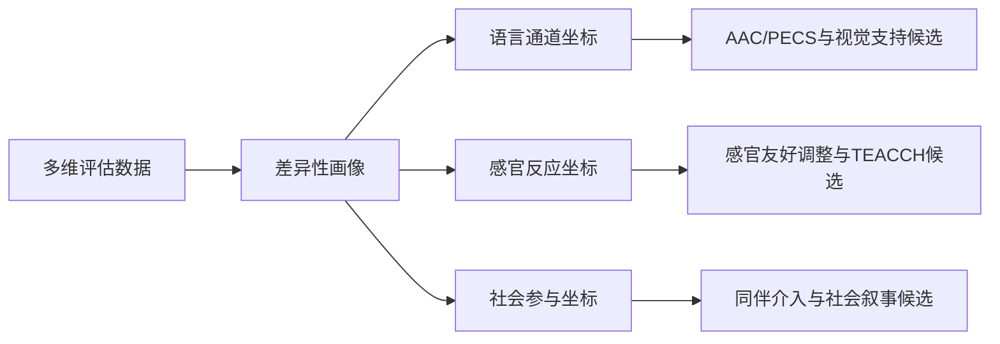

# 增强自闭症学生课堂参与度的有效策略：从评估到循证实践的排序化推荐

提升自闭症学生课堂参与度的最优路径，不是叠加某种单一的“神奇技术”，而是一项**以功能评估为起点、以结构化教学与视觉支持为地基、按行为/认知/情感/社会四维需求差异化匹配循证实践的系统工程**。

本报告覆盖28项由美国国家循证实践中心（NCAEP，Steinbrenner 2020）认定的循证实践、TEACCH的4个组件、PECS的6个阶段以及UDL的3条原则，共同构成策略池。尽管业界曾广泛宣称“AAC与社交机器人等智能技术是参与度提升的主引擎”，但BMJ的效应量证据表明：**行为类干预效应值为0.58，显著高于技术辅助类别（社交沟通效应仅0.33）**，这意味着技术更适合充当放大器而非地基。

本报告的核心结论是：**功能行为评估（FBA）与个别化教育计划（IEP）为第一顺位决策起点；结构化/视觉支持为普适地基；PECS、同伴介入（PMI）、自我管理、代币制按个体功能画像差异化排序；技术辅助居放大层。**

---

# 1 研究框架、范围与评估标准

增强自闭症学生课堂参与度，本质上是一项“先评估、再干预、持续监测”的循证工程，而非某种单一“好方法”的简单套用。在K-12融合与特教课堂中，参与度可由一组经证据强度标注的循证实践（EBP）系统性提升。其中：

- **视觉支持、结构化教学（TEACCH）与任务分解/提示系统**凭借高机制针对性与相对可控的教师负担，构成**首选层**；
- **强化与动机激发、积极行为支持（PBS）、同伴介入（PMI）**位居其次；
- **辅助沟通（AAC/PECS）**在低口语学生群体中具有不可替代的优先地位。

就证据规模而言，融合情境下的最佳证据综述已识别出79项采用单一被试研究方法的研究，构成判定“循证强度”的潜在证据来源。

实践界常认为“给自闭症学生配一名陪读老师即可解决参与问题”，但本报告将论证：**陪读式一对一提示往往催生提示依赖并削弱自主性，形成反向效应；真正可持续的参与提升，需依靠环境结构调整与同伴生态再造。** 随着《“十四五”特殊教育发展提升行动计划》推动县域特殊教育资源配置，资源教室这一“半融合”场景的策略落地价值将显著上升。

本报告评估的十类策略及其属性维度构成分析骨架。下表“循证强度”一栏以单一被试研究的方法学质量指标为操作性依据，而年龄段与适用人群的标注属本报告的分析性判断，将在后续章节逐项核验。

| 策略 | 针对的参与障碍机制 | 提升的参与维度 | 适用情境 | 教师负担 |
|---|---|---|---|---|
| 结构化教学（TEACCH） | 执行功能/可预测性不足 | 行为、认知 | 中高支持需求、低口语者 | 前期中、维护低 |
| 视觉支持策略 | 社交沟通/工作记忆负荷 | 行为、认知 | 全年龄、跨学科 | 低—中 |
| 强化与动机激发（含代币制） | 动机/外部激励不足 | 行为、情感 | 全年龄 | 低—中 |
| 辅助沟通（AAC/PECS） | 社交沟通/表达受限 | 社会、情感 | 低口语者优先 | 中（需培训） |
| 积极行为支持（PBS） | 情绪/行为功能 | 情感、行为 | 行为困难显著者 | 中—高（需FBA） |
| 感官友好环境调整 | 感官过载 | 情感、行为 | 感官敏感者 | 低—中 |
| 同伴介入策略（PMI） | 社交孤立 | 社会 | 中高年级尤宜 | 中（需训练同伴） |
| 社会叙事与社交脚本 | 社交认知 | 社会、认知 | 有一定语言理解者 | 低—中 |
| 任务分解与提示系统 | 执行功能/任务启动 | 行为、认知 | 全年龄、跨学科 | 低 |
| 通用学习设计（UDL）整合 | 全班可及性 | 全维度 | 全班通用 | 前期高、后期低 |

本报告全程聚焦课堂教学情境，不涉及医学诊断、临床康复与家庭训练。

## 1.1 策略评估Rubric：六维加权打分体系

评估Rubric是本报告把“众多可选策略”转化为“可排序推荐”的核心工具，由六个评分维度及其权重构成（以下为本报告自定的内部方法设定）：

| 维度 | 权重 |
|---|---|
| 循证强度 | 0.25 |
| 参与提升幅度 | 0.25（注：第12章实际采用0.20，并相应调整其余维度）|
| 机制针对性 | 0.18 |
| 适用广度与差异适配 | 0.14 |
| 教师负担与可持续性 | 0.12 |
| 风险与副作用（逆向计分） | 0.06 |

采用0–10分制，**循证强度与参与提升幅度权重最高**，以体现证据优先；**教师负担作为独立的现实约束维度**；风险与副作用采用逆向计分，使“低风险”能正向贡献于总分，而非仅作否决项。

## 1.2 报告路线图与核心术语

本报告遵循“先界定与诊断、再分类评估、后匹配与排序”的递进脉络：

以下术语在全文统一复用（部分为本报告的操作性界定）：

| 术语 | 本报告定义 |
|---|---|
| 孤独症谱系障碍（ASD） | 以社交沟通困难与限制性、重复性行为兴趣为核心特征的神经发育谱系状况 |
| 课堂参与度（四维） | 学生在课堂中的卷入程度，分为行为、认知、情感、社会四维 |
| 循证实践（EBP） | 经研究证据支持、达方法学质量标准的干预；以单一被试研究质量指标为判分口径 |
| 个别化教育计划（IEP） | 为特殊需要学生制定的、含目标与支持安排的书面计划 |
| 通用学习设计（UDL） | 在课程设计阶段即提供多元表征、参与与表达通道的全班通用框架 |
| 结构化教学（TEACCH） | 通过物理结构、视觉日程与工作系统使环境可预测的教学组织方法 |
| 同伴介入策略（PMI） | 训练普通同伴作为干预实施者以促进社会互动的方法 |
| 随班就坐 vs 真实融入 | 仅物理在场 vs 在课程、互动与评估中获得有意义参与 |

**accommodation（调整）与modification（修改）的优先序、“随班就读”与“随班就坐”的价值分野**，被确立为评判一切策略的标尺。

---

# 2 课堂参与度的四维内涵与测量

课堂参与度并非单一的“在场或不在场”状态，而是由多个相互关联却可各自分离的子系统共同构成的复合建构。据综述，课堂参与包含行为投入、认知投入与情感投入三个维度，部分模型进一步引入社会参与维度。**本章核心判断是：就ASD学生而言，真实参与的判定必须跨越四个层面，而非停留在行为层面的外显表现。**

## 2.1 参与度的四个层面

- **行为参与**指外显行为表现，是参与度最基本、最可观察的形式，如遵守规则、认真听讲、做笔记；
- **认知参与**指向内隐的心智努力，包括深度学习策略与元认知监控；
- **情感参与**关注兴趣、愉悦、归属感与价值认同；
- **社会参与**聚焦同伴互动与协作。

**与典型发展学生相比，ASD学生各层面之间更易出现“解离”：一个能安静端坐（行为达标）的学生认知投入可能极低，而一个看似“分心”、频繁起身的学生反而可能处于高认知负荷状态。** 多模态测量研究将互动形态单列为分析模型的一层，恰说明社会互动参与无法被行为计数吸收。

四层面框架相对于单纯行为计数的核心优势，是把“是否参与”的是非题改写为**“在哪个层面参与、缺哪个层面”的定位题**，从而把后续干预精准匹配到受损层面。

**为何不能把参与等同于安静坐好或举手发言？** 把“安静坐好”误读为参与，可能导致高估——沉默与静坐恰恰可能是感官回避或认知退缩的表现。把沉默解读为不参与，则可能低估口语受限但认知活跃的学生。**这正是AAC/PECS存在的根本理由：当口语通道受阻时，认知参与需要替代表达渠道才能被观察到。** 测量中的核心张力在于：**外显行为易测但不充分，内隐认知充分但难测。**

**学业参与与社交参与可不同步。** PMI研究主要聚焦学业成就这一结果维度，提示二者是需分别测量的结果，未必由同一干预同步提升。一个在结构化任务中完成度很高的学生，在非结构化同伴互动中仍可能处于边缘。因此，单靠任务分解与提示系统改善学业完成度，并不能自动带来社交融入；后者需由同伴机会结构与社交脚本另行承载。

## 2.2 可观察、可量化的参与指标体系

据个案观察研究，常用测量方法包括非参与式观察、半结构化访谈、时间取样、事件记录与间隔记录，且多采用单一被试设计聚焦可观察行为。

**四项核心量化指标：**

- **有效参与时间**：记录实际投入任务的累计时间，而非在座时长。个案中“小亮”的有效参与时间低于班级均值，能安静听讲的时间仅为课堂前5分钟——这正是该指标的典型样例。
- **指令遵循率**：学生在给定指令后正确响应的比例。
- **主动表达频次**：单位时间内非提示下的自发发起次数。
- **任务完成度**：独立完成的比例。**采用独立完成比例而非简单二分法，能区分“自己做完”与“被协助做完”，从而暴露提示依赖程度**——这对存在陪读过度协助的ASD学生尤为关键。

**社会参与指标：** 据改进型弗兰德斯互动分析系统（iFIAS），课堂言语互动可编码为14类，采用3秒间隔编码，学生言语类目的出现频次即互动回应的计量基础。但同伴互动需额外标注“学生—学生”对象类别。多模态智能模型原则上能降低人工负担、扩大采样密度，但其对互动对象的识别精度尚未在ASD课堂得到充分验证，故**同伴互动目前仍宜以结构化人工观察为主建立基线，智能工具作辅助**。

**情绪稳定与课堂流程遵守作为前置指标：** 二者的恶化可能先于有效参与时间的下降而被观察到，从而提供更早的预警窗口。可行做法是在记录有效参与时间的同一时间取样窗口内，并行标注情绪状态与流程遵守，形成“前置—结果”配对数据。

**智能测量的边界：** 当前智能测量面临非侵入式理论滞后、多模态特征融合冲突、生成式专用模型缺乏、复杂投入状态因果解释模糊等困境。因此智能工具目前更适合承担大密度、低歧义的行为计量（如姿态、朝向），而**有效参与时间、认知投入与情绪状态的判读仍依赖教师的结构化观察**。

| 指标 | 对应层面 | 记录方法 | 操作要点 |
|---|---|---|---|
| 有效参与时间 | 行为/认知 | 时间取样、间隔记录 | 记录实际投入而非在座时长 |
| 指令遵循率 | 行为 | 事件记录 | 正确响应/给定指令比例 |
| 主动表达频次 | 认知/社会 | 事件记录 | 仅计非提示下自发发起 |
| 任务完成度 | 行为/认知 | 间隔记录 | 用独立完成比例区分被协助完成 |
| 互动回应/同伴互动 | 社会 | iFIAS 3秒编码 | 需标注互动对象类别 |
| 情绪稳定/流程遵守 | 情感（前置） | 时间取样并行标注 | 与结果指标配对 |

## 2.3 “出席≠参与”：真实参与的三重判定门槛

仅有物理在场与外显行为达标，不足以证明学生真正融入课堂共同体。真实参与必须跨越三重门槛：

**门槛一：互动必须跨越成人对象抵达同伴。** 当一名ASD学生的全部课堂互动都指向陪读或助教，与授课教师、同伴几无连接时，物理上的“在场”实际构成融合情境内的隔离。这种“助教—学生”双人气泡从计量上看互动频次不低，却把社会参与锁定在单一成人对象上。**若只记总互动次数而不分对象，这种气泡会在数据上伪装成高社会参与。** 社交机器人研究提示社交互动障碍本身可干预，因而此种隔离应被视为需专门设计同伴连接的干预目标，而非不可改变的默认状态。

**门槛二：互动必须是互惠而非单向。** 互惠性互动要求双方的发起与回应形成循环。**友谊是更高阶但最难可靠诱发的结果**——校本干预很少触及物理环境层面，而友谊高度依赖这类结构性机会。合理处理是区分时间尺度：**把互惠性互动频次作为近期可监测的过程指标，把友谊形成作为长期结果指标。**

**门槛三：任务完成必须是独立而非被代行。** 当陪读以高频提示或直接代行来“保障”完成任务时，完成度与遵循率维持高位，掩盖了学生独立能力的真实水平。化解依赖**对每次任务完成同时标注提示层级（独立/言语提示/肢体协助/代行）**，使“褪除提示”的进展本身成为参与度提升的证据。**在陪读在场的课堂，任务完成度必须以独立完成比例而非总完成率来判定。**

这三重门槛说明，随班就坐与真实融入的差距不是程度问题而是结构问题。真实参与的核心问题——独立性是否提升、同伴互动是否增加——本质上是个体随时间的变化，而**单一案例设计正是为追踪这类个体变化而设**，其证据解读需受CEC质量指标约束。

| 判定门槛 | 失败模式 | 对应指标 | 化解依据 |
|---|---|---|---|
| 跨越成人抵达同伴 | 助教—学生隔离气泡 | 互动对象分列 | 标注同伴vs成人互动 |
| 互惠而非单向 | 仅有单向发言 | 互惠频次(近期)、友谊(长期) | 区分过程与结果尺度 |
| 独立而非被代行 | 陪读高频提示遮蔽 | 提示水平+独立完成比例 | 提示褪除追踪 |

---

# 3 自闭症学生课堂参与障碍的机制分析

课堂参与不足在ASD学生身上常被误读为“态度问题”或“不配合”，而实证视角要求把它还原为一组可识别、可干预的神经发育性机制。ASD的核心特征分布在两大范畴——社交沟通及互动困难、偏执或重复的行为与兴趣，并常伴随感官异常与执行功能挑战，恰好构成四条机制主线。

**本章核心论断：ASD学生的课堂参与不足，实为“可达性”受阻与“驱动力”不匹配两类问题的叠加，而非意愿缺失。** 前三类机制主要削弱可达性，第四类主要影响驱动力，焦虑则在四者之间反复传导。

需预先澄清一个误解：孤独症本质上是一种先天性神经发育障碍，并非“后天教育失误”所致。这一定性至关重要：**参与障碍的根源在于神经发育，而非家庭教养或主观懒惰，因而纪律性回应（批评、施压）在逻辑上站不住脚。**

## 3.1 四类机制主线

**社交沟通困难（可达性）** 涵盖社交情感互动的相互性、非语言沟通、发展和维持关系三个层面。在高度依赖即时口语应答与社交读心的课堂中，这些困难直接转译为回应延迟、主动发起减少、对教师提问的回避。

**感官调节失衡（可达性）。** 日光灯频闪、同伴交谈声、椅子摩擦、特定材质桌面，这些对神经典型学生几乎不构成负担的刺激，对感官调节失衡的ASD学生却可能构成持续的处理压力。其因果链为：**输入超载→神经不堪重负→压力反应→回避→参与下降**，并与焦虑形成恶性循环（过载→焦虑↑→处理阈值↓→更易过载）。**对部分学生而言，感官可达性是一切课堂参与的物理前提——在感官基线失控的状态下，再精巧的社交或学业支持都无从发挥。**

**执行功能与信息处理（可达性）** 指向发起行动、计划与转换的高阶认知过程，在课堂中表现为任务启动慢、活动切换困难、对多步口语指令的处理脱轨。ASD学生常具备视觉思考优势，而不确定性会经由焦虑通道压低参与。

**动机、兴趣与行为需求（驱动力）。** 与前三者损害可达性不同，动机决定参与的驱动力。这一定性把动机问题从“品德”领域彻底剥离：应分析学生对何种强化敏感、为何狭窄兴趣应被视为杠杆而非障碍。

**全章收束判断：自闭症学生的“不配合”几乎从不是态度问题，而是可达性受阻与驱动力不匹配的可识别组合，且二者通过焦虑这一公共放大器相互强化。** 由此可提炼核心干预原则：**双管齐下——既移除可达性障碍（社交、感官、执行功能），又重建匹配个体的驱动力（个体化强化与兴趣嵌入），并优先打断焦虑这一公共放大环节。**

| 机制类别 | 障碍性质 | 主要压低维度 | 对应策略章节 |
|---|---|---|---|
| 社交沟通 | 可达性：答什么/何时答/是否发起 | 社会、行为 | AAC/PECS、社交脚本、PMI |
| 感官调节 | 可达性：能否维持留场 | 行为、情感 | 感官友好环境、PBS |
| 执行功能 | 可达性：能否启动/切换/处理指令 | 认知、行为 | TEACCH、视觉支持、任务分解 |
| 动机与行为需求 | 驱动力：是否被恰当激励 | 情感、行为 | 代币制、兴趣嵌入IEP、PBS |

焦虑作为四类机制的“公共放大器”，其在不同个体、不同情境下的传导权重究竟如何，现有证据只能支持其存在而无法量化其相对强度——**这正是为何下一章的功能性行为评估不可省略。**

---

# 4 科学评估与个别化教育计划（IEP）作为起点

脱离机制基础的策略堆砌，往往仅能改变“随班就坐”的表象，却难以实现“真实融入”。**评估与目标设定的质量，直接决定后续所有循证策略能否命中真正的障碍机制，而非在错误的靶点上投入精致的无用功。** 缺乏评估的策略选择，本质上是基于刻板印象的猜测；而评估若不能落地为可测量目标，则只能沦为束之高阁的诊断文件。

## 4.1 多维评估方法

科学评估的多维性源于ASD学生障碍来源的多机制特征。三类互补的评估从“功能、动机、能力”三个正交维度同时定位，任何单维评估都会系统性地遗漏干预靶点：

| 评估类型 | 核心问题 | 主要方法 | 对接策略章节 |
|---|---|---|---|
| 功能性行为评估（FBA） | 行为为何发生（功能） | ABC观察、结构化访谈、评定量表 | 强化/PBS |
| 兴趣与强化物偏好评估 | 用什么驱动参与（动机） | 间接报告、刺激排序、自由操作观察 | 代币制 |
| 语言/感官/执行功能基线 | 当前能力在哪里（起点） | 标准化量表+课程本位评估 | 环境/沟通支持 |

三者并非孤立，而是彼此校验的证据网络：FBA的功能假设需要偏好评估提供强化物载体，基线评估的能力定位又反过来约束功能假设的合理性。

## 4.2 从评估到可观察的IEP参与目标

评估数据只有转译为可观察、可监测的目标后才能兑现，IEP是这一转译的法定载体。其中最关键的决策是**accommodation（调整）与modification（修改）的区分**：

- **accommodation改变“怎么学、怎么考”，不改变学习目标本身**，如延长考试时间、提供降噪耳机、允许口头作答替代书面作答；
- **modification改变学习目标或评价标准本身**，如把内容降到低年级水平、减少知识点数量、采用不同评分标准。

**决策原则：当学生的障碍位于“通道”而非“能力”时，应优先考虑accommodation。** 其因果链为：感官过反应阻塞的是接收信息的通道（如噪音掩盖指令），降噪耳机这一accommodation绕开了受阻通道，从而在不降低标准的前提下恢复参与；而若误用modification降低难度，则既未解决通道问题，又无谓地压低了学生的发展上限。**因此默认优先尝试accommodation，仅当数据显示其无法使学生在原标准下进展时，才升级到modification。**

是否伴随智力障碍是关键变量：若认知能力处于常模范围，参与障碍更可能是通道问题，accommodation往往足够；若伴显著认知障碍，则可能确需modification。一个被错误判定为“能力不足”而施加modification的学生，可能因此被长期锁定在低期望轨道上。

| 维度 | accommodation | modification |
|---|---|---|
| 改变对象 | 怎么学、怎么考（通道） | 学什么、考什么（标准） |
| 学习目标 | 保持原标准 | 降低或改变标准 |
| 适用障碍 | 通道受阻（感官/表达） | 能力本身受限 |
| 对发展上限影响 | 较小 | 可能压低上限 |
| 默认优先级 | 数据允许时优先 | 仅在accommodation无效时升级 |

## 4.3 差异性画像：个别化的前提

个别化的前提，恰恰在于承认ASD学生之间的异质性远大于其共性。差异性画像是把分散的评估数据整合为一张可驱动策略匹配的个体特征图，其根本作用是**在评估数据与策略库之间架设一座可计算的映射桥梁**。

本报告提出若干待后续章节验证的画像—策略对应方向（假设性映射）：

单一个案设计是检验这些匹配的主力方法，可在个体层面持续检验“这名学生是否对这一策略产生响应”，从而把匹配表从静态清单转化为动态、可证伪的决策工具。

**画像的成本张力：** 画像越精细匹配越精准，但评估成本也越高。化解之道是采用“足够好”的画像粒度——**只刻画那些会实质性改变策略选择的维度（如语言通道、感官反应方向），而非穷尽所有可测量特征**，并内嵌于常规IEP流程，避免成为额外负担。

---

# 5 环境与结构化支持

环境与结构化支持是面向ASD学生课堂参与的**第一层、也是负担最轻的干预层**。其共同逻辑在于：**通过将“接下来会发生什么”变得可见、可预测，把环境的失控感转化为可掌控感**，从而在情绪与行为层面为后续策略腾出参与空间。本章的作用单位是物理空间与时间结构本身。

## 5.1 结构化教学（TEACCH）四要素

TEACCH由物质环境结构、作息时间结构、个别工作系统和视觉结构四种组织构成，其核心在于将抽象的课堂期待转化为学生可感知的物理与视觉信号。

**为何结构化降低不确定性与焦虑？** 因果链为：**不确定性被大脑识别为威胁→激活“战或逃”应激反应；TEACCH的视觉时间表与工作系统提供清晰可预测的信息→赋予学生掌控感→阻断灾难化预期→焦虑下降并释放参与所需的认知资源**。这正是结构化教学区别于单纯行为管理的核心：它并非事后惩罚脱离行为，而是事前消除引发脱离的不确定性源头。

这条机制链也揭示了为何同一套结构化措施对不同学生效果差异显著：对焦虑驱动型脱离的学生，结构化直接命中上游；对动机驱动型脱离的学生，结构化仅是必要而非充分条件，仍需配合强化与动机策略。因此**TEACCH应被定位为基础层而非全能层**。

**一个需正视的张力：结构化程度与泛化能力之间存在权衡。** 过度依赖固定结构的学生一旦进入低结构情境（课间、校外）便难以迁移。化解路径不是削弱结构，而是**有计划、渐进地淡出支持强度**：先确保稳定参与，再逐步引入可控的变化。

| TEACCH四要素 | 组织维度 | 对应障碍机制 | 实施负担 |
|---|---|---|---|
| 物质环境结构 | 空间 | 执行功能/情境推断负荷 | 低（一次性设置） |
| 作息时间结构（视觉时间表） | 时间 | 不确定性焦虑 | 中（需持续更新） |
| 个别工作系统 | 任务 | 执行功能/任务终点不确定 | 中高（模板可复用） |
| 视觉结构 | 信息呈现 | 抽象信息解码 | 中 |

## 5.2 感官友好型课堂环境与流程可预测性

感官友好型课堂环境针对ASD学生的感官处理特征，对教室声、光、空间布局与个体工具作环境调整，聚焦的是**环境刺激的可承受性**。需注意：专门针对物理环境的干预十分少见，因此本节多数做法虽机制合理且实践广泛应用，但独立群体受控效果证据相对有限，应以审慎、个别化方式采用。

**课堂流程与规则的可预测性**将静态时间结构延伸至课堂内每一次活动切换与每一条行为期待的动态层面：视觉时间表解答“今天有哪些活动”，本节聚焦每个活动内部的展开方式、规则与应对变化的方法。其循证基础同源：清晰、分步的预期信息能可靠降低焦虑并改善参与，可预测的学习环境可提升任务完成度与独立性。

---

# 6 视觉支持与沟通表达（AAC/PECS）

## 6.1 视觉支持策略

视觉支持是一种循证干预实践，其依据在于ASD学生“视觉优于听觉”的认知加工特点。它将无形的指令、规则、流程与时间外化为可反复查看的具象信息，降低对工作记忆与即时口语理解的依赖。

**视觉提示如何降低口语加工负担？** 因果链为：**听觉信息无形且稍纵即逝，依赖视觉学习的学生难以即时掌握并保留口语指令；视觉信息稳定具象可反复查看，更易加工与记忆；更充分的理解转化为更好的指令遵循，最终带来课堂参与的提升**。

该机制已获实验佐证：中重度自闭症儿童在“视频提示加语言指令”条件下的指令遵循准确率显著高于单独语言指令，而单独语言指令又优于仅用图形符号序列。这揭示一个常被忽视的细节：**视觉支持并非简单的“图片优于语言”，而是多通道叠加（视频+语言）优于单通道，且静态图形符号序列效果反而最弱。**

与AAC相比，视觉提示的作用方向相反却互补：**视觉提示主要服务于接收性理解（帮学生听懂指令），AAC主要服务于表达性输出（帮学生说出意图）。** 课堂干预应同时铺设接收端与表达端的视觉支架。

## 6.2 辅助沟通与表达扩展（AAC/PECS）

AAC与PECS为口语能力受限的ASD学生提供替代或增强表达通道。以普通教育课程接触为指向的AAC应用研究持续开展，研究对象多集中于小学阶段的自闭症与智力障碍学生。

**图片兑换沟通系统（PECS）** 是一套结构高度明确的循证沟通教学方案，Bondy与Frost将其划分为六个阶段：**①以图卡易物 ②增进自发性沟通 ③区辨图片 ④句型结构 ⑤接受性语言训练（回应“你要什么”）⑥刺激自发性反应（对环境作评论）**。这一递进结构使PECS区别于松散的图片使用，成为可被系统教学与监测的方案——课堂应用要求按阶段逐级推进，初期使用两名训练者，并跨场景、跨人物泛化。

PECS主要作用于社会参与与行为参与：图卡易物本身即一次完整的社交互动回合，阶段六的评论训练直接指向主动社会沟通。**与视觉提示相比，PECS不仅帮助学生“理解”，更赋予其“发起”的能力。** 其局限在于初期对训练者人力与图卡制作要求较高，且若泛化不充分，容易出现仅在训练情境中使用的风险。

**选择板**作为更轻量的工具，与PECS互补：适合尚未进入正式PECS训练、或仅需在特定环节表达偏好的学生。

**AAC设备（SGD与平板应用）与手势支持。** 全球儿童AAC应用市场2023年约13亿美元，预计2032年增至约34.6亿美元（CAGR约11.5%），意味着教师面临的将不再是“有无工具”，而是“如何匹配个别学生”。一项研究显示：在学龄前低口语自闭症幼儿的请求技能教学中，各AAC系统最终习得效能相当，但**达标前PECS所需介入总次数少于SGD**。就差异化匹配而言，对教学资源紧张的课堂，PECS介入次数少构成优势；对已配备平板且需更大词汇量与语音输出的学生，SGD仍不可替代。手势支持门槛最低、即时可用，但表达精度与可泛化性受限，适合作为应急或辅助通道。

**等待时间、简化指令与理解检查**是三类无需设备却直接决定沟通成效的教师行为策略：

- **等待时间**：发出指令后给予充分反应时间，对口语加工较慢的学生可显著提高反应概率；
- **简化指令**：将多步口头指令拆解为单步、具体、可视化形式——其有效性不在于减少信息总量，而在于将信息重组为单通道可承载的单元，与视觉叠加协同（“简化口语+视觉叠加”优于任一单通道）；
- **理解检查**：通过复述、指认或演示确认学生真正理解，而非默认“没有反对即为理解”。

**这三者最高等级地满足“教师负担与可持续性”标准：即时可用、零成本、可融入任何学科环节，仅需教师调整自身语言与节奏习惯。** 其局限在于效果高度依赖一致执行。

## 6.3 替代表达方式与主动沟通培养

**多元回应方式（指、写、设备）** 不再强制口头作答，允许学生通过多种渠道表达。它将“表达能力”与“认知能力”解耦，使学生不至于因口语受限而被误判为认知不足，是UDL“多元表达”原则在沟通层面的具体落地。

**从被动应答到自发沟通的过渡**是替代表达策略链条的终点目标，也是最难达成的一环。这里存在一个尖锐张力：**教师的提示与协助越充分，学生短期应答率越高，但若不主动设计自发性训练，学生便可能永远停留在被动应答层面——支持的充分性反而成为自发性的天花板。** 化解约束在于“有计划的提示延迟”：教师需主动制造沟通诱发空当（如将想要的物品置于视线内却不主动给予），迫使学生自行发起，再以最小提示协助其成功。**换言之，从被动到自发的跃迁不会作为充分支持的副产品自动出现，越是周到的课堂，越可能培养出越被动的沟通者。**

**本章综合：视觉支持与替代沟通并非两类并列的孤立技术，而是沿“接收—表达—发起”这一沟通能力轴线分布的连续支架体系。** 视觉提示加固接收端，AAC与多元回应打通表达端，选择权与自发性训练激活发起端；三者缺一，参与的链条便会在某一环断裂。

| 策略类别 | 针对机制 | 循证依据 | 主作用维度 | 教师负担 |
|---|---|---|---|---|
| 视觉流程表/组织图 | 时序焦虑、口语加工负担 | 工具谱系 | 行为、认知 | 低 |
| 视觉提示降负担 | 听觉瞬时性、加工延迟 | 因果链、Allen 2022 | 认知、行为 | 低 |
| PECS | 表达性沟通缺失 | Bondy & Frost六阶段 | 社会、行为 | 中高 |
| AAC设备/SGD | 词汇量、语音输出需求 | PECS介入少于SGD | 社会、认知 | 中 |
| 等待/简化/理解检查 | 加工延迟、工作记忆 | Allen 2022 | 行为、认知 | 极低 |
| 多元回应方式 | 口语输出门槛 | AAC文献分析 | 认知、行为 | 低中 |

上述教师负担评级均以“一次设计、长期复用”为前提；**若缺乏持续数据监测与渐进消退，任一低负担策略都可能因提示依赖而转化为长期维度上的高隐性成本。**

---

# 7 强化、动机与积极行为支持

动机是课堂参与度的源头变量：一旦缺失，再精巧的结构化与视觉支持也只能维持“随班就坐”而非“真实融入”。本章三节分别处理“愿意”（强化）、“能够”（任务设计）与“稳定”（PBS）。

## 7.1 强化与动机激发

**代币制**是一套条件强化系统：学生因目标行为获得代币，再以累积代币兑换后备强化物。完整流程含八步：确立目标行为、讲解代币制、告知规则、确定代币、确定行为与代币比值、确定奖赏、确定兑换比值、行为出现时立即给予/扣除。**代币之所以起作用，关键在于其背后的后备强化物经过有效偏好评估；后备强化物若缺乏吸引力，代币便失去意义。**

代币制相对于直接强化的优势有实证支撑：学龄前自闭症儿童使用代币系统的实验组，目标行为建立速度比单纯直接强化的对照组快**2.3倍**，且3个月后维持率高出**41%**。一个合理解释是：延迟兑换为训练等待与自我调节提供练习场，累积机制使单次行为嵌入更长的奖励序列，从而增强行为的抗消退性（此为推断性解释，原数据仅报告结果差异）。

**向社会性强化过渡是代币制设计中最易被忽略却最关键的环节。** 经典田野实验表明：为本有内在兴趣的活动提供预期的外部奖励，会使儿童把行为归因于奖励而非内在兴趣；奖励撤除后内在动机难以完全恢复。**这一“过度合理化”效应警示：代币制必须设计退出路径，而非无限期运行。** 实施四步：①确立目标行为与规则并清晰讲解 ②初期保持低兑换门槛、高递送频率 ③行为稳定后逐步淡出（提高兑换比值、延长间隔，并叠加具体社会性反馈）④监测淡出过程中的行为维持。

**值得注意的是，侵蚀风险主要发生于学生对活动本已存在内在兴趣的情形；对低兴趣或回避性任务使用外在强化时，过度合理化效应在理论上有所减弱**，但仍应监测撤除后的参与维持与依赖程度。

| 维度 | 即时直接强化 | 代币制 |
|---|---|---|
| 行为—后果间隔 | 极短、即时 | 延迟、累积 |
| 建立速度（学龄前ASD） | 基线 | 快2.3倍 |
| 3个月维持率 | 基线 | 高41% |
| 对延迟理解要求 | 低 | 中—高 |
| 内在动机侵蚀风险 | 较低 | 较高，须设退出路径 |

## 7.2 任务设计与提示系统

动机解决“愿不愿意”，任务设计与提示系统解决“能不能够”。核心命题在于：**通过将目标拆解为有序小步骤，并配以由弱到强的提示且系统撤除，可把原本超出能力的任务转化为一连串可成功完成的单元。**

**示范、视频示范与最少提示法**构成提示系统的三种核心形态。最关键的设计原则是**“最少充分提示”：仅给予完成任务所需的最低强度辅助，从而在保障成功的同时，最大限度保留独立反应的空间。**

- **现场示范**即时灵活，但每次呈现存在变异，并伴随社交注视压力；
- **视频示范**呈现稳定、可预测、可反复观看，前期录制成本较高，但一旦完成即可无限复用、跨学生共享，长期可持续性反而最优，对现场社交压力敏感的学生尤为适配；
- **最少提示法**不是“呈现什么”的示范，而是一套“给多少辅助”的递送规则，可与多种提示形态组合使用。

实施四步：①预设由弱到强的提示层级（如手势→言语→示范→肢体辅助）②先给独立反应机会，仅在未反应时提供最弱提示 ③不足则逐级增强，正确反应后即时强化 ④随独立完成率上升逐级减弱直至独立，并监测撤除后维持。

**提示系统最大的风险是提示依赖：若撤除不及时或不系统，学生可能形成“等待提示再行动”的反应模式，反而抑制独立参与。因此提示撤除的纪律性是提示系统能否真正促进而非妨碍参与的分水岭。** 任务分解改变“任务的大小”，提示系统改变“辅助的强度”，二者常嵌套使用：先将任务拆小，再对每一小步施以最少充分提示。

## 7.3 积极行为支持与情绪调节（PBS）

PBS解决的是“稳定”——情绪与问题行为一旦失控，此前积累的参与成果将瞬间瓦解。**PBS的根本立场是预防与教导而非压制：它通过FBA识别问题行为背后的功能，再以功能等价的替代行为取而代之，并辅以环境调整与情绪调节工具，从源头减少问题行为**。

**功能性沟通训练（FCT）** 是替代行为教学中最具代表性的循证策略：教导学生用一种与问题行为具有相同功能的沟通方式去替代该问题行为。**FCT的精髓在于“功能等价”：若一名学生用尖叫来逃避任务，就教他用“我需要休息”的卡片或手势来达成同样的逃避目的，使沟通替代真正换来学生想要的结果。**

因果路径为：**通过FBA识别问题行为的功能（逃避/获取/感官）→教导功能等价的沟通替代并即时强化→对问题行为撤除强化→学生发现新的沟通方式更省力、更有效→逐步取代问题行为**。关键环节在于“功能等价”与“差别强化”的配合：若替代行为无法带来学生真正追求的后果，或问题行为依然有效，替代便不会发生。

FCT适用于从低语言到高语言的广泛谱系：低语言学生可用图片或手势作替代，高语言学生可用口语或书面请求。课堂实施三步：①借助FBA确定功能 ②选定功能等价的沟通替代，密集教学并即时强化，同时对问题行为撤除强化 ③跨情境、跨人员推广并保持一致性。

**就机制针对性而言，FCT是本节中机制命中度最高的策略，它并非泛泛地“减少问题行为”，而是精准针对每个行为的具体功能给出等价替代。** 其主要风险在于功能识别错误（FBA不准）或功能等价不足——FBA的准确性与跨情境泛化，是决定FCT成败的两大关键。

---

# 8 同伴介入与社会参与策略

课堂同时是由同伴关系编织而成的社会生态系统，而ASD学生的社会参与恰是其中最脆弱的环节。本章将干预主体从教师扩展至同伴。**核心结论：有结构的同伴介入能够同时改善社交与学业结果，但仅凭物理层面的“随班就坐”无法自动转化为互惠友谊，真实包容有赖于对结构性条件的主动设计。**

## 8.1 同伴介入策略（PMI）

PMI是一组以同龄同伴为干预媒介、由教师在幕后训练与调度的循证实践，包含同伴示范、同伴主动、同伴监督、同伴网络、同伴指导及团体后效等多种形态。其核心逻辑在于把社交学习放回真实的同伴关系中完成，而非让成人替代同伴角色。

**针对机制。** ASD学生往往并非不具备某项社交行为，而是缺乏在真实情境中被同伴自然引导的入口。当成人退居幕后、由同伴承担发起与示范角色时，互动的社交真实性得以保留，从而缩小了从训练情境向日常情境迁移时的断层。

**循证强度。** PMI在NCAEP/Steinbrenner 2020中被列为高证据等级的成熟实践，适用年龄从学前到中学。可援引证据包括：社区融合情境中基于同伴介入的共同注意干预，使ASD儿童社交行为问题显著减少、社交技能得分显著优于对照组；以及Mahoney（2023）针对中学ASD学生学业成就的系统综述。**PMI同时拥有对照组研究与系统综述两类证据支撑，是本章三组策略中证据基础最稳固的一组。**

**提升维度。** 主要作用于社会参与和行为参与；当同伴监督引入正向反馈时，情感参与也被间接带动。

**实施步骤。** ①依据能力调节同伴出场顺序，使具备某能力点的同伴恰好在目标学生之前示范 ②培训同伴掌握简单的主动发起脚本（发出邀请、递交材料、等待回应）③设置同伴监督环节，给予即时正向反馈 ④教师在旁观察并记录互动数据。

**成本与风险。** PMI初期成本集中在同伴培训，一旦同伴掌握角色，日常运行边际负担较低。**与一对一成人介入相比，PMI把持续的互动负荷分散到多名同伴身上，这正是它在可持续性维度上优于密集型成人主导干预的结构性原因。** 主要风险有三：同伴培训不足可能传递错误模式；同伴监督若演变为纠错指责会损害情感参与；同伴角色长期固定可能形成“帮助者—被帮助者”的不对等关系。因此需定期轮换同伴角色，并训练同伴以平等姿态展开互动。

**团体后效**将同伴介入从“一对一”扩展至“一对多”：基于群体集体或个体行为而由整组共同获得奖励。**与个体代币制相比，团体后效将激励的社会维度内置其中——它奖励的不仅是个体行为，更是群体协作本身。** 当整组奖励取决于每个成员贡献时，“同伴拉动”往往比成人催促更有效。最大风险是“同伴压力反转”——当目标学生表现不佳拖累整组奖励时，可能招致隐性责备甚至排斥。化解之道是优先采用奖励个体进步而非绝对水平的后效设计。

**PMI的双重证据：** PMI在社交与学业两条结果线上都积累了证据，使它成为少数能同时服务融合课堂“社会目标”与“学业目标”的策略。社交结果方面，实验组在CBCL与社交技能量表上的得分明显优于前测与对照组；学业结果方面，Mahoney（2023）系统综述专门评估了PMI对中学ASD学生学业成就的支持。**这一跨结果域的证据广度，是本章其余策略尚不具备的。** 但双重证据不等同于双重保证——NDBI类干预的系统综述提示，多数研究虽报告至少部分儿童在至少一项结果上有正向效应，但效应在研究间并不一致，**PMI的成效高度依赖实施保真度与个体匹配，不能假定“用了就有效”。**

## 8.2 社会叙事与社交脚本

社会叙事是一组以“降低社交不确定性”为核心目标的认知—沟通类策略，将难以言传的社交规则转化为可反复阅读、可排练的显性文本。如果说PMI解决“谁来互动”，那么社会叙事解决“互动时该怎么做”。

**社会故事（Social Stories）** 由Carol Gray提出，是以第一人称叙述说明特定社交情境的结构化短文本，预先解释“会发生什么、别人怎么想、我可以怎么做”。其机制在于：将不可预期的社交事件转化为可预期的叙述，从而降低焦虑、释放认知资源。这一逻辑与视觉支持同源（将隐性信息显性化），但针对的是“社交认知”层面的隐性信息。

**循证强度。** 社会故事这类常以单一被试设计验证的策略，应以CEC质量指标审视其单案证据稳健性。**就循证强度而言，社会故事属于“有实践基础但其个案证据需以质量指标加以审视”的类型，在证据稳健性上不及同时拥有对照组研究的PMI。** 主要作用于情感参与（焦虑降低）和认知参与（情境理解深化）。其实施保真度是关键变量——若写成命令式规训，学生可能机械背诵而非真正理解，泛化因此受限。

**角色扮演与社交脚本练习**将社会故事的“读”推进至“演”，针对“理解了规则却无法在实时互动中执行”这一执行功能障碍。许多ASD学生在认知上明白该如何回应，却在真实互动的时间压力下无法调用相应行为；角色扮演通过降低实时压力、提供可重复练习，使社交反应从刻意调用逐步走向自动化。**社会故事提供“知”，角色扮演提供“行”的练习场。** 核心风险是泛化受限——学生可能只会执行排练过的固定序列，一旦同伴偏离脚本便无所适从，因此应有意引入变式排练。

**结构化互动活动设计**是把社会叙事与脚本嵌入常规课堂活动的载体，将开放度过高的自由互动转化为可参与的结构化互动。**就机制针对性而言，结构化互动“原理清晰、嵌入性强，但缺乏作为独立变量的效应量证据”，因此宜将其作为其他循证策略（PMI、社会故事）的承载平台，而非单独计功的干预。**

## 8.3 真实社会包容的追求与张力

**可及性提升≠互惠友谊。** 融合教育最常见的认知误区，是将“让ASD学生能接触同伴”等同于“ASD学生获得了友谊”。现有干预中很少触及物理环境本身——学界与实务界的干预精力大量投向个体或同伴的技能训练，而对产生排斥的结构性条件（座位编排、空间组织）相对关注不足。**这意味着即便个体技能得以提升，倘若承载互动的物理与组织结构未发生改变，互惠友谊仍可能难以自然涌现。** 参与不是学生个体的属性，而是课堂、教师、同伴多因素交互的产物。

| 维度 | 物理可及性 | 互惠友谊 |
|---|---|---|
| 衡量指标 | 是否身处同一空间 | 是否存在双向、自愿的互动 |
| 产生条件 | 安置决策即可达成 | 需结构性设计与时间积累 |
| 是否自动转化 | 否 | 需主动促成 |
| 责任归属 | 易被误置于学生个体 | 属课堂生态共同责任 |

**就适用广度的逆向含义而言，单纯的物理安置在改善真实社会参与上几乎无从及格——它提供了必要条件，却远非充分条件。**

**个体支持与集体融合的平衡**是融合教育中最根本的张力：个体支持越强（一对一陪读、抽离式训练），越能保障学生当下表现，却可能越削弱其在集体中的自然融入。**个体支持本应是融合的助力，过度时却可能成为融合的障碍。** 化解约束在于找到“支持强度”与“融入空间”之间的动态平衡点：

| 学生状态 | 个体支持强度 | 集体融合策略 | 调节方向 |
|---|---|---|---|
| 互动门槛高、焦虑强 | 较高（成人提示密集） | 结构化小组、固定同伴 | 优先稳定当下表现 |
| 已能被动接受同伴互动 | 中（成人提示淡出） | 同伴主动+示范 | 逐步交还互动主导权 |
| 已能主动发起互动 | 低（成人退居监测） | 自然互动+团体后效 | 优先扩大自然融入 |

**支持强度不应是固定标签，而应随学生能力的变化动态淡出；成人支持的最高境界是让自己变得不再必要。** 但这一淡出过程必须以数据监测为依据。

---

# 9 通用学习设计（UDL）与循证实践框架

## 9.1 UDL三原则

UDL是一套以“学习者可变性”为前提的课程设计框架，主张：**与其在统一教学后为个别学生追加补救，不如在设计之初就预设多条进入路径，让差异成为课程的默认参数而非例外。** 其价值不在于新增技巧，而在于把分散的结构化、视觉、强化与同伴手段，安置进同一份对所有学生开放的课程蓝图。

UDL建立在三条原则之上：

- **多元参与（为什么）**：兴趣激发、努力维持与自我调节——针对动机与情感参与的不足；
- **多元表征（是什么）**：知觉、语言/符号与理解——针对认知加工与信息知觉的差异；
- **多元表达（怎么做）**：肢体动作、表达/沟通与执行功能——针对执行功能与口语表达的局限。

UDL把差异适配从“事后补救”前移到“设计预设”：多元表征在设计阶段的嵌入，使视觉加工占优的ASD学生无须额外补救即可获取信息，进而降低其因听觉指令过载而退出任务的频率，在不增加教师课中临场干预的前提下提升参与。在此框架下，AAC/PECS不再是“为某个孩子单独配置的特殊工具”，而是“多元表达通道”中向全班开放的一个选项。

## 9.2 循证实践（EBP）清单与三步筛选法

EBP清单的实践价值，不在于背诵28项名称，而在于把它用作策略取舍的筛子。**三步筛选法：**

1. **门槛**：核对候选策略是否进入NCAEP等权威清单，即通过循证强度门槛；
2. **机制匹配**：将策略作用机制与该生FBA中识别出的核心障碍对位；
3. **情境适配**：核查适用年龄段、语言能力要求与学科情境是否与该生匹配。

**清单提供候选池，FBA提供匹配依据，二者缺一，筛选便会失效。** 三步筛选法本身能降低负担——它以一次性的清单核对替代了反复试错。

| 策略 | NCAEP序位 | 证据形态 | 主要维度 | 主要机制 | 关键局限 |
|---|---|---|---|---|---|
| 强化（含代币制） | 第15项 | 行为族总体效应0.58 | 行为/动机 | 通用增效 | 需防过度外在化 |
| 提示（任务分解） | 第14项 | 行为族总体效应0.58 | 行为 | 任务发起与持续 | 易形成提示依赖 |
| 视觉支持 | 第24项 | 实施序列+整合证据 | 认知/行为 | 视觉加工优势 | 跨情境一致性需维护 |
| 同伴中介（PMI） | 第12项 | 中学学段系统综述 | 社会/学业 | 自然社交支持 | 依赖同伴训练质量 |
| 社会叙事/脚本 | 第19/17项 | 列入清单+常与视觉耦合 | 社会 | 特定社交情境 | 新情境泛化衰减 |

## 9.3 证据强度的批判性审视

循证实践框架最常见的误用方式，是把“列入EBP清单”当作“已被充分证明”的同义词。综合多项系统综述的元层面观察，被广泛引用的EBP证据在**小学融合这一关键场景**下的稳健性，答案更倾向于审慎而非乐观——大量证据来自小样本、个体层面的单一被试设计。这一审视并非否定循证框架，而是为其划定适用边界，并说明实践智慧在何处必须补位。

---

# 10 差异化匹配与多方协作

## 10.1 按个体差异的策略匹配表

差异匹配的第一性原理，在于将策略选择从“流行什么用什么”转向“学生需要什么用什么”。**匹配的对立面并非“不支持”，而是“错配”与“过配”：前者让策略落空，后者制造新的隔离。**

**按学生剖面匹配：** 年龄、认知与语言能力、支持需求等级共同决定同一循证策略的形态与剂量，而非其有无。

| 学生剖面 | 典型表现 | 优先策略 | 证据依据 |
|---|---|---|---|
| 学前/低龄 | 共同注意力弱、常规建立中 | 视觉支持、结构化教学 | 视觉支持可作通用支架 |
| 小学 | 任务持续性不足、规则困难 | 自我管理策略 | 自我管理对专注参与、任务完成、规范遵守有即时与维持成效 |
| 初中（轻度） | 社交技巧与求助技巧欠缺 | 同伴介入（PMI） | PMI改善沟通、求助及互动技巧 |
| 无口语/低语言 | 缺乏功能性表达通道 | PECS结合共享式注意力 | 对无口语学生社会互动有即时与维持效果 |
| 需明确结构化提示 | 依赖外部线索完成任务 | 视觉支持结合提示系统并逐步淡出 | 视觉支持含提示与强化并淡出 |

匹配逻辑：**年龄维度决定呈现媒介（低龄用图片、高龄用文字），能力维度决定任务分解颗粒度，语言维度决定是否需要AAC/PECS作前置通道，支持需求等级决定提示密度与消退节奏。** 教师常见的失误之一，正是为ASD学生设计大量个性化支持，反而导致与主体课堂融合较差、忽略其他学生需求。**差异匹配的价值不在于增加策略数量，而在于以最小必要支持换取最大独立参与。**

**按学科与活动类型调整：** 数学领域证据尤为有力——自闭症组学龄期数学解题困难比例达57%，远高于对照组的23%，表明数学课的参与障碍往往额外叠加执行功能与抽象推理负荷，需要比语文课更密集的任务分解和提示系统。

| 活动类型 | 主要障碍 | 匹配调整 | 依据 |
|---|---|---|---|
| 数学解题 | 多步骤执行功能负荷高 | 任务分解+视觉化步骤图+提示渐隐 | 困难比例57% vs 23% |
| 小组讨论 | 社交沟通与轮流困难 | 同伴介入+社交脚本 | PMI改善社交技巧 |
| 自主作业 | 任务持续性与自我监控不足 | 自我管理（自我记录） | 提升专注参与和任务完成 |
| 转衔/过渡 | 不确定性引发焦虑 | 视觉时间表、转衔卡 | 转衔卡、视觉计时器低成本高适配 |

**按语言能力分组：** 语言能力是策略组合分化的最强变量。低语言组应以“沟通通道建立”为优先（PECS+共享式注意力，再辅以视觉支持），自我管理等需要自我监控的策略应在表达通道稳定后审慎引入；高语言组表达通道通常不再是主要障碍，参与瓶颈落在专注维持、任务完成及规范遵守上，自我管理策略成为优先选项。

| 语言能力 | 参与瓶颈 | 优先策略 | 次序逻辑 |
|---|---|---|---|
| 低语言/无口语 | 缺乏表达通道 | PECS＋共享式注意力；视觉支持 | 先建通道，再叠加结构化 |
| 高语言 | 专注、任务完成、规则遵守 | 自我管理策略 | 通道已通，主攻自我监控 |

## 10.2 教师、家庭与专业团队协作

策略匹配回答“用什么”，但真实改善取决于执行系统的协同质量。**融合教育中最隐蔽的失败模式之一，便是要么把全部支持责任压在主讲教师一人身上，要么将ASD学生外包给陪读人员**——教师在融合课堂面临的三大问题中，首位正是忽视个性化需求、过度依赖陪读人员。

| 协作要素 | 核心功能 | 关键风险 |
|---|---|---|
| 角色分工 | 机制针对性匹配 | 责任错配、过度依赖陪读 |
| 校家一致性 | 跨场景泛化 | 目标“两张皮”、家庭过度负担 |
| 信息整合机制 | 数据驱动校准 | 沟通成本高、负担加重 |

**课堂参与的提升是一个生态系统命题，而非学生个人的努力问题。**

## 10.3 陪读角色的合理定位与神经多样性伦理

**陪读的合理定位标准只有一个：陪读是否在增加学生的独立参与，而非替学生参与。** 融合课堂教师常因过度依赖陪读，进而忽视学生个性化需求，并在学生出现干扰行为后缺乏支持性策略。陪读应从“隔离的源头”重构为“独立参与的催化器”：过度依赖催生提示依赖，而合理的陪读须设计消退路径，以独立完成比例为判定标尺，推动从随班就坐走向真实融入。

**神经多样性范式为提升参与的策略设定了不可逾越的伦理底线：提升参与的目的绝不能异化为强迫学生“看起来正常”。** 这一范式从聚焦缺陷与干预的医学模型，转向将自闭症视为人类多样性的组成部分。

| 伦理判据 | 提升参与（正当） | 强迫正常化（越界） |
|---|---|---|
| 目的 | 扩展真实选择与通道 | 符合外部常模期待 |
| 学生声音 | 以可表达偏好为前置 | 替学生决定 |
| 兴趣取向 | 以优势兴趣为支点 | 消除“异常”为目标 |

**任何策略，无论证据多强，若违背学生的真实福祉与尊严，便失去了正当性。** 课堂参与的提升是匹配、协作与伦理三者的统一体：差异匹配解决精度，多方协作解决执行，伦理边界解决正当性。

---

# 11 实施流程、效果监测与策略调整

策略唯有嵌入一个可重复运转的实施闭环，方能从一次性尝试转化为持续改善。**核心主张：实施并非线性的一步到位，而是“评估—设目标—选策略—执行—监测—调整”的循环，数据监测是这一循环得以转动的轴心。**

## 11.1 可操作的六步实施流程

1. **评估**：通过FBA与课堂观察，判断参与障碍主要落在社交沟通、感官、执行功能还是动机哪一层面。非参与式观察与半结构化访谈能清晰呈现有效参与时间分布（如“小亮”安静听讲仅维持课堂前5分钟）。
2. **设目标**：把评估结果转化为可观测、可量化的参与行为指标，而非笼统的“提高参与度”。
3. **选策略**：依据障碍机制与循证强度从清单中匹配。
4. **执行**：强调保真度，按策略设计的关键要素实施。
5. **监测** 与 6. **调整**：把课堂表现数据反馈回前四步，形成闭环。

**六步闭环的关键差异在于它把“调整”制度化为固定环节而非偶发补救。** 智能教学系统已展示“感知—理解—行动”三力结构（实时识别专注度的感知力、判断薄弱环节的理解力、动态调整策略的行动力），但其向面对面融合班级的迁移仍需验证。

**渐进试点路径。** 教师常见误区是一次性叠加多项干预，结果既难保真又无法判断哪一项在起作用。**更稳妥的路径是先试点单一策略、确认有效后再逐步组合。** 这与单案实验设计相通：在单名学生身上逐项验证是这一领域的主流取径。**渐进路径在循证强度维度上明显占优**——单案设计能把变量分离清楚，而叠加式实施会让因果归因变得模糊。

**优先级排序与教师负担权衡。** 多份报告把教师工作负荷列为影响实践可持续性的关键议题。这里存在张力：**循证强度较高的密集型策略，可能同时需要更多准备、培训与保真执行成本。** 解决之道在于分层排序：**把低负担、广适用的视觉支持与结构化教学作为课堂底层常规先行铺设，把需要密集一对一资源的策略留给评估确认确有必要的个案。**（密集型干预财务门槛不可忽视，如循证读写干预年成本约每班4,000–6,000美元。）

## 11.2 参与度评估方法与记录工具

监测是六步闭环的轴心，而轴心要转动必须有具体可用的记录工具。**四类基础工具：**

| 记录工具 | 主要维度 | 适配行为类型 | 教师负担 |
|---|---|---|---|
| 结构化观察表 | 行为/社会 | 多类行为并记 | 中 |
| 频次记录 | 行为 | 离散可计数行为 | 低 |
| 时间取样/间隔记录 | 行为/认知 | 持续性专注行为 | 中—高 |
| 目标达成度评定 | 综合（对标IEP） | 阶段性成果 | 低—中 |

频次记录适合计数离散行为；间隔记录与时间取样适合测量持续性行为（如每5分钟采样“是否在关注任务”，恰能刻画“有效参与时间仅维持前5分钟”这类分布）；目标达成度评定把可量化目标转为“未达成/部分达成/完全达成”的分级。

**学生反馈与表现变化记录**构成第三、第四类工具，以覆盖认知参与与情感参与这两个更难直接观测的维度。对语言能力有限的学生，反馈可借助AAC符号卡或表情量尺采集。**学生反馈是情感参与的近端指标**：一名学生可能外显行为达标（坐得住、不打断），却处于低情感投入的“随班就坐”而非“真实融入”状态。

**数据驱动的循环改进。** 记录工具采集的数据，只有回流到策略决策中才有意义。**监测指标必须与当初设定的IEP目标保持一致，否则采集再多数据也无法回答“策略是否奏效”。** 参与度评估不是单一量表能承担的，而需要行为、认知、情感多类指标的三角互证。

## 11.3 策略的泛化与可持续性

**泛化是检验策略真实成效的试金石，也是孤独症干预公认的难点。** 一项策略在试点课堂有效，不等于它能跨课程、跨教师、跨场景持续发挥作用。

**跨场景泛化。** 同伴作为可随学生移动的支持者，受训同伴有可能把习得的互动方式带到其他场景，但需在具体场景中监测验证。物理环境调整类策略在泛化上面临结构性限制——很少有干预处理物理环境，且学生一旦更换教室就需重新布置。**泛化失败常常不是策略本身无效，而是缺少把策略迁移到新场景的“引导”与“场景设计”，因此跨课程泛化需要在新课程中显式地重建提示与情境，而非指望学生自动套用。**

**避免外部强化的长期依赖。** 这里存在一个动机悖论：**本意是激发参与的外部奖励，反而可能削弱学生对活动本身的内在兴趣**。解决路径不在于禁用强化物，而在于设计撤除梯度与归因转向——把预期的、显性的实物或代币奖励，逐步过渡到非预期的、社会性的表扬，再过渡到由任务本身带来的胜任感。**“奖励是否被事先许诺并用作交换条件”是关键变量**（实验中非预期奖励组与无奖励组的内在兴趣未受损害）。**就风险与副作用这一逆向计分维度而言，无撤除设计的外部强化方案应判为不合格。**

**策略失效的识别与重选。** 当连续若干次记录显示目标达成度停滞或倒退，即应触发重评。**重选应遵循由近及远的顺序：先在同一障碍机制内更换策略（如视觉提示无效时换用任务分解），若仍无改善，再回到评估环节重新判断障碍机制是否判断有误。** NDBI证据“有效但不一致”的分布为“不必急于全盘否定”提供了佐证——策略对某名学生无效，并不意味着它对所有学生无效。

**本章核心结论：课堂参与度的持续改善，取决于把六步建成一个由数据驱动、能自我纠偏的闭环，而非一次性的策略投放。** 泛化不会自动发生，它需要在新场景中显式重建提示与情境；可持续性不会免费获得，它要求外部强化设计有撤除梯度。

| 实施环节 | 核心工具/机制 | 主要风险 |
|---|---|---|
| 流程设计 | 评估→设目标→选策略→执行→监测→调整 | 跳过评估直接套策略 |
| 效果监测 | 观察表、频次记录、时间取样、目标达成度 | 只归档不回流 |
| 跨场景泛化 | 显式重建提示与情境 | 假定泛化自动发生 |
| 动机可持续 | 强化撤除梯度与归因转向 | 外部奖励长期依赖 |
| 失效重选 | 同机制内替换优先，必要时跨机制重评 | 过早全盘否定 |

---

# 12 排序化推荐与敏感性检验

本章不再新增策略实体，而是把十类策略放进同一张判断性评分表里排序、分层，并检验这一排序在权重扰动下是否稳健。**需特别指出：下文的权重、分值、阈值与分层结果均属本报告的方法假设与作者赋权（即决策矩阵性质），而非外部证据给出的客观事实。**

## 12.1 十类策略的加权评分与分层

六项评分标准及其权重（本报告自建设定）：循证强度（0.25）、参与提升幅度（0.20）、机制针对性（0.18）、适用广度与差异适配（0.15）、教师负担与可持续性（0.12）、风险与副作用（0.10，逆向计分）。

各维度评分的证据映射：循证强度主要依据BMJ综述的效应值——**行为干预效应值0.58，技术干预对社交沟通效应值0.33、对挑战性行为0.57，自然发展行为干预0.16–0.38，发展干预对社会沟通0.28**。据此，以行为原理为核心的结构化教学、强化与动机激发被评定为高位。

| 策略 | 循证(0.25) | 参与(0.20) | 机制(0.18) | 广度(0.15) | 负担(0.12) | 风险(0.10) | S_final | Tier |
|---|---|---|---|---|---|---|---|---|
| 结构化教学（TEACCH） | 8.50 | 8.00 | 8.50 | 7.50 | 7.00 | 9.00 | **8.12** | 1 |
| 视觉支持策略 | 8.50 | 8.00 | 8.00 | 8.50 | 8.00 | 8.50 | **8.06** | 1 |
| 任务分解与提示系统 | 8.00 | 8.50 | 8.50 | 8.00 | 7.50 | 8.00 | **8.04** | 1 |
| 强化与动机激发（代币制） | 9.00 | 8.50 | 7.50 | 7.00 | 7.50 | 6.00 | **7.86** | 1 |
| 辅助沟通（AAC/PECS） | 7.00 | 7.50 | 8.50 | 6.50 | 6.00 | 8.50 | **7.39** | 2 |
| 积极行为支持（PBS） | 7.50 | 7.00 | 8.00 | 7.00 | 6.00 | 7.50 | **7.28** | 2 |
| 感官友好环境调整 | 6.50 | 6.50 | 7.50 | 8.00 | 7.50 | 9.50 | **7.21** | 2 |
| 通用学习设计（UDL）整合 | 6.50 | 7.00 | 7.00 | 9.00 | 4.00 | 8.50 | **6.84** | 2 |
| 同伴介入策略（PMI） | 7.00 | 7.00 | 6.50 | 6.50 | 5.50 | 7.00 | **6.66** | 3 |
| 社会叙事与社交脚本 | 6.50 | 6.50 | 7.00 | 6.50 | 6.50 | 7.50 | **6.55** | 3 |

**榜首TEACCH（8.12）与末位社会叙事（6.55）仅相差1.57分，全部十类策略均落在6.5至8.2的窄带内。** 其实践含义在于：**没有任何一类策略可被判为“无效”，分层差异反映的是证据成熟度与实施代价的权衡，而非有效性的有无。**

**分层阈值**（本报告设定）：S_final≥7.50归入**Tier 1（首选基础层）**，6.80–7.49归入**Tier 2（进阶补充层）**，<6.80归入**Tier 3（情境依赖层）**。

- **Tier 1**：结构化教学（8.12）、视觉支持（8.06）、任务分解与提示系统（8.04）、强化与动机激发（7.86）。共同特征：证据基底厚实，对核心障碍机制（执行功能与动机）命中精准，且可由主讲教师在常规课堂内独立完成。
- **Tier 2**：AAC/PECS（7.39）、PBS（7.28）、感官友好环境调整（7.21）、UDL整合（6.84）。
- **Tier 3**：同伴介入（6.66）、社会叙事（6.55）。

**UDL定位的内部张力：** UDL在适用广度获全场最高的9.00，按通常预期理应进入首选层，但其教师负担项仅得4.00，被拉至Tier 2末位。**这一落差源于负担维度的逆向牵引——UDL要求教师在课程设计前端投入大量重构成本；其广度优势被实施门槛部分抵消，这才是它未能跻身Tier 1的真正原因，而非有效性不足。** 感官友好调整则呈“窄而轻”的镜像特征：风险逆向项近满分（9.50，因属物理调整、行为副作用面较小），但因循证强度与参与提升偏低（均6.50）而止步Tier 2。Tier 3的同伴介入与社会叙事并非“效果差”，而是其证据更多依赖单案例研究，群组随机对照证据相对稀薄。

## 12.2 首选基础组合 vs 进阶补充策略

**首选基础组合**指Tier 1中可作为所有学生默认起点的普适地基；**进阶补充策略**则指Tier 2/3中需依据障碍机制对号叠加的情境性增强项。

基础组合的内部分工：**结构化教学提供时空可预测性的“骨架”，视觉支持提供信息呈现的“通道”，任务分解提供学习可掌握性的“阶梯”**；三者叠加构成一个低耗材、可独立实施的地基。强化与动机激发更偏“引擎”——它驱动参与的发生，但需与前三者配合才能定向。

**一个需权衡的张力：** 强化与动机激发（7.86）虽稳居Tier 1，但其风险逆向项的低分（6.00）使它在权重扰动下成为Tier 1中最不稳定的一项。化解之道在于将代币制等外部强化设计为可逐步褪除的脚手架，通过褪除机制将外部强化导向内部动机的迁移。

进阶补充策略的叠加逻辑是机制对号入座：**AAC/PECS对应沟通表达障碍，PBS对应情绪调节与挑战性行为，感官友好调整对应感官超载，UDL整合对应集体课堂的通用化重构。** 进阶层的部署必须以个别化评估识别出的核心障碍机制为前置条件，这正是“先评估、再干预”原则在排序层面的落地。

## 12.3 敏感性分析

对§12.1的权重进行±10pp的系统扰动（将六项权重之一上调或下调10pp，并按原比例重分配至其余五项，使权重总和恒为1.00，随后重算并重新分层）。

| 策略 | 基准 | 循证+10pp | 参与+10pp | 机制+10pp | 广度+10pp | 负担+10pp | 风险+10pp |
|---|---|---|---|---|---|---|---|
| 结构化教学 | 1 | 1 | 1 | 1 | 1 | 1 | 1 |
| 视觉支持 | 1 | 1 | 1 | 1 | 1 | 1 | 1 |
| 任务分解 | 1 | 1 | 1 | 1 | 1 | 1 | 1 |
| 强化与动机激发 | 1 | 1 | 1 | 1 | 2 | 1 | 2 |
| AAC/PECS | 2 | 2 | 2 | 1 | 2 | 2 | 2 |
| PBS | 2 | 2 | 2 | 2 | 2 | 2 | 2 |
| 感官友好调整 | 2 | 2 | 2 | 2 | 1 | 2 | 1 |
| UDL整合 | 2 | 2 | 2 | 2 | 1 | 3 | 2 |
| 同伴介入 | 3 | 3 | 3 | 3 | 3 | 3 | 3 |
| 社会叙事 | 3 | 3 | 3 | 3 | 3 | 3 | 3 |

**在全部扰动情景中，仅有四类策略发生过层级变动（强化与动机激发、AAC/PECS、感官友好调整、UDL整合），且均发生在相邻层边界，没有任何策略跨越两个层级。** Tier 1中的结构化教学、视觉支持、任务分解在全部六个情景下层级零变动；Tier 3的同伴介入与社会叙事亦稳定不动。整体约60%–70%的策略在所有扰动下层级保持不变。

**最敏感权重是适用广度（+10pp触发三类策略移动）：** 广度权重上调会按比例压低其余五项，导致在广度项得分高（UDL 9.00、感官调整8.00）而循证或负担项偏弱的策略获得相对增益被推过Tier边界，同时广度项中等但原本占优于被压低的循证项的策略相对受损（强化跌出Tier 1）。**UDL的层级本质上由“教师能投入多少前端设计成本”这一外部条件决定，因此对UDL的推荐必须绑定资源前提——它应被从“普适首选”重新定位为“资源充足时的高价值选项”。**

## 12.4 按语言能力的差异化推荐

全局排序给出的是“平均学生”的默认序列，但语言能力的差异会实质性改变个体层面的最优组合：

- **低语言能力学生（极少口语或无口语）：AAC/PECS应从全局Tier 2跃升为该个体层面的首选叠加项。** 低口语学生的参与障碍核心在表达通道的缺失，这使行为参与与社会参与因无法外显而被系统性低估，进而压抑本可达到的认知参与；优先部署沟通脚手架，等于先打通表达通道，再让其余策略的效果得以显现。
- **高语言能力学生（有功能性口语、认知相对成熟）：** 推荐重心从沟通脚手架转向社会参与与认知深度，可把同伴介入（PMI）与社会叙事从Tier 3提升至个体层面的优先叠加位。

**两组组合的对比：低语言组以“AAC/PECS + 视觉支持 + 结构化”打通表达与可预测性；高语言组以“任务分解 + 同伴介入 + 社会叙事”深化认知与社交。二者共享的不变内核仍是Tier 1的结构化与视觉地基，差异化只发生在叠加层。**

## 12.5 决策依据总表与行动起点

| 策略 | 主要针对机制 | 最适配情境 | 主要维度 | Tier | 优先级 |
|---|---|---|---|---|---|
| 结构化教学（TEACCH） | 执行功能/可预测性 | 全员，尤适过渡焦虑 | 行为/情感 | 1 | P1 |
| 视觉支持策略 | 信息处理/语言通道 | 全员，尤适语言弱 | 认知/行为 | 1 | P1 |
| 任务分解与提示系统 | 执行功能/学习可掌握性 | 全员，尤适学业受挫 | 认知 | 1 | P1 |
| 强化与动机激发（代币制） | 动机 | 全员，需配褪除设计 | 行为 | 1 | P2 |
| 辅助沟通（AAC/PECS） | 社交沟通/表达通道 | 低语言能力学生 | 社会/认知 | 2 | P2 |
| 积极行为支持（PBS） | 情绪调节/挑战性行为 | 有行为危机者 | 情感/行为 | 2 | P2 |
| 感官友好环境调整 | 感官超载 | 感官敏感学生 | 情感 | 2 | P2 |
| UDL整合 | 集体课堂通用化 | 资源充足、可前端投入 | 全维 | 2 | P3 |
| 同伴介入（PMI） | 社会参与 | 高语言能力学生 | 社会 | 3 | P3 |
| 社会叙事与社交脚本 | 社交理解 | 有口语、需社交预演 | 社会 | 3 | P3 |

理解本表的正确方式是：**先依据P1列定下基础，再按障碍机制列对号叠加P2与P3。** 当策略选择有了机制对应与优先级依据，个性化支持才不至于游离于集体课堂之外、沦为“陪读”式的孤立加码。

**回应两个核心追问：**

- **“有哪些策略”：** 十类经证据强度标注的循证实践，按本报告赋分被分为三层——Tier 1的结构化教学、视觉支持、任务分解与提示系统、强化与动机激发；Tier 2的AAC/PECS、PBS、感官友好环境调整、UDL整合；Tier 3的同伴介入与社会叙事。
- **“如何增强”：** 一条可操作的决策路径——**先以IEP评估与FBA识别学生的核心障碍机制，进而部署Tier 1基础组合作为普适地基，再按障碍机制对号叠加Tier 2与Tier 3进阶项，并全程以数据监测来调整策略。** 这条“评估—地基—叠加—监测”的路径，正是把“随班就坐”转化为“真实融入”的工程化实现。

**需诚实标注的局限：** 本报告的排序赋分系作者基于现有证据所作的决策性判断，其稳健性已通过±10pp权重扰动检验，但分层阈值与权重本身仍属方法假设；针对中国融合课堂的本土化、分策略大样本效果数据仍有待积累。教师工作负荷本身也是不可忽视的可持续性约束——减负是策略落地的前置条件。

---

# 参考文献
