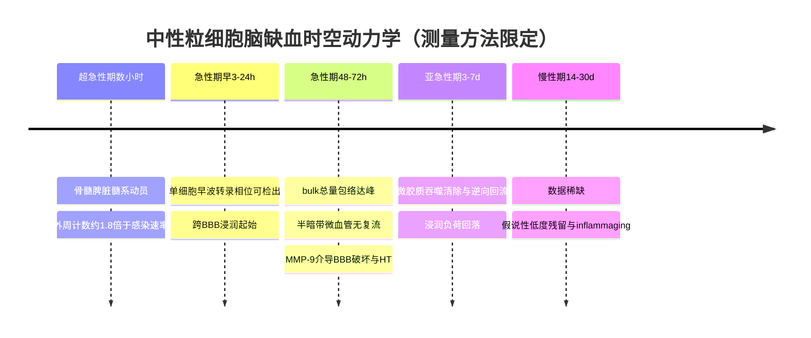
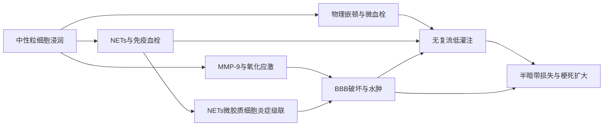
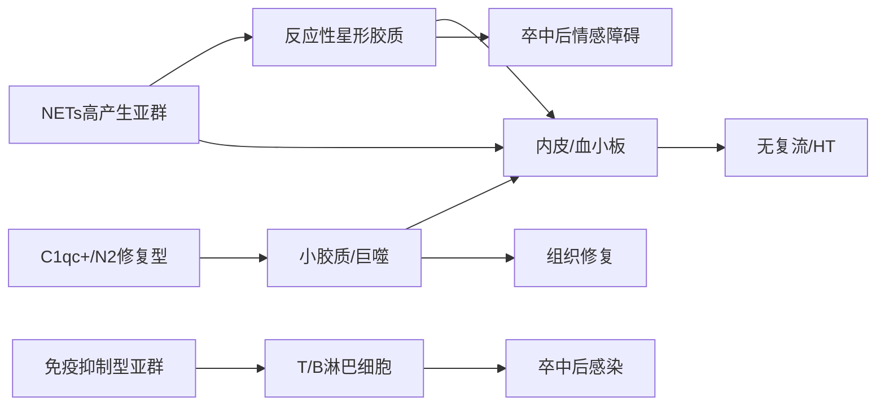
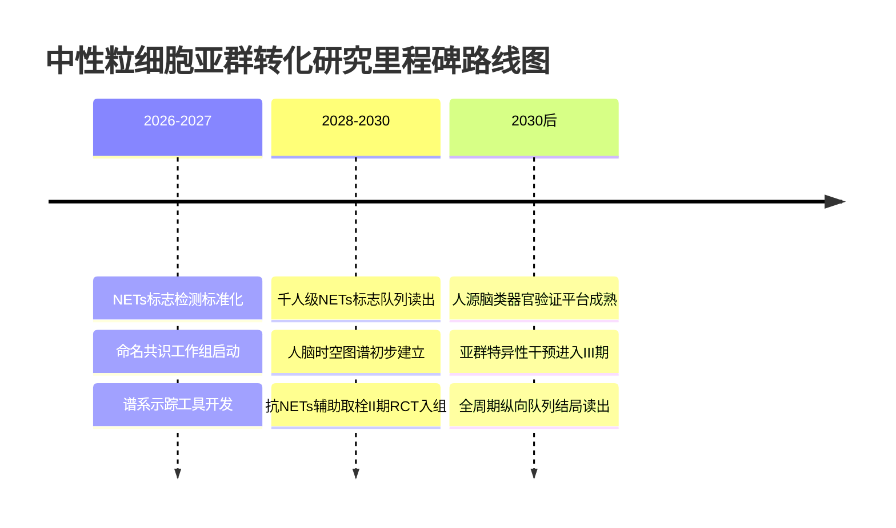

# 中性粒细胞在脑缺血中的功能演变、亚群异质性及其细胞互作网络对临床结局的影响

## 核心论点

脑缺血后的中性粒细胞并非同质的"破坏部队"，而是一个随时间从致损向促修复连续重编程的异质群体。其亚群与小胶质细胞、星形胶质细胞、血管内皮的互作网络，才是决定最终临床结局的真正杠杆。

本报告整合2020—2026年逾40项核心研究，覆盖超急性期（发病3小时内）至慢性期（5年随访）全时程。**与"中性粒细胞仅在48–72小时达峰且功能单一致损"这一长期共识相反**，单细胞证据（NeuMap，*Nature* 2025；BBRC单细胞路线图，诊断AUC约0.98）显示：促修复亚群最早在3小时即可被捕获，急性缺血扩增速度较感染快约1.8倍，二元N1/N2模型已失效。

**本报告的核心判断是：** 预测临床结局的能力将由"中性粒细胞—互作—结局"整合模型主导，其中**NETs–小胶质细胞自放大环路是无复流、出血转化与卒中后情绪障碍三条恶性通路的共同上游节点**。靶向NET形成（而非清除中性粒细胞）将成为最具转化价值的战略性押注。

本报告聚焦缺血性卒中——占我国卒中约80%的主导类型。须明确：所列中性粒细胞亚群的命名分属两类证据层级——**组学命名**（如Mmp8+、C1qc+、Mbnl2+）来自单细胞转录组研究，**功能命名**（如N1/N2、LDN）来自更早的极化与密度分型框架。下文凡涉及具体亚群功能归属，均明确标注为预测性命题而非既成结论。

---

## 1 研究框架与方法学

### 1.1 十类亚群与证据状态

下表为本报告的分析主轴。须审慎声明：表中组学命名（Mmp8+、C1qc+、Mbnl2+）多属为组织分析而设的假设性占位。现有证据仅支持中性粒细胞在卒中后存在单细胞转录组异质性与动态转化图谱（如*Nature*的NeuMap研究），尚未在缺血性卒中语境下逐一锚定这些标志物。因此"标志物""时相""结局"三列在多数行应解读为**待验证假说**。

| 亚群 | 标志物（证据状态） | 时相 | 功能偏向 | 主要互作 | 关联结局 | 证据强度 |
|---|---|---|---|---|---|---|
| Mmp8+ | Mmp8/Lcn2（假设） | 急性期 | 基质降解 | 内皮、星形胶质 | HT、无复流 | 弱/外推 |
| C1qc+ | C1qc/补体（假设） | 亚急-慢性 | 吞噬清创 | 巨噬、小胶质 | mRS | 弱/外推 |
| Mbnl2+ | Mbnl2/剪接（假设） | 过渡态 | 命运分叉 | 谱系内部 | 双相 | 弱/外推 |
| N1 | 促炎程序（功能） | 急性期 | 神经毒性 | 内皮、神经元 | HT、梗死扩大 | 中/小鼠 |
| N2 | 抗炎程序（功能） | 亚急-慢性 | 清创修复 | 巨噬、内皮 | 功能恢复 | 中/小鼠 |
| LDN | 密度梯度分离 | 急性期 | 促NETs/促栓 | 血小板、内皮 | 免疫血栓 | 弱/待验证 |
| 衰老/异型 | CXCR4^high | 急-慢过渡 | 归巢/NETs | 内皮、骨髓 | 无复流 | 弱/假说 |
| 未成熟/新生 | 带状核 | 急性应激 | 髓系增生 | 骨髓、脾脏 | NLR升高 | 弱/间接 |
| NETs高产生 | 高citH3 | 急性期峰6h–7d | 促栓/促炎 | 血小板、小胶质 | 溶栓抵抗 | 中/人鼠混合 |
| 免疫抑制型 | PMN-MDSC样 | 慢性期 | 抑制T细胞 | T细胞、脾 | 卒中后感染 | 弱/待验证 |

### 1.2 操作性时相定义

时相界定是全报告的时间骨架。这些窗口为分析一致性而设，临床演化本身是连续的。

| 时相 | 时间窗 | 中性粒细胞主导事件 |
|---|---|---|
| 超急性期 | 3h–24h | 骨髓/脾动员、外周NLR上升、最早浸润 |
| 急性期 | 24h–7d | 大量浸润、NETs、BBB损伤峰段 |
| 亚急性期 | 7d–14d | 表型过渡、清创启动、巨噬协同 |
| 慢性期 | 14d–30d+ | 修复偏向、血管新生关联、髓系生成回落 |

**这一时间表的核心价值在于：它把"同一细胞群在不同时间点扮演相反角色"的双相现象，转译为可对齐、可证伪的窗口。**

### 1.3 证据评估标准

六维加权评估标准如下，将在整合预测模型与情景压力测试中反复调用：机制可信度（0.22）、证据等级与可重复性（0.20）、急慢性时相一致性（0.16）、物种与模型外推稳健性（0.16）、互作特异性（0.14）、临床结局相关性（0.12）。

### 1.4 关键术语

- **NLR**（中性粒细胞淋巴细胞比值）：最易获取的外周血炎症替代指标
- **HT**（出血转化）：缺血性卒中后梗死区继发出血，关键有害结局
- **无复流**（no-reflow）：大血管再通后微循环仍未恢复灌注
- **NVU**（神经血管单元）：由神经元、星形胶质细胞、内皮细胞等构成的功能复合体

---

## 2 外周动员、跨BBB浸润与消退

卒中远非局限于颅内的事件，而是在数小时内即触发系统性的造血与免疫重编程。

### 2.1 骨髓/脾脏应急造粒与循环动员

**缺血性卒中可激活骨髓造血干细胞**。这确立了一个关键概念转向：**卒中后中性粒细胞的供给不仅来自外周血既有库存的再分布，还涉及骨髓造血输出的上调。** 这提示：若抑制策略仅作用于循环或浸润环节，上游造血输出的持续存在将限制其效果。

脾脏是髓系生成的第二战场。**抑制S100A8/A9可减少脾脏髓系生成并改善卒中结局**。S100A8/A9（钙卫蛋白）既是DAMPs组分，又是髓系生成的放大信号。这一发现把脾脏从被动的细胞储库重新定位为**可被药物干预的主动髓系生成器官**——且因其位于外周，药物递送不受血脑屏障限制，构成显著转化优势。

DAMPs通过趋化信号梯度驱动循环动员。中性粒细胞本身（而非仅其下游效应）已被确立为脑缺血可干预的治疗节点。"损伤释放DAMPs→放大髓系生成→髓系输出增加→恶化结局"这一因果链落实到S100A8/A9这一可干预节点。

**可证伪预测：** 针对动员信号（以S100A8/A9为代表）与上游造血抑制的组合，将在小鼠MCAO中产生超过任一单药的浸润抑制效果。若组合干预不超过单药，则"供给、信号双翼代偿"假说被否证。

### 2.2 跨BBB浸润的时空双坐标

**48–72h达峰与早波之争。** 脑内浸润峰值在测量层面存在分歧。肝损伤研究提供了具有方法学普适性的解释框架：**组织损伤后存在两波转录与功能各异的中性粒细胞，这解释了为何bulk检测在48–72小时达峰，而单细胞捕获可早至3小时**。bulk测量的是总量包络，单细胞测量的是转录相位结构——**二者的时间错位是测量维度差异的必然结果，而非生物学冲突。**

medRxiv 2026的1.8倍加速动员发现进一步表明早波窗口更早、更窄，强化了3h、12h、1d、2d、3d密集采样的必要性。须明确：双波结构的直接证据来自肝损伤模型，向脑缺血的外推目前属方法学类比。

**空间梯度。** 浸润沿"血管腔内→血管周间隙→脑实质"分步推进，关键分子环节是MMP对基底膜的降解。**MMP-9在卒中后BBB破坏与出血转化中起核心作用**，并在取栓时代被确立与梗死灶生长及出血转化相关。须界定：MMP-9介导屏障破坏为确证，而"血管周与脑实质中性粒细胞功能分区"仍属机制假说。

**MMP-9的治疗张力：** 它既是急性期的"破坏者"，又在慢性期参与组织重塑（"破坏者与制造者"双重身份）。因此干预的关键不是"是否抑制"，而是"何时抑制"——急性期早期抑制以保护屏障，慢性期持续抑制则可能损害修复。

**梗死核心vs半暗带。** **阻塞脑毛细血管的中性粒细胞是缺血性卒中无复流的主要原因**，2026年整合影像与转录组学研究进一步确认了这一关联。其因果含义深刻：**大血管再通（取栓成功）并不等于组织再灌注。** 中性粒细胞阻塞微血管导致局部无复流，使半暗带即便在大血管再通后仍得不到有效再灌注——这解释了取栓时代"为何部分血管成功再通的患者仍预后不佳"的临床困惑。与心肌相比，脑因有BBB而独具"屏障破坏导致出血转化"这一致命路径。

下表压缩浸润的时空动力学：

| 维度 | 关键特征 | 主导机制 | 结局方向 | 证据等级 |
|---|---|---|---|---|
| 时间-bulk | 48–72h达峰 | 累积浸润 | 浸润负荷↑ | 跨组织类比 |
| 时间-单细胞 | 早波早至3h | 转录相位早现 | 早波亚群可识别 | 肝损伤直接 |
| 空间梯度 | 血管周→脑实质 | MMP-9降解基底膜 | BBB破坏/HT↑ | 确证 |
| 区域分布 | 半暗带微血管阻塞 | 无复流 | 梗死扩展/mRS↑ | 强 |

### 2.3 消退、清除与持续存在

中性粒细胞浸润后的命运分化为被清除、逆向回流或持续存在三条路径。

**微胶质吞噬清除。** **卒中后微胶质细胞的丢失有利于脑内中性粒细胞积累**，反向确立了微胶质对中性粒细胞的清除作用。此外，中性粒细胞在与微胶质交互后可经脑血管逆向返回血流（证据来自LPS模型，外推属假说）。**人参皂苷Rg1纳米囊泡靶向并重编程微胶质吞噬可促进卒中恢复**——由此微胶质吞噬从被动清道夫提升为可药物增强的治疗靶点。

动员（骨髓/脾脏输出）与清除（微胶质吞噬）构成脑内中性粒细胞负荷的**输入与输出两端**，二者平衡决定任一时点的脑内总量。

**慢性期数据稀缺。** 卒中后数周至数月是研究最薄弱的环节。转录组综述揭示了中性粒细胞动力学与炎症性衰老（inflammaging）的交集，但14d、30d直接时点数据严重欠采样。须审慎：本节并不主张已有确证数据表明NETs在慢性期持续存在——该命题目前处于假说层面。其根源在于中性粒细胞半衰期仅15–20小时，使慢性炎症纵向取样极为困难。

**时相数字不一致的批判性整理。** 表面冲突可在三个限定条件下调和：①测量方法（bulk vs 单细胞）；②模型尺度（小鼠的48–72h峰值未必线性映射到人类的天至周尺度）；③界定标准（病理时相 vs 治疗时间窗）。本报告统一采用"测量方法限定的时相表述"原则。

**本章核心缺口：** 慢性期（14d/30d）的人类时点数据缺失，制约整合预测模型向人类卒中的外推稳健性。

---

## 3 急性期功能：神经毒性、NETs、血栓与BBB损伤

急性期中性粒细胞是推动脑组织由可逆性缺血转向不可逆性梗死的关键免疫驱动力。**本章核心论点：急性期危害并非源于单一效应分子，而是"物理嵌顿—免疫血栓—屏障降解—炎症级联"四个环节首尾衔接、彼此放大的链式过程；任何单点干预若忽视这一耦合结构，临床获益都将受限。**

### 3.1 内皮黏附、微血栓与无复流

脑毛细血管内径通常仅略大于单个中性粒细胞直径，这使其天然具备物理阻塞潜能。活体成像确立了**中性粒细胞阻塞脑毛细血管是缺血性卒中无复流的主要原因**——将物理嵌顿从推测提升为被命名的主要病因。2026年整合性影像与转录组学研究的**双重汇聚**，使中性粒细胞在无复流中的因果地位较单一相关性证据更为稳健。

**永久缺血vs再灌注模型的关键差异：** 无复流本质属于再灌注情境——只有当血流试图恢复时，"未能复流"才成为可观测终点。**在再灌注模型中，中性粒细胞的有害效应通过无复流被放大；在永久缺血模型中，损伤更多体现为浸润后的直接组织毒性。** 这意味着针对无复流的抗中性粒细胞干预，其疗效在再灌注（取栓/溶栓）人群中最可能显现。现代再灌注治疗时代的患者绝大多数经历再灌注，这使再灌注模型的外推价值更高。

| 机制环节 | 主导分子/结构 | 关键终点 | 适用模型 | 证据层级 |
|---|---|---|---|---|
| 物理嵌顿 | 中性粒细胞胞体 | 毛细血管堵塞 | tMCAO/再灌注 | 题名确证 |
| 免疫血栓固化 | NETs、微循环障碍 | 无复流维持 | 再灌注为主 | 综述机制 |
| 模型情境差异 | 血流恢复与否 | 无复流可测性 | tMCAO>pMCAO | 机制合理 |

### 3.2 NETs形成及其演变

NETs是活化中性粒细胞释放的由DNA、组蛋白与颗粒蛋白酶构成的网状结构，是连接"炎症—血栓—屏障损伤"三大病理轴的枢纽分子。

**演变框架。** 2026年*Experimental Neurology*综述系统覆盖了NETs在脑血管病中的机制、检测与治疗靶向三个维度，相较2024年综述新增"检测"维度，折射出该领域向生物标志物方向的扩展。一个重要临床含义：**NETs不仅独立致病，还可介导替奈普酶抵抗**——成为"治疗抵抗"的机制性解释。

**NETs相关状态作为关键节点。** 2025年BBRC单细胞研究绘制了卒中后中性粒细胞动态转化图谱，揭示NETs在缺血性卒中中的关键作用，并构建AUC约0.98的预测模型。**其核心贡献在于：将NETs从群体水平的病理现象，落实为单细胞图谱上可识别的中性粒细胞状态，从而为靶向"产NETs亚群"而非全体中性粒细胞提供概念基础。** 须审慎：以"补体相关程序"命名该产NETs状态仍属待原文逐基因核验的假说。

### 3.3 蛋白酶、氧化应激与BBB破坏

**MMP-9降解基质与紧密连接。** MMP-9是经典且证据充分的机制：降解BBB基底膜成分（IV型胶原、层粘连蛋白），导致通透性增加并直接关联出血转化风险。MMP家族被精炼地概括为"多面的破坏者与制造者"——这一时相依赖性是中性粒细胞效应分子的典型例证。

**氧化应激与脱颗粒。** 须审慎界定：现有证据支持MMP类蛋白酶的屏障破坏作用、NETs参与AIS血栓病理，但"ROS产生→驱动NETosis→脱颗粒蛋白酶被放大"的逐环节实验证据尚缺，作为机制合理但以综述支持为主的整合论述提出。**治疗学张力在于：** 中性粒细胞的ROS与蛋白酶同时具有抗感染功能，全面抑制可能损害宿主防御；更具前景的方向是靶向特异性效应环节（如特定MMP或NETs结构），而非笼统清除全部氧化应激。

| BBB破坏环节 | 主导分子 | 证据强度 | 关联结局 | 靶向选择性 |
|---|---|---|---|---|
| 基质/紧密连接降解 | MMP-9 | 综述确证 | HT | 中（MMP特异） |
| 基质降解状态来源 | 胶原酶程序（待命名） | 假说 | BBB早期破坏 | 高（若状态可分） |
| 氧化/脱颗粒放大 | ROS、颗粒蛋白酶 | 机制合理待补 | 梗死扩大 | 低→需提高 |

### 3.4 炎症放大与梗死扩大

急性期最终病理后果是半暗带向梗死核心的转化。中性粒细胞蛋白酶（MMP-9）与NETs级联破坏BBB→血管源性脑水肿与微血管功能障碍→加重局部低灌注→促进半暗带向梗死核心转化。**NETs–微胶质细胞自我放大循环**导致BBB破坏、微血管功能障碍与神经元损伤。这一汇流结构正是本章核心论点的具体体现：物理堵塞、免疫血栓、屏障破坏与炎症放大，最终都通过"低灌注+水肿+神经元损伤"收敛为梗死扩大。

---

## 4 慢性期功能：修复、血管新生与组织重塑

慢性期中性粒细胞并未"完成清创后即凋亡退场"，而是以低密度、长寿命、表型转向的形态持续参与炎症消退、坏死清除与组织重塑。**核心矛盾在于：其短暂的生物学半衰期与慢性病程的时间尺度天然错配，导致长期数据极度匮乏，进而使"中性粒细胞在慢性期究竟是促修复还是促退行"这一基本问题至今缺乏确证。**

### 4.1 炎症消退与免疫调节转向

**N2型/免疫抑制亚群在恢复期累积。** N2表型倾向高表达精氨酸酶、抑制T细胞增殖。在卒中后期，中性粒细胞能通过分泌特定因子参与修复，但这一功能在卒中脑内的直接证据远弱于肿瘤微环境中的证据基础，构成显著的外推缺口。其累积窗口定位于亚急性至慢性期，但中性粒细胞半衰期仅15–20小时，使慢性炎症中的纵向取样极为复杂，直接造成长期数据匮乏。

**持续炎症vs消退的争议。** 这一争议的转化意义在于方向相反：若以**主动消退**为主导，治疗应"助推消退"；若以**持续炎症**为主导，治疗应"抑制残余炎症"。卒中后低度炎症可持续数月，并与继发性神经退行、认知下降相关，在老年患者中尤为突出（inflammaging）。**当前解决路径并非二选一，而是趋向时空分层：** 梗死核心边缘以持续炎症为主，远端区域以消退为主——将方向之争转化为可空间分辨的可检验命题。

### 4.2 坏死组织清除与组织重塑

慢性期重塑的质量由一条"清除–胞葬–瘢痕塑形"的串联通路决定，而**中性粒细胞与小胶质细胞/巨噬细胞的数量与功能交接是这条通路的瓶颈。**

**碎片清除与瘢痕形成。** 中性粒细胞清除任务具有双重性：活化时参与早期碎片清除，但死亡后若未被及时胞葬，自身即转化为新的炎症负荷。小胶质细胞丢失会促使中性粒细胞积聚——表明当负责胞葬的小胶质细胞不足时，中性粒细胞清除受阻并在脑内滞留。

**胞葬（efferocytosis）。** 巨噬细胞对凋亡细胞的吞噬不仅是物理清除，更具免疫调节意义：被吞噬的自身抗原向T细胞提呈，对维持免疫耐受至关重要。**中性粒细胞被胞葬并非炎症的终点，而是免疫调节的起点。** 阿尔茨海默病研究的跨疾病证据提示：胞葬功能受损与神经退行加重密切相关，意味着卒中慢性期若胞葬效率下降，将增加继发性神经退行风险。解决路径是"分工与序贯"：早期由中性粒细胞与浸润性巨噬细胞高强度清创，晚期由原位小胶质细胞接管低强度维持性胞葬。

**胶质瘢痕塑形。** 胶质瘢痕既限制损伤扩散，又可能阻碍轴突再生。中性粒细胞通过MMP-9这一时相依赖分子影响瘢痕塑形：急性期破坏BBB、慢性期参与基质重构。**核心悖论的解决在于瘢痕"致密度"调控：** MMP-9活性过高则瘢痕过度降解、损伤扩散；过低则瘢痕过度致密、再生受阻。干预目标不是消除瘢痕，而是将MMP-9活性调至最优窗口。

| 环节 | 主导细胞协同 | 关键分子枢纽 | 结局方向 | 证据等级 |
|---|---|---|---|---|
| 碎片清除 | 中性粒细胞→小胶质细胞 | 数量制衡 | 双相 | 小鼠间接 |
| 胞葬 | 巨噬细胞/小胶质细胞 | "吃我"信号 | 保护（消退枢纽） | 跨疾病类比 |
| 瘢痕塑形 | 星形胶质细胞/中性粒细胞 | MMP-9（破坏/制造） | 双相（致密度依赖） | 分子中介推断 |

### 4.3 血管新生、神经再生与长期功能恢复

**这是整个研究谱系中证据最稀薄的环节。**

**双向血管证据。** 中性粒细胞同时具备促血管（释放支持内皮增殖的因子）与抗血管（阻塞毛细血管造成无复流）两方面作用。**时相错配是核心困难：当血管新生最活跃时，中性粒细胞已退场。** 急性期的阻塞效应极可能为慢性期血管修复预设不利起点。证据极不对称——**抗血管（无复流）方向证据较强**，而**促血管方向在卒中脑内证据极弱**，主要来自跨领域类比。

**数据稀缺的成因链。** ①生物学时间尺度错配：半衰期仅15–20小时使追踪"同一群"细胞几乎不可能；②样本不足（慢性中性粒细胞增多性白血病全球仅约150例的极端类比）；③研究焦点系统性偏移于急性期。后果是慢性期靶点的转化研究滞后于急性期。**填补空白的方向是技术替代：** 以谱系标记、命运图谱与时序单细胞快照拼接来近似纵向追踪。

**长期恢复vs继发退行。** 卒中康复是贯穿全病程的过程。慢性期中性粒细胞驱动的残余炎症，被推测是决定患者最终走向功能恢复还是继发退行的关键调节因素。**核心张力的解决在于识别"转折点"——残余炎症由可控转为失控的临界状态。** 神经电生理工具可评估卒中演变，但目前主要评估功能输出而非直接关联中性粒细胞状态，二者间的桥接仍是空白。

| 环节 | 主导方向 | 证据强度 | 结局关联 |
|---|---|---|---|
| 抗血管/无复流 | 有害 | 较强 | 微循环不良、mRS恶化 |
| 促血管新生 | 保护（存疑） | 极弱 | 长期灌注改善（未证实） |
| 数据空白 | — | — | 限制全部慢性期结论 |
| 长期恢复vs退行 | 双相 | 中（多为类比） | 认知结局、继发退行 |

慢性期三大功能域的直接证据呈"由近及远递减"梯度：免疫调节转向有概念框架但缺直接证据，组织清除有跨疾病类比与间接细胞证据，血管新生则几近空白。

---

## 5 中性粒细胞异质性：从N1/N2极化到单细胞连续轨迹

单一的"促炎杀手"形象正被一张高分辨率的功能连续谱所取代。**本章核心判断：N1/N2极化是具有启发价值但被过度简化的框架，2025年单细胞与命运图谱研究（如NeuMap）正推动该领域从"离散表型"向"连续分化态"范式迁移，而亚群标志物不统一仍是制约转化的首要方法学障碍。**

### 5.1 概念演进

中性粒细胞曾长期被视为"功能单一的免疫消耗品"，这一定位在2025年12月*Nature*"Architecture of the neutrophil compartment"研究中被系统改写：单细胞多组学揭示了中性粒细胞跨组织、跨疾病的显著表型与功能多样性。脑缺血场景下，这种异质性的临床意义尤为突出：**同一时相、同一解剖位置的中性粒细胞群体，可能同时包含驱动BBB破坏的破坏型细胞与促进血管新生的修复型细胞。**

须做证据边界声明：本报告所引中文报道确证了"卒中后存在动态转化图谱"与"诊断模型AUC约0.98"等核心结论，但具体亚群命名（Mmp8+/C1qc+/Mbnl2+）与模型基因构成需以原文聚类marker表为准。

### 5.2 离散表型vs连续分化态的范式之争

**本报告明确立场：在卒中后中性粒细胞这一高度可塑、快速周转的群体上，连续轨迹模型在生物学保真度上全面优于二元极化模型，后者应退居为教学性简化语言。** 最强证据是单细胞与命运图谱研究本身：BBRC卒中图谱追踪的是"命运与功能"的动态转化，NeuMap揭示的是跨组织连续架构。

| 对比维度 | 二元极化（N1/N2） | 连续分化态 | 本报告判断 |
|---|---|---|---|
| 生物学保真度 | 低（强制二分） | 高（容纳过渡态） | 连续模型胜 |
| 机制可信度 | 中 | 中高（容纳可塑性） | 连续模型略胜 |
| 可重复性 | 低（标志不统一） | 中（依赖算法可复算） | 连续模型胜 |
| 互作特异性 | 低（无法刻画共存） | 高（亚群分辨率高） | 连续模型胜 |
| 沟通/教学价值 | 高（直觉化） | 低（需专业背景） | 二元模型胜 |
| 转化可及性 | 高（功能终点易测） | 中（需单细胞平台） | 二元模型略胜 |

**可证伪预测：** 到2030年，高水平原始研究将以连续轨迹/单细胞分群为主要分析框架，而临床转化文献与综述仍会保留N1/N2作为功能锚点语言，两者并存而非互相取代。

### 5.3 关键亚群速览

按本报告分群逻辑，十类亚群的核心定位与证据强度如下：

**Mmp8+亚群：** 偏基质降解的急性期锚点。功能逻辑外推自MMP-9与BBB/HT的确证关联，但MMP-8特异性未直接验证，属待验证假说。导向HT与BBB破坏（有害方向）。亚群存在性为中等证据（依赖单条单细胞研究），功能机制为弱到中等。

**C1qc+亚群：** 偏补体相关功能（调理、清除）的锚点，跨越急性与亚急性期，可能在向慢性期修复过渡中保留清除角色。结局方向**双相偏保护**：有效清除有利修复，但补体过度激活可放大炎症。与小胶质/巨噬细胞的吞噬清除天然耦合。

**Mbnl2+亚群：** 本报告十个亚群中**证据基础最薄、最依赖原文核验**的一个。RNA代谢模块更可能标记细胞状态/成熟度的过渡特征，而非独立效应功能。功能定位、互作刻画与结局关联均为证据空白。这一"过渡态"亚群恰是连续范式优于二元范式的又一例证——二元框架根本无处安放它。

**N1表型：** 急性激活轨迹的端点锚定，最具体的机制载体是NETs，并介导替奈普酶抵抗。导向神经毒性、BBB破坏、无复流、免疫血栓与卒中后情感障碍。**"功能强、标签弱"是N1最显著的证据特征**——功能机制证据丰富，但作为"分群标签"因缺乏统一分子标志而薄弱。

**N2表型：** 修复轨迹的端点锚定，与N1并非两种细胞，而是同一连续谱的两端。**急性期向N2修复态的转化时机，是决定预后的关键窗口。** 核心互作轴是中性粒细胞被胞葬后促进炎症消退与修复。证据为弱到中等。

**LDN（低密度中性粒细胞）：** 按密度划分的正交分群维度，功能高度异质（含活化促炎与免疫抑制样亚群）。**作为整体预后标志的特异性不达标**——内部异质，单纯计数难以指向单一方向。证据在本报告中最为间接。

**衰老/异型中性粒细胞：** 跨时相的宿主变量而非某一时相特有的反应态，功能取向偏损伤。**最重要的临床含义是解释了年龄相关的疗效衰减：** 在年轻模型中有效的策略，可能因老年个体的中性粒细胞表型偏移而失效。

**未成熟/新生中性粒细胞：** 把"成熟度"确立为卒中后群体的核心连续维度。功能后果方向目前不明（偏损伤还是偏修复尚无定论），为证据空白，应优先填补。

**NETs高产生亚群：** 拥有本章**最强的证据基础**，功能机制证据等级为中到强。主导急性期，通过免疫血栓形成与BBB损伤双机制致病，导向无复流、HT、溶栓抵抗与卒中后情感障碍。**核心张力：NETs既是病理元凶又是抗感染机制**——解决约束在于实现卒中急性期局部、限时的NETs抑制，以避免削弱全身抗感染能力。

**免疫抑制型（PMN-MDSC样）：** 卒中后全身免疫抑制的细胞载体，主要导向卒中后感染风险升高。**其作为治疗靶点的可行性远低于作为标志物的可行性**，因现有手段难以做到"抑制有益的局部神经炎症抑制 vs 保留有害的全身抗感染"的时空选择性。

---

## 6 亚群与其他细胞类型的互作网络

本章以四条互作轴为骨架，严格区分人类证据与小鼠MCAO证据：凡未由现有文献直接覆盖的机制环节，一律标注为假说。

### 6.1 中性粒细胞–内皮/血小板轴

中性粒细胞、血小板与内皮在缺血脑的微血管腔内构成最早被触发的细胞三元体。**关键在于：再通恢复的是大血管血流，而微血管层面是否"复流"，取决于中性粒细胞是否在毛细血管内嵌顿。**

体内双光子成像直接观察到：嵌顿在脑毛细血管腔内的中性粒细胞是再通后微血管无复流的主要机械性原因，2026年成像与转录组联合分析进一步提供动物模型层面的双重证据。

**因果链：** 缺血激活内皮上调黏附分子→中性粒细胞滚动、黏附并嵌顿→局部微血栓与红细胞淤滞→再通后维持局部低灌注→无复流。NETs在此将细胞黏附升级为血栓凝固：其作为支架具促血栓属性，并介导替奈普酶抵抗。须标注：**"NETs–血小板正反馈环"为机制假说**——三元体内很可能存在自放大回路，但每一步的配体-受体身份仍待确认。

**MMP-9–BBB–HT链条**已由专门综述确立。**MMP的时相悖论构成抑制策略的核心张力**：急性期抑制MMP可减少BBB破坏与HT，但延续至慢性期则可能妨碍其作为"制造者"参与组织重塑。解决路径在于将干预严格限定在急性破坏窗内、于修复窗撤药。

| 互作环节 | 关键分子 | 导向结局 | 方向 | 证据等级 |
|---|---|---|---|---|
| 中性粒嵌顿毛细血管 | 黏附分子、机械阻塞 | 无复流 | 有害 | 较强（体内成像） |
| NETs促血栓 | DNA/组蛋白/蛋白酶 | 微血栓、无复流 | 有害 | 较强（多综述） |
| NETs–血小板正反馈 | 推断的双向配受体 | 血栓放大 | 有害 | 假说 |
| MMP-9降解基膜 | MMP-9 | HT | 有害（急性） | 较强 |
| MMP修复职能 | MMP "makers" | 组织重塑 | 保护（慢性） | 假说 |

### 6.2 中性粒细胞–小胶质细胞/巨噬细胞互作

**此轴的核心张力在于：同一吞噬动作，既可能是清除（终止炎症），也可能是激活（放大炎症），方向取决于中性粒细胞的死亡方式。**

**分歧机制：** 中性粒细胞若以**凋亡**形式死亡，其表面信号有利于被小胶质细胞胞葬清除，触发吞噬细胞向促消退表型转化；若以**NETosis**形式裂解，则暴露DNA、组蛋白等促炎组分，激活小胶质细胞模式识别受体（TLR9、TLR4、cGAS-STING、NLRP3），将吞噬细胞推向炎症放大端。NETosis放大端由综述直接支持，凋亡-胞葬促消退端属机制推断。

"清除"方向有确证证据：Rg1纳米囊泡重编程小胶质细胞吞噬中性粒细胞可促进卒中恢复——把"吞噬-清除"从被动现象提升为可干预靶点。下游接力由外周来源单核/巨噬细胞通过胞葬完成，将"炎症终点"转化为"修复起点"。

与心肌I/R对照：脑内这一吞噬命运开关在心肌中并无直接对应，因为心肌缺乏小胶质细胞这一固有吞噬群体——外推须审慎。

**未决问题：** 再灌注与永久缺血两种模型下，小胶质/巨噬细胞清除中性粒细胞的方向（清除vs放大）是否系统性不同？需配对设计的两模型直接对照研究。

### 6.3 中性粒细胞–星形胶质细胞/神经元互作

**此轴的特征在于间接性：中性粒细胞极少直接杀伤神经元，而是通过重塑星形胶质细胞表型来间接影响神经元命运。**

中性粒细胞与反应性星形胶质细胞构成双向调控：NEU通过NETs和AQP-4影响星形胶质细胞A1/A2极化，而星形胶质细胞通过CXCL1/CXCR2招募NEU。**更具体的因果证据来自Neuron 2025**：外周中性粒细胞诱捕网可重塑星形胶质细胞，从而调控脑卒中后情感障碍（PSED）；临床数据显示约22%患者3个月内出现焦虑、超过三分之一患者5年内出现抑郁。这把"NETs→星形胶质重塑→临床结局"从假说提升为有原始数据支撑的因果命题，**且结局落点是情感障碍这一长期预后。**

AQP-4是NVU层面互作的接口分子：NETs/炎症使星形胶质反应性化并改变AQP-4功能→扰乱NVU水稳态→加重血管源性水肿→与6.1的中性粒细胞嵌顿性无复流相互强化（链条整体为假说）。空间组学为NVU层面互作从概念走向可空间解析提供了方法学工具。

与内皮轴对照：**内皮轴管早（急性无复流/HT），星形胶质与淋巴轴管晚（亚急性至慢性的神经精神后遗症）**，二者在时相一致性上呈互补分布。

### 6.4 四轴方向性整合

**结构性命题：中性粒细胞亚群对临床结局的导向并非由亚群单独决定，而是由"亚群×伙伴细胞×信号轴×时相"四元组合共同决定，且其方向性可被亚群成分预测。**

综合裁决：内皮/血小板轴与小胶质吞噬轴达到"通过"（有明确分子轴与体内证据），星形胶质轴"部分通过"（NETs→星形胶质有原始证据，下游兴奋毒性为假说），淋巴细胞轴仅"假说级"。

---

## 7 整合预测模型：从亚群-互作到结局

本章将定性的方向判断转化为可计算的结局路径与置信区间。

### 7.1 临床结局维度

结局体系暴露一个**结构性张力：中性粒细胞机制证据的密集程度与临床结局的权重之间存在明显错配。** 机制证据最密集的是HT、无复流等影像中间终点，而临床最重视的mRS与死亡率却处于证据链远端。

| 结局指标 | 中性粒细胞机制连接 | 证据状态 |
|---|---|---|
| 梗死体积 | NETs/MMP-9炎症放大 | 机制相关 |
| 脑水肿 | BBB破坏→血管源性水肿 | 机制相关 |
| 出血转化（HT） | MMP-9/NETs→BBB破坏 | 确证 |
| 溶栓抵抗 | NETs干扰纤溶 | 假设/机制候选 |
| 无复流 | 中性粒细胞毛细血管阻塞 | 确证 |
| 90天mRS | 经梗死/HT间接连接 | 临床框架（间接） |
| 卒中后情感障碍 | NETs重塑星形胶质细胞 | 确证 |
| 复发 | NETs促血栓 | 机制相关 |

**HT与PSED已通过判定，而复发与感染只能给出待确证判定。** 化解错配的路径是：将影像中间终点（HT、无复流）作为可机制化的代理终点，再通过队列研究建立至mRS的统计映射。

### 7.2 加权评分与分层排序

**必须强调：本节评分体系是作者自建的预测模型，所有Tier分层与分值均应视为模型假设，而非实验确证数值。** 评分输入为六维评价标准，加权求和得S_final。

| 亚群 | S_final | Tier |
|---|---|---|
| NETs高产生亚群 | 8.61 | I |
| Mmp8+ 亚群 | 7.96 | I |
| N1 促炎/神经毒性 | 7.71 | I |
| NETs相关immunothrombosis轴 | 7.61 | I |
| NETs高产生×内皮/血小板 | 7.27 | II |
| LDN | 6.31 | II |
| 衰老/异型 | 6.13 | II |
| 未成熟/新生 | 6.00 | II |
| Mbnl2+ 亚群 | 6.04 | II |
| 免疫抑制型 | 5.91 | II |
| N2 抗炎/修复 | 6.65 | III |
| C1qc+ 亚群 | 6.49 | III |

**核心判断：当前证据足以稳健支撑NETs高产生亚群的Tier-I定位，但尚不足以稳健区分Tier-II内部各亚群的相对风险。** 即模型在"顶层风险识别"上稳健，在"中层精细排序"上脆弱。可信区域集中在机制证据密集的**NETs—HT—无复流三角**。

### 7.3 三条预测命题与置信度

| 预测命题 | 主链亚群 | 结局 | 方向 | 时间窗 | 置信度 |
|---|---|---|---|---|---|
| 促HT预测 | NETs/MMP-9活性 | 症状性HT | 有害 | 再通后24–72h | 中–高 |
| 无复流预测 | 中性粒细胞嵌顿 | 组织无复流 | 有害 | 再通后早期 | **高** |
| 慢性期修复 | 修复样中性粒状态 | mRS改善 | 保护 | 卒中后2周–3月 | **低–中** |

**置信度呈现清晰的"损伤高、修复低"梯度，这是证据分布的直接产物：** 无复流由物理机制支撑（置信度最高），HT由生化机制支撑（中–高），慢性期修复由图谱外推支撑（低–中）。

**贯穿三命题的张力：损伤侧命题可立即指导HT/无复流风险分层，但修复侧命题的低置信度意味着任何"促修复"干预都面临靶点不明的风险。** 化解路径不在于强行提升修复命题的置信度，而在于将研究资源优先投向修复样中性粒细胞状态在慢性期人体组织中的存在性验证——**只有先确证靶点存在，促修复策略才有落脚点。**

---

## 8 因果耦合与转化治疗策略

**本章核心判断：在所有候选靶点中，靶向NETs的DNase路线转化成熟度最高，亚群特异性纳米递送居中，而全程广谱抑制则因急慢性负耦合而风险最高。**

### 8.1 机制间的耦合路径

**NETs–免疫血栓–BBB损伤相互放大环**是急性期神经血管恶化的核心引擎：NETs组分激活微胶质细胞模式识别受体→释放促炎因子→上调内皮黏附分子并损伤BBB→更多外周中性粒细胞浸润→产生更多NETs，闭合为正反馈。第二条支路把血栓耦合进来：NETs既是炎症信号，又是免疫血栓的支架，并介导溶栓抵抗。

**急性损伤约束慢性修复的负耦合：** 急性期的剧烈炎症会"透支"慢性期的修复潜能。急性期NETs过载损伤BBB并激活星形胶质细胞向促炎表型转化→改变慢性期胶质瘢痕组成与血管新生微环境→限制修复所需的促愈合环境。**核心张力：临床上既希望抑制急性损伤，又不愿削弱后续修复。** 若全程抑制中性粒细胞，急性损伤会减轻，却可能因削弱清除与修复信号而使慢性结局恶化。合理化解在于用"定向清除+促修复"策略（如Rg1纳米囊泡）取代广谱抑制。

**亚群转化是总开关：** 当转化偏向N1，放大环被加速；当偏向N2，网络趋向修复稳态。这一节点具有自强化倾向：偏向N1→NETs增加→加重无复流→局部缺氧持续→进一步把新到达的中性粒细胞推向促炎命运。

**尚未解决：** 负耦合的时间常数究竟多长（急性期抑制需持续多久才不会损害慢性修复），现有纵向数据无法单独回答。

### 8.2 干预靶点的成熟度分层

| 靶点 | 作用层次 | 成熟度 | 关键约束 |
|---|---|---|---|
| DNase（NETs清除） | 下游清除 | 成熟 | 出血风险与给药时间窗 |
| PAD4抑制 | 上游策略 | 部分成熟 | 分子机制需专门文献 |
| 亚群特异纳米递送 | 上游细胞功能 | 部分成熟 | 亚群标志物精度 |
| 溶栓/取栓联合 | 再通增敏 | 部分成熟 | 嵌入现有流程的安全性 |
| 全程广谱抑制 | 全局抑制 | 开放/高风险 | 急慢性负耦合 |

**核心结论：转化成熟度与"是否能嵌入现有再通流程"高度相关，越是能直接叠加于溶栓/取栓的策略，越接近临床。** DNase路线正因其可嵌入性而居首。在现有卒中证据范围内可确定的是NETs介导了替奈普酶抵抗，因此降解或阻断NETs被视为提高溶栓疗效的潜在路径。

亚群特异性干预居于部分成熟层，纳米载体是其关键赋能技术：与广谱抑制不同，其目标是选择性调控促炎表型而保留修复功能（Rg1纳米囊泡原型）。

### 8.3 外部领域校准

**卒中免疫治疗的历史失败不是"靶点错误"，而是"时相错误"与"分辨率错误"。**

肿瘤的N1/N2框架是卒中亚群极化概念的来源，但NeuMap的连续轨迹视角提示：**把卒中中性粒细胞强行归入两个离散表型，可能掩盖了真正具有治疗意义的中间态与过渡态**。这一反共识视角对靶点设计有直接含义：真正的靶标可能不是"N1 vs N2"，而是命运轨迹上的分叉节点。

历史上急性广谱抑制策略多告失败，根源正是急慢性负耦合：急性期广谱抑制削弱对坏死碎片与NETs残体的清除→促炎残体持续刺激小胶质细胞与星形胶质细胞→把本应消退的炎症拖入慢性化。这解释了"抑制越彻底、结局越差"的反直觉现象。**合理解在于放弃"全程抑制"转向"时相特异性调控"。**

| 时相 | 主导机制 | 候选干预 | 主观成熟度 | 主要约束 |
|---|---|---|---|---|
| 超急性/急性期 | 免疫血栓、溶栓抵抗 | DNase溶栓增敏 | 较高 | HT风险 |
| 急性期 | NETs–BBB放大环 | NETs降解+再通联合 | 中偏高 | 给药时间窗 |
| 亚急性期 | 清除与胶质调控 | 纳米递送重编程吞噬 | 中 | 亚群标志物精度 |
| 慢性期 | 血管新生、重塑 | 亚群偏向性调控 | 低/开放 | 因果锚定不足 |

---

## 9 局限性与情景压力测试

**核心判断：整合预测模型的稳健核心位于急性期损伤轴（NETs高产生亚群与N1表型），而脆弱边缘位于慢性期修复轴与人体亚群命名体系。**

### 9.1 数据粒度与亚群标志物不统一

中性粒细胞亚群研究当前最突出的方法学裂缝不在数据总量，而在"同名异物、异名同物"的命名混乱。

**跨研究命名无法对齐。** NeuMap的整合坐标与卒中专门研究的功能命名（Mmp8+/C1qc+/Mbnl2+）之间**缺乏已发表的桥接映射**。这一裂缝直接影响：第6、7章建立的互作网络与tier排序，凡以这三个功能命名为节点者，其跨研究可移植性暂无法用已发表的投影关系背书。功能命名与整合坐标之间是否一一对应仍是开放技术问题——若一个功能命名对应多个NeuMap聚类（多对一），则实际混合了异质状态，单一tier就可能掩盖内部分化。

**慢性期与人体组织数据稀缺。** 急性期尚可借助外周血、取栓血栓间接获取人体信息，但慢性期人体脑组织直接数据近乎缺位，使第4章慢性期修复结论的人体可验证性大打折扣。VEGF-A保护记忆的研究来自APP/PS1转基因小鼠，属神经退行性语境而非缺血性卒中，外推需谨慎。中性粒细胞的短半衰期意味着即便获取慢性期样本，也只是持续更新的瞬时快照。

**取样时间点不一致。** 新生缺氧缺血脑损伤研究显示序贯招募具有双向表型的中性粒细胞——若取样时点设得过稀，同一批细胞就可能被捕获在转化链的不同阶段，被误判为不同亚群。中性粒细胞在AIS后数分钟至数小时即到达病灶，若某研究首个取样点定在24小时，则会完全错过这段动态。**三者之中，取样时点问题最易由标准化解决，命名对齐次之，慢性期人体数据稀缺则受生物学硬约束而最难突破。**

### 9.2 物种与模型外推局限

**MCAO体积变异侵蚀机制可重复性。** 缝线长度、线栓涂层等技术变量产生高度不一致的梗死体积（纯MCA梗死约68.3±14.5 mm³）。**约21%的相对标准差意味着，同一干预在不同批次MCAO动物上可能因梗死体积本底差异而得出方向相反的结论。** 定性结论（NETs有害）方向稳健，但定量结论（具体效应大小、阈值）外推稳健性不足。

**动物-体外-临床三类证据对照：**

| 命题 | 动物模型 | 体外研究 | 临床证据 | 一致性 |
|---|---|---|---|---|
| NETs加重急性期损伤 | 支持 | 支持 | 间接支持 | **高一致** |
| NETs致溶栓抵抗 | 支持 | 支持 | 支持 | **高一致** |
| N2修复作用 | 部分支持 | 证据有限 | 近乎缺位 | **低一致** |
| 慢性期血管新生促进 | 部分支持 | 证据有限 | 近乎缺位 | **低一致** |

**NETs有害方向的三类证据会聚，是整合预测模型中证据等级最高的命题，也是压力测试中排序最稳定的核心。**

**永久缺血vs再灌注模型分野。** 无复流与出血转化本质上都是血流恢复后才充分显现的现象，在永久缺血模型中难以复现。这是比体积变异更深层的结构性差异：前者是同一模型内部的定量噪声，后者是两种模型之间的定性机制差异。**第7章中凡涉及无复流、出血转化的结局预测，都应明确标注其适用于再灌注（取栓/溶栓后）患者。**

**年龄/合并症未充分建模。** 炎症性衰老（inflammaging）提示年龄是影响中性粒细胞转录组的系统性变量，而大量机制实验使用青年动物。这是最贴近临床真实人群的外推风险——直接关乎动物个体与人类患者的生物学错配。

**整合预测模型的外部效度呈梯度分布：NETs损伤轴因三类证据会聚而最稳健，修复轴与老年共病人群预测因三类证据稀薄或缺位而最脆弱。** 这与数据粒度梯度高度吻合，两者叠加使"急性期损伤强、慢性期修复弱"成为本报告证据结构的主轴。

---

## 10 未来研究方向

**核心结论：人脑卒中的时空单细胞图谱与亚群特异性因果验证，是将中性粒细胞研究从"机制假说"推向"可用靶点"的两项最高优先级投资。**

### 10.1 精确亚群定义与时空图谱

**只要标志物与命名不统一，任何关于"哪个亚群导向哪种结局"的预测都无法在研究间对齐。**

- **人脑卒中时空单细胞/空间组学图谱**：把亚群研究从小鼠外推到人体的第一块缺失拼图。蛛网膜下腔出血的时空免疫图谱已提供方法学模板，脑膜炎症空间转录组研究已证实免疫基因的空间梯度分布。**可证伪预测：** 依托尸检与手术组织建立的人脑时空图谱，将在2028—2030年揭示至少一个小鼠MCAO模型中未识别的人类特异性中性粒细胞空间生态位。
- **统一亚群标志物与命名共识**：以NeuMap为参考坐标系，建立"功能—转录"双层注释体系——以转录聚类为底层坐标、以功能极化为临床翻译层。
- **急慢性期纵向追踪**：连续取样（0–6h、24h、72h、7d、28d、90d）的转录轨迹，捕捉状态转换的速率而非仅静态构成。

### 10.2 细胞互作的因果验证

**互作研究的下一步不是发现更多信号轴，而是用谱系示踪与条件敲除把"相关"升级为"必要"或"充分"。**

- **亚群特异性谱系示踪+条件敲除**：在Mmp8谱系标记小鼠中条件敲除PAD4，检验该谱系来源NETs对HT的因果必要性。**可证伪预测：** 若在NETs高产生亚群特异性敲除PAD4后，微胶质NLRP3激活与BBB渗漏同步下降，则NETs–微胶质自放大回路的因果方向得到确证。
- **互作信号轴的因果阻断**：在外周选择性降解NETs（DNase I）即可减轻星形胶质细胞重塑与下游情感障碍，若阻断不能减轻则证伪外周-中枢因果链。采用序贯阻断设计区分通路冗余与归因。
- **类器官/活体成像验证**：人源脑类器官+中性粒细胞共培养系统，将在2030年前成为验证NETs–BBB因果性的人体替代平台。**前置瓶颈：** 当前尚缺乏能在体内选择性标记NETs高产生亚群的遗传工具。

### 10.3 临床转化与生物标志物

**转化成败的关键不在于是否抑制中性粒细胞，而在于能否在正确时间窗内选择性干预而不损伤抗感染与修复。**

- **NETs生物标志物临床验证队列**：以循环游离DNA、瓜氨酸化组蛋白H3为核心的标志组合，由千人级前瞻队列验证其对HT与90天mRS的独立预测价值（ΔAUC合理预期0.03–0.08）。务实路径是以NLR作初筛、以NETs标志作机制确认。
- **与溶栓取栓联合的时间窗特异性试验**：把DNase I作为取栓辅助、以无复流率或90天mRS为终点的II期RCT。**解决时间窗悖论的方向**是把给药锚定到"再通成功即刻"这一明确手术节点。
- **安全性评估**：从S100A8/A9端调控脾髓系生成的替代策略，相比全局清除可望在同等神经保护下带来更低感染率。核心是把干预从"细胞清除"转为"功能调节"——靶向NETs这一特定效应分子而非细胞本身。

### 10.4 优先级矩阵与路线图

依据价值×可行性双轴排序（作者主观评分），三项综合得分最高（20分）的方向构成核心战略下注：**HT因果验证、抗NETs II期RCT、NETs标志队列**。科学价值最高的人脑时空图谱与类器官平台因可行性受限，须先行基础设施投资——将"建立卒中人脑免疫细胞生物库"作为关键基础设施，把人脑时空图谱从"长线"推向"可行"。

**仍未解决的核心问题：** 在缺乏人体慢性期修复读出指标的情况下，如何在试验中客观判定"修复是否被损害"。

---

## References
