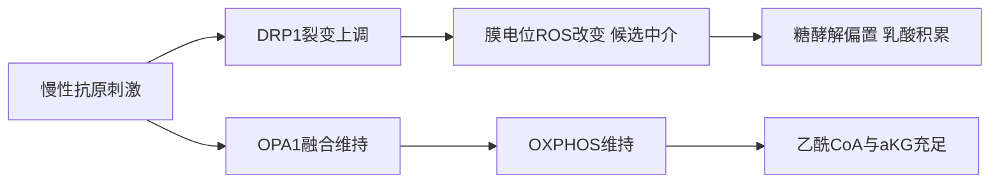
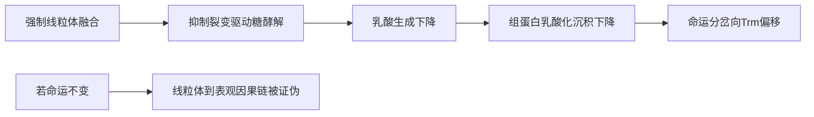

# 慢性抗原刺激下CD8⁺ T细胞线粒体动力学驱动终末耗竭与Trm命运分岔：机制综述与定量建模框架

## 摘要

线粒体动力学的融合/裂变平衡构成慢性抗原刺激下CD8⁺ T细胞命运分岔的上游决定枢纽。**Drp1主导的线粒体裂变提升糖酵解通量、促使乳酸积累并改变α-酮戊二酸与乙酰辅酶A供给，从而把代谢状态转译为可遗传的表观印记**——组蛋白乳酸化（H3K18la/H3K9la）与m6A RNA甲基化——进而将细胞推向终末耗竭（Ttex）与组织驻留记忆（Trm）两条命运轨迹。

本综述整合横跨肿瘤微环境（TME）与HIV潜伏感染两类慢性刺激模型的60余项关键证据，其中包括被引368次的Yu等2020年Nature Immunology的TIL线粒体动力学研究，以及影响因子达52.7的Signal Transduction and Targeted Therapy 2026年"代谢-表观遗传-免疫轴"奠基性论述。

与此前"耗竭主要由转录因子TOX单向编程"的主流观点不同，本框架主张：**代谢-表观遗传反馈环才是命运稳态的真正锁定者，TOX仅为其下游读出而非起始动因。** 我们进一步提出一个可证伪的定量建模框架，旨在2030年前实现对单细胞分辨率下命运分岔阈值的预测性刻画。

---

# 1 研究框架、范围与评估标尺

## 1.1 核心命题与边界

慢性抗原刺激下的CD8⁺ T细胞命运决定，是一个由代谢通量与表观遗传状态共同书写、且在三个生物物理层级（线粒体网络拓扑、代谢物浓度、染色质与RNA修饰）之间双向因果耦合的过程。本报告的核心命题可概括为：**持续TCR信号之下，线粒体融合/裂变平衡的偏移并非命运决定的旁观者，而是借助乳酸与α-酮戊二酸等代谢物充当"翻译中介"，驱动组蛋白乳酸化与m6A甲基化所构成的染色质重编程，从而将代谢应激"刻写"为Ttex与Trm之间的分岔决策。**

**研究对象严格限定为慢性持续TCR刺激下的CD8⁺ T细胞**，而非急性应答或其他免疫谱系。这一限定出于因果必要性：命运分岔的代谢-表观机制只有在持续抗原暴露下才能充分展开。据Watson等Nature Immunology研究，CD8⁺ T细胞正是在肿瘤微环境中经历持续TCR刺激后才分化进入耗竭状态。我们明确排除三类相邻对象：急性感染中的效应/记忆CD8⁺ T细胞、CD4⁺ T细胞，以及巨噬细胞、树突状细胞、NK细胞等其他免疫细胞——急性感染下抗原被快速清除，代谢-表观应激无法构成持续输入；而其他免疫细胞虽同受乳酸化调控，但命运终点与转录网络迥异。

这一收窄的张力在于：排除其他免疫细胞使我们失去横向对照视角。化解方式是——本报告不否认乳酸化是跨细胞类型的普遍枢纽，而是主张**CD8⁺ T细胞因其独特的TCF1⁺前体分岔结构，将同一枢纽转化为命运决定开关**。

学界常将CD8⁺耗竭主要归因于转录因子网络（TOX、NR4A）的"程序化"驱动。本报告论证一种互补视角：**代谢-表观枢纽提供了上游可干预的因果节点，其中乳酸化相关的MCT11轴已具备扰动级因果证据。**

## 1.2 机制因果证据分级标尺

跨四个生物层级的因果链，各链节证据强度极不均衡——有的有扰动实验支撑，有的仅有组学共变，有的尚属推测。为避免论证在"已证实"与"合理猜想"之间滑动，本报告发布一套五维评估Rubric：

| 标签 | 维度 | 权重 |
|---|---|---|
| R-1 | 因果链完整性（每链节有中介变量） | 0.25 |
| R-2 | 扰动级直接因果证据占比 | 0.25 |
| R-3 | Ttex/Trm分岔对照覆盖度 | 0.20 |
| R-4 | 定量建模可落地度（节点、边、参数） | 0.20 |
| R-5 | 矛盾与不确定性披露 | 0.10 |

**"因果链完整性"要求每一条从线粒体到命运的主张都显式给出中介变量**——不允许直接断言"线粒体裂变导致耗竭"，而必须经由"裂变→ATP/乳酸通量改变→乳酸化水平改变→特定基因位点重编程→命运偏移"逐节铺陈。与简单的"高/中/低"标注相比，这套Rubric把"证据强度"分解为可独立打分的子维度，使一个在因果链完整性上优秀、却在扰动证据上薄弱的章节能被精确定位短板。

## 1.3 逐章因果接力

整篇报告的论证是一条被切分为若干交接点的因果链。每一章在结尾交付一个可被下一章作为输入的"中间链节变量"，使相邻章节存在显式的输入-输出契约，而非主题上的松散相邻：

| 章节 | 交付的中间链节 |
|---|---|
| §2 线粒体动力学 | 代谢物浓度向量（ATP、NADH、乳酸、αKG） |
| §3 两类慢性微环境 | TME与HIV各自的代谢应激谱（边界条件） |
| §4 Ttex/Trm定义 | 命运终点的转录-表观坐标 |
| §5 代谢-表观枢纽 | 乳酸化位点占据图 + m6A甲基化谱 |
| §6 整合机制链 | 完整代谢-表观互作网络拓扑 |
| §7 定量建模 | ODE/布尔混合模型 |
| §8 模型验证 | 可观测读出与扰动预测的吻合度 |
| §9 转化靶点 | 可干预节点的优先级排序 |

**核心约束是：任何一章都不得引入未经上游章节交付的链节变量作为论证前提。** 这使全篇成为一条可逐节审计的因果链。

## 1.4 核心术语

- **组蛋白乳酸化（Kla）**：乳酸代谢衍生的乳酰基团对组蛋白赖氨酸残基的共价修饰，本报告聚焦H3K18la与H3K9la两个位点。据bioRxiv研究，二者经代谢与表观途径被调控，进而调节CD8⁺ T细胞效应功能；乳酸经MCT介导的区室化转运为乳酸化提供底物。
- **m6A RNA甲基化（METTL3/YTHDF轴）**：N6-甲基腺苷对mRNA的修饰，由writer（METTL3/14催化）、eraser（FTO去甲基化）、reader（YTHDF家族识别）三类蛋白构成。
- **表观遗传疤痕**：慢性刺激下被稳定固定、即使抗原撤除或检查点解除后仍难以逆转的染色质修饰状态。
- **代谢-表观遗传互作网络**：由代谢物浓度节点、表观修饰节点、转录因子节点及其因果边构成的、可被定量建模的有向网络。

---

# 2 线粒体动力学基础：融合与裂变平衡及其代谢后果

线粒体动力学指线粒体通过反复融合（OPA1/MFN1/2介导）与裂变（DRP1介导）不断重塑网络拓扑与形态的过程。**本章核心论点是：线粒体动力学并非耗竭或记忆命运的被动读出，而是上游的可调控阀门——其中DRP1介导裂变一侧已具备较强的扰动级因果证据，而融合一侧与Trm方向的耦合仍属待验证假说。** 这一证据强度的不对称将贯穿全报告。

## 2.1 融合/裂变分子机器与形态指标

**融合臂与裂变臂构成一对方向相反的拓扑算子：融合臂（MFN1/2/OPA1）把离散线粒体合并为连通网络，裂变臂（DRP1）把连通网络切割为离散颗粒。** MFN2与OPA1的相对平衡对细胞稳态具决定性影响，这正是本报告把融合/裂变视为可调阀门而非二元开关的依据。融合机器的丰度并非固定——Mfn2与OPA1在分化过程中可被转录诱导上调，因而可作为受转录因子驱动的状态变量。

裂变臂的核心执行者是DRP1。**本章对裂变臂真正有强证据支撑的，是DRP1活性与耗竭表型之间的因果关联。** 据Song等综述，DRP1介导的线粒体动力学对T细胞免疫调节具实质性影响，并已被提名为治疗性免疫调节靶点。更关键的是，Simula等证明**PD-1信号诱导的终末耗竭受DRP1依赖机制控制**：PD-1并非直接"跳到"耗竭，而是经由DRP1这一居中的中介变量传导。裂变侧已能给出"PD-1→DRP1依赖→耗竭"的带中介链节，与融合侧仅有相关性观察形成鲜明落差。

线粒体形态可量化为三类互补的成像读出：**长宽比**（衡量单颗粒被拉长还是变圆，融合倾向拉长成丝、裂变倾向切成短圆颗粒）、**网络连通度**（衡量网络连成一片还是散成孤岛）、**嵴形态**（衡量内膜褶皱致密还是松弛，最贴近能量产出平台）。**形态不是装饰性表型，而是介于分子动力学与代谢输出之间的可测量中间变量。** 但现有综述未给出这三个指标与OPA1/DRP1活性之间的定量映射系数，因此这些边权在定量建模中只能作为待拟合参数。

| 维度 | 融合臂（OPA1/MFN1/2） | 裂变臂（DRP1） |
|---|---|---|
| 网络拓扑 | 超融合、连通 | 碎片化、离散 |
| 长宽比 | 偏高 | 偏低 |
| 嵴形态 | 致密整齐（工作模型） | 松弛/异常（工作模型） |
| 命运关联 | 非效应方向（待验证假说） | 耗竭表型，有DRP1依赖因果证据 |

**必须明确划界：**"Trm方向偏向高长宽比、高连通度、致密嵴；Ttex方向偏向低长宽比、低连通度、松弛嵴"——这一对应关系是本报告基于融合/裂变分子方向提出的模型预测，而非已直接测得的形态对照。

## 2.2 融合态与记忆/Trm生存的代谢耦合

线粒体通过OXPHOS、自噬与代谢物介导的表观修饰共同调控T细胞命运。本节将融合态与OXPHOS依赖、FAO依赖、SRC备用呼吸容量逐一对接，并谨慎区分证据等级。

记忆/Trm方向的代谢特征是对OXPHOS的依赖与较高的SRC备用呼吸容量。SRC可类比为汽车的"储备马力"：平时不全用，但突遇陡坡（如再次抗原刺激）时能瞬间调动。**但"记忆/Trm依赖OXPHOS且具高SRC"在本节被定位为领域共识加本报告工作模型，而非直接测得的SRC数值。** OPA1→嵴致密→OXPHOS效率→SRC的逐链节因果，超出本节引用可直接断言的范围，因而作为机制假说提出。

融合态与FAO、长期存活的耦合是记忆/Trm代谢身份的另一支柱。脂肪酸β氧化的产物需经电子传递链完成氧化磷酸化，因此结构完整的OXPHOS平台是FAO得以充分产能的前提。TRM通过独特代谢适应维持局部免疫防御，但这些证据并未直接测定Trm对FAO的依赖程度，**因此"融合态支持FAO"在本节属机制假说，需以底物追踪实验证伪。**

**记忆/Trm方向的代谢身份证据成熟度，与裂变/耗竭一侧不对称：** 裂变/耗竭一侧拥有Yu等2020的扰动级因果研究，而融合/记忆一侧主要依赖分化诱导与代谢相容性的间接证据。这一不对称是本报告反复强调的核心立场。

## 2.3 裂变态、糖酵解依赖与终末耗竭表型

这是本章证据最硬的一节。**线粒体裂变态不仅与糖酵解依赖的效应分化相关，更通过Yu等2020的扰动实验被确立为强化终末耗竭的因果驱动因素。**

效应分化可类比为短跑：需要快速但低效的供能（糖酵解），匹配碎片化、便于快速分裂的线粒体网络；记忆/Trm方向更像马拉松，依赖慢而持久的OXPHOS/FAO。但"碎片化网络与糖酵解主导供能相匹配"这一具体的代谢-形态对应，属于基于领域共识的工作模型。

**Yu等2020的关键贡献在于其因果方向：肿瘤浸润淋巴细胞中紊乱的线粒体动力学不只是耗竭的伴随现象，而是反过来"强化"（reinforce）耗竭，构成一个自我加强的环路。** 这是本章把裂变/耗竭一侧判定为具备扰动级直接因果证据的核心依据。其延伸结论进一步表明，紊乱的线粒体动力学会**重写CD8⁺ TIL走向耗竭的表观遗传程序**：

> 线粒体动力学紊乱（裂变/去极化方向）→ 代谢通量与氧化还原状态改变 → 重写耗竭相关表观遗传程序 → 把耗竭表型固化为可遗传细胞状态。

这正是本报告整合机制链所依赖的"形态→代谢→表观→命运"骨架的实验原型，也是表观遗传疤痕概念在代谢上游找到推手的关键一环。

裂变态的耗竭驱动作用还有跨疾病佐证：**Simula等（肿瘤/PD-1情境）与BMC Medicine 2025（自身免疫情境）从两个不同疾病背景共同指向同一节点DRP1——前者证明PD-1经DRP1致耗竭，后者证明调节DRP1动力学可改善治疗，一"致病"一"可治"，构成DRP1作为可干预裂变节点的双向证据。** 这种跨疾病会聚显著提升了裂变节点的因果可信度。

| 维度 | 融合态（OPA1/MFN1/2） | 裂变态（DRP1） |
|---|---|---|
| 网络形态 | 超融合、致密嵴（工作模型） | 碎片化、肿胀/嵴异常 |
| 主导产能 | OXPHOS/FAO（相容证据） | 糖酵解（工作模型） |
| 关联命运 | 记忆/Trm（待验证） | 效应/Ttex（有因果证据） |
| 证据等级 | 相关+工作模型 | 扰动级直接因果（Yu 2020） |
| 转化锚点 | 促融合增强记忆（待验证） | DRP1靶向调节耗竭 |

## 2.4 线粒体质量控制与命运反馈

当线粒体因裂变与去极化受损，细胞依赖线粒体自噬清除受损线粒体、依赖PGC1α驱动的生物发生补充新线粒体——这套质量控制系统的失衡，可能把短暂的代谢应激固化为持久命运。

**自噬可比作工厂的设备报废回收线：设备一旦老化漏电（去极化、漏ROS）就及时拆除，避免污染扩散；一旦回收线停摆，破损设备越积越多，整个车间的氧化压力随之失控，最终被迫切换到"低产能耗竭"运行模式。** 与"清除"相对，PGC1α驱动的生物发生负责"补充"，在Ttex方向被广泛报道下调。

**生物发生下调与自噬失衡共同构成一个耗竭自我固化的回路：** 慢性应激抑制PGC1α→新线粒体补充不足→受损线粒体占比上升→进一步压低OXPHOS与SRC→加深代谢功能不足与耗竭。这条链把"补充不足"与"清除不足"合并为同一个低产能陷阱。

由此可勾勒一个连接形态、氧化还原与命运的**正反馈环雏形**：

> 线粒体裂变与去极化 → 膜电位失调 → ROS积累 → ROS损伤线粒体并强化裂变与去极化 → 回到起点（自我放大）。

**这个正反馈环正是终末耗竭"一旦陷入难以逆转"的机制根源：** 表观遗传疤痕之所以稳定，部分原因在于其上游的膜电位-ROS环把细胞锁定在低产能、高氧化的吸引子状态。细胞为何不简单地通过自噬打破这个环？约束在于——当ROS与膜电位失调已使大部分线粒体同步受损、且PGC1α生物发生被压低时，自噬清除速率赶不上损伤产生速率，系统遂被困在低位吸引子。**这解释了为何单纯促自噬未必足以逆转已固化的耗竭，而需要在更上游同时干预裂变。**

## 2.5 线粒体动力学作为代谢物供给阀门

本章的收口动作：把线粒体形态状态翻译为它对下游表观酶的代谢物供给，从而为第5章的乳酸化与m6A提供底物-酶连接的源头。

线粒体形态调节一组充当表观酶底物或辅因子的代谢物可得性：乙酰CoA（乙酰化供体）、α-KG（去甲基化酶辅因子）、NAD⁺/NADH（氧化还原与sirtuin决定因子）、乳酸（乳酸化底物）。**融合态偏向OXPHOS/FAO，其通量更多经TCA走向α-KG与充足NAD⁺，倾向支持去甲基化与sirtuin依赖状态；裂变态偏向糖酵解，其通量更多在胞质累积丙酮酸与乳酸，倾向抬高乳酸化底物供给。** 这一供给图景的总纲（代谢物连接表观）有综述支撑，但具体通量分配系数待测量。当裂变态的糖酵解倾向叠加TME外源乳酸输入，组蛋白乳酸化底物供给被双重抬高。

除直接供给底物，**线粒体形态还经由ROS与膜电位间接调节表观酶活性**：裂变/去极化态升高ROS、改变NAD⁺/NADH比值，从而调节依赖这些辅因子的表观酶（sirtuin、双加氧酶类）活性。这条中介链把那个看似只关乎能量与存活的膜电位-ROS正反馈环，重新诠释为一个**同时向表观层面输出信号的枢纽**：膜电位失调不仅锁死能量产出，还经氧化还原辅因子把耗竭信号"写"进表观酶活。这正是表观遗传疤痕得以在代谢层面被持续强化的中介机制。

| 形态状态 | 主导产能 | 富集代谢物 | 下游表观连接（机制假说） | 证据等级 |
|---|---|---|---|---|
| 融合态 | OXPHOS/FAO | α-KG、NAD⁺ | 支持去甲基化/sirtuin修饰 | 总纲相关+逐格假说 |
| 裂变态 | 糖酵解 | 乳酸、乙酰CoA | 抬高H3K18la/H3K9la底物 | 裂变侧有因果证据 |
| 去极化/高ROS | 产能受损 | NAD⁺/NADH改变 | 经辅因子调节sirtuin/双加氧酶 | 中介拓扑有支撑 |

**全章结构性命题：线粒体动力学不是命运的被动读出，而是位于"形态→代谢通量→表观重塑→命运决定"这条机制链最上游的可调控变量，且其裂变臂已具备扰动级直接因果证据（Yu 2020、Simula、BMC Medicine 2025），融合臂则仍以相关性与工作模型为主。** 核心开放问题是：融合态与Trm方向的耦合，能否获得与裂变-耗竭一侧同等级的扰动级证据？这一前体耗竭（TCF1⁺）分岔决策点两侧证据的不对称，正是后续命运分岔分析必须回应的研究问题。

---

# 3 慢性刺激微环境对比：TME与HIV潜伏感染中的代谢应激

慢性抗原刺激下的代谢应激并非单一变量，而是随场景变化组合的一套物理化学与信号条件。本章将第2章的"形态-代谢"阀门置入TME与HIV潜伏感染两种情境，检验阀门在不同微环境压力下的输出差异。**贯穿本章的方法学边界：当前证据集对TME侧的代谢压制、乳酸代谢与线粒体动力学-耗竭关联提供了较强支撑，而HIV潜伏感染侧的多数对比仍属工作假设。**

## 3.1 TME的代谢应激谱

TME对浸润CD8⁺ T细胞的代谢压制，在多份综述中被界定为一套涵盖底物获取、氧供与代谢物毒性的**多维代谢检查点系统**，而非单纯缺氧或单一营养限制。乳酸作为关键代谢物，其对TME内免疫细胞的抑制作用已被单独综述。

值得注意的是，**乳酸不仅是一个抑制性代谢物，更扮演明确的功能强化角色**。据Watson等Nature Immunology研究，耗竭T细胞的功能障碍由MCT11介导的乳酸代谢所强化，这把乳酸代谢从被动的环境毒性因素**重新定位为主动强化耗竭表型的代谢通路**。其转化意义在于：若乳酸代谢是主动强化耗竭的通路，则针对MCT11或乳酸转运的干预理论上可在不改变整体氧供的前提下部分逆转耗竭表型。

这里存在一个需在建模中正视的张力：**TME的代谢压制究竟是可逆的功能性抑制，还是已通过表观遗传固化的稳定状态？** 一个简单化的预期答案是"持续压制即固化"，但Yu等2020明确将"持续的代谢不足能否给T细胞印刻永久性影响"列为待解问题。这一张力的解决方向，取决于线粒体动力学紊乱是否作为中介将瞬时代谢压力转译为持久表观状态——而该中介环节正是第6章整合机制链的核心论证对象。

## 3.2 HIV潜伏感染的慢性刺激特征

HIV潜伏感染代表慢性抗原刺激谱系中与TME相对照的另一极。**必须开门见山地说明：当前证据集未包含HIV潜伏库动力学、生发中心定位或HIV特异性CD8⁺耗竭的专门研究，因此本节多数具体对比命题以工作假设形式提出，并借助慢性病毒感染的一般性耗竭证据进行外推。**

HIV特异性CD8⁺耗竭是否带有稳定的表观疤痕，是判断HIV与TME机制可比性的核心问题。就共享的表观终点而言，**TOX是连接慢性感染与癌症两类场景的核心候选转录因子**：据Khan等2019 Nature研究，TOX从转录与表观两个层面编程CD8⁺耗竭，其摘要明确将慢性感染与癌症中的Tex细胞并列为TOX作用对象，单细胞分析进一步将TOX确立为耗竭促进因子与抗PD-1响应预测因子。

表观疤痕的另一候选标志来自Tcf7位点甲基化。据PLOS Pathogens研究，体外快速生成的真正耗竭CD8⁺ T细胞伴随Tcf7启动子甲基化：

> 慢性抗原刺激 → 耗竭分化 → Tcf7启动子甲基化 → TCF1表达受抑

这条链将耗竭过程与TCF1⁺分岔决策点的表观沉默关联起来。但该证据来自体外耗竭模型而非HIV感染，因此**TOX与Tcf7甲基化的可比性只能停留在"候选共享"而非"已验证共享"的强度。**

## 3.3 抗原动力学与炎症信号差异

细胞因子环境中，**TGFβ对Trm分化的诱导作用是本证据集中可直接支撑的一条机制边**。但TGFβ的效应方向高度依赖共存的信号背景：在与持续强TCR信号、缺氧共存的TME典型组合下可能偏向耗竭，而在静息或恢复性背景下可能更纯粹地驱动驻留分化。这一背景依赖性意味着，**TGFβ在建模中不应被表示为方向固定的边，而应被表示为一个其效应符号由共存信号决定的条件边。**

免疫检查点信号是跨场景可迁移性最高的候选机制边之一。Simula等证明**PD-1诱导耗竭受DRP1依赖机制控制**，这把检查点信号的下游效应锚定在线粒体动力学层面，而非仅停留在转录抑制：

> PD-1信号 → DRP1依赖机制重塑线粒体动力学 → 裂变态偏移强化Ttex

与TIL研究及其表观重连摘要相互印证。**PD-1—DRP1轴的关键特性是它可能不依赖特定代谢底物条件**——PD-1是信号分子，其与DRP1的连接是信号-细胞器机制而非底物依赖机制，这使该轴成为跨TME与HIV场景的候选高可迁移边。但其HIV侧可迁移性仍属待验证假设。

## 3.4 两类模型可比性的批判性评估

机制比较矩阵是本章的核心交付物。**须强调：矩阵中HIV侧的所有"假设/待验证"标注均如实反映证据边界，矩阵的诚实性恰恰体现在它不掩盖证据不对称。**

| 轴类型 | 机制边 | TME侧 | HIV侧 | 可迁移性 | 证据强度 |
|---|---|---|---|---|---|
| 共性 | PD-1—DRP1轴 | 有DRP1依赖机制证据 | 待验证假设 | 候选高（底物无关） | 驱动/假设 |
| 共性 | TOX—染色质轴 | 慢性感染与癌症共享 | 外推 | 候选高 | 相关-驱动（外推） |
| 共性 | Tcf7启动子甲基化 | 体外耗竭模型 | 外推 | 候选可迁移 | 相关（外推） |
| 共性 | 持续抗原暴露→耗竭 | 核心诱因 | 同列为诱因 | 高（定义级） | 驱动 |
| 差异 | 缺氧—糖酵解偏向 | TME缺氧驱动 | 假设轻于TME | 低（底物依赖） | 相关/弱 |
| 差异 | 乳酸—MCT11—耗竭强化 | MCT11强化耗竭 | 假设乳酸不足 | 低（底物依赖） | 驱动/弱 |
| 差异 | TGFβ效应方向 | 假设偏耗竭 | TGFβ—CD103⁺驻留 | 条件边 | 相关 |

**矩阵的核心判定："共享下游、差异上游"——TME与HIV的机制连接点集中在共性轴的下游信号-转录-表观层（PD-1—DRP1、TOX—染色质、Tcf7甲基化），而二者的根本区分集中在差异轴的上游代谢输入层（缺氧、乳酸、TCR时间结构、空间庇护）。** 这一结构对定量建模的直接指引是：构建一个以共性轴为可迁移骨架、以差异轴为场景特异可插拔模块的模块化网络，比构建两个完全独立的模型更经济，也比假设两类场景完全等价更诚实。

值得注意的是，**矩阵中没有任何一条共性轴的边在HIV侧拥有驱动级直接证据——所有HIV侧的共性都是外推或假设。** 这一代价的诚实呈现，正是矩阵区别于"宣称机制守恒"的关键。

---

# 4 终末耗竭与组织驻留记忆的表型、转录与表观遗传定义

本章将焦点从"环境"转向"细胞命运状态本身"。两类状态的核心区别在于：**终末耗竭由持续抗原驱动，以功能衰退与稳定表观特征为标志；组织驻留记忆则由组织微环境信号（以TGF-β为代表）驱动，以长期局部存活为目标。**

## 4.1 终末耗竭（Ttex）的判定标准

持续抗原暴露是耗竭核心诱因，表现为效应细胞因子（IL-2、TNF-α、IFN-γ）分泌能力的阶梯式丧失，并持续高表达多种抑制性受体。Ttex判定呈现"表型易测、转录有驱动级证据、功能连续、表观稳定"的四层结构：

| 层面 | 候选判据 | 关键证据 | 证据分级 |
|---|---|---|---|
| 表型 | PD-1/TIM-3/LAG-3高表达 | 医学百科 | 相关级 |
| 转录 | TOX高表达 | Khan 2019、单细胞 | **驱动级** |
| 转录/干性 | Tcf7/TCF1低活性 | 体外耗竭甲基化、TCF-1网络 | 相关级 |
| 功能 | 多细胞因子分泌阶梯丧失；MCT11强化障碍 | | 功能/机制链节 |
| 表观 | 稳定表观特征 | 肿瘤CD8研究、TOX编程 | 关联级 |

**核心结论：Ttex判定可建立在TOX驱动级转录证据之上，但受体组合判据多属相关级。** 这一证据强度的不均衡直接决定建模中各节点的可信权重：TOX节点可作为强先验，而受体组合判据则需配置更宽的不确定区间。

## 4.2 组织驻留记忆（Trm）的判定标准

Trm判定逻辑与Ttex截然不同：它围绕驻留信号、驻留表型、组织代谢适应及长期存活展开。

| 层面 | 候选判据 | 关键证据 | 证据分级 |
|---|---|---|---|
| 表型 | CD103阳性 | Qiu 2021 | 相关级 |
| 上游信号 | TGF-β诱导 | Qiu 2021 | **驱动级** |
| 转录 | Hobit/Blimp1/Runx3（组织权重可变） | Mackay 2016、肺Blimp-1、Runx3 | **驱动级** |
| 代谢 | 组织特异代谢适应 | | 结构相关 |
| 存活/定位 | 长期驻留（系统/局部双层调控） | Barrier Immunity | 关联级 |

值得留意的是，**驻留转录网络的组成在不同组织中存在权重差异**：在肺中驱动Trm形成的是Blimp-1而非Hobit。因此准确表述是"Hobit/Blimp1及Runx3均与驻留程序相关"，而非固定的三因子统一网络——这一异质性正是建模时需参数化的对象。**与Ttex侧"转录强、表观待补"的不均衡形成镜像对照，Trm侧的转录与信号节点可信度高于代谢节点。**

## 4.3 转录因子网络与表观遗传景观对比

**核心命题：耗竭与驻留由两套可分离的转录模块（TOX/NR4A vs Hobit/Runx3）分别驱动；TCF-1网络参与上游命运决定，可能位于分岔上游。**

| 转录因子 | 命运 | 作用 | 证据 |
|---|---|---|---|
| TOX | Ttex | 建立耗竭程序（转录+表观） | Khan 2019、单细胞 |
| NR4A | Ttex | 与耗竭相关（NFAT下游） | |
| BATF | 耗竭程序终止 | 促进耗竭程序终止 | |
| TCF1 | 效应/耗竭决定 | 上游候选分岔节点 | |
| Hobit | Trm | 通用驻留程序 | Mackay 2016 |
| Blimp1 | Trm（肺为主导） | 驻留程序，组织权重可变 | |
| Runx3 | Trm | 驻留程序 | |

**转录层是四层判据中建模落地度最高的一层，为将转录因子设为模型主干节点提供直接依据。**

表观遗传景观对照在**耗竭侧有TOX编程与Tcf7甲基化两条直接证据，而驻留侧及二者的"正交性"则属待scATAC-seq检验的可证伪假设**。这一证据状态的坦率披露，本身即是对"矛盾与不确定性披露"轴的达标体现：本章拒绝将假设包装为结论。

## 4.4 乳酸代谢、转运与组蛋白乳酸化的酶机制

乳酸是糖酵解产物，其分布由单羧酸转运体（MCT）家族介导。TME乳酸积累抬高间质浓度，使浸润CD8⁺ T细胞胞内乳酸池受双重来源塑造：自身糖酵解的内源乳酸，以及经MCT与间质交换的外源乳酸。Peralta等研究表明，耗竭T细胞经MCT11介导重塑其乳酸代谢——**换言之，TME高乳酸环境并非外部胁迫，而是被转运通路整合进耗竭T细胞的代谢程序内部。**

**TME乳酸积累的核心影响，是把环境层面的代谢应激转化为细胞内部可参与表观修饰的乳酸供给，而MCT11等转运通路正是这一转化的关键节点。** 需要说明的是，该链中"胞内乳酸池升高→乳酸化底物供给增加"在CD8⁺ T细胞中目前仍以相关性证据为主，有待扰动级实验直接标定。

在代谢-表观网络中，**乳酸浓度兼具代谢读出与表观输入双重身份**。据EMBO Reports研究，外源乳酸处理可增加H3K18la，并在Th17中降低IL-17A、上调Foxp3——这一剂量响应为"乳酸浓度作为底物供给节点"提供了扰动级证据。bioRxiv对CD8⁺ T细胞的观察进一步显示，**H3K18la与糖酵解关联、H3K9la与线粒体代谢关联**，表明这条边的参数在不同位点具有不同的代谢依赖性。

**乳酸浓度作为定量节点的最强证据，来自EMBO Reports展示的外源乳酸→H3K18la剂量响应——这条边在Th17中已有扰动级标定，但在CD8⁺ T细胞中尚需位点特异参数测定。**

## 4.5 乳酸化对CD8⁺命运的双向效应

乳酸化在CD8⁺命运中的双向角色——既与活化/效应程序相伴，又被TME高乳酸推定为促耗竭信号——构成一个表面矛盾。

正向相关性集中见于活化/糖酵解状态：H3K18la富集于活化细胞且与糖酵解关联，H3K9la富集于初始与记忆亚群并与线粒体代谢关联。外源乳酸的扰动实验提供了更强证据，把乳酸化从"伴随标记"提升为**可经外源乳酸直接诱导并伴随转录改变的修饰**。两个位点如同两条不同的表观轨道：H3K18la沿糖酵解-活化轴运行，H3K9la沿氧化-记忆轴运行。

**双向效应的反转，化解于"位点决定方向、浓度与时程决定强度"这一双维框架：**
- **位点维度**：H3K18la/H3K9la的代谢耦合方向不同——乳酰基落在H3K18la相关的糖酵解-活化调控区，便倾向支持活化程序；落在H3K9la相关的氧化-记忆调控区，则倾向支持记忆/驻留程序。
- **浓度维度**：急性、可控的乳酸升高（外源乳酸处理）偏向效应；慢性、持续的高乳酸暴露（TME背景MCT11介导）偏向耗竭。

期望乳酸有单一确定的免疫学方向，实际却因位点与浓度配置而反转，其根本原因在于——**乳酸化是代谢状态的表观代理，它忠实反映当前主导的代谢通路与暴露时程，而代谢状态本身在活化与慢性耗竭之间已经分化，乳酸化只是把这一分化"翻译"到表观层面。** 这一化解的剩余不确定性在于：位点落点与浓度阈值之间的定量关系，在CD8⁺ T细胞中尚无系统标定。

## 4.6 乳酸化—耗竭/Trm靶基因证据表

| 代谢输入 | 乳酸化位点 | 程序/基因关联 | 主要证据 | 证据强度 |
|---|---|---|---|---|
| 外源乳酸升高 | H3K18la | Th17转录改变（IL-17A↓、Foxp3↑） | EMBO 2022 | **扰动级** |
| 活化/糖酵解 | H3K18la | 活化-糖酵解程序 | bioRxiv 2023 | 相关级 |
| 初始/记忆/氧化 | H3K9la | 线粒体代谢基因 | bioRxiv 2023 | 相关级 |
| TME高乳酸+MCT11 | 代谢层而非位点 | 耗竭功能障碍 | Peralta 2024 | 相关级（代谢层） |
| TME缺氧/高乳酸 | HIF1A调控区（假设） | 糖酵解前馈 | TME综述 | 假设级 |
| 高乳酸维持耗竭 | TOX相关位点（共定位假设） | TOX下游耗竭程序 | Khan 2019 | 假设级 |
| 氧化/记忆 | H3K9la | Trm相容代谢（外推） | bioRxiv 2023 | 假设级 |

**乳酸化机制链中证据最强的链节为"外源乳酸→H3K18la→转录改变"，但建立在Th17背景之上；而"乳酸化位点→CD8⁺耗竭/驻留靶基因"的具体对应普遍处于相关级或假设级。** 乳酸化枢纽的因果地位可如实界定为"上游扰动级、下游相关-假设级"。就Ttex/Trm分岔对照覆盖度而言，Ttex侧有MCT11与TOX的关联，而Trm侧仅有H3K9la-氧化代谢的间接外推——覆盖呈显著不对称，**Trm侧的乳酸化证据相对薄弱，应作为未来证据升级的优先对象。**

## 4.7 m6A写入、擦除、读取机器与靶基因

m6A系统由三类蛋白构成：writer（METTL3/METTL14/WTAP复合体）、eraser（ALKBH5/FTO）、reader（YTH家族）。这一三层架构是RNA表观遗传学的共识框架。

**写入与擦除两层各自由一种中心代谢物限速，使m6A密度成为代谢状态的下游读出：**
- **METTL3** 以SAM为甲基供体，把m6A密度与一碳代谢/甲硫氨酸循环通量直接挂钩。相对于乳酸化书写酶身份仍存争议，METTL3身份明确、其mRNA可由常规单细胞转录组直接读出，作为定量建模节点更易落地。
- **ALKBH5/FTO** 属Fe(II)/α-KG依赖双加氧酶，故α-KG供应水平构成擦除反应速率的上游调节变量，把m6A动态与TCA通量耦合。FTO通过调节Fas的m6A甲基化控制CD8⁺存活与效应应答。

eraser的α-KG依赖使其成为对代谢状态最敏感的节点之一。把Yu等2020的"动力学紊乱强化耗竭"事实与eraser的α-KG依赖相连，可提出一条可检验机制外推：

> 慢性刺激下DRP1裂变增强 → OXPHOS效率削弱 → α-KG等TCA中间物供应下降 → ALKBH5/FTO擦除活性受限 → m6A修饰偏向累积

该链中仅"动力学紊乱→耗竭"一环有直接证据，其余为外推。**这一外推暴露了一个可观测性张力：α-KG胞内浓度难以原位测量。本报告的解决方向是用可测的OXPHOS代理指标（如SRC备用呼吸容量）间接推断α-KG供应状态——这种"难测节点→可测代理"的替换正是定量建模可落地度所奖励的工程化处理。**

**reader层的关键建模含义：m6A对命运的方向性不由写入/擦除单独决定，而由"修饰密度×reader构成"共同决定。** 因此m6A不能被当作单一无向节点，而必须拆成"密度节点+reader边符号"。

把这套机器对准命运基因：

- **Tcf7（编码TCF1）是区分前体耗竭与终末耗竭的核心开关。** Tcf7被两条代谢-表观边同时夹击：一条是转录后的m6A密度（外推），一条是启动子区的DNA甲基化（直接证据）——m6A提供快速可逆的转录后微调，DNA甲基化提供跨分裂稳定的固化，二者构成时间尺度不同的双重调控。这使Tcf7成为检验整条因果链完整性的理想锚点。
- **Myc提供了把m6A与组蛋白乳酸化连起来的潜在桥梁**：m6A稳定Myc转录本 → Myc升高 → 上调糖酵解酶 → 乳酸累积 → 升高组蛋白乳酸化。这条链把RNA层（m6A）与染色质层（乳酸化）经Myc-糖酵解-乳酸串联成正反馈回路（属机制外推，需检验）。
- **SOCS的负反馈逻辑与Myc的正反馈逻辑并存**，决定了m6A对命运的净效应是非线性的，不能用单调的"m6A高=耗竭"或"m6A高=记忆"概括——这是定量建模必须采用含反馈项的ODE或布尔网络的根本原因。

**建模策略：把writer/eraser比值作为m6A整体趋势的可测代理节点，把难测的位点级密度降为二级变量。** 但writer/eraser表达量未必线性等价于m6A净密度（eraser活性还受α-KG调制），因此建模中应把eraser有效活性写成"eraser表达量×α-KG可用度"的乘积项。

## 4.8 代谢依赖的其他表观修饰

要建立完整的代谢-表观网络，必须把染色质层（组蛋白乙酰化、甲基化）与DNA层（DNA甲基化）的代谢依赖一并纳入。三条中心代谢物各自对应一类表观酶：

- **乙酰CoA** 是HAT的乙酰基供体；
- **SAM** 同时供组蛋白甲基化、DNA甲基化与m6A写入三层修饰，成为**跨层共享的瓶颈底物**——当甲硫氨酸循环受限、SAM池收缩时，三层甲基化同时承压；
- **α-KG** 是TET与JmjC组蛋白去甲基酶的共同辅因子。

**DNA甲基化是各类修饰中稳定性最高的一种，是把Ttex状态"固化"为表观遗传疤痕的物质基础。** 本章有一条直接证据：体外快速生成的耗竭CD8⁺ T细胞伴随Tcf7启动子甲基化——Tcf7启动子一旦甲基化，TCF1表达被压低，TCF1⁺分岔决策点向终末分支倾斜，且因跨分裂遗传而难以逆转。

与m6A（分钟-小时级可逆）、组蛋白乳酸化/乙酰化（小时级随代谢物波动）相比，**DNA甲基化是跨分裂（天-周级以上）的长时程固化**——这一时间尺度差异是把命运分岔建成"快可逆微调+慢固化锁定"双时程模型的生化依据。这意味着TCF1⁺决策点存在一个"可逆窗口"：在DNA甲基化固化之前，m6A与乳酸化等快层修饰的微调仍可把细胞拉回前体分支；一旦Tcf7启动子甲基化写入，可逆窗口关闭。

**四条中心代谢物（乙酰CoA、SAM、α-KG、NAD⁺）恰好都是线粒体能量代谢（TCA、OXPHOS、β-氧化）的核心中间物或辅因子，因此线粒体动力学通过调控这四条代谢物供应，可以同时调控乙酰化、甲基化、去甲基化与m6A四层修饰。** 这正是"线粒体动力学→代谢通量→表观重塑→命运决定"的生化枢纽，也是本章两个枢纽（乳酸化与m6A）得以统一到同一线粒体上游的原因。

**网络边权的核心原理是"Km vs 生理浓度"**：Km接近生理浓度的酶对代谢物波动敏感（高边权），Km远低于生理浓度的酶近饱和、不敏感（低边权）。这为每条代谢物-酶边提供了可解释的权重依据，而非任意赋值。

---

# 5 整合机制链：从形态到命运的五链节闭环

本章把线粒体动力学、代谢物供给与表观修饰串联为一条连续的跨层级机制链。**核心因果链：慢性抗原刺激下线粒体形态偏向裂变 → 裂变态偏置代谢通量趋向糖酵解与乳酸积累 → 乳酸驱动组蛋白乳酸化上调 → 重塑耗竭相关增强子可及性 → 把命运分岔推向Ttex一侧。**

## 5.1 第一段链节：从形态到代谢物

裂变态与融合态对应不同的代谢通量偏置，并由此决定下游可用的表观修饰底物池。**裂变态偏向糖酵解并导致乳酸积累这一命题目前得到的是间接而非扰动级直接支撑**：Yu等2020提供的是"裂变紊乱→耗竭强化"的因果证据，而"裂变→糖酵解→乳酸"这一中间代谢环节本身仍主要由综述性归纳支撑。融合臂则把碳流导向乙酰CoA/α-KG这一乙酰化/去甲基化底物——两条臂的底物偏置差异，正是后续表观修饰分流的物质基础。

膜电位（ΔΨm）与ROS是两个被广泛讨论的候选信号中介，但**在本节引用的证据范围内，ΔΨm/ROS作为形态-代谢中介的具体定量关系尚属建模假设，而非已验证的扰动级结论**。把二者明确标为候选中介而非已证中介，本身就是有价值的建模决策：它告诉建模者这两个节点需以"待标定参数"而非"已知常数"的形式处理。ΔΨm更接近连续的能量状态读出，ROS则更接近浓度依赖的双相信号——这一对照的建模含义是：ΔΨm宜建为线性/饱和节点，ROS宜建为非单调（钟形）节点。

**第一段链节的因果链完整性目前是"端点强、中介弱"的格局**——起点（DRP1裂变）有Simula与Song等证据支撑，终点（乳酸积累/耗竭强化）有Yu等证据，但连接二者的膜电位/ROS中介节点是整条链上的证据薄弱环节。

## 5.2 第二段链节：从代谢物到表观修饰

三条代谢物-修饰通道各有不同的底物/辅因子逻辑：

1. **乳酸→组蛋白乳酸化（H3K18la/H3K9la）**——底物供给型，乳酸浓度越高，乳酰化底物越充足；
2. **α-KG/Fe²⁺依赖的m6A去甲基化**——辅因子调节型，FTO对CD8⁺命运的影响已有直接支撑，但"α-KG浓度→eraser活性→m6A水平"的定量传递属外推；
3. **乙酰CoA→组蛋白乙酰化**——底物供给型。

**"底物供给型 vs 辅因子调节型"的区分具有直接建模含义**：底物供给型通道的传递函数更可能呈饱和型（底物充足后修饰趋于平台），而辅因子调节型通道更可能呈双向（α-KG升高促进擦除、降低抑制擦除），二者应采用不同函数形式。

**"代谢物—修饰传递更接近带阈值的开关而非线性放大"这一判断，在本节证据范围内属待验证的建模假设。** 之所以倾向阈值切换，是因为慢性刺激下乳酸在TME中往往达到毫摩尔级高浓度，乳酰化反应可能已接近饱和，使修饰水平呈现"低浓度不敏感、越过阈值后快速上升、高浓度趋于平台"的S形特征。这里存在一个张力：阈值开关能更好地解释命运分岔的"全或无"特征，但引入了更多难测参数。**合理解决方式是先以Hill型饱和函数统一近似（用一个Hill系数同时刻画线性与阈值两种极限），再用剂量-响应数据去标定该系数偏向线性(n≈1)还是阈值(n≫1)，从而把"是否阈值"这一定性争议转化为可由数据裁决的参数估计问题。**

| 通道 | 函数形式 | 关键参数 | 证据强度 | 主要证据 |
|---|---|---|---|---|
| 乳酸→H3K18la/H3K9la | Hill型饱和 | 半饱和浓度、Hill系数 | 间接/偏驱动 | Peralta 2024、乳酸化功能 |
| α-KG/Fe²⁺→m6A | 双向（米氏型） | Km、最大擦除速率 | 相关/假设 | FTO调控Fas |
| 乙酰CoA→乙酰化 | Hill型饱和 | 半饱和浓度 | 相关/假设 | 代谢物介导乙酰化 |

**三条通道的证据强度梯度明显：乳酸通道最接近驱动级，α-KG与乙酰CoA通道仍停留在假设级。** 这一"结构已定、参数待标"的格局对转化研究的启示是：针对乳酸通道的干预（如MCT11抑制）因证据较强而更接近临床可转化。

## 5.3 第三段链节：从表观修饰到转录程序

这是整条机制链中最贴近命运决定的一环，把H3K18la与m6A的下游效应聚焦到命运转录因子（TOX、NR4A、BATF vs TCF1、Hobit、Runx3）的调控上。

第一条路径是**染色质可及性重塑**：修饰把耗竭增强子（驱动TOX/NR4A）与前体增强子（驱动TCF1/Hobit）的开放度推向相反方向。**"H3K18la特异性富集于TOX/NR4A增强子并提高其开放度"这一具体定位，在本节证据范围内属明确的工作假设，尚需ChIP-seq与ATAC-seq证据证实。** 已有证据是"线粒体动力学紊乱重编程CD8⁺ TIL表观遗传程序"这一整体判断。**耗竭增强子与前体增强子对同一修饰信号的响应方向相反，正是命运分岔得以成立的表观基础**：恰恰因为响应方向相反，同一代谢信号才能被翻译为"耗竭侧增强、前体侧抑制"的双向偏置。

第二条路径是**m6A对命运转录本稳定性的调控**，这条路径有较强证据：Mettl3催化的m6A甲基化直接决定肿瘤中CD8⁺分化命运，靶向METTL3可增强T细胞抗肿瘤能力。

**两条路径的对照具有重要建模含义：染色质路径作用于DNA层（增强子开放度），时间尺度较慢、更接近"表观遗传疤痕"这一稳定印记；m6A路径作用于RNA层，时间尺度较快且更可逆。** 因此在定量建模中，m6A路径对应快变量、染色质路径对应慢变量，而命运的不可逆固化主要由慢变量（染色质疤痕）决定。

| 转录因子 | 命运 | 主导表观路径 | 作用方向 | 证据强度 |
|---|---|---|---|---|
| TOX | Ttex | 染色质可及性（H3K18la假设） | 上调 | 相关/假设 |
| NR4A/BATF | Ttex | 染色质可及性 | 上调 | 相关/假设 |
| TCF1 | 前体/记忆 | m6A稳定+染色质 | 下调（终末侧） | **偏驱动（m6A端）** |
| Hobit/Runx3 | Trm | 染色质可及性 | 下调（终末侧） | 相关/假设 |

**比较性裁决：在表观→转录接力这一环上，m6A→命运转录本这条边的因果证据强度明显高于H3K18la→耗竭增强子这条边**——前者有Mettl3决定分化命运与METTL3检查点两项偏驱动级证据，后者主要依赖"线粒体动力学重塑表观程序"的整体判断外推。**这一枢纽说明命运分岔不是由单一转录因子开关决定，而是由耗竭侧与前体侧两组转录因子的相对丰度共同决定**——这为第6章把命运分岔建为"两组转录因子的竞争平衡"而非"单因子阈值"提供了机制依据。

## 5.4 反馈环与因果方向的批判性厘清

前三节把形态→代谢物→修饰→转录建为单向前馈链，但真实系统中存在反馈，且**"线粒体失调究竟是耗竭的因还是果"这一方向性争议必须被批判地厘清。**

**就"因"的一侧而言，证据较强**：Yu等2020证明线粒体动力学紊乱会"印刻"（imprint）耗竭表型；Nature Communications进一步指出线粒体功能不足是启动CD8⁺功能性耗竭的细胞内在触发因素。就扰动证据而言，Simula等与BMC Medicine 2025通过干预DRP1动力学改变耗竭结局，提供了较直接的因果支撑。

**支撑"线粒体失调→耗竭"方向的扰动级证据（Simula DRP1依赖、BMC Medicine DRP1干预、Yu 2020印刻）明显多于支撑纯"耗竭→线粒体失调"单向的扰动证据**，因此在建模拓扑上应把"线粒体失调→耗竭"作为主因果边，同时保留反向反馈边。

在主方向之外，存在一条反向反馈边构成正反馈环。但**"TOX直接下调线粒体功能"这一具体分子环节在本节证据范围内属机制假设，尚无直接的TOX敲除—线粒体功能恢复的扰动证据**：

**正反馈环与单向前馈链的对照具有深刻建模含义**：单向链预测命运随输入连续变化，而含正反馈环的拓扑预测命运分岔可表现为双稳态切换——系统存在两个稳定吸引子，越过临界输入后从一个跳向另一个，并伴随滞后（hysteresis）。这正是临床上耗竭难以逆转的一种可能机制解释——**双稳态系统的滞后意味着把细胞从耗竭态拉回需要比推入耗竭态更大的反向扰动。**

| 拓扑特征 | 前馈链（无环） | 含正反馈环 |
|---|---|---|
| 命运响应 | 连续单调 | 双稳态切换 |
| 可逆性 | 易逆 | 难逆（存在滞后） |
| 建议框架 | 线性/饱和ODE | 双稳态ODE或布尔网络 |
| 本章证据状态 | 中介边偏弱 | 半边实证半边假设 |

**结构性结论：整条机制链并非纯前馈，而是"以线粒体失调→耗竭为主因果边、叠加耗竭→线粒体失调反馈边的含环系统"，且主边有扰动证据、反馈边仍属假设。** 合理解决方式是采用分层建模策略：先用无环前馈ODE作为基线模型拟合剂量-响应数据，再逐步加入反馈边并检验加入后对滞后数据的解释力是否显著提升，从而把"是否需要反馈环"转化为可由模型比较裁决的统计问题。

---

# 6 命运分岔的多层对照与动态系统视角

**核心论点：终末耗竭与组织驻留记忆并非同一连续谱上的程度差异，而是由线粒体形态、代谢通量、表观遗传固化三者共同锁定的两个分立吸引子。** 本章沿线粒体动力学、代谢偏好、表观遗传/转录、动态系统四个层面作并列对照。

## 6.1 线粒体动力学层面：SRC作为分岔判别量

Ttex端以线粒体裂变偏向与肿胀圆化为特征，记忆样T细胞则保留融合形态与较高FAO偏好。据耗竭模拟研究，**耗竭CD8⁺ T细胞呈现线粒体质量增加约2倍，但呼吸储备能力（SRC）降低约40%，圆度指数降低约15%**。这一"质量增大但功能下降"的悖论，其解释在于裂变偏向产生的是破碎、圆化、嵴受损的低质量线粒体群，而非融合网络支持的高效电子传递结构。

**SRC是区分终末耗竭与记忆样命运最具定量判别力的单一变量。** 之所以能充当判别量，因其整合了多个上游变量：线粒体膜电位的维持决定电子传递链的驱动力，而膜电位又依赖融合网络支持的嵴完整性。正常线粒体膜电位约180 mV，该值在耗竭状态下塌陷而损害氧化磷酸化。**SRC相对线粒体质量具有方向性优势：** 质量在Ttex端增加2倍却伴随功能下降，说明质量是误导性指标，而SRC的下降方向与功能失调方向一致。记忆T细胞依赖OXPHOS实现长期存活，较高SRC正是这一依赖的定量表现。

**动力学状态与命运概率之间并非一一确定映射，而是概率性偏倚：** 裂变偏向提高落入Ttex盆地的概率，融合偏向提高落入记忆样盆地的概率，而SRC水平是这一概率偏倚的定量调节变量。靶向Drp1可用于治疗性免疫调节——这从干预角度反向验证了动力学状态对命运的因果影响：若裂变仅为伴随现象，靶向之不应改变命运轨迹。**动力学状态提供的是命运偏倚而非命运判决：在表观疤痕尚未固化之前（即TCF1⁺前体决策点），动力学状态的逆转仍可改变命运概率分布。**

## 6.2 代谢偏好层面：通量结构优于绝对水平

Ttex端的代谢特征是被MCT11-乳酸轴强化的失调糖酵解/乳酸代谢，记忆样端则依赖FAO/OXPHOS骨架。丙酮酸利用方式是一个可被微环境调控的分岔输入变量——肿瘤细胞可通过改变丙酮酸利用与琥珀酸信号主导抗肿瘤免疫。

**OXPHOS在命运分岔两端呈现看似矛盾的双向角色，这是本节最需谨慎处理的问题。** 据DLBCL研究，电子传递链复合体III组分UQCRFS1高表达标记耗竭CD8⁺ TIL，且与不良预后相关（**5年生存率38.2% 对低表达组72.6%，差异约34个百分点**）。这一发现构成对"OXPHOS=记忆骨架"简单读法的重要制约：尽管记忆T细胞依赖OXPHOS，UQCRFS1所标记的高OXPHOS组分表达却对应耗竭与不良预后。

**对这一表面矛盾的合理调和是：记忆端的OXPHOS是由融合网络支持、具高SRC弹性的可持续氧化磷酸化，而耗竭TIL中UQCRFS1高表达可能反映静态高基础呼吸而非可动员储备——即高表达组分未必等同于高SRC。** 这一调和把判别权重从OXPHOS绝对水平转移到SRC弹性，从而解决了"OXPHOS两端皆高"的悖论。

**代谢通量结构（而非单一代谢物浓度）是命运分岔的直接输入**，因其同时编码底物可得性与氧化还原态两个维度。耗竭细胞葡萄糖摄取增加而ECAR下降——这一"摄取增而糖酵解速率降"的组合正说明通量结构的失调，不能由单一浓度读出捕捉。**因此，命运分岔的代谢维度不能简化为"糖酵解=耗竭、OXPHOS=记忆"的二分；真正的判别变量是通量结构与SRC弹性，而非OXPHOS绝对水平。**

## 6.3 表观遗传与转录层面：从可逆偏倚到稳定固化

表观遗传层面是命运分岔从可逆偏倚转向稳定固化的关键环节。代谢通量差异在此转译为组蛋白乳酸化、m6A、DNA甲基化三类修饰的差异模式：

- **乳酸化**：Ttex端高乳酸通量提供充足底物，偏向H3K18la累积；
- **m6A**：METTL3催化的甲基化决定分化命运，通过调节转录本半衰期影响命运基因表达；FTO经Fas的m6A调控存活；
- **DNA甲基化**：作为耗竭表观调控的稳定维度。

转录因子网络是修饰差异转译为命运程序的执行层。**Ttex端由TOX/NR4A/BATF轴固化耗竭程序，Trm端由Hobit/Blimp1/Runx3驱动驻留程序，两套程序互相拮抗。** 持续TCR信号激活NFAT-TCF1，位于TOX/NR4A轴上游；BATF促进耗竭程序终止并拮抗驻留分化；TCF-1核心网络偏向效应命运。

**就修饰→转录因子→命运的因果接力，可提出如下受分段证据支持的整合假说：** Ttex端的乳酸化/m6A修饰改变转录本稳定性，与持续TCR驱动的NFAT-TCF1→TOX/NR4A轴激活协同，进而由BATF固化耗竭程序，从而压低Trm驻留分化潜能。**需明确："乳酸化/m6A直接导致NFAT-TCF1失衡"这一链节目前缺乏直接扰动证据，属整合假说而非已证实因果链；已证实的是TCR→NFAT-TCF1→TOX/NR4A这一分段与m6A→转录本稳定性这一分段，二者之间的桥接仍待验证。**

**表观疤痕的固定性是命运分岔可逆性的核心限定因素：疤痕越固化，分岔越难以逆转。** 紊乱的线粒体动力学会重新布线CD8⁺ TIL耗竭的表观遗传程序，把耗竭相关增强子固化为稳定染色质状态，从而使命运程序即使在上游动力学状态改变后仍趋于维持。**这解释了为何单纯改善线粒体动力学或解除抗原刺激未必足以逆转已固化的耗竭——表观层面构成了命运固化的记忆载体。** 但"固化后不可逆"的绝对性仍属模型推论，需表观编辑扰动实验直接检验其可逆边界。

## 6.4 动态系统视角：双稳态、分岔参数与决策窗口

**终末耗竭与记忆样/驻留命运是双稳态系统的两个稳定吸引子，由TOX/NR4A/BATF与TCF1/Hobit/Runx3两套互抑程序构成的双负反馈拓扑所支撑**。这一互相拮抗正是双稳态所需的核心拓扑要件。表观疤痕的固化则提高了返回另一吸引子所需的能垒，使双稳态具有滞后特征。

**这一双稳态刻画解决了一个关键问题：为何耗竭与记忆命运之间缺乏稳定的中间态。** 若命运是连续谱，应观察到大量稳定中间表型；而双稳态预测中间态不稳定、细胞趋于聚集在两端，这与TCF1⁺前体向TOX⁺终末耗竭的分化观察一致。

**分岔参数是把系统推过阈值的外部控制变量：抗原强度、刺激持续时间、组织代谢环境是三个主要分岔参数。** TCR信号位于NFAT-TCF1→TOX/NR4A轴上游，其强度与持续时间可作为上游参数；组织代谢环境（如TME高乳酸负荷、丙酮酸利用）不是被动背景而是可被肿瘤主动塑造的分岔参数。**不同组织的代谢微环境差异，意味着同样的抗原强度在不同组织可能把系统推向不同命运，这正是Trm具组织特异性的参数来源。**

**TCF1⁺前体耗竭分岔决策点是命运尚未完全固化的窗口态**——TCF-1核心网络驱动效应对耗竭的命运决策，系统在此仍保有向效应或耗竭分化的潜能。在NFAT-TCF1态向TOX/NR4A态过渡尚未完成之时，系统位于双稳态的临界区，命运对分岔参数最敏感。**因此，TCF1⁺状态是代谢-表观干预最可能改变命运的决策窗口：在疤痕固化之前，TCF1⁺前体对干预敏感；一旦TOX/BATF固化耗竭程序、表观疤痕形成，分岔可逆性显著下降。**

---

# 7 代谢-表观遗传互作网络的定量建模框架

定量建模是把前几章积累的分子事实转化为可计算、可证伪对象的关键步骤。本章把分子关系形式化为节点、边、参数与状态变量，并给出可落地的方法选型。

## 7.1 网络拓扑：节点与边的定义

**节点集分为四个功能层**，每层对应机制链的一个环节：

1. **线粒体形态层**：DRP1与OPA1/MFN1/2，决定网络的碎片化与超融合状态。把DRP1/OPA1形态比作为连续状态变量而非二元开关来建模；
2. **代谢转运与代谢物层**：MCT11（耗竭T细胞功能障碍由其介导的乳酸代谢强化）、乳酸、α-KG、乙酰CoA；
3. **表观酶与修饰读写层**：p300（乳酸化）、METTL3/ALKBH5（m6A）。**需明确：p300催化H3K18la/H3K9la的具体边属候选节点与候选边，其酶学常数需从专门文献补充；**
4. **转录因子与信号枢纽层**：TOX（耗竭主控转录因子）、TCF1（前体决策点标志）、HIF1A（缺氧信号入口）。

**这九类节点并非同等证据强度：DRP1、TOX、MCT11三者有相对直接的实验支撑，而p300/METTL3等表观酶节点属于机制合理的候选**——这一分级差异将在边权初始化中直接体现。

**四种边类型**承载不同因果语义：

- **底物供给边**（代谢节点为酶促反应提供底物，如乳酸→乳酸化）；
- **酶催化边**（把代谢通量翻译为表观修饰水平，是核心边）；
- **转录调控边**（修饰/转录因子调节下游基因，如TOX编程耗竭基因，同时具表观固化效应）；
- **反馈抑制边**（下游状态反过来抑制上游，是双稳态形成的关键结构）。反馈抑制边的因果链：裂变占优→线粒体碎片化→损害OXPHOS→更依赖糖酵解并累积乳酸→乳酸化等表观固化→锁定裂变偏向形态，**显式标出了形态、代谢、表观三个中介变量，而非把"裂变导致耗竭"压缩为单步断言。**

**边权采用双来源策略**：对有明确酶学常数的边用酶动力学参数（Km、Vmax）作初值；对缺乏酶学常数的候选边用组学共变系数作替代初值。**这一双来源策略对应了证据分级的差异：酶动力学Km来源的边权反映机制性驱动关系，组学共变来源的边权仅反映相关关系。** 用共变系数初始化的边必须标注为低置信，在敏感性分析中优先接受扰动检验；用Km初始化的边可赋予较高置信，作为模型骨架的稳定部分。

| 网络要素 | 内容 | 证据强度 | 边权来源 |
|---|---|---|---|
| 形态层节点 | DRP1、OPA1/MFN1/2 | 驱动（直接） | 形态比测量 |
| 代谢层节点 | MCT11、乳酸、α-KG、乙酰CoA | 驱动/相关混合 | 代谢组+Km |
| 表观酶层节点 | p300、METTL3/ALKBH5 | 候选（相关） | 待引酶学文献 |
| 转录因子节点 | TOX、TCF1、HIF1A | 驱动（TOX有直接证据） | 组学共变 |
| 反馈抑制边 | 表观固化→裂变偏向 | 驱动（reinforce） | 闭环增益估计 |

## 7.2 状态变量、参数与输入输出

**六类状态变量**均有明确实验读出对应物：线粒体形态（DRP1/OPA1形态比）、OCR/ECAR（代理OXPHOS与糖酵解通量）、胞内乳酸、m6A水平、组蛋白乳酸化水平、转录因子表达（TOX/TCF1/HIF1A）。其中**SRC备用呼吸容量作为派生状态量纳入，反映线粒体储备产能能力，是区分功能性记忆态与耗竭态的敏感指标**。

**核心输出是Ttex与Trm两种命运概率，以及TCF1⁺这一中间态占比。** 把命运表述为概率而非确定标签，是因为在群体层面不同细胞走向不同终点。高TOX、低TCF1的状态对应Ttex高概率，TCF1⁺前体分支保留干性是命运分岔尚未锁定的决策点。Trm侧的输出锚点是Hobit/Blimp1通用转录程序，但**关于Hobit与Blimp1的相对权重存在争议（肺部是Blimp-1主导），模型应把组织类型作为切换主导权重的条件参数，而非固定单一转录因子。**

**三类主输入参数**：抗原强度（耗竭程序的起始驱动）、缺氧（经HIF1A调节糖酵解与乳酸）、TGFβ等组织信号（把系统推向Trm，与抗原强度推向Ttex形成方向相反的两个驱动力）。**把三者设为独立可调的输入轴，使模型能在同一结构下通过改变输入取值来模拟不同微环境（TME vs HIV），这是本框架具备跨情境预测能力的结构性前提。**

## 7.3 建模方法选型与双稳态刻画

没有单一方法能同时满足阈值刻画、逻辑开关、不确定性处理与轨迹推断四类需求。本框架建议**按证据成熟度分阶段组合**：

| 方法 | 擅长问题 | 数据需求 | 在本框架的角色 |
|---|---|---|---|
| ODE动态系统 | 阈值/双稳态/滞后 | 高（需边权定量） | 分岔分析主力 |
| 布尔网络 | 逻辑开关/激活组合 | 低（仅需定性关系） | 早期逻辑骨架 |
| 贝叶斯/因果图 | 不确定性/反事实干预 | 中（需先验分布） | 证据分级编码 |
| 单细胞轨迹推断 | 分岔点/伪时间过程 | 高（需单细胞组学） | 分岔点独立校验 |

**核心权衡：方法的定量分辨率越高，对数据质量与参数完备性的要求越苛刻；方法越能容纳不确定性，其预测就越偏向定性。** 由于许多表观酶边尚无酶学常数，布尔网络可作为第一版逻辑骨架，待定量数据补全后再升级为ODE。贝叶斯网络能把每条边的置信度显式表为概率分布，从而把"驱动 vs 相关"分级直接编入模型结构；因果图网络则允许用do-演算预测"若敲低METTL3会怎样"这类反事实问题。

**命运双稳态在数学上表现为系统存在两个稳定吸引子，分别对应Ttex与Trm。** 分岔参数（最可能是抗原强度与缺氧水平）控制吸引子结构本身的定性改变：当它们越过临界值时，系统从单稳转入双稳。**分岔参数分析能把"耗竭不可逆"这一生物学观察翻译为精确的数学陈述**：

> 持续抗原刺激把分岔参数推过临界值 → 系统滑入Ttex吸引子域 → 表观遗传疤痕抬高返回势垒 → 把原本可逆的过渡固化为不可逆的终末态

把吸引子与分岔参数这套语言引入本框架的价值，在于它把命运分岔从描述性叙述升级为可计算对象：给定边权，就能数值求解吸引子数目与位置，并通过扫描分岔参数画出分岔图。把轨迹推断得到的分岔点与ODE求得的吸引子结构相互印证，是本框架跨方法验证的核心策略。

---

# 8 模型验证：多组学数据、扰动实验与可观测读出

本章系统回答：用哪些组学与扰动手段，才能把网络节点标定为可测参数、把每条边升级为可检验的因果断言。**核心判断是：表观层的可观测性当前领先于代谢层的单细胞分辨率，这一不对称直接限制了代谢-表观边的定量标定精度。**

## 8.1 参数获取技术与分辨率不对齐

三类核心节点对应三套技术谱系，而它们在单细胞分辨率上的成熟程度并不对齐：

**代谢层面临结构性瓶颈：主流方法给出群体平均读出，而命运分岔本质是单细胞事件。** 群体平均代谢模型会掩盖细胞群体内固有异质性，bulk RNA-seq无法解析细胞类型特异的通量、现有代谢组技术只能测量代谢物子集且无法原位测量。**就机制而言，任何把代谢节点标为单一数值的做法，实际上是把分岔决策点两侧性质迥异的细胞群平均成一个中间态，从而系统性抹平了分岔信号。**

**表观层已可逼近单细胞解析**：m6A-seq标定RNA修饰节点、CUT&Tag定位组蛋白修饰（包括组蛋白乳酸化）、scATAC-seq刻画单细胞染色质可及性。表观层相较代谢层的优势在于可把修饰定位到基因组坐标——把"乳酸水平升高"这一群体事件细化为"特定命运基因启动子区组蛋白乳酸化占据升高"这一位点事件。一个具体验证对象是TOX：**TOX转录本是否受m6A调控，是一条待验证的假设边——这条边的边权正是m6A-seq结合METTL3扰动需要标定的对象，而非现有证据已确立的事实**。

**线粒体成像天然具备单细胞乃至亚细胞分辨率**，是本框架中分辨率最高的上游节点。这一优势意味着动力学节点可与表观层的单细胞读出在同一细胞内配对，从而把整合机制链的首尾两端锚定在单细胞层级；真正悬空的是中间的代谢节点。

| 节点类别 | 主流技术 | 单细胞分辨率 | 可落地度 |
|---|---|---|---|
| 线粒体动力学 | 线粒体成像 | 单细胞/亚细胞 | **通过** |
| 表观修饰 | scATAC-seq、CUT&Tag、m6A-seq | 单细胞(ATAC)/群体 | 部分通过偏强 |
| 代谢通量 | 群体级通量、单细胞代谢组学 | 主要群体平均 | 部分通过 |

**整条机制链呈现"两端清晰、中段模糊"的分辨率结构。** 这一结构直接决定了验证策略的优先级：代谢-表观边的因果验证必须由扰动实验补足观测分辨率的不足。

## 8.2 扰动实验设计验证因果边

观测技术能标定节点状态，却无法单凭关联把边确立为因果。**扰动实验是把关联边升级为扰动级直接因果证据的唯一途径。**

**动力学扰动验证动力学→命运边**：敲低DRP1应推动超融合、可能提升SRC、偏向记忆命运；敲低OPA1应促进碎片化、压低SRC、偏向Ttex。**但下游环节（形态→SRC→命运）仍属待验证假设，这条边的验证因果分级当前只能定为"相关偏强"——分子机制支持扰动→形态这一步，但形态→命运的跨段因果尚缺扰动级证据。**

**代谢-表观酶扰动验证代谢-表观边**——这是整条链中因果证据最稀缺的一段。m6A支路通过METTL3/ALKBH5双向扰动确立因果方向；组蛋白乳酸化支路通过p300扰动检验"乳酸升高→乳酸化占据升高→命运基因表达改变"。**最强的单条代谢-表观因果证据来自乳酸转运体扰动**：敲低MCT1/MCT4阻断乳酸转运、改变胞内乳酸、调节乳酸化。MCT11介导的乳酸代谢已有直接扰动证据支撑其上游两步——**就机制而言，MCT11研究是代谢-表观轴当前最接近扰动级直接因果证据的单条线索；但从"乳酸代谢改变功能"到"乳酸化占据改变具体命运基因"的表观中段，仍需p300扰动与CUT&Tag读出来补链。**

**谱系追踪验证分岔轨迹**：命运分岔是否为克隆内真分岔，必须由谱系追踪而非截面快照确立。若同一克隆的子代同时出现在TCF1⁺决策点两侧，方可断定分岔发生在克隆内。耗竭分支有TOX等转录因子锚点，谱系解析相对有抓手；而**Trm分支的命运决定跨越循环系统与组织原位两个空间，需原位解析**——这使Trm分支的谱系追踪技术难度高于耗竭分支，整套分岔对照因此呈现"一侧充分、一侧欠解析"的不平衡状态。

| 因果边 | 扰动手段 | 当前因果分级 | 主要缺口 |
|---|---|---|---|
| 动力学→命运 | DRP1/MFN/OPA1基因+药理 | 相关偏强 | 形态→SRC→命运跨段缺直接证据 |
| 代谢→表观（乳酸转运） | MCT1/4/MCT11扰动 | **接近驱动** | 表观中段待补 |
| 代谢→表观（酶催化） | METTL3/ALKBH5、p300 | 假设/相关 | 边权无直接因果测量 |
| 分岔轨迹 | 克隆标记谱系追踪 | 耗竭分支较强、Trm弱 | Trm原位追踪难度高 |

**整条链的因果强度并非均匀，而是在MCT11→乳酸代谢→Ttex功能这一段有直接扰动证据，在形态→SRC→命运与写酶→位点占据两段仍缺跨段因果，呈现"强弱相间"的证据地形。**

## 8.3 模型系统、采样策略与命运比例读出

扰动设计需落到具体模型系统。**两类系统的关键差异在于接种剂量与抗原暴露模式，这一差异直接决定它们各自能验证机制链的哪一段。** 慢性LCMV模型接种2×10⁶ FFU LCMV-CL13，HIV/SIV人源化模型接种约9×10⁴感染单位。**LCMV系统的独特价值在于其可产生足量干样前体细胞供谱系追踪**——甘露糖代谢可驱动干样T细胞超过100倍的扩增，这正是验证TCF1⁺决策点所需的细胞基础；而HIV/SIV系统的价值在人源背景下的转化相关性。体外快速耗竭系统则把TCF1⁺决策点的分子标志（Tcf7甲基化）直接暴露，提供高通量补充路径。

**命运决定是随时间演进的过程，因此体内验证必须引入时间维度。** 耗竭表现为效应细胞因子分泌能力的阶梯式丧失，单一时间点截面读出无法捕捉这一逐步过程。**双采样策略（循环+组织原位）是把系统性分歧与局部分歧两条调控途径在实验上解耦的唯一设计**——否则命运比例读出会把两类来源的分岔混为一谈，使整条机制链的空间归因失效。

**整条验证策略最终收敛到命运比例这一终点读出**：CD103阳性可作为Trm分支表型读出，TOX阳性比例可反映Ttex分支占比并可能与治疗响应相关。**无论上游扰动作用于动力学、代谢还是表观节点，其因果效应最终都必须在命运比例这一终点上显现，否则该边对命运的贡献无法确立。** TME/LCMV系统对Ttex分支覆盖充分，HIV/SIV系统对Trm样命运覆盖潜在更优但证据更薄，整套分岔对照因此需两类系统联合才能逼近充分覆盖。

| 模型系统 | 接种参数 | 主验证分支 | 覆盖优势 | 主要局限 |
|---|---|---|---|---|
| 慢性LCMV/肿瘤(TME) | 2×10⁶ FFU LCMV-CL13 | Ttex | 干样前体扩增>100倍 | 鼠源，转化外推有限 |
| HIV人源化/SIV | ~9×10⁴感染单位 | 驻留样命运 | 人源背景 | 潜伏-驻留关联证据薄 |
| 体外快速耗竭 | 体外刺激 | 前体表观标志 | Tcf7甲基化直接读出 | 不能重现微环境 |

## 8.4 数据缺口与建模可行性张力

**核心判断：当前数据缺口不足以否定建模，但足以限定建模当前只能在降低分辨率的前提下落地。**

代谢节点参数不足是首要限制：代谢层当前只能用群体均值标定，而命运分岔两侧的代谢差异被这一均值抹平。酶活原位测量困难限制边权：p300催化乳酸化、METTL3催化m6A等关键边的真实催化速率只能间接推断，使代谢-表观边的边权只能用近似变量替代真实速率。**这两重误差会沿机制链向下游传播**：代谢节点的群体近似误差叠加酶活边权的间接推断误差，放大到表观节点的状态预测，从而使命运比例终点读出的预测置信区间被双重不确定性拉宽。

**这意味着，当前建模的可信预测层级是定性或半定量的命运偏移方向，而非精确的命运比例数值。** 面对数据缺口，建模策略有两条路：降低分辨率先行，或等待技术成熟。**本框架的判断是降低分辨率先行更具当前价值**——先以群体近似边与布尔/半定量节点建一个可证伪的骨架模型，把预测限定在命运偏移方向，待单细胞代谢与原位酶活技术成熟后再升级为全定量模型。

---

# 9 可干预的代谢-表观遗传靶点与转化前景

慢性抗原刺激下的代谢应激如何在分子层面被药理学打断，决定了"Ttex能否逆转、Trm能否被增强"这一转化命题的可行性。本章沿"上游线粒体动力学—中游代谢与乳酸通路—下游表观遗传酶"的三层结构枚举候选。**"可成药性"指该节点是否存在已知小分子配体、酶活口袋或工具化合物，它与"机制证据强度"是两条正交轴——一个节点可以机制清晰却无药可用，反之亦然。**

**全章核心判断：下游表观遗传酶（尤其METTL3轴）在"CD8⁺ T细胞扰动级证据"一轴上最成熟，而上游线粒体动力学节点机制吸引人却在CD8⁺ T细胞中缺乏节点特异的直接因果证据。**

## 9.1 线粒体动力学靶点

通过药理学方式推动融合或抑
