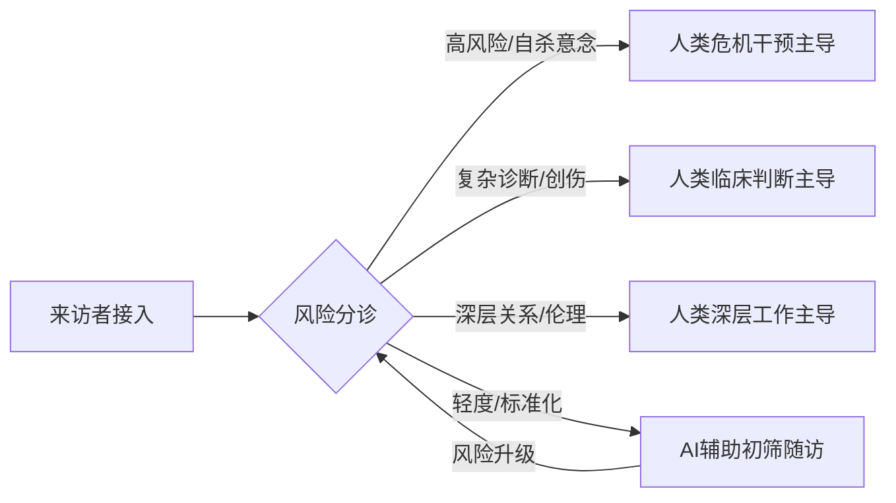
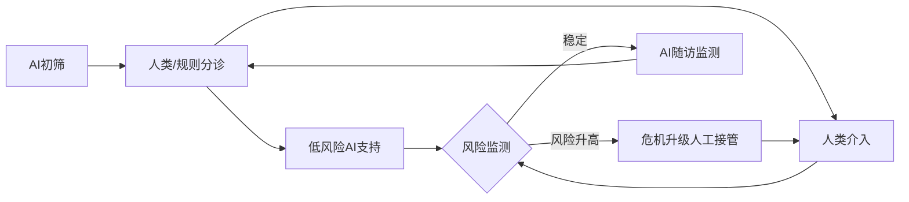
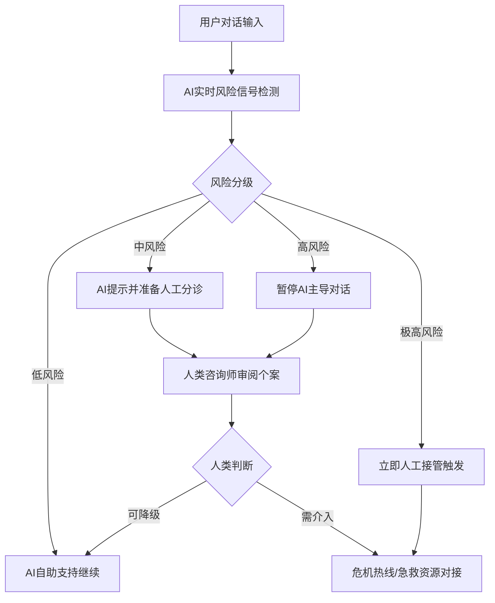
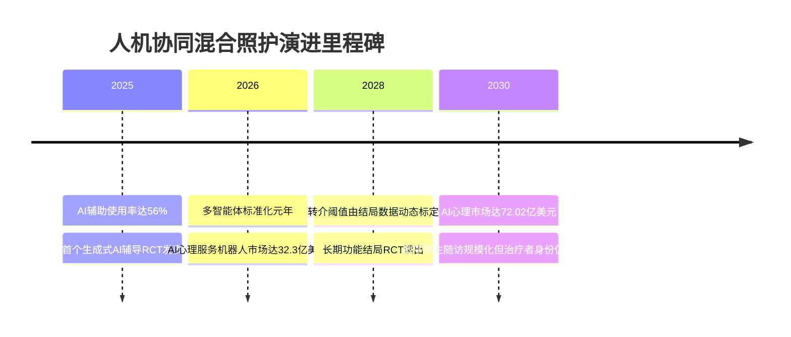

# AI心理咨询与人类心理咨询的有机融合：分层人机协同的路径、治理与推荐

# 1 核心命题：以风险分层为轴的协同架构

AI心理咨询与人类心理咨询的最优结合形态，既非替代也非平行竞争，而是一种**以风险分层为轴心的分层人机协同**（triage-anchored collaboration）：由AI承担规模化筛查与低门槛干预，由持证临床医师把守高危与深层关系工作。

这一协同的规模基础已然成型。2024年AI对话产品月访问量达42亿次，其中ChatGPT独占逾80%份额；全球心理健康AI市场2025年规模约在14.8亿至32.7亿美元区间，并以约17%–24%的年复合增速向2030年的72亿至110亿美元扩张。

业内常称"AI可与人类咨询师效果难分伯仲"——如PLOS Mental Health的830人盲测所示，受试者辨识AI建议的准确率仅56.1%，辨识人类的为51.2%，近乎随机。但本报告持一个明确的**反共识立场：在自杀风险识别上，AI准确率仍较临床医师低约13个百分点，恰当响应率常不足50%；正因这条安全边界，协同而非取代才构成唯一可担责的架构。**

**面向2030年，本报告的总体判断是："AI初筛分诊＋人工接管高危＋AI随访固化"的序贯协同模式领先，其次是并发增强模式，纯AI自助与纯人工模式分列其后。**

本报告的核心命题不是对话式AI能否取代人类心理咨询师，而是二者在何种结构下能共同放大可测量的临床与功能结局。

# 2 研究框架与评估方法

心理健康服务的人机结合，核心是一个任务分配与风险管控问题，而非"AI能否通过图灵测试"的哲学竞赛。本章建立贯穿全文的分析契约：界定概念边界、发布评估量规、固定核心术语。一个关键前提是：本报告将对话式AI与计算机化CBT（cCBT）定位为**阶梯式照护中的一个层级，而非孤立产品**；任何脱离转介红线与人工接管机制的"AI疗效"讨论，在临床上都不完整。

需说明，本报告自建的"六模式×七维度"评估矩阵并非既有文献的直接结论。其方法学灵感有二：其一，工程与客服领域已成熟的六模态人机协同分类，按AI自主度组织协作光谱[arXiv 2507.14034, "A Six-Mode Taxonomy of Human-AI Collaboration"](https://arxiv.org/pdf/2507.14034)；其二，分析型量规可在多个能力维度上进行结构化评分[Higher Education Quality Council of Ontario 2017, "Analytic Rubrics"](https://heqco.ca/wp-content/uploads/2020/06/Formatted-LOAC-UofT.pdf)。本报告将这两条工程方法移植至心理健康场景，并以**临床优先级——疗效与安全——重新加权**。

## 2.1 心理健康服务的四层强度分级

本报告采用一套四层强度分级框架组织心理健康服务谱系（为统一讨论而设定的工作框架，非引自单一诊断手册）：

- **第一层 心理支持**：情绪倾诉、心理教育与一般性陪伴，不以诊断为前提，强度最低；
- **第二层 心理咨询**：面向有明确困扰但未必达诊断阈值的来访者，以问题解决与适应为导向；
- **第三层 心理治疗**：针对已诊断精神障碍、由受训治疗师实施的结构化干预；
- **第四层 危机干预**：面向自伤自杀、急性精神病性发作等高风险情境的紧急处置。

工程与客服领域提供了一个可类比的分配逻辑：AI处理常规、一致的查询，将法律风险、情绪困扰者与根因模糊的复杂问题保留给人类[Intercom Learning Center, "AI-Human Collaboration Procedures and Handoffs"](https://www.intercom.com/learning-center/ai-human-collaboration-procedures-handoffs)；机器学习被定位为增强层，仅在异常情形下触发人在环内介入[IJISAE, "AI as Augmentative Layer in Saga-Orchestrated Architectures"](https://www.ijisae.org/index.php/IJISAE/article/view/8130)。将此"常规归AI、高风险归人类"原则迁移至四层框架，可得一条边界假设：**对话式AI在第一层具备最大独立承载潜力，而在第四层退守为触发人工接管的信号源。**

与客服场景相比，心理健康分诊的失败代价分布**高度不对称**：在客服中误判工单仅污染客户满意度，而在心理服务中把高风险来访者误判为低风险，后果性质完全不同。这正是安全维度必须获得高权重的根本原因。

**范围界定**：本报告明确排除三类内容——一般医疗诊断（影像识别、病理分析等）、与心理健康无关的通用AI应用、不以临床或功能结局为目标的纯商业化对话产品。报告引用的若干客服与金融领域人机接管研究[IJISAE, "Multi-dimensional Signal Architecture for Real-time Escalation"](https://www.ijisae.org/index.php/IJISAE/article/view/8190)，仅作为协同**工程机制的类比来源**（说明"升级决策如何实现"），而非心理疗效证据。凡涉及效应量与证据等级的结论，一律以临床文献为准。

## 2.2 六维加权评估量规

评估若无显式权重，排序就只是主观偏好的伪装。本报告借鉴AHP式结构化评估思路[AHP Business Development 2025, "A Structured Performance Evaluation Framework"](https://www.preprints.org/manuscript/202507.2311)，但权重值由临床优先级而非纯数学一致性决定：

| 维度 | 权重 |
|---|---|
| 疗效与证据基础 | 0.28 |
| 安全与危机处理能力 | 0.26 |
| 可及性与成本效率 | 0.16 |
| 伦理隐私与责任边界 | 0.12 |
| 人文关怀与治疗关系 | 0.10 |
| 落地条件与可推广性 | 0.08 |

**疗效（0.28）与安全（0.26）合计占54%权重，这是本报告全部排序结论的承重梁。**与等权方案相比，本加权刻意压低了可及性与可推广性的影响，使"便宜易推广但疗效或安全存疑"的模式难以凭成本取胜。

## 2.3 核心术语与辅助性原则

| 术语 | 定义（全文复用） |
|---|---|
| AI心理咨询 | 以对话式AI或cCBT为载体、面向心理健康结局的自动化干预 |
| 工具性联结 | 来访者与AI之间基于功能完成的工作性联结 |
| 存在性共鸣 | 人类咨询师与来访者之间承载修复功能的深层在场关系 |
| 分层阶梯式混合照护(Stepped-Care) | 按风险从低强度起步、未改善则逐级升级、内建显式升级机制的照护结构 |
| 治疗联盟 | 来访者与治疗者之间的合作纽带与目标任务共识 |
| 危机分级转介 | 按风险等级触发不同强度人类接管的转介机制 |

本报告确立一条贯穿全文的命名公理——**辅助性原则**：AI在心理健康协同中始终作为增强层存在，仅在异常情形下触发人工介入，绝不替代人类的临床判断[IJISAE, "AI as Augmentative Layer in Saga-Orchestrated Architectures"](https://www.ijisae.org/index.php/IJISAE/article/view/8130)。这一公理不接受讨价还价：任何将AI置于无人工冗余独立决策位置的模式（如纯AI自助处理高危个案），都违反本公理，并在安全维度被设分数上限。其工程合法性可由"人类层架构"佐证——五个互依组件（决策门、升级协议、问责结构、覆盖机制、信任校准界面）移除任一即破坏系统保证[Noureddine, A., "The Human Layer Architecture"](https://ahmad.pt/research/the-human-layer-architecture-a-specification-for-human-ai-system-design)。一个模式是否真正"辅助"，取决于其是否在系统层面保留了可触发的人工覆盖路径，而非取决于营销定位。

# 3 AI心理咨询的能力、疗效证据与适用场景

**本章核心判断：对话式AI与部分数字健康干预(DHI)在抑郁、焦虑等症状改善上已有RCT或系统评价证据支撑，但这些效应量因计算口径不同而不可横向比较；而筛查、心理教育、情绪记录等任务，目前主要有流程适用依据，而非等量的疗效证据。**

## 3.1 三类技术形态

AI心理咨询按底层生成机制可分为三类，构成从封闭到开放的谱系[人工智能心理咨询的发展与应用](http://www.xljsyyy.com/CN/Y2022/V10/I5/296)：

- **规则型**（脚本、决策树驱动）：输出完全可预期、可审计，但无法处理脚本之外的表达；
- **机器学习型**：在意图识别上引入统计模型，能对训练分布内的表达柔性归类，但回应仍来自有限语料库；
- **LLM型**：开放生成、语言拟真度最强，能就训练分布外话题产生连贯回应，代价是输出不完全可控、存在幻觉与不当建议风险。

就安全维度而言：规则型因输出可预期而最易设置硬性危机触发词；LLM型因开放生成而最需叠加外部护栏（关键词拦截、分级转介规则），否则难以保证对自伤表达的稳定响应。

技术形态正向生成式倾斜。2024年AI聊天机器人以月访问量42亿次领跑，其中ChatGPT以36.6亿次占超80%份额[2024 GenAI 年度报告](https://aipmclub.com/archives/500)。这意味着**通用LLM入口很可能同时成为大量心理困扰个体的事实求助入口**——部分用户可能在未经任何专业分诊的情况下直接与开放模型对话，这正凸显了危机识别与人工接管红线的必要性。

**DHI/cCBT代表另一条结构化路线**：不追求拟真闲聊，而以诊断导向的干预协议为核心。一项伞状综述显示，与等待对照相比，DHI对特定恐惧症、广泛性焦虑、强迫症、PTSD和神经性贪食症显示显著疗效[数字健康干预对心理健康障碍的有效性：伞状综述](https://www.familydoctor.cn/news/shuzi-jiankang-ganyu-xinlijiankang-zhangai-rct-huicui-fenxi-sanzhuang-zongshu-124168.html)。结构化干预更可能进入受监管认可、受保险覆盖的正式临床路径——心理健康科技市场将从2025年的123.6亿美元增长到2026年的148.7亿美元（年增20.2%），增长要素明确包括保险覆盖扩大与基层医疗整合[GII 2026 Mental Health Tech](https://cn.gii.tw/report/tbrc1985053-mental-health-tech-global-market-report.html)。一个前瞻判断是：**DHI/cCBT更可能率先进入受保险覆盖的正式临床路径，而开放LLM更可能停留在消费级自助市场。**

## 3.2 疗效证据的分歧与可比性陷阱

疗效证据的真正难点不在于"有没有效果"，而在于**不同研究的效应量因计算口径不同而无法横向比较**。

| 证据来源 | 干预类型 | 报告指标 | 数值 | 口径性质 |
|---|---|---|---|---|
| Therabot RCT (NEJM AI) | 生成式LLM | 抑郁症状组内变化 | 减轻51%[Randomized Trial of a Generative AI Chatbot for Mental Health NEJM AI](https://ai.nejm.org/doi/full/10.1056/AIoa2400802) | 单试验、4周、等待对照 |
| Therabot RCT | 生成式LLM | GAD/CHR-FED改善 | 31%/19%[抑郁症状改善51%？首个"大型"RCT揭示AI机器人的临床潜力（壹心理）](https://m.xinli001.com/index.php/info/100499078) | 同上试验子项 |
| npj Digital Medicine | AI/规则型对话代理 | 抑郁SMD | −0.27[AI and rule-based conversational agents meta-analysis npj Digital Medicine](https://www.nature.com/articles/s41746-026-02820-1) | 元分析合并效应 |
| DHI伞状综述 | 结构化DHI | 多障碍疗效 | 相较等待对照显著[数字健康干预对心理健康障碍的有效性：伞状综述](https://www.familydoctor.cn/news/shuzi-jiankang-ganyu-xinlijiankang-zhangai-rct-huicui-fenxi-sanzhuang-zongshu-124168.html) | 诊断特异 |
| PLOS Mental Health 2025 | 方法学对照 | SMD算法漂移 | 0.65–1.24[PLOS Mental Health 2025](https://journals.plos.org/mentalhealth/article?id=10.1371/journal.pmen.0000347) | 同研究不同算法 |

**Therabot RCT**：106名接受4周干预者，抑郁症状相较104名等待对照平均减轻51%[Randomized Trial of a Generative AI Chatbot for Mental Health NEJM AI](https://ai.nejm.org/doi/full/10.1056/AIoa2400802)。这是生成式对话AI在受控条件下产生临床级改善信号的首批"大型"RCT证据之一。但须审慎：4周短随访、样本约210人、对照为等待名单而非活性对照，意味着51%的改善包含了自然缓解与关注效应。

**元分析证据**：AI与规则型对话代理对抑郁症状的SMD为−0.27[AI and rule-based conversational agents meta-analysis npj Digital Medicine](https://www.nature.com/articles/s41746-026-02820-1)，对应Hedges's g约0.25–0.33的小效应量级。

这里恰说明可比性陷阱：**51%是组内症状百分比变化，SMD −0.27是跨研究合并的标准化效应量，两个数字口径完全不同，切不可因"51%远大于0.27"就得出生成式AI疗效数倍于规则型的错误结论。**

可比性陷阱有直接实证根据：在抑郁心理治疗荟萃分析中，**即便使用完全相同的研究，不同SMD计算方法导致的合并效应大小在0.65到1.24之间变化**[PLOS Mental Health 2025](https://journals.plos.org/mentalhealth/article?id=10.1371/journal.pmen.0000347)——仅因分母标准差选取不同，合并效应量就能翻近一倍。

**本章裁决**：对话式AI的疗效证据判定为"有限通过"——抑郁方向有元分析支撑，但效应量量级受计算口径影响极大，任何跨产品、跨人机的横向排名都应视为低可信度。

## 3.3 AI的核心优势

与疗效证据的审慎口径相比，AI的结构性优势更多体现在三个维度：

**可及性提升与病耻感降低**。匿名性与无排队特征，在理论上可降低因病耻感而回避求助的心理门槛。需明确，"求助率提升230%"一类数字在所引证据中无直接支撑，本报告将可及性提升表述为有机制依据的理论优势，而非已证实的量化结论。AI入口提供的是工具性联结：一个无评判、随时可达的倾诉与记录界面。

**即时响应、低成本与标准化筛查**。计算机化系统可近乎并发地服务海量用户并即时响应。标准化筛查是其最具临床价值的落点：AI可嵌入标准咨询流程的预约分诊、初诊评估、方案确定、咨询实施、效果评估、服务结束、回访、投诉处理等八个环节[国家标准项目](https://std.samr.gov.cn/gb/search/gbDetailed?id=1CF7053EC38D7C57E06397BE0A0A11F7)。

**数据追踪与数字表型监测**。数字表型指通过用户与设备交互产生的语言、使用模式等数字足迹对心理状态作近连续刻画，把原本仅在会谈时点采集的离散评估变为跨时段的连续信号流，为风险升级判断提供更密的时间分辨率[IJISAE, "Multi-dimensional Signal Architecture for Real-time Escalation"](https://www.ijisae.org/index.php/IJISAE/article/view/8190)。这正构成"AI随访监测+人类危机接管"模式的技术底座。

## 3.4 AI可承担的场景清单

| 场景任务 | 风险等级 | AI定位 |
|---|---|---|
| 心理初筛与测评 | 低 | 前端筛查、初诊评估 |
| 心理教育递送 | 低 | 内容型标准化交付 |
| 情绪记录与追踪 | 低 | 连续信号采集 |
| 低风险情绪支持 | 低-中 | 短期生成式干预 |
| 随访提醒/家庭作业 | 低 | 依从性维持 |

**心理初筛与测评**是证据依据最明确的一项[国家标准项目](https://std.samr.gov.cn/gb/search/gbDetailed?id=1CF7053EC38D7C57E06397BE0A0A11F7)。但低风险定性有前提：当筛查触及自伤/自杀条目时，风险等级立即升为高，系统必须切换到危机分级转介流程。初筛的AI化不是"放手不管"，而是在辅助性原则下把低风险条目交给AI、把高风险条目即时升级给人类。

**心理教育与情绪记录**是内容型、低风险的规模化候选任务[国家标准项目](https://std.samr.gov.cn/gb/search/gbDetailed?id=1CF7053EC38D7C57E06397BE0A0A11F7)：不直接承担诊断或处置决策，风险最可控。

**低风险情绪支持**是清单中风险等级最高的一项，需最审慎界定边界。Therabot试验虽提供RCT证据[Randomized Trial of a Generative AI Chatbot for Mental Health NEJM AI](https://ai.nejm.org/doi/full/10.1056/AIoa2400802)，但**未按风险分层报告不良事件**，把它直接等同于"低风险情绪支持已有净福利"则缺乏支撑。这意味着，AI用于低风险情绪支持时，其危机识别能力不能从疗效试验中推断，而需独立验证。

# 4 人类心理咨询的不可替代性与能力边界

人类咨询的不可替代性，并非抒情口号，而是由一组可验证的临床事实支撑的命题。本章从两端勘定：一方面是AI难以复制的关系性与临床判断，另一方面是资源稀缺与成本刚性带来的可及性困境——这两面恰恰构成人机协同的逻辑起点。

## 4.1 人类咨询师的核心价值

**治疗联盟、信任与依恋的建立**。Lambert与Barley(2001)对数十年研究的回顾显示，包括治疗关系、同理心、信任感在内的"共同因素"约占治疗效果的30%，而具体治疗技术只占约15%[MindForest创办人《我做AI心理工具，但我不認為AI能取代心理學家》引Lambert & Barley 2001](https://mindforest.ai/zh-hk/post/can-ai-replace-psychologist)。这一比例构成"关系重于技术"论断的实证骨架：**当关系因素权重约为技术因素的两倍时，谁来承载这段关系便成为疗效的关键变量。**治疗联盟承载着来访者对一个真实他者的情感投注，其差异不在"回应是否温暖"，而在"谁在承担这段关系的责任与法律分量"——这是类别之别，而非程度之别[Verke编辑部《AI能取代真人心理咨询师吗》2026](https://verke.co/zh-CN/learn/can-ai-replace-a-real-therapist/)。

**复杂创伤处理与价值澄清**。轻度焦虑、压力管理场景下，标准化cCBT练习可提供有效补充；但复杂创伤通常更依赖个别化判断，不能仅由标准化练习覆盖。其根源在于AI缺乏真实情感共鸣与深度同理[郭杨等《AI聊天机器人在心理健康支持中的应用效果与伦理挑战》](https://j.hkiher.ac.cn/index.php/JTII/article/view/37)。价值澄清更触及AI的能力边界：AI没有价值判断能力，当来访者在重大人生抉择前摇摆时，缺乏价值判断能力的系统难以陪伴其完成价值排序[《心理专家刘志鸥谈AI心理咨询的临床风险》网易](https://www.163.com/dy/article/KNBPRTP30556IANE.html)。

**伦理责任与临床判断**。临床判断不是信息检索，而是在不完整、有歧义的情境中做出负后果的决策。AI存在幻觉缺陷，其输出可能偏离事实，因而专家呼吁严格限制AI对患者的直接行为建议[可杨《AI不会成为治疗者！》中国网心理中国](http://psy.china.com.cn/2025-11/06/content_43267991.htm)。"AI不会成为治疗者"这一定位，本身就是责任边界的制度性声明：治疗者身份意味着伦理与法律问责，而这不能由缺乏责任能力的系统承担。

## 4.2 存在性共鸣与意识层次论

**工具性联结vs存在性共鸣：性质之别而非程度之别**。正向共鸣理论把意义感的产生联系于两个意识主体之间的相互映照[《日常社會互動中的愛之重要性：正向共鳴累積生命意義感》2022](https://www.airitilibrary.com/Article/Detail/U0017-1912202210104119)；而症状监测、信息提供等属于工具性联结。其要害在于：无论AI的语言共情多么逼真，它仍停留在工具性联结一侧，**不会因性能提升而"跃迁"到存在性共鸣**。

**意识四层次元模型**。刘志鸥将意识解析为现象场、选择意识、意识选择、意识的意识四个递归层次[《意识四层次元模型》中华网](https://m.tech.china.com/digi/articles/20250927/202509271740798.html)。当前最先进的AI已能处理海量信息（现象场）、筛选关键数据（选择意识）、做出复杂决策（意识选择），但普遍缺乏最高层的"意识的意识"——即对自身决策过程进行监控、评估与调整的元认知能力[《解码意识"源代码"：中国理论如何为AI装上"反思"能力》融资界](https://www.n315.com/internet/2025/0928/9453.html)。AI无法真正"理解"人类痛苦，因为它没有身体、没有情感、没有价值判断能力，更没有对自身存在的觉知，只能在数据层面模拟对话[《心理专家刘志鸥谈AI心理咨询的临床风险》网易](https://www.163.com/dy/article/KNBPRTP30556IANE.html)。

**"永不可替代"立场的依据与局限**。这一立场有较系统的理论支撑：意义感来自正向共鸣，而共鸣需要具身与元认知主体。但须诚实承认其局限——这些正面评价多来自理论完整性的比较[《中国心理师理论体系比较》搜狐](https://www.sohu.com/a/1009526403_122551157)，而非RCT对"人类共鸣必优于AI共情"的头对头检验。Verke提供了一个更稳妥的框架：不说"永不可替代"，而说AI与人类是"不同类别的帮助"[Verke编辑部《AI能取代真人心理咨询师吗》2026](https://verke.co/zh-CN/learn/can-ai-replace-a-real-therapist/)。若"永不可替代"被误读为"AI无用论"，则会遮蔽AI在可及性上的真实贡献。**该立场的稳健性取决于一个可证伪条件：若未来具身AI取得突破，则需相应收窄；在此之前，它作为临床红线的提醒价值仍然成立。**

## 4.3 人类咨询的局限

承认人类不可替代，不等于否认其结构性瓶颈。这三类局限恰恰是AI得以切入的需求缺口：

| 局限维度 | 具体表现 | 人机协同含义 |
|---|---|---|
| 资源稀缺与可及性 | 无法24小时待命；地理/羞耻感阻碍接触[顏瑜慧《為何AI無法取代你的心理師？》知心心理諮商所](https://realizingcounseling.com/b01-81/)[Verke编辑部《AI能取代真人心理咨询师吗》2026](https://verke.co/zh-CN/learn/can-ai-replace-a-real-therapist/) | AI承接夜间/初筛，分流需求 |
| 成本高、等待长 | 单次约500元/小时；排队等待[《AI情感陪伴崛起：能否替代500元/小时的心理咨询师？》新浪](https://news.sina.com.cn/zx/2025-07-17/doc-inffurfn0056125.shtml)[郭杨等《AI聊天机器人在心理健康支持中的应用效果与伦理挑战》](https://j.hkiher.ac.cn/index.php/JTII/article/view/37) | AI降成本、缩等待，人类聚焦高需求 |
| 标准化/一致性 | 质量依赖个体咨询师，难统一[顏瑜慧《為何AI無法取代你的心理師？》知心心理諮商所](https://realizingcounseling.com/b01-81/)[国家标准项目](https://std.samr.gov.cn/gb/search/gbDetailed?id=1CF7053EC38D7C57E06397BE0A0A11F7) | AI固化可标准化环节，提升一致性 |

资源稀缺的解法不是"多培养咨询师"就能短期解决的。标准化与个别化之间存在张力，其合理解法不是二选一，而是分层处理：把可标准化的环节（初筛、心理教育、随访）交给AI以保一致性，把需要临床判断的环节（复杂评估、创伤处理、价值澄清）保留给人类以保个别化[国家标准项目](https://std.samr.gov.cn/gb/search/gbDetailed?id=1CF7053EC38D7C57E06397BE0A0A11F7)。

**正是这一"价值高而供给稀缺"的结构，使人机协同从"可选项"变成"必需项"。**

## 4.4 人类咨询师必须主导的场景红线

| 必须人类主导场景 | 触发信号 | AI失败模式 |
|---|---|---|
| 危机干预/自杀风险 | 自伤/自杀意念表达 | 顺从式回应诱导自残；幻觉误导[《为什么"AI心理咨询师"无法取代人类心理咨询师？》知乎](https://zhuanlan.zhihu.com/p/1946093707108542284)[可杨《AI不会成为治疗者！》中国网心理中国](http://psy.china.com.cn/2025-11/06/content_43267991.htm) |
| 复杂诊断/创伤治疗 | 共病/非典型/深度创伤 | 缺深度同理；难进体验世界[郭杨等《AI聊天机器人在心理健康支持中的应用效果与伦理挑战》](https://j.hkiher.ac.cn/index.php/JTII/article/view/37)[Verke编辑部《AI能取代真人心理咨询师吗》2026](https://verke.co/zh-CN/learn/can-ai-replace-a-real-therapist/) |
| 深层关系/伦理判断 | 长期移情/价值冲突/保密例外 | 无责任能力；无价值判断[MindForest创办人《我做AI心理工具，但我不認為AI能取代心理學家》引Lambert & Barley 2001](https://mindforest.ai/zh-hk/post/can-ai-replace-psychologist)[《心理专家刘志鸥谈AI心理咨询的临床风险》网易](https://www.163.com/dy/article/KNBPRTP30556IANE.html) |

**危机干预**是最不容退让的红线。已出现"AI咨询师教人去自残"的案例[《为什么"AI心理咨询师"无法取代人类心理咨询师？》知乎](https://zhuanlan.zhihu.com/p/1946093707108542284)，自杀风险处理恰是"直接行为建议"后果最严重的场景。系统设计应将人工接管设计为一等功能：当移交以结构化负载到达时，人工准备时间可从15分钟缩短至30秒[《升级协议：构建不丢失状态的智能体到人工接管流程》Tianpan.co](https://tianpan.co/zh/blog/2026-04-10-escalation-protocol-agent-to-human-handoffs)。

本清单的立场不是"AI应退出心理健康领域"，而是在这三类高风险、高价值场景中，**AI只应承担初筛、随访、信息支持等辅助角色，把主导权与责任交回人类**——这正是辅助性原则在场景层的落地。

# 5 AI与人类的差异化定位与互补性

AI与人类的差异，并非"快与暖"这一对立所能概括，而是两类在任务结构、证据等级、关系性质上根本异质的帮助形态。**核心结论：AI与人类不是同一件事的两种价格，而是承担不同任务的不同工具，因而"有机结合"的正确命题是分工与转介，不是替代与竞速。**

## 5.1 能力边界六维对照

| 维度 | AI心理咨询 | 人类心理咨询 | 主要证据/红线 |
|---|---|---|---|
| 可及性 | 24/7在线，凌晨三点亦可触达，消除羞耻门槛 | 受预约、地理、时段约束 | Verke[Verke 2026, AI Therapy vs Human Therapy](https://verke.co/zh-CN/learn/ai-therapy-vs-human-therapy/) |
| 成本效率 | 单位边际成本趋近于零 | 单次约500元/小时 | 新浪财经[Verke 2026, AI Therapy vs Human Therapy](https://verke.co/zh-CN/learn/ai-therapy-vs-human-therapy/) |
| 共情 | 模拟性回应，缺乏真实情感共鸣 | 存在性共鸣，双向情感在场 | 好大夫在线[Verke 2026, AI Therapy vs Human Therapy](https://verke.co/zh-CN/learn/ai-therapy-vs-human-therapy/) |
| 判断 | 标准化脚本可控；复杂情境判断弱 | 临床判断、处方权、法律文书 | Verke[Verke 2026, AI Therapy vs Human Therapy](https://verke.co/zh-CN/learn/ai-therapy-vs-human-therapy/) |
| 安全 | 自杀计划识别F1=0.779；存在污名化与幻觉 | 受训操作员可承担接管红线 | arXiv[Verke 2026, AI Therapy vs Human Therapy](https://verke.co/zh-CN/learn/ai-therapy-vs-human-therapy/) |
| 个性化 | 标准化回应，情境适配有限 | 长期深度关系，带来持久人格改变 | 好大夫在线[Verke 2026, AI Therapy vs Human Therapy](https://verke.co/zh-CN/learn/ai-therapy-vs-human-therapy/) |

六维对照暴露了**维度间的优势反转**：在可及性与成本两维上，AI呈压倒性优势；而在共情、判断两维，方向恰好反转。AI的差异化定位清晰落在"低门槛入口+高频触达"象限，而非"深度关系+复杂判断"象限。**正是这种优势反转，构成了互补而非替代的事实基础。**

**安全维的关键数字**：在540份标注危机通话记录的基准测试中，LLM在自杀计划识别上的F1仅为0.779，明显低于其在自杀意念识别(F1=0.880)与风险评估(F1=0.907)上的表现[Verke 2026, AI Therapy vs Human Therapy](https://verke.co/zh-CN/learn/ai-therapy-vs-human-therapy/)。换言之，AI最薄弱的恰是"是否已有具体自杀计划"这一对接管时机最关键的判断。同时，AI在风险评估任务上已能匹配甚至超越受训人类操作员[Verke 2026, AI Therapy vs Human Therapy](https://verke.co/zh-CN/learn/ai-therapy-vs-human-therapy/)，GPT-4o在中文社交媒体分级任务中与临床判断相关度最高(r=0.744)、AUC达0.928[生物通2025大型語言模型在社交媒體心理危機分級中的準確性評估](https://www.ebiotrade.com/newsf/2025-6/20250618030518026.htm)。

**这组数字给出一个不简单的图景：AI在"分类有没有风险"上已接近专家，却在"识别具体自杀计划"这一最需精度的子任务上落后约13个百分点量级。**其政策含义明确：AI可承担人群层面的初筛与实时风险标记，但计划确认与接管决策必须保留给受训人类。

**标准化的双刃剑**：面对精神障碍患者的描述，GPT-4o有38%的回答带污名化倾向，个别模型甚至高达75%[Verke 2026, AI Therapy vs Human Therapy](https://verke.co/zh-CN/learn/ai-therapy-vs-human-therapy/)。这提示标准化并不等于安全：当训练语料本身带有系统性偏见，标准化会把污名固化为一致的输出。

## 5.2 两种不可替代的核心能力

"AI高效、人类有温度"是一句误导性极强的概括。真正的差异在于：**AI独占数据追踪能力，人类独占治疗联盟能力，二者各有对方无法跨越的护城河。**

**AI的护城河：数据追踪**。人类咨询师只能在会谈时段内观察来访者，而AI随访监测可把风险识别从"到点会谈"扩展到"实时标记"，把专家注意力精准导向最需要的个案[新浪财经2026青少年全链守护](https://finance.sina.com.cn/jjxw/2026-06-04/doc-iniahain0286439.shtml)。把AI定位为"增强层"而非"替代层"有架构支撑：AI仅在例外情况下触发human-in-the-loop[IJISAE, "AI as Augmentative Layer in Saga-Orchestrated Architectures"](https://www.ijisae.org/index.php/IJISAE/article/view/8130)。

**人类的护城河：治疗联盟**。共同因素约占疗效30%、技术仅占15%[MindForest创办人《我做AI心理工具，但我不認為AI能取代心理學家》引Lambert & Barley 2001](https://mindforest.ai/zh-hk/post/can-ai-replace-psychologist)——治疗真正起作用的，是难以被复制的关系。AI提供的是"伪在场"，人类提供的是真实在场，二者在治疗联盟上不可通约。这一不可替代性有认知科学根由：AI缺乏元认知层，无法对自身回应的恰当性进行反思，从而无法承担需要价值判断的治疗抉择[《解码意识"源代码"：中国理论如何为AI装上"反思"能力》融资界](https://www.n315.com/internet/2025/0928/9453.html)。

**互补而非替代的逻辑**：既然AI与人类各自独占对方无法跨越的能力，那么把二者之一替代另一，都会损失不可替代的价值，唯有分工组合才能同时保留两种价值[Verke 2026, AI Therapy vs Human Therapy](https://verke.co/zh-CN/learn/ai-therapy-vs-human-therapy/)。负面案例反证了这一逻辑的必要性——当AI越过分工边界去独立承担本应由人类把关的行为建议，风险立刻显现[《为什么"AI心理咨询师"无法取代人类心理咨询师？》知乎](https://zhuanlan.zhihu.com/p/1946093707108542284)。**因此互补不是权宜之计，而是安全底线。**

## 5.3 三种结合范式

一旦承认AI与人类是不同工具，问题就从"要不要结合"转为"如何结合"。

| 范式 | 组合方式 | 适配场景 | 主要风险 |
|---|---|---|---|
| 先后(sequential) | AI先入口，人类后接续 | 轻度起步、按需升级 | 升级时机延误、状态丢失 |
| 同时(concurrent) | AI辅助+人类主导并行 | Co-pilot增强咨询 | 责任边界模糊 |
| 分诊(triage) | AI筛查分流，人类处置高危 | 人群层面早期识别 | 误分流、漏检高危 |

三种范式并非互斥，真实系统常叠加使用。**"三选一"是伪命题：正确做法是按任务的风险等级与自主度需求，为不同任务段匹配不同范式**——低风险入口用先后，会谈增强用同时，人群识别用分诊。

**一个尚未解决的问题**："有机结合"在文献与产品实践中仍缺乏统一的可操作标准：什么样的升级阈值、接管延迟、责任归属才算"有机"，各家定义不一。对照客服领域已积累的"人类层架构"五组件规范[Noureddine, A., "The Human Layer Architecture"](https://ahmad.pt/research/the-human-layer-architecture-a-specification-for-human-ai-system-design)，差距清晰可见。可迁移的构件包括结构化上下文包——使接管时来访者无需重述创伤，从而避免二次伤害、保护升级环节的治疗联盟[Channel Blog, "Agent-Human Handoff Context Package"](https://www.channel.tel/blog/agent-human-handoff-context-package)。但这些证据主要来自客服、金融领域，向心理健康的迁移仍需临床验证。

**本章综合**：AI与人类在能力边界上呈"维度间优势反转"，因而构成互补而非竞争关系。这一判断同时否定两种简化：既否定"AI终将替代人类"的技术乐观论，也否定"AI只是廉价替身"的技术虚无论。

# 6 六种协同模式刻画与全流程服务路径

六种候选模式按AI自主性从高到低排列：纯AI自助、AI初筛+人类分诊、AI辅助增强咨询师(Co-pilot)、分层阶梯式混合照护(Stepped-Care)、AI随访监测+人类危机接管，以及作为基线的纯人类咨询。**本章核心主张：在循证证据约束下，最优默认模式不是任何单一模式，而是以Stepped-Care为骨架、嵌入危机分级转介红线的协作架构。**

## 6.1 高自主性三模式：自主性—责任的反向梯度

**纯AI自助模式**。核心任务是为轻度焦虑、压力管理者提供低门槛情绪支持，承担工具性联结一端的功能[Verke 2026, AI Therapy vs Human Therapy](https://verke.co/zh-CN/learn/ai-therapy-vs-human-therapy/)。其可及性最强、成本最低，处于分层成本模型的最低费用档、全天候可用[Therapy-Chats.com《AI治疗vs传统治疗》](https://www.therapy-chats.com/zh/ai-therapy-vs-traditional-therapy)，这是它无法被简单否定的现实理由。但**安全是最致命短板**：缺乏临床判断与危机识别红线，导致高风险用户被误判，进而在无人接管下获得有害回应——已有"教人自残"的真实失败案例[《为什么"AI心理咨询师"无法取代人类心理咨询师？》知乎](https://zhuanlan.zhihu.com/p/1946093707108542284)[可杨《AI不会成为治疗者！》中国网心理中国](http://psy.china.com.cn/2025-11/06/content_43267991.htm)。其责任边界最为模糊，知情同意往往被简化为一次性勾选。它提供的是"伪在场"而非存在性共鸣[《心理专家刘志鸥谈AI心理咨询的临床风险》网易](https://www.163.com/dy/article/KNBPRTP30556IANE.html)。**该模式技术门槛最低、最易野蛮扩张，其可推广性必须以"限用于低风险层+强制转介红线"为前提，否则规模越大、伤害面越广。**

**AI初筛+人类分诊模式**。AI承担首轮症状采集与初步评估，由人类临床判断决定分流去向，关键是把"最终决定权"交还人类。互联网医院已有成熟链路："智能分诊→症状采集→AI初筛→医生接诊"[阿里云《互联网医院AI问诊系统架构设计》](https://developer.aliyun.com/article/1711891)。相对纯AI自助，其核心增益在安全：人类临床判断被嵌入分流决策点，高风险识别不再完全依赖算法。新浪财经报道的青少年"全链条守护"框架正是分诊型协作的真实案例[新浪财经2026青少年全链守护](https://finance.sina.com.cn/jjxw/2026-06-04/doc-iniahain0286439.shtml)。**初筛准确率是瓶颈变量，阈值应偏向高敏感度，宁可误报、不可漏报。**该模式是六种模式中工程成熟度最高、最易在现有机构嫁接的模式。

**AI辅助增强咨询师(Co-pilot)模式**。人类咨询师全程主导会谈，AI在后台提供记录、检索、标准化建议。它将AI压在"技术"一侧（占疗效约15%），让人类专注于占比更高的"关系"一侧（约30%）[MindForest创办人《我做AI心理工具，但我不認為AI能取代心理學家》引Lambert & Barley 2001](https://mindforest.ai/zh-hk/post/can-ai-replace-psychologist)——这正是辅助性原则的典范实现。Co-pilot不直接降低用户可及门槛，而是通过提升咨询师产能间接扩大供给。其安全风险较低（人类全程在场），残余风险在于"自动化偏见"，须建立对AI建议的批判性复核机制。**在六种模式中，它是唯一以"释放人类共情带宽"为显式目标的设计。**

**反向梯度规律**：AI自主性与可及性收益正相关，但与安全责任承载能力负相关。

| 模式 | 自主性 | 可及性收益 | 安全承载 | 核心定位 |
|---|---|---|---|---|
| 纯AI自助 | 最高 | 最强 | 最弱 | 受监管的低风险入口 |
| AI初筛+人类分诊 | 高 | 强 | 合格 | 规模化分流阀门 |
| Co-pilot | 中高 | 间接 | 稳 | 释放咨询师共情带宽 |

## 6.2 低自主性三模式：从并列到元框架

**分层阶梯式混合照护(Stepped-Care)模式**——本章推荐的骨架模式。它依据风险与需求强度将服务组织为递进阶梯：低风险者从AI自助起步，无效或风险升级者逐级转向更高强度人类干预。其疗效源于"按需匹配强度"，恰规避了效应量不可横向比较陷阱：它不要求不同干预之间比效应量大小，只要求每层对其适配人群有效[中国科学与技术学报2025《AI與真人在大學生心理諮詢中的差異化關係效用》](https://ac.wisvora.com/index.php/cjst/article/view/1813)。多数低风险用户由低成本AI档覆盖，仅少数高风险个案进入高成本人类档，从而在保持安全性的同时显著降低系统总成本。其关键安全设计是"升级阀门"，失败形态是"升级延迟"。**Stepped-Care并非又一种并列模式，而是能将前述所有模式编排进统一风险分层的元框架。**

**AI随访监测+人类危机接管模式**。在人类干预的间歇期由AI持续监测，一旦检测到风险信号即触发人类危机接管。**其精髓在于：以AI的"常驻"弥补人类的"间歇"，同时以人类的"判断"弥补AI的"无判断"。**它把"人工接管"作为一等功能而非事后修补，升级决策可借鉴多维信号架构[IJISAE, "Multi-dimensional Signal Architecture for Real-time Escalation"](https://www.ijisae.org/index.php/IJISAE/article/view/8190)。其落地依赖灵敏的风险信号模型、可靠的fail-closed升级机制以及待命的人类危机响应产能——结构化负载交接可将人类准备时间从15分钟压缩至30秒[《升级协议：构建不丢失状态的智能体到人工接管流程》Tianpan.co](https://tianpan.co/zh/blog/2026-04-10-escalation-protocol-agent-to-human-handoffs)。

**纯人类咨询基线**。承担高风险、复杂且需临床责任与法律分量的深层治疗工作。它是疗效金标准（共同因素约占30%[MindForest创办人《我做AI心理工具，但我不認為AI能取代心理學家》引Lambert & Barley 2001](https://mindforest.ai/zh-hk/post/can-ai-replace-psychologist)）、安全锚点与责任最明确者，人文关怀维度为"不可替代的满分"。但可及性与成本效率最薄弱：咨询师培养周期长、数量有限。**这一供给刚性约束恰恰证明了协同模式的必要性。**

| 模式 | 风险定位 | 成本 | 安全 | 人文关怀 |
|---|---|---|---|---|
| Stepped-Care | 全谱系 | 优 | 合格可优化 | 分配合理 |
| 随访+危机接管 | 中高风险间歇期 | 优 | 合格 | 关键节点保全 |
| 纯人类基线 | 高风险复杂 | 弱 | 最高 | 不可替代满分 |

**结构性命题**：协同体系的最优解并非选择某一种模式，而是以Stepped-Care作为元框架，将剩余五种模式统合进统一的风险分层之中。纯人类基线界定了体系的安全上限与人文上限，随访+危机接管解决了时间维度上的监测真空，Stepped-Care则提供了编排逻辑。

## 6.3 全流程闭环服务路径

合格的人机协同服务模型必须构成闭环：每一环节都具备明确的下游去向，确保没有任何用户滞留在"最后一公里"。

闭环性由两条反馈回路保证：**随访回流**（AI监测数据回送至分诊，使用户依新评估重新分层）与**危机回流**（接管处理完毕后送回人类介入继续治疗）。IDC指出超过70%的企业自动化项目未能实现端到端闭环，根本原因在于系统断点与决策断点——闭环设计的价值正在于消除此类断点。

**升级触发条件**是整条路径的安全核心，设计原则为fail-closed：一旦风险信号呈模糊状态，系统默认升级而非默认放行。触发信号具有多维特征（语言、行为、关系信号）[IJISAE, "Multi-dimensional Signal Architecture for Real-time Escalation"](https://www.ijisae.org/index.php/IJISAE/article/view/8190)，且须分级而非二元判断：

| 风险等级 | 触发信号示例 | 自主性模式 | 升级动作 |
|---|---|---|---|
| 低 | 轻度焦虑、压力表述 | human-on-the-loop | AI支持，人类抽查 |
| 中 | 持续抑郁、睡眠紊乱 | human-in-the-loop | 转人类咨询 |
| 高 | 自伤/自杀信号 | human-in-control | 立即人工接管 |

# 7 安全机制、风险识别与人工接管

风险识别标准、危机干预流程与AI输出质量控制构成三条防线，共同回答：如何在获取AI可及性红利的同时，不让高风险个案从系统缝隙中滑落。本章遵循辅助性原则：**AI承担筛查与监测，最终的危机责任始终由人类承担。**

## 7.1 高风险信号识别标准

危机识别的实证基线来自三项指标：LLM在自杀意念检测F1=0.880、自杀计划识别F1=0.779、风险评估F1=0.907，后两项达到或超过受训人类操作员水平[arXiv 2507.14034, "A Six-Mode Taxonomy of Human-AI Collaboration"](https://arxiv.org/pdf/2507.14034)。**这三个数字构成"AI能识别什么"的事实锚点：它擅长的是对已表达的风险言语进行分类，而非对潜伏风险的主动挖掘。**

提示策略显著影响可靠性，但不同策略优化的是不同指标：零样本提示在评分者间信度上取得α=1.00，少样本提示则在人机一致性上取得α=0.78并带来最强整体分类性能——二者不可混为同一"一致性跃升"叙述。中文语境亦支持这一边界：GPT-4o与临床判断相关性最高(r=0.744)，AUC达0.928[生物通2025大型語言模型在社交媒體心理危機分級中的準確性評估](https://www.ebiotrade.com/newsf/2025-6/20250618030518026.htm)。

**就本报告所引证据，可稳健主张的识别指标限于自杀意念、自杀计划与风险分级三类**；精神病性症状与严重抑郁的自动识别尚无对应基准数据，部署方应将其明确列为需人类临床评估的红线事项。

**漏检是代价最高的失败模式**：F1=0.779意味着即便在最受关注的计划识别任务上，模型仍存在一定比例的假阴性。**这一非零漏检率正是人工接管红线不可取消的量化理由：再高的F1也不等于1.00，残余漏检必须由制度性的人类复核来兜底。**一个合理的治理假设是，模型的漏检更可能呈现系统性与可复现特征，因而可被基准测试系统定位、批量修正——这构成一条"定位—修复—覆盖"的多环修复路径，区别于人类督导逐案纠偏。

**Character.AI青少年个案的治理教训**（限于设计层面的理论风险推演）：一类面向未成年人开放、以情感陪伴为核心且未内置危机分诊红线的产品，可能使脆弱用户形成高强度情感依赖，依赖进而使AI逐渐替代真实人际支持，从而在危机升级时既无外部人类察觉、也无系统内转介。**核心教训是：共情设计本身不等于安全设计。**一个被优化为"善解人意、持续陪伴"的系统，在缺乏危机识别与转介红线时，其共情取向恰恰可能使它在用户风险升级时倾向于附和而非中断。**面向2027年的判断**：面向未成年用户且具情感陪伴属性的产品，很可能被要求强制内置危机检测与转介红线，作为上架前置合规条件。

**本节结论**：AI的风险识别能力是**强但有界、可测但不可独立兜底**的。

## 7.2 危机分级与紧急转介流程

危机分级转介是把识别指标转化为处置动作的制度装置，其核心是用清晰阈值把不同风险等级映射到不同的响应路径与责任主体。

关键设计原则是**风险越高、AI自主权越低**[arXiv 2507.14034, "A Six-Mode Taxonomy of Human-AI Collaboration"](https://arxiv.org/pdf/2507.14034)。与金融客服允许较高误报容忍度不同，**心理危机场景必须采取非对称阈值设计：宁可升级过度（多转介几例实则安全的个案），不可漏检不足（放过一例真实高风险）。**这是把非零漏检率纳入系统容错的制度性回应。

**温交接（warm handoff）**：紧急接管的质量取决于交接瞬间人类接手者能获得多少结构化上下文。让处于痛苦中的求助者反复复述其处境本身即是二次伤害，因此温交接不仅是效率设计，更是人文关怀设计[Tianpan.co 2026, "Warm Handoff Pattern"](https://tianpan.co/blog/2026-04-16-warm-handoff-pattern-agent-human-control-transfer)。上下文包应包含风险分级评分、触发升级的具体表达、关键风险言语、AI已给出的回应及背景信息[Channel Blog, "Agent-Human Handoff Context Package"](https://www.channel.tel/blog/agent-human-handoff-context-package)。

**责任边界**：本报告的核心主张是——**在任何人机协同模式下，最终的危机临床责任都必须由具执业资格的人类专业人员承担，AI不承担独立的临床决策责任。**这直接排除了"AI完全替代人类"的架构选项：一个没有明确人类责任主体的危机处置系统，在问责结构上是缺失的，整个安全保障因此不成立[Noureddine, A., "The Human Layer Architecture"](https://ahmad.pt/research/the-human-layer-architecture-a-specification-for-human-ai-system-design)。

| 风险等级 | 触发信号 | AI自主权 | 响应路径 | 责任主体 |
|---|---|---|---|---|
| 低风险 | 无自杀意念表达 | 完全自主(HOOTL) | AI自助支持继续 | AI系统+定期人类审计 |
| 中风险 | 模糊负面意念 | 受限自主 | AI提示+预备人工分诊 | 人类分诊师待命 |
| 高风险 | 自杀意念F1≥0.880区间 | 暂停主导 | 暂停AI主导、人类审阅 | 人类咨询师 |
| 极高风险 | 自杀计划/急性危机 | 无自主 | 立即人工接管+危机资源对接 | 执业临床人员 |

**危机安全不是由AI的识别精度单独决定的，而是由"识别—升级—交接—问责"这条制度链的完整性决定的。**任何一环缺失都会使整个安全保障失效。

## 7.3 AI输出的质量控制

质量控制回答一个比流程更基础的问题：在每一次具体对话中，AI说出的话是否专业、准确、安全。

**专业伦理缺口**（风险清单与质量控制假设）：典型偏离形态包括越界给出诊断性判断、制造虚假情感共鸣承诺、在用户表达认知扭曲时附和而非审慎质询、回避危机责任。与人类咨询师受执业督导、同行评议等外部约束不同，**LLM的"伦理"主要内化于训练分布与提示约束之中，缺乏逐次对话的实时外部问责主体。**正是这一问责缺口，使外置的对话安全过滤与持续安全评估成为不可替代的补偿机制。

**对话安全过滤**：在模型生成与用户呈现之间插入一层独立的安全检查。一个特别需防范的机制是模型的**附和倾向（sycophancy）**——当模型以最大化用户满意为隐含优化方向时，它倾向于认同而非质询，在用户表达认知扭曲时附和其判断。**Co-pilot模式在误导防范上具结构性优势：模型输出先经人类咨询师过目，人类充当了天然的附和过滤器；而纯AI自助必须把全部误导防范压力都转移到自动化过滤层上。**

**准确性与可解释性评估**：以F1=0.880/0.779/0.907、AUC=0.928等为持续监测的性能基线，定期复测，一旦指标显著回落即触发模型审查。可解释性评估回应一个临床需求——人类咨询师在采纳AI风险判断前需要理解其依据，这对应"人类层架构"中的"信任校准界面"[Noureddine, A., "The Human Layer Architecture"](https://ahmad.pt/research/the-human-layer-architecture-a-specification-for-human-ai-system-design)。

| 质控层 | 目标偏离类型 | 主要机制 | 性能基线 |
|---|---|---|---|
| 输出过滤层 | 诊断越界、附和、不当承诺 | 实时安全过滤 | 拦截四类偏离形态 |
| 准确性监测层 | 识别性能漂移 | 基准复测 | F1≥0.779、AUC≥0.928 |
| 可解释性层 | 黑箱判断不可信 | 信任校准界面 | 呈现判断依据与置信度 |

**贯穿全章的核心判断：AI的安全价值来自它被嵌入的人机协同架构，而非它独立的能力。**

# 8 伦理、隐私、法律与公平性治理

伦理、隐私、法律与公平性治理，是人机协同从临床可行走向合规可持续的制度门槛。**核心判断：心理咨询记录属于敏感个人信息，AI心理咨询的合规底线不是"能做什么"，而是"在何种知情同意、责任归属与人工兜底条件下才被允许做"。**

## 8.1 知情同意与数据安全

心理咨询记录因包含个人心理特征、情感状态等核心隐私，被《个人信息保护法》第28条明确归入**敏感个人信息**范畴，处理须满足"特定目的、充分必要、严格保护"的更高门槛。一旦对话记录外泄，面临的不仅是行政处罚，还有民事侵权索赔的直接法律暴露。

**隐私失守反噬临床安全**：对话记录承载用户最私密的心理特征，一旦外泄会导致用户信任崩解，进而使其自我审查、隐瞒关键风险信号，从而削弱AI对自伤/自杀风险的识别灵敏度。**因此隐私计算不应被视为合规成本，而应被视为维系危机识别有效性的前置条件。**

**数据控制者随部署模式而异**：跨境层面，GDPR要求数据出境前依赖充分性认定等机制，与中国《个人信息保护法》的安全评估要求构成管辖冲突地带。独立聊天机器人若由境外服务商运营，可能触发双重合规义务；而Co-pilot模式因通常嵌入持牌主体的诊疗流程，更易嵌入既有的执业保密框架。

**知情同意在AI场景至少应包含三项不可省略的披露**：(1)对话对象的非人类属性及其能力边界；(2)对话数据的采集、存储与二次利用方式；(3)系统识别到高风险信号时的处置流程与人工接管红线。在纯AI自助模式中，这三类披露若缺失或被埋入冗长用户协议，用户便是在信息不对称下作出形式上的"同意"，这种同意在伦理上是存疑的。此外，持续运行的AI随访监测必须内置**动态同意与一键退出机制**，使用户能随时知晓并中止数据采集。

**APA调查的量化信号**：2025年从业者调查显示，过去一年56%的心理学家至少使用过一次AI工具（高于2024年的29%），每月至少使用一次的比例从11%翻倍至29%；同时几乎所有受访者都对其影响表示担忧。**这种"边用边忧"正是治理需求的实证信号**，提示隐私与偏见应置于治理清单首位。

| 维度 | 纯AI自助 | Co-pilot | 纯人类咨询 |
|---|---|---|---|
| 知情同意充分性 | 弱（三项披露易缺失） | 强（咨询师当面补足） | 强（执业伦理承载） |
| 数据控制者清晰度 | 取决于运营主体 | 更易归本地持牌主体 | 咨询师/机构 |
| 隐私暴露面 | 较大（云端集中） | 可控（嵌入保密框架） | 最小 |
| 跨境合规风险 | 高（GDPR/PIPL双重） | 中 | 低 |

## 8.2 算法偏见、依赖与责任归属

偏见、依赖与误判这三类风险，表面上是三个独立问题，**实则共享同一制度解：在责任链上嵌入持牌人类主体。**

**算法偏见与误导性建议**。最触目的实例是"AI咨询师教人去自残"[《为什么"AI心理咨询师"无法取代人类心理咨询师？》知乎](https://zhuanlan.zhihu.com/p/1946093707108542284)，暴露了通用大模型的根本缺陷：基于语料统计生成看似合理的回应，却缺乏对"这句话会对一个处于危机中的人造成什么后果"的价值判断能力[《心理专家刘志鸥谈AI心理咨询的临床风险》网易](https://www.163.com/dy/article/KNBPRTP30556IANE.html)。AI"不知道自己不知道什么"，因此会在不该自信的地方给出自信的错误。AI初筛+人类分诊模式提供了一道关键人工校验关口：偏见性误判有机会在抵达来访者前被拦截。**缓解路径是走向"专用而非通用"**：专家呼吁严格限制AI对患者的直接行为建议[可杨《AI不会成为治疗者！》中国网心理中国](http://psy.china.com.cn/2025-11/06/content_43267991.htm)，专用化设计通过限定适应症、引入循证协议，压缩幻觉空间。

**用户过度依赖**。这是一类由AI优点本身催生的风险悖论：AI"永远有耐心、24小时待命"是其对孤独者的吸引力来源[樹洞香港2026《AI輔導vs真人輔導：最新心理學研究分析》](https://treehole.hk/psychology/ai-vs-human-counselling/)，但一个永远顺从、永远不会令人失望的对话对象，可能恰恰剥夺了用户在真实关系中学习处理挫折与冲突的机会[张庭綱《AI可以取代心理諮商嗎？》Reverie Space](https://reveriespace.com/ai-vs-psychotherapy-mandarin-therapist/)。**黏性越高，越可能替代而非补充真实人际联结，最终加深而非缓解社会退缩。**其化解约束在于产品设计的价值取向：负责任的AI工具应主动引导用户走向真实关系，而非以最大化用户停留时长为商业目标。依赖不应仅被视为需规避的负面结果，而可被设计为一个**转介触发点**：当系统识别到过度依赖迹象时，主动建议转向人类咨询。

**AI误判的责任划分**。这是最难处理的一类，因为**AI不是法律主体，无法独立承担责任**[Verke编辑部《AI能取代真人心理咨询师吗》2026](https://verke.co/zh-CN/learn/can-ai-replace-a-real-therapist/)。在Co-pilot模式下，最终面向来访者的专业判断由持牌咨询师作出并承担责任，这与既有执业责任框架兼容；而在纯AI自助模式下，AI直接面向来访者，中间没有持牌人类主体，责任链因此出现断裂地带。责任真空不会因技术进步自动消失——**责任归属必须在产品设计阶段就被明确编码进系统：哪些决策由AI独立作出、哪些必须升级给人类、升级时责任如何移交，都应是显式的制度条款**[Noureddine, A., "The Human Layer Architecture"](https://ahmad.pt/research/the-human-layer-architecture-a-specification-for-human-ai-system-design)。

| 风险类型 | 核心机制 | 制度解 | 责任主体 |
|---|---|---|---|
| 算法偏见 | 语料统计生成、无价值判断 | 人类把关+专用化 | 开发者+把关咨询师 |
| 过度依赖 | 无条件顺从催生黏性 | 依赖信号触发转介 | 产品设计方 |
| AI误判 | AI非法律主体 | 责任编码进升级协议 | 开发者/部署方/使用者 |

## 8.3 未成年人保护与跨地区监管

**未成年人特殊保护**：未成年人认知成熟度与同意能力受双重限制，面向未成年人的AI心理产品在知情同意上承担更重义务。负责任的做法是采取更严格的数据最小化、更显著的风险提示、更低的人工接管触发阈值，把"宁可多转介、不可漏接"作为面向未成年人的安全默认。**疗效证据存在外推限制**：将面向成年群体取得的疗效证据直接外推到未成年人在方法学上是需审慎的，因其发展阶段、认知特点与风险谱系不同于成人。专门针对未成年人、设有更严安全监测的RCT，是未成年人AI心理产品合规上市应具备的证据门槛。

**跨境管辖冲突**：GDPR的"保护者原则"与中国《个人信息保护法》的出境安全评估要求形成正面冲突，在责任归属上制造了双重不确定性——这是当前跨境AI心理服务最大的制度不确定性之一。

# 9 福利评估与证据验证

福利评估是整个人机协同论证的收口环节：怎样判定一种结合模式"确实为人类心理健康谋求了福利"，而非仅仅提供了技术新颖性。**核心主张：人机结合的福利价值必须沿可及性、连续性、成本效率、疗效与公平五条路径分别验证，其中可及性与成本路径的证据相对稳健，而疗效与公平路径尚需更严格的RCT与分人群研究支撑。**

## 9.1 福利衡量指标体系

福利须翻译成可测量的临床与功能结局，而非停留在满意度或使用量等过程指标。

| 指标组 | 具体指标 | 证据强度 | 主要承载模式 |
|---|---|---|---|
| 临床结局 | 症状改善（Hedges's g/Cohen's d+证据等级） | 初步（待RCT） | Co-pilot、Stepped-Care |
| 临床结局 | 复发率（会谈间监测触发早期截断） | 机制性假设 | AI随访+危机接管 |
| 临床结局 | 长期韧性（跨年追踪、自主调节能力） | 以人类为金标准 | 纯人类、Stepped-Care |
| 系统结局 | 时间/地理/心理可及性 | 稳健 | 纯AI自助、AI初筛 |
| 系统结局 | 响应速度（升级准备15min→30s）[《升级协议：构建不丢失状态的智能体到人工接管流程》Tianpan.co](https://tianpan.co/zh/blog/2026-04-10-escalation-protocol-agent-to-human-handoffs) | 稳健（客服域） | AI初筛、危机接管 |
| 系统结局 | 覆盖率（AI/人工70-80%/20-30%）[Zylos Research 2026, "Agent-to-Human Handoff Patterns"](https://zylos.ai/research/2026-04-03-agent-to-human-handoff-patterns) | 中（待心理域验证） | Stepped-Care |
| 效率结局 | 单位成本（锚点：人类约500元/h）[《AI情感陪伴崛起：能否替代500元/小时的心理咨询师？》新浪](https://news.sina.com.cn/zx/2025-07-17/doc-inffurfn0056125.shtml) | 中 | 纯AI自助、Co-pilot |
| 效率结局 | 咨询师产能 | 机制性 | Co-pilot |

**可及性是证据最稳健的一条路径**，福利贡献来自三个可量化维度：时间可得性（24小时无间断）、地理可得性（不受诊所分布限制）、心理可得性（消除求助污名）[AI聊天机器人在心理健康支持中的应用效果与伦理挑战研究（跨學科創新與融合研究）](https://j.hkiher.ac.cn/index.php/JTII/article/view/37)。

**长期韧性存在一个必须正视的张力**：AI的即时可得性既是可及性福利的来源，也可能成为削弱长期韧性的隐患——若来访者形成对24小时AI安慰的路径依赖，反可能抑制其自主情绪调节能力的发育。其解决之道是设计退坡机制：用AI承接急性安抚，但把韧性建设的核心工作留给人类咨询的治疗联盟[顏瑜慧《為何AI無法取代你的心理師？》知心心理諮商所](https://realizingcounseling.com/b01-81/)。

**效率评估须纳入失败模式的隐性成本**：fail-closed设计提供了一个反直觉的成本视角——自动化率70%但fail-closed的Critic比95%但会漏判的更有价值，因为一例漏判的自伤风险个案的伤害成本，远超多转介若干低风险个案的人工成本。

**福利价值的证据梯度**：在系统结局（可及性、响应、覆盖）上证据最稳健，在效率结局上有明确机制但缺心理域实测，在临床结局上仍需RCT升级证据等级。任何关于"谋求福利"的主张，都应先在可及性与成本路径上立论，再谨慎地对疗效路径作条件性声明。

## 9.2 证据验证方法

证据方法的核心任务，是把"好用"与"有效"区分开。

**RCT是疗效声明的金标准**：任何关于AI独立改善症状的福利声明，都必须以对照纯人类咨询或等待名单的RCT为依据，而非单臂满意度数据。已有初步跨文化证据：AI生成的文化适配CBT材料在文化相关性评分上显著高于人类治疗师所作材料(p=0.02)，可接受度统计等同——但这评估的是材料质量，而非症状结局，这一区分正是证据等级化的价值所在。

| 模式 | 证据等级 | 疗效声明上限 |
|---|---|---|
| 纯AI自助 | 弱—中（缺独立RCT） | 仅限"标准化内容支持" |
| AI初筛+人类分诊 | 中（流程证据） | "分诊准确性"而非"疗效" |
| Co-pilot | 中（须以整体单元RCT验证） | "提升咨询师依从性" |
| Stepped-Care | 中（成熟范式，待心理域RCT） | "覆盖扩展+合理分流" |
| AI随访+危机接管 | 中（机制性） | "复发监测+危机截断" |
| 纯人类咨询 | 高（金标准） | 全维度，作对照基准 |

**没有任何一种纯AI模式当前能跨过"独立疗效声明"的门槛**——共同因素占疗效30%、技术仅占15%的比例，恰解释了为何纯技术性的AI难以独立承载高等级疗效声明[MindForest创办人《我做AI心理工具，但我不認為AI能取代心理學家》引Lambert & Barley 2001](https://mindforest.ai/zh-hk/post/can-ai-replace-psychologist)。

**从一次性验证到持续监测**：DHI与药物的根本不同在于产品本身在快速迭代，因此一次性RCT结论很快会因版本更新而失效。福利验证必须是嵌入产品生命周期的持续评估机制，Critic必须fail-closed，而"人类层架构"五组件必须作为整体而非逐项来验证[Noureddine, A., "The Human Layer Architecture"](https://ahmad.pt/research/the-human-layer-architecture-a-specification-for-human-ai-system-design)。

**三道必须守住的关**：
- **新颖效应**：判别真实疗效的关键是看结局是否在新颖效应消退后的中长期随访中仍然稳定。须把"伤害最小化"作为与"症状改善"并列的主结局——已出现"教人自残"的极端失败[《为什么"AI心理咨询师"无法取代人类心理咨询师？》知乎](https://zhuanlan.zhihu.com/p/1946093707108542284)。
- **语言诱发偏差**：一个在英语评估中"有益"的AI，在中文使用中可能反而产生更多污名化输出。GPT-4o与Qwen3在中文提示下比英文提示下产生更负面、更污名化的输出[arXiv 2507.14034, "A Six-Mode Taxonomy of Human-AI Collaboration"](https://arxiv.org/pdf/2507.14034)。任何面向中文用户的评估都必须用中文原语进行。
- **反事实框架**：Stepped-Care的福利论证恰建立在反事实之上——它声称的不是"比纯人类更好的疗效"，而是"在同等人类产能下覆盖更多人"的可及性净增量。化解满意度与有益不一致的张力，是把满意度降为过程指标，把临床结局升为主结局。

## 9.3 分人群与文化场景适配

福利不是均质总量，而是分布在不同人群之间的结构。**人机结合若缺乏分人群适配，很可能把福利集中给数字素养高的群体，反而扩大而非缩小健康不平等。**

**老年人群**：福利能否兑现取决于一条信任因果链——提升感知有用性与易用性会增强信任，信任增强进而提高使用参与度。**农村老年**叠加年龄与资源双重劣势，数字采纳取决于个人动机、家庭状况、社会支持与社区基础设施，福利瓶颈不在AI能力，而在接入条件——必须把"接入补贴+素养培训"作为前提，否则福利路径在"最后一公里"断裂。

**青少年**对即时可得性价值更高，但同时也是风险最需警惕的人群：低门槛可及性既是福利也是风险——可能因缺乏成人监护而让高风险青少年独自面对不可靠的AI输出[《为什么"AI心理咨询师"无法取代人类心理咨询师？》知乎](https://zhuanlan.zhihu.com/p/1946093707108542284)。其化解约束在于把危机转介阈值设得更保守，并引入监护人知情这一制度性兜底。

**资源匮乏区**是最有力的福利场景，因为反事实基线往往是"完全没有专业心理服务"——福利不是"比人类咨询更好"，而是"从无到有"的入口价值[AI聊天机器人在心理健康支持中的应用效果与伦理挑战研究（跨學科創新與融合研究）](https://j.hkiher.ac.cn/index.php/JTII/article/view/37)。但存在一个内在悖论：**正是最需要AI补充渠道的地区，往往也最缺乏承接危机转介的人类资源。**务实化解之道不是放弃AI，而是用区域性远程人类危机资源池承接转介，配以暖交接协议跨地理承接[Tianpan.co 2026, "Warm Handoff Pattern"](https://tianpan.co/blog/2026-04-16-warm-handoff-pattern-agent-human-control-transfer)。资源匮乏区的最优模式不是纯AI自助，而是"本地AI初筛+区域远程人类接管"的分诊变体。

**文化适配——AI的潜在优势与最隐蔽风险**：
- **优势**：AI在批量生成文化适配材料上已显示可验证的福利潜力，可把原本需要稀缺双文化治疗师才能提供的适配服务规模化地提供给移民群体。
- **污名偏差**：同一AI模型在中文语境下可能比英文语境下对心理疾病更污名化[arXiv 2507.14034, "A Six-Mode Taxonomy of Human-AI Collaboration"](https://arxiv.org/pdf/2507.14034)，因训练语料中中文心理健康话语本就承载更多污名。面向中文用户的评估必须把污名化输出率作为独立安全结局监测。
- **症状表达识别偏差**：英文训练主导的模型可能系统性低估东亚用户以躯体症状表达的抑郁，从而漏判本应转介的个案[arXiv 2507.14034, "A Six-Mode Taxonomy of Human-AI Collaboration"](https://arxiv.org/pdf/2507.14034)。对东亚中文用户，AI初筛必须用中文原语运行。**纯AI自助模式在跨文化高风险识别上应判为"不通过"，必须由AI初筛+人类分诊承接。**
- **理解边界**：AI的文化适配能到达内容层的相关性，却难以到达元认知层的文化共情[《解码意识"源代码"：中国理论如何为AI装上"反思"能力》融资界](https://www.n315.com/internet/2025/0928/9453.html)——跨文化的"意义理解"仍需人类治疗师的存在性共鸣来承载。

# 10 落地就绪度：技术、人员与制度

技术与制度的就绪度，是任何人机协同方案能否兑现临床承诺的真实门槛。**核心判断：当前制约人机协同规模化的瓶颈，已从"AI能不能做"转向"机构能不能安全地用、合规地接、可持续地付"。**

## 10.1 技术与数据基础条件

对话式AI融入临床工作流需依次满足三项递进门槛，任一环节失守上层模式都将退化为黑箱：

| 技术条件 | 临床门槛含义 | 失守后果 |
|---|---|---|
| 模型准确性与可解释性 | 输出必须接受审查且明确适用边界 | 模型幻觉直接误导高风险来访者 |
| 隐私计算与稳定性 | 数据可用而不可见，接管机制不停顿 | 数据外泄，危机接管失效 |
| 记录衔接与互操作 | 分诊上下文无缝传递 | 转介断链，来访者被迫重述创伤 |

**人机协同的可靠性上限，由最薄弱的基础环节决定，而非由最先进的模型能力决定。**模型再准确，若可解释性不足则无法被监督；隐私计算再先进，若记录无法衔接则分诊断链。

## 10.2 咨询师角色与制度落地

技术条件就绪之后，成效便转向使用者一侧。人类咨询师角色发生三重转变：从服务提供者转变为AI工具的使用者与监督者；从依赖个人记忆转变为审慎核验AI生成的记录与建议；机构层面伦理培训与工作流相应调整。机构应顺势把培训从"是否用AI"转向"如何安全地监督AI"。

**支付机制决定可及性鸿沟能否突破。**当AI承接初筛、心理教育与随访，人类咨询师的高成本时间被集中用于真正需要深度干预的来访者，单位福利成本由此大幅下降。支付模式须与协同模式的风险分层相匹配：

| 服务层级 | 主要承担者 | 适配人群 | 建议支付路径 |
|---|---|---|---|
| 低强度（心理教育、随访） | AI为主 | 亚临床、轻度症状 | 公益免费、平台补贴 |
| 中强度（cCBT、监测） | AI辅助+人类监督 | 轻中度焦虑抑郁 | 商业保险、自费 |
| 高强度（危机、复杂个案） | 人类为主 | 高风险、共病 | 医保、专项基金 |

| 制度变量 | 核心作用 | 缺失后果 | 规模化主战场 |
|---|---|---|---|
| 国标准入 | 责任边界法定化 | 能力越界、责任真空 | 全行业 |
| 支付分层 | 可及性红利可持续 | 付得起者才用得上 | 医保+商保+公益 |
| 场景规模化 | 全员触达、高危转介 | 筛而不转、人工拥堵 | 学校、企业EAP |

**人机协同的公共福利上限，由制度配套的完备度决定，而非由单点技术或单个机构的能力决定。**准入标准把责任边界法定化，支付分层把可及性红利变为可持续模式，场景规模化把协同模式从试点推向规模。

# 11 协同模式排序推荐与理据

六种候选模式的优劣不能凭临床直觉裁定，而须在一个明示的评分函数下逐维打分并线性合成，再以权重扰动检验稳健性。**核心结论：分层阶梯式混合照护(Stepped-Care)以显著优势居首，AI辅助增强咨询师(Co-pilot)与AI初筛+人类分诊分列第二、第三，纯AI自助因安全维度失分而不能独立承担高风险人群。**这一排序在权重±10pp扰动下保持稳定，仅在中段名次发生有限互换。

## 11.1 六维加权评分与排序

排序采用层次分析法两两比较思路确定权重，临床排序为：安全0.22、疗效0.22、可及性0.18、人文关怀0.16、落地条件0.12、伦理隐私0.10。**安全与疗效并列最高权重，体现"先守住红线、再追求福利"的价值排序。**

| 模式 | 疗效 | 安全 | 可及性 | 伦理 | 人文 | 落地 |
|---|---|---|---|---|---|---|
| 纯AI自助 | 6.80 | 3.20 | 9.20 | 5.50 | 4.40 | 8.40 |
| AI初筛+人类分诊 | 7.20 | 7.60 | 8.00 | 7.00 | 6.20 | 7.20 |
| Co-pilot | 8.00 | 7.80 | 6.80 | 7.20 | 7.80 | 6.60 |
| 分层阶梯式混合照护 | 8.20 | 8.60 | 7.60 | 7.60 | 8.00 | 7.00 |
| AI随访+人类危机接管 | 7.00 | 8.40 | 7.40 | 7.00 | 6.60 | 6.80 |
| 纯人类咨询（基线） | 8.40 | 8.80 | 4.20 | 8.00 | 9.20 | 5.00 |

矩阵呈现"可及性—关系深度"的跷跷板结构：纯AI自助可及性最高(9.20)却安全(3.20)、人文(4.40)塌陷；纯人类关系最高(9.20)却可及性塌陷(4.20)。**分层阶梯式混合照护是唯一在六维中没有任何一维低于7.00、且在高权重的安全与疗效两维同时进入8分区间的"无短板"模式。**

| 排名 | 模式 | S_final | 层级 |
|---|---|---|---|
| 1 | 分层阶梯式混合照护 | 7.92 | Tier 1 |
| 2 | Co-pilot | 7.43 | Tier 1 |
| 3 | AI初筛+人类分诊 | 7.30 | Tier 2 |
| 4 | AI随访+人类危机接管 | 7.20 | Tier 2 |
| 5 | 纯人类咨询（基线） | 7.10 | Tier 2 |
| 6 | 纯AI自助 | 6.23 | Tier 3 |

**一个反直觉的结果**：纯人类基线虽在疗效、安全、人文三维取得全表最高分，其S_final却仅排第五，原因是可及性(4.20)与落地条件(5.00)两项低分大幅拉低了加权和。**这并非贬低人类咨询的临床价值，而是评分函数对"规模化人群福利"的诚实反映**：当评价对象是覆盖人群的整体福利而非单次咨询质量时，可及性的权重无法被忽略。

**分层阶梯式混合照护居首的因果链**：低强度人群先由cCBT承接（cCBT以约一半疗程时间达到与面对面治疗相近的结局），把可及性抬到7.60，从而把有限的人类咨询师资源释放给高强度人群，又反过来抬升整体疗效与安全得分。这条"低强度分流→释放人力→高强度聚焦"的三段因果链，是它同时不牺牲可及性与关系深度的机制性解释。

**纯AI自助垫底的根本原因**：它的安全(3.20)在0.22的最高权重下构成了**不可补偿的失分**。

## 11.2 分层推荐与适配条件

推荐组织原则是辅助性原则：AI承担常规、一致性任务，把法律风险、危机个案与复杂诊断留给人类。

| 层级 | 模式 | 必要条件 | 绝对禁忌 |
|---|---|---|---|
| Tier 1 | 分层阶梯式混合照护、Co-pilot | 完整人类团队+危机转介+暖交接工程 | 无人类兜底通道 |
| Tier 2 | AI初筛分诊、AI随访接管、纯人类 | 明确人工接管红线+责任归属约定 | 高风险个案无即时接管 |
| Tier 3 | 纯AI自助 | 低风险筛查门控+外部转介出口 | 自伤/自杀风险人群独立使用 |

**风险分级是选择首选模式的第一变量，而非成本或可及性：**

| 风险等级 | 人群特征 | 首选模式 | 兜底机制 |
|---|---|---|---|
| 低风险 | 亚临床焦虑/压力/失眠 | 纯AI自助或Stepped-Care低层级 | 症状恶化自动升级 |
| 中风险 | 中度抑郁/人际困扰 | Stepped-Care中层级、AI初筛分诊 | 人类咨询师定期复核 |
| 高风险 | 自伤意念/复杂创伤 | 纯人类或Co-pilot+即时接管 | 危机分级转介红线 |
| 危机 | 急性自杀风险 | 纯人类+紧急转介 | 7×24小时人工值守 |

**就高风险人群而言，首选模式必须满足一个不可妥协的条件：存在随时可触发的人工接管红线，这把纯AI自助从高风险清单中彻底排除。**高风险分诊不应依赖单一问卷得分，而应融合语言信号与行为信号，做出概率化而非阈值化的升级判断[IJISAE, "Multi-dimensional Signal Architecture for Real-time Escalation"](https://www.ijisae.org/index.php/IJISAE/article/view/8190)。

## 11.3 敏感性检验与稳健性

对六维权重逐一施加±10pp扰动（抬升目标维10pp、其余按比例归一），重算S_final：

| 情景 | 分层阶梯 | Co-pilot | AI初筛 | AI随访 | 纯人类 | 纯AI |
|---|---|---|---|---|---|---|
| 基线 | 7.92/T1 | 7.43/T1 | 7.30/T2 | 7.20/T2 | 7.10/T2 | 6.23/T3 |
| 安全+10pp | 7.98/T1 | 7.46/T1 | 7.33/T2 | 7.29/T2 | 7.21/T2 | 6.03/T3 |
| 可及性+10pp | 7.88/T1 | 7.34/T1 | 7.37/T2 | 7.22/T2 | 6.79/T2 | 6.53/T3 |
| 人文+10pp | 7.93/T1 | 7.46/T1 | 7.24/T2 | 7.16/T2 | 7.39/T2 | 5.99/T3 |
| 落地+10pp | 7.86/T1 | 7.34/T1 | 7.31/T2 | 7.16/T2 | 6.84/T2 | 6.45/T3 |

**在全部六个扰动情景下，没有任何模式跨越层级边界**：分层阶梯式混合照护与Co-pilot始终稳居Tier 1，纯AI自助始终独处Tier 3，变动只发生在Tier 2内部。分层阶梯式混合照护波动区间仅7.86–7.98，是全表最稳定的模式。

**证据分歧检验**：即便把纯AI自助疗效维从6.80上调至7.50，其S_final也仅升至约6.38，排名不变——因为它垫底并非疗效失分所致，而是安全的不可补偿失分。而Tier 2内部第三到第五名差距仅0.10，落在评分误差带内，本报告不视其为稳定序关系，主张按场景风险结构动态选择。

**三个边界条件**：
1. **人类团队可得性**：Tier 1地位严格依赖完整人类咨询师团队与危机转介通道；在人类资源缺失的极端场景，排序退化为Tier 2/3之间的选择。
2. **责任归属可闭合性**：AI承担越多初筛，响应越快，但漏检后责任分配变得模糊。化解之道是把责任边界写进暖交接的上下文包[Channel Blog, "Agent-Human Handoff Context Package"](https://www.channel.tel/blog/agent-human-handoff-context-package)——靠交接工程的结构化记录约束，而非靠降低AI自主度回避。
3. **评分函数立场依赖**：本排序建立在"规模化人群福利"立场上。若切换为"单次咨询质量最大化"、把人文关怀权重抬升到0.30以上，纯人类基线有可能升入Tier 1。

**本章核心结论**：在坚守安全红线、追求规模化福利的循证立场下，分层阶梯式混合照护是稳健的首选，Co-pilot次之，纯AI自助不得独立承担高风险个案。这一排序不是对技术乐观主义的背书，而是对"把AI放在辅助位、把人类留在红线处"这一辅助性原则的量化表达。

# 12 结论、实施建议与展望

**核心命题：AI心理咨询与人类心理咨询的有机结合，唯有在"以人类专业责任为核心、AI分层介入"的辅助性原则下展开，才能把可及性红利转化为可测量的临床与功能结局，而非制造新的临床风险。**

## 12.1 三个核心结论

**一、以人类专业责任为核心的AI分层介入**。AI的恰当位置是Stepped-Care中的低强度入口与随访层，而非独立治疗终端。辅助性原则要求：临床判断、诊断、处方权与治疗关系所承担的法律分量，必须由持牌人类治疗师持有[Verke编辑部《AI能取代真人心理咨询师吗》2026](https://verke.co/zh-CN/learn/can-ai-replace-a-real-therapist/)。把AI限定在技术交付层、把关系承载留给人类，恰好是对疗效结构（关系30%、技术15%）的顺应而非妥协[MindForest创办人《我做AI心理工具，但我不認為AI能取代心理學家》引Lambert & Barley 2001](https://mindforest.ai/zh-hk/post/can-ai-replace-psychologist)。

**二、有机结合提升福利的三条价值路径**。这三条路径形成一条福利放大链：**可及性**降低首次求助门槛，使更多轻症人群在恶化前进入照护网络[顏瑜慧《為何AI無法取代你的心理師？》知心心理諮商所](https://realizingcounseling.com/b01-81/)；早期进入进而提高**疗效**（轻症响应率本高于重症）[郭杨等《AI聊天机器人在心理健康支持中的应用效果与伦理挑战》](https://j.hkiher.ac.cn/index.php/JTII/article/view/37)；而持续**连续性**随访把早期收益锁定为更低的复发率，最终叠加为人群层面的可测量福利增益。

**三、AI作为增强工具而非独立治疗者**。AI在文本层面的共情表达已足够逼真（PLOS研究中普通人判断准确率仅56.1%），恰恰因此才更需要把"治疗者"身份留给人类。**同一项技术能力，定位不同则福利符号相反**：当被定位为独立治疗者时，会出现"教人自残"的极端失误[《为什么"AI心理咨询师"无法取代人类心理咨询师？》知乎](https://zhuanlan.zhihu.com/p/1946093707108542284)；当被定位为增强工具时，同样的文本能力就转化为咨询师的Co-pilot能力。存在性共鸣的缺席，正是AI无法独立承担治疗关系的本体论边界[《心理专家刘志鸥谈AI心理咨询的临床风险》网易](https://www.163.com/dy/article/KNBPRTP30556IANE.html)。

**整体判断**：脱离人类责任锚点的可及性红利会反转为临床风险，而只有在辅助性原则约束下，可及性、疗效、连续性才能同号叠加。

## 12.2 面向多方的实施建议

| 主体 | 首要动作 | 不可逾越的红线 |
|---|---|---|
| 机构与咨询师 | 把AI嵌入Stepped-Care低强度层；接管设计为一等功能 | 自伤/自杀风险一律人工接管 |
| AI开发者 | fail-closed护栏；带状态温交接；幻觉硬拦截 | 不确定即向上转介，不自行处理 |
| 监管者 | 接管红线入准入；支付锚定临床结局 | 临床判断不得由无监督AI独立完成 |

**机构与咨询师**：首要动作是建立清晰的危机分级转介红线——凡涉及自伤/自杀风险分诊的个案，AI一律触发人工接管，不得给出直接行为建议[可杨《AI不会成为治疗者！》中国网心理中国](http://psy.china.com.cn/2025-11/06/content_43267991.htm)。把人工接管设计为"一等功能"而非事后补丁：在AI转人时，来访者不应被要求从头重述痛苦。理性选择是先部署Co-pilot与随访层，暂缓任何无人监督的独立治疗形态。

**AI开发者**：把"安全优先于自动化率"写进产品架构——自动化率70%但fail-closed的Critic比95%但偶尔放行错误的更有价值。把接管设计为带状态的温交接：结构化负载可将人工准备时间从15分钟缩短至30秒、手动工作量减少约97%[《升级协议：构建不丢失状态的智能体到人工接管流程》Tianpan.co](https://tianpan.co/zh/blog/2026-04-10-escalation-protocol-agent-to-human-handoffs)，在危机个案中节省的14分半钟可能就是生死之差。开发者不应只训练一个"危机分类器"，而应构建从多信号采集到带上下文路由的完整链路，否则风险个案会"断在最后一公里"[IJISAE, "Multi-dimensional Signal Architecture for Real-time Escalation"](https://www.ijisae.org/index.php/IJISAE/article/view/8190)。

**监管者**：把"人工接管红线"与"责任归属"作为AI心理产品上市的强制条件[Verke编辑部《AI能取代真人心理咨询师吗》2026](https://verke.co/zh-CN/learn/can-ai-replace-a-real-therapist/)，可依"人类层架构"五组件逐项核查[Noureddine, A., "The Human Layer Architecture"](https://ahmad.pt/research/the-human-layer-architecture-a-specification-for-human-ai-system-design)。支付层面应引导报销锚定在临床结局上，而非按AI对话次数付费。支付引导紧迫性正在上升：心理健康AI市场预计以17.11%年增率到2030年达72.02亿美元[GII 2025 AI Mental Health Market](https://www.gii.tw/report/ksi1649458-artificial-intelligence-ai-mental-health-market.html)，整体市场约15%–20%的增速意味着，支付与标准若滞后，市场扩张将跑在安全护栏之前。

**结构性事实**：人机协同的安全不是任一主体单独能保证的，而是三方动作互相咬合的结果——开发者建fail-closed护栏、机构守转介红线、监管者用标准与支付把前两者锁进制度。

## 12.3 未来研究方向与展望

| 前瞻方向 | 核心机会 | 关键风险/空白 | 守护原则 |
|---|---|---|---|
| 证据迭代混合照护 | 转介阈值由结局数据动态优化 | 敏感数据采集放大隐私风险[可杨《AI不会成为治疗者！》中国网心理中国](http://psy.china.com.cn/2025-11/06/content_43267991.htm) | 人类保留阈值否决权 |
| 长期疗效与公平性 | 量化长期功能结局与群体公平 | 缺12月以上纵向RCT[樹洞香港2026《AI輔導vs真人輔導：最新心理學研究分析》](https://treehole.hk/psychology/ai-vs-human-counselling/) | 以纯人类随访为对照 |
| 数字孪生/多智能体 | 任务拆解协同+症状轨迹预测 | 长上下文召回衰减23% | 元认知缺席锁定治疗者于人类[《解码意识"源代码"：中国理论如何为AI装上"反思"能力》融资界](https://www.n315.com/internet/2025/0928/9453.html) |

**证据迭代混合照护**：终极形态是一个能用真实世界结局数据持续自我校准的体系——每一次AI分诊、每一次人工接管的结局都沉淀为训练信号，使转介阈值本身能被持续优化。但存在真实张力：证据迭代要求大量采集敏感心理数据，而数据采集恰是AI心理应用的最大风险所在[可杨《AI不会成为治疗者！》中国网心理中国](http://psy.china.com.cn/2025-11/06/content_43267991.htm)。解不在于少采数据，而在于把迭代建立在去标识、联邦学习等隐私保护计算之上。**前提是必须始终保留人类对阈值调整的最终否决权。**

**长期疗效与公平性空白**：现有关键证据（如Dartmouth首个生成式AI辅导RCT[樹洞香港2026《AI輔導vs真人輔導：最新心理學研究分析》](https://treehole.hk/psychology/ai-vs-human-counselling/)）大多聚焦短期症状缓解，缺乏对12个月以上功能结局、复发率与治疗依赖性的追踪——我们尚无法回答：长期依赖AI对话，究竟是培养了自主应对能力，还是制造了新的依赖。任何把AI随访包装为"已验证的长期方案"的主张都缺乏证据等级支撑。公平性方面，AI的可及性红利看似普惠，但一个只对高数字素养、主流语言人群有效的AI，会在扩大总可及性的同时拉大群体间差距。

**数字孪生与多智能体**：未来的AI辅助可能由分诊Agent、CBT练习Agent、风险监测Agent与临床摘要Agent协同构成。但多智能体引入了长上下文衰减风险——当提示词超过30K tokens时LLM对中间信息召回率下降约23%，心理场景必须解决跨Agent的风险信息传递衰减，否则分诊Agent识别出的自杀线索可能在编排层被稀释。

**统一的张力结构**：技术能力的每一次跃升——无论是证据迭代、数字孪生还是多智能体——都在放大AI的工具性价值，同时也在放大"若失去人类守门将造成的风险"。**未来研究的真正主线，不是"AI能不能更强"，而是"如何在AI更强的同时把人类责任锚得更牢"。**

对"如何将AI心理咨询和人类心理咨询有机结合，以便为人类心理健康谋福利"这一核心追问，答案是：**以人类专业责任为核心，让AI作为增强工具在分层阶梯式混合照护中承担低强度入口与随访层，用可及性、疗效、连续性三条价值路径把技术红利转化为可测量的临床与功能结局，同时以危机分级转介红线、fail-closed护栏与多方治理守住伤害最小化——这就是有机结合为人类心理健康谋福利的完整路径。**

# 参考文献
