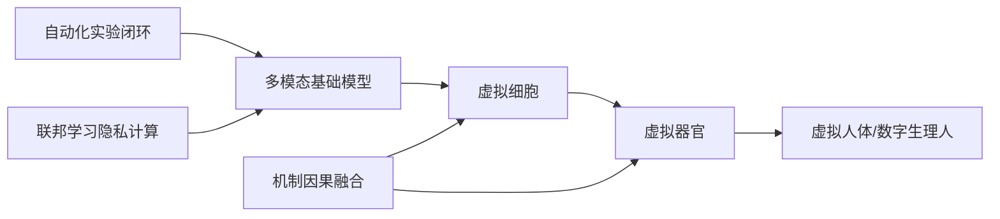
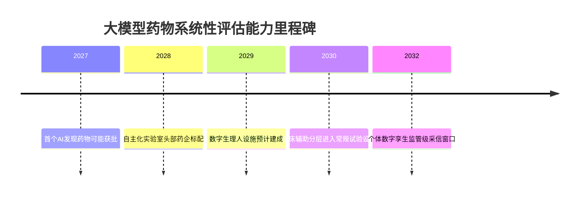

# 大模型能否系统性评估药物影响：现状、技术路线与未来预测

## 摘要

大模型已在分子与细胞扰动层面提供可用的药物响应预测，但在跨尺度、可解释、可被监管接受的"系统性评估"维度上仍存结构性短板。真正端到端的虚拟评估闭环预计要到2030年前后才会初步成型。

当下证据已相当可观：约220个生物医学基础模型中过半已整合两种以上数据类型；Tahoe-100M积累了超过1亿条转录组扰动谱，覆盖50个癌细胞系与1100种小分子；细胞级扰动模型XPert在冷启动泛化任务中使Pearson相关性提升36.7%、MSE下降78.2%。然而，《Why LLMs Fail at Causal Discovery》与2026年2月*npj Digital Medicine*的证据表明，**大模型擅长预测而拙于因果解释，这种"相关而非因果"的鸿沟正是监管审批的真正卡点**。

面向2030年的总判断是：**分子—细胞层最先成熟、个体数字孪生居中、群体虚拟试验最晚；三层耦合而非单点突破将决定方向走势。**

# 1 研究框架与评估方法

本章确立三件事：本报告所说的"大模型"指哪类对象；用什么统一量规衡量其系统性评估能力；以及下游各章复用的统一词表。**本报告把"大模型"严格限定为面向生物医学的基础模型谱系，而非泛指通用人工智能或传统机器学习。**

全篇横向对比的骨架是以下十类实体：

| 实体类别 | 技术定位 | 报告中的角色 |
|---|---|---|
| 通用大语言模型（GPT类） | 文本推理 | 假设生成与文献综合 |
| 生物医学/科学型LLM（Tx-LLM、BioGPT） | 领域文本推理 | 任务对齐的知识接口 |
| 蛋白质与小分子基础模型（AlphaFold） | 结构与分子表征 | 分子尺度影响表征 |
| 单细胞与多组学基础模型（scGPT、Tahoe-100M） | 表征学习 | 细胞状态预训练先验 |
| AI虚拟细胞（AIVC） | 机制仿真候选 | 细胞层扰动响应仿真 |
| 药物诱导扰动响应模型（XPert、scPPDM） | 扰动预测 | 给药后状态变化预测 |
| 可解释知识图谱增强模型（VCWorld） | 因果/机制推断 | 可解释性与机制约束 |
| 医学数字孪生/虚拟患者（AML、TNBC、PharmaFormer） | 个体仿真 | 个体层药物反应集成 |
| 智能体AI（Agentic AI / DMTA闭环） | 自动化编排 | 设计—制造—测试—分析闭环 |
| AI-机制混合模型 | 机制+数据 | 小数据机制约束的因果骨架 |

## 1.1 研究范围与边界

本报告聚焦一个狭窄而明确的问题：**一组专用基础模型能否在分子、细胞、个体与人群四个尺度上辅助建模药物诱导扰动响应。**

**"大模型"限定为生物医学基础模型谱系而非通用LLM。** 通用LLM仍被纳入，但角色被限定为假设生成与文献综合的辅助层。这一限定有实证支撑：使用生物医学基础模型对小队列进行推断，是推进药物反应生物标志物发现与靶点识别的务实路径。

**"系统性评估药物"指跨分子、细胞、组织、个体到人群的多尺度宏观影响评估，而非单一靶点筛选。** 药物影响远不止于靶点：肠道作为重要微生态系统，在药物代谢中作用至关重要，任何仅停留在靶点层的评估都会系统性地漏掉菌群这一调制维度。

这里存在一个真实张力：**系统性越强，可验证性往往越弱。** 本报告的解决方式不是追求单一全能模型，而是按尺度分层评估、按窄域积累金标准——以菌群—药物代谢这类有明确读数的窄域先行，逐层向上拼装。

**纳入对象**包括蛋白结构与分子基础模型、单细胞与多组学基础模型、虚拟细胞、扰动响应模型、数字孪生、智能体AI，以及把菌群维度纳入药物代谢建模的路径。**排除对象**包括药企市场分析、与药物影响无直接关联的通用影像诊断，以及不以基础模型为载体的传统统计药理学。

综上，全报告评价的不是"AI能否帮医疗"，而是**"专用基础模型能否把药物的多尺度影响建成一个可评估的系统"**。

## 1.2 能力成熟度评估Rubric

### 六维评估量规

| 维度 | 权重 |
|---|---|
| 建模层级与机制仿真深度 | 0.22 |
| 数据基础与可获取性 | 0.15 |
| 多尺度系统性覆盖 | 0.20 |
| 个体异质性处理能力 | 0.18 |
| 验证证据与可比性 | 0.15 |
| 临床转化与监管落地 | 0.10 |

**建模层级与机制仿真深度被赋予最高权重（0.22），因为它区分了"相关拟合"与"机制因果"——这正是系统性评估区别于统计预测的分水岭。** 多尺度系统性覆盖（0.20）次之；个体异质性（0.18）回应核心关切；临床转化与监管落地（0.10）最低，因现阶段多数路线尚未触及该维，过高权重会丧失区分度。后续将对每个权重施加±5pp扰动并重算排序，检验结论稳健性。

### 成熟度四级分层

四级之间有明确门槛：

- **研究验证**：仅在回顾性数据集上展示预测性能；
- **临床前**：在前瞻性实验中得到独立验证；
- **临床辅助**：可作为辅助工具进入临床决策流程；
- **监管级**：被监管机构接受为可支持决策的证据。

打分采用0–10连续尺度，S_final为六维加权和，保留两位小数。每个成熟度判断力求满足SMART原则、可被证伪——例如"虚拟细胞已达机制仿真级"原则上可被任一反例（在某扰动上退化为纯相关拟合）所推翻。

## 1.3 报告路线图

本报告遵循"现状—路线—边界—未来"的单一主线：

| 章节 | 核心问题 |
|---|---|
| §6 问题背景 | 传统多组学为何难以系统性评估药物影响？ |
| §6.5 技术分类 | "大模型"分为哪几类？建模层级如何定位？ |
| §13 分子与细胞层 | 药物诱导扰动响应能建到何种程度？ |
| §13.4 个体层 | 数字孪生如何预测个体药物反应？ |
| §14 个体异质性 | 药物基因组学与AI如何融合？ |
| §15 群体层 | 虚拟临床试验如何做宏观评估？ |
| §16 横向对比 | 十类范式按六维的得分与排序？ |
| §16.5 边界与瓶颈 | 因果、验证、监管短板在哪？ |
| §17 未来预测 | 不同情景下方向将如何演进？ |
| §18 局限性 | 本报告自身的边界何在？ |

**§6–§16回答"现阶段能否"，§17回答"未来如何发展"。** 论证坚持"边界先于预测"的顺序：只有把瓶颈讲清楚，未来预测才不会沦为乐观主义。§17的未来预测采用基线、乐观、悲观三情景结构。

## 1.4 关键术语统一词表

术语碎片化是本领域的真实痛点：同一对象在不同文献中被称作"数字细胞""虚拟细胞"或"数字孪生"。本报告统一口径，**一经定义全篇不改**：

| 术语 | 统一定义 |
|---|---|
| AI虚拟细胞（AIVC） | 以基础模型表征细胞状态、预测扰动后变化的计算载体，目标是机制仿真 |
| 医学数字孪生 | 面向特定个体/疾病亚型、整合多组学与临床数据的个体级仿真模型 |
| 药物诱导扰动响应建模 | 对给药后细胞或机体状态变化的预测建模 |
| 建模层级谱系 | 文本推理→扰动预测→机制仿真→因果推断→数字孪生的五级能力谱系 |
| 智能体AI | 能自主编排设计—制造—测试—分析（DMTA）闭环的AI系统 |
| In Silico虚拟临床试验 | 在计算环境中模拟受试人群药物反应的群体级评估 |
| 药物基因组学（PGx） | 研究遗传变异如何影响个体药物反应；本报告采广义口径，含宏基因组维度 |
| 系统性宏观药物评估 | 跨分子、细胞、组织、个体到人群的多尺度药物影响评估 |

关键的口径区分是：**以"虚拟细胞"指细胞级仿真载体，以"数字孪生"指个体级集成载体，二者分属不同尺度，不再混用。** 若把细胞级预测误读为个体级能力，就会高估个体异质性处理水平。广义PGx把菌群/宏基因组纳入，而非局限于宿主基因组。

# 2 实体逐类刻画（七维模板）

以下对十类实体按统一七维模板（技术定位、数据基础、影响尺度、个体异质性、成熟度、关键局限、演进潜力）给出等深刻画。

## 2.1 通用大语言模型（GPT类）

通用GPT类模型在建模层级谱系中位于最底端的"文本推理"一级，处理的是关于药物的文本知识而非定量状态变化。**它不承担系统性评估，只承担假设生成与文献综合。** 其数据基础是海量通用文本的大规模预训练，不依赖结构化多组学读数，因此难以触及分子—细胞定量事实。在可模拟尺度上，它几乎不覆盖任何尺度的定量响应，定位是把其他专用模型的输出翻译为可读叙述的接口。

其核心局限是机制因果的缺失：输出的是统计相关性极高的文本而非可验证的机制断言，易产生看似合理实则无据的判断。这正是把它限定为辅助层的根本原因。**就演进而言，它更可能以"接口"而非"引擎"身份融入未来评估流程**，成为智能体的编排中枢。

## 2.2 生物医学/科学型LLM（Tx-LLM、BioGPT）

科学型LLM仍位于"文本推理"一级，但在生物医学语料与任务上做了对齐，**关键增量是任务对齐而非尺度跃升**。其数据基础介于大数据预训练与领域知识注入之间，对高质量结构化注释的依赖更高。在可模拟尺度上偏向分子—靶点层的知识关联，能把蛋白与分子基础模型的结构结论与文献证据对接。

Tx-LLM以单一权重在709个数据集、66个药物发现任务上训练，在22个任务上超越当时最优，已从文本推理上移到药物发现预测层。其瓶颈与通用LLM同源：输出是知识关联而非机制仿真。**中期潜力在于成为连接专用仿真模型与临床语境的标准接口，但仍不会独立承担仿真。**

## 2.3 蛋白质与小分子基础模型

蛋白与分子基础模型把药物影响评估下沉到分子结构这一最底层尺度，**是分子尺度影响表征的主力，覆盖更窄但更深**。其数据基础是大规模结构与序列数据，因金标准充分，验证证据相对扎实，是十类实体中验证基础较强者。它聚焦分子层（结合、构象、亲和力），可纳入个体的突变蛋白结构，从而间接支持个体差异建模。

蛋白结构预测这一窄域已是成熟度最高者之一。其核心瓶颈在于尺度跨越：**从分子结合到表型变化，中间隔着多层未建模的机制，单独难以承担群体评估**。短中期潜力在于作为虚拟细胞与数字孪生的分子侧稳定底座，并向生物制剂扩展。

## 2.4 单细胞与多组学基础模型

这类模型将建模单元从分子提升至完整细胞，明确落位于"扰动预测"层。scGPT在超过3300万个非疾病态人类细胞上预训练，可执行细胞类型注释、多组学整合与扰动响应预测；灵枢细胞在约18000个基因的全转录组尺度上建模；Tahoe-100M包含来自50种癌细胞系、经1100种小分子扰动后的超过1亿条转录组图谱，提供了前所未有的训练规模。

其核心瓶颈是**分布外泛化能力**：在训练分布内表现良好，但对未见过的新药或新背景泛化不确定；且转录组变化与最终治疗效果之间隔着多步未建模的机制。短中期演进是规模与覆盖的双扩张，是AI虚拟细胞愿景最现实的技术前身。

### AI虚拟细胞（AIVC）

AIVC是把前述所有基础模型整合为单一多尺度系统的终极愿景。其概念可追溯至1940年代冯·诺依曼的细胞自动机理论，关键里程碑包括2006年蓝脑计划、2012年斯坦福生殖支原体全细胞模型。

2024年12月*Cell*综述《How to build the virtual cell with artificial intelligence》将AIVC设想为基于大型神经网络的多尺度、多模态模型。**这一倡议首次将分散的基础模型统一在"虚拟细胞"这一系统目标之下，把建模层级从扰动预测层正式推向机制仿真层。** AIVC在愿景层面覆盖最完整，但落地层面仍处早期突破阶段，尚无可被监管援引的成熟实现。

## 2.5 数字孪生与智能体AI

### 医学数字孪生/虚拟病人

数字孪生落位于数字孪生层并向机制因果层延伸，**核心优势在于天然以个体为建模单元，可显式纳入遗传、疾病亚型、共病等差异**。它在理论上能贯通分子到个体的全尺度，AML、TNBC等特定疾病孪生原型正是在单一疾病背景下验证这一可行性。

其核心瓶颈是**机制因果与小数据的双重约束**：个体级数据天然稀缺，而要在小数据上构建可信机制表征，纯数据驱动几乎不可行。当前以个案验证为主，缺乏标准化跨个体指标，是距监管落地最远的路线之一。短期以肿瘤等特定疾病孪生验证可行性，长期才可能逼近覆盖个体全生命周期的持续更新孪生。

### 智能体AI（Agentic AI / DMTA闭环）

智能体AI是横跨多层的"编排者"：它本身不直接预测，而是感知任务状态、调用扰动预测或机制仿真模型、整合结果并迭代。其设想的循环把研究活动拆为五环——感知、思考、行动、观察、反思迭代。**真正价值在于反思—迭代的累积：每一轮观察被用于修正下一轮假设，从而把孤立预测升级为自我改进的研究过程。**

其核心瓶颈是**误差累积与可解释性**：闭环中每一步误差会沿循环放大。它依赖各被调用模块的成熟度——编排者不能凭空创造它所调度的模块不具备的能力。短期最可能先在低风险的假设生成与风险筛查环节落地。

### AI-机制混合模型

AI-机制混合模型是对"大数据预训练"范式的根本性反拨。其哲学根基可概括为：大模型是"能计算的算计"，依赖海量数据捕捉模式；小模型是"能算计的计算"，利用已有规则推理。**关键洞见在于：药物对个体的影响恰是典型的小数据场景，纯数据驱动在此天然失灵，必须靠机制先验补偿数据稀缺。**

它把机制方程作为约束注入学习过程，在小数据下仍能给出可解释的机制因果预测。"模拟即监督"路线主张用机制仿真生成监督信号预训练模型，Mantis已示范用仿真接地的基础模型做疾病预测。这构成一条因果链：机制仿真生成带标签合成数据→预训练基础模型→模型在真实小样本上获得机制先验→提升分布外泛化能力。**这一路线是十类技术中最契合个体异质性与小数据双重约束的路线**，因为它通过"机制补数据、仿真造监督"调和了"既要覆盖个体全尺度又受制于个体数据稀缺"的核心悖论。

# 6 问题背景：传统多组学与个体异质性的系统性局限

传统药物研究的根本困境不在于单点测量精度不足，而在于难以把药物影响当作一个跨尺度、随时间演化的系统过程整体把握。**其系统性局限可归为三类：还原论碎片化、数据与统计瓶颈、个体异质性扰动。**

| 局限类别 | 核心表现 | 对系统性评估的阻碍 |
|---|---|---|
| 还原论碎片化 | 靶点—通路被孤立研究 | 无法回答"整体机体响应" |
| 静态快照局限 | 单时间点横截面 | 难以外推新剂量/时间窗 |
| 脱靶与相互作用盲区 | 微弱分散信号易被忽略 | 安全性问题难以提前刻画 |
| 多组学技术瓶颈 | 批次效应、模态对齐、样本量 | 系统级推断不可靠 |
| 个体异质性 | 遗传、生理、菌群、环境差异 | 群体结论难落到个体 |

## 6.1 难以系统宏观解析机体影响

### 还原论碎片化与全身系统效应缺口

还原论把药物作用拆解为"药物—靶点—通路—表型"的线性链条，在确证单一靶点的因果贡献上极为有效，却在重组"全身系统效应"时遭遇结构性缺口：**当数十条通路在不同组织、不同时间窗并发响应时，逐环拆解所积累的局部知识无法简单线性叠加成机体整体图像。**

多组学的提出本意正是为弥补这一缺口，但整合DNA、RNA、蛋白质与代谢物这些异构数据类型本身充满挑战，限制了系统级解释。换言之，多组学在"采集维度"上扩展了广度，却未必在"系统整合"上达成深度。数据流的协调难题、可重复性与算法偏倚仍阻碍多组学交付连贯的系统级药物作用图景，这为AI承担"系统重组器"角色留出了空间。

### 脱靶效应与药物相互作用的系统性盲区

脱靶与相互作用信号往往分散在多条非预期通路上，幅度小、模态杂，**在以主效应为分析焦点的实验设计中容易被系统性忽略**。ADR的现实负担为此提供量化注脚：在欧洲约3.5%的住院治疗与ADR相关，医院里约10%的病人住院期间曾经历ADR。

这里存在一个值得正视的张力：还原论实验设计为追求统计功效，倾向于放大主效应、抑制次要变异，而脱靶与相互作用恰恰隐藏在被抑制的次要变异之中。其缓解需要把分析目标从"确证主效应"转向"全谱响应建模"——这正是药物诱导扰动响应建模试图承担的角色，也解释了为何安全性评估比疗效评估更依赖系统级仿真。

## 6.2 多组学的技术瓶颈

多组学的技术瓶颈呈链式传导：**批次与对齐的工程噪声叠加高维小样本的统计脆弱，最终汇聚为相关性主导、因果缺位的方法学天花板**。

| 瓶颈 | 工程/统计本质 | 代表缓解方法 | 裁断 |
|---|---|---|---|
| 批次效应与模态对齐 | 技术变异混杂生物信号 | MoDAmix、scMODAL | 可缓解未根除 |
| 样本量与纵向不足 | 高维小样本、过拟合 | 基础模型小队列推断 | 基础模型有前景 |
| 相关性主导 | 缺机制因果 | 系统药理学约束 | 停留相关性层级 |

关键的未解问题是：**基础模型的预训练先验究竟在多大程度上编码了可迁移的机制因果，而非仅仅是更高级的统计模式。**

## 6.3 个体异质性的干扰

个体异质性不是单一因素，而是遗传、生理、菌群与环境构成的多层调节网络。

### 非遗传临床因素

| 因素 | 主要作用机制 | 方向性影响 |
|---|---|---|
| 病理状态（疾病亚型） | 受体表达、通路活性改变 | 同药在不同亚型疗效分化 |
| 器官功能（肝/肾） | 代谢与排泄能力下降 | 药物蓄积、毒性风险升高 |
| 共病负担 | 多通路病理交互 | 反应偏离群体均值 |

**这些因素彼此并非独立，而是相互放大：器官功能下降常与高龄、共病、多重用药同时出现**，使个体偏离群体均值的程度层层叠加。它们的优势在于易于在病历中获取，劣势在于多因素交互难以解析。

### 肠道菌群与环境暴露

肠道菌群是个体异质性中近年最受关注的"第二基因组"，通过微生物酶直接参与宿主药物代谢。它可在分子机制层面调节肠道药物转运蛋白，且菌群—药物相互作用正成为精准医学的新兴优先方向。

菌群异质性已有量化进展：MicrobiomeDrug从肠道菌群基因家族丰度预测药物代谢潜力可达0.91的AUROC。其机制框架可表述为：个体间菌群组成差异导致微生物酶谱差异，酶谱差异进而改变药物在肠道的生物转化活性。**与时间稳定的遗传变异相比，菌群是个体异质性中最"流动"的维度，建模难度也最高**，但0.91的AUROC表明机器学习对菌群—药物关系的刻画已具可观预测力。

## 6.4 为何需要大模型补足缺口

从静态解析到动态仿真的跃迁，是大模型补足系统性缺口的范式核心动因。传统多组学止步于"解析已发生的状态"，而系统性评估的本质需求是**"仿真未发生的响应"：给定新剂量、新靶点、新个体，机体将如何演化**。

存在一个必须正视的张力：**仿真能力越强，验证负担越重。** 收益是用仿真生成传统采样无法获得的纵向、反事实数据；代价是仿真结果的可信度本身需要金标准验证，而验证数据恰恰稀缺。其缓解约束在于：仿真应先定位为假设生成与风险筛查工具，而非监管级决策替代。

本章核心收束：传统多组学的系统性局限可归结为**"整合缺口×异质性约束"的双重结构**，而生物医学基础模型的价值正在于以跨模态高维表征补整合、以动态仿真与个体协变量补异质性，但其落地须遵循"先工具、后决策"的分阶段定位。

## 6.5 建模层级谱系：从文本推理到机制仿真

当公众笼统地说"大模型能模拟药物影响"时，往往把五种性质迥异的能力混为一谈。本节建立可操作的建模层级谱系。

### 五层级辨析

| 层级 | 模型承诺 | 证据强度 |
|---|---|---|
| 文本推理 | 能讲清作用机制 | 大量公开评测，但正面临基准饱和 |
| 特征提取 | 提供数字指纹 | 较成熟 |
| 扰动预测 | 预测处理后可测变化 | 中等，高度依赖数据集质量 |
| 机制因果 | 预测改变剂量/基因型后的反应方向 | 个案验证为主 |
| 数字孪生 | 给出个体化反应轨迹 | 个案验证为主 |

**这五层并非简单递进，而是形成一条证据强度与可证伪性逐层升高、但可获取数据逐层稀缺的反向梯度。** 这一层级落差预示着：到2028年前后，真正的能力分水岭不取决于模型规模，而在于第三层向第四层的跨越能否形成标准化、可比的验证指标。

### "模拟药物影响"在各层级的不同含义

将五层混用是产业宣传与学术现实落差的主要来源。资本叙事倾向于以第五层承诺包装仅达到第二、三层的能力——部分公司用"医学证据已支持的靶点"包装成果，对KRAS等复杂靶点刻意回避，且多数AI仅能计算分子静态结构、缺乏细胞动态变化等关键维度。**从"系统性宏观评估"这一最终目标看，唯有第四、第五层能力才真正对应"系统地解析药物对机体的影响"，而当前绝大多数落地证据集中在第二、三层——这一错配正是本报告核心判断的起点。**

### 大模型的三种角色分歧

- **特征提取器**：仅贡献表征，预测交由下游模型。BAITSAO即利用LLM生成的语境富集嵌入作为药物与细胞系初始表征。
- **预测器**：直接承担端到端任务。Tx-LLM以单一权重在66个药物发现任务上训练。
- **编排者**：退居调度层，调用其他专用模型并整合结果，即智能体AI的核心设想。

编排者范式可显式调用药物基因组学模块注入个体差异，理论上系统性更强，但更依赖各被调用模块的成熟度。大模型作为特征提取器降低了下游数据门槛，使小队列场景下的药物反应预测成为可能。

### BAITSAO与Tx-LLM两种范式

BAITSAO是"特征提取器"范式最清晰的案例：**LLM只负责把药物与细胞系语义压缩为高质量初始向量，真正的药物协同预测由专门的多任务模型完成**。这既规避了直接预测的幻觉风险，又借用了语义表征能力，为"用基础模型做特征工程、用小队列做推断"提供范例。

Tx-LLM走相反方向——"一个模型、多种任务"，其统一权重的价值在于知识迁移：一个任务上学到的化学规律可被另一任务复用。但其跨66个任务的聚合分数可能掩盖个别任务的弱项，这正是基准批评文献警示的聚合分数失真问题。

# 13 分子与细胞层面：药物诱导扰动响应建模

分子与细胞层是证据最密集、指标最可核的层级。核心判断先行：**在单剂量-单时间的转录组扰动响应预测、小分子ADMET预测与细胞形态学预筛三类任务上，基础模型已接近"候选可用"区间；而机制因果级的系统性宏观解析仍处研究到早期验证阶段。**

## 13.1 扰动响应预测的代表模型

近两年的代表性突破集中体现为**判别式双分支架构（XPert）与生成式扩散模型（scPPDM、MultiVCDiff）两条并行路线**。

### XPert：双分支架构与剂量-时间动态建模

XPert用双分支架构分别编码扰动前与扰动后的转录组状态。在单剂量-单时间场景的cold-cell泛化下，取得**Pearson相关系数提升36.7%、MSE下降78.2%**的结果。其上下文感知的基因网络建模缓解了VAE类方法固有的过度去噪问题。

XPert稳定落在"扰动预测"层，**定位比scGPT这类通用表征基础模型更窄但更深**：前者提供可迁移的细胞表征底座，后者直接输出带剂量-时间条件的响应预测。其数据基础属"大数据预训练+小数据微调"折中范式。个体异质性当前停留在"细胞类型级"分辨，尚未达到患者级。

其最核心瓶颈在于判别式本质决定了它给出的是统计相关意义上的预测而非机制因果。**短期演进沿"剂量-时间更精细+cold-cell覆盖更广"推进，中期价值更可能体现为嵌入数字孪生与虚拟临床试验的分子层引擎。**

### scPPDM扩散模型与MultiVCDiff

scPPDM在Tahoe-100M基准的未见药物任务上，相对次优模型取得**DEG logFC-Spearman +36.11%、Pearson +34.21%**的提升。MultiVCDiff面向形态学响应，显著降低FID与KID指标，并借助6,345个形态学特征区分不同药物诱导的细胞形态差异。

与XPert的判别式点估计不同，扩散模型的定位优势是刻画响应的整体分布而非单点均值，但**二者都仍是统计相关意义上的映射**。两者合起来把"转录组响应"与"形态学响应"两个子尺度都纳入了生成式建模。扩散模型路线的核心张力在于生成质量与机制可解释性之间的取舍——MultiVCDiff虽能区分形态差异却不解释"为什么"。

### UniCure等统一扰动模型

统一扰动模型用单一框架同时处理药物扰动与基因扰动，**潜在红利是借基因扰动的充分样本反哺药物扰动的稀缺场景**。其核心张力是"统一"与"专精"之间的取舍，能否翻盘取决于跨扰动迁移是否真的带来正向知识共享——而这恰恰最受制于统一基准的缺失。中长期看，在统一基准逐步建立的前提下，它可能成为分子细胞层走向系统性宏观评估的关键底座。

## 13.2 可解释机制建模

前述扰动预测模型能给出"会发生什么"，却难以回答"为什么发生"。**VCWorld代表的白盒路线正是针对这一机制因果缺口而设计。**

### VCWorld：LLM+知识图谱的"白盒侦探"

VCWorld整合结构化生物知识与LLM推理，以数据高效的方式复现扰动诱导的信号级联，在给出逐步预测的同时产出显式机制假设，在药物扰动基准上取得SOTA预测性能。它构建了连接药物、靶点、疾病等实体的知识图谱，像侦探一样逐步推理。

**VCWorld跨越了"扰动预测"与"机制仿真"两层**，与XPert、scPPDM形成本质区别。其知识图谱提供结构化先验，降低了对海量扰动样本的依赖。在"机制深度"上显著领先，但其核心张力在于白盒可解释性与覆盖完整性的取舍——**知识图谱所编码的通路关系覆盖范围会直接限定可解释的边界**。中期有望从"研究阶段白盒"演进为"临床前机制假设生成工具"。

### 黑盒生成vs白盒机制：满足度对比

| 满足度维度 | 黑盒生成 | 白盒机制（VCWorld） |
|---|---|---|
| 响应预测精度 | 高（+36% logFC量级） | 高（基准SOTA） |
| 机制因果可读性 | 低（不解释"为什么"） | 高（产出显式机制假设） |
| 通路级传播可追溯 | 弱 | 强（复现信号级联） |
| 数据依赖 | 重（需大语料） | 轻（知识图谱先验） |
| 系统宏观解析满足度 | 部分满足 | 较高满足 |

**核心结论：就用户所关切的"系统性宏观解析"而言，白盒机制路线的满足度结构性地高于黑盒生成路线，尽管两者在纯预测精度上可能相当。** VCWorld的出现表明白盒路线可在保持SOTA预测的同时提供机制解释，使"预测准还是解释清"的取舍出现松动——其根因是知识图谱把结构化先验注入预测过程，使预测力与可解释性不再是零和。

通路级扰动传播建模把"药物→表型"的黑箱映射展开为可追溯的多步因果链：药物结合靶点→下游激酶活性改变→转录因子磷酸化迁移→下游基因表达谱整体偏移。VCWorld的白盒设计使这条链的每一环都可被显式呈现。

**仍未解决的问题是：** 白盒机制路线产出的机制假设，其真伪如何在缺乏湿实验闭环的条件下被系统验证。

## 13.3 药效、毒性与ADMET预测

**明确判断：小分子ADMET预测已有可解释平台支撑、成熟度相对较高，而毒性链式推理与形态学响应预测仍处研究到早期验证阶段。**

- **细胞活力/形态学响应**：MultiVCDiff的形态学特征提供了比转录组更贴近表型的药效代理指标，但机制分辨率较低。
- **毒性预警与脱靶识别**：CoTox把毒性归因显式化为可读的链式推理步骤，更利于人类专家审核；而结构级分子解毒仍是MLLM未充分解决的难题——它要求同时满足"降低毒性"与"保持药效"的双重约束。

# 13.4 个体层面：医学数字孪生

个体层面承上启下：既要继承分子细胞层的机理输出，又要把这些输出压缩进单一患者的稀疏数据约束中。核心判断：**在肿瘤这一数据相对富集、终点明确的狭窄赛道上，医学数字孪生已能对特定药物组合的疗效与毒性给出临床辅助级预测，但在跨个体泛化上仍受制于模型sloppiness与个体异质性。**

## 代表案例

### AML中预测中性粒细胞减少

AML的venetoclax+azacitidine方案是验证个体级毒性预测能力的典型场景。该案例把骨髓造血动力学、药物暴露与细胞凋亡耦合成机制仿真模型，**核心价值在于把群体药代参数个体化后注入造血毒性方程，对单个患者的粒细胞低谷时点给出定量预测**。这把原本需事后观察的中性粒细胞减少转化为给药前可模拟的风险筛查。

### TNBC、结直肠癌的虚拟患者疗效预测

类器官驱动的虚拟患者用体外活体类器官作为患者的"湿实验替身"。一项直肠癌类器官研究显示，对联合放化疗反应预测临床结局的准确率在发现队列（80例）为92.5%，**验证队列（48例）准确率进一步提升至93.75%，敏感性96.30%，特异性90.48%**。这一量级已逼近临床可用阈值。

**与AML纯机制毒性孪生相比，TNBC/结直肠路径把个体异质性"外包"给了类器官这一活体载体，从而绕开了单人数据稀疏下参数不可辨识的难题**——这是两类路线在个体异质性处理上的根本分野。其瓶颈转为类器官培养的成功率与周期。

### PharmaFormer等个体响应模型

PharmaFormer是纯计算路线，从患者分子特征序列直接回归到药物敏感性，属大数据预训练范式。**它面临一个核心张力：预训练语料以细胞系和群体数据为主，而推断目标是单个真实患者，两者之间存在分布偏移。** 缓解路径不在于更大模型，而在于引入个体特异的药代与微生物组等调节变量——仅从肠道微生物组基因家族丰度预测药物代谢潜力即可达AUROC 0.91。当前验证主要停留在回顾性队列的留出测试，**只能给出"研究级"判定**。

**本节综合**：医学数字孪生在个体层面的可行性与所选赛道的"真值可获取性"强相关——有类器官等活体真值标定时（TNBC/结直肠癌），准确率可达90%以上；退到纯计算个体响应（PharmaFormer）时，验证只能停留在回顾性留出。

## PK/PD与药代信息融合

个体疗效预测若不绑定个体药物暴露，其准确性上限将被剂量-暴露偏差钉死。

- **PK知情的LLM病人模拟**：把个体暴露曲线作为条件输入。其关键价值在于：**给定同一剂量，不同个体因代谢酶活性差异会产生数倍的暴露差异，PK知情模拟把这一差异显式注入**，避免把群体平均暴露错当成个体暴露的系统偏差。个体暴露差异的一大来源是肠道菌群对药物代谢的调节。它天然对接监管已接受的群体PK建模范式，在监管可解释性上优于纯黑箱模型。

- **MMPK数据"错误与定义不一致"问题**：人体PK数据来自异构临床研究，对同一参数常采用不同定义、单位与采样方案。**这使个体级PK融合面临"垃圾进垃圾出"风险：定义不一致的训练数据会把系统性偏差固化进模型。** 务实解法是建立本体对齐层：先把异构来源的PK参数定义统一到标准本体，再用不确定性加权降低低质量记录影响。

- **剂量个体化模拟**：从"预测反应"推进到"推荐剂量"，把分子（靶点占据）与个体（暴露-响应）两个尺度串联。它比PK知情模拟多了一步反向优化，对模型外推可靠性要求更高，因为优化会把解推向训练分布边缘。在窄治疗窗药物上已有临床辅助级证据。

**本节核心论点**：**个体药物反应预测的准确性上限，更多由个体暴露建模的质量决定，而非由预测模型的架构决定**——定义不一致的MMPK数据与微生物组调节构成了暴露建模的两大误差源。

## 个体级模拟的准确性与可变性

**核心判断：即便群体层面指标亮眼，个体级准确性仍高度可变，其根源是单人小数据下的参数不确定性，而非建模路线的对错。**

AML数字孪生研究坦诚承认其"患者特异准确性高度可变"，根源是模型sloppiness——众多参数组合对预测影响极小，仅少数参数显著影响结果。其因果链：单人数据有限→参数高度不确定→模型sloppiness放大输出变异→预测在不同个体间发散→患者特异准确性高度可变。

**这一可变性不应被误读为模型无价值**：即便个体点预测不稳，数字孪生给出的个体风险区间仍能用于筛查高风险患者，这与"假设生成而非确诊"的定位一致。AML数字孪生主动报告准确性可变这一事实本身，反而提升了其证据可信度。

机制驱动与数据驱动在个体小数据下表现迥异：**个体层面恰恰是数据最稀疏的尺度，而数据驱动路线的分布外泛化能力正是在此处最脆弱**。务实解法是混合：用机制约束提供结构先验、压缩参数空间，用数据驱动填充机理未覆盖的残差。机制约束之所以有帮助，是因为它能把sloppy方向固定下来，只让少数对个体预测敏感的参数从数据中学习，从而在不增加数据的前提下降低有效自由度。

下表压缩本章关键对比：

| 路线/案例 | 建模层级 | 个体异质性处理 | 成熟度 | 代表指标 | 关键瓶颈 |
|---|---|---|---|---|---|
| AML毒性孪生 | 机制仿真 | 造血风险分层 | 临床辅助级 | 中性粒细胞低谷定量 | 准确性高度可变 |
| TNBC/结直肠类器官 | 机制仿真↔数字孪生 | 外包给类器官活体 | 临床辅助级 | 验证队列准确率93.75% | 类器官培养成功率 |
| PharmaFormer | 扰动预测↔数字孪生 | 隐式编码组学 | 研究级 | 回顾性留出测试 | 群体→个体分布偏移 |
| PK知情模拟 | 文本推理↔机制仿真 | 显式暴露层 | 临床辅助级（窄窗药） | 微生物组→代谢AUROC 0.91 | MMPK数据定义不一致 |

**本章核心**：个体层面的大模型药物反应预测已在肿瘤狭窄赛道跨过临床辅助级门槛，但其天花板由暴露建模质量与单人小数据可变性共同设定，突破口在机制-数据混合与真实世界反馈闭环，而非单纯放大模型规模。

# 14 个体异质性建模：药物基因组学与AI融合

个体异质性是药物系统性评估中最难统一建模的维度，而药物基因组学（PGx）为其提供了少有的机制因果锚点。**统领判断：在个体异质性诸来源中，遗传（PGx）凭成熟测序读出与清晰机制因果链，是当前最接近临床辅助的维度；菌群凭AUROC 0.91的量化读出居其次；表观与生活方式则受读出成熟度所限。**

## 14.1 药物基因组学与AI结合

### PGx作为异质性首因

药物基因组学的历史地位由一批20世纪中叶的经典案例奠定（G6PD缺乏者对伯氨喹的敏感性、异烟肼乙酰化代谢差异等）。**PGx之所以能成为优先切入口，存在一条可追溯的因果链：基因多态性改变CYP450等代谢酶活性→改变药物清除速率与血药浓度→相同剂量在不同个体产生疗效或毒性差异**。正是这条"基因型→酶活性→暴露量→反应"的多环因果链，使PGx区别于纯统计相关的异质因子。

### 基因型→药物代谢酶→剂量预测

一套面向药物基因组推荐的智能体AI系统，在从22篇生物医学文献与FDA标签中抽取临床相关实体时达到**91.9%的准确率**，并在剂量建议的临床清晰度上显著优于GPT-5、Claude与Grok。这类系统的可靠性高度依赖领域知识库锚定——基于GPT-4结合RAG与CPIC知识库的助手，在专业查询上明显优于无锚定的纯通用问答。**在窄治疗窗药物这一剂量误差容限极低的场景中，基因型驱动的剂量个体化最有条件率先从研究走向临床辅助**。

### 罕见变异与小数据挑战

这里存在一个真实的方法论张力：**大模型的优势在于从海量数据中归纳模式，而罕见变异恰恰是数据最稀缺的地方——规模越大的预训练，对低频长尾反而越无能为力**。其出路不在于堆更多数据，而在于引入机制先验与规则推理来补偿样本不足。罕见PGx变异的可建模性将取决于跨机构联邦学习与机制嵌入两条路径的成熟，而非单纯等待更大模型。

## 14.2 患者分层与不良反应预测

智能体AI已能跨多篇研究聚合证据，并为基因-药物对生成表型特异的剂量建议。在炎症性肠病小队列上，利用生物医学基础模型进行多组学特征工程是推进药物反应预测的务实路径；AI整合多组学可使药物基因组预测准确性提升5—20%，DeepDRA在癌症药物敏感性预测中达AUPRC 0.99。

真实世界反馈学习闭环的证据边界需诚实界定：当前证据提供的是抽取-聚合-建议的能力，**尚未提供完整的"用药→结局→模型更新"临床闭环落地案例**。闭环滞后的原因：真实世界结局受共病、依从性、合并用药等多重混杂因素影响，使"反馈信号"难以干净归因，从而推高了闭环系统的验证门槛。

**本节结构性判断**：患者分层与ADR预测的成熟度，由**"反馈信号能否干净归因"**这一共同变量排序——遗传与分子亚型因读出清晰而先行达临床辅助，反馈闭环因受混杂约束而滞后于设想阶段。

## 14.3 多因素异质性整合

| 异质来源 | 读出成熟度 | 因果可分辨性 | 代表量化证据 | 当前评级 |
|---|---|---|---|---|
| 遗传 | 高（成熟测序） | 强（基因→酶→暴露→反应） | CYP450机制、PGx智能体91.9% | 临床辅助探索 |
| 菌群 | 中（测序可读出） | 中（多机制） | MicrobiomeDrug AUROC 0.91 | 研究级，量化证据较明确 |
| 表观遗传 | 缺稳定读出 | 时变难锚定 | 暂无可比量化证据 | 研究级，待读出突破 |
| 生活方式 | 难量化为分子读出 | 弱（间接路径） | 暂无可比量化证据 | 研究级，最难纳入 |

四类来源中，菌群已积累出较明确的量化建模证据，而表观遗传缺乏类似菌群测序的稳定高通量读出——**缺乏稳定高通量读出是其暂难被现有模型有效纳入的主要约束**。

把多因素整合进个体数字孪生面临明确上限：**全因素孪生的建模难度，主要不在算法，而在各因子读出成熟度的不齐**。此处存在核心权衡：纳入越多异质因子，模型原则上越贴近真实个体，却也越易因读出不稳定、因果难分而引入噪声。务实化解是按读出成熟度分批纳入：先遗传、再菌群，待表观与生活方式获得稳定读出后再行纳入——约束条件是每新增一类因子都需有可验证的边际增益。

AI-机制混合路径为全因素孪生的小数据困境提供出路：纯数据驱动在表观、生活方式这类读出稀缺的因子上难以泛化，混合模型可借机制先验把稀缺读出"撑"起来，因而更可能成为全因素孪生的可行技术底座。

**本章核心结论**：**个体异质性建模的当前边界，由各异质因子的读出成熟度与因果可分辨性共同决定，遗传领先、菌群跟进、表观与生活方式待突破。** 留给下一步研究的开放问题是：表观遗传能否获得类似菌群测序的稳定高通量读出。

# 15 群体层面：In Silico虚拟临床试验

群体层面的核心诉求是把单个数字孪生无法表达的人群分布，用计算方式外推为可供决策的疗效与安全分布。**核心结论先行：在群体尺度上，"复用已知分布"的能力（合成对照、招募预演、安全信号排序）已接近可用，而"从头预测系统效应"的能力仍受制于跨尺度动态建模缺口。**

## 15.1 虚拟临床试验方法学

虚拟病人群体的现实可行性高度依赖于建模目标本身的性质：**计算生成的虚拟队列在"合成对照臂"与"亚组分布预演"这类复用已知分布的任务上，远比在确证性疗效判定这类从头预测任务上成熟**。原因在于，合成对照臂所需的只是历史真实世界分布的重采样与校正，而确证性疗效判定要求模型具备分布外泛化能力。

下一代数字孪生必须整合分子、细胞、组织、器官、临床、行为与环境七层数据才能准确建模健康轨迹，这意味着当前以单组学或少数临床变量构建的虚拟队列只能服务于分布复用类任务。**虚拟队列在近中期内最现实的落地形态，是作为合成对照臂的辅助证据而非主证据。**

患者招募与试验设计优化是比确证性疗效判定更易落地的场景，本质上是对入排标准下可得样本分布的预演。其权衡清晰：多模态预演更准，但对每一分层都要求分子加临床双重数据的配对覆盖。现实解法是在数据富集的高价值分层上优先采用多模态预演，在数据稀疏分层上退回单组学粗估。

群体异质性统计建模的关键在于识别可量化、可建模的协变量。微生物组是被低估的维度——MicrobiomeDrug从肠道微生物组基因家族丰度预测药物代谢潜力的AUROC达0.91，表明**药物代谢潜力是群体异质性中一个可量化、可建模的维度**，而不必笼统归入"无法解释的个体差异"。就经肠道菌群显著代谢的药物而言，宿主基因型加微生物组的双协变量模型，在亚组响应区分上理论上应优于仅含宿主基因型的基线。

## 15.2 跨尺度系统效应整合

**跨尺度动态建模缺口是当前系统性药物影响评估最核心的技术短板。** 系统药理学揭示的跨尺度因果链是：分子靶点结合→蛋白网络改变→细胞信号传导改变→组织功能变化→器官生理结果。然而把这一链条转化为可计算的动态仿真，首先受阻于异质数据整合——构建高精度虚拟细胞的首要挑战就是整合异质性生物数据。

跨尺度耦合具有纵横两个方向。**纵向**：群体层面的药代动力学决定单个细胞内分子靶点结合的时序，表明药物组合效应依赖于动态的跨尺度相互作用——**时序依赖性是跨尺度耦合的本质特征，静态剂量-响应模型无法捕捉**。**横向**：人体多个器官通过血管、神经、内分泌途径紧密联系，药物作用经由心血管系统引发器官间通讯。

免疫与代谢网络是系统效应传播中两个高度耦合的枢纽，其中微生物组的作用近年被重新评估。**微生物组组成差异已被证实与药物生物转化活性差异相关，这使其从"被忽略的背景"升级为"可测量的暴露差异来源"。** 当前务实解法是先以静态协变量形式纳入，待纵向数据积累后再升级为动态参与者。

## 15.3 上市后安全监测与药物重定位

真实世界数据驱动的安全信号挖掘，其价值根植于上市前试验无法覆盖的群体风险负担（ADR负担3.5%/10%）。当前安全信号挖掘主要停留在统计相关层面，**距机制因果仍有差距**。对经肠道菌群显著代谢的药物，把微生物组暴露差异纳入信号挖掘，与仅按宿主基因型分层的传统分层构成方法学对照。

药物重定位具有显著的经济杠杆：**一个已上市药物的部分ADR谱、药代动力学乃至药物-微生物相互作用信息可能已经可得**，从而降低系统性评估在安全维度上的不确定性。但只有当新人群的关键代谢协变量与原人群可比时，已知药代信息的复用才稳健。

**本章综合**：群体尺度建立了**"复用先于预测"**的保守排序。In Silico虚拟临床试验的能力沿"复用已知分布→从头预测系统效应"急剧衰减。

| 群体尺度场景 | 能力定位 | 关键证据 | 成熟度判断 |
|---|---|---|---|
| 合成对照/招募预演 | 复用已知分布 | 多层数据整合 | 辅助证据角色趋近可用 |
| 群体异质性统计建模 | 微生物组协变量 | MicrobiomeDrug AUROC 0.91 | 方向性确立，待头对头验证 |
| 跨尺度耦合仿真 | 从头预测系统效应 | 时序依赖、异质数据瓶颈 | 器官特异性原型，全身闭环未达 |
| 安全信号挖掘 | 真实世界统计相关 | ADR负担3.5%/10% | 最贴近监管，机制因果待补 |
| 联用/药物重定位 | 已知信息复用 | 药物-微生物相互作用 | 经济杠杆高，先于从头预测 |

**仍待解决**：当前证据仅验证了群体→细胞的单向影响，细胞事件聚合是否显著回写为人群响应分布，是下一阶段跨尺度建模必须实证回答的开放问题。

# 16 技术路线横向对比与能力成熟度评估

**核心结论：大模型相对传统多组学的增量价值在于从静态解析转向动态仿真，但没有任何单一路线能独立胜任系统性药物影响评估。AI-机制混合路线在多尺度系统性覆盖上领先，分子结合与ADMET筛查则是最接近现已可用的能力点。**

## 16.1 大模型方法与传统多组学方法对比

| 对比维度 | 传统多组学 | 大模型/基础模型 | 能力位移 |
|---|---|---|---|
| 时间属性 | 静态快照 | 动态仿真 | 静态→动态 |
| 因果属性 | 统计相关性 | 机制因果尝试 | 相关→机制（部分） |
| 模态属性 | 单组学或弱整合 | 多模态联合表征 | 单模态→多模态 |
| 个体异质性 | 群体平均 | 可纳入PGx/亚型先验 | 平均→个体（研究级） |
| 验证范式 | 实验金标准 | 基准评估，可比性存疑 | 严谨→待验证 |

**这张表不是说大模型全面优于多组学，而是说它把解析能力沿四个轴向外推，代价是第五行的验证严谨性下降。** 三组对立中最难跨越的是"相关性vs机制"：多数模型学到的仍是高维相关性而非可干预的机制因果。这条鸿沟的因果链是：训练数据以观察性组学为主，缺乏系统性扰动标签→模型只能拟合共变结构→面对未见过的干预组合时无法外推→把统计偶合误判为治疗因果→湿实验验证阶段暴露为假阳性。

大模型相对多组学的三项增量价值：跨模态知识迁移、小队列推断，以及**最被低估的一项——自然语言把定量组学与生物学推理连接起来的能力**，这使得"解释为何药物这样作用"第一次可被模型语言化。**结论：大模型在假设生成与风险筛查工具定位上已提供明确增量，但尚不足以替代多组学的实测金标准，二者是互补而非替代关系。**

## 16.2 各技术路线多维对比矩阵

| 路线 | 建模层级 | 数据基础 | 影响尺度 | 个体异质性 | 成熟度 | 关键局限 |
|---|---|---|---|---|---|---|
| 通用LLM（GPT类） | 文本推理 | 大数据预训练 | 假设/文献层 | 弱 | 临床辅助初级 | 幻觉/无机制 |
| 生物医学LLM | 文本+扰动推理 | 大数据+领域微调 | 分子-文献 | 中 | 研究验证 | 可比性弱 |
| 蛋白/小分子基础模型 | 扰动预测 | 结构大数据 | 分子 | 弱 | 临床前应用 | 活性≠疗效 |
| 单细胞/多组学基础模型 | 扰动预测 | 单细胞图谱 | 细胞 | 中 | 研究验证 | 批次/泛化 |
| AI虚拟细胞 | 机制仿真 | 多组学+机制 | 细胞-组织 | 中 | 研究验证 | 验证缺口 |
| 药物扰动响应模型 | 扰动预测 | 扰动配对数据 | 分子-细胞 | 中 | 研究验证 | OOD泛化 |
| 知识图谱增强模型 | 因果推断 | 大数据+KG先验 | 细胞-机制 | 中 | 研究验证 | 图谱完备性 |
| 数字孪生/虚拟病人 | 数字孪生 | 小数据机制+个体 | 个体 | 强 | 临床前-辅助 | 个体数据稀缺 |
| 智能体AI | 仿真+决策 | 闭环实验数据 | 跨尺度编排 | 中 | 研究验证 | 误差累积 |
| AI-机制混合模型 | 机制仿真+因果 | 机制方程+数据 | 分子-人群 | 强 | 临床前-辅助 | 标定成本 |

这张矩阵给出一个清晰的裁定：**AI-机制混合路线是影响尺度列中跨度最大的路线，能从分子延伸到人群；而蛋白/小分子基础模型虽成熟度最高，尺度却被锁在分子层。这揭示了一个核心权衡：成熟度与尺度覆盖在当前呈反向关系——越成熟的路线覆盖越窄。**

矩阵第二列暴露了整个领域最深的分野——大数据预训练与小数据机制的根本对立。**这组对立不是谁对谁错，而是两种各有失效边界的互补能力**：大数据路线的失效边界是稀有事件与罕见病，小数据机制路线的失效边界是标定成本与方程不完备。VCWorld这类知识图谱增强模型正是两者的混合。预计到2030年，纯大数据与纯机制两个端点都将向中间的混合带收敛。

## 16.3 成熟度分层与加权评分

评分公式：S_final = Σ(weight_i × dim_i)。

| 路线 | 机制深度 | 数据基础 | 尺度覆盖 | 个体异质 | 验证证据 | 临床落地 | S_final | 分层 |
|---|---|---|---|---|---|---|---|---|
| AI-机制混合模型 | 8.50 | 6.00 | 9.00 | 7.50 | 6.50 | 6.00 | 7.45 | 临床前 |
| 数字孪生/虚拟病人 | 7.50 | 5.00 | 7.00 | 9.00 | 5.50 | 6.50 | 6.78 | 临床前 |
| 蛋白/小分子基础模型 | 6.50 | 8.50 | 4.00 | 3.50 | 7.50 | 7.00 | 6.18 | 临床前 |
| AI虚拟细胞 | 8.00 | 6.50 | 6.50 | 6.00 | 4.50 | 4.00 | 6.18 | 研究 |
| 知识图谱增强模型 | 7.50 | 6.50 | 6.50 | 6.00 | 5.00 | 4.50 | 6.18 | 研究 |
| 智能体AI | 6.50 | 6.00 | 7.50 | 5.50 | 4.50 | 5.00 | 5.93 | 研究 |
| 药物扰动响应模型 | 7.00 | 6.50 | 5.50 | 6.00 | 5.50 | 4.50 | 5.93 | 研究 |
| 单细胞/多组学基础模型 | 6.50 | 7.50 | 5.00 | 6.00 | 5.50 | 4.50 | 5.85 | 研究 |
| 生物医学LLM | 5.50 | 8.00 | 4.50 | 5.00 | 4.50 | 5.50 | 5.45 | 研究 |
| 通用LLM（GPT类） | 3.50 | 8.50 | 3.50 | 3.00 | 4.50 | 5.00 | 4.60 | 研究初级 |

**AI-机制混合模型以7.45分居首，主导维度是多尺度系统性覆盖与机制深度；数字孪生以6.78分次之，主导维度是个体异质性处理能力。通用GPT类以4.60分垫底。**

**能力三分**：分子结合与ADMET筛查最接近"现已可用"（AI生成的药物分子在I期临床成功率高达80%–90%，远超40%–65%的历史均值，但这属于分子生成而非系统评估）；药效预测的分布外泛化、毒性链式推理、患者分层属"研究阶段"；**人群级系统评估与监管级验证属"短期难实现"**——它面临一个结构性权衡：系统性评估要同时满足覆盖广度、机制可靠度与监管级可追溯性，但三者当前无法同时满足。**没有任何路线达到监管级应用，系统性宏观药物评估整体仍处在临床前到研究验证区间。**

## 16.4 评分敏感性与排序稳定性

对六个权重施加±10pp扰动检验排序稳定性：

| 情景 | AI-机制混合 | 数字孪生 | 蛋白/小分子 | AIVC | 排序变化 |
|---|---|---|---|---|---|
| 基准 | 7.45 | 6.78 | 6.18 | 6.18 | — |
| 尺度覆盖+10pp | 7.66 | 6.83 | 5.98 | 6.23 | 蛋白↓ |
| 个体异质+10pp | 7.43 | 7.03 | 6.00 | 6.15 | 无变化 |
| 数据基础+10pp | 7.20 | 6.58 | 6.48 | 6.20 | 蛋白↑ |

**AI-机制混合与数字孪生的前两名地位在所有±10pp扰动下均未改变，排序稳定。** 唯一出现位次互换的是第三名蛋白/小分子与第四名AIVC。最敏感权重是尺度覆盖权重，因为蛋白/小分子在尺度覆盖上得分最低（4.00）。

**头部结论的鲁棒性来自一个结构性原因：这两条路线不是在单一维度领先，而是在机制深度、尺度覆盖、个体异质三项高权重维度上同时占优**，因此单一权重的±10pp扰动不足以撼动其领先。需诚实标注：这一鲁棒性检验的是权重扰动而非原始得分；若底层得分因证据更新而大幅调整，排序仍可能变化。

**本章核心takeaway：在六判据加权与±10pp敏感性检验下，AI-机制混合（7.45）与数字孪生（6.78）稳居系统性药物影响评估能力前两名，分子结合与ADMET筛查最接近现已可用，人群级系统评估短期难实现。**

# 16.5 系统性评估的边界与瓶颈

系统性评估能力的边界，本质上是一组横亘在"预测"与"机制因果"之间的结构性张力。**核心判断：现阶段所有技术路线的能力天花板，并非由单一模型的算法精度决定，而是由因果可解释性、数据泛化、验证体系与监管接受度这四类瓶颈共同封顶。**

## 因果性与可解释性瓶颈

LLM在药物反应预测上的根本局限可拆解为一条清晰的因果链：监督微调、直接偏好优化与上下文学习三类训练范式产出的预测器，均**"无法区分生成相似观测数据的不同因果图"**。其机制在于：由于缺乏干预数据，模型无从在多个能解释同一批观测的因果图之间判别。**核心断点是"干预数据缺失"——没有主动扰动下的反事实观测，观测数据规模再大也无法自动跨越从相关到因果的鸿沟。**

可解释性缺口在监管语境下尤为尖锐：AI药物发现"擅长预测却拙于解释"，在相关性输出与监管批准所需的因果理解之间撕开一道缺口。**要害在于：监管并非仅要求"答案对"，而是要求"知道为什么对"。** 一个能准确预测某药物心脏毒性的黑盒模型，若无法说明毒性源于哪条离子通道的抑制，监管者便无法评估该预测在新患者群下是否仍成立。

研究界正以显式推理予以约束。CoTox将思维链引入分子毒性预测，让模型的外推过程暴露在可审视的链条上；而结构级分子解毒仍是MLLM未充分解决的前沿难题——它要求同时把握毒性结构基础与活性结构基础这两个因果维度。

## 数据质量与泛化能力

数据偏倚是因果幻觉的外部根源，呈现三层递进瓶颈：

- **微生物组维度被系统性遗漏**：肠道菌群在个体间的巨大差异构成药物反应异质性的独立来源，而绝大多数模型完全未纳入这一变量。MicrobiomeDrug达0.91的AUROC表明其可建模性，但这是一种"已知却未纳入"的偏倚。

- **PK数据的错误与定义不一致**：同一PK参数在不同实验室、物种、给药途径下的测定值往往单位、定义不统一。**"看似可比"掩盖了"实则不可比"**——这种系统性的、有方向的偏差比随机噪声更危险。

- **统一评估框架缺位**：AI评测正陷入由基准饱和与Goodhart定律驱动的测量危机。**当每个团队用自己挑选的数据集、自己定义的指标报告"最优性能"时，"谁更好"就退化为不可裁决的口水仗**。Goodhart定律警示：若研究界以"在某药物预测基准上刷出新高"为目标，模型就会过拟合该基准的特异性，而非真正提升系统性评估能力。

## 验证体系与临床证据

破解可重复性危机的一种思路是利用机制仿真生成可控的监督信号。**"模拟即监督"对可重复性的意义在于：机制仿真生成的训练数据完全可复现、可审计**——任何研究者使用同一机制模型、同一参数都能复现同一批数据，从源头消除了数据不可比这一致命威胁。Mantis展示了仿真接地路径在新发疫情或低资源场景下的泛化优势，但其制约在于：仿真数据的真实性取决于机制模型本身的正确性。机制建模与机器学习的优劣恰好互补——"为何不二者兼用"将融合从一种选项提升为近乎必然的方向。

## 监管、伦理与产业落地障碍

监管合规层面的核心障碍在于**因果推断方法在现行监管框架中系统性缺位**：将AI用于因果推断——理解治疗效应、为监管决策提供依据的关键环节——仍受严重限制。这把可解释性缺口正式提升到监管方法学层面：监管者所需的不仅是"模型预测它有效"，更是"因果证据证明它为何有效"。

产业落地的成本困境部分源自对模型规模的盲目崇拜——"更大的模型未必在药物发现中胜出"。**当规模的边际收益递减而成本线性上升时，将资源投向数据质量与任务适配，是比无限扩大模型更优的策略。**

**本章综合**：四类瓶颈并非彼此孤立，而是通过**"可解释性"这一枢纽相互锁合**。可解释性既是因果瓶颈的核心，又是监管批准的刚需，还是跨团队采纳的前提。这解释了为何当前所有技术路线整体停留在"假设生成与风险筛查工具"定位，而非达到监管级决策。

| 瓶颈维度 | 核心障碍 | 当前TRL定位 | 突破时间判断 |
|---|---|---|---|
| 因果与可解释性 | 相关性≠机制因果 | 假设生成与风险筛查 | 中期（2027—2029）部分缓解 |
| 数据质量与泛化 | 样本不足、人群偏倚、基准不统一 | 研究/临床前辅助 | 中期统一基准出现 |
| 验证体系 | 多级验证链断点、不确定性未量化 | 临床前辅助 | 中期不确定性量化成准入 |
| 监管与产业 | 因果监管缺位、责任真空 | 辅助决策（非监管级） | 中长期（2028—2030）专门指南出台 |

**本章未决问题**：在可解释性这一共同枢纽上，究竟是机制-数据混合模型的机制可解释性先触及监管门槛，还是知识图谱增强模型的结构化可解释性率先达标？这一竞赛结果将在很大程度上决定2030年前哪条技术路线率先跻身监管级应用。

## 16.6 关键挑战的耦合路径与现阶段总判断

上图显式呈现了D→A的反向回路：监管阻力不仅是终点，还回流抬高上游数据治理门槛。**这条闭环正是"单点投入数据量收效有限"的结构性原因。**

因果推断的薄弱有可量化的实证刻度：大语言模型的模型内一致性从关联型查询到反事实型查询逐级下降，且模型间一致性明显更低——越接近反事实，一致性越差。这揭示了一个不可仅靠扩大数据规模解决的结构性缺陷：**没有干预信号，再多观测数据也无法把相关升级为因果**。

**三条耦合路径的交点都落在同一处：缺乏机制因果信号时，相关性再强也无法独立支撑系统级评估。** 正因如此，单点优化（仅扩数据、仅提精度、仅做事后解释）的边际收益有限，而能同时作用于因果与跨尺度的手段才是撬点。

### 缓解手段的成熟度分层

| 成熟度档 | 代表技术 | 对系统性评估的贡献 | 主要短板 |
|---|---|---|---|
| 成熟 | 扰动响应建模、ADMET/毒性预测 | 提供分子—细胞输入层 | 贡献封顶于分子—细胞尺度 |
| 部分 | 医学数字孪生、PGx融合 | 将个体异质性引入评估回路 | 跨尺度数据整合尚未完成 |
| 开放 | 跨尺度机制因果仿真 | 提供仿真框架雏形 | 验证证据几近空白 |

**在三档之间，AI-机制混合路线扮演着跨档黏合剂的角色**——这构成本节最具前瞻意义的判断。它将因果先验注入训练，相对纯数据驱动模型在因果推断维度具备结构性长板；相对纯机制模型借助机器学习获得高维拟合力。PK/PD案例提供直接对照：数据充分时深度学习可与机制模型相比拟，但机制模型在可解释性与外推能力上仍具不可替代的价值。**AI-机制混合是当前唯一在因果深度上被判定为有条件通过的路线**，预计在中期（3—6年）内成为系统性评估的事实主线。

成熟度地形所决定的缓解优先级为：**以AI-机制混合作为跨档黏合剂，优先攻克部分档的跨尺度数据整合，而不是在成熟档的分子预测上继续堆砌参数**——成熟档贡献封顶，开放档证据空白，唯有部分档兼具个体异质性入口与可验证的中间形态。

### 现阶段总判断与外部领域校准

**现阶段生物医学基础模型在系统性药物影响评估上，能承担假设生成与风险筛查，而不能独立进行机制因果裁决——这是一项超越"AI很强/AI不行"二元话术的判断。** AI驱动药物发现是"运行于固有不确定性生物系统之上的概率决策支持层"，既不等同于自动化药物发明，亦无法替代经验验证。映射到能力边界：分子—细胞尺度的ADMET、毒性、扰动响应预测属"能做"；个体—人群尺度的系统性影响属"不能独立做"。

**这一判断的可证伪边界**：若跨模型在反事实药物查询上的一致性达到可裁决水平，本判断即应上调；当前npj研究显示模型间一致性明显偏低。另一条边界源于因果解耦的违规密度——科学域智能体的违规密度高达0.77，构成"不能独立裁决"的定量锚点。

**外部领域校准**提供了不受药物领域话术左右的标尺。气候领域的Aurora能在一分钟内生成超越业务模型的天气与污染预测；材料领域的Zatom-1已实现统一的分子与材料生成及性质预测。**但材料/小分子性质预测与活体跨尺度生理仿真之间，存在的并非量级差异，而是问题性质差异：前者预测相对确定的结构—性质映射，后者则需刻画群体药代到细胞靶点的动态耦合**。药物侧达到Aurora级仿真的门槛被异构生物数据整合困难与个体观测稀疏性共同抬高。

对"九成依靠计算模拟"式乐观话术的现实校正是：**在分子—细胞的假设生成与风险筛查环节，计算模拟的占比确可显著上升；但在个体—人群的机制裁决环节，计算模拟在可预见的中期内仍无法独立承担主导比重**。

| 判断维度 | 现阶段结论 | 解锁条件 | 时间尺度 |
|---|---|---|---|
| 分子—细胞评估 | 能（假设生成+风险筛查） | 已具备 | 当前可用 |
| 个体层面评估 | 部分（需个体数据校准） | 跨尺度整合+PGx融合 | 中期 |
| 人群级系统裁决 | 暂不能独立承担 | 三道闸门齐开 | 长期 |
| 外部可比性 | 滞后于气候/材料 | 异构数据整合标准化 | 中—长期 |

**本章无法独立解决的开放问题**：在干预数据稀缺的硬约束下，机制先验注入能在多大程度上替代真实干预数据——这是决定中长期天花板高度的关键未决变量。

# 17 未来发展预测：情景、驱动力与时间尺度

**核心预测：到2030年前后，生物医学基础模型最有可能稳定占据"假设生成与风险筛查工具"定位；个体级数字孪生将在肿瘤等富数据适应症上局部突破；而"系统性宏观药物评估"的全面临床化将受验证与监管节奏制约，推迟到2032年之后。**

## 17.1 技术演进路径

驱动这一方向的并非单一模型规模扩张，而是三股力量叠加：**更大规模的多模态基础模型提供"广度"，机制与因果融合提供"深度"，自动化实验闭环与隐私计算提供"数据再生产能力"。**

### 更大规模生物医学多模态基础模型

多模态整合是最确定的演进方向，且有计量证据：约220个生物医学基础模型中，**超过一半已整合两种及以上数据类型，跨模态学习已是主流趋势**。但规模扩张并非线性增益——更大的模型在分子性质预测上并不必然胜出，"更大规模"的真实含义是"更多模态、更广覆盖"而非单纯堆砌参数；模态异构带来的不是规模问题而是集成摩擦。

其优势尺度集中在分子与细胞层，向组织层延伸尚需机制约束补足。文本推理子类已达临床辅助级（百川M3在HealthBench取得65.1分、幻觉率3.5%，Plus版降至2.6%），而扰动预测子类多停留在研究与临床前。核心瓶颈在于分布外泛化与可比性——同一模型权重在不同评测框架下分数可相差10–20个百分点。**随着2026年起评测焦点从"模型"转向"评测框架"，竞争焦点将从参数规模迁移到"可验证的扰动预测精度"。**

### 因果推断与机制模型融合：虚拟细胞→虚拟器官→虚拟人体

这条路线直接对准建模层级谱系的高端。因果能力分三层：关联（观察模式）、干预（预测行动后果）、反事实（设想另一条路的结果）。**当前多数AI停留在第一层关联，而药物系统性评估的真正诉求是第二、三层。**

与大数据范式互补，机制融合路线更偏"小数据机制"，机制方程为反事实推断提供可外推的骨架。其标志性目标是尺度的纵向贯通：上海团队提出"AI虚拟类器官（AIVOs）"架构；我国"人类细胞谱系大科学研究设施"于2025年3月启动，预计约4.5年建成（即2029年9月前后），目标是构建会呼吸、能试毒试药的"数字生理人"。

**机制因果融合在建模层级与机制仿真深度维度领先，是唯一系统性触及干预与反事实层的路线；但在临床转化与监管落地维度尚未通过——这一"深度领先、落地滞后"的错位，正是悲观情景的主要诱因。** 核心瓶颈在于机制与数据如何稳健耦合：纯机制模型可解释但难拟合高维数据，纯数据模型拟合强但反事实外推不可靠。化解路径不靠二选一，而靠"机制生成监督、数据校准参数"的分工。**以2029年数字生理人设施建成为锚，虚拟器官级试毒试药的研究级演示有望在中期（3–7年）出现，但作为监管级证据被接受则要等到长期（7年以上）。**

### 自动化实验闭环、主动学习与联邦学习

数据的再生产能力可能是决定上述两条路线速度的隐性变量。自动化实验闭环通过DMTA闭环把模型预测快速转化为湿实验证据再回灌——英矽智能的LabClaw系统配置五类AI智能体并保留人类在环监督，标志着行业从"自动化"迈向"自主化"。

主动学习把"数据获取"从被动等待变成定向生产：一项电解质配方研究只需对不到10%的候选做评估即可找到最优溶剂。**迁移到药物领域意味着，同等预算下可探索的化学—生物空间扩大约一个数量级。** 联邦学习则是把个体异质性数据"用起来"的制度性前提——联邦计算已应用于阿斯利康与礼来平台，使一期成功率提升至80–90%；FedLG在18个基准数据集上表现稳健。**真实瓶颈不在算法而在组织与验证**——生产部署的主要瓶颈是组织准备情况而非模型准确性，其化解路径是标准与流程先行。

## 17.2 三情景预测

| 情景 | 核心驱动力组合 | 2030年定位判断 | 置信度 |
|---|---|---|---|
| 基准 | 多模态广度+闭环造数，机制融合渐进 | 短期筛查工具稳定，中期临床辅助分层 | 50–60% |
| 乐观 | 三线同步加速+数字生理人提前 | 个体级数字孪生与虚拟临床试验常态化 | 15–25% |
| 悲观 | 验证与监管滞后、数据治理停滞 | 长期停留研究阶段 | 20–30% |

### 基准情景：短期筛查工具、中期临床辅助分层

在基准情景下，生物医学基础模型稳定锚定于"假设生成与风险筛查工具"定位。**这一定位主动摒弃"AI将替代实验"的叙事，将大模型置于"缩小搜索空间、排序优先级"的辅助位。** 中期（3–7年）最现实的落地形态是患者分层：模型不预测某位患者的精确曲线，而是将人群切分为响应可能性各异的亚组，用于临床试验富集与给药决策辅助。个体异质性主要通过PGx条件化与亚型分层纳入，而非构建完整数字孪生。首个AI发现药物的获批时间预计在2027—2028年，成败取决于关键Ⅲ期。**到2030年大模型对药物系统性影响的评估仍以"群体—亚组"为主单位，个体级仿真是点状突破而非普遍能力。**

### 乐观情景：个体级数字孪生与虚拟临床试验常态化

乐观情景假设三条驱动力同步加速、数字生理人按期甚至提前兑现。机制因果融合成熟，个体级数字孪生从研究演示走向常规工具。前提是数据再生产与汇聚同时突破：自动化闭环将实验量压缩至十分之一，联邦学习低成本汇聚跨机构异质数据。**乐观情景相对基准的质变在于：从"亚组分层"跃升至"逐人仿真"。** 最大不确定性在于验证速度能否跟上能力扩张——"能仿真"与"被采信"之间的鸿沟，需要前瞻验证。FDA于2026年4月启动实时临床试验试点，若此类范式普及，虚拟试验的验证回路将大幅缩短。**个体级数字孪生在肿瘤等富数据适应症的常态化出现时间预计在约2030—2031年。**

### 悲观情景：验证与监管滞后

悲观情景假设能力扩张未被验证与监管同步消化，导致大模型药物评估长期困在"演示—论文"循环。其现实诱因可查：2026年AI制药呈现资本狂热与技术瓶颈碰撞，多数AI仅能计算分子静态结构、缺乏细胞动态维度。在此路径下模型长期止步于分子—细胞尺度的相关性预测——根本张力是"结合亲和力≠疗效"。**触发悲观情景的关键事件是验证性失败**：若关键Ⅲ期接连失败，叠加基准信任崩塌，资本与监管耐心将快速收缩。**到2030年大模型仍主要作为研究工具存在，系统性宏观评估的临床化推迟到2032年之后。**

## 17.3 分阶段时间尺度与置信区间

| 里程碑 | 时间窗 | 置信度 | 关键假设 |
|---|---|---|---|
| AI发现药物首获批 | 2027–2028 | 55–70% | 关键Ⅲ期至少一例成功 |
| 自主化实验室头部标配 | 0–3年 | 70–85% | DMTA闭环成本可控 |
| 临床辅助分层进常规设计 | 3–7年 | 45–60% | 前瞻验证与监管框架渐进落地 |
| 数字生理人设施建成 | ~2029 | 50–65% | 大科学设施按期推进 |
| 个体数字孪生监管级采信 | 7年+ | 20–35% | 验证标准建立、真实世界数据回填 |

**一个务实张力贯穿全表：置信度高的预测往往技术意义有限（如自主化实验室是使能而非颠覆）；置信度低的预测才是真正改变范式者（如个体数字孪生）。** 这一"高确定性低颠覆、高颠覆低确定性"的反相关，意味着决策者不能只押注高置信项，而需为低置信高回报项保留期权。外部领域案例提供横向校准——电解质主动学习已证明实验量可压至10%以下，Mantis已证明仿真接地可在新发场景迁移，提示中期里程碑的兑现速度可能快于纯生物医学经验外推。

**本报告对未来的核心量化预测**：对"2030年前生物医学基础模型稳定占据假设生成与风险筛查工具定位"给出约60%置信度；对"个体级数字孪生在富数据适应症局部突破"给出约35%置信度；对"系统性宏观药物评估全面临床化"给出约15%置信度，且时点推后至2032年后。

## 17.4 研究路线图与战略建议

### 统一基准建设与数据积累

**统一基准与纵向数据构成整个方向的两块地基。** 厂商自报基准存在系统性不稳定，SOTA声明缺乏统计严谨性，污染可使同一模型分数差达10–20分——建设抗污染且包含统计显著性检验的统一基准已属当务之急。数据侧需积累纵向多组学与真实世界数据，这是个体数字孪生与反事实验证的燃料。联邦学习是打开数据约束的制度钥匙，应将其与基准置于同等优先地位，视作公共品。**建议于近期（0–3年）优先建成扰动预测统一基准与联邦数据基础设施，这是将中期分层与长期个体仿真里程碑从低置信推向中置信的最高杠杆动作。**

### 对三类决策主体的启示

对三类主体的统一定位建议：**现阶段将大模型视作假设生成与风险筛查工具，而非决策替代者**。

- **药企研发**：将自主化实验室与主动学习作为数据再生产引擎优先投资。**率先建成闭环造数能力者将在数据资产上形成复利优势。**
- **临床试验设计**：运用In Silico虚拟临床试验进行预演与富集，并接入实时试验新范式，缩短虚拟—真实的验证回路。在个体数字孪生成熟之前，将PGx与亚型分层制度化纳入是利用异质性的最现实形态。
- **监管科学**：延续FDA"分级可信度"思路，对辅助级与决策级AI设定不同的证据门槛。制度侧已在主动追赶，路线图应将"监管科学投入"与"模型研发投入"等量齐观。

**最稳健的战略是：短期以筛查与分层工具兑现确定价值，中期以闭环造数与联邦数据构筑数据复利，长期以统一基准与纵向数据为个体数字孪生布局。** 对药企而言，率先建造数能力者将在2028—2030年的数据竞争中领先；对监管而言，分级可信度框架的尽早建立，将决定乐观情景能否在2030年前兑现。

# 18 局限性与未来研究方向

本章为前述判断划定可证伪的边界，明确在何种证据出现时结论应当被修正。核心结论是：当前"系统性评估仍处于研究与临床前阶段"的判断，**在统一基准缺位的条件下是稳健的；但其时效窗口较短，而对个体异质性建模的乐观预测，对情景假设最为敏感。**

## 18.1 数据与证据粒度局限

本报告的证据基础存在两类系统性短板。

**一是大量关键证据来自预印本与单点案例。** 第13章引用的多项扰动预测与毒性推理工作（Breaking Bad Molecules、CoTox）原始来源为arXiv预印本，尚未经独立团队大规模复现。当一个性能数字只来自单点案例时，读者无法判断它反映的是方法的内在能力还是测试集的偶然契合。值得注意的是，**机制锚定路线的单点案例比纯数据驱动扰动模型的单点案例更易被独立检验**——因
