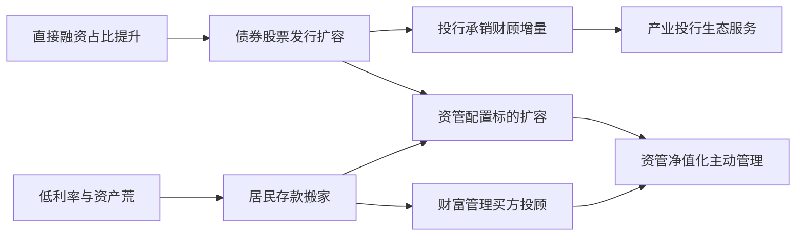
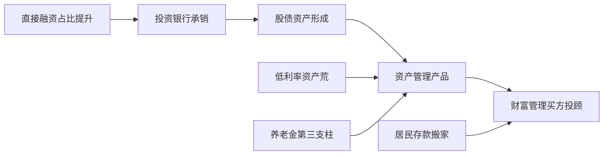
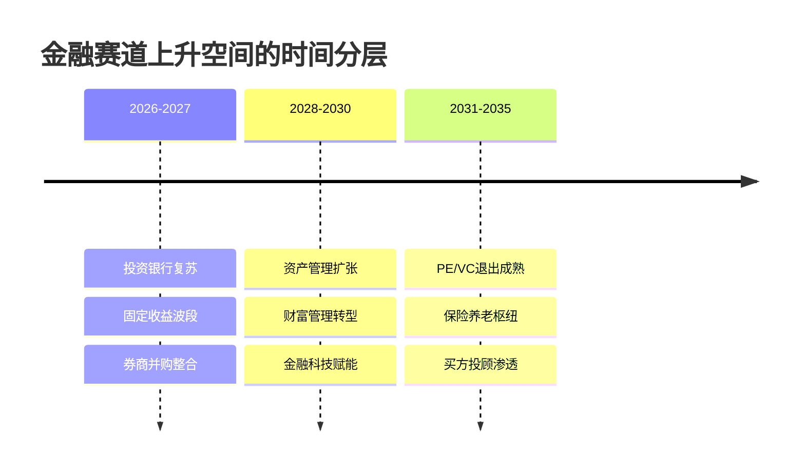

# 中国金融业未来趋势与细分赛道上升空间评估

## 核心结论

中国金融业正经历七十年规划史上首次将金融定位为国家战略工具的范式切换。未来五年最具上升空间的细分赛道，并非传统的银行信贷或经纪通道，而是**直接融资与净值化的三条主线：产业投行、股权投资（PE/VC）与买方财富管理**。

从规模量级看，2025年社融增量中直接融资达**16.7万亿元、占比46.9%**，历史性首超间接融资（16.2万亿元）。这一拐点重塑了全部金融子行业的上升坡度。

**本报告的明确排序结论是：产业投行居首，PE/VC（耐心资本）与买方财富管理紧随其后，资管转型居中，固收与传统银行业垫后。**这一排序的核心驱动，是融资结构从"债贷并重"向"股权共担"迁移所释放的价值发现溢价。

需要特别澄清一个流行误判：尽管市场普遍认为低利率与"资产荒"会让固收成为最大赢家，但本报告认为**固收更多是防御性受益、而非进攻性扩张赛道**——其久期红利在2026年10年期国债收益率1.70%–1.90%的窄幅震荡中已接近定价极限。

本报告要回答的核心问题只有一个：在中国金融从规模扩张转向结构优化的未来十年里，投资银行、私募股权、固定收益、资产管理、财富管理、金融科技、商业银行与保险养老这八个赛道中，哪些拥有最大的结构性上升空间，背后的产业逻辑又是什么。

---

## 1 评估框架与方法论

### 1.1 "上升空间"的四层含义

"上升空间"易被口语化滥用，本报告将其拆解为四个彼此独立、可分别打分的维度：

- **市场增长**：规模（AUM、发行额、募资额）的扩张潜力与天花板；
- **盈利质量**：收入来源的稳定性、利润率与商业模式可持续性；
- **政策支持**：制度与监管方向是否为该赛道提供顺风；
- **人才机会**：岗位需求趋势、职业上升路径与薪酬潜力。

这一分层迁移自成熟的职业机会评估工具，其"先分层、再加权、后合成"的逻辑与本报告对金融赛道的处理同构。四层框架相对于单维"规模论"的优势，在于能区分"大而不强"与"小而快"：**商业银行体量最大但因息差收窄在盈利质量层失分，买方投顾体量尚小却在市场增长与人才机会两层同时高分。**

时空边界上，本报告聚焦中国境内市场，分析窗口为**2025–2035年**。取十年窗口，是因为上升空间由快慢两类变量决定。**快变量（如利率周期）在窗口内即可能反转**——一年期FR007利率预计落在1.44%–1.48%区间，意味着当前低利率地板具有暂时性、久期资本利得空间有限。慢变量（如融资结构变迁、人口结构）则在窗口后半段才占据主导。这一时序切换是设置短期/长期双情景的根本原因。

### 1.2 六维加权评分Rubric

本报告将四层含义细化为六个带权重的评分指标，作为横向排序的唯一计分口径：

| 指标 | 权重 |
|---|---|
| 市场规模与增长空间 | 0.25 |
| 政策与制度支持 | 0.20 |
| 盈利质量与商业模式 | 0.20 |
| 竞争格局与进入壁垒 | 0.15 |
| 风险与确定性 | 0.10 |
| 人才与职业机会 | 0.10 |

**把市场规模与增长空间设为最高权重，是因为"上升空间"本质上是增量问题而非存量问题。**一个赛道纵然当前盈利丰厚，若增量见顶，上升空间仍受限——固定收益正是典型：10年期国债收益率仅约1.70%，债券价格上行空间有限，票息收入停在1%–1.2%，与存款利率相当，超额收益所剩无几。

各赛道在每项指标上采用1–10量表打分，最终得分按 `S_final = Σ(权重ᵢ × 指标ᵢ)` 加权合成。由于公式透明、评分可追溯，读者可在压力测试中用同一公式、±10个百分点权重扰动下重新计算，判断排序稳健性。

### 1.3 周期机会与结构趋势的分列原则

评分体系必须解决一个难题：同一赛道在短期周期与长期结构两个视角下，上升空间可能截然相反。本报告因此固定使用**"结构性上升空间（区别于周期性反弹）"**这一表述。

固定收益最能说明这一区分的必要性。低利率环境下，固收面临一对张力：票息回报逼近存款水平（约1%–1.2%）、超额收益压缩至约1%，这迫使交易盘转向短期波段、配置盘承受长端波动上升。但其困境更偏周期而非结构——一旦FR007回升至1.44%–1.48%区间，部分错配将自然缓解。**正因如此，本报告把固定收益归为"防御型"而非低评级赛道：它在结构性上升空间上得分不高，却在风险与确定性维度提供组合价值。**

### 1.4 核心术语

| 术语 | 本报告统一用法 |
|---|---|
| 金融五篇大文章 | 科技、绿色、普惠、养老、数字五大金融服务重点方向 |
| 直接融资占比 | "直接融资占社会融资规模比重"，以央行社融口径为基准 |
| 产业投行(2+1) | 投行从单纯承销保荐转向"产业研究＋投行＋投资"联动 |
| 买方投顾 | 以客户利益为本、收取投顾费而非代销佣金的财富管理模式 |
| 耐心资本 | 期限长、风险容忍度高、服务科技创新的长期股权资本 |
| 资产荒 | 优质高收益资产稀缺、配置盘资金难以匹配理想标的的市场状态 |

**直接融资占比提升是本报告预测逻辑的主线变量。**占比上升意味着更多社会资金经由股债市场而非银行信贷进入实体，从而利好承销端（投行）与股权端（PE/VC），同时结构性地分流商业银行的传统信贷需求、压制其利差来源。这条"占比上升 → 资金脱媒 → 投行/PE得益、银行承压"的传导链，是本报告预测排序的逻辑骨干。

资产荒的直接表征是票息与存款利率的趋同：一年期存款利率已降至约0.95%，部分农商行达1.2%，债券票息已难显著跑赢存款，这使"固收+"的安全垫变薄、传统模式受到挑战。

---

## 2 宏观与政策背景

宏观变量是各赛道评分的外生输入。同一条利率下行曲线，对固定收益是资本利得、对商业银行是息差挤压、对保险是利差损风险，传导方向截然不同。本章确立三条判断主轴：经济换挡构成总量硬约束、政策主线导向资源但不等于盈利、利率中枢下移重塑盈利底色。**β难续、需α的时代已经到来。**

### 2.1 经济换挡与需求结构变迁

中国经济换挡从根本上改变了金融需求形态：总量增速天花板下移，需求从融资主导转向配置主导。2026年4月末社会融资规模存量456.89万亿元、同比增长7.8%，仍高于名义经济增速；但人民币贷款余额280.5万亿元、同比仅增5.6%，信贷扩张增速持续放缓，政府融资成为主要支撑，企业债和股票融资呈现积极增长。

**这意味着依靠信贷规模扩张的银行资产负债表扩张模式已逼近增长边界。**面向2030年，社融增速预计在7%–8%区间收敛、信贷增速向5%附近靠拢，这构成各赛道β贡献的天花板。纯粹依赖规模扩张的业务线上升空间受限，能在结构转型中捕获增量的赛道更具相对优势。

与此同时，居民财富积累打开了另一扇窗。据华创证券测算，当前居民超额存款规模超**32万亿元**，2026年到期的1年期以上定存规模在**50–70万亿元**之间，这是"存款搬家"的潜在弹药库。地产蓄水池功能弱化叠加低利率，引发存款向净值型理财、公募基金、保险产品搬家。**与固收的资本利得逻辑、银行的息差逻辑不同，财富管理捕获的是居民从"自己买产品"转向"付费买建议"的付费意愿升级，受利率下行的直接冲击更小**，是需求侧确定性最高的赛道之一。

人口老龄化则是确定性最高、跨度最长的变量。2024年末60岁及以上人口已达3.1亿、占比22.0%；居民启动养老规划的平均年龄稳定在37岁，需求正从老年群体向中青年前置。个人养老金制度已由试点转向全面实施，养老金融有望成为横跨保险、资管、银行三业的最大单一增量需求池。需要指出的是，**养老金融需求确定性虽高，但盈利质量受制于低利率下的利差损风险——需求大不等于盈利强。**

**小结**：未来五年金融需求的增量将集中在"配置侧"而非"融资侧"，这把上升空间从传统信贷中介转移到了直接融资链条与财富/养老管理链条。

### 2.2 金融强国战略与"五篇大文章"

"金融强国"首次写入五年规划建议，《建议》明确提出"大力发展科技金融、绿色金融、普惠金融、养老金融、数字金融"。这五大方向并非平均用力：

| 五篇大文章方向 | 主要受益赛道 | 政策赋能强度 | 盈利转化难度 |
|---|---|---|---|
| 科技金融 | 投行、PE/VC | 强 | 中（需α定价能力） |
| 绿色金融 | 固收、商业银行 | 中 | 中（绿债利差薄） |
| 普惠金融 | 商业银行、金融科技 | 强 | 高（利率受限、风险高） |
| 养老金融 | 保险、资管、买方投顾 | 强 | 中（利差损约束） |
| 数字金融 | 金融科技、商业银行 | 强 | 中（投入大、回收慢） |

本章最关键的辨析，是**政策重点领域不等于高盈利赛道**。核心判断是：政策提供的是"准入红利"与"需求确定性"，但不天然提供"高盈利"——后者取决于机构在赛道内获取超额收益（α）的能力。普惠金融是典型反例：政策赋能极强、需求极大，但贷款利率受政策压降、客群风险偏高，盈利质量反而受限。

政策β向盈利α的转化失败有一条清晰因果链：政策定向支持某领域，吸引大量机构蜂拥进入，进而压低定价与费率，使缺乏差异化能力的机构陷入低利润竞争。**政策制造需求，竞争分配利润，α决定归属。**这一β/α张力是横向排序中"上升空间"区别于"政策热度"的核心判别标准——政策热度最高的普惠、绿色金融恰恰面临盈利转化难，而政策与α能较好结合的投行（科技金融＋直接融资）、买方投顾（养老金融＋财富转型）反而更具结构性上升空间。

防风险则框定了每个赛道的扩张边界。预计2026–2030年监管延续"长牙带刺"基调，客观上抬高进入门槛，**对持牌头部机构构成护城河，对中小机构构成合规成本负担**，这解释了多个赛道观察到的马太效应加剧。

### 2.3 利率中枢下移与低利率长期化

利率中枢下移是最具穿透力的宏观变量，不分政策偏好地作用于每个赛道的盈利端。

**资产荒**是低利率在资产端的直接表现：实体有效融资需求偏弱使优质资产供给收缩，居民存款搬家又使配置资金持续涌入，形成"钱多、好资产少"的结构性错配。债券市场是主要承接地，债券融资在社融存量中占比已达29%。预计资产荒延续至2027年甚至更长，这对固收是双刃剑：**资产荒提升了资金确定性，却压低了静态收益确定性**，把固收从"赚票息"推向"赚利得＋赚α"。

低利率对各业务线的传导方向迥异：

| 赛道 | 低利率主要传导 | 净盈利方向 | 缓释手段 |
|---|---|---|---|
| 商业银行 | 净息差挤压 | 偏负 | 中间业务、轻资本转型 |
| 保险与养老 | 利差损风险上升 | 偏负 | 拉久期、增配权益 |
| 固定收益 | 资本利得↑/票息↓ | 双向 | "固收+"、信用挖掘 |
| 资产管理 | 管理费稳定、规模增 | 偏正 | 承接存款搬家 |
| 买方投顾 | 几乎不受利差冲击 | 中性偏正 | 收费转向AUM×费率 |

商业银行的净息差已降至历史低位，行业内部"二八分化"加剧。保险更为凶险：险资资金运用余额已超33万亿，负债端长期保单成本相对刚性、资产端投资收益随利率下行，剪刀差形成利差损风险。**与之鲜明对照的是，买方投顾收入来自AUM规模×管理费率而非利差，几乎不受利差冲击。**在利率下行周期中，费率型赛道（买方投顾、资管）相较利差型赛道（银行、保险）享有结构性盈利稳定性优势——这是横向排序中买方投顾得分领先的关键支撑。

利率下行的另一面是**人民币国际化**带来的跨境机会。CIPS单日处理交易额已升至1.22万亿元，3月日均交易规模较2月增长近48%。面向2030年，人民币国际化是少数能为头部券商国际业务提供增量α的外生驱动，而国际业务已与自营一同成为券商业绩"胜负手"。需要指出，OMFIF的审慎判断是：中国能否在2030年建成金融强国仍取决于制度开放的深度。

**小结**：低利率长期化把各赛道按"是否依赖利差"重新分层——利差型赛道（银行、保险）承压，费率型与利得型赛道（资管、买方投顾、固收）相对受益，跨境赛道获得独立增量。

---

## 3 融资结构转折：直接融资占比提升

融资结构从"间接融资主导"向"债贷并重、股债扩容"的迁移，是中国金融未来十年最确定的结构性主线，它重新定价的不是某一类机构的周期性景气，而是整条价值链的盈利来源与人才需求。

### 3.1 直接融资反超间接融资

2025年社融增量中直接融资达16.7万亿元、占比46.9%，**首次超越间接融资增量（16.2万亿元），这是我国融资结构变革的历史性突破**。注册制改革从供给侧扩容一级市场，新质生产力培育（具身智能、脑机接口、低空经济等）催生股权与债券融资需求，政府工作报告明确提出"提高直接融资、股权融资比重"。

### 3.2 价值链迁移：卖方向买方、通道向配置

融资结构转折最终沿价值链传导，引发金融机构商业模式的根本迁移，呈现三条并行主线：**资管由通道向净值化主动管理迁移、财富管理由佣金向买方投顾迁移、投行由牌照思维向产业生态服务迁移**。三者共同指向一个判断——金融机构的价值创造正从"赚牌照租金、赚通道费、赚交易佣金"转向"赚配置能力、赚投顾服务、赚产业理解"。

三条主线相互联动：直接融资扩容打通IPO退出，改善PE/VC退出预期，为投行输送优质拟上市项目——投行与PE/VC在"投资—退出—承销"链条上形成闭环；资管把存款搬家资金转化为净值化产品，财富管理通过买方投顾把产品配置给居民，二者构成资金端到资产端的完整通路。

**就上升空间而言，价值链迁移给出清晰的排序信号：离直接融资扩容最近、传导最直接、确定性最高的投行与资管处于核心受益位置，而依赖退出节奏的PE/VC、依赖居民风险偏好回升的财富管理则具备更大弹性但更高的兑现不确定性。**

本章未决的开放问题是：直接融资红利在头部与中小机构间的分配比例如何演变——马太效应是否会强到使中小机构退出核心赛道，抑或差异化、区域化、被并购等路径能为其保留生存空间。

---

## 4 投资银行：复苏、整合与产业投行转型

投资银行是承接直接融资红利的最直接载体。**核心结论先行：投行具备真实的结构性红利，但红利高度集中于头部机构，对中小券商而言更接近周期性反弹而非结构性跃迁。**

### 4.1 市场规模与三条驱动线

2026年一季度，A股50家上市券商整体实现扣非归母净利润逾642亿元、同比增逾38%，是行业经历连续低迷后的显著回暖。但需指出，复苏驱动主要来自**自营业务与国际业务**，而非狭义承销保荐收入本身。

| 驱动线 | 关键特征 | 周期/结构属性 | 头部受益度 |
|---|---|---|---|
| 港股IPO放量 | 2025募资同比高增（基数效应显著） | 结构面+情绪面叠加 | 高（跨境牌照稀缺） |
| 并购重组/再融资 | 2035年形成2-3家国际一流投行政策锚 | 政策逆周期稳定 | 高（整合主导方） |
| A股IPO | 直接融资占增量46.9%但通道受逆周期压制 | 强政策周期 | 中高 |

**港股IPO放量**是最具辨识度的增量来源，它为具备跨境承销能力的头部机构打开了区别于A股审核节奏的独立赛道——注册制下境内硬科技企业融资需求外溢，叠加香港特专科技公司上市规则放宽，推动赴港上市企业回升。其属性是结构面（制度性外溢）与情绪面（低基数）的叠加。

**并购重组**则提供了相对独立于二级市场情绪的稳定收入。2025年券业迎来前所未有的并购整合"大年"，本轮的本质是政策强力驱动而非市场套利——2023年中央金融工作会议明确"培育一流投资银行"，2024年新"国九条"支持头部并购，政策目标是到2035年形成2至3家具备国际竞争力的投资银行。东吴拟收购东海、东方筹划收购上海证券，共同构成2026年券业并购"加速年"的起点。**这一2035年政策锚意味着并购财务顾问对头部收入的支撑具有跨越单一市场周期的结构性持续性。**

**A股IPO**则是判断复苏性质的关键变量，其发行节奏的政策依赖性显著。一个张力在于：直接融资占比大趋势向上，但A股IPO通道受逆周期调节压制。其解在于结构替代——监管在二级市场稳定优先的约束下，更倾向于用对二级冲击更小的债券工具推进直接融资占比提升。

### 4.2 竞争格局与马太效应

2026年一季度的业绩分化给出极清晰的答案：**前10家上市券商扣非归母净利润452亿元、占全行业70.3%、同比增逾50%，而后10位合计仅4.93亿元、同比反而下降逾3.5%**。承销保荐这一狭义口径的头部集中度通常更甚，CR5位于64–74%区间。

牌照壁垒与资本消耗共同固化了这一格局，形成自我强化的正反馈：大型项目需消耗净资本，只有资本金雄厚的头部机构才能承接；头部承接录得更高利润，转化为更厚的资本金留存，又反过来支撑承接更大项目。**对中小券商而言，本轮复苏的真实含义不是结构性上升空间，而是差异化或被整合的二选一。**

### 4.3 产业投行(2+1)转型与评级

产业投行(2+1)框架把投行从"项目制"承销通道，重构为嵌入区域产业与企业全生命周期的价值伙伴——"2"指区域深耕与产业生态两极，"+1"指从PE/VC早期介入到IPO、再融资、并购的全生命周期纵向覆盖。**这一模式把单次承销的交易性收入，升级为跨阶段、可重复的客户关系收入，显著改善收入可持续性。**

对复苏性质的批判判断：本轮复苏是**周期性与结构性叠加，其中头部机构的结构性成分显著大于中小机构**。三个结构性支点为：政策驱动的并购整合（2035政策锚）、直接融资占比的历史性提升、产业投行转型本身。面向2030年，头部机构投行收入中的结构性部分大概率占增量的50–65%。

投行（头部主体）六维评分：

| 评估维度 | 权重 | 得分 | 评判要点 |
|---|---|---|---|
| 市场规模与增长空间 | 0.20 | 7.50 | 直接融资占增量46.9%支撑长逻辑 |
| 政策与制度支持 | 0.20 | 8.50 | 2035年2-3家国际一流投行政策锚 |
| 盈利质量与商业模式 | 0.15 | 7.20 | (2+1)转型改善可持续性，但仍含β |
| 竞争格局与进入壁垒 | 0.15 | 7.80 | CR5 64-74%，头部受益，中小承压 |
| 风险与确定性 | 0.15 | 6.20 | A股IPO强政策周期，弹性大确定性弱 |
| 人才与职业机会 | 0.15 | 6.80 | 头部岗位需求稳，中小收缩 |

**投资银行（头部口径）综合得分S_final≈7.38，位列第一梯队，核心支撑是政策维度8.50的高分。**它呈现典型的"头部第一梯队、中小第三梯队"断层结构。"高政策红利、中等确定性"的组合，与确定性更高但弹性更低的固收赛道形成互补。

---

## 5 私募股权与创投（PE/VC）

PE/VC正处于一个被普遍误读的转折点：表层的退出渠道改善制造了"全面复苏"叙事，但更深层的收益门槛抬升、资金来源国资化与价值创造逻辑重构，正在系统性抬高准入门槛。**核心判断：PE/VC的结构性上升空间真实存在，但只对能够对接人民币政策性资金、具备产业运营能力的头部机构开放，而非对全行业普惠开放。**与固收"资产荒"下的低门槛配置逻辑不同，股权投资经历的是门槛抬升而非压缩。

### 5.1 收益门槛抬升："12 is the new 5"

贝恩公司"12 is the new 5"命题是理解收益门槛抬升最精炼的外部基准。在过去低利率叠加估值扩张的环境里，PE实现目标回报只需被投企业EBITDA年均增速约5%即可，很大一部分回报由估值倍数的自然扩张贡献；而在估值扩张红利消退后，要维持同等回报（20%以上IRR），EBITDA年增速需抬升至约12%。

**这一基准揭示了收益来源的根本性转移：当估值倍数不再单向扩张，PE的超额回报必须越来越多地来自被投企业真实的盈利增长，而非买卖之间的估值价差。**就中国市场而言，利率中枢下行方向虽与发达市场利率正常化相反，但终点趋同——无论利率正常化还是利率下行，都最终指向同一个对GP的要求：靠运营、而非靠套利来创造回报。注册制下IPO定价市场化、一二级价差收窄，更使"Pre-IPO套利"模式的超额收益空间持续缩水。

| 维度 | 套利型盈利模式（旧） | 运营增值型盈利模式（新） |
|---|---|---|
| 回报来源 | 估值扩张 + 一二级套利 | 被投企业EBITDA真实增长 |
| 所需EBITDA增速 | 约5% | 约12% |
| 盈利可持续性 | 强周期、不可持续 | 抗周期、可持续 |
| 核心能力 | 财务建模、Pre-IPO套利 | 产业运营、投后管理 |
| 募资关键 | 市场化募资能力 | 政策性资金对接能力 |
| 受益机构 | 全行业（旧环境） | 头部+国资平台（新环境） |

### 5.2 GP核心竞争力的双重重构

价值创造逻辑转向运营增值，重塑了PE/VC的能力门槛与人才需求。运营增值需要团队介入被投企业的战略制定、供应链优化、产业资源对接，要求复合型产业背景而非单一金融背景。**具备硬科技产业背景的复合型人才需求上升，单纯依赖财务建模与Pre-IPO套利的传统岗位需求收缩。**

资金来源的国资化则重构了竞争壁垒。当政策性资金成为募资端主导来源时，GP核心竞争力从"市场化募资能力"部分转向"政策性资金对接能力"。在海外美元LP出资收缩、政策性资金相对扩张的格局下，**具备国资背景、产业资源或与地方政府长期协作关系的GP占有显著优势，这一优势很难被纯市场化机构快速复制**。PE/VC的竞争由此围绕"政策性资金对接能力＋产业运营能力"这一双重门槛展开。

### 5.3 PE/VC综合评级

综合六维画像，PE/VC被评定为**方向明确、空间真实、但门槛极高、向头部集中的"分化型高潜力"赛道**：

- **市场规模与增长**：根植于直接融资占比提升的宏观趋势，但一级市场募资修复显著滞后于公开市场，增长是结构性的、向头部集中的；
- **政策支持**："十五五"明确将股权直接融资作为核心抓手，但IPO节奏约束与政府引导基金的产业落地诉求，使支持呈现"定向支持头部与国资"特征；
- **盈利质量**：从套利转向运营是实质升级，但伴随尾部机构出清；
- **竞争格局**：叠加"业绩品牌"与"政策性资金对接"双重壁垒，马太效应在募资端被进一步强化；
- **风险**：募资修复滞后、退出对单一IPO通道依赖、新质生产力项目高研发不确定性，风险在头部与尾部间分布极不均衡；
- **人才**：机会总量受限、向特定能力集中。

**PE/VC的结构性上升空间在头部机构是真实的，在尾部机构是虚幻的，这是它区别于其他赛道的根本特征。**其属于长周期适配赛道，红利兑现需要"十五五"全周期乃至更长的验证。

**未决问题**：贝恩"12 is the new 5"在中国利率下行（而非正常化）情景下的精确传导系数，尚缺乏针对中国GP业绩分布的实证校准。

---

## 6 固定收益：低利率、资产荒与结构重塑

固定收益是当前中国金融体系中规模扩张最确定、而收益前景最不确定的赛道。**其结构性上升空间主要体现在配置端规模而非交易端收益，是一条"规模扩张明确、超额收益稀缺"的赛道。**

### 6.1 配置端：资产荒驱动的扩容

债券融资在社融存量中占比已达29%，"债贷并重"格局进一步确立。这一扩张由融资结构转型这一长周期力量驱动，具有较强确定性。资金来源上，居民超额存款约32万亿元、2026年到期1年期以上定存50–70万亿元，构成债券配置需求的巨大蓄水池。保险、养老金等长久期资金对长债的刚性配置，则构成最稳定的需求支柱。

**就配置端规模扩张而言，固收在市场规模维度给出明确正面判定——规模天花板高、增长确定性强，这是整个赛道最稳固的底盘。**但需指出，三类债券（利率债/信用债/地方债）都面临"规模扩张、票息走低"的共同特征，超额收益越来越依赖信用下沉与久期管理等主动策略。

### 6.2 交易端：策略窘境与背离张力

固收赛道最核心的分析命题，是**配置端规模利好与交易端收益窘境之间的背离张力**。

机构对2026年利率下行空间普遍谨慎：利率已处历史低位，依靠下行获取资本利得的策略面临天花板。票息吸引力持续下降、赔率整体偏低，形成"规模增、收益降"的困境。

| 维度 | 配置端（规模扩张） | 交易端（超额收益） |
|---|---|---|
| 核心驱动 | 直接融资占比提升+资产荒资金涌入 | 利率下行空间+信用/久期挖掘 |
| 确定性 | 高（政策与资金双重支撑） | 低（利率逼近下限、赔率收窄） |
| 收益前景 | 规模增、单位收益降 | 票息薄、资本利得空间枯竭 |
| 缓解路径 | 无需缓解（自然扩张） | 固收+、衍生品、信用挖掘 |

**背离张力的因果本质在于：同一个资产荒力量，既是配置端规模扩张的驱动，又是交易端收益收窄的根源。**资金大量涌入、追逐有限的债券资产，把价格买高、收益率压低，使票息与赔率同步下降。其根本约束在于债券总收益由利率中枢决定，资金规模扩张无法改变这一底层约束。缓解之道不在纯债内部，而在于通过"固收+"引入权益弹性、通过衍生品对冲增厚——这正是固收从"规模红利"转向"能力红利"的结构性含义。

### 6.3 信用风险约束与固收评级

信用风险敞口集中于地产相关债券与地方融资平台相关债券两类。与利率债的纯久期风险相比，信用债的信用风险具有非对称性：正常情况下仅获取有限利差，一旦违约则可能本金大损。**投资者为增厚本已很薄的票息而被迫下沉信用资质，却因此承担更高的尾部违约风险，构成固收领域最典型的风险收益失衡。**预计在地方债务化解持续推进的背景下，城投债系统性违约风险可控，但区域分化将加剧。

综合判断，**固收赛道呈现"规模强、收益弱"的鲜明特征**：市场规模与增长强正面、政策支持正面（但对规模友好、对风险从严）、盈利质量中性偏谨慎（规模红利难转化为盈利红利）、风险确定性中性偏正面（利率债确定性高、信用债存尾部风险）、人才需求"总量平稳、结构升级"（向固收+组合经理、衍生品交易员等复合岗位迁移）。**"赚规模的钱容易、赚超额的钱难"是这条赛道的本质特征**，这是固收虽规模庞大却难列第一梯队的根本原因。

---

## 7 资产管理与财富管理

资管与财富管理是中国金融体系中规模最大、却也最易陷入同质化竞争的两大相邻赛道。**本章核心判断：以规模论，资管赛道领先；以结构性上升空间论，买方投顾视角下的财富管理才是斜率更陡、确定性更高的方向。**

本报告将"中国资产管理行业全口径名义规模约184.53万亿元（2025年末量级）"确立为本章统一基准。

### 7.1 资产管理：规模大但盈利承压

资管是中国金融体系中规模最大的赛道之一，背靠全球第二大股票与债券市场。但名义规模膨胀空间已然有限，真实增长来自穿透口径下管理资产质量的改善，未来增长更依赖居民存款搬家这一承接过程。

资管的核心困境在盈利端：收入主要来自管理费率，盈利模式即"规模×费率"。**在"资产荒"压低资产端收益、居民偏好低费率产品的双重夹击下，管理费率呈下行态势，规模扩张难以同步转化利润增长。**竞争格局上呈现"高集中但易价格战"——产品高度标准化使费率成为主要竞争手段。综合评判，资管定位为"规模领先但盈利承压"型，属于**第二梯队偏上**，其上升空间的释放依赖于向投顾服务转型的深度。

### 7.2 财富管理与买方投顾：斜率陡、确定性高

财富管理当前绝对规模虽小于资管，但增长斜率更陡、确定性更高。50–70万亿元到期定存与32万亿元超额存款，叠加3.1亿老龄人口的养老财富需求，构成庞大的潜在市场。**其上升空间来自居民金融资产占比的系统性提升与买方投顾AUM渗透率的提高，二者均处于早期阶段，增长远未触顶。**

买方投顾的根本优势在盈利质量。**其收入来自与AUM挂钩的投顾费，使机构利益与客户利益高度对齐，收入更稳定、更可持续，构成对冲资管费率下行的关键机制——这是资管/财富管理两个赛道中盈利质量最优者。**政策面，个人养老金全面实施与养老金融实施方案提供明确制度支撑；竞争壁垒以投顾能力、客户信任与品牌为主，通过服务差异化避开纯粹的费率竞争，比资管的渠道壁垒更难复制。

主要风险在于转型执行：买方投顾对专业能力要求极高，机构能否真正建立"以客户为中心"的服务能力、居民付费意愿能否建立，构成主要不确定性。但财富管理受市场波动影响小于资管，因其收入更依赖AUM存量而非交易频率。

综合评判，**财富管理与买方投顾定位为"斜率陡、确定性高"型，属于第一梯队**，在政策支持、盈利质量、人才机会三个维度均居领先。其上升空间的释放需要3–5年转型周期，但一旦买方投顾模式与个人养老金渗透形成正循环，增长持续性将明显优于依赖周期的资管赛道。

| 评估维度 | 资产管理 | 财富管理与买方投顾 |
|---|---|---|
| 市场规模与增长空间 | 规模最大但天花板偏低，增长偏被动承接 | 规模较小但斜率陡、天花板高 |
| 政策与制度支持 | 中性偏支持 | 明确利好（个人养老金+养老金融方案） |
| 盈利质量与商业模式 | 中等（费率下行制约） | 最优（AUM投顾费与客户利益对齐） |
| 竞争格局与进入壁垒 | 高集中但易价格战 | 能力与信任壁垒，避开价格战 |
| 风险与确定性 | 规模确定但盈利受波动 | 方向确定，转型执行为主要不确定 |
| 上升空间梯队 | 第二梯队偏上 | 第一梯队 |

---

## 8 金融科技与商业银行

金融科技与商业银行分别代表了赛道评估中两类最易被误判的对象：**金融科技的"赋能放大价值"不能用独立AUM计量，商业银行的"存量稳定价值"不能等同于"没有上升空间"。**

### 8.1 金融科技：横向赋能层

金融科技作为独立业态的自身营收有限，但其赋能母体覆盖中国全球最大银行体系、第二大债券与股票市场，按"母体规模×渗透率"计量的有效市场极大，且增速显著快于母体——CIPS日均交易额月度环比增速近48%即为佐证。**其增长天花板不由自身决定，而由各母体赛道的数字化渗透率上限决定，因而具备所有赛道中最高的"增速/存量"比。**

金融科技的盈利质量高度依赖能否嵌入高价值母体赛道：嵌入产业投行尽调、买方投顾配置等高附加值环节者盈利质量高，停留在通用工具供应层者盈利质量低。其竞争呈"技术开放、数据封闭"的二元格局——算力算法可采购构成低壁垒，数据与场景被持牌机构垄断构成高壁垒，使独立金融科技公司议价权偏弱。主要风险是技术路线风险与监管不确定性，尤其若监管对AI投顾的适当性责任界定过严，其向中低净值客群下沉的核心增长逻辑将被显著延后。

**综合定位为"横向赋能层"——其上升空间不以独立赛道计，而以"对其余七赛道的成本曲线重塑能力"计。它属于"高赋能价值、低独立终局"象限。对求职者而言，它是"必须掌握的能力层"，而非"必须押注的独立赛道"。**

### 8.2 商业银行：稳定基石与转型期权

商业银行是体量绝对第一的存量基石，4月末人民币贷款余额280.5万亿元，但增速天花板已现（同比仅5.6%），其在社融增量中的主导地位已被直接融资取代。**规模护城河极深，增量弹性极弱，是典型的"大而不快"。**

银行盈利正经历范式性挑战：净息差降至历史低位，依赖息差的传统盈利模型失效，行业内部"二八分化"尖锐——国有大行稳健、优质城商行"三增"、部分股份行营收负增长。其风险画像独特：**尾部风险极低（系统重要性、国家兜底），但增长性风险极高（盈利模型被低利率长周期证伪）。**反向情景是：若息差下行速度快于转型见效速度，部分尾部银行可能在转型期权兑现前先被拨备消耗拖垮。

**综合定位为"稳定基石+转型期权"——属于"低尾部风险、低增长弹性、但转型期权可观"象限。**其结构性上升空间不来自规模扩张，而来自非息收入占比提升的转型红利兑现。它是求职稳定性最高、但增长想象空间需附加"转型成功"前提的赛道。**对求职者而言，选对银行内部的"转型赛道"比选对银行更重要。**

| 实体 | 市场规模与增长 | 政策支持 | 盈利质量 | 竞争壁垒 | 风险与确定性 | 综合梯队定位 |
|---|---|---|---|---|---|---|
| 金融科技 | 高（按母体×渗透率） | 高 | 中（嵌入性强、独立性弱） | 中（技术开放、数据封闭） | 中（技术与监管不确定） | 横向赋能层 |
| 商业银行 | 低（大而不快） | 高（稳定优先） | 中（息差证伪、转型未定） | 高（牌照封闭、内部分化） | 高确定性/低增长弹性 | 稳定基石+转型期权 |
| 保险与养老 | 中高（银发经济+第三支柱） | 高（养老金融大文章） | 中（利差损压力） | 高（牌照壁垒） | 中（利差损反向情景） | 长周期成长 |

**金融科技的上升空间高于商业银行，但二者均不属于"独立高弹性成长赛道"第一梯队。**商业银行的转型成败，很大程度上取决于它能否把金融科技的赋能价值内化为自身的产能杠杆——这一"赋能者与被赋能者深度绑定"的趋势，正是横向排序时必须把金融科技作为"系数"而非"加数"处理的根本原因。

---

## 9 八大赛道横向排序

横向对比是本报告从分赛道叙事走向统一结论的枢纽。**上升空间的来源是"结构位置"而非"存量体量"**——商业银行体量最大却排序靠后，财富管理体量有限却居前列，根本原因在于前者处于资金价值链的"出发地"、后者处于"目的地"。

### 9.1 价值链联动图谱

赛道之间沿三条主线相互联动：

- **直接融资主动脉**：抬升投行承销需求，形成的股债资产流入资管与财富管理产品池，带动买方投顾配置需求；
- **存款搬家**：居民存款从银行表内流出，流向净值型资管产品与财富管理账户，把银行的存量劣势转化为资管/财富的增量机会——这解释了为何银行体量最大却上升空间有限：它是资金的"出发地"而非"目的地"；
- **养老长钱**：第三支柱沉淀的长期资金作为耐心资本，同时流入固收、资管与股权投资，使保险养老成为多条赛道的长钱供给枢纽。

### 9.2 加权评分与梯队排名

评分权重设定为：市场规模0.25、政策支持0.20、风险确定性0.20、盈利质量0.15、竞争壁垒0.10、人才机会0.10（在"上升空间"语境下，增长空间与政策支持权重最高，风险确定性同等重要）。

| 赛道 | 规模增长 | 政策支持 | 盈利质量 | 竞争壁垒 | 风险确定 | 人才机会 | S_final | 梯队 |
|---|---|---|---|---|---|---|---|---|
| 财富管理与买方投顾 | 8.50 | 9.00 | 7.50 | 6.50 | 8.50 | 8.50 | **8.18** | Tier1 |
| PE/VC | 9.00 | 9.00 | 7.00 | 6.00 | 5.50 | 8.00 | **7.55** | Tier1 |
| 保险与养老金融 | 8.00 | 9.00 | 6.50 | 7.50 | 6.50 | 7.50 | **7.50** | Tier1 |
| 金融科技与数字金融 | 7.50 | 8.50 | 6.50 | 8.00 | 6.00 | 8.50 | **7.28** | Tier1 |
| 投资银行 | 7.50 | 8.50 | 6.50 | 8.00 | 6.00 | 7.00 | **7.18** | Tier1 |
| 资产管理 | 8.00 | 7.50 | 6.00 | 7.00 | 6.50 | 7.50 | **7.13** | Tier2 |
| 固定收益 | 7.00 | 6.50 | 5.50 | 6.00 | 6.50 | 6.50 | **6.48** | Tier2 |
| 商业银行 | 5.00 | 6.00 | 5.00 | 9.00 | 6.00 | 5.50 | **5.78** | Tier3 |

**财富管理以政策支持、风险确定性、人才机会三项高分领跑全表**，形成"高空间×高确定"的稀缺组合。PE/VC在规模增长(9.00)与政策支持(9.00)上得分最高，但风险确定性仅5.50被退出不确定显著拖累，最终略低于财富管理——这清晰量化了PE/VC"高弹性、低确定"的特征。

排序逻辑有两层。第一层是**结构红利的汇集度**：财富管理同时承接存款搬家、养老长钱、净值化三条结构主线，汇集度最高因而居首。第二层是**确定性折价**：固收与商业银行排名靠后，核心原因是低利率资产荒对利差的压缩。

这一排序给出了一个反共识判断：**尽管市场普遍把2026年一季度券商38%的净利增速视为最强信号，本报告却把投行排在财富管理之后**——理由是券商高增长含有自营β属性、确定性偏弱，属于周期性反弹而非结构性上升。**短期最"热"的未必是长期最有上升空间的，这一区分是本排序的核心洞见。**

### 9.3 时间维度分层结论

---

## 10 风险、约束与多情景压力测试

第九章的排序建立在一组稳态假设之上：直接融资占比持续上行、注册制改革不逆转、信用风险不系统性暴露。一旦任一前提松动，梯队排序就需重算。

### 10.1 关键风险与约束

| 约束类型 | 主要受冲击赛道 | 缓释难度 | 证据 |
|---|---|---|---|
| 信用风险暴露 | 固收、商业银行 | 高（宏观主导） | 城投债面板研究、38号文 |
| 资本市场低迷 | 投资银行 | 中（周期回暖可恢复） | 券商一季报 |
| 费率下行 | 资产管理 | 中（模式转型） | 嘉实财富 |
| 跨境合规收紧 | PE/VC | 中（人民币退出替代） | 对外投资新规 |

资本市场低迷对投行的冲击已有一季报证据：中信证券净利同比增54.60%，而国泰海通同期净利同比减少47.82%，头部与尾部两极分化极剧。信用风险则集中在地产—城投链：房地产价格上升显著降低城投债信用利差（区域金融资源中介效应约16.9%），反向意味着地产下行将使利差走阔；5—12月城投债到期及回售总额约2.84万亿元，滚续压力较大。费率下行对资管与买方投顾影响方向相反——产品低波化与管理费率下行对卖方代销构成直接盈利压力，而买方投顾的AUM费收逻辑则相对受益。跨境合规上，对外投资新规自2026年7月1日施行，抬升了跨境股权投资的合规摩擦。

**核心结论：八赛道的约束可按"可缓释程度"二分——买方投顾与PE/VC的核心约束（费率与退出路径）更多属于可经商业模式转型缓释的类型，而固收与商业银行的核心约束（信用质量与利率中枢）更多受宏观周期主导。**这是把买方投顾置于第一梯队的风险侧理由。

### 10.2 方法论局限

本报告排序是**在明确假设下的条件性判断，而非无条件的客观事实**，受三重条件约束：

- **多口径数据与时点差异**：43万亿公募与30万亿理财规模之间是否存在口径重叠无法解析，两者不能简单相加；存款利率、FR007、10年期收益率分属不同期限与时点，跨口径比较需谨慎；
- **评分权重的主观性**：六维权重设定带有研究者主观判断，处理方式是通过±10pp敏感性检验界定其对最终排序的实际影响；
- **中国监管路径不可外推**：本报告援引的海外职业评估与行业分类工具承载的是方法而非中国结论，中国金融赛道盈利结构高度依赖本土政策变量（注册制审核、38/35号文化债政策、对外投资新规），结论是中国语境下的结构性判断而非跨市场普适规律。

### 10.3 三情景排名重算

**乐观情景**（改革加速、权益走强）：承销保荐IPO节奏回暖叠加自营收益放大，投行从第一梯队相对靠后位置前移，可能与财富管理并列；权益走强打开IPO退出通道，改善PE/VC退出维度；固收相对吸引力下降而下移。tier迁移数为2。

**悲观情景**（经济下行、信用暴露）：商业银行（信用质量敏感）与固收（利率利差敏感）受损最重；地产下行使城投债利差走阔，固收风险确定性评分显著下修；PE/VC不直接持有城投敞口而相对隔离，且经济下行往往强化对硬科技的政策扶持。tier迁移数为2。

| Scenario | Top-Ranked Entity | Tier迁移数 |
|---|---|---|
| 基准 | 买方投顾视角下的财富管理 | 0 |
| 乐观 | 买方投顾视角下的财富管理 | 2 |
| 悲观 | 买方投顾视角下的财富管理 | 2 |

在所有±10pp扰动下，第一梯队（财富管理、PE/VC、投行）构成保持不变。稳健性的概率化估计为：**财富管理位列第一梯队的稳健性最高（约85%–95%），PE/VC约80%–90%，投行约70%–85%。**

**三个可证伪条件**（可在2027–2028年具体观测）：① 若直接融资占比停止上行甚至逆转，投行与PE/VC的市场规模评分将系统性下修；② 若买方投顾模式在2028年前未跑通可持续盈利模型，财富管理盈利质量评分将下修；③ 若产业投行(2+1)转型普遍失败、投行重沦同质化通道竞争，其竞争壁垒评分将下行至第二梯队。

**结论：在乐观与悲观两个极端下，最看好的财富管理始终位列第一梯队，tier迁移数均为2、均低于3，第一梯队排序结论在设定前提下是稳健的。但这种稳健性是条件性的——任一前提的逆转都会触发可证伪条件，进而要求重新评估。**

---

## 11 结论与建议

### 11.1 三条主线合一

中国金融的未来形态可用三条相互咬合的主线刻画：

- **直接融资主线**：把资本市场推向资源配置的中枢位置，把定价、配置与风险识别的能力从银行体系转移到资本市场买方；
- **买方时代**：资管与财富管理从产品销售导向转向客户资产配置导向，买方投顾成为价值创造的新支点；
- **功能性金融**：监管考核与资源配置的指挥棒从规模与利润引向服务新质生产力的能力。

三条主线构成一个因果链：功能性金融考核引导资源流向科技与绿色，抬升直接融资需求与占比，把定价权交给买方机构，催生买方时代。**到2030年，三条主线的合流将使"能力驱动"取代"牌照驱动"成为金融机构价值创造的主逻辑。**

总量层面，2025–2035年中国金融的总体画像是：**总量温和、结构剧烈分化、价值创造方式从规模驱动转向能力驱动的十年。**低利率不是普遍利空，而是一把区分"规模驱动"与"能力驱动"赛道的筛子——对商业银行这类规模驱动赛道构成双重压制，对金融科技、PE/VC、买方投顾这类能力驱动赛道则放大了专业能力的稀缺性与溢价。

### 11.2 最具上升空间赛道的滚动排序

基于六维加权评分与情景压力测试，**最具结构性上升空间的赛道排序不是静态的，而是随时间周期滚动切换的**，底层逻辑是三条主线制度成熟度的时间差：

| 时间周期 | 首选赛道 | 信号性质 | 关键前提 |
|---|---|---|---|
| 2025–2027 | 金融科技/产业投行 | 当期可验证 | 人才缺口与并购整合已兑现 |
| 2028–2031 | PE/VC | 条件性 | 退出机制多元化 |
| 2032–2035 | 财富管理与养老金融 | 远期兑现 | 买方投顾与养老三支柱成熟 |

- **近期看好金融科技与产业投行**：金融科技人才缺口与需求增幅是当下即可验证的硬信号，不依赖任何尚未兑现的制度条件；产业投行受益于并购整合大年与直接融资扩容；
- **中期看好PE/VC**：建立在退出机制逐步多元这一前提之上，若IPO/并购/S基金/老股转让渠道在2028年后趋于畅通，价值将集中释放；
- **远期看好财富管理与养老金融**：随配置型财富管理成为主导范式、人口基本面持续支撑养老需求，有望进入规模与盈利双升阶段。

一个实用的甄别标准是：**上升是否来自能力溢价而非价格波动。**以固收为例，2025–2026年的债市行情很大程度上是低利率带来的价格行情而非结构性上升，"安全垫"正在削弱、权益增强腿因市场分化更难操作——短期景气不等于长期上升空间。

### 11.3 三类主体的落地建议

**同一赛道排序对不同主体意味着不同的行动。**

| 决策主体 | 近期首选 | 长期护城河 | 核心建议 |
|---|---|---|---|
| 金融机构 | 金融科技（基础设施） | PE/VC与买方投顾（差异化） | 集中投入数字化补足能力缺口 |
| 求职者 | 金融科技与量化 | 买方投顾复合能力 | 近稳切入，中长期建护城河 |
| 投资者 | 配置型财富管理 | 多资产配置能力 | 买服务而非买产品 |

- **机构**：把金融科技作为全机构的基础设施投入（一项数字化能力可同时服务多个前台赛道，具有更高杠杆效应），把PE/VC与买方投顾作为差异化能力布局；
- **求职者**：以金融科技与量化能力作为近期最稳的切入口（供需缺口最大、跨赛道迁移性最强），以买方投顾能力作为中长期护城河——到2030年，真正稀缺的是"金融科技+买方投顾"的复合能力；
- **投资者**：用配置逻辑而非景气逻辑组织决策。当前债市价格行情不具可持续性（FR007或回升至1.44%–1.48%），纯债类产品性价比下降，应更多关注具备多资产配置能力的买方机构；随买方投顾制度成熟，配置决策将从"买产品"转向"买服务"。

**遗留问题**：买方投顾制度常态化的具体节奏，以及养老第三支柱的覆盖深度，仍是影响远期判断精度的关键不确定性，需在后续滚动跟踪中校准。

---

回到开篇的核心问题——未来哪一个金融细分领域更有上升空间，答案已经明确：**以结构性上升空间衡量，产业投行、PE/VC（耐心资本）与买方财富管理构成第一梯队，资管转型居中，固收与传统银行业垫后；但这一排序随时间周期滚动切换，并因决策主体不同而对应不同的行动路径。**这一判断，是对"未来趋势"与"上升空间"两问的统一回答。

---

## 参考文献
