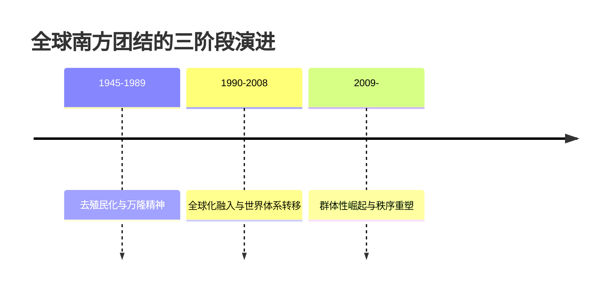
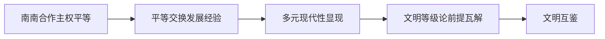
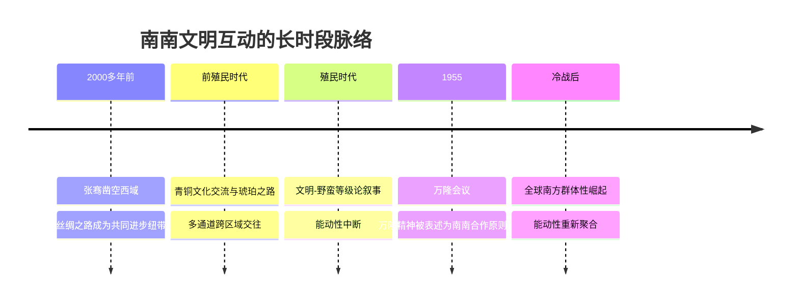
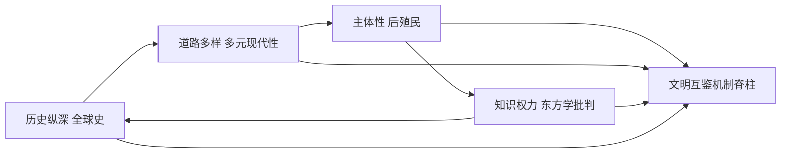

# 全球南方合作与文明交流互鉴：基于非西方现代化、后殖民主义、东方学与全球史的理论机制分析

## 导论：问题、框架与方法

全球南方合作并非单纯的经济技术协作，而是一场以**"知识去殖民"为内核**、系统消解西方中心文明等级论的认识论运动，文明交流互鉴正是其在观念层面的必然产物。截至2025年，这一进程已具备可量化的规模特征：全球文明对话部长级会议（2025年7月，北京）汇集140余个国家的政党政要与政府部长；全球治理倡议在提出后不到一年即获近160个国家和国际组织支持。**与"现代化即西方化"这一支配发展思想七十余年的叙事相反**，西方现代化的秩序合法性正经历结构性衰竭，其单线进化的世界图景不再具备话语统摄力。

本报告的核心论断是：**全球南方国家之间的合作之所以能推动真正意义上的文明交流互鉴，关键在于它同时改变了四个机制面向——现代化的主体归属、知识生产的权力结构、东方被表征的方式，以及南方互动被记述的历史纵深。** 这一论断必须从四种非西方批判理论的耦合结构中加以解释，而非停留于政策话语的相关性陈述。

需正视一个方法论悖论：本文所援引的四维理论多源自西方批判传统自身，即用西方生产的批判工具去反西方中心，这一张力将在全文反复出现，并在批判反思一章集中清算。

### 研究定位：机制性而非相关性

把"合作如何推动互鉴"读作机制性问题，是本文全部分析的逻辑起点。机制性问题追问"通过什么中间环节"，相关性问题只确认"是否同时出现"。**真正需要解释的不是南南合作与文明互鉴在时间上的共现，而是前者经由哪些可辨识的因果链条转化为后者。**

南南合作之所以区别于南北援助，在于它由发展中国家发起、组织和管理。这一组织方式的对称性本身就是机制链的第一环：合作主体的对称性改变了知识与价值流动的方向。机制性界定的分析收益在于它**可被证伪**——如果把合作组织权归还给南方主体，却未观察到表征方式或知识权威的相应位移，则核心机制假说即遭反例。

本文明确排除三类内容：纯政策宣介、单一国家案例的孤立叙述、一般国际合作的泛论。但排除纯宣介并不等于排除官方话语文本：本文把全球文明倡议等话语当作**分析对象而非结论前提**。就"全球南方"这一横跨描述性与规范性的概念而言，本文明确采取规范性—批判性路径，即以依附论、世界体系论等为基础，关注南方国家在认识论上"应当能够成为什么"。

### 四维理论的整合框架

四维理论之所以能够耦合，是因为它们瞄准的是同一西方中心主义的四个侧面，分别覆盖时间、空间、权力、历史四个维度：

- **多元现代性**解构"只有一种现代"这一时间轴上的单线叙事，对应**主体性面向**：把现代化的主语从"西方"改写为"多个文明主体"；
- **东方学批判**解构"东方低于西方"这一空间轴上的等级叙事，对应**表征面向**：追问南方如何被言说与能否自我言说；
- **后殖民主义**解构知识—权力轴上的属下失语，对应**知识权力面向**：追问谁有权生产关于南方的知识；
- **全球史**解构历史分期轴上的欧洲起源论，对应**历史纵深面向**：追问南南互动是偶然新象还是长时段常态。

四维构成一条有方向的论证链：**全球史提供历史事实基础（南南互动古已有之），东方学批判揭示这些事实为何被遮蔽（表征权被垄断），后殖民主义说明遮蔽如何被抵抗（主体性重建），多元现代性给出抵抗之后的建设性图景（多样路径共存）。**

四面向框架相对于"文化多样性"泛论的独到之处，在于它能指出互鉴在哪个面向受阻。例如，若一项合作在主体性面向有进展（南方自主设计项目），却在表征面向停滞（仍由西方媒体定义其意义），则互鉴是不完整的。

本文以六项标尺自我约束：因果机制链完整性（权重0.22）、四维有机整合度（0.20）、对西方中心主义的批判深度（0.18）、概念界定与术语一致性（0.15）、批判平衡与可证伪性（0.15）、区域与案例多样性覆盖（0.10）。**批判平衡与可证伪性单列权重，是为了防止本文滑向另一种独断——即把南方本质化为不可批评的道德主体。**

### 核心术语分层

术语表的三层编排本身就预演了机制链结构：

- **对象层**（标定输入）：全球南方合作、文明交流互鉴、万隆精神；
- **分析层**（标定转化机制）：多元现代性、东方学/他者化、连接史、去殖民性；
- **终点层**（标定输出）：主体性重建、知识生产去中心化。

全文采取"概念→谱系→综合→个案→反思→结论"的递进结构，把中国话语个案当作理论的试金石而非注脚。

## 一、核心概念界定：全球南方合作与文明交流互鉴

"全球南方"是横跨地理、政治与认识论三重意涵的复合概念。据徐秀军研究，它涵盖亚、非、拉、加勒比及大洋洲大部分国家，这些国家具有相似的历史遭遇、共同的发展任务与相近的国际事务立场。**正是这种"共同历史遭遇"而非地理方位，使全球南方成为能够承载平等文明对话诉求的政治—认识论共同体。**

### 1.1 "全球南方"的概念谱系

**葛兰西的规范性内核。** 据《求是》梳理，1926年意大利理论家葛兰西正式提出"南方"概念，关注意大利南北发展差距，初步阐明了其反剥削、求发展的特性。这表明"南方"从诞生之初就不是地理坐标，而是嵌入了剥削—被剥削权力关系的政治范畴。当"南方"前缀以"全球"，发生了关键的双重转换："全球"一维把一国之内的不平衡放大为跨大洲的全球性结构不平衡，"南方"一维则保留了反剥削政治含义。**当代"全球南方"的独特之处，在于它把南方从被分析的客体转变为能够自我表征、主动塑造国际议程的认识与行动主体。**

这一谱系对本研究的约束在于：互鉴命题只有建立在"南方=反支配主体"这一规范性理解之上才成立；一旦南方失去反支配的主体性内涵，"互鉴"便退化为不对称的知识转移。

**三阶段历史演进。** 据徐秀军、沈陈分析，南方团结可分为三阶段：

第一阶段以万隆精神为原型，奠定了尊重主权、不附加政治条件、互利双赢的规范基础。第二阶段对应世界经济重心从西方向新兴大国的转移，为南方积累了金融与技术能力。第三阶段则是群体性话语觉醒。这条链同时串起了依附理论的世界体系转移判断与后殖民主义的主体性重建命题。习近平指出："'全球南方'群体性崛起，是世界大变局的鲜明标志"。

**与相邻概念的区分。** "发展中国家"是以经济发展水平为标尺的描述性分类，它预设了一把以发达国家为终点的线性标尺，这恰是多元现代性所要解构的单线预设。"全球南方"则横跨描述性与规范性双重用法：

| 概念 | 主要坐标系 | 核心标尺 | 认识论功能 |
| --- | --- | --- | --- |
| 发展中国家 | 经济发展水平 | 线性发展程度 | 描述性分类 |
| 全球南方（描述性路径） | 主流国际关系 | 新兴市场/发展中国家集合 | 描述性概念 |
| 全球南方（规范性路径） | 依附论/世界体系论 | 反支配主体性 | 规范性概念 |

本研究明确采纳规范性路径，因为只有规范性理解才能支撑"合作推动文明互鉴"的核心命题。

### 1.2 全球南方合作的主体、形式与平台

全球南方合作建立在相互尊重、共同目标和深刻团结的基础上，是国家、国际组织、学术界、民间组织和私营部门共享知识、技能和资源的途径。

**五层主体。** 主权国家提供主权平等的规范底色；区域组织（如上合组织提出"走互学互鉴之路"）把双边意愿制度化为多边机制；发展银行承担资源转移功能——许多南方国家已积累强大金融技术能力，并开始以优惠条件向其他南方国家转让资源；学术网络承担知识生产去中心化功能；民间社会承担民心相通功能。**五层主体由政治而金融、由金融而知识、由知识而民心，层层递进地把合作从器物层面推向精神层面。**

**四类形式的递进。** 经贸技术合作提供物质接触面，要求交换发展经验；经验交换要求教育科技层面的能力共建；能力共建引发文化价值层面的相互理解；最终沉淀为人文交流的民心相通。**这条递进链与南北援助的单向技术转移不同，每类形式均预设了双向性，这正是"互"鉴区别于单向"学习"的形式标志。**

**多代平台。** 从历史原型（万隆精神，确立了反价值输出的去殖民内核），到多边机制（联合国南南合作机制、粮农组织三方合作），再到当代新平台。据报道，2026年5月"全球治理之友小组"会议在纽约联合国总部举行，60余国代表与会；全球治理倡议在不到一年内已得到近160个国家和国际组织支持。**这一新平台把南方代表性不足的结构问题制度化地纳入议程：现行国际机制的首要短板正是全球南方代表性严重不足。**

### 1.3 "文明交流互鉴"的话语结构

"文明交流互鉴"指文明间平等对话与相互借鉴，它既是规范性话语，又是可被经验检验的学术分析对象。区分这两个层级，是避免把规范宣示误当实然判断的方法论前提。

**三段核心表述的反等级语法。** 据陈鹏概括，文明交流互鉴是不同文明在相互尊重基础上的合作共赢之道。其规范内核可压缩为对"文明等级论"的逐层否定：**以交流超越隔阂（认知层）、以互鉴消弭冲突（行动层）、以包容摒弃优越（价值层）。** "文明是平等的"直接瞄准纵向排序，"文明是多彩的"则把差异重估为价值而非缺陷。其中"摒弃优越"是最关键一环：承认文明平等，导致不再存在充当普世标尺的单一文明，进而使南方各文明的发展经验获得平等的表述资格。

**对文明冲突论的回应。** 2023年3月15日，习近平在中国共产党与世界政党高层对话会上提出全球文明倡议，以四个"共同倡导"为核心。**亨廷顿的文明冲突论预设文明差异必然导向冲突，而文明交流互鉴话语则反转因果链：差异经由平等对话转化为互补，互补进而消弭而非激化冲突。** 但就批判平衡而言，倡议仍需在经验层面证明差异确能转化为互补，而非停留于宣示。

**两个话语层级的区分。** 规范性宣示以"是否认同"为评价标准，学术分析以"是否为真"为评价标准，**把前者的认同当作后者的为真，是循环论证。** 本研究的立场是把"合作推动文明互鉴"当作需要经验检验的学术命题，而非预先认同的规范口号。正是这一从规范到分析的话语降维，才使四个学术谱系能够真正介入。

### 1.4 从合作到互鉴：因果链的初步刻画

合作通向互鉴的核心链条可初步刻画为三环：第一环，南南合作建立在万隆原则之上，导致双方以平等身份交换发展经验；第二环，平等交换使双方意识到现代化存在多条路径；第三环，对多路径的承认打破了"先进—落后"的单线排序。**这条链的关键在于第二环：正是多元现代性的经验显现，把器物层面的合作转译为认识论层面的等级解构。**

要使命题可证伪，须明确何种合作**不**构成互鉴：其一是**单向性**——若合作表现为一方持续输出、另一方持续接受，则不构成互鉴；传统西方援助常带有政治附加条件，希望输出其价值观念与制度，这恰是互鉴的反面。其二是**等级性**——若合作虽双向但仍以一方文明为评判标尺，则不构成真正互鉴。

## 二、理论谱系一：非西方现代化与多元现代性

多元现代性是四维框架中最具"认识论奠基"性质的一环：只有先拆解"现代化=西方化"这一等式，整套机制才具备生成空间。它由艾森斯塔德在2000年系统化，主张现代性不是从西欧原装移植的统一模板，而是在不同文明母体中被持续重新诠释的多种方案。

### 2.1 核心命题：现代化≠西方化

据艾森斯塔德的经典表述，"多元现代性"这一概念恰恰**违逆了长期盛行的、视现代为单一趋同过程的观点**。据姚新中研究，现代性的多元化产生于多元文化传统复兴意识的兴起，它更新了现代概念的形式。卡萨诺瓦则把多元现代性与世界主义对接。

**与亨廷顿的文明冲突论相比，多元现代性的批判靶点恰恰相反**：冲突论把文明差异读作对抗之源，而多元现代性把差异读作现代的正常形态。该理论的批判不是否定现代，而是否定现代的单一所有权。其核心概念工具是"多样一体"——主张在共同利益、共同价值基础上建构多元共存的国际秩序，试图在普世主义的"一"与相对主义的"多"之间提供第三条路径。

### 2.2 对单线进步史观的批判

单线进步史观之所以构成文明等级论最隐蔽的支撑，在于它把等级伪装为时间先后，把"落后"说成"尚未到达"。据谢长安考察，在殖民时代，西方列强通过军事侵略辅以"文明—野蛮"等级论的世界历史叙事，从空间上控制世界。

董正华的"一元多线论"提供了方法论替代：现代化是"有特定内涵的全球历史大变革进程"，但"并不具备终极目标价值而且道路模式选择多样"，与20世纪50—60年代的美国现代化论有原则区别。**这一区分极为关键：美国现代化论是单线的、排他的，而多线发展观是开放的、包容的。** 值得注意的是，多线发展观对"东方单线论"的批判与对西方单线论的批判同样严厉——它批判的是单线性本身，而非西方这一特定主体。

### 2.3 机制：发展知识范式从援助到互学

证伪"唯一道路"假设若仅停留在认识层面，尚不足以生成文明平等，它必须被制度化为知识生产的新范式。据Mawdsley等主编《Researching South-South Development Cooperation: The Politics of Knowledge Production》，南南合作被重新理解为一个关于"知识由谁生产、依何标准评判"的政治过程。

这一转型构成清晰的因果链：**传统援助范式预设援助方掌握普遍有效的知识，把受援方定位为被动接受者，知识流动单向自上而下；互学范式则承认每个南方国家的发展经验都具有可借鉴价值，把知识流动改写为横向双向，由此瓦解了援助范式所隐含的认识论等级。** 三方合作（TSSC）的引入也带来新的复杂性：它在打破北南二元的同时，使北方行动者有机会以"第三方"身份重新进入，这一张力提示互学范式仍需警惕被重新殖民的风险。

### 2.4 内部张力："一"与"多"

多元现代性的方法论悖论在于它可能滑向文化相对主义，为前现代专制制度辩护——确有批评者认为，承认市场经济与民主政治的普世性就只有一种现代社会。**一个具名falsifier是**：若观察到南方国家在合作中普遍主动趋同于单一西方制度模板，而非发展出可辨识的差异路径，则多元现代性的经验预设即遭削弱。

其与全球南方合作的对接点是"南方现代化路径对话"——当南方国家互相借鉴发展经验时，它们不是在模仿同一西方样板，而是在多条现代路径之间横向学习。中国式现代化"打破了'现代化=西方化'的迷思"，为多元现代性提供了迄今最具规模的当代实践印证。

## 三、理论谱系二：后殖民主义

后殖民主义的核心论断是：殖民关系在政治独立之后仍以知识、话语与文化形式延续，南方主体需要在这一延续结构中重建自身。需明确，本报告所掌握的直接文献证据集中于萨义德一脉；对斯皮瓦克与巴巴的命题，以理论性引申方式处理。

### 3.1 后殖民理论三代表的分工

**斯皮瓦克的言说政治。** 若把萨义德的诊断概括为"谁在言说东方"，斯皮瓦克的追问则从"言说者"转向"被言说者"，进一步推进到"东方能否自我言说"。**这一推进更尖锐，在于它质疑的不再仅是再现的内容是否失真，而是言说行为本身的可能性条件。** 当东方被纳入西方话语体系后，其表达必须借用这套话语的词汇与语法，由此陷入"言说即自我消解"的悖论。其核心张力是：**主体性重建不能简单等同于"给属下话筒"，因为话筒所连接的扩音系统本身就是殖民话语的延伸。**

**巴巴的文化杂合（hybridity）。** 巴巴提供了第三条路径：**互鉴的产物未必是双方文化的纯粹保存或简单叠加，而可能是某种主体性重建意义上的"第三种形态"。** 其颠覆力在于指出殖民/被殖民、文明/野蛮的边界在文化接触中从未真正稳固。一个可证伪的判断由此浮现：**若"杂合"在实践中表现为南方文化被北方文化稀释、吸收乃至同质化，而非双向对等的生成，则杂合性概念的去殖民承诺便告落空。** 杂合既可能是去殖民的，也可能是再殖民的，其政治方向取决于接触双方的权力对比。

### 3.2 依附与世界体系的结构性诊断

沃勒斯坦的世界体系理论将分析重心移向经济结构。据其表述，世界体系以世界体系而非单个国家为基本分析单位，依资本积累、技术与劳动分工形成中心、半边缘、边缘三重结构。这一转换意味着：**任何一国的发展或欠发达，都必须置于整个世界体系的结构中才能理解——边缘的不发达并非因为它"尚未现代化"，而是中心—边缘结构性剥削的结果。**

| 理论维度 | 核心结构命题 | 对南方位置的判断 | 能动性立场 |
|---|---|---|---|
| 中心—半边缘—边缘 | 资本主义世界经济的三重分工 | 欠发达是结构产物而非文明缺陷 | 偏向结构决定 |
| 知识依附类推 | 北方垄断概念生产，南方提供数据原料 | 互鉴被单向灌输所阻断 | 偏向结构决定 |
| 半边缘能动性 | 半边缘是介于中心与边缘的流动地带 | 结构中存在可改变的缝隙 | 偏向能动空间 |

这一辩证结构使本报告得以避免两种简单化立场：**既拒绝把南方浪漫化为可随意改写世界格局的自由主体，也拒绝把南方贬低为毫无作为的结构囚徒。** 一个开放问题是：半边缘国家的上升，究竟会瓦解中心—边缘结构，还是仅仅在结构内部完成位置轮替？

### 3.3 三重机制与去殖民限度

后殖民维度推动文明关系从殖民遗产走向去殖民化，依赖回应权力矩阵、属下重新发声、文化杂合作为中间产物三重机制的协同。但据《南南合作与去殖民性》的审慎姿态，**去殖民化绝非南南合作的自动产物，而是一组有待具体考察、既可能成功也可能落空的机制**。其与全球南方合作的对接点是三边合作的去殖民——即使是南方之间的合作，也可能复制主导—依附关系，真正的去殖民要求连团结本身都需反思。

## 四、理论谱系三：东方学批判

东方学批判的核心论断是：西方关于东方的知识并非客观描述，而是一套服务于权力的话语建构。其代表理论家是萨义德。

### 4.1 萨义德《东方学》的批判内核

**偏见性认识体系。** 据许晓琴研究，萨义德认为东方学中的"东方"只不过是人为建构的实体，是民族幻想、学术想象与权力运作的结果。这一判断的颠覆性在于把看似客观中立的"知识"重新界定为权力建构的产物。其方法论本质实为"西方中心论"，它使西方采用双重标准：**珍视自己的历史，蔑视他者的历史**。值得注意的是，操持东方主义话语者，无论西方人还是东方人，都基于同一套"西方中心论"逻辑——这预示了"自我东方化"问题。

**双重理论渊源。** 萨义德把福柯的权力—话语分析与葛兰西的文化霸权概念嫁接在东方研究上。**这一双重嫁接形成完整的因果机制链：西方权力构造了关于东方的话语，这套话语经由教育与媒体取得文化霸权地位，进而使东方人也以西方的范畴理解自身，从而使支配无需持续的外部强制即可自我维系。**

**"东方不是东方"的命题重构。** 据管勇再解读，这一申辩并非要寻找一个本质主义意义上更"真"的东方，而是把东方这一范畴本身放置到再现与权力的文化政治关系中审视。**与"只要用正确的东方知识替换错误的东方知识即可去殖民"的朴素立场不同，萨义德路径把问题定位在再现的权力结构层面。** 这对南方国家的自我表征至关重要：若只停留在提供"更真实的自我形象"，而不触及表述的权力结构，便可能重新落入东方主义框架。

**理论史定位。** 《东方学》出版于1978年，晚于1955年万隆会议的政治去殖民实践二十余年。**就此时序而言，《东方学》可被视为政治去殖民完成之后、知识去殖民尚未完成这一历史落差的理论表达**——万隆精神实现了主权独立，但关于非西方文明的知识生产权仍掌握在北方手中。

### 4.2 东方学的当代变体

本节论证一个关键警示：**文明互鉴并非自动等于去殖民，东方主义结构可能在新的形式下持续再生产，甚至由南方主体自我实施。**

| 当代变体 | 再生产主体 | 核心机制 | 对南南合作的挑战 |
|---|---|---|---|
| 自我东方化 | 东方人自身 | 以西方建构的东方形象理解自身 | 主体性主张可能滑向本质主义 |
| 隐性殖民主义（Herzfeld希腊案例） | 认识论不对称关系 | 古典遗产被西方占有并规定 | 未被正式殖民地区亦遭表征规训 |
| 数字东方主义 | 多元（含本土内容生产者） | 媒体途径在数字平台延续变形 | 传统媒体自我表征不保证数字层面去殖民 |

**自我东方化**的实质是东方人以西方建构的东方形象理解和表述自身。Herzfeld对希腊的分析提供了"隐性殖民主义"经典例证：作为"西方文明摇篮"的古典希腊被抬为欧洲精神源头，现代希腊则被规训为这一遗产的"不肖后裔"——希腊从未被正式殖民，却在认识论上被纳入西方的占有之中。判别自我东方化的试金石在于：**一种文明叙事是否承认文明的流动与开放——承认者是主体性重建，否认者则陷入凝固叙事**。

**数字东方主义**是媒体途径在数字平台的延续与变形：东方主义表征不再仅由西方媒体单向生产，而可能由东方本土内容生产者自发复制。这一警示为本报告的批判平衡提供了重要支点：**它不把"合作推动互鉴"当作不证自明的命题，而把它转化为一个有条件、可证伪的分析命题。**

### 4.3 机制：南南知识生产去中心化

去殖民的关键在于表述权力结构的转移而非内容替换。其机制链可表述为：**南南合作在教育与科技领域建立自主项目，可能逐步培养不完全依赖西方范畴的本土研究者，进而使这些研究者从本土视角生产关于本国文明的知识，从而使对非西方文明的表述逐步摆脱东方主义范畴的支配**。需谨慎说明，这一链条的每一环都是条件性的，其成立取决于合作是否真正触及知识生产的认识论层面，而非停留于技术转移。

这一认识论机制与世界体系理论在政治经济层面的中心—边缘结构存在重要接口：知识生产领域同样存在中心—边缘结构，北方构成知识生产中心，南方处于知识消费与被研究的边缘。文化外交与媒体叙事合作则直接针对数字东方主义的媒体循环问题。但需清醒指出，**真正意义上的民心相通，不仅要求南方国家能讲述自身故事，也要求受众能批判性地解读各种叙事**，否则可能以"南方叙事"之名行新本质主义之实。

## 五、理论谱系四：全球史视角下的长时段重构

全球史的方法论革命在于它拒绝把文明当作彼此隔离的容器，转而把跨区域互动本身视为历史分析的基本单位。如果说前三章的批判主要针对西方中心叙事的逻辑结构，那么全球史提供的是经验层面的反驳。

### 5.1 方法论：连接史与多中心性

**去欧洲中心不等于换中心。** 据梁孝研究，欧洲中心主义单线史观把欧洲发展经验绝对化为普遍规律。**这种叙事的要害不在于它承认差异，而在于它把差异编排为单一等级序列，使"不同"沦为"先后"。** 全球史方法论的真正洞见在于**把"中心"这一范畴本身问题化，而非简单地迁移中心的地理位置**。把丝绸之路理解为"东方中心"的努力，与欧洲中心主义共享同一套容器式预设。

**连接史的关系性文明观。** 连接史主张文明的属性不内在于孤立的文明本身，而生成于文明之间的交流过程。它与世界体系论形成有趣对照：两者都拒绝以单一国家为分析单位，但世界体系论强调结构性的支配关系，连接史强调多向的交流关系。关系性文明观的解放意义在于：**一旦承认交流互鉴是文明发展的规律而非例外，文明等级论所预设的"自足发展—外部影响"二分就失去了立足之地。** 但需保留一点批判性：一种仅在修辞上承认平等、而在物质条件上延续不对称的交流，可能反而把等级隐蔽得更深。

容器式文明观恰是东方学话语得以运作的认识论前提：只有先把"东方"设定为有固定本质的容器，才能对它进行整体化的他者化表征。**全球史的关系性文明观与萨义德东方学批判在认识论上相互支援：前者从历史经验层面证明文明边界的流动性，后者从话语分析层面揭示边界固化的权力动机。**

### 5.2 前殖民时代的南方文明交流网络

这一长时段考察的目的，在于用史实反驳"现代化=西方化"迷思所隐含的前提：似乎在西方到来之前，南方各文明处于彼此隔绝的停滞状态。

据中国社会科学网权威文本，2000多年前张骞"凿空"西域，谱写了文明互鉴的恢宏史诗，丝绸之路从此成为"中国与世界共同进步的纽带"。郑和下西洋则例证了一种**非占领性、非掠夺性的远洋交往形态的历史可能性**——与后来导向殖民占领的欧洲大航海形成对照。这一对照不应被浪漫化为道德优越，而应理解为不同政治经济条件下交往形态的差异。

**在权威表述中，"借鉴"与"融合"本身就蕴含双向性：单向的输出不构成互鉴，只有双向的借鉴才构成互鉴**。这恰是关系性文明观在史实层面的印证——在东方学中，西方书写东方而东方不书写西方；在互鉴原型中，交流双方互为书写者与被书写者。

非西方主体在世界史中的能动作用，正是欧洲中心叙事所要剥夺的。据谢长安研究，西方现代化理论"将非西方纳入西方的历史叙事中……在观念上宰制发展中国家"。**这一"纳入"动作本身就是能动性剥夺的关键。** 为保持批判平衡，叶成城、唐世平"超越'大分流'"的比较路径提示：承认非西方能动性，不等于主张非西方文明本质上更优越，而是要求把发展差异放回具体时空条件中解释。

### 5.3 万隆精神与南南合作的历史起点

前殖民能动性在殖民时代遭受中断之后，于1955年万隆会议获得了现代政治形态的重新表达。

万隆原则——尊重主权、不附加政治条件、互利双赢——被明确追溯至万隆精神，与传统西方援助（带有较强政治附加条件，希望输出民主意识、价值观念和国家制度）形成鲜明对照。**这一对照揭示了万隆原则的去殖民性内核：它拒绝把援助当作价值输出与制度同化的工具。** 万隆所代表的横向合作，在方法论上与连接史所揭示的多中心网络共享同一逻辑：拒绝单一中心的中介，主张节点之间的直接连接。

发展知识范式的转型是关键线索：据粮农组织界定，南南合作是南方国家间就知识、经验、政策、技术和资源相互分享交流的合作。**南南知识合作不仅是知识的横向流通，更是知识生产权的重新分配。** 但三方合作的引入带来张力：南南合作在追求知识去中心化的同时，又常需借助传统援助方的资源。这一张力之所以未导致范式倒退，**关键约束在于制度设计把南—南相互学习设定为主轴、把第三方资源限定为补充角色**。

### 5.4 机制：历史记忆共振与叙事重写

这一机制不诉诸共时性的话语批判，而诉诸历时性的历史记忆动员。**记忆共振的机制链可如此展开：共同的被殖民历史遭遇构成共享记忆，共享记忆在合作场景中被激活，被激活的记忆降低了跨区域信任的建立成本，从而催生出不以西方为中介的横向团结**。这与世界体系论的结构性解释并不互斥：结构位置提供团结的物质基础，记忆共振提供团结的主观动员。

但记忆共振所催生的团结面临具体约束。据徐秀军、沈陈研究，全球南方仍面临外部干扰过大、机制化平台缺乏、诉求多样化等挑战。**共享记忆能激发团结，但难以单独维持团结**——解困方向在于通过机制化平台把临时的记忆共振固化为稳定的制度合作。

全球南方对世界史的介入存在"补充"与"重写"两种强度。**仅停留于补充，会把南方内容收编进西方中心框架，反而强化该框架的解释霸权**；而据宫玉涛、任新蕊研究，全球文明倡议所诉求的是叙事逻辑与范式的革新，即重写而非补充，以文明唯一性与多样性之破立、文化主体性与人类共同性之融合为新叙事逻辑。这一叙事革新并非凭空创造，而是对前殖民互鉴原型的现代理论化。

## 六、四维理论交汇：机制综合分析

本章的核心问题不是"四个维度各自说了什么"，而是它们如何被全球南方合作这一实践场域**耦合为一套相互支撑、彼此放大的因果机制**。本章结论可先行committed：**全球南方合作之所以能推动文明交流互鉴，不是因为某一个维度单独发力，而是因为四个维度在合作实践中形成了一条"主体性—知识权力—道路多样—历史纵深"的因果脊柱**，三条核心机制链沿此脊柱展开，每条链都含两个以上可检验的中间环节。

### 6.1 三条核心机制链

| 机制链 | 脊柱对应段 | 第一中间环节 | 第二中间环节 | 终点产出 | 核心可证伪点 |
| --- | --- | --- | --- | --- | --- |
| 链一发声 | 主体性 | 议程权→经验参照 | 本土概念工具生成 | 从被表述到自我表述 | 本土概念能否进入第三方自主框架 |
| 链二知识去殖民 | 知识权力 | 经验互学→互译需求 | 学术网络传导 | 去中心化知识秩序 | 南南横向连接密度与翻译方向对称性 |
| 链三叙事重构 | 历史纵深 | 记忆共振→叙事重写 | 治理话语权再分配 | 文明等级论解构 | 话语权是否下沉至中小南方国家 |

**链一（发声）** 处理后殖民理论中"属下能否发声"的经典追问，关注全球南方合作通过哪些可追踪环节将南方从被表述客体转变为自我阐释主体。**链二（知识互译）** 直指东方学批判所揭示的"知识—权力"不对称：知识去殖民化使南方的知识从"被研究的素材"升格为"能生产理论的源头"。**链三（叙事重构）** 通过重写世界历史叙事，抽掉了文明等级论的历史依据，并经由全球治理话语权的再分配把再平衡落实到当下制度，**但其成效取决于话语权是否真正下沉至中小南方国家**。

### 6.2 六个理论实体的对等评估

为保证四维框架的每一支撑均经受等深度检验，下面对六个理论实体逐一评估。

**非西方现代化/多元现代性** 的批判靶点是"单线现代化叙事"，机制链逻辑为：承认现代性多元→否定单一标准→使各文明路径获得平等地位→推动文明关系从"先进引领落后"转向"平等相互参照"。其falsifier是：若发现不同文明的现代化路径在关键制度维度上高度趋同，则命题被削弱。中国式现代化提供了迄今最具规模的当代实践印证。

**后殖民主义** 直接供给脊柱的"主体性"段，混杂性概念提供关键工具：互鉴并非两个纯粹文明的简单相加，而是在交融中生成新的混杂主体。其falsifier是：若南方在合作中产出的概念，经检验仍主要是西方范畴的转译而非真正的本土生成，则主体性重建命题被证伪。

**东方学批判** 负责"破"（拆解旧的知识权力），知识互译负责"立"（建立新的对称秩序）。其方法论悖论在于：若一切关于他者的表征都被读作权力建构，那么南方对自身的表征是否也难逃此命运？这需要后殖民的混杂性概念加以约束，因为后者强调表征的流动而非固化。

**全球史** 的核心张力在于：重写世界史的政治诉求可能侵蚀其学术严谨性。其falsifier是：若有关南南交往史的重述被证明系统性夸大某一文明的中心地位、压抑其他文明的能动性，则连接史的多中心承诺即被违背。这需要东方学批判的约束。

**世界体系与依附理论** 为四维框架提供关键的结构性诊断，把知识秩序的中心—边缘结构揭示为更大经济体系结构在认知层面的投影。"半边缘"是其最具分析力的工具。其核心张力是经济决定论倾向：若一切都由经济结构决定，知识去殖民便只是经济解放的副产品。falsifier是：若观察到经济上仍处边缘的国家在知识与文明话语上实现了实质去中心化，则纯结构决定论被证伪。

**中国式现代化与全球文明倡议话语** 是四维框架在当代实践中的汇聚点，将批判成果整合为可流通的正面话语。其核心张力是**规范主张与实践效果之间的落差**："文明平等"作为规范主张清晰有力，但其实践效果需独立检验，不能以话语的传播等同于效果的兑现。falsifier是：若全球文明倡议在实践中主要表现为单向的理念输出而非真正的双向互译，则其实践效度被削弱。

## 七、中国话语的介入

中国官方话语同时充当互鉴实践的推动者与批判分析的对象。本章的分析立场是双重的：一方面承认全球文明倡议在话语层面对文明等级论构成实质挑战，另一方面对其"规范主张"与"实践效果"之间的落差保持谱系学的警惕。

### 7.1 全球文明倡议的理论定位

这一从领导人讲话到部长级机制再到国际纪念日的三段式演进，**把"文明平等"从一种道德呼吁转化为具有会议机制、宣言文本与纪念时间的可操作建制**。但建制的存在本身并不等于平等对话的实现。

就对文明冲突论的话语替代而言，一个反主流解读值得提出：**话语替代并不等于理论反驳。** 亨廷顿文明冲突论是一种带预测性的经验命题，而全球文明倡议是一种规范性主张；用规范主张去"替代"经验命题，在方法论上存在层次错位。倡议提供了有力的价值替代，却尚未在社会科学意义上证伪冲突论的因果假设。

倡议嵌入"人类命运共同体"这一更上位的框架，这把文明互鉴从文化领域提升为世界秩序构想的组成部分。但这一嵌套埋下了一个张力：当互鉴被嵌入一套具有明确中国主体性的秩序构想时，它是否仍能保持"文明间平等对话"的对称性？

### 7.2 中国式现代化作为非西方现代化范例

**当非西方现代化从艾森斯塔德笔下的抽象命题，落到一个可指认的国家路径上，它对单线叙事的反驳就从逻辑可能性变成了存在性证据。** 这与多元现代性的分工互补：多元现代性提供"现代化可以多样"的理论许可，中国式现代化则提供"确有一条不同路径"的案例填充。但需限定其证伪射程：它证伪的是"现代化只有唯一路径"这一强命题，而非"西方现代化要素普遍无效"——中国经验的恰当定位是"多样之一"，而非"对西方的整体否定"。

中国式现代化与多元现代性既有契合也有张力：**多元现代性在艾森斯塔德原义上是一个去中心的描述性概念，而中国式现代化话语在嵌入命运共同体框架后带有明确的规范方向性**。张力的约束性解在于：只有当中国式现代化的规范主张始终以"可对话的一元"而非"取代性的新普世"的姿态出现，它与多元现代性的去中心精神才不矛盾。

中国式现代化作为范例面临双向风险：过度强调可复制性会滑向新的单线模板，过度强调独特性则会滑向本质化。**把中国式现代化本质化为一种不可复制的文明特性，恰恰是在用东方主义的形式结构来讲述反东方主义的内容**——这是本报告所要警惕的核心方法论风险之一。一个可操作的证伪条件是：若中国话语在对外传播中系统性地把自身表述为"唯有中华文明才能实现"的不可通约路径，则本质化风险得到经验确认。

### 7.3 发展知识合作的互鉴机制

南南合作本身就是一个"知识生产的政治"场域，即谁来定义、记录与评估合作经验，本身就是权力问题。**这一洞见把"经验共享"从一个看似中性的技术过程，重新定位为一个关乎知识生产去中心化的政治过程。**

文化遗产修复合作（如尼泊尔九层神庙）是最具文明意涵的类型，因为它把合作对象直接设为"文明载体"本身——**当修复合作把不同文明的工艺知识、审美传统与历史记忆带入同一具体对象的处置方案时，互鉴就从抽象的价值对话下沉为具体的技术—文化协商**。但其互鉴性不是自动实现的：即便是南方国家之间的合作，也可能复制援助者—受援者的不对称结构。

由此可提炼一条完整的互鉴因果链：**南方国家展开知识合作→发展经验来源从单一西方范式扩展为多元来源→动摇"发展=西方路径"的知识等级→各文明的发展智慧获得平等对话资格**。这条链存在一个断点风险：据《South-South Cooperation 3.0?》，规模扩大可能使主导方的知识固化为新的等级顶端，互鉴退化为单向传授。**因此，发展知识合作落入互鉴链条的充要条件不是合作内容的文化属性，而是合作过程中知识生产权的对称分配**。

### 7.4 西方批判理论的中国式挪用问题

当后殖民主义与东方主义批判这套源自西方左翼学术的工具被用来支撑全球文明倡议时，一个无法回避的方法论张力浮现。

**第一重张力是立场转换**：当一套诞生于西方学院、面向西方自我批判的理论，被移置到非西方国家的官方话语中用作反西方中心主义的武器时，它的批判立场从"西方内部的自我反思"转为"非西方对西方的外部批判"。东方主义批判在萨义德原义上是一种**反本质化**工具——若挪用者把它转用为论证"存在一个本真的东方文明本性"，那恰恰背离了该理论的初衷。

**第二重张力是工具化**：批判理论的方法论承诺是对一切权力（包括对使用它的主体自身）保持怀疑，而工具化则倾向于把批判矛头单向地对准外部对手。东方主义批判的力量恰在于它是**形式性**的：任何主体，只要采用"珍视己方、虚无他者"的双重标准，都落入东方主义的形式结构。**若把东方主义批判仅仅用作揭露西方双重标准的工具，却不同时用同一标准审视任何自我中心的历史叙述，那就把一个形式性批判降格为一个立场性武器。**

由此可划出三条合理挪用的学理边界：**反本质化边界**（不用它论证本真固定的东方文明本性）、**自反性边界**（愿意把批判标准反身施用于自身）、**语境自觉边界**（对理论原生语境与移置语境的差异保持明示）。理论的**起源**不决定其**有效射程**，非西方使用者的挪用本身就是理论跨语境再生产的组成部分。

## 八、理论张力与批判反思

一个完整的解释框架若要经得起检验，必须主动暴露自身的接缝处与断裂带。本章反向追问：核心命题在何种条件下成立，又在何种证据出现时会被推翻。**一个无法被证伪的命题，在严格意义上并不构成学术论断，而只是一种规范性宣示。**

### 8.1 概念与数据颗粒度局限

| 颗粒度问题 | 具体表现 | 偏差方向 | 对核心命题的影响 |
|---|---|---|---|
| 范畴异质性 | 全球南方涵盖结构位置迥异的国家 | 概括过度 | 削弱普适性，保留机制逻辑 |
| 量化缺失 | "互鉴"缺乏可测度结果变量 | 经验精度不足 | 限于可能性论证，非强度测量 |
| 案例偏斜 | 拉美—东亚密集，他区稀薄 | 区域代表性偏斜 | 概括偏向特定区域经验 |
| 幸存者偏差 | 多征用持续运作的"显著"案例 | 高估成功率 | 适用于"合作成功条件下"的子命题 |

这三层问题相互叠加：异质的范畴使量化愈加困难，量化缺失又令案例选择偏差难以校正。**它们共同确立了一个结构性判断：本文的核心命题在"机制可能性"层面是稳健的，但在"机制普适性"与"机制实际强度"层面是受限的。**

### 8.2 分析范围与时效性

任何框架的选择都同时意味着排除。第二章将文明互鉴界定为"文明间平等对话与相互借鉴"，这一概念边界本身就预设了一个相对去政治化的分析空间——四维框架有意排除了地缘政治竞争与安全维度，这是本文为清晰所付出的解释代价。

理论判断均受其时间窗口所限定。本文的经验基础覆盖从2009年到2025年全球文明对话部长级会议的十余年区间，但这一窗口的两端都不稳定：起点是阶段性历史机遇，终点是仍在展开的新近话语。**本文结论的时效性是本质性的而非偶然的：其研究对象本身就处在流变之中。** 因此，若干前瞻性判断应被理解为对趋势的捕捉，其确证有待后续观测期内的进一步证据积累。

### 8.3 样本选择偏差

| 偏差类型 | 偏向方向 | 受益主题/区域 | 受损主题/区域 | 校正方向 |
|---|---|---|---|---|
| 中国过度代表 | 向中国经验倾斜 | 中国式现代化 | 资源普通的南方国家 | 纳入禀赋普通的对照案例 |
| 富资料挤压 | 向高文献主题倾斜 | ALBA、东方学批判 | 印度Nalanda等 | 开掘资料稀薄的重要主题 |
| 来源不平衡 | 向西方学院中介倾斜 | 英文批判研究 | 原生本土语言批判 | 纳入南方原生批判文献 |

这三类偏差方向一致：**它们都使本文的全球南方图景偏向资料丰厚、研究充分的区域与主题，而系统性地边缘化资料稀薄的区域。** 本文呈现的并非一个均衡的全球南方，而是一个被证据供给结构筛选过的、具有明确偏向的南方。

### 8.4 核心论点的可证伪条件

| Falsifier | 对应风险 | 证伪的观测条件 |
|---|---|---|
| 中国身份争议 | 中国案例过度代表 | 中国合作遵循大国扩张而非水平团结逻辑 |
| 新中心化 | 南方内部权力不对称 | 话语权高度集中于少数南方强国 |
| 自我东方化 | 主体性重建本质化 | 南方话语复制东方主义本质化逻辑 |
| 中心转移（根本判别） | 去中心未真正实现 | 某一强国获得定义文明的特权 |

**这一收束把本文从一个可能流于规范宣示的论证，转化为一个明确标出自身证伪条件的可检验命题。** 通过列出这三大falsifier，本文使"南南合作推动文明互鉴"成为一个真正可以被未来经验研究检验、修正乃至推翻的命题。

## 九、结论：通向平等文明关系的知识去殖民

### 9.1 四维整合框架的核心发现

四维理论分别占据"合作推动互鉴"这一命题的四个不同分析层次，而非彼此替代：

| 维度 | 分析层次 | 在因果脊柱中的环节 | 关键概念工具 |
|---|---|---|---|
| 非西方现代化/多元现代性 | 目标层次 | 提供经验交换的认识论前提 | 多元现代性、一元多线论 |
| 后殖民主义 | 主体层次 | 解释属下发声与主体性重建 | 属下、主体性重建 |
| 东方学批判 | 表征层次 | 追问自我表征与他者化 | 东方学/他者化、知识去中心化 |
| 全球史 | 历史层次 | 恢复横向互动的历史真实 | 连接史 |

**这四个层次——目标、主体、表征、历史——共同构成了一个完整的解释：合作之所以推动互鉴，是因为它在这四个层次上同时松动了西方中心的认知结构。** 这种整合区别于把四种理论各说一段的拼贴式写法。

合作推动互鉴的**因果脊柱**可陈述为三环：第一环，南方国家共享殖民处境，产生了不附加政治条件的合作原则；第二环，不附条件的合作使经验传递绕开前宗主国的学术中介，评价标准的生产权发生实质转移；第三环，评价标准的转移使南方经验不再被视为"尚未现代化"的欠缺，而被视为可借鉴的另类方案，从而在认知层面确立文明平等。**这条脊柱最薄弱的环节在于第三环：评价权转移是否必然带来认知平等，取决于南方国家是否具备独立的知识生产能力，这一条件并非合作本身能自动满足。**

本报告区别于相关性叙事的关键，在于它**拒绝把"全球南方崛起"与"文明多样性话语升温"的共现直接读作因果**。规模与互鉴之间插入的变量是"合作机制是否去中介化"，这正是把相关关系转化为因果关系的关键识别变量。本报告主张的是带反馈回路的条件性因果：全球文明倡议同时是合作的产物与合作的话语条件。

### 9.2 对国际知识秩序的意义

| 意义面向 | 改造对象 | 主要张力 |
|---|---|---|
| 知识去殖民 | 认识论垄断 | 批判工具仍来自西方学院 |
| 治理话语重构 | 普世价值垄断 | 话语领先于制度 |
| 网络化关系 | 中心-边缘拓扑 | 缺细颗粒流向数据 |

**知识去殖民。** 政治意义上的去殖民在二战后已大体完成，但认识论意义上的去殖民远未实现。合作创造了"南方经验被南方解释"的场域，但必须承认一个悖论：**用来批判西方中心的工具本身来自西方学院**，其现实解决方式是渐进的本土化改造——借用工具但替换分析对象与价值立场。

**治理话语重构。** 多元现代性瓦解了"普世价值"话语的垄断性。北京宣言"支持彼此自主选择的发展道路"正是这一命题的规范翻译。但**话语重构领先于制度重构**：多元现代性作为话语已取得正当性，而全球治理机构的实际条件性规则仍大体沿用西方标准。

**网络化关系。** 本报告最具原创性的判断，是合作正在把"中心—边缘"的放射状结构改造为"网络化"的多节点结构。**南南知识合作使边缘与边缘之间建立了直接连接，知识流向从放射状变为网状。** 这并非全新发明，而是对被殖民时代单一放射结构所中断的历史常态的恢复。

### 9.3 批判平衡的最终判断

**避免浪漫化与本质化。** 把全球南方当作具有统一意志的同质主体，本身就犯了本质化错误——**这种本质化恰恰是东方学把东方同质化的镜像，只是价值符号相反**。浪漫化的另一表现是假定南南合作必然平等，但南方内部同样存在权力不对称：反对南北不平等的合作，其内部可能复制新的南南不平等。

**正视内部权力梯度。** 沃勒斯坦的三重结构提供了区分工具：许多常被归入全球南方的国家实居半边缘位置，它们对更边缘的国家可能同时扮演剥削者角色。**知识去殖民化不能止于南北之间，还必须延伸到南南之间，否则属下的沉默只是从一个层级转移到另一个层级。**

**条件性而非决定论的结论。** 本报告拒绝"只要全球南方崛起，文明平等必然到来"的断言。**正确的表述是：合作推动互鉴是有条件的，这些条件包括合作机制的去中介化、南方本土知识能力的积累、以及对南方内部权力梯度的制度性约束，缺其一，合作就可能不导向互鉴而导向新的依附。** 这一立场反对结构决定论的宿命色彩，也反对话语能动论的过度乐观，主张在"结构约束下的有限能动"这一中间地带定位合作的文明意义。

### 9.4 理论贡献与未来研究方向

| 研究方向 | 核心方法 | 主要检验对象 |
|---|---|---|
| 从南方理论化 | 经验起点的理论改造 | 区域中层理论可行性 |
| 量化与比较案例 | 知识流向数据库+分组比较 | 网络化命题、去中介化条件 |
| 中国话语对话 | 规范命题的可检验化 | 中国话语的理论成熟度 |

**从南方理论化** 不等于拒绝西方理论，而是以南方经验为分析起点，检验并改造既有理论——**不把南方当作理论的消费地，而当作理论的生产地**。其挑战在于：南方不同区域的经验差异巨大，务实方式是放弃追求单一普世南方理论，转而建立区域性的中层理论群。

**量化与比较案例研究** 应建立南南知识流动的测量指标（学术引用比例、技术转移项目数、互派留学生规模），只有这样"网络化文明关系"才能从结构判断变为可证伪的经验命题。农业领域是理想的首选案例：项目记录完整，且多数不经由前宗主国中介。

**中国话语与批判理论的对话** 可形成互补：后殖民主义提供批判的锋利，全球文明倡议提供建构的方案。但深化对话面临一个不容回避的张力：中国话语带有明确的官方规范立场，而批判理论以对一切权力（包括本土权力）的反思为本色。建设性解决方式，是在学术场域内把中国话语作为可被检验、可被质疑的理论命题对待，而非不可讨论的定论。**中国式现代化话语能否在国际学术界获得与后殖民主义同等的理论地位，取决于它能否产出可被非中国学者独立检验与使用的分析工具，而不仅仅是价值主张。**

### 9.5 结语

本报告的核心判断可凝练为一句话：**全球南方合作之所以能推动文明交流互鉴，不在于它带来了多大的经济体量，而在于它同时改变了知识生产的主体、评价标准与流向，从而在认识论层面松动了西方中心的文明等级结构。**

这条流程并非线性必然，每一箭头都附带本报告反复强调的条件：合作是否去中介化、南方是否具备本土知识能力、内部权力梯度是否受到约束。**唯有当这些条件同时满足，流程末端的知识去殖民化才能真正通向平等的文明关系，而非止步于话语层面的多样性承诺。**

万隆精神所蕴含的平等原则，正是这一过程的价值锚点。究其根源，**文明平等从来不是恩赐的结果，而是结构松动与主体能动共同作用的产物。** 本报告的最终贡献，是把一个容易沦为口号的命题，重新锚定为带中间环节、可被反事实检验、承认内部权力梯度的条件性因果论断——知识去殖民化的事业，由此从规范呼吁转化为可研究、可检验、可持续推进的学术与实践纲领。

## 参考文献
