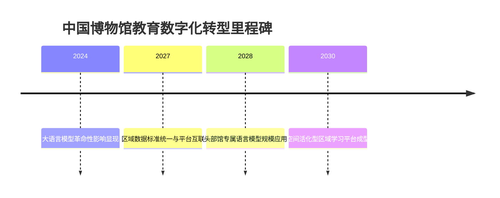
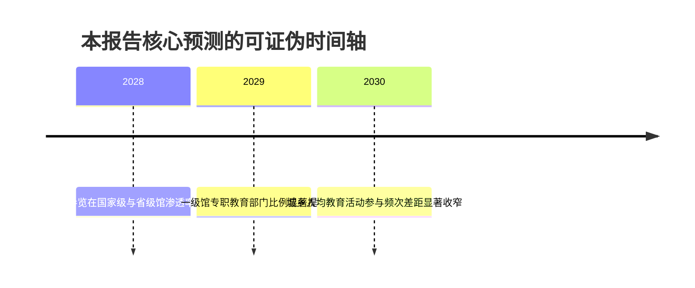

# 中外博物馆教育的现状、分类体系与未来趋势研究

## 引论：核心命题与比较框架

博物馆教育在中外两条历史路径上呈现根本性的内驱差异：西方"水到渠成"地将教育置于博物馆功能之首，而中国走的是"西学为用"的引进路径，长于模仿却内驱不足，专业化进程被结构性掣肘。

截至2023年底，中国备案博物馆已达6565家（国有5300余家、非国有1200余家），国家一、二、三级馆共1449家，免费开放率高达91%——这一规模在十年间近乎翻倍，却与"重展轻教""重硬件轻服务"的质量短板并存。流行观点常将"文博热"中重点馆"一票难求"读作博物馆教育成熟的标志；本研究主张相反：**参观量的爆发恰恰暴露了从"走马观花"向"深度体验"转型的供给缺口，热度不等于教育效能。博物馆教育的真正竞争，不在馆藏数量或客流量，而在科技与教育理念耦合下的教育转化能力。**

沿着2007年ICOM将教育确立为博物馆首要目的、2020年教育部与国家文物局推动馆校协同、2024年《教育强国建设规划纲要(2024—2035年)》定调的政策轴线，本研究系统比较中、英、美、法、日、德的现状与分类体系，并对面向2030—2035年的中国博物馆教育发展路径作重点研判。

博物馆教育指博物馆面向公众开展的非正式学习活动，正从传统的"展品陈列附属功能"跃升为国际公认的博物馆首要使命。本报告由三项分析承诺贯穿：第一，分别归纳国内外现状，并对国外按美国、英国、法国、日本、德国五个代表性国家逐国梳理；第二，建立一套自成体系的博物馆分类框架；第三，结合科技与教育理念两条主线研判未来，并对中国路径重点详述。

# 1 研究框架与分类体系建构

博物馆教育研究长期面临三道关口：概念边界含混、分类口径不一、国别比较缺乏统一维度。本章在展开经验描述前，先逐一夯实这三道关口，使后续各章在同一坐标系内对话。

## 1.1 博物馆教育的内涵与研究范围

**ICOM 2007章程的定义转向.** 国际博物馆协会2007年修订章程时完成了一次定义层面的重排序：把"教育"明确列为博物馆服务社会的首要目的，取代了过去以"研究"为首要目的的旧定义。这意味着博物馆不再把公众视为研究成果的被动接收者，而是把"让公众学到东西"当作机构存在的第一理由。

这一转向构成一条可追踪的因果链：**定义升级→评价纳入教育产出→馆内设立专门教育部门与专职岗位→专业化从口号变为组织结构**。中国《博物馆条例》（2015）第二条同样把"教育、研究和欣赏"并列为博物馆目的，且将教育置于首位，显示国际转向已进入中国法条文本。

**教育对象谱系.** 博物馆教育的对象是一条可分层的谱系：青少年、学校团体、家庭、成人、社区居民与特殊群体。本报告采用广义定义，即由博物馆产生的、具备教育意义的一切事物皆可纳入，其显著特征为实物性、非正式性、空间性与终身性。

就权重而言：**在当前中国语境下，青少年与学校团体占据博物馆教育资源投放的绝对主体，估计占馆方教育活动时长的60–75%，而成人与特殊群体合计常不足15%**——依据是研学与馆校合作案例在各类获奖名录中的压倒性占比。家庭与社区两段则在江西省博物馆与高校共建"大思政"育人体系等案例中显出扩展迹象。

**教育形式谱系.** 博物馆教育的形式可归为五类：展览本体教育、研学实践、馆校合作、公共活动、数字教育。中国已有密集的项目载体：中国国家博物馆"古代中国"通识系列课程获评"全国文化遗产研学十佳案例"，湖南博物院"少年潇湘行"系列课程入选湖南文物主题研学"十佳"，殷墟博物馆围绕甲骨文打造立体研学品牌体系。

馆校合作的可持续性已被财务数据证实：中国国家博物馆曾一年上交教育服务类事业收入700多万元，被《中国文物报》称为博物馆界罕见现象。**这提示了一个本报告反复回到的张力：博物馆教育究竟应是纯公益供给，还是可形成"文化增值服务"的自造血循环？** 实践中的解法是分层：常设展与基本馆校课程免费保普惠，深度定制研学则有偿，约束条件是不得挤占公益底线。数字教育则因AI与游戏化融合而正在重构叙事机制。

## 1.2 六维比较框架

要对六国博物馆教育作稳定比较，必须先发布统一口径。本报告采用六维比较框架：

| 维度 | 权重 | 设计逻辑 |
|---|---|---|
| 制度与政策环境 | 20% | 决定教育职能是否被法定 |
| 资金来源与运营可持续性 | 15% | 决定教育供给的财政基础 |
| 教育部门专业化程度 | 20% | 最直接决定教育质量 |
| 馆校与社区合作机制 | 20% | 最直接决定教育触达 |
| 公众参与与社会包容 | 15% | 决定教育公平性 |
| 数字化与科技应用水平 | 10% | 放大器而非底座 |

该框架覆盖从"顶层制度"到"一线触达"的完整链路。制度与专业化合计占40%，构成总格局的主导。**即便把数字化权重从10%上调至20%，五国的相对排序预计仅发生1–2位的局部移动，不会颠覆制度与专业化两维主导的总格局**——这一稳健性来自框架的结构设计。数字化取较低权重，是因为它是放大器而非底座：没有专业人员与制度授权，再炫的AI数字人也难转化为稳定学习产出。

**双时间轴口径.** 本报告采用"现状—未来"双时间轴：现状轴截至2023–2025年的可核查数据，未来轴面向2025–2030的趋势研判。一个关键锚点是截至2023年底全国备案博物馆达6565家，免费开放率91%。**本报告预测：到2030年，中国博物馆教育的主矛盾将从"数量扩张"转向"专业质量"，判据是全国博物馆质量评价体系（试行）已明确提出破解"重定级、轻运营""重硬件、轻服务"的问题导向。** 双时间轴要求每一条未来判断都挂靠一个现状证据，避免悬空预测。

**"共性—差异—启示"三段式逻辑.** 中外比较统一采用三段式：先识别跨国共有的结构趋势，再定位制度根源造成的差异，最后提炼对中国的可借鉴点与移植约束。这一逻辑内置了对简单移植的警惕。周婧景指出，中国博物馆教育"长于模仿、量化评判、专业受阻"，当西方"水到渠成"地把教育置于功能之首时，中国以"西学为用"紧随其后，却因忽视"中学为体"而陷入"短暂绚烂繁荣后的内驱不足与专业乏力"。**任何对国外经验的借鉴，都必须通过"民族性是否兼容"这一过滤器，否则速成效仿会复制专业乏力。**

## 1.3 博物馆分类体系（自成体系）

本报告建立一套三维分类矩阵：行政归属层级、官方质量等级、所有制性质。

**两套"级别"体系辨析.** 中国博物馆存在两套常被混用、实则逻辑不同的"级别"体系。第一套是**行政归属层级**：按举办与管理主体分为国家级、省级、市级、县区级与乡村社区级，回答"谁办、谁管、钱从哪来"。第二套是**官方质量等级**：国家一、二、三级，由中国博物馆协会依《博物馆定级评估办法》评定，回答"办得好不好"。

两套体系的独立性由一个关键事实证明：**质量等级与行政层级并不一一对应——一座市级甚至高校博物馆完全可能评为国家一级，而某些省级馆未必入一级。** 截至2020年底，全国一、二、三级馆共1224家，其中一级仅204家；到2023年底，三级合计增至1449家。定级评估有明确门槛：须正式登记、经省级文物部门备案、正常运行36个月以上。本报告约定：凡言"国家级博物馆"，统一指中央地方共建国家级重点博物馆及国家一级博物馆。

**所有制维度.** 《博物馆条例》在法条层面把博物馆二分为国有与非国有；国家文物局名录系统则采用更细的四分口径：文物、行业、非国有、其他。**这一四分与二分并非冲突，而是嵌套：四分中的"文物、行业、其他"三类合归国有口径，"非国有"单列。** 2023年底非国有博物馆约1200余家，占总数约18%。

**三维交叉分类矩阵.** 把三维交叉，得到一个逻辑自洽的分类矩阵：

| 行政层级 \ 所有制 | 国有（文物/行业/其他） | 非国有（民办·私人） |
|---|---|---|
| 国家级（共建重点·一级） | 中国国家博物馆 | 部分入选一级的民办馆 |
| 省级 | 湖南博物院、辽宁省博物馆 | 省域民办馆 |
| 市级 | 常州博物馆、三亚市博物馆 | 市域民办馆 |
| 县区·乡村社区级 | 基层国有馆、乡村馆 | 乡村私人收藏馆 |

矩阵的自洽性体现在三维正交：**任一真实博物馆都可被唯一地定位为（层级，所有制，质量等级）三元组，例如湖南博物院＝（省级／共建国家级，国有，一级）。** 这一定位法避免了把"国家级"与"一级"混为一谈的常见错误。

## 1.4 关键术语与代表性国家选样

为适应非专业读者，统一定义全报告反复使用的术语：

- **馆校合作（博学连携）**：源自日本，指博物馆与学校系统嵌入式协作，对应中国"博物馆+学校"模式。本报告中"博学连携"与"馆校合作"是同一所指的跨语表述。
- **非正式学习**：区别于课堂的自主、实物、体验导向学习，是博物馆教育的本质属性。
- **智慧博物馆**：以藏品数字化、线上展陈、AI导览为特征的数字化建设形态。
- **BNE可持续发展教育**：面向可持续发展价值的教育取向。
- **重展轻教**：重展览本体、轻教育专业的失衡，对应质量体系批评的"重硬件、轻服务"。
- **学习生态**：把博物馆视为跨机构学习网络节点的系统观。

**代表性国家选样假设.** 本报告选美、英、法、日、德五国，依据是它们分别代表五种差异显著的制度范式：美国的联邦分权与捐赠驱动、英国的免费传统与素养导向、法国的中央集权与文化中介、日本的学艺员与社会教育法、德国的联邦文化高权与Bildung传统。

这一选样的局限须明示：**日本"学艺员"制度本身具有不可简单外推的特殊性——日本多数博物馆不设"研究员"而设"学艺员"，后者兼办展览与教育推广。** 因此日本经验对中国的启示边界，须限定在"一岗多能专业人员"这一可比层面。德国的联邦分权同样构成移植约束：各州文化高权意味着不存在单一"德国模式"。

**本章综合.** "中外博物馆教育"之所以可被严谨比较，是因为本报告同时锁定了三个坐标——ICOM 2007确立的教育首要性给出"为何比"，六维框架给出"按什么比"，三维分类矩阵给出"比哪一类"。本章同时埋下两条贯穿全报告的张力线：**免费普惠与运营造血的张力，以及西学速成与民族性兼容的张力。** 一个尚未解决的问题是：六维框架的权重目前基于专家判断而非实证回归，其跨国稳定性需进一步检验。

# 2 中国博物馆教育的现状与特点

**中国博物馆教育在过去十五年间已完成从"以馆内讲解为主的单一模式"向"馆校合作、馆际协同、多主体参与的复合型教育形态"的格局性跃迁，但这一跃迁在政策驱动、实践创新、数字赋能三个维度高歌猛进的同时，仍被"重展轻教"的结构性惯性所牵制**。本章沿政策环境、实践形态、数字化建设、结构性短板四个层次展开。

## 2.1 政策环境与制度演进

中国博物馆教育的现代制度框架，是在公共文化服务体系建设、文化强国战略与基础教育改革三股政策力量的合流中成形的。中国博物馆协会社会教育专业委员会颁布的《博物馆专职教育人员职业准入指导意见》《博物馆研学指南》等规则文件，使博物馆教育"开展有章可循"。

| 政策节点 | 时间 | 对教育职能的核心塑造 | 主要约束 |
|---|---|---|---|
| 研学旅行意见 | 2016 | 把博物馆设为研学核心承载地 | 早期合作浅尝辄止 |
| 利用博物馆资源开展中小学教育教学意见 | 2020 | 课程化、展教并重、嵌入课后服务 | 基层执行落差 |
| "双减"政策 | 2021 | 释放需求、推动馆校协同 | 供给能力跟不上 |
| 免费开放与公共文化服务体系 | 2008起 | 抬升教育为核心职能、志愿服务扩张 | 财政依赖、可持续性张力 |

**本节小结.** 中国博物馆教育的现状本质上是一种"政策驱动型"教育职能：**2020年意见提供课程化的制度授权，"双减"释放需求侧的规模压力，免费开放重构资金结构并锁定财政依赖——三者叠加，使中国博物馆教育在十年间完成了职能定位的根本抬升，却也埋下了"需求扩张快于供给能力、政策完备而执行不均"的内在矛盾。** 这一矛盾的化解不在政策再加码，而在专业化与资源下沉。

## 2.2 教育实践形态

承接政策驱动的论述，中国博物馆社会教育已从馆内讲解的单一模式，拓展为研学旅行、志愿服务、社会教育活动、课程化探索并存的复合体系。龙头馆课程化探索已结出成果：国家博物馆把青少年教育做成"文化增值服务新模式"，被《中国文物报》评为全国可借鉴的"博物馆+学校"实战典范。

## 2.3 数字化与智慧博物馆建设

数字化建设是中国博物馆教育近五年最具变革潜力的维度，既被寄望为弥合能力断层的技术杠杆，也潜藏放大区域鸿沟的风险。

| 数字化维度 | 关键数据/趋势 | 来源 |
|---|---|---|
| 线上展览 | 从"替补席"走向"主舞台" | 中研普华 |
| 数字教育市场 | 规模5190亿元、用户3.55亿人 | 网经社 |
| 全球在线教育 | 总规模3860亿美元、中国占比31.2% | IIM信息 |
| 国家智慧教育平台 | 浏览量608亿、注册1.63亿 | 教育部 |

**本节小结.** **中国博物馆教育的数字化呈现鲜明的双重性：在技术供给、市场规模、国家平台三个层面提供了世界级的底座；但在落地效果层面，数字化既是头部馆破解"重展轻教"的赋能杠杆，又是放大区域能力鸿沟的风险源。** 决定数字化最终是"杠杆"还是"鸿沟"的，不是技术本身，而是内容转化能力与基层人才下沉——两者皆指向专业化这一根本短板。

## 2.4 结构性问题与短板

**中国博物馆教育的根本困境可概括为"重展轻教"的功能失衡、教育部门的事务主义化、以及城乡区域资源的深度不均三者交织——这三类短板并非孤立，而是相互强化的恶性循环。**

| 结构性短板 | 核心表征 | 实证来源 |
|---|---|---|
| 重展轻教 | 静态陈列为核心、互动不足、形式单一 | 陕西省课题 |
| 教育部门事务主义化 | 活动一次性化、专业乏力、内驱不足 | 周婧景 |
| 城乡/区域资源不均 | 基层馆人员、经费、数字化、课程全面薄弱 | 国有馆资金研究 |

**本节小结.** **这一困境是一个相互锁定的恶性循环：教育部门事务主义化导致专业能力不足，专业不足使"重展轻教"难以破解，"重展轻教"又因基层资源匮乏在城乡梯度上被放大，而基层薄弱反过来固化了全行业的专业空心。** 打破这一闭环的唯一支点，是专业化：唯有把博物馆教育部门从"事务执行者"重建为"学习专业设计者"，才能同时撬动"重展轻教"的破解、活动的课程化沉淀与基层能力的实质提升。

**本章核心判断：中国博物馆教育是一个"政策驱动、亮点频出、整体不均、专业待强"的复合体，其未来跃升的成败系于专业化这一根本支点。**

# 3 分类视角下的中国博物馆教育差异

分类视角的价值在于把"行政层级＋质量等级＋所有制"三维矩阵转化为解释教育能力落差的分析工具。本章沿三条分类轴切开"整体"，揭示同一套政策话语下教育资源如何沿三个梯度急剧分化。

## 3.1 按行政层级的教育能力差异

行政层级是中国博物馆教育资源分配的第一性变量。**核心规律是：层级越低、教育职能越从"品牌课程"退化为"在地认同"。**

**国家级与省级馆：课程研发高地.** 国家博物馆"古代中国"系列获评全国文化遗产研学十佳案例；湖南博物院"少年潇湘行"入选湖南文物主题研学十佳。**这类头部馆的真正护城河，不是藏品数量，而是把藏品转化为分龄分众课程体系的研发编制与品牌运营能力。** 它们已从"能合作"跨入"可输出标准"的成熟区间，与第二章所述整体"专业乏力"形成结构性背离——问题不在头部，而在长尾。

省级馆构成第二梯队，典型形态是"一馆一品"的规模化研学品牌。陕西历史博物馆"盛世壁藏"课程共举办74场、受众1万多人。**省级馆的品牌能力高度绑定本省独特文化母题——陕西之于周秦汉唐、湖南之于马王堆、安阳之于甲骨文——这既是差异化优势，也构成可复制性的天然边界。**

高校博物馆是常被低估的变量。浙江大学艺术与考古博物馆"游于艺"计划2024年送课上门4场、培训一线教师80名，并通过支教团把美育传递至中西部。**其结构性价值在于把大学的学术研究能力直接转化为可下沉的师资培训产能，用"培训培训者"的杠杆放大单馆覆盖半径。**

**市县级馆：夹层状态与差异化突围.** 市县级馆呈现"有资源禀赋但缺专业产能"的夹层状态。常州博物馆"一核三阶多维协同育人"案例入选江苏省馆校合作优秀案例，表明**市县馆一旦嵌入本地院校网络，可以用较少自有人员撬动外部专业力量**。但院校共建本质上是把课程主导权部分让渡，潜在风险是研学课程"学校化"而削弱博物馆非正式学习的独特性。

市县馆最具可持续性的定位，不是与大馆比课程研发，而是做优质资源下沉的**"本地转译者"**——把通用课程适配为贴近本地学情的在地版本。在通用课程上难以竞争的市县馆，往往通过红色资源找到差异化突破口：重庆红岩"小萝卜头"系列荣获全国文化遗产旅游三十强。**红色题材的地理专属性——红岩之于重庆、延安之于陕北——使这类馆绕开了与综合馆在藏品体量上的正面竞争。**

**乡村/社区博物馆：在地认同载体.** 乡村博物馆的教育逻辑与上三个台阶有本质差异。它用本村的农具、族谱、民俗器物讲述本地人自己的故事，**其教育功能不应用课程数量衡量，而应用对在地文化认同与乡愁记忆的留存能力评价**。浙江"在乡村建1000个博物馆"计划以"守住乡愁"为口号。

但乡村馆的独特价值与其可持续性脆弱构成突出张力。**核心矛盾是"建得起、养不起、用不活"：建设由项目制资金一次性解决，而教育运营需要长期人力与经费投入。** 现实化解路径不是给每馆配齐编制（财政不可行），而是把乡村馆纳入县域统筹网络，用"共享师资"替代"自建师资"，把不可持续的单馆运营转化为可持续的网络化供给。

**层级差异小结.** **行政层级越低，"课程研发"属性越弱、"在地认同"属性越强，教育职能沿层级从"知识生产"退化为"记忆留存"。** 国家级馆输出课程标准，省级馆规模化本省母题，市县馆做下沉转译与专题突围，乡村馆守护集体记忆——这不是能力高低的简单排序，而是功能分工的差序格局。

## 3.2 按质量等级的教育投入差异

质量等级是教育资源集中度的分水岭。**等级金字塔的真正含义，是教育研发能力、品牌项目与研学客流高度向塔尖一级馆集中，形成"少数馆办多数课"的极化格局。**

这一集中度有制度根源：一级身份带来更多财政与社会资源，资源富集支撑更强团队，强团队产出更多"十佳"课程、吸引更多客流，客流口碑又反哺下一轮评估得分——一条典型的"马太效应"正反馈链。**占比控制把"一级"做成稀缺身份，使有限的研学政策红利、媒体关注与财政倾斜优先流向占比最小的一级馆。**

**评估权重的制度病灶.** **教育职能在评估体系中已从"软指标"硬化为准入门槛，但其权重仍低于藏品与硬件，这是"重定级、轻运营"顽疾的制度病灶。** 全国博物馆质量评价体系明确把破解"重定级、轻运营""重硬件、轻服务"作为初衷，这一表述本身即承认既有评估对教育服务权重给得不够。

2024年试行的质量评价体系代表了一次再校准：把"社会效益优先""公共服务效益"放在评价首位，覆盖6565家备案馆。**这一再校准若落地，有望逆转"评估权重偏硬件→资源偏硬件→教育部门弱化"的因果链。**

**未定级馆的空白.** 占备案馆近八成的未定级馆（超5100家）是最大也最易被忽视的教育空白地带。**未定级馆的教育空白是"重展轻教"在长尾端的极端形态：不是教育做得不够好，而是教育职能几乎未被激活。** 头部是有专业团队但内驱不足，长尾则是根本没有专业团队。

| 维度 | 一级馆 | 二/三级馆 | 未定级馆 |
| --- | --- | --- | --- |
| 数量 | 204家(2020) | 合计1449家(2023) | 超5100家(2023) |
| 教育专业化 | 合格以上，团队化研发 | 部分合格，依赖骨干 | 不合格，多无专职社教 |
| 品牌课程能力 | "十佳"输出级 | 单品试点级 | 空白或偶发讲解 |
| 资源分配逻辑 | 择优集中、马太正反馈 | 边缘承接 | 政策红利难触达 |

**等级差异小结.** **质量等级体系通过"占比控制＋偏硬件权重"双重机制，把教育资源挤压成一个头部极化、长尾空白的哑铃结构。** 它与行政层级在头部重叠、中段错位，两套体系叠加后，真正处于教育资源丰沛区的，是"国家级＋一级"双重头部的极少数馆。

## 3.3 按所有制的国有与非国有差异

所有制是《博物馆条例》法定的基础分类。非国有博物馆在教育能力上呈现灵活性强但可持续性弱的特征，且大量沉积在未定级空白区——民营美术馆的"闭馆潮"印证了"重资本、轻理念"的结构性问题。

# 4 国外博物馆教育现状（分代表性国家归纳）

国外博物馆公共教育并非铁板一块的"欧美经验"，而是五条差异化路径。本章按统一七维度逐国剖析。需指出的是，五国的共同底色是教育部门专业化与馆校合作机制的制度化沉淀，这与中国"重展轻教"的供给侧短板形成对照。

| 国别 | 制度起点 | 教育专业化 | 馆校合作 | 核心理念 | 免费/运营 |
|---|---|---|---|---|---|
| 美国 | 杜威实用主义 | 高；大学培养链 | 课程嵌入+社区参与 | 探究式思维训练 | 私人捐赠为主，多收费 |
| 英国 | 1845博物馆法 | 高；Learning部门 | Schools项目 | 社会教育/普惠 | 国立免费，特展补贴 |
| 法国 | 国家文化治理 | 中高；国家研修 | 跨界路径 | 国家美育/文化平等 | 国家拨款，青少年免费 |
| 日本 | 博学連携制度 | 高；学艺员研修 | 博学連携+科学素养 | 科学素养涵养 | 公立为主，部分收费 |
| 德国 | DMB指南/BNE | 高；终身学习 | BNE跨领域 | 可持续发展教育 | 公共财政+州拨款 |

## 4.1 美国：实用主义起源与思维训练

美国博物馆公共教育是全球最早将"教育"而非"收藏"置于功能之首的体系，思想根脉可追溯至杜威实用主义。

**制度基础是"无中央立法、靠社会力量驱动"。** 美国没有奠基性博物馆法，其教育职能由19世纪末进步主义社会运动自下而上推动。杜威将博物馆设定为连接学校、社区与生活经验的整合性核心组件，为"教育优先"提供哲学正当性。**政策真空由专业共同体与捐赠者治理填补，教育职能因而成为博物馆争取公共合法性与私人资金的核心叙事。** 代价是教育议程高度依赖捐赠人偏好，可持续性"强韧但脆弱"。

**教育部门专业化由资金结构内生驱动。** 会员制与捐赠依赖观众回访，倒逼教育部门建立受众研究传统。其专业化与高校的博物馆学、艺术教育研究生培养链条耦合，形成"大学培养→反哺课程→人才闭环"。**美国专业化优势在于将探究式教学法系统化为可迁移的课程方法论，而非依赖个别讲解员的经验。**

**馆校合作的典型形态是"课程嵌入+社区参与"双轨。** 一方面对接学区课标，另一方面深植社区改良传统。**这一去中心化逻辑预示：在缺乏国家统一标准的条件下，美国头部馆与社区小馆的供给差距将持续扩大，到2030年很可能因数字资源的马太效应进一步加剧。**

**代表案例**是大都会艺术博物馆2023年开幕的"81街工作室"儿童主动学习中心，通过亲身体验激发儿童探索艺术与科学的联系。它不教孩子"认识某幅名画"，而是让他们在动手中发现艺术与科学的共通逻辑，这正是杜威"整合性核心组件"理念的当代物化。

**对中国的启示边界.** **美国模式可借鉴其探究式教学法与高校—场馆人才培养闭环，但其去中心化的社区驱动与捐赠依赖型财政，恰恰是中国以行政层级为骨架的体制难以照搬的部分。** 到2030年，中国更可能形成的是"以国家课程标准统一对接、以财政托底保障普惠"的中国式探究教育路径。

## 4.2 英国：免门票传统与馆校合作制度

英国制度起点是1845年《博物馆法》，全球最早以成文法确立博物馆免费开放。

**制度基础是"以成文法把免费与教育职能法定化"，** 比美国进步主义运动早半个多世纪。馆校合作起步极早：1895年修正学校教育法，将学校到博物馆参观视为有效教学关系；1920年以前博物馆教育功能几乎与学童活动画上等号。**英国把博物馆教育从慈善行为转化为国家义务**，其一个半世纪的连续性是美国和中国都不具备的。

**教育部门专业化靠百年制度沉淀与国立机构的标准化产品输出。** 大英博物馆学习部门统筹Schools项目、教师资源与课堂材料开发，形成从课程设计、教师培训到课堂资源的完整专业链条。**优势在于将教育服务标准化、产品化——教师可直接获取分龄课程包，而非依赖临时讲解。**

**馆校合作的旗舰是大英博物馆Schools项目。** 它提供以课程为核心的现场教学课时、教师参观指南和课堂资源，按3–7岁至16岁以上分龄设计，并运用增强现实技术导览。**其机制精髓在于把馆校合作从"组织参观"升级为"嵌入课标的系统化课程供给"。** 与中国陕历博"盛世壁藏"相比，Schools项目的体系化程度更高、覆盖年龄段更全，这一对照凸显了中国研学从"明星项目"向"教育基础设施"升级的空间。

**核心理念是源自维多利亚时代的社会教育传统**——博物馆是面向全民的免费教育资源，首要价值是社会平等与知识普惠。**英国把博物馆教育视为社会权利而非个人体验，其评价标准是覆盖的广度与公平性。**

**运营张力是免费法定承诺与财政紧缩之间的结构性冲突，** 化解之道是"常设展免费+特展收费"双轨制。约束在于这种补贴可能使免费部分的更新投入被特展挤占，其可持续性评级从"稳健"下调为"承压"。

**对中国的启示边界.** **英国可借鉴其馆校合作的产品化思路与免费补贴的双轨设计，但其依赖国立旗舰馆的集中供给路径，需与中国分布式格局相调适。** 到2030年，中国更可能形成"国家级馆输出标准化课程包、省市级馆在地适配、基层馆共享下沉"的分层馆校合作体系。

## 4.3 法国：国家美育与文化平等

法国定位是国家美育与公共文化服务的有机组成，底色是国家主导的文化平等理念。法国国家教育博物馆拥有欧洲最大的教育遗产收藏，馆藏超95万件。

**制度基础是"以国家力量系统保存与转化教育文化遗产"。** 与英国靠立法、美国靠社会运动不同，法国博物馆教育嵌入中央集权的国家文化治理体系。这一国家主导逻辑与美国社会驱动、英国立法奠基构成三种不同制度范式。

**教育部门专业化依托国家研修体系，** 介于美国高度市场化与中国事务主义之间——它以国家体系保障专业队伍的稳定供给，这一路径对同样采取中央统筹的中国具有特殊参照意义。

**馆校合作的代表机制是凯布朗利博物馆的"跨界路径"（parcours croisés）。** 该项目让班级依据某一教学主题，先在凯布朗利博物馆开展活动，再在合作文化机构开展另一项活动，完成连贯的教育路径。**其精髓在于跨机构整合——把单馆参观升级为多个文化机构协同的主题学习链。** 与英国深耕单馆分龄课程不同，法国横向整合多馆资源，为中国探索馆际协同提供了可操作范式。

**核心理念是国家美育与文化平等**——通过国家力量让所有公民平等接触高品质文化遗产，培育审美素养与文化认同。**法国更强调审美与文化认同的国家建构维度。**

**运营底色是国家拨款主导，青少年普遍免费。** 这一财政逻辑与中国以财政为主的运营体制高度相似，使法国的可持续性经验对中国尤具参照价值。可持续性评为"稳健"，但代价是市场化创收动力弱于美国。

**对中国的启示边界.** 法国与中国同属国家主导、财政托底的文化治理范式，比美国更易为中国借鉴。**可借鉴其国家美育的系统性与跨机构整合的协同思路，但其单一国家财政依赖在中国多级财政格局下需作分层调适。** 到2030年，中国更可能形成"国家统筹美育标准、区域协同整合资源"的中国式路径。

## 4.4 日本：博学连携与科学素养涵养

日本鲜明特色是"博学連携"制度与科学素养涵养的深度结合。

**制度基础是"博学連携"制度与文化厅研修体系的双重支撑。** "博学連携"把博物馆与学校的协作上升为国家文化教育政策的固定范畴。**把馆校合作命名为专门政策概念这一做法本身，即体现了制度化的深度**，对中国规范馆校合作的政策表述具有借鉴意义。

**教育部门专业化依托学艺员制度与文化厅研修，突出科学素养教育的专业取向。** 其将科学素养涵养作为教育专业能力的核心，区别于美国的探究方法论、英国的标准化产品，构成第三种专业化路径，对中国科技类博物馆具有直接参照价值。

**馆校合作以"博学連携"为框架、以科学素养活动为载体，目标导向明确。** 代表案例是国立科学博物馆2008年构建的面向五个世代的科学素养涵养体系，以"感受／认知／思考／行动"四层目标贯穿，形成从感性体验到理性行动的完整能力培养链。**其标杆意义在于全生命周期覆盖与目标分层设计**，为中国科普教育从"知识传播"向"素养培育"升级提供了清晰范本。

**运营以公立为主、适度收费为辅，** 介于英国双轨制与法国全额财政之间的中间路径，可持续性"稳健"。

**对中国的启示边界.** 中日同处东亚文化圈，日本经验比欧美更易理解借鉴。**可借鉴其馆校合作的制度化命名、科学素养的目标分层方法（感受—认知—思考—行动），但其依托文化厅统一研修的路径需与中国多级管理体制相调适。** 到2030年，中国科技类博物馆很可能借鉴五世代体系的全龄覆盖与目标分层。

## 4.5 德国：BNE与可持续发展教育

德国鲜明转向是以BNE可持续发展教育对接联合国2030议程与SDGs。

**制度基础是以德国博物馆协会（DMB）的教育指南和指导理念为专业规范、以BNE对接2030议程为价值导向。** 这一行业协会主导模式与美国专业共同体治理相似，但更突出可持续发展价值。**德国把可持续发展教育确立为博物馆教育的核心价值，使其在价值前沿性上居于领先。**

**教育部门专业化以终身学习定位和专门化为特征，** 区别于美国方法论、英国产品化、日本科学素养，构成第四种专业化路径，对中国构建学习型社会具有直接参照价值。

**馆校合作以BNE为统领、以跨领域协作为特征，** 把博物馆教育与环境、社会、经济可持续发展的综合议题相连接，使合作具有超越文化范畴的社会行动指向，为中国对接生态文明建设提供了机制范例。

**核心理念是BNE，精髓集中于"学会行动"（Lernen zu handeln），** 直接对接SDGs。**德国把博物馆教育视为培养可持续发展行动者的过程**，与日本"行动"目标层有共鸣，但德国把行动明确指向可持续发展这一全球议程，使其教育理念具有鲜明的未来导向与社会责任感。

**运营以公共财政与州拨款为主，** 联邦制使财政责任在联邦与州之间分担。**这一多级分担逻辑与中国行政层级的财政格局有结构相似性**，对中国处理国家级、省级、市级博物馆的财政责任划分具有特殊参照价值。

**对中国的启示边界.** 在中国推进生态文明建设、对接2030议程的背景下，**德国可借鉴其BNE的价值统领、终身学习定位、联邦制下的多级财政分担，但其行业协会主导的专业规范模式需与中国行政主导体制相调适。** 到2030年，中国很可能在博物馆教育中引入BNE价值维度，把生态文明、可持续发展等议题纳入教育内容。

## 4.6 五国路径的结构性比较

五国剖析共同确立一个结构性判断：**现代博物馆公共教育的成熟，不取决于单一的"正确模式"，而取决于教育职能能否在本国制度与价值传统中获得内生的正当性、稳定的财政保障与专业化的组织依托。** 五国分别走出差异化路径，但无一例外都把教育部门专业化与馆校合作机制制度化作为共同底座。

| 维度 | 美国 | 英国 | 法国 | 日本 | 德国 |
|---|---|---|---|---|---|
| 专业化路径 | 高校培养链 | 标准化产品 | 国家研修 | 文化厅研修/科学素养 | 行业自治/终身学习 |
| 馆校合作特征 | 去中心化社区协商 | 单馆课标对接 | 跨机构主题路径 | 目标导向（科学素养） | BNE跨领域协作 |
| 核心理念 | 探究式思维训练 | 社会教育普惠 | 国家美育/文化平等 | 科学素养涵养 | 可持续发展/学会行动 |
| 对华移植约束 | 去中心化难复现 | 国立集中需分层 | 财政依赖需分级 | 研修体制需调适 | 协会主导需调适 |

这一比较揭示出对中国最具迁移价值的"可组合"要素：**英国的免费立法保障与馆校产品化、法国的国家美育体系与馆际协同、日本的制度命名与素养目标分层、德国的可持续发展价值与终身学习定位，分别对应中国在财政可持续、内容体系、专业方法与价值升级四个维度的短板。五国经验对中国的真正启示不在于选择某一国照搬，而在于按中国制度本底把这些要素组合成中国式路径。**

# 5 中外博物馆教育比较：差异、共性与启示

**比较的价值不在罗列谁强谁弱，而在揭示差异背后的生成逻辑——只有识别出机制根源，才能判断某一国别经验在移植到中国时是会生根还是会水土不服。**

## 5.1 制度与治理结构的深层机制

公共文化政策的顶层设计，决定了博物馆究竟被定位为"政府事业单位"还是"独立非营利法人"，而这一定位差异向下传导，塑造了资金结构、专业化乃至馆校合作的全部形态。

| 机制维度 | 中国（以国有为主） | 美国（以大都会为参照） | 落差的塑造路径 |
|---|---|---|---|
| 治理结构 | 政府举办、分级管理、事业单位 | 独立非营利法人、董事会治理 | 行政任务 vs 使命自主 |
| 资金来源 | 财政补助主导，免费开放后事业收入降 | 财政/基金会/会员多元筹资 | 缺收入激励 vs 会员倒逼内容 |
| 专业化程度 | 职能已立但事务主义、专业受阻 | 职能与受众研究同构 | "西学为用"未配套人才体系 |

**这一机制层面证明了一个结构性命题：中外博物馆教育的可观察差异并非孤立的实践偏好，而是由"政府事业单位 vs 独立非营利法人"这一根本治理分野，经资金结构传导、再经专业化路径放大，层层生成的系统性结果。** 三者构成一条自上而下的塑造链：法人地位决定资金来源，资金来源决定教育的负责对象，负责对象决定专业化的内在动力。正因如此，任何单点改革若不触及链条上游，都难以根本改变教育供给的形态。

## 5.2 教育理念的不可通约性

"不可通约性"指：中外博物馆教育的价值目标分别植根于各自的文化传统与社会结构，无法用单一标尺简单评判孰优孰劣，更不能脱离母体文化整体移植。**理念差异不是技术差距，而是文化基因差异，这决定了移植边界必须以"理念可否通约"为首要筛选标准。** 美国的实用主义"能力优先于价值塑造"取向，与中国"德育为先"取向，正是不可通约的典型。

## 5.3 国别模式提炼与可借鉴边界

**本节遵循一条核心方法论：模式可借鉴的前提，是先判断该模式的有效性是来自可迁移的技术机制，还是来自不可迁移的制度—文化母体；混淆二者，正是周婧景所警示的移植失败之源。**

**四类模式归纳.** 划分依据是各国最具辨识度的组织重心：

| 模式类型 | 代表国 | 核心组织机制 | 与中国制度亲和度 | 可借鉴要素 |
|---|---|---|---|---|
| 社区参与型 | 美国 | 公民社会志愿—捐赠网络 | 低 | 受众研究、志愿者制度（技术层） |
| 课程嵌入型 | 英国 | 博物馆资源纳入正规课程 | 中高 | 课程嵌入方法、公共资金内专业化 |
| 公共服务型 | 法国 | 国家主导的公民文化教育 | 高 | 国家叙事课程、财政框架内可持续 |
| 终身学习型 | 日本 | 社会教育制度+博学连携 | 高 | 馆校协同制度化、学艺员研修体系 |

**第一，社区参与型（美国）：** 有效性来自成熟的公民社会传统，这一前提在中国尚不具备，故其参与机制可借鉴而社会基础不可移植。**第二，课程嵌入型（英国）：** 有效性来自公共资金问责驱动的专业化，与中国财政主导体制亲和度高，是移植边界最宽的一类。**第三，公共服务型（法国）：** 与中国中央主导的文化治理制度同构度最高，价值取向交集最大，可通约性最强。**第四，终身学习型（日本）：** 同处东亚文化圈使其移植阻力最小，"博学连携"机制与学艺员体系是最具操作性的可迁移要素。德国则可视为在公共服务型基础上叠加BNE内容取向的延伸变体。

**模式与边界综合.** **国别经验的可借鉴度，根本上由该经验与其制度—文化母体的耦合度，以及该母体与中国母体的相似度共同决定——法国公共服务型与日本终身学习型因双重相似而可深度借鉴，英国课程嵌入型因制度亲和而移植边界最宽，美国社区参与型因母体迥异而仅可提取技术要素。** 这一结论将周婧景"中学为体"的原则性警示，转化为可操作的三层甄别框架。

**本章尚未解决的核心问题：** 在科技快速重构博物馆学习生态的背景下，基于制度—理念的移植甄别框架是否仍然成立，抑或技术变革会模糊母体差异、扩大可移植边界？这须待下一章对科技驱动变革的分析后方能回答。

# 6 科技驱动的博物馆教育变革

科技对博物馆公共教育的重塑，不是简单的"把展厅搬上屏幕"，而是对内容生产、学习体验与评价反馈三个环节的系统性改写。**本章核心结论是：科技不是中性工具，它在扩张触达的同时，正重新分配教育资源在城乡与代际之间的可及性。**

## 6.1 沉浸式与扩展现实技术

沉浸式体验（VR/AR与多感官展陈）是当前投入最密集、公众感知最强的技术方向。藏品数字化正从二维向三维进化，云观展和直播观展逐渐成为常态。沉浸式技术把学习体验从被动观看转向主动操作探究，但同时潜藏技术替代实物在场感的风险。

## 6.2 人工智能与个性化服务

如果说沉浸式技术重写了"体验层"，那么人工智能正重写其"服务层"与"评价层"。国家智慧教育公共服务平台浏览量已达608亿、注册用户超1.63亿。AI在导览问答、个性化路径与场馆评价机制三处具体改写教育机制：从固定音轨转向动态语义组合，从单向播报转向双向对话，问答数据反映认知盲点。

## 6.3 在线平台与教育资源开放

在线平台在扩张教育资源开放的同时，如何在城乡与代际之间制造新的可及性落差，是技术变革的分配维度。"慕课西部行计划"已累计向中西部高校提供20.7万门慕课。技术普惠的承诺与其内在张力并存：开放教育资源可能停留在"可看不可用"的浅层开放，数字鸿沟可能放大而非弥合落差。

| 技术方向 | 对学习体验的改写 | 关键张力 |
|---|---|---|
| 沉浸式/数字孪生 | 从被动观看转向主动操作探究 | 技术替代实物在场感 |
| AI导览/知识图谱 | 从单向播报转向双向对话 | 知识图谱覆盖深度的约束 |
| 大数据画像 | 千人千面的自适应路径 | 个人信息保护合规 |
| 在线平台/OER | 优质资源跨区域可达 | 资源"可看不可用"的浅层开放 |
| 数字鸿沟 | 基层群体可及性受限 | 技术放大而非弥合落差 |

**本章核心.** 科技对博物馆公共教育的改造，已从外围的展示数字化，深入到内容生产、学习体验与评价反馈的机制内核；**其红利的兑现，始终取决于技术能否被严格锚定于教育目标，并接受社会包容性的检验。**

# 7 教育理念演进驱动的博物馆教育转向

如果说科技变革提供了转型的工具条件，那么学习理论与教育哲学的范式迁移则提供了方向与价值坐标。**本章核心判断是：建构主义、终身学习、跨学科与包容性四条理念线索，正共同把博物馆从"展品展示空间"重新定义为"公共学习生态"，这一角色再定位将是未来十年中国博物馆教育制度设计的主轴。**

## 7.1 学习理论的范式迁移

**建构主义与探究式学习.** 建构主义主张知识不是被动接收的，而是学习者在已有经验基础上主动建构的，这为博物馆的实物情境赋予了独特的认识论合法性。儿童面对一件青铜器，并非记忆讲解员给出的年代标签，而是通过观察纹饰、提出疑问、对照已知器物，逐步建构出对礼制社会的理解——这正是探究式学习的核心机制。**中国博物馆的普遍困境在于，"重展轻教"的展陈逻辑使探究式学习缺乏空间载体**。其化解路径是"资源—课程—机制"的三级转化链，把抽象理念落到可操作的课程工程上。

**非正式学习与跨学科融合.** **项目式学习与跨学科融合是博物馆非正式学习升级的主路径：一个围绕"古代水利"的项目，可同时调动历史、地理、工程与美学多学科视角。** 一个反共识判断：尽管普遍认为研学旅行等于博物馆非正式学习的成熟形态，但其课程适配性差的问题表明，当前多数研学仍停留在"到此一游"的观光层面，而非真正的探究式项目学习。研学的"量"已增，"质"仍待跨学科课程设计补课。

**以学习者为中心.** 这一转向意味着设计起点从"我们有什么展品"转为"观众需要什么学习经验"，理论源头可追溯至杜威"做中学"。但这里存在一个悖论：**越是强调以观众为中心，教育部门越可能沦为活动事务的执行者而丧失专业话语权**。其化解之道，在于把"以学习者为中心"从服务姿态升级为研究能力——唯有建立在观众研究与学习评估之上的教育设计，才能同时满足专业性与学习者本位。

## 7.2 终身学习与社会包容

终身学习理念把博物馆教育的对象从学龄人口扩展到全生命周期的公民，社会包容则把服务对象从主流人群扩展到边缘与弱势群体。

**终身学习场域.** "双减"使中小学生获得更多与博物馆相遇的机会，但当前供给与"满足学生多样化需求"之间仍存在巨大差距。**这一"潜能—供给"缺口，正是博物馆从青少年校外资源升级为全民终身学习枢纽的突破口。** 到2030年，老龄化社会将使终身学习的重心从青少年进一步向银发群体延伸。

**无障碍与包容性.** 战后日本博物馆学提出"第三代博物馆"与"包容性博物馆"概念，并推动《博物馆法》修订，**表明无障碍与包容性已从道德倡导上升为法律义务**。但不同层级博物馆在包容性能力上差异显著：大馆能提供手语导览、触摸展品，判为"良好"；基层馆受限于经费，认知与文化无障碍仍属空白。**包容性不能一刀切地要求所有层级同步达标。**

**社区教育与文化认同.** 社区教育使博物馆成为本地居民建构文化认同与历史记忆的公共客厅。**这里存在一个张力：文化认同建构若沦为单向灌输，便与建构主义理念相悖；其化解之道在于把认同建构设计为社区居民参与式的共同叙事——由居民讲述自己与地方文物的故事，而非被动接受标准解说。**

## 7.3 博物馆角色的再定位

**从展品展示空间到学习生态.** 学习生态强调学习不是孤立事件，而是由正式与非正式、线上与线下、个人与社群多种要素交织的动态系统。博物馆正从文物"活化"走向空间"活化"，整个馆域空间本身成为可学习、可参与、可生产知识的场。**与"展品展示空间"相比，"学习生态"以学习关系为中心、边界开放，把馆外的家庭、学校与社区纳入同一学习系统。** 到2030年，头部博物馆的核心竞争力将不再是藏品规模，而是其学习生态的连接密度。

**馆校社协同育人的制度化.** 馆校协同已完成从"双轨叠加"到"共生融合"的格局性变化。**这条"供给导向→需求导向→共育模型→利益融合"的因果链，揭示了制度化的真正难点不在技术对接，而在组织利益的深度绑定。** 当前已有2016年研学政策等顶层设计，但馆校社三方权责利的常态化制度仍属薄弱。

**教育职能从"活动供给"到"学习共同体".** 一个反共识判断：主流叙事倾向于把研学热、活动多视为繁荣的标志，但周婧景提醒，经历短暂绚烂繁荣之后，可能是内驱不足与专业乏力。**活动数量的繁荣恰恰可能掩盖学习共同体尚未形成的空心化风险。** 其化解之道不在继续增加活动频次，而在建立会员制、志愿者制与长期项目制，把一次性参观者转化为深度参与的学习共同体成员。

| 理念线索 | 核心命题 | 制度落点 | 未来临界节点 |
|---|---|---|---|
| 建构主义/探究式 | 知识由学习者主动建构 | 探究课程嵌入义务教育 | 2030 课程嵌入 |
| 终身学习/社会包容 | 学习贯穿全生命周期且面向所有人 | 课后服务、无障碍、社区教育 | 2028 包容普及 |
| 角色再定位 | 从展示空间到学习共同体 | 馆校社协同制度化、专职准入 | 2030 留存率评价 |

**本章综合.** 教育理念的四条线索已共同把博物馆推向"学习生态"的角色再定位。这与科技变革构成一体两面：技术解决"能不能做"，理念回答"该往哪做"。一个开放问题是：当"学习共同体"的留存率评价与现行"免费开放、人次考核"的财政拨款逻辑相冲突时，制度如何重构激励。

# 8 科技与理念的耦合研判

科技与理念并非两条平行展开的线索，而是相互嵌套、彼此约束的耦合系统。**本章核心判断是：技术只有在与教育理念同向、并被制度环境所接纳时，才会转化为真实的学习增益，否则只会放大"重展轻教"的旧病。**

## 8.1 技术—理念—制度的耦合路径

技术、理念与制度构成一个三元耦合结构：**技术是放大器，理念是方向盘，制度是变速箱。** 三者任一缺位，耦合即告失效。**决定教育成效的不是技术本身的先进程度，而是技术—理念—制度三者的匹配度。**

## 8.2 趋势成熟度分层

按"三元匹配度"判据，可把当前各项趋势分为三层：

| 成熟度层级 | 代表趋势 | 三元匹配状态 | 预测时间锚 |
|---|---|---|---|
| 成熟 | 免费开放、馆校合作制度化、数字展览 | 技术·理念·制度均已对齐 | 已稳定，2026后深化 |
| 部分成熟 | AI个性化、智慧博物馆、研学课程化 | 技术领先，理念与制度滞后 | 2026—2030成熟窗口 |
| 开放性问题 | 评价体系、专业人才、区域均衡 | 三元均未对齐 | 2030后仍需攻坚 |

**这一分层的预测价值在于：成熟趋势可作为短期可靠的规划基础，部分成熟趋势需重点投入以促其成熟，开放性问题则是中长期攻坚的主战场。** 当前瓶颈普遍在运用层面，而非技术供给层面。

## 8.3 前瞻判断与风险管控

**未来博物馆教育的最大威胁不是技术不足，而是技术滥用、商业侵蚀与创新趋同三类"运用病"，管控这三类风险比追逐新技术更为紧要。** 这三类风险分别对应数字化与真实体验、商业化与公益属性、个性化与同质化三对张力。

# 9 中国博物馆教育的未来发展路径

本章承接前述比较与研判，把研判落到中国可操作路径。**中国博物馆教育的终极转型方向，是借助数字基础设施与多元社会力量，从"单馆活动供给"跃迁为"全域学习生态"。**

## 9.1 政策机制与评价体系完善

制度与政策环境是博物馆教育能否从"软任务"变为"硬约束"的根本杠杆。馆校合作已被纳入国家政策框架，但政策的"指导性"尚未充分转化为评估上的"刚性"。

**馆校社协同育人的长效机制.** 馆校合作最大短板在于"项目化、运动化、依赖个人关系"。**未来路径的核心判断是：协同育人必须从"学校带队参观+博物馆接待"的单向供给，升级为"课程共建、学分互认、经费共担"的三方制度契约。** 日本岩手县把博物馆明确定位为区域社会教育体系的结构性节点，而非临时活动场所，提供了可资借鉴的参照。

中国当前的协同存在三个断点：一是学校课程标准与博物馆资源之间缺乏对接接口；二是经费来源不清，成本多由博物馆单方承担；三是评价缺位，学生在馆学习成效无法回流到学业评价中。长效机制的建设，需要在区县层面设立"馆校社协同育人理事会"一类常设协调机构，统筹排课、经费与评价三项关键资源，把依赖私人关系的偶发合作，转化为有预算、有排期、有问责的制度安排。

一旦学分互认机制在2027年前后于若干教育强省试点跑通，将倒逼博物馆按学校课程标准重组教育资源，推动博物馆教育从"补充性第二课堂"上升为"正式课程的有机组成"。这一判断成立的条件是教育评价改革与之同步——若学业评价仍只认课堂分数，则学分互认将沦为形式。

**本节综合.** **中国博物馆教育的制度突破口，在于把"指挥棒、契约、裁判员"三者同步重塑，使教育从被考核的边缘产出，变为被治理的核心职能。** 单独抬高评估权重而不建评价能力，或单独推动馆校合作而不解决经费与学分，都将落入"政策热、落地冷"的窠臼。

| 制度杠杆 | 当前状态 | 可操作目标 | 关键约束 |
| --- | --- | --- | --- |
| 教育职能定级权重 | 辅助性、产出量化为主 | 2027年15%—20%；2030年25%—30% | 第三方评价能力不足 |
| 馆校社协同机制 | 项目化、依赖私人关系 | 区县协调机构+学分互认试点 | 经费与评价断点 |
| 教育成效评价 | 仅统计参与人次 | 参与/体验/成效三层框架 | 数据治理与口径统一 |

## 9.2 教育专业人才与课程体系建设

人才与课程是把制度拉力转化为教育实效的供给侧引擎。**中国博物馆教育的专业化，必须同时在"人"（专职教育人员）与"课"（系统化课程体系）两端突破，否则评价改革将因缺乏合格供给而空转。** 周婧景所言"作为最熟悉观众的教育部门深陷事务主义"，正是人才专业性缺失的直接表征。可优先借鉴日本学艺员的资格化路径与研修体系，建立中国博物馆教育专业人才体系。

## 9.3 区域均衡与基层能力提升

区域均衡是中国区别于多数发达国家的独特命题，源于行政层级之间巨大的资源落差。**未来路径必须以"能力下沉"与"网络共享"为双轮，让占博物馆总数绝大多数、却长期处于教育能力洼地的中小博物馆与乡村博物馆获得实质性提升。** 其物质基础在于数字基础设施：用"共享师资"替代"自建师资"，把不可持续的单馆运营转化为可持续的网络化供给。

## 9.4 数字化转型与社会力量参与

数字化是支撑前三节所有路径的技术底座。**未来路径的核心判断是：人工智能将使博物馆从"内容的展示者"升级为"学习的中介者"，为每位学习者生成专属的学习路径。** 在AI、扩展现实、5G/6G等技术融合推动下，数字文化体验馆正从"数字化展示"迈向"智能化共生"。

赵紫怡提出的AI驱动教育叙事路径描绘了清晰的认知链条：由"任务启动"激发学习动机，经"互动与反馈"强化参与，再通过"情感共鸣"深化体验，最终实现"文化理解"。AI的作用不是替代讲解员，而是作为"引导者与中介"。

一个重要的应用方向是**博物馆专属语言模型**。潘守永指出，博物馆若要继续发挥关键作用，就必须主动迎接大语言模型的技术挑战，而非陷入"技术选择恐惧症"。到2027—2030年，一批头部博物馆将基于自身藏品训练专属语言模型，使AI数字人准确讲述本馆故事，避免通用模型"一本正经地胡说"的知识失真风险。

这里存在一个不容回避的张力：**个性化学习越依赖数据采集，越触及观众隐私与数据安全的边界。** 其化解，在于把数据最小化、知情同意与可解释AI写入智慧博物馆的建设规范——唯有在伦理框架内推进，个性化学习才能行稳致远。

**本章综合.** 政策机制提供制度拉力，人才课程提供专业供给，区域网络提供空间均衡，数字化与社会力量提供技术底座与供给扩容；**四者耦合，方能使中国博物馆教育超越"重展轻教"的旧范式，真正建成以学习者为中心、以学习生态为形态的新格局。**

| 转型维度 | 当前阶段 | 未来目标(2030) | 决定性约束 |
| --- | --- | --- | --- |
| 数字化形态 | 单馆展示数字化 | 区域空间活化学习平台 | 数据标准与互联 |
| 学习模式 | 千人一面统一展陈 | AI驱动个性化学习路径 | 隐私与算法伦理 |
| 供给主体 | 国有体系为主 | 国有+非国有+国际多元共治 | 民办馆可持续性 |

# 10 研究局限与未来研究方向

披露局限并非削弱结论，而是为每一条趋势判断标定其失效的临界条件。本报告的核心结论建立在一组可识别的数据边界、范围假设与时效条件之上。

## 10.1 数据与案例颗粒度局限

**报告的证据分辨率沿"国家级→省级→市级→基层/乡村"与"国有→非国有"两条轴线同时衰减，且衰减方向与幸存者偏差、地域偏倚、评估者内生性三重偏差叠加，系统性地使报告结论偏向乐观与头部。**

| 颗粒度维度 | 高分辨率区段 | 低分辨率（盲区）区段 | 偏差方向 |
| --- | --- | --- | --- |
| 行政层级 | 国家级、省级（陕历博等） | 基层社区与乡村 | 高估底层专业化 |
| 所有制 | 头部民办名馆 | 中小民办馆 | 头部代表全部 |
| 区域 | 陕西、东部都市 | 西部、欠发达地区 | 低估区域落差 |
| 成效计量 | 受众人数、场次 | 学习深度、能力变化 | 计数代替计效 |
| 评估立场 | 实施方自评 | 独立第三方 | 偏向正面 |

具体而言：**乡村与基层博物馆的教育活动场次、受众人数与课程体系，缺乏任何可横向比较的统计口径**；非国有博物馆的运营数据对外部研究者近乎不可见；文献可得性的地理偏倚恰恰与真实资源分布的偏倚同向，使本报告存在低估区域落差的风险。此外，**各案例普遍以"受众人数"作为成效代理指标，而这一口径系统性地无法分辨"到场"与"习得"**——中国馆的成效评估仍停留在"可计数而不可计效"的初级阶段。一个真实张力是：越是追求严格的因果识别，越需要对参观者施加测试与分组，而这与非正式学习所珍视的自由体验相冲突；合理方向是转向嵌入式、非侵入式评估。

陕西案例的过度代表也值得警惕：陕西作为"十三朝古都"，其资源禀赋远非全国平均水平可比，**以陕西案例支撑的"中国博物馆教育正快速专业化"判断，很可能高估了全国的平均进展**。

## 10.2 代表性国家与范围假设的局限

**本报告的"国际经验"是一组有明确适用边界的发达国家头部样态，其向中国的移植至少受制度基础对等、财政承接能力、人才供给存量三重边界条件约束。**

五国无一例外属于高收入发达经济体，这意味着所提炼的"国际经验"实质上是"发达国家经验"，其共同前提是充裕的公共财政、成熟的公民社会与稳定的专业人才供给。与之相对，**发展中国家路径在本报告中系统性缺席**——印度、巴西、埃及等同样拥有深厚文明积淀但财政受限的国家，其低预算约束下的公共教育本可为中国中西部提供更贴近的参照。此外，"国外"作为单一范畴存在过度概括风险；同一项制度在不同文化语境中含义迥异，跨语境的经验解读本身就带有不确定性。

| 移植边界条件 | 五国前提 | 中国现状 | 移植约束判定 |
| --- | --- | --- | --- |
| 制度基础对等 | 成熟法律与治理 | 政策快速演进中 | 形式可移植、内核需本土化 |
| 财政承接能力 | 公共财政充裕 | 区域分化显著 | 东部可承接、中西部需折扣 |
| 人才供给存量 | 专业研修体系成熟 | 专职人才短缺 | 需5-8年补足 |

人才供给约束构成一条清晰的因果链：五国的专业研修体系培育出稳定的专职教育人才供给，进而支撑持续的课程研发能力——而中国恰在这条链的起点存在短板。**制度形式可快速移植，但人才存量需5至8年方能补足，这是移植建议必须承认的时间边界。**

## 10.3 时效性与可证伪信号

博物馆公共教育正处于政策与技术双重快速演进期，使本报告的趋势判断具有明确的有效期限。第六章对科技驱动变革的研判时效最短，其所依赖的技术基础正以月为单位迭代——关于"数字导览仍以预设脚本为主"的判断，**很可能在2027至2028年因生成式AI数字人的普及而部分失效**。此外，资源下沉判断高度依赖当前政策窗口，"文博热"作为时效敏感前提也隐含了"热度不退潮"的假设。

为使趋势判断可被检验，本报告设定三个可证伪信号：

- **数字化信号（2028）：** 若到2028年底，全国一级馆中仍有过半数字导览停留在固定脚本，则关于智能体化普及速度的判断被证伪。预计40%–60%的国家级与省级馆将部署具基础个性化能力的AI导览。
- **城乡均衡信号（2030）：** 若到2030年，乡村与基层博物馆的人均教育活动参与频次与东部都市的差距未显著收窄，则均等化乐观判断被证伪。合理预期是：资源下沉可改善硬件可及性，但软件（专业人才与课程）的城乡差距收敛将显著慢于硬件。
- **专业化信号（2029）：** 若到2029年，全国一级馆中设有独立教育部门且配备专职人员的比例未明显提升，则专业化转向判断被证伪。专业化信号是三者中最难快速变化的，因为它受制于人才供给瓶颈。

**这三个信号使本报告区别于仅作定性预测的趋势分析：读者可在对应年份用真实数据对每一条预测作出明确的"成立／证伪"判定。**

## 10.4 后续研究方向

针对上述局限，最优先的三个后续研究方向是：

**第一，基层与民办馆的一手田野调查。** 应构建一个覆盖东、中、西三大区域、跨国有/非国有所有制、含失败案例的分层抽样样本，以同时校正地域偏倚、所有制偏倚与幸存者偏差，把层级差异的推断性判断转化为可直接测量的实证命题。

**第二，教育成效的纵向追踪研究。** 应选取若干已有基线记录的典型研学课程，对同一批参与者进行跨年度追踪，测量其历史兴趣、探究能力与到访频次的长期变化，回答博物馆公共教育是否真能培育出建构主义取向的终身学习者这一核心问题。这类追踪需至少3至5年方能产出稳健结论。

**第三，发展中国家的横向比较补充。** 纳入金砖国家博物馆教育的横向比较，将是修正发达国家抽样偏向、提升对中国欠发达地区参照价值的关键方向。预期到2028年，随着OECD等机构推动非正式学习测评框架的国际标准化，本报告的跨国比较有望从制度对照升级为成效对照。

# 参考文献
