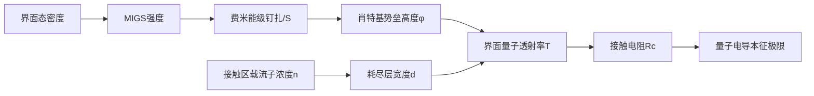

# 二维半导体接触电阻降低方法的统一物理图像：从机制分歧到MIGS抑制与费米能级去钉扎

## 摘要与核心论点

在二维半导体接触工程中，半金属接触、范德华金属、纯金接触、重掺杂、石墨烯插层以及原子层共价键合等表面上彼此独立的低电阻方案，实际上共享同一条物理主线：**通过抑制金属诱导带隙态（MIGS）密度并解除费米能级钉扎（FLP），打破界面态对肖特基势垒的锁定，从而同时压低势垒高度与隧穿宽度。**

该领域长期流行"每种方法各有专属机制、彼此不可通约"的看法。本报告的核心立场是：以单层 MoS₂（二硫化钼，一种过渡金属硫族化合物 TMD）为基准体系，**多数低电阻接触方案皆可被归约到一组共享的界面控制变量，而非彼此孤立的机制**。这一统一框架以 MIGS 密度为核心控制变量。沿此推演，至 2030 年面向亚 1 nm 节点的 p 型接触将收敛于"半金属电极＋范德华解耦＋界面偶极调控"的复合范式。

关键定量节点覆盖从 Bi/MoS₂ 接触电阻约 **123 Ω·μm**（接近量子极限，占器件总电阻不足 5%）到原子层键合接触约 **70 Ω·μm** 等一系列里程碑。

下表预先列出全报告反复回访的实体谱系与统一机制映射，作为后续分析骨架：

| 接触方案 | 代表性 Rc | 主导降阻机制 | 统一机制映射（四类变量） |
|---|---|---|---|
| 半金属铋(Bi) | ≈123 Ω·μm | 半金属低DOS抑制MIGS | MIGS抑制 + 去钉扎 |
| 半金属锑(Sb)/锡(Sn) | 百Ω·μm量级 | 费米能级去钉扎 | 去钉扎 + 透射率 |
| 纯金(Au)范德华 | 洁净欧姆结 | 洁净界面降低界面态 | 去钉扎 + 透射率 |
| 铟/金(In/Au)范德华 | kΩ量级 | 低损伤界面保护 | MIGS抑制 + 透射率 |
| 石墨烯插层 | 缓冲层隔离 | 插层解耦金属波函数 | MIGS抑制 |
| 相工程(1T'/1T) | 钇掺杂欧姆 | 相内金属态高透射 | 透射率 + 去钉扎 |
| 化学/电荷转移掺杂 | 0.86 kΩ·μm级 | 接触区载流子浓度提升 | 掺杂主导 |
| 边缘(end-bonded) | ≈475 Ω·μm | 一维强耦合高透射 | 透射率主导 |
| 二维金属/MXene | 358 μA/μm级 | 功函数匹配+低损伤 | 去钉扎 + MIGS抑制 |
| 拓扑半金属(NiTe₂、PtTe₂) | 理论预测 | 表面态高透射 | 透射率 + MIGS抑制 |

**"统一机制映射"列的几乎所有方案都对应两到三个共享变量的组合，而非单一机制——这正是统一图像得以成立的结构性入口。**

## 研究范围与边界

本报告将焦点严格锁定在**"载流子从金属注入 MoS₂ 半导体的界面过程"**这一物理环节，凡不直接改变该注入过程的因素一律划出范围。三类相邻议题被明确排除：

- **沟道迁移率**：它刻画载流子在沟道体内的本征输运能力，与界面注入分属两个物理环节。TLM 测量逻辑的全部价值正在于把接触贡献与沟道贡献分离。
- **光电应用**：响应度、探测率等指标由光-物质相互作用主导，与暗态电学注入不在同一评价口径上。
- **宏观产业化泛谈**：良率、晶圆级一致性等是机制落地后的工程问题；本报告仅将工艺约束作为各方案"局限"维度的一句话评注。

报告以 **n 型 Rc 降低**为核心议题（现有低电阻方案的实验对象多围绕 n 型沟道），把 p 型接触留作适用边界与反例来检验——这既保住框架的收敛性，又不掩盖其外推时的失效面。

核心论证遵循一条严格的因果链：**方法梳理 → 共通性 → 大一统理论 → 未来方向**。梳理暴露分歧，分歧倒逼共性归约，归约产出统一框架，统一框架再生成可验证的未来预测。

## 统一评价指标体系

跨方案比较的前提，是所有方案均被置于同一套量纲与定义之下。本节发布六个核心指标与一个基准：

**接触电阻的两个层级**：归一化接触电阻 **Rc**（Ω·μm）是按器件宽度归一化的工程量；比接触电阻率 **ρc** 是界面单位面积的本征量。二者并非独立测得，而是同一组 TLM 数据在"工程投影"与"界面本征"两个口径上的读出——TLM 通过总电阻对沟道长度线性回归，截距给出 2Rc、斜率给出方块电阻 Rsh。本报告以 **Rc（Ω·μm）作为跨方案横向比较的主口径**，凡引用 ρc 处均标注其提取假设。

**四个界面参数**（第8章四类共享变量的测量代理）：
- **肖特基势垒高度 SBH（ΦB）**：金属费米能级与半导体导带边的能量差，决定热发射注入的难度。
- **钉扎因子 S**：SBH 对金属功函数的响应灵敏度。S→1 表示 SBH 随功函数线性可调（接近理想极限）；S→0 表示 SBH 被费米能级钉扎，几乎不随金属改变。一个方案是否真正"去钉扎"，操作判据即能否把 S 从接近 0 推向接近 1。
- **界面透射率 T**：Landauer-NEGF 输运图像下载流子穿过界面的量子概率，把金属-半导体轨道杂化耦合强度直接翻译为电导贡献。
- **转移长度 LT**：电流从接触扩展进半导体的特征距离。在二维体系中，电极下方方块电阻因金属接触而改变，会系统性扭曲 LT，进而污染据其反推的 ρc。

**量子接触电阻极限**作为可校准的零点：载流子穿界面的输运由有限数目的导电通道承载，每个通道电导存在量子上限，因此接触电阻存在原理上无法逾越的下限。这一基准使"低接触电阻"从相对说法转变为有标尺的说法——任何方案的 Rc 均可追问"距量子极限还有多远"。它同时是排序的零点与预测的天花板。

## 受控术语表

统一图像的物理词根由四个术语构成：

- **MIGS（金属诱导能隙态）**：金属波函数衰减尾渗入半导体带隙后，在禁带内诱导出的界面态；它俘获并钉住费米能级，是 FLP 的主要物理来源。
- **费米能级钉扎/去钉扎（FLP/depinning）**：钉扎描述 SBH 因 MIGS 或缺陷态而几乎不随功函数改变（S→0）；去钉扎指通过界面工程恢复 SBH 对功函数的响应（S→1）。
- **范德华间隙**：金属与二维半导体之间不形成共价键的物理间隙，从空间上隔离金属波函数、抑制 MIGS。
- **半金属低态密度抑制**：半金属在费米能级附近界面态密度（DOS）很低，可供形成 MIGS 的金属态本就稀少。

**范德华间隙从空间隔离抑制 MIGS，半金属低 DOS 则从源头削减可形成 MIGS 的金属态——二者是抑制 MIGS 的两条互补路径。**

据此把纷繁的独立解释收编进三类机制语汇，作为统一归约的语言准备：
- **去钉扎主导**：把费米能级从钉扎态中解放，使 SBH 重新随功函数可调（如锑半金属接触、纯金洁净界面）。
- **透射率主导**：提高载流子穿越界面的量子概率 T，不必改变 SBH（如相工程、边缘键合接触）。
- **掺杂主导**：提升接触区载流子浓度，使隧穿势垒变薄（如高 k 介质调制掺杂）。

需强调，三类语汇并非互斥：纯金范德华接触既靠空间隔离去钉扎，又依赖间隙隧穿维持透射，常同时跨两类。

---

# 1 接触电阻的物理基础与表征

接触电阻率不是来自材料体相的阻值，而是电流从金属流向半导体时在界面附近遇到的额外阻碍，由界面特性（势垒、界面态、污染等）引起。本章把这一界面阻碍解析为可测量、可调控的物理变量。

## 1.1 接触电阻的组成与可分离性

接触电阻率之所以能被独立提取，根本原因在于它与半导体片电阻在几何依赖上可区分：构造一组接触几何相同、沟道长度不同的电阻器，由总电阻对间距线性回归，截距给出 2Rc、斜率给出 Rsh。**这种"不同长度、相同接触"的几何构造，是把接触电阻当作独立物理对象研究的测量学基础。**

与三维硅器件相比，二维体系中 TLM 分离的结构性复杂之处在于：电极下方片电阻会因金属覆盖而改变，引入传输长度提取的系统误差。接触电阻的分量分解因而既是物理问题，也是测量口径问题。

**载流子注入是接触电阻最关键的分量**。通过在界面附近形成高掺杂层（如 δ 掺杂），可将耗尽区变薄；耗尽区变薄使隧穿概率指数增加，而 SBH 基本不变，因而隧穿电流增强、接触电阻降低。这条"掺杂→窄化宽度→隧穿增强"的路径，正是化学/电荷转移掺杂接触的物理内核，也是四类共通变量中"掺杂"一支的原型。

接触电阻对器件性能的制约，核心体现在开态电流与缩放两条线索上。当接触电阻在器件总电阻中占比过高时，沟道本征迁移率的优势被掩盖，开态电流被接触串联电阻"卡死"。**这一矛盾在沟道缩短时尤为尖锐**：沟道电阻随长度缩小而下降，但接触电阻不随缩放等比下降，于是其权重越来越大，最终主导器件性能。解决方向是把接触电阻压到量子电导本征极限附近，这一可行性已由 Li 等 2023 年在 Nature 上"逼近二维半导体接触量子极限"的工作初步证实。

## 1.2 肖特基势垒：高度决定热发射，宽度决定隧穿

注入电阻由肖特基势垒的两个几何属性共同决定。**当载流子主要靠热能翻越势垒顶时，势垒高度设定需克服的能量台阶；当耗尽区被压薄、载流子直接隧穿穿过时，决定注入效率的就变成势垒宽度而非高度**。

正是这一分工，把降阻方案天然劈成两条主线：**一条设法降低势垒高度（半金属解钉扎路线），另一条设法窄化势垒宽度（重掺杂路线）。**

重掺杂路径的独特之处在于它几乎不触动势垒高度，而是通过剪裁耗尽区把势垒"变窄"。这与半金属路线形成鲜明对照：半金属通过低态密度抑制 MIGS、解除钉扎、压低高度，而重掺杂保持高度不变、仅窄化宽度。重掺杂路径在 n 型 MoS₂ 上有适用性，但把降阻负担压到掺杂剂的激活与稳定上，且过高浓度可能引入额外散射。

**MoS₂ 的 SBH 报道值呈现巨大离散，是层厚依赖、缺陷分布、提取口径三重因素叠加的结果，而非单一误差源**。势垒高度随层数系统变化，意味着不注明层数的 SBH 数值本身就不可直接横向比较。这一离散性正是第7章各方法理论分歧的部分根源——关键参数缺乏统一口径，使不同方案难以在同一标尺上对比。

## 1.3 费米能级钉扎机制

势垒高度之所以难以通过更换金属功函数自由调节，根源在于费米能级钉扎。在理想的肖特基-莫特图像下，势垒高度应随功函数线性变化（S→1）；而在强钉扎极限下，无论换何种金属，势垒高度几乎不随功函数移动（S→0）。

**理想极限与实测的偏离，物理根源在于 MIGS**：金属波函数在界面处不能突然截止，而是指数衰减地渗入半导体带隙，形成一批带隙内的金属诱导能隙态，把费米能级"钉"在带隙内某位置。**钉扎因子偏离 1 的程度，本质上是界面处 MIGS 密度的度量：MIGS 越多，钉扎越强，S 越趋 0。**

标准叙述常把 MoS₂ 描述为强钉扎材料，但近年的计算与实验给出更微妙的"部分钉扎"图像：DFT 模拟显示钉扎程度介于强弱之间的连续态，而 CVD 生长的单层 MoS₂ 呈现"减弱的费米能级钉扎"。**这带来一个反常规判断：钉扎强度并非 MoS₂ 的材料固有常数，而是与生长方式、界面质量密切相关的可变量。** 这一认识是所有"去钉扎"降阻方案得以成立的前提——若钉扎真是不可动摇的常数，半金属抬高 S 的努力便无从谈起。

钉扎对降阻策略的最直接含义，是它限制了"选功函数"这一最朴素降阻思路的有效性。**这里存在一个核心悖论**：理论上选低功函数金属应能降低 n 型 SBH，但实测中换金属收效甚微。悖论的解决不在于继续寻找更低功函数的金属，而在于先把 S 抬高——即抑制 MIGS、解除钉扎，使功函数对齐重新获得作用空间。

**这正是半金属接触的真正价值**：它不是简单选了一个更好的功函数，而是用半金属的低态密度把 S 抬高，让功函数对齐这一杠杆重新生效。

## 1.4 表征方法及其不确定性

接触电阻率与势垒参数的所有数值都来自具体的测量方法，方法之间的口径差异是文献数值难以直接比较的根本原因。

**TLM 与四探针定位不同**：TLM 通过构造电阻器阵列，由截距提取接触电阻、斜率提取片电阻，但其精度受几何与界面合金层影响；四探针主要用于精确测定片电阻而非直接给出接触电阻。把二者数值直接并列比较缺乏口径基础。

即便都用 TLM，不同文献的数值也往往不可直接比较：不同尺寸的 TLM 结构测得值存在显著差异，在二维体系中电极下方片电阻的改变进一步放大这一问题。**这里存在一个方法论张力：文献普遍以"最低接触电阻率"论英雄，但若各家口径不一，"谁更低"的排名就可能失真。** 缓解之道在于测量标准化——统一 TLM 几何、报告载流子浓度与层数、明确测试温度。

表征的价值不止于给出数值，**温度与栅压两个"扫描维度"能反过来充当机制判据**：
- **栅压判据辨钉扎强弱**：无钉扎接触的费米能级能随栅压自由移动，呈现强栅压调制；强钉扎接触的费米能级被 MIGS 钉死，栅压调制微弱。
- **温度判据辨注入模式**：隧穿是量子过程、受热激发影响小，对温度依赖弱；热发射对温度高度敏感。

由此形成一套双判据体系：**温度依赖分辨注入模式（高度瓶颈 vs 宽度瓶颈），栅压依赖分辨钉扎强弱（S→1 vs S→0）。** 这是把"数值排名"升级为"机制识别"的关键。

| 表征方法 | 主要提取量 | 主要误差/口径来源 | 适用定位 |
|---|---|---|---|
| TLM | Rc、ρc、Rsh | 结构几何、电极下片电阻改变、界面合金层 | 接触电阻测量标准方法 |
| 四探针 | 片电阻Rsh为主 | 探针几何在各向异性体系中的系统影响 | 精确测片电阻，非直接给Rc |
| 温度/栅压判据 | 注入模式与钉扎强弱 | 需配合提取，单独不给数值 | 机制识别而非数值排名 |

**本章方法论核心立场**：接触电阻率的数值只有在标注了载流子浓度、层数、测试条件与提取方法之后才具有可比性，而温度与栅压依赖则把表征从"测数值"升级为"辨机制"。

---

# 2 半金属铋(Bi)与锑(Sb)接触

半金属接触是二维半导体降阻路线中最早被证明可逼近量子接触电阻本征极限的方案。其核心论断可一句话概括：**当电极在费米能级处的态密度趋近于零时，MIGS 被抑制，界面接近无势垒简并态，从而把 Rc 压低到约 123 Ω·μm，逼近量子极限。**

## 2.1 半金属铋接触的因果链与实验证据

半金属铋区别于常规金属的根本特征在于其费米能级处态密度趋近于零。常规金属费米面附近态密度高，波函数向禁带渗透形成的 MIGS 会钉住费米能级；半金属则从源头削弱这种渗透。

**因果链的逐级展开**：由于半金属在费米能级处态密度趋近于零，其与半导体接触时导带中的 MIGS 受到显著抑制，进而价带内能隙态被电子填充至饱和，形成无势垒的简并态界面。简并界面将隧穿势垒宽度压缩至约 **1.66 Å**，隧穿电阻率低至 **1.81×10⁻⁹ Ω·cm²**，最终使接触电阻降至约 **123 Ω·μm**、逼近量子极限。

每一环节都是上一环节的物理后果：低 DOS 引发 MIGS 抑制，MIGS 抑制引发能隙态填充饱和，能隙态饱和引发无势垒简并界面，简并界面进而压窄隧穿势垒、压低 Rc。

**与常规金属的对照**：Bi 的差异并非功函数的微调，而是费米面附近可供向禁带渗透的态数目本身被压低。**Bi 路线的降阻并非依靠选择更合适的功函数，而是改变了界面态的生成机制本身**，这正是其能逼近量子极限的根本原因。

实验证据集中体现在三个量上：归一化接触电阻 123 Ω·μm、隧穿势垒宽度 1.66 Å、隧穿电阻率 1.81×10⁻⁹ Ω·cm²。Zielińska 等 2025 年的工作在统一的 MoS₂ 平台上并置 Au 与 Bi 电极，使半金属低 DOS 抑制 MIGS 的预期能够经电学测量检验，而非仅停留在第一性原理预测层面。**逼近量子极限的并非某一次幸运的器件，而是低 DOS 抑制 MIGS 这一机制在可重复测量中的稳定体现。**

**低熔点带来的工程约束**：Bi 的最大短板在于热稳定性——其界面在升温过程中可能发生形貌与电学退化。Wang 等 2024 年通过接触工程改善了 Bi 接触器件的温度稳定性。这里存在明确张力：Bi 在室温下给出最接近量子极限的 Rc，但若界面在集成热预算中退化，室温优势就无法保留到成品器件。将热稳定性纳入接触设计的早期阶段，比在工艺末端补救更有可能保住其优势。

## 2.2 半金属抑制MIGS的理论解释

MIGS 强度受金属费米面附近 DOS 调制：DOS 高，则向禁带延伸的态多、MIGS 强、钉扎严重；DOS 趋零，则可供延伸的态源被釜底抽薪、MIGS 弱、钉扎松弛。半金属的有效性本质上取决于其费米面附近 DOS 能压到多低，这解释了为何 Bi、Sb 这类费米面 DOS 趋零的半金属能成为去钉扎候选材料，而普通低功函数金属却不能。

第一性原理结合非平衡格林函数（NEGF）的输运计算为这一图像提供了机制支撑。ab-initio NEGF 方法将界面电子结构与输运性质统一在同一计算框架下，不仅预测 SBH，还直接给出隧穿透射率与接触电阻。在 Landauer-NEGF 图像下，半金属通过抑制 MIGS 降低 SBH、压窄隧穿势垒，从而提高 T、降低 Rc——这正是 Bi 接触隧穿势垒宽度仅 1.66 Å、Rc 约 123 Ω·μm 的理论对应。**理论与实验的双向校验，是半金属路线区别于纯经验试错的关键。**

## 2.3 半金属锑接触与路线局限

Sb 作为同族半金属，费米能级附近的低态密度特性与 Bi 同源，而在热稳定性方面被指出具有改进潜力。Chou 等 2021 年在 IEDM 上提出锑半金属接触以"增强的热稳定性"为核心卖点，使它在面向集成的器件路线中获得独立地位。

**半金属路线的明确局限是 p 型接触难以复制 n 型成功**。针对 p 型 WSe₂ 的半金属与范德华接触，Yang 等 2023 年专门进行计算筛选，说明 p 型接触不能简单照搬 n 型配方。n/p 非对称的机制根源在于：费米能级去钉扎后的 SBH 仍受能带对齐方向约束——n 型需对齐到导带，p 型需对齐到价带，二者对电极费米能级位置的要求相反。**半金属抑制 MIGS 解决了"是否被界面态锁死"的问题，但"对齐到哪条带"仍取决于能带匹配。** 去钉扎是必要条件，能带对齐方向才决定 n/p 适用性。

**本章综合**：半金属接触之所以能逼近量子极限，根本上靠的是费米能级附近态密度趋零这一单一电子结构特征，它经由"低 DOS→MIGS 抑制→去钉扎→低 SBH→高透射率→低 Rc"的多链因果，把机制优势传导到 123 Ω·μm 的器件数值。半金属路线的价值不在于它是终极方案，而在于它第一次把"抑制界面态以去钉扎"这一中间变量做成了可测量、可计算、可对照的物理量。

| 维度 | 半金属铋(Bi) | 半金属锑(Sb) |
|---|---|---|
| 代表性Rc与条件 | ≈123 Ω·μm，单层MoS₂，隧穿势垒宽1.66 Å | 增强热稳定性，面向高性能2D器件 |
| 主导降阻机制 | 费米面DOS趋零→MIGS抑制→无势垒简并界面 | 半金属低DOS抑制MIGS，同源于Bi |
| 工艺兼容与局限 | 热稳定性需专门接触工程 | 热稳定性增强为卖点，p型与均匀性待解 |

**未决问题**：半金属低 DOS 抑制 MIGS 与范德华间隙隧穿这两种去钉扎机制，在同一界面上究竟相互独立还是部分耦合？这一问题须留待下章对范德华接触的解析共同回答。

---

# 3 范德华金属与纯金接触

范德华路线的降阻逻辑建立在一个极简命题之上：**只要金属与半导体之间不形成化学键，界面处由化学反应产生的缺陷态就会被消除，费米能级钉扎随之减弱**。本章核心结论是：无键合界面能把费米能级钉扎显著拉回，却因范德华间隙对透射率的压制而难以夺得最低接触电阻率。

## 3.1 纯金范德华接触

无键合界面之所以能降阻，第一性原因在于它从源头剪断了化学反应这一缺陷来源。当金属以蒸镀方式直接沉积于 MoS₂ 时，高能金属原子会与硫原子反应、制造硫空位等点缺陷，而范德华界面规避了这一过程。这条降阻链为："消缺陷→降态密度→弱钉扎→降 SBH→降电阻"。

值得强调的是，**这条链条解决的是"外生性"缺陷问题——即由工艺引入、而非金属电子结构固有的缺陷态**。纯金无键合界面把界面态密度的来源从"化学缺陷＋MIGS"简化为近乎只剩 MIGS 这一本征来源。

**范德华间隙是一把双刃剑**：典型 vdW 间隙约 1.4 Å 厚、介电常数约为 2，这层间隙一方面提供解耦、抑制 MIGS，另一方面作为额外隧穿势垒，使电子透射率随间隙宽度指数衰减。由此形成一个无法回避的悖论：**间隙越宽，解耦越充分、MIGS 抑制越彻底，但隧穿透射率也衰减得越快**。这一张力的解决并非取某个极端，而是指向一个非零的最优间隙宽度；一条可能的缓解路径是在间隙中插入高介电常数介质。

纯金还需面对**高功函数与 n 型注入的张力**：弱钉扎使 SBH 重新获得对功函数的可调性，但金的高功函数本身未必处于有利于 n 型注入的位置——**去钉扎恢复了"可调"，却未必恢复了"调到最优"**。这一张力的解决方向明确：去钉扎之后，降阻的下一步不再是继续去钉扎，而是选择功函数与目标载流子类型匹配的金属。纯金范德华接触因此常被用作检验去钉扎机制的"理论样本"。

## 3.2 铟/金(In/Au)范德华接触

In/Au 体系是无键合界面路线中被实验验证得最充分的体系：用 10 nm 厚铟覆以 100 nm 厚金电极，与单层 MoS₂ 形成超洁净范德华接触。软金属铟的低熔点与柔软性，使其在沉积时不会像高能蒸镀的金原子那样轰击并破坏下方硫原子层。

**In/Au 体系的意义不在于夺得最低 Rc，而在于它是无键合界面降阻机制的关键实验判据**：它证明只要避免化学键合，哪怕用常规金属，也能把费米能级钉扎显著拉回。

但 In/Au 同样无法回避范德华间隙对透射率的压制。**In/Au 体系的接触电阻下限并非主要受制于钉扎未解除，而是受制于范德华间隙对透射率的指数压制**。这构成无键合界面路线的根本制约：钉扎问题解决得越干净（间隙越充分），透射率损失就越严重。由此可见，In/Au 体系残余的钉扎，更多地来自 MIGS 这一无法靠"消化学键"消除的本征项，而非来自可消除的化学缺陷。

## 3.3 无键合界面降阻的理论解释

无键合降阻的理论解释围绕三个层层递进的命题展开：

1. **消除化学反应缺陷态**：化学反应缺陷态是制备过程引入的外生态，可靠无键合界面消除；而 MIGS 是金属波函数渗透带来的本征态，只能靠解耦削弱而不能完全消除。无键合路线的第一层贡献，正是把"可消除"的那一类剥离掉。

2. **范德华间隙加速 MIGS 衰减**：间隙使金属与半导体解耦，减少波函数重叠，使金属波函数在带隙内的尾巴更快衰减。WSe₂ 的 DFT 研究证实范德华接触可减少 MIGS 与界面偶极、显著弱化 FLP。

3. **理想肖特基-莫特行为的部分恢复**：钉扎因子 S 从强钉扎区向理想极限回升。这一恢复之所以是"部分"的，正因为残余 MIGS 仍提供有限态密度，使 S 未必精确到达 1。

**由此可见，范德华路线与半金属路线在抑制 MIGS 上走的是不同的物理途径**：范德华路线靠增大间隙、降低界面耦合强度来压制波函数渗透，而半金属路线靠金属本身费米能级附近的低态密度来减少可渗透的态。两条途径压制的是 MIGS 强度表达式中的不同因子。

## 3.4 范德华路线与半金属路线的机制争议

两条路线之间存在一场尚未完全定论的争议：二者抑制 MIGS 的方式，究竟是同一机制的不同表象，还是两条本质不同的路径？

**一种统一观点认为**，MIGS 的强度同时取决于两个因子——金属费米能级附近的态密度与界面处的轨道杂化耦合强度。半金属路线压低前者，范德华路线压低后者。从这个意义上说，两条路线可被纳入同一个"抑制 MIGS"的统一框架，它们只是作用在同一乘积表达式的不同因子上。

**然而从透射率角度看，二者的代价截然不同**：半金属的弱金属化保留了中等耦合，载流子注入不必跨越同等宽度的真空势垒；而范德华路线把耦合压到接近零，却引入了额外的间隙隧穿分量。**"物理隔离"与"低态密度抑制 MIGS"在"抑制 MIGS"这一目标上是同一机制的不同因子，但在"透射率代价"上却是两条分岔的路径**——这正是争议难以简单归一的原因。

范德华路线面临的最核心负面权衡，是增大间隙以抑制 MIGS 的同时会抬高隧穿阻：**它用零耦合换来了低钉扎，却同时换来了低透射**。半金属路线则用中等耦合同时买到较低钉扎与较高透射。这一对比解释了为何范德华接触虽已大幅削弱钉扎，却未必进入最低电阻梯队。

---

# 4 石墨烯插层、相工程与掺杂界面工程

本章覆盖四条在"界面本身动手术"的降阻路线。与前两章"选一个更好的金属"不同，这些方案主动在界面插入第三方材料、改变接触区相结构、或注入电荷改变载流子浓度。它们都在调动四类共通控制变量中的一到三个。

## 4.1 石墨烯插层接触

石墨烯插层是在金属电极与二维半导体之间插入一层石墨烯作为缓冲层。金属/SiC 的第一性原理研究显示：单层石墨烯即可使 SBH 降低，双层时 Ni、Ti 接触体系的 SBH 呈现负值，形成良好欧姆接触。该研究虽以金属/SiC 为对象，但其插层机制对 MoS₂ 体系具有重要的类比与迁移价值。

**石墨烯插层降阻的第一性机制**：石墨烯的 C 原子饱和 SiC 表面悬挂键，减少 MIGS 对界面的影响，进而石墨烯与金属形成的混合相具有较低功函数，使 SBH 降至负值。迁移到 MoS₂ 体系，由于理想 MoS₂ 表面本身无悬挂键，石墨烯的主要作用转为提供物理间隔、抑制金属波函数的直接渗入。

**与半金属铋相比**，二者都指向 MIGS 抑制，但路径迥异：半金属铋靠自身低态密度的"弱金属化"削弱 MIGS，而石墨烯插层靠物理隔离金属与半导体来切断 MIGS 的形成路径。

石墨烯插层区别于固定金属电极的独特能力，是其**功函数可被栅电压调节**，使它同时映射到去钉扎变量上。在需要动态阈值调节的器件场景中，栅控去钉扎提供了固定金属电极无法提供的电学可调维度。

**插层方案面临一个本质性权衡**：插入缓冲层一方面抑制 MIGS、降低 SBH，另一方面又在原本单一界面之外引入新的层间界面。净降阻效果取决于"SBH 降低的收益"与"新增层间界面电阻"的竞争。金属/SiC 的双层负 SBH 结果表明该竞争可朝有利方向解决，但这一结论能否无损迁移到 MoS₂，仍需铜插层双层 MoS₂ 等工作的定量验证。

## 4.2 相工程(1T'/1T-MoS₂)接触

相工程是把接触区的半导体相（2H）诱导为金属性畸变相（1T'），用同质结取代异质界面。由于缺乏直接的 MoS₂ 相工程定量证据，下文以同质结的一般物理为锚点，其证据来自 Sr 掺杂 LaCoO₃/SrTiO₃ 同质结体系，并据此类比推演。

**相工程降阻的核心逻辑是用同质结消除异质界面**：通过相工程构建同晶或同应力的同质结，避免异质界面导致的晶格不匹配和缺陷态，界面态密度降低、费米能级钉扎减弱、电子顺畅穿越，从而实现近欧姆接触。迁移到 MoS₂，2H 半导体相与金属性 1T' 畸变相之间的同质结，原则上同样有助于减少晶格失配与缺陷态，因为界面两侧共享同一套晶格框架。

**与范德华接触相比，相工程走了一条方向相反的路**：范德华接触靠间隙把金属与半导体"拉开"以减弱钉扎，相工程则靠同质结把界面两侧"统一"到同一材料体系、消除异质界面本身。削弱钉扎这一共通目标，既可由"拉开距离"实现，也可由"消除异质性"实现。

相工程面临两个相互纠缠的工程挑战：
- **相边界电阻**：金属性相区与半导体相区之间仍存在一个相边界，载流子必须穿越。高质量的相边界有望把边界电阻压到可忽略，但边界质量不佳时会成为新瓶颈。
- **相稳定性**：金属性 1T' 相通常是亚稳相，在器件工作温度下存在向稳定半导体相回退的热力学驱动力。**与锑半金属接触对比，这一稳定性短板尤为醒目——半金属方案使用本征稳定的半金属材料，而相工程使用的是诱导出的亚稳金属性相。**

**相工程的机制独特性**在于：它以透射率 T 的直接提升为主导，而非以隧穿增强为主导。与掺杂方案对照——掺杂靠窄化耗尽区、增强隧穿来降阻（"让势垒更薄以便穿透"），相工程则靠消除异质界面、让电子顺畅穿越来降阻（"直接抹平势垒本身"）。

## 4.3 化学与电荷转移掺杂接触

化学与电荷转移掺杂通过提高接触区载流子浓度、窄化耗尽区来压低接触电阻。这是所有掺杂路线的共同物理内核：在界面附近形成高掺杂层，耗尽区变薄使隧穿概率指数增加，而 SBH 基本不变。

气相 n 掺杂以电子供体分子（如 TEPA 这类富电子有机胺分子）向半导体注入电子为手段。这些分子吸附到 MoS₂ 表面后把电子转移给半导体，等效于在接触区形成一层高电子浓度区，物理内核与 δ 掺杂一致：通过提高接触区载流子浓度窄化势垒宽度，定量目标是把接触电阻压到 kΩ·μm 量级。

---

# 5 各方法独立理论解释的分歧

低电阻接触领域长期缺乏统一方向，根源不在于实验数据稀缺，而在于每一类低电阻结果都被挂靠到一套各自独立、彼此难以通约的理论叙事之上。**本章要证明：这种解释的多元并非互补，而是同一批可观测后果在不同理论语言下的重复命名。**

## 5.1 解释体系的多元罗列

并置六类解释的直接收获，是看清它们分处结果层、机制层、工程层三个因果层级，且证据强度极不均衡：

| 解释类别 | 因果层级 | 有效域 | 证据强弱 | 映射的共享变量 |
|---|---|---|---|---|
| SBH降低 | 结果层 | 全部接触 | 数值丰富但不可判别机制 | ΦB（结果量） |
| 去钉扎 | 中介层 | 强钉扎体系 | 中等 | 钉扎因子S |
| MIGS减少 | 机制层 | 化学键合接触 | 与缺陷模型重叠，难判别 | MIGS抑制 |
| 缺陷消除 | 机制层 | 缺陷主导界面 | 与MIGS模型重叠，难判别 | MIGS抑制/去钉扎 |
| 掺杂 | 工程层 | 可控载流子浓度 | 强、链条清晰 | 接触区载流子浓度 |
| 相变(2H/1T') | 工程层 | 相可调TMD | 强但工艺受限 | 界面量子透射率T |

## 5.2 FLP起源之争

费米能级钉扎的物理起源，是六类解释中"MIGS减少"与"缺陷消除"两派的分水岭——前者归因于 MIGS 这一本征效应，后者指向界面缺陷态这一外因。

**MIGS 主导图景**：金属波函数在禁带能量内指数衰减渗入半导体，界面附近的电荷中性点决定费米能级的钉扎位置。**缺陷主导图景**：缺陷形成能与费米能级位置耦合，钉扎位置由界面缺陷的能级分布决定。

二维体系的引入增添了一个尖锐反例：npj 2D Materials and Applications (2022) 对单层 MoS₂/Au 接触极性的 GW 多体微扰计算给出 **p 型接触**，与文献常见的 n 型表述形成张力。相较于纯 MIGS 图景预期的"弱渗入→弱钉扎→极性随功函数连续可调"，这一 p 型结论提示界面电荷转移与轨道杂化的细节可能压过简单的波函数渗入图景。

**"部分费米能级钉扎"的非常规之处，正在于它将钉扎从二元开关改写为连续谱**。Gong 等的 DFT 工作指认了这种界面依赖的中间态：界面行为既未落于完全钉扎（S→0），亦未处于完全解钉（S→1）。由此可得一条可验证推论：若 S 确为界面化学键强度的连续函数，则在范德华型与化学键合型接触之间应可观测到 S 的系统性梯度，而非两类离散的钉扎值。

**本征与外因之争的实验判别困难**，根源在于 MIGS 模型与缺陷模型对常规电学测量给出的拟合质量往往难分高下。两套图景均能解释同一组 ΦB 数据，意味着仅凭 ΦB 的提取值无法反推钉扎的物理起源。**未来更具判别力的实验应转向极性、微扰响应等对 MIGS 与缺陷的不同后果敏感的可观测量**，而非继续累积 ΦB 数值。

## 5.3 载流子注入机制不明确

即便钉扎图景被部分厘清，载流子从金属注入二维半导体的具体输运机制——热发射、隧穿及二者权重——仍存在显著争议。

注入机制不明晰的工程后果，在于它直接界定接触电阻的可达下限：**若注入以热发射为主，则势垒高度 ΦB 主导电阻；若以隧穿为主，则势垒宽度主导电阻**。两种主导机制对应两套截然不同的降阻策略，而文献尚未就二者权重形成共识，使"该往哪个方向努力"这一最基本的工程判断悬而未决。

热发射与隧穿的相对权重随温度、栅压、层数与势垒形状而变。在多层 TMD 中，除界面势垒外还叠加层间电阻与体相输运，致使提取的有效 ΦB 不再对应单一界面过程——所谓 ΦB 随厚度变化，恰恰说明"势垒高度"混入了与层数相关的输运贡献。

**SBH 报道值的样品间离散，是注入机制不明在数据层的可见症候**。从温度依赖输运曲线提取 ΦB 须对注入机制作先验假设，而该假设本身存疑；于是不同课题组在不同假设下提取的 ΦB 自然彼此不可比。**SBH 报道值的离散并非测量精度问题，而是缺乏统一定量框架的表征。** 更有累积价值的做法，是用机制无关的界面透射率 T 取代机制依赖的 ΦB 作为公共标尺。

## 5.4 物理机制与工程手段的混淆

在机制层与定量层双重不确定的背景中，文献系统性地将物理机制与工程手段混为一谈，最典型的误用便是把"掺杂窄化势垒"当作一种"去钉扎机制"。

混淆的后果是评估标准的错位：**当一篇报道同时声称"极低 Rc"与"机制新颖"时，读者往往无法分辨该方案的低电阻是源于机制突破还是源于特定不可复现的工艺窗口**。更严谨的评估应把"逼近量子极限到何种程度"（机制量）与"在何种工艺窗口内可复现"（可制造性）拆解为两个独立坐标。

解释碎片化导致领域无统一方向的因果链清晰：解释各自独立造成公共标尺缺失，公共标尺缺失使不同方案的低电阻结果无法相互比较，无法比较又使领域无从判断"哪条路径更接近本征极限、更值得投入"，最终导致研究方向的弥散。**领域无统一方向的真正症结，并非方案太少，而在于缺少一套能将各方案映射到共享控制变量上的统一语言。**

本报告所持立场是：二维接触领域的碎片化已越过有益的探索期，进入有害的累积障碍期。其判据在于——各方案的低电阻结果已足够丰富，却仍无法跨方案比较。当数据充裕而标尺缺失，碎片化便从探索动力转变为进步阻力。

---

# 6 共通机制提炼：四类共享控制变量

各方案在物理量层面反复指向同一组参数，可归并为四个共享控制变量：**有效注入势垒、费米能级去钉扎与 MIGS 抑制、界面量子透射率 T、接触区载流子浓度**。本章在论述中始终把物理机制（去钉扎、提透射）与工程手段（掺杂窄势垒）作显式区分。

## 6.1 变量一：有效注入势垒（高度×宽度）

无论叙事如何不同，方案最终都归结为"降低 SBH"或"窄化势垒宽度"两条路径之一。**半金属抑制 MIGS、原子层键合降低有效势垒，这些被独立命名的机制，在"有效注入势垒"这一复合变量上是同构的——它们都在压低指数因子中的 φ。** 北京科技大学的原子层键合接触研究即通过去除界面活性硫原子、形成金属与半导体的原子层共价键，实现强轨道杂化与高键合强度，把接触电阻降至约 70 Ω·μm。

**关键方法论区分**：降高度路径通过重构界面能带对齐（改变 φ）起作用，属于物理机制；窄宽度路径通过外加载流子改变耗尽层空间分布（改变 d）起作用，更接近工程手段——把后者误称为"去钉扎"是本领域常见的概念混淆。

| 方案 | 主导路径 | 作用因子 | 机制/手段属性 |
|---|---|---|---|
| 半金属铋接触 | 降高度 | φ（MIGS抑制） | 物理机制 |
| 原子层键合接触 | 降高度 | φ（轨道杂化） | 物理机制 |
| 纯金范德华接触 | 降高度 | φ（弱钉扎） | 物理机制 |
| 固态掺杂/插层 | 窄宽度 | d（提n压薄耗尽层） | 工程手段 |
| 化学/电荷转移掺杂 | 窄宽度 | d（局域费米能级移动） | 工程手段 |

有效注入势垒变量的工程化，可能朝"双压制"方向演进——即同时压低 φ 与 d。在强钉扎界面上，"窄宽度"路径相对独立有效；在已去钉扎界面上，"降高度"路径才能充分发挥。原子层键合界面可获得高达 400℃ 的热机械稳定性，为双压制路径提供了热稳定性可行性参考。

## 6.2 变量二：费米能级去钉扎与MIGS抑制

削弱 MIGS 有三条被独立命名却物理同源的路径：

1. **低态密度金属路径**：半金属铋费米能级处态密度趋近于零，可显著抑制导带 MIGS。**半金属的低 DOS 并非附带特征，而是抑制 MIGS、解除钉扎、逼近量子极限的物理引擎。**
2. **范德华间隙路径**：范德华接触引入物理隔离，弱化界面强键合，使 MIGS 密度下降、钉扎减弱。
3. **悬空键钝化路径**：高浓度 HF 钝化消除界面悬空键，降低界面态密度从而减轻钉扎。

**低 DOS 金属、范德华间隙与界面钝化，是对 MIGS 这同一物理对象从三个角度施加的抑制——它们的统一靶点是界面态密度。** MIGS 被抑制是 SBH 得以被金属功函数调制的微观原因。

## 6.3 变量三：界面量子透射率T

界面量子透射率 T 在 Landauer-NEGF 输运图像中决定单通道的注入概率，而键合度、间隙宽度与轨道杂化都通过 T 这一出口影响接触电阻。在 NEGF 框架内，接触电阻由透射函数对能量的积分决定，因此任何提高 T 的路径都直接转化为降阻。

不同方法的 T 提升入口各异：

| 方法 | T提升入口 | 作用变量 |
|---|---|---|
| 半金属铋接触 | 消除势垒（简并界面） | φ→0, d≈1.66 Å |
| 原子层键合接触 | 强轨道杂化耦合 | φ降低、散射减少 |
| 范德华/纯金接触 | 弱钉扎压低φ | φ降低（代价为d） |
| 铜插层接触 | 压薄耗尽层 | d缩短 |
| HF钝化去钉扎 | 降态密度提S | φ降低（S上升） |

**尽管入口各异，所有方法的最终落点都是 T 的提升；T 因此成为比 ΦB 或 S 更下游、也更具综合性的统摄变量。** ΦB（高度）与去钉扎（S）都是经由 T 这一出口才转化为接触电阻的下降。

## 6.4 变量四：接触区载流子浓度

掺杂、相变与电荷转移三类手段表面上互不相同，却都通过提高接触区载流子浓度 n 来起作用，且 n 与隧穿宽度 d 之间存在直接耦合——n 升高压薄耗尽层、缩短隧穿距离。

## 6.5 四变量到Rc的统一因果网络

把四变量连成一张统一因果网络。其拓扑结构是：界面态密度（受低 DOS 金属、范德华间隙、钝化、插层共同削弱）控制 MIGS 强度；MIGS 抑制同时降低 ΦB（经去钉扎、S 上升）并参与提升 T；接触区载流子浓度 n（受掺杂、相变、电荷转移共同抬高）经压薄耗尽层缩短 d，d 与 ΦB 一同进入透射率 T 的指数因子；T 最终决定 Rc。下游硬约束在于材料本身——当单通道 T 趋近 1 后，可用通道数受能带结构约束，Rc 逼近量子电导本征极限。

**这张网络对全文核心问题给出明确回答**：降阻方法确实存在共通之处——半金属、范德华金属、石墨烯插层、相工程与化学掺杂，虽各有独立叙事，却都可被定位到"压低界面态密度/MIGS（→降 φ、提 S）"与"提高接触区 n（→压 d）"两组操作上，二者经由透射率 T 这一共同出口汇入 Rc。网络中物理机制（左侧：态密度→MIGS→S→φ）与工程手段（右侧：n→d）是两条可解耦的输入支路，仅在 T 处合流。

---

# 7 统一框架的构建与映射

## 7.1 以透射率T为核心序参量的隧穿图像

把界面量子透射率 T 选作序参量，理由来自直接隧穿模型本身。直接隧穿电流正比于一个指数因子，电子透射率 T 呈 **exp(−2d√(2mqφ)/ħ)** 形式，随势垒宽度 d 与势垒高度 φ 的乘积指数衰减。**这一表达式把界面键合强度、范德华间隙宽度与轨道杂化程度这三个看似不同的物理量，统一压缩进 d 与 φ 两个参数之中。**

把 T 选为序参量，与仅盯住 SBH 的传统判据形成对照：**一个仅以 SBH 分类的框架无法区分那些 SBH 相近、但因范德华间隙宽度不同而透射率迥异的接触**——这正是把序参量从 SBH 上移到 T 的动因。MIGS 密度影响 φ、掺杂浓度影响 d、轨道杂化影响 φ，它们最终都落在 T 这一个量上。**T 不是四类变量之外的第五者，而是四类变量共同汇聚的下游枢纽。**

基于隧穿表达式，归一化接触电阻可近似表述为 **Rc ∝ (接触区 n)⁻¹·T⁻¹**，其中 T 本身又是 (d,φ) 的指数函数。这个统一表达式显式区分了"提高 n"与"抬升单通道 T"两条路径，从而解释了为何掺杂与半金属可以叠加而非互斥。HF 钝化实验给出的因果链"界态→φ→T→Rc"，正是这个函数形式最直接的实验注脚。

## 7.2 去钉扎作为提升T的上游开关

在四类变量中，费米能级去钉扎占据一个特殊的上游位置：它不是与 T 并列的另一个调节量，而是决定 T 能否被有效抬升的总开关。**去钉扎本身不直接"降电阻"，它是通过解放 φ 的可调性、间接打开 T 的上升空间来起作用的**。

去钉扎作为上游开关的地位，可从一个工程张力中看出：**若钉扎未被解除，单纯提高掺杂浓度 n 会遇到瓶颈**。当 MIGS 密度仍高、φ 被钉死时，提高 n 只能缩窄势垒宽度 d、却无法压低 φ，T 因而被限制在一个由钉扎设定的低平台上。化解之道是先用范德华或半金属路径把 MIGS 密度压下来、把 S 抬上去，再叠加掺杂。

**四类变量具有明确的层级结构：去钉扎在上、T 在中、Rc 在下**，这种层级性正是"大一统"成立的前提。

## 7.3 各方法在统一框架中的映射

谱系方法可归并为三条主干分支，每条分支都显式映射到四类变量中的一到两个，并最终汇入 T：

| 分支 | 代表方法 | 主导上游变量 | 对T的传导路径 |
|---|---|---|---|
| 分支一 | 半金属/范德华/石墨烯插层 | MIGS密度 | MIGS↓→S↑→φ↓→T↑ |
| 分支二 | 掺杂/相工程 | 载流子浓度n | n↑/d↓→T↑（双路） |
| 分支三 | 边缘端键合 | 轨道杂化 | 杂化↑→φ↓→T↑ |

**分支一**（半金属/范德华/石墨烯）的共同作用点是抑制 MIGS 密度。半金属的"弱金属化"意味着金属波函数渗透较弱、注入的 MIGS 较稀疏，这与范德华路径抑制 MIGS 方向一致。三者虽形态各异，却共用同一条"MIGS↓→S↑→φ↓→T↑"的传导路径。

**分支二**（掺杂/相变）"双管齐下"：提高 n 直接进入分母增加导电通道数，高 n 又使耗尽区变薄、d 变窄抬升隧穿率。钇掺杂相变方案的独特之处，在于它把"提 n"与"消除势垒"合并在同一晶圆集成工艺里。

**分支三**（边缘端键合）反而主动增强耦合，但把耦合限制在边缘原子键上：在二维材料边缘形成强共价键，使边缘处轨道杂化充分、局部 φ 显著降低，从而在不破坏沟道区面内电子结构的前提下打开低势垒注入通道。**这条链与分支一方向相反却殊途同归：前者靠弱耦合降 MIGS 解放 φ，后者靠强耦合增杂化降 φ，两条路径最终都落在 φ↓→T↑ 这一共同出口上。**

**这张映射表的结构性含义在于：谱系中看似互不相关的方法，实则只占据三个上游入口，而非无穷多个独立机制。**

## 7.4 统一框架对争议的消解

**争议一："物理隔离"与"低 DOS"之争**。统一框架的回答是：二者是同一件事的两种说法，本质都是抑制注入半导体能隙的 MIGS 密度。"物理隔离"描述范德华间隙在空间上阻断金属波函数渗透，"低 DOS"描述半金属在能量上缺少可供渗透的态——两者分别从空间与能量两个角度描述同一个结果。它们不是互斥的两种机制，而是同一机制的两个必要条件。

需保留一个反方观点：WSe₂ 研究同时指出 SBH 呈现明显的层数依赖，提示界面偶极与层数相关的静电项也在 SBH 中占一定份额——单纯用 MIGS 密度无法解释层数依赖这一项。框架在 MIGS 之外还需保留一个界面偶极修正项。

**争议二：掺杂与去钉扎之争**。统一框架的消解方式不是判定谁对，而是指出二者在 T-n 平面上正交。把 Rc ∝ n⁻¹·T⁻¹ 展开看：提高 n 主要沿 n 轴移动，去钉扎主要沿 T 轴移动，可以同时进行。但正交不等于完全独立：当钉扎很强时，沿 n 轴的移动会被限幅——即便提高 n 压窄了 d，T 的提升仍受 φ 钳制。"正交"是一阶近似，去钉扎仍保有上游地位。

**争议三：为何形式不同却殊途同归**。形式差异来自上游入口不同，殊途同归来自下游出口共享。半金属从 MIGS 入口进，掺杂从 n 入口进，边缘从轨道杂化入口进，但三者的因果链最终都汇到"T↑→Rc↓"这一共同出口。统一框架不以"耦合强弱"这种表面特征分类，而以"是否最终抬升 T"这一下游判据统摄全部，从而把方向相反的方法纳入同一解释。

**需指出"殊途同归"的边界**：它在"降阻"结果层面成立，却不意味着各方法在工程代价上等价。不同入口带来的热稳定性、CMOS 兼容性代价截然不同。化解办法是把统一框架限定在"降阻机制"层面，把"工程可行性"作为正交的第二维度单独评估。

**领域长期的解释分歧，多数不是真正的机制对立，而是同一机制在不同观察角度下的投影。**

---

# 8 统一理论的适用边界、反例与工程权衡

统一框架必须同时说明它在哪些材料、极性、几何下失效，否则就退化为事后叙述。**本章核心结论是：统一透射率图像在 n 型 MoS₂ 顶接触这一窗口内解释力最强，但在 p 型接触、边缘接触、纯掺杂路径与相边界输运四个方向上出现系统性偏离。** 这些偏离不是对框架的否定，而是对其适用范围的精确刻画——正是这种刻画，把一个"无所不包"的叙述转化为可证伪的科学命题。

## 8.1 材料与接触类型边界

**跨 TMD 外推时钉扎因子并非常数**。WSe₂/金属界面的 SBH 呈现明确的层数依赖，把"S 是材料常数"这一假定从 MoS₂ 直接搬到 WSe₂ 多层体系，是最容易失效的外推之一。**统一框架给出的是定性方向（减少 MIGS→弱化钉扎→压低 SBH），而定量系数必须逐材料标定。** 展望未来，统一图像有望从单一常数 S 升级为"S(材料,层数)"的函数形式。

**单层与多层透射率权重不同**。在单层体系中，接触电阻几乎完全由界面注入主导；在多层体系中，电流需额外穿越层间范德华间隙，层间电阻成为不可忽略的串联分量。统一图像在多层体系上的正确用法，是把它限定为界面注入分量的描述，而非整个接触电阻的描述。

**半金属向拓扑半金属外推时维度变化**。常规半金属 Bi 降阻主要落在 MIGS 抑制与 SBH 压低；而 II 型外尔半金属因其倾斜能带结构，费米面附近态密度分布与狄拉克型不同，对 MIGS 的抑制能力需单独评估。**"半金属低态密度抑制 MIGS"这一变量，在从简单半金属外推到拓扑半金属时，从一个标量属性变成依赖能带拓扑的张量属性。**

## 8.2 n型成功难以复制到p型接触

p 型接触是统一图像最显著的适用边界之一。**p 型接触的核心张力在于：器件同时需要高功函数（以对齐价带顶）与少 MIGS（以避免钉扎），而这两个目标在金属材料选择空间中难以同时满足**。高功函数金属往往与半导体形成更强的界面相互作用、引入额外 MIGS。当前解法是范德华接触——通过物理分离金属与半导体来解耦合"高功函数"与"强杂化"，其约束是范德华间隙会同时削弱透射率 T。

**统一图像在 n 型上之所以解释顺畅，是因为其四类控制变量在该极性下方向大体协同；而在 p 型上，变量间的方向性张力被放大。**

一个极具挑战性的事实是 **MoS₂/Au 极性反转**：GW 多体微扰理论计算给出单层 MoS₂/Au 实际是 p 型接触，与较简单方法的 n 型预言相反。这一极性反转对统一图像构成双重挑战：层数依赖至少是连续变化的，可用函数 S(层数) 容纳；而极性反转是离散跳变，连续变量框架难以自然容纳。**这提示统一图像在 p 型/n 型判定边界附近，必须引入 GW 级别的能带对齐，否则对接触极性的预言会失去定性可靠性。**

## 8.3 顶接触与边缘接触统一性的局限

统一透射率图像以范德华间隙隧穿为枢纽，这一枢纽设定本身暗含一个几何假定：电子注入路径经过顶部范德华界面。边缘接触从根本上改变这一几何。

在顶接触中，电子注入需克服范德华间隙；而边缘接触通过沟道边缘的悬挂键形成化学键合，注入路径的键合性质从范德华耦合转为共价耦合。**统一图像里以范德华间隙隧穿为枢纽的透射率表达式，在边缘接触上需要替换为另一套以共价键耦合为枢纽的输运描述。**

两类几何下 MIGS 角色也不同：顶接触中 MIGS 沿整个二维界面分布，边缘接触中 MIGS 的分布维度从二维降为一维。**统一图像把顶接触与边缘接触纳入同一变量框架时，必须对 MIGS 密度变量做几何归一化，否则两类接触的钉扎强度无法在同一标尺上比较。**

## 8.4 潜在反例与机制偏离

**反例一：纯掺杂路径 Rc 下降但 S 未改善**。重掺杂抬高接触区载流子浓度，压窄耗尽层、缩短隧穿距离，但这一因果链全程不涉及 MIGS 密度，因此钉扎因子 S 在原理上可以保持不变。**这证明统一图像不是"四变量联动"的强假设，而是"四变量张成解空间"的弱假设**——载流子浓度维度可以正交于钉扎维度独立移动。其约束是纯掺杂降阻虽能降 Rc，但因未触及钉扎而无法逼近量子极限。

**反例二：范德华间隙增大隧穿阻抵消提 T**。范德华间隙宽度沿两条方向相反的因果链传播：间隙增大削弱杂化、减少 MIGS、压低 SBH（降阻），但同一个增大的间隙又拉长隧穿距离、降低 T（升阻）。**范德华间隙宽度是统一图像中唯一一个同时沿正负两个方向影响接触电阻的变量**，可能存在一个净接触电阻率的最优间隙窗口。这也解释了半金属与范德华接触对间隙变量的敏感度不同——半金属降阻主要靠压低势垒，范德华接触降阻主要靠平衡钉扎与透射。

**反例三：相工程相边界电阻偏离透射率图像**。相工程从几何上取消了统一图像赖以立足的金属-半导体界面：钇掺杂相变欧姆接触不再来自"优化金属/半导体界面的透射率"，而是来自"在同一 TMD 内部建立金属相与半导体相之间的相边界"。**相工程接触是统一图像的边界而非内点：它不违背统一图像，而是位于统一图像适用域之外的另一类降阻范式**，相边界电阻由相间能带对齐而非 MIGS 主导。

| 材料/类型边界 | 统一图像的退化形式 | 主要证据 |
|---|---|---|
| 跨TMD外推 | S从材料常数退化为S(材料,层数) | WSe₂层数依赖SBH |
| 单层→多层 | T从主导项退化为与层间电阻叠加 | 单层注入主导图像 |
| n型→p型 | 变量方向从协同转为张力 | p型WSe₂接触筛选 |
| 极性临界 | 连续变量框架难容离散极性反转 | MoS₂/Au GW极性翻转 |
| 顶→边缘 | 透射率枢纽需替换为共价耦合描述 | 两类几何差异综述 |

---

# 9 未来发展方向与可验证预测

四类共通变量一旦被确立为共享坐标轴，最有价值的用途便不再是回溯解释，而是前瞻预测。**本章核心论点是：统一图像把"找新材料"转化为一组可量化的筛选判据、一份可证伪的实验预测清单，以及一条可与硅基/III-V及拓扑材料外部校准的发展路径。**

## 9.1 机制成熟度分层

四类变量在工程成熟度上并不均齐。判断成熟度的标尺为单一指标的可重复性叠加 CMOS 后道兼容性，而非单点最低 Rc 纪录。

**成熟：半金属 MIGS 抑制 n 型接触**。半金属铋对单层 MoS₂ 的 n 型接触，机制最清晰、数据可重复性最高、最接近量产门槛。归一化 Rc 低至约 123 Ω·μm，Su 等 2022 年以"弱金属化"构建了系统理论框架。**这一档被判定为"成熟"，并非依赖单点纪录，而是因其物理根源、Rc 值与晶圆级工艺三者已获独立小组交叉印证。** 其最大短板在于热稳定性：标准后道 400℃ 退火会破坏铋接触形貌。展望 2027 年前后，工程焦点将从"刷新最低 Rc"转向"在 400℃ 热预算内将 Rc 稳定保持在 200 Ω·μm 以下"。

**开放：p 型接触与可集成去钉扎**。**p 型难题的核心矛盾在于：实现 p 型欧姆接触需要高功函数金属，而高功函数金属往往同时诱导强 MIGS 与强钉扎。** 近两年已出现若干突破：Au/Se 界面层将 p 型 WSe₂ 接触电阻降至 540 Ω·μm；金属碲路线对 MoTe₂ 实现 1.6 kΩ·µm 的 p 型接触；Nb₀.₃W₀.₇Se₂ 金属层接触使单层/双层 WSe₂ 开态电流密度分别达 358 µA·µm⁻¹ 与 1.1 mA·µm⁻¹。**p 型接触的瓶颈已从"能不能做出来"转向"哪条路线能在 CMOS 后道兼容条件下稳定复现"。**

可集成去钉扎的难点不在原理，而在"可集成"——插入隧穿层会引入额外串联电阻，去钉扎收益必须超过隧穿势垒带来的 T 损失。

**结构性判断**：技术成熟度梯度与四类控制变量高度对应——已工程化的"MIGS 抑制"（n 型半金属）最成熟，"去钉扎"在范德华路线上部分成熟、在 p 型路线上仍属开放。**该领域未来的边际投入应优先压在"去钉扎的可集成化"与"p 型路线的可复现化"两个开放节点上。**

## 9.2 材料与界面设计方向

**高透射率材料的筛选判据**：费米能级附近 DOS 要足够低以抑制 MIGS，同时面内电导要足够高以避免额外串联电阻。**这两条判据在拓扑半金属体系中天然统一**：狄拉克/外尔半金属在费米面附近 DOS 趋零，却保有极高面内迁移率。单层狄拉克半金属 FeB₂ 电极兼具高面内电导、界面弱金属化与栅压/应变可调功函数；PtBi₂ 作为 WS₂ 范德华接触插层实现超过 10⁶ 的开关比。**与常规半金属铋相比，拓扑半金属的独特之处在于其低 DOS 由能带拓扑保护、而非偶然的能带闭合，因此对界面无序与温度的鲁棒性原则上更强。**

**面向 2028 年的可量化筛选判据**：优先级应给予费米面附近 DOS 落在最低三分之一区间、且面内电导率高于多数层状金属的拓扑半金属候选；FeB₂、PtBi₂、NiTe₂、PtTe₂ 构成首批筛选名单。

**可控范德华间隙与栅控去钉扎**：核心命题是通过栅压调制接触区能带弯曲与有效隧穿势垒，使同一物理结构在不同偏置下分别优化 n 型与 p 型注入。栅控去钉扎把"接触区载流子浓度"与"透射率 T"两个本来分属材料端与界面端的控制变量，用一个栅极统一起来。化解工艺复杂度与良率张力之道，是把去钉扎功能整合进已有的双栅或环栅器件架构，使去钉扎栅"搭便车"于既有的多栅集成流程。

## 9.3 工艺与集成方向

**二维接触的工程瓶颈正从"实验室能否实现低 Rc"系统性迁移至"能否在低损伤、低温且可标准化表征的产线条件下复现低 Rc"。**

**低损伤无污染沉积**是直接决定接触机制能否兑现的前提：传统蒸发/溅射诱发的缺陷本身就是额外的 MIGS 与钉扎中心。晶圆级范德华金属集成采用可热分解聚合物作为缓冲层，使多种金属在不损伤底层沟道的前提下直接沉积。**限域封装**则应对半金属的热不稳定：以 AlOₓ 或 TiN 层封装 Bi 或 Sb 接触可抑制团聚与蒸发，使 Rc 在 400℃ 退火后仍低于 200 Ω·μm。**原子层键合（ALB）**将温和与稳定统一在同一道工序中：MoS₂ 原子层键合接触 Rc 低至 70 Ω·μm、热稳定性达 400℃，根源在于 ALB 在原子尺度形成定向键合，而非随机团聚界面。

**CMOS 后道兼容（低温热预算）**成为筛选可集成路线的硬性门槛。二维接触相对硅基的一个潜在优势是：电荷转移掺杂无需高温激活，载流子转移在室温即可发生，天然契合低温热预算。**展望 2028 年前后，CMOS 后道兼容将从"加分项"变为"准入门槛"：任何无法在约 400℃ 热预算内稳定复现低 Rc 的方案，无论其实验室纪录多低，都将被排除在量产路线图之外。**

## 9.4 从统一框架导出的可验证预测

一个统一理论的价值最终系于其可证伪性。本节导出三组可由现有表征手段直接证伪的实验预测：

| 预测 | 核心断言 | 预期观测 | 证伪条件 |
|---|---|---|---|
| 预测一 | 低费米面DOS→低S+低Rc | S随DOS降低单调上升 | 低DOS却强钉扎高Rc |
| 预测二 | T主导接触有特定温度/栅压签名 | Rc弱温度依赖+强栅压调制 | 隧穿主导却强温度依赖 |
| 预测三 | 四变量满足→趋近量子极限 | 清单内组合Rc逼近本征极限 | 清单组合无法逼近极限 |

**预测三是一份可证伪的材料组合清单**：同时满足"费米面低 DOS + 宽窗口去钉扎 + 高透射率 T + 高接触区载流子浓度"四项条件的材料组合，其 Rc 应能趋近量子电导本征极限（每个传导通道电导上限约 77.5 µS）。首批候选包括：Bi-Sb 合金拓扑绝缘体对 MoS₂、原子层键合 MoS₂ 接触（Rc 70 Ω·μm）、PtBi₂ 对 WS₂、FeB₂ 对 MoS₂/WSe₂。若清单内任一组合在标准化表征下无法趋近量子极限，则四变量联合判据需修正。

边缘接触为这份清单提供机制上的极端案例：Hf₂C/HfSe₂ 原子级锐利边缘接触得到近零 SBH（≈5 meV）与 ≈475 Ω·μm 的 Rc。**边缘接触的意义在于它从拓扑结构上（线接触而非面接触）最小化了 MIGS 生成面积，扩展了量子极限清单的"结构维度"，而不仅是"材料维度"。**

**这正是统一框架区别于碎片化事后解释的根本所在：它做出了可被未来实验推翻的前瞻断言。**

## 9.5 跨领域校准

统一图像若要立得住，须能与外部成熟领域的经验对接。

**与硅基/III-V 经验类比**：硅基 CMOS 在过去数十年发展出"重掺杂+界面工程"降阻范式，其核心逻辑与"接触区载流子浓度"变量高度同构——通过极高浓度掺杂压窄隧穿势垒，使热发射注入转为隧穿注入。硅基长期面临费米钉扎，工程上用极薄绝缘层（MIS 接触）来缓解——这与二维领域用范德华间隙或氧化层隧穿势垒去钉扎在物理上同源。**二维去钉扎并非全新发明，而是对硅基数十年 MIS 经验的二维化复用**，这为二维去钉扎路线的工程成熟度提供了外部信心。硅基先进集成正系统性向低温迁移（≤250℃ 无空洞 Cu/介质混合键合），证明二维接触的低温化不是孤立要求，而是与整个先进集成低温化大势同向。

---

# 10 统一框架的局限与适用边界

统一理论框架的价值不仅取决于它能解释多少已知方案，更取决于它在何处失效、能被何种实验推翻。**本章核心主张是：跨方案的 Rc 对比受限于口径与测量条件的不统一，而统一图像的四变量映射必须被设计成可证伪，否则它就退化为事后叙事。**

## 10.1 数据粒度局限

**Rc 口径与提取方法差异**构成跨文献比较的根本障碍。同一套 TLM 原理，在二维材料器件上会因电极下方方块电阻的改变而引入系统性偏差：金属接触改变电极下方块电阻，破坏了截距外推所依赖的均匀沟道假设，进而使提取出的转移长度与接触电阻率同时失真。当界面存在合金化层时，提取结果还需额外修正。此外，以线宽归一的 Ω·μm 量与以面积归一的 ρc 不加区分地并列，跨文献对比就潜伏着量纲层面的不可通约。**当方案谱系把不同方案的 Rc 并列时，读者无法从表面数值区分哪些差异来自真实物理、哪些来自 TLM 几何、合金化层或电极下方块电阻变化这三类提取假象。**

**缺乏统一温度与载流子浓度归一**进一步削弱可比性。同一材料体系的 Rc 可随接触区载流子浓度大幅移动；若两篇论文分别在高掺杂与低掺杂下报告 Rc 而未折算到统一基准，则二者对比无法分辨"方案差异"与"掺杂差异"。**统一框架内部，透射率 T 本应是跨方案最可比的物理量，但它在实验上不被直接测量，只能由 Rc 连同对 SBH、载流子浓度的假设反推**——当这些反推所依赖的条件在文献间各异时，同一名义下的 T 就失去可比性。到 2028 年前后，若领域能就"统一温度-浓度报告协议"形成共识，统一框架的定量检验才具备可操作性。

## 10.2 范围上限局限

**统一框架的论证主体建立在 n 型 MoS₂ 这一模型体系上**，结论外推时必须声明边界。

**p 型与其他 TMD 覆盖有限**。p 型接触触及一个实质性物理反常：单层 MoS₂ 置于 Au 上时按 GW 计算构成 p 型接触，与常见预期相反。n 型与 p 型 SBH 满足互补关系 ΦB(n)+ΦB(p)=Eg，这说明：对 n 型有效的去钉扎（把费米能级推向导带底），在 p 型侧恰恰对应把费米能级推离价带顶、从而抬高 ΦB(p)。**统一框架把"去钉扎"列为普适降阻变量，在 n 型语境下成立，但移植到 p 型时降阻方向需要重新论证。** 其他 TMD（钨基、硒基）的钉扎起源是否与 MoS₂ 同构，在本报告所依据的证据范围内尚缺系统的跨 TMD 对照。

**宽禁带 2D 与异质结接触不在覆盖之内**，而它们恰是外推风险最高的区域。更大的带隙改变了 MIGS 与本征缺陷态的相对作用权重。**这构成统一框架外推的核心张力：若 MIGS 抑制被当作普适降阻变量，那么在缺陷主导的宽禁带界面上，抑制 MIGS 未必能带来预期的降阻。** 异质结接触引入另一层复杂性——界面不再是金属-半导体，而是半导体-半导体，能带对齐规则随之改变。

## 10.3 时效性局限

**统一框架的骨架稳、权重动。** 半金属接触的奠基性工作（Shen 等 2021）时间很近，证据积累窗口尚短，其结论的时间稳健性天然低于历经多轮独立复现的成熟结论。即便是研究了数十年的三维体系，能隙态与去钉扎仍是活跃议题，那么仅积累数年的二维半金属与范德华接触，其机制清单更不应被视为已经封口。

四变量"骨架"（MIGS 抑制、去钉扎、透射率 T、掺杂）具有较强稳健性，但每个变量的内部分辨与相对权重在未来三到五年内大概率会被新机制数据重新校准：**透射率 T 很可能需要被拆分为"无序敏感"与"拓扑保护"两个子项**（拓扑表面态的输运对界面无序可能具有免疫性）；随着对"部分钉扎"认识的深化，"去钉扎"变量的内部结构也可能从单一 S 因子扩展为更精细的能量分辨描述。

## 10.4 抽样代表性局限

统一框架的可信度归根结底取决于它所整合的文献样本是否代表领域的真实分布，而此处存在三重偏倚：

- **低丰度文献证据基础**：当一个领域的知识以方案为单元分散生产时，跨方案的整合记录天然稀缺。统一框架的证据丰度结构性地低于任一单方案的纵深证据。
- **高被引案例抽样偏差**：高被引论文往往报告性能分布的优端而非典型表现。当同一材料系统的 Rc 在器件间本就大幅波动 时，只报告最低值的论文更易被引用，抽样偏差与器件变异性相互放大。统一框架表内排序反映的是"最佳案例对最佳案例"，而非"典型对典型"。
- **发表偏倚**：大量未能降低 Rc 的尝试通常不会被发表。**当只有成功降阻的案例进入文献，统一框架所看到的就是一个被幸存者筛选过的世界，四变量映射的"有效性"因此被高估。**

**发表偏倚的务实含义是：统一框架不应被解读为"这四类变量总能降阻"，而应被解读为"在已发表的成功案例中，降阻大多可归因于这四类变量"。** 这两种表述的差异，正是本报告避免过度概括的关键分界。

## 10.5 可证伪条件

**统一框架的第一条可证伪主张**：去钉扎与高透射率 T 是降低 Rc 的充分路径。据此，**若存在某一界面，其费米能级已充分去钉扎（S 接近 1、SBH 可被外部微扰自由调动）且 T 足够高，而 Rc 仍不下降，则统一框架的充分性主张被直接证伪**。判定"去钉扎"是否真实发生，需依据外部微扰判据——若施加压力、电场能显著移动 SBH，则表明钉扎已松开；此时若 Rc 仍居高不下，便说明降阻受制于去钉扎与 T 之外的因素，四变量清单不完备。

这条判据触及一个真实张力：接触电阻存在量子电导本征极限，去钉扎与高 T 未必能突破这一极限。这正是可证伪条件与物理下限之间的边界——任何声称"无下限地降低 Rc"的路线在本框架内均被判为越界。

---

# 11 结论与展望

二维半导体接触领域的核心困惑，并非缺乏有效的降阻方案，而是**方案众多却各执一套局部理论，致使整个领域长期没有一个可排序、可外推的共同坐标**。本报告把分散于各章的机制分析收束为对三大核心问题的正面回答。

## 11.1 对三大核心问题的回答

**三问的回答共同确立一个判断：低电阻接触的多样性是参数空间的多样性，而非物理原理的多样性。**

**共通之处——四类共享控制变量**。半金属铋/锑接触主要从 MIGS 抑制与去钉扎入口切入，纯金范德华接触主要从范德华间隙隧穿输运的清洁度入口切入，化学掺杂主要从接触区载流子浓度入口切入，而这些入口最终都汇聚到同一个可观测量——界面量子透射率 T。三条研究路径在物理入口上彼此独立，却都报告了接触性质的显著改善，这种"多入口、同改善"的事实正是共通性主张的经验落点。

需明确，四类变量并非彼此正交，而是构成一个有内部耦合的控制网络：MIGS 的抑制即会改变钉扎因子 S，进而影响有效 SBH，由此调制透射率 T；而载流子浓度的提升则通过压窄势垒宽度，独立地推高隧穿透射率。**作为一条可证伪推论：若未来发现某一降阻方法既不改变这四类变量，又显著降低接触电阻率，则四变量归纳即告推翻。**

**统一理论的存在性**。以界面量子透射率 T 为序参量的 Landauer-NEGF 输运图像，把四类变量组织成 Rc ∝ n⁻¹·T⁻¹ 这一显式函数，其中去钉扎是决定 T 上限的上游开关。四类变量具有明确的层级结构——去钉扎在上、T 在中、Rc 在下。

**未来方向**。沿统一图像，至 2030 年面向亚 1 nm 节点的 p 型接触将收敛于"半金属电极＋范德华解耦＋界面偶极调控"的复合范式。最有竞争力的方案很可能不是把单一变量推到极致，而是把两到三个变量协同优化的组合方案。

## 11.2 统一图像的科学价值与开放议题

统一图像的价值不仅在于成功回应三个问题，更在于它重塑了该领域组织知识并规划实验的方式：**将碎片化的局部解释收束为一套单一的因果脚手架，既具范式意义，也可直接转化为接触金属理性设计的可操作准则。** 它把一个碎片化领域改造成一个有明确设计判据、有可证伪预测、有外部校准基准的成熟工程科学——这正是该领域长期缺失的"明确发展方向"。

**统一图像确立了方向，但方向的落地依赖整个领域在表征规范与研究优先级上的协同。** 两条开放议题尤为关键：**标准化表征与负结果共享是检验统一图像的前提**——唯有统一温度-浓度报告协议建立、负结果系统记录，四变量映射才能从"对正例的事后归纳"升级为"可预测的理论"；**p 型接触与可制造性突破是沿统一图像最该被优先攻克的瓶颈**——它们对应着四类变量中方向性张力最大、工程成熟度最低的开放节点。

---

# 参考文献
