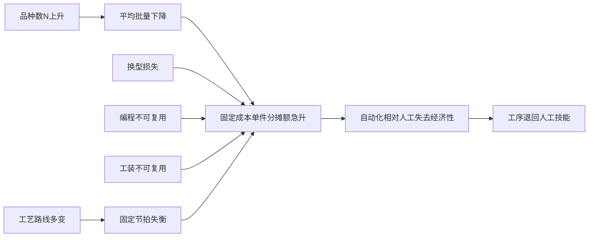

# 离散制造单件小批量（HMLV）自动化的难度全景

## 0 导论：核心命题与方法论

单件小批量制造（High-Mix Low-Volume, HMLV）的自动化难度，**本质上并非机器人精度或控制算法的不足，而是两类约束相互耦合所形成的系统性瓶颈**：其一，隐性知识难以低成本编码；其二，刚性自动化的固定成本无法被小批量摊薄。

按工序拆解，全部离散制造活动中约有六成具备"中等及以上"自动化可行性，但承载交付能力的关键环节——装夹找正、工艺路线决策、首件判定与异常处置——仍有约 **30%–40% 顽固依赖人的现场判断**。其知识可编码上限，被波拉尼式隐性知识理论与产业实践共同框定在约 **70%**。

需要纠正一个流行误解：业界普遍宣称"AI Agent 可把一个老师傅复制成一万个"，但证据表明，这种"蒸馏专家"路径存在硬性天花板——真正的直觉、手感与判断只能在实践中生长，标准作业程序与排障手册仅能搬运结果型隐性知识，无法传递过程型与情境型隐性知识。

**与"小批量天生无法自动化"这一常见说法相反**，Fastems 明确指出，围绕 CNC 机床自动化最常见的误解，正是制造商误以为自身产量太小而不值得投入自动化[Fastems, "Automation of 'High-Mix-Low-Volume' HMLV Production"](https://www.fastems.com/high-mix-low-volume-automation/)。本报告论证的核心是：难点不在"能不能"，而在"以何种代价、用何种技术路径、在何种前置条件下"才能实现。

全球工业机器人 2022 年累计安装量已达 150 万台，自动化预计到 2030 年覆盖约 50% 的制造任务[ZipDo, "Industry 4.0 Statistics | 2026 Edition"](https://zipdo.co/industry-4-0-statistics/)——但这一宏观渗透率掩盖了一个关键事实：达成覆盖的绝大多数是大批量、可预测的产线，而非批量为一的定制化生产。

### 0.1 调研范围

离散制造的界定标准是"形状与组合改变而非物质转化"[新羽翼，"离散行业主要特点以及MES应用区别"（2024）](https://www.ewe.cn/newsinfo-5559.html)，这是与流程工业划清边界的根本依据。在产量边界上，本报告将单件小批界定为**单件到数千件的区间**：下限为批量为一的纯定制，上限为约 5,000 件的小批订单。

单件小批生产是典型的**订货型生产（Make-To-Order, MTO）**[MBA智库百科，"单件小批生产"](http://wiki.mbalib.com)：生产由客户具体订单触发，而非基于市场预测的备货生产。这意味着每批次的规格、数量、交期都可能不同，自动化系统无法依赖稳定重复的工况。与之高度重叠的概念是 HMLV（多品种小批量）：单件小批强调"量小"，HMLV 则强调"品种多且量小"，后者将 SKU 数量爆炸作为难度的主要来源[自动化世界，"为什么高混合、小批量制造商采用柔性自动化"（2022）](https://www.myenum.com/factory/robotics/article/22223407/)[Welleshaft, "High-Mix Low-Volume HMLV Manufacturing in China"](https://welleshaft.com/en/hmlv-manufacturing/)。

### 0.2 六维难度评估框架

"难度"必须被拆解为可分维度、可评级、可加权的结构化指标，否则结论只能停留在笼统层面。本报告全文采用以下六维 Rubric：

| 维度 | 权重 | 衡量内容 |
|----|----|----|
| R-1 技术可行性 | 0.20 | 所需感知、定位、操作能力是否有成熟技术支撑 |
| R-2 工艺适配性 | 0.20 | 工序特性是否与设备能力边界匹配 |
| R-3 数据与标准化基础 | 0.18 | 工艺参数、几何模型、质量判据是否已数字化 |
| R-4 设备柔性 | 0.17 | 品种切换时的换型时间与可重配置程度 |
| R-5 经济性/ROI | 0.15 | 给定产量下投资能否在可接受周期内回收 |
| R-6 组织与人才能力 | 0.10 | 企业是否具备实施与维护柔性自动化的能力 |

采用六维而非三维，根源在于：**单件小批自动化的失败极少由单一维度引起，而是多维度耦合的结果**。即便技术可行（高分）而工艺不适配（低分），项目仍会失败[Welleshaft, "High-Mix Low-Volume HMLV Manufacturing in China"](https://welleshaft.com/en/hmlv-manufacturing/)。

---

## 1 生产模式界定：单件小批为何天然抗拒自动化

### 1.1 HMLV 与大批量的结构性差异

衡量 HMLV 结构劣势最直接的指标是设备利用率与单位成本。**大批量语境下，一条专线一旦调试完成，可连续运行数十万次循环，固定投入被巨大产量摊薄；而 HMLV 场景下，同一台设备一天内可能要切换多个品种，每次切换都意味着一段"可运行却未产出"的非增值时段。** 品种越多，切换越频，非增值时段占比越高，每件产品必须分摊更多固定成本[VDI 3423](https://www.vdi.de/fileadmin/pages/vdi_de/redakteure/richtlinien/inhaltsverzeichnisse/1739582.pdf)。

就此而言，大批量专线在设备柔性维度明确不合格——它以牺牲切换能力换取单一品种的极致效率，在 HMLV 下反成负资产；而 HMLV 专用自动化线在经济性维度普遍不合格，因为低产量无法在设备寿命内摊平专线投入。

**HMLV 集中分布于五个典型行业带**：

| 行业带 | 批量特征 | 多样性来源 | 主要障碍 |
|---|---|---|---|
| 装备制造 | 单件至个位数 | 客户定制功能 | 工艺路线随订单重写 |
| 模具 | 几乎件件不同 | 型腔几何唯一 | 几乎无重复几何特征 |
| 航空航天 | 少量多样 | 机型/批次差异 | 高混低量、换线痛点[達明機器人，"AI 協作艦隊進駐航太供應鏈：導入近 50 台 AI Cobot"](https://www.tm-robot.com.cn/zh-hant/tm-news-post/) |
| 船舶 | 单件 | 船型与舱段差异 | 工件超大、装夹无标准 |
| 精密零部件 | 多品种小批量 | 客户结构件差异 | 薄壁易变形、装夹敏感[Fastems，"苏州新鸿基 FMS 产线一期"](https://www.fastemschina.com/case/suzhou-new-hongji-fms-phase-i/) |

一个关键对照浮现：模具行业"几乎无重复几何"，而精密零部件虽同属 HMLV，却往往存在**可归族的零件家族**——这一差别直接决定二者自动化可行性的高低。**因此"HMLV 行业"不是一个难度均质的整体，其内部难度谱系极宽。**

### 1.2 三重不确定性：抗拒自动化的需求侧根因

将 HMLV 与大批量区分开的，是三重不确定性的叠加：

- **产品非标**：每张订单的产品在几何、材料或功能上各不相同，使面向固定几何的刚性程序无法复用，且缺乏可复用的标准件库。
- **工艺路线不稳定**：即便同一产品，其工艺路线也会因设计变更反复调整。企业信息系统专设"工艺变更流程单据"，正说明工艺变动已是常态化管理对象[金蝶EAS Cloud，"项目制造工程更改单（流程）"](https://vip.kingdee.com/eascloud/help/)。
- **订单波动**：市场波动、更短的计划周期、更大的交付压力，使产量无法预测，专用自动化线的投资回收失去稳定的产量基础[Welleshaft, "High-Mix Low-Volume HMLV Manufacturing in China"](https://welleshaft.com/en/hmlv-manufacturing/)。

这三重不确定性构成一条因果链：**市场向个性化迁移 → 产品非标化 → 工艺路线频繁重写 → 订单量与工艺都失去可预测性 → "固定程序+固定节拍"的刚性自动化失去立足点**。这条从市场到车间的传导链，正是单件小批抗拒自动化的需求侧根因[支道博客，"多品种小批量生产如何运行？"](https://www.zdsztech.com/blog/multi-product-small-batch-production-operation-mechanism/)。

### 1.3 "批量为一"的极端挑战

批量为一（Lot Size=1）是 HMLV 被推向极限的边界情形。**批量趋近于 1 时，自动化难度不是线性上升，而是因"换型损失占比趋近 100%"而陡然跃升。**

HMLV 的自动化已从工程实践上升为独立学术研究对象（TNO 的性能工程报告、MDPI 的行业综述），这从侧面印证其难度是系统性难题而非工程细节[MDPI，"A Review of the High-Mix, Low-Volume Manufacturing Industry"](https://www.mdpi.com/2076-3417/13/3/1687)。理想的 batch-size-of-one 全自动化模型设想产线能对每件不同产品自动重配程序、夹具与刀具而不损失节拍——但现实差距在于：批量趋近于 1 时，系统的节拍、调度与资源分配从"可预测"退化为"高度变动"，传统产线平衡方法失效。

**批量为一的真正苛刻之处，不在于"做出一件"，而在于"让这一件顺畅地混入正在运行的产线"。** 这要求产线既要足够柔性以容纳任意新件，又要足够高效以不损失节拍——而柔性与效率在刚性范式下是对立的。苏州新鸿基给出了一种化解路径：通过 FMS 柔性生产线 + 超过 1000 把刀的中央刀具库，把"换刀等待"大幅缩减，**用空间冗余（刀具预备）换取时间效率**，其约束则是这种冗余的资本开销[Fastems，"Fastems中国首套中央刀具库系统落地苏州新鸿基"](https://www.fastemschina.com/case/suzhou-new-hongji-gts/)。

频繁换型构成一条环环相扣的损失链：换夹具→换刀→调用新程序→首件试切→首件检验→（若不合格）返工再调。**批量越小，这条固定的换型损失就分摊到越少的合格件上，单件换型成本因而飙升。**

### 1.4 自动化四级分级与目标定位

回答"难度有多大"，前提是界定"实现自动化"指什么。本报告建立四级分级：

| 级别 | 名称 | 人的角色 | HMLV 适配性 |
|---|---|---|---|
| L1 | 人工 | 全程依赖人的技能 | 当前默认状态 |
| L2 | 半自动 | 人辅助、设备执行 | 多数 HMLV 现实落点 |
| L3 | 柔性自动化 FMS | 人监控、设备自适应换型 | 高端机加可达[Fastems，"Fastems中国首套中央刀具库系统落地苏州新鸿基"](https://www.fastemschina.com/case/suzhou-new-hongji-gts/) |
| L4 | 智能自动化 | 人退出循环、AI 决策 | 仅少数标杆接近[達明機器人，"AI 協作艦隊進駐航太供應鏈：導入近 50 台 AI Cobot"](https://www.tm-robot.com.cn/zh-hant/tm-news-post/) |

**这四级之间的跃迁难度并不均匀**：L1→L2 主要是替换体力劳动，难度较低；L2→L3 需要设备柔性与换型时间的根本改善，难度陡升；L3→L4 则需要 AI 接管原本依赖人的感知与决策。多数 HMLV 企业在 L1→L2 合格，在 L2→L3 勉强合格且高度依赖外部集成商，在 L3→L4 普遍不合格。

"实现自动化"在 HMLV 语境下至少有三层含义：**单机自动化**（单台设备自动完成某道工序）、**连线**（多台设备+物料搬运串联，如 FMS）、**无人化**（整段产线无人值守连续运行）。在大批量下，单机→连线→无人化是一条相对平滑的升级路径；而在 HMLV 下，每上一层都要额外解决"换型如何自动化"这一横亘难题。

**因此，"这件事能不能自动化"是个伪问题，真问题是"要做到哪一级、对哪类件"。**

### 1.5 场景分型：四个锚点带

单件小批内部的自动化可行性差异，主要由三个正交轴决定：**产品复杂度 × 订单稳定性 × 工艺标准化**。三轴同时取"有利值"的场景可行性最高，同时取"不利值"的场景则是当前技术几乎无法经济自动化的硬核区。

在三轴之中，对机加自动化最具决定性的是**几何可重复性**。苏州新鸿基这类多品种小批量精密机加企业能纳入 FMS，正是因为零件虽属多品种，但在同一零件族内具有相近的装夹方式与加工逻辑，使夹具系统与程序库能在族内复用[Fastems，"苏州新鸿基 FMS 产线一期"](https://www.fastemschina.com/case/suzhou-new-hongji-fms-phase-i/)。**这制造出了局部的重复性**：族内几何相近 → 装夹与程序可复用 → FMS 固定投入能在族内多订单间摊薄 → 原本不成立的 ROI 拉回可行区间。

由此可将单件小批锚定为四个分类带：

| 锚点带 | 几何可重复性 | 订单稳定性 | 目标可达层级 | 代表案例 |
|---|---|---|---|---|
| A 易区 | 族内高 | 中 | L3 柔性自动化 | 苏州新鸿基精密机加[Fastems，"苏州新鸿基 FMS 产线一期"](https://www.fastemschina.com/case/suzhou-new-hongji-fms-phase-i/) |
| B 中区 | 部分可归族 | 低 | L2 半自动+AI 视觉 | 经宝精密航太件[達明機器人，"AI 協作艦隊進駐航太供應鏈：導入近 50 台 AI Cobot"](https://www.tm-robot.com.cn/zh-hant/tm-news-post/) |
| C 难区 | 低 | 低 | L2 局部 | 船舶大型结构件 |
| D 硬核区 | 趋近零 | 极低 | L1 为主 | 模具型腔 |

经宝精密的案例正落在 B 中区：面对航太"少量多样"的生产模式，通过导入近 50 台内建 AI 视觉的协作机器人，实现 10 种复杂应用的自动化，**每年释放超过 80,000 小时工时**[達明機器人，"AI 協作艦隊進駐航太供應鏈：導入近 50 台 AI Cobot"](https://www.tm-robot.com.cn/zh-hant/tm-news-post/)。这使 B 中区的难度定位从"不可行"下移到"L2+AI 视觉可行"。

**本章结论**：单件小批抗拒自动化的根源，不是任何单一工序的技术难题，而是"品种多×批量小×工艺不稳"三轴同时偏离有利值，共同摧毁了刚性自动化赖以成立的重复性前提。但这一抗拒并非均质——四锚点带与四级分级交叉，说明难度是一张可分级的地图，而非铁板一块。

---

## 2 机制一：为何"基本上靠人的技能"

单件小批之所以"靠人的技能"，并非因为加工动作本身难以机械化，而是因为每一件产品都把一连串未写入图纸的隐性决策压在了操作者身上。本章将"靠人的技能"拆成五类可分析的能力要素，逐类映射到机器能力的差距。

### 2.1 工艺规划与基准决策：难在"建模"而非"解"

工艺规划处理的不是"怎么切"，而是"先切什么、以哪个面为基准、公差靠哪道工序守住"这类前置判断。

麟思数控记录的案例颇具诊断价值：一家小厂发来一块 **300×200×20mm 的 6061 铝板，图纸上只有 4 个直径 10mm 通孔、2 条 30mm 宽槽、几个沉头孔加阳极氧化，一个做了 8 年的编程师傅却编了两个多小时**，而直觉上"看着最多半小时就能编完"[麟思数控，"非标自动化零件加工：为什么说'简单'才是最难的？"](https://www.arockcam.com/archives/30120)。这正是"简单反而最难"的结构性根源：**图纸给的约束越少，留给工艺师的自由度越大，需要人补全的判断越多。**

这块铝板的难度评级应判为：技术可行性高（孔槽铣削本属成熟工艺），但工艺适配性差——瓶颈落在基准选择与工序编排这类难以预先固化的决策上。师傅两小时里真正敲键盘生成刀路的时间可能只占一部分，其余消耗在无形的工艺推理上：20mm 厚铝板大量去料后是否会因内应力释放翘曲？孔槽若分属不同装夹，累积误差能否守住位置公差？阳极氧化膜厚是否需预留余量？这些都不写在图纸上，却每一条都要师傅当场定夺。

**核心经济学是：工艺规划是一笔固定成本，而批量为一意味着它无法像大批量那样被众多重复件分摊。**

两条对立的研究路线揭示了问题的真正所在。一方面，纯优化路线已相当成熟：基于 MIP 的工艺组合优化能用混合整数规划模型自动编排机加工艺[学刊吧，"基于MIP的机加工工艺组合优化技术"](https://www.xuekanba.com/lunwen/ligong/4-10253.html)——其隐含前提是工艺约束已能被形式化为数学约束。另一方面，专家知识获取路线正视了更底层的难题：在 HMLV 排产中，专家知识需要被"获取"和"验证"[JStage，"Acquisition and validation of expert knowledge for HMLV production scheduling"](https://www.jstage.jst.go.jp/article/jamdsm/17/1/17_2023jamdsm0008/)。

**两条路线的分工构成关键对照：MIP 解决"约束已知后如何最优编排"，专家知识获取解决"约束本身如何从专家头脑里抽出来"，后者恰是前者的前置条件。** 单件小批的困难不在第一步不成熟，而在第二步远未解决。

排产领域的证据量化了"靠人"的代价：某精密部件企业月订单超 2000 个，在用智能排产前依赖 Excel 和计划员经验，**计划员每天花 4-5 小时处理数据、排产周期长达 2 天，即便如此计划准确率仍不足 70%**[技术栈，"多品种小批量时代的排产革命：JVS-APS"](https://jishuzhan.net/article/2039159492444164098)。经验排产建立在"产品种类相对稳定、工艺路线固定"等隐性假设上，而这些假设在多品种小批量下恰恰不成立[黑湖小工单，"多品种小批量怎么排产更高效？"](https://www.xiaogongdan.cn/article/QiNOFJLr.html)。

值得强调一个与主流叙事相悖的判断：**工艺规划难以自动化并非因为太复杂——MIP 路线的成熟恰恰说明复杂性本身不是瓶颈，真正的瓶颈是约束的可获取性。**

### 2.2 装夹找正与调机试切：手眼协调闭环

如果说工艺规划的难在认知层，装夹找正的难则在手眼闭环层。装夹方式分**找正装夹**与**夹具装夹**两类[福州大学，《机械制造工艺学》课件](http://m.download.cucdc.com/)，这一分类正好对应单件小批与大批量的分野。

**夹具装夹把定位精度固化在专用夹具的定位元件上，装上去就到位；找正装夹则把定位精度交给操作者的临场测量与校调。** 大批量普遍采用夹具装夹，单件小批多用找正装夹——因为专用夹具的设计制造也是一笔固定成本，批量越小越不划算，于是定位这件事就从"固化在硬件里"退回到"依赖人的手感"。找正装夹对设备柔性的要求是"高柔性但低一致性"：能装任何工件却难保证件件定位相同，**在设备柔性上通过，在数据与标准化基础上不及格**。

直接找正是一个逐步逼近的视觉—手动闭环：师傅用百分表测出偏差，敲一下、再测、再敲，直到进入可接受范围。**这个过程之所以是机器最难复制的，是因为它没有固定动作序列——每一步的调整量都取决于上一步测得的偏差，是典型的反馈驱动而非程序驱动。**

调机试切则是参数迭代过程。CNC 加工的一致性优势建立在"程序已调通"这个前提上，而把程序调通本身仍是依赖经验的人工活动[Xometry, "CNC vs Manual Machining"](https://www.xometry.com/resources/machining/cnc-vs-manual-machining/)。在批量为一的场景里，**每换一种零件就要重新调一次参，调参本身构成了 SMED 换型时间的主体**。

试切的终点是首件合格，而首件合格在单件小批场景下高度依赖个人技能——因为缺乏验证样本。**首件可能就是唯一件，没有第二件来验证和修正判断，试错空间被压缩到近乎为零。** 这里存在一个真实张力：人们期望自动化提升首件合格的稳定性，但恰恰是首件这个"没有先例可循"的环节最难自动化。化解方式不是让机器替代首件判断，而是把问题前移：通过仿真预测（如提前算出内应力变形趋势），把靠首件试错积累的经验替换成事前可计算的预测——但仿真本身需要准确的材料与边界参数，这又回到数据基础问题。

### 2.3 焊接看火候、喷涂打磨：感官闭环控制

焊接看火候、喷涂打磨调力道，代表第三类更难形式化的技能：**感官闭环控制**，它调用了对熔池颜色、声音、力反馈的多通道感知，是所有五类里最难蒸馏成显性规则的。

焊接的"火候"本质是对**熔深**的实时判断。**问题在于：熔深发生在工件背面或内部，正面看不到，老师傅靠熔池颜色、流动形态、电弧声音等间接线索反推背面熔透状态，这种跨模态的反推直觉极难写成规则**[麦格米特，"焊缝熔深的形成机理"](https://www.megmeet-welding.com/news/welding-penetration-basics)。

学术界的路线是用深度学习替代这种直觉——从正面熔池图像推断背面熔透，以背面焊缝宽度量化全熔透[AWS Welding Journal 2021](https://s3.us-east-1.amazonaws.com/WJ-www.aws.org/supplement/2021.100.015.pdf)[NSF PAR, "Deep Learning Based Real-Time and In-Situ Monitoring of Weld Penetration"](https://par.nsf.gov/servlets/purl/10428252)[NSF PAR](https://par.nsf.gov/servlets/purl/10338812)。但从实验室到车间有一道明确的工艺适配性鸿沟[Chalmers, "Barriers for industrial implementation of in-process monitoring of weld penetra](https://research.chalmers.se/publication/250142/)。**明确判断：实验室里熔透监测的技术可行性已有进展，但在单件小批这种焊缝形式多变、缺乏稳定标定样本的场景下，工业实施仍面临障碍。** 这条因果链是：熔透状态不可直接观测 → 必须从正面间接信号反推 → 要求大量标注样本训练模型 → 单件小批每条焊缝形式都不同 → 稳定标定样本难以积累[Google Patents, CN114309895A](https://patents.google.com/patent/CN114309895A/zh)。

仿真路线同样反映难度：仿真能在已知边界条件下预测熔池行为，但它把难度转移给了"边界条件是否已知"——而单件小批恰恰缺乏稳定边界条件["激光焊接过程多尺度数值模拟研究现状与展望"](https://www.71dhj.com/zh/article/)[MDPI, "Analysis of the Parallel Seam Welding Process"](https://www.mdpi.com/2227-9717/12/1/78)。这与 MIP 路线的困境同构：方法本身成熟，但方法的输入仍需人来提供。

打磨力控代表另一种感官闭环：**力太大会过磨留下划痕，力太小则磨不到位，而合适的力又随工件曲面、余量、材质实时变化**。具备力/力矩传感的协作机器人是候选载体，但在工艺适配性上仍受制于"合适力随曲面实时变化"这一非线性关系难以预编程[PatSnap Eureka, "Scaling Cobots in High-Mix Low-Volume Manufacturing"](https://www.patsnap.com/resources/blog/rd-blog/scaling-cobots-in-high-mix-low-volume-manufacturing/)。

一个有启发的对照：**焊接火候的难点是"状态不可观测"（熔透在背面），打磨力控的难点是"目标不可预设"（合适力随工况漂移）。** 前者需要"更好的传感"把不可观测变成可观测，后者需要"更好的实时控制"把漂移的目标跟住。这意味着力控打磨的 TRL 可能高于熔透视觉监测，因为力觉反馈比跨模态视觉反推更易工程化。

这类技能的高门槛有其知识论必然性。波拉尼把知识分为可表述的显性知识与蕴含在行动中的隐性知识。**焊接火候与打磨手感是隐性知识的典型：常常连操作者本人都难以完整言说"为什么这一下该轻一点"。** 老冯云数从 AI 蒸馏视角提出更尖锐的论断：默会知识在 AI 时代存在一个 **"70% 的天花板"，真正的直觉、体感与判断力只能在实践中生长**——把资深员工的 SOP、排障手册喂给 Agent 能复制大部分能力，但剩下那部分真直觉始终蒸馏不出来。

### 2.4 质量识别与异常处置：认知能力

质量识别与异常处置把难度从感官层推向认知层——不仅要"看出"缺陷，还要"裁量"缺陷能否接受、"临机"决定怎么补救。这类技能的困难不在感知精度，而在**价值判断与开放世界推理**。

缺陷识别有两个层次：第一层"检出"（这里有没有缺陷），第二层"裁量"（这个缺陷在这个用途下能否接受）。第一层在大批量场景下机器视觉已相当成熟，但**第二层的裁量依赖的不是固定阈值而是经验性容差判断**：同样 0.05mm 的划痕，在密封面上不可接受，在非配合面上则无关紧要。**固定阈值把"合格"定义成一个可计算的数值边界，经验性裁量则把"合格"定义成一个随用途、客户、批次浮动的语境函数。** 缺陷裁量的自动化在数据与标准化基础维度不及格，因为缺乏可复用的标注标准。

异常处置则处理"从未预料到的情况怎么办"——这是**开放世界问题**，本质区别于前面所有封闭世界的技能。"紧急订单插入，全产线排程推倒重来""设备冲突、物料短缺让排产计划沦为纸上谈兵"，这类停工待料每周都会发生[技术栈，"多品种小批量时代的排产革命：JVS-APS"](https://jishuzhan.net/article/2039159492444164098)。MIP 那类静态优化假定约束集在求解期间不变，**但现场异常的本质恰恰是约束集在运行中突变**。

这里有一个需要解开的悖论：**异常处置是最需要自动化来提速的环节（它直接造成停工待料），却又是最难自动化的环节（它本质上是开放世界推理）。** 现实化解路径不是追求完全自动处置，而是分层：对可预见的异常类型用动态排产系统自动重排，对真正未预料的新异常仍保留人的临机决策[黑湖小工单，"多品种小批量怎么排产更高效？"](https://www.xiaogongdan.cn/article/QiNOFJLr.html)。

知识管理研究为容差判断的隐性提供了精细刻画：隐性判据可从"是否可见"扩展到结果、过程、情境等多个维度——师傅的容差判断即便结果可见（说得出"这件合格"），过程和情境仍是隐性的（说不清"凭什么判合格"）。这正是程序性知识与陈述性知识的分野：**师傅知道"怎么判"（能做对），却未必能把它转成"判的规则是什么"**。这种"会做但说不清"正是显性化困境的根源。

---

## 3 机制二：刚性自动化为何在此失效

即便抛开"人会什么机器不会"，单就设备组织形式而言，**刚性自动化是一套"把柔性在设计阶段一次性买断、在运行阶段用极高节拍分摊固定成本"的机制；当品种频繁变化时，这套机制赖以成立的前提——足够大的分母——不复存在。** 本章沿四条因果链展开，它们通过"固定成本 × 变化频率"这一共同放大因子耦合。

### 3.1 换型/换线的结构性时间损失

换型损失并非线性的效率折扣，而是随品种数呈超线性放大的结构性损失。电子制造的实测数据显示：单次换模平均耗时约三小时，其中真正用于"换"的动作占比有限，**约八成时间消耗在调整工装、找正定位与首件试切验证上**。若全年因换模停机累计约一千二百小时，对应产能与人工损失可超过二百万美元量级。

**损失的主体不是设备切换本身，而是依赖人工的找正与验证环节**——这与"装夹找正靠人"形成因果闭环：正因找正靠人，所以每换一次就要重付一次人工时间，无法通过设备预置消除。当企业把计划员每天 4-5 小时的人工协调、两天的排产周期与不足七成的准确率纳入换型损失口径，真实停机成本会显著高于账面设备停机时长[技术栈，"多品种小批量时代的排产革命：JVS-APS"](https://jishuzhan.net/article/2039159492444164098)[黑湖小工单，"多品种小批量怎么排产更高效？"](https://www.xiaogongdan.cn/article/QiNOFJLr.html)。

SMED（快速换型）是精益制造的经典回应，但在批量为一下遭遇结构性悖论：**SMED 的有效性建立在"换型动作可重复、可预置"这一前提之上，而单件小批恰恰抽掉了这个前提。** 它只能压缩那部分"跨品种仍然相同"的通用准备动作（如标准夹持接口切换），而无法触及每件独有的找正与编程——后者属于"一件一变"的内部作业，无法外部化到上一件的加工窗口。

换型成本随品种数非线性放大，机制是三重叠加：**品种数 N 增加 → 平均批量下降 → 每件分摊的换型固定成本上升 → 单件利润空间被压缩**，同时换型频次本身随品种数上升[支道博客，"多品种小批量生产如何运行？"](https://www.zdsztech.com/blog/multi-product-small-batch-production-operation-mechanism/)。这意味着到 2026 年以后，**换型能力而非单工位速度，将成为 HMLV 工厂自动化投资的第一优先级**。

### 3.2 编程与示教的高边际成本

机器人编程/示教成本在单件场景下呈现近乎全额不可分摊的边际成本结构。大批量的经济性完全建立在"一次编程、万次复用"的分摊逻辑上；一旦进入单件小批，这套逻辑反转为"一次编程、一次使用"[自动化世界，"为什么高混合、小批量制造商采用柔性自动化"](https://www.myenum.com/factory/robotics/article/22223407/)。**纯示教型机器人在批量为一场景下经济性明确不合格：投资回收期无法定义，因为没有重复产量来构成回收的分母。**

麟思案例的微观证据揭示了"一件起订为何没人愿意接"：那块"简单"铝板编程耗时两小时，**真正来源不是几何复杂度，而是每个"简单"特征背后都隐含着必须由人临场判断的工艺决策**——装夹方案、下刀顺序、避让变形、阳极氧化余量预留[麟思数控，"非标自动化零件加工：为什么说'简单'才是最难的？"](https://www.arockcam.com/archives/30120)。简单件没有标准工艺模板可套，每件都要从零判断，这把编程边际成本推到极高水平，最终表现为：编程两小时 → 单件准备工时远超加工工时 → 报价要么高到客户无法接受、要么低到厂家亏损 → 厂家理性地回避这类订单。

**编程自动生成而非机器人本体，才是解开单件自动化的关键钥匙。** 这一判断有反向技术证据支撑：若工艺编排能由 MIP 优化模型自动生成，"每件重编"的人工成本就可能被算法成本替代[学刊吧，"基于MIP的机加工工艺组合优化技术"](https://www.xuekanba.com/lunwen/ligong/4-10253.html)。

### 3.3 专用工装夹具难复用

编程是"软"准备的不可复用，工装夹具则是"硬"准备的不可复用。**非标件的致命之处在于：每个工件的定位基准面、夹紧点都不同，一套专用夹具原则上只服务于一种工件**，设计加制造的周期往往以周计[福州大学，《机械制造工艺学》课件](http://m.download.cucdc.com/)[电工电气学习网，"工件的装夹与定位"](https://www.dgdqw.com/wk/17244-1.html)。

一个关键张力是：**夹具越专用、定位越精确，复用性就越差——精度与柔性在夹具设计上构成直接权衡。** 定位精度来源于定位元件与工件基准面的贴合，而贴合越紧就越难适应不同几何。柔性夹具试图取中，但其定位仍必须服从六点定位原理，可调元件引入的配合间隙会放大定位误差[上海交通大学，《制造工艺基础》课件](http://download.cucdc.com/)。

由此得到三极对照：**找正装夹**柔性最高、工装投入最低，但人工依赖与定位不确定性最高；**专用夹具**精度刚度最高、人工依赖最低，但复用率近零；**柔性夹具**居中。三者没有一个能同时满足"高精度+高复用+低人工"，这正是单件装夹自动化难的几何根源。低复用率沿成本链向下传导，最终形成困境：**要么付专用夹具的固定成本，要么付人工找正的质量与时间成本**——由于单件无法支撑前者，工厂多数退向依赖师傅找正，从而把装夹重新钉死在人工技能上。

### 3.4 刚性产线对产品变化的脆弱性

固定节拍产线的经济性来源于节拍稳定与单位产出最大化，这要求所有产品走相同或高度相似的工艺路线。**工艺路线多变与固定节拍之间存在根本性不兼容：固定节拍把每个工位的工作内容在设计阶段锁死，而多变路线要求运行阶段不断重新分配工作。** 一旦路线因换品种改变，原有工位分配立即失衡，瓶颈工位堵塞而其他工位空等，整线产出骤降[技术栈，"多品种小批量时代的排产革命：JVS-APS"](https://jishuzhan.net/article/2039159492444164098)[黑湖小工单，"多品种小批量怎么排产更高效？"](https://www.xiaogongdan.cn/article/QiNOFJLr.html)。

一个常见误判是：既然大批量自动化已极成熟，搬到单件小批即可。但这一移植系统性失败，因为有三条独立路径同时失效：换型设计不为频繁切换优化、程序与工装复用资产归零、计划参数难以稳定。**移植失败不是设备不够先进，而是经济结构的根本错配。**

将四节失效机制收束为一个判据：**变化频率 × 固定成本 = 不可行区。** 固定成本本身无害——大批量同样有巨大固定成本却盈利，因为分母足够大；真正致命的是固定成本与高变化频率相遇。换型损失、编程成本、工装成本都是"固定成本"的具体构成，路线多变是"变化频率"的来源，它们最终都汇入"单件分摊额急升"这一共同节点：

**本章结论**：换型损失、编程边际成本、工装不可复用、刚性产线脆弱性，表面是四个独立技术难点，本质上是同一经济问题的四张面孔——刚性自动化的全部固定成本都需要一个足够大的产量分母来稀释，而批量为一恰恰抽掉了这个分母。这与机制一互为表里：人会的机器难学，机器能做的又无量可摊。

---

## 4 工序自动化难度排序

单件小批的自动化难度并非铁板一块，而是**沿"标准化度、感官依赖、变化频率"三因子叠加，呈现从"基本可达"到"短期内不可替代人"的显著梯度分布**。把"离散制造自动化"当作单一难度，会同时掩盖两个事实：一端的搬运上下料已接近商用可达，另一端的工艺规划则深陷隐性技能泥潭。

### 4.1 上下料、搬运、物流（较易）

上下料与搬运是离散车间里语义最稳定的一类动作：无论加工哪种工件，"把毛坯放上夹具、把成品取下来、从 A 工位运到 B 工位"这一任务结构在产品之间高度复用。**正是这种任务与产品的解耦，使该环节成为单件小批自动化的优先突破口。**

上下料适合协作机器人（cobot）加视觉的组合，根源在于其任务语义与具体产品高度解耦：动作骨架几乎不变，变化的只是工件形状、重量与抓取点——而这些恰好是机器视觉与可换夹爪能吸收的变量[PatSnap Eureka, "Scaling Cobots in High-Mix Low-Volume Manufacturing"](https://www.patsnap.com/resources/blog/rd-blog/scaling-cobots-in-high-mix-low-volume-manufacturing/)。换言之，**上下料把"多品种"带来的变化集中收敛到"识别工件位置与姿态"这一个可被视觉处理的环节**。当前适用边界仍限于规则形状件，对薄壁易变形件、缠绕料、高反光镜面件，抓取稳定性与定位精度仍是工程难点。

把搬运物流列为优先区，背后是一条因果链：**任务语义解耦 → 换产时作业逻辑无需重构 → 单台 cobot/AMR 不因换产而长期闲置 → 较高稼动率支撑投资在多品种环境下摊薄**。需厘清一个条件：搬运的"易"是有条件的易，条件是前置数字化的具备——只有当车间布局、工位坐标、物料信息被数字化表达后，AMR 的软件柔性才真正可用。

### 4.2 机加工与数控（中等）

机加工存在一种耐人寻味的反差：**执行机构早已高度成熟，难度重心却整体上移至"准备"阶段。** 瓶颈并非机床本体，而在于编程与装夹这两道前置工序。

| 子环节 | 成熟度 | 瓶颈性质 | 人工干预 |
|---|---|---|---|
| CNC 执行 | 高（已商用） | 无明显约束 | 低 |
| CAM 编程（规则件） | 中高 | 几何特征化 | 低至中 |
| CAM 编程（非标件） | 中低 | 加工意图判断 | 高 |
| 装夹设计（非标件） | 低 | 找正/夹具设计 | 高 |

复杂非标件构成一条因果链：**非标几何缺乏标准夹具 → 现场采用找正装夹 → 找正依赖人的手感判断 → 装夹环节难以脱离人工 → 整个机加工自动化天花板被压在"准备侧仍需人"**。从组织与人才能力维度评判，复杂非标件机加工强依赖经验丰富的编程与装夹技工，这一依赖短期内无法通过设备投资消除。这里隐伏一个张力：CAM 与 MIP 自动编排在规则件上已相当成熟，而单件小批恰恰以非标件为主体——"自动编程解放工艺师"的预期，在非标件占比高的车间将大打折扣。

### 4.3 检测与质量判定（中等偏易）

检测自动化前景的近期改善，直接源于 **AI 视觉对传统机器视觉大样本依赖的突破**。但检测环节内部同样存在难度分层：

| 缺陷类型 | 判别性质 | 自动化分级 | 当前依赖 |
|---|---|---|---|
| 规则缺陷（裂纹/尺寸） | 感知 | 接近确定性可自动化 | AI 视觉为主 |
| 复杂缺陷（灰区外观） | 感知+决策 | 部分可自动化 | 人裁量为主 |

复杂缺陷的最终裁量仍牢牢守在人工一侧：**"是否构成缺陷"往往不是纯粹的感知问题，而是掺杂了用途上下文的决策问题**——同一道划痕在外观面是缺陷、在内部非配合面可放行。这一上下文往往未以结构化方式表达给视觉系统，致使灰区缺陷的最终判断只能留给懂工艺的质检员。**即便检测被列为中等偏易，其"易"也仅覆盖到感知层；一旦上升至结合用途的裁量决策，难度便骤然回升到与装配相当的决策依赖层。**

### 4.4 焊接、装配、打磨（最难）

这三道工序构成单件小批自动化的最后边界，**共同特征是将多重感官的实时闭环与柔性接触作业相捆绑**：

| 工序 | 核心能力要求 | 结构化场景 | 非标场景 |
|---|---|---|---|
| 焊接 | 熔池实时感知+闭环调参 | 直缝已成熟 | 非标焊缝仍受阻 |
| 装配 | 配合状态感知+现场配作 | 标准件可自动 | 非标配作仍需人 |
| 打磨 | 自适应力控接触 | 规则面部分可达 | 异形面仍需人 |

这条边界的稳固性可从对照中反推：搬运将变化收敛为视觉定位，检测将判别迁移到感知模型，机加工至少在执行层成熟；**唯独焊接、装配、打磨无法将"实时感官闭环+柔性接触"这一核心能力外包给某个可迁移的子模块，因为它们的难度恰恰内生于这一闭环本身**。审慎推断，在本十年内，这三道工序的非标作业较大概率仍以"结构化场景已攻克、非标场景靠人机协作"的混合态存在[Chalmers, "Barriers for industrial implementation of in-process monitoring of weld penetra](https://research.chalmers.se/publication/250142/)。

### 4.5 工序难度综合排序

按自动化难度由低到高，本报告提出如下排序：**搬运 < 检测 < 机加 < 喷涂 < 焊接 < 装配 < 调试 < 工艺规划**。其中搬运、检测、机加、焊接、装配五类有直接证据支撑，喷涂、调试、工艺规划三类是同一框架下的合理外推。

| 序位 | 工序 | 主导属性 | 自动化分级 |
|---|---|---|---|
| 1（最易） | 搬运/物流 | 任务与产品解耦 | 确定性可自动化 |
| 2 | 检测/质量判定 | 感知任务可迁移 | 感知依赖，接近确定性 |
| 3 | 机加工 | 执行成熟、准备依赖 | 执行确定而准备决策依赖 |
| 4 | 喷涂 | 异形面路径与膜厚感知 | 感知依赖 |
| 5 | 焊接 | 熔池实时闭环 | 感知依赖，深 |
| 6 | 装配 | 配合感知与现场配作 | 决策依赖 |
| 7 | 调试 | 整机问题诊断 | 决策依赖 |
| 8（最难） | 工艺规划 | 最深隐性工艺知识 | 决策依赖，最深 |

排序两端最能揭示问题：最低端的搬运任务语义与产品解耦；最高端的工艺规划"边设计、边生产、边修改"，在很大程度上缺乏可直接复用的先例。**该梯度表明，单件小批的自动化不应被当作单一难度问题，而应作为有序的实施序列加以规划。**

---

## 5 关键技术成熟度评估

### 5.1 柔性制造系统 FMS：相对成熟但门槛高

FMS 面向的是"多规格但成族"的机加场景，是少数把目标定在"整线"而非"单工位"层面的方案。它把排产侧已验证的动态调度能力下沉到设备层：零点快换定位系统使工件在不同机床间转移时快速恢复基准，托盘系统把多个工件的装夹状态预先固化，调度软件再在预装托盘间做混流排序[黑湖小工单，"多品种小批量怎么排产更高效？"](https://www.xiaogongdan.cn/article/QiNOFJLr.html)。

**FMS 真正解决的是设备层的混流运行，而非工艺层的柔性。** 它处理的是"哪个订单先上哪台机"，而每个订单具体怎么装夹、毛坯余量怎么判，仍需人的隐性技能先行固化到托盘夹具里[技术栈，"多品种小批量时代的排产革命：JVS-APS"](https://jishuzhan.net/article/2039159492444164098)。

FMS 的适用边界由它对"重复结构"的依赖决定：在中大型箱体、盘类、结构件这类"成族但多规格"的场景较易展开，但在纯非标小件上难以展开。麟思那块"简单"铝板正是缩影——**当每件都"简单但不同"，FMS 赖以成立的规模经济就不复存在**[麟思数控，"非标自动化零件加工：为什么说'简单'才是最难的？"](https://www.arockcam.com/archives/30120)。

FMS 的难度在经济性维度表现最尖锐：它是典型的"整线一次性"投资，多台机床、托盘库、搬运系统与调度软件必须同步建成才能运转。集成复杂度是第二重门槛，构成一个张力：**柔性越强，所需的前置数字化条件越苛刻；而前置条件越苛刻，能承受其投资的企业越少。** 缓解方向不在压低 FMS 成本，而在先把工件族的标准化程度做高。

### 5.2 协作机器人与 AI 视觉：柔性提升的主力

如果说 FMS 代表"整线豪赌"，协作机器人与 AI 视觉代表的是"单工位增量"这条对立路径。

经宝精密部署 50 台 cobot 释放约 8 万小时工时，呈现了一条清晰因果链：**cobot 单台接管上下料、搬运等确定性动作 → 释放被占用的技师工时 → 有限的熟练人力回流到真正依赖隐性技能的装夹判断与工艺决策环节 → 在不替换人的前提下放大整线有效产出**[PatSnap Eureka, "Scaling Cobots in High-Mix Low-Volume Manufacturing"](https://www.patsnap.com/resources/blog/rd-blog/scaling-cobots-in-high-mix-low-volume-manufacturing/)。协作机器人区别于传统刚性工业机器人的核心，**在于把投资颗粒度从"整线"降到"单台"**，投资回收期原则上可逐台核算，这是它在经济性上明显优于 FMS 的结构性原因。

AI 视觉瞄准的是柔性自动化最普遍的障碍：工件来料位置不固定。它用"先看后抓"替代"先定位后抓"，理论上可把夹具从精密定位降级为粗放承载。但其成熟度是分裂的：**几何明确的定位类任务迁移较顺，而缺陷判级类任务因缺陷形态千变万化、样本稀少，迁移效果不稳定**——"看得见表面、推不准内部"是判级类视觉的共性瓶颈[Google Patents, CN114309895A](https://patents.google.com/patent/CN114309895A/zh)。

规模化落地仍有两类残留障碍。一是**安全合规**：人机共线意味着必须满足更复杂的安全要求；欧盟 2026 年 AI 法案修订把机械设备转入机械法规框架，嵌入式 AI 合规截止从 2026 年 8 月推迟到 2028 年 8 月，这并非放宽而是换了监管入口。二是 **SME paradox**：**最需要柔性自动化的中小企业，恰恰最缺乏规模化部署所需的资本、工程能力与标准化基础**。这个悖论的缓解不靠 cobot 降价，而靠把前置数字化条件与标准化先行补足[PatSnap Eureka, "Scaling Cobots in High-Mix Low-Volume Manufacturing"](https://www.patsnap.com/resources/blog/rd-blog/scaling-cobots-in-high-mix-low-volume-manufacturing/)。

### 5.3 离线编程、数字孪生与 AI 工艺规划

把单工位柔性串成连线，需要解决"程序怎么来、换型怎么快、排产谁来定"这三个软件层问题。三者成熟度呈明显梯度下降：

- **离线编程**能把路径生成这类可结构化的部分自动化，却难以替代工艺决策这类隐性技能。麟思那块铝板耗时两小时的核心，并不在路径本身，而在编程师傅要判断装夹顺序、余量分配与变形风险[麟思数控，"非标自动化零件加工：为什么说'简单'才是最难的？"](https://www.arockcam.com/archives/30120)。其相对 FMS 的优势在于对单件也有效，因为它处理的是单个程序的预生成而非多件调度。

- **数字孪生**的真实成熟度需分层看：单工艺仿真较成熟（如缝焊多物理场耦合、激光焊接多尺度模拟），但产线级实时同步仍有明显差距[MDPI, "Analysis of the Parallel Seam Welding Process"](https://www.mdpi.com/2227-9717/12/1/78)["激光焊接过程多尺度数值模拟研究现状与展望"](https://www.71dhj.com/zh/article/)。

- **AI Agent** 在排产/编程自治的 TRL 偏低。需区分"辅助"与"自治"：辅助排产已具工程可用性（JVS-APS 把排产周期从 2 天压缩、准确率从不足 70% 提升）[技术栈，"多品种小批量时代的排产革命：JVS-APS"](https://jishuzhan.net/article/2039159492444164098)；但**开放场景下的编程/工艺自治仍处研究阶段，其瓶颈恰恰是排产侧最常见的动态扰动**——紧急订单插入、设备冲突、物料短缺，这些要求 Agent 在缺乏完整规则的情况下做出权衡，而这正需要隐性技能类判断[学刊吧，"基于MIP的机加工工艺组合优化技术"](https://www.xuekanba.com/lunwen/ligong/4-10253.html)。

### 5.4 技术成熟度对照与"乐观 vs 怀疑"张力

| 技术 | 适用层级 | 成熟度 | 柔性潜力 | 关键边界 |
|---|---|---|---|---|
| CNC 机床 | 单工位 | 高 | 中 | 与手动加工控制方式差异已界定[Xometry, "CNC vs Manual Machining"](https://www.xometry.com/resources/machining/cnc-vs-manual-machining/) |
| FMS | 整线 | 中-高 | 中-高 | 仅工件成族时有效[黑湖小工单，"多品种小批量怎么排产更高效？"](https://www.xiaogongdan.cn/article/QiNOFJLr.html) |
| 协作机器人 | 单工位 | 中-高 | 高 | 单台可增量；共线安全合规为障碍[PatSnap Eureka, "Scaling Cobots in High-Mix Low-Volume Manufacturing"](https://www.patsnap.com/resources/blog/rd-blog/scaling-cobots-in-high-mix-low-volume-manufacturing/) |
| AI 视觉（定位） | 单工位 | 中 | 高 | 几何定位较顺，判级类仍攻关[Google Patents, CN114309895A](https://patents.google.com/patent/CN114309895A/zh) |
| 离线编程 | 单工位 | 中 | 中 | 替代路径生成，难替工艺决策[麟思数控，"非标自动化零件加工：为什么说'简单'才是最难的？"](https://www.arockcam.com/archives/30120) |
| 数字孪生 | 工序-整线 | 中/低 | 中-高 | 单工艺较成熟，产线实时较弱[MDPI, "Analysis of the Parallel Seam Welding Process"](https://www.mdpi.com/2227-9717/12/1/78) |
| MES-APS 排产 | 整线（软件） | 中-高 | 中 | 辅助排产已落地[技术栈，"多品种小批量时代的排产革命：JVS-APS"](https://jishuzhan.net/article/2039159492444164098) |
| AI 工艺规划（MIP） | 工序 | 中 | 中-高 | 需先结构化业务约束[学刊吧，"基于MIP的机加工工艺组合优化技术"](https://www.xuekanba.com/lunwen/ligong/4-10253.html) |
| AI Agent（开放自治） | 整线 | 低 | 高（潜力） | 动态扰动下尚难稳定[技术栈，"多品种小批量时代的排产革命：JVS-APS"](https://jishuzhan.net/article/2039159492444164098) |

从对照表可读出一个反直觉但稳健的结论：**柔性潜力最高的 AI Agent，成熟度反而最低；成熟度最高的 CNC 与 FMS，其柔性潜力反而受族内共性约束。** 这种反向关系不是偶然，而是隐性技能难度在技术侧的映射。

乐观派与怀疑派的张力本质上是**层级之争而非真伪之争**。怀疑派最有力的论点来自一线：柔性连线的成功案例极为罕见，因此应先把单机做成熟再谈连线。乐观派看到的单工位真实收益（cobot 释放工时、AI 视觉引导定位）是成立的，怀疑派指出的连线自治失败风险也是成立的——**两者的分歧表面是对同一技术评价相反，实质是在不同层级上各说各话。** 调和之道在于把评价对象从"技术"下沉到"技术 × 层级"。

由此得出核心分层判断：**单工位柔性已较成熟，族内混流有条件可行，连线级自治仍是瓶颈。** 一个与主流乐观叙事相左的认识论根据是：从波拉尼默会知识视角看，专家能力的蒸馏存在约 70% 的天花板，最重要的判断往往不会写在交接文档里。

**本章结论**：真正制约 HMLV 自动化的不是单项技术的缺位，而是连线级自治所需的感知、决策与集成能力尚未同步成熟。自动化的可行性不是"能不能"的二元问题，而是"在哪个层级、对哪类工件、用哪种分段策略"的条件问题。

---

## 6 被低估的前置条件：数据、标准化与数字化基础

单件小批自动化真正难啃的骨头，往往不在设备本身，而在设备得以运转的那层"地基"。**核心主张是：在单件小批场景下，自动化的失败多数先发生在数据与流程层面，而非机床性能层面**——而这恰恰是"买设备"这一动作无法解决的。

### 6.1 工艺与 BOM 标准化的缺失

工艺与 BOM 的标准化是自动编程的逻辑前提，而单件小批恰恰在这一环节结构性欠缺。CAD/CAM 数据贯通是自动编程的前提——麟思那块"简单"零件案例提示，当图纸所承载的工艺信息不足时，从 CAD 到 CAM 之间必须由人工补全大量工艺决策[麟思数控，"非标自动化零件加工：为什么说'简单'才是最难的？"](https://www.arockcam.com/archives/30120)。**一个几何上简单的零件之所以编程耗时，是因为 CAD 数据里缺少的不是几何，而是工艺语义。** 与大批量的结构性差异在于：大批量下补全成本可被成千上万件摊薄，而批量为一时同样的补全工作只服务于单件产品，无从复用。

工艺参数数据库与质量标准的数字化存在一个真实张力：**工艺参数数据库越完整，自动化越可行，但建库本身需要大量重复生产来积累样本，而单件小批恰恰不提供重复。** 缓解的现实路径不是等待重复，而是把同族零件归并为参数化模板，用特征相似性替代批次相同性[学刊吧，"基于MIP的机加工工艺组合优化技术"](https://www.xuekanba.com/lunwen/ligong/4-10253.html)。

标准化不足带来的第一波冲击落在**排产、齐套、调度等流程环节，而非加工设备本身**：工艺路线缺乏标准化 → 换型时间与齐套状态无法被稳定预测 → 排产只能依赖计划员反复人工调整 → 本可自动化的调度退回经验驱动[技术栈，"多品种小批量时代的排产革命：JVS-APS"](https://jishuzhan.net/article/2039159492444164098)[黑湖小工单，"多品种小批量怎么排产更高效？"](https://www.xiaogongdan.cn/article/QiNOFJLr.html)。这意味着：即便每道工序的设备都可行，若流程层标准化缺失，整线自动化仍会在调度环节失效。

### 6.2 设备联网与数据采集的断层

没有稳定的数据采集，自动化更高层级的"自适应"与"自决策"都无从谈起。单件小批车间的许多关键动作本身就缺少固定的数据输出接口——找正装夹这类人工手段相比有固定定位基准的夹具装夹，更难被自动转化为稳定的结构化数据[电工电气学习网，"工件的装夹与定位"](https://www.dgdqw.com/wk/17244-1.html)。这一断层与焊接领域形成对照：**焊接之所以能较早走向智能监测，一个关键原因是它的核心过程量有现成的光学传感载体可拍摄**；相比之下，装夹"手感"的可传感化路径尚不清晰[NSF PAR, "Deep Learning Based Real-Time and In-Situ Monitoring of Weld Penetration"](https://par.nsf.gov/servlets/purl/10428252)[NSF PAR](https://par.nsf.gov/servlets/purl/10338812)[Google Patents, CN114309895A](https://patents.google.com/patent/CN114309895A/zh)。

一组广为流传的结构性判断是：**约 70% 的难度卡在产线与 IT 系统的集成，20% 在供应链，仅约 10% 属于技术本身。** 这把注意力从"技术够不够先进"转向"系统之间能不能打通"。计划员每天 4-5 小时处理数据，本质上就是在手工弥合系统间的数据鸿沟，是那 70% 集成难度的人力具象化[技术栈，"多品种小批量时代的排产革命：JVS-APS"](https://jishuzhan.net/article/2039159492444164098)。**这正是"买设备"容易落空的原因：设备到位解决的是那 10%，而真正卡住项目的 70% 集成问题原封不动。**

更进一步，数据基础薄弱与集成难度之间存在**放大关系**：采集点稀少 → 系统间缺少可对齐字段 → 每次集成都要额外构造映射 → 原本可标准化的集成退化为一事一议的定制工作。由此产生一个悖论：**越是数据基础薄弱、越需要自动化的车间，自动化集成的实施难度反而越高。** 化解约束是必须先做一段"数据补课"。

### 6.3 工艺知识显性化：把 30 年经验输入系统

一个反复出现的命题是：要让 AI 替代老师傅，就得先把 30 年经验输入训练平台。但这低估了"输入"二字的分量。让资深员工写 SOP、整理排障手册，再喂给 Agent——这条路有一个**非常硬的 70% 天花板**：真正的直觉、体感与判断力往往只能在实践中生长，无法完整写进交接文档。**老师傅愿意写下来的 SOP，恰恰不包含那些最难替代的判断——因为这些判断连他自己都说不清。**

隐性知识显性化并非无路可走，学界已积累 SECI 模型、多阶隐性特征研究、本体建模等多类方法。但**方法存在不等于成本可承受**：知识的隐性阶数越高，越需要本体建模、情景还原等更重的抽取方法，成本随之上升。

由此得到一个结构性结论：**AI 在某道工序上的可替代上限，由该工序隐性知识的显性化程度决定。** 这把"AI 能不能替代"这个含糊问题转化成可诊断的工程问题。与"只要数据够多、模型够大，AI 终将替代老师傅"的流行预期相反，**瓶颈不在数据量，而在核心判断本身是否具备可被记录的表征**：焊接有熔池图像，天花板较高；纯主观体感的工序天花板较低。这解释了为何同样投入 AI，不同工序成效差异巨大。

**本章结论**：数据与标准化是自动化的隐性长板——它不像设备那样显眼，却实实在在地决定了自动化能达到的层级，且补不上就会拖住整个项目。

---

## 7 经济性与投资回报

经济性是单件小批自动化能否落地的最终裁决者。**在单件小批场景，经济性而非技术成熟度，往往才是把方案挡在车间门外的那道墙**——技术上 TRL 6 的演示能跑通，但 ROI 算不过来的项目同样无法立项。

### 7.1 全成本构成

一套面向 HMLV 的自动化方案，其总拥有成本可拆为七项交织科目。**真正决定 ROI 成败的，往往不是设备本体这一最显眼的成本，而是后六项中那些被低估、随品种数线性膨胀的隐性科目：**

| 成本科目 | 随产量摊薄 | 随品种数膨胀 | 权重 |
|---|---|---|---|
| 设备本体 | 是 | 否 | 中（可摊薄） |
| 软件许可 | 部分 | 部分 | 中 |
| 系统集成 | 否 | 是 | 高（被低估） |
| 专用夹具/工装 | 否 | 是 | 高 |
| 现场调试 | 否 | 是 | 高（重复发生） |
| 持续维护 | 否 | 部分 | 中（隐性） |
| 人员培训 | 否 | 部分 | 中（隐性） |

**这七项中只有设备本体可随产量摊薄，其余六项均随品种数膨胀，因而 HMLV 结构天然放大了不可摊薄成本的占比。** 这就解释了为何同样一台设备，在大批量产线上 ROI 亮眼，移到单件小批车间却难以算过账。

### 7.2 产量与订单稳定性的 ROI 敏感性

**核心结论是：回收期对产量的敏感度远高于对设备价格的敏感度；产量稍降，回收期便呈倍数拉长。** 设固定投入为 F、单件可变收益为 m，在忽略运维与换型损失的简化模型中，回收期与年产量近似成反比——**回收期对产量的弹性接近 -1，产量是 ROI 的第一敏感变量。** 一旦计入换型损失，可变收益 m 会因每次换型停机而打折，敏感性曲线只会更陡。

| 情景 | 典型批量 | 设备利用率 | 换型频次 | 回收期方向 |
|---|---|---|---|---|
| 大批量 | 万件级 | 高 | 极低 | 短（基准） |
| 中批量 | 千件级 | 中 | 中 | 中等拉长 |
| 单件小批 | 个位数 | 低 | 极高 | 显著拉长甚至不回本 |

这意味着买方在谈判中**紧盯设备报价，远不如紧盯真实产能利用率来得关键**。供应商宣称的 8-12 个月回收期，通常依赖于一组在单件小批场景失效的隐含前提。

### 7.3 经济可行的临界条件

**经济可行性不取决于任一单个变量，而取决于产量、品种数与工艺成熟度三者构成的组合；并且在前置条件不足时，局部自动化是远较整线自动化稳健的入口。**

整线自动化（FMS）的前置条件极为苛刻：它要求企业先行承担统一基准、托盘和夹具标准的高昂前置成本——"只要底部接口、夹具基准和托盘标准没有统一，系统上层再聪明，也会被下层的不一致不断拖慢"。局部自动化则相反：投资额小、改造范围可控、可单点试点、失败损失有限。

| 维度 | 局部自动化 | 整线自动化（FMS） |
|---|---|---|
| 初始投资 | 较低 | 高 |
| 前置数字化要求 | 较低 | 极高 |
| 可试点性 | 高（单点验证） | 低（牵一发动全身） |
| 失败损失 | 有限 | 巨大 |
| ROI 稳健性 | 较高 | 对前置条件高度敏感 |

**本章结论**：单件小批自动化的"值得做"由产量、换型损失、工艺成熟度三道量化门槛共同裁决；在前置条件普遍不足的现实下，局部自动化而非整线自动化应作为首选入口。

---

## 8 案例对标：受益、失败与驱动力

### 8.1 成功案例的共性：圈定确定性子问题

HMLV 中已跑通的自动化样本有一个共同的形态特征：**它们都把自动化的边界圈定在一个几何确定性较高、感知依赖较低的子问题内，而不是试图一次性覆盖整条工艺链。**

| 样本类型 | 覆盖对象 | 设备柔性 | 工艺适配边界 | 典型受益 |
|---|---|---|---|---|
| cobot 单元（经宝精密） | 离散搬运/上下料动作 | 充分通过 | 几何确定、低感知依赖 | 约 8 万工时释放[PatSnap Eureka, "Scaling Cobots in High-Mix Low-Volume Manufacturing"](https://www.patsnap.com/resources/blog/rd-blog/scaling-cobots-in-high-mix-low-volume-manufacturing/) |
| 模块化柔性单元 | 可重配置子工序 | 充分通过 | 软件参数可覆盖范围 | 横向复制潜力[自动化世界，"为什么高混合、小批量制造商采用柔性自动化"](https://www.myenum.com/factory/robotics/article/22223407/) |
| FMS（新鸿基类） | 零件族内完整冷加工 | 有条件通过 | 预置零件族几何包络 | 族内无人化 |

cobot 之所以能站稳脚跟，是因为它把"换型柔性"从硬件夹具层转移到了软件配置层：SKU 数量上升 → 单品种批量下降 → 传统固定夹具摊销不经济 → 转向软件可配置、硬件可复用的柔性形态[自动化世界，"为什么高混合、小批量制造商采用柔性自动化"](https://www.myenum.com/factory/robotics/article/22223407/)。搬运、码垛、机床看护这类动作之所以成为首批落地面，原因可两步追溯：动作目标位姿几何确定，感知需求可用固定视觉满足，因而品种切换时重新示教负担小[PatSnap Eureka, "Scaling Cobots in High-Mix Low-Volume Manufacturing"](https://www.patsnap.com/resources/blog/rd-blog/scaling-cobots-in-high-mix-low-volume-manufacturing/)。

FMS 代表另一条路径，其无人化能力不来自单机性能突破，而来自夹具体系、刀具管理与调度软件对一个零件族的整体归并能力。其在工艺适配性维度属有条件通过，且这是硬边界：**它在预置零件族的几何包络内表现优秀，但一旦来料超出包络，柔性会断崖式下降**。现实落地的是"族内无人、族外分流"的混合形态。

**三类样本的共同启示是：受益的前提都是把自动化边界圈定在一个感知与决策依赖可控的子问题内，越是试图覆盖整条工艺链，受益样本越稀少。** 从 cobot 单动作到 FMS 零件族无人化，构成了一条从"单动作"到"单零件族"的层级谱系，但这条谱系始终未突破"单单元"的天花板。

### 8.2 失败案例：整线连线为何回退

在本报告检索到的公开样本中，可验证的成功集中在单单元层级，**整线柔性连线在真正多品种小批量场景下的可验证样本显著稀薄**。PatSnap 跨度十五年的技术图谱，其组织主题是"协作机器人单元的扩展部署"而非"整线柔性连线"，自动化世界对部署形态的描述也指向"更易于配置"的单元形态[PatSnap Eureka, "Scaling Cobots in High-Mix Low-Volume Manufacturing"](https://www.patsnap.com/resources/blog/rd-blog/scaling-cobots-in-high-mix-low-volume-manufacturing/)[自动化世界，"为什么高混合、小批量制造商采用柔性自动化"](https://www.myenum.com/factory/robotics/article/22223407/)。

整线连线失败回退的底层机理可用 VDI 3423 可用率框架解释：**整线把 n 个工序串联，系统可用率近似等于各工序可用率的连乘**[VDI 3423](https://www.vdi.de/fileadmin/pages/vdi_de/redakteure/richtlinien/inhaltsverzeichnisse/1739582.pdf)。若十个串联工序各自可用率为 95%，整线可用率仅约 0.95 的十次方，即约 60%——远低于单工序给人的直觉。立项阶段若用理论节拍估算产出而不扣除计划外停机，会系统性高估整线产出，这一偏差在整线层级尤为致命。

失败案例可归并出三条共性原因：

| 失败共性原因 | 对应维度判断 | 证据 |
|---|---|---|
| 数据贯通未就绪即连线 | 数据与标准化基础不通过 | 机理分析 |
| 可用率连乘塌陷 | 技术可行性受串联结构压制 | VDI 3423[VDI 3423](https://www.vdi.de/fileadmin/pages/vdi_de/redakteure/richtlinien/inhaltsverzeichnisse/1739582.pdf) |
| 隐性技能 70% 天花板 | 工艺适配性在手感工序不通过 | 老冯云数观点 |

**整线连线的难度上界呈现两条约束叠加的结构：一方面是系统可用率的连乘塌陷，另一方面是隐性技能显性化的天花板**——整线隐含一个强假设，即所有被串联的工序都能被充分显性化为机器可执行程序，而这一假设在依赖手感的工序节点上难以成立。这解释了为何整线连线的难度不是单单元难度的线性叠加，而是呈现跃升。

### 8.3 驱动力：拉式而非推式

推动 HMLV 企业上自动化的真实因果，**更接近"招工难"的拉力，而非简单的"裁员"推力**。持续的劳动力问题与定制需求增长、SKU 数量增加并列为三大驱动因素[自动化世界，"为什么高混合、小批量制造商采用柔性自动化"](https://www.myenum.com/factory/robotics/article/22223407/)。这提示不能把自动化简单等同于裁员降本。

招工难还改变了企业对难度的容忍阈值：当用工缺口足够严重，企业对难度较高、回报较慢的方案接受度会上升，因为"无人可用"这一替代方案的成本更高。**预期本应是"高难度劝退投资"，实际却是"用工缺口让高难度方案也被接受"**——劳动力供给约束抬高了人工这一替代方案的影子价格。

这与流行的"AI 替代手艺人"叙事形成张力。"全面替代"叙事最脆弱的环节正是隐性技能的显性化天花板：**在依赖手感的工序上，AI 能逼近但难以越过那残余的 30% 天花板**。两者谈论的不是同一件事：叙事谈的是技术潜力的上限想象，现场面对的是显性化残余与供给缺口两个真实约束。

由此提出一个前瞻假设：**在显性化天花板与拉式驱动共同作用下，HMLV 更可能的主流形态是人机协作而非全面无人化**——机器承担可显性化的七成，人保留难以显性化的手感与判断。

### 8.4 跨国成熟度对标

国内外 HMLV 自动化成熟度的差异，**真实来源更可能在于前置数字化条件与标准体系的积累厚度，而非设备本身的可获得性**。德国工程界在可用率核算（VDI 3423）与 MES 经济性评估（VDI 5600 Blatt 2）上都有成文标准[VDI 3423](https://www.vdi.de/fileadmin/pages/vdi_de/redakteure/richtlinien/inhaltsverzeichnisse/1739582.pdf),荷兰 TNO 把 HMLV 性能当作独立工程学科专门立项——这些都是"把 HMLV 难题纳入可讨论、可核算、可优化的工程框架"这一成熟度方向的体现。

不同行业的工序自动化渗透差异，根源在于工序的几何确定性与感知依赖分布不同。消费电子、服装、家居三个行业的定制化程度都在上升，但起跑线不同[支道博客，"多品种小批量生产如何运行？"](https://www.zdsztech.com/blog/multi-product-small-batch-production-operation-mechanism/)：消费电子装配几何确定性较高、易于柔性单元覆盖；服装缝制高度依赖面料手感，感知依赖极高，渗透显著偏低；家居介于两者之间。**受益样本多不多，很大程度上取决于该行业主工序落在几何确定还是感知依赖的那一端。**

---

## 9 元因果综合：难度耦合机制与缓解分层

元因果综合的价值在于，把单件小批自动化的难度还原成一张相互放大、彼此约束的因果网络。**核心论点是：这些难度来源不是简单叠加，而是通过一条"产品非标→工艺不稳→夹具难复用→编程成本高"的放大链相互耦合，使总难度显著高于各因子之和。**

### 9.1 难度因子的耦合路径

**放大链的四段乘性传导：** 产品非标导致工艺参数无法固化，工艺不稳又使夹具无法沿用，夹具每次重做则把编程与示教成本推高。关键不在任何单段，而在其乘性放大。

该图揭示了一点：工艺不稳与夹具难复用不仅各自沿链向下传导，还各自**直接**汇入单件准备成本，形成多条并行放大路径。**这意味着只切断链条中的一段（例如只上离线编程而不统一夹具基准），总成本下降幅度有限**——Nextas 强调，FMS 真正难的地方是让托盘、夹具基准与调度逻辑在同一套标准下协同，底层基准不统一则上层再聪明也会被不断拖慢。

**数据—组织互锁的负反馈：** 组织缺乏数据治理能力 → 历史工艺记录停留在老师傅经验里 → AI 模型缺少训练样本 → 自动化项目难以证明价值 → 削弱组织继续投入的意愿。**这是一个自我强化的负反馈：数据越缺，组织越不愿投入；组织越不投入，数据越缺**。70% 天花板进一步加固了这一互锁：组织即便愿意把可显性化的部分整理成 SOP，仍有约三成"手感"留在不可编码端，这使依赖这部分技能的工序无法仅凭数据补齐而实现全自动化。**这解释了为何单件小批的数字化不能等到"数据齐了再自动化"——因为有一部分数据原则上采不全。**

**三层嵌套而非并列：** 单件小批的难度呈现技术、流程、组织三层同心结构。**关键洞察是：这三层不是并列的三类问题，而是外层约束内层——技术可行性被流程标准化程度所限，流程标准化又被组织能力所限**。

| 耦合层 | 典型表征 | 对内层的约束 | 缓解成熟度 |
|---|---|---|---|
| 组织层 | 数据治理弱、人才缺口、ROI 预期保守 | 决定流程能否被持续标准化 | 开放为主 |
| 流程层 | 换型时间长、基准/夹具不统一 | 决定技术方案能否复用 | 部分成熟 |
| 技术层 | 感知/规划/控制 TRL 停滞于 5-6 | 直接决定单工序自动化上限 | 成熟与开放并存 |

**越靠外层，缓解成熟度越低，但其解开对内层的杠杆越大。** 这与"80% 的机器人自动化项目栽在前期准备"的观察一致——前期准备本质上就是流程与组织层的工作。

### 9.2 瓶颈与风险清单

把耦合网络落到项目层面，可识别四类风险：

| 风险类别 | 关键瓶颈 | 所属耦合层 | 可缓解程度 |
|---|---|---|---|
| 技术风险 | 规划/控制 TRL 停滞、演示难外推 | 技术层 | 部分（视环节） |
| 实施风险 | 系统集成、换型时间 | 流程层 | 部分 |
| 质量风险 | 缺陷检测依赖样本、新工件无样本 | 技术×流程层 | 部分 |
| 管理风险 | 安全合规、人才双向缺口 | 组织层 | 开放为主 |

技术风险的核心是感知、规划与控制三环节的 TRL 不均衡。感知侧已有商用产品（ABB 视觉缺陷检测、达明 TM7S 的 3D 散乱取料），但其能力依赖监督学习和实例训练——当工件是全新几何、缺少样本时，依赖实例训练的视觉方案需要重新采样标注，这正是放大链在感知侧的体现。技术风险最典型的表现是 **TRL 5-6 演示到规模化的断层**：演示环境工件受控使感知与规划得以简化，但真实车间工件分布更宽，同一套方案成功率骤降。**这构成一个悖论：演示越成功，越容易误判真实难度。**

实施风险首先体现在系统集成。许多公司实施自动化后发现效率提升未兑现，根源往往是把一个未被理顺的流程直接自动化：**流程本身未标准化 → 自动化固化了低效流程 → 固化后反而更难调整 → 效率不升反降**。换型是实施风险中最具放大效应的一项——一台"第一天跑得很快、但每次换 SKU 都要重新示教一周"的机器会悄悄毁掉 OEE。

管理风险中的人才缺口是一个**双向缺口**：一方面，依赖隐性技能的老师傅正在退休，其手感难以显性化传承；另一方面，自动化又制造了对系统集成、机器视觉调试、数据治理等新技能的需求。**这形成一个错位缺口：正在消失的技能难以编码，正在需要的技能尚未储备**。这是所有风险类别中最难用资本快速填平的一项。

**四类风险合起来证明：单件小批自动化的风险重心不在技术层，而在流程与组织层**——技术风险多数"部分可缓解"，而管理风险多数仍"开放"。这与 ROI 分析相互印证：投资回收期之所以难以算清，正因为风险重心落在难以货币化的组织能力上。

### 9.3 缓解措施的成熟度分层

| 层级 | 代表技术 | 判据 |
|---|---|---|
| **成熟** | 上下料/取放、AI 视觉检测 | 已有大量商用产品，可直接采购部署 |
| **部分** | FMS、MES-APS 排产 | 已有成熟方案，但效果强烈依赖前置条件 |
| **开放** | AI Agent 自治、隐性技能全显性化 | 受动态扰动与默会知识天花板约束 |

AI 视觉检测是成熟层中价值最高的一项，但它的边界恰恰在单件小批处显现：**检测能力越强越依赖样本，越依赖样本越难用于没有样本的新工件**。解法是把它用在"同族多变体"而非"全新工件"上。FMS 之所以只能归入部分成熟，是因为其效果被工件成族这一前置条件严格约束。

---

## 10 分阶段路线图与综合难度结论

### 10.1 分阶段路径：局部 → 单元 → 车间 → 智能

把自动化当作一次性的"整线替人"是多数项目失败的根源——约 80% 的机器人项目栽在前期准备。本报告采用四阶段框架，难度沿此梯度递增：

- **阶段一（局部辅助）**：上下料、视觉检测等边界清晰的任务，难度最低。上下料属"确定性可自动化"，是整个路线图中难度最低的起点；检测落在"感知依赖"区间。它不要求设备协同、不依赖统一数据底座，风险可控、失败代价低。

- **阶段二（柔性单元/FMS）**：难度的第一次显著跃升，要求多台设备在同一套标准下协同。**难度不在硬件堆叠，而在底层接口与基准的统一**——很多工厂在做 FMS 之前必须先统一基准与托盘。其难度本质是：底层基准不统一 → 设备间每次切换需重新对位 → 换型时间失控 → 整线等待侵蚀产出 → FMS 的柔性承诺落空。

- **阶段三（数字化车间与 AI 辅助）**：把柔性从"机械柔性"推向"认知柔性"，让系统能感知、判断并自适应。其难度不仅是技术的，更是组织的——智能工厂的采纳障碍主要不在设备，而在缺乏跨域整合的工程与数据能力。预计到 2030 年，技术门槛会显著下降，但组织与数据门槛下降更慢。

**自动化难度不是单一数值，而是沿"孤岛→协同→认知"梯度递增的函数。**

### 10.2 优先级：先做什么

资源有限时，优先级由三条准则共同决定：

- **先单机成熟再谈连线**：任何连线都必须以组成单元本身已可靠为前提。许多高混合机器人演示停留在 TRL 5-6 水平，从演示到稳定量产之间横亘巨大鸿沟。把未成熟的单机急于连线，会触发负向因果链——任一单元故障沿连线传导，使整线 OEE 低于单机独立运行水平。放行条件是每个单元先达 TRL 7 以上才进入连线阶段。

- **按工序难度排序**：先啃确定性可自动化的易骨头（上下料、规则检测），把感知依赖、决策依赖的硬骨头留到技术成熟后。

- **标准化与数据先行**：前置数字化条件不是自动化的配套，而是它的地基。在把钱投向第二台机器人之前，更值得投向夹具基准统一、托盘标准化这些"看不见"的基础工程。

**自动化的优先级不由设备先进性决定，而由"风险可控性 × 工序可结构化程度 × 基础就绪度"三者的乘积决定。**

### 10.3 综合难度结论：高/中/低分层判断

把所有分项汇聚到一个结论上——**不能给出单一定级，而必须区分三种情景：**

| 情景 | 难度定级 | 核心理由 |
|---|---|---|
| 完全自动化（无人化、全工序） | **高** | 隐性技能与情景判断难以显性化；70% 天花板 |
| 局部自动化（上下料/检测等确定性工序） | **中低** | 任务确定、可按标准流程选型落地 |
| 柔性自动化（FMS/AI 辅助单元） | **条件相关** | 取决于基准统一、数据底座与 AI 成熟度 |

完全自动化属高难，根源在于它要求把全部隐性技能都显性化——**只要工序中残留约 30% 需要情景判断的隐性成分，完全无人化就难以实现**。这一 70% 经验性上限，是完全自动化定级为"高"的最直接依据。

**直接回答"难度有多大"：单件小批制造的完全自动化难度很大，属"高难"区间，在可预见的未来（至少到 2030 年）都难以对多数企业实现。** 但这个答案必须附带三个限定：第一，"高难"特指全工序、无人化的完全自动化；第二，局部自动化（上下料、规则检测）难度为中低，当下即可落地；第三，柔性自动化的难度取决于企业是否已完成基准统一与数据底座建设。

为什么是"高难"而不是"不可能"？因为难度的来源是可分解、可缓解的。**难度会随显性化方法、AI 感知能力与标准化水平的进步而逐步下降，但下降的是斜率，而非越过那 70% 天花板。**

**最重要的洞察是：难度是目标的函数，而非固定常量。** 提问者往往期待"难"或"不难"的二元答案，但真实情况是难度随目标层次剧烈变化。一旦把问题重构为"要自动化到什么程度"，难度就从模糊的整体判断变成了清晰的分层定级。

### 10.4 决策建议

| 企业规模 | 产品复杂度 | 订单稳定性 | 建议自动化程度 | 难度判断 |
|---|---|---|---|---|
| 大型 | 中等 | 高（重复订单多） | 柔性单元或 FMS | 中等，基础就绪则风险可控 |
| 大型 | 高 | 低（一次性订单多） | 以局部辅助为主 | 中低 |
| 中小型 | 中等 | 中等 | 局部辅助结合协作机器人 | 中低 |

三轴分别对应投资能力、显性化难度、回报可兑现性三项关键约束。对已具备 MES/ERP 多年运行基础的企业，路线图结论适用性较高；对尚无数字化底座的小微作坊，真实起点在本路线图之前——它们需先补齐前置数字化条件。

---

## 11 局限性与可证伪条件

**本调研的难度结论属于"方向稳健、定量脆弱"：定性排序具有较强稳定性，而具体的 ROI 数字与 TRL 定级则受限于数据来源结构，半衰期较短。**

### 11.1 数据颗粒度局限

经济性量化是证据链中最薄弱的一环。可检索到的协作机器人价格集中在本体区间（约 5,749 至 65,000 美元），但**本体价格仅是总拥有成本中占比较小的一项**，真正决定回收期的系统集成、夹具设计、编程调试工时缺乏可比分项数字。**因此经济性结论应被视为方向性判断而非精确测算。**

第九章援引的标杆案例绝大多数由设备厂商发布，通常只披露成功侧的正向指标（节省工时、零缺陷），而不披露分母侧投入（调试周期、失败返工）[達明機器人，"AI 協作艦隊進駐航太供應鏈：導入近 50 台 AI Cobot"](https://www.tm-robot.com.cn/zh-hant/tm-news-post/)[Fastems，"Fastems中国首套中央刀具库系统落地苏州新鸿基"](https://www.fastemschina.com/case/suzhou-new-hongji-gts/)。**供应商案例可用于证明"某类工序在某条件下可被自动化"这一存在性命题，但不足以支撑"普遍经济"这一程度命题。** 难度定级本质上是序数而非基数评级：可以说"去毛刺比上下料更难自动化"，却难以给出"难 2.7 倍"这类结论。

### 11.2 范围与时效局限

本调研工序样本高度集中于 CNC 机加、机床上下料与金属件装配，**对注塑、电子 SMT、钣金折弯、食品分装等其他离散工序的外推必须谨慎**——金属机加的隐性技能集中在装夹找正与刀具磨损感知，而注塑的隐性技能更多在于模温—料温—压力曲线的经验调参，三分难度框架的权重分布会明显不同。结论未限定国别与规模，而劳动力成本差异会显著改变自动化的经济性临界点。**本调研难度结论应被理解为"跨国别的中位判断"，稳健适用于：金属机加与装配工序、批量为一到中小批量、中等及以上人力成本地区。**

时效上，**AI 视觉与 AI Agent 正处于快速迭代期，一项今天判为 TRL 6 的能力可能在 12-18 个月内跃升至 TRL 8**——2026 年的真正跃迁在于生成式 AI 进入控制回路，降低了视觉识别对标注样本的依赖。因此建议：感知依赖类工序结论每 12 个月复核，决策依赖类每 18-24 个月，确定性可自动化类每 36 个月。两个制度与技术时点会触发系统性复核：2028 年 8 月欧盟嵌入式 AI 合规截止日，以及生成式 AI 进入控制回路的规模化落地。

### 11.3 抽样偏差：结论是下界而非中值

本调研证据基础存在结构性抽样偏差，且三类偏差方向一致：

| 偏差类型 | 过剩样本 | 稀缺样本 | 影响方向 |
|---|---|---|---|
| 幸存者偏差 | 成功落地项目 | 失败/放弃项目 | 系统性低估难度 |
| 怀疑派稀缺 | 乐观叙事 | 失败实证+第一手反面 | 低估原理性障碍 |
| 供给侧主导 | 厂商口径 | 用户侧运维视角 | 低估组织/人才成本 |

援引的案例几乎全部是成功落地项目——失败的、中途放弃的、ROI 未达预期的项目很少被公开报道。**三类偏差方向一致，都使本调研倾向于低估真实难度。因此，本调研给出的难度判断应被视为下界而非中值。** 老冯云数关于"专家能被蒸馏吗"的第一手复盘，正是幸存者偏差下最该被重视却最稀缺的反面证据。

### 11.4 可证伪条件

本调研的核心主张——"单件小批自动化难度主要来自隐性技能与编程瓶颈的耦合"——可被以下条件证伪：**如果出现一种低成本方法，能把资深技师的装夹与余量判断稳定地显性化为可执行规则，那么"隐性技能是主导难度来源"的结论就被推翻。** 当前证据恰恰支持相反方向：70% 天花板与默会知识理论指出，隐性知识显性化存在原理性而非工程性的障碍。

---

## 12 结论速览

回到提问者最关心的那句话：单件小批离散制造"基本上靠人的技能"，把它自动化的难度有多大？

**一句话回答：在 HMLV 场景下，整线无人化属于高难度，单机与柔性人机协作自动化属于中等难度且现实可行；决定难度高低的不是买不买得到机器人，而是工艺知识能否显性化、产品变化有多频繁。**

| 自动化目标层级 | 难度 | 现实可行性 |
|---|---|---|
| 整线无人化（全流程零人工） | **高** | 单件小批下条件苛刻，少数标杆可达 |
| 柔性单元/FMS 连线 | **中** | 可行，已有多个落地案例[Fastems, "Automation of 'High-Mix-Low-Volume' HMLV Production"](https://www.fastems.com/high-mix-low-volume-automation/)[Fastems，"苏州新鸿基 FMS 产线一期"](https://www.fastemschina.com/case/suzhou-new-hongji-fms-phase-i/) |
| 单机柔性自动化（上下料、AI 视觉、机器看护） | **中（偏易）** | 高度可行，落地门槛最低[達明機器人，"AI 協作艦隊進駐航太供應鏈"](https://www.tm-robot.com.cn/zh-hant/tm-news-post/) |
| 判断/感知密集工序（看火候、配作、工艺规划） | **高** | 近期仍以人为主 |

**对于绝大多数单件小批企业，"值得自动化、但应自动化到柔性单元这一层，而非整线无人化"是当前条件下的合理答案。**

工序层面呈现一条清晰的"确定性—静态感知—动态决策"难度梯度：

| 工序 | 难度 | 优先级 |
|---|---|---|
| 上下料、搬运/物流 | 低 | 最先做 |
| AI 视觉检测 | 低–中 | 优先做 |
| CNC 机器看护/换刀 | 中 | 第二批 |
| 打磨/去毛刺 | 中–高 | 较后 |
| 装配/配作、焊接看火候、工艺规划 | 高 | 暂留给人 |

**最终的三条行动主线：标准化与数据先行；分阶段推进，先单机后连线；将人机协同视为现实最优解。** 难度的高低并非"自动化"本身的属性，而是自动化推进的层级、产品变化速度与工艺知识沉淀深度三者的函数。

---

## 参考文献
