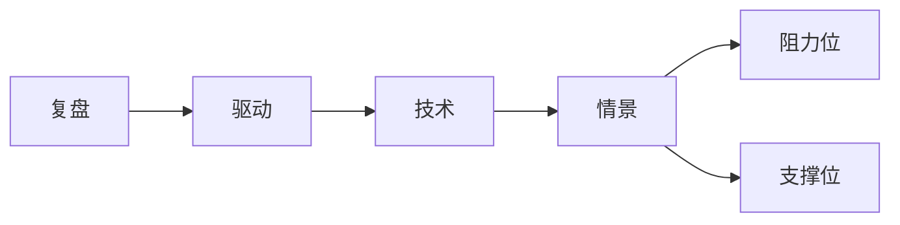
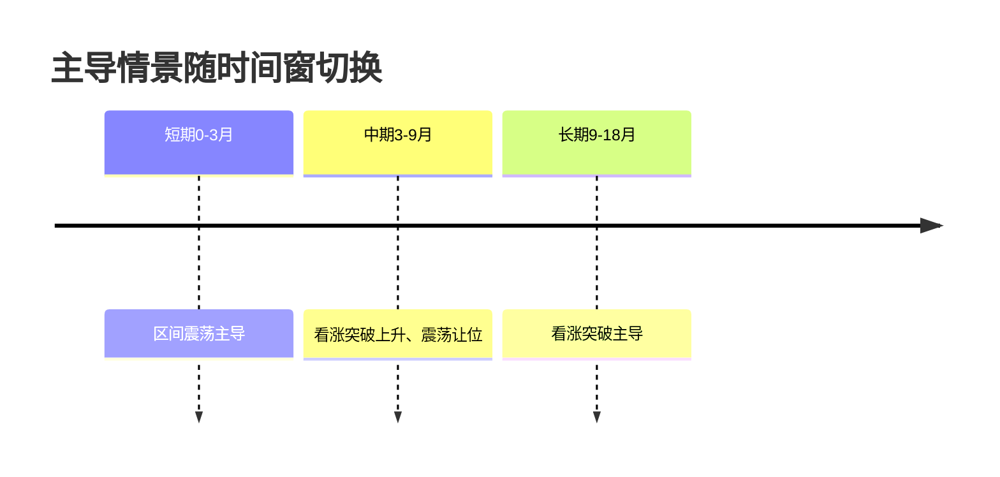
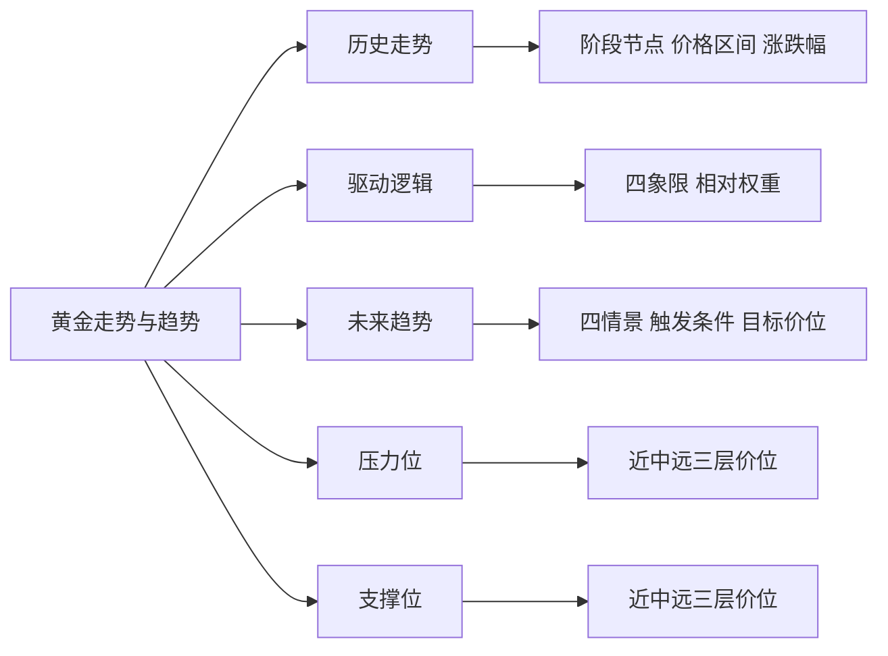
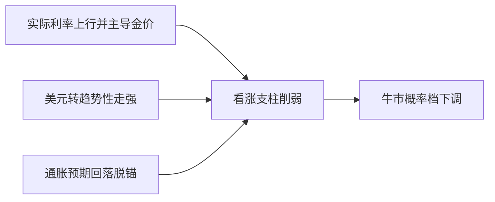

# 黄金2010年至今走势复盘与未来趋势：核心驱动、多情景推演与关键价位

黄金正处于2010年以来最深刻的一次定价范式切换：**传统的实际利率锚定逻辑已经失效，央行购金与去美元化取代机会成本，成为决定金价中枢的结构性力量**。从2010年的267元/克到2026年1月28日的历史高点5589美元/盎司，金价在十六年间完成了相对布雷顿森林体系35美元基准约117倍的价值重估，同期美元对黄金贬值约99%[欧阳辉——黄金定价之锚的迁移：从实际利率到央行购金](https://ee.ckgsb.com/faculty/news/detail/157/25141.html)。

尽管华尔街普遍喊出6000至8500美元目标价，**本报告认为2026至2027年金价更可能在4300至6300美元宽幅区间内剧烈震荡，而非单边冲顶**——这与摩根士丹利6300、瑞银6200、摩根大通8000至8500美元的乐观共识形成明确分歧，更接近花旗对三个月内回落至4300美元的警示。展望2030年，由于矿产增速仅0.8%至1.2%、而央行年均购金约750吨[未来十年黄金价格有望长期结构性上涨（东方财富财富号）](https://caifuhao.eastmoney.com/news/20260329070446825695850)，结构性供需失衡支撑黄金长期上行，但流动性退潮与地缘缓和构成主要下行风险。

**核心判断：中期看震荡上行。关键压力位5589（历史高点）与6000至6300（机构密集目标区）；关键支撑位4423（200日均线）、4380（强支撑）与4000（心理与趋势分水岭），跌破4000方确认趋势逆转。**

---

# 1 研究框架与情景定义

本报告以**伦敦现货金（XAU/USD，美元/盎司）为唯一主口径**。人民币计价金、COMEX期货相对主口径存在系统性偏离，引用时单独标注。未来12至24个月，黄金以"高位震荡偏多"为基准情景：看涨突破与区间震荡两态合计承载主要概率，趋势反转下跌为低概率尾部。

四种情景的完整定义如下：

| 情景 | 方向 | 主要宏观触发 | 关键技术信号 | 目标区间（美元/盎司） | 概率倾向 | 时间窗 |
|---|---|---|---|---|---|---|
| 看涨突破 | 上行加速 | 实际利率下行+央行净购金延续 | 站稳前高并放量 | 前高上方延伸 | 中高 | 短至中期 |
| 区间震荡 | 横向整理 | 实际利率与美元僵持 | 阻力位与支撑位间反复 | 上下沿之间 | 中高 | 短至中期 |
| 回调修复 | 阶段下行后企稳 | 实际利率阶段性回升 | 跌破近端支撑后于回撤位企稳 | 中段支撑带 | 中 | 短期 |
| 趋势反转下跌 | 趋势性下行 | 实际利率持续走高+去美元化逆转 | 跌破长期趋势位 | 长期趋势位下方 | 低 | 中至长期 |

## 1.1 六维评分体系

可复核的趋势研判依赖显式的评分骨架。本报告采用六维加权评分，权重按"驱动力强弱"分配：

| 维度 | 权重 | 说明 |
|---|---|---|
| 宏观基本面驱动 | 30% | 主导长期估值中枢与中期方向 |
| 技术面结构 | 20% | 均线、形态、斐波那契回撤位 |
| 资金与央行购金 | 20% | 结构性需求侧支撑 |
| 避险与地缘 | 15% | 脉冲式快变量 |
| 概率倾向 | 10% | 情景概率排序 |
| 时间维度 | 5% | 修正项 |

打分尺度统一为-2至+2五档（强空、偏空、中性、偏多、强多），加权求和得情景综合得分。这套设计**刻意采用低维加权而非建模六维间的全部交互**，用可解释性与可复核性换取交互精度——这是被明确接受的取舍[A Finite-Calibration Regime Map for LLM Judge Panels](https://arxiv.org/html/2606.01034)。高度相关的因子（如美元已部分内含于宏观维度）在维度内部消化，维度之间只做加权。

## 1.2 报告逻辑链

报告主干是一条单向递进的因果链：**事实先于解释、解释先于推演、推演先于定价**。

§2分阶段复盘建立事实基底；§3拆解因果机制；§4进行多周期技术分析；§5推演四种情景概率；§6、§7分别梳理关键压力位与支撑位。任何对情景结论的质疑，均应回溯到事实或机制去证伪，而非孤立攻击概率数字本身。

---

# 2 2010年至今走势分阶段复盘

## 2.1 2010—2011 牛市冲顶

2010至2011年是金融危机后避险需求延续与欧债危机共同推动的冲顶行情。人民币计价口径下，金价从2010年的267元/克升至2011年的374—386元/克，**单年涨幅约40%，是整个大周期中最陡峭的年度升幅**[沃唐卡对近15年黄金价格走势全面分析（2010-2025年）](https://www.wotangka.com/149325.html)。

2011年9月6日，现货金盘中最高触及**1920.03美元/盎司**[中国网络电视台](http://jingji.cntv.cn/20110906/109788.shtml)，两个独立来源对1920美元这一整数关口互证[中国建设银行](http://group.ccb.com/chn/2012-02/15/article_2021082106131970103.shtml)。这一高点是避险需求、极低实际利率与流动性宽松三者叠加的结果，主因被归于"欧债危机推动"[沃唐卡对近15年黄金价格走势全面分析（2010-2025年）](https://www.wotangka.com/149325.html)。**该高点此后近九年内未被有效逾越，直到2020年8月才被突破**[央视新闻](https://s.cyol.com/articles/2020-08/05/content_k38eGqF0.html)，在2012—2019年间充当顶部阻力位。

驱动机制呈现清晰的双轮传导：欧债危机引发主权信用担忧，推升黄金避险溢价；危机后的宽松货币环境压低实际收益率，压缩持金机会成本[长江宏观于博团队·黄金货币属性分析](https://mp.weixin.qq.com/s/wo9tkeoCw6H8eitSfdIKgg)。当实际收益率为负时，持有不生息黄金的机会成本趋近于零，从而抬升金价估值中枢——PIMCO研究认为，实际收益率变化可以解释金价变动的大部分[Understanding Gold Prices | PIMCO](https://www.pimco.com/gbl/en/resources/education/understanding-gold-prices)。

**关键对比**：与2024年由央行买盘支撑的结构性上涨不同，2011年冲顶是避险与实际利率主导的单极行情，缺乏官方部门净购金这一结构性支柱。这意味着，若未来金价仅由避险溢价单独驱动而无央行买盘配合，其冲顶后的回撤风险将显著高于结构性上涨。

## 2.2 2013—2015 下跌与熊市

2013年的暴跌核心触发是美联储释放缩减QE的信号。2013年5至9月的缩减恐慌期间，**10年期美债收益率从1.93%飙升至2.74%，美元指数一个月内上涨约3.5%**[南华金业·缩减恐慌记录](https://www.z5d.net/wenda/4116.html)。实际收益率预期抬升，推高持金机会成本，金价失去估值支撑而下挫。

**这一阶段金价对实际利率上行毫无抵抗，根源在于当时缺少2022年后才显化的央行购金支撑**[长江宏观于博团队·黄金：如何定价，走向何方？](https://mp.weixin.qq.com/s/H3nc5V7Tj1xgP60PhON0Gw)。长江宏观于博团队指出，央行增持黄金使金价与实际利率的负相关规律从2022年才开始失效[长江宏观于博团队·黄金：如何定价，走向何方？](https://mp.weixin.qq.com/s/H3nc5V7Tj1xgP60PhON0Gw)——反推可知，2013年金价仍处于实际利率单因子主导的旧范式。

2015年12月17日，金价收于**1050.8美元/盎司，创2010年初以来最低点**[2015年12月黄金价格走势分析](http://211.88.33.68/article/fyqr/maoyi/201603/20160301287194.shtml)，与建行统计的1046.44美元互证[中国建设银行·2015年金价统计](http://www.ccb.com/cn/ccbtoday/jhbkhb/20160126_1453794822.html)。**以2011年约1920美元高点计，至2015年底约1050美元低点，金价累计回撤约45%**[中国建设银行](http://group.ccb.com/chn/2012-02/15/article_2021082106131970103.shtml)——这是2010年以来记录在案的最大幅度。这一周期低点其后未再被跌破，与官方部门逐步进场密切相关。

**阶段命题**：在缺少央行购金支撑的旧范式下，金价对实际利率上行与美元走强几乎毫无抵抗，从峰值到谷底可回撤约45%。这与2022—2024年"同样加息却逆势新高"形成本报告最重要的对照组。

| 阶段 | 关键水平 | 主导变量 | 涨跌定性 |
|---|---|---|---|
| 2011峰值 | 约1920美元 | 避险溢价+负实际利率 | 历史高点 |
| 2013暴跌 | 美债1.93%→2.74% | 实际利率上行 | 单年跌约15%（人民币计） |
| 2015低点 | 约1046—1051美元 | 美元强+加息预期 | 周期谷底 |

## 2.3 2016—2019 筑底修复

2016至2019年是金价在低点之上反复筑底、最终在降息周期重启下完成修复的过渡阶段。**这一阶段最具结构性意义的变化，是官方部门净购金开始成为金价底部支撑的萌芽**[长江宏观于博团队·黄金：如何定价，走向何方？](https://mp.weixin.qq.com/s/H3nc5V7Tj1xgP60PhON0Gw)。

金价在1100—1350美元区间震荡，下沿由2015年低点支撑、上沿受2011年高点压制，呈现"跌不下去、也涨不上来"的特征。**2018年各国央行净购金651.5吨，是本轮央行购金潮的重要起点**。本轮购金"多国央行更倾向于国内购金，也更偏好境内存储"，底层动机已非外汇头寸管理，而是顺应去美元化对冲与秩序重构[央行购金：目的和趋势 | 建投宏观·周君芝团队](https://mp.weixin.qq.com/s/Zi82GXCMnIpTQycH7I0W3g)。

2019年美联储货币政策从紧缩转向宽松，降息预期压低实际收益率，叠加2018年以来的央行托底，推动金价向上突破1350美元区间上沿，为2020年新高奠定基础。**与2011年缺乏央行买盘、冲顶后陷入深熊不同，2019年的突破已有官方部门托底，因而更易延续为新高而非回落**[长江宏观于博团队·黄金：如何定价，走向何方？](https://mp.weixin.qq.com/s/H3nc5V7Tj1xgP60PhON0Gw)。

---

# 3 驱动金价的核心逻辑与因果机制

黄金没有票息、分红或租金，其定价本质是一组宏观变量的函数。本章核心论断：**黄金的定价之锚正在从"实际利率主导"迁移到"不确定性对冲+央行购金主导"，这一切换解释了2022年以来传统负相关框架的阶段性失效。**

## 3.1 美元指数与实际利率

**实际利率与金价的负相关机制及其弱化。** 当10年期TIPS实际收益率下行，持有无息黄金的机会成本收缩，资金从计息资产流向黄金。FXMacroData认为这是少有的"既稳定又可操作"的宏观关系[Gold vs. Real Yields: The Classic Inverse Relationship - FXMacroData](https://fxmacrodata.com/articles/gold-vs-real-yields-tips-analysis)，它解释了2011年与2020年的两轮急涨。

但负相关并非历史常量。1970年代至2000年初，金价与实际利率反而呈正相关[金融界·黄金与实际利率历史关系](https://m.jrj.com.cn/madapter/stock/2024/04/07094840135658.shtml)。最直观的背离证据是：**自2024年初至报道时点，国际金价从约2000美元升至约5000美元、涨幅超100%，而同期10年期美债实际收益率始终在1.6%至2.3%窄区间内围绕约1.9%中枢震荡**[21世纪经济报道](https://www.21jingji.com/article/20260205/53d553fbb4c9b6310d4d45b9db001007.html)。价格翻倍而实际利率纹丝不动，是传统框架难以容纳的观测。

**美元指数的双重身份。** 美元既是黄金的计价货币（压制关系），又是黄金的避险竞争对手（替代关系）。这一矛盾由美国国际影响力的强弱调和：当美国公信力较强、国际环境不稳时，美元避险属性主导，负相关成立；当美元信用本身受质疑时，替代效应主导，金价与美元同涨[长江宏观于博团队·黄金货币属性分析](https://mp.weixin.qq.com/s/wo9tkeoCw6H8eitSfdIKgg)。CME Group指出，贸易争端与地缘冲突可能推动黄金和美元这两种避险资产同步上涨，从而打破传统负相关[CME Group·黄金与美元的演变关系](https://www.cmegroup.com/cn-s/insights/economic-research/2025/gold-and-the-us-dollar-an-evolving-relationship.html)。

**传统框架失效之争。** 这是2024-2025年黄金研究最具分歧的命题：

| 观点方 | 核心主张 | 对实际利率框架的定性 | 关键证据 |
|---|---|---|---|
| 欧阳辉/叶冬艳 | 定价之锚迁移 | 根本性迁移、金融属性转货币属性 | 金价2022起与实际利率背离[欧阳辉——黄金定价之锚的迁移：从实际利率到央行购金](https://ee.ckgsb.com/faculty/news/detail/157/25141.html) |
| 于博团队 | 负相关规律失效 | 失效，回归供需 | 央行增持致规律2022失效[长江宏观于博团队·黄金：如何定价，走向何方？](https://mp.weixin.qq.com/s/H3nc5V7Tj1xgP60PhON0Gw) |
| 中金 | 主流叙事不牢靠 | 未失效，但市场叙事有误 | 新高伴随利率上升[中金 | 黄金：一个跨越范式的"老框架"](https://mp.weixin.qq.com/s/SIl_-SwY0A2FSbmTIt5s_w) |
| J.P. Morgan | 结构性风险重定价 | 重定价而非失效 | 三年分散化收益下降[J.P. Morgan Asset Management](https://am.jpmorgan.com/us/en/asset-management/liq/insights/portfolio-insights/fixed-income/fixed-income-perspectives/is-golds-old-playbook-broken/) |

**本报告裁断**：传统实际利率框架在方向性上对2024-2025金价属于"部分失效"——它无法独立解释实际利率横盘而金价翻倍的观测，但并未被证伪，而是其解释份额被央行购金与结构性风险重定价所挤占。**美元与实际利率框架并非失灵，而是从"主导变量"降格为"必要而非充分条件"。**

## 3.2 美联储货币政策与流动性

**利率路径与流动性总量是两条独立的传导路径。**

加息周期对黄金的压制是经过近50年验证的三环因果链：加息抬升美债收益率，推升美元指数，压制金价[美联储加息对美债、美元指数与黄金影响分析（兴证期货）](https://www.xzfutures.com/files/document/20220418/6378588941604745361796748.pdf)。2022年是教科书案例：美联储年内加息7次，国际金价起于1800美元、终于1800美元，全年波幅超20%却近乎零涨幅，正是加息压制与衰退预期、避险支撑对冲的结果[黄金市场2022：通胀和加息较量不止，金价波幅超20%（第一财经）](https://www.yicai.com/news/101633936.html)。

**2026年3月的暴跌是流动性路径的反向验证**：美伊博弈撬动通胀预期，通胀预期上升导致流动性定价退坡，而流动性恰是2025年9月以来金价暴涨的原因[中信建投：黄金退却流动性之后（新浪财经）](https://finance.sina.com.cn/wm/2026-05-21/doc-inhyrfct6437489.shtml)。这揭示一个易被忽视的事实——**2025年金价的急涨中含有显著的"流动性过度定价"成分**。中信建投给出的化解：退潮洗去过度定价后，黄金回归"秩序重构和去美元化催生央行购金"的基本面，未来涨价或许更为平缓[中信建投：黄金退却流动性之后（新浪财经）](https://finance.sina.com.cn/wm/2026-05-21/doc-inhyrfct6437489.shtml)，即慢变量重新主导价格路径。

**本节综合**：美联储仍是金价短中期波动的第一触发器，但其影响已从"决定方向"退化为"决定节奏"——长期趋势已被更慢的变量（央行购金）接管。

## 3.3 央行购金与去美元化

官方部门净购金是本轮牛市区别于历史的核心新变量。与价格敏感的ETF不同，**央行购金是价格不敏感的逆周期买盘**，这从根本上改变了黄金的支撑位逻辑。

**量级**：全球央行2024年净购金1045吨，2025年净购金863吨[OnlineGold.org·央行黄金储备](https://onlinegold.org/analysis/central-bank-gold-reserves-2026/)。这里出现一个表面悖论——2025年购金量下降，金价却创历史新高。化解在于区分"流量"与"预期"：真正起作用的是市场对央行"持续买入"的预期，而非某一年的具体吨数；2025年急涨主因是流动性而非当期购金流量[中信建投：黄金退却流动性之后（新浪财经）](https://finance.sina.com.cn/wm/2026-05-21/doc-inhyrfct6437489.shtml)。

**动机**：本轮购金的底层动机是储备多元化与去美元化对冲。俄乌冲突后美欧冻结俄罗斯储备资产，冲击全球信用体系，促使各国央行增持黄金以规避政治风险，反映国际社会对美元信任度的下降[长江宏观于博团队·黄金：如何定价，走向何方？](https://mp.weixin.qq.com/s/H3nc5V7Tj1xgP60PhON0Gw)。截至2025年三季度末，**全球官方黄金储备占比达28.9%，创2000年以来新高；美元在全球外汇储备占比降至56.92%，连续超十个季度低于60%**[全球央行抢金潮，如何重塑国际储备格局（36氪）](https://www.36kr.com/p/3646278745607810)。

**结构性意义**：由于购金动机是战略性去美元化对冲而非价格投机，**购金需求对金价上涨不敏感，金价越涨央行越不会因"贵"而停止买入**。叠加矿产金供应增速仅0.8%-1.2%、央行购金年均约750吨[未来十年黄金价格有望长期结构性上涨（东方财富财富号）](https://caifuhao.eastmoney.com/news/20260329070446825695850)，逆周期买盘持续吸纳本就增速缓慢的新增供给，构成对金价支撑位的强支撑。该维度判定为"强正面"。

---

# 4 多周期技术面结构分析

多周期框架的核心纪律是分层：**月线/年线定义长期趋势位，周线刻画中期通道与形态，日线提供短期技术位与动能信号**。研究表明，依赖更短周期的价格图表会增加交易频率与成本，导致投资者福利损失，却不改变平均风险水平[Journal of Banking & Finance, "Time frames and investor welfare"](https://www.sciencedirect.com/science/article/pii/S0378426621003022)——这为分层标注提供了实证理由。

**核心结论先行**：伦敦现货金的长期上升主线在月线尺度上仍未出现方向性破坏信号；短期动能在2026年6月围绕200日均线约4423—4425美元反复争夺[FXStreet, "Gold Price Forecast: XAU/USD eyes 200-day SMA near 4,425"（2026/6/3）](https://www.fxstreet.com/analysis/gold-price-forecast-xau-usd-eyes-200-day-sma-near-4-425-on-renewed-gulf-hostilities-firmer-oil-202606030411)[FXEmpire, "Gold Price Rebounds From 200-Day MA as Rate Cut Bets Return"（2026/6/4）](https://www.fxempire.com/forecasts/article/gold-news-gold-price-rebounds-from-200-day-ma-as-rate-cut-bets-return-1602438)，中短期处于强势震荡而非趋势反转。

## 4.1 长期趋势结构

2025年金价先后突破3000美元、4000美元大关，10月20日以**4294.35美元/盎司刷新历史新高，年内涨幅近58%**[欧阳辉——黄金定价之锚的迁移：从实际利率到央行购金](https://ee.ckgsb.com/faculty/news/detail/157/25141.html)。这一新高是长期趋势位判读的锚点。

| 长期判读维度 | 关键趋势位 | 当前状态 | 对情景方向的含义 |
|---|---|---|---|
| 长期上升通道 | 3000、4000美元整数关口 | 2025年相继突破并加速 | 上升主线延续概率高 |
| 多年级别前高 | 4294.35美元（2025/10/20） | 当前最高趋势位 | 突破即开新上行空间 |
| 多年级别前低 | 3000美元（转支撑） | 央行购金提供买盘垫 | 跌破概率偏低 |
| 长周期均线方向 | 月线均线序列 | 维持向上 | 方向性破坏信号未现 |

## 4.2 中期通道与斐波那契

斐波那契回撤位由一段行情的显著高点与低点之间的垂直距离计算，使用23.6%、38.2%、50%、61.8%、78.6%比率；扩展位以同一基准向100%以上投射[Bacon Lo Trading, "Fibonacci Retracement and Extension Levels"](https://www.baconlo.com/fibonacci2/)。

**回撤位与情景的对应关系**：38.2%回撤位通常对应强势浅回调（看涨突破或区间震荡），61.8%回撤位对应深度回调（回调修复），跌破78.6%往往预示趋势反转的技术确认。**若周线61.8%回撤位与日线200日均线约4423—4425美元出现重合，则该重合带将成为中期回调修复情景下最值得关注的强支撑区。**

## 4.3 短期动能与方法论局限

短期日线分析承担"找入场点"职能，但必须以长期方向和中期结构为前提。多周期信号冲突是固有的——日线显示上涨时4小时图可能正回调，源于价格的分形特性[XtradingTime交易内训·多周期信号冲突与价格传导](https://www.xtradingtime.com/articles/multi-timeframe-conflicts-price-transmission/)。

**这意味着任何单一日内点位都不应被赋予长期情景的判断权重。** 解决之道在于分层使用而非取舍：用长期趋势位锁定方向，用中期结构定位区间，用短期技术位择时，三者各取所长；短期点位的判断权重必须严格低于长期方向，否则就会陷入"以短期噪声混淆长期信号"的福利损失陷阱[Journal of Banking & Finance, "Time frames and investor welfare"](https://www.sciencedirect.com/science/article/pii/S0378426621003022)。

**操作含义**：读者应将4400—4500美元的阻力带与3800—4000美元的支撑带理解为中长期情景区间，而非日内交易点位。

2026年6月3日、6月4日金价围绕200日均线4423.23—4425美元的两次成功测试[FXStreet, "Gold Price Forecast: XAU/USD eyes 200-day SMA near 4,425"（2026/6/3）](https://www.fxstreet.com/analysis/gold-price-forecast-xau-usd-eyes-200-day-sma-near-4-425-on-renewed-gulf-hostilities-firmer-oil-202606030411)[FXEmpire, "Gold Price Rebounds From 200-Day MA as Rate Cut Bets Return"（2026/6/4）](https://www.fxempire.com/forecasts/article/gold-news-gold-price-rebounds-from-200-day-ma-as-rate-cut-bets-return-1602438)，配合RSI从超买回落至中性、MACD高位收敛，表明**短期动能处于强势震荡的整理状态，而非趋势反转的衰竭状态**。

| 短期判读维度 | 关键状态 | 对情景的含义 |
|---|---|---|
| 200日均线 | 约4423—4425美元（两次测试守住） | 短期下沿支撑，跌破为反转信号 |
| RSI | 由超买回落至中性 | 动能整理，非反转 |
| MACD | 高位收敛/可能死叉 | 死叉+跌破均线方为反转确认 |

---

# 5 未来趋势多情景推演

自2022年以来，驱动金价屡创新高的不再是单纯的利率预期，而是全球央行持续且规模空前的购金潮[欧阳辉2024·黄金定价之锚的迁移（CKGSB）](https://www.ckgsb.com/faculty/news/detail/157/25141.html)。本章把多周期技术结构转译为四条可证伪的情景路径，每个情景附带宏观与技术双重触发条件、概率倾向、时间窗与失效条件。**黄金的未来不是一个数字，而是一组带条件概率的路径，唯有当触发变量被观测到时，对应路径的权重才应被调高。**

各情景的基准坐标：截至2026年5月17日，黄金报价4540美元/盎司，较1月28日所创的5589美元历史新高回撤约-19%[getdir.app2026, "Gold Price Forecast 2026 — $4,540 Pullback Analysis"](https://getdir.app/en/gold-price-forecast-2026-05-17/)；5月中旬以来现货金基本在4500—4700美元区间震荡[财联社2026·金价为何跌？避险光环失灵了？](https://www.cls.cn/detail/2321752)。

## 5.1 看涨突破情景

**定义与方向.** 金价以4540美元为低位平台，经放量整固后向上挑战并有效突破5589美元历史新高，进入全新价格发现阶段。这是本轮央行购金主导牛市的延续与升级，但据中信建投，退却流动性过度定价后涨价节奏或许更为平缓[中信建投：黄金退却流动性之后（新浪财经）](https://finance.sina.com.cn/wm/2026-05-21/doc-inhyrfct6437489.shtml)，因此突破后斜率预计低于2025年。

**宏观触发.** 需要降息预期与去美元化对冲需求共振：降息压低实际收益率、降低持金机会成本，央行购金提供突破后的支撑垫。这是"高门槛通过"——多变量需同向共振才能达成。

**技术信号.** 遵循真突破四要素：盘整、放量、收盘站稳、与高周期趋势一致[CoinMarketMan2026, "Breakout Trading Tips"](https://coinmarketman.com/zh/blog/breakout-trading-tips/)。第一道信号是放量收盘站稳4500—4700美元上沿，第二道是周线收盘有效突破5589美元历史新高。**判断真伪的最硬标准在于周线收盘是否有效站稳并伴以量能配合，而非日内瞬时穿刺。**

**目标价位.** 以WGC估值框架推算[World Gold Council2026, "Gold Outlook 2026"](https://www.gold.org/goldhub/research/gold-outlook-2026)，以4540美元为基准，第一目标区4760—4900美元，第二目标约5200美元，强突破延伸目标约5900美元。

**概率与时间.** 呈"前低后高"的爬坡结构：短期门槛最高、权重最低；中期随降息兑现而上调；长期若购金延续达到峰值。**中长期方向占优、短期需审慎。**

**失效条件.** 三项反证：降息预期落空或转向加息，推升实际收益率；央行购金趋势性逆转；价格多次冲击历史新高未果并回落跌破4000美元。

## 5.2 区间震荡情景

**定义与方向.** 金价在4500—4700美元核心区反复运行、既不有效突破也不破位，方向中性偏强。据中信建投，2026年金价因美伊冲突走向"沉寂"、相较其他资产明显走弱[中信建投：黄金退却流动性之后（新浪财经）](https://finance.sina.com.cn/wm/2026-05-21/doc-inhyrfct6437489.shtml)，这正是震荡情景的现实写照。它是当前定价之锚迁移过渡期的典型形态——旧锚失效、新机制还需新增买盘才能推动突破。

**宏观触发.** 流动性退坡与基本面支撑的平衡：央行购金提供下沿买盘，降息预期尚未兑现使突破动能不足，两股力量相持。这是四情景中触发条件最宽松的一类——其他三个情景触发条件均未充分满足时的默认状态。

**技术信号.** 价格在200日均线约4423—4425美元上下反复测试而不形成有效突破或跌破，RSI在中性区间反复，MACD围绕零轴震荡。

**目标价位.** 核心区4500—4700美元为高确定性边界，扩展箱体4300—4900美元为情景假设边界。

**概率与时间.** **短期（3—6个月）概率最高**，本质是过渡而非终态：横向整理是过渡期阻力最小的路径。降息加速则缩短，宏观钝化则延长。

**失效条件.** 向上失效——降息实质启动叠加央行购金加速，突破4900美元转入看涨突破；向下失效——央行购金退坡叠加实际收益率上行，跌破4300美元转入回调修复或趋势反转。

## 5.3 回调修复情景

**定义与方向.** 金价因避险溢价消退而健康回撤，在关键支撑位获承接后重拾升势，方向中期偏多、短期偏空。本质是牛市主趋势中的技术性调整，前提是央行购金主导的估值中枢未被破坏。

**宏观触发.** 短期利空（如2026年3月的流动性冲击）触发回调，长期基本面（去美元化催生的央行购金）托底回调[中信建投：黄金退却流动性之后（新浪财经）](https://finance.sina.com.cn/wm/2026-05-21/doc-inhyrfct6437489.shtml)。地缘风险降温与风险偏好升温共同推动避险买盘撤离，但央行购金为回撤设定底线。

**技术信号.** 价格跌破200日均线后，在周线61.8%斐波那契回撤位或3800—4000美元平台获支撑；修复确认为底部K线反转形态、RSI从超卖回升、MACD金叉。**完整剧本是"先抑后扬"三幕剧：避险溢价消退引发回撤→回撤至关键支撑获缩量承接→出现底部反转形态确认再上行——三步缺一不可。**

**目标价位.** 回调下探目标3500—4000美元：4000美元（2025年突破的关口转支撑）为浅回调支撑，3500美元为深回调支撑。修复后反弹目标重回4294.35美元历史新高附近。

**概率与时间.** 中等概率（约25%—35%），短中期事件。长期牛市中回调是常态，但2026年流动性退坡后涨幅趋缓使大幅回调空间相对有限。

**失效条件.** 向下失效——跌破78.6%回撤位且央行购金趋势性逆转，则升级为趋势反转；向上失效——浅尝即止未触及61.8%即重回历史新高上方，则切换为看涨突破。**回调的深度与支撑反应，是区分修复与反转的关键标尺。**

## 5.4 趋势反转下跌情景

**定义与方向.** 月线长周期均线由向上转为走平乃至拐头，价格有效跌破多年级别前低与3000美元整数关口，周线进入下降通道，方向中长期向下。**这一情景要求长期趋势位的方向性破坏，而非日内噪声或中级回调。**

**宏观触发.** 黄金定价逻辑的反向迁移——央行购金退坡、去美元化对冲需求消退、实际收益率大幅持续上行三者共同打掉黄金的货币储备溢价与避险溢价。

**技术信号.** 层层递进：日线有效跌破200日均线→周线跌破78.6%回撤位→月线长周期均线走平拐头并跌破3000美元。**单一周期的跌破不足以确认反转，必须月线、周线、日线同时破位**[XtradingTime交易内训·多周期信号冲突与价格传导](https://www.xtradingtime.com/articles/multi-timeframe-conflicts-price-transmission/)。

**目标价位.** 2500—3000美元及以下。但鉴于央行购金的结构性买盘[全球央行抢金潮，如何重塑国际储备格局（36氪）](https://www.36kr.com/p/3646278745607810)，即便进入反转情景，下跌也可能在央行购金成本区获阶段性支撑。

**概率与时间.** **最低概率（约5%—15%）的尾部情景**。其实现需要去美元化与央行购金两大结构性支柱同时瓦解，而供需基本面长期失衡使这一瓦解在中短期内难以发生[未来十年黄金价格有望长期结构性上涨（东方财富财富号）](https://caifuhao.eastmoney.com/news/20260329070446825695850)。

**失效条件.** 只要央行购金维持结构性增量、去美元化对冲需求持续，月线长周期均线即难以走平拐头，趋势前提不成立。**央行购金的持续性是这一情景最关键的反证变量。**

## 5.5 概率排序与时间迁移

四情景的概率赋值是综合宏观触发门槛、技术结构与历史镜像后给出的主观情景赋值，**刻意规避"分区依赖偏差"**——即不机械地各赋25%，而是依据触发门槛差异化分配[Management Science2006, "Partition Dependence in Subjective Probability Assessment"](https://pubsonline.informs.org/doi/abs/10.1287/mnsc.1050.0409)。

| 情景 | 方向 | 短期(0—3月) | 中期(3—9月) | 长期(9—18月) | 目标区间（美元/盎司） | 核心触发 |
|---|---|---|---|---|---|---|
| 区间震荡 | 中性 | 最高 | 较高 | 中 | 4500—4700核心/4300—4900箱体 | 利率中性+美元避险拉锯 |
| 回调修复 | 先抑后扬 | 中 | 中 | 中 | 回撤逼近3900后再上行 | 避险溢价消退 |
| 看涨突破 | 上行 | 偏低 | 较高 | 最高 | 4760—5900 | 降息快于指引+央行购金延续 |
| 趋势反转 | 下行 | 最低 | 偏低 | 偏低 | 3630—4310 | 实际利率上行+美元走强 |

**主导情景随时间窗迁移**：

**这就是本报告对"黄金未来可能趋势"的方向性回答：短期以震荡为主导、中长期天平向看涨突破倾斜、趋势反转始终是低概率尾部。** 切换遵循清晰因果链：过渡期的震荡，因降息逐步兑现而向上倾斜，进而在购金延续的条件下升级为看涨突破。每次跃迁都以触发条件被观测到为前提；触发条件未现，则不应调整权重。

**本章无法独立解决的开放问题**：在央行购金这一新锚之下，实际收益率上行对金价的压制力究竟被削弱了多少——历史镜像（2022—2023年20%跌幅）能否重演，取决于购金中枢的缓冲强度，这一强度尚无足够数据精确量化。

---

# 6 关键压力位（阻力）梳理

压力位强度按共振分级量化：单一价位带叠加1-2个独立因素属弱级，3个属中等，4-5个属强级，6个及以上为超强级[qihuo188.com·共振分级：因素数与强度对照](https://qihuo188.com/baike/content/sp-combo.html)。

## 6.1 三层压力位

**短期压力位**集中在4500—4510美元一带（短期均线压制）[新浪财经·黄金短期核心压力集中在4500-4510区间（2026/6/4）](https://finance.sina.com.cn/money/nmetal/hjfx/2026-06-04/doc-iniafmms3696692.shtml)，及4488—4492美元（盘面强压制）[黄金网_中金在线·上方强压制位于4488-4492一线（2026/6/4）](http://gold.cnfol.com/mingjiadianjin/20260604/32269623.shtml)，均为弱级，易被快速突破或回落。

**中期压力位**由周线通道上沿、前期高点、斐波那契161.8%扩展位与中期均线共同界定[Haocaimi·中期支撑/压力与20日、60日均线](https://www.haocaimi.com/sup-and-res.html)，时间尺度以周至月计。

**长期压力位**由历史新高区、心理整数关口与长期上升通道上轨共同界定。**历史新高区是长期最强的压制类型之一**——前期在高位被套的长线资金会在价格重返该区域时倾向于回本离场，形成天然抛压。

**突破历史高点的结构意义远超普通阻力位**：它意味着市场对黄金的长期估值共识被整体上修，价格进入无套牢盘压制的"真空"区间，后续上行将因缺乏上方套牢盘而更具弹性，目标位将由斐波那契扩展位与心理整数关口接力界定。

**关键区分**：历史新高既可能是长期牛市的起点，也可能是阶段性顶部，区分标准不在价格本身，而在突破是否由宽松的宏观贴现率环境支撑[MarketScreener Canada, "A decade of S&P 500 retracements"](https://ca.marketscreener.com/news/a-decade-of-s-p-500-retracements-ce7e5ed3d98bf42c)。**若突破伴随降息周期开启，更可能是牛市起点；若突破发生在利率高位且无基本面配合，则须警惕其为情绪驱动的阶段性顶部。**

## 6.2 压力位汇总表

| 时间维度 | 价位（美元/盎司） | 主要依据 | 因素数 | 强度 |
|---|---|---|---|---|
| 短期（日线） | 4488—4510 | 盘面强压制+短期均线压制叠加 | 2 | 弱 |
| 中期（周线） | 滚动测算 | 通道上轨+60日均线+前期高点 | 3 | 中等 |
| 中期（周线） | 滚动测算 | 161.8%扩展+通道上轨+前期高点 | 3 | 中等 |
| 长期（月线） | 历史新高区+整数关口 | 套牢盘+心理整数关口 | 2 | 弱 |
| 长期（月线） | 历史新高区附近 | ATH套牢盘+整数关口+通道上轨 | 3 | 中等 |
| 长期（月线，强共振） | 长期通道上轨附近 | 161.8%扩展+通道上轨+ATH区+整数关口 | 4 | 强 |

**核心结论：当前金价上方真正的强级压制并不在近端短期价位（均为弱级），而在长期月线层面多重依据高度汇聚处**——只有当161.8%斐波那契扩展、长期通道上轨、历史新高区与心理整数关口四者重合时，才构成强级压制[qihuo188.com·共振分级：因素数与强度对照](https://qihuo188.com/baike/content/sp-combo.html)。短期价位适合执行层进出，方向判断须锚定长期共振区，二者不可混用。

---

# 7 关键支撑位梳理

**核心判断先行**：就2026年年中结构而言，最具可靠性的强支撑位于**4400—4380美元区间**，中期第二道防线在**200日均线（约4422美元）**，而长期价值底部由官方部门净购金提供支撑。

## 7.1 三层支撑位

**短期支撑**：金价下方核心强支撑在4400—4380美元区间，被视为阶段性低位防守区[中金在线财经号·黄金盘面强支撑](http://mp.cnfol.com/59052/article/1780621524-142470174.html)。该区间既是近期下跌的密集成交区下沿，又逼近4400整数关口，双重依据强化其防守属性，成色判定为"中等偏强"。折返次数越多，支撑作用越强[外汇邦·支撑与阻力技术分析](https://www.waihuibang.com/fxschool/technical/54172.html)——该平台每多守一次，可靠性便累积增强一分。

**短期支撑失守的因果链**：4400—4380跌破→前期多头转浮亏并触发止损→止损盘集中抛售压低价格→引发追跌→金价向200日均线下方寻求承接。但失守更多由流动性定价退坡这类短周期因素触发，而非基本面恶化[中信建投：黄金退却流动性之后（新浪财经）](https://finance.sina.com.cn/wm/2026-05-21/doc-inhyrfct6437489.shtml)——只要央行购金与去美元化未逆转，下行多表现为回踩而非趋势反转。

**中期支撑**：**200日均线**是核心价位锚点，2026年6月初位于4422.42美元附近[新浪财经·200日均线支撑（2026/6/2）](https://finance.sina.com.cn/money/nmetal/hjfx/2026-06-02/doc-inhzzumn1441932.shtml)，恰好略高于4400—4380短期平台，两者构成"近密集区+中期均线"的叠加缓冲带，使下行动能被层层消化。200日均线同时具备趋势参照、前期突破回踩与机构资金关注三重属性，成色判定为"强"。

需注意，**当短期流动性溢价被挤出后，中期支撑的真正底气来自央行购金这一基本面买盘**[中信建投：黄金退却流动性之后（新浪财经）](https://finance.sina.com.cn/wm/2026-05-21/doc-inhyrfct6437489.shtml)。中期支撑的可靠性已不能仅由技术形态解释，而必须叠加央行购金共同判定。

**长期支撑**：核心逻辑不在技术形态，而在官方部门净购金对价格底部的支撑。截至2025年12月末，中国官方黄金储备约2306.32吨，连续第14个月增持[全球央行抢金潮，如何重塑国际储备格局（36氪）](https://www.36kr.com/p/3646278745607810)。央行购金是主权层面的战略配置行为，时间跨度以年计，不随短线价格波动而进出。**4000美元与3000美元这两个曾被突破的历史整数关口，在长期视角下已从压力位转化为潜在的长期支撑。**

**逆周期逻辑是理解长期底部韧性的关键**：央行购金动机来自规避政治风险与去美元化对冲，而非短线追涨，故金价越跌反而越买，对下跌形成承接。长期底部更可能表现为逐步抬升的价值中枢而非固定地板[未来十年黄金价格有望长期结构性上涨（东方财富财富号）](https://caifuhao.eastmoney.com/news/20260329070446825695850)。

## 7.2 支撑位汇总表

| 周期 | 支撑位（美元/盎司） | 主要依据 | 强弱 |
|---|---|---|---|
| 短期 | 4400—4380 | 密集区下沿+4400整数关口[中金在线财经号·黄金盘面强支撑](http://mp.cnfol.com/59052/article/1780621524-142470174.html) | 中等偏强 |
| 中期 | ~4422（动态） | 200日均线[新浪财经·200日均线支撑（2026/6/2）](https://finance.sina.com.cn/money/nmetal/hjfx/2026-06-02/doc-inhzzumn1441932.shtml) | 强 |
| 中期 | 4000 | 历史整数关口+前期突破位[欧阳辉——黄金定价之锚的迁移：从实际利率到央行购金](https://ee.ckgsb.com/faculty/news/detail/157/25141.html) | 强 |
| 长期 | 3000 | 历史整数关口+长期趋势位[欧阳辉——黄金定价之锚的迁移：从实际利率到央行购金](https://ee.ckgsb.com/faculty/news/detail/157/25141.html) | 强 |
| 长期（价值中枢） | 随央行购金抬升 | 官方部门净购金底部支撑[央行购金托底黄金坐上储备资产"头把交椅"](https://www.cnfin.com/dz-lb/detail/20260604/4421721_1.html) | 结构性强 |

## 7.3 跌破后的下行路径

**下行路径越往深处，失守所需的基本面条件越苛刻**：短期平台失守多由流动性退坡触发、易跌易守；4000美元整数关口失守需中期趋势实质转弱；3000美元长期趋势位失守则需央行购金这一基本面动机出现趋势性逆转。即便短期支撑失守，金价大概率在4000美元附近获较强承接；只有当央行购金逻辑逆转，才可能击穿3000美元，此时方构成真正的趋势反转。

---

# 8 机构预测汇总与分歧解析

主流机构对2026-2027年金价的目标价呈现罕见的宽幅离散，**这种离散不是噪声，而是定价框架之争的直接外显**。

## 8.1 目标价对比

机构目标价呈现"基准阵营密集、极端阵营发散"的双峰结构。最戏剧化的对立出现在花旗的短期看空与多数投行的中长期看涨之间：**花旗给出三个月内跌至4300美元的短期判断，而同期富国银行仍看多2027年冲击8000美元**[虎嗅网·机构目标价分歧](https://www.huxiu.com/article/4863871.html)。

| 机构/人物 | 目标价（美元/盎司） | 时间维度 | 梯队 |
|---|---|---|---|
| 花旗 | 4300（看空） | 三个月 | 短期空头 |
| 高盛 | 5400–6100 | 2026–2027 | 基准看涨 |
| 美银/富国 | 6000–6300 | 2026–2027 | 基准看涨 |
| 瑞银 | 6200 | 2026–2027 | 基准看涨 |
| 摩根士丹利 | 6300 | 2026–2027 | 基准看涨 |
| 富国（多头） | 8000 | 2027 | 偏极端多 |
| 摩根大通 | 8000–8500 | 长期 | 极端多 |
| 彼得·希夫 | 11400 | 重演2008 | 极端多 |
| 罗伯特·清崎 | 35000 | 长期 | 尾部极端 |

来源：新浪财经[新浪财经·主要机构目标价汇总](https://k.sina.cn/article_7879922977_1d5ae152106801evkq.html?from=finance)、虎嗅网[虎嗅网·机构目标价分歧](https://www.huxiu.com/article/4863871.html)、Odaily[Odaily·机构目标价离散度](https://www.odaily.news/zh-CN/post/5210085.html)汇总。

**关键结构**：真正的"共识区间"集中在5400至6300美元这900美元带内，约55%至65%的主流机构目标落在此区间，构成未来12至18个月最可能的价格中枢；8000美元以上属于尾部情景，不应与基准共识等量齐观。**整个预测带从4300美元到35000美元、跨度超8倍，说明市场对"方向"的共识远强于对"幅度"的共识。**

## 8.2 分歧根源

近8倍的多空差距由三层叠加而成：

**定价框架之争。** 极端看涨阵营（摩根大通、彼得·希夫）采用**信用锚定框架**，把金价视为对法币购买力长期贬值的对冲，目标价可脱离短期利率看到8000美元以上[新浪财经·主要机构目标价汇总](https://k.sina.cn/article_7879922977_1d5ae152106801evkq.html?from=finance)；花旗的短期看空采用**不确定性对冲框架**，认为黄金价格主要由当下避险溢价与实际利率决定[虎嗅网·机构目标价分歧](https://www.huxiu.com/article/4863871.html)。两套框架并非对错之分，而是适用时间窗口不同：**不确定性对冲在短窗口内更有解释力，信用锚定在多年尺度上更有效，混用时间尺度正是目标价分歧的制造者。**

**宏观假设之差。** 看涨阵营假设美联储进入持续宽松周期、避险溢价是结构性的；看空阵营假设降息慢于预期、避险溢价是事件驱动可逆的[股市基友·黄金4500散点风险](https://stockbuddyletter.com/gold-4500-scatter-risk-2026/)。看空阵营对避险溢价"事件驱动、可逆"的定性在短期更站得住脚。

**市场结构性动机。** Scope Markets警告，**华尔街激进的6000美元目标价可能在为机构制造退出流动性的同时，把散户诱入类似1980年代的投机陷阱**[Scope Markets EU CEO via Finance Magnates](https://www.financemagnates.com/forex/analysis/wall-streets-6000-gold-price-targets-may-be-setting-a-retail-trap-warns-scope-markets-eu-ceo/)。这构成一个重要的多空不对称：看涨目标价越高，越需警惕其中的情绪放大与退出流动性动机。读者应把极端目标价当作情景边界、而非中心预期来使用。

## 8.3 机构观点与本文情景的映射

- **看涨突破情景**：摩根大通8000-8500、富国2027年8000、Ainvest 7000均对应此情景[新浪财经·主要机构目标价汇总](https://k.sina.cn/article_7879922977_1d5ae152106801evkq.html?from=finance)，大致对应WGC"恶性循环"15%-30%涨幅。基准看涨阵营5400-6300美元为第一阶梯（中高概率，中期窗口），8000美元以上为第二阶梯（尾部，长期窗口）。
- **区间震荡情景**：基准阵营5400-6300美元区间可重新解读为震荡箱体上下沿[新浪财经·主要机构目标价汇总](https://k.sina.cn/article_7879922977_1d5ae152106801evkq.html?from=finance)，瑞银6200、美银6000-6300不再读作"必达目标"，而是"箱体上沿的反复测试位"。
- **回调修复情景**：**花旗4300美元是最典型的映射对象**[虎嗅网·机构目标价分歧](https://www.huxiu.com/article/4863871.html)。这一回调由避险溢价与短期利率驱动，而央行购金等长期结构性驱动并未逆转，因此价格能在关键支撑企稳而非趋势反转。4300美元不是趋势终点，而是多头重新布局的位置。
- **趋势反转下跌情景**：主流基准机构几乎无人主张，属低概率尾部。其成立需长期驱动逻辑实质逆转——**最关键的逆转信号是央行净购金从结构性高位显著回落，去美元化对冲的核心支柱被抽走。**

---

# 9 综合因果研判

综合研判的价值，在于揭示各驱动因子如何相互放大、相互制约。核心结论：**当前金价的定价主轴已从实际利率迁移至官方部门净购金量，这使得长期趋势的底部被系统性抬升，而短期波动仍由流动性与避险溢价主导。**

## 9.1 驱动因子耦合路径

**四元正反馈环（实际利率—美元—降息—避险）。** 美联储释放降息信号，引致实际收益率下行，持金机会成本降低，金价抬升；金价上行又强化宽松预期，压低美元，形成自我放大[Understanding Gold Prices | PIMCO](https://www.pimco.com/gbl/en/resources/education/understanding-gold-prices)[Gold vs. Real Yields: The Classic Inverse Relationship - FXMacroData](https://fxmacrodata.com/articles/gold-vs-real-yields-tips-analysis)。但避险溢价会临时覆盖这一机制：极端避险期，黄金与美元可能同步上涨[CME Group·黄金与美元的演变关系](https://www.cmegroup.com/cn-s/insights/economic-research/2025/gold-and-the-us-dollar-an-evolving-relationship.html)。**研判时必须区分"利率驱动型美元"与"避险驱动型美元"两种情形。**

**通胀预期的反直觉机制。** 通胀预期上行并非总是利多黄金——一旦它触发市场对更紧货币路径的定价、抽离流动性，反而会压制金价。2026年3月暴跌正是此机制：美伊冲突撬动通胀预期，导致流动性定价退坡[中信建投：黄金退却流动性之后（新浪财经）](https://finance.sina.com.cn/wm/2026-05-21/doc-inhyrfct6437489.shtml)。通胀预期的方向性取决于它是否引致实际利率的同向变化。

**官方部门净购金量的非对称影响。** 央行购金的非对称性体现在它对底部的抬升远强于对顶部的推动：**央行购金是价格不敏感的战略配置行为，金价越跌反而越买，因而对下跌形成承接；但在上涨时央行并不追高，因而不构成向上的加速器。** 当前逻辑明确成立且方向偏多，但其作用形态是"托底"而非"助涨"。2025年末黄金在全球官方储备中占比达27%，正式超越美债的22%登顶储备首位[黄金超越美债登顶全球央行储备首位（新浪财经）](https://finance.sina.com.cn/jjxw/2026-06-04/doc-iniaffcu3767038.shtml)。

**旧框架未被抛弃。** 中金的逆共识值得重视：市场基于"美国经济衰退"和"利率趋势下行"推黄金的逻辑可能并不牢靠，而"去美元化"叙事中短期难以证实或证伪[中金 | 黄金：一个跨越范式的"老框架"](https://mp.weixin.qq.com/s/SIl_-SwY0A2FSbmTIt5s_w)。**更稳健的表述是"实际利率的解释权重下降、央行购金权重上升"，而非将二者对立。**

## 9.2 驱动成熟度分层

| 成熟度档位 | 代表因子 | 方向确定性 | 作用形态 | 置信处理 |
|---|---|---|---|---|
| 成熟驱动 | 官方部门净购金量、降息周期 | 高 | 央行托底/降息提升动能 | 计入基准中枢 |
| 部分驱动 | 避险溢价、通胀预期 | 条件依赖 | 短期脉冲/双向 | 计入波动而非中枢 |
| 开放驱动 | 货币体系重构 | 方向偏多、幅度未知 | 抬升看涨先验 | 作为背景条件 |

- **成熟驱动**：央行购金证据充分、方向清晰，矿产金增速仅0.8%-1.2%而央行年均购金约750吨[未来十年黄金价格有望长期结构性上涨（东方财富财富号）](https://caifuhao.eastmoney.com/news/20260329070446825695850)；降息周期机制清晰但方向条件依赖（需实际收益率同向配合）。
- **部分驱动**：避险溢价能提供短期支撑但无持续方向——2022年"起于1800、终于1800"的剧烈震荡，净方向贡献可能为零[黄金市场2022：通胀和加息较量不止，金价波幅超20%（第一财经）](https://www.yicai.com/news/101633936.html)；通胀预期具双向性，必须与名义利率路径联立求解。
- **开放驱动**：货币体系重构方向极可能利多、但时点与路径不可预测。化解之道是把它处理为"长期看涨的背景条件"而非"可计价的情景变量"。

**研判纪律：驱动的确定性越高，越应计入趋势中枢；确定性越低，越应计入波动区间或先验背景，而非直接对应价格目标。**

---

# 10 思维导图总览

阅读原则：**主干给出四类信息的并列关系，二级分支给出内部切分，三级叶子才给出可标注的具体价位、涨跌幅或权重数值**。

推荐阅读顺序遵循"先因后果、先事实后预测、先方向后价位"：先读历史走势建立基准认知，再读驱动逻辑理解成因，转入未来趋势获取情景方向，最后落到压力位与支撑位读取具体价位。**对时间有限的读者，仅沿"未来趋势→压力位→支撑位"三条分支，即可在数分钟内拿到"方向判断+向上关口+向下防线"的最小决策集。**

**价位层级与情景对应索引**：

| 价位层级 | 压力位对应情景 | 支撑位对应情景 | 关键技术含义 |
|---|---|---|---|
| 近层 | 看涨突破触发位/区间震荡上沿 | 区间震荡下沿 | 多空首道关口，决定是否进入箱体 |
| 中层 | 看涨突破第一目标 | 回调修复下限（斐波那契61.8%） | 回调与反转的分界 |
| 远层 | 看涨突破第二目标 | 趋势反转第一目标（长期趋势位下方约8%） | 趋势能否延续的最终防线 |

**核心前瞻判断：四个情景的切换，本质上由金价相对近、中、远三层价位的位置决定，价位正是情景概率的物理边界。** 读者只需持续跟踪金价落在哪一层价位区间，即可反查当前最可能的情景。其中**61.8%斐波那契回撤位是全套价位体系中权重最高的枢纽位**——既是区间震荡情景的箱体下沿，又是回调修复与趋势反转两情景的分界线。

---

# 11 局限性、风险提示与失效条件

## 11.1 数据口径与时点局限

**时点错位。** 本报告的价位判断是在2025-2026分析窗口上形成的快照。预测类研究中"检索时点晚于预测对象形成时点"会系统性高估预测准确性[arXiv·搜索引擎日期过滤泄漏审计](https://arxiv.org/html/2602.00758v1)[AI Paper Notes·时序泄漏复核](https://en.papernotes.org/ACL2026/time_series/temporal_leakage_in_search-engine_date-filtered_web_retrieval/)。**本报告对情景概率的赋值，其真实前瞻不确定性应被视为高于字面值，读者不宜将任何单一价位当作板上钉钉的预言。**

**币种差异。** 同一盎司黄金，用美元计价与用人民币、日元计价，其"是否创历史新高"的结论可能完全相反。本报告所有美元标价仅对以美元结算的投资者直接有效，本币投资者需叠加一层汇率换算。

**频率不一。** 官方部门净购金量属低频数据、CFTC持仓为周频、伦敦现货金为实时报价，三者时间分辨率相差数个数量级。低频数据常有季度级修订，但通常不改变方向性结论。**本报告的方向性结论依赖购金潮的持续性（慢变量），而非单季购金量的精确数值。**

| 数据类型 | 频率 | 修订特征 | 角色 |
|---|---|---|---|
| 伦敦现货金 | 实时 | 不修订 | 价位与技术信号基准 |
| CFTC净多头持仓 | 周频 | 极少修订 | 资金情绪辅证 |
| 官方部门净购金量 | 季度/年度 | 常有后续修订 | 结构性慢变量驱动 |

## 11.2 范围与方法局限

**技术位与趋势位混淆风险。** 把短期技术位误读为长期趋势反转信号，是黄金交易者最常见的认知错误。技术性反弹通常持续几天至几周、幅度不超10%，不改变原趋势；真正的趋势反转需有效突破前期关键压力位、供需基本面质变、且需持续数月的量价配合[南华金业·技术性反弹与趋势反转的区分](https://www.z5d.net/wenda/5805.html)。

**主观概率赋值的局限。** 人在赋予主观概率时会系统性偏向"把概率平均分配给当前划分出的各情景"（划分依赖偏差）[Management Science2006, "Partition Dependence in Subjective Probability Assessment"](https://pubsonline.informs.org/doi/abs/10.1287/mnsc.1050.0409)。为缓解这一偏差，本报告**用"偏高/中性/偏低"档位表述而非精确点值**——精确到小数点的概率会给读者虚假信心。

**未覆盖资产配置维度。** 本报告范围严格限定在黄金单一资产，不覆盖配置权重问题。黄金在固定收益组合中的分散化作用过去三年已演变[J.P. Morgan Asset Management](https://am.jpmorgan.com/us/en/asset-management/liq/insights/portfolio-insights/fixed-income/fixed-income-perspectives/is-golds-old-playbook-broken/)，读者即使认同金价方向判断，也不能据此直接推出配置比例。

## 11.3 时效性与跟踪变量

本报告设定其核心情景概率排序的有效期约**6至12个月**。这一边界依据是方向性结论依赖利率、美元、通胀、央行购金四类慢变量，其中低频变量以季度到年度为更新节拍。**超过这一窗口，四类慢变量中至少一个很可能已发生拐点，概率排序需重新评估。**

| 跟踪变量 | 类型 | 失效方向信号 | 监测频率 |
|---|---|---|---|
| 10年期TIPS实际收益率 | 慢变量 | 与金价转强负相关 | 周/月 |
| 美元指数趋势 | 慢变量 | 转趋势性走强 | 周/月 |
| 通胀预期 | 慢变量 | 快速回落脱锚 | 月 |
| 官方部门净购金量 | 结构性慢变量 | 连续两季放缓 | 季度 |
| 地缘避险溢价 | 脉冲式快变量 | 缓和后跌破前期支撑 | 事件驱动 |

**慢变量框架的失效形态不同于技术框架**：纯技术框架有效期以周到月计、渐进失效；本报告依赖慢变量，有效期更长，但一旦慢变量拐点确认，失效会更接近跳变式。**读者应以变量拐点而非日历判断结论是否过期。**

---

# 12 核心结论与趋势观察框架

黄金过去两年录得约91%的累计涨幅、过去一年约36%、2026年以来约5%[盛宝银行：四大力量仍在托举金价，牛市远未结束（新浪财经）](https://finance.sina.com.cn/money/nmetal/hjfx/2026-06-03-doc-iniaaeze4492031.shtml)。**本报告的核心结论是：黄金当前处于一轮由多因子共振支撑的结构性牛市中段，未来十二个月最可能的路径是"震荡消化为主、向上突破为辅"，区间震荡情景概率居首，看涨突破次之。**

## 12.1 历史与驱动的核心结论

**走势主线。** 2010年以来黄金呈"冲高—回落—再创新高"三段式结构：2010-2011危机避险冲高，2013-2018实际利率主导的漫长调整，2019至今多因子共振推动的再创新高。过去两年91%的累计涨幅[盛宝银行：四大力量仍在托举金价，牛市远未结束（新浪财经）](https://finance.sina.com.cn/money/nmetal/hjfx/2026-06-03-doc-iniaaeze4492031.shtml)在2013-2018那种实际利率单因子压制的环境下不可能出现，它本身就是定价逻辑切换的结果。

**主导驱动的结构性变化。** 2013-2018年金价与实际利率的负相关近乎主导全部波动；2019年至今，避险溢价与去美元化对冲的权重显著抬升，金价对单一实际利率因子的敏感度下降。**单因子实际利率框架对2019年后金价的解释力已从"充分"降级为"部分"。**

**独到见解：官方部门净购金量的趋势性增持，正在把黄金的长期底部从一条"浮动的实际利率函数"改写为一条"逐级抬升的制度性地板"。** 若降息是唯一驱动，则过去两年91%的涨幅无法被解释——累计降息幅度远不足以支撑价格接近翻倍。盛宝银行强调有"四大力量"仍在托举金价、牛市远未结束[盛宝银行：四大力量仍在托举金价，牛市远未结束（新浪财经）](https://finance.sina.com.cn/money/nmetal/hjfx/2026-06-03-doc-iniaaeze4492031.shtml)，恰恰反对"金价=降息交易"的单因子简化。

**核心悖论及化解**：金价既在降息预期升温时上涨，也在避险升温、利率未必下行时上涨，看似矛盾。化解在于区分主导因子的切换——它跟随"当下被激活的那张因果子图"，根源在于避险与购金因子在不同时段取得主导权。

## 12.2 趋势节奏与基准判断

**基准情景是区间震荡（主观概率约40%），次优情景是看涨突破（约35%），二者合计约75%构成未来十二个月的主导路径带。** 方向性结论明确偏多：上行与横盘合计主导，下跌风险（回调修复约20%+趋势反转约5%）仍需防范，但趋势反转的尾部概率很低。

| 情景 | 方向 | 主观概率 | 关键技术位锚点 | 主导时间窗 |
|---|---|---|---|---|
| 区间震荡 | 高位整固 | 约40% | ATH上沿↔61.8%回撤位下沿 | 短期至中期前段 |
| 看涨突破 | 趋势延续上涨 | 约35% | 站上ATH+1.272倍扩展位 | 中期(3-9月) |
| 回调修复 | 趋势内回撤 | 约20% | 38.2%-50%回撤位承接 | 短周期 |
| 趋势反转下跌 | 牛转熊 | 约5% | 跌破61.8%→78.6%回撤位 | 长期(1-3年) |

**时间节奏分段**：短期（0-3个月）以区间震荡与回调修复为主导，中期（3-12个月）是看涨突破最可能兑现的窗口，长期（1-3年）趋势反转下跌虽概率低但需持续监控。这一节奏的历史依据在于政策转向到价格兑现之间的传导时滞：2019年美联储转鸽后标普500全年上涨约30%，但大涨是在政策信号释放后逐步展开的[Axios, "Jerome Powell, interest rates 2019"](https://www.axios.com/2020/01/02/jerome-powell-interest-rates-2019)。

与"涨多必跌"的直觉不同，本报告认为过去两年91%的涨幅[盛宝银行：四大力量仍在托举金价，牛市远未结束（新浪财经）](https://finance.sina.com.cn/money/nmetal/hjfx/2026-06-03-doc-iniaaeze4492031.shtml)不构成看空理由——这一量级的涨幅应被解读为趋势强度而非见顶信号，因为支撑它的是多因子共振，而非单一降息交易。

---

# References
