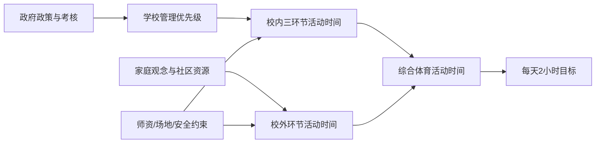

# 中小学生"每天综合体育活动2小时"：现状、影响因素与政策保障路径

## 摘要

在校内外资源、评价导向与安全责任三重约束之下，"每天2小时"是一项**可达成但当前远未达成**的硬指标。

**当前中小学生每天综合体育活动时间约75-85分钟/天（区间60-100分钟/天），距"每天2小时"政策目标仍有显著差距，每天≥2小时达标率仅约三分之一（约33%）。** 这一缺口由多源数据交叉确认：北京大学公共卫生学院调查显示仅33.1%中学生报告日均≥2小时；中国青年报家长调查显示仅30.4%儿童达成课外1小时。

需警惕一种流行误判——"放水即可达标"。中考体育降标后高分率不降反升，常被误读为体质改善；但《柳叶刀·区域健康—西太平洋》2025年8月基于133万份数据的研究显示青少年体能实质下降，达标的形式化恰恰掩盖了真实差距。

**本报告的核心结论是：保时间—优供给—严问责三位一体方能落地。** 其中，校内每天一节体育课是"时间地基"，监测问责的"指挥棒"重构是决定性变量。到2030年，若评价体系不同步改革，"每天2小时"将退化为打卡形式。

本报告回答一个政策落地问题：在《教育强国建设规划纲要（2024—2035年）》明确"中小学生每天综合体育活动时间不低于2小时"之后，如何把这一刚性目标从纸面转化为课表。

## 政策工具评估总览

下表为全文分析主线所用的政策工具矩阵，各工具的逐条评分在后续章节展开，最终排序见第12章。

| 政策工具 | 责任主体 | 针对的影响因素 | 实施成本 | 见效与效果 | 优先级 |
|---|---|---|---|---|---|
| 刚性课程与课时保障 | 教育行政＋学校 | 课时被挤占 | 中 | 中期，≈40分钟/天 | 高（Tier 1） |
| 大课间与课间15分钟 | 学校 | 碎片时间不足 | 低 | 短期，≈40-60分钟/天 | 高（Tier 1） |
| 课后服务体育化 | 学校＋家庭 | 校内时间封顶 | 中 | 中期，≈30分钟/天 | 高（Tier 1） |
| 督导问责与绩效考核 | 上级政府 | 落实动力不足 | 低 | 中期 | 高（Tier 1） |
| 活动时间监测与信息公开 | 教育行政＋学校 | 纸面达标 | 中 | 中期 | 中高（Tier 2） |
| 运动伤害保险与责任分担 | 政府＋保险＋家庭 | 安全顾虑致"圈养" | 中 | 中期 | 中高（Tier 2） |
| 作业与考试减负协同 | 教育行政＋学校 | 学业挤压 | 中 | 中期 | 中（Tier 2） |
| 中考体育与体质评价改革 | 省级考试机构 | 评价导向偏差 | 中 | 中长期 | 中高（Tier 2） |
| 体育教师补充与培训 | 地方政府 | 师资缺口 | 高 | 长期 | 中高（Tier 2） |
| 场地设施建设与开放共享 | 政府＋学校 | 空间不足 | 高 | 长期 | 中（Tier 3） |
| 农村薄弱校差异化支持 | 中央＋省级财政 | 区域不均 | 高 | 长期 | 中高（Tier 2） |
| 家校社协同与观念引导 | 家庭＋社区 | 家长重智轻体 | 低 | 长期 | 中（Tier 3） |

## 评估方法与关键术语

### 研究范围

研究对象锁定**义务教育阶段（小学、初中）与普通高中阶段的在校学生**。政策原文《教育部等五部门关于实施学生体质强健计划的意见》（教体艺〔2025〕1号）面向各省教育厅及部属高校系统下达，本报告把分析焦点收束在基础教育学段，使讨论具有同质的制度环境与课表结构。

### 六维评分量规

为避免政策排序陷入"人人都说重要"的笼统困境，本报告对每项政策工具采用统一的六维量规度量。权重设定原则为：**贡献度与有效性优先，成本与阻力其次，速度与可持续性收尾。**

| 维度 | 权重 |
|---|---|
| 对2小时缺口的直接贡献 | 0.30 |
| 针对关键影响因素的有效性 | 0.25 |
| 实施成本与财政可承受性 | 0.15 |
| 落地难度与执行阻力 | 0.12 |
| 见效速度（短中长期） | 0.10 |
| 风险与可持续性 | 0.08 |

**前两维合计占55%，体现"先解决主要矛盾"的评分哲学。** 一项工具即便成本低、见效快，若对每日时长缺口的直接贡献微弱，也难以进入第一梯队。

### 关键术语统一口径

术语口径不统一是体育活动时间治理中"纸面达标"的隐性温床。本节为全文确立核心术语的统一定义。

**"2小时"目标与旧"1小时"标准的口径差异。** 旧"1小时"标准长期被理解为校内体育锻炼时间，主要落在体育课与大课间；而2025年的"2小时"目标采用**四环节综合口径**，明确把课后服务体育化与家庭、校外运动纳入计算。从1小时到2小时的跃迁，本质是把治理边界从"校内锻炼"扩展到"全天候运动暴露"。

| 维度 | 旧标准（1小时） | 新目标（2小时） |
|---|---|---|
| 时长 | ≥60分钟 | ≥120分钟 |
| 口径范围 | 以校内锻炼为主 | 四环节综合（课内＋大课间＋课后＋校外家庭） |
| 责任主体 | 学校为主 | 学校＋家庭＋社区协同 |
| 典型实现路径 | 体育课＋大课间 | 每天1节体育课＋上下午大课间＋课后服务＋体育作业 |
| 核验难度 | 较低（校内可观测） | 较高（校外环节需监测系统） |

**大课间体育活动**指上、下午各安排一次、单次不少于30分钟的集中体育活动，是综合活动时间中贡献最稳定的校内环节。**课间15分钟**指把传统10分钟课间延长至不少于15分钟，把零散碎片时间转化为可累加的低强度活动暴露。

**阴阳课表**是基层落实中的反讽性术语：学校对外公示一套"开齐开足体育课"的标准课表（"阳"课表），对内实际执行另一套被文化课挤占的课表（"阴"课表）。这一术语是**纸面达标vs真实达标**矛盾的具象化——前者指课表台账显示满足2小时，后者指学生当天实际累计运动达2小时。两者的背离正是本报告把监测与问责单列的根本动因。技术上已有纾解雏形：上海交通大学智慧化平台通过电子健康档案使主动锻炼比例从14.2%升至39.8%，说明客观数据采集可压缩造假空间。

---

# 一、政策背景与"2小时"要求的内涵界定

"每天2小时"是由中共中央、国务院印发的《教育强国建设规划纲要（2024—2035年）》正式确立的学校体育时间要求，原文为"落实健康第一教育理念，实施学生体质强健计划，中小学生每天综合体育活动时间不低于2小时"。

**核心判断是："每天2小时"是一项由党中央、国务院顶层定调、采用多时段累计口径的明确时间要求；其相对此前每天1小时要求在时间数量上翻倍，但这种翻倍主要体现为统计时段的扩展，而非单位时间运动强度的简单加倍。**

## 1.1 三层政策体系

2小时要求已形成"党中央国务院顶层定调—五部门专项定路径—健康学校综合定载体"的三层政策体系。

| 文件 | 印发主体 | 时间 | 在2小时议题中的功能 |
|---|---|---|---|
| 《教育强国建设规划纲要》 | 中共中央、国务院 | 2025-01 | 顶层定调：确立2小时刚性目标 |
| 教体艺〔2025〕1号《意见》 | 教育部等五部门 | 2025-11 | 专项定路径：20条举措与阶段目标 |
| 教体艺〔2026〕3号《指导意见》 | 教育部 | 2026-02 | 综合定载体：纳入健康学校建设 |

**《纲要》**由中共中央、国务院联合印发，政策层级高于任何单一部门文件，意味着2小时要求已进入国家中长期战略的刚性条款层面。由于规划周期延伸至2035年，2小时要求具有十年以上的政策稳定性预期。据其阶段部署逻辑，到2027年前后将出现第一个可核查的中期节点，这意味着监测评估机制必须在2027年之前具备可核查能力。

**教体艺〔2025〕1号"二十条"**由五部门2025年11月联合印发，从深化体育教学改革等8个方面提出20条举措，是首次以促进学生体质强健为主题的政策文件，把《纲要》的抽象目标转译为可操作路径。它属于中期见效工具，真实达标率的显著抬升更可能出现在2026—2028学年区间。

**教体艺〔2026〕3号**把原本偏"体育"的2小时议题，放入"体质、视力、体重、心理"等多维健康综合治理框架。这一放置缓解了潜在的政策割裂风险：纳入健康学校综合载体后，体育时间与视力防控（户外活动）形成协同而非竞争关系。

## 1.2 "综合体育活动时间"统计口径

从地方落实文件看，综合体育活动时间可由**体育课、大课间、课间15分钟、课后服务体育化、家庭与校外运动**等多类时段累计构成。

| 地区 | 体育课 | 大课间 | 课间15分钟 | 课后服务 | 校外/家庭 |
|---|---|---|---|---|---|
| 四川 | 计入 | 计入 | — | 计入 | 走读学生计入 |
| 重庆 | 鼓励每天一节 | 上下午各≥30分钟 | — | 鼓励利用 | — |
| 海南 | — | 每天≥1次30分钟 | 不少于15分钟 | — | — |
| 广州 | 每天1节（2025秋全覆盖） | — | — | — | — |

**多时段累计的口径逻辑**清晰：一节体育课（约40分钟）加上下午两次各30分钟的大课间（合计60分钟）已接近100分钟，再叠加课间15分钟与课后服务，方能逼近120分钟下限。**2小时不能由任何单一时段独立完成，必须多时段协同。** 这一口径设计直接针对"课表挤占"障碍，在不增加课时总量的前提下盘活碎片时段逼近目标。

**四川范例**提供了区分学生类型的典型口径：寄宿制学生须保证校内体育活动总时长不低于2小时；走读学生可通过校内体育课、大课间结合校外活动或体育家庭作业达标。这一分类设计的关键在于核验差异——对寄宿生，"校内2小时"是督导可直接核查的硬指标；对走读生，校外部分被限定为"体育家庭作业"这一可留痕形式，把纸面达标风险控制在可追溯范围内。

**校内口径与全天口径的本质差异在于可核查性。** 学校对校内时段有完整的课表与组织控制权，"校内2小时"可由督导直接核查；而"全天2小时"一旦纳入校外，就从学校责任滑向家校共担，核查难度陡增。

## 1.3 "2小时"与"1小时"的辨析

据《人民教育》解读，2小时与1小时相比"时间要求翻倍"，**但这种翻倍是通过"综合"多时段累计来实现的，主要变化是把更多时段（课间15分钟、课后服务、校外家庭活动）纳入统计，而非要求学生在同样时段内把运动强度提高一倍**。

这一论断至关重要：它把2小时从"不可承受的强度负担"还原为"可盘活的时段整合"。设想一种错误的"强度翻倍"读法——若把2小时理解为在原有体育课内把运动负荷加倍，则既不现实也不安全。四川、重庆、海南的落实通知无一要求提高单位时间强度，而是清一色增加时段。

**误读为强度翻倍将引发一条清晰的风险链：** 盲目加大运动负荷→抬升伤害概率→触发家长担忧→学校因怕担责而压缩运动→2小时沦为纸面达标。化解之道正是口径扩展解读，从源头切断"强度翻倍—伤害上升—压缩运动"的负循环。

与WHO每日60分钟中高强度身体活动（MVPA）指南相比，中国2小时口径聚焦"活动时长"，把不同强度时段一并计入。这一对照也提示一个治理风险：若只追"在校时长"而不问强度，可能出现"时长达标、强度不足"的新型纸面达标。

---

# 二、中小学生体育活动时间现状与目标缺口测算

中小学生每天到底动了多久，是回答"每天不低于2小时"能否落地的第一道事实关口。已有公开数据并不直接给出全国口径的四环节综合活动时间均值，本章把分散证据整理成一条可追溯的基线，再用两套独立方法三角校核出带区间的中枢估计。

**核心结论是：当前中小学生每天综合体育活动时间约75-85分钟/天（区间60-100分钟/天），距"每天2小时"政策目标仍有显著差距，每天≥2小时达标率仅约三分之一（约33%）。**

## 2.1 历史与现状基线

**历史基线极低。** 据2010年全国学生体质与健康调研口径，能保证每天体育锻炼超过1小时的中小学生仅约两成多——早在"每天1小时"提出多年后，连这条更低的线都远未普及。性别维度的分层同样稳定：按2014年调研口径，每天锻炼不足1小时的比例男生约七成三、女生近八成，女生的活动不足问题更突出。青春期女生对体育课内容的参与意愿下降，使其MVPA累计量低于男生，在2小时综合口径下形成更大缺口——这意味着单纯增加课时而不改进面向女生的项目设计，可能无法等幅缩小性别缺口。

**数据可信度的分野必须辨明。** 本章明确剔除一类疑似AI生成、来源不可追溯的文档数据（如某份给出"初中生日均56分钟、达标率38.5%"等精确数字却无抽样说明的网络文档），只保留有明确抽样框与发布机构的正规实证来源，如教育部第八次全国学生体质与健康调研（2019年，分层整群随机抽样，覆盖31省）、北京大学公共卫生学院2023年北京调查。

**体质回升不等于活动时间提升。** 尽管2025年前后多家媒体提示体质可能迎来回升拐点，但北京大学发表于《柳叶刀》副刊的横跨20年大样本研究显示，2000至2019年间中国7至18岁儿童青少年出现体重增长与肌肉力量发展失衡。形态指标的改善更多反映营养条件，而肌肉力量这一更依赖持续活动塑造的指标相对滞后。**这正是"2小时"必须专门针对"时间"而非仅针对"体质结果"来设定的原因。**

## 2.2 日均时间的双方法三角测算

由于缺乏覆盖四环节口径的全国统一客观测量数据，本章采用双方法三角测算。**需声明：除北京报告率与小学生在校户外活动均值为实测外，各分项分钟数均为明确标注的情景假设。**

**自下而上（口径拆解法）。** 把四环节有效活动分钟逐项加总（均为情景假设参数）：体育课折合日均有效活动约15—20分钟；大课间有效活动约15—22分钟；课间合计有效活动约10—18分钟；课后服务对参与者增加约10—25分钟（未参与者为0）；家庭与校外工作日约5—15分钟。按工作日与周末加权后，全周日均中枢落在约75—85分钟/天。

**自上而下（监测校核法）。** 最可靠的实测锚点是北京大学2023年调查：每天总体身体活动≥2小时的报告率为33.1%，每天在校身体活动≥1小时的报告率为64.8%；另一锚点是全国小学生每日在校户外活动平均值73.5分钟，达标校比例仅50.7%。需处理两重校正：其一，自报数据普遍高估真实活动量；其二，北京样本向全国外推须谨慎。综合后该法给出的全周日均估计同样落在约75—85分钟/天。

**两法收敛。** 两种测算使用完全不同的输入（一个用分项时长假设，一个用实测报告率），却收敛到相近结果，差异在10分钟以内。

| 测算方法 | 核心输入 | 输出日均中枢 | 性质 |
|---|---|---|---|
| 自下而上拆解法 | 四环节分项时长（情景假设） | 约75–85分钟/天 | 基于假设的示例测算 |
| 自上而下校核法 | 北京≥2h报告率33.1%；小学在校户外73.5分钟 | 约75–85分钟/天 | 带假设的模型估计 |
| **两法收敛结论** | — | **约75–85分钟/天（区间60–100）** | 全文统一采用 |

**核心限定须诚实承认：** 本文未检索到覆盖四环节口径的全国统一客观测量（如加速度计）专项监测数据。≥2小时达标率约33%的实测支撑来自北京2023年调查，其全国可比值仍待统一监测验证。这一限定恰构成后文呼吁建立客观测量监测系统的现实理由。

## 2.3 分群差异

平均值掩盖结构。同样是距120分钟的缺口，不同学段、城乡、校内外、工作日周末之间差异巨大。

**学段递减是证据最硬的规律。** 据儿童青少年体育健身行为研究，每天保证1小时中高强度活动的得分，小学生17.7分，初中生降到9.8分，高中生进一步降到6.5分，从小学到高中下降约63%。**学段越高，活动保障越差，高中是缺口最深的学段。** 其机制清晰：随年级升高，升学压力加大→体育时间被挤占加剧→高学段四环节累计活动系统性偏低。青春期女生活动意愿下降与高学段课业挤占叠加，使高中女生成为缺口最深的交叉群体之一。

**城乡与学校类型差异。** 全国近一半小学（达标校比例仅50.7%）连在校1小时户外活动都未达标。薄弱校在场地、师资、财政三类资源上的结构性不足，导致其开齐开足体育课、组织大课间的能力系统性偏弱。这意味着差异化支持不能是简单的统一拨款，而需针对三个短板分别设计。

**校内vs校外、工作日vs周末。** 北京数据提供关键对照：在校≥1小时报告率64.8%，而总体≥2小时报告率仅33.1%。校内时段因有制度安排，是活动相对有保障的"刚性"时段；校外与家庭时段缺乏制度约束，是最易流失的"弹性"时段。

| 时段 | 工作日 | 周末 | 制度保障强度 |
|---|---|---|---|
| 校内（体育课＋大课间＋课间） | 有制度底盘（在校≥1h 64.8%） | 无 | 强（刚性） |
| 校外/家庭 | 受作业培训挤占，偏低 | 完全取决于家庭，分化剧烈 | 弱（弹性） |

**政策含义清晰：** 由于校内时段是唯一可由政策直接刚性约束的时段，"保障校内体育活动时间"必然是政策设计的第一抓手；而周末与校外的缺口只能通过家校社协同这种柔性手段补足，见效更慢、不确定性更大。这一"刚柔分段"判断构成后续政策设计分工的逻辑起点。

## 2.4 缺口分析

以中枢75—85分钟/天计，距120分钟目标的**平均缺口约为35—45分钟/天**，当前水平仅达目标的三分之二左右。

这里存在一个需正视的张力：平均缺口只有35—45分钟，看似不大，为何达标率却低至约三分之一？**化解在于缺口分布高度不均**——少数活跃群体大幅超过120分钟拉高了均值，而大量缺口群体远低于目标。约35—45分钟的平均缺口，在量级上是可由校内制度填补的：开齐开足体育课、规范大课间在工作日的贡献，叠加课后服务对参与者的增量，足以覆盖这一缺口。

---

# 三、影响体育活动时间的多层面因素

理解缺口的成因，必须从"为什么时间被挤占"转向"哪一类约束最难松动"——**因为政策设计的杠杆点恰恰落在可干预程度最高、而非缺口最大的因素上。**

## 3.1 学校制度与教育评价因素

学校是四环节中"课内体育课＋大课间＋课后服务"三个环节的直接组织者，因而学校制度安排是缺口形成的第一现场。教育部2026年部署严查挤占体育课、杜绝"阴阳课表"及课间"圈养"，直击的正是长期存在的"重文轻体"积弊。

**校内活动时间的流失，本质上是一个激励结构问题，而非时间不足问题；体育时间被压缩，是因为它在以升学率为核心的学校考核体系中既不被计量也不被问责。**

| 学校层面因素 | 作用机制 | 挤占形态 | 主要监管抓手 |
| --- | --- | --- | --- |
| 主科挤占体育课 | 课时争夺中体育让位主科 | 显性/半显性 | 晒课表、严查占课 |
| 作业量压力 | 课后时间被作业吞噬 | 隐性 | 作业与考试减负协同 |
| 阴阳课表 | 双套课表架空体育课 | 半显性 | 课程表真实执行监测 |
| 课间"圈养" | 安全/管理便利让学生留教室 | 显性 | 课间15分钟制度、督查 |
| 升学率政绩导向 | 管理优先级排序中体育靠后 | 决策层面 | 督导问责、绩效考核 |
| 中考体育"放水" | 标准下调削弱评价拉动力 | 评价层面 | 过程性评价、标准统一 |

关键区分在于：显性挤占（阴阳课表、占课）可由"晒课表"等监管手段遏制，但隐性挤占（作业、政绩排序）需从激励结构层面重塑。

## 3.2 供给侧：师资、场地、安全责任

学校制度意愿解决"愿不愿意"，供给侧资源决定"能不能"。**即便学校管理层完全认同"健康第一"，师资缺口、场地不足与安全责任压力三类硬约束，仍可能使每天一节体育课与大课间制度在执行端落空。**

| 供给侧因素 | 作用机制 | 可干预程度 | 见效速度 | 主要配套措施 |
| --- | --- | --- | --- | --- |
| 体育教师数量缺口 | 课时需求陡增超过编制 | 中等 | 中期 | 编制扩充、转岗、社会指导员 |
| 体育教师专业能力 | 组织高质量MVPA的门槛 | 中等 | 中长期 | 在职培训、专业发展 |
| 场地器材不足 | 物理承载力天花板 | 低（土地硬约束） | 长期 | 场地共享、错时使用、新建 |
| 安全责任压力 | 受伤担责诱导自我设限 | 高（制度性） | 中期 | 责任分担机制、过错原则 |
| 保险缺位 | 风险未真正转移 | 高（制度性） | 中期 | 运动伤害保险普及 |

**三类供给约束的可干预程度呈明显梯度：** 安全责任与保险（制度性、可快速干预）＞师资缺口（人力、中期可缓解）＞场地限制（硬约束、长期才见效）。这一梯度直接决定了资源投入政策的排序逻辑。

## 3.3 家庭、社区与社会环境因素

校内三环节即便完全落实，"家庭与校外"环节的实现仍取决于家庭观念、社区资源与社会环境。**就四环节口径的完整性而言，家庭与校外环节是缺口的"隐藏部分"——它不在学校监管视野内，却直接决定2小时目标能否真正达成。**

## 3.4 因素作用机制与相对重要性

**核心论点是：缺口最大的因素未必是政策应优先攻击的因素，真正的杠杆点落在"可干预程度高×对缺口贡献大"的交集上。**

综合体育活动时间的实现，是学校、家庭、政府、社会四类主体互动的系统性结果：

**这一框架揭示：任何单一主体的努力都不足以达成2小时目标，政府考核、学校组织、家庭参与、供给保障四环节中任一环节断裂，都会使活动时间在传导链上流失。** 与单因素归因（如"都怪学校占课"）相比，系统性框架更准确刻画了缺口的多源性——校内挤占、校外缺位、供给不足、协同断裂同时存在。

由此得出排序原则：**优先攻击高可干预、高贡献的因素（刚性课时保障、课程表监测、大课间制度），同时长期布局低可干预但贡献大的基础性改革（场地建设、升学评价改革）。**

---

# 四、现行落实障碍诊断：时、空、人、安全与评价

诊断焦点从"为什么时间不够"转向"为什么写进课表的时间仍不能转化为真实活动"。**核心判断是：当前阻碍2小时落地的，主要不是政策缺位，而是核验工具与问责后果的缺位，叠加对"时间越长越好"的线性误判。**

三组障碍层层递进：课表侧的形式达标之所以长期存在，根源在于执行体制缺乏刚性约束；而即便约束到位、时间足额，若不顾质量盲目堆叠时长，又会触及效果的边际拐点。

## 4.1 "阴阳课表"与纸面达标

课表是落实"每天1节体育课"的第一道可见凭证，也最容易被操作为"纸面达标"。广州、甘肃、重庆、海南等地已在规章层面提出体育课与大课间安排，使课表侧覆盖在文本上趋于到位；然而课表上"排齐"与课堂里"做满"之间，仍存在系统性落差。

## 4.2 执行体制性障碍

如果说阴阳课表是"症状"，体制性障碍是"病灶"：为什么它能长期存在而少有纠偏。**核心是督导问责在升学政绩导向下的激励缺位**——当督导机构与地方政府共享升学政绩目标时，纠偏激励缺位。因此问责的有效前提，是把体育落实指标嵌入地方政府的绩效考核，否则督导仍是制度摆设。

## 4.3 活动质量与时间张力

在2小时政策压力下，单纯追求时长堆叠可能损害效果。**上海体育学院基于中国教育追踪调查的实证研究发现，体育锻炼时间与学业成绩呈倒U型关系，每天约45.6分钟时对文化课平均成绩的提升作用最大，超过120分钟后影响转为负向**。这一发现为"延长时间导向与质量保障之间的矛盾"提供了关键量化锚点。

## 4.4 关键落实主体的障碍暴露

| 落实主体 | 主要暴露障碍 | 课表落差风险 | 体制激励风险 | 质量风险 |
| --- | --- | --- | --- | --- |
| 刚性课程与课时保障 | 阴阳课表、课时竞争 | 高 | 高 | 中 |
| 督导问责与绩效考核 | 激励缺位、制度空转 | 高 | 高 | 中 |
| 活动时间监测与信息公开 | 纸面达标核验缺失 | 高 | 中 | 高 |
| 中考体育与评价改革 | 评价放水、指标异化 | 中 | 高 | 高 |

**刚性课时**只解决"课表上有没有"，对"排而不用"缺乏内生约束——这是其有效性的关键短板。在课表覆盖率快速上升的同时，真实达标率仍停留在约33%，二者的剪刀差说明该措施的效果在纸面与真实之间存在系统性折扣。

**督导问责**是唯一能正面回应"升学挤占"逆向激励的体制工具。其落地难度最大——要求改变地方政绩评价的指标权重，触及既有考核体系核心。若问责后果长期缺位，真实达标率很可能长期停留在约三分之一水平而难以突破。

**活动时间监测系统**是唯一能把核验对象从"出勤"升级到"强度与负荷"的工具。上海交通大学平台实证显示，监测推动学生主动锻炼比例从14.2%升至39.8%；其因果链为：数据采集→电子健康档案建立→工作效率提升→主动锻炼增加。这说明监测不仅能核验，还能反向激励真实参与。安徽省地方标准DB34/T 4434-2023已为监测的数据安全提供治理框架。

---

# 五、保障校内体育活动时间的政策设计

校内时段是把"每天2小时"从纸面转化为可观测供给的主战场，因为它是教育行政与学校能直接调度的时间块，约束力最强、可监测性最高。本章聚焦三类抓手，分别对应"开足""补量""延伸"三种功能。

## 5.1 刚性课程与课时保障

体育课的"开齐开足"是综合活动时间中确定性最高的一环。《纲要》出台后，地方层面已现可量化落地证据：天津市2025年抽查显示，全市义务教育阶段学校每天一节体育课开课率达100%，实现校内每日综合体育活动时间不低于2小时。

**政策工具与机制。** 核心是以规章锁定体育课每日节数与大课间时长，并以督导核验作为合规验证。广州的"30%试点起步、100%全覆盖"路径、甘肃"不增加课时总量"前提下推进每天1节、重庆"上下午各一次不少于30分钟大课间"，都是这一工具的地方变体。机制硬度来自督导：开课率作为可核验硬指标，可被抽查直接验证。

**责任主体。** 呈"地方政府统筹、教育行政督办、学校执行"的分层结构。校长是开课率的直接责任人。由于"不增加课时总量"的约束，学校既是执行者又是潜在挤占者，责任主体内部存在角色张力。

**针对的影响因素。** 直接缓解"体育课被主科挤占"这一最普遍的时间流失因素。但它主要解决"开课率"，对课堂运动密度、MVPA占比等质量维度改善有限。

**成本与见效。** 制度成本相对较低（无需新建场地，只需在既有课程表内重排），是成本最低、行政可控性最高的抓手。见效速度最快：开课率可在一学年内由抽查驱动逼近上限。**每天一节体育课按40分钟计，约贡献综合活动时间的三成左右，是四环节中单环节贡献最稳定的一环。**

**风险与副作用。** 主要风险是"纸面达标vs真实达标"的背离——课程表上开足，实际授课被自习、考试替代。化解路径在于：**开课率与运动密度双指标并行考核，前者保供给、后者保质量。** 单独追求开课率会催生形式主义。

**优先级。** 综合评定为校内措施的最高优先级档。其相对大课间的优势在于法定约束力更强；相对课后服务的优势在于不依赖家长配合与校外资源。但单兵推进时因缺乏真实性核验而效果打折，**必须与监测、问责捆绑。**

**课程表公示与防挤占机制**是必要配套。核心工具是"课程表强制公示＋挤占举报核查＋督导随机抽查"，把家长从被动知情者转为主动监督者。它解决"执行不执行"的问题，与刚性课时（解决"排不排"）构成供给保障的"排课—执行"双闸门。其约束在于：公示是必要而非充分条件，必须与真实活动时间监测数据交叉比对——当公示显示每天一节、而监测数据显示运动时间不足时，背离即被识别。

## 5.2 大课间与课间15分钟制度

如果说刚性课时保的是单节体育课的"存量"，大课间制度补的则是分散在校园作息中的"增量"。上海某小学增设30分钟大课间并延长课间后，全校学生每日在校体育活动时间达140分钟。

**有质量大课间是校内补量功能中单项量级最大的环节。** 其制度载体是学校作息表，一旦固定进作息即获得与体育课相近的刚性。"有质量"的实现依赖活动内容设计——以跑操、专项练习替代低负荷操类。其全员参与特性确保了覆盖面，避免了课后服务可能存在的"自愿参与导致部分学生缺席"问题。

- **量级贡献：** 一次30分钟有质量大课间可贡献约30分钟；若上下午各一次，可贡献约60分钟（情景测算）。
- **主要约束：** 财政成本低，但场地与组织难度高。在生均运动场地不足的城市学校，全校同时段大课间面临承载力瓶颈——这正是上海"15分钟运动圈"鼓励向"空中""地下""角落"要空间、建设"微操场"的背景。
- **核心风险：** 大课间"有量无质"——时长达标但运动强度不足。化解约束在于以运动负荷监测约束质量，把"时长"与"运动密度"分离考核。

**课间15分钟**是把传统10分钟课间延长以增加碎片化运动机会的微增量措施。其功能是"碎片化对冲久坐"，与大课间的集中补量互为补充。单项贡献小（每天累积增量约20-25分钟），价值在于覆盖全天、对冲久坐的持续性。主要风险是"延而不用"——作息表上延长，实际仍被拖堂或学生留在教室，化解须配合"鼓励户外＋场地就近"的供给侧改造。

| 环节 | 单项量级 | 对缺口贡献定位 | 主要约束 |
|---|---|---|---|
| 有质量大课间 | 一次约30分钟；上下午合计约60分钟 | 单项量级最大，核心增量 | 场地承载、运动质量 |
| 课间15分钟 | 累积约20-25分钟 | 碎片对冲久坐，补充增量 | 易被拖堂侵蚀 |

**在校内补量的优先排序上，应优先做实大课间，再以课间15分钟补充。** 大课间与刚性课时并列为校内供给的两大支柱。

## 5.3 课后服务体育化与减负协同

课后时段是把校内供给推过2小时门槛的"最后一公里"。上海杨浦某校在"晨练＋大课间＋体育课＋室内操"固定90分钟基础上，叠加体育活动课和社团，使周一至周五的综合体育活动时间均超2小时。

本节三力协同，**单兵突进必然落空：**

**课后服务嵌入体育（供给侧，中期见效，贡献约30-60分钟）。** 把原本可能被作业或学科补习占据的课后时段，转化为体育锻炼时段，是校内三环节中填补最后缺口的环节。主要风险是"体育之名、补习之实"，化解须与减负政策刚性衔接，明确体育内容最低份额。

**减负衔接（供给侧前提，中长期见效）。** 其逻辑链条是：作业总量压减→腾出课后时间→课后时间被体育份额刚性占用。单纯增加课后体育而不压减作业，会导致体育与作业相互挤压。落地难度高——减负触及应试竞争的核心利益。最难破解的结构性矛盾是"校内减负、校外增负"：校内作业减少，家长转向校外补习，体育空间未能真正腾出。

**中考体育评价改革（需求侧，长期见效）。** 通过评价指挥棒撬动家长与学生重视体育，是撬动参与意愿的根本杠杆——它改变的是家长的成本收益计算。其独特价值在于作用于需求侧动机，而非仅供给侧安排。主要风险是"应试体育"——体育沦为新的应试科目，学生围绕考试项目突击训练，背离培养自主锻炼习惯的初衷。**需特别警惕：部分地区因学生体能普遍下降而下调中考体育标准，这种"迁就现实"的下调与提升体育权重的改革方向背道而驰。** 化解约束在于强化过程性评价、弱化一次性考试。

| 环节 | 作用侧 | 见效周期 | 核心约束 | 与缺口关系 |
|---|---|---|---|---|
| 课后服务嵌入体育 | 供给侧 | 中期 | 师资场地、与补习竞争 | 直接增量（约30-60分钟） |
| 减负衔接 | 供给侧前提 | 中长期 | 触及应试核心利益、校外增负 | 间接（腾空间而非增供给） |
| 中考体育评价改革 | 需求侧 | 长期 | 升学公平、应试体育化 | 间接（经参与意愿传导） |

**本章小结。** 校内体育时间保障呈现"刚性课时保存量、大课间补增量、课后服务破门槛"的层级结构。但三大抓手在落地层面共享同一组深层约束：师资是否到位、场地是否充足、安全责任是否清晰、评价导向是否转向。校内措施是缺口治理中确定性最高的部分，但其天花板由资源底座与治理机制共同决定。

---

# 六、资源投入与安全保障政策设计

资源瓶颈是2小时政策区别于"每天1小时"的关键制约点。当课时从1小时跃升至2小时，单位学生所需的体育教师工时、场地承载量与财政支出近乎翻倍。教体艺〔2025〕1号将发展改革、财政、人社部门一并列为责任主体，正说明这是需要编制、财政、保险多系统协同的跨部门工程。

## 6.1 师资、场地、财政三支柱

**资源投入并非三项并列的开支，而是以财政为底座、师资为慢变量、场地共享为快变量的三层嵌套结构。**

**体育教师编制补充**是"每天一节体育课"落地的第一道硬约束。甘肃"不增加课时总量"的表述恰恰暴露了师资总盘的紧张。可行路径有三：编制总量内调整学科结构；政府购买服务引入退役运动员、社会体育指导员；"一专多能"培训让其他学科教师能带大课间。**编制补充是刚性成本最高、见效最慢的一项（师范扩招到上岗有3—5年周期），而购买服务与培训可在一学期内见效，构成缓冲带。** 综合优先级定为高，但须与购买服务的快变量组合使用。

**场地设施建设**的务实路径是"挖潜＋共享"双轨：校内通过屋顶运动场、地下空间改造、错峰排课提升使用率；校外盘活社区体育场馆、公园绿地。**场地共享的制度障碍不在物理空间而在责任归属**——校外场地发生伤害时由谁担责，直接决定开放意愿。其核心张力在于开放意愿与安全责任的错配，化解之道是把责任从开放主体转移到保险池。共享路径因见效快、成本低而应优先于新建。

**财政保障是本章的"元约束"**——它既是师资与场地的钱袋子，也是城乡差距的根源。地方财力差异→体育资源配置不均→农村薄弱校体育课开不齐→扩大城乡体质差距；上级财政转移支付正是切断这条链条的关键节点。财政保障在成本上压力最大，但在有效性上不可替代，优先级评为最高档，应前置于其他资源安排。

## 6.2 安全风险分级与保险机制

安全责任是横亘在资源投入与真实活动量之间的制度性梗阻。2026年5月内蒙古一名中学生在课间操结束后倒地身亡，而当年3月临河区刚要求每天综合体育活动时间不低于2小时——这一"巧合"把安全责任问题推到政策设计正中央。

安全保障构成"事前分级—事中救援—事后免责"的完整链条，缺一则学校仍会退回"圈养"：

**运动伤害保险**是把学校从无限赔偿风险中解放出来的核心工具。中国青年报报道，上体育课碰撞、课间打闹受伤，学校往往"必赔无疑"，连补课费、误工费都要赔，由此不少学校选择"课间10分钟少动"。应建立"基础校方责任险＋学生意外险＋体育专项险"的多层结构，并按运动危险等级匹配差异化保额。教育部2015年《学校体育运动风险防控暂行办法》已提供制度框架。这是"低成本、快见效、高杠杆"工具——保费支出是可控的年度预算，一旦覆盖即可改变学校的风险预期。

**急救应急机制**把伤亡风险从"事后追责"前移到"事中救援"。应建立"AED配置＋持证急救＋校医与120联动"三件套。其核心张力是"零风险不可得"——任何体育活动都存在意外概率。化解不在于消灭风险，而在于把"不可控的事后追责"转化为"可预案的事中响应"：当急救体系把意外后果降到最低，学校的风险容忍度随之上升。

**免责制度**是把保险、急救从"工具"升级为"制度预期"的关键一跃。北京延庆区法院判例具有标志意义：中学生体育课受伤起诉学校，法院认定学校已尽到教育管理职责、驳回全部诉请，确立了"尽责免责"的司法导向。免责制度需三层协同：司法层面确立"学校尽责即不担责"裁判规则；保险层面以责任险承接赔偿；程序层面引入第三方调解避免"校闹"。**免责制度是整个安全保障体系的"总开关"**——明确的免责规则改变学校败诉预期，降低"少动避责"动机。需指出，免责绝非纵容失职：其前提恰是学校必须尽到安全教育、管理、救助三项义务。

## 6.3 差异化资源支持

差异化支持是避免2小时沦为城市优质校专属福利的关键设计。**城市优质校与农村薄弱校的资源禀赋差异，决定了统一标准会系统性地对薄弱方不利。**

- **农村、薄弱、高中阶段倾斜：** 高中阶段在高考压力下体育时间被挤压最烈（甘肃仅要求高中每周3节），需"刚性课时＋体育家庭作业"组合保住底线。倾斜支持应体现为"经费＋师资＋标准"三重差异。
- **特殊需求与体质较弱学生：** 内蒙古事件引发对"过度学业压力叠加体育负荷"的反思，说明不能以统一强度"一刀切"。应依托体质健康监测建立分层方案，为体质弱者制定降低强度、替代项目、医务监护的差异化活动处方——以真实健康收益替代纸面达标。
- **区域均衡转移支付：** 把体育资源纳入一般性与专项转移支付双渠道，以生均体育经费差距作为分配依据，是把全国政策目标转化为欠发达地区可执行能力的财政桥梁。

| 措施 | 对2小时缺口贡献 | 实施成本 | 见效速度 | 综合优先级 |
| --- | --- | --- | --- | --- |
| 财政经费保障 | 元约束（根本） | 最高 | 中长期 | 最高 |
| 免责制度保障 | 高（总开关） | 低 | 短期 | 最高 |
| 运动伤害保险 | 高 | 低 | 短期 | 高 |
| 急救应急机制 | 中高（托底） | 中 | 短中期 | 高 |
| 场地共享开放 | 高 | 低 | 短期 | 高 |
| 体育教师编制补充 | 高 | 高 | 长期 | 高 |
| 区域转移支付 | 高 | 高 | 中长期 | 高 |
| 农村高中倾斜 | 高（缩差距） | 中高 | 中期 | 高 |
| 特殊学生分层方案 | 中（覆盖少数） | 中 | 中期 | 中高 |

**核心结论：资源投入与安全保障并非"2小时"的配套条款，而是决定该政策在城市与农村、普通学生与体质弱者之间是否公平落地的决定性变量**——财政是底座、免责是总开关、场地共享与保险是低成本高杠杆的速效工具。

---

# 七、监测评估、问责与长效治理机制

监测评估是区分"纸面达标vs真实达标"的唯一客观裁判。**核心判断是：没有可逐校汇总的实测数据支撑，2小时的督导问责就只能停留在自查自报层面，而当前约33%的达标率恰恰说明自报口径与真实口径之间存在巨大落差。**

本章三个子系统构成长效治理闭环：数据采集解决"看得见"，评价问责解决"管得住"，动态调整解决"长期有效"。

## 7.1 活动时间监测与数据采集

**只有当活动时间"流量"（可穿戴实测）与体质结果"存量"（全过程监测）并轨记录、并由家校双数据源交叉验证，综合体育活动时间才从不可核验的承诺变成可逐校汇总的事实。**

**体质结果纵向追踪。** 光明网倡导"以新生入学体质为基准，以上一学段毕业监测为参照，以毕业离校监测为对照"的全过程监测，使体质变化轨迹可被跨学段追踪。与传统的毕业年一次抽测相比，其价值在于把体质结果从孤立截面转化为可对照的发展曲线，从而识别"活动时间充足但体质未改善"这类异常信号。

**可穿戴信息化采集。** 智能手环等设备在学生群体中普及率已超60%，可实时捕捉心率、步频、能量消耗等12项数据，为区分"在场但低强度"与"真正达到MVPA"提供数据基础。实证效果最完整的证据来自上海交通大学平台：数据采集→电子健康档案建立（已建2万余份）→工作效率提升60%→学生主动锻炼比例从14.2%升至39.8%。**这一完整链条证明，信息化采集本身就具有行为激励效应，而不仅是被动记录工具。**

**信息公开与家校协同。** 引入家长端记录构成独立的第二数据源——学校自报存在利益冲突容易高估，家长端记录虽不专业却因立场独立而能形成交叉验证。对走读学生而言，校外环节是2小时的必要组成而非补充，这意味着家校协同监督是该群体达标核验的制度刚需。

## 7.2 评价考核与督导问责

**真实落实的制度关键不在于考核项的多少，而在于每一考核项是否挂接独立的客观实测数据源；脱离实测数据，再严的考核都只能核验台账而非操场。**

| 机制层级 | 核验抓手 | 主要风险 | 缓释绑定 |
|---|---|---|---|
| 学校考核指标 | 每天1节覆盖率（30%→100%）、2×30分钟大课间 | 课时表造假 | 与可穿戴实测绑定 |
| 地方政府考核 | 不增总课时约束、缺口责任落位 | 挤占其他课时 | 与减负协同 |
| 第三方评估督导 | DB34/T 4434大数据评估、心率异常核查 | 评估流于台账 | 以独立实测数据为基础 |
| 激励问责并举 | 满意度排名等荣誉激励、负向问责挂钩 | 纯惩戒诱发造假 | 正负工具分守上限与底线 |

**第三方评估**克服学校自查自报的利益冲突——内部自查"既当运动员又当裁判员"，第三方主体与被评学校无绩效绑定，更少受利益污染。当智能手环实测数据显示某时段运动负荷明显偏低，督导即可定向核查该时段是否名义排了大课间却未真实开展。

**激励与问责并举**避免单靠惩戒导致"为应付检查而造假"。负向问责瞄准"底线"（确保没有学校敢不开体育课），正向激励瞄准"上限"（鼓励领先学校做出特色）。荣誉激励（如满意度排名第一）边际财政成本很低，在农村薄弱学校同样可复制。

## 7.3 动态政策调整与风险缓释

中国教育报指出，体育活动落实面临**资源不均、学业冲突、形式主义**三类风险。资源不均不是主观不努力，而是场地师资的硬约束，因此对薄弱学校的问责必须与差异化支持同步，否则将沦为对客观困难的苛责。形式主义最具破坏性，因为它直接否定整套政策的真实效果——其本质寄生于"只查台账不查实测"的监督盲区。

| 风险类型 | 风险机理 | 对应缓释措施 | 见效速度 |
|---|---|---|---|
| 资源不均 | 物理空间与教师编制硬约束 | 资源均衡＋差异化投入；先扶持后问责 | 中长期 |
| 学业冲突 | 体育增时挤压主科引发家长抵触 | 时间统筹＋减负协同＋课后服务体育化 | 中期 |
| 形式主义 | 查台账不查实测的监督盲区 | 考评改革＋可穿戴独立实测 | 短期 |

**长效治理闭环。** 大学生体质绩效系统提供了可移植架构：由"测试-评价-服务-监管"四模块构成，建立测试反馈、预警和干预三环节相互衔接的动态管理。

**这一闭环把"2小时是否真正落实"从一道静态判断题，变成一个可持续验证、持续修正的动态过程。** 一次性督查只能提供时点快照，学校可在检查前突击、检查后恢复；而动态闭环因持续采集实测数据，使"突击应付"失去意义。

形式主义与真实落实的核心张力如何化解？**不在于更频繁的检查，而在于用独立实测数据把造假成本抬到高于真做成本之上**——当可穿戴连续数据使伪造反而比真实开展更麻烦，理性选择就转向真做。其约束条件是：实测覆盖必须足够普遍，因此可穿戴采集必须优先试点、逐步扩面。

---

# 八、政策建议排序、理据表与结论

资源约束下的优先排序，是一份政策建议从"清单"走向"决策"的关键一步。**核心判断是：在十二项政策工具中，"刚性课程与课时保障""大课间与课间15分钟制度""督导问责与政府绩效考核"三项构成第一优先档，是缩小缺口见效最快、财政可承受性最高的组合。**

## 8.1 加权排序与分档

评分公式为 S_final = Σ(weight_i × dim_i)，缺口贡献权重0.25为最高。评分依据来自各地落地案例的可观测效果。

| 措施 | 缺口贡献 | 因素有效性 | 财政可承受 | 落地难度 | 见效速度 | 风险可持续 | S_final | 档位 |
|---|---|---|---|---|---|---|---|---|
| 大课间与课间15分钟制度 | 8.50 | 8.50 | 9.00 | 7.50 | 9.50 | 7.50 | 8.45 | Tier 1 |
| 刚性课程与课时保障 | 9.50 | 9.00 | 8.00 | 6.50 | 9.00 | 8.00 | 8.43 | Tier 1 |
| 督导问责与政府绩效考核 | 7.50 | 9.00 | 8.50 | 6.00 | 7.50 | 8.50 | 7.78 | Tier 1 |
| 运动伤害保险与责任分担 | 6.00 | 8.50 | 7.50 | 7.00 | 6.00 | 8.50 | 7.03 | Tier 2 |
| 活动时间监测与信息公开 | 6.50 | 8.00 | 7.00 | 6.50 | 6.50 | 8.00 | 6.93 | Tier 2 |
| 课后服务体育化 | 7.00 | 7.00 | 6.50 | 6.50 | 7.50 | 7.00 | 6.90 | Tier 2 |
| 作业与考试减负协同 | 7.50 | 8.00 | 8.00 | 4.50 | 6.00 | 7.00 | 6.85 | Tier 2 |
| 中考体育与评价改革 | 6.00 | 7.00 | 8.00 | 5.00 | 6.50 | 6.00 | 6.43 | Tier 2 |
| 体育教师补充与培训 | 6.50 | 7.50 | 5.00 | 5.50 | 5.00 | 8.00 | 6.18 | Tier 2 |
| 农村与薄弱学校差异化支持 | 6.00 | 8.00 | 4.50 | 5.50 | 4.50 | 7.50 | 5.95 | Tier 3 |
| 家校社协同与观念引导 | 5.50 | 7.50 | 8.50 | 4.00 | 4.00 | 6.50 | 5.93 | Tier 3 |
| 场地设施建设与开放共享 | 6.50 | 7.00 | 4.00 | 5.00 | 4.50 | 7.50 | 5.78 | Tier 3 |

**Tier 1三项构成"保时间"的最小充分组合：前两项直接注入活动时间，第三项确保前两项不被架空。** 大课间（8.45）与刚性课时（8.43）分列前二，差距仅0.02分，二者构成"双支柱"——意味着政策不应偏废任一方。其内在逻辑是一条因果链：督导问责把"晒课表"变成硬约束→遏制挤占体育课→使刚性课时与大课间真正落到每一天的课表上。没有问责作"锁"，课时与大课间的制度文本极易退化为"纸面达标"。

**Tier 2六项**是"提质量、稳预期"的跟进层，不直接"造时间"，而是为时间的有效使用提供条件。**Tier 3三项**得分偏低并非因为不重要，而是因为见效慢、成本高，属于"慢变量"——与Tier 1的"快变量"在时间尺度上互补而非替代。

## 8.2 决策性首推措施

**若只能做一件事，首推"大课间与课间15分钟制度＋刚性课时保障"的捆绑组合，并以督导问责为执行锁。**

证据支撑直接：上海杨浦某校"晨练＋大课间＋体育课＋室内操"固定组合即提供90分钟，叠加社团后周一至周五均超2小时。当课时与大课间被制度性写入每日课表，2小时目标在校内即可基本实现，无需依赖家庭与校外时段的不确定补足。

就财政可承受性而言，首推组合主要依靠时间重排与制度约束，**边际财政成本接近于零**，这正是它在资源约束下优于场地建设、教师大规模补充等重资产方案的根本原因。相较于中考体育改革试图从"指挥棒"末端倒逼，首推组合直接作用于"时间供给"这一最上游瓶颈，因而有效性更高。

需正视一个张力：强制注入活动时间与运动安全风险之间存在潜在冲突（内蒙古事件引发对"一刀切提活动量"的担忧）。化解不在于退回"圈养"，而在于用Tier 2的运动伤害保险与责任分担作为配套，使学校"敢动"——**根因在于风险本身来自责任分担缺位而非运动本身。**

## 8.3 因果映射与稳健性检验

**真正"直接造时间"的只有课时、大课间、课后服务三项，其余九项多为"守护时间"或"护质量"。** 这一分布解释了为何排序把课时与大课间置于首位：它们是缺口的分子，其余措施是分母的保护者，缺口的填补必须从分子入手。

| 措施 | 针对的影响因素 | 缺口贡献类型 | 典型证据 |
|---|---|---|---|
| 刚性课程与课时保障 | 重文轻体、占课 | 直接造时间 | 天津开课率100% |
| 大课间与课间15分钟 | 课间圈养、碎片化 | 直接造时间 | 上海140分钟/天 |
| 督导问责与绩效考核 | 阴阳课表、执行松弛 | 守护时间 | 占课已较少见 |
| 监测与信息公开系统 | 纸面达标、信息不对称 | 守护时间 | 主动锻炼14.2%→39.8% |
| 课后服务体育化 | 课后时段闲置 | 直接造时间 | 杨浦超2小时 |
| 运动伤害保险 | 怕担责 | 守护时间 | 校长"最担心两件事" |
| 场地设施建设 | 空间不足 | 基础造空间 | 微操场立体扩容 |

**短中长期路线图**遵循"快变量先行、慢变量跟进"：短期（0-12月）锁定Tier 1——刚性课时进课表、大课间制度、督导晒课表问责；中期（1-3年）铺开Tier 2——监测系统、运动伤害保险全覆盖、课后服务体育化；长期（3-5年）夯实Tier 3——场地立体扩容、农村薄弱校补短板、家校社观念转变。广州"半年试点＋半年全覆盖"为短期路线提供了可复制模板。这一三阶段路线避免了"一次性铺开十二项"导致财政与行政能力双双透支的失败模式。

**敏感性检验。** 对六维权重各施加±10pp扰动后，**没有一项措施发生跨档迁移，Tier 1三项稳居首档，排序结论高度稳健。** Tier 1三项与Tier 2首项之间存在约0.85分的安全间距，扰动不足以翻转档位。即便把财政权重单独加到极端值，场地建设仍落在Tier 3，家校社协同因见效速度维分仅4.00而仍不进入Tier 1。这说明排序稳健性主要来自"见效速度"与"缺口贡献"两维的区分度。

## 8.4 结论与展望

**现状—因素—政策三问的整合回答：**

- **现状：** 目标已清晰，但真实达标尚未普及——天津开课率100%、上海样板校达140分钟/天是先行者而非普遍水平，纸面达标与真实达标之间仍有显著落差。
- **因素：** 影响活动时间的不是单一因素，而是"时、空、人、安全、评价"五类障碍的叠加，其中评价指挥棒是最上游的诱因——"用中考解决不重视体育问题，本质还是应试思维"。
- **政策：** 首推"双支柱＋问责"填缺口，中期用监测与保险稳预期，长期用场地与观念固根基。

**系统性多主体协同治理是终极判断。** 2小时目标的实现是学校、家庭、政府、社会四类主体互动的结果。协同失灵是一条清晰因果链：家长"重文轻体"→追逐分数→学业挤压体育时间→学校默许"阴阳课表"→政府要求在执行末端被架空。**这条链揭示，单靠政府下禁令无法根治，因为禁令作用于链条末端的"学校执行"，而诱因在上游的"家长观念"与"评价指挥棒"。** 张力集中体现在"安全责任"节点：政府要求增加活动时间，但运动伤害赔偿责任长期压在学校头上，化解之道是引入政府、保险机构、家庭三方共担。

**总判断：2小时目标的治理必须是"政府定标问责＋学校排课执行＋社会分担风险＋家庭转变观念"的四位一体，缺一不可。**

**国际校准与未来方向。** WHO建议儿童青少年每日至少60分钟MVPA，而中国"2小时综合活动时间"是更宽口径。**这一口径差异提示一个政策风险：若只追"2小时在校时长"而不问强度，可能出现"时长达标、强度不足"的新型纸面达标。** 化解需在监测系统中嵌入强度指标。到2030年，随可穿戴设备在中小学普及，监测有望从"时长记录"升级为"时长＋强度双口径"，使真实达标可被客观测量。未来最需填补的研究空白是：建立一套对标《国家学生体质健康标准》抽测口径、覆盖城乡与各学段的综合体育活动时间年度监测体系——唯有如此，"真实达标率"才能从样板校推断升级为全国可信的统计。

| 三问 | 核心结论 | 关键证据 |
|---|---|---|
| 现状多少 | 目标清晰、样板先行、普遍未达 | 天津100%、上海140分钟 |
| 什么因素 | 时空人安全评价五类叠加，评价最上游 | 中考应试思维、怕担责 |
| 如何制定政策 | 双支柱＋问责首推，梯次跟进，多主体协同 | 占课已少见、四川达标路径 |

**整篇报告共同证明的结构性命题是：2小时目标不是一道需要无限投入的难题，而是一个可以用"双支柱＋问责锁"的少数关键杠杆在财政可承受范围内显著推进、再以监测、保险、评价、场地、协同逐层巩固的系统工程。** 当前最大的未决项是全国层面缺乏统一口径的真实达标率数据，建立全国统一监测体系是下一阶段政策研究与实践的首要任务。

---

# 参考文献
