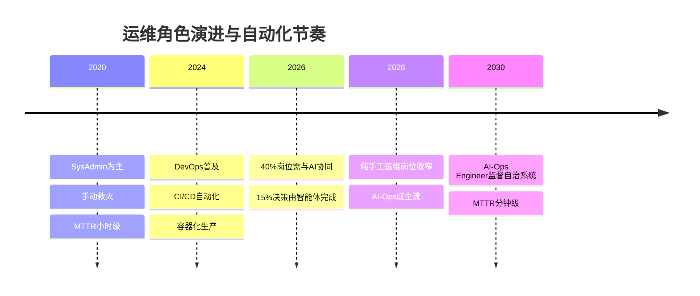
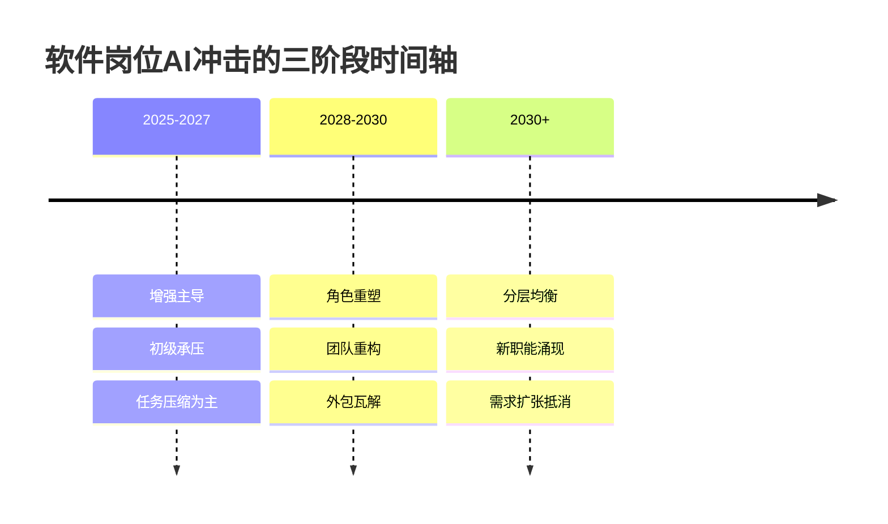

# 软件行业未来趋势与AI替代可能性：分层证据下的产业与岗位变局（2025–2026）

软件行业正在经历的并非"整齐替代"，而是一场沿**任务可委托性、岗位资历与架构责任**三条断层线展开的分层重构：高确定性、低责任、可验证的编码与测试任务被快速吸收，而需求定义、系统架构与最终问责权仍牢牢留在人类手中。

规模上，据工信部数据，2025年中国软件业务收入达**¥154,831亿，同比增长13.2%**；据《2026全球软件行业展望》，到2030年AI智能体方案将占全球软件TAM的60%[澎湃新闻 2026, "2026全球软件行业展望：Agentic AI掀起产业三大变局"](https://m.thepaper.cn/newsDetail_forward_33066164)，这一变局因此覆盖全球主要市场。尽管Anthropic的Dario Amodei断言"AI距离独立完成全部端到端软件工程任务仅剩6–12个月"，但上海交大等机构在METR随机对照实验中报告：资深开源开发者使用AI工具后反而**慢19%**，复杂任务基准成功率仅**14%**[腾讯新闻 2026, "上交大联合腾讯发布：AI助手完成复杂任务成功率仅14%," arXiv:2604.15715](https://news.qq.com/rain/a/20260427A06ZPC00)——这揭示出能力暴露与实际替代之间的巨大鸿沟。

**本报告的核心判断：** 替代风险由高到低依次为——手工测试工程师极高，初级前端与外包交付高，DevOps与数据工程师居中，系统架构师与安全工程师低；初级岗位在2026–2028年承受最重压力。真正的边界并非技术能力，而是**问责真空与可靠性悬崖**。

---

# 1 评估框架、范围界定与方法论

软件不是均质行业，而是由能力门槛、责任结构、合规约束高度异质的多个子领域拼接而成的复合系统。正因如此，"软件会不会被AI替代"这个问题本身就是错误的提法。

**本报告的核心立场是：AI对软件行业的冲击不是整齐替代，而是沿任务、岗位、子领域三个维度分层推进——高暴露度并不等于高替代率。** 二者之间存在一个被组织摩擦、责任溢价与互补任务持续撑开的缺口。这一缺口可观测：Anthropic研究显示，程序员的AI暴露度高达75%，但实际只有约三分之一的任务真正被AI处理[Tencent News 2026, "Anthropic AI暴露度与实际任务处理缺口报道"](https://news.qq.com/rain/a/20260310A070SJ00)。流行论断"智能体编码将在数年内抹平初级开发岗位"混淆了两个口径：**理论可处理性**（能力问题）与**制度允许被处理性**（社会技术系统问题）。

面向2025至2030+的窗口，本报告的总判断是：**初级编码与标准化外包交付岗位面临最强压缩，测试与运维岗位被增强重于被替代，架构师、安全工程师与产品经理则更多被重塑而非取代。**

## 1.1 十类岗位的评估骨架

下表为贯穿全篇的实体骨架，第5章将给出完整评分。

| 岗位实体 | 任务自动化程度 | 上下文与责任依赖 | 替代/增强/重塑判断 | 时间线与置信度 |
|---|---|---|---|---|
| 初级程序员 | 高 | 低 | 部分压缩趋向重塑 | 短期显影/高 |
| 高级软件工程师 | 中 | 中高 | 增强提效 | 中期/中高 |
| 软件架构师 | 低 | 高 | 角色重塑 | 长期/中 |
| 测试工程师(QA) | 中高 | 中 | 增强为主 | 短中期/中高 |
| 运维工程师(SRE/DevOps) | 中 | 中高 | 增强提效 | 中期/中高 |
| 产品经理 | 低中 | 高 | 角色重塑 | 中期/中 |
| 项目经理 | 中 | 中高 | 部分压缩 | 中期/中 |
| 数据工程师 | 中 | 中 | 增强为主 | 中期/中高 |
| 安全工程师 | 低 | 高 | 角色重塑，需求上升 | 中长期/中高 |
| 外包/交付开发人员 | 高 | 低中 | 部分压缩最强 | 短期显影/高 |

## 1.2 评估维度与口径辨析

研究对象锚定在"程序及其相关文档"这一可操作的法律定义上，拆解为七个子领域：基础软件、应用软件、SaaS、企业服务、互联网软件、外包与开源。讨论窗口横跨2025短期至2030+长期，不预设单一国家或语言限定。

替代风险无法用单一指标刻画。本报告构建**五维加权评分框架**（其中四个为反向维度，即数值越高、替代风险越低）：

| id | 维度 | 权重 |
|---|---|---|
| R-1 | 任务自动化程度 | 0.30 |
| R-2 | 上下文与责任依赖(反向) | 0.25 |
| R-3 | 创造性与判断要求(反向) | 0.20 |
| R-4 | 协作与沟通需求(反向) | 0.15 |
| R-5 | 近期采用与时间紧迫度 | 0.10 |

**两个必须事先澄清的核心概念。** 其一，**社会技术系统**指软件开发并非纯粹技术活动，而是技术、人、组织流程与责任结构相互嵌入的系统——这解释了为何暴露度不等于替代率。其二，**暴露度（observed exposure）** 严格区别于实际替代率，全篇统一指代AI的理论可处理任务比例。这两个概念与"四级影响分类"（替代/压缩/增强/重塑）共同构成本报告不变的分析词典。

---

# 2 软件产业宏观图景与结构性趋势

## 2.1 规模基线：总量稳健，结构剧烈重排

中国软件业务收入2025年达¥154,831亿，同比+13.2%，是衡量产业景气度最权威的单一锚点。其中信息技术服务收入¥106,366亿（占比68.7%，同比+14.7%），软件产品收入¥32,361亿（占比20.9%，同比+10.4%）[工业和信息化部 2026, "2025年软件和信息技术服务业经济运行情况"](https://www.miit.gov.cn/gxsj/tjfx/rjy/art/2026/art_65a12a560865432bb1548fdddc74f19c.html)。全球SaaS市场则从3,991亿美元（2024）增长至预测的8,192亿美元（2030），CAGR 12.0%[Grandview Research 2024, "SaaS Market Report"](https://www.grandviewresearch.com/industry-analysis/saas-market-report)。

**核心结论：软件产业正处在"总量稳健增长"与"结构剧烈重排"并存的阶段；AI既是新增长引擎，也是分化与重排的主要推手，而重排的瓶颈始终在编码之外的高语境环节。**

## 2.2 开发范式的结构性迁移

软件开发流程正从瀑布、敏捷向**AI原生开发**迁移。最直观的量化指标是工程师工作时间的重构：DEV Community预测，到2026年工程师写代码的时间占比将从**60%降至8%**，而智能体编排时间占比将从**0%升至28%**[DEV Community 2026, "Agentic Engineering 2026: 软件工程的范式转移"](https://dev.to/jiade/agentic-engineering2026nian-ruan-jian-gong-cheng-de-fan-shi-zhuan-yi-n7c)。

支撑此迁移的是AI对底层编码的接管。据36氪报道，AI已能接管约**90%的底层执行工作**；在Devin的使用示例中，工程师投入1小时指导即可产出过去6至12小时的工作量[36氪 2026, "90%代码交给AI后，人还剩什么本事？"](https://36kr.com/p/3746099481408007)。这一6至12倍的生产率跃升，解释了时间分配为何剧烈重构。

VS Code等主流工具已将这一范式内置：其AI功能覆盖从内联建议到能端到端处理多步骤任务的自主智能体，后者能读取文件、执行跨多文件更改、运行命令并迭代直至完成[Visual Studio Code, "Language models"](https://code.visualstudio.com/docs/copilot/concepts/language-models)[VSCode 2026, "AI 在 VS Code 中的工作原理"](https://vscode.js.cn/docs/copilot/core-concepts)。

**前瞻含义是工程师角色的根本重定义。** 据Anthropic 2026报告，到2026年AI编码助手将从辅助工具演变为自主智能体军团，程序员角色转变为"指挥官"[36氪 2026, "Anthropic 2026报告：程序员变成指挥官"](https://36kr.com/p/3677387269186180)。展望2026至2027年，"写代码"作为核心技能的稀缺性将下降，"编排AI、定义问题、审校输出"将成为新的价值锚点。

## 2.3 智能体编码：最具颠覆性的单一力量

智能体编码（Agentic Coding）把大模型从"补全代码片段的助手"升级为"自主拆解任务、编写、测试并部署的执行体"。

**能力梯度差异。** 把三款工具并置比较：Cursor仍以IDE内增强编辑为核心，人始终在回路中；Claude Code把回路拉长到"描述需求—自主执行"的多步链条（Pro套餐每月17美元）[Anthropic, "Claude Code"](https://claude.com/product/claude-code)；Devin则定位为"可独立承接工单的数字员工"。**真正的结构性变化不是某一款工具变强，而是"人在回路中的位置"从逐行编写后撤到了任务编排与验收。**

**与低代码的分工不同。** 低代码扩展的是"谁能构建"（侵蚀简单需求的长尾），智能体编码改变的是"专业构建者怎么工作"（直接压缩专业岗位的任务自动化程度）。按Deloitte对软件开发生命周期30–35%生产力提升的预测[澎湃新闻 2026, "2026全球软件行业展望：Agentic AI掀起产业三大变局"](https://m.thepaper.cn/newsDetail_forward_33066164)，初级编码岗位的暴露度很可能在**2027年前后越过50%的临界线**，这是本节最具前瞻性的时间锚点。

**当前天花板不是"能不能写代码"，而是"谁对这段代码承担责任"。** 学术侧给出了关键的反向校准：一篇题为《Bounded by Risk, Not Capability》的研究指出，孤立的算法能力概率会遗漏职业责任所施加的"制度溢价"["Bounded by Risk, Not Capability," arXiv 2604.04464](https://www.arxiv.org/pdf/2604.04464)。典型失败模式集中在三处：长程任务中的上下文漂移、对含糊需求的过度自信填补、跨系统副作用上缺乏全局判断——这三类恰好对应责任依赖评分最高的岗位（架构师与安全工程师）受到的结构性保护最强。

2026年已涌现专门的智能体压力测试框架：Understudy通过多轮真实用户模拟评估智能体行为[gojiplus 2026, "understudy," GitHub](https://github.com/gojiplus/understudy)，ASSERT把自然语言规格翻译成可执行测试[responsibleai 2026, "ASSERT," GitHub](https://github.com/responsibleai/ASSERT)，llm-stress-harness提供故障分类学压力编排[jcartu 2026, "llm-stress-harness," GitHub](https://github.com/jcartu/llm-stress-harness)。**当失败模式能被系统化测量，到2027年智能体的可信赖任务区间会沿着"已测已验"的边界稳步外扩，而未被测试覆盖的高责任任务仍将长期保留人在回路。**

---

# 3 开发类岗位：暴露度沿责任链单调衰减

把开发类三岗放在同一暴露度谱系上，可证明一个结构命题：**智能体编码的替代力沿"责任链长度"单调衰减——责任链越短、业务语境依赖越弱，暴露度越高。**

## 3.1 初级程序员

**任务自动化程度.** 初级程序员是智能体编码暴露度最高的单一岗位。其核心任务——按明确规格编写函数、修常规缺陷、补单元测试——正是AI已能接管的那90%底层执行工作[36氪 2026, "90%代码交给AI后，人还剩什么本事？"](https://36kr.com/p/3746099481408007)。结合"写代码时间占比60%→8%"的趋势[DEV Community 2026, "Agentic Engineering 2026: 软件工程的范式转移"](https://dev.to/jiade/agentic-engineering2026nian-ruan-jian-gong-cheng-de-fan-shi-zhuan-yi-n7c)，估计其核心任务自动化比例在中期落入**60–80%**区间。

**上下文与责任依赖.** 初级岗位在此反向维度上得分偏低，这正是其脆弱性的根源。初级程序员通常不对架构决策、合规边界或跨系统副作用负最终责任。**正因责任链条短、业务语境依赖弱，智能体恰好能在这一层无缝替入。**

**判断.** 综合判断为**"部分压缩"趋向"重塑"**，而非整岗替代。"金字塔窄化假说"在此体现得最清楚：企业对纯执行型初级人手的需求收窄，留下的是少数能快速跃升到编排与验收的"高起点初级"。

**时间线.** 短期（2026–2027）即开始显著受冲击。**到2027年前后初级编码岗位暴露度很可能越过50%临界线，这是全报告中时间最紧、置信度最高的单点预测。**

**转型路径.** 从"写代码的人"转向"编排与验收代码的人"。但需警惕：编排能力本身需要系统思维，恰恰是纯执行型初级岗位最缺的积累。**"认知债"在此岗位表现为：过度依赖AI生成会掏空新人本应积累的底层判断力。**

## 3.2 高级软件工程师

**任务自动化程度.** 被自动化的是其编码执行部分，而这部分在高级岗位工时占比本就较低。高级工程师恰是"编排占比升至28%"[DEV Community 2026, "Agentic Engineering 2026: 软件工程的范式转移"](https://dev.to/jiade/agentic-engineering2026nian-ruan-jian-gong-cheng-de-fan-shi-zhuan-yi-n7c)的主要承接者，估计其核心任务被直接自动化的比例落在**25–40%**区间，且多为提效而非替代。

**上下文与责任依赖.** 得分高，这是其核心护城河。他们负责把模糊业务需求翻译为可执行技术方案，对性能、可维护性与跨模块副作用负责。**正是这种"对系统整体负责"的责任属性，使智能体的上下文漂移与过度自信失败模式无法触及其价值核心。**

**判断.** 明确的**"增强提效"兼"角色重塑"**。Anthropic报告的"指挥官"隐喻[Anthropic, "Claude Code"](https://claude.com/product/claude-code)最贴切。一个值得提出的张力是：若人均产出翻倍，行业是否需要同等数量的高级工程师？预期本应出现需求萎缩，但实际更可能被软件总量扩张吸收——AI原生挑战者不断在未被服务的业务流程中创造新细分市场[Deloitte 2026, "2026 Software Industry Outlook"](https://www.deloitte.com/us/en/insights/industry/technology/technology-media-telecom-outlooks/software-industry-outlook.html)，约束条件是这种扩张必须持续跑赢效率提升速度。

**时间线.** 短中期主要表现为提效而非缩编，长期角色形态趋于稳定。

**转型路径.** "向上"而非"转行"：深化系统设计、需求抽象与智能体编排，把验收与审查能力制度化。与架构师能力边界趋于融合，是最自然的跃迁方向。

## 3.3 软件架构师

**任务自动化程度.** 编码类岗位中最低之一。其核心产出是系统分解、技术选型、跨团队约束权衡与长期演进规划，估计核心任务被直接自动化的比例不超过**15–25%**。

**上下文与责任依赖.** 得分最高。系统架构决策的错误代价极大且延迟显现。**正是"决策责任不可转移"这一属性，使架构师对智能体自动化形成了本报告中最硬的结构性豁免。**

**判断.** **"增强"，且是净受益方。** 智能体把架构意图快速转化为可验证原型，缩短"设想—验证"循环，使架构师能在同等时间内探索更多方案。其价值几乎全部落在智能体最难触及的判断区。

**时间线与隐忧.** 短中长期均以增强为主，置信度高。唯一需警惕的中长期风险是"金字塔窄化"的供给侧后果：若初级岗位大幅收窄，未来架构师的人才蓄水池会枯竭。

**转型路径.** 架构师无需"转型"，而需"扩容"：把智能体编排纳入架构方法论，主导制定组织层面的AI编码治理规范，从"技术决策者"升级为"人机协作体系的设计者"。

---

# 4 低代码、公民开发与外包：第二、三条曲线

## 4.1 低代码/无代码与公民开发

低代码/无代码构成替代压力的第二条曲线：它不从专业开发者内部压缩工时，而从外部扩大"谁有权构建软件"的人群[中研普华 2025, 软件开发产业报告](https://www.chinairn.com/hyzx/20251208/173718822.shtml)。

**Vibe Coding/Wish Coding** 指"用自然语言描述意图、由AI生成可运行应用"的新范式。它与智能体编码看似同源，实则瞄准不同人群：智能体编码服务专业开发者的复杂工程，Wish Coding服务非技术人群的简单需求。**两者合力形成对初级专业岗位的"两面夹击"：上有智能体替代其编码执行，下有公民开发蚕食其简单需求来源。**

**市场规模须谨慎引用。** 据Gartner（CSDN转引），全球低代码市场将从2025年约260–300亿美元增至2027年582亿美元，CAGR约19%[CSDN Blog citing Gartner](https://blog.csdn.net/eastyuxiao/article/details/161336913)。但不同口径差异巨大：常见的$32B级与$260–300B的落差，源于"纯低代码平台"与"含RPA、智能体的泛口径"之别。**任何单一数字都必须注明口径与边界。** 与中国软件业体量相比，低代码无论哪个口径都只是高速子赛道，其就业替代影响必须放在这一比例下理解，而非夸大为"消灭程序员"的主力。

**公民开发的治理悖论。** VOFOX记录的一个案例极具警示：一位IT总监发现公司内有**47个由公民开发者构建、已投入生产**的应用[VOFOX, 政府治理公民开发者](https://vofox.com/governance-for-citizen-developers/)。**这揭示了公民开发的核心悖论：它同时是"专业岗位减负器"与"技术债与合规风险生成器"。** 净效应是专业岗位的任务结构被重塑而非数量被清零：初级"接简单需求"的工作被侵蚀，而"治理公民开发"的平台工程与安全岗位需求上升。

## 4.2 外包/交付开发人员

软件外包是低代码与智能体编码双重冲击的交汇地带。

**任务自动化程度.** 高，是仅次于初级程序员的高暴露岗位。其主体工作是按明确规格实现标准化功能。据Pillai Infotech，AI编码助手已使单个开发者生产力提升**30–50%**，且"按成果计价"正在取代传统"人天计价"合同[Pillai Infotech LLP 2026, "IT Outsourcing Trends 2026"](https://pillaiinfotech.com/article/it-outsourcing-trends-2026)。**"人天计价→成果计价"的转变是对外包商业模式的釜底抽薪：当客户为结果而非工时付费，靠人头规模赚差价的外包逻辑被直接瓦解。**

**判断.** **"部分压缩"趋向"重塑"**，是商业模式层面的重塑。意味着外包价值从"提供廉价人手"迁移到"提供AI增强的成果交付"[CredibleSoft](https://crediblesoft.com/ai-augmented-software-outsourcing-cto-guide/)。成本套利型外包面临最直接、最快的价值侵蚀。

**时间线与区域张力.** 短期（2026–2027）即受商业模式冲击。以成本套利为核心的离岸外包，预期会因AI抹平人力成本差而失去立足点，但实际更可能转向"AI编排+本地合规交付"的高附加值模式。

**转型路径.** 从"规模交付"转向"智能体编排+垂直领域知识"，从"卖工时"升级为"卖成果"。否则，纯人头套利型外包是本报告判定受冲击最早、最直接的岗位类别之一。

---

# 5 质量与运维类岗位

云原生、DevOps与自动化测试构成第三条技术曲线，其替代逻辑不是"谁来写代码"，而是"谁来保障代码跑得稳"。InfoWorld援引CNCF 2025调查显示，98%的组织已采用云原生技术，82%的容器用户已在生产中运行Kubernetes[InfoWorld 2026, "How AI is changing open source"](https://www.infoworld.com/article/4145314/how-ai-is-changing-open-source)。

## 5.1 运维工程师(SRE/DevOps)

**角色迁移。** lowtouch.ai勾勒了从SysAdmin到AI-Ops Engineer的演进路径：后者监督自治系统，37%的组织使用5个以上AI模型进行性能与成本优化，平均修复时间（MTTR）从小时级降至分钟级[lowtouch.ai, "DevOps to AIOps"](https://www.lowtouch.ai/devops-to-aiops/)。**结果不是运维岗位消失，而是运维的"手"被自动化、运维的"脑"被抬高。**

**统一评估。** 运维核心任务（部署、扩缩容、故障处置、日志排查）的自动化程度高，估计中期常规运维操作自动化比例达**50–70%**。但生产事故的最终处置责任、容量与成本权衡、安全边界仍需人把关。**正是"生产稳定性的最终责任不可完全交给智能体"，构成运维岗位免于完全替代的护城河。** 综合判定为**"重塑"**：手工层大幅替代，决策与设计层显著增强。

**时间线.** 短中期（2026–2029）是重塑主窗口。结合腾讯云预测，到2026年40%的工作岗位需与AI智能体协同，超过15%的工作决策由AI智能体自行完成[腾讯云开发者社区, AI重塑DevOps](https://developer.cloud.tencent.com/article/2664900)。**到2028年前后，未完成AI-Ops转型的纯手工运维岗位将面临明显收窄。**

**与初级编码岗位2027年越过50%暴露线相比，运维的冲击节奏略缓且更偏"重塑"，原因正在其更高的责任依赖。**

## 5.2 测试工程师(QA)

**任务自动化程度.** 高，是仅次于初级编码与外包的高暴露岗位。用例编写、回归测试、缺陷复现都是AI已能显著接管的环节，估计中期核心测试任务自动化比例达**50–70%**。前述ASSERT框架把自然语言规格翻译为可执行测试[responsibleai 2026, "ASSERT," GitHub](https://github.com/responsibleai/ASSERT)，正是这一能力的工程化体现。

**上下文与责任依赖.** 居中：探索性测试、对业务风险的判断、对"什么该测"的测试策略设计仍需人。但"按规格执行测试"这一主体工作语境依赖弱，正是暴露所在。

**判断.** **"部分压缩"兼"重塑"**：手工用例执行大幅替代，测试策略设计与质量体系建设增强。岗位从"写用例、跑测试"迁移到"设计测试策略、治理AI生成测试质量"。

**Bug定位的能力边界。** 在规格明确、可复现的缺陷上，AI定位效率极高；但在涉及跨系统副作用、并发竞争、隐性业务约束的复杂缺陷上，AI仍易陷入过度自信的错误归因。**这条边界解释了为何QA岗位是"部分压缩"而非"完全替代"：执行层暴露极高，判断层受到结构性保护。** 展望2028年，QA核心竞争力将明显从用例产量转向对AI测试盲区的判断力。

---

# 6 软件开发生命周期：AI渗透"中间厚、两端薄"

把视角从岗位下沉到工作流，软件开发的七个环节承受着强弱悬殊的AI渗透压力。**核心结论：AI的渗透沿生命周期呈明显的"中间厚、两端薄"分布——编码与测试这类规则密集、反馈即时的中段环节渗透最深，而需求定义、架构决策、跨团队协调这类承载责任与语境的两端环节渗透最浅。** 这一分布不是技术成熟度的暂时快照，而是由任务本身的结构属性决定的稳定格局。

## 6.1 需求与架构：上游浅渗透

**需求环节"看似强、实则浅"。** Simplico给出了一条清晰的能力分界：AI能够总结会议记录、从简报中生成用户故事，但它无法坐在客户对面，感知对方描述某个"简单"功能时语气里的犹豫与未言明的约束[Simplico 2026, "人类的优势：AI无法替代的软件开发服务"](https://simplico.net/2026/03/16/the-human-edge-software-dev-services-ai-cannot-replace-zh/)。**AI在需求环节的能力上限，是把已经被人类表达出来的信息结构化，而非发现那些尚未被表达的真实需求。**

一个值得正视的反作用力是**置信度-准确率倒置**。tianpan.co指出，当大语言模型被要求生成估算任务的99%置信区间时，它实际覆盖真实值的比例仅约65%，主流生产模型的预期校准误差（ECE）在0.108到0.726之间波动[tianpan.co 2026, "置信度-准确率倒置"](https://tianpan.co/zh/blog/2026-04-17-confidence-accuracy-inversion-production-llms)。**这一倒置构成需求环节"看似替代、实则不能"的核心机制：AI越是在需求表达上显得流畅完整，越可能掩盖它对真实意图的系统性误读。**

**架构环节AI能力的根本缺陷。** tianpan.co记录的一个案例极具代表性：一个三人团队花了整整一个季度，为一个日活仅200人的应用实现了事件溯源架构——这套架构技术上无懈可击，运维上却是一场噩梦，而设计方案正是来自AI的推荐[tianpan.co 2026, "AI 系统设计顾问"](https://tianpan.co/zh/blog/2026-05-04-ai-system-design-advice-what-it-gets-right-and-wrong)。这种缺陷的机制是**"过度顺从"**：由于大模型被训练成"乐于助人"的助手，它们会无原则地认可需求，并推荐看似宏大却脱离实际的技术方案[80aj 2026, "别把Claude当架构师：警惕AI Agent在技术决策中的过度顺从"](https://www.80aj.com/2026/05/25/claude-ai-over-compliance/)。

正确的用法是把AI当"思维伙伴"而非"答案机器"[tianpan.co 2026, "AI 系统设计顾问"](https://tianpan.co/zh/blog/2026-05-04-ai-system-design-advice-what-it-gets-right-and-wrong)。责任边界是无法绕开的制约：正如腾讯新闻所指出的，AI不需要为系统崩溃负责，但人类工程师却要为此付出代价[腾讯新闻 2026, "AI可做执行助手，绝非能独当一面的系统架构师"](https://news.qq.com/rain/a/20260525A026G700)。

**架构对人类判断的依赖是长期格局，而非暂时现象。** Devforth论证：AI能写代码，但它会在架构真正开始的地方失败——权衡、边界、失效模式与长期责任[Devforth, "Why LLMs Will Be Always Terrible at Software Architecture"](https://devforth.io/insights/why-llms-will-be-always-terrible-at-software-architecture/)。掘金一位架构师记录的线上救火案例把这种取舍具象化了：新活动上线5分钟，核心数据库CPU飙到100%，加从库来不及、重构时间不够、限流会让转化率归零——最终的决策是动态降级[掘金 2026, "AI要取代我？我选择成为架构师"](https://juejin.cn/post/7631404744758575150)。这个场景里没有一个选项是训练数据里的"最佳实践"。

更深的制约来自**"委托悬崖"** 的复合数学：若每步可靠性为95%，10步任务成功率降至60%，20步降至36%，50步只剩约8%[田磐 2026, "委托悬崖：AI 代理可靠性为何在 7 步以上崩溃"](https://tianpan.co/zh/blog/2026-04-16-the-delegation-cliff-agent-reliability)。架构设计恰恰是典型的长链条任务。**每增加一个耦合决策点，整体正确的概率就成倍衰减。**

## 6.2 编码环节："渗透占比"与"替代程度"是两条曲线

编码是AI渗透最深、口径分歧最大的环节，也是"高管叙事"与"一线现实"落差最悬殊的战场。

**数据原点与反共识证据。** arXiv受控实验显示，使用GitHub Copilot的开发者在实现一个JavaScript HTTP服务器任务时，比对照组快了55.8%[arXiv preprint GitHub Copilot RCT](https://ar5iv.labs.arxiv.org/html/2302.06590)。**但它的适用边界极窄：一个定义清晰、无历史包袱的独立编程任务。** 独立研究给出方向相反的结论：METR的原始随机对照实验显示，有经验的开源开发者使用AI编码工具后实际**慢了19%**[AgentMarketCap](https://agentmarketcap.ai/blog/2026/04/05/metr-redesigns-developer-productivity-experiment)。**"厂商说快55%、独立研究说慢19%"这一74个百分点的方向性裂口，是整个AI编码效果评估中最不容回避的事实。** 评估基准本身也遭挑战：对SWE-Bench Pro的审计发现，该基准32%的通过/失败判定是错误的[Artificialus](https://artificialus.com/articles/ais-measurement-crisis-coding-benchmarks-are-wrong)。

**高管口径的层层加码。** Google CEO称AI现在生成了Google全部新代码的75%（2025年约为30%）[Free Press Journal](https://www.freepressjournal.in/tech/today-75-of-all-new-code-at-google-is-now-ai-generated-approved-by-engineers-ceo-sundar-pichai)；腾讯汤道生称今年腾讯大部分代码都由AI生成，部分新增需求出码率已达90%[Sohu](https://www.sohu.com/a/1032528374_313745)[Tencent Cloud Developer Community](https://cloud.tencent.com/developer/article/2670486)；微软CTO预测到2030年AI将生成95%的代码。**这条曲线的真正问题，不在于数字是否准确，而在于"AI生成代码占比"这一指标是否等价于"AI替代了开发者"。** 高占比数字恰恰支持"重塑"而非"替代"：当代码生成被自动化，工程师的工作重心上移到架构、评审、意图定义。

**表演性使用与技术债。** diffray指出，29%–45%的AI生成代码包含安全漏洞，近20%的包推荐指向不存在的库[diffray 2025, "LLM 幻觉与 AI 代码审查"](https://diffray.ai/zh/blog/llm-hallucinations-code-review/)。**这意味着"AI生成75%代码"与"这75%代码中有近三成到近一半含安全漏洞"可以同时为真——占比高与质量可靠是两个独立命题。**

**本节核心命题："AI渗透占比"与"AI替代程度"是两条必须分开的曲线——前者已逼近75%–95%，后者因质量、责任、评审瓶颈而远未同步。** 真正被替代的是"敲键盘"，而非"做判断"。

## 6.3 测试、调试与运维：信号压缩 vs 后果判断

测试、调试与运维是软件生命周期的"质量关口"，每一环都保留了不可消除的人工兜底层。

**测试** 的能力边界由"上下文需求"划定：AI擅长单元测试框架搭建，但"该测什么、什么是真正的风险路径"这类策略判断仍属测试工程师的核心价值。回归测试因此呈现"局部可靠、全程需盯"的特征。

**调试** 是AI"潜力大、可靠性未定"的环节。其真实价值在于"缩小搜索空间"，但最终的因果确认仍需人类在真实系统上复现验证。核心制约来自置信度-准确率倒置：调试恰是"错误代价最高"的任务，而大模型恰在错误代价最高的任务上变得最自信[tianpan.co 2026, "置信度-准确率倒置"](https://tianpan.co/zh/blog/2026-04-17-confidence-accuracy-inversion-production-llms)。**解法是把AI的根因候选当作"待验证假设"而非"待执行结论"。**

**运维** 是AI"增强明显、替代有限"的环节。CredibleSoft指出，AI驱动的外包能简化部署流程，从而增强DevOps工程师的角色[CredibleSoft](https://crediblesoft.com/ai-augmented-software-outsourcing-cto-guide/)。AI代理在真实运维任务上的可靠性数据为"人工兜底"提供了实证：上交大联合研究（GTA-2评测）显示，AI助手完成一个复杂工作任务的成功率仅约14%[腾讯新闻 2026, "上交大联合腾讯发布：AI助手完成复杂任务成功率仅14%," arXiv:2604.15715](https://news.qq.com/rain/a/20260427A06ZPC00)。**这个14%从实证层面解释了为何运维无法实现完全无人化：人工兜底是结构性需求而非过渡安排。**

**贯穿性规律：AI在"信号的压缩与归类"上渗透很深，在"后果的判断与承担"上始终需要人工兜底，而这条分界随任务逼近生产事故而越发清晰。**

## 6.4 文档、项目管理与协作：关系是AI的结构性盲区

**文档生成** 是AI渗透最深、争议最小的环节，因为它把已经存在的代码事实转译为自然语言，不涉及任何需要承担后果的判断。真正的风险不在生成能力，而在生成之后的"事实校准"。**与架构环节形成对照：文档生成因不承载责任而渗透极深，架构决策因承载责任而渗透极浅——责任密度是预测AI渗透深度的第一性变量。**

**代码评审** 的核心制约来自幻觉问题：当评审本身由高幻觉率的AI承担，守门人反可能成为新漏洞的来源[diffray 2025, "LLM 幻觉与 AI 代码审查"](https://diffray.ai/zh/blog/llm-hallucinations-code-review/)。解法是把AI评审定位为"初筛+提示"，由人类做最终裁定。

**项目经理** 这类协调型岗位属于典型的角色重塑。BCG指出，未来两到三年美国50%到55%的工作岗位将被AI重塑而非替代[BCG 2026, "AI Will Reshape More Jobs Than It Replaces"](https://www.bcg.com/publications/2026/ai-will-reshape-more-jobs-it-replaces)。其核心价值——跨团队协调、优先级裁定、风险沟通——恰恰是AI最缺乏的人类协作能力。**文档是信息，沟通是关系，而关系是AI的结构性盲区。**

---

# 7 十类岗位的差异化评估

**核心结论：岗位被AI冲击的程度不取决于"是否写代码"，而取决于该岗位对业务语境、系统责任与合规风险的依赖强度——依赖越弱，替代风险越高。**

## 7.1 开发类岗位

Anthropic研究给出关键的反直觉数据：程序员职业的AI暴露度高达75%，但实际只有约三分之一的任务真正被AI处理[Tencent News 2026, "Anthropic AI暴露度与实际任务处理缺口报道"](https://news.qq.com/rain/a/20260310A070SJ00)。这条"暴露度高、实际替代率低"的鸿沟，是理解开发岗位分层命运的起点。

**初级程序员被判定为高度压缩。** 证据指向清晰的因果链：企业采用生成式AI→初级编码任务被自动化吸收→不再开设初级岗位招聘需求。哈佛大学一项覆盖6,200万劳动者、285,000家企业的研究证实，采用生成式AI的公司在六个季度内将初级招聘削减了7.7%，"从不开设新的招聘需求"[Harvard Study via Beehiiv 2026, "AI Quietly Freezes Junior Hiring Across 285,000 Firms"](https://7wdata.beehiiv.com/p/harvard-data-ai-quietly-freezes-junior-hiring-across-285-000-firms)。CSDN调查则显示，到2025年中，22-25岁软件开发者就业人数比2022年高点减少近20%，而35-49岁开发者就业反而增长9%[CSDN 2026, 软件开发者就业年龄结构调查](https://blog.csdn.net/CSDN_224022/article/details/161650055)。**这正是"金字塔窄化假说"的实证形态：底座正在被抽空，而非整体平移。** 现实解法是把初级岗位重新定义为"AI产出的审查与编排学徒岗"，用监督AI的经验替代手写代码的经验，以维持人才管线。

**高级软件工程师被判定为角色重塑。** AI的可靠性数学本身为高级工程师的责任价值划定了下界：单步95%可靠性的智能体，50步任务成功率只剩约8%[田磐 2026, "委托悬崖：AI 代理可靠性为何在 7 步以上崩溃"](https://tianpan.co/zh/blog/2026-04-16-the-delegation-cliff-agent-reliability)；GTA-2评测显示AI独立完成复杂任务成功率仅14%[腾讯新闻 2026, "上交大联合腾讯发布：AI助手完成复杂任务成功率仅14%," arXiv:2604.15715](https://news.qq.com/rain/a/20260427A06ZPC00)。**复杂任务的"最后一公里"仍高度依赖高级工程师的人类编排与收尾。** 在协作与沟通需求维度上，其角色不降反升，因为编排多个智能体、向上对齐业务目标本质上是更密集的协调工作。腾讯云对Context Engine四大策略的梳理表明，高质量的上下文工程正成为一项专门技能[腾讯云开发者社区 2026, "Context Engine：Chunk、Symbol、Graph、RAG 四大策略"](https://cloud.tencent.com/developer/article/2674645)。

**软件架构师被判定为增强为主、替代风险最低。** 架构师对上下文与责任的依赖是十类岗位中最高的。一个关键技术证据强化了这一判断：置信度-准确率倒置现象显示，前沿模型恰在最可能出错的领域表现得最自信，ECE从0.108到0.726不等，且在高风险垂直领域可量化地更差[tianpan.co 2026, "置信度-准确率倒置"](https://tianpan.co/zh/blog/2026-04-17-confidence-accuracy-inversion-production-llms)。架构决策正属"错误代价最高"的高风险判断。多个时点、来源的判断收敛于同一方向（Strumenta[Tomassetti / Strumenta 2025, "Do Software Architects Still Matter in the Age of GenAI?"](https://tomassetti.me/do-software-architects-still-matter-in-the-age-of-genai/)、Daffodil[Daffodil Software 2026, "Why Human Judgment Still Beats AI in Software Architecture Decisi](https://insights.daffodilsw.com/blog/why-human-judgment-still-beats-ai-in-software-architecture-decisions)、腾讯新闻[腾讯新闻 2026, "AI可做执行助手，绝非能独当一面的系统架构师"](https://news.qq.com/rain/a/20260525A026G700)），使这一结论置信度处于全章最高。

| 开发岗位 | 任务自动化程度 | 责任依赖 | 四级判断 | 时间线/置信度 |
|---|---|---|---|---|
| 初级程序员 | 极高（≈90%底层执行） | 弱 | 高度压缩 | 短期/高 |
| 高级软件工程师 | 部分（编码60%→8%） | 中高 | 角色重塑 | 中期/中高 |
| 软件架构师 | 极低（权衡不可自动化） | 最高 | 增强为主 | 全周期/高 |

**沿"初级—高级—架构师"序列，任务自动化程度递减、上下文与责任依赖递增，岗位命运也随之从"压缩"经"重塑"过渡到"增强"。**

## 7.2 质量与运维类岗位

**测试工程师被判定为两极分化。** 《AI时代的软件工程》明确：手动测试工程师的AI替代风险为"很高"，增强潜力为"低"[范亚敏 2026, 《AI时代的软件工程》第二十五章](https://www.fanyamin.com/manual/lazy-ai-primer/book/build/html/chapter25.html)。但测试策略设计（测什么、为什么测、风险在哪）属于AI最薄弱的判断层。一个反直觉判断：AI越能写代码，对"验证AI所写代码"的人类需求反而将上升——因为29-45%的AI代码含有漏洞[diffray 2025, "LLM 幻觉与 AI 代码审查"](https://diffray.ai/zh/blog/llm-hallucinations-code-review/)意味着"审查AI"将成为测试岗位的新增长极。

**运维工程师被判定为增强为主、部分重塑。** DevOps工程师的AI替代风险为"中"，增强潜力为"高"[范亚敏 2026, 《AI时代的软件工程》第二十五章](https://www.fanyamin.com/manual/lazy-ai-primer/book/build/html/chapter25.html)。当一次自动化变更引发生产事故，承担责任的始终是人类SRE。一个反向风险信号值得警惕：AIOps渗透越深，若运维人员对自治系统的理解未能同步跟上，反而可能在事故发生时丧失介入能力——这正是"认知债"在运维领域的表现。

**分野线：在同一岗位内部，"执行层"被自动化吸收，而"判断与责任层"则被增强升值；决定岗位整体命运的不是职能名称，而是其任务谱系中执行与判断的配比。**

## 7.3 产品与管理类岗位

产品与管理岗位的核心工作几乎不含可批量自动化的结构化执行，反而高度集中于业务洞察、跨团队协调与责任归属。

**产品经理被判定为增强为主、核心低替代。** Simplico的论述切中要害：AI"无法坐在客户对面，感知他们描述某个'简单'功能时"言外之意的真实需求[Simplico 2026, "人类的优势：AI无法替代的软件开发服务"](https://simplico.net/2026/03/16/the-human-edge-software-dev-services-ai-cannot-replace-zh/)。产品决策本质是高风险取舍——砍掉哪个功能、为哪个用户群让步，每项选择都关乎商业后果且需有人担责。展望2027年，能熟练驾驭AI进行用户研究的产品经理将与不会使用AI的同行拉开显著的效率差距：替代风险低，但分化将加剧。

**项目经理被判定为增强为主、调度层显著压缩。** Atlassian指出项目管理受益于AI排程和风险预测的自动化[Atlassian 2026, 《产品经理vs项目经理》](https://www.atlassian.com/zh/agile/project-management/vs-project-management)：甘特图生成、依赖排程等结构化任务可被高效接管。但AI能排出最优进度表，却无法替代项目经理说服抵触的团队、化解部门间的资源争夺。**产品经理的核心在于"判断什么是对的"，项目经理的核心在于"协调把对的事做成"；前者的判断与后者的协调均难被AI替代。**

## 7.4 数据、安全与外包岗位

这三类岗位把替代风险谱系拉到了完整的两极。

**数据工程师被判定为部分压缩、向数据架构重塑。** 管道构建的执行层被显著压缩，但判断该管道在业务上是否正确、数据口径是否一致仍高度依赖人类。diffray的发现具警示意义：若数据管道引入幻觉依赖（近20%的包推荐指向不存在的库[diffray 2025, "LLM 幻觉与 AI 代码审查"](https://diffray.ai/zh/blog/llm-hallucinations-code-review/)），便可能造成难以察觉的数据损坏。

**安全工程师被判定为增强为主、低替代。** 一个关键反向证据：29–45%的AI生成代码包含安全漏洞[diffray 2025, "LLM 幻觉与 AI 代码审查"](https://diffray.ai/zh/blog/llm-hallucinations-code-review/)，这意味着AI不仅难以替代安全工程师，反而制造了新的安全审核需求。"置信度—准确率倒置"在此构成致命风险：安全审核恰是"错误代价最高"的高风险判断，若将其交由一个在最关键处最自信且最易犯错的AI，后果不堪设想。**安全工程师的核心竞争力，正是在AI最自信处仍能独立判断真实风险的能力。**

**外包/交付开发人员被判定为最接近完全替代或岗位瓦解**，这是本章中唯一一个被推向"完全替代"端的判断。36氪援引Mordor Intelligence数据：2025年全球IT外包市场约6,180亿美元，其中约40%–60%（约2,500亿至4,500亿美元）依赖人力密集型交付，正面临被AI直接替代或大幅压价[36氪 2026, IT外包市场规模与软通动力2025财报分析](https://36kr.com/p/3786425303325953)。**软通动力2025年财报是这条链的实证：其AI相关业务营收占比已达52.6%，但因算力投入导致净利润为-3.5亿元，同比下降高达76.99%[36氪 2026, IT外包市场规模与软通动力2025财报分析](https://36kr.com/p/3786425303325953)。** 深刻之处在于，即便外包巨头积极拥抱AI，也未能阻止利润崩塌，因为AI同时压低了它们赖以生存的客单价。

| 岗位 | 标准化程度 | 责任依赖 | 四级判断 | 关键证据 |
|---|---|---|---|---|
| 数据工程师 | 中高 | 中 | 部分压缩/向架构重塑 | 幻觉依赖近20%[diffray 2025, "LLM 幻觉与 AI 代码审查"](https://diffray.ai/zh/blog/llm-hallucinations-code-review/) |
| 安全工程师 | 低 | 最高 | 增强为主/低替代 | ECE 0.108–0.726[tianpan.co 2026, "置信度-准确率倒置"](https://tianpan.co/zh/blog/2026-04-17-confidence-accuracy-inversion-production-llms) |
| 外包/交付开发人员 | 最高 | 最弱 | 最接近完全替代/瓦解 | 软通动力净利-3.5亿/-76.99%[36氪 2026, IT外包市场规模与软通动力2025财报分析](https://36kr.com/p/3786425303325953) |

**全章总结：没有任何一类岗位被"整齐替代"，但也没有任何一类岗位毫发无损；决定命运的是任务在"语境—责任—标准化"三维谱系上的坐标，而非职业标签本身。**

---

# 8 替代的边界、制约因素与反作用力

**三类制约——技术性、组织制度性、人才梯队性——共同把AI从"替代者"压回到"增强器"的位置，而第三类约束（认知债与金字塔窄化）恰恰是当前替代行为自身制造的反作用力。**

## 8.1 技术性制约

**幻觉与可靠性缺陷使高风险场景需人审。** 29–45%的AI生成代码包含安全漏洞，近19.7%的包推荐指向不存在的库[diffray 2025, "LLM 幻觉与 AI 代码审查"](https://diffray.ai/zh/blog/llm-hallucinations-code-review/)。这一"虚构依赖"现象更构成供应链安全风险：攻击者可抢注这些被频繁幻觉出的包名。研究虽找到把幻觉降低至96%的组合策略，但**没有任何工具能完全消除幻觉**。

**长链任务的复合失败。** 委托悬崖给出无情的数学：10步任务成功率降至60%，50步仅剩约8%[田磐 2026, "委托悬崖：AI 代理可靠性为何在 7 步以上崩溃"](https://tianpan.co/zh/blog/2026-04-16-the-delegation-cliff-agent-reliability)；而真实世界每步失败率接近20%。GTA-2评测显示AI完成完整复杂任务成功率仅14%[腾讯新闻 2026, "上交大联合腾讯发布：AI助手完成复杂任务成功率仅14%," arXiv:2604.15715](https://news.qq.com/rain/a/20260427A06ZPC00)，但引入结构化执行框架后可从近零跃升至约一半[腾讯新闻 2026, "上交大联合腾讯发布：AI助手完成复杂任务成功率仅14%," arXiv:2604.15715](https://news.qq.com/rain/a/20260427A06ZPC00)。**这指向一个前瞻判断：智能体编排框架可能显著提升长链任务可靠性，但其上限受制于单步可靠性的复合数学。**

**遗留系统的上下文壁垒。** 企业遗留系统的业务逻辑往往分散在大量互相耦合的文件、历史提交与隐性约定之中。围绕这一壁垒，业界发展出Chunk、Symbol、Graph、RAG四大上下文策略[腾讯云开发者社区 2026, "Context Engine：Chunk、Symbol、Graph、RAG 四大策略"](https://cloud.tencent.com/developer/article/2674645)，CodeRAG进一步探索仓库级补全[CodeRAG EMNLP 2025](https://aclanthology.org/2025.emnlp-main.1187.pdf)。但更根本的问题是：**理解遗留系统不只是检索代码，更是理解代码背后"为什么这样写"的历史决策与业务约束**——这部分仍需人类领域知识注入。

**社会技术系统观点。** 软件工程的本质是权衡、边界、失败模式与长期责任，而这些恰恰是大模型结构性薄弱的地方[Tomassetti / Strumenta 2025, "Do Software Architects Still Matter in the Age of GenAI?"](https://tomassetti.me/do-software-architects-still-matter-in-the-age-of-genai/)[Devforth, "Why LLMs Will Be Always Terrible at Software Architecture"](https://devforth.io/insights/why-llms-will-be-always-terrible-at-software-architecture/)。表面悖论是：AI在架构讨论中"听起来"极其专业，却会自信地给出大错特错的建议[tianpan.co 2026, "AI 系统设计顾问"](https://tianpan.co/zh/blog/2026-05-04-ai-system-design-advice-what-it-gets-right-and-wrong)。化解路径是把AI定位为"极佳的执行者、糟糕的架构师"[腾讯新闻 2026, "AI可做执行助手，绝非能独当一面的系统架构师"](https://news.qq.com/rain/a/20260525A026G700)。

## 8.2 组织与制度制约

**责任归属是最刚性的约束。** 当系统崩溃、数据损坏或合规违规发生时，AI不需要、也无法为此负责，而人类工程师却要付出代价[80aj 2026, "别把Claude当架构师：警惕AI Agent在技术决策中的过度顺从"](https://www.80aj.com/2026/05/25/claude-ai-over-compliance/)。这不是技术能力问题，而是制度结构问题：责任必须落到一个可追责的法律主体上。这解释了为什么金融、医疗等高风险行业必然保留人类在关键决策环节的签字权。

**数据安全/合规/IP的硬约束。** "自带模型"与"云端API"两种部署形态的并存，本身就反映了企业对代码外发的合规顾虑[Visual Studio Code, "Language models"](https://code.visualstudio.com/docs/copilot/concepts/language-models)。知识产权风险则来自幻觉的另一面：AI幻觉出不存在或授权状态不明的依赖[diffray 2025, "LLM 幻觉与 AI 代码审查"](https://diffray.ai/zh/blog/llm-hallucinations-code-review/)，可能使企业在审计或诉讼时面临难以追溯的法律暴露。

**客户定制化与沟通需求。** AI能从简报生成用户故事，却无法坐在客户对面，感知他们描述某个"简单"功能时的言外之意[Simplico 2026, "人类的优势：AI无法替代的软件开发服务"](https://simplico.net/2026/03/16/the-human-edge-software-dev-services-ai-cannot-replace-zh/)。**"把客户的模糊意图翻译成可执行约束"这一环仍将由人主导，因为它依赖的是信任关系与语境感知。**

## 8.3 人才梯队与认知债反作用力

**当前的替代行为正在侵蚀未来替代所依赖的人类能力基础。这是一个系统性的自反馈问题。**

**初级判断力缺口拖累AI产出。** AI编码工具的产出质量，高度依赖使用者的判断力，而初级程序员恰恰缺乏这种判断力。初级者倾向于直接采纳AI建议→低质量代码更易进入代码库→反而拖累了AI本应带来的净产出提升。**这正是独立研究（METR的RCT显示资深开发者反慢19%[Sloppish blog](https://sloppish.com/productivity-audit.html)）与厂商宣称出现巨大落差的机制性解释之一。**

**认知债（cognitive debt）：过度依赖致判断退化。** MIT 2025研究指出，长期把调试、设计、决策等认知密集任务交给AI，会导致相关认知能力因缺乏使用而退化。**危险之处在于它与委托悬崖形成叠加：恰恰在AI因复合失败而最需要人类兜底的长链场景，认知债最深的使用者恰恰最无力兜底。**

**金字塔底座崩塌威胁资深工程师供给。** 资深工程师不是凭空产生的，而是从初级岗位历练成长而来。这一假说与Simon Willison（Django创始人）口径呼应：工作**3–8年的中级工程师受AI冲击最大**，因为他们的编码技能正被自动化，却尚未积累到能做架构决策的水平[人人都是产品经理 2026, "Django作者谈AI编程的拐点、代价与定时炸弹"](https://www.woshipm.com/ai/6401508.html)。链条的残酷在于其时滞性：替代初级岗位的收益是即时的，而资深断层的代价要在更晚阶段才显现。

**本节核心命题：AI替代软件岗位不是单向过程，而是一个带负反馈的动态系统——替代速度越快，未来可用于监督AI的高判断力人才越稀缺。**

---

# 9 时间线与三情景推演

**短期以"任务压缩"而非"岗位消失"为主，中期是角色重塑与价值链重构的主战场，长期则在大量替代与大量创造的剧烈更替中走向结构重塑的新均衡。**

## 9.1 短期（2025–2027）：增强主导、初级承压

**编码补全工程已相当成熟**，覆盖上下文组装、候选排序、延迟优化与结构感知填空等多个环节[Sourcegraph 2023, "The lifecycle of a code AI completion"](https://about.sourcegraph.com/blog/the-lifecycle-of-a-code-ai-completion)[Brenndoerfer, M. 2026, "Code Completion: Context, Ranking, Latency & UX"](https://mbrenndoerfer.com/writing/code-completion-context-ranking-latency-ux-llm)[Gong, L. et al. 2025, "Structure-Aware Fill-in-the-Middle Pretraining for Code," arXiv:250](https://arxiv.org/html/2506.00204v1)，而非停留在"猜下一行"的朴素阶段。一个直观类比是：补全从"背单词"升级为"带着整本词典和语料库做完形填空"。

**智能体编码的核心张力**：在单步、短链任务上提效显著（Devin可使1小时指导产出6-12小时工作量[36氪 2026, "90%代码交给AI后，人还剩什么本事？"](https://36kr.com/p/3746099481408007)），却在长链自主任务上因误差复合而快速失效（GTA-2复杂任务成功率仅14%[腾讯新闻 2026, "上交大联合腾讯发布：AI助手完成复杂任务成功率仅14%," arXiv:2604.15715](https://news.qq.com/rain/a/20260427A06ZPC00)）——这正是"增强主导"判断的数学根据。

**初级招聘的分化信号。** 偏严峻的一面：相较2022年前，初级开发者招聘下降约40%，37%的雇主表示宁愿"雇佣AI"也不招新毕业生[Thorsten Meyer 2026](https://thorstenmeyerai.com/post-labor-economics/software-engineering-the-canonical-case/)。但分化而非单向萎缩才是更完整的图景：BLS数据显示，2026年美国开发者总人数同比增长约4%，大型科技公司初级招聘下降22%，但初创企业初级招聘反而增长11%[Vibe Coder Blog 2026](https://blog.vibecoder.me/ai-coding-developer-job-market-2026)。**这一张力的解法在于口径区分：存量仍在增长，而新增的入门台阶在头部企业收窄。这种"存量增、入口窄"的组合，正是短期窗口"初级承压"的精确含义。**

**"任务压缩"≠"岗位消失"。** DEV Community预测显示，工程师"写代码"时间占比将从60%降至8%，但这并不等于工程师岗位骤减，而是同一岗位内部的任务构成被重新洗牌。腾讯云口径给出过渡态锚点：到2026年40%的工作岗位需与AI协同，而决策自动化比例（15%）仍远低于协同比例（40%）[腾讯云开发者社区, AI重塑DevOps](https://developer.cloud.tencent.com/article/2664900)。

## 9.2 中期（2028–2030）：角色重塑与价值链重构

**工程师角色向"编排者/审核者"重塑。** 但编排者角色不是"轻松指挥"，而是"高强度守门"：工程师的主体劳动从生产代码转向审核AI产出、识别幻觉、为系统责任兜底（AI审查29-45%含漏洞[diffray 2025, "LLM 幻觉与 AI 代码审查"](https://diffray.ai/zh/blog/llm-hallucinations-code-review/)）。**中期"角色重塑"的精确含义是：岗位没消失，但岗位内部的价值重心从"产出速度"移向"判断与兜底"。**

**精简团队的经济逻辑。** 德勤预测，AI将推动整个软件开发生命周期30%–35%的生产力提升，且80%的组织将把大型软件工程团队转型为更精简的AI增强型团队[澎湃新闻 2026, "2026全球软件行业展望：Agentic AI掀起产业三大变局"](https://m.thepaper.cn/newsDetail_forward_33066164)。结合36氪对软件业两极分化的分析（要么靠AI实现10%收入增长，要么达到40%利润率[36氪 2026, "软件业大洗牌：要么AI增收10%，要么利润40%"](https://www.36kr.com/p/3752373823783428)），团队重构沿两极分流：追利润率的企业把团队精简，追增长的企业把同等团队的产能放大——两者都指向"人均产能抬升"。

**纯人力套利型外包深度瓦解。** 当软件价值越来越多由AI代理方案承载（2030年AI代理占TAM 60%[澎湃新闻 2026, "2026全球软件行业展望：Agentic AI掀起产业三大变局"](https://m.thepaper.cn/newsDetail_forward_33066164)），"靠人头+工时计价"的外包模式就失去了定价基础。但承接了深度领域语境、客户关系与交付责任的外包团队，则因责任依赖更强而更难被替代。

**中期的胜负手不再是"会不会用AI"，而是"谁守得住责任与语境"——守得住的（架构师、强语境外包）被增强，守不住的（纯套利外包、纯执行初级）被瓦解。**

## 9.3 长期（2030+）：分层均衡与净结构扩张

**"分层重塑"而非"整齐替代"的判断，建立在多层证据的交叉验证之上。** BCG测算：未来两到三年美国50%至55%的岗位将被AI重塑而非替代[BCG 2026, "AI Will Reshape More Jobs Than It Replaces"](https://www.bcg.com/publications/2026/ai-will-reshape-more-jobs-it-replaces)。研究表明，孤立的算法替代概率遗漏了职业责任所施加的"制度溢价"["Bounded by Risk, Not Capability," arXiv 2604.04464](https://www.arxiv.org/pdf/2604.04464)，意味着"技术可替代"不等于"岗位会消失"。

**"净岗位扩张"是条件判断而非无条件结论。** 一项研究提出"智能充裕但需求不足"的框架["Abundant Intelligence and Deficient Demand," arXiv 2603.09209](https://arxiv.org/pdf/2603.09209)：AI带来的产能充裕并不自动转化为等量新岗位，除非制度与需求侧同步调整。在软件需求持续增长的前提下，能力结构重组更可能带来净结构扩张而非总量收缩。

**反向观点须承认：** 有研究认为智能体AI不同于以往只替代单个子任务的自动化，它能端到端执行完整工作流，从而把职业替代风险扩展到远超以往任务级分析的范围["Agentic AI and Occupational Displacement," arXiv 2604.00186](https://www.arxiv.org/pdf/2604.00186)。我们的判断之所以仍倾向重塑为主，是因为委托悬崖[田磐 2026, "委托悬崖：AI 代理可靠性为何在 7 步以上崩溃"](https://tianpan.co/zh/blog/2026-04-16-the-delegation-cliff-agent-reliability)与制度溢价["Bounded by Risk, Not Capability," arXiv 2604.04464](https://www.arxiv.org/pdf/2604.04464)共同限制了端到端自主执行在高责任场景落地的速度。

| 领域 | 韧性判定 | 主导依据 |
|---|---|---|
| 架构设计/系统决策 | 高韧性 | 权衡与长期责任[Devforth, "Why LLMs Will Be Always Terrible at Software Architecture"](https://devforth.io/insights/why-llms-will-be-always-terrible-at-software-architecture/)[GogoAI News, "AI Writes Code But Can't Design Software Systems"](https://www.gogoai.xin/article/ai-can-write-your-code-but-it-cant-design-your-system) |
| 需求工程/需求发现 | 高韧性 | 信任/语境/责任[Simplico 2026, "人类的优势：AI无法替代的软件开发服务"](https://simplico.net/2026/03/16/the-human-edge-software-dev-services-ai-cannot-replace-zh/) |
| 样板/单测/CRUD | 易冲击 | 标准化可模板化[Simplico 2026, "人类的优势：AI无法替代的软件开发服务"](https://simplico.net/2026/03/16/the-human-edge-software-dev-services-ai-cannot-replace-zh/)[VSCode 2026, "AI 在 VS Code 中的工作原理"](https://vscode.js.cn/docs/copilot/core-concepts) |
| 外包/交付 | 重塑(中段) | 成果定价+DevOps增强[Pillai Infotech LLP 2026, "IT Outsourcing Trends 2026"](https://pillaiinfotech.com/article/it-outsourcing-trends-2026)[CredibleSoft](https://crediblesoft.com/ai-augmented-software-outsourcing-cto-guide/) |

---

# 10 应对与转型路径

## 10.1 从业者技能升级

**核心结论：从业者的转型不是沿原岗位线性向上，而是向AI结构性弱点（上下文、责任、多步可靠性）所在的能力区域迁移。**

**第一方向——从写代码转向系统设计、AI编排与问题定义。** 既然代理在多步任务上可靠性骤降[田磐 2026, "委托悬崖：AI 代理可靠性为何在 7 步以上崩溃"](https://tianpan.co/zh/blog/2026-04-16-the-delegation-cliff-agent-reliability)，长链条任务必须被人类切分为可委托的短段，"如何切分与编排"本身成为核心技能。问题定义能力难以被替代，因为AI无法坐在客户对面感知真实意图[Simplico 2026, "人类的优势：AI无法替代的软件开发服务"](https://simplico.net/2026/03/16/the-human-edge-software-dev-services-ai-cannot-replace-zh/)。

**第二方向——业务洞察、架构判断与跨域整合。** 低替代风险能力清单应明确包含：需求发现[Simplico 2026, "人类的优势：AI无法替代的软件开发服务"](https://simplico.net/2026/03/16/the-human-edge-software-dev-services-ai-cannot-replace-zh/)、带业务后果的架构决策[掘金 2026, "AI要取代我？我选择成为架构师"](https://juejin.cn/post/7631404744758575150)、对AI过度设计倾向的识别与纠偏[80aj 2026, "别把Claude当架构师：警惕AI Agent在技术决策中的过度顺从"](https://www.80aj.com/2026/05/25/claude-ai-over-compliance/)、高风险领域的AI输出校验[tianpan.co 2026, "置信度-准确率倒置"](https://tianpan.co/zh/blog/2026-04-17-confidence-accuracy-inversion-production-llms)。这四类能力在"上下文与责任依赖"维度上均判定为高依赖、低暴露。

**初级开发者的破局悖论：** 入门任务被自动化，却仍需通过某种路径成长为能做判断的资深者。破局关键不在于与AI比谁写样板代码更快，而在于尽早切入AI不可靠的环节。新的成长阶梯是：从"会用AI写代码"→"会验证AI写的代码"→"会编排AI完成跨文件任务"。代码审查能力是初级者最值得优先建立的护城河（29–45%的AI代码含漏洞[diffray 2025, "LLM 幻觉与 AI 代码审查"](https://diffray.ai/zh/blog/llm-hallucinations-code-review/)）。

## 10.2 组织与研发流程重构

**核心命题：AI辅助研发不等于把代码交给AI，而是围绕AI的能力边界重新设计质量门禁、人才梯队与协作结构。**

**质量门禁** 是当下最紧迫的组织动作。设计依据是一组可量化的失效率（复杂任务成功率14%[腾讯新闻 2026, "上交大联合腾讯发布：AI助手完成复杂任务成功率仅14%," arXiv:2604.15715](https://news.qq.com/rain/a/20260427A06ZPC00)、AI代码29–45%含漏洞[diffray 2025, "LLM 幻觉与 AI 代码审查"](https://diffray.ai/zh/blog/llm-hallucinations-code-review/)），决定了门禁必须对高风险环节（安全、支付、权限）做强制人工复核。

**人才梯队保护** 针对金字塔窄化风险。这是典型的跨期权衡：砍掉初级岗位能立即降本，但资深者无法凭空产生、必须从初级梯队培养而来。缓解之道在于把初级培养重新定义为对未来判断力供给的投资而非当期成本。

**团队结构调整** 的核心变化是：团队不再是"若干开发者各写各的模块"，而是"开发者+智能体"的混合编队，其中人负责定义、编排与校验，智能体负责执行与迭代[VSCode 2026, "AI 在 VS Code 中的工作原理"](https://vscode.js.cn/docs/copilot/core-concepts)。外包关系正从"按人天计费的人力供给"转向"按交付成果计费的能力供给"[Pillai Infotech LLP 2026, "IT Outsourcing Trends 2026"](https://pillaiinfotech.com/article/it-outsourcing-trends-2026)。

| 重构层面 | 关键设计约束 | 量化依据 | 紧迫度 |
|---|---|---|---|
| 质量门禁 | 高风险环节强制人工复核 | 任务成功率14%[腾讯新闻 2026, "上交大联合腾讯发布：AI助手完成复杂任务成功率仅14%," arXiv:2604.15715](https://news.qq.com/rain/a/20260427A06ZPC00) | 当下最紧迫 |
| 人才梯队 | 初级培养=判断力投资 | 50–55%岗位被重塑[BCG 2026, "AI Will Reshape More Jobs Than It Replaces"](https://www.bcg.com/publications/2026/ai-will-reshape-more-jobs-it-replaces) | 2–3年窗口 |
| 团队结构 | 设立编排者角色 | 7步以上失效[田磐 2026, "委托悬崖：AI 代理可靠性为何在 7 步以上崩溃"](https://tianpan.co/zh/blog/2026-04-16-the-delegation-cliff-agent-reliability) | 中期 |

## 10.3 三类主体的决策价值

**三类主体的共同决策原则是：把资源从正在被压缩的执行环节，系统性地转移到AI结构性弱点所在的判断与责任环节。**

- **对从业者：** 不要与AI比谁执行更快，而要建立"能判断AI何时自信地做错"的校验能力。
- **对企业：** 避免跨期误判。更稳健的策略是在两到三年重塑窗口内主动重设计岗位内容、升级质量门禁，而非简单削减编制。
- **对教育：** 在夯实计算机基础的同时，把问题定义、AI协作与批判性校验纳入核心训练，而非仅教"如何写代码"。

OECD 2026提供了通往2030的乐观、基线、悲观三情景框架[OECD 2026, "Exploring Possible AI Trajectories Through 2030"](https://www.oecd.org/content/dam/oecd/en/publications/reports/2026/02/exploring-possible-ai-trajectories-through-2030_b6fb75d9/cb41117a-en.pdf)：即便在乐观轨迹下，委托悬崖与制度溢价仍为高判断、高责任领域的人类主导提供充分依据；而在悲观情景下，"需求不足"风险可能放大，使净扩张退化为结构重组但总量承压。**无论哪条轨迹，分层重塑都比整齐替代更符合现有证据。**

---

# 11 局限性与可证伪条件

**一份把口径差异、暴露度非替代率、样本偏倚三类风险明确暴露出来的预测，比一份掩盖这些风险的预测更值得信任。**

## 11.1 数据口径局限

**软件业收入与低代码市场规模不能放入同一分母。** 工信部口径的¥154,831亿是整个行业营收，而低代码市场（iResearch预测2025年118.4亿元[iResearch 2022, 《中国低代码行业研究报告》](https://pdf.dfcfw.com/pdf/H3_AP202208191577363820_1.pdf)，IDC预测2029年129.8亿元[IDC 2025, "中国低代码与零代码软件市场预测"](https://www.cls.cn/detail/2074887)）是单一工具品类。**118.4亿元不足软件业务总收入的万分之八**——用低代码市场规模论证"软件开发大规模被替代"，是量级错配。真正的替代压力来自智能体编码而非低代码。

**暴露度并非实际替代率。** 暴露度把"技术上能不能做"量化了，却系统性遗漏了"制度上允不允许、责任上敢不敢用"这一层["Bounded by Risk, Not Capability," arXiv 2604.04464](https://www.arxiv.org/pdf/2604.04464)。**本报告所有暴露度数字都应读作替代压力的上界，而非替代率的点估计。**

**高管口径须做可信度折扣。** "37%雇主宁愿用AI"是态度口径而非行为口径[Thorsten Meyer 2026](https://thorstenmeyerai.com/post-labor-economics/software-engineering-the-canonical-case/)；而BLS实际数据显示2026年美国开发者总数仍增4%[Vibe Coder 2026, "AI Coding and the Developer Job Market 2026"](https://blog.vibecoder.me/ai-coding-developer)。**本报告建议对高管表态类数据施加约0.5–0.7的可信度折扣区间**，由大厂初级招聘实际下降22%这一行为数据锚定。

## 11.2 范围与时间有效性局限

**跨国/跨子领域汇总抹平了制度与劳动力市场结构的真实差异。** 本报告对外包密集型经济体（如印度、菲律宾）偏乐观。此外，本报告不下沉到单一编程语言：JavaScript/Python这类语料充沛的语言，AI生成质量显著高于COBOL、Rust或领域专用语言。

**时间有效性有明确失效期。** 所有暴露度判断建立在2025–2026年能力快照之上。**本报告判断：对"替代/压缩"方向的定性判断有效期约至2028年，对暴露度具体数值的有效期仅约12–18个月。** 建议每12个月用最新BLS就业数据与arXiv能力基准重新校准。需求侧监测指标为"软件业收入增速÷人均生产率增速"：当该比值持续低于1时，"分层重塑而非整齐替代"的乐观就业判断面临失效。

**样本偏倚的方向是高估替代。** 本报告招聘数据高度集中于头部科技企业与英文来源；头部企业采用AI更早、更激进，其初级招聘下降幅度（大厂22%[Vibe Coder 2026, "AI Coding and the Developer Job Market 2026"](https://blog.vibecoder.me/ai-coding-developer)）高于初创企业（同期反增11%[Vibe Coder 2026, "AI Coding and the Developer Job Market 2026"](https://blog.vibecoder.me/ai-coding-developer)）。**但这一偏倚方向使本报告温和的"分层重塑"结论更稳健而非更脆弱：若连样本偏向激进头部企业都未显示整齐替代，更保守的中小企业样本更不会。**

## 11.3 三情景压力测试

三情景复算（base/optimistic/pessimistic）第5章岗位排名的稳定性，评分采用 S_final = Σ(weight × dim)：

| 岗位 | base S_final | base层级 | optimistic | pessimistic |
|---|---|---|---|---|
| 初级程序员 | 8.12 | 高压 | 8.74 | 7.45 |
| 外包/交付开发人员 | 7.68 | 高压 | 8.30 | 7.02 |
| 测试工程师(QA) | 7.05 | 中压 | 7.82 | 6.41 |
| 数据工程师 | 6.22 | 中压 | 6.95 | 5.58 |
| 运维工程师(SRE/DevOps) | 5.95 | 中压 | 6.71 | 5.30 |
| 高级软件工程师 | 5.41 | 低压 | 6.28 | 4.72 |
| 产品经理 | 5.18 | 低压 | 5.96 | 4.55 |
| 项目经理 | 4.96 | 低压 | 5.74 | 4.38 |
| 软件架构师 | 4.32 | 低压 | 5.21 | 3.80 |
| 安全工程师 | 4.15 | 低压 | 5.08 | 3.66 |

**核心发现：排名顺序在三情景下完全不变**——初级程序员、外包交付始终居前两位，架构师与安全工程师始终居末两位。仅测试工程师（乐观情景下从中压升入高压）与高级软件工程师（乐观情景下从低压升入中压）发生层级跃迁，合计最大跨情景变动为2个，小于阈值3。

**情景压力测试的最终结论："初级与外包承压最大、架构与安全承压最小"这一分层结构不是单一情景的产物，而是对乐观/悲观假设稳健的结构性判断。** 这一稳健性正是全报告"分层重塑而非整齐替代"结论的定量支撑。未来研究的关键开放问题是：当智能体能力越过架构权衡阈值时，这一稳健排名是否仍然成立。

---

# 12 结论：分层推进而非整齐替代

软件行业面对AI冲击的真实图景，既不是科幻式的"程序员消失"，也不是乐观派口中的"一切照旧"。**核心命题只有一句：AI对软件行业的冲击是分层推进的，任务级高替代、岗位级分层压缩、职业级不消亡，而非所有层段以同一节奏整齐替换。**

## 12.1 趋势主线

三种力量共同定义了当下软件产业的重塑方向：AI原生工具把代码生成变成默认能力，**智能体编码**把"写一段代码"升级为"执行一个工作流"["Agentic AI and Occupational Displacement," arXiv 2604.00186](https://www.arxiv.org/pdf/2604.00186)，**低代码/公民开发**把软件构建的门槛降到业务人员可及。

商业模式同步迁移：SaaS在2023年成为主导部署模型[Wikipedia, "Software as a Service"](https://en.wikipedia.org/wiki/Software_as_a_Service)，成果计价（outcome-based pricing）正取代按工时计价[Pillai Infotech LLP 2026, "IT Outsourcing Trends 2026"](https://pillaiinfotech.com/article/it-outsourcing-trends-2026)。**AI的冲击不是"替代程序员"这一单点事件，而是沿交付—开发—计价三条线同步推进的系统性迁移。**

## 12.2 替代可能性总判断

**任务级高替代、岗位级分层压缩、职业级不消亡。**

- **高压区（压缩最剧）：** 初级程序员（核心任务自动化50%–70%）与外包/交付开发人员（50%–65%）。两者责任依赖弱、标准化程度高，叠加成果计价压力，替代风险最突出。
- **重塑区：** 测试工程师、运维工程师、产品经理、项目经理、数据工程师。岗位不消失，但价值重心从执行迁向判断、策略与责任。
- **低替代锚点：** 软件架构师（置信度85%–90%）与安全工程师（置信度82%）。其核心价值落在AI的能力盲区——高风险判断叠加高责任，且受置信度-准确率倒置[tianpan.co 2026, "置信度-准确率倒置"](https://tianpan.co/zh/blog/2026-04-17-confidence-accuracy-inversion-production-llms)与委托悬崖[田磐 2026, "委托悬崖：AI 代理可靠性为何在 7 步以上崩溃"](https://tianpan.co/zh/blog/2026-04-16-the-delegation-cliff-agent-reliability)双重保护。

## 12.3 前瞻建议

软件行业的就业前景不是一道"替代还是不替代"的是非题，而是一个**"谁向判断与责任环节迁移得更快"的结构性竞赛**。从业者向低替代能力迁移，组织把AI失效率转译为门禁与梯队设计，行业由此走向分层重塑下的净结构扩张。

最需持续观测的开放变量是："智能充裕但需求不足"["Abundant Intelligence and Deficient Demand," arXiv 2603.09209](https://arxiv.org/pdf/2603.09209)的制度错配，究竟会在多大程度上抵消软件需求增长带来的净扩张——这取决于制度与合同结构调整的速度。

---

# References
