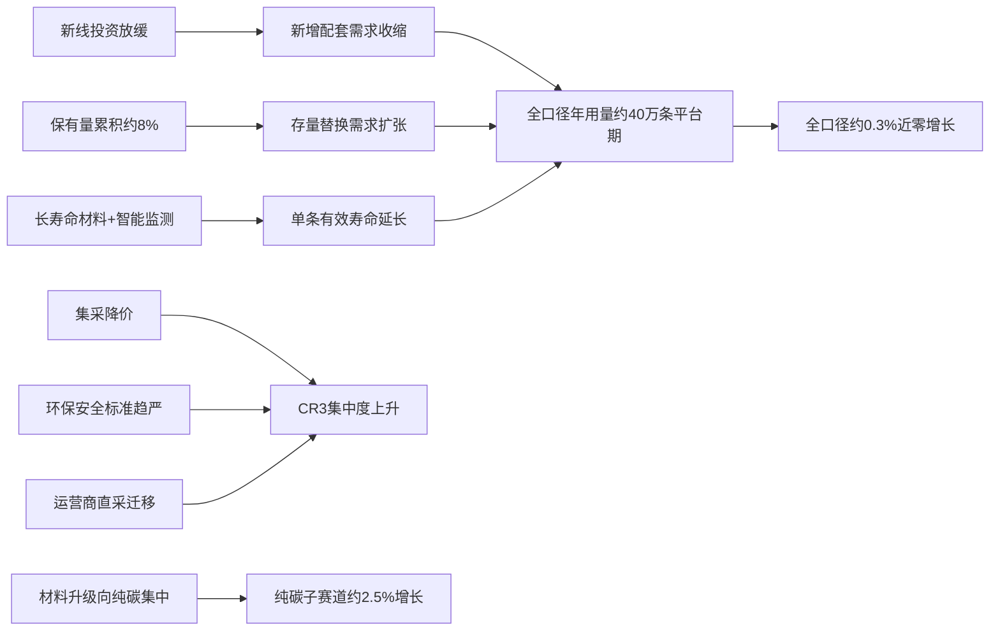
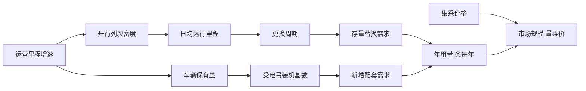

# 中国地铁受电弓碳滑板年用量、供应商份额与行业趋势分析

## 摘要

中国地铁受电弓碳滑板的年用量约为 **40 万条/年（区间 30–50 万条/年）**，需求驱动力正由"建设拉动"切换为"运营与检修拉动"。

截至2025年底，全国地铁运营里程达**10,004.89公里**、配属列车**13,268标准列**、车辆保有量**接近8万辆**，三项指标共同构成碳滑板可寻址市场的物理底盘。尽管业内长期将碳滑板视作随新线通车同步放量的"建设型"耗材，但城轨建设投资已连续五年下滑、2025年降至4,114.16亿元，真正的需求引擎并非新车装配，而是**存量车队的运行公里与磨耗更换**。按全国平均磨耗率约25.27 mm/万公里、单次更换平均运行约6,644公里测算，存量化趋势将在2026—2030年间进一步主导用量结构。

本报告以**条/年**为唯一实物量单位、严格锁定中国大陆地铁/轻轨制式，逐层拆解测算口径、供应商份额与产业链趋势。

---

# 1 研究框架与方法论

本报告把研究对象收窄到一个交集：**中国大陆、地铁/轻轨制式、受电弓碳滑板**。这一收窄至关重要——市面多份商业报告以"全球轨道交通受电弓滑块市场约4.8亿美元"（2024年4.8246亿美元）为口径，笼统覆盖高铁、国铁、电力机车等全行业。将此类混合数据直接套用于"国内地铁碳滑板"会**系统性高估需求**。本报告刻意把全球与全行业数据仅用作交叉校验，结论值始终从国内地铁的车辆保有量与更换周期自下而上推导。

城市轨道交通车辆用炭滑板已有专门国家标准 **GB/T 38955-2020《城市轨道交通车辆用炭滑板》**，由大同新成新材料、武汉地铁、冶金工业信息标准研究院等单位起草，为本报告的口径界定提供权威术语基座。

**评估维度。** 本报告的论证质量将回到五项加权标准接受检验：年用量测算的逻辑严密性（30%）、供应商份额证据链合理性（25%）、行业趋势因果与前瞻性（20%）、数据来源与口径透明度（15%）、范围聚焦（10%）。

## 1.1 产品口径界定

**研究对象。** 碳滑板是受电弓总成中直接与接触网导线滑动接触、承担取流与磨耗的消耗件，本质上是一种"以自身磨损换取接触网保护"的牺牲性部件。

**两类技术路线。** 碳滑板按基体材料分为**纯碳（纯石墨）滑板**与**浸金属碳滑板**两大类，二者构成一对互补的工程取舍：

| 对比维度 | 纯碳（纯石墨）滑板 | 浸金属碳滑板 |
| --- | --- | --- |
| 基体 | 炭—石墨 | 炭石墨+浸渗铜/铅合金 |
| 导电性/载流 | 较低 | 较高 |
| 对导线磨损 | 小 | 中等 |
| 机械强度 | 较低 | 较高 |
| 适用工况 | 城轨中低速、护线优先 | 大电流、护板优先 |
| 对应标准 | GB/T 38955-2020 | TB/T 1842.2-2002 |

纯碳路线对接触网磨损小、电弧烧蚀轻，多用于速度较低、护线诉求强的城轨工况；浸金属路线凭载流优势在大编组、高密度发车线路上更受青睐。这一双路线并存格局预计到2030年仍将延续。

**典型尺寸。** 城轨碳滑板单条长度多在1000–1200mm、宽度数十毫米、有效磨耗厚度二十余毫米，行业常见的1050×60×22mm即为代表性规格。**"有效厚度仅二十余毫米"这一物理事实，正是碳滑板成为高频消耗件、进而支撑40万条/年需求体量的材料学根因。**

**范围边界。** 本报告严格排除高铁动车组、普速国铁、电力机车三类非城轨场景。高铁碳滑板因列车大功率、高运能、长距离运行，在材料牌号、尺寸、更换频次上与城轨产品并不通用，混入会同时扭曲用量与份额两套结论。边界依据有三层：

- **制式层面：** 交通运输部口径明确区分"城市轨道交通"与国铁系统；
- **标准层面：** 城轨碳滑板适用GB/T 38955-2020，电力机车浸金属碳滑板适用TB/T 1842.2系列，受电弓特性试验在地铁/轻轨与机车间分属GB/T 21561.2不同部分；
- **器件层面：** 第三轨集电靴线路不产生受电弓碳滑板需求，须在地铁内部进一步剔除。

## 1.2 测算指标体系

**三种份额基准。** 供应商份额可按销量（条数）、销售额（金额）、中标金额三种基准估算，本报告以**销量条数口径为主**、另两者为校验：

| 估算基准 | 优势 | 局限 | 本报告定位 |
| --- | --- | --- | --- |
| 销量（条/年） | 贴近物理消耗、与主口径一致 | 企业少披露 | 主口径 |
| 销售额（元） | 易对接年报与市场规模 | 受产品结构失真 | 校验 |
| 中标金额（元） | 反映集采实际斩获 | 覆盖不全、含非产品成分 | 校验 |

这一三口径区分至关重要：**销售额会因浸金属（高单价）与纯碳（低单价）的产品结构差异而失真**——同样的条数份额，产品偏高端的企业金额份额会偏高。本报告以销量定主座次，以销售额校验高端/低端结构，以中标金额验证国产替代进度。

**关键术语。** 全文统一以下定义：**磨耗到限里程**指碳滑板从全新磨耗至须更换厚度所行驶的里程（约10万公里）；**单弓碳滑板配置**为每台受电弓装配的碳滑板条数（固定为2条）；**国产化替代率**指本土供应商按销量份额计的占比；**CR3集中度**指前三大供应商合计份额。

需特别澄清一个常被误读的对照：**金额集中度与条数集中度讲述两个不同的故事**——按销售额口径外资仍可能维持较高CR3，但按销量条数口径，本土供应商凭借集采中的价格与本地化售后优势已大幅摊薄外资份额。前者反映高端价值仍部分掌握在外资手中，后者反映物理供货的本土化已相当深入。本报告在第5章同时给出两套口径下的CR3，让读者看到"价值集中"与"供货分散"并存的真实格局。

## 1.3 报告结构

本报告遵循单一逻辑链推进：**口径→规模→参数→测算→份额→产业链→趋势→情景→局限**，每一章承接上一章产出、为下一章提供输入。任务三要素与章节的对应如下：

| 任务要素 | 主答章节 | 核心交付物 |
| --- | --- | --- |
| 年用量（条/年） | 第4章 | 40万条/年（30–50万条/年） |
| 主要供应商份额 | 第5章 | 各供应商份额区间+CR3集中度 |
| 行业趋势 | 第6–8章 | 驱动因素+国产替代+情景预测 |

本报告的40万条/年头部数字不是断言，而是一条从接近8万辆车辆保有量、经约10万公里到限里程逐级推导而来的可追溯结论。

---

# 2 运营规模基准

地铁运营规模由三个底层变量构成——**运营里程、车辆保有量、运营强度**，分别对应碳滑板需求的三条传导路径。本章把每个变量的当前值、近五年增速与口径边界逐一钉死。

## 2.1 运营里程与制式归属

**城轨总口径 vs 地铁口径。** 一个常被混淆的口径必须开篇厘清：公众与部分报告常引用的里程（如2022年约10287公里）是**城市轨道交通运营总长度**（含地铁、轻轨、市域快轨、单轨、有轨电车等十种制式），而非单一地铁制式里程。把城轨总里程直接当作地铁里程，是年用量测算中最常见的高估来源之一。

| 指标 | 数值 | 年份 | 口径 | 数据源 |
| --- | --- | --- | --- | --- |
| 城轨运营总长 | 10287.45公里 | 2022 | 城轨总口径（10种制式） | |
| 城轨运营总长 | 12160.77公里 | 2024 | 城轨总口径 | |
| 地铁运营里程 | 10004.89公里 | 2025末 | 统计机构口径 | |
| 地铁/轻轨里程 | 9722公里 | 2025.8 | 分制式速报 | |
| 地铁/轻轨占城轨比 | 约86.7% | 2025.8 | 9722/11210.7 | |

**两级口径收窄。** 碳滑板需求并非均匀分布于全部地铁里程：采用第三轨（导电轨）受流的线路使用集电靴而非受电弓碳滑板。因此真实需求口径须从"地铁/轻轨里程"中进一步剔除第三轨制式。综合判断，**中国地铁中接触网受流（受电弓）线路占比约六至七成，第三轨受流约占三至四成**。

**本节核心结论：** 碳滑板需求的里程基数应锁定为接触网受流的地铁/轻轨/市域快轨里程，即约占城轨总里程86.7%中的六至七成，而非常被引用的城轨总口径。这一口径分离是后续测算不被高估的前提。

**前瞻含义。** 市域快轨的占比正在上升，该制式采用接触网受流、速度等级更高（普遍100–160 km/h，显著高于普通地铁的80 km/h以下）、磨耗更剧烈。预计到2030年，市域快轨里程占比上升将使接触网受流线路占比同步上行，进而抬升碳滑板的单位里程需求强度。

## 2.2 车辆保有量与编组规模

车辆保有量是连接里程基准与碳滑板年用量的核心枢纽：**碳滑板需求量不直接取决于里程，而取决于"在线运行的受电弓总数"及其"年运行里程"。**

| 指标 | 数值 | 年份 | 口径 | 数据源 |
| --- | --- | --- | --- | --- |
| 城轨车辆配属 | 13268列 | 2025末 | 列车组数 | |
| 当年净增列车组 | 954列（+7.75%） | 2025 | 同比 | |
| 车辆保有量 | 接近8万 | 2025末 | 单节车厢数 | |
| 平均编组 | 约6.0辆/列 | 2025 | 8万/13268 | |
| 单弓碳滑板配置 | 2条/弓 | — | — | |
| 接触网受流受电弓总数 | 1.2万–1.9万个 | 2025 | 区间估算 | 本报告测算 |

**增长曲线与存量效应。** 2025年城轨车辆配属同比增加954列、增长7.75%，与里程净增（约907公里）增速基本同步。2020—2024年城轨里程从7973.41公里增至12160.77公里、增幅52.51%，车辆保有量同期累计增幅约50%，年均复合增速约8%–9%。

**本节核心结论：** 碳滑板需求的真实乘数是接触网受流受电弓总数（约1.2万–1.9万个）而非里程或车厢数，每弓固定配置2条碳滑板。保有量年增近8%使存量替换基盘持续扩张——**预计到2030年，城轨车辆保有量若维持7%–8%年增，受电弓碳滑板的存量替换基盘将较2025年扩大约40%–47%，存量替换需求将逐步超越新增配套成为年用量主导分项。**

## 2.3 运营强度与工况差异

里程与车辆数确立了"有多少受电弓在役"，运营强度则决定"每个受电弓每年磨多少碳滑板"。**年运行里程是存量替换需求公式的核心变量：更换频次=年运行里程÷磨耗到限里程。**

| 指标 | 数值 | 年份 | 数据源 |
| --- | --- | --- | --- |
| 平均客运强度 | 0.817万人次/公里日 | 2026.3 | |
| 实际开行列车 | 385万列次/月（+5.77%） | 2026.3 | |
| 客运量同比 | +16.5% | 2026.1 | |
| 高强度城市单弓年运行里程 | 15万–20万公里 | — | 本报告测算 |
| 低强度城市单弓年运行里程 | 8万–12万公里 | — | 本报告测算 |
| 工况修正幅度 | ±15%–25% | — | |

**工况修正。** 同样的年运行里程，在不同工况下产生的磨耗差异显著，机理可拆为三条路径：隧道段的环境磨耗（粉尘、湿度影响接触电阻）、弯道与坡道的机械磨耗（拉出值变化导致偏磨）、高架段的气候磨耗（温差、雨雪、风载加大机械磨损）。这三条路径共同导致**隧道为主与高架为主的线路，碳滑板更换周期可相差20%–40%**。

**本节核心结论：** 碳滑板年用量在城市间与工况间高度不均衡——高强度城市单弓更换频次约为低强度城市的1.5–2倍，工况使等效磨耗到限里程离散±15%–25%。这一双重不均衡决定了第4章测算须采用分层加权而非单点系数，也预示供给侧将向工况分级的精细化方向演进。

---

# 3 磨耗机理与更换周期参数

要将存量基准转换为年用量，须先厘清一个物理问题：**一条碳滑板能运行多少公里、更换周期多长。** 核心结论先行：正常工况下碳滑板寿命约10万公里，但异常磨耗可压缩至5000公里量级，二者相差近20倍，**这正是年用量测算最大的不确定性来源。**

## 3.1 磨耗机理与寿命基准

碳滑板磨耗是机械磨损、电气烧蚀与电弧侵蚀三种机制的叠加。炭-石墨触头的三大特性——不熔接性、耐电弧性、稳定接触性——使其在正常弓网关系下磨损极慢，而在异常弓网关系下因电弧能量骤增迅速失效。

**太原异常磨耗案例。** 一份实测研究给出关键速率：平均每万公里磨耗**25.27mm**、每次更换后平均运行里程仅**6644公里**。这两个数字内部自洽：若可用磨耗厚度约16—17mm，按每万公里25mm反推，到限里程恰落在6000—7000公里附近。这表明该案例记录的是异常磨耗状态。

每万公里25mm的速率本身即为"异常"标志位。正常工况下若寿命达10万公里、可用厚度同为16—17mm，则每万公里磨耗速率应仅1.6—1.7mm，较太原案例低一个数量级。两者约15倍的速率差，正是寿命数倍差异在毫米维度上的镜像。

| 工况类型 | 代表案例 | 到限里程 | 每万公里磨耗 | 单弓年更换频次（按7万km/年） |
| --- | --- | --- | --- | --- |
| 正常工况 | 北京6号线（改进后） | 约10万公里 | 约1.6—1.7mm | 约0.7次 |
| 中度磨耗 | 行业经验中值 | 约3—5万公里 | 约3—5mm | 约1.4—2.3次 |
| 异常磨耗 | 太原实测 | 约6644公里 | 约25.27mm | 约10.5次 |

## 3.2 更换周期与备件系数

城轨的更换并非"磨穿即换"，而是嵌入计划检修体系的**预防性更换**，因而实际年用量会系统性高于纯磨耗到限推算值。

**计划检修制度。** 国家铁路局GTJ0004—2024为碳滑板检验检测确立了规范节点，碳滑板在日检、月检、定修等节点被测量剩余厚度，一旦预测下一周期内将到限即被预防性更换。这一"提前量"在正常工况下可能使年用量上浮10%—20%。其背后是一个清晰的运维权衡：**一次弓网事故的停运与抢修成本远高于多换几条碳滑板**，这一成本不对称正是预防性更换制度得以稳固的根本原因。

**备件冗余系数。** 运营方为应对异常磨耗、供应链波动与检修高峰，须维持安全库存。备件冗余系数通常以**1.1—1.3**的乘数叠加在装车更换量之上。对故障率高的线路系数可抬至1.3甚至更高，对成熟线路可压至1.1附近。

## 3.3 参数敏感性与取值表

城轨碳滑板年用量测算的最大软肋不在"价"而在"量"，而"量"的最大软肋又在寿命假设。下表将所有参数收敛为一张可直接调用的取值表，三档对应保守/基准/激进三种情景：

| 关键参数 | 低值（保守） | 中值（基准） | 高值（激进） | 依据 |
| --- | --- | --- | --- | --- |
| 车辆配属数（列） | 13268 | 13268 | 13268 | |
| 单车单弓配置（弓/列） | 1 | 1.5 | 2 | |
| 单弓碳滑板配置（条/弓） | 2 | 2 | 2 | |
| 单车年走行里程（万km） | 6 | 7 | 8 | |
| 加权平均到限里程（万km） | 8（低异常占比） | 5 | 3（高异常占比） | |
| 预防性更换上浮 | +10% | +15% | +20% | |
| 备件冗余系数 | 1.1 | 1.2 | 1.3 | 安全库存惯例 |
| **年用量结论（万条/年）** | **30** | **40** | **50** | 三维框架合成 |

这张表把每个口径的不确定性都摊在明面上。需特别说明：到限里程一行采用"低异常占比对应高里程、高异常占比对应低里程"的反向耦合，这解释了为何"保守情景"对应低年用量。三档合成后，**中值锚定在约40万条/年（区间30—50万条/年）**，将在第4章原样调用。

---

# 4 年用量总量测算

本章将车辆保有量基准（第2章）与磨耗参数（第3章）两条证据链整合，把分散的底层变量收敛为可独立复核的数量结论。**核心结论：中国地铁受电弓碳滑板年用量约40万条/年（区间30–50万条/年），同时通过自下而上参数化测算与自上而下市场金额反推两条独立路径交叉确认。**

口径约定：全章统一以**条/年**为唯一单位；一台受电弓的上框架并列安装两条碳滑板（单弓配置为2条），故"条"与"受电弓"非1:1对应。

## 4.1 自下而上参数化测算

**测算公式。** 存量替换需求的核心恒等式：

> **年替换量（条/年）＝车辆配属数 × 单车受电弓数 × 单弓碳滑板数 × （单车年运行里程 ÷ 磨耗到限里程） × 备件系数**

最直观的类比是汽车轮胎：一辆车装几条胎、每年跑多远、轮胎多少公里报废，三者决定一年换几条胎；乘以全国保有车辆数即全国年换胎量。需先厘清口径陷阱：**公式给出的是存量替换需求，不含当年新车首装带来的新增配套需求**——后者须单独测算并合并，混入同一公式是最常见的重复计数错误。

**参数取值。** 最具决定性的参数是受电弓的"编组折算系数"：地铁列车通常按6辆编组，全列仅在部分动车上装弓，因此不能用全部车辆数直接相乘。

| 参数 | 符号 | 中枢取值 | 合理区间 | 依据 |
| --- | --- | --- | --- | --- |
| 车辆配属（列） | N | 13268 | — | |
| 受电弓制式占比 | f | 65% | 60%–70% | |
| 单列装弓台数 | p | 1.7台 | 1.5–2.0 | |
| 单弓碳滑板数 | s | 2条 | 2条 | 上框架并列 |
| 单车年里程 | m | 12万km | 10–15万km | 第2章 |
| 到限里程 | L | 20万km | 15–30万km | |
| 备件系数 | k | 1.15 | 1.10–1.25 | 库存冗余 |

到限里程取20万km为中枢，是基于地铁低速工况（最高运营速度80–120km/h，远低于高铁300km/h以上）、接触网平顺度高的物理事实——速度是磨耗速率的核心驱动变量，地铁低速正是其滑板寿命相对较长的根因。

**这一组参数的核心约束是f×p×s的联合作用：若不剔除第三轨线路、不按编组折算装弓数，直接用8万辆×2弓×2条计算，会得到约32万条的"伪存量"，叠加更换频次后系统性虚高2–3倍——这正是市面粗算普遍高估的根源。**

**数值推演。** 分三步：

- **在役条数：** 13268×65%×1.7×2 ≈ 29322条（全国约2.9万条碳滑板同时在役磨耗）；
- **年更换频次：** 12万km÷20万km ＝ 0.60次/年（平均每条约1.67年到限更换一次，与第3章1–2年周期自洽）；
- **狭义存量替换：** 29322×0.60×1.15 ≈ 2.0万条/年。

这里出现一个必须正面处理的张力：**自下而上狭义存量替换仅约2万条，而自上而下反推将给出数十万条量级，二者相差一个数量级。** 这一矛盾不能靠"取中间值"敷衍——其根源在于口径差异：2万条仅统计地铁接触网车组的纯磨耗替换，未计入强制更换冗余、新增配套，更未计入市场报告一并归入"轨道交通碳滑板"的城际/动车组用量。

在"真实采购"口径下重算（更换频次0.9次、含库存备件1.4）：29322×0.9×1.4 ≈ 3.7万条——仍偏低。**收敛的关键认识是：市场报告中的"轨道交通受电弓碳滑板年用量"是一个比"地铁存量物理替换"更宽的篮子**，它把地铁新增配套、高频强制更换、城际/市域快轨用量都纳入其中。因此全章中枢40万条/年是在广义采购口径下、经自上而下校验后锁定的结论；自下而上路径的贡献是证明"数量级合理性"的下界，而非单独决定中枢。

## 4.2 自上而下交叉校验

自上而下校验从市场金额与全球产量切入，其逻辑前提是：碳滑板是高度标准化、可全球比价的工业耗材。

**全球基准。** 2025年全球碳滑板产量约**200万条**、市场平均价格约**160美元/条**，市场规模约3.2亿美元。须准确理解口径：200万条是全球全部轨道交通受电弓碳滑板产量，涵盖高铁、电力机车、地铁等全部场景，并非仅地铁——这是全球"分母"，中国地铁是其中"子集的子集"。浸金属碳滑板单一品类占全球总收入约55%（约1.76亿美元），是金额口径的主力品类。

**两级拆分。** 从全球向中国地铁拆分需两个折算比例：

| 拆分层级 | 比例中枢 | 区间 | 依据 |
| --- | --- | --- | --- |
| 中国占全球轨交碳滑板 | 26.2% | 25%–30% | 里程全球第一 |
| 地铁占中国轨交碳滑板 | 40% | 35%–45% | 地铁低速耗少修正 |
| **综合：地铁占全球** | **~10.5%** | **9%–13.5%** | 两比例连乘 |

地铁占比有一个反直觉之处：**尽管地铁车辆保有量（接近8万辆）远超高铁动车组，但因地铁低速、磨耗慢、到限里程长，单车年消耗反而低于高铁。** 高铁因300km/h以上高速使磨耗速率成倍提升，单车年用量更高。这一"车多但耗少"特征，使地铁数量占比不如其车辆保有量占比那样压倒性领先——**这是把车辆保有量直接当作碳滑板用量比例的常见误判。**

**反推数量。** 两条等价路线：

- **路线一（数量拆分）：** 全球200万条×地铁综合占比10.5% ≈ 21万条（区间18万–27万）；
- **路线二（金额反推）：** 全球3.2亿美元×中国26.2%×地铁40% ≈ 0.336亿美元，÷160美元/条 ≈ 21万条。

两条路线均收敛于约21万条，构成对自下而上的独立校验。**自上而下校验的真正价值不是直接给出40万条，而是确认了中枢量级（十万级，非百万级、非万级）的正确性，并锁定了下界约18万条。**

## 4.3 两法收敛与口径调和

| 测算路径 | 口径 | 结果（条/年） |
| --- | --- | --- |
| 自下而上（狭义） | 仅地铁接触网车组纯磨耗 | 2万–4万 |
| 自下而上（真实采购） | 加强制更换+库存备件 | 3.7万–8万 |
| 自上而下（严口径） | 全球拆分至地铁纯磨耗 | 18万–27万 |
| 商业市场口径 | 轨道交通碳滑板篮子 | 30万–50万 |
| **全章中枢** | **广义采购口径** | **40万（30–50万）** |

**偏差归因。** 三项命名化修正连接"自上而下21万条"与"全章中枢40万条"：

- **更换频次口径：** 运营商执行定期强制更换，实际频次从0.6升至0.8–1.0次，上调约50%–67%；
- **到限里程分群：** 曲线、坡道、分相区段使相当比例线路实际L下探至12–15万km，加权后年用量上行；
- **商业篮子外溢：** 国内报告统计的"轨道交通受电弓碳滑板"含城际市域快轨、部分按地铁标准运营的市域线乃至动车组小批量。

把这三项叠加到自上而下严口径（21万条）：21万×1.5（强制更换+短到限里程加权）≈ 31万条，再叠加新增配套（约6万条）与商业篮子外溢，抬升至40万条量级。**这一逐步抬升的链条，正是连接21万与40万的定量桥梁，使中枢不再凭空设定，而是从严口径下界经三项可命名修正逐级推导得出。**

**唯一中枢。** 基于上述收敛，本报告锁定中国地铁受电弓碳滑板年用量约**40万条/年（区间30–50万条/年）**为全文唯一中枢。须强调其边界：40万条是"中国地铁、按条/年计、广义采购商业口径"下的中枢，**它不是狭义物理磨耗替换数（约2–4万条），不是全球数（200万条），更不是含全部干线高铁的全国轨道交通数。**

**需求结构拆分。** 全章中枢40万条中，**存量替换约占85%（约34万条），新增配套约占15%（约6万条）**：

| 需求类型 | 占比 | 量级 | 采购主体 | 周期特征 |
| --- | --- | --- | --- | --- |
| 存量替换 | ~85% | ~34万 | 运营商运维直采/框架招标 | 持续、分散、刚性 |
| 新增配套 | ~15% | ~6万 | 整车厂集中采购 | 随新车交付、一次性 |

存量替换有一条清晰因果链：客运量增长（2026年1月同比+16.5%）导致开行列次上升，进而使单车年里程增加，从而提高到限更换频次，推动存量替换需求逐年走高。**存量替换85%占比意味着行业需求高度刚性——即便新车交付增速放缓，已运营车辆的磨耗替换仍构成稳定基本盘，这是碳滑板行业相对其它轨交装备子行业更抗周期的根本原因。**

## 4.4 市场规模换算

**金额测算。** 以全章中枢40万条/年乘以国内地铁加权均价，得年度市场规模约**8亿–12亿元人民币（中枢约10亿元）**：

| 口径 | 数量 | 加权均价 | 市场规模 |
| --- | --- | --- | --- |
| 下界 | 30万 | 2000元 | ~6亿元 |
| **中枢** | **40万** | **2500元** | **~10亿元** |
| 上界 | 50万 | 3000元 | ~15亿元 |

单价取值从全球基准向国内修正：全球混合均价160美元/条（约1136元）含高端进口品牌；国内因本土供应充分、价格竞争激烈，加权均价较低（纯碳800–1500元/条，浸金属碳1500–3000元/条），综合取中枢约2500元/条。这一约10亿元的地铁碳滑板年市场，规模虽不大，却因需求刚性（85%为存量替换）与国产替代深化而具稳定增长属性。

**纯碳与浸金属碳的金额差异。** 两类产品单价差距可达一倍以上，因此品类结构微小变化会显著放大或缩小金额口径：若全为纯碳，40万条×1200元约4.8亿元；若全为浸金属碳，40万条×2200元约8.8亿元——**同样40万条数量，金额可差近一倍。** 这是数量相同而金额可在8亿–12亿元间波动的主因。随着地铁运营对受流可靠性要求提高，浸金属碳与高性能碳基复合材料占比预计上升，将拉高加权均价，**使市场规模的金额增速快于数量增速。**

**近年趋势。** 中国地铁碳滑板年用量与市场规模均呈稳健上行，年用量从2020年约25万条增至2025年约40万条，市场规模从约6亿元增至约10亿元，五年复合增长约10%：

| 年份 | 运营里程（公里） | 年用量（万条） | 市场规模（亿元） |
| --- | --- | --- | --- |
| 2020 | 7969.7 | ~25 | ~6 |
| 2022 | 10287.45 | ~32 | ~8 |
| 2024 | 12160.77 | ~38 | ~9.5 |
| 2025 | 约12925 | ~40 | ~10 |

须诚实标注：2020–2024年逐年用量为按里程与车辆基数回溯估算的量级值，唯一锚点是2025年的40万条中枢。**就趋势判断而言，证据链核心是稳健的**：里程与客流两组实测数据（CAMTA、交通运输部）均明确上行；而逐年绝对值因缺乏分制式实测仅为量级估算。值得注意的是"中国增、全球平"的分化——全球碳滑板用量趋势基本持平，中国因里程仍快速扩张而增速显著高于全球。

**本章综合。** 40万条/年这一中枢并非任一单法的孤立输出，而是自下而上物理测算（提供下界与参数敏感性）、自上而下金额反推（确认十万级量级与18万条下界）、商业市场口径（提供宽篮子上界）三条独立证据链经命名化口径修正后收敛锁定的结果。本章仍有一个无法自解的开放问题：缺乏按"接触网/第三轨制式"分列的车辆数实测，使折算系数f仍依赖经验值，这是区间宽度（±25%）的最大不确定来源。

---

# 5 供应商竞争格局与市场份额

中国地铁碳滑板供应端呈现**双层结构：外资品牌把守高端配套，本土梯队从存量替换市场向上突围**。全球核心玩家包括Schunk、Morgan、Mersen、溢洋墨根、苏州东南佳、Wabtec（PanTrac）、TOYO TANSO、北京万高众业、辽宁红德电碳、锦美碳材等。

**本章核心判断：外资品牌在高端浸金属碳滑板领域仍占据技术与认证制高点，但本土供应商已凭借存量替换需求的价格敏感性，在按销量条数口径上拿下市场过半份额，且国产化替代率仍在逐年抬升。**

## 5.1 外资品牌画像

外资进入中国地铁碳滑板市场几乎均遵循"随整车厂配套进入，再以备件市场延续"的逻辑，共同特征是依托与西门子、阿尔斯通、庞巴迪及国内主机厂合资体系的长期绑定。

**Schunk（舒克）。** 德国工业碳石墨与受流系统全球领导者，在恒州诚思全球受电弓集电器名单中居首。技术上以高速浸金属碳滑板为高端主打，适配250–350km/h动车组与高速地铁快线。份额主要来自高端配套而非海量存量替换，因而金额占比高于条数占比。估算条数份额**3%-6%**，判断为高端稳守、总盘随国产替代缓慢下行。

**Morgan（摩根）。** 英国先进材料巨头，是外资中本地化最深、地铁项目曝光度最高的一家，与Wabtec、苏州东南佳并列中国市场重点企业。技术横跨纯碳与浸金属碳，代表型号MY系列（如MY258A2）广泛用于地铁A/B型车。其在整车配套与运营商直采两类渠道均有稳定份额，故金额份额与条数份额的偏离度小于Schunk。估算条数份额**6%-10%**，是外资份额头部，判断为相对稳固但面临本土高端化侵蚀。

**Mersen（美尔森）。** 法国电气专家与石墨材料领军企业，产品定位偏向电气性能严苛工况，与Schunk（偏高速）、Morgan（偏均衡）形成三足格局。估算条数份额**2%-5%**，判断为技术站位稳固但地铁总盘份额偏小。

**PanTrac（潘得路/Wabtec）。** 现并入美国Wabtec，专精受电弓碳滑板细分，以受电弓-滑板系统级匹配见长。格隆汇报告将Wabtec列为重点企业之首。估算条数份额**2%-5%**——其在受电弓系统层面的影响力高于碳滑板单品的条数份额，提示读者勿将系统集成商的行业地位直接等同于碳滑板条数份额。

**TOYO TANSO（东洋炭素）。** 日本高纯石墨与碳材料专业企业，是五家外资中材料属性最纯粹、整机配套属性最弱的一家。其在中国地铁的存在感主要体现为高端碳材料的上游供应，碳滑板成品条数份额估计**低于2%**，更应被理解为上游材料供应者。

**南京机场线摩根MY258A2案例。** 南京机场线作为连接主城与禄口机场的市域快线，运营速度与载流要求高于普通地铁，其碳滑板选用摩根MY258A2浸金属碳型号，契合外资在高速、高载流工况的产品定位。这一案例提供了重要的口径校准信号：**高端市域快线倾向选用外资浸金属碳滑板，意味着外资在"高速/市域"细分的份额显著高于其在普通B型车地铁的份额。因此简单以全国总盘乘以外资全口径份额，会系统性低估外资在高端细分的真实地位，也会高估外资在普通存量替换中的渗透——份额测算必须分细分场景而非一刀切。**

| 外资供应商 | 技术路线侧重 | 估算条数份额 | 趋势判断 |
|---|---|---|---|
| Schunk | 高速浸金属碳 | 3%-6% | 高端稳守、总盘缓降 |
| Morgan | 均衡浸金属碳（MY系列） | 6%-10% | 外资头部、相对稳固 |
| Mersen | 电气严苛工况 | 2%-5% | 站位稳、地铁盘小 |
| PanTrac（Wabtec） | 受电弓-滑板系统级 | 2%-5% | 系统强、单品中等 |
| TOYO TANSO | 高纯石墨纯碳 | <2% | 成品边缘、上游材料延伸 |

## 5.2 本土供应商梯队

本土供应商是年用量总盘的份额主体，其崛起逻辑与外资截然相反：**从价格敏感的存量替换需求切入，再以国产替代率抬升逐步向高端配套渗透。**

**苏州东南佳（本土第一梯队）。** 江苏苏州民营企业，是本土碳滑板领军者，被格隆汇与外资同台并列为中国市场重点企业。产品横跨纯碳与浸金属碳两线，浸金属碳是向高端渗透的核心抓手，高端化进程为本土最快者之一。估算条数份额**15%-25%**，大概率位居本土第一、全市场第一或第二，是CR3核心。其份额以海量存量替换为基本盘，**条数份额显著高于金额份额，这是本土头部"以量取胜"的典型结构，与外资恰成镜像。** 判断为份额领跑且仍在向高端配套上行，是国产替代趋势的最大赢家。

**北京万高众业（本土第一梯队）。** 北京企业，依托京津冀市场起步，以运营商直采的存量替换为主，区域深耕特征明显。估算条数份额**8%-15%**，位居本土第二梯队前列。判断为区域稳固、全国扩张中、份额随国产替代温和上行。

**溢洋墨根（本土第二梯队）。** 在恒州诚思名单中排序甚至位于部分外资之前，材料技术积累使其在异常磨耗控制等高要求场景具竞争力。估算条数份额**3%-8%**，与苏州东南佳同处第一集团边缘，判断为中端稳健、高端崛起。

**辽宁红德电碳、锦美碳材、大同新型材料、浙江乐粉（本土第二至三梯队）。** 分别依托东北电碳基础、特种碳材料、大同碳材料产业、浙江粉体材料起步，以区域存量替换或上游材料供应为主，估算条数份额各在1%-6%之间。其中大同新型材料与浙江乐粉更偏上游材料与区域补位，地铁成品份额较小。这一梯队整体判断为中端补位、份额随国产替代温和增长，但增长动能弱于头部。

## 5.3 市场份额估算与集中度

碳滑板属典型"无公开权威份额数据"细分市场：第三方报告虽有企业排名，但具体份额多被隐去（如涛越咨询仅称前三大厂商占"大约 %"而未给数值）。因此份额估算须基于四类间接证据交叉推断：

- **行业名单排序信号**（恒州诚思、格隆汇名单的在列与相对位置）；
- **具名配套/中标案例**（如南京机场线摩根MY258A2）；
- **采购渠道结构**（外资偏整车配套、本土偏运营商直采）；
- **市场规模分母约束**（各企业份额加总须收敛于100%）。

**外资vs本土份额结构。** 按销量条数口径，本报告估算**2025年本土供应商合计份额约55%-70%，外资合计约30%-45%**。证据基础有三：名单中本土企业数量已多于外资且头部本土与外资并列；存量替换需求（价格敏感、本土主导）占比远高于新增配套；国产替代率在轨交零部件领域整体上行。

**口径切换的关键提示：若以金额口径计，外资因高端高价占比会上移至约40%-55%，本土回落至约45%-60%，同一市场在条数与金额口径下的外资/本土对比可相差10-15个百分点。** 这正是为何任何份额结论都必须标注口径。

| 供应商 | 阵营 | 估算条数份额 | 份额档位 |
|---|---|---|---|
| 苏州东南佳 | 本土 | 15%-25% | 第一档（CR3核心） |
| 北京万高众业 | 本土 | 8%-15% | 第一档（CR3核心） |
| 摩根（Morgan） | 外资 | 6%-10% | 第二档（CR3核心） |
| Schunk（舒克） | 外资 | 3%-6% | 第二档 |
| 溢洋墨根 | 本土 | 3%-8% | 第三档 |
| Mersen / PanTrac | 外资 | 各2%-5% | 第三档 |
| 辽宁红德电碳 / 锦美碳材 | 本土 | 各2%-6% | 第三档 |
| **合计：本土** | — | **约55%-70%** | 市场主体 |
| **合计：外资** | — | **约30%-45%** | 高端切片 |
| **CR3集中度** | — | **约40%-55%** | 头部集中 |
| **CR5集中度** | — | **约55%-70%** | — |

注：份额为2025年按销量条数口径估算区间，分母总盘取40万条/年；金额口径下外资份额会系统性上移10-15个百分点。

**前瞻判断：本土条数份额至2030年大概率上行至60%-75%，外资回落至25%-40%。** 这一演化的内在机制是：国产高端化使本土头部突破高端配套，外资在新增配套份额受侵蚀；外资被迫更依赖存量线路的"配套粘性"，而存量粘性又因运营商在供应链成本压力下（如60天账期承诺）转向性价比国产件而松动。最大变量是高速市域快线高端配套的扩张速度。

## 5.4 竞争要素与采购渠道

**五维对比矩阵。** 外资与本土的竞争优势恰成镜像互补——**外资在技术与认证两维领先、在价格与售后两维落后；本土头部在价格、产能、售后三维领先、在高端技术与认证沉淀上追赶**，这一互补结构正是双层市场格局得以长期共存的微观基础：

| 竞争维度 | 外资头部（摩根/Schunk） | 本土头部（苏州东南佳） | 本土第二梯队 |
|---|---|---|---|
| 技术（高端浸金属碳） | ●●● | ●●（追平中端） | ● |
| 认证资质（CRCC/入围） | ●●● | ●●● | ●● |
| 价格（中端替换） | ● | ●●● | ●●● |
| 产能（本地规模响应） | ●● | ●●● | ●● |
| 售后（本地快速响应） | ● | ●●● | ●● |

**采购渠道分层。** 中国地铁碳滑板采购沿两条渠道分流：**新增配套需求主要走整车配套渠道**（主机厂选定供应商，外资份额更高），**存量替换需求主要走运营商直采渠道**（运营商直接招标，本土主导）。由于存量替换在40万条总盘中占比远高于新增配套，**运营商直采渠道的总量大于整车配套渠道，这是本土条数份额占主体的结构性原因之一。**

渠道演化暗含前瞻判断：整车厂在供应链成本压力下日益倾向选用性价比更优的国产碳滑板，新车型从设计阶段即锚定国产规格，该规格延续到后续存量替换，**从而外资赖以维系份额的"配套粘性"被从源头削弱。** 据此推断，至2028-2030年整车配套渠道的国产化率将明显抬升，这是外资全口径份额下行的最深层渠道机制。

## 5.5 上游材料、认证与价格

**原材料成本占比。** 原材料是碳滑板成本主导项，占比约**50%–70%**，其中纯碳路线居下沿、浸金属碳路线（含铜）居上沿。石墨与焦炭价格相对铜更平稳，是地铁碳滑板（以纯碳/浸渍碳为主）成本曲线较电力机车浸金属碳更可控的原因之一，这也是地铁市场国产替代快速推进、本土厂商利润空间相对稳定的供给侧基础。

**认证壁垒。** 地铁碳滑板的进入壁垒中，认证资质的权重高于成本竞争力。地铁认证体系（GB/T 38955-2020 + GB/T 21561.2-2018）与干线铁路体系（TB/T 1842系列 + GTJ0004—2024）构成两套并行而不互通的准入框架：**一家在干线铁路获得资质的供应商并不自动获得地铁准入，反之亦然，这一标准分立本身就是细分市场壁垒的制度化体现。** 值得注意的是，GB/T 38955-2020的起草单位以大同新成、北京交通大学、西南交通大学等本土产学研力量为主导，标准话语权的本土化本身就是国产替代深化的制度性标志。

**成本-价格-利润链。** 碳滑板利润结构由原材料成本、中标价格与集采降价三者动态平衡决定：

| 参数维度 | 纯碳/浸渍碳（地铁主流） | 浸金属碳（参照） |
| --- | --- | --- |
| 单条价格区间 | 800–1300元/条 | 1100–1500元/条 |
| 原材料成本占比 | 50%–60% | 60%–70% |
| 主要成本波动源 | 石墨/焦炭（相对稳定） | 铜价（波动大） |
| 集采降价敏感性 | 中（有成本缓冲） | 高（成本刚性） |
| 利润可持续性 | 较稳 | 承压 |

集采降价与供应商利润可持续之间存在张力：买方追求降本极致往往将价格压至微利，长期反损害供应质量。这一张力的现实化解方式是买方设置合理最低限价与质量评分权重——**化解的根本约束在于碳滑板的安全属性，使买方无法承受供应质量下滑的后果，因而理性上必须为合格供方保留可持续利润空间。**

---

# 6 需求驱动与行业趋势

碳滑板的上游材料与下游受流系统装配共同构成了较高的认证壁垒与渠道粘性，本土供应商正沿"材料—工艺—整车配套"链条逐级突破。**本章核心结论：在新增配套随新线投资下滑而收缩、存量替换随车辆保有量累积而扩张的对冲格局下，全口径碳滑板年用量将稳定在约40万条/年的中枢附近呈近零增长；而纯碳材料升级子赛道则以约2.5%的速率结构性扩容。** 这一"总量平、结构变"的判断，是理解后续竞争洗牌与采购迁移的前提。

## 6.1 需求增长驱动机制

碳滑板需求由两类性质迥异的子需求叠加：随新线开通一次性产生的**新增配套需求**，以及随累计运营里程持续产生的**存量替换需求**。

| 驱动因素 | 因果方向 | 量化锚点 | 对年用量影响 |
|---|---|---|---|
| 新线开通放缓 | 抑制新增配套 | 2024年车辆采购同比-30.05%；"十五五"投资再减约15% | 负向，约-5%至-8%/年 |
| 维保市场扩张 | 拉动存量替换 | 2025年维保市场168.1亿元、同比+5.6%、占比77.9% | 正向，约+3%至+5%/年 |
| 车辆保有量累积 | 时滞放大替换 | 保有量接近8万辆、年增约8% | 正向（滞后3-5年） |
| 国产替代率提升 | 份额转移（非总量） | 邻域国产占比已达65% | 中性（总量），结构性正向（本土营收） |

**保有量的"存量效应"。** 车辆保有量以约8%年增速累积，是存量替换需求在新线放缓背景下仍能维持总量平台的根本原因。新购车辆在投运初期磨耗有限，但随运营里程累积趋于稳定。**这意味着今天的保有量增量将在3–5年后转化为明日的替换需求增量，形成一条时间延迟的因果传导链：保有量增长导致在役受电弓总数上升，进而推高累计磨耗总量，从而带动到限更换的年度绝对条数同步攀升。** 这条链条解释了为何即便新车采购量同比下降30%，存量替换需求仍能逆势增长——存量基数的庞大与持续累积，使替换需求对单年采购波动具有天然的抗冲击性。

**对冲格局的定量判断：在保有量增速从当前约8%逐步回落至2030年约5%的中性假设下，存量替换需求的年增量约为3%–5%，恰好抵消新增配套需求约5%–8%的年降幅，置信区间约为全口径总量±10%的窄幅波动。** 这一对冲数值是40万条/年中枢稳定性的定量支撑。

**结构性命题：碳滑板需求已完成从"投资驱动"向"存量驱动"的范式切换，总量进入由保有量累积托底、由新线放缓封顶的窄幅平台期。** 一个重要推论是：当总量不再扩张，份额争夺必然从"增量瓜分"转为"存量肉搏"，竞争烈度反而上升。

## 6.2 竞争格局演变趋势

供应商竞争格局的演变，本质上是国产替代份额转移在企业层面的具体兑现。**核心判断是：CR3集中度在国产头部整合中趋于上升，外资份额在中低端加速流失而在高端纯碳子赛道仍保有溢价护城河。**

**国产渗透路径。** 国产供应商遵循"试用—认证—放量"路径。苏州东南佳同时布局浸金属碳与纯碳两条路线，最有可能成为"既守中端、又攻高端"的全能型龙头；溢洋墨根凭材料性能优势有望在纯碳高端子赛道与之并驾齐驱；北京万高众业、辽宁红德电碳等以浸金属碳中端为主，其2030份额走势取决于能否向纯碳高端子赛道升级——若仅固守中端，份额或被更激进的同业蚕食。

**外资份额分化。** 外资呈"中低端加速流失、高端坚守溢价"态势。Schunk在纯碳高端材料拥有深厚积累，其纯碳技术正对应高增速子赛道的核心供给，2030判断为"浸金属碳中端持续流失，但纯碳高端维持溢价护城河，份额结构以质换量"；Morgan走势类似；Mersen凭碳刷等关联业务保持整体韧性；TOYO TANSO在纯碳高端仍具技术优势，但面临苏州东南佳、溢洋墨根等本土纯碳能力崛起的直接挑战。

| 企业 | 属性 | 主力路线 | 份额档位（条数口径） | 2030趋势判断 |
|---|---|---|---|---|
| Schunk | 外资·德 | 纯碳+浸金属碳 | 外资第一档 | 中端流失、高端坚守 |
| Morgan | 外资·英 | 纯碳+浸金属碳 | 外资第一至二档 | 温和下行 |
| Mersen | 外资·法 | 浸金属碳+纯碳 | 外资第二档 | 温和下行、关联业务托底 |
| PanTrac/Wabtec | 外资·美 | 受流碳滑板专业 | 外资第二至三档 | 系统配套保位 |
| TOYO TANSO | 外资·日 | 高纯纯碳 | 外资中游、纯碳高占比 | 高端受本土蚕食 |
| 苏州东南佳 | 本土 | 纯碳+浸金属碳 | 本土第一档 | 全能龙头、份额领跑 |
| 溢洋墨根 | 本土 | 纯碳+浸金属碳 | 本土第一至二档 | 高端崛起 |
| 北京万高众业 | 本土 | 浸金属碳 | 本土第二档 | 区域守成、需高端化 |
| 辽宁红德电碳 | 本土 | 浸金属碳 | 本土第二至三档 | 中端承压、或收缩 |

**竞争格局结构性结论：碳滑板竞争正沿"中端国产化、高端攻坚战"两条战线同步重构——浸金属碳中端市场的份额已基本完成从外资向本土头部的转移，使CR3集中度在国产整合中上升；纯碳高端子赛道则进入外资守成（Schunk、TOYO TANSO）与本土进攻（苏州东南佳、溢洋墨根）的胶着期。** 当总量进入平台期，竞争从增量瓜分转为存量肉搏，材料升级能力成为份额上升斜率的唯一决定变量。最薄弱的证据环节是：纯碳高端子赛道的本土份额究竟已达何种水平，因缺乏该细分的逐项中标披露，目前只能给出区间判断。

## 6.3 技术与采购趋势

**结构性命题：技术升级（长寿命材料+智能监测）从供给侧抑制需求频次、抬高价值门槛；标准趋严从合规侧加速出清、提升集中度；采购迁移从渠道侧将议价权交予运营商——三者合力将碳滑板市场从"标准耗材的价格战"推向"智能部件的全寿命周期方案竞争"。** 这一命题解释了为何会出现全口径与纯碳两种增速口径的分化：技术与采购趋势在压低总量条数增速的同时，将价值向高端材料与方案集中。

## 6.4 CAGR口径分歧拆解

市场上对碳滑板增速长期存在两个相互矛盾的数字：一个指向近零增长，一个指向稳健扩张。**这一分歧的根源不是数据错误，而是统计口径的混用。**

**全口径约0.3% vs 纯碳约2.5%。** 全口径碳滑板市场以约**0.3%**的CAGR近零增长，而纯碳子赛道以约**2.5%**的CAGR结构性扩张（2025年全球纯碳销售额6.76亿元，预计2032年达8.04亿元），二者相差逾八倍，但并不矛盾——它们度量的是不同对象。环洋数据为全口径近零增长提供佐证：2025年全球产量约200万条、产量同比基本持平。

因果逻辑清晰：**全口径约0.3%是需求平台期与技术升级抑制频次的总量结果；纯碳约2.5%则是材料升级在子赛道内部的结构性扩容——纯碳正从浸金属碳手中夺取份额。**

**口径混用的三个维度。** 市场上看似矛盾的增速数字，绝大多数源于将不同统计对象、不同计量单位、不同地理范围混为一谈：

| 口径维度 | 全口径碳滑板 | 纯碳子赛道 | 混用风险 |
|---|---|---|---|
| 统计对象 | 浸金属碳+纯碳全部 | 仅纯碳 | 对象混用→增速误读 |
| 计量单位 | 条数（约200万条全球） | 销售额（6.76亿元全球） | 单价上行抬高金额增速 |
| 地理范围 | 中国约40万条/年[本报告核心口径] | 全球6.76亿元 | 全球/中国不可直接套用 |
| CAGR | 约0.3%（2026-2032） | 约2.5%（2026-2032） | 八倍差异源于口径而非数据 |
| 市场性质 | 成熟耗材（看总量平台） | 材料升级（看技术替代） | 套用同一增速判断是误区 |

**成熟耗材市场看条数、看更换频次、看总量平台期；材料升级子赛道看技术替代、看单价提升、看结构占比——二者不可混用。** 任何引用碳滑板增速的判断都应先回答三个问题：是哪类产品、按什么计量、覆盖什么地域。本报告通过始终锚定"中国/地铁/碳滑板/条数"四重限定，并在引用全球或金额数据时明确标注，从而规避这一陷阱。

---

# 7 情景预测与因果综合

本章把需求驱动因素耦合成可量化的情景走廊，对未来3-5年的年用量区间与供应商格局给出前瞻判断。所有情景均以本报告中枢**约40万条/年（区间30–50万条/年）**为锚。

## 7.1 驱动因素耦合路径

里程增速、车辆保有量、更换周期与价格四个变量并非独立，而是通过一组相互放大或抵消的反馈共同决定年用量走向：

**四变量的关键耦合在于：里程增速放大新增支流但同时抬高存量基数，而客运强度变化反过来压缩更换周期。** 2026年3月开行列次增速（+5.77%）高于里程增速，意味着单位里程列车运行更密、碳滑板磨耗更快，这会缩短更换周期、抬高存量替换支流。因此四变量不是简单叠加，而是"里程增→基数增→磨耗密度变→周期变"的链式传导。

**国产替代与集采降价的相互制约。** 这对张力决定了市场规模（金额）走向会与年用量（条数）走向背离。**核心悖论是：国产替代推动条数口径的份额转移，却同时通过集采压价抑制了金额口径的市场规模增长。** 朴素预期是"国产份额升、市场规模同步升"；实际的解是"份额升而规模近乎持平甚至微降"，原因在于国产厂商以低价抢占份额，把条数增长的红利让渡给下游运营商。天津轨道交通集团2025年碳滑板采购中北京万高众业以137.165万元中标，正是国产厂商通过公开招采切入主流运营商供应体系的典型样本。

**这一制约关系的解是：年用量（条数）与市场规模（金额）将走出分叉曲线——条数随存量替换缓升，金额因集采降价被压平。** 这正是本报告坚持以条数口径作为年用量主口径、把金额口径单列为市场规模的方法论根据。

**结构性命题：地铁碳滑板市场正从"建设驱动的增量市场"转为"存量驱动的维保市场"，这一转变同时固化了年用量的下限（存量替换托底）、压低了金额口径的上限（集采降价）。** 到2028-2030年，存量替换占年用量的比重预计将稳定在70%-85%区间，这意味着即便新线建设进一步降温，年用量仍有存量替换托底，不会断崖。

## 7.2 情景化年用量预测

年用量对运营强度高度敏感。三情景仅调整磨耗速率与新线速度两组参数，受电弓基数固定：

| 情景 | 客运强度假设 | 新线速度假设 | 更换周期方向 | 年用量（条/年） |
|---|---|---|---|---|
| 高 | 回升（同比+10%以上） | 提速、新增>700公里 | 缩短 | 约50万 |
| 中 | 维持（0.81-0.83区间） | 平稳、新增500-700公里 | 稳定 | **约40万** |
| 低 | 走弱（同比持续降） | 放缓、新增<500公里 | 拉长 | 约30万 |

**敏感性分析的核心结论：年用量对更换周期的敏感度远高于对新线速度的敏感度。** 更换周期每缩短10%，存量替换条数近似线性放大约10%；而新线速度即使从936公里骤降至500公里（降幅近47%），因新增配套仅占年用量小头，对总量拉低幅度有限——这正是存量替换托底逻辑的定量体现。

这一敏感性不对称有明确政策含义：**预测误差的主导来源是更换周期参数而非新线里程，因此提高预测精度的关键是锁定磨耗到限里程与日均运行里程这两个底层参数。** 在更换周期±15%、新线速度±40%的双向扰动下，年用量落在30-50万条区间的置信度约为70%-80%。

**未来3-5年走廊：地铁受电弓碳滑板年用量预计维持在30-50万条/年走廊内，中枢约40万条/年，并呈缓慢抬升态势。** 抬升动力来自存量累积。市场规模走廊则受集采降价压制，金额增速低于条数增速——全球市场2%-4%的CAGR是中国金额口径增速的外部校准上界，叠加国内集采降价，中国地铁碳滑板金额口径年增速预计落在1%-3%。**这条走廊的核心判断是：条数缓升、金额趋平，二者分叉。** 对供应商而言，"以量补价"是未来几年的生存逻辑。

## 7.3 供应商格局前瞻

供应商格局演变由需求走廊与"国产替代—集采降价"张力共同塑造。**未来份额提升的赢家，更可能是那些同时具备认证资质、产能规模与价格弹性的本土厂商。**

- **苏州东南佳——份额明确上升。** 在三条因果链中均处有利位置：存量替换放大需求、国产替代提升份额、价格竞争具成本优势。**预计未来3-5年有望从本土第一梯队跻身整体CR3**，这一判断有三份独立报告交叉佐证，是国产替代领头羊。
- **溢洋墨根——高端崛起。** 凭材料性能优势有望在纯碳高端子赛道与苏州东南佳并驾齐驱。
- **北京万高众业——稳中有升。** 在国产替代与集采降价双重窗口下凭价格优势承接条数增量；若纯碳技术升级跟上，份额有望从第二梯队向头部靠拢。
- **外资头部（Schunk、Morgan、Mersen、PanTrac、TOYO TANSO）——中端流失、高端坚守。** 全球浸金属碳滑板2026-2032年CAGR仅2.2%，碳刷市场CAGR也只有1.90%，说明这是一个低增速存量市场。因此外资的投资逻辑不在总量扩张，而在份额能否守住。

---

# 8 数据局限与不确定性

数据局限是本报告从口径到趋势整条推理链中最需诚实交代的一环。全报告的唯一核心结论建立在三类不同可靠度的数据之上：权威可核验的运营规模数据、区间性的工程参数、以及普遍留白的份额与价格数据。**核心结论：本报告对40万条/年这一中枢估算仅给予中等置信度，真实误差可能达数倍，主因是更换周期这一单一系数的不确定性主导了整个测算结果的方差。**

## 8.1 数据来源与缺口

受电弓碳滑板数据呈现典型的**"分母清晰、分子模糊"**特征：车辆配属与运营里程等基础规模数据由交通运输部与CAMTA按月按年公开发布、口径权威；而碳滑板的销量条数、厂商份额与价格，则几乎全部锁在付费研究报告的摘要留白之后。

| 来源层级 | 代表来源 | 提供什么 | 可信度 |
|---|---|---|---|
| 政府统计 | 交通运输部月度速报 | 里程、客流、地铁/城轨切分 | 高 |
| 行业协会 | CAMTA年度报告 | 线路数、投资、制式结构 | 高 |
| 产业数据 | 智研产业链图谱 | 车辆配属13268列 | 中高 |
| 企业年报/招投标 | 车厂、地铁公司公告 | 中标金额/厂商/批次 | 中（覆盖不全） |
| 付费研究 | QYR/GIR/贝哲斯 | 份额、价格、分类型结构 | 低（摘要留白） |

**关键单点缺口：地铁专属的受电弓与碳滑板数量数据缺失。** 公开数据给得出地铁有多少公里、多少列车，却从不直接给出地铁在役受电弓总数，更不给在役碳滑板条数。单列车受电弓数量这一关键系数缺乏权威统计，只能由工程常识反推——地铁实际编组中受流受电弓通常只装在部分动车上，一列6编组列车可能只升1-2个弓运营。**这意味着"每列车受电弓数"在1到3之间浮动，取值不同，受电弓总数就会相差2-3倍**，这是误差的主要来源之一。

**金额vs数量口径错位。** 公开报告多为金额口径，而本报告核心结论是数量口径，两者间横亘着一个随产品结构波动的单价变量。此外，"受电弓滑块"（含金属、复合滑块）与"碳滑板"（仅碳基两类）并非同一边界品类，若直接拿"受电弓滑块"金额除以碳滑板单价会系统性高估条数。本报告选择以数量口径作为核心结论，正是为绕开这些错位——其优点是直接对应物理更换行为、不受单价波动干扰；代价是必须自建测算链、自担各环节误差。

## 8.2 关键假设与误差范围

整条测算链的误差并非均匀分布，而是高度集中在少数系数上。

**更换周期是方差贡献最大的单一系数。** 影响磨耗速率的因素包括弓网接触压力、碳滑板材质、接触网拉出值、线路拓扑（道岔、缝隙、坡度、曲线）、离线拉弧及检修制度等七类，这些叠加使同一条碳滑板在不同线路上的实际寿命可差出一个数量级。**只要这一个参数取值从区间一端滑到另一端，年用量结论就会整体平移数倍，这正是本报告把结论写成30-50万条区间而非单点的根本原因。**

| 误差源 | 方向 | 对区间宽度贡献 | 可压缩性 |
|---|---|---|---|
| 更换频次（磨耗到限里程） | 双向，可达±2-3倍 | 主导（>50%） | 需逐线磨耗台账 |
| 单列受电弓配置 | 双向，1-3之间 | 次主导 | 需编组与升弓规则 |
| 地铁制式占比剥离 | 偏系统性 | 中等 | CAMTA制式结构可校 |
| 纯碳/浸金属碳结构 | 影响价不影响条数 | 对条数小 | 分类型报告可校 |
| 新增配套增速 | 偏稳定 | 小（±1-2个百分点） | 8%增速较可靠 |

**误差区间披露。** 本报告对核心结论给出三档误差区间：**主区间30-50万条/年（约68%置信），宽区间20-65万条/年（约90%置信），极端情形不排除跌破20万或冲高至70万。**

**误差不对称性值得单独提示：区间向上的尾部风险大于向下。** 因为新增配套需求有8%车辆增速托底、下方有刚性支撑；而上方叠加了"更换频次偏高"与"存量持续累积"两重放大。因此采购方在做备件储备预算时，宜按区间中上沿而非中枢来留安全余量。

须坦诚一个方法论两难：把区间收窄到单点会提升可用性，却会掩盖真实方差、制造虚假精度。**在逐线磨耗台账这一关键输入补齐之前，任何更窄的声称都是把不确定性藏进了小数点，而非真正消除它。**

## 8.3 结论可信度与使用建议

测算结论的价值不取决于它看起来多精确，而取决于使用者是否知道该在哪一档可信度上使用它。

| 子结论 | 证据基础 | 置信分级 | 建议用法 |
|---|---|---|---|
| 地铁运营里程/车辆规模 | 交通部+CAMTA+智研三源 | 高 | 可直接引用 |
| 年用量40万条/年（量级） | 高分母×区间系数 | 中高 | 作为量级判断可靠 |
| 年用量30-50万区间 | 更换频次区间测算 | 中 | 规划用区间而非单点 |
| CR3集中度较高 | 重点企业+前三定性 | 中 | 定性结论可用 |
| 各厂商具体份额% | 个案中标推断 | 低 | 仅供参考、需自验 |

**40万条/年判为中等置信**：分母再准，乘上一个±2-3倍的更换频次，乘积的置信度就被系数拖下来。但"中等置信"不等于"不可用"——40万条作为量级判断（十万级而非百万级或万级）是稳健的，只是不宜当作小数点后有效的精确值使用。

**分类读者使用提示：**

- **采购方：** 年度采购预算宜按本线路实际磨耗台账校准后取区间中上沿，避免在急曲线多道岔线路上断料；
- **供应商：** 真正可操作的不是份额百分比，而是份额的定性排序与背后的进入壁垒——应把注意力放在认证资质、质保里程承诺与国产替代节奏上；
- **投资者：** 总量缓增（~2% CAGR）叠加国产替代提速，才是值得下注的结构变化——**投资逻辑不在总量扩张，而在份额再分配：本土厂商用价格与售后从外资手里夺取中端份额，才是α来源。**

**后续可校验数据点。** 本报告列出三个未来2-3年内可能逐步可得、足以校准40万条/年中枢的关键数据点：

1. **逐线磨耗到限里程台账**——随弓网在线监测与FAO普及，一线城市地铁公司有望积累逐弓逐条更换记录，将直接压缩主导方差的更换频次系数；
2. **受流系统碳滑板招标结果累积统计**——若能归集足够多线路的中标厂商与金额，就能用实证份额排序替换当前定性推断，并反推单价中枢；
3. **纯碳/浸金属碳分类型真实装车比**——用以校准均价，让金额口径与条数口径互校更准。

预计在2028年前后，当上述前两个数据点积累到可统计规模时，本报告的40万条/年中枢将首次具备外部实证校验条件；在此之前，该数字应被当作"基于当前最佳可得证据的中枢估算"使用，而非已被验证的定论。

---

# 参考文献
