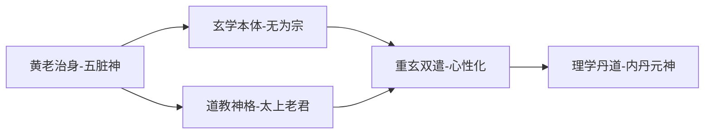
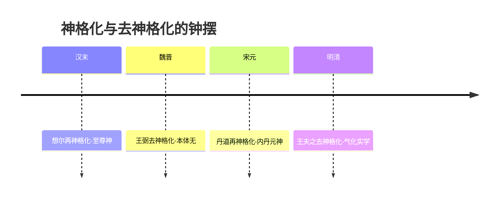

# 《老子》历代注本中“神”概念的演变——从谷神、神明到人格神与内丹元神

## 导论：一个被反复重铸的语义场

《老子》中的“神”并非一个稳定的所指，而是一个被历代注家依其外在目的反复重铸的开放语义场。同一个字在两千年间先后承载了七种迥异的内涵：**谷虚之德、气化之神明、五脏所居之神、教团至上人格神、玄学本体之妙、心性之灵、内丹之元神**。

仅就本报告系统梳理的核心注本而言，自严遵《老子指归》、河上公《老子章句》、《想尔注》，经王弼、成玄英、唐玄宗御注，至宋元理学化老学与明清丹道、考据注本，**至少七大诠释谱系在“神”字上展开了互不通约的语义投射**。这一投射高度集中于四处文本节点：第六章“谷神不死”、第三十九章“神得一以灵”、第二十九章“天下神器”与第六十章“其鬼不神”。

正因如此，学界围绕“道”之神性的三派之争——唯心有神论（关锋、林聿时）、唯物无神论（贠培基）与折中说（王友三）——其真正根源并不在《老子》原典，而在注本传统对“神”的差异化建构。

本报告的难点恰在于此：**“神”一字在五千言中本非核心概念，却在两千年注释传统中被层累地赋予了六种互不相容的语义。** 沿此线索，本报告贯通先秦至清的训诂与思想史证据，追踪“神”如何被去神格化、再神格化与内化，并展望这一诠释机制对当代道家“去神化”论争的方法论意义。

---

## 1. 研究框架、范围与方法

### 1.1 研究对象与时间跨度

本研究的对象不是“中国哲学中的神”这一宽泛议题，而是一个边界清晰的文本群：**历代为《老子》所作的注、疏、解、衍、义、本义之类著述，连同其注家与注释传统。** 换言之，“神”之诠释演变须从注文中读出，而非从《老子》原典或道教经典中读出。

“历代”界定为自西汉至二十世纪现代学术注释，约两千一百年。**上限**取严遵《老子指归》与河上公《老子章句》，因现存成体系的《老子》注本以此为最早（先秦韩非《解老》《喻老》取义在法术，于“神”着墨甚少，仅作背景）。**下限**取近现代学术注释（高亨、朱谦之、陈鼓应等），因其以异文校勘与概念史方法终结了两千年的“附益”层累，构成诠释史的方法论闭环。

学界常有一种笼统印象，以为道家之“神”自始即指内丹“元神”或道教至上神格。此说不确：考其汉魏注本，“元神”之义实迟至宋元丹道老学方才确立，而王弼玄学注更将“神”彻底去神格化为本体之“神妙作用”。

### 1.2 六阶段分期与往复曲线

全部演变可划分为六个阶段：

| 阶段 | 代表注家 | 核心动向 |
|---|---|---|
| 西汉东汉 | 严遵、河上公、想尔注 | 气化、养生、神格三线并出 |
| 曹魏 | 王弼 | 本体化、去神格转折 |
| 隋唐 | 成玄英、李荣、唐玄宗 | 重玄、妙本、心性导向 |
| 宋元 | 苏辙、吴澄、陈景元、张嗣成 | 理学化、性命精气神 |
| 明清 | 黄元吉、王夫之、魏源 | 丹道元神与考据训诂 |
| 近现代 | 高亨、朱谦之、陈鼓应 | 校勘还原、终结附益 |

这一分期暗含一个可被检验的核心判断：**“神”之语义并非单向地从具体走向抽象，而是呈“神格化—去神格化—再宗教化—心性化—训诂还原”的往复曲线。** 汉代三线并出，魏晋王弼一举去神格，隋唐又因道教义理化而部分回收宗教性，宋元转向心性，明清丹道再度身体化，近现代则以训诂还原本义。

这一往复的最后一段——清代魏源至近现代学术注的“训诂化回拨”——在思想史上具有终结性意义：它不是又一次附益，而是对全部附益层的反向清理。其所以可能，根源在于清代朴学方法与帛书、郭店简等出土异文的双重支撑。

### 1.3 六类语义与五维诠释轴

为在十五种注本、两千年跨度上做可比较的分析，本研究设立两套标尺。

**六类语义类型**回答“这一注家所说的神是哪一种神”：神妙义（本体）、气化之神明、五脏神（养神）、人格神（神仙）、心性义、内丹元神。

**五维诠释轴**回答“这一注家用何种方法把神诠释成这一种”：

| 维度 | 内容 |
|---|---|
| R-1 | 语义类型归属（六类） |
| R-2 | 对核心章句的训解准确性 |
| R-3 | 诠释策略与方法取向 |
| R-4 | 思想史动因关联 |
| R-5 | 在演变链中的承续与转化贡献 |

下表为全文注本谱系总览，作为后续历时分析的索引底盘：

| 注本 | 年代与归属 | “神”的语义类型 | 演变链位置 |
|---|---|---|---|
| 严遵《老子指归》 | 西汉末·黄老气化 | 神妙／气化之神 | 气化路线开端 |
| 河上公《老子章句》 | 东汉·黄老养生 | 五脏神／养神 | 五脏神范式奠基 |
| 《老子想尔注》 | 东汉末·天师道 | 人格神／神仙 | 道神格化唯一汉代标本 |
| 王弼《老子注》 | 曹魏正始·贵无 | 神妙（本体义） | 去神格化转折点 |
| 成玄英《义疏》 | 初唐·重玄 | 神妙＋心性义 | 重玄代表，启心性化 |
| 李荣《道德真经注》 | 初唐·重玄 | 神妙（重玄） | 重玄向心性过渡 |
| 唐玄宗《御注》 | 盛唐·御注 | 神妙＋心性义 | 妙本论枢纽 |
| 苏辙《老子解》 | 北宋·三教融合 | 心性义 | 心性化文人代表 |
| 陈景元《纂微篇》 | 北宋·内丹 | 元神（前驱） | 神妙转元神过渡 |
| 张嗣成 | 元·正一道 | 内丹元神 | 元神—心性集成 |
| 吴澄《道德真经注》 | 元·理学化 | 心性义／神妙 | 理学化老学典型 |
| 王夫之《老子衍》 | 明末清初·气学 | 神妙（气学义） | 丹道神观批判性回拨 |
| 黄元吉《注释》 | 清·丹道 | 内丹元神 | 元神义集大成 |
| 魏源《老子本义》 | 清·考据 | 神妙（复归本义） | 训诂化回拨 |
| 近现代学术注 | 20世纪·现代学术 | 神妙（学术还原） | 终结附益层累 |

---

## 2. 原典中“神”的语义基础

《老子》五千言中“神”字出现次数不多，却分布在若干关键章句，构成后世注家反复争夺诠释的文本支点。本章核心论点是：**原典之“神”本无确定的神格，其多义性正是后世“附益”得以展开的文本条件。**

### 2.1 四处核心章句的训诂定位

**谷神不死（第六章）。** 此句是《老子》言“神”最富形上意味、也最受聚讼之处。就文本形态而言，**帛书甲、乙本此句均作“浴神”而非“谷神”，这一异文从根本上动摇了后世以“山谷之神”立训的稳固性**[《老子道德經導讀：成象第六》，數位經典。](https://www.chineseclassic.com/content/1619)。

历代对“谷神”的句读本身即存二解：高亨主偏正结构，读“谷”为“毂”，训“生养”，以“谷神”为道之别名；严复则主联合结构，“谷”状道之虚空博大，“神”状道之变化神奇。这两种句读分歧，直接决定“神”究竟是实体性神明，抑或仅是状道之用的形容词。

就语义类型而言，**谷神之“神”在原典层面当判为神妙义而非人格神义**：它与“玄牝”“天地根”共同构成一组母性化的生成论隐喻，而非一位可祭可祷的神祇[《老子道德經導讀：成象第六》，數位經典。](https://www.chineseclassic.com/content/1619)。凡将“谷神”径直训为人格神者，皆属“附益”而非本义。此句在演变链中地位关键，是后世“存神”“五脏神”与“内丹元神”共同攀援的文本源头。

**神得一以灵（第三十九章）。** 此句是原典之“神”与“一”“道”发生结构性关联的核心枢纽。“神”与天、地、谷、万物、侯王并列，同受“一”之赋能，**这意味着原典之“神”是得道而显能的诸存在之一，而非道本身**。

“灵”字古今约有三说，直接规定“神”的语义归属：训“灵变”导向气化义（河上公）；训“神灵”导向五脏神义（《节解》）；训“灵验”导向重玄体用义（成玄英）[齐物书舍编《〈老子〉39·附论》，历代“灵变／神灵／灵验”三训之辑录。](http://www.qiwuwh.com/820/)。

须厘清一处易致误判处：**河上公注此句实作“言神得一故能变化无形”，属“灵变”说，并未将“神”径训为心或五藏之主；将“神”训为“心”“神灵五藏之主”的乃是《节解》，而非河上公本身**[《老子河上公章句·法本第三十九》。](http://core.xueheng.net/lao_zi_he_shang_gong_zhang_ju/0039.htm)。河上公的五脏神系统是在“载营魄抱一”“谷神”等其他章句中完成，而非由本句导出。

王弼则不就“神”之独立实体性立说，而将“灵”解为守一之果，这预示了玄学“去神格化”的整体取向。此“得一则灵，失一则歇”的条件性，正是判定原典之“神”不具至上神地位的关键文本证据。

**其鬼不神（第六十章）。** 全句作“以道莅天下，其鬼不神。非其鬼不神，其神不伤人”[《老子道德经》第六十章原文及译文。](https://daodejing.org/60.html)。**此处“神”字两见，一作动词“显灵”，一作名词“神祇”，是原典之“神”同句异义的显例。**

王弼对此作了彻底的自然化处理，其诠释链可分三步：以道莅天下使万物守其自然，万物守自然则神无所施加，神无所加则人不复感知“神之为神”——层层递进的消解，使“神”从实体退为不被感知的潜能。

此章引出现代学界关于《老子》无神倾向的重要论据：车载谓此段“从无为而治的道理里面，提出无神论倾向的见解”。**这里呈现一个持久张力：文本既承认鬼神之存在（“其鬼不神”预设鬼本可神），又以道消解其作用，究竟有神还是无神？** 化解之道在于区分本体论承诺与功能论态度：老子在本体论上不必否定鬼神之有，但在功能上令其“不神”即不起作用。其实质是**悬置鬼神而非断然否定**，由此方可容纳后世道教将其神格化的接受空间。此章是玄学去神格化（王弼）与道教神格化（想尔注）两条路线的共同分叉点。

**天下神器（第二十九章）。** 此处“神”语义最偏向形容词用法。王弼注“神，无形无方也；器，合成也”，**这是原典诠释史上把“神”彻底本体化、去实体化的奠基性训诂**，“神器”遂不再是“神圣之器”，而是“以无形合成之器”。

“神器”另有异文佐证：易顺鼎引《文子》称老子曰“天下，大器也”，**提示“神器”之“神”可能本不过是“大”的同义替换，意在状天下之不可把持，而非赋予天下以神性。** 故“神器”之“神”当判为神妙义之形容用法。

**综合四章**：原典之“神”在不同语境分载神妙（谷神、神器）与神明（神得一以灵、其神不伤人）两大义项，而无一处可确判为可祭祷的人格神。

| 章句 | 文本/异文 | 王弼训解 | 语义类型 |
|---|---|---|---|
| 谷神不死（六） | 帛书作“浴神” | 谷中央无谷 | 神妙义 |
| 神得一以灵（三九） | “灵”三训分歧 | 守一则不失 | 神明义 |
| 鬼不神（六〇） | “神”动名两用 | 神无所加则不知神 | 神明义 |
| 天下神器（二九） | “也”“夫”异文 | 神，无形无方 | 神妙义 |

### 2.2 “神”的语义场

**道—德—一—气—神的概念关联。** 在《老子》整体结构中，道为本原，德为道之分得于物，一为道所生之初始统体，气为万物生成之质料，**而“神”则是这一序列中得道而显能的灵明之用**。“神得一以灵”正是直接文本证据：神不自灵，须得“一”方能灵，故“神”在结构上从属于“道—一”而非与之平列。

“一”作为中介，被河上公释为“无为，道之子也”[《老子河上公章句·法本第三十九》。](http://core.xueheng.net/lao_zi_he_shang_gong_zhang_ju/0039.htm)，被王弼释为“数之始而物之极也”——两家虽异，都把“一”置于道与万物（含神）之间的枢纽位置，**这使“神”之灵明有了本原论依据，而不必诉诸独立神格。**

**精气神文本稀少的事实。** 一个具有釜底抽薪意义的文本事实是：**《老子》五千言中“精”“气”“神”三字出现极少，且从未作为固定的修炼三要素连用，这从根本上说明“精气神”作为丹道术语是后起的“附益”而非原典所有**。

这一事实构成元代道教老学的内在困境：注家意欲建立以精气神为支柱的性命修炼体系，文本本身却几乎不提供三字连用的依据。其解决之道在于“义理引申”而非“训诂坐实”——张嗣成以心性性命之说为框架，将原典零散的“神”字纳入内丹结构，把文本之“无”转化为诠释之“有”，**代价是承认这一体系属“附益”而非本义**。凡注本以精气神三分结构解《老子》者，皆须面对这一文本稀少的诘难。

**“妙”“玄”与神妙义的互训。** “妙”状道之精微难见，“玄”状道之深远难名，**“神”之神妙义正是这一状写在“神”字上的凝结**。唐玄宗把“神之灵变”统摄于“道之妙用”之下[齐物书舍编《〈老子〉39·附论》，历代“灵变／神灵／灵验”三训之辑录。](http://www.qiwuwh.com/820/)，意味着到隋唐“神”已被明确纳入“妙本”的本体论框架。王弼注“神器”为“无形无方”，恰与“玄”之“深远难名”互训。

**综合**：道—德—一—气—神的结构关联、精气神文本稀少、“妙”“玄”互训三者共同确立一个核心判断——**原典之“神”是关系性、从属性、状写性的，它既无独立神格，也无固定的修炼三分结构。** 这一语义场的开放性，正是后世气化、神格化、本体化、心性化四大路线得以分头并进的文本条件。

### 2.3 有神/无神的定性之争

原典之“神”究竟导向有神论还是无神论，是现代《老子》研究中悬而未决的公案，诸家分歧之大恰反映原典“神”的语义多义性。

**关锋、林聿时“道为绝对精神有神”说。** 二氏把《老子》之道判为客观唯心主义“绝对精神”，认为其所统摄的“神”“灵”诸义难以剥离有神论底色，论据在于道的能生性与主宰性难与纯粹唯物的自然过程相容。然此说的困难在于：第三十九章明言神之灵系于得一，第六十章明言神之作用被道消解，两处文本都把“神”置于道之下，难以支撑“神”之绝对性。**故关、林说更宜视为对“道”而非对“神”的有神化解读。**

**贠培基唯物无神说与王友三调和说。** 贠培基主张《老子》之道是物质性自然本原，“神”不过是对自然变化之神妙的形容，“鬼不神”更是明确的无神论表态。王友三的调和说则主张《老子》对鬼神采取悬置或淡化的态度：既不积极肯定，也不明确断言其无。

**这里呈现一个根本性权衡**：判为彻底无神论，难以解释后世道教何以能将其神格化为“太上老君”；判为有神论，又与“鬼不神”的明确文本相抵触。化解之道在于区分《老子》的本体论立场与其被接受的历史命运：文本本身在鬼神问题上持悬置态度，这一悬置恰恰为玄学的去神格化与道教的神格化两个方向都预留了空间。**就此而言，王友三调和说对“神”之语义定性的处理最为持平。**

---

## 3. 汉代注本：从黄老气化到神格化

汉代是“神”开始系统地从文本本义向注家附益偏移的关键期。三家注本在黄老气化、养生身国同构与五斗米道神权建构三重思潮牵引下，将“神”从哲学概念逐步推向宗教人格神。

**这三家共同构成“神”义演变链上的第一次大分岔：黄老气化路向把“神”内化为身中可养之灵，宗教化路向则把“道”外化为可祈祷的至上神，二者在汉末同时成熟，为此后玄学的去神格化反动埋下了张力。**

### 3.1 严遵《老子指归》：神明与太和

严遵《老子指归》是现存最早的《老子》系统注本之一。其释《老子》多以“道—德—神明—太和”四级生成序列展开，把“神明”置于道与万物之间的枢纽位置。**这一安排使“神明”既非鬼神，亦非心知，而是道之生化功能在精神层面的呈现，构成黄老气化宇宙论中最具哲学张力的一环。** 其“神明”范畴的提出，标志着汉代黄老学把“神”从鬼神义提升为道之精神性向度的首次理论自觉。

### 3.2 河上公《老子章句》：五脏神与养神不死

河上公注是《老子》注释史上影响最深远的养生类注本。**其最具标识性的创见，是把《老子》之“神”从严遵的宇宙论“神明”下贯到人身的五脏之中，使每一脏腑皆有驻守之神，从而把抽象的道论改造为可操作的养生术。** 这一下贯，是汉代“神”义从形上向身内转移的决定性一步。

**年代之争及其方法论遗产。** 河上公注成书年代历来聚讼，有西汉末、东汉初与魏晋三说。问题核心在于：**若成于汉代，三家共构汉代“神”义的三向分化；若成于魏晋，则其养生神义反而晚于王弼的本体化，整条演变链的因果次序须重新排布。**

解决之道不在于强行判定唯一成书年，而在于把河上公注理解为“层累生成”的文本：**其养生身国同构的思想内核当属汉代黄老传统，文字最终定型时段则可大致框定在东汉末至魏晋。** 故在思想史定位上仍宜置于汉代“神”义内化路向的代表，但须承认文本边界的开放性。本报告把河上公置于严遵之后、想尔之前，依据的是其思想归属而非文字定型年。这一年代悬案留给整个研究的方法论遗产是：**演变序列的稳健性应建立在思想归属而非成书年的判定之上。**

| 注本 | 年代与归属 | 对“神”的核心训解 | 语义类型 |
| --- | --- | --- | --- |
| 严遵《指归》 | 西汉·黄老 | 神明为道之灵妙之用 | 神明（宇宙论） |
| 河上公《章句》 | 西汉末至魏晋·养生 | 以养训谷，五脏各驻神灵 | 五脏神（养神） |
| 《想尔注》 | 东汉末·五斗米道 | 道散形为气，聚形为太上老君 | 人格神 |

### 3.3 《老子想尔注》：道神格化为太上老君

《想尔注》是五斗米道的根本经典，其把《老子》形上之“道”直接神格化为人格神“太上老君”，完成了汉代“神”义演变中最彻底、也最具断裂性的一次转折。

**若说严遵把“神”提升为宇宙论的神明、河上公把“神”内化为身中的五脏神，那么想尔注则反其道而行：把整部《老子》的最高范畴“道”本身外化、人格化为一位可祈祷、可发号施令的至上神。** 这是“神”义从哲学概念向宗教人格神跃迁的关键一跳，也是道家哲学与道教神学在文本诠释上正式分野的标志。

---

## 4. 魏晋玄学：王弼注的本体化与去神格化

汉代注本将“神”推向气化生成与神格化的双重峰值。正始年间王弼（226–249）注《老子》，恰恰以相反方向重写了这一字：他不增神灵之实体，反以“无”为本，将“神”收摄为道体虚无的一种形上属性。**王弼注的根本贡献，是把汉人加诸“神”的宗教神格与养生身国之义剥离殆尽，使之回归为标识道体“无形无方”的纯哲学谓词。**

### 4.1 谷神的本体化诠释及与河上公的分途

河上公训“谷”为“养”、训“神”为五脏之神，走向养生身国一路；王弼则以“谷中央无谷”喻道之虚无，将“谷神”整体读为道体的形上隐喻[王弼《老子注·第六章》“谷神，谷中央无谷也”。](https://fanyi.cool/6229.html)。这一分途是理解汉魏之际“神”义转向的最佳标本。

就训解差异而言，河上本作“浴神”，训“浴”为“养”，边韶老子碑铭亦作“浴神”；俞樾进而申之，谓“浴”当读为“穀”，“穀，养也”，故“谷神不死”实即“养神不死”，与《列仙传》容成公“其要谷神不死，守生养气”一脉相通。王弼则全然不取养生一路，以“谷中央无谷”将“谷神”读为道体的虚无隐喻，不及人身脏腑一字[王弼《老子注·第六章》“谷神，谷中央无谷也”。](https://fanyi.cool/6229.html)。

**这一对照揭示出注家立场如何决定训诂取向：河上公的养生关怀使“神”落实为身中之灵，王弼的本体关怀使“神”上提为道之妙用。**

| 对照维度 | 河上公 | 王弼 |
| --- | --- | --- |
| “谷神”训解 | 谷养之神不死，存神养神 | 谷中央无谷，喻道体虚无 |
| “神”语义类型 | 五脏神（养神） | 道体本体属性／神妙义 |
| 异文取向 | 作“浴神”，训浴为养 | 据本作“谷”，训为空虚 |
| 诠释策略 | 养生身国同构 | 本体化、以无为本 |

这一对照所遗留的未决问题是：王弼以本体义统摄“谷神”，是否完全抹除了文本中可能潜含的生成义？苏辙、陈景元等宋代注家试图调和虚无与生成，正是对这一张力的回应。

### 4.2 “神得一以灵”与去宗教化的思想动因

第三十九章“神得一以灵”，王弼独以崇本息末之法统摄：既不取河上公的气化灵变，也不取成玄英的重玄灵验，而将“神之灵”收归于“得一”即得道体之本，谓“守一则清不失”。

何以王弼必以本体义去神格化地重写“神”？答案须在正始玄学的贵无论中寻得。**玄学贵无之论以“无”为世界本源本体，否定任何实体性的神格属性，从而把“神”之义推向非神格的哲学绝对**。王弼注的整个义理取向（以无为本、扫除象数与养生附益），是对汉代黄老与道教化“神”义的系统反动。

---

## 5. 隋唐重玄与御注：神、妙本与心性

玄学以“无”立体，重玄学则以“双遣”破玄学之滞于无。隋唐重玄家与唐玄宗御注共同将“神”从一个待界定的实体性概念，提升为一个被层层遣除规定、最终归于不可言说之“妙本”的功用之名。**这一阶段的核心转折，是“神”从“说它是什么”转为“遣除它一切是什么”的方法论倒置，并由此为宋元心性化埋下伏笔。**

### 5.1 成玄英：重玄双遣中的“神”

成玄英（唐初道士）撰《道德经开题序诀义疏》，对“神”的处理以“重玄双遣”为方法骨架。重玄即“遣有遣无、遣其遣”的双重否定，借此破除前代注家在“神”上或执实（河上公存神）、或执虚（王弼以无释神）的两端。**成玄英疏的方法论贡献，在于把“神”从一个待定义的对象，转为一个须经双遣才能逼近的“神妙”之境，使“神”义获得了前所未有的形上抽象高度。**

### 5.2 李荣：神趋向心性内化

李荣（唐高宗时道士）撰《道德真经注》，与成玄英同属初唐重玄学阵营。其史学价值在于：既共享重玄双遣的方法底色，又在“神”的落实上比成玄英更贴近身心实践，**从而成为“神”由形上妙本折返心性元神的关键过渡者。**

二人异同最能反映重玄学内部对“神”处理的分化。同者：共享双遣方法、妙本统摄、佛道交涉术语。异者：成玄英偏向形上遮诠的极致抽象，李荣偏向将神妙之用落实于身心。可类比为同一把否定之刀，成玄英用之雕琢形上之体，李荣用之切除工夫之障。

在核心章句上，成玄英训“灵”为“灵验”，重在道体妙用之效[齐物书舍编《〈老子〉39·附论》，历代“灵变／神灵／灵验”三训之辑录。](http://www.qiwuwh.com/820/)；李荣虽亦守神妙义，但更强调此神妙须于修道者一身中体证，**已隐含“元神”之机括。**

| 比较维度 | 成玄英 | 李荣 |
| --- | --- | --- |
| 重玄方法之用途 | 抬升神妙至不可言说之境 | 破身心之执以利体道工夫 |
| “神”之落脚处 | 道体妙用（偏形上） | 身心之神（渐近元神） |
| 演变链位置 | 重玄形上化顶点 | 重玄向心性化转折起点 |

**成玄英是重玄学形上化的顶点，李荣则是重玄学向心性化转折的起点。** 二者关系并非对立，而是同一思潮的两个发展阶段。

### 5.3 唐玄宗《御注》：妙本、心性与治道

唐玄宗《御注道德真经》系中国注释史上罕见的帝王亲注，以“妙本”统摄道体，并将“神”纳入理身理国的政治化诠释框架。**其独特地位在于：作为官方权力直接介入《老子》诠释的产物，它对“神”义的规范既承续重玄学的妙本论，又赋予“神”以心性与治道的双重政治功能。** 御注把“神之灵变”统摄于“道之妙用”之下，倡“解心释神”以观妙本，遂成为承重玄、启宋学的妙本论枢纽。

---

## 6. 宋元转向：理学化与性命精气神

宋元两代是《老子》注释史上一次决定性的语义重组：唐代御注与重玄学留下的“妙本”论说，在宋元理学的心性框架与道教内丹的性命修炼语境中被双向改写。元代老学所以热衷于将“性命”即心性命题与老子思想绾合，一则由于新儒家心性学说的成熟漫衍，二则由于道教内丹学性命理论开展的内在要求。

**本章核心论断**：宋元注本对“神”的再造，使一个在原文中本属形上虚灵或神明描述的语词，被系统纳入“精气神”三宝结构与心性本体的双重坐标，完成了从“天地之神”到“身中之神”、从“本体之神”到“修炼之神”的语义内移。

### 6.1 苏辙《老子解》：儒佛道融通之神

苏辙《老子解》是北宋三教融合思潮在老学领域的标志性成果，其释“神”的根本特征在于**以心性义统摄前代之神妙义与神明义**。苏辙引佛理之“心性”与儒家之“性命”入老，使“谷神”“神器”诸语的训解服务于一个融通三教的心体论框架，将“谷神”读为虚灵心体、神为心之明觉。

### 6.2 陈景元《藏室纂微篇》：道教老学之神

陈景元《道德真经藏室纂微篇》作为北宋道教老学的代表作，立足于道教内部传统，沿性命双修的方向承续并改造前代神义。**若说苏辙是从教外以三教融通的心性之学解神，陈景元则从教内以道教的性命之学承神，二者恰构成宋代老学释神的内外两路。** 其将“谷神”与神气、性命相贯，是由神妙转向元神的过渡。

### 6.3 张嗣成：精气神三宝结构中神的地位

张嗣成《道德真经章句训颂》是元代道教老学性命化、丹道化的集大成之作，将前代过渡形态推进为系统的精气神修炼论。

**在精气神三宝结构中，“神”居于统御“精”“气”的主宰地位，是修炼由“炼精化气”“炼气化神”而至“炼神还虚”的最终归宿，这一层级定位使“神”获得了前代注本所未曾赋予的修炼论顶点意义。**

其主宰地位可由训解见之。就“神得一以灵”而言，张嗣成承河上公“神得一故能变化无形”之训[《老子河上公章句·法本第三十九》。](http://core.xueheng.net/lao_zi_he_shang_gong_zhang_ju/0039.htm)，而以内丹义理释之：神得一即神归于纯一不杂之元神状态，故能灵明不昧。就“谷神不死”而言，多以谷神为人身元神，以其虚灵不昧、历劫不坏而言“不死”。

**就语义类型而言，张嗣成之神当判为内丹元神义，这是宋元释神演变链的终点形态，也是向明清成熟元神论的直接过渡。** 自汉河上公之五脏神，经想尔之神仙神、玄学之本体义、重玄之双遣、苏辙之心性义、陈景元之性命过渡义，至张嗣成而定格为元神义。

| 注本 | “神”的训解 | 语义类型 | 演变链位置 |
| --- | --- | --- | --- |
| 苏辙《老子解》 | 谷神为虚灵心体；神为心之明觉 | 心性义 | 心性化中继 |
| 陈景元《纂微篇》 | 神为性命双修中性之主宰 | 心性＋元神（过渡） | 由养神向炼神过渡之桥梁 |
| 张嗣成《训颂》 | 神为三宝之主宰，谷神即元神 | 内丹元神义 | 演变链终点，直启明清元神论 |

---

## 7. 明清丹道、理学与考据三向

明清三家——黄元吉、吴澄、王夫之、魏源——从修炼极致、哲理化、批判去神化与考据复原四个方向，对前代附益传统作出不同的回应。

### 7.1 黄元吉《道德经注释》：谷神即元神

黄元吉《道德经注释》是清代内丹学派老学的代表文献，**其最鲜明的特点在于将第六章“谷神”直接训释为内丹修炼的“元神”，由此将《老子》整体解读为一部性命双修的丹诀。** 这将河上公一系“存神养神”的养生传统推至极致，又借宋元性命精气神之学加以系统化，构成“神”义演变链上最彻底的修炼主体化一端。

黄元吉一家足以证明：**明清内丹老学已将“神”义的修炼主体化推至注释史的逻辑终点。** 这一处理在文本还原的意义上是“附益”的极致，在道教接受史的意义上却是承续的完成。

### 7.2 吴澄《道德真经注》：理学化的心性之神

吴澄（1249—1333）是由宋入元的著名理学家，其老学注本带有鲜明的理学化色彩。他不取河上公的五脏神义，亦不取黄元吉式的元神义，而是以理学的“理—气—心—性”结构重新安顿“神”字：把“谷神”读为理之灵明、性之妙用，把“神得一以灵”读为神得太极之理而能灵妙不测。

**在吴澄那里，“神”既非身外之鬼神，亦非身中之元神，而是天理在心性层面的灵明发用。** 他承宋儒“神也者，妙万物而为言”的《易传》传统，故其“神”近于“神明”而远于人格神。这是一次明确的**去神格化与去修炼化的双重收摄**：既不许“神”坐实为人格神，也不许其坐实为可炼之元神，而一律归于心性之灵。

其转化贡献在于：为“神”提供了一个心性义的安顿，使其在内丹元神化的强势潮流之外保留了一条哲理化的退路，这条退路后来被王夫之、魏源进一步拓宽为批判与考据两途。

### 7.3 王夫之《老子衍》：气学批判与去神格化

王夫之（1619—1692）是明遗民中最具批判精神的气学思想家，其《老子衍》属气学批判一系：以“天下惟器”“气外无理”的气本论立场，对《老子》中可能导向虚无与神秘的读法一概驳正。

他承王弼“神，无形无方”的本体读法，却进一步把“神”之无形落实为气之神理，谓神乃气化之妙、而非别有一灵明主宰。如此，“神得一以灵”便被读为气得太一之理而能神妙不测。**在语义类型上，王夫之笔下的“神”明确归于气化论意义上的神妙义**：他坚决排除人格神义与元神义，既不许“神”为身外主宰之鬼神，也不许其为身中可炼之元神，而一律归于气之运化所显的不测之妙。

其方法是“批判性去神秘化”，锋芒指向两个方向：道教把“神”实体化为可炼元神的修炼论，以及玄学末流把“神”玄化为离器独存之无的虚无论。**其去神秘化是明清老学中哲理批判取向的最高峰，其严厉程度甚至超过同期一般考据家，因为他不仅要求文本还原，更要求义理上的彻底实有化。**

由此形成一条清晰因果链：明清易代之巨变使王夫之确立气本实有的根本立场；这一立场导致他对一切离气言神的读法深致不满；进而推动他系统地把“神”还原为气之神理。**其转化贡献在于以气学批判第一次系统地、自觉地把“神”从宗教与修炼的附益中剥离出来。** 若说吴澄是把“神”收入心性义，王夫之则是把“神”打回气化义；前者重构，后者批判，二者合力构成对黄元吉式元神化的双重反动。

| 家别 | “神”核心训解 | 语义类型 | 与本义距离 |
|---|---|---|---|
| 黄元吉 | 谷神即虚灵不昧之元神 | 内丹元神 | 最远（彻底附益） |
| 吴澄 | 神为理之灵、性之妙用 | 心性义为主 | 中（哲理化重构） |
| 王夫之 | 神为气之神理，非人格神 | 神妙义（气化） | 较近（剥落附益） |
| 魏源 | 以训诂复本义 | 神妙义（文本义） | 最近（复原取向） |

---

## 8. 魏源与清代考据训诂化

魏源《老子本义》以“复本义”为标的，将对“神”的理解约束在训诂与文本证据所能支撑的范围内。**若说王夫之的去神秘化属义理层面的批判，魏源的训诂复原即为文献层面的约束，二者一虚一实，共同构成对黄元吉式元神附益的反向清算。**

### 8.1 “谷神不死”断读之争

“谷神不死”的断读方式构成第六章诠释的枢纽。一派主张**连读**，将“谷神”视作复合名词，喻指道体虚而能生；另一派持**对举**之说，认为“谷”状道之虚空，“神”状道之神奇。两读之别表象上关乎句法，实则决定此处之“神”究竟是道的全称同义语，抑或道的某一属性。

司马光、王弼、严复、朱谦之四家排列出完整光谱：王弼以“谷中央无谷”把“谷神”彻底本体化；司马光以“中虚故曰谷，不测故曰神”在对举句法中守住连读义理；严复以虚、因应无穷、不屈愈出三德把对举说近代逻辑化；朱谦之则以第三十九章“谷得一以盈”为内证坐实对举。

**四家合观可证一个结构性事实：断读之争虽烈，“神”的语义归属却始终未脱神妙义的引力场——无论连读对举，注家都读不出一个独立的人格神，这本身就是《老子》“神”义以神妙为底色的最强反证。**

### 8.2 异文系统：穀、浴、欲为借字

第六章尚有一层异文纠葛：通行本作“谷神”，河上本与帛书甲乙本俱作“浴神”，俞樾、洪頤烜等清儒则主张当读为“穀”或“欲”。**此一字之异看似细故，实则牵动“神”义在养生与哲学两途之间的根本分配**：作“谷”则偏向哲学之虚体，作“浴／穀”则偏向养生之存养，作“欲”则更引向丹道补导之术。

| 异文 | 主之者 | 训解 | 导向之“神”义 |
| --- | --- | --- | --- |
| 谷 | 王弼、严复、朱谦之 | 道之虚体／神妙 | 神妙义（哲学） |
| 浴 | 河上公、帛书 | 浴，养也，养神不死 | 五脏神（养生） |
| 穀 | 俞樾 | 穀，养也（毛传） | 五脏神（养生） |
| 欲 | 洪頤烜 | 寡欲守精、补导养气 | 元神前身（丹道养生） |

**与断读之争“落到语义归属却殊途同归”不同，异文之争是真正分判“神”之语义类型的：取“谷”归神妙，取“浴／穀”归五脏神养生。** 第六章“神”义的哲学—养生分途，不是后世注家强加的义理偏向，而是由这一组声近异文在文本传统源头处即已埋下的客观分歧——异文是因，义理分途是果，而非相反。

### 8.3 版本系统与“神”义

异文之争终须上升为版本系统之辨。通行本（王弼本、河上本）、帛书甲乙本与郭店楚简三大文本系统，在“神”相关章句上的出入既非单纯校勘细节，更直接牵动注本的义理取向。**版本系统不是中立的文字载体，而是携带义理倾向的解释装置：据帛书系还是据通行系，常在注家落笔之前即已部分决定了“神”将被读作虚体抑或养生之神。**

---

## 9. 五类语义的横向综合

《老子》注本中“神”的语义并未呈现为单一概念的连续演化，而是形成五条近乎平行的诠释脉络，各自从原典的不同侧面切入，致使同一字形承载了彼此无法兼容的指称。

### 9.1 五类语义的辨析

- **本体义**：将“神”训作道体之神妙作用，无位格、无实体（王弼、王夫之）。
- **宇宙生成义**：“神”充当道生万物过程中的生成环节或中介（严遵）。
- **人格神义**：“神”被实体化为可崇拜、有意志的至上神（想尔）。
- **养生元神义**：“神”内化为人身中可存养、可炼化的生命精微（河上公、丹道）。
- **心性义**：“神”被转译为心之灵明或性命之本（苏辙、吴澄）。

这五种义项既非等义，也非简单的高低层级，而是诠释取向的根本分歧。

### 9.2 核心章句的释义对照

以核心章句为锚点逐条比较，是检验类型划分能否落地的唯一途径：

| 注本 | 谷神不死（六章） | 神得一以灵（三九章） | 其鬼不神（六〇章） |
| --- | --- | --- | --- |
| 河上公 | 神为五脏之神，养神不死 | 变化无形（灵变） | 治身治国，鬼神不干 |
| 王弼 | 谷神即“无”，至物无形 | 得一即得道之宗 | 神不害自然，神无所加 |
| 想尔 | 谷神趋向人格化、长生之神 | 神之灵验系于信奉 | 鬼神之灵可由道制 |
| 成玄英 | 以重玄义释，遣有遣无 | 神不依通则无灵验将歇灭 | 鬼神不显灵验 |
| 唐玄宗 | 谷神为妙本之神妙 | 神之灵变，得道之妙用 | 鬼不显灵，妙本之治 |
| 严遵 | 神明为道物中介 | 神明得一而灵（生成义） | 以无为之治，神不扰物 |
| 苏辙 | 谷神为心之神明 | 神之灵为心性之灵明 | 鬼神不伤，心治则物正 |

### 9.3 诠释驱动力与过度诠释风险

各注本对“神”的系统性再造，源于外部诠释驱动力的差异。一条关键判断指出：不同道教注本因其外部目的不同，分别将“神”再造为立教之至上神、治身之五脏神、内丹之元神、玄学之本体。**一旦这种驱动力强化至使注释义脱离文本本义的程度，过度诠释的风险便会浮现**——即“以己见代老子之见”。判别的关键，在于原典义与注释义的边界。

---

## 10. 耦合机制、钟摆形态与总体趋势

### 10.1 五场连锁的耦合机制

思想背景对神义的驱动并非单向的因果传递，而是由黄老养生、玄学本体、道教神格、重玄心性、理学丹道五个义理场依次叠加、相互牵制所构成的耦合过程。

**第一环**是黄老学重心由治国向治身的位移。东汉黄老思想由“治国”转向“治身”，进而发展为“黄老道”，使“神”第一次获得可操作的身体内涵——河上公注“谷神不死”为“人能养神则不死也，神，谓五脏之神也”。

**第二环**是玄学的本体化反拨。王弼以“无”为万物之宗，把河上公具象的五脏神抽空为本体论功能描述。黄老的身体化与玄学的本体化构成第一组张力，恰为后世留出两条出路：向上的神格化与向内的心性化。

**第三环**的道教神格化，沿黄老身体化一路向上推至极致。想尔注把“道”拟人化、神格化为至尊神灵。其条件在于河上公已将“神”落于可感的身体经验，为崇拜对象提供了经验基础。

**第四环**的重玄心性化，是对前三环的总清算。成玄英以重玄双遣将想尔的实体神与王弼的本体无一并双遣，神义遂由实体转向心性工夫。**第五环**的理学丹道化承此而下，黄元吉、张嗣成一系将“神”收束为内丹元神。

**因果逻辑可如此表述：黄老的治身转向把“神”身体化，身体化为道教提供了可神格化的对象，神格化产生的实体又引来重玄学的双遣批判，双遣之后留下的心性空场，则被理学丹道以元神工夫填充。每一环既是前一环的产物，又是后一环的触发条件，因此神义转化是一条自我推进的连锁，而非外力逐代施加的被动改写。**

各转化间还存在**制约与放大**的双向作用。最显著的制约发生在王弼本体化与想尔神格化之间：王弼的本体化注解一旦成为玄学正统，便长期压制想尔式神格化在士大夫注本中的传播空间，使道教神格化的“神”只能在道门内部流传。放大关系则典型体现在养生身体化与丹道元神化之间：河上公朴素的养神说被纳入内丹学精气神框架后，被放大为一套精密的修炼工夫论；养神为元神说提供身体基础，元神说反过来把养神说理论化、系统化。

### 10.2 去神格化与再神格化的钟摆

神义演变中最与单线叙事相悖的现象，便是去神格化与再神格化的反复交替，**它彻底否证了任何“从迷信走向理性”或“从哲学走向宗教”的单向叙述。**

其时序排列极具启发性：想尔的神格化（汉末）→王弼的去神格化（魏晋）→丹道的再神格化（宋元）→王夫之的去神格化（明清）。**神格化与去神格化并非各占一段且一去不返，而是如钟摆般交替出现，每一次摆动均由当时的思想处境决定其方向。**

钟摆反复的因果可追溯如下：想尔的神格化满足道教教团崇拜的需要，但其拟人化的至尊神与老子素朴本义相距过远，遂招来王弼一系以文本与历史为本的去神格化纠偏；这种回归文本的取向又因过度抽象而无法满足修炼实践，遂在宋元被丹道的元神说重新实体化；元神说的繁琐则又招致王夫之以气化实学的批判性回归。**每一轮摆动都是对前一次过度的纠正，而纠正又孕育着新的过度。**

此处潜藏着一个贯穿注释史的根本张力：**忠于文本本义的去神格化与满足宗派实践的再神格化二者难以两全。** 越贴近老子素朴本义，便越无法支撑崇拜与修炼的宗教需求；越能支撑宗教需求，便越须背离文本本义而增益附会。这一张力在注释史上从未被任何一方最终解决，而是以钟摆式的反复达成动态平衡：去神格化的注本（王弼、王夫之）守护文本本义的底线，再神格化的注本（想尔、丹道）则开拓宗教实践的空间，二者轮流主导，**使《老子》得以同时作为哲学经典与宗教圣典而流传。其代价是注释史始终无法收束出一个公认的“神”之定解。**

| 维度 | 隐性连续线 | 钟摆反复 |
| --- | --- | --- |
| 表现层 | 工夫论预设贯穿三阶段 | 神格化／去神格化交替 |
| 代表注本 | 河上公→重玄→丹道 | 想尔↔王弼，丹道↔王夫之 |
| 不变项 | 神为可修之内在物 | 文本与宗派的张力 |
| 反目的论意义 | 形式连续≠目的同一 | 反复≠单向进步或退化 |

### 10.3 总体趋势与前瞻

当注释的主体由经师、道士、理学家转为现代学者时，“神”的命运经历了根本转折。近现代学术注本（高亨、朱谦之、陈鼓应）以异文校勘与概念史方法终结了两千年的附益层累。现代研究倾向于将谷神等语还原为“用宇宙喻心”的表达方式，**这预示着“神”义在二十一世纪的学术注本中很可能进一步褪去丹道工夫的色彩，向纯粹的概念分析收敛。**

---

## 结论

《老子》注本中的“神”，乃是一个在连续的形式预设之下、被相反的思想力量反复拉扯的语义场。本报告的根本发现可归结为三点：

**其一，原典之“神”本无确定神格。** 它在不同语境分载神妙义与神明义，无一处可确判为可祭祷的人格神。这一多义而无定格的文本状态，是后世一切“附益”得以展开的文本条件。

**其二，演变呈耦合连锁而非线性序列。** 黄老治身把“神”身体化，身体化为道教提供神格化对象，神格化引来重玄双遣，双遣留下的心性空场被理学丹道以元神填充——每一环既是产物又是触发条件，神义转化是一条自我推进的连锁。

**其三，演变形态是钟摆而非进步。** 去神格化（王弼、王夫之）与再神格化（想尔、丹道）交替主导，每次摆动均精准对应一种外部需求：教团崇拜、文本正统、修炼实践、实学批判。**神义的方向从不取决于文本自身，而取决于注家所处的思想处境。** 这一钟摆未被任何一方最终解决，而是以反复达成动态平衡，使《老子》得以同时作为哲学经典与宗教圣典流传，其代价是注释史始终无法收束出公认的“神”之定解。学界关于“道”之神性的有神/无神之争，其真正根源正在于此。

---

## 参考文献
