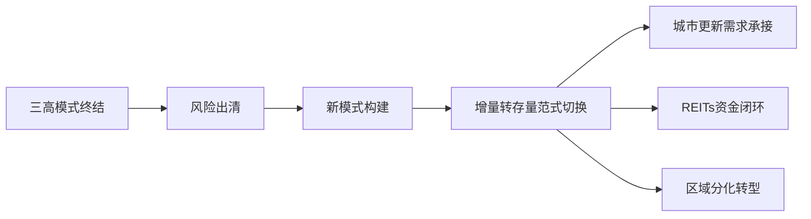
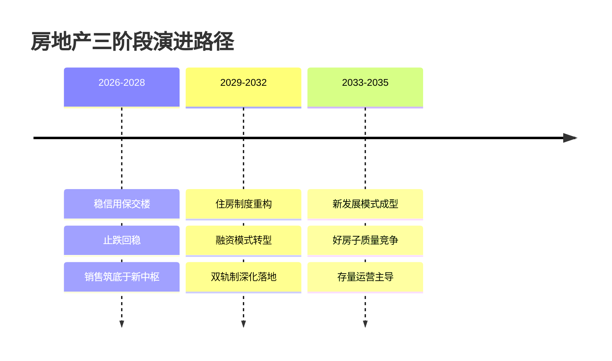

# 房地产行业可持续发展的动力与未来十年国家促进行业有序良性发展的政策、资金与导向研究

## 引言：从规模扩张到三维均衡

中国房地产已从规模扩张时代切换至以改善需求为核心引擎的高质量发展轨道。未来十年（2026—2035），行业的可持续动力将由**政策长效机制、资金制度重塑、导向价值重构**三足支撑、协同发力。

从量级看，全国新建商品房销售面积已由2021年峰值16.14亿平方米回落至2025年的8.8亿平方米（同比-8.7%），调整已持续约4.5年。中指研究院测算，"十五五"期间年均新房销售面积将稳定在7—8亿平方米、五年累计约50亿平方米——这并非崩塌，而是向真实需求中枢的回归。尽管市场普遍认为"人口达峰即意味着需求归零"，但国信证券与人民论坛邹琳华的测算均指出，折旧替换、半城镇化人口与改善升级仍构成结构性增量。

**本报告的核心判断是：三大动力维度中，"导向重构（好房子+城市更新）"是十年内最持久的价值引擎，"资金制度（REITs+经营性融资+公积金改革）"是中期最关键的修复变量，"政策长效机制"是托底与有序退出的制度保障——三者排序为导向＞资金＞政策。市场将于"十五五"中后期（约2028—2029年）完成筑底。**

房地产可持续发展，本质上是一个关于结构性需求、金融制度与国家长效机制三维能否达成均衡的命题。下表给出十大核心动力因素的定位矩阵，构成全文分析脊柱：

| 动力因素 | 作用机制 | 长期可持续性 | 相对重要性 | 风险约束 |
|---|---|---|---|---|
| 新型城镇化与城市群发展 | 人口集聚→住房需求 | 边际递减 | 支撑位 | 区域分化 |
| 改善性与刚性居住需求 | 居住升级→产品迭代 | 强 | 第一梯队 | 收入预期 |
| 人口流动与家庭结构变化 | 迁移分化→区域错配 | 中等偏弱 | 结构性 | 跨省流动放缓 |
| 城市更新与存量运营 | 存量盘活→现金流 | 强 | 第一梯队 | 资金平衡 |
| 保障性住房建设（三大工程） | 政策性供给→双轨 | 中长期稳定 | 第二梯队 | 财政承受 |
| 房地产发展新模式转型 | 角色跃迁→重定价 | 强 | 第二梯队 | 转型阵痛 |
| 绿色低碳与"好房子"升级 | 品质溢价→需求结构 | 上行 | 结构性 | 成本传导 |
| 融资制度重塑与REITs | 资产证券化→出表 | 上行 | 工具性 | 资产质量 |
| 数字化与智能建造 | 效率提升→成本 | 中等 | 工具性 | 落地不确定 |
| 财税与土地制度改革 | 收入结构→激励 | 中长期 | 基础性 | 改革节奏 |

# 1 "可持续发展"的内涵界定与现状坐标

房地产"可持续发展"不是房价重新上涨或高杠杆扩张的同义词，而是一套以**经济稳定、金融安全、民生保障、绿色低碳、供需平衡**五维支撑的制度目标体系。理解其动力，需先厘清行业当前的历史坐标。

## 1.1 行业深度调整的现状坐标

行业现状的第一性事实是规模的大幅收缩。这一收缩不是周期性回调，而是**规模中枢的永久性下移叠加需求结构的根本性切换**：销售腰斩、投资两位数收缩、库存城市间剧烈分化，共同确立了"增量开发时代终结、存量运营时代开启"的结构性判断。

| 现状坐标维度 | 2021峰值 | 2025实测 | 2026预测/中长期中枢 |
|---|---|---|---|
| 商品房销售面积 | 16.14亿㎡ | 8.8亿㎡（同比-8.7%） | 同比-6.2%（2026） |
| 房地产开发投资 | — | 82788亿元，-17.2% | 同比-11%（2026） |
| 新房年均销售中枢（十五五） | — | — | 7-8亿㎡ |
| 城市去化周期分化 | — | 一线9-11个月 vs 三四线>30个月 | 供给缩量推动改善 |

旧引擎已熄火，新的问题随之浮现：三四线城市超长去化周期究竟以何种速度收敛？这一变量将在后文情景推演中作为核心敏感性参数。

## 1.2 可持续发展的五维内涵

可持续发展的本质是房地产功能定位的整体重写：**从单一的增长引擎，重写为五维均衡的民生基础设施与城市运营平台**。这一界定明确排除了刺激房价上涨与恢复高杠杆增长的误读。

| 五维内涵 | 核心指向 | 时间优先级 |
|---|---|---|
| 经济稳定 | 稳增长、稳投资、稳就业的底线 | 贯穿始终 |
| 金融安全 | 防范房企债务向金融体系传导 | 短期紧约束 |
| 民生保障 | 住房保障与品质提升 | 中长期导向 |
| 绿色低碳 | 好房子升级与城市绿色转型 | 中长期导向 |
| 供需平衡 | 控增量、优存量、改善供求 | 短中期 |

## 1.3 "良性循环"的政策语义演进

"良性循环"的政策语义经历了从2021年到2023年的清晰演进，主线是**政策从单纯的风险防控转向促进房地产与金融之间的正常循环**。东方财富将"十四五"政策环境总结为"从强调'房住不炒'到推动市场'止跌回稳'"的演进。

这一从"防"到"稳"再到"促"的演进，反映了政策制定者对行业风险性质判断的变化：当市场从过热转向过冷，主要矛盾也从抑制投机转向防止失速。其语义脉络为：2021年"房住不炒"强调抑制投机→2022年风险防控→2023年促进金融与地产正常循环→2024年止跌回稳政策密集落地→2025年"十五五"规划高质量发展独立成章。

值得注意的是，"循环"的内涵已从狭义的资金循环，扩展为涵盖供需、投融资、土地财政、民生保障的广义系统循环。**展望未来十年，"良性循环"将从短期的资金链修复，逐步演进为制度化的长效机制建设。**

## 1.4 评价指标体系

可持续发展的评价标尺由三个层次构成，自下而上、由客观到主观，共同回答"行业是否良性可持续"：

| 指标层次 | 核心指标 | 健康标准/方向 |
|---|---|---|
| 市场健康度 | 库存去化周期 | 9-12个月为健康区间 |
| 市场健康度 | 杠杆率 | 有序压降，融资成本下行 |
| 市场健康度 | 租售比、可负担性 | 向居住价值回归 |
| 发展质量 | 绿色建筑比例 | 单向上升 |
| 发展质量 | 保障房供给占比 | 单向上升 |
| 终极检验 | 居民居住满意度 | 持续提升 |

# 2 可持续发展的核心动力来源

未来十年房地产的可持续动能正从"需求扩张+融资杠杆"双轮驱动，切换为**"结构性需求+运营能力+制度红利+技术价值"四元协同驱动**。其中，制度侧动能的确定性最高、需求侧动能的结构分化最剧、技术价值侧动能的兑现约束最强。

## 2.1 需求侧动力：城镇化与改善性需求

据中指研究院测算，"十五五"期间新建商品住宅年均销售面积预计维持在7-8亿平米，虽较2021年峰值近乎腰斩，但仍处于"更可持续的合理中枢"水平。这一中枢由三条需求链条支撑：城镇化纵深、改善性需求接棒、人口流动再分布。

### 城镇化：持续衰减的结构性动力

城镇化驱动需求的链条经典而清晰：城市化水平提升→城镇居民增加→年轻人口构成购房刚需主力。然而中国城镇化率已升至约66%，接近边际放缓的拐点区间。城镇化对需求的拉动机制正由"增量人口涌入"转向"存量人口提质"。

围绕剩余空间的强弱判断构成核心张力。**审慎派代表邹琳华明确指出，城镇化新增住房需求正在减弱，住房短缺时代已经过去**；尽管半城市化人口的住房水平仍有较大提升空间，但有效释放面临制度障碍。这与乐观派形成鲜明对立：乐观派往往简单套用"66%距80%尚有14个百分点空间"来推导庞大增量，而邹琳华强调这14个百分点中相当部分属于已进城却未市民化的"半城市化人口"，其购房能力受制于公共服务均等化进度。东方金诚亦判断，未来5-10年城镇新增住房需求将系统性下降。

天风证券测算的新增商品房需求"L型回落"曲线显示：2022-2025年需求中枢约11.3亿平方米，2026-2030年约9.6亿平方米，2031-2035年约8.7亿平方米，**回落斜率逐渐放缓**。这一趋势构成城镇化动能仍具韧性的最有力证据——支撑虽减弱但不会断裂。

**可证伪情形**：若未来五年城镇化率提升速度持续低于年均0.7个百分点，则乐观派的增量需求预测将出现系统性高估。

### 改善需求：最具确定性的需求增量

改善性需求的驱动机制在于居住品质的代际跃迁：从"有房住"向"住好房"的需求转换持续发生。中指研究院明确预测，"十五五"期间**改善需求将接棒刚需成为市场新主线**，2025年新房价格因核心城市改善项目入市而上涨2.58%，正是改善需求支付能力的直接体现。

改善需求与刚需在购买力结构上截然不同——改善客群拥有存量资产可置换，对价格的敏感度低于首次置业者，从而成为价格端的稳定器。东方金诚与邹琳华两条权威判断的交集在于：**改善需求是未来十年最具确定性的需求增量，但其释放受制于换房链条的畅通程度和置换税费成本**。

需正视的张力在于：改善需求的"接棒"能否成功，取决于改善动能的上升能否抵消刚需基本盘的萎缩。预期结果是改善需求托住价格、刚需萎缩拖累成交量，二者在量价上呈反向运动。若收入预期持续低迷，改善客群的置换意愿会被推迟，使接棒动能不及预期。

### 家庭结构变化：弱且不确定的修正项

家庭结构变化通过户数与套数的关系影响需求总量：人口总量负增长不等于住房需求归零，户均住房面积、家庭规模的变动会产生独立的需求脉冲。但这一动能可持续性偏弱且方向不确定。

某些乐观派以"家庭小型化必然增加户数从而支撑套数需求"作简单推论，但**婚育率走低意味着新组建家庭数量本身在下降，家庭小型化的户数增加效应可能被新家庭形成速度的放缓所抵消**。相对于城镇化与改善需求，家庭结构变化属于次要动力，更多是需求测算中的修正项。展望未来十年，其对需求的净影响大概率为负向拖累。

### 需求再分布：被低估的高可持续动力

人口向城市群核心集中的链条表现为：产业与就业机会向高能级城市聚集→人口流入→核心城市住房需求密度上升，而人口流出地需求萎缩。2025年企业投资布局进一步向高能级城市聚焦。

**这一空间集中趋势的可持续性强于总量动能**——即便全国需求总量下行，城市群核心的需求仍能维持高位，形成"总量收缩、结构集中"的格局。需求再分布是一个被低估的关键动力：它不增加总量，却决定了存量需求的去向。中指研究院"好城市+好房子"存结构性机会的判断，本质上就是需求再分布逻辑的市场表达。

核心约束在于核心城市的高房价对人口流入的挤出效应，其化解路径在于扩大核心城市保障性住房供给，使流入人口在"市场+保障"双轨制中获得居住解决方案。

## 2.2 供给侧动力：模式转型与运营能力

在需求总量下行的硬约束下，房企的生存逻辑已从"拿地—融资—开发—销售"的高周转闭环，转向"持有—运营—资产管理"的存量逻辑。

### 三高模式终结与存量运营的不可逆转型

旧"三高"模式的运转依赖房价单边上涨覆盖高杠杆成本；一旦房价停止上涨，高杠杆便从扩张工具逆转为债务黑洞。长江商学院李伟分析指出，恒大衰退的致命因素恰是曾助推其登顶的高周转与高杠杆策略。

**向存量运营的转型不是周期性调整，而是商业模式的范式革命。** McKinsey早在新常态判断中就指出，单纯依赖资源获取获利的时代已经结束，下一个十年是房企个体能力的比拼。模式转型是供给侧的首要动力，是决定房企生死的根本变量。

这里存在一个深刻张力：旧模式下房企积累的是拿地与融资能力，而新模式要求的是运营与资产管理能力，二者几乎不可通约。许多房企在转型完成前已因流动性危机出局。化解路径在于央国企凭借融资优势率先完成转型，民企则通过聚焦细分赛道实现差异化生存——规模房企数量持续萎缩、央国企市场份额提升，正是这一能力断层的市场结果。

### 四大存量赛道的增长逻辑

高盛预测，到2035年二手房交易和翻新将在很大程度上抵消新建住房的减少，**为价值链公司带来5.7万亿元的国内市场需求，较2024年增长70%**。这是存量运营赛道增长逻辑的量化表达。

存量赛道内部高度分化：**物业服务因其轻资产、稳现金流特征可持续性最强；长租公寓受制于租金回报率偏低，可持续性受约束；产业地产则高度依赖区域产业政策**。"十五五"供给端突出"控增量、优存量"，存量赛道由此从边缘业务升格为政策明确支持的主航道。

核心约束是回报率与退出通道：长租公寓的典型困境在于租金回报率普遍低于资金成本。**可证伪情形**：若未来五年REITs底层资产的分派率持续低于无风险利率，则存量赛道的"可投资"判断需修正。

### 核心竞争力从资源获取转向能力建设

房价停涨后，运营效率与产品品质成为利润的唯一来源，倒逼竞争力从资源获取转向能力建设。McKinsey判断尤为精准：单纯依赖资源获取获利的时代已经结束，市场容错度大幅降低。这一转向的可持续性源于其底层逻辑的不可逆——房价单边上涨的时代不会重来。

**展望未来十年，资产管理能力将成为房企估值分化的核心变量**，具备运营与产品能力的房企将获得显著溢价，仅有资源禀赋的房企将持续被折价。模式转型已从政策倡导落地为企业生存现实，存量运营、城市更新、轻资产路径三者共同构成供给侧最确定的可持续动能。

## 2.3 制度侧动力：双轨制与长效机制

制度侧动能是四类动能中确定性最高的一类，因其直接由国家政策意志驱动，受市场周期波动影响最小。

### 双轨制：极高且稳定的制度红利

双轨制的机制在于：保障性住房承接中低收入与新市民的基本居住需求，使商品房市场得以聚焦改善与品质需求，避免商品房价格被基本居住需求过度推高。这正是对邹琳华所指"结构性供求矛盾"的制度回应。

**双轨制的可持续性源于其民生属性：保障性住房不依赖市场盈利，而由公共财政与政策性资金支撑，故不受市场周期波动影响。** "十五五"规划中房地产地位显著提升，核心从城镇化战略转向民生保障，意味着双轨制将获得持续的政策与资金投入。

核心约束是保障轨的财政可持续性：地方财政在土地出让收入下行背景下承压。化解路径是中央财政转移支付、专项债以及保障性住房再贷款等多元资金来源的接续。

### 五大政策工具的协同机制

政策工具协同的机制是：土地工具调节供给节奏，金融工具调节资金成本，财税工具调节地方激励，调控工具调节市场预期。**这一协同的核心难点在财税，即土地财政的转型是协同的关键堵点。**

厦门大学研究指出，地方政府对土地财政的长期依赖显著放大了制造企业的创新风险。若地方财政持续依赖土地出让，则金融与调控工具的效果会被财税激励的扭曲所抵消。邹琳华明确主张，需促进地方财政转型，逐步降低地方政府对土地出让金的依赖。展望未来十年，土地财政依赖度的下降幅度将直接决定长效机制能否真正落地。

### 三大工程的投资拉动机制

三大工程（保障性住房、城中村改造、"平急两用"基础设施）拉动投资的机制是：资金投入形成直接投资，带动建材、建筑、家电等上下游需求，对冲商品房投资下行的缺口。其可持续性介于双轨制的极高水平与市场需求的中等水平之间——受政策意志保障，但规模受财政能力约束。

资金安排已有显现：截至2026年5月，全国超过80个城市宣布收购存量商品房，**一个超过3500亿的资金池正在形成**，标志着资金安排正从单纯救市转向存量盘活，政策定调为"托而不举"。

**制度侧动能的明确判断是：双轨制与三大工程构成了"有序发展"的制度压舱石**，它们以政策性资金对冲市场性下行，使行业调整在可控区间内进行。

## 2.4 技术与价值侧动力：绿色低碳与ESG

这一动能升级潜力最大，但价值实现面临的约束也最突出。

### 好房子：高且与需求趋势同向

"好房子"驱动产品升级的机制在于：政策将居住品质提升确立为行业导向，房企为获市场认可与政策支持而提升产品标准，带动建材、设计、智能化环节的技术升级。在需求向"好房子"集中的市场背景下，产品升级已从可选项转变为必选项。

中指研究院"好城市+好房子"存在结构性机会的判断，将"好房子"从产品概念升格为市场分化的决定性变量：在总量收缩的市场中，"好房子"是少数能逆势获得溢价的产品类别。现房销售的推进实质上构成对产品品质的制度性保障——消除期房的品质不确定性，倒逼房企提升产品力。

核心约束在于产品升级成本与支付能力的匹配。在居民收入预期偏弱的背景下，购房者对溢价的接受度有限。**展望未来十年，"好房子"标准将从倡导转向强制，成为产品准入的基本门槛而非差异化卖点**，届时产品升级的竞争将转向更高维度的运营与服务。

### 绿色建筑与智能建造：中高可持续，受成本约束

绿色与智能技术正从"加分项"逐步转化为产品标准的内在要求。其可持续性源于与产品升级导向的同向性，但兑现节奏取决于成本下降速度。绿色建材与智能建造往往意味着更高的建造成本，在房企利润空间被压缩的背景下，技术推广受成本约束。展望未来十年，渗透率将随"好房子"标准的强制化而稳步上升，但大规模普及仍取决于技术成本能否降至与传统建造方式相当的水平。

### ESG：中等可持续，瓶颈在价值实现

ESG价值实现的机制在于：用户对绿色、健康居住的需求构成首要驱动力，房企为响应需求而投入ESG实践；但若市场无法为ESG表现支付足够溢价，投入与回报便会失衡。清华大学恒隆调研揭示了这一困境：**用户需求虽已成为ESG的首要动力，但市场为ESG表现支付的溢价不足，构成价值实现的核心约束**。

这与长租公寓"租金回报率偏低"的困境同构，都是动能存在而价值实现受阻的典型。ESG目前更多是"必要条件"而非"竞争优势"——它能避免被市场惩罚，却难以带来超额回报。化解路径有二：一是通过绿色金融降低ESG融资成本，二是监管将ESG表现纳入项目准入与信贷评估。**在价值实现机制成熟前，ESG将更多表现为风险规避而非价值创造。**

# 3 行业转型态势与发展模式重构

旧模式的风险出清与新模式的制度构建是同一枚硬币的两面，而**增量转存量的范式切换将成为未来十年最具确定性的结构性趋势**。

## 3.1 旧模式的终结与风险出清

### "三高"模式不可持续的内在逻辑

2025年全国新建商品房销售面积8.8亿平米，同比下降8.7%，销售额8.4万亿元，同比下降12.6%，较2021年峰值收缩近半。**"三高"模式的本质是一台以房价单边上涨为隐含前提的资金循环机器**——高杠杆融资拿地、高周转回笼现金、再以现金加杠杆扩张，整个链条只在价格预期持续向上时才能闭合。

当购房适龄人口达峰回落、城镇化放缓、婚育率走低，房价单边上涨的前提失效，"高周转"无法继续回笼足够现金覆盖"高负债"的刚性兑付，从而触发资金链断裂。**值得注意的是，这一转型并非政策外生强加，而是旧范式内生耗竭的结果。** 在基准情景下，未来十年"三高"模式不存在任何复活路径——即便短期政策放松，人口与价格预期这两个底层变量也已不可逆转。

### 债务违约、烂尾楼、库存高企的累积风险

旧模式的退场留下了债务违约、烂尾楼与库存高企三重相互缠绕的累积风险，恒大集团是标志性样本。腾讯新闻将恒大定性为"高周转、高杠杆的豪赌"，其衰退的致命因素恰恰是曾助推其登顶的关键；2025年8月其股票从香港交易所退市。

债务违约向烂尾楼的传导是一条典型路径：高周转依赖预售资金滚动开发→销售转弱导致回款骤减→在建项目资金缺口→项目停工烂尾→摧毁购房者信心→进一步压低销售，形成自我强化的恶性循环。华源证券指出，当前市场整体特征为"量价齐跌、库存及投资压力仍存"。

**库存、债务、烂尾三者构成了旧模式必须"出清"的风险存量——它们是过去规模扩张的负债端镜像，必须被消化，新模式才能在干净的资产负债表上重建。** 债务违约的falsifier在于：若2027年前后头部出险房企未能完成债务重组而出现新一轮违约扩散，则风险出清远未完成。

### 土地财政依赖与地方财政转型压力

**土地财政是"三高"模式在政府侧的对应物：房企高价拿地支撑地方财政，地方财政再以基建投入反哺城市扩张，二者共生于同一条房价上行链条。** 邹琳华明确提出，需促进地方财政转型，逐步降低对土地出让金的依赖。

土地财政的退坡构成转型期最尖锐的张力之一。一方面，控增量导向必然压缩土地出让规模——2026年300城住宅用地成交规划建面已呈现"缩量提质"；另一方面，地方政府短期内难以找到等量级替代财源。这一矛盾的过渡依赖中央转移支付在窗口期的托底，**其约束在于这一迁移的速度必须慢于土地收入的下滑速度，否则地方财政将出现缺口**。

## 3.2 房地产发展新模式的核心特征

### 顶层定位：从"抑制投机"到"构建新模式"

中指研究院解读指出，房地产在"十五五"规划中内容覆盖六大篇章，核心从城镇化战略转向民生保障，**首次独立成章，政策定调"推动房地产高质量发展"，同时取消"房住不炒"等旧提法**。"房住不炒"的退场与"高质量发展"的入场，标志着政策叙事从"抑制投机"的防御姿态转向"构建新模式"的建设姿态。

这一定位转变是一条可追溯的因果链：调控周期失灵→促使决策层转向构建长效制度→要求房地产摆脱"支柱产业—调控对象"的单一定位→在"十五五"规划中被重新嵌入民生保障与人口发展的更大框架。其falsifier不在于政策是否动摇，而在于落地执行的力度与节奏。

### 供给、经营、监管三方面改革

新模式的制度内核可拆解为三个维度：**以供给侧的"控增量、优存量"消化过剩风险，以经营侧的"现房销售"重建购房者信心，以监管侧的"因城施策"实现分化市场的精准治理**。

经营方式改革中最具范式意义的是现房销售。**现房销售的意义远超销售形式本身——它从根本上瓦解了"三高"模式赖以运转的预售资金杠杆。** 其因果链清晰：现房销售要求先建成后销售→切断用购房者预付款滚动开发的资金链→迫使房企依赖自有资金与正规金融融资→在源头上抑制高杠杆扩张。

这里存在真实的转型张力：现房销售在保护购房者、防范烂尾的同时，会显著抬高开发商的资金占用与财务成本，可能短期内进一步抑制本已低迷的新开工。其解法是"渐进推进"——由具备条件的城市和项目先行试点，配合融资"白名单"等资金支持降低过渡成本。

### 市场化商品房与保障房并重的供应结构

新模式在供应结构上最根本的重构，是从单一市场化商品房体系转向"**市场+保障双轨制**"。双轨制的供给逻辑是：保障性住房通过三大工程承接刚性与夹心层需求→市场化商品房聚焦改善型与品质升级需求→形成"低端有保障、中高端有市场"的清晰分层。中指研究院预测"十五五"新建商品住宅年均销售面积保持在7-8亿平米，正是保障房分流部分刚需后的合理规模。

这一双轨制的falsifier在于资金与土地的真实配置：若保障房建设因地方财政压力而长期资金不足、供给规模远低于规划目标，则双轨制将退化为"一轨为主、一轨虚设"，民生引领的导向也将落空。

## 3.3 增量向存量的范式切换

高盛预测，到2035年二手房交易和翻新将带来5.7万亿元国内市场需求，较2024年增长70%。**这一预测是增量转存量范式切换最具量化说服力的注脚——存量不是增量萎缩后的残值，而是一个独立增长的新市场。**

### 城市更新：从"大拆大建"到"留改拆"

"十五五"规划中城市更新强调高质量与可持续模式，与过去大拆大建形成鲜明对照。**城市更新从"拆改留"到"留改拆"的顺序倒置，本身就是增量思维向存量思维转变的制度缩影。** 高质量更新聚焦老旧小区改造、社区配套完善，激活存量住房的改善型需求与翻新需求，对接高盛预测的5.7万亿元翻新市场。

其可持续性取决于商业模式能否跑通：若更新项目的租金或运营现金流无法覆盖改造投入的资金成本，城市更新就会重新退回依赖财政输血的老路。

### REITs：存量盘活的金融引擎

REITs把持有型物业的未来租金现金流打包、向投资者发行份额，使不动产这一传统上流动性差的资产类别得以证券化。**REITs的核心意义在于把"沉淀在物业里的资本"重新变成"可流动的份额"，从而让开发商在不丧失运营权的前提下回笼资金**。

其因果链是范式切换的枢纽：持有型物业发行REITs→资产出表与资金回笼→重新投入运营与服务→从"开发—销售"的重资产模式转向"开发—持有—运营"的轻资产模式。**REITs的扩容falsifier在于底层资产收益率**：若保障性租赁住房、产业园区等底层资产的租金回报率长期低于发行所需的分派率门槛，则市场扩容将受限于"无优质资产可装入"的瓶颈。

### 区域分化：流入地与收缩型城市的两条路径

**区域分化是未来十年房地产最确定的结构性特征：同一套"增量转存量"逻辑，在人口流入地与收缩型城市会演化出截然相反的两条路径。**

| 维度 | 人口流入地（一线/强二线） | 收缩型城市（部分三四线） |
|---|---|---|
| 核心转型逻辑 | 存量提质+改善升级 | 收储托底+折旧更新 |
| 需求基础 | 人口持续流入支撑真实改善需求 | 需求基础薄弱，依赖更新置换 |
| 价格走势 | 核心改善项目带动结构性上涨（2025年+2.58%） | 二手价整体承压（百城二手累计-8.36%） |
| 资金来源 | 市场化资本+REITs长期资金 | 政策性资金为主（3500亿资金池） |
| 退出机制 | 证券化退出闭环 | 政策托底消化为主 |

在人口流入地，存量更新与"好房子"升级具备稳定现金流基础，能吸引REITs长期资本，形成"更新—运营—证券化"良性循环。在收缩型城市，市场化的存量循环难以自发形成，国企收储与折旧更新成为防止资产价格无序下跌的托底手段，更依赖政策性资金而非市场化回报。

**这一"L型"总量回落叠加区域分化，意味着未来十年全国总量的下行会被结构分化进一步放大——流入地在缩量中提质，收缩地在缩量中托底。**

## 3.4 转型逻辑主链：规则—需求—资金

对三个核心实体的统一评估，确立了一条清晰的动力层级：

- **房地产发展新模式转型是统摄性的"元动力"与规则制定者**——它已写入五年规划纲要并首次独立成章，制度层级最高，为所有其他动力提供制度框架；其最大风险不在方向而在节奏（落地执行）。
- **城市更新与存量运营是需求侧的价值承接者**——存量住房规模已超百亿平米，叠加5.7万亿元翻新市场，是增量退潮后行业价值的主要承接者；falsifier在于商业模式能否摆脱财政输血。
- **融资制度重塑与REITs是资金侧的循环使能项**——决定存量范式能否形成资金闭环；falsifier在于底层资产质量。

三者构成"规则—需求—资金"的完整转型三角。未来十年的行业转型不是单一动力的线性推进，而是制度框架、需求承接与资金循环三者的协同耦合。

# 4 政策维度：长效机制与制度供给

政策维度的核心命题是：**以制度供给替代周期刺激，把房地产从"政府压住弹簧的手"式调控转向自我稳定的长效机制。** 据"十五五"规划建议，房地产首次独立成章，核心从城镇化战略转向民生保障，强化因城施策与多子女家庭倾斜等实操举措。

## 4.1 土地与规划制度改革

土地制度构成长效机制的源头变量，同时决定供给总量、结构与地方财政稳定性。2025年300城住宅用地成交规划建面同比下降13.7%，土地市场呈"缩量提质"特征，央国企为拿地主力。**未来十年改革方向，是从"以地融资、被动供地"转向"人地挂钩、以需定供"的弹性供地机制。**

土地与规划制度的三个抓手——弹性供地、城市更新、收购存量商品房——共同证明：**未来十年的供给端调节，已从"管新增地块的水龙头"扩展为覆盖"新增—改造—去库存"全链条的存量治理体系**，供给侧改革的重心正从土地财政驱动的扩张供给，转向人口与民生导向的精准供给。

## 4.2 住房保障与租购并举制度

住房保障是"十五五"规划房地产篇章的核心转向标志：首次将住房保障与市场平稳健康作为两大并列方向独立成章。这意味着，未来十年政策重心已由"刺激商品房交易"切换至"补齐保障短板、构建市场+保障双轨制"，涵盖保障房供给的全流程管理、租赁市场培育与租购同权、保障房与商品房供应比例的结构调整。

## 4.3 预售与监管制度改革

预售与监管改革直指过去"高周转"模式下最突出的痛点。**其核心命题，是通过现房销售扩大、预售资金监管强化、保交楼长效机制三管齐下，斩断"预售资金挪用—项目烂尾—购房者受损"的风险链条，重建市场信任**。

## 4.4 财税与房地产税制度演进

**财税改革的核心命题，是用可持续的存量税源与多元财政替代，置换不可持续的土地出让依赖，这是整个长效机制能否自我维持的财政命门。** 据厦门大学研究，地方政府对土地财政的长期依赖显著放大了制造企业的创新风险，凸显财政转型的紧迫性。财政转型若滞后，所有制度改革都将失去稳定的财政支撑。

**本章核心判断**：未来十年政策主线是以制度供给替代周期刺激——土地端从"以地谋发展"转向"人地挂钩"，保障端从"刺激交易"转向"补齐民生"，监管端从"信任稀缺"转向"交付可信"，财税端从"土地依赖"转向"存量税源"。

| 政策工具 | 时序定位 | 确定性 | 主要约束 |
|---|---|---|---|
| 弹性供地 | 长期结构性 | 中高 | 地方财政依赖 |
| 城市更新 | 渐进上升 | 中 | 运营回报平衡 |
| 收购存量商品房 | 短期托底+待长效化 | 中 | 资金池可持续 |
| 保障性住房 | 长期民生工程 | 高 | 资金可持续性 |
| 现房销售 | 渐进替代 | 中高 | 企业现金流 |
| 房地产税 | 择机立法 | 中 | 市场承受力 |
| 地方财政替代 | 长期紧迫 | 中低 | 转型速度 |

# 5 资金维度：融资制度重塑与金融支持

资金维度是决定成败的关键枢纽。融资制度重塑，本质是把过去依附于"三高"主体信用、顺周期放大的资金链条，改造为以项目合规、资产现金流与权益性资金为核心的新体系。**未来十年资金主线是：政策性资金托底保障与收储、市场化资金分层修复开发融资、REITs等权益工具牵引运营转型，三者并行而节奏各异。**

## 5.1 房企融资环境重构

### 从主体信用到项目合规

"三道红线"的历史使命正在淡出，取而代之的是以项目"白名单"为载体的房地产融资协调机制，**这是融资逻辑从主体到项目的制度性转折**。其制度意图在于把资金定向引入合规项目的封闭账户，与过去"三高"模式下授信高度依附于母公司规模与评级形成对照。

转折的必要性在于：旧模式下母公司信用恶化会沿着集团授信链条传导，使正常经营的项目也被拖累断贷。把资金定向注入合规项目的封闭账户，正是为切断这条传导链而设。**前瞻判断**：合规融资机制的常态化大致对应"十五五"中后期窗口——白名单机制从应急性保交楼工具转为常态化项目融资制度，其稳态运行需要市场预期与资产价格同步企稳。

### 三条融资渠道的修复节奏

主办银行制是融资修复的关键制度抓手。在开发贷、债券、股权三条渠道中，修复呈现明显节奏差异：

| 融资渠道 | 主体信用依赖度 | 修复节奏 | 央国企可得性 | 民营房企可得性 |
|---|---|---|---|---|
| 开发贷（白名单） | 低（项目合规为锚） | 最快 | 高 | 中 |
| 债券融资 | 中高 | 居中 | 高 | 低 |
| 股权融资 | 高（长期价值重定价） | 最慢 | 中高 | 低 |

2025年300城住宅用地成交央国企仍是拿地主力，印证央国企更强的资金可得性。**预计到"十五五"中后期，央国企三条融资渠道基本畅通，而民营房企的债券与股权渠道修复仍取决于其资产质量与历史债务处置进度。**

### 去杠杆与重新加杠杆的张力

这一张力的实质是：去杠杆挤出了系统性风险，但过度收缩融资又会反过来压制正常的开发与投资，形成"越去杠杆越缩表"的负向循环。**化解的精妙之处在于：从项目合规融资这一制度设计看，二者可在结构上调和——去的是无序扩张的主体杠杆，加的是有真实需求支撑的项目杠杆。**

李宇嘉一派强调去杠杆成果需巩固、谨防风险反复，刘水一派强调适度加杠杆以稳需求。在项目合规融资框架下，两派主张实际可以并行不悖：主体层面继续去杠杆、项目层面有序加杠杆。**前瞻判断**：未来十年不会出现2008、2015年那样的全面重新加杠杆，而是结构性地对合规项目与优质主体定向加杠杆。

## 5.2 保障性住房与城市更新资金

保障性住房与城市更新资金，构成"市场+保障双轨制"中独立于商品房销售回款的政策性资金体系。**保障性住房区别于商品房的根本之处，在于其资金逻辑不依赖市场化销售回款，而以财政补助与政策性资金为主**——正因如此，保障房建设反而能在市场下行时逆势推进，对稳投资形成支撑。

城市更新的资金工具箱构成一条从纯公益到准市场化的资金谱系：

| 资金工具 | 市场化程度 | 主要功能 | 适配项目类型 |
|---|---|---|---|
| 中央财政补助/预算内投资 | 纯公益 | 提供资本金、托底 | 保障房、公益基础设施 |
| 政策性金融（含PSL/再贷款） | 准公益 | 长周期定向信贷 | 城市更新基础项目、收储 |
| 地方专项债 | 准市场化 | 解决项目资本金 | 城市更新、保障房 |
| 城市更新基金 | 市场化 | 引入社会资本、退出通道 | 准经营性更新项目 |

**PSL与保障性住房再贷款这一轮结构性货币工具，与过去棚改货币化安置有本质区别**：过去棚改把资金以现金形式发给拆迁户，客观上推高了三四线城市房价；而本轮工具的投向更严格地锚定于保障房与收储，资金用于把存量商品房转化为保障性住房，而非再次向市场注入购买力。2026年以来，超过80个城市宣布收购计划，超过3500亿的资金池正在形成。这一"收储—转保障房"的资金循环，同时实现了去库存与增保障两个目标。

## 5.3 不动产资本市场与REITs

不动产资本市场的成熟，是房地产发展新模式在资金端的关键支柱。麦肯锡指出，2011至2015年房地产在机构投资者资产配置中目标占比为9%-10%，实际配置比例从6.7%升至8.5%。

**保租房REITs因政策属性明确、现金流相对稳定，是常态化发行的先行类别；商业不动产REITs因受运营波动影响，是后续扩容的重点。** 稳定的现金流是REITs定价的基础，政策属性明确的保租房恰好满足这一条件。

REITs最深远的影响是对运营导向转型的牵引。**REITs属于权益型退出工具：开发贷是到期还本付息的负债，会抬高主体负债率；而REITs回收的资金属于权益性资金，其回报来自资产运营产生的分红。** 其牵引机制是：REITs要求底层资产具备稳定运营现金流→倒逼持有方提升运营管理能力→把盈利模式从赚开发价差转向赚运营收益→推动整个行业从"开发商"向"运营商"转型。**预计公募REITs的底层资产将从保租房、产业园、仓储物流等先行类别，逐步扩展至商业不动产、长租公寓等更广类别。**

## 5.4 需求侧信贷与风险化解资金

### 按揭利率与首付政策的中长期常态化

**经过本轮调整，按揭利率已降至历史低位、首付比例大幅下调之后，这些需求侧工具更可能在当前宽松水平上中长期常态化，而非继续大幅放松。** 与2008年、2015年两轮强刺激相比，本轮政策不以重新点燃投机需求为目标，而是以支撑合理自住与改善需求为限——这正是"房住不炒"底层逻辑在需求侧资金政策上的延续。

### 并购纾困与房企债务重组

**本轮债务风险处置选择的是市场化并购而非财政兜底式注资。** 财政兜底会形成道德风险、鼓励新的无序扩张，而市场化并购把优质项目与问题主体剥离，让市场机制完成资源再配置。其机制是：并购纾困资金把优质项目从问题主体中剥离并注入稳健主体→项目恢复正常建设交付→保障购房者权益、稳定市场预期。**预计未来三到五年是房企债务风险有序出清的关键窗口。**

### 居民杠杆率约束

**居民杠杆率已处于较高水平，构成需求侧信贷进一步扩张的硬约束，这是本轮不采取强刺激的深层原因。** 由此带来一个张力：稳需求需要信贷支持，而防风险又要求约束居民杠杆。实际政策选择是结构性地支持合理自住与改善需求、同时抑制投机性加杠杆。

# 6 导向维度：高质量、绿色与民生引领

导向维度是政策与资金两大维度的"价值锚"，它决定了长效机制与融资资源究竟服务于什么目标。**房地产不再被作为短期需求刺激的工具，而是作为民生保障与品质升级的长期事业来定位**。

## 6.1 民生属性强化

"十五五"规划已取消"房住不炒"等旧提法，转而以"住房保障与市场平稳健康"两大方向替代。**这一表述更替，恰恰说明"房住不炒"的核心精神——住房回归居住——已内化为更系统的民生保障制度，而非被放弃。**

短期内，"房住不炒"与"稳预期、促需求"目标之间存在张力。预期中"坚持房住不炒就难以救市"的两难，实际由"托而不举"的定调化解：国家通过地方国企牵头收购存量商品房（超80个城市、3500亿资金池）来托底，而非放任价格重新上涨。**化解的根源在于：托底稳的是市场预期与居住需求，而非投机性需求，因此与"房住不炒"的居住本位并不矛盾。**

住房的定位正从"资产投资品"向"民生基础设施"回归——国家把住房供给纳入与教育、医疗同序列的公共服务体系。展望未来十年，由新房主导向存量运营主导的切换（高盛预测2035年存量需求5.7万亿元），客观上强化了住房的使用价值而非投资价值。共同富裕与以人为本的新型城镇化进一步要求住房制度服务于"把半城市化人口逐步转化为完全城市化人口"的目标。

## 6.2 "好房子"与产品质量升级

"好房子"被写入政府工作报告，是产品质量升级导向从行业共识上升为国家意志的关键标志。**产品品质不再是企业自主的差异化选择，而是国家对整个行业设定的统一底线与方向**。

其逻辑链是：总量需求系统性回落→"普涨"不再可能→改善型需求接棒→高品质产品获得结构性溢价→"好房子"成为少数能逆势增长的细分领域。落地载体是房屋全生命周期安全管理与现房销售：前者把品质责任延伸到交付之后的使用全周期，后者从根本上消除期房烂尾风险。

从规模扩张到产品力竞争，是"好房子"导向在企业战略层面的必然结果。**行业价值创造的来源从"土地与金融红利"转向"产品与服务能力"**。展望未来十年，产品力竞争将导致行业集中度进一步提升，财务稳健、能持续投入研发与品质的头部企业胜出，而高周转模式下依赖规模取胜的企业将加速退出。

## 6.3 绿色低碳与双碳导向

绿色低碳是导向的环境维度，把建筑领域纳入国家双碳战略的实现路径，由标准、生产、资金三端协同：

- **绿色建筑标准的强制化**意味着新建项目必须在能耗、材料、排放等维度满足底线要求，是"好房子"品质标准在环境维度的延伸。
- **智能建造与建筑工业化**把传统现场湿作业转为工厂预制与数字化管理，同时实现降碳、提质、增效，与行业集中度提升形成正向互动——头部企业更具备规模化应用所需的资本与技术实力。
- **绿色金融**通过对达标项目给予资金倾斜，把环境表现转化为融资成本差异，引导资金流向低碳地产；其与REITs结合，为低碳地产提供退出与再融资渠道。

展望未来十年，新建建筑的绿色化趋势具有较强的不可逆性，因其同时受双碳战略、"好房子"品质导向与改善型需求偏好三重力量推动。

## 6.4 ESG与企业可持续治理

ESG把民生、品质、绿色导向整合到企业治理的统一框架中。恒大的崩塌为理解ESG中治理维度的极端重要性提供了反面教材。

ESG信息披露要求的制度化是企业可持续治理导向的起点，本质是把企业的长期可持续性纳入投资者可观测、可比较的信息框架，直接回应麦肯锡所指"市场透明度低"这一痛点。随着REITs引入更多机构资金，机构投资者对标准化ESG信息的需求将上升，推动披露从合规性向实质性深化。

ESG导向能否真正落地，取决于它能否从"合规成本"转化为"价值增量"。**核心张力是：在市场下行、资金紧张的背景下，企业更倾向于把ESG视为额外负担而非价值来源。** 化解有赖于资金端把ESG转化为可量化的融资差异——当融资市场把治理稳健作为授信的重要考量，良好ESG表现就转化为更低的融资成本。把ESG治理纳入社会信用约束，是从事后处置转向事前预防的治本之策，直接回应了恒大式风险暴露的治理根源。

# 7 风险防控与调控工具的有序退出

风险防控与调控工具的渐进淡出，构成行业良性可持续发展的制度性底盘。**未来十年治理逻辑正从"压住弹簧的手"式的临时行政干预，转向以市场化长效机制为主、行政工具渐进退场的新范式。** 所谓"有序"，本质上是在稳增长、防风险、保民生、促转型四者之间寻求动态平衡。

## 7.1 系统性金融风险防控

**中国房地产的系统性金融风险，已从2021年前后的"急性发作期"转入"慢性可控期"。** 防风险工具的使命正从"止血救火"转向"免疫维持"，这为行政调控工具的有序退出奠定了风险前提。

| 风险维度 | 风险性质 | 主要防控工具 | 未来十年判断 |
|---|---|---|---|
| 房企债务外溢 | 系统性、已收敛 | 风险隔离、白名单、央国企主导 | 降格为个案处置 |
| 预售资金/保交楼 | 民生性、趋近于零 | 预售强监管、现房销售 | 2027年前后转入常态化 |
| 居民按揭违约 | 低位、可控 | 户均一套约束、利率下行 | 维持温和区间 |
| 居民资产负债表 | 隐性、负反馈 | 好房子、收入预期、信心修复 | "十五五"中后期修复 |

## 7.2 行政调控工具的有序退出

行政调控的渐进淡出并非放任市场，而是以市场化长效机制替代行政干预。据中国人民大学CMF研讨会的判断，本轮调整发生在"供求关系重大变化"的背景下，传统调控周期已然"失灵"，这正是行政工具必须退场、长效机制必须接棒的根本动因。退出沿三条路径展开：限购限贷限售的精准化、监管理念的常态化转型、市场化长效机制对行政干预的替代。

## 7.3 区域分化与库存治理

**未来十年区域格局将呈现"三轨分化"：** 2025年新房价格因核心城市改善项目入市上涨2.58%，而百城二手住宅价格累计下跌8.36%，这种价格背离是区域分化的直观写照。

| 城市类型 | 库存矛盾性质 | 核心策略 | 未来十年判断 |
|---|---|---|---|
| 一二线核心城市 | 结构性紧缺 | 改善需求+好房子 | 率先筑底、市场自主消化 |
| 三四线/收缩型城市 | 总量性过剩 | 国企收储+精明收缩 | 低水平稳态 |
| 人口流入城市群 | 弹性匹配 | 供给弹性+空间再平衡 | 良性增长、强者恒强 |

**因城施策不再是权宜之计，而是行业进入存量分化时代的必然制度安排。** 三节共同构成"有序"发展的制度内核：风险底线已稳，使行政工具得以有序退出，而退出后的治理必须落实到高度分化的区域现实。

**未尽问题**：收缩型城市的供给收缩与地方土地财政依赖之间的深层冲突，地方财政转型的具体路径与时间表，仍是未来十年区域治理中确定性最低、最需深入研究的开放问题。

# 8 动力因素的分级排序与三维协同

核心判断是：**结构性需求（改善型、城市更新、保障性住房）与制度改革（融资制度重塑、财税土地改革）构成未来十年的长期结构性动力主轴，而短期刺激因素权重持续淡出；三维之间并非孤立并列，而是"降风险→稳预期→转模式→提质量"的递进因果链。**

## 8.1 三层成熟度分级

成熟度分级的判据是"动能是否已得到制度固化且不依赖价格上涨预期"：

- **成熟层**：保障性住房建设、城市更新与存量运营、融资制度重塑与REITs——已进入国家层面的制度化轨道、动能不系于房价涨跌。截至2026年5月，超80个城市宣布收购计划、3500亿资金池正在形成，标志着城市更新与保障供给已从口号转为财政—国企协同的实操机制。
- **部分成熟层**：改善性与刚性居住需求、新型城镇化与城市群发展、房地产发展新模式转型——动能真实但释放受公共服务均等化、户籍、收入预期等条件约束。
- **开放层**：绿色低碳与"好房子"升级、数字化与智能建造、人口流动与家庭结构变化、财税与土地制度改革——动能方向明确但路径与时序仍高度不确定。

一项动力越成熟，其背后的制度供给与资金安排越已落地为可核验的工具。这构成一条因果链：制度供给到位→资金路径明确→推高动力成熟度等级→提升其在动能排序中的权重。

## 8.2 短期刺激与长期结构性动力的区分

**短期刺激因素**的共同标识，是其作用依赖于放松限制或注入流动性来透支未来需求。限购松绑、首付下调、利率下行这类工具在2024—2026年承担了稳定器角色，但其边际效用正快速衰减。这类工具的政策权重将在2027年后系统性淡出。

**长期结构性动力**的韧性来自其不依赖价格预期而植根于真实的居住需求升级与制度变迁。改善性需求、城镇化提质、保障体系完善、融资制度重塑构成四大结构性支柱，其动能在房价横盘甚至下行时仍能存续。

两类动力存在清晰的权重交接时序：**2024—2026年是"短期托底、长期蓄力"的过渡期，2027—2030年结构性动力权重占据主导，2030年后进入结构性动力主导的新稳态。** 化解过渡期张力的路径，是以保障性住房与存量收购这类"既托底又转模式"的工具充当缓冲。

## 8.3 加权评分与相对重要性矩阵

评分采用五个维度（长期可持续性0.35、政策资金支撑0.25、作用机制清晰度0.20、风险约束扣分0.12、短期稳定贡献0.08），权重刻意向长期可持续性和政策资金支撑倾斜，以反映"结构性大于刺激性"的判断原则。

| 动力因素 | 作用机制 | 长期可持续性 | 政策资金支撑 | 风险扣分 | 短期稳定 | S_final | 成熟度 |
|---|---|---|---|---|---|---|---|
| 融资制度重塑与REITs | 8.50 | 8.80 | 9.00 | 6.50 | 7.00 | 8.41 | 成熟 |
| 保障性住房建设 | 8.00 | 8.50 | 9.20 | 7.00 | 8.50 | 8.32 | 成熟 |
| 城市更新与存量运营 | 7.80 | 8.00 | 8.50 | 6.00 | 8.00 | 7.85 | 成熟 |
| 改善性与刚性居住需求 | 8.20 | 8.60 | 7.50 | 5.50 | 6.50 | 7.84 | 部分成熟 |
| 房地产发展新模式转型 | 7.50 | 8.20 | 7.80 | 6.50 | 6.00 | 7.61 | 部分成熟 |
| 新型城镇化与城市群发展 | 7.80 | 7.80 | 7.20 | 5.80 | 6.00 | 7.39 | 部分成熟 |
| 财税与土地制度改革 | 7.00 | 8.00 | 6.50 | 7.50 | 5.00 | 7.05 | 开放 |
| 绿色低碳与"好房子"升级 | 7.20 | 7.50 | 7.00 | 5.00 | 5.50 | 7.04 | 开放 |
| 人口流动与家庭结构变化 | 7.50 | 7.00 | 5.50 | 6.00 | 4.50 | 6.55 | 开放 |
| 数字化与智能建造 | 6.80 | 7.20 | 5.80 | 4.50 | 5.00 | 6.50 | 开放 |

**评分结果显示，融资制度重塑与REITs、保障性住房建设、改善性与刚性居住需求位列前三，构成未来十年最可依靠的三大动力主轴。** 值得注意的是，改善性需求虽S_final高达7.84，但因释放受制度约束而归入部分成熟层；城市更新（7.85）分值近乎相等，但因有3500亿元级收购资金池这一落地工具而确定性更高。

矩阵排序的政策含义是：国家未来十年的制度供给与资金安排应优先向S_final高位且成熟度高的动力集中——资金维度的"白名单"、REITs扩容与三大工程投放应成为政策资源的第一优先级。

## 8.4 政策、资金、导向的耦合路径

**三维协同的本质，是政策设定方向、资金提供燃料、导向校准目标，三者缺一则链条断裂。** 真正的协同体现在一条工具的产出成为另一条工具的投入这种因果耦合上。

### 第一条耦合链：土地制度+保障房资金+民生导向→稳预期降风险

民生导向把"住有所居"设为目标→要求保障性住房的刚性供给承诺→要求土地制度以划拨或低价出让保障用地→需要保障房资金以三大工程支持和专项债补位→把中低收入群体的居住预期从商品房市场剥离出来、稳定下来。**三要素中任何一环缺位，稳预期的效果都会断裂。** 保障侧的扩张同时承担了对商品房市场风险的隔离功能，使商品房市场还原为改善与投资性需求的舞台。

这条链的falsifier是：若在2027—2030年观察到保障房建设因地方财政缺口而大面积停滞或挪用资金，则说明稳预期链未能跑通。

### 第二条耦合链：金融监管+REITs+绿色金融→牵引运营转型

"三道红线"等监管工具切断"三高"融资路径→迫使房企从债务驱动转向经营性融资与不动产证券化→催生对REITs这一股性融资工具的真实需求。**监管不是简单压缩融资总量，而是通过切断旧路径来逼出新路径。** REITs要求底层资产具备稳定现金流，本身就奖励持有运营；绿色金融则对"好房子"给予融资成本优惠——两者叠加把"高质量、绿色、运营"的导向直接转化为资金价格信号。

与第一条保障侧链相比，第二条市场侧链的导向嵌入方式截然不同：**保障侧靠行政承诺与财政托底锁定方向，市场侧则靠资金定价的市场化机制诱导方向，两者分别对应"看得见的手"与"看不见的手"。**

### 三维因果网络的双向性

在顺境中，三维形成正向放大闭环：政策设定方向→引导资金流向合规运营项目→使房企有能力建造"好房子"→"好房子"的溢价回流验证政策方向→强化下一轮投放信心。

在逆境中转为负向约束：**若政策方向明确但资金不到位，导向就沦为空转；若资金充足但导向不清，资金就可能重新流向投机性开发**。这正是"孤立罗列三维工具"最危险的地方：三维看似都在发力，但若不形成因果耦合，任何单一维度的断点都会使另两维的投入付诸东流。

## 8.5 国际经验校准

日本、德国、新加坡三国的住房制度，为中国双轨制的三个关键变量——租赁市场、金融稳健性、保障覆盖率——提供了镜鉴：

- **德国**以稳健金融制度、住房储蓄模式、均衡税收与完备租赁制度，有效防范泡沫，**其核心在于把住房金融与投机预期切割开来**。住房储蓄银行通过先存后贷、固定低息的封闭循环，把居民储蓄稳定转化为住房金融，对中国公积金制度改革具有镜鉴意义。
- **日本**提供泡沫破裂后制度应对差异的参照：同样的泡沫冲击下，制度应对方式会带来截然不同的长期结果，凸显中国"托而不举"有序出清路径的关键。
- **新加坡**组屋制度是全球保障导向住房体系最成功的样本：截至2024年已建成约120万套组屋、近八成居民居住其中，成功仰赖《土地征用法》确保稳定用地来源。**稳定的用地制度是保障供给可持续的前提**——这对中国第一条耦合链启示极为直接。

**但组屋经验不可简单移植**：新加坡国土面积仅734平方公里、人口约592万。考虑到中国人口规模与城乡差异，中国城镇保障覆盖率到2030年更可能落在20%—30%区间，而非新加坡式的近全覆盖。中国双轨制对德日经验的吸收是选择性的——与德国把租赁作为主力居住方式不同，中国仍以产权型保障与商品房为主、租赁为辅，更接近新加坡而非德国路径，这背后是居民对产权的强偏好与地方财政对土地出让依赖的双重约束。

# 9 三阶段路径与情景推演

未来十年的房地产走势并非单一直线，而是一条由**短期止跌回稳、中期制度重构、长期质量竞争**三段叠加的结构性转轨路径。核心判断是：基准情景下，新建商品住宅年均销售面积将在"十五五"期间收敛于7-8亿平米的新中枢，并在"十五五"中后期逐步走出调整阶段。

## 9.1 短期阶段（2026-2028）：止跌回稳与信用修复

短期主线是"止跌回稳"而非规模反弹。中性情形下2026年全国新建商品房销售面积同比下降6.2%，降幅较2025年的8.7%明显收窄。**"降幅收窄"本身就是筑底过程的统计特征：下行斜率逐年放缓，意味着需求正在向新的合理中枢收敛。**

其因果链清晰：供给端主动控增量（新开工-8.6%）→库存逐步消化→缓解价格下行压力→价格预期趋稳→观望需求逐步释放→销售降幅收窄。这正是政策反复强调的良性循环的微观路径，但其能否启动高度依赖社会预期修复。

短期修复不是普涨，而是沿"好城市+好房子"的结构性线索展开。2025年价格背离已经显性化：百城二手住宅价格累计下跌8.36%，而新房价格因核心城市改善项目入市上涨2.58%。**核心一二线城市的改善项目有望率先企稳，而人口持续流出的三四线城市去库存周期仍将偏长。** 短期阶段的政策取舍是合格的：以定向纾困守住保交付、稳预期的民生底线，又没有退回"短期刺激"的老路。

## 9.2 中期阶段（2029-2032）：制度与融资重构

中期是住房制度从"方向确立"走向"系统落地"的关键窗口。现房销售的渐进推进是标志性事件——其因果链具有深远影响：现房销售取代预售→房企无法再依赖购房者预付款作为低成本融资→倒逼房企从"高周转、高杠杆"转向"自有资金+稳健开发"→从根本上改变行业的财务结构与风险分布。

中期双轨制深化意味着"市场+保障双轨制"从概念走向结构性分工。**但中国的双轨制不可能照搬新加坡的"保障为主"模式，更可能形成"市场为主、保障托底"的中国特色结构**。

中期融资模式的重构是解决行业底层风险的治本之举。**房地产行业过度依赖债务驱动具不可持续性**——2019年以来五大融资渠道净融资规模不断下降，最近两年转为净偿还，资金持续向国有房企集中。融资重构方向可借鉴德国住房储蓄模式（侧重居民端低成本购房资金积累）与REITs（侧重开发与运营端存量资产盘活）两条路径。**到2032年前后，REITs有望从基础设施领域逐步向更广的不动产类别扩展**，支撑从"开发—销售"到"开发—持有—运营"的商业模式转型。

## 9.3 长期阶段（2033-2035）：从规模到质量

长期对应2035年远景目标节点，核心是房地产发展新模式的基本成型。经济增长锚定2035年人均GDP达到中等发达国家水平，城镇化迈向"提质"新阶段。

**长期的竞争逻辑将发生根本切换。** 麦肯锡判断极具前瞻性："如果说过去十年是整个行业的共荣，下一个十年则是房企个体能力的比拼"。一个值得正视的张力在于：麦肯锡曾判断行业"上升通道没有被破坏"、规模增速回归GDP水平，而实际2021年后行业进入深度调整。这一落差本质上源于**人口负增长拐点的提前到来**——2022年中国总人口减少85万、1962年以来首次负增长，使"规模随GDP增长"的线性外推失效。这提醒我们，长期预测必须建立在人口与城镇化结构变量之上。

长期阶段最深刻的结构变化，是市场重心从增量开发转向存量运营。高盛给出关键量化判断：**到2035年，二手房交易和翻新将在很大程度上抵消新建住房的减少，带来5.7万亿元的国内市场需求，较2024年增长70%**。城镇居民户均已达1套房，但"人人有房"不意味着新增住宅销售归零——每年有老房因折旧退出市场带来更新需求。与新房开发"高波动、强周期"不同，存量运营具有"低波动、稳现金流"的特征，正是险资、养老金等长线资金偏好的资产属性。

## 9.4 市场规模量化展望

各机构因统计口径不同给出的中枢数字存在差异，但方向高度一致：**市场从峰值回落，在"十五五"期间收敛于一个显著低于峰值的新中枢，并呈结构性转移。**

| 机构（口径） | 时间窗口 | 中枢判断 | 趋势特征 |
|---|---|---|---|
| 中指研究院（新建商品住宅） | "十五五" | 年均7-8亿平米 | 中后期逐步筑底 |
| 天风证券（新增商品房） | 2026-2030 | 约9.6亿平米 | L型回落 |
| 天风证券（新增商品房） | 2031-2035 | 约8.7亿平米 | 斜率放缓 |
| 高盛（二手+翻新） | 至2035 | 5.7万亿元 | 较2024增70% |

**需特别厘清一处口径**：中指研究院"十五五新房年均需求近50亿平米"的判断与"7-8亿平米"并不矛盾，而是潜在总需求口径与实际销售口径的区别——前者是包含城镇化、改善、更新的潜在累计需求，后者是每年实际成交的新建商品住宅面积。

2025年新房销售面积8.8亿平米，较2021年峰值收缩近半，意味着峰值约在17亿平米量级，而"十五五"新中枢7-8亿平米较峰值下降约一半以上。各机构的共识是：**需求呈逐年回落但斜率放缓的L型，而非断崖式下跌。**

需求总量回落的同时，需求结构正在发生深刻转移：**改善需求接棒成为市场新主线**。城镇居民户均已达1套房→"从无到有"的刚性需求占比下降→"从有到优"的改善需求成为边际主力，2025年新房价格上涨2.58%而二手下跌，说明购买力正在向高品质改善产品集中。

# 10 研究局限与可证伪条件

研究局限的诚实披露，是本报告预测可信度的组成部分而非其反面。**核心主张是：本报告对行业良性可持续发展的判断在国家宏观层面稳健，但在分城市颗粒度、企业表外透明度与十年时效边界三处存在明确且可检验的失效条件。**

## 10.1 数据颗粒度局限

**分城市住房数据的可得性在高线与低线城市之间高度不对称。** 北京、上海二手住宅成交量同比分别增长23%和18%，新房去化周期压缩至9-11个月；而三四线城市新房库存去化周期普遍超过30个月，部分人口持续外流的小城甚至超过40个月。高线有月度成交颗粒度、低线仅有区间性去化周期——这种不对称使本报告能较可靠地判断"低线跌得更深"，却难以同等精度地判断"低线何时止跌"。

**房企表外负债的透明度不足，是融资风险判断最难穿透的观测盲区。** 公开财报能揭示有息负债，却难以揭示明股实债、合联营担保等表外安排。其下游影响是一条清晰的因果链：表外负债不透明→对行业真实杠杆的估计偏低→在承压情景下对违约传染规模的测算可能偏乐观→资金维度结论的风险缓冲被系统性高估。

## 10.2 范围与口径局限

本报告聚焦国家宏观层面的政策—资金—导向分析，不逐城覆盖地方个案，也不覆盖单个房企的具体经营策略。这一取舍的代价集中体现在区域分化的极端个案会被宏观趋势平滑掉。

**动力识别中存在"内在需求"与"企业转型"两种口径，构成一处潜在重复计数风险**：城市更新既是企业转型方向，其需求基础又是居民对"好房子"的改善型需求。为避免重复计数，本报告明确**以"内在需求"为主口径、以"企业转型"为辅口径**。这一选择会系统性压低供给侧转型因素的显示位序——本报告承认这一取舍，因需求侧是行业良性可持续发展的最终支撑。

## 10.3 时效性与证伪条件

本报告把2030年设为分析软边界，由五年规划周期而非外部事实决定。**长效机制判断的置信度在后五年显著低于前五年**——长效机制的核心原则方向稳定，但具体工具随规划周期调整。资金维度的时效风险集中在新融资工具能否稳定接续旧格局：土地出让收入占地方政府总收入比重已从2021年的45.8%降至2025年的30.1%，旧格局的退坡是确定的，但REITs等新工具能否在同一窗口放量接续是不确定的。

**本报告设定两类核心证伪条件，触发任一条件即意味着主判断失效：**

- **人口断崖**：本报告需求判断依赖一个对冲逻辑——总量人口下行，但城镇化率提升、改善型需求释放与人口向高线集聚共同对冲总量萎缩。压力测试标准：若全国商品住宅销售面积连续三年以超过8%的年化速度下滑、且一二线核心城市同步转负，则人口对冲机制判定失效。人口流动结构的变化使这一条件具有现实逼近的可能：2019-2025年跨省流动农民工减少743万人、省内流动增加1324万人。
- **财政危机**：压力测试标准：若土地出让收入占比在2028年前跌破15%、且地方政府专项债无法填补三大工程的资金缺口，则财政危机情景成立。其触发高度依赖于增长失速这一前置条件。

## 10.4 情景压力测试

把动力因素排序置于基准、乐观、承压三档情景下重新评估：

| 情景 | 头名动力因素 | 相对基准的层级变动数 |
|---|---|---|
| 基准 | 保障性住房建设（三大工程） | 0 |
| 乐观 | 保障性住房建设（三大工程） | 3 |
| 承压 | 保障性住房建设（三大工程） | 3 |

- **乐观情景**（新融资工具放量、投资意愿回升）：融资制度重塑与REITs上移至第一梯队，数字化与智能建造、绿色低碳与"好房子"升级各上移一档。
- **承压情景**（购买力收缩、地方财政紧张）：改善性需求、城市更新与存量运营、财税与土地制度改革各下移一档。

**值得注意的是，无论乐观还是承压，保障性住房建设在三档情景下均稳居第一梯队**——这一稳定性来自三大工程的政策性属性，使其受市场波动影响最小。这里出现一处张力：头名动力稳健，中段排序却敏感。正确的读法不是"排序整体不可靠"，而是"**头名结论稳健、中段结论需结合金融与财政情景谨慎解读**"。

**这些局限不否定主判断，而是为主判断划定了清晰的有效边界与监测清单。** 一份诚实披露失效条件的预测，比一份不设边界的预测更值得信任。

# 11 结论与建议

## 11.1 核心结论：动力来源与三维促进路径

**未来十年房地产的良性可持续发展不再依赖规模扩张，而由存量、改善、保障、绿色四股结构性力量共同支撑，经政策、资金、导向三维协同有序释放。**

三维协同本质上是一条制度传导链：**导向维度设定目标函数（高质量、绿色、民生）→政策维度提供制度约束（长效机制与双轨制供应）→资金维度提供要素配置（融资制度重塑与REITs）。** 三者依次咬合，将抽象的高质量目标转化为可落地的项目现金流。

三维协同的可持续性，源于它将过去依赖土地财政的单一循环，替换为"**保障托底+市场改善+金融定价**"的多元循环。土地出让收入占地方总收入比重从2021年45.8%降至2025年30.1%，既是旧循环退潮的证据，也为新协同腾出了制度空间。在权重上，**导向维度为纲、政策维度为目、资金维度为血**：导向转变是触发其余两维重构的前置条件。

## 11.2 面向政府的政策建议

### 完善长效机制与双轨制供应

双轨制的促进机制是供给分层：保障性住房承接基础居住需求→商品房市场专注改善型需求→降低商品房价格对民生的绑架程度。建议以保障性住房、城市更新等政策性供给夯实供给底盘，把保障轨的覆盖范围与建设节奏纳入可考核的长效机制。

由于土地出让收入占比已降至30.1%，传统"以地养保"难以为继，**建议将保障轨资金来源转向专项债、政策性金融与公募REITs回收资金的再投入**，使保障供给在土地财政退潮后仍具备十年以上的资金韧性。证伪情形是保障轨挤出商品房投资或质量缩水，建议以"保障保基本、市场提品质"的清晰分工来约束。

长效机制要真正"长效"，必须从"政策表态"升级为"**可考核指标**"：设定保障覆盖率、去化周期、库存月数等硬指标，促使地方政府将供地节奏与人口流入挂钩。其生命力源于因城施策的差异化——高能级城市考核改善供给与更新效率，人口外流城市考核库存出清与供地暂停。

### 财税与土地制度改革配套

财税改革的链条是：降低地方对土地出让金的依赖→迫使地方寻找替代性稳定财源→削弱"做高地价、扩大增量"的内在冲动。土地制度改革的可持续动能来自"缩量提质"——300城住宅用地成交规划建面同比下降13.7%，二线城市2026年1-4月累计供应面积同比下降39%。

财税改革的证伪情形是改革过急引发地方财政断档或房价剧烈波动（2020-2024年三四线房价最大跌幅达17.2%）。**建议以渐进、试点、差异化的节奏推进，使财税改革与市场筑底节奏匹配。**

供地规则需与人口流动再挂钩：2019-2025年跨省流动农民工减少743万人、省内流动增加1324万人，供地应向人口净流入的核心城市群倾斜。第七次人口普查显示三四线及以下城市人均住房达1.24间、一线城市仅0.91间，为供地倾斜提供了人口学支撑。**财税与土地改革的真正目标，是切断"土地财政、超额供地、库存堰塞"的旧链条，代之以"新财源、以人定地、结构对齐"的新链条。**

## 11.3 面向企业与金融机构的建议

资产端须从"开发商"转向"运营商"，资金端则须从"开发贷主导"转向"REITs+绿色金融"的多元布局。绿色金融与白名单机制的协同表现为：白名单识别优质项目并提供流动性支持→降低优质房企融资成本→使其有能力投入绿色与品质升级。

| 主体 | 转型方向 | 核心工具 | 与他主体的衔接 |
|---|---|---|---|
| 政府 | 制度供给与财税配套 | 双轨制、专项债、以人定地 | 为企业/金融定规则 |
| 房企 | 开发商→运营商 | 产品力+运营力+金融力 | 提供REITs底层资产 |
| 金融机构 | 开发贷→REITs+绿色金融 | 公募REITs、绿色信贷、白名单 | 为房企提供退出与定向资金 |

**金融机构的布局重构与房企的资产端转型实为同一枚硬币的两面**：REITs为房企的运营型资产提供退出通道，绿色金融为房企的品质升级提供定向资金。资产端与资金端的同步转型，共同构成支撑新模式运转的金融基础设施。

## 11.4 前瞻性总判断：定位重塑与范式更替

**房地产的本质定位，正在从拉动GDP的增长引擎，重塑为承载民生的基础设施与城市运营的平台。** 这一定位重塑，构成理解未来十年一切政策、资金与导向动作的元逻辑。

定位重塑的机制是一条角色转换链：规模见顶→房地产丧失"增长引擎"的统计意义→国家对其功能重新定义→锚定为住房保障与城市运营的民生载体。**民生基础设施定位之所以可持续性极强，在于它将房地产的价值锚从"价格上涨预期"转向"居住服务供给"**——后者依赖人口的真实居住需求，而非资产升值。

这一角色迁移具有**不可逆性**：人口结构拐点导致增量需求无法重返历史峰值（跨省净迁移总量已从约400万人降至约200万人），而存量运营的市场规模将超过新房增量（高盛预测2035年5.7万亿元），使运营平台角色获得规模支撑。

高质量可持续发展取代规模增长是长期趋势的确认：规模见顶→速度指标失去意义→考核重心从"售出面积"转向"建造品质和存量运营"。这一范式以"**良性循环**"为其运行状态——高质量供给吸引真实需求→真实需求支撑健康现金流→健康现金流支撑企业再投入高质量供给，形成自我强化的正反馈，摆脱以往"高杠杆—高周转—高风险"的恶性循环。

**回应本报告开篇之问**：可持续发展的动力，源自存量、改善、保障、绿色四股结构性力量；而国家促进有序良性发展的路径，正是以民生与高质量为导向、以长效机制与双轨制为政策、以REITs与绿色金融为资金的三维协同。这一协同的成败，将决定房地产能否在未来十年真正完成从"卖房子"到"建好房子、运营好城市"的历史性转身。

# 参考文献
