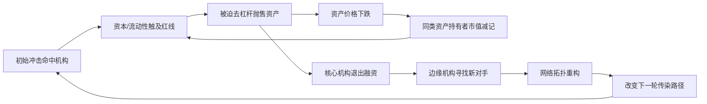

# 国内金融机构投资借贷关系与系统性风险：多层次网络建模与传染机制研究

我国金融机构之间的投资借贷关系，本质上是同业拆借、买入返售、交叉持股与共同资产持有等多重渠道叠加而成的多层网络；**系统性风险的真正放大器并非单一渠道的违约损失，而是这些层级在价格中介与信心传染下形成的非线性耦合**。截至2024年末，中国债券市场托管余额已达177.0万亿元，同比增长12.1%，其中银行间市场债券发行70.4万亿元、同业存单发行31.5万亿元，构成该网络最致密的承重梁。

与"单层同业拆借暴露即可刻画系统性风险"的常见主张相反，Zou等（2019）基于中国数据证明，同业拆借与交叉持股双层叠加的传染损失**超过两层各自损失之和**，单层模型系统性低估了真实脆弱性。本报告以Eisenberg-Noe清算下界、最大熵重构偏误与多层DebtRank为核心方法，构建一套可证伪的传染路径模型。

# 1 研究框架与方法论

机构间投资借贷关系的分层结构是后续全部建模的对象基础。下表为全文的实体—维度脊：十二类投资借贷关系沿六个维度展开，构成逐项建模、网络推断与中国实证的统一索引。

| 投资借贷关系 | 边特征 | 网络层次 | 主导风险 | 传染机制 | 度量方法 | 脆弱性 |
| --- | --- | --- | --- | --- | --- | --- |
| 同业拆借 | 无担保、短期、信用 | 流动性层 | 流动性/信用 | 违约→挤兑 | DebtRank | 短端高弹性 |
| 质押/买断回购 | 抵押融资、超短期 | 流动性层 | 流动性/市场 | 折价上升→去杠杆 | 火售螺旋 | 抵押品踩踏 |
| 同业存单 | 标准化负债凭证 | 流动性—债券层 | 期限错配/集中度 | 续发受阻→负债断裂 | 网络+脆弱性 | 中小行高依赖 |
| 债券互持 | 双向持有、中长期 | 债券层 | 市场/信用 | 估值下跌→共同抛售 | 共同资产网络 | 估值联动 |
| 资管嵌套 | 多层嵌套、表外 | 资管影子层 | 流动性/信用 | 赎回→链条断裂 | 多层网络 | 跨表枢纽 |
| 信托/委托贷款 | 通道信用、表外 | 资管影子层 | 信用 | 违约→刚兑压力 | 跨部门传染 | 房地产集中 |
| 非标投资 | 非标准化债权、表外 | 资管影子层 | 信用/透明度 | 不透明→挤兑 | 监管套利建模 | 跨机构传染 |
| 交叉持股 | 权益关联、长期 | 股权层 | 集中度/治理 | 治理失范→外溢 | 股权网络 | 大股东占款 |
| 衍生品关联 | 双边盯市敞口 | 衍生层 | 市场/对手方 | 对手违约→连锁 | 双边敞口网络 | 杠杆放大 |
| 担保/流动性支持 | 或有负债、表外 | 担保层 | 信用/流动性 | 担保触发→显性化 | 或有网络 | 隐性暴露 |
| 共同资产持有 | 无合约的资产重叠 | 间接渠道 | 市场/火售 | 抛售→价格下跌 | 重叠持仓模型 | 间接传染主渠道 |
| 央行流动性依赖 | 对手为央行 | 最后防线 | 流动性 | 投放收紧→紧张 | 货币传导网络 | 政策依赖 |

## 1.1 研究范围与"国内金融机构"边界

机构范围以监管分类为锚。据银发〔2015〕309号《金融业企业划型标准规定》，金融业企业按《国民经济行业分类》分为货币金融服务、资本市场服务、保险业、其他金融业四大类。本报告以此官方分类作为机构清单的法定基础，确保范围界定可由监管口径复核。

## 1.2 评估口径与系统性风险核心命题

**核心因果命题**：投资借贷关系本身只是风险的潜在通道，关系是否放大系统性风险，取决于违约、流动性、火售与信心四条传导链上的具体条件是否被触发。

**口径一致性原则**是全文可比性的前提。须明确区分两类关联：

- **直接关联**：机构间存在明确的债权债务合约（同业拆借、回购、债券互持），通过违约传导。
- **间接关联**：机构间无直接合约，但因持有重叠资产而关联，一旦一方抛售即压低共同资产价格、损及另一方，通过价格传导。

两类关联机制不同，但**都必须纳入同一系统性风险度量**，否则将系统性遗漏间接渠道。LSE关于重叠持仓的研究为间接关联的计量提供了方法论依据；胡超、范宏（2024）的"双渠道"研究范式将银行系统性风险置于直接与间接两条渠道下并行考察。其实践意义在于：**任何一类关系的风险贡献，都须在"直接边+间接重叠"的统一图上计算，避免因仅统计直接合约而低估真实关联度**。

# 2 投资借贷关系的类型与分层结构

机构间关系的复杂性首先来自参与主体的异质性。银发〔2015〕309号将金融业企业按经济性质划分为银行业存款类、非存款类、证券业、保险业等机构，为识别"谁对谁"确立了主体坐标系。

**机构主体的角色分化**是关系网络呈现核心-边缘结构的微观基础。《2022年中国金融年鉴》按中资大型、中型、小型银行、保险业、证券业、外资银行及其他机构等类别，列示拆入、拆出与净拆入字段，由此可区分三类角色：**核心节点银行、边缘融入机构、资产持有方**。

下文将十二类关系归入四类边：直接债权债务型（拆借、回购、同业存单）、投资嵌套通道型（资管嵌套、信托通道、非标）、间接隐性型（共同资产、担保、衍生品），并以分层框架整合。

## 2.1 关系的四层框架

胡超与范宏（2024）以直接债权债务渠道与间接共同资产持有渠道的双渠道结构作为分析框架。在此基础上构建**宏观-市场-机构-产品四层框架**，并叠加表内外、标准化非标的二维分类。银发〔2014〕127号要求同业业务"按业务实质归类"，正是穿透表内外伪装的监管基础。

| 关系类型 | 表内外 | 标准化 | 计量难度 |
|---|---|---|---|
| 同业拆借/回购/同业存单 | 表内 | 标准化 | 低（有交易数据） |
| 债券互持 | 表内 | 标准化 | 中（持仓不全公开） |
| 资管嵌套/信托通道/非标 | 表外为主 | 非标 | 高（需穿透） |
| 共同资产持有 | 表内+表外 | 标准化为主 | 中（需持仓重叠） |
| 担保/流动性支持 | 表外（或有） | 非标 | 高（隐性难识别） |
| 衍生品关联 | 表外（盯市） | 场内/场外 | 中高（盯市敞口） |

**这一二维分类揭示了一个系统性规律：标准化、表内的关系计量难度低但风险透明，非标、表外的关系计量难度高且恰是系统性风险的隐匿之处。监管的穿透努力本质上是将暗区的非标表外关系拉回明区的标准化表内度量。**资管新规的核心逻辑正在于此——通过穿透、回表与打破刚兑，将游离于度量之外的表外非标关系重新纳入可监管范畴。其中"表外×非标"象限（嵌套、通道、非标、隐性担保）是计量难度最高、风险最隐匿的靶区。

# 3 各类关系的逐项建模与风险画像

本章对每类关系沿"边特征→网络层次→主导风险→传染机制→建模方法→风险贡献"六维度展开，刻画单类关系的内在风险结构。术语上严格区分**关联度**（interconnectedness，网络结构层面的静态连接）与**传染**（contagion，违约、流动性与火售的动态因果传导）。

## 3.1 短期资金市场类关系

短期资金市场是流动性风险传播速度最快的层次。据2026年3月数据，同业拆借日均成交4507.7亿元，回购日均成交8.2万亿元。**回购日均成交约为拆借的二十倍，意味着短期资金网络的系统性风险主要承载于回购而非信用拆借渠道。**

### 3.1.1 同业拆借

**边特征**：同业拆借是金融机构间以信用为基础的短期资金融通。据银发〔2014〕127号，它与同业存款、买入返售等并列为同业融资基本类型；Shibor被界定为单利、无担保、批发性利率，品种覆盖隔夜至1年。**无担保是这条边最关键的风险特征：拆出方的回收完全依赖拆入方信用，没有抵押品作为第二还款来源。**

**网络层次**：归属银行间流动性层，是该层信用敏感度最高的子层，与有担保的回购层形成风险性质的对照。

**主导风险**：信用风险与流动性风险叠加。**期限极致缩短虽降低单笔违约的累积敞口，却放大滚动续作中断的流动性风险——这是一项以信用风险换流动性风险的结构性权衡，其代价在资金面冲击时集中显现。**

**传染机制**：核心拆出机构遭遇流动性冲击→收缩对边缘机构的拆出→拆入机构无法续作到期负债→被迫抛售资产或违约→损失沿拆借链向上游传导。关键中间环节是滚动续作的中断，而非单笔违约本身。2013年6月"钱荒"即是这一机制的现实样本。

**建模方法**：DebtRank与最大熵法/最小密度法的标准场景。双边敞口不完全公开，研究者多以最大熵法重建双边矩阵，或以最小密度法构建最稀疏可行网络作为下界。

**风险贡献**：相对回购规模较小但风险性质更纯粹，是测度信用传染的清晰样本。DebtRank对纯信用直接债权的违约传染高度适配，但对滚动续作中断的流动性维度需辅以动态续作假设方为完整。

### 3.1.2 回购

**边特征**：回购以债券为抵押品，质押式与买断式的差异在于抵押品法律处置方式——质押式下债券所有权不转移，逆回购方仅有优先受偿权；买断式下所有权过户，逆回购方可在期间处置或再质押。

**网络层次**：归属银行间有担保流动性子层，是规模最大的资金连接。2026年3月回购未到期余额11.2万亿元，约为拆借的十倍以上。**抵押品的存在显著缓释信用风险，但引入了抵押品价格波动这一新的风险维度。**

**主导风险**：从信用风险转向市场风险与流动性风险耦合。2026年3月DR001月加权平均利率1.31%。**这是抵押换价格风险的权衡：抵押品压低了信用敞口，却使整条链条暴露于抵押券估值波动与折扣率顺周期调整之下。**

**传染机制**：核心是折扣率顺周期螺旋——市场承压→抵押券价格下跌→逆回购方上调折扣率→正回购方追加抵押或偿还→被迫抛售抵押券→价格进一步下跌，形成自我强化螺旋。**抵押品在平时缓释信用风险，在压力期却经折扣率通道成为放大器，构成回购传染的悖论性特征。**

**建模方法**：须在债权债务网络之上叠加抵押品价格层，适用多层网络框架与火售螺旋模型。

**风险贡献**：因巨大规模与折扣率机制，是银行间流动性传染的主渠道。**对回购的刻画若仅停留在违约传染而忽略折扣率螺旋，将系统性低估其压力时期的传染强度。**

### 3.1.3 同业存单

**边特征**：同业存单是银行业存款类机构在银行间市场发行的记账式定期存款凭证。**记账式与可流通属性，使其成为可在二级市场转让的标准化债权凭证，这是它区别于双边同业存款的关键。**

**网络层次**：横跨银行间市场层与债券层。2024年发行31.5万亿元。**它成为连接银行间流动性层与债券配置层的枢纽：发行端是银行的批发性负债融资，持有端是广义基金与理财的债券配置。**

**主导风险**：期限错配与集中度风险。中小银行以"发存单-投资资产"形成期限错配。**当中小银行将存单作为主要主动负债工具时，其负债稳定性高度依赖存单市场的持续可发行性；一旦市场对其信用产生疑虑、发行失败，资产端将无法续接。**这一脆弱性在2017年同业存单监管收紧中集中暴露。

**传染机制**：发行银行信用恶化→新发存单认购不足或利率飙升→无法滚动到期负债→收缩资产或抛售债券→持有方广义基金与理财估值损失并赎回。**同业存单的传染兼具直接债权（持有方损失）与间接渠道（持有方被迫抛售触发火售）双重路径，使其传染面比纯拆借更广。**

**建模方法**：可基于公开发行与托管数据构建持有方-发行方二部网络，相对拆借更易获取真实数据。

**风险贡献**：因31.5万亿元发行规模与连接银行间-债券-资管三层的枢纽地位，是系统性风险传播的高速通道。**它是中国机构间网络区别于成熟市场的标志性工具，对该工具的建模不可回避。**

**三类工具的核心分野在于抵押属性如何重塑风险性质**：无担保的拆借承担纯信用敞口，有担保的回购将信用风险置换为抵押品价格风险，标准化的存单则将债权嵌入可流通资产从而兼具直接与间接两类传染路径。

## 3.2 证券持有与投资类关系

2024年债券市场托管余额177.0万亿元，公司信用类债券发行14.5万亿元。这构成金融机构间资产关联层中规模最大的共同敞口池。

### 3.2.1 债券互持

**边特征**：债权债务方向由持有方指向发行方，期限取决于债券存续期，通常无额外抵押，对信用债而言偿付保障仅依赖发行人信用。

**网络层次**：归属债券持有层，与回购层通过抵押品耦合，与同业存单通过标准化属性耦合，拓扑呈核心-边缘结构。

**主导风险**：信用风险与市场风险双重叠加。发行人信用恶化既推升违约概率，又通过信用利差扩大压低债券市价，**这种"信用-市场"双重暴露使其损失传导较单一风险类型更为复杂。**

**传染机制**：信用链条为发行人违约→持有机构资产减记→抛售其他债券→价格下跌→跨机构价值传导；市场链条则通过重叠持仓放大——一家机构抛售引发的价格下跌同时冲击所有共同持有者。

**风险贡献**：信用传染可由DebtRank量化，市场传染可由重叠持仓框架量化。**脆弱性累积路径在于重叠持仓的集中：当大量机构共同持有少数高收益信用债时，单一发行人违约便通过火售螺旋同时冲击所有持有者。**177万亿元托管余额的增长意味着共同敞口池的持续扩大。

### 3.2.2 交叉持股/股权投资

**边特征**：持股方对被持股方拥有剩余索取权而非固定债权，损失吸收顺序上股权劣后于债权。《金融控股公司监督管理试行办法》为识别跨机构股权关联提供制度框架。

**网络层次**：归属股权层，传导逻辑与债权层不同——股权损失先于债权被吸收，兼具缓冲与放大双重作用。金融控股公司是核心节点。

**主导风险**：权益损失风险与集中度风险。**包商银行案例集中体现股权集中度风险**：大股东明天集团合计持有其89%股权，大量资金被违法违规占用形成逾期，最终导致严重信用危机。

**传染机制**：被持股机构亏损→持股方权益减记→母公司注资消耗流动性→削弱母公司偿付能力→风险沿其他债权债务关系扩散。包商案例中，大股东操纵股东大会、董事会形同虚设，使股权关联由风险分散渠道异化为风险积聚通道。2019年5月24日包商银行因严重信用风险被联合接管，央行强调这是个案、金融风险总体可控。

**风险贡献**：正常时期股权作为损失吸收的第一道防线保护债权人；极端时期高度集中的股权结构使单点风险快速放大。**脆弱性典型路径是股权集中下的内部人控制。**

### 3.2.3 衍生品交易关联

**边特征**：衍生品敞口体现为合约盯市价值而非名义本金，随市场变动双向波动，**今日的债权方明日可能变为债务方**。

**网络层次**：归属跨层风险转移层，盯市损失会消耗资本与流动性，从而影响机构在债权债务网络中的偿付能力。

**主导风险**：对手方信用风险与市场风险，通过盯市机制耦合。**衍生品的风险悖论在于：它本是对冲风险的工具，单笔合约可降低风险暴露，但机构间合约的密集互联却在系统层面制造新的传染网络。**这一悖论在2008年AIG的CDS危机中充分暴露，化解方向是引入中央对手方（CCP）集中清算，但代价是风险向CCP集中。

**传染机制**：市场剧烈波动→盯市亏损→追加保证金或违约→流动性资本被消耗→偿付能力削弱→对手方承接重置成本损失。**保证金追缴是关键中间环节，它将盯市损失即时转化为流动性需求，在市场承压时与回购的折扣率螺旋叠加。**

**建模方法**：以盯市净敞口为权重的双边网络，汤淼与范宏的动态多层网络框架将CDS层与其他层动态耦合。Feinstein与Søjmark揭示了未来可能损失如何经前瞻性预期影响当期传染。

**风险贡献**：净额结算正常时期充当缓冲器，但在关键对手违约时被轧差掩盖的总敞口需重新对冲，瞬间转化为市场冲击。**脆弱性核心在于对手方集中。**

## 3.3 资管嵌套与影子信贷类关系

据影子银行风险监测报告，多层嵌套的资管产品及银行理财渠道使非标资产易引发跨机构资产负债表传染。**风险从非银机构向银行体系的回传方向，正是影子信贷类关系区别于前两节表内关系的核心特征。**

### 3.3.1 理财与资管产品嵌套

**边特征**：银行理财、券商资管、信托计划等多类产品相互投资形成多层持有结构，债权债务方向被产品层级所遮蔽。钱军团队指出，金融中介为投资者提供隐性担保是中国影子银行的重要组成。**嵌套的本质是一笔资金经多层产品层层传递，真实债权债务方向唯有穿透全部层级方能识别。**

**网络层次**：归属资管影子层，与银行间层、债券层、信用中介层均有交叉，成为各层之间的隐性连接枢纽。

**主导风险**：流动性错配与穿透不清带来的隐性信用风险。**多层嵌套使监管者与市场参与者均难以穿透识别最终风险承担者，这种信息不透明本身就是系统性风险的放大器。**

**传染机制随净值化制度变化而根本不同**：净值化前，刚兑预期下风险缓慢积压于发行端；净值化后，底层资产价格下跌→产品净值下跌→投资者赎回→抛售底层资产→价格进一步下跌，形成赎回-抛售自我强化螺旋。**后者速度更快且易踩踏，触发点由资金链断裂变为净值跌破心理阈值。**

**风险贡献**：透明度最低、链条最长。**合格的传染刻画须包含"底层违约-逐层净值受损-赎回传导-抛售放大"的完整链条**；仅描述"嵌套风险大"属于因果链残缺。建模方法可行但底层资产披露不足使实际建模严重受限。

### 3.3.2 信托与委托贷款通道

**边特征**：形式与实质分离——形式上是信托或委托贷款，实质上是银行的表外信贷，风险真实承担者与名义放款人不一致。钱军团队基于2002-2020年信托产品样本证明，隐性担保是中国影子银行的核心特征。

**网络层次**：归属信用中介子层，将信贷资产移出表内，形成一条绕过表内监管的隐性信用连接。

**主导风险**：监管套利驱动的隐性信用风险。**这是一项监管成本与风险透明度的权衡：通道压低了银行合规成本，却以牺牲风险可见性为代价。**资管新规通过要求穿透与回表来强制恢复透明度，正是对这一权衡的纠偏。

**传染机制**：实体融资方违约→信托/委托贷款资产无法回收→银行因隐性担保实质承接损失→表内资本受损或被迫回表→影响信用投放能力。**隐性担保是关键中间环节，它使形式上的风险隔离在实质上失效。**房地产是这类通道的重要资金投向。

**风险贡献**：监管套利属性使其对系统性风险的贡献被表内指标系统性低估。**对通道业务的分析直接支撑了资管新规"穿透监管、打破刚兑、消除多层嵌套"的政策逻辑。**

### 3.3.3 非标资产投资

**边特征**：投资于未标准化交易的债权性资产（信托贷款、委托贷款、应收账款等），缺乏公开市场价格与流动性，估值依赖模型或成本法。

**网络层次**：归属信用中介子层，与通道业务高度交叉，是风险的"沉淀池"——风险在此积聚却因低流动性而难以及时释放。

**主导风险**：流动性风险与估值风险耦合，构成不透明-不可变现双重困境。

**传染机制**：非标资产到期无法兑付→持有方损失与流动性缺口→被迫抛售流动性较好的标准化资产→标准化市场价格下跌→损及所有共同持有者。**非标的低流动性使其无法直接传导，而是经由"抛售标准化资产"这一替代变现渠道实现跨市场传染，这是非标传染的特有路径。**

**风险贡献**：**这一"非标受损-抛售标债-标债市场承压"的跨市场链条，是连接资管影子银行层与债券市场层的关键传染通道，也是资管新规要求压缩非标的根本风险逻辑。**

**本节确立的结构性判断**：中国机构间网络的系统性风险有相当部分隐匿于嵌套、通道与非标这三类不透明的边中，它们经由隐性担保与跨市场抛售将表外风险回流至表内与标准化市场。

## 3.4 隐性支持与系统依赖类关系

这类关系的特征是**平时不显现于资产负债表、却在压力期通过或有负债显性化集中暴露**，是系统性风险度量中最易被低估的部分。

### 3.4.1 担保与流动性支持

**边特征**：或有性——平时为零敞口，在被担保方违约时跳变为实际债权。《金融控股公司监督管理试行办法》规范的集团内部支持是隐性担保的典型制度场景。**这种非线性敞口特征使其在常规网络度量中容易被遗漏。**

**网络层次**：归属担保层，其连接平时"休眠"、压力期"激活"。**基于平时敞口构建的网络会系统性遗漏这一层，唯有引入或有暴露的情景模拟方能捕捉。**

**主导风险**：或有信用风险与隐性担保失效风险。**担保关系制造了道德风险与系统稳定的权衡：隐性担保平时提供信心、降低融资成本，但鼓励被担保方过度风险承担，并在系统性压力下使担保方承接超出其能力的损失。**资管新规推动的打破刚兑正是对此的纠偏。

**传染机制**：被担保方违约→担保被激活→担保方承接损失→自身资本流动性受损→压力沿其债权债务网络外传。**这种"或有转实有"的相变在平时不可见，却在压力时期成为传染的隐性桥梁。**

**风险贡献**：**对担保关系的刻画若不引入或有暴露的情景模拟，将完全遗漏其压力时期的传染贡献，这是常规网络度量的系统性盲区。**

### 3.4.2 共同资产持有（间接关联）

**边特征**：机构间无直接合约，经由共同资产这一"中间节点"间接关联——A与B之间无任何债权债务，但都持有资产C，C的价格波动使二者资产负债表同步变化。无法用机构-机构邻接矩阵刻画，需用机构-资产二部图表示。

**网络层次**：贯穿多个网络层的间接渠道，与债券层、影子银行层、嵌套链条均耦合，是连接各显性网络层的"隐形纽带"。

**主导风险**：火售螺旋引发的市场风险传染。**共同持有的悖论在于：分散投资于流动性好的标准化资产本是单一机构的审慎之举，但当众多机构做出相同选择时，持仓的高度重叠反而在压力时期转化为系统性脆弱，个体理性的分散化在集体层面制造了集中度风险。**这一悖论的化解依赖于监管对系统性资产集中度的监测，因为没有任何单一机构能内部化抛售对市场价格的外部性。

**传染机制**：一家机构因负债压力抛售共同资产→价格下跌→所有共同持有者资产负债表缩水→部分机构进一步抛售→价格进一步下跌。**火售螺旋不需要任何直接债权债务关系即可在机构间传染，是间接关联最危险的特征。**LSE研究证明重叠持仓产生可量化的系统性风险。

**风险贡献**：因不依赖直接合约即可传染，其贡献在压力时期可能超过直接债权债务渠道。胡超与范宏明确将其与直接渠道并列为两大传染渠道。**将其作为独立的间接渠道纳入分析，是中国系统性风险研究覆盖完整性的必要条件。**

### 3.4.3 央行流动性依赖关联

**边特征**：机构-央行的纵向关联，央行作为最后贷款人居于网络顶点。2026年3月R001与DR001利差日均值7个基点，反映非银机构相对存款类机构的融资成本溢价。

**网络层次**：凌驾于四层网络之上的系统依赖层。**流动性分层是核心结构**：存款类机构可直接从央行获取流动性（DR系列），非银机构需通过存款类机构间接获取（R系列，故R001高于DR001）。

**主导风险**：流动性分层风险与外部支持依赖风险。**系统对央行流动性的过度依赖，使央行政策调整成为系统性风险的潜在触发点。**

**传染机制**：货币市场收紧→核心机构收缩对非银融出→非银融资成本骤升或中断→抛售资产→火售螺旋冲击共同持有者→若央行不及时投放则演化为系统性危机。2013年"钱荒"是经典案例。

**风险贡献**：双面性——央行流动性投放是系统性风险的最后防线，但系统对央行的过度依赖本身又是脆弱性来源。**其分析直接指向最后贷款人机制与流动性分层调控。**

# 4 网络构建与双边矩阵推断

## 4.1 图论表示与核心-边缘结构

将借贷关系抽象为有向图，可把"谁欠谁、欠多少、欠多久、有担保还是信用"压缩进节点、边、权重、方向、期限五个变量族。最基础的对象是**双边暴露矩阵**，其元素 $X_{ij}$ 记录机构 i 对机构 j 的暴露金额。

**双边暴露矩阵的行合计与列合计对应每家机构的总融出与总融入，通常可从公开报表观测，而矩阵内部的逐笔单元格往往不可直接观测；正是这一"边际已知、内部未知"的结构，构成了推断方法之争的根源。**机构报表能给出对全部对手的合计融出与融入，但通常不披露对每一具体对手的明细。年鉴的分类拆借统计可提供按机构类别聚合的块状观测锚点，但颗粒度停留在机构类别层而非单家法人层。

将双边矩阵视为加权有向网络后，最具系统性风险含义的拓扑特征是**核心-边缘结构**：少数高度互联的核心机构居于中央，大量边缘机构主要通过核心间接相连。值得注意的是，Wang等（2025）提出"最大的银行未必是最互联的"——**以资产规模识别系统重要性机构（SIFI）可能与以网络中心性识别的结果不一致，监管认定SIFI时需将规模与互联度作为两个独立维度并列考量。**

## 4.2 双边矩阵的推断方法之争

两种方法在完全相同的报表数据上运行，却会得出截然不同的系统性风险结论，因而这是网络推断中最具决策含义的环节。

**最大熵法**在已知行列合计的约束下选择信息熵最大、最"分散"的矩阵。**其数学优雅之处恰是经济失真之源：熵最大化等价于假设每家机构把资金尽可能均匀分散给所有对手，从而生成接近完全连接的稠密网络。**这一"完备分散假设"系统性偏离了真实银行间市场的稀疏特征。Andrecut（2016）明确指出，最大熵法通过假设完全连接网络严重低估了传染风险——完备分散把敞口摊薄到所有对手，使单一对手违约时损失被稀释，违约级联难以启动。Mistrulli基于意大利央行真实双边数据验证了这一偏差方向。**因此，最大熵结果应被解读为传染范围的下界估计而非中心估计。**

**最小密度法**提供相反逻辑：在满足行列合计约束下生成尽可能稀疏的网络，把暴露集中到少数连边上。真实世界的图度分布多为幂律分布（少量中心节点连接大量节点），这种无标度特征与最小密度法高度吻合。其因果链为：暴露集中→单一核心对手违约时损失不被稀释→更易触发违约级联→放大传染范围。**与最大熵互为镜像，最小密度结果宜被读作传染范围的上界估计；真实系统性风险大概率落在两者构成的区间之内。**

| 维度 | 最大熵法 | 最小密度法 |
| --- | --- | --- |
| 核心假设 | 完备分散，均匀摊薄 | 连边最少，集中于枢纽 |
| 生成拓扑 | 稠密近完全连接 | 稀疏核心-边缘 |
| 与真实市场贴合度 | 偏离 | 更贴近（幂律度分布） |
| 传染结论 | 系统性低估 | 相对更强 |
| 测算定位 | 下界 | 上界 |

**在中国回购主导、大行集中的市场结构下，单独使用最大熵法会系统性低估传染。**回购体量约为拆借的十余倍，使最大熵填充的稠密化低估效应被进一步放大。稳健做法是**同时报告两法结果，以区间形式呈现传染范围**，而非择一作为点估计。

## 4.3 市场数据驱动的关联推断

资产负债表法依赖报表披露的存量敞口，其盲区在于不可观测的隐性关联与低频特征。市场数据法以价格联动为信息源，高频、覆盖全部上市机构且无需双边明细披露。

| 维度 | 资产负债表法 | 市场数据法 |
| --- | --- | --- |
| 可观测对象 | 存量双边敞口（部分披露） | 收益率/价格联动 |
| 数据频率 | 季度/半年度低频 | 日频或更高频 |
| 机构覆盖 | 含未上市机构（若有报表） | 仅上市机构 |
| 隐性关联 | 无法观测 | 可经价格联动间接捕捉 |
| 传染方向 | 可区分债权受损/债务违约 | 不直接区分 |
| 配套指标 | DebtRank、Eisenberg-Noe | CoVaR/SRISK/MES、TENET |

**两法的盲区恰好互补**：资产负债表法回答"若某机构违约，沿已知敞口链条会造成多少直接损失"（结构性、基于合约），市场数据法回答"市场认为哪些机构在压力下会同步承压"（行为性、基于预期）。**在中国，由于大量中小银行与信托未上市、资管嵌套敞口披露不足，唯有将两法联合使用、以市场数据填补报表盲区，才能刻画完整的传染图景。**

# 5 系统性风险度量指标体系

## 5.1 市场数据型指标

市场数据型指标以股权价格序列为输入，优势在于数据可得性高、可达日度更新、无需穿透资产负债关系；根本局限在于仅覆盖上市机构，并隐含"系统性暴露已被股权市场有效定价"的前提。

**CoVaR与ΔCoVaR**将"在险价值"从单一机构延伸至机构与系统之间的尾部溢出。CoVaR度量某机构处于困境时整个系统面临的在险价值，**ΔCoVaR则取该值与机构正常状态时的差，把"机构困境对系统的边际贡献"单独剥离**。李政等基于CoVaR统一框架，用ΔCoVaR度量风险贡献（系统重要性）、Exposure-ΔCoVaR度量风险敞口（系统脆弱性）。

该研究的中国实证发现极具价值：**银行和保险部门的系统重要性高于证券部门，而证券部门的系统脆弱性高于银行和保险部门**。四家大型商业银行表现为系统重要性高而脆弱性低——它们是冲击的放大器而非接受器；少数机构则同时具有较高重要性与脆弱性，是真正的双重隐患节点。ΔCoVaR无需暴露矩阵，便利但也是盲点——它把所有传导渠道混合进价格协动，**适合作SIFI初筛排序，具体传染路径仍需网络模型补充。**

**MES/SES**将视角从"在险价值的分位数溢出"转向"尾部条件下的期望损失"。MES度量整个市场处于尾部下行时单个机构的期望损失，方向与ΔCoVaR恰好相反——**ΔCoVaR测贡献（机构→系统），MES测暴露（系统→机构）**。SES在MES基础上引入杠杆与规模，给出资本缺口，是SRISK的概念前身。MES的结构性局限是顺周期性：**市场上行、波动率下降的累积期MES读数系统性偏低，使指标在风险积累阶段反而给出"安全"信号，是滞后的危机确认型而非前瞻的预警型指标。**部分缓解之道是与不依赖市场价格的杠杆与期限错配指标组合使用。

**SRISK**度量在持续市场严重下行情景下机构为恢复审慎资本水平所需的预期资本缺口，将三个输入组合：市场敏感度（MES）、杠杆（负债/权益）、规模（市值）。**它同时反映系统重要性（规模与杠杆的放大）与系统脆弱性（市场敏感度），是市场数据型指标中信息最完整的一个。**SRISK在中国应用的关键问题是顺周期性，已有研究通过引入信贷过度扩张情景修正：信贷扩张推升市值并压低波动率→压低市场敏感度→使SRISK在风险累积期反而下行→在信贷泡沫最危险时段给出虚假安全信号。SRISK已成为国内SIFI识别的主流工具（相关研究被引达134次），并被用于跨境维度。**其短板是只覆盖上市机构，无法穿透理财与资管嵌套链条所隐藏的表外暴露。**

| 指标 | 条件方向 | 度量维度 | 核心局限 |
|---|---|---|---|
| ΔCoVaR | 机构困境→系统 | 风险贡献（重要性） | 黑箱、不展开路径 |
| MES | 系统困境→机构 | 风险暴露（脆弱性） | 顺周期、仅上市 |
| SES | 系统困境→资本缺口 | 脆弱性（资本） | 情景依赖 |
| SRISK | 持续下行→资本缺口 | 重要性+脆弱性 | 顺周期、仅上市 |

## 5.2 网络结构型度量

网络指标基于显式拓扑直接计算结构属性，与市场数据型指标互补。**网络指标的最大价值在于区分关联度与传染：关联度即静态拓扑（由中心性测度），传染即动态传导（由DebtRank刻画），这正是市场数据型指标无法实现的功能。**

**中心性家族**：度中心性反映直接关联广度，特征向量中心性体现"关联到核心的核心"，介数中心性表征"作为桥梁的中转地位"。一个稳健性挑战是：Segarra与Ribeiro（2014）证明，加权图中度中心性、接近中心性、特征向量中心性是稳定的，而**标准介数中心性是不稳定且不连续的**。**这意味着当暴露估计存在测量误差时，介数中心性的排序极易剧烈跳变。**由于中国暴露矩阵推断本身带有相当不确定性，用不稳定的介数中心性识别SIFI极易导致不一致的名单。

**DebtRank**回答中心性回答不了的问题："谁出事系统真的会损失多少？"它给某机构施加初始冲击，沿债权债务边按暴露比例传导困境，累计系统损失份额。**关键创新是把困境视为连续传导而非离散违约：即使一个机构尚未违约，它的价值受损也会按比例向债权方传导，使DebtRank能捕捉"未违约但已传染"的早期阶段。**与违约瀑布模拟（阈值触发的离散传导）形成互补：前者刻画"硬违约"级联，DebtRank刻画"软困境"渐进传染。**DebtRank不应停留在单层同业拆借网络，而应叠加共同资产持有这一间接渠道**——仅靠单层网络会系统性低估风险，因火售螺旋作用于资产关联层而非借贷层。DebtRank是传染因果链刻画最完整的指标，但数据要求高，推断误差会传导进数值。

**连通度与网络密度**刻画整体连接稠密程度。一个直觉是"密度越高越危险"，但**网络结构研究的核心洞见是密度对系统性风险的影响是非单调的**。Gai、Haldane与Kapadia（2011）揭示连结程度提高同时具有两种相反效应：更稠密连接意味着更广风险分担（冲击被稀释），也意味着更多传染路径（冲击突破吸收能力时传导更快）。**密度对系统性风险呈现相变式非线性关系：小冲击下密度高的网络更稳健，但冲击超过阈值后密度高的网络突然变得更脆弱。**这对监管的含义是：不能简单把"降低网络密度"当作政策目标。集中度则补充另一维度——核心机构的脆弱性比平均密度更关键，这与中国少数大型银行居于核心的同业网络高度契合，并与李政等"四家大型商业银行系统重要性高"的实证相互印证。

## 5.3 指标适用性与本土校准

**国际指标在中国存在系统性的适用性折损，部分经验关系甚至失效，因此任何单一指标都不足以刻画中国的系统性风险，必须走向多指标综合评分与本土校准。**

国际指标失效的根源构成一条因果链：市场数据型指标假设股权市场能有效定价系统性暴露，但中国大量金融机构未上市，且表外的理财与资管嵌套使可见暴露与真实暴露脱节→市场价格携带的系统性信息被削弱→CoVaR、MES、SRISK在中国的信号质量下降。这解释了为何在欧美成立的"市值-杠杆-市场敏感度"经验关系移植到中国后可能失效。经验关系失效的另一表现是指标间排序的不一致——这恰恰说明单一指标不可靠，必须做指标间一致性检验。

**指标间一致性检验**：若多个独立构造的指标对同一组机构的系统重要性排序高度一致，则该排序稳健；分歧很大则需追溯来源。检验中应优先采用稳定的中心性度量，对介数中心性的结论保持审慎。"指标变量法与网络模型法相结合"本身就是一种跨方法的一致性检验。稳健性的另一维度是参数敏感性：SRISK的资本充足率门槛、DebtRank的冲击规模、网络推断的密度假设，结论都对参数敏感，**报告区间而非单一点估计是度量稳健性的基本要求**。

**多指标综合评分是必然选择，不是折中主义的妥协，而是由各指标互补性盲点严格推导出来的**：市场数据型指标盲于表外与未上市机构，网络结构型指标盲于市场定价信息且依赖暴露矩阵推断，资产负债表型指标盲于市场预期且数据滞后。**没有任何单一族系能同时覆盖系统重要性与脆弱性、直接关联与间接共同暴露、表内可见暴露与表外嵌套暴露这三组维度。**一个完整的中国系统性风险综合评分应至少包含市场敏感度（MES/SRISK）、网络中心性（稳定中心性）、困境传导（多层DebtRank）、杠杆与流动性、共同暴露（穿透后的资产集中度）五个维度。各维度权重应反映各指标在中国情境下的信号质量，陈湘鹏等的适用性分析正为权重确定提供依据。

# 6 风险传染机制与传染路径建模

违约、流动性、火售与信心，是投资借贷关系转化为系统性风险的四条核心传导链。本章将暴露矩阵与多层网络结构转化为动态因果传导过程，并以包商银行、永煤违约、"620钱荒"等中国案例验证。**核心论点是：投资借贷关系本身只是风险的潜在通道，关系是否放大系统性风险，取决于四条传导链上的具体条件是否被触发。**

## 6.1 违约传染的清算机制

违约传染是因果关系最直接的一条：债务方无法偿付时，损失沿债权债务边直接传递给债权方。

**Eisenberg-Noe清算模型**在给定网络结构与外部资产价值下，唯一求解出一组"清算向量"（每家机构连锁违约后实际能偿付的金额）。Visentin等（2016）指出，在不存在不确定性的假设下，该模型给出的是**最低的传染水平**。其根源是"损失守恒"性质：**传染结束后的总损失恰好等于最初受冲击机构所承受的损失——在纯清算机制下，违约只是把既定损失在债权人之间重新分配，而不凭空创造新损失。**这提供了一个清晰锚点：**违约清算本身不放大损失总量，放大来自后续的价格渠道与流动性渠道。**

**级联违约与损失分配**：A对B违约→B资本受损→B对C违约→损失逐级传递，Eisenberg-Noe的不动点求解同时处理所有相互依赖的偿付关系。**关键在于按比例清偿规则：对违约机构暴露越集中的债权人承受的损失越大，集中度风险在清算阶段被放大。**郑红等（2023）给出一个反直觉发现：**"困境"（尚未违约但资产价值受损）的传染损失可能比该银行自身违约的损失更大**——违约是一次性损失实现，受清偿顺序约束；困境则通过盯市估值下调影响所有持有关联暴露的机构，触发更广泛资本侵蚀。其政策含义是：监管处置若只盯住"是否违约"，会忽略困境状态下已发生的更大权益损失。

**传染方向的非对称性**：连永辉（2016）以中国同业网络为样本得到方向明确的结论——**债务银行的风险对债权银行有显著正向影响，而债权银行的风险对债务银行没有显著影响，风险传染由债务银行向债权银行单向流动**。这符合违约清算的内在逻辑。**对网络重构方法的直接含义是：最大熵法倾向产生对称结构，可能掩盖这一非对称性；最小密度法生成稀疏核心-边缘结构，更能保留方向信息。**

## 6.2 流动性传染机制

如果说违约渠道传递已实现的损失，流动性渠道传递的是"资金能否续上"的压力。核心是期限错配：机构以短期负债支撑长期资产。

**滚动融资失败**：机构依赖短期负债滚动为长期资产融资，市场拒绝续做时资金链断裂。非核心负债研究揭示两条渠道：其一是**负债流动性渠道**——非预期负债被提前收回比例上升→负债流动性下降→推高违约风险。这是一条不必经过资产端恶化的独立传导链，解释了为何流动性传染可独立于违约渠道发生。其二是**资产流动性渠道**——被迫抛售资产时折价放大资本金损失。负债越依赖非核心来源、市场流动性越差，同一冲击引发的系统性风险越大。

**流动性螺旋**：Brunnermeier与Pedersen（2005）提出，危机时期市场流动性与融资流动性的下降相互强化。因果链为：市场流动性下降→资产变现困难、抵押价值缩水→融资流动性下降→进一步抛售→压低市场价格→再度恶化市场流动性。**保证金追加是触发开关**，它把市场价格波动直接转化为即时现金流需求。**流动性螺旋与违约清算的关键区别在于损失守恒性是否成立：违约清算满足损失守恒，流动性螺旋不满足，价格反馈会使损失滚雪球式放大。**正是这一差别使流动性渠道必须独立建模。

**流动性分层与同业市场冻结**：2019年5月包商银行被接管是最具代表性的实证事件。央行说明，大股东明天集团合计持有89%股权，大量资金被违法违规占用形成逾期，导致严重信用危机。**包商事件的传导意义在于它触及了同业负债的信用风险这一此前常被默认"近乎无风险"的暴露类型**——同业存单与同业负债在包商之前普遍被当作准无风险资产定价。央行反复强调"完全是一个个案、风险总体可控"，**这本身就是一种预期管理：通过明确"个案、可控"信号抑制恐慌向整类中小银行蔓延**。

| 机制 | 触发开关 | 损失守恒 | 中国对应案例 |
|---|---|---|---|
| 滚动融资失败 | 短期负债拒绝续做 | 否 | 包商后边缘机构融资压力 |
| 流动性螺旋 | 保证金追加/抵押缩水 | 否 | — |
| 同业市场冻结 | 信用风险显性化 | 否 | 包商银行（2019） |

## 6.3 火售与资产价格传染

火售渠道不需要机构之间存在直接债权债务关系：即使两家机构毫无直接暴露，只要持有共同资产，一家的抛售就会通过价格压低另一家的资产估值。

**共同资产持有的火售外部性**：英格兰银行第878号工作论文建模了跨部门共同持有资产引发的火售间接传染。因果链是：资产价格下跌→机构抛售→进一步压低价格→损失通过共同持有传递给其他机构→跨部门扩散。波士顿联储2023年研究记录，**火售的网络外部性可使损失达到初始规模的很大倍数，传统风险评估方法可能严重低估实际损失**。**这与违约清算的损失守恒形成鲜明对照：违约渠道刻画直接清算的损失下限，火售渠道刻画价格中介放大的损失，二者必须叠加才能得到真实系统损失估计。**

**资产价格下跌→减值→去杠杆的反馈环**：Springer 2024年研究指出价格中介传染形成正反馈环——价格下跌→抛售→进一步压低价格→触发更多抛售。减值是连接价格与去杠杆的会计环节。**这构成会计制度与金融稳定之间的取舍：盯市会计提高估值透明度却放大价格反馈环，持有至到期会计缓和反馈环却掩盖真实价值缩水。**化解方式是对持有至到期资产在压力测试中追加情景跌价假设。

**间接渠道与直接渠道损失叠加**：Yong（2024）构建多部门核心-边缘模型，研究部门冲击如何同时经双边暴露与共同资产持有传播。**叠加效应之所以重要，是因为一家对违约方有直接暴露的机构很可能也与违约方持有相似资产组合，于是既承受直接清算损失，又承受火售压低的估值损失。**胡超与范宏（2024）的"双渠道"研究正属于这一统一测度路径。

## 6.4 信心与预期传染

信心传染不需要实际损失先行发生，仅凭预期改变就能引发挤兑、重定价与市场冻结，并反过来催生真实损失，构成"预期自我实现"的传染。

**信息不透明下的挤兑放大**：当债权人无法辨识交易对手真实资产质量时，负面信息更易被不加区分地外推到整类机构。研究指出，资产不透明与监管套利会提高系统性风险，并削弱透明度与资本监管的约束作用。**透明度不仅是信息披露问题，更是系统性风险的结构性放大因子**——资产越不透明，债权人越倾向在负面冲击来临时对整类机构同时抽贷。这为包商事件能引发市场对同类机构风险溢价调整提供了理论基础。

**刚兑预期破灭引发的市场重定价**：2020年11月，AAA级国企永城煤电突发债券违约，冲击了业界对高信用等级国企债券的"刚兑"信仰。**永煤打破的是"高信用等级国企债券近乎刚兑"这一市场共识，而非仅一家主体的信用事件**——永煤本身的违约损失有限，但它动摇的是一整类资产的定价基础。当"国企=刚兑"被证伪，市场对所有相似主体的信用评估都需重新进行。这本质上是一个正反馈环的反向运行。

**监管行动信号的预期冲击**：2013年"620钱荒"是典型案例。在PPI连续负增长、外汇占款波动等下行压力下，央行在资金面紧张时面临是否注入流动性的抉择。**市场对央行是否"一如既往"平抑资金面形成预期，预期改变会在实际行动之前就影响市场行为。**这与刚兑破灭同属"预期重定价"，区别在于触发源：刚兑破灭由市场事件触发，钱荒由对监管行动的预期改变触发。**预期管理因此成为监管应对信心传染的核心工具**：包商处置中"个案、可控"的明确表态与钱荒中预期不确定性构成对照——明确信号稳定预期，不确定信号放大波动。**在信息不透明条件下，清晰及时的监管沟通本身就是降低系统性风险的工具。**

# 7 多层次多渠道网络建模

多层建模的价值不在于层数堆叠，而在于捕捉**跨层耦合项**：这一项在单层视角下恒为零，却是系统性损失超过各部分之和的根源。

## 7.1 单层网络模型的局限

单层模型只刻画同业拆借债权债务网络，便于求解清算向量，却把回购、债券互持、共同资产持有等并行渠道全部折叠。一个关键缺陷是**外生同质违约损失率（LGD）假设**：传统传染模拟常将LGD设为外生给定且对所有机构同质。这一假定的问题在于参数敏感性过高——LGD取低值时传染往往戛然而止，取高值时则可能触发全局崩溃，且忽略了机构在抵押品质量、清算顺位与回收能力上的异质性。已有大量LGD建模文献表明，将LGD作为机构异质、可由抵押与回收特征驱动的变量进行估计在技术上完全可行。**一个严谨的传染测算应当报告LGD取值区间下的损失分布，而非仅给出单点结果。**

## 7.2 双层网络模型

双层网络在同业拆借层之上叠加资产关联层或权益关联层，首次使跨层耦合项显现。**三项发现——耦合传染、损失超额与权益放大——共同确立：跨层耦合项是系统性风险的独立来源，既不属于任一单层，也无法由单层之和近似。**Zou等（2019）证明双层叠加的传染损失超过两层各自损失之和（耦合项C>0）；当第二层为股权关联时，损失因缺乏硬上界而被进一步放大。**多层建模的收益并非线性叠加，而是捕获了单层框架无从表达的交互维度。**

| 维度 | 单层同业拆借 | 双层（拆借+资产/股权） |
| --- | --- | --- |
| 覆盖渠道 | 仅直接信用违约 | 直接违约+间接渠道 |
| 跨层耦合项C | 恒为零 | C>0，构成超额损失 |
| 火售机制 | 无法表达 | 经共同资产层显式建模 |
| 权益损失通道 | 无 | 经交叉持股层，缺硬上界 |
| 对中国关系覆盖 | 1/12类 | 约3–4/12类 |

## 7.3 多层与异质机构网络

多层异质框架同时沿层维度（覆盖银行与非银多部门）与节点维度（资本与流动性缓冲各异）拓展，使**耦合项C的大小由拓扑形态与缓冲分布内生决定，而非固定常数**。

**核心-边缘结构既是传染的高速公路，又是宏观审慎政策的精准抓手。**研究发现，核心-边缘网络比无标度网络更易遭受共同冲击，但在金融困境时，宏观审慎政策机制下其恢复力反而更强。**这一双重性的张力在于：集中性既是脆弱性来源，又是治理抓手**——使网络脆弱的集中性，同时也使政策干预有效，因为政策可聚焦于少数核心节点。当冲击命中边缘节点时传染被核心吸收而局限于局部；命中核心节点时则迅速扩散。这一恢复力优势严格依赖宏观审慎政策的及时介入。

| 维度 | 同质多层 | 异质多部门多层 |
| --- | --- | --- |
| 节点设定 | 资本/杠杆同质 | 缓冲异质 |
| 部门覆盖 | 仅银行 | 银行+证券+保险+信托 |
| 传染扩散形态 | 均匀扩散 | 沿薄缓冲热点优先扩散 |
| 拓扑敏感性 | 弱 | 强：范围依赖核心状态 |
| 系统重要性识别 | 按规模 | 按规模+脆弱性+枢纽位置 |

## 7.4 动态与内生网络仿真

动态仿真松动了"网络外生给定"假定：网络成为机构借贷决策的内生产物，并在传染过程中随机构进退而持续重构。

**动态去杠杆与网络重构构成传染中最危险的正反馈**：去杠杆压低资产价格→价格下跌迫使更多机构去杠杆→去杠杆同时重构网络、改变后续传染路径。非核心负债的两条流动性途径（资产侧抛售折价、负债侧提前回收）正是动态放大的引擎。**这一反馈刻画出静态模型最严重的盲区：静态测算把网络冻结在冲击前的状态，而真实的去杠杆-重构反馈会在传染中持续改写网络，使尾部损失被动态放大。**

## 7.5 压力测试与情景模拟框架

压力测试的最终产出不应是单点损失，而应是系统损失的完整分布，尤其是刻画极端情景的尾部。在外生同质LGD假设下测算只能输出单点损失；若将LGD与冲击规模设为分布并进行蒙特卡洛抽样，则能输出概率分布。**系统总损失的测算区间，而非单一数值，才是稳健的产出形式。**

尾部度量借助CoVaR、SRISK与MES。**尾部呈现的价值在于化解一个监管层面的核心张力：均值意义上稳健的系统，在尾部常常极为脆弱**——传染的非线性放大使损失分布呈现厚尾。基于SRISK的中国SIFI识别之所以具有政策价值，正因为它回答"系统危机时谁的资本缺口最大"这一尾部问题，而非"平常时谁规模最大"。

| 情景 | 冲击注入点 | 主导传导层 | 标志性事件 | 尾部度量 |
| --- | --- | --- | --- | --- |
| 利率上行 | 市场层（债券估值） | 资产关联+共同资产层 | — | CoVaR/MES |
| 房地产下行 | 资产层（涉房资产减值） | 影子银行+资产关联层 | 房地产信托冲击 | SRISK |
| 流动性收紧 | 负债层（同业负债回收） | 流动性层 | 620钱荒、包商接管 | SRISK/ΔCoVaR |

# 8 中国市场实证发现与系统重要性识别

## 8.1 中国银行间网络结构特征

中国银行间网络呈现典型的核心-边缘结构，源于机构性质的制度性分层与交易规模的内生集聚共同作用。《2022年中国金融年鉴》的分类拆借统计为识别该结构提供了可操作的数据基础。**中资大型银行类别（工农中建、国开、交通、邮储等）在官方统计中单独成类，为考察资金融通能力是否向少数大型机构集中提供了可检验的口径。**

基于CoVaR统一框架的实证发现，**四家大型商业银行的系统重要性较高而系统脆弱性较低**——核心节点主要是风险传播者（贡献高而敞口低），并非风险的主要承受者。这种"高重要性、低脆弱性"的组合正是核心-边缘结构在中国市场的实证体现：核心节点凭借规模与多元化负债结构吸收自身冲击，却通过高连通度向外辐射风险。**与单纯按交易规模识别不同，中国核心节点的识别同时受官方机构分类口径约束**，大型银行的核心地位既反映实际交易规模，也受国有属性与系统重要性认定的制度强化。

## 8.2 各类关系的风险贡献排序

须明确：在缺乏统一样本压力测试的前提下，后续排名属于**基于传染机制的定性判断**，而非实证测算结果。

从传染机制视角，各类关系的系统性风险贡献可作如下定性排序：

- **回购**：叠加抵押品价格联动与火售螺旋两条路径，贡献较高。
- **共同资产持有**：无接触的间接传染、最隐蔽，贡献较高且最难观测。
- **理财与资管嵌套**：链条断裂引发的赎回踩踏、最不透明，贡献较高。
- **同业拆借**：监管规范后贡献收敛至中等水平，可观测性高。
- **同业存单**：贡献取决于中小银行依赖程度。

**回购、共同资产与嵌套三者之间的精确高下排序，在现有证据下无法确定，因而将其并列视为"高贡献渠道"更为审慎。**

| 排序 | 关系类型 | 判断依据 | 证据强度 | 敏感性来源 |
|---|---|---|---|---|
| 高贡献组 | 质押/买断回购 | 火售螺旋+抵押品联动 | 机制推断 | 需回购杠杆/期限压力测试 |
| 高贡献组 | 共同资产持有 | 无接触间接传染、最隐蔽 | 二部网络模型支撑 | 需持仓重叠度数据 |
| 高贡献组 | 理财/资管嵌套 | 链条断裂赎回踩踏 | 机制推断 | 需监管穿透数据 |
| 中等组 | 同业存单/负债 | 中小银行主动负债依赖 | 待实证 | 需分类发行余额数据 |
| 中等组 | 同业拆借 | 监管后收敛、可观测性高 | 监管规范节点支撑 | 需期限分布数据 |

排名的敏感性来自三个来源：**样本期**（覆盖不同监管节点会得出迥异结构）、**度量指标**（直接借贷网络指标突出拆借与回购，二部网络指标突出共同资产）、**网络重建方法**（最大熵法与最小密度法可能重建出不同结构）。

## 8.3 系统性风险趋势判断的分歧

**中国系统性风险的趋势判断存在根本的口径依赖性，"风险下降"与"风险累积"两种结论的并存并非测算错误，而是源于度量基础、样本期与指标选择的差异。**基于直接借贷网络的口径可能显示关联收缩，基于共同资产的口径可能显示间接关联累积，而低违约期的表面平稳恰恰可能掩盖深层脆弱性的累积。

**这一判断引出一个值得警惕的命题：表面上看，机构间直接关联可能收缩，但共同资产持有的间接关联却可能在同期上升，从而使真实系统性风险被直接边指标系统性低估。**这一命题的实证确认有赖于在统一样本下并行测算直接借贷网络密度与共同资产间接关联度的逐年序列，二者的此消彼长在中国市场是否成立，是验证"表面分散、深层集中"判断的关键实证空白。

本章发现的共同指向是一个对监管极具价值的核心结论：**对中国系统性风险的评估必须超越单一的直接借贷网络指标，建立穿透表外、覆盖间接关联、区分重要性与脆弱性的多维监测体系。**

# 9 影子银行与跨部门风险关联

影子银行是中国金融系统性风险区别于成熟市场的最鲜明制度特征。**影子银行不是独立于银行体系之外的平行系统，而是银行信用在监管套利驱动下向表外的延伸，因而其风险最终仍沿同业负债链条回流至银行资产负债表。**影子银行是长期金融抑制下的产物：体制外企业受融资歧视，而商业银行为规避监管约束与信托等机构共同开展表外业务，形成"银行的影子"。

## 9.1 影子信贷链条与银行关联

**同业存单-同业理财-委外投资三段式链条**是影子信贷最典型的资金循环：中小银行发行同业存单主动负债→购买同业理财→理财以委外形式投向债券、非标。同业存单因无需缴准且存在监管短板，在2014-2017年成为金融加杠杆与监管套利的主要工具。**链条的期限结构是脆弱性根源**：同业存单多为短期负债而委外资产久期较长，整体呈"短负债-长资产"错配，依赖存单持续滚动发行维持。

**监管套利是表外扩张的根本驱动力**：同一笔信用业务放在表内需计提资本、缴准并受额度约束，包装为同业投资或表外理财则可大幅降低成本。**其本质是把真实信用风险从受资本约束的表内科目转移到低资本消耗的表外科目，从而在不增加名义资本的情况下放大实际杠杆。**127号文"按实质归类"原则正是针对这一问题。表外扩张的危险在于它系统性低估真实关联度：监管统计上看不见的表外暴露，导致以表内数据构建的网络低估真实风险敞口。**这里需区分关联度与传染：压降表外规模降低的是关联度，但若压降过快，反而可能触发实际传染。**

**资管新规的政策断点带来风险迁移而非风险消失**：压降影子银行降低了关联度与套利空间，但收紧体制外企业融资渠道可能引发信贷紧缩。这一张力的务实解决方式是设置较长过渡期（延至2021年底）以时间换空间、避免存量资产无序处置触发火售。风险迁移方向有三：从表外回流表内（关联度下降但资本占用上升）、从非标转向标准化债券（抬高理财与债市联动）、从大型机构向中小机构沉淀。**资管新规后的链条更短、更透明，但风险向中小机构的集中度反而可能上升——这是关联度下降与集中度上升并存的结构性权衡。**

## 9.2 跨部门暴露与房地产金融

跨部门暴露把分析边界从金融机构之间扩展到金融与实体之间。

**地方融资平台与房地产**横跨表内贷款、表外非标与债券持仓三种载体。2024年地方政府债券发行9.8万亿元、公司信用类债券发行14.5万亿元。**这类暴露的特殊风险在于抵押属性与实质信用来源的背离**：抵押物价值与房地产周期高度相关，地价下行时抵押保护同步弱化。其跨部门传导链为：地价下行→房企现金流恶化→债券违约与非标展期→银行与理财计提减值→通过同业负债链条回传→单一房企信用事件放大为跨部门系统性压力。**房地产暴露的独特之处在于它是一个外生于金融体系的实体冲击源，无法通过金融体系内部的流动性支持完全对冲。**

**非标投资的核心风险不是单笔违约，而是集中度**：影子银行扩张期资金大量流向少数能承受高融资成本的领域，多个机构的非标组合往往暴露于相似底层资产。其放大路径反直觉：某领域底层资产违约→理财净值受损→赎回→管理人抛售流动性较好的标准化资产→把非标领域的信用冲击外溢到债券市场。**非标因其不可交易性，恰恰把抛售压力转嫁到了本可交易的债券资产上。**

**债券违约的跨部门外溢本质上是共同资产持有渠道的价格传染**：某类债券违约→市场重估同类债券信用风险→同类债券价格普遍下跌→所有持有机构同步承受估值损失，即便它们之间并无直接债权债务关系。这一火售螺旋"下跌-抛售-再下跌"把局部信用事件放大为全市场流动性冲击，是债券市场系统性风险的核心放大机制。

## 9.3 理财净值化与流动性风险

理财净值化把理财产品从隐含刚兑的类存款负债，转变为净值浮动、风险由投资者承担的市值产品。

**净值化把理财从风险缓冲器变成了风险放大器**：隐含刚兑时期底层资产波动由发行机构吸收，投资者不会因市场波动恐慌赎回；净值化后净值下跌直接传导给投资者，触发赎回，在负债端引入类似开放式基金的挤兑机制。**与开放式基金相比，理财赎回反馈的放大效应更强，因为理财持有的信用债流动性弱于货币基金持有的高等级资产，抛售时价格冲击更大。**这一反馈在2022年末债市调整中已有现实演绎。

**理财与债市的联动是双向的**：理财资金是债市重要买方，债市波动又是理财净值主要来源，两者构成正反馈环。债市利率上行→理财净值普遍回撤→跨产品同步赎回→众多管理人在同一时间窗口抛售债券→分散的个体赎回聚合为集中的市场抛压。**当大量理财产品持有高度相似的债券组合时，共同资产持有使它们的赎回抛售在时间上同步。**

**现金管理类产品把期限错配包装在"类货币、低波动"外观之下**：投资者把它当作现金管理工具预期随时可赎回，而管理人为提供有竞争力收益必须承担期限错配。其脆弱性在于它把负债端即时赎回权与资产端长久期持仓之间的缺口，押注在回购市场滚动融资的持续可得性上。制度性解决方式是监管对其投资范围、久期上限、杠杆与集中度施加与货币基金趋同的约束。

## 9.4 隐性担保与刚兑预期

隐性担保是中国金融体系尤以影子银行板块的重要组成。钱军等以2002-2020年信托产品为样本，证明隐性担保是中国影子银行扩张的重要组成。

**隐性担保的危险在于它是一笔不计入资本、却真实存在的或有负债**：正常时期不体现为任何资产负债表科目，机构看似未承担额外风险；一旦底层项目违约，隐性担保就可能转化为显性赔付义务，把表外风险瞬时拉回表内。这种"平时不显、危时骤现"的特征使其成为系统性风险中最难计量的暗债。其传导链为：底层项目违约→市场预期机构履行隐性担保→消耗资本与流动性→削弱对其他同业负债的偿付能力→通过同业负债链条传导给债权机构。**隐性担保成为连接表外影子信用与表内同业网络的关键暗渠道。**

**刚兑打破的悖论在于：打破刚兑是纠正道德风险的长期必需，却在短期内放大传染。**长期看隐性刚兑扭曲风险定价、鼓励过度承担风险；短期看刚兑预期的突然消失会导致市场对所有同类主体的风险重估，从"无违约"预期跳变到"可能违约"预期，这种预期跳变本身就是强放大器。务实解决方式是有序而非无序地打破刚兑——通过对不同类型债权人区别对待、保障多数中小债权人而仅对大额同业债权施加损失，把预期跳变控制在可管理范围。

# 10 耦合路径与非线性放大的元因果综合

**系统性风险的真正威胁来自渠道间的非线性耦合，而非任何单一渠道的线性传导。**

## 10.1 传染渠道间的耦合与相互放大

四条传染渠道在真实危机中从不独立触发，而构成一个**正反馈耦合环**：某机构违约（信用渠道）→交易对手预期损失→同业拆借与回购融资收紧（流动性渠道）→机构抛售债券（火售渠道）→资产价格下跌推高共同持有者账面损失→市场对整个机构类别丧失信心（信心渠道）→进一步挤提融资，回到流动性渠道。**关键在于它是正反馈的：信心渠道的末端重新注入流动性渠道的始端，使损失在循环中累积放大，而非一次性耗散。**Gai、Haldane与Kapadia（2011）证明这类网络的"稳健但脆弱"特征——系统在多数冲击下稳定，却在少数临界冲击下突然崩溃。

**直接关联放大间接关联损失**是四渠道放大中最隐蔽的一环：机构A因直接债权损失而违约→抛售持有的资产X→压低X市价→使同样持有X但与A无直接债权关系的机构B、C出现账面损失→引发B、C去杠杆抛售→形成跨越直接关联边界的二次传染。**仅测算直接关联损失会系统性低估真实风险——这正是Andrecut批评最大熵法的深层原因：最大熵假设完全连接，反而把风险过度分散，掩盖了共同资产渠道的集中放大效应。**

**杠杆与期限错配是四渠道的"共同放大因子"**：它们不属于任何单一渠道，却同时抬高四条渠道的放大倍数。高杠杆意味着同等资产损失侵蚀更大比例资本，期限错配意味着融资续接更脆弱。去杠杆过程本身又会反向放大火售渠道：抛售压低价格→价格下跌抬高账面杠杆率→迫使进一步抛售，形成去杠杆螺旋。**期限错配呈现一个需正视的悖论：错配本是金融中介创造价值的方式，却也是系统脆弱性的根源**——监管选择通过流动性覆盖率等约束把错配限制在可承受区间，而非消除错配本身。

**核心结论：系统性风险的真实规模不是各渠道损失的算术之和，而是它们在正反馈环中的乘积放大，杠杆与期限错配则是抬高这一乘数的共同因子。**这解释了为何分渠道的损失测算系统性地低估真实风险。

## 10.2 非线性与临界相变

**局部违约能否触发系统级相变，取决于关联度是否越过一个临界阈值。**Acemoglu、Ozdaglar与Tahbaz-Salehi（2010）的关键结论是：当金融机构间关联程度高于某一阈值时，密切联系将从"风险分担"机制转变为"负面冲击传染与放大"机制。**阈值之下，更多关联意味着更好的风险分散；阈值之上，更多关联意味着更快的风险传染。**Gai-Haldane-Kapadia用渗流理论刻画这一相变：当网络连接密度越过临界点，违约从局部蔓延为全局级联，传染规模呈不连续跳升。

**网络拓扑对系统稳定性具有双刃效应**：核心-边缘结构在常态下提供韧性（核心分散边缘的小额冲击），但同一结构在核心机构受冲击时反而放大脆弱性（核心是所有边缘机构的共同对手方）。**这构成一个深刻的监管悖论：追求常态稳定的核心-边缘结构，恰恰埋下了临界崩溃的隐患。**化解之道不在于打散结构（这会牺牲常态效率），而在于对核心机构施加更高的资本与流动性缓冲——这正是SIFI差异化监管的理论依据。

**去杠杆螺旋是非线性放大最典型的自我强化机制**：资产价格下跌→账面杠杆率被动上升→触发风险限额约束→抛售资产降杠杆→进一步压低价格→杠杆率再升。**它是正反馈而非负反馈：每一轮抛售都使下一轮抛售更不可避免，直至价格触底或外部干预。**

**临界特征对监管的启示是根本性的：以常态线性外推估计的风险，会在临界点附近急剧失真。**关联度、拓扑集中度与杠杆水平共同决定了一个临界点，越过该点，局部冲击会不连续地跳变为系统崩溃。

## 10.3 建模成熟度分层

**成熟层**是已在中国市场反复实证、数据需求明确的市场数据驱动指标族。CoVaR/ΔCoVaR与Exposure-ΔCoVaR构成"重要性-脆弱性"完整刻画；SRISK已有针对中国市场的顺周期修正与广泛的SIFI识别应用。**这一层成熟的根本原因在于它以市场数据为输入，规避了双边敞口数据的稀缺瓶颈；短板是仅覆盖上市机构，且本质上度量共变而非因果。**

**部分成熟层**是理论框架清晰但关键参数校准或数据需求尚未满足的方法，以多层金融网络与火售模型为代表。多层网络理论上能同时刻画多渠道耦合，但数据需求随层数增加而陡升。火售模型的价格冲击函数参数校准仍是瓶颈。

# 11 模型局限与未来研究方向

**前述所有模型的共同软肋不在于方法论本身，而在于它们赖以运行的双边暴露数据在中国市场系统性地不可观测，这使得关联度的测量与传染的识别之间始终横亘着一条无法用更精巧的算法弥合的鸿沟。**

## 11.1 数据颗粒度与可观测性局限

三类颗粒度缺口侵蚀结论可信度：

**双边暴露数据不可得导致的推断误差**：中国真实双边头寸矩阵不公开，研究者只能从资产负债表边际总量反推网络结构，这种反推本身即误差源头。不同填充算法给出的传染规模差异可达数量级，因此任何单一点估计都应被视为敏感性区间中的一个取值，且填充假设会同时系统性高估或低估传染，方向取决于市场结构，无先验保证真实值居中。

**隐性关联与表外暴露的盲区**：即使表内头寸可得，大量风险关联仍藏在通道业务与多层SPV之后。理财与资管嵌套链条使底层资产的真实对手方与信用风险被层层通道稀释，形成系统性穿透困难。**表外盲区与双边头寸缺失构成两种方向相反的偏差**：前者使研究者系统性低估关联度，后者使填充时可能高估或低估。对影子银行层，本报告结论更可能偏向保守（低估真实关联）。

**高频动态数据缺失**：系统性风险传染以日内乃至小时为尺度展开，而暴露数据大多是季度或半年频，使动态传染路径只能被静态快照近似。**现实解是双轨并用：以高频市场指标做预警触发器，以低频网络结构做传染路径溯源，二者的错配无法消除，只能通过分工缓解。**

**三类缺口分别侵蚀了网络的边权重、边数量与边的时变性，共同意味着本报告给出的任何传染规模都应读作区间而非点值。**

## 11.2 范围与口径限制

**机构覆盖的不完整性**：SRISK、CoVaR等市场数据类指标的测算样本主要限于具备连续市场价格的上市机构，大量非上市中小银行、农商行因缺乏市场价格而难以纳入，形成系统性样本选择偏差。**包商案例恰恰暴露了这一盲区**：作为非上市城商行，其治理失范导致的信用风险是市场数据类模型的结构性盲区——没有股价就没有SRISK或CoVaR信号能提前反映这种积累的风险。

**跨境与跨部门关联的边界裁剪**：本报告聚焦国内金融机构间关系，对跨境资本流动仅作边界处理，对实体行业-金融机构的跨部门传导仅部分触及。**边界裁剪的代价是低估了外生冲击的入口**：当真实危机由境外美元流动性收紧或房地产等实体部门违约触发时，本报告的内部网络模型需外接一个冲击注入模块方能完整。

**口径不一致导致的结论分歧**：不同研究对"系统性风险"采用的测度口径不同，其风险规模本就不具备直接横向可比性——指标变量法测宏观状态，网络模型法测结构关联；有的测风险贡献，有的测风险敞口。本报告的方法论自觉是在度量体系中明确标注每个指标测的是贡献侧还是敞口侧，从而避免错误横向比较。

## 11.3 时间有效性与样本期依赖

**低违约期参数的外推风险**：违约损失率（LGD）在低违约样本下估计的参数，外推到高违约压力情景时会系统性失准。**这构成一个无法用更好算法解决的根本权衡**：中国金融体系长期处于低违约状态（这本身是金融稳定的好事），却使损失率模型缺乏高违约训练样本；而系统性风险恰恰关注高违约尾部情景。**模型在常态下精确、在危机下失准**——第三章的损失参数应以区间而非点值进入第六章传染模型。

**结构突变下的失效**：包商接管是打破刚性兑付预期的标志性结构突变，**使所有建立在"同业刚兑"隐含假设上的模型参数在2019年5月后整体失效**——它实质上重新定价了同业负债的信用风险。样本期若跨越这一节点，则同一组参数混合了刚兑与破刚兑两个制度状态。具体而言，对同业存单关系的损失率设定若使用2019年前低信用溢价样本，则会系统性低估破刚兑后的传染强度。

**压力情景的时效性**：**当前中国系统性风险的主导来源已从传统同业链条转向房地产链违约，这意味着以2019年前风险结构设计的压力情景已系统性偏离当前主风险源**。压力情景的触发科目必须随主风险源迁移而更新——地产链违约情景理应成为当前压力测试的核心科目之一。缓解路径是建立滚动更新机制，把主风险源识别与情景设计解耦。

**本报告对未来的预测有效期不是无限的：2019年5月的破刚兑突变与2021年起的房地产风险主源化，是两个使早期参数外推失效的关键节点。**

## 11.4 建模假设的可证伪性

**同质损失率假设的可证伪检验**：若同质损失率假设成立，则参数方法与非参数方法的LGD预测精度应无显著差异；而实证显示非参数方法系统性占优，提示损失率结构存在非线性异质性。有合格质押品的回购关系与底层不透明的非标投资，其违约损失率分布难以相同——对这两类关系套用同一损失率会低估非标层的传染损失。**未来提升传染规模估计精度的最直接路径，是把同质损失率替换为按抵押属性与表内外位置分层的损失率向量。**

**传染方向假设的实证反例**：风险从核心机构向边缘机构单向传染的假设存在明确反例——**影子银行层的传染恰恰是从非银机构向银行体系的逆向传导**。共同资产持有的间接传染提供了第二个反例：在火售下持有共同资产的机构同向受损，而非沿债权链单向传导。**真实的影子银行逆向传导与共同资产同步受损要求至少区分流动性层、资产关联层与影子银行层**——这正是本报告采用多层网络建模而非单层核心-边缘的根本理由。

# 12 宏观审慎监管启示与核心结论

宏观审慎监管的核心使命，是把前述各章的分析转化为可操作的政策抓手。

## 12.1 针对不同层次关系的监管抓手

**分层关系决定分层抓手**：不同层次的借贷关系对应各异的主导风险与传染路径，单一总量约束难以同时覆盖。

| 监管抓手 | 适配层次 | 主导风险覆盖 | 传染机制覆盖 |
| --- | --- | --- | --- |
| 集中度限额 | 流动性网络层 | 集中度、期限错配 | 直接违约传染 |
| 穿透式监管与层数约束 | 影子银行层 | 不透明性、监管套利 | 不透明性传染 |
| MPA关联性指标 | 系统层（网络结构本身） | 关联度、系统重要性 | 网络放大效应 |

**三者并非可相互替代的工具，而是覆盖不同传染机制的互补组合**：集中度限额管直接违约传染，穿透式监管管不透明性传染，关联性指标管网络放大效应。

## 12.2 系统重要性机构与关键通道管理

监管对象转向网络中的特殊主体——SIFI作为枢纽节点、关键资金通道作为传染高速路径。

| 管理对象 | 核心工具 | 针对风险 | 关键权衡 |
| --- | --- | --- | --- |
| SIFI枢纽节点 | 附加资本与流动性缓冲 | 风险外部性 | 资本效率vs枢纽约束 |
| 关键资金通道 | 应急流动性安排 | 流动性传染 | 稳定vs道德风险 |
| 中央对手方(CCP) | 多边净额清算 | 对手方违约传染 | 风险集中vs单点故障 |

**三者的共同逻辑是把网络拓扑信息转化为监管强度的差异化分布，让监管资源向系统性后果最严重的位置集中。**枢纽节点按风险贡献承担附加资本，高频通道按传染速度预置应急流动性，CCP则通过集中化把分散的对手方风险转化为可管理的单点风险。

## 12.3 压力测试与监管科技应用

监管框架的有效性最终取决于对风险演化的实时感知与前瞻预警能力。多层网络压力测试的常态化、实时关联监测与数据共享、风险迁移的逆周期监测，共同构成宏观审慎监管的"动态感知层"。**这一感知层的核心价值在于将度量指标与传染机制从事后分析工具转化为事前预警工具，使监管介入的时点从风险爆发阶段前移至风险累积阶段。**

## 12.4 核心结论与研究展望

全文分析提炼出三项超越常规认知的核心结论：

**其一，金融体系表面上的关联分散，往往掩盖了底层共同资产持有所形成的隐性集中风险。**直接借贷网络密度的收缩，可能与共同资产间接关联度的上升同期发生，使真实系统性风险被直接边指标系统性低估。验证"表面分散、深层集中"判断的关键，是在统一样本下并行测算两类关联度的逐年序列——这是最重要的实证空白。

**其二，监管压降在降低显性关联的同时，往往触发风险向监管盲区迁移。**资管新规的政策实验证明，压降关联度与避免传染之间存在权衡：链条收缩带来的不是风险消失，而是风险从表外回流表内、从非标转向标债、从大型机构向中小机构沉淀的结构性迁移。监管须警惕关联度下降与集中度上升并存的悖论。

**其三，现行建模框架在刻画内生动态网络与因果传染方面仍存在根本性缺口。**系统性风险的真实规模不是各渠道损失的算术之和，而是它们在正反馈环中的乘积放大；而这一非线性耦合的精确测算，受制于双边暴露数据的系统性不可观测。未来研究的核心议程，是随着银行间交易、债券托管、同业存单与资管统计数据源的逐步打通，把传染建模从单层、估计矩阵、静态快照推进到多层、实测矩阵、动态仿真，使中国系统性风险的度量从"市场数据为主"逐步转向"三类信息源等权重交叉验证"。这一转变的前提，是表外嵌套暴露的穿透式统计能力达到与表内暴露相当的精度——这正是当前数据基础设施建设的关键瓶颈。

# 参考文献
