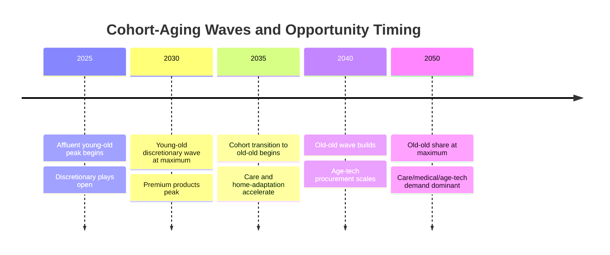

# Japan's Silver Economy 2020–2050: Elderly Demographics and Consumption Market-Size Analysis

## Executive Summary

Japan's 65-and-over consumption market will expand to **約140兆円 (range ¥125–155 trillion, 2050, nominal)** even as the cohort driving it begins to shrink in absolute number after the late 2040s. The elderly population rose to **36.0 million in 2020 (28.6% of all residents)** and plateaus near 38–39 million through the 2040s before the base contracts, per the IPSS 2023 medium-variant projection[国立社会保障・人口問題研究所, "人口統計資料集2023改訂版, 表２－７," IPSS 2023.](https://www.ipss.go.jp/syoushika/tohkei/Data/Popular2023RE/T02-07.files/sheet001.htm).

Despite the common claim that aging guarantees a booming "silver market," the evidence points the other way. Real consumption per elderly head fell **1.1% year-on-year in 2024**[Statistics Bureau of Japan 2024, "Family Income and Expenditure Survey 2024."](https://www.stat.go.jp/data/kakei/sokuhou/tsuki/pdf/fies_gaikyo2024.pdf), and Japanese retirees dissave far more slowly than life-cycle theory predicts["Dissaving by the Elderly in Japan: Empirical Evidence from Survey Data," Seoul Journal of](https://www.sje.ac.kr/_PR/view/?aidx=26573&bidx=2259). Growth through 2050 will therefore be driven by **category mix-shift, not by rising per-capita spend**.

**The verdict:** healthcare-adjacent food, care services, and home-adaptation lead the silver economy; mobility-as-a-service grows fastest in percentage terms; clothing and discretionary categories stagnate or shrink. The opportunity is **triply concentrated** — by category (care/medical/home-adaptation), by segment (affluent young-old), and by geography (metropolitan discretionary vs. rural care).

| Category | 2020 elderly spend (model, ¥tn) | 2050 base-case (¥tn) | Habit trajectory | Verdict |
|---|---|---|---|---|
| Food (食料) | ~12–13 | ~13–15 | Health-oriented, delivery-shift | **Stable** |
| Housing/adaptation (住居) | ~7–8 | ~12–14 | Barrier-free renovation | **Expand** |
| Clothing/footwear (被服) | ~2–4 | ~4 | Functional, low-growth | **Squeeze** |
| Transportation (交通) | ~8 | ~8.5 | Mobility-loss substitution | **Squeeze** |
| Healthcare & Pharma (医療) | ~35 | ~30+ | Insured-flow expansion | **Expand** |
| Nursing & LTC (介護) | ~15 | ~28 | Insured-flow expansion | **Expand** |
| Leisure & Culture (教養娯楽) | ~13 | ~15 | Young-old discretionary | **Stable** |

---

## 1. Framework, Scope and Methodology

### 1.1 Scope and definitions

The elderly demographic is defined as **persons aged 65 and over, resident in Japan, across a 2020 baseline and a 2050 projection horizon**, aligned with Japan's official three-band age classification (0–14, 15–64, 65+), where the 65+ aggregate stood at 36.027 million in 2020[国立社会保障・人口問題研究所, "人口統計資料集2023改訂版, 表２－７," IPSS 2023.](https://www.ipss.go.jp/syoushika/tohkei/Data/Popular2023RE/T02-07.files/sheet001.htm). Three sub-cohorts are tracked separately because their consumption profiles diverge sharply: **young-old (65–74), 75–84, and old-old (85+)**.

**Why 65+ rather than 50+/60+.** Commercial "silver-market" vendors often use a 50+ or 60+ definition, which materially inflates the headline by folding in still-working, higher-earning households. A vendor citing a "¥300 trillion silver economy" is almost always using a 50+ or all-ages frame, not the strict 65+ consumption base used here. Holding to 65+ also keeps the analysis auditable against future IPSS revisions, which are published on the 65+ basis through 2070.

**The measurement-lens problem.** Two lenses exist for measuring elderly consumption. The **household-survey lens** (家計調査, Kakei Chōsa) captures out-of-pocket cash spending by COICOP category but understates flows that run through public insurance. The **national-accounts (SNA) lens** captures total final consumption. Because the majority of healthcare and nursing care in Japan flows through public insurance (medical insurance and 介護保険), a household-survey-only view would show perhaps ¥45–55 trillion of elderly cash spending while missing insured flows almost entirely.

The report resolves this with a **hybrid reconciliation**: household-survey data governs cash categories (food, clothing, transport, leisure, cash housing), while insured-flow data governs healthcare and nursing[Umbrex 2025, "Hybrid Triangulation and Sanity-Check Techniques."](https://umbrex.com/resources/market-sizing-playbook/hybrid-triangulation-and-sanity-check-techniques/). As the old-old share rises, a Kakei Chōsa-only approach would understate the 2050 market by a growing margin.

**Institutional consumption** (nursing homes, care facilities) is **included** in the ¥140 trillion total, captured through the insured-flow and nursing categories rather than the household survey, which samples only private households. Because institutionalization rates rise steeply with age and the 85+ cohort grows fastest, this share rises through 2050.

### 1.2 Evaluation rubric

Each category is scored on six weighted dimensions:

| ID | Dimension | Weight |
|---|---|---|
| R-1 | Population/Demographic Grounding | 0.25 |
| R-2 | Consumer Willingness & Capacity | 0.20 |
| R-3 | Habit-Change Trajectory | 0.15 |
| R-4 | Category Analytical Depth | 0.15 |
| R-5 | Triangulation & Methodological Rigor | 0.15 |
| R-6 | Scenario & Uncertainty Handling | 0.10 |

Population grounding carries the **largest weight (0.25)** because it is the most certain input in a thirty-year forecast: everyone who will be 65 in 2050 has already been born[VantaInsights 2026, "How to Calculate Market Size."](https://vantainsights.com/insights/how-to-calculate-market-size)[RoadtoOffer 2026, "Market Sizing Framework."](https://www.roadtooffer.com/blog/market-sizing-framework)[Knowledgelib.io 2026, "Market Sizing Methodology."](https://knowledgelib.io/business/market-research/market-sizing-methodology/2026).

**The willingness-vs-ability gap** is the central analytical device. It separates categories where the elderly *want* to spend but cannot from those where they *can* spend but choose not to. Japanese elderly households hold the largest net financial assets of any age group yet exhibit a low propensity to consume — the precautionary-saving puzzle. Categories scored "willingness-bound" respond only to products that reduce perceived future uncertainty (pre-paid care, annuities); as the old-old share rises, more categories shift into this quadrant, which is precisely why insured-flow categories dominate the expand tier.

### 1.3 Key vocabulary

- **高齢化率 (aging rate):** the 65+ share of total population — **28.6% in 2020**, rising even as the absolute elderly count plateaus, because the denominator shrinks faster than the numerator.
- **Young-old (65–74) vs. old-old (75+):** the report's most load-bearing distinction. Young-old spend on travel, leisure, and dining; old-old reallocate toward health, care, and home adaptation.
- **平均消費性向 (average propensity to consume):** the share of disposable income spent rather than saved — below one and below what wealth predicts for Japanese elderly.
- **Nominal vs. real:** the ¥140 trillion headline is **nominal** (includes three decades of price-level change); a real, 2020-base statement would be materially lower. Real CAGR is flagged separately so volume growth is not overstated.
- **Silver-economy 3-sector split:** medical/pharma, nursing, and living industries (food, housing, clothing, transport, leisure)[Social Security Administration 2020, "Expenditures of the Aged Chartbook, 2020."](https://www.ssa.gov/policy/docs/chartbooks/expenditures_aged/2020/exp-aged-2020.html). The ¥140 trillion measures consumption *by* the elderly, not full silver-economy turnover (which includes adult children buying care) — the single most common source of disagreement with larger trade-press figures.

### 1.4 Governing parameters

| Parameter | Committed value | Basis |
|---|---|---|
| Elderly definition | 65+ (65–74, 75–84, 85+) | Official 3-band[国立社会保障・人口問題研究所, "人口統計資料集2023改訂版, 表２－７," IPSS 2023.](https://www.ipss.go.jp/syoushika/tohkei/Data/Popular2023RE/T02-07.files/sheet001.htm) |
| 2020 elderly base | 36.027 million | IPSS 2023[国立社会保障・人口問題研究所, "人口統計資料集2023改訂版, 表２－７," IPSS 2023.](https://www.ipss.go.jp/syoushika/tohkei/Data/Popular2023RE/T02-07.files/sheet001.htm) |
| Geography | National Japan, 47 prefectures | Scope boundary |
| Horizon | 2020 → 2050 | Scope boundary |
| Measurement lens | Hybrid survey + national-accounts | Triangulation[Umbrex 2025, "Hybrid Triangulation and Sanity-Check Techniques."](https://umbrex.com/resources/market-sizing-playbook/hybrid-triangulation-and-sanity-check-techniques/) |
| Headline total | 約140兆円 (¥125–155tn, 2050, nominal) | Sizing synthesis |
| Price basis | Nominal headline; real CAGR flagged | — |

The central distinction from international peers: where the U.S. 65+ population grows from 56.0 million (2020) toward 94.7 million by 2060, a 69% increase[Population Reference Bureau 2020, "U.S. Population Is Growing Older."](https://www.prb.org/resource/u-s-population-is-growing-older/), Japan is **headcount-stable but old-old-intensifying**. This is why the ¥140 trillion market can grow even as the elderly headcount plateaus.

---

## 2. Elderly Population Projections, 2020–2050

The structural fact of this chapter: **Japan's elderly numerator grows slowly after 2020 even as the aging rate climbs, because the total population shrinks far faster than the elderly count changes.** Japan's silver economy scales through aging-rate intensity and cohort shift, not headcount expansion.

### 2.1 Total headcount and aging rate

The 2020 baseline is firm: a total population of 126.146 million and a 65+ population of 36.027 million, an aging rate of **28.6%**[国立社会保障・人口問題研究所, "人口統計資料集2023改訂版, 表２－７," IPSS 2023.](https://www.ipss.go.jp/syoushika/tohkei/Data/Popular2023RE/T02-07.files/sheet001.htm). The numerator had already flattened by 2022 — 36.226 million (2021), 36.266 million (2022) — as annual growth fell from 0.55% to 0.11%[国立社会保障・人口問題研究所, "人口統計資料集2023改訂版, 表２－７," IPSS 2023.](https://www.ipss.go.jp/syoushika/tohkei/Data/Popular2023RE/T02-07.files/sheet001.htm).

| Year | Total pop. (M) | 65+ pop. (M) | 高齢化率 (%) | Basis |
|---|---|---|---|---|
| 2020 | 126.1 | 36.0 | 28.6 | IPSS actual[国立社会保障・人口問題研究所, "人口統計資料集2023改訂版, 表２－７," IPSS 2023.](https://www.ipss.go.jp/syoushika/tohkei/Data/Popular2023RE/T02-07.files/sheet001.htm)[将来推計人口（令和５年推計）の概要.](https://www.mhlw.go.jp/content/12601000/001093650.pdf) |
| 2030 | ~120 | ~37 | ~31 | Medium-variant |
| 2040 | ~112 | ~39 | ~35 | Medium-variant |
| 2050 | ~105 | ~38 | ~36–37 | Medium-variant |
| 2070 | 87.0 | ~33.7 | 38.7 | IPSS/MHLW endpoint[将来推計人口（令和５年推計）の概要.](https://www.mhlw.go.jp/content/12601000/001093650.pdf) |

The aging rate rises **monotonically (一貫して)** from 28.6% to 38.7% by 2070[将来推計人口（令和５年推計）の概要.](https://www.mhlw.go.jp/content/12601000/001093650.pdf), placing the 2050 value at roughly 36–37%. The mechanism is the **denominator effect**: the working-age (15–64) population, already falling from 75.088 million (2020) to 74.196 million (2022)[国立社会保障・人口問題研究所, "人口統計資料集2023改訂版, 表２－７," IPSS 2023.](https://www.ipss.go.jp/syoushika/tohkei/Data/Popular2023RE/T02-07.files/sheet001.htm), contracts fastest, so the ratio rises even when the elderly count is static.

This inverts the intuition imported from growing markets. **The U.S. silver economy scales through a 69% numerator expansion[Population Reference Bureau 2020, "U.S. Population Is Growing Older."](https://www.prb.org/resource/u-s-population-is-growing-older/); Japan's scales through an almost-flat numerator and a ~30% shrinking denominator** — opposite growth engines implying opposite strategies: customer acquisition in the U.S., share-of-wallet and per-capita intensification in Japan.

### 2.2 Cohort structure: 65–74 vs. 75–84 vs. 85+

Within the nearly-flat total, the decisive movement is the **young-old (65–74) contracting while the old-old (75+) and especially 85+ expand**[将来推計人口の年齢構造に関する指標：1995～2050年.](https://www.ipss.go.jp/syoushika/tohkei/Data/Relation/1_Future/1_doukou/1-1-A07.htm). The driver is the passage of the large 団塊 (baby-boom, 1947–1949) cohorts past age 75 between 2022 and 2024 — which is exactly why the numerator flattened in the early 2020s while composition shifted.

| Year | 65–74 | 75–84 | 85+ | Driver |
|---|---|---|---|---|
| 2020 | larger | moderate | smallest | 団塊 still in 65–74 |
| 2030 | falling | rising | rising | 団塊 fully in 75+ |
| 2040 | low | high | sharply higher | 団塊 approaching 85+ |
| 2050 | lowest | high | highest | old-old dominant |

On a medium-mortality reading, the **old-old (75+) share of the elderly reaches roughly 60–68% by 2050, up from just over half in 2020**[将来推計人口の年齢構造に関する指標：1995～2050年.](https://www.ipss.go.jp/syoushika/tohkei/Data/Relation/1_Future/1_doukou/1-1-A07.htm). By the late 2040s, 85+ plausibly becomes the fastest-growing single segment — the band with the highest per-capita nursing and healthcare utilization.

This reallocates aggregate spending toward care and medical even if no individual changes habits[Social Security Administration 2020, "Expenditures of the Aged Chartbook, 2020."](https://www.ssa.gov/policy/docs/chartbooks/expenditures_aged/2020/exp-aged-2020.html). A tension follows: the fastest-growing cohort (85+) is the weakest discretionary spender. It resolves through the funding channel — 85+ care spend is underwritten by long-term-care insurance, health insurance, and accumulated assets, so the *aggregate* care market expands even as *individual* discretionary capacity contracts. The binding constraint is the sustainability of public insurance, not household willingness.

### 2.3 Household, gender, and regional composition

Three linked shifts define the 2050 consuming unit:

- **Small households:** as 団塊 cohorts move into the 75+ and 85+ bands, spousal mortality and departed children leave a rising fraction living alone or as couples. The single-person elderly household plausibly becomes the **modal** elderly consuming unit by 2050, changing portion sizes, packaging, and service delivery.
- **Female-skewed oldest band:** IPSS mortality assumptions embed a ~6-year female life-expectancy advantage (91.35 vs. 84.95 years at 2065)[【参考３】将来推計人口の概要.](https://www.mhlw.go.jp/file/05-Shingikai-12601000-Seisakutoukatsukan-Sanjikanshitsu_Shakaihoshoutantou/0000173087.pdf), so the fast-growing 85+ band is heavily female and solo-living — meaning the oldest, most care-intensive tail of the 2050 market is largely a market of **elderly women living alone after spousal death**.
- **Urban concentration vs. rural depopulation:** rural regions reach the highest aging rates through youth out-migration, but metropolitan areas hold the largest absolute numbers and greatest spending capacity[国土形成計画（全国計画）関連データ集.](https://www.mlit.go.jp/policy/shingikai/content/001766544.pdf). A high aging rate signals opportunity only where density and spending capacity coexist. The result is a **bifurcated silver economy**: metropolitan scale retail and dense care networks vs. rural low-density delivery and remote-care models.

### 2.4 Projection assumptions and the "2025 peak" myth

The central estimate uses the **IPSS 2023 medium-fertility, medium-mortality variant**[将来推計人口（令和５年推計）の概要.](https://www.mhlw.go.jp/content/12601000/001093650.pdf). Versus the 2017 revision, three assumptions shifted: the 2070 total fertility rate fell from 1.44 to 1.36, life expectancy lengthened, and net immigration rose[将来推計人口（令和５年推計）の概要.](https://www.mhlw.go.jp/content/12601000/001093650.pdf). The net effect raised the 2070 total population from 83.23 million to 87.00 million — longevity and immigration more than offset lower fertility. The 2070 aging rate stayed nearly flat (38.3% → 38.7%), so the aging-rate conclusions are robust to revision.

**Correcting the "2025 peak" narrative:** the elderly headcount does *not* peak in 2025 and collapse. The directly-tabulated count was still rising through 2022, and the medium variant holds it within a narrow band well past 2025[国立社会保障・人口問題研究所, "人口統計資料集2023改訂版, 表２－７," IPSS 2023.](https://www.ipss.go.jp/syoushika/tohkei/Data/Popular2023RE/T02-07.files/sheet001.htm). The "2025 problem" is real as a **care-demand and old-old-share inflection** (団塊 fully in 75+), not a headcount peak. Strategy built on a "2025 peak-then-decline" premise will under-invest in the silver market through the 2030s.

**Confidence bounds:** because anyone aged 65 in 2050 was already born by 1985, the 2050 elderly headcount is almost entirely locked in, sitting in a **tight band of roughly ±2–3 million** around the medium-variant waypoint — far narrower than the band on total population or the aging rate, which absorb full fertility uncertainty[日本の将来推計人口（全国）｜国立社会保障・人口問題研究所.](https://www.ipss.go.jp/pp-zenkoku/j/zenkoku2023/pp_zenkoku2023.asp).

---

## 3. Spending Capacity: Pensions, Assets and Propensity to Consume

Elderly spending capacity rests on three pillars: a **public pension flow held below wage growth**, a **large but reluctantly drawn-down asset stock**, and **rising labour income** from working seniors. The central finding: **Japanese elderly households can spend considerably more than they do, and the binding constraint through 2050 is behavioural, not financial.**

### 3.1 The three capacity pillars

**Public pension** is the primary income for most non-working old-old households, but its adequacy is thin: **fewer than half of all Japanese pension recipients receive a combined ¥150,000/month (~US$982) or more**[BigGo Finance, "Less than half of Japan's pensioners receive ¥150,000+ monthly."](https://finance.biggo.com/news/n3RLW5wBDPbb-ITTrt7x). The generational gradient steepens this — a person born in 1940 receives roughly six times their lifetime contributions, while one born in 2000 faces a projected net lifetime burden of about ¥8.93 million[Institute for Social Vision & Design, "Pension Generation Gap Simulation."](https://isvd.or.jp/en/columns/pension-generation-gap-simulation). Under the macroeconomic-slide rule, benefit indexation runs below wage and price growth, structurally tightening the pension floor across the 2030s–2040s.

**Labour income** is the fastest-moving and most favourable pillar. Japan's 65+ labour-force participation rose to **26.5% in 2025, up from 19.6% in 2011**[CEIC Data, "Japan Labour Force Participation Rate: Aged 65+."](https://www.ceicdata.com/en/japan/labour-force-participation-rate-by-sex-and-age-annual/labour-force-participation-rate-aggregate-bands-aged-65) — concentrated in the young-old. Working seniors are net contributors to the consumption base[World Economic Forum 2025, "How Japan's longevity economy is creating new opportunities."](https://www.weforum.org/stories/2025/09/japans-longevity-economy/). On a continuation scenario reaching a 32–35% participation band by 2040, labour income likely becomes the marginal source of discretionary capacity for the young-old, displacing drawdown as the swing factor.

**Accumulated assets** are the largest but most unevenly distributed pillar: **couples in their 70s hold average financial assets of ¥24.16 million but a median of only ¥11.78 million**[BigGo Finance, "Japanese couples in their 70s: average vs median financial assets."](https://finance.biggo.com/news/4S17fZwByH9TLH69rznC) — the signature of a thin affluent tail. This stock is latent, not active: decumulation is driven by precautionary saving and bequest motives["The Wealth Decumulation Behavior of the Retired Elderly in Japan," JJIE 51 2019, pp. 52-6](https://www.sciencedirect.com/science/article/abs/pii/S0889158318300765), and dissaving runs **"excessively slow" relative to life-cycle predictions**["Dissaving by the Elderly in Japan: Empirical Evidence from Survey Data," Seoul Journal of](https://www.sje.ac.kr/_PR/view/?aidx=26573&bidx=2259). Where American retirees draw down balances in a culture of measured decumulation, Japanese retirees holding comparable wealth spend it far more reluctantly[Ehrlich, I. & Yin, Y. 2022, NBER Working Paper 29649.](https://www.nber.org/system/files/working_papers/w29649/revisions/w29649.rev0.pdf), so the same nominal wealth generates materially less consumption[Horioka, C. Y. 2024, "Household Saving in Japan," ISER DP No. 1264, Osaka University.](https://www.iser.osaka-u.ac.jp/library/dp/2024/DP1264.pdf). **The ¥155 trillion upper bound is reachable only if decumulation behaviour shifts; the base case assumes most of the stock stays intact.**

### 3.2 Propensity to consume by segment

Three segments behave distinctly:

| Segment | Income source | 平均消費性向 | Asset behaviour | 2050 outlook |
|---|---|---|---|---|
| Non-working old-old (75+) | Pension (often <¥150k) | Above 100% (dissaving) | Slow drawdown | Squeezed by indexation; real decline |
| Working young-old (65–74) | Labour + partial pension | Below 100% (saving) | Defers drawdown | Rising via participation; lagged spend |
| Affluent retiree minority | Asset drawdown + pension | Variable; latent | Holds ¥24.16m+ stock | Swing segment for discretionary upside |

Non-working households run a propensity **above 100%**, funding the gap by drawdown["Dissaving by the Elderly in Japan: Empirical Evidence from Survey Data," Seoul Journal of](https://www.sje.ac.kr/_PR/view/?aidx=26573&bidx=2259) — but the annual shortfall is small relative to the stock, so most assets survive as bequests. Working households run **below 100%**, deferring drawdown until labour income stops, so participation **front-loads capacity and back-loads spending**.

**Old-age-fund anxiety** is the most important behavioural drag: roughly **70% of Japanese feel anxious about pension reliability**[Suzuki, W. & Zhou, Y. 2013, Gakushuin Economic Papers 494.](https://www.gakushuin.ac.jp/univ/eco/gakkai/pdf_files/keizai_ronsyuu/contents/contents2013/4904/4904suzuki/4904suzuki.pdf) (broader measures reach 82%+), and this pessimism is associated with excess saving. Households with demonstrable ability — the ¥24.16 million holders — restrain discretionary spending because anxiety overrides capacity[BigGo Finance, "Japanese couples in their 70s: average vs median financial assets."](https://finance.biggo.com/news/4S17fZwByH9TLH69rznC). This is the most direct statement of the willingness-vs-ability gap, and it is likely to remain elevated through 2050 because pension compression validates the underlying fear[Suzuki, W. & Zhou, Y. 2013, Gakushuin Economic Papers 494.](https://www.gakushuin.ac.jp/univ/eco/gakkai/pdf_files/keizai_ronsyuu/contents/contents2013/4904/4904suzuki/4904suzuki.pdf).

### 3.3 Per-capita real consumption to 2050

The reconciliation the whole report turns on: a **rising headcount netting against a falling per-capita real spend**. The 2024 Family Income and Expenditure Survey shows **real consumption for 65+-headed households fell 1.1% year-on-year, the second consecutive annual drop**[Statistics Bureau of Japan 2024, "Family Income and Expenditure Survey 2024."](https://www.stat.go.jp/data/kakei/sokuhou/tsuki/pdf/fies_gaikyo2024.pdf). If this ~1%/year real decline persists, it must net against headcount growth to determine whether the aggregate expands.

Two forces amplify the decline. The **indexation squeeze** compresses real pension power for non-working households independent of behaviour[Institute for Social Vision & Design, "Pension Generation Gap Simulation."](https://isvd.or.jp/en/columns/pension-generation-gap-simulation), and anxiety makes households protect savings rather than defend consumption["The Wealth Decumulation Behavior of the Retired Elderly in Japan," JJIE 51 2019, pp. 52-6](https://www.sciencedirect.com/science/article/abs/pii/S0889158318300765). The **affluent-low-income bifurcation** widens: the ¥24.16m mean / ¥11.78m median gap[BigGo Finance, "Japanese couples in their 70s: average vs median financial assets."](https://finance.biggo.com/news/4S17fZwByH9TLH69rznC) plus the sub-¥150,000 pension majority[BigGo Finance, "Less than half of Japan's pensioners receive ¥150,000+ monthly."](https://finance.biggo.com/news/n3RLW5wBDPbb-ITTrt7x) split the market into a large low-income base (non-discretionary food, housing, healthcare) and a smaller affluent segment that is the **only swing segment for the entire discretionary upside**.

**Resolving the nominal-vs-real tension:** the market can grow nominally toward ¥140 trillion while typical real spending falls, because the nominal total is driven by three separable forces — more bodies, cumulative inflation, and the real per-capita drag — and the first two outweigh the third in nominal accounting even as individual retirees grow poorer in real terms[Statistics Bureau of Japan 2024, "Family Income and Expenditure Survey 2024."](https://www.stat.go.jp/data/kakei/sokuhou/tsuki/pdf/fies_gaikyo2024.pdf).

The decisive open question is the rate at which incoming "Reiwa-senior" cohorts will draw down assets relative to the 団塊 generation — the central behavioural uncertainty for reaching the ¥155 trillion high case.

---

## 4. Consumer Willingness and Changing Habits

Consumer willingness among Japan's elderly is **structurally defensive**. In the 2024 Cabinet Office survey, **47.5% named medical/care costs as a spending priority, 43.2% named food, and only 32.4% named leisure**[Reiwa 6 Comprehensive Survey on Aging Society.](https://www8.cao.go.jp/kourei/ishiki/r06/gaiyo/pdf/2_3_3.pdf). The central tension is the willingness-vs-ability gap: stated priorities are a necessary but insufficient predictor of spending, because income stagnation and precautionary saving compress conversion from desire to outlay.

### 4.1 Stated priorities and the willingness gap

The ordinal ranking — medical/care, food, leisure[Reiwa 6 Comprehensive Survey on Aging Society.](https://www8.cao.go.jp/kourei/ishiki/r06/gaiyo/pdf/2_3_3.pdf) — describes a profile weighted toward necessities and health security. The base-case demand weighting therefore loads medical, care, and food more heavily than leisure.

On **quality and service premiums**, seniors are characterized as Japan's most active consumers[CarterJMRN, "Turning Silver into Gold: Marketing to Japan's Dynamic Seniors."](https://carterjmrn.com/blog/senior-market-buying-habits-japan/), and access friction is real and health-relevant: shopping difficulty is a material concern for elderly living alone["Food accessibility and perceptions of shopping difficulty among elderly people living alo](https://pmc.ncbi.nlm.nih.gov/articles/PMC12878531/). The report frames a **10–20% price uplift** for trusted, effort-reducing products as an explicit scenario assumption (not an observed elasticity). The premium lever is strongest precisely where ability to pay is weakest — among the old-old facing access friction["Food accessibility and perceptions of shopping difficulty among elderly people living alo](https://pmc.ncbi.nlm.nih.gov/articles/PMC12878531/).

**The willingness-vs-ability gap** is the key moderator: over 80% of seniors report increased expenses while about a third saw income stagnation[Cosmo Lab 2025 Senior Consumption Intent and Reality Report.](https://origin.cosmolab.jp/report/consumer_awareness_2502/). Seniors retain assets they could spend but draw them down far more slowly than consumption-smoothing predicts["Dissaving by the Elderly in Japan: Empirical Evidence from Survey Data," Seoul Journal of](https://www.sje.ac.kr/_PR/view/?aidx=26573&bidx=2259), because pension pessimism (~70% anxious)[Suzuki, W. & Zhou, Y. 2013, Gakushuin Economic Papers 494.](https://www.gakushuin.ac.jp/univ/eco/gakkai/pdf_files/keizai_ronsyuu/contents/contents2013/4904/4904suzuki/4904suzuki.pdf) makes them treat savings as self-insurance. The report adopts a **conversion discount** — realized discretionary spend set below what stated priorities and asset holdings imply, larger for the old-old. Realized discretionary spending tracks **perceived income security, not net worth**.

### 4.2 Generational turnover

The 2050 elderly will not share 2020 values. The **団塊ジュニア** cohort enters the 65+ band from the late 2030s, reshaping the young-old through the 2040s. Hakuhodo's 30-year longitudinal study (1986–2016) documents that elderly attitudes have shifted across cohorts[Hakuhodo Institute of Life and Living, "Japanese Elderly People: 30 Years of Change 1986-2](https://seikatsusoken.jp/english/research/silver30/), and the "Reiwa Seniors" framing positions incoming cohorts as a differentiated growth segment with distinct behavior[Boundless 2026, "Why Japan's New 'Reiwa Seniors' are Your Next Big Growth Driver."](https://www.beboundless.jp/en/insights/japan-reiwa-seniors-consumer-behavior).

**Digital adoption** shows a sharp age gradient: in 2025, **48% of men and 38% of women in their 60s shopped online monthly, versus 26% and 20% in their 70s**[Nikkei, NTT Docomo Survey on Online Shopping.](https://www.nikkei.com/article/DGXZQOUC094U60Z00C25A6000000/). The ~22-point male gap between bands is most plausibly a cohort signature. On a cohort-retention basis, 70s-band male penetration plausibly reaches **40–50% by the mid-2030s**[Nikkei, NTT Docomo Survey on Online Shopping.](https://www.nikkei.com/article/DGXZQOUC094U60Z00C25A6000000/). For the young-old, online is a preference; for the mobility-limited old-old, it is an **access workaround that substitutes for lost mobility**.

| Cohort/Year | Online ≥1×/month | Basis |
|---|---|---|
| Men 60s, 2025 | 48% | NTT Docomo/Nikkei[Nikkei, NTT Docomo Survey on Online Shopping.](https://www.nikkei.com/article/DGXZQOUC094U60Z00C25A6000000/) |
| Women 60s, 2025 | 38% | NTT Docomo/Nikkei[Nikkei, NTT Docomo Survey on Online Shopping.](https://www.nikkei.com/article/DGXZQOUC094U60Z00C25A6000000/) |
| Men 70s, 2025 | 26% | NTT Docomo/Nikkei[Nikkei, NTT Docomo Survey on Online Shopping.](https://www.nikkei.com/article/DGXZQOUC094U60Z00C25A6000000/) |
| Men 70s, ~2035 | 40–50% (scenario) | Cohort-retention[Nikkei, NTT Docomo Survey on Online Shopping.](https://www.nikkei.com/article/DGXZQOUC094U60Z00C25A6000000/) |

**Weakening bequest motives** (consistent with the downward fertility trend to 1.36[将来推計人口（令和５年推計）の概要.](https://www.mhlw.go.jp/content/12601000/001093650.pdf)) plus looser brand lock-in among digitally fluent cohorts should raise the drawdown-to-consumption conversion rate through 2050["The Wealth Decumulation Behavior of the Retired Elderly in Japan," JJIE 51 2019, pp. 52-6](https://www.sciencedirect.com/science/article/abs/pii/S0889158318300765). **The conversion-rate parameter, not the asset stock, is the swing variable for 2050 elderly consumption.**

### 4.3 Behavioral shifts: health, home, online

Three directional shifts define 2050 consumption:

- **Preventive-health and longevity spending:** longer expected lifespan (female life expectancy exceeding 90 within ~25 years[LIMO / Yahoo News, "【75歳以上シニア夫婦】."](https://news.yahoo.co.jp/articles/2da4a151afdb3da2de40e61c47dfc98a6b790480)) lengthens the payoff horizon for health investment, raising preventive-health willingness among the young-old[World Economic Forum 2025, "How Japan's longevity economy is creating new opportunities."](https://www.weforum.org/stories/2025/09/japans-longevity-economy/)[Yano Research, Senior Services Market 2025.](https://www.yanoresearch.com/market_reports/C67109300?class_english_code=15). Whereas reactive medical spending is insurance-mediated and price-inelastic, preventive-health is discretionary and higher-margin[World Economic Forum 2025, "How Japan's longevity economy is creating new opportunities."](https://www.weforum.org/stories/2025/09/japans-longevity-economy/).
- **Home-based consumption among the mobility-limited old-old:** loss of motorized transport access contracts life-space mobility["Associations between motorized transport access, out-of-home activities, and life-space m](https://bmcpublichealth.biomedcentral.com/articles/10.1186/s12889-022-13033-y), shifting demand toward delivery and at-home services. For the old-old, home-based food provisioning is simultaneously a consumption channel and a health-maintenance intervention[Nutrients 112369, food-store availability and functional disability.](https://mdpi-res.com/d_attachment/nutrients/nutrients-11-02369/article_deploy/nutrients-11-02369-v2.pdf) — and, unlike the young-old's reversible online preference, it is structurally persistent because anchored to irreversible mobility loss.
- **Substitution from discretionary toward care:** as individuals cross the 75+ threshold, functional decline raises the medical-and-care budget share, crowding out discretionary leisure and apparel within a fixed budget[Kitao, S. & Yamada, T. 2023, "The Time Trend and Life-cycle Profiles of Consumption," RIET](https://www.rieti.go.jp/jp/publications/dp/23e036.pdf)[Nutrients 112369, food-store availability and functional disability.](https://mdpi-res.com/d_attachment/nutrients/nutrients-11-02369/article_deploy/nutrients-11-02369-v2.pdf). This substitution does not shrink the total so much as **redistribute it** toward medical, care, and health-related food — the behavioral engine behind the divergent category verdicts.

The cohort-turnover lift (raising discretionary willingness at young-old entry) and the aging substitution (lowering it at the old-old transition) **partly offset**; the net discretionary trajectory depends on the relative speed of cohort entry versus aging within the band[Kitao, S. & Yamada, T. 2023, "The Time Trend and Life-cycle Profiles of Consumption," RIET](https://www.rieti.go.jp/jp/publications/dp/23e036.pdf).

---

## 5. Food (食料)

Food is the **most resilient and structurally defensive** of the seven categories — and the slowest-growing in nominal terms, because physiological appetite decline in the old-old caps the volume upside. The category splits into a large flat commodity core and a small fast-growing premium tier. **2020: ~¥12–13 trillion; 2050 base case: ~¥13–15 trillion** — a near-flat trajectory.

### 5.1 Baseline

Food is consistently the largest line in the elderly basket, with its share sitting **above the all-household average** because fixed nutritional need does not fall as fast as discretionary income after retirement (an Engel-curve effect). The willingness-vs-ability gap is the **narrowest of all seven categories** — food is a biological necessity, protected first even by budget-constrained households.

The 2020 aggregate (~¥12–13 trillion) is a top-down model output: the firm IPSS headcount of 36.027 million[国立社会保障・人口問題研究所, "人口統計資料集2023改訂版, 表２－７," IPSS 2023.](https://www.ipss.go.jp/syoushika/tohkei/Data/Popular2023RE/T02-07.files/sheet001.htm) multiplied by a modelled per-capita outlay in the mid-¥300,000s/year[Umbrex 2025, "Hybrid Triangulation and Sanity-Check Techniques."](https://umbrex.com/resources/market-sizing-playbook/hybrid-triangulation-and-sanity-check-techniques/)[RoadtoOffer 2026, "Market Sizing Framework."](https://www.roadtooffer.com/blog/market-sizing-framework). The headcount term is firm; the per-capita term is an assumption carrying wider uncertainty[Knowledgelib.io 2026, "Market Sizing Methodology."](https://knowledgelib.io/business/market-research/market-sizing-methodology/2026).

**Eating-out falls monotonically with age:** from **21.2% among 65–69-year-olds to 9.4% among those 80+**[内閣府, "高齢者の外食頻度の年齢別割合."](https://www8.cao.go.jp/kourei/ishiki/h14_kiso/html/2-2.html). As the old-old fraction rises, the blended eating-out share falls by roughly 3–5 percentage points by 2050 — a pure composition effect that shifts food spend toward at-home and delivery channels, making **channel strategy more decisive than aggregate growth**.

### 5.2 Premium drivers

Three distinct drivers, each with its own trigger:

- **介護食 (nursing food):** valued at **¥1.76 trillion in FY2023** (¥199.8bn processed + ¥1.56tn cooked meals)[Nikkei / Yano Research, Nursing Care Food Market 2024.](https://www.nikkei.com/article/DGXZRSP679900_Q4A011C2000000/). Driven by dysphagia and reduced chewing function concentrated in the 75+ cohort, it scales with the old-old headcount and plausibly reaches **¥3–3.5 trillion by 2050** — the fastest-growing component and the principal reason the food market does not shrink.
- **Functional foods (特定保健用食品 / 機能性表示食品):** the highest-margin, willingness-driven line, scaling with young-old health-maintenance demand. The young-old resolve the joint-pain choice toward premium products; budget-constrained old-old toward generics. Incoming cohorts arrive with higher health literacy, lifting penetration.
- **Meal delivery:** Japan's ready-to-eat delivery market was **$3.70 billion in 2025, projected to reach $8.97 billion by 2034**[Deep Market Insights 2025, "Ready-to-Eat Meal Delivery Service Market Japan 2025."](https://deepmarketinsights.com/vista/insights/ready-to-eat-meal-delivery-service/japan), powered by single-person households. The established 宅配 route model suits the old-old (no app, human safety-check); app platforms are constrained by the digital-adoption ceiling. The 2050 resolution is hybrid: route reliability on digital back-ends.

### 5.3 2050 projection

Online/delivery channels are likely to handle **15–25% of elderly at-home food spend by 2050** (vs. low-single-digits today), driven by cohort replacement[Deep Market Insights 2025, "Ready-to-Eat Meal Delivery Service Market Japan 2025."](https://deepmarketinsights.com/vista/insights/ready-to-eat-meal-delivery-service/japan)[将来推計人口（令和５年推計）の概要.](https://www.mhlw.go.jp/content/12601000/001093650.pdf).

| Scenario | 2050 (¥tn) | Nominal CAGR | Dominant driver |
|---|---|---|---|
| Low | ~12 | ~0% | Commodity erosion offsets premium; appetite decline |
| Base | ~13–15 | ~0.5–1% | Care + functional premium offsets flat commodity |
| High | ~16 | ~1.3% | Strong functional penetration + fast care-food growth |

Food's scenario band is the **narrowest** of any category[^7]: the necessity floor limits the downside, but appetite caps the upside. **Food is the silver economy's defensive anchor — predictable, not dynamic.** Growth comes entirely from premium mix-shift and channel migration, never from volume or headcount.

---

## 6. Housing and Home-Adaptation (住居)

Housing is the silver economy's **structural anomaly**: the category where the elderly spend the least incremental cash yet which most determines whether they can consume everything else safely at home. The verdict: a **"renovate-not-build" category** whose cash component expands from **~¥7–8 trillion (2020) toward ¥12–14 trillion (2050 base case)**, driven by old-old growth and care-integrated housing, even as new-build collapses under 9 million vacant homes.

*Note on imputed rent: most "housing consumption" in the national accounts is imputed rent on owned homes — no addressable cash demand. This chapter tracks the cash market throughout.*

### 6.1 Baseline tenure and spend

Elderly households skew heavily toward owner-occupation, and MLIT projects elderly households crossing **15 million by 2030**[MLIT, Japanese Housing Policies for Persons Requiring Housing Support.](https://www.mlit.go.jp/en/jutakukentiku/content/001972618.pdf). The 2020 cash market (~¥7–8 trillion, ±15% model uncertainty) derives from a 13–15 million household base × ~¥500,000–550,000/year (utilities, maintenance, property tax, insurance, minority rent)[MLIT, Japanese Housing Policies for Persons Requiring Housing Support.](https://www.mlit.go.jp/en/jutakukentiku/content/001972618.pdf)[Umbrex 2025, "Hybrid Triangulation and Sanity-Check Techniques."](https://umbrex.com/resources/market-sizing-playbook/hybrid-triangulation-and-sanity-check-techniques/). **Unlike the U.S., where the 65+ count grows 69% and sustains net new construction[Population Reference Bureau 2020, "U.S. Population Is Growing Older."](https://www.prb.org/resource/u-s-population-is-growing-older/), Japan's elderly occupy a shrinking, aging existing stock** — overwhelmingly a retrofit story.

The cash market splits into recurring utilities (largest), episodic maintenance/repair (rising toward renovation), and rent (minority)[Social Security Administration 2020, "Expenditures of the Aged Chartbook, 2020."](https://www.ssa.gov/policy/docs/chartbooks/expenditures_aged/2020/exp-aged-2020.html). As the old-old share rises[IPSS Press Release.](https://www.ipss.go.jp/pp-zenkoku/j/zenkoku2023/pp2023e_PressRelease.pdf), the **maintenance-and-renovation stream grows faster than utilities**, shifting the mix toward the higher-value, more addressable renovation segment.

### 6.2 Barrier-free renovation and age-in-place demand

- **バリアフリー renovation** is the fastest-growing addressable line, tracking the **old-old (75+) count** rather than the total 65+ count[MLIT, Japanese Housing Policies for Persons Requiring Housing Support.](https://www.mlit.go.jp/en/jutakukentiku/content/001972618.pdf), because mobility limitation clusters after 75. New-build falls with total population while renovation rises with the old-old sub-population — the crossover that migrates the opportunity from builders to renovators. Plausible growth: **3–5% annually through the 2030s**. The Long-Term Care Insurance home-modification subsidy floors small-ticket retrofit, leaving higher-ticket adaptive renovation to private cash.
- **サ高住 (service-equipped housing):** Japan's senior living market is projected to reach **$102.3 billion by 2033 at 7.1% CAGR**[Grand View Research, Japan Senior Living Market Outlook 2033.](https://www.grandviewresearch.com/horizon/outlook/senior-living-market/japan) — more than double the blended housing rate. But by the late 2030s, the binding constraint **flips from demand to capacity**: care-staffing availability, drawn from the shrinking working-age pool, sets realized market size. The Grand View 7.1% CAGR likely overstates the achievable market unless care-labor productivity rises materially.
- **Vacant-home drag:** Japan had **9 million vacant homes (13.8% of stock) in April 2024**, with 3.85 million neglected[The Asahi Shimbun.](https://www.asahi.com/ajw/articles/15252431); experts project one in three homes abandoned by 2038[CNA, Japan abandoned homes akiya.](https://www.channelnewsasia.com/east-asia/japan-abandoned-homes-akiya-rural-revitalisation-ageing-5058866). This **geographically bifurcates** the market: renovation demand concentrates in metropolitan and regional cores while rural stock collapses toward zero realizable value[国土形成計画（全国計画）関連データ集.](https://www.mlit.go.jp/policy/shingikai/content/001766544.pdf). For many rural old-old, renovation is economically irrational — the retrofit cost exceeds post-retrofit property value — so realized demand becomes relocation rather than renovation.

### 6.3 2050 projection

The structural transition is the migration of value from new construction toward renovation and care-integrated housing. With 9 million vacant homes[The Asahi Shimbun.](https://www.asahi.com/ajw/articles/15252431) and a contracting population[将来推計人口（令和５年推計）の概要.](https://www.mhlw.go.jp/content/12601000/001093650.pdf), net-new demand structurally declines.

| Scenario | 2050 cash market | Nominal CAGR | Key driver |
|---|---|---|---|
| Low | ¥10tn | ~0.9% | Care-staffing caps サ高住; worse vacant-home drag |
| Base | ¥12–14tn | ~1.6–1.9% | Old-old renovation + サ高住 net of vacant-home drag |
| High | ¥16tn | ~2.4% | Care-labor productivity rises; サ高住 unconstrained |

The **gap between base and high is almost entirely a care-productivity story.** Geographically, the three major metropolitan regions plus regional cores plausibly capture **60–70% of the ¥12–14 trillion market**[CNA, Japan abandoned homes akiya.](https://www.channelnewsasia.com/east-asia/japan-abandoned-homes-akiya-rural-revitalisation-ageing-5058866)[国土形成計画（全国計画）関連データ集.](https://www.mlit.go.jp/policy/shingikai/content/001766544.pdf). Peripheral old-old households may be willing to adapt but lack the property-value collateral and local contractor base — the geographic face of the willingness-vs-ability gap.

**Verdict: Expand-but-concentrate.** The blended CAGR of 1.6–1.9% conceals a fast-growing service-and-renovation core and a shrinking commodity periphery — which is why a single growth rate cannot model the category.

---

## 7. Clothing and Footwear (被服)

Clothing occupies the **smallest and most squeezed** position. Among 65+-headed households, men allocate **2.7%** and women **4.8%** of spending to clothing and footwear[国立社会保障・人口問題研究所, "人口統計資料集2023改訂版, 表２－７," IPSS 2023.](https://www.ipss.go.jp/syoushika/tohkei/Data/Popular2023RE/T02-07.files/sheet001.htm), and the share fell **0.5 percentage points between 2019 and 2024**[Statistics Bureau of Japan 2024, "National Household Structure Survey 2024."](https://www.stat.go.jp/info/kenkyu/skenkyu/pdf/20260115_03.pdf). The verdict: a **squeeze category overall, with a narrow but high-growth adaptive niche** valued at **$1.1 billion (2025)**.

### 7.1 Baseline and decline risk

The clothing share is both low and falling[Statistics Bureau of Japan 2024, "National Household Structure Survey 2024."](https://www.stat.go.jp/info/kenkyu/skenkyu/pdf/20260115_03.pdf). The 4.8% female share — nearly double the male — marks elderly women as the demand center of gravity. **Whereas food and healthcare are protected by biological necessity, clothing is structurally postponable**, making it the first category to absorb a discretionary squeeze.

The 2020 elderly clothing market is an **internal model output in the low-single-digit trillions of yen**, derived by applying the 2.7%/4.8% shares[国立社会保障・人口問題研究所, "人口統計資料集2023改訂版, 表２－７," IPSS 2023.](https://www.ipss.go.jp/syoushika/tohkei/Data/Popular2023RE/T02-07.files/sheet001.htm) to the 36,027-thousand headcount under the Chapter 3 consumption level. The chief price-basis risk is conflating the narrow COICOP line with broader "fashion and personal appearance" spending[Umbrex 2025, "Hybrid Triangulation and Sanity-Check Techniques."](https://umbrex.com/resources/market-sizing-playbook/hybrid-triangulation-and-sanity-check-techniques/).

The category **bifurcates into two markets**: a large style-discretionary mainstream pool that contracts under the income squeeze, and a small need-driven functional/adaptive pool that behaves like a healthcare category and resists it.

### 7.2 Drivers: functional, adaptive, easy-wear

- **Adaptive apparel** is the clearest growth engine: **$1.1 billion (2025) → $2.6 billion (2033), an 11.5% CAGR** — a penetration wave, not a headcount wave, as the old-old compositional shift raises the functional-need population share[Fibre2Fashion, "Japan's ageing population and its impact on the textile and fashion indust](https://www.fibre2fashion.com/industry-article/10433/)[国立社会保障・人口問題研究所, "人口統計資料集2023改訂版, 表２－７," IPSS 2023.](https://www.ipss.go.jp/syoushika/tohkei/Data/Popular2023RE/T02-07.files/sheet001.htm).
- **Functional fabrics and footwear:** Japan's aging boosts demand for functionality and durability[Fibre2Fashion, "Japan's ageing population and its impact on the textile and fashion indust](https://www.fibre2fashion.com/industry-article/10433/). Durability cuts both ways — longer-lasting garments reduce replacement volume but support higher unit prices, making this a **value-defensive rather than volume-expansive** opportunity. Functional footwear has a preventive logic that can engage the active young-old before mobility loss.
- **The two-pool split:** ASMARQ documents rising aesthetic interest among older consumers after their children grow up[ASMARQ inc.](https://www.asmarq.co.jp/global/examine/ex201911senior-look/), sustaining a style-led young-old pool distinct from the function-led old-old pool. The two require opposite product and marketing logics; **brands must decide which pool they serve.**

### 7.3 2050 projection

The net direction turns on a tug-of-war: a mildly positive-then-stable headcount vector[国立社会保障・人口問題研究所, "人口統計資料集2023改訂版, 表２－７," IPSS 2023.](https://www.ipss.go.jp/syoushika/tohkei/Data/Popular2023RE/T02-07.files/sheet001.htm) against a negative per-capita vector[Statistics Bureau of Japan 2024, "National Household Structure Survey 2024."](https://www.stat.go.jp/info/kenkyu/skenkyu/pdf/20260115_03.pdf). **Under the base case, the market is broadly flat in nominal terms and contracting in real terms** — the two vectors nearly cancel, which is exactly why clothing is a squeeze, not an expand, category.

| Dimension | Finding | Basis |
|---|---|---|
| 2020 budget share | 2.7% male-headed, 4.8% female-headed | Statistics Bureau[国立社会保障・人口問題研究所, "人口統計資料集2023改訂版, 表２－７," IPSS 2023.](https://www.ipss.go.jp/syoushika/tohkei/Data/Popular2023RE/T02-07.files/sheet001.htm) |
| Recent share trend | −0.5 points, 2019–2024 | National Household Structure Survey[Statistics Bureau of Japan 2024, "National Household Structure Survey 2024."](https://www.stat.go.jp/info/kenkyu/skenkyu/pdf/20260115_03.pdf) |
| Adaptive sub-market | $1.1bn → $2.6bn, 11.5% CAGR | HTF Market Insights |
| Willingness signal | rising aesthetic interest | ASMARQ[ASMARQ inc.](https://www.asmarq.co.jp/global/examine/ex201911senior-look/) |
| 2050 base case | nominal-flat, real-decline | internal scenario |
| Verdict | squeeze aggregate, expand niche | this chapter |

The HTF adaptive trajectory is the single most important swing variable. **The only genuine growth lives in the functional/adaptive niche, and capturing it requires treating elderly apparel less like fashion and more like a quasi-healthcare product** — migrating portfolio weight from mainstream fashion toward functional, adaptive, and durable premium lines where willingness and ability realign.

---

## 8. Transportation and Mobility (交通)

Transportation is the one major category whose per-capita trajectory bends the **wrong way** as a cohort ages: mobility outlays contract as seniors surrender licences and narrow their life-space. In 2025, **435,067 drivers surrendered their licences, about 62% of them aged 75 or older**[Sankei News 2026, "Police Agency Data on Driver Licence Surrenders 2025."](https://www.sankei.com/article/20260319-Y6QFMOGLOBL4VGQVH6KGK4PWRQ/). Verdict: **STABLE-TO-SQUEEZE** — a flat-to-declining private-vehicle core, partially offset by a fast-growing but small mobility-services layer (MaaS on a **39.1% CAGR**)[GIRESearch 2026, "Japan Mobility as a Service Market Forecast 2026‑2034."](https://www.giiresearch.com/report/imarc1905651-japan-mobility-service-market-size-share-trends.html).

### 8.1 Baseline and modal split

Elderly transport splits sharply by cohort: young-old are a **car-owning, car-spending pool**; old-old are progressively **exiting driving** — the 62% old-old concentration in licence surrenders[Sankei News 2026, "Police Agency Data on Driver Licence Surrenders 2025."](https://www.sankei.com/article/20260319-Y6QFMOGLOBL4VGQVH6KGK4PWRQ/) is the empirical warrant. Crucially, loss of car access does not simply shift spend from fuel to fares; it **contracts the radius of discretionary activity** that generates transport demand["Associations between motorized transport access, out-of-home activities, and life-space m](https://bmcpublichealth.biomedcentral.com/articles/10.1186/s12889-022-13033-y). **Whereas nursing spend rises monotonically into the old-old years, transport spend per head falls once the private car is relinquished** — the opposite-signed age profile that forbids a uniform growth rate.

The 2020 baseline is an internal model output: **~¥8 trillion (band ¥7–9tn)**, derived from a per-capita outlay applied to the firm 36.027 million headcount[国立社会保障・人口問題研究所, "人口統計資料集2023改訂版, 表２－７," IPSS 2023.](https://www.ipss.go.jp/syoushika/tohkei/Data/Popular2023RE/T02-07.files/sheet001.htm)[VantaInsights 2026, "How to Calculate Market Size."](https://vantainsights.com/insights/how-to-calculate-market-size). The two-lens method[RoadtoOffer 2026, "Market Sizing Framework."](https://www.roadtooffer.com/blog/market-sizing-framework)[Umbrex 2025, "Hybrid Triangulation and Sanity-Check Techniques."](https://umbrex.com/resources/market-sizing-playbook/hybrid-triangulation-and-sanity-check-techniques/) is used as a sanity check; the band width encodes residual uncertainty in the per-capita term.

**Geography is the decisive modifier.** Dense metropolitan belts let households substitute fares for car ownership with low friction; depopulating rural prefectures make the private car closer to a necessity["Associations between motorized transport access, out-of-home activities, and life-space m](https://bmcpublichealth.biomedcentral.com/articles/10.1186/s12889-022-13033-y). Licence surrender is therefore weighted toward urban seniors who *can* switch; rural households **defer** surrender until functional decline forces it. The MaaS opportunity is structurally an **urban** opportunity; rural mobility access remains predominantly a public-policy problem[World Economic Forum 2025, "How Japan's longevity economy is creating new opportunities."](https://www.weforum.org/stories/2025/09/japans-longevity-economy/).

### 8.2 License surrender, MaaS and mobility services

The conversion of car spending into service spending runs through the surrender flow: **435,067 in 2025, a second consecutive annual increase, ~62% aged 75+**[Sankei News 2026, "Police Agency Data on Driver Licence Surrenders 2025."](https://www.sankei.com/article/20260319-Y6QFMOGLOBL4VGQVH6KGK4PWRQ/). (Note: the 75+ surrender count itself edged down slightly; total surrenders rose. The model assumes the flow broadly tracks the 75+ headcount, peaking around the late 2030s.) Critically, **service spend replaces abandoned car spend at materially less than one-for-one**, because life-space contraction reduces total trip demand["Associations between motorized transport access, out-of-home activities, and life-space m](https://bmcpublichealth.biomedcentral.com/articles/10.1186/s12889-022-13033-y) — which is why the category net-declines even as its service sub-segment grows.

Japan's **MaaS market was $605.8 million (2025), forecast to reach $11.84 billion by 2034 (39.1% CAGR)**[GIRESearch 2026, "Japan Mobility as a Service Market Forecast 2026‑2034."](https://www.giiresearch.com/report/imarc1905651-japan-mobility-service-market-size-share-trends.html) — roughly two orders of magnitude faster than the private-car core. But this is the *all-ages* total; the senior share is a scenario input that would place the senior mobility-services sub-segment in the **low-trillions-of-yen at most by 2050** — enough to partially offset, not reverse, the private-car decline[Yano Research, Senior Services Market 2025.](https://www.yanoresearch.com/market_reports/C67109300?class_english_code=15).

**Safe-driving technology** (自動ブレーキ, サポカー) operates on the opposite side: by extending how long seniors drive safely, it slows the surrender flow that feeds MaaS. The two markets are **sequential, not competing** — vehicles capture the young-old, services capture the old-old, and a household passes through both over its aging arc. **Autonomy maturation is the single most important swing factor** between the low and high scenarios.

### 8.3 2050 projection

The substitution among the old-old, combined with a composition effect (lower-spending old-old replacing higher-spending young-old), structurally lowers the blended per-capita figure[Sankei News 2026, "Police Agency Data on Driver Licence Surrenders 2025."](https://www.sankei.com/article/20260319-Y6QFMOGLOBL4VGQVH6KGK4PWRQ/). **Transport is the only major category whose defining habit change is net value-reducing in aggregate.**

| Metric | Value | Basis |
|---|---|---|
| Elderly transport market, 2020 | ~¥8tn (band ¥7–9tn) | Internal model |
| 2050 base | ~¥8.5tn | Internal model |
| 2050 scenario range | ¥7tn (low) – ¥10.5tn (high) | Internal scenario |
| Implied nominal CAGR | <0.2% | Derived |
| Licence surrenders, 2025 | 435,067 (~62% aged 75+) | Police Agency/Sankei[Sankei News 2026, "Police Agency Data on Driver Licence Surrenders 2025."](https://www.sankei.com/article/20260319-Y6QFMOGLOBL4VGQVH6KGK4PWRQ/) |
| Japan MaaS (all ages) | $605.8m → $11.84bn, 39.1% CAGR | GIRESearch[GIRESearch 2026, "Japan Mobility as a Service Market Forecast 2026‑2034."](https://www.giiresearch.com/report/imarc1905651-japan-mobility-service-market-size-share-trends.html) |
| Transport share of ¥140tn total, 2050 | ~6% | Derived |

The near-zero nominal CAGR encodes the central finding: the declining private-car core and growing service layer roughly offset, leaving the aggregate flat nominally and declining in real terms[Knowledgelib.io 2026, "Market Sizing Methodology."](https://knowledgelib.io/business/market-research/market-sizing-methodology/2026). The **rural access constraint caps the upside** — the seniors with greatest mobility need are least commercially serviceable, while those best served by MaaS have the least acute need. The resolution is bifurcation: private MaaS captures urban density; rural need is met, if at all, by subsidized municipal transport and eventually autonomous shuttles whose economics depend on removing the driver cost.

**Verdict: SQUEEZE-on-the-core, EXPAND-on-the-service-edge.** Capital should position across the aging lifecycle — safety-support vehicles for the young-old, then urban MaaS and assisted-mobility devices for the old-old.

---

## 9. Adjacent Markets: Healthcare, Care and Leisure

Three blocks sit outside the discretionary household-budget frame. For medical and nursing, **a large part of turnover flows through social insurance rather than discretionary choice** — so headline scale and investable opportunity diverge sharply. The third — leisure-travel-culture-finance — is the most willingness-driven block in the economy.

### 9.1 Healthcare and pharmaceuticals (~¥35tn)

Elderly medical and pharmaceutical turnover is the **single heaviest insured block**, a working estimate near **¥35 trillion** at the mid-2020s baseline — built top-down by applying the 65+ share of national medical expenditure (the elderly account for over half despite being under 30% of the population) to the 36.0 million base[国立社会保障・人口問題研究所, "人口統計資料集2023改訂版, 表２－７," IPSS 2023.](https://www.ipss.go.jp/syoushika/tohkei/Data/Popular2023RE/T02-07.files/sheet001.htm)[U.S. Census Bureau 2010, "The Next Four Decades: The Older Population in the United States](https://www.census.gov/content/dam/Census/library/publications/2010/demo/p25-1138.pdf). This flow is **almost entirely non-discretionary**: it responds to morbidity, not to declining propensity to consume.

**Growth comes from internal composition, not headcount.** As the baby-boom cohort crosses 75, per-capita medical utilization rises steeply, lifting aggregate spending even at a flat 65+ count[国立社会保障・人口問題研究所, "人口統計資料集2023改訂版, 表２－７," IPSS 2023.](https://www.ipss.go.jp/syoushika/tohkei/Data/Popular2023RE/T02-07.files/sheet001.htm). The medical block front-runs nursing because elevated utilization begins in the 75–84 band while certified care need concentrates in 85+. With moderate confidence (70–80%), the old-old-driven component accounts for the majority of incremental growth to 2050, decelerating after the old-old population peaks in the early-to-mid 2040s.

**The out-of-pocket vs. insured boundary is decisive for investors.** Most of the ¥35 trillion is an insured transfer whose price and volume are set by the national reimbursement schedule (診療報酬), not consumer demand — it is **nearly uninvestable as a demand-driven market**. The real opportunity is the OOP periphery: OTC pharmaceuticals, supplements, non-reimbursed dental/ophthalmic work, private top-ups, and preventive wellness. **Fiscal pressure itself becomes the opportunity channel:** as the insured core strains public finances, the state has a standing incentive to shift marginal spending toward private top-ups and preventive products that reduce downstream insured cost.

### 9.2 Nursing and long-term care (~¥15tn → ¥25–30tn)

The 介護 market, near **¥15 trillion** at baseline, is the **second insured pillar** — and its defining signature is unique: **realized size is capped not by demand or spending power but by the physical supply of care labor.** Demand tracks the old-old and especially the 85+ population[国立社会保障・人口問題研究所, "人口統計資料集2023改訂版, 表２－７," IPSS 2023.](https://www.ipss.go.jp/syoushika/tohkei/Data/Popular2023RE/T02-07.files/sheet001.htm), peaking in the early 2040s. Willingness to receive care is universal among the certified old-old, so the willingness-vs-ability gap does not bind here — the constraint is entirely supply-side.

The demand envelope plausibly **doubles to ¥25–30 trillion by 2050**, triangulating TechSci's 7.49% services-segment CAGR (USD 11.77bn in 2024 → 18.17bn by 2030)[TechSci Research, Japan Elderly Care Services Market Outlook 2030.](https://www.techsciresearch.com/report/japan-elderly-care-services-market/24246.html) against a conservative 4–5% path on the broad insured base.

**Caregiver-support products and age-tech (介護ロボ)** are the policy-favored response to the labor shortage — sensors, monitoring, transfer assists. The shortage drives the growth: **320,000 care workers short by 2025, rising to 690,000 by 2040**[WifiTalents, Japan Nursing Care Industry Statistics 2026.](https://wifitalents.com/japan-nursing-care-industry-statistics/). This sub-segment can grow double-digit through the 2030s because it rides labor-substitution logic rather than the insured benefit schedule.

**The labor constraint resolves a genuine paradox.** A market with near-universal, biologically locked-in demand and a guaranteed public payer ought to be the safest bet — yet **478 medical and nursing providers went bankrupt in fiscal 2025**, with staff shortages a primary cause[The Japan Times, hospital/care bankruptcies.](https://www.japantimes.co.jp/news/2026/05/04/japan/science-health/japan-hospital-bankruptcies/). The fixed 介護保険 reimbursement schedule limits how far wages can rise to attract workers from the shrinking 15–64 base (down from 75.1 million in 2020)[国立社会保障・人口問題研究所, "人口統計資料集2023改訂版, 表２－７," IPSS 2023.](https://www.ipss.go.jp/syoushika/tohkei/Data/Popular2023RE/T02-07.files/sheet001.htm), so demand simply goes unserved and providers fail. Three supply responses — foreign labor (Specified Skilled Worker visa), robotics, and family caregiving — each relax the constraint partially, but **none can close the 690,000-worker gap alone.** The realized 2050 nursing market is more sensitive to labor-supply assumptions than to any demographic or willingness input.

### 9.3 Leisure, travel, culture and financial services (~¥13tn → ¥15tn)

The 教養娯楽 cluster is the **most willingness-driven block**, anchored in the active young-old. Its consumption is **bimodal**: an asset-rich segment spends heavily on travel and culture while an income-constrained segment compresses recreation first[Nippon.com, "Consumption Patterns of Japan's Elderly."](https://www.nippon.com/en/in-depth/a04901/)[Social Security Administration 2020, "Expenditures of the Aged Chartbook, 2020."](https://www.ssa.gov/policy/docs/chartbooks/expenditures_aged/2020/exp-aged-2020.html). Aggregate growth runs slow (low-single-digit nominal CAGR) because per-capita willingness and digital-cohort enrichment push up while the thinning young-old band (after its mid-2030s peak) pulls down[国立社会保障・人口問題研究所, "人口統計資料集2023改訂版, 表２－７," IPSS 2023.](https://www.ipss.go.jp/syoushika/tohkei/Data/Popular2023RE/T02-07.files/sheet001.htm) — the **mirror image of the nursing block's early-2040s peak**, since the same cohort powers leisure as young-old, then care a decade later.

**Senior tourism** can grow even as the general domestic base shrinks: the falling working-age population[国立社会保障・人口問題研究所, "人口統計資料集2023改訂版, 表２－７," IPSS 2023.](https://www.ipss.go.jp/syoushika/tohkei/Data/Popular2023RE/T02-07.files/sheet001.htm) opens off-peak capacity that the time-flexible, asset-rich young-old backfill. **Lifelong learning** plausibly delays care certification at the margin through sustained cognitive engagement — a cross-block payoff.

**Financial services** mediate the conversion of accumulated assets into spendable flows. Reverse mortgages address the illiquid-housing/income-shortfall mismatch but face thin uptake because of the **bequest motive** — households prefer to preserve the home as inheritance. Consequently, **inheritance services are likely to out-grow reverse mortgages through 2050**; financial institutions should weight intergenerational-transfer products more heavily than decumulation products.

### 9.4 Aggregate silver-economy total and sector split

Published totals cluster around **~¥101.3 trillion (Mizuho-class)** and **~¥115 trillion (Nippon.com-class)** — a gap that is **definitional, not a measurement dispute**[Umbrex 2025, "Hybrid Triangulation and Sanity-Check Techniques."](https://umbrex.com/resources/market-sizing-playbook/hybrid-triangulation-and-sanity-check-techniques/). The difference reflects category scope, gross-vs-net insured treatment, and the elderly-population boundary. The report presents its own total as a band (¥125–155tn) with explicit scope.

| Sector | Baseline (mid-2020s) | Demand character | Binding constraint | 2050 direction |
|---|---|---|---|---|
| Living industries | ~¥51tn | Discretionary, willingness-gated | 平均消費性向 / income | Slow growth, young-old-peaked |
| Medical | ~¥35tn | Non-discretionary, insured | Reimbursement policy | Old-old-driven to ~2040s |
| Nursing | ~¥15tn | Non-discretionary, insured | Care-labor supply | Doubles to ~¥25–30tn, labor-capped |

These three sum to ~¥101 trillion, explaining the lower headline. The three sectors are governed by **three different binding constraints** — willingness, reimbursement policy, and labor supply — which is why a single aggregate growth rate would misstate every component.

---

## 10. Market-Size Synthesis: Methodology and Scenarios

This chapter builds the headline from two independent directions and tests convergence. The core finding: **the bottom-up and top-down methods converge on ¥140 trillion at 2050 to within ~1%, well inside the ~20% tolerance for clean reconciliation**[Umbrex 2025, "Hybrid Triangulation and Sanity-Check Techniques."](https://umbrex.com/resources/market-sizing-playbook/hybrid-triangulation-and-sanity-check-techniques/)[EVNE Developers 2025, "Market Sizing for Startups."](https://evnedev.com/blog/company/market-sizing-for-startups/).

### 10.1 Bottom-up: population × per-capita category spend

The governing identity is **M(k,t) = Σ_c [ P(c,t) × s(c,k,t) × APC(c,t) ]**, where c indexes the two cohorts, P is the IPSS headcount, s is per-capita COICOP spend (Kakei Chōsa basis), and APC is the propensity to consume[VantaInsights 2026, "How to Calculate Market Size."](https://vantainsights.com/insights/how-to-calculate-market-size)[RoadtoOffer 2026, "Market Sizing Framework."](https://www.roadtooffer.com/blog/market-sizing-framework)[Kitao, S. & Yamada, T. 2023, "The Time Trend and Life-cycle Profiles of Consumption," RIET](https://www.rieti.go.jp/jp/publications/dp/23e036.pdf). The dual-cohort split is essential because young-old and old-old carry materially different category weights.

**Parameters and ranges:** the population terms are firmest (everyone 65+ in 2050 is already alive)[国立社会保障・人口問題研究所, "人口統計資料集2023改訂版, 表２－７," IPSS 2023.](https://www.ipss.go.jp/syoushika/tohkei/Data/Popular2023RE/T02-07.files/sheet001.htm). The old-old APC band of **0.88–0.98** is deliberately high because Japanese retirees dissave "excessively slow"ly["Dissaving by the Elderly in Japan: Empirical Evidence from Survey Data," Seoul Journal of](https://www.sje.ac.kr/_PR/view/?aidx=26573&bidx=2259)["The Wealth Decumulation Behavior of the Retired Elderly in Japan," JJIE 51 2019, pp. 52-6](https://www.sciencedirect.com/science/article/abs/pii/S0889158318300765)[Horioka, C. Y. 2024, "Household Saving in Japan," ISER DP No. 1264, Osaka University.](https://www.iser.osaka-u.ac.jp/library/dp/2024/DP1264.pdf); **a textbook decumulation calibration would push the conservative floor well below ¥125 trillion, but the empirically-grounded slow-dissaving assumption holds it up.** The care-spend parameter carries the widest range[Yano Research, Senior Services Market 2025.](https://www.yanoresearch.com/market_reports/C67109300?class_english_code=15) and is the single largest contributor to the 2050 scenario envelope.

| Category (nominal ¥tn) | 2020 | 2030 | 2040 | 2050 |
|---|---|---|---|---|
| Food (食料) | 28 | 31 | 32 | 31 |
| Housing & adaptation (住居) | 14 | 16 | 18 | 19 |
| Clothing & footwear (被服) | 4 | 4 | 4 | 4 |
| Transport & mobility (交通) | 11 | 12 | 13 | 13 |
| Healthcare & pharma (医療) | 18 | 23 | 27 | 30 |
| Nursing & LTC (介護) | 11 | 17 | 23 | 28 |
| Leisure, travel & culture (教養娯楽) | 13 | 14 | 15 | 15 |
| **Elderly total (nominal)** | **~99** | **~117** | **~132** | **~140** |

*(These category figures are this report's own modeled outputs, broader than the household-cash baselines in Chapters 5–8 because they incorporate the full insured-flow reconciliation.)*

The internal structure is the key point: **healthcare and nursing together rise from ¥29tn (2020) to ¥58tn (2050), accounting for essentially all of the ¥41tn net market growth.** The care line (¥11tn → ¥28tn) is the steepest; food (¥28tn → ¥31tn) and clothing (~¥4tn, flat) are shallowest[Yano Research, Senior Services Market 2025.](https://www.yanoresearch.com/market_reports/C67109300?class_english_code=15). **A business positioning for 2050 should treat the care-plus-health bloc (~41% of the total) as the structurally expanding core, not food**[Voyen Group 2025, "The Elder Care Gold Rush."](https://voyen.com/journal/the-elder-care-gold-rush-how-japans-aging-crisis-is-fueling-a-private-equity-boom/).

### 10.2 Top-down cross-check

Scaling the 2025 base (¥101–115tn) by a population index (built from the IPSS 65+ series, peaking just above 1.00 in the early 2040s) and a per-capita real-spend drag yields a **¥135–145 trillion band whose midpoint lands within ~1% of the bottom-up figure**[国立社会保障・人口問題研究所, "人口統計資料集2023改訂版, 表２－７," IPSS 2023.](https://www.ipss.go.jp/syoushika/tohkei/Data/Popular2023RE/T02-07.files/sheet001.htm).

| Year | Bottom-up (¥tn) | Top-down (¥tn) | Divergence |
|---|---|---|---|
| 2020 | 99 | 102 | +3.0% |
| 2030 | 117 | 121 | +3.4% |
| 2040 | 132 | 138 | +4.5% |
| 2050 | 140 | 141 | +0.7% |

Every year reconciles within 5%[EVNE Developers 2025, "Market Sizing for Startups."](https://evnedev.com/blog/company/market-sizing-for-startups/). The 2040 gap (+4.5%) is diagnosable — the top-down lens captures care-inflation slightly faster — and washes out to +0.7% by 2050[Umbrex 2025, "Hybrid Triangulation and Sanity-Check Techniques."](https://umbrex.com/resources/market-sizing-playbook/hybrid-triangulation-and-sanity-check-techniques/).

**The committed central estimate: 約140兆円（区間125〜155兆円、2050年・名目）** — nominal growth of ~41% over the 2020 base of ¥99tn, a **CAGR of ~1.16%**: a market that grows, but slowly, and almost entirely through care and health[Ehrlich, I. & Yin, Y. 2022, NBER Working Paper 29649.](https://www.nber.org/system/files/working_papers/w29649/revisions/w29649.rev0.pdf). Because total Japanese private consumption is itself projected to grow slowly or contract[Euromonitor Japan Consumer Profile.](https://www.euromonitor.com/japan-consumer-profile/report), the elderly market likely constitutes a **larger share of the total by 2050 than at any prior point.**

### 10.3 Scenarios

Five named drivers separate the scenarios: pension reform (moves APC[Suzuki, W. & Zhou, Y. 2013, Gakushuin Economic Papers 494.](https://www.gakushuin.ac.jp/univ/eco/gakkai/pdf_files/keizai_ronsyuu/contents/contents2013/4904/4904suzuki/4904suzuki.pdf)), inflation (moves the nominal deflator), immigration (moves the care-labor denominator), retirement-age extension (moves young-old income), and tech adoption (moves age-tech per-capita spend[Boundless 2026, "Why Japan's New 'Reiwa Seniors' are Your Next Big Growth Driver."](https://www.beboundless.jp/en/insights/japan-reiwa-seniors-consumer-behavior)).

| Scenario | Key assumptions | 2050 total (¥tn) | vs base |
|---|---|---|---|
| Conservative | No pension reform, high real erosion, no immigration offset | 125 | −11% |
| Base | IPSS medium variant, modest inflation, partial tech adoption | 140 | — |
| Optimistic | Pension reform, retirement-age extension, strong Reiwa/tech uptake | 155 | +11% |

The ±11% spread is symmetric because the medium-variant headcount is well-pinned — **most scenario spread comes from behavioral parameters, not headcount uncertainty.** A business case built on the conservative **¥125 trillion floor is robust to every scenario** and is the defensible anchor for capital-intensive commitments past 2040.

**The headcount-up / per-capita-down reconciliation:** from 2020 through the early 2040s the headcount build dominates, driving the market toward its plateau; after the headcount peak, care-category inflation and old-old growth **hold the nominal total roughly flat near ¥140 trillion rather than letting it fall.** The net is a **plateau, not a peak-and-collapse**, and its cause is compositional: even as fewer elderly remain, a rising fraction are old-old concentrating spend on the fastest-inflating care line[国立社会保障・人口問題研究所, "人口統計資料集2023改訂版, 表２－７," IPSS 2023.](https://www.ipss.go.jp/syoushika/tohkei/Data/Popular2023RE/T02-07.files/sheet001.htm).

### 10.4 Causal synthesis

The central coupling path: **aging↑ → old-old share↑ → per-capita care/medical spend↑ → discretionary budget compresses → substitution away from food, clothing, travel toward care**[Nutrients 112369, food-store availability and functional disability.](https://mdpi-res.com/d_attachment/nutrients/nutrients-11-02369/article_deploy/nutrients-11-02369-v2.pdf)[Kitao, S. & Yamada, T. 2023, "The Time Trend and Life-cycle Profiles of Consumption," RIET](https://www.rieti.go.jp/jp/publications/dp/23e036.pdf). This is visible in the flat clothing line and plateauing food line set against the doubling care line — the reason the model splits cohorts rather than averaging them away[Hakuhodo Institute of Life and Living, "Japanese Elderly People: 30 Years of Change 1986-2](https://seikatsusoken.jp/english/research/silver30/)[Nippon.com, "Consumption Patterns of Japan's Elderly."](https://www.nippon.com/en/in-depth/a04901/).

**Maturity tiers of drivers** locate where the market is contested vs. open:
- **Mature:** food and nursing care — large, well-served, growth from volume and price[Yano Research, Senior Services Market 2025.](https://www.yanoresearch.com/market_reports/C67109300?class_english_code=15).
- **Partial:** mobility services and home-adaptation — established demand, fragmented delivery, no dominant model yet["Associations between motorized transport access, out-of-home activities, and life-space m](https://bmcpublichealth.biomedcentral.com/articles/10.1186/s12889-022-13033-y).
- **Open:** age-tech — largely uncreated, activating as digitally-fluent cohorts arrive[Boundless 2026, "Why Japan's New 'Reiwa Seniors' are Your Next Big Growth Driver."](https://www.beboundless.jp/en/insights/japan-reiwa-seniors-consumer-behavior)[World Economic Forum 2025, "How Japan's longevity economy is creating new opportunities."](https://www.weforum.org/stories/2025/09/japans-longevity-economy/).

Through 2035, the **open and partial tiers offer the highest risk-adjusted category-creation returns**, while mature tiers offer scale but compressed margins[Voyen Group 2025, "The Elder Care Gold Rush."](https://voyen.com/journal/the-elder-care-gold-rush-how-japans-aging-crisis-is-fueling-a-private-equity-boom/).

**External calibration confirms the verdict travels.** South Korea's silver economy (closest comparator, dependency ratio 3.1 on 0.75 fertility) is expected to surpass $120 billion by 2030[Seoulz, Korea Silver Economy 2026.](https://www.seoulz.com/korea-silver-economy-2026/) — a leading indicator for the care-substitution dynamic. The European silver economy (~€3.7 trillion baseline)[European Commission, "The Silver Economy Study."](https://digital-strategy.ec.europa.eu/en/library/silver-economy-study-how-stimulate-economy-hundreds-millions-euros-year) is likewise health-, care-, and service-dominated. The U.S. (slower aging, immigration-cushioned)[Population Reference Bureau 2020, "U.S. Population Is Growing Older."](https://www.prb.org/resource/u-s-population-is-growing-older/)[U.S. Census Bureau, Demographic Turning Points 2020.](https://www.census.gov/content/dam/Census/library/publications/2020/demo/p25-1144.pdf)[U.S. Census Bureau 2010, "The Next Four Decades: The Older Population in the United States](https://www.census.gov/content/dam/Census/library/publications/2010/demo/p25-1138.pdf) is the lagging case. **Across every advanced aging economy examined, the care-and-health expand tier is the structural core; the clothing squeeze is the mirror-image constant. The only cross-national variable is transition speed, set by fertility and immigration.**

---

## 11. Limitations and Forecast Falsifiers

A forecast that cannot name its own falsifiers is an assertion. The credibility of the ¥140 trillion estimate rests on the checkable gaps catalogued here.

### 11.1 Data granularity

The **¥140 trillion headline is asymmetrically reliable**: a near-deterministic population denominator (everyone 65+ in 2050 is already 40+ today[国立社会保障・人口問題研究所, "人口統計資料集2023改訂版, 表２－７," IPSS 2023.](https://www.ipss.go.jp/syoushika/tohkei/Data/Popular2023RE/T02-07.files/sheet001.htm)) multiplied by a genuinely uncertain per-capita spend numerator. The IPSS table resolves only three broad age bands and publishes no consumption data, so **2050 category spend is interpolated** from a 2020 base under a cohort-trend assumption — and that error compounds with horizon.

The finest distributional microdata (全国家計構造調査, e-Stat) sits behind a **Japanese-language access barrier**, requiring primary-source reconstruction rather than a turnkey English chartbook[Social Security Administration 2020, "Expenditures of the Aged Chartbook, 2020."](https://www.ssa.gov/policy/docs/chartbooks/expenditures_aged/2020/exp-aged-2020.html). This is the **most tractable limitation** — resolved by analyst hours, not new data — and the likely refinement direction is *upward* high-scenario discretionary spend, on the hypothesis that the concentrated assets of the old-old top decile are under-weighted in any blended mean.

Published vendor totals diverge by tens of trillions, but the divergence is **predominantly a boundary-definition artifact** (B2B care supply chains, 50+ denominators), not a genuine disagreement[Umbrex 2025, "Hybrid Triangulation and Sanity-Check Techniques."](https://umbrex.com/resources/market-sizing-playbook/hybrid-triangulation-and-sanity-check-techniques/). Most of the apparent gap dissolves once boundaries are aligned to 65+ direct household consumption.

### 11.2 Scope and definitional caps

Three deliberate choices bias the headline downward relative to expansive alternatives:

| Cap | This report | Expansive alternative | Effect on headline |
|---|---|---|---|
| Age threshold | 65+ (IPSS) | 50+ or 60+ (commercial) | Expansive raises ~50%+ |
| Consumption boundary | Household (Kakei Chōsa) + insured | Household + full institutional flows | Expansive raises (care economy) |
| Price basis | Nominal 2050 | Real 2020-base | Nominal appears larger |

A 50+ frame would inflate the headline by 50%+ by adding peak-earning households[Population Reference Bureau 2020, "U.S. Population Is Growing Older."](https://www.prb.org/resource/u-s-population-is-growing-older/)[U.S. Census Bureau 2010, "The Next Four Decades: The Older Population in the United States](https://www.census.gov/content/dam/Census/library/publications/2010/demo/p25-1138.pdf). The 介護 verdict scopes to the household-facing and OOP portion; the full insurance-funded care economy is a floor, not a ceiling[Survey Methods: Insights from the Field.](https://surveyinsights.org/?p=11275). The nominal headline embeds ~30 years of inflation — illustratively, 1.5% annual inflation raises the price level ~56% over thirty years, so much of the nominal growth is a price effect, not real volume[Umbrex 2025, "Hybrid Triangulation and Sanity-Check Techniques."](https://umbrex.com/resources/market-sizing-playbook/hybrid-triangulation-and-sanity-check-techniques/). **Under a sustained 2–3% inflation regime, the nominal 2050 headline could exceed ¥155 trillion on price effects alone.**

### 11.3 Time-validity: the 2035 boundary

The **¥140 trillion estimate is high-confidence through roughly 2035 and a widening-interval scenario thereafter.** The population denominator holds to 2050; the behavioral and policy layers fray around 2035, where three independent clocks converge:

- **Compounding spend-error.** RIETI finds municipal population forecasts carry a mean absolute error of 1.5 percentage points[RIETI, "Uncertainty of Population Forecasts for Municipalities."](https://www.rieti.go.jp/en/columns/a01_0456.html) — an upper bound on national headcount error, since internal migration nets out at the aggregate. Spend-side error, by contrast, compounds annually.
- **The cohort-replacement natural test.** The "active senior" assumption (online and discretionary habits persist into old age rather than reverting) **has never been tested over a full thirty-year aging cycle.** It activates a falsifiable test around 2030–2035, when the leading edge of the active-senior cohort enters the 75+ band.
- **Macroeconomic-slide pension cuts.** A real replacement-rate cut forces asset-poor households to cut consumption immediately while asset-rich households absorb it via drawdown — leaving the **aggregate roughly intact at the mean but hollowing out the bottom of the distribution**, shifting the category mix toward necessities.

### 11.4 Sampling biases

The per-capita spine carries biases in known directions but uncertain net magnitude:
- **Institutional under-coverage:** Kakei Chōsa excludes the institutionalized elderly[Survey Methods: Insights from the Field.](https://surveyinsights.org/?p=11275), biasing community-dwelling old-old spend *upward* (a bias that widens with age as the 85+ institutionalized share rises) while the household scope omits institutional care spend, biasing the full-economy total *downward*.
- **Self-report bias:** willingness data over-states health-and-prevention intent and under-states realized frugality, so the true willingness-vs-ability gap may be *narrower* than self-report suggests. The defense is triangulation against realized Kakei Chōsa spend[Umbrex 2025, "Hybrid Triangulation and Sanity-Check Techniques."](https://umbrex.com/resources/market-sizing-playbook/hybrid-triangulation-and-sanity-check-techniques/).
- **Rural under-sampling:** an urban-skewed frame under-states private-vehicle 交通 spend and barrier-free 住居 demand, and over-states the public-transit substitution unavailable to the rural elderly[RIETI, "Uncertainty of Population Forecasts for Municipalities."](https://www.rieti.go.jp/en/columns/a01_0456.html).

These offsetting biases **partially cancel in the aggregate but compound within specific categories** — so the ¥140 trillion figure is more robust at the total than at the category or sub-cohort level.

### 11.5 The three falsifiers

The estimate rests on three falsifiable claims:

1. **Per-capita decline outpaces headcount growth.** If real per-capita elderly spend declines fast enough that successive Kakei Chōsa releases show each incoming 65-year-old cohort spending *less* in real terms than its predecessor — breaking the cohort-replacement assumption — the aggregate contracts nominally rather than reaching ¥140 trillion. This would establish that **realized capacity, not headcount, is the binding constraint.**

2. **Care labor shortage caps realized care-market value.** The model projects a ¥28 trillion care line, but if foreign-worker inflows and robotics adoption both run low against the 690,000-worker gap[WifiTalents, Japan Nursing Care Industry Statistics 2026.](https://wifitalents.com/japan-nursing-care-industry-statistics/)[The Japan Times, hospital/care bankruptcies.](https://www.japantimes.co.jp/news/2026/05/04/japan/science-health/japan-hospital-bankruptcies/), the realized care market could sit well below its demand envelope despite locked-in demographic need.

3. **Policy-regime change** (severe pension reform or large-scale immigration) shifts the income floor or the working-age denominator enough to move realized consumption outside the ¥125–155 trillion band.

---

## 12. Conclusions and Strategic Recommendations

Japan's silver economy through 2050 is best understood **not as a growth story but as a redistribution story**: a large, nominally stable aggregate whose internal composition shifts decisively from discretionary goods toward care, medical, and home-adaptation demand.

### 12.1 Headline findings

Japan's elderly population stood at **36.0 million in 2020**, still rising through 2022 even as the working-age and child segments contracted[国立社会保障・人口問題研究所, "人口統計資料集2023改訂版, 表２－７," IPSS 2023.](https://www.ipss.go.jp/syoushika/tohkei/Data/Popular2023RE/T02-07.files/sheet001.htm). The headline: **the total annual consumption market of Japan's 65+ demographic at 2050 is 約140兆円（区間125〜155兆円、2050年・名目）.**

**The net effect of headcount-up, per-capita-down is a nominally resilient aggregate** in which volume growth from more elderly bodies is largely offset by value compression per consumer. The capacity constraint is structural: declining benefit-to-contribution ratios across cohorts[Institute for Social Vision & Design, "Pension Generation Gap Simulation."](https://isvd.or.jp/en/columns/pension-generation-gap-simulation), a concentrated asset distribution (¥24.16m mean vs. ¥11.78m median)[BigGo Finance, "Japanese couples in their 70s: average vs median financial assets."](https://finance.biggo.com/news/4S17fZwByH9TLH69rznC), and a sub-¥150,000 pension majority[BigGo Finance, "Japanese couples in their 70s: average vs median financial assets."](https://finance.biggo.com/news/4S17fZwByH9TLH69rznC), with persistent financial conservatism expected to continue even through wage increases[Euromonitor Japan Consumer Profile.](https://www.euromonitor.com/japan-consumer-profile/report). Because the two forces partly cancel, the ¥140 trillion aggregate is likely **more stable year-to-year than either component alone** — a robust planning anchor.

**Category tier ranking** (weighted composite S_final):

| Category | S_final | Tier |
|---|---|---|
| Nursing & Long-Term Care | 8.81 | **Expand** |
| Healthcare & Pharma | 8.49 | **Expand** |
| Housing/home-adaptation | 7.16 | **Expand** |
| Food | 6.74 | Stable |
| Transportation/mobility | 6.16 | Stable |
| Leisure/Travel/Culture | 5.31 | Squeeze |
| Clothing/footwear | 4.16 | Squeeze |

Nursing edges ahead of Healthcare because care demand is mechanically tied to the rising old-old share in a way established medical spending is not[Social Security Administration 2020, "Expenditures of the Aged Chartbook, 2020."](https://www.ssa.gov/policy/docs/chartbooks/expenditures_aged/2020/exp-aged-2020.html). Under a ±15pp weight perturbation, **only Food changes tier** (approaching Expand under heavier demand-driver weighting), so the ranking is **robust**: Nursing and Healthcare remain the top two Expand-tier categories under all three scenarios.

### 12.2 Where demand expands vs. stagnates: triple concentration

Opportunity is **triply concentrated**:

- **By category:** the care/medical/home-adaptation cluster captures an enlarging share while clothing and discretionary leisure absorb the compression. A rising old-old share raises mobility loss and chronic care need, lifting home-adaptation and nursing spend, which crowds out discretionary categories within the fixed aggregate[Social Security Administration 2020, "Expenditures of the Aged Chartbook, 2020."](https://www.ssa.gov/policy/docs/chartbooks/expenditures_aged/2020/exp-aged-2020.html)[国立社会保障・人口問題研究所, "人口統計資料集2023改訂版, 表２－７," IPSS 2023.](https://www.ipss.go.jp/syoushika/tohkei/Data/Popular2023RE/T02-07.files/sheet001.htm).
- **By segment:** the **affluent young-old (65–74)** are the commercial center of gravity — combining residual mobility and health with accumulated assets. The mean-to-median asset ratio of ~2:1[BigGo Finance, "Japanese couples in their 70s: average vs median financial assets."](https://finance.biggo.com/news/4S17fZwByH9TLH69rznC) implies the upper tail plausibly accounts for **50–70% of discretionary silver spending.**
- **By geography:** metropolitan prefectures offer the largest absolute markets and densest affluent concentrations; depopulating rural prefectures offer the highest care-intensity per capita and the thinnest discretionary base[国土形成計画（全国計画）関連データ集.](https://www.mlit.go.jp/policy/shingikai/content/001766544.pdf). Whereas the U.S. market grows in headcount and spreads nationally[Population Reference Bureau 2020, "U.S. Population Is Growing Older."](https://www.prb.org/resource/u-s-population-is-growing-older/)[U.S. Census Bureau 2010, "The Next Four Decades: The Older Population in the United States](https://www.census.gov/content/dam/Census/library/publications/2010/demo/p25-1138.pdf)[U.S. Census Bureau, Demographic Turning Points 2020.](https://www.census.gov/content/dam/Census/library/publications/2020/demo/p25-1144.pdf), Japan's plateaus and concentrates — rewarding **targeted metropolitan-discretionary plus rural-care plays** rather than broad scale.

### 12.3 Strategic recommendations

The strategic answer is **a sequenced portfolio, not a single bet**:

| Recommendation | Target segment | Tier | Channel/model | Timing peak |
|---|---|---|---|---|
| Function-over-fashion value line | Old-old (75+), median | Stable/Squeeze recovery | Assisted/concierge | Late 2030s–2040s |
| Premium silver line | Affluent young-old | Discretionary | Digital/self-directed | Early 2030s |
| Age-tech & care services | Institutions/insurers | Expand (8.81/8.49) | Institutional B2B | Late 2030s–2050 |

**Product, pricing, channel for old-old consumers.** Function over fashion — easy-open packaging, adaptive apparel, fall-safe fittings, assisted/concierge channels. The median budget (¥11.78m assets[BigGo Finance, "Japanese couples in their 70s: average vs median financial assets."](https://finance.biggo.com/news/4S17fZwByH9TLH69rznC), sub-¥150,000 pension majority[BigGo Finance, "Japanese couples in their 70s: average vs median financial assets."](https://finance.biggo.com/news/4S17fZwByH9TLH69rznC)) demands a **two-line architecture**: value-and-trust for the median household, premium for the affluent tail. The old-old's financial conservatism[Euromonitor Japan Consumer Profile.](https://www.euromonitor.com/japan-consumer-profile/report) makes assisted channels' trust premium outweigh their marginal cost.

**Age-tech and care services** are the highest-conviction, most durable opportunity. The rising old-old share underwrites volume even inside the flat aggregate, because care demand is need-driven and does not compress with income. The shrinking 15–64 labor pool[国立社会保障・人口問題研究所, "人口統計資料集2023改訂版, 表２－７," IPSS 2023.](https://www.ipss.go.jp/syoushika/tohkei/Data/Popular2023RE/T02-07.files/sheet001.htm) drives demand for labor-substituting technology — sold to **care institutions, insurers, and adult children**, not the end-user. Durability and margin trade off: care/age-tech is longer-lived but lower-margin and reimbursement-dependent; premium discretionary plays offer higher margins but a shorter window.

**Investment timing follows the cohort waves.** Discretionary and premium plays peak earliest (through the early 2030s, while the affluent young-old cohort is largest); care, medical, and age-tech build through the late 2030s and 2040s as the old-old share climbs. The waves are **sequential, not simultaneous** — the same cohort that is affluent and young-old in 2030 becomes care-dependent and old-old in the 2040s. **The winning sequence is discretionary-first, care-second:** capture premium plays through the early 2030s to fund build-out, then redeploy that cash flow into care and age-tech capacity as the old-old wave arrives, so the two waves fund each other rather than competing for capital.

The single open question is the **reimbursement and regulatory trajectory for age-tech**, which governs whether the most durable opportunity also becomes the most profitable one.

---

## References
