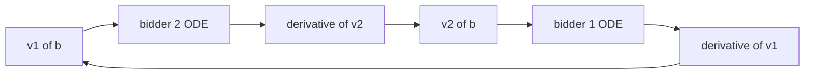

# Solving the Asymmetric Two-Bidder First-Price Auction: Characterization, Existence, Closed-Form Cases, and Numerical Methods

There is no single closed-form formula for the asymmetric two-bidder first-price auction, but there is a fully general **method**: characterize the Bayes-Nash equilibrium as the solution to a coupled system of ordinary differential equations in the inverse bid functions, then solve that system analytically in the few tractable cases and numerically everywhere else. This program spans six decades — from the uniform-support solutions of Griesmer, Levitan, and Shubik (1967), through the existence-and-uniqueness work of Lebrun and of Maskin and Riley, the analytic uniform characterization of Kaplan and Zamir (2007, 2012), and the boundary-value solvers of Fibich and Gavish (2009), to the existence results of Olszewski, Reny, and Siegel (*Econometrica*, 2026).

Despite the common claim that asymmetric first-price auctions are "intractable," the obstruction is purely computational: the equilibrium is essentially unique and pure under mild conditions, and the ODE system always exists — only its *explicit integration* fails outside special families.

**The thesis of this report is that a general method exists in two of three senses and fails in the third: there is a general equilibrium characterization and a general numerical procedure, but no universal closed-form formula beyond special cases such as the uniform-distribution solution of Kaplan and Zamir (2012)[Kaplan, T. R., and Zamir, S. 2012, "Asymmetric first-price auctions with uniform distribut](https://link.springer.com/article/10.1007/s00199-010-0563-9).** A flat "yes" or "no" collapses these distinct dimensions destructively.

---

# 1 Framework, Scope, and the Meaning of a "General Method"

## 1.1 Scope of the Question

**The precise object.** This report fixes the independent-private-values first-price auction (IPVFPA) with exactly two bidders whose valuation distributions differ. Dharanan and Ellis name this setting directly: "first-price auctions with independent and private valuations (IPVFPA) with asymmetric valuation distributions as well as asymmetric supports"[Dharanan, G. V. A., and Ellis, A., "Equilibrium in Asymmetric Auctions," working paper.](http://www.isid.ac.in/~epu/acegd2022/papers/G_V_A_Dharanan.pdf). Two qualifiers carry the entire difficulty. First, **values are private and independent**: each bidder's value is drawn from a known distribution, with no statistical dependence between the two draws[Dharanan, G. V. A., and Ellis, A., "Equilibrium in Asymmetric Auctions," working paper.](http://www.isid.ac.in/~epu/acegd2022/papers/G_V_A_Dharanan.pdf). Second, **the distributions are asymmetric**: the two bidders draw from different distributions, and the supports may also differ.

*Ex-ante asymmetry* means "before values are drawn": two bidders are ex-ante asymmetric when their distributions differ, so they are not interchangeable even before learning their realized values. Consider one bidder whose value is uniform on $0–$100 and a rival whose value is uniform on $20–$80; a neutral observer would already predict systematically different bidding. This contrasts with the *distribution-symmetric* case, where both draw from the identical distribution and a single bid function serves both. It is the loss of ex-ante symmetry that moves the problem out of reach of a simple formula and into the coupled machinery of later chapters[Kaplan, T. R., and Zamir, S. 2012, "Asymmetric first-price auctions with uniform distribut](https://link.springer.com/article/10.1007/s00199-010-0563-9).

**Exclusions.** Everything outside the single-good, single-unit, IPV, sealed-bid, two-asymmetric-bidder case is deliberately out of scope. Three families are excluded for distinct reasons. *Other single-good formats* (second-price, English, Dutch, all-pay): the second-price and English formats are not strategically hard, since truthful bidding is dominant regardless of distributions. The Dutch descending-clock format is strategically equivalent to the first-price sealed-bid form, so any bid function computed here transfers directly — the omission is coverage under another name. *Other value structures* (common-value, affiliated): excluded by construction, since the question fixes independent private values[Dharanan, G. V. A., and Ellis, A., "Equilibrium in Asymmetric Auctions," working paper.](http://www.isid.ac.in/~epu/acegd2022/papers/G_V_A_Dharanan.pdf). *Multi-unit and design questions* (optimal reserves, format choice): the deliverable is the positive computation of equilibrium behavior, not normative design.

**What "solving" means.** To solve the auction is to compute the equilibrium bid functions — the rules mapping each private value to a bid. Bajari states the deliverable as computing "the inverse equilibrium bid functions"[^3]: the bid function maps value to bid, the inverse maps bid back to value, and it is the inverse object the ODE system is written in. The solution concept is **Bayes-Nash equilibrium**: a pair of strategies at which neither bidder can raise expected payoff by deviating. Dharanan and Ellis work with "the limit of Bayesian Nash equilibria"[Dharanan, G. V. A., and Ellis, A., "Equilibrium in Asymmetric Auctions," working paper.](http://www.isid.ac.in/~epu/acegd2022/papers/G_V_A_Dharanan.pdf), and Bajari establishes that the equilibrium is unique[Bajari, P. 2000/2001, computation of equilibrium in asymmetric first-price auctions.](http://www-econ.stanford.edu/faculty/workp/swp00003.pdf). Computing equilibrium bid functions is therefore well-posed: the object exists, is unique under Bajari's conditions, and three algorithms can compute it.

**The verdict hinges on the word "compute."** If "solve" means "write down a formula," the answer for the general case is no; if it means "characterize and numerically compute the bid functions," the answer is yes[Bajari, P. 2000/2001, computation of equilibrium in asymmetric first-price auctions.](http://www-econ.stanford.edu/faculty/workp/swp00003.pdf).

## 1.2 Three Senses of a "General Method"

The phrase "general method" resolves into three separable deliverables that the evidence treats very differently.

- **Universal closed-form formula** — a single explicit expression for any pair of distributions. The literature supplies this only for special cases: Kaplan and Zamir (2012) "provide analytic solutions for any asymmetric first-price auction... for two buyers having valuations uniformly distributed"[Kaplan, T. R., and Zamir, S. 2012, "Asymmetric first-price auctions with uniform distribut](https://link.springer.com/article/10.1007/s00199-010-0563-9) — fully general *within* the uniform family, but no further.
- **General equilibrium characterization** — a coupled ODE system the inverse bid functions must satisfy for any admissible distributions, even when no formula exists. This is the sense in which the asymmetric problem is solved in generality.
- **General numerical procedure** — an algorithm returning the bid functions to any accuracy for any input. Bajari's three algorithms[Bajari, P. 2000/2001, computation of equilibrium in asymmetric first-price auctions.](http://www-econ.stanford.edu/faculty/workp/swp00003.pdf), Marshall and Meurer's numerical methods, and Hubbard–Kirkegaard–Paarsch's polynomial approximation[Hubbard, T. P., Kirkegaard, R., and Paarsch, H. J. 2013, "Using economic theory to guide n](https://ideas.repec.org/a/kap/compec/v42y2013i2p241-266.html) all deliver this.

**The three senses trade generality against explicitness:** the closed form is most explicit and least general; the characterization is fully general but implicit; the numerical procedure is general and explicit but approximate. No single deliverable dominates — a reader wanting a formula and one wanting numbers ask genuinely different questions.

### Evaluation rubric

The report grades five dimensions against author-defined weights:

| id | label | weight |
|----|-------|--------|
| R-1 | Universal closed-form availability | 0.15 |
| R-2 | General equilibrium characterization (ODE/BVP) | 0.30 |
| R-3 | General numerical solvability | 0.25 |
| R-4 | Theoretical justification (existence/uniqueness/regularity) | 0.20 |
| R-5 | Practical verifiability of solutions | 0.10 |

Closed-form availability carries only 0.15 because a universal formula is the least attainable standard; weighting it heavily would bias the verdict toward "no" for reasons unrelated to practical tractability. The characterization item carries the largest weight (0.30) as the deepest sense in which the problem is understood. Numerical solvability (0.25) is the dimension on which the "yes" answer is most robust, supported by three independent approaches[Bajari, P. 2000/2001, computation of equilibrium in asymmetric first-price auctions.](http://www-econ.stanford.edu/faculty/workp/swp00003.pdf)[Hubbard, T. P., Kirkegaard, R., and Paarsch, H. J. 2013, "Using economic theory to guide n](https://ideas.repec.org/a/kap/compec/v42y2013i2p241-266.html). Theoretical justification (0.20) grades existence and uniqueness[Dharanan, G. V. A., and Ellis, A., "Equilibrium in Asymmetric Auctions," working paper.](http://www.isid.ac.in/~epu/acegd2022/papers/G_V_A_Dharanan.pdf)[Bajari, P. 2000/2001, computation of equilibrium in asymmetric first-price auctions.](http://www-econ.stanford.edu/faculty/workp/swp00003.pdf); practical verifiability (0.10) grades whether a computed solution can be checked, which Hubbard–Kirkegaard–Paarsch address via theoretical appropriateness checks[Hubbard, T. P., Kirkegaard, R., and Paarsch, H. J. 2013, "Using economic theory to guide n](https://ideas.repec.org/a/kap/compec/v42y2013i2p241-266.html).

**By placing 0.55 on characterization and numerical solvability combined and only 0.15 on the closed form, the rubric commits in advance to reading "general method exists" as a claim about tractability.** A flat yes/no misleads both the reader who expects a formula (none exists outside the uniform family[Kaplan, T. R., and Zamir, S. 2012, "Asymmetric first-price auctions with uniform distribut](https://link.springer.com/article/10.1007/s00199-010-0563-9)) and the reader who concludes the problem is intractable (Bajari's algorithms compute the unique equilibrium[Bajari, P. 2000/2001, computation of equilibrium in asymmetric first-price auctions.](http://www-econ.stanford.edu/faculty/workp/swp00003.pdf)).

## 1.3 Roadmap

The report is a single causal chain, not a survey. **Chapter 2** fixes the primitives (distributions, supports, independence, regularity). **Chapter 3** derives the coupled ODE system from the equilibrium first-order conditions. **Chapter 4** treats boundary conditions, supports, and endpoint behavior. **Chapter 5** establishes existence, uniqueness, monotonicity, and regularity. **Chapter 6** presents closed-form analytic solutions. **Chapter 7** covers numerical methods. **Chapter 8** surveys alternative analytical approaches. **Chapter 9** synthesizes the verdict. **Chapters 10–11** treat implications and limitations.

The ordering is dictated by logical dependency: the regularity assumptions of Chapter 2 make the characterization well-posed; the well-posed characterization makes the existence argument available[Dharanan, G. V. A., and Ellis, A., "Equilibrium in Asymmetric Auctions," working paper.](http://www.isid.ac.in/~epu/acegd2022/papers/G_V_A_Dharanan.pdf); existence licenses the numerical method to converge to a real target; and Bajari's uniqueness[Bajari, P. 2000/2001, computation of equilibrium in asymmetric first-price auctions.](http://www-econ.stanford.edu/faculty/workp/swp00003.pdf) ensures the procedure cannot converge to the wrong equilibrium. The final verdict is thus the terminus of a chain, not an isolated assertion.

| Reader intent | Chapter | Key source |
|---|---|---|
| What asymmetry changes | 2–3 | Dharanan and Ellis |
| Boundary conditions and endpoints | 4 | Kaplan and Zamir |
| Existence and uniqueness | 5 | Dharanan–Ellis; Bajari |
| Closed-form solution | 6 | Kaplan and Zamir |
| Numerical computation | 7 | Bajari; Marshall–Meurer; Hubbard et al. |
| Final graded verdict | 9 | composite |

## 1.4 Vocabulary and Notation

Eight named terms carry the argument. **IPV** denotes the independent-private-values information structure[Dharanan, G. V. A., and Ellis, A., "Equilibrium in Asymmetric Auctions," working paper.](http://www.isid.ac.in/~epu/acegd2022/papers/G_V_A_Dharanan.pdf). **Ex-ante asymmetry** denotes differing distributions before values are drawn[Dharanan, G. V. A., and Ellis, A., "Equilibrium in Asymmetric Auctions," working paper.](http://www.isid.ac.in/~epu/acegd2022/papers/G_V_A_Dharanan.pdf). **The inverse bid function $v_i(b)$** maps a bid back to the value that submits it — the object Bajari's algorithms compute[Bajari, P. 2000/2001, computation of equilibrium in asymmetric first-price auctions.](http://www-econ.stanford.edu/faculty/workp/swp00003.pdf). **The coupled ODE system / Boundary Value Problem (BVP)** denotes the pair of differential equations the inverses jointly satisfy, with conditions at the endpoints of the bid interval. **Backward-shooting** integrates the system backward from the common upper endpoint[Marshall, R. C., and Meurer, M. J. 1994, numerical algorithms for first-price auctions wit](https://capcp.la.psu.edu/wp-content/uploads/sites/11/numericalanalysis.pdf). **Essentially-pure Bayes-Nash equilibrium** denotes the profile of almost-everywhere deterministic strategies at which no deviation pays[Dharanan, G. V. A., and Ellis, A., "Equilibrium in Asymmetric Auctions," working paper.](http://www.isid.ac.in/~epu/acegd2022/papers/G_V_A_Dharanan.pdf).

For notation: $F_i$ is bidder $i$'s value CDF, $f_i$ its density; the support is $[\text{low}_i, \text{high}_i]$, which may differ across bidders under asymmetry[Dharanan, G. V. A., and Ellis, A., "Equilibrium in Asymmetric Auctions," working paper.](http://www.isid.ac.in/~epu/acegd2022/papers/G_V_A_Dharanan.pdf). A bid is $b$; the bid function is $\beta_i$ with inverse $v_i(b)$, so $\beta_i(v_i(b)) = b$.

**The single most consequential modeling choice is to work in $v_i(b)$ rather than $\beta_i(v)$.** Written in the forward bid functions, each bidder's equation involves the rival's function at a different argument, and the two resist forming a clean system. Written in the inverses, both equations share the common argument $b$, and the system closes. This is why Bajari frames the target as "the inverse equilibrium bid functions"[Bajari, P. 2000/2001, computation of equilibrium in asymmetric first-price auctions.](http://www-econ.stanford.edu/faculty/workp/swp00003.pdf).

**Bidder-symmetry versus distribution-symmetry.** *Distribution-symmetry* (the sense relevant here) means $F_1 = F_2$ with coinciding supports; a single bid function then serves both and the textbook formula applies. *Bidder-symmetry* is the equilibrium property that bidders drawing from the same distribution play the same strategy. This report studies the distribution-asymmetric case, where $F_1 \neq F_2$. Hortaçsu and colleagues describe the strategic consequence as a chain: informational advantage increases the ability to shade bids, leading to higher yield bids and higher expected profit[Hortaçsu, A., et al. 2014, bid shading and bidder surplus.](https://home.treasury.gov/system/files/276/paper-3-hortacsu-bid-shading-and-bidder-surplus.pdf). Strong and weak bidders shade by different amounts, and this differential shading couples the two equations.

---

# 2 Problem Setup: IPV Auctions with Asymmetric Bidders

A first-price sealed-bid auction with two bidders whose private values are drawn independently from different distributions is the smallest model in which the symmetric closed form collapses. **The central structural fact is that asymmetry converts a single scalar integral into a coupled pair of differential equations whose two unknown functions each depend on the other.**

## 2.1 Primitives and Assumptions

The model is an IPV first-price sealed-bid auction with two bidders and a single indivisible good. The higher bid wins and pays its own bid — the defining "pay-your-bid" feature[Bayes-Nash Equilibrium in the First-Price Auction](https://cs.brown.edu/courses/csci1440/lectures/fall-2025/first_price_auctions.pdf).

**Risk neutrality.** Each bidder maximizes expected surplus: the win probability times the difference between private value and bid. Risk neutrality makes the objective a product of terms linear in surplus, so the first-order condition is a clean balance between marginal win-probability gain and marginal surplus loss[Bayes-Nash Equilibrium in the First-Price Auction](https://cs.brown.edu/courses/csci1440/lectures/fall-2025/first_price_auctions.pdf).

**Common knowledge and regularity.** Both bidders and the analyst know $F_1$ and $F_2$; only realized draws are private. This makes the solution concept Bayes-Nash[EconPort - Bayesian Nash Equilibrium in First-Price Auctions](http://www.econport.org/content/handbook/auctions/auctionsexperiments/auctionsbneandfirstprice.html). Each $F_i$ admits a density $f_i$ that is continuous and strictly positive on the interior of its support. Strict positivity rules out gaps and keeps the inverse bid function differentiable; continuity lets the first-order condition be written as a differential equation. These conditions (continuous positive densities, often common support and a monotone hazard rate) are not universally required, but the cleanest existence and uniqueness results lean on them. The same regularity budget buys a formula under symmetry and merely buys well-posedness under asymmetry.

**Independence and asymmetry.** The values factor: $\Pr(v_1 \le x, v_2 \le y) = F_1(x)F_2(y)$, which lets each bidder integrate against the unconditional rival distribution[Dharanan, G. V. A., and Ellis, A., "Equilibrium in Asymmetric Auctions," working paper.](http://www.isid.ac.in/~epu/acegd2022/papers/G_V_A_Dharanan.pdf). *Ex-ante asymmetry* ($F_1 \neq F_2$) means the two bidders are distinguishable before any draw — distinct from *ex-post asymmetry*, the generic fact that realized draws differ. Distributional asymmetry is also distinct from informational asymmetry about rivals, a separate object[Elicited bid functions in asymmetric first-price auctions](https://ideas.repec.org/p/aub/autbar/578.03.html); here both bidders know both distributions. Relative to the symmetric case, asymmetry forces two distinct bid functions $\beta_1, \beta_2$ solved jointly while leaving independence untouched.

**Support assumptions.** In the *common-support* case both values lie on $[v_{\text{low}}, v_{\text{high}}]$ and only the shapes differ. In the *different-support* case the intervals themselves differ. Dharanan and Ellis admit asymmetric supports, not merely asymmetric shapes[Dharanan, G. V. A., and Ellis, A., "Equilibrium in Asymmetric Auctions," working paper.](http://www.isid.ac.in/~epu/acegd2022/papers/G_V_A_Dharanan.pdf), and Kaplan and Zamir solve the uniform case on arbitrary intervals[Kaplan, T. R., and Zamir, S. 2012, "Asymmetric first-price auctions with uniform distribut](https://link.springer.com/article/10.1007/s00199-010-0563-9). The common-support configuration is the baseline because it yields the cleanest endpoint conditions: both top types bid the same maximum. Different supports complicate the bookkeeping — when one lower endpoint exceeds the other, a range of low bids has only one active bidder — but the BVP formulation remains well-posed at the cost of additional case-splitting.

## 2.2 The Symmetric Benchmark and Its Closed Form

Under ex-ante symmetry, both bidders draw from $F$ and play the same increasing function $b$, collapsing the two-function problem to one scalar object.

**The standard bid function.** With $n$ i.i.d. bidders on $[0,\bar v]$, a bidder bids her value minus a shading term: $b(v) = v - \frac{\int_0^v F(x)^{n-1}dx}{F(v)^{n-1}}$. The integral term is the shading, strictly positive above the support floor. For uniform values on $[0,1]$, this gives $b(v) = \frac{n-1}{n}v$[CSCI 1440 Lecture Notes, Brown University 2025](https://cs.brown.edu/courses/csci1440/lectures/2025/first_price_auctions.pdf); with two bidders, $b(v) = v/2$ — each bids half her value. This simplicity depends jointly on uniformity *and* symmetry; remove either and the linear rule fails[Kaplan, T. R., and Zamir, S. 2012, "Asymmetric first-price auctions with uniform distribut](https://link.springer.com/article/10.1007/s00199-010-0563-9).

**Why one function suffices.** When both draw from $F$ and we seek a symmetric equilibrium, bidder 1's problem is literally identical to bidder 2's. A function that best-responds to itself is an equilibrium, so the fixed-point problem collapses to a single self-consistency condition, integrating to the closed form. One might expect two distinct persons to need two functions, but ex-ante symmetry makes the two optimizations identical *as functions of type*; the distinctness of persons matters for realized outcomes, not for the strategy. The shared distribution, not any assumption that persons are the same, is what causes the collapse — which is exactly why two different distributions break it.

**The benchmark as a diagnostic baseline.** Three good properties of the symmetric solution can be tested against asymmetry:

| Property (symmetric benchmark) | Survives under asymmetry? |
|---|---|
| Existence of increasing equilibrium | Yes, under regularity[Dharanan, G. V. A., and Ellis, A., "Equilibrium in Asymmetric Auctions," working paper.](http://www.isid.ac.in/~epu/acegd2022/papers/G_V_A_Dharanan.pdf) |
| Uniqueness among increasing strategies | Yes, under regularity |
| Explicit closed form | No, except special families[Kaplan, T. R., and Zamir, S. 2012, "Asymmetric first-price auctions with uniform distribut](https://link.springer.com/article/10.1007/s00199-010-0563-9) |
| Single scalar integral | No, becomes coupled ODE system |
| Trivial verifiability | Degrades to numerical verification |

Asymmetry attacks the closed form and verifiability while mostly preserving existence and uniqueness[Dharanan, G. V. A., and Ellis, A., "Equilibrium in Asymmetric Auctions," working paper.](http://www.isid.ac.in/~epu/acegd2022/papers/G_V_A_Dharanan.pdf)[Bajari, P. 2000/2001, computation of equilibrium in asymmetric first-price auctions.](http://www-econ.stanford.edu/faculty/workp/swp00003.pdf). **The symmetric closed form owes its existence entirely to the collapse of two functions into one, and that collapse is caused by shared distributions alone.** This localizes the entire difficulty of the asymmetric problem in a single place.

## 2.3 Why Asymmetry Breaks the Formula

**Different rival distributions, different shading.** Bidder 1's win probability is driven by $F_2$; bidder 2's by $F_1$. Because the distributions differ, the two solve genuinely different problems even at the same value. When one distribution stochastically dominates, the "weak" and "strong" bidders shade by different amounts[Asymmetric first price auctions](https://www.sciencedirect.com/science/article/abs/pii/S0022053109000295). There is no single shading rule — the very notion of a common shading integral disappears.

**Two functions solved jointly.** The equilibrium is a pair $(\beta_1, \beta_2)$, generally different from each other and from the symmetric benchmark[First Price Auctions in the Asymmetric N Bidder Case](https://ideas.repec.org/p/lvl/laeccr/9715.html). The standard move is to work with the inverses $v_i(b)$, the objects that satisfy a differential system directly[Bajari, P. 2000/2001, computation of equilibrium in asymmetric first-price auctions.](http://www-econ.stanford.edu/faculty/workp/swp00003.pdf). One cannot solve $\beta_1$ first and then $\beta_2$, because each refers to the other.

**Coupling.** Each bidder's first-order condition for $v_i(b)$ contains the rival's inverse function and its derivative: bidder 1's condition involves $v_2$ and $v_2'$, and symmetrically[First Price Auctions in the Asymmetric N Bidder Case](https://ideas.repec.org/p/lvl/laeccr/9715.html). The causal chain is mechanical: $F_1 \neq F_2$ → two distinct rival distributions → two distinct first-order conditions referencing each other's inverse → a coupled differential system with no separable solution → absence of a general closed form and reliance on numerics. Bajari's uniqueness result addresses the last link by showing the coupled system nonetheless has a unique, computable solution[Bajari, P. 2000/2001, computation of equilibrium in asymmetric first-price auctions.](http://www-econ.stanford.edu/faculty/workp/swp00003.pdf).

| Feature | Symmetric (benchmark) | Asymmetric (this report) |
|---|---|---|
| Distributions | Single shared $F$ | Distinct $F_1 \neq F_2$ |
| Bid functions | One function $b$ | Two functions $\beta_1, \beta_2$ |
| Equilibrium condition | Single self-consistency | Coupled pair |
| Mathematical object | Scalar ODE → integral | Coupled ODE system / BVP |
| Closed form | Always | Only special families |
| Typical solution | Hand calculation | Backward-shooting numerics |

**Against the characterization criterion, the asymmetric model passes cleanly:** the coupled system completely characterizes the equilibrium even where no formula can be written.

## 2.4 The Bidder's Optimization Problem

Bidder $i$ with value $v_i$ submitting bid $b$ earns $(v_i - b) \cdot \Pr(\text{win} \mid b)$. With two bidders, bidder 1 wins when bidder 2 bids below $b$, i.e. when bidder 2's value is below $v_2(b)$. The win probability is therefore $F_2(v_2(b))$, and the expected payoff is $(v_1 - b) \cdot F_2(v_2(b))$ — the seed of the coupling[Andreoni, Che, Kim, experiment](https://econweb.ucsd.edu/~jandreon/Econ264/papers/Andreoni%20et%20al%20MS%202005b.pdf). Independence licenses writing the win probability as an unconditional $F_2$ evaluation.

**The trade-off.** Raising $b$ increases the win probability but decreases retained surplus. The optimal bid balances these at the margin: marginal win-probability gain (weighted by surplus) equals marginal surplus loss (weighted by win probability). A bidder cannot win with certainty *and* retain full value; equilibrium shading is pinned down by the rival's distribution, which is why asymmetric rivals produce asymmetric shading.

**Monotone strategies.** The analysis restricts to strictly increasing bid functions, which makes $v_i(b)$ single-valued and the differential characterization coherent. Plainly: "want it more, bid more." This restriction is what lets the backward-shooting method treat $v_1, v_2$ as state variables; non-monotone equilibria would make the inverses set-valued and collapse the differential formulation. The Dharanan–Ellis existence result operates within this monotone class[Dharanan, G. V. A., and Ellis, A., "Equilibrium in Asymmetric Auctions," working paper.](http://www.isid.ac.in/~epu/acegd2022/papers/G_V_A_Dharanan.pdf).

---

# 3 Equilibrium Characterization: The Coupled ODE System

**The central finding of this chapter is that a fully general equilibrium characterization exists as a coupled nonlinear ODE system, even though a general closed-form solution does not.** The logic runs from each bidder's first-order condition, to a reformulation in inverse functions, to the coupled system, to a boundary value problem.

## 3.1 First-Order Conditions

Differentiating $(v_i - b) F_j(v_j(b))$ in $b$ and setting it to zero gives two terms: a negative term $-F_j(v_j(b))$ (raising the bid bleeds surplus) and a positive term $(v_i - b) f_j(v_j(b)) v_j'(b)$ (the higher bid buys extra wins). At the optimum these balance[Bayes-Nash Equilibrium in the First-Price Auction](https://cs.brown.edu/courses/csci1440/lectures/fall-2025/first_price_auctions.pdf)[EconPort - Bayesian Nash Equilibrium in First-Price Auctions](http://www.econport.org/content/handbook/auctions/auctionsexperiments/auctionsbneandfirstprice.html). **The marginal surplus a bidder gives up by raising her bid exactly equals the marginal value of the extra winning probability it buys.**

The quantity making this asymmetric is $v_j(b)$, the rival's inverse function, entering both terms. **Bidder $i$'s optimal bid depends on the rival's entire strategy, not merely the rival's distribution — which is why the two conditions must be solved jointly.** In the symmetric case $v_j(b) = v_i(b)$ and the condition reduces to one integrable equation; under asymmetry, bidder 1's condition contains $v_2(b)$ and vice versa. This is the behavioral counterpart of empirical bid shading: a bidder facing a more conservative rival can safely shade more[The Generalized First- and Second-Price Auctions](https://www.mdpi.com/2227-7390/10/3/403).

## 3.2 Inverse Bid Functions as Working Variables

Working in $v_i(b)$ rather than $\beta_i(v)$ is the decisive reformulation. The direct functions are defined over different value domains (the supports of $F_1, F_2$) but compete over a common bid range — awkward to couple. Lebrun's analysis made the inverse formulation standard[^13]: **the independent variable becomes $b$, common to both bidders, so $v_1(b)$ and $v_2(b)$ share a domain and stack into one vector system.** Bajari[Bajari, P. 2000/2001, computation of equilibrium in asymmetric first-price auctions.](http://www-econ.stanford.edu/faculty/workp/swp00003.pdf) and Hubbard–Kirkegaard–Paarsch[Hubbard, T. P., Kirkegaard, R., and Paarsch, H. J. 2013, "Using economic theory to guide n](https://ideas.repec.org/a/kap/compec/v42y2013i2p241-266.html) both rely on this.

Rearranging bidder $i$'s first-order condition isolates the *rival's* derivative: bidder 1's condition solves for $v_2'(b)$, and bidder 2's for $v_1'(b)$. Each derivative is governed by the rival's distribution-to-density ratio $F_j/f_j$ — the inverse hazard rate — scaled by the reciprocal surplus gap $(v_i(b) - b)$. This is the structural signature of the coupling.

Conceptually, a single bid $b$ is read by two lenses: $v_1(b)$ answers "which value of bidder 1 submits $b$?" and $v_2(b)$ the same for bidder 2, with different answers. Both inverses terminate at a **common upper bid** — an equilibrium consequence, not an assumption, since a bidder bidding strictly higher than the rival's maximum could profitably lower the bid.

## 3.3 The Coupled Nonlinear ODE System

The system: $v_1'(b)$ is proportional to $\frac{F_2(v_2(b))}{f_2(v_2(b)) \cdot (v_1(b) - b)}$ and $v_2'(b)$ to $\frac{F_1(v_1(b))}{f_1(v_1(b)) \cdot (v_2(b) - b)}$. **Each inverse derivative is governed by the rival's distribution-to-density ratio divided by that bidder's own surplus gap.** When the surplus gap vanishes (the bid approaches the value), the derivative blows up — the analytic fingerprint of the lower-boundary behavior.

The two equations form a closed feedback loop with no entry point. The system is **nonlinear** on two counts: the unknowns enter inside the maps $F_j, f_j$, and the surplus gap sits in a denominator. It is **mutually dependent**: each equation requires the other's value at every point, so an error in $v_2(b)$ feeds directly into $v_1'(b)$ and compounds — one mechanism behind the instability Fibich and Gavish prove formally[Fibich and Gavish 2011, Games and Economic Behavior](https://www.sciencedirect.com/science/article/abs/pii/S0899825611000509).

**No decoupling is generally possible** because the coupling runs through the distinct distributions themselves. One might hope a mild asymmetry decouples approximately, but any asymmetry breaks the $v_1 = v_2$ identity that symmetric decoupling relied on. Kaplan and Zamir solve the uniform case[Kaplan, T. R., and Zamir, S. 2012, "Asymmetric first-price auctions with uniform distribut](https://link.springer.com/article/10.1007/s00199-010-0563-9) precisely because the uniform's $F/f$ ratio is affine; a general $F$ makes that ratio an arbitrary nonlinear function, and two such functions cannot be straightened by one coordinate change. **The nonlinearity, mutual dependence, and impossibility of decoupling are one obstacle viewed from three angles — the distinctness of $F_1$ and $F_2$ propagates into every structural feature.**

## 3.4 Boundary Value Problem Formulation

An ODE system without boundary conditions admits infinitely many trajectories; the equilibrium is the one satisfying economic conditions at both ends. Fibich and Gavish (2009) recast the coupled system as a free-boundary BVP[^19]: for $n$ bidders, $n$ ODEs plus $2n$ boundary conditions plus one unknown scalar (the common upper bid). For two bidders: two ODEs and four conditions. **The problem is exactly determined — two integration constants plus the free upper-bid scalar are pinned by the four conditions.**

The four conditions split into two pairs. At the lower end, each inverse returns the lowest participating value (under a common lower endpoint, the shared reservation value). At the upper end, each inverse returns the top of its own support, both at the same common upper bid. **The free right boundary — the unknown common upper bid — is what raises this from routine integration to a genuine free-boundary BVP**, and its value is determined jointly by both distributions.

This is intrinsically a *two-point* problem: the meaningful conditions live at both ends, so no single point carries all the information an initial-value problem needs. Treating it as an IVP — specifying both functions at the upper bid and integrating downward — is exactly the backward-shooting method, and its failure is instructive: the upper endpoint is a singular point where the surplus gap vanishes, so small starting errors are amplified, not damped. Fibich and Gavish (2011) prove this instability is inherent, irremovable by any backward solver, and worsening with player count[Fibich and Gavish 2011, Games and Economic Behavior](https://www.sciencedirect.com/science/article/abs/pii/S0899825611000509). Recognizing the problem as a genuine BVP[Fibich and Gavish 2009, Numerical simulations of asymmetric first-price auctions](http://www.math.tau.ac.il/~fibich/Manuscripts/Numerical-simulations-of-asymmetric-first-price-auctions.pdf) sidesteps that amplification.

## 3.5 Generality of the Characterization

The derivation nowhere used a specific functional form. The first-order conditions, the inverse reformulation, the coupled ODEs, and the boundary conditions all go through for any distributions satisfying the regularity assumptions[First Price Auctions in the Asymmetric N Bidder Case](https://ideas.repec.org/p/lvl/laeccr/9715.html). This breadth is confirmed across settings: Lebrun's $N$-bidder case[First Price Auctions in the Asymmetric N Bidder Case](https://ideas.repec.org/p/lvl/laeccr/9715.html), Kaplan–Zamir's uniform case[Kaplan, T. R., and Zamir, S. 2012, "Asymmetric first-price auctions with uniform distribut](https://link.springer.com/article/10.1007/s00199-010-0563-9), Doni–Menicucci's arbitrary-$N$ case[A First Price Auction with an Arbitrary Number of Asymmetric Bidders](https://www.degruyterbrill.com/document/doi/10.1515/bejte-2018-0105/html), and the discrete two-bidder case[Ceesay, Doni, Menicucci 2025, two-bidder discrete valuations](https://www.degruyterbrill.com/document/doi/10.1515/bejte-2024-0109/pdf) all specialize or generalize the same spine. **On the characterization criterion, the verdict is an unambiguous pass: the coupled ODE/BVP provides a complete, distribution-agnostic description of the equilibrium for any regular asymmetric two-bidder auction.** This is the single most important positive finding of the chapter — and the reason the report can answer "yes" to characterization and "no" to closed form in the same breath.

---

# 4 Boundary Conditions, Supports, and Endpoint Behavior

The coupled system does not by itself pin down a unique equilibrium; boundary conditions select it. For asymmetric bidders the endpoint structure is where asymmetry bites hardest and where naïvely posed solutions most often go wrong.

## 4.1 Lower and Upper Endpoint Conditions

**Lowest-type zero-surplus.** Against the symmetric uniform benchmark[Bayes-Nash Equilibrium in the First-Price Auction](https://cs.brown.edu/courses/csci1440/lectures/fall-2025/first_price_auctions.pdf), the asymmetric lower endpoint is a zero-surplus requirement: the lowest participating type captures no positive expected profit, so its bid collapses onto its value (or the reserve, when one binds). In inverse terms, this fixes $v_i(b)$ at the lowest active bid, anchoring the bottom of the trajectory. **The lower and upper endpoints are governed by conditions of entirely different character — one local to each bidder, one shared — and a general method must encode both.** Because the lower conditions are bidder-specific and the upper is shared, a solver integrating from one end must treat the opposite end as a target to be matched — the structural reason the field treats endpoint handling, not the interior ODE, as the locus of difficulty.

**Common upper bid.** The highest types of both bidders tender a common maximum $\bar b$ — the one coupling condition the asymmetric BVP needs at the top. The no-arbitrage argument: a top type bidding strictly above the rival's maximum could lower its bid, win with probability essentially one, and retain the difference. **This holds even when distributions differ, so it survives ex-ante asymmetry intact.** Treatment of $\bar b$ diverges sharply: Kaplan and Zamir render it as part of a finite algebraic characterization[Kaplan, T. R., and Zamir, S. 2012, "Asymmetric first-price auctions with uniform distribut](https://link.springer.com/article/10.1007/s00199-010-0563-9), whereas backward shooting must recover it iteratively by an unstable solver[Fibich and Gavish 2011, Games and Economic Behavior](https://www.sciencedirect.com/science/article/abs/pii/S0899825611000509).

**Closing the system.** Two boundary conditions at opposite ends make this a genuine BVP. The analytic tradition imposes both conditions on a parameterized candidate (Kaplan–Zamir, achievable because the uniform reduces them to algebra[Kaplan, T. R., and Zamir, S. 2012, "Asymmetric first-price auctions with uniform distribut](https://link.springer.com/article/10.1007/s00199-010-0563-9)); the numerical tradition shoots from one end and iterates, at the cost of instability[Fibich and Gavish 2011, Games and Economic Behavior](https://www.sciencedirect.com/science/article/abs/pii/S0899825611000509). Computationally, the closure routes differ: Bajari's three algorithms match by iteration[Bajari, P. 2000/2001, computation of equilibrium in asymmetric first-price auctions.](http://www-econ.stanford.edu/faculty/workp/swp00003.pdf); Hubbard–Kirkegaard–Paarsch build conditions into the polynomial coefficient-solving step[Hubbard, T. P., Kirkegaard, R., and Paarsch, H. J. 2013, "Using economic theory to guide n](https://ideas.repec.org/a/kap/compec/v42y2013i2p241-266.html). All must honor the two-ended structure.

## 4.2 Common versus Different Supports

The common-support configuration is where the numerical tradition was built. Marshall and Meurer (1994) propose algorithms for heterogeneous distributions over a shared bid range, noting that more general asymmetric extensions remain open[Marshall, R. C., and Meurer, M. J. 1994, numerical algorithms for first-price auctions wit](https://capcp.la.psu.edu/wp-content/uploads/sites/11/numericalanalysis.pdf). **Kaplan and Zamir (2012) deliver analytic solutions for the two-bidder uniform case on arbitrary intervals[Kaplan, T. R., and Zamir, S. 2012, "Asymmetric first-price auctions with uniform distribut](https://link.springer.com/article/10.1007/s00199-010-0563-9)** — a different-support analytic treatment within the uniform family, since the lower endpoints need not coincide. Against the closed-form criterion, this passes fully within the uniform family and says nothing outside it.

**Why different lower supports create a bottom interval.** Suppose the weak bidder's support extends below the strong bidder's lower endpoint. Over that bottom range, the weak bidder competes against a rival who cannot be present, so the two bidders' bids no longer start from a common floor. Hubbard and Kirkegaard (2015) call this **bid bifurcation** and show it raises the problem's dimensionality, providing a dimensionality-reduction method and a robust algorithm[Hubbard and Kirkegaard 2015](https://www.uoguelph.ca/economics/repec/workingpapers/2015/2015-02.pdf). The causal chain: support extension → a one-sided low-value region → no common floor → bid bifurcation → increased dimensionality.

**The Dharanan–Ellis perturbation treatment.** The most recent route reaches the different-support problem as a limit. Dharanan and Ellis establish existence of equilibrium under asymmetric distributions and asymmetric supports via a perturbation approach[Dharanan, G. V. A., and Ellis, A., "Equilibrium in Asymmetric Auctions," working paper.](http://www.isid.ac.in/~epu/acegd2022/papers/G_V_A_Dharanan.pdf), showing that the $\varepsilon$-equilibrium of an asymmetric-support auction is a Bayesian Nash equilibrium of nearby common-support auctions[Dharanan and Ellis 2024](https://www.sciencedirect.com/science/article/pii/S0899825624000848). This relates the hard different-support problem to the well-studied common-support case by a closeness argument, pointing toward solving the harder case by computing a sequence of nearby common-support problems — a plausible direction the existence result enables. Against the theoretical-justification criterion, Dharanan–Ellis pass the existence component without supplying a closed form, the opposite pole from Kaplan–Zamir.

| Approach | Distributional reach | Support reach | Closed-form? | Existence basis |
|---|---|---|---|---|
| Marshall–Meurer (1994) | Heterogeneous; extensions open | Shared ranges | No | Numerical algorithms[Marshall, R. C., and Meurer, M. J. 1994, numerical algorithms for first-price auctions wit](https://capcp.la.psu.edu/wp-content/uploads/sites/11/numericalanalysis.pdf) |
| Kaplan–Zamir (2012) | Uniform only | Arbitrary intervals | Yes | Analytic solution[Kaplan, T. R., and Zamir, S. 2012, "Asymmetric first-price auctions with uniform distribut](https://link.springer.com/article/10.1007/s00199-010-0563-9) |
| Hubbard–Kirkegaard (2015) | Heterogeneous | Different (bifurcation) | No | Dimensionality reduction[Hubbard and Kirkegaard 2015](https://www.uoguelph.ca/economics/repec/workingpapers/2015/2015-02.pdf) |
| Dharanan–Ellis (2024) | Asymmetric distributions | Asymmetric | No | Existence via perturbation[Dharanan, G. V. A., and Ellis, A., "Equilibrium in Asymmetric Auctions," working paper.](http://www.isid.ac.in/~epu/acegd2022/papers/G_V_A_Dharanan.pdf)[Dharanan and Ellis 2024](https://www.sciencedirect.com/science/article/pii/S0899825624000848) |

**There is no single technology that is simultaneously general in distribution, general in support, and closed-form: generality in one dimension is bought by retreat in another.**

## 4.3 Mass Points and Atoms

An atom is a bid placed with positive probability. At the lower end, atoms are the hinge on which uniqueness turns. **Uniqueness can hinge on whether a bidder is permitted or required to place an atom at the bottom**; Bajari's uniqueness result is what licenses treating an algorithm's output as *the* equilibrium[Bajari, P. 2000/2001, computation of equilibrium in asymmetric first-price auctions.](http://www-econ.stanford.edu/faculty/workp/swp00003.pdf). One might expect bottom atoms to multiply equilibria, but the resolution is the reverse: the mass-point structure rules out competing candidates, because any deviation from the required atom structure opens a profitable deviation elsewhere. The atom is a determinacy device.

**Reserve prices** are the concrete route to a bottom atom: bidders whose values sit at or just above a binding reserve cluster their bids there. Kaplan and Zamir's framework accommodates this, covering the uniform case with and without a minimum bid[Kaplan, T. R., and Zamir, S. 2012, "Asymmetric first-price auctions with uniform distribut](https://link.springer.com/article/10.1007/s00199-010-0563-9). The reserve migrates the lower boundary from the support edge to the reserve itself. The atom is the equilibrium expression of shading incentives meeting an exogenous floor[Hortaçsu, A., et al. 2014, bid shading and bidder surplus.](https://home.treasury.gov/system/files/276/paper-3-hortacsu-bid-shading-and-bidder-surplus.pdf), and solvers handling reserves must represent it explicitly[Gayle 2004, numerical program with reserve prices](http://repec.org/sce2005/up.18137.1108489875.pdf).

**Continuity effect.** At an atom, an interval of types maps to a single bid, so the inverse is set-valued there — breaking the regularity the interior ODE presupposes. The ODE-satisfying continuous part must be stitched to a separate description of the atom. This compounds backward shooting's instability, since the matching target becomes a region of concentrated mass rather than a single value[Fibich and Gavish 2011, Games and Economic Behavior](https://www.sciencedirect.com/science/article/abs/pii/S0899825611000509). **The same boundary feature that makes the asymmetric equilibrium determinate is the one that makes it numerically awkward — theoretical and computational tractability pull in opposite directions at the bottom.**

## 4.4 Gaps and Reserve Prices

A **gap** is an interval of bids no type ever tenders, arising through bid bifurcation. Hubbard and Kirkegaard (2019) state that bid separation invalidates existing numerical methods but that a simple modification incorporates it. The chain: different supports → bifurcation → gaps → solver failure → need for the modified algorithm. Against the numerical-solvability criterion, gaps yield a conditional pass: solvability survives only when the solver detects and respects the bifurcation.

A **reserve price** is an exogenous lower boundary replacing the endogenous zero-surplus boundary, becoming data supplied by the auction design rather than an unknown. Gayle develops a program incorporating reserves for heterogeneous distributions[Gayle 2004, numerical program with reserve prices](http://repec.org/sce2005/up.18137.1108489875.pdf), and Kaplan–Zamir fold the minimum bid into their analytic solution[Kaplan, T. R., and Zamir, S. 2012, "Asymmetric first-price auctions with uniform distribut](https://link.springer.com/article/10.1007/s00199-010-0563-9). The reserve trades an endogenous-boundary difficulty for an atom-and-gap difficulty.

---

# 5 Existence, Uniqueness, Monotonicity, and Regularity

A numerical routine is only as meaningful as the theorems guaranteeing the object it computes. **Existence of a monotone equilibrium is now secure, but uniqueness rests on three separate sufficient conditions that do not reduce to one another.**

## 5.1 Existence of Monotone Pure-Strategy Equilibrium

Existence is the least controversial guarantee, now extended to differing supports. **Lebrun's characterization** of the asymmetric $N$-bidder case (highest bidder wins, pays own bid)[First Price Auctions in the Asymmetric N Bidder Case](https://ideas.repec.org/p/lvl/laeccr/9715.html) treats the heterogeneous problem directly; the two-bidder case is its $N=2$ specialization, paralleled by Doni and Menicucci's arbitrary-$N$ work[A First Price Auction with an Arbitrary Number of Asymmetric Bidders](https://www.degruyterbrill.com/document/doi/10.1515/bejte-2018-0105/html).

**Density conditions.** Enkhbayar (2026) proves the asymmetric IPV first-price auction has a unique Bayesian Nash equilibrium assuming only common support and continuously differentiable, strictly positive densities. "Strictly positive density" means every value is genuinely possible; "continuously differentiable" supplies the smoothness making the inverse bid function differentiable. **The theorem requires neither the mass points Maskin and Riley (2003) used nor the log-concavity Lebrun (2006) used** — the single most consequential recent development for the theoretical-justification criterion, because those are precisely the conditions under which backward shooting is most commonly deployed. Existence under asymmetry has separately been established by Dharanan and Ellis via perturbation, even with asymmetric supports[Dharanan, G. V. A., and Ellis, A., "Equilibrium in Asymmetric Auctions," working paper.](http://www.isid.ac.in/~epu/acegd2022/papers/G_V_A_Dharanan.pdf).

**On the theoretical-justification criterion, existence earns a clear pass:** the perturbation argument supplies existence even when supports differ[Dharanan, G. V. A., and Ellis, A., "Equilibrium in Asymmetric Auctions," working paper.](http://www.isid.ac.in/~epu/acegd2022/papers/G_V_A_Dharanan.pdf), the strongest environment demonstrated. **Existence is no longer the binding constraint on the general method; uniqueness is.**

## 5.2 Uniqueness Conditions and Their Disagreements

**Three distinct sufficient conditions, proven by different authors under different assumptions, none necessary.** A distribution failing all three may still have a unique equilibrium, but no theorem guarantees it.

- **Lebrun (York).** Uniqueness follows when the value CDFs are log-concave at the highest lower extremity of their supports, via a geometric argument. Log-concavity covers many familiar distributions (uniform, truncated normal, exponential).
- **Maskin–Riley (2003).** Required mass points at the lower end of the support. This pins down behavior where the two bidders' strategies meet at the bottom, but departs from the atomless setting the differential characterization prefers.
- **Enkhbayar (2026).** Common support plus $C^1$ strictly positive densities, shedding both prior devices. This is the most important result for the ODE method, because the atomless, common-support, positive-density environment is exactly where the coupled system is most cleanly derived.

The contrast is not one of strength but of *what they watch*: Lebrun imposes curvature at one boundary point, Maskin–Riley require a bottom atom, Enkhbayar needs only smoothness and positivity.

| Condition | What it constrains | Mass point? | Log-concavity? | Support |
|---|---|---|---|---|
| Enkhbayar (2026) | $C^1$ strictly positive densities | No | No | Common |
| Lebrun (York) | Log-concavity of CDFs at highest lower extremity | No | Yes | At that extremity |
| Maskin–Riley (2003) | Behavior at lower support end | Yes | — | — |

**The honest qualification is that these are sufficient conditions, not a characterization of exactly when uniqueness holds.** Kaplan and Zamir (2011) show that relaxing the no-overbidding assumption creates additional substantial equilibria, altering both the allocation and the selling price. **Uniqueness is not unconditional; it holds within the maintained assumptions, and relaxing even an auxiliary assumption can reintroduce multiplicity.** A practitioner checks, in order: common support with $C^1$ positive densities (Enkhbayar); log-concavity at the highest lower extremity (Lebrun); a mass point at the bottom (Maskin–Riley). Outside all three, the Kaplan–Zamir finding is a concrete warning.

## 5.3 Monotonicity and Differentiability

**Monotonicity plays a double role: assumed to start the derivation, then verified to confirm it.** Strict monotonicity makes $v_i(b)$ a genuine function rather than a correspondence. The derivation begins by assuming strictly increasing differentiable bid functions, produces candidate inverses, and only closes if those candidates are *verified* strictly monotone — otherwise the construction is circular. In the asymmetric case the two strategies' monotonicity is coupled, so confirming both is a joint check.

**Where the ODE is valid.** On the open interior of the common bid support, with continuous strictly positive densities and strictly increasing bid functions, the first-order condition holds as a genuine differential equation. The chain: continuity and strict positivity → differentiability of the inverses → first-order condition expressible as a derivative → the coupled ODE system. Enkhbayar's density conditions are exactly what this argument needs, so the same assumption securing uniqueness secures the differential characterization's validity. The polynomial approach assesses approximation quality against theoretical properties[Hubbard, T. P., Kirkegaard, R., and Paarsch, H. J. 2013, "Using economic theory to guide n](https://ideas.repec.org/a/kap/compec/v42y2013i2p241-266.html); the differentiable-region characterization is usable as a verification standard.

**Verification in computed solutions.** The cheapest diagnostic catching a spurious solution is checking strict monotonicity of the computed inverses. A solution satisfying the ODE numerically but failing monotonicity is not a valid equilibrium. Bajari's multiple algorithms[Bajari, P. 2000/2001, computation of equilibrium in asymmetric first-price auctions.](http://www-econ.stanford.edu/faculty/workp/swp00003.pdf) provide cross-checks: if two disagree, at least one failed, and monotonicity is the first thing to inspect. The circularity worry dissolves because the check uses independent information the assumption did not presuppose — when a backward-shooting output is strictly increasing over the interior, the launching assumption is confirmed by the result.

## 5.4 Regularity Failures and Delicate Cases

When regularity fails, uniqueness can be lost, differentiability can fail at boundaries, and the characterization can stop being justified exactly where the numerical method is most delicate.

**Multiple equilibria from relaxed assumptions.** Kaplan and Zamir (2011) show that relaxing no-overbidding creates additional equilibria with different allocations and prices. The no-overbidding assumption is load-bearing: remove it and the uniqueness theorems no longer guarantee a single equilibrium. For practical verifiability, a numerical solution is trustworthy as *the* equilibrium only insofar as the maintained assumptions actually hold.

**Loss of differentiability at boundaries.** Even when uniqueness holds, differentiability can fail at support boundaries. At the top, the two functions meet at a common endpoint where the inverse's derivative can behave singularly — exactly why backward shooting starts at the top. Gayle's reserve-price program adds a participation threshold that alters the lower boundary condition[Gayle 2004, numerical program with reserve prices](http://repec.org/sce2005/up.18137.1108489875.pdf). Kaplan and Zamir's closed forms[Kaplan, T. R., and Zamir, S. 2012, "Asymmetric first-price auctions with uniform distribut](https://link.springer.com/article/10.1007/s00199-010-0563-9) are valuable here because they make endpoint behavior explicit rather than numerical.

---

# 6 Closed-Form Analytic Solutions for Special Cases

The asymmetric first-price auction admits exact analytic solutions in exactly two well-characterized settings, both narrow: **two-bidder uniform distributions** (Kaplan–Zamir 2012[Kaplan, T. R., and Zamir, S. 2012, "Asymmetric first-price auctions with uniform distribut](https://link.springer.com/article/10.1007/s00199-010-0563-9)) and **discretely distributed valuations** (Ceesay–Doni–Menicucci 2025[Ceesay, Doni, Menicucci 2025, two-bidder discrete valuations](https://www.degruyterbrill.com/document/doi/10.1515/bejte-2024-0109/pdf)). Outside these islands, the numerical literature — anchored by Hubbard–Kirkegaard–Paarsch, who must *approximate* the inverses by polynomials[Hubbard, T. P., Kirkegaard, R., and Paarsch, H. J. 2013, "Using economic theory to guide n](https://ideas.repec.org/a/kap/compec/v42y2013i2p241-266.html) — shows that explicit formulas are not the working tool.

## 6.1 The Uniform-Distribution Case

**Early explicit solutions** established that the two-bidder uniform auction is solvable by direct construction, including for *asymmetric* uniforms where the supports and densities differ. The symmetric uniform auction is elementary[Bayes-Nash Equilibrium in the First-Price Auction](https://cs.brown.edu/courses/csci1440/lectures/fall-2025/first_price_auctions.pdf), but the asymmetric case is qualitatively harder — strong and weak bidders shade differently — yet remains within reach of explicit algebra.

**Kaplan–Zamir (2012)** provide analytic solutions for any asymmetric first-price auction with two buyers having values uniformly distributed on arbitrary intervals $[\underline v_1, \bar v_1]$ and $[\underline v_2, \bar v_2]$, with or without a minimum bid[Kaplan, T. R., and Zamir, S. 2012, "Asymmetric first-price auctions with uniform distribut](https://link.springer.com/article/10.1007/s00199-010-0563-9). "The general case" means generality *within* the uniform family — arbitrary, possibly non-overlapping supports and an optional reserve — not across families. **They cover the entire two-parameter family of uniform supports with a single analytic construction, making the uniform case the workhorse benchmark.** Against the closed-form criterion, this earns the strongest verdict available for any continuous setting, at the cost of narrowness: the technique is tied to the uniform's linear $F/f$ relationship.

**Why uniform yields tractable algebra.** The equilibrium first-order condition involves $F_j(v_j)/f_j(v_j)$. **When the density is constant, this distribution-to-density ratio becomes linear in value, reducing a generically nonlinear system with non-elementary integrals to one solvable in algebraic form.** The chain: constant density → affine $F_i$ → affine $F/f$ ratio → right-hand side a ratio of polynomials → integrals evaluating in elementary functions → algebraic inverse functions. Break the first link with a non-constant density and the whole cascade reverses. The uniform is also among the least realistic densities, so its role is as an analytic *benchmark* where the exact answer is known and numerical methods can be validated against ground truth.

**The uniform family is not one tractable case among many but a structurally privileged one** — the constant density is the unique feature linearizing the $F/f$ ratio.

## 6.2 Discrete and Finite-Support Solutions

Discretely distributed valuations provide a second, structurally unrelated route. With mass on finitely many points, the continuous BVP has no continuum to differentiate over, and the equilibrium is a finite combinatorial construction.

**Ceesay–Doni–Menicucci (2025)** examine a two-bidder setting with discretely distributed valuations[Ceesay, Doni, Menicucci 2025, two-bidder discrete valuations](https://www.degruyterbrill.com/document/doi/10.1515/bejte-2024-0109/pdf). **Finitely many value levels replace the continuum, so the equilibrium is a finite collection of bid distributions over value levels rather than a smooth inverse bid function.** There is no derivative to take; the analysis proceeds by enumerating value levels and incentive conditions. This follows Doni–Menicucci (2018) on a first-price auction with an *arbitrary* number of asymmetric bidders[A First Price Auction with an Arbitrary Number of Asymmetric Bidders](https://www.degruyterbrill.com/document/doi/10.1515/bejte-2018-0105/html) — a sharpening of scope from bidder-count generality toward a detailed two-bidder characterization.

| Contribution | Setting | Bidders | Distribution | Solution object |
|---|---|---|---|---|
| Kaplan–Zamir (2012) | Continuous uniform | Two | Uniform, arbitrary intervals[Kaplan, T. R., and Zamir, S. 2012, "Asymmetric first-price auctions with uniform distribut](https://link.springer.com/article/10.1007/s00199-010-0563-9) | Analytic inverse functions |
| Doni–Menicucci (2018) | Discrete | Arbitrary | Asymmetric[A First Price Auction with an Arbitrary Number of Asymmetric Bidders](https://www.degruyterbrill.com/document/doi/10.1515/bejte-2018-0105/html) | Equilibrium characterization |
| Ceesay–Doni–Menicucci (2025) | Discrete | Two | Discretely distributed[Ceesay, Doni, Menicucci 2025, two-bidder discrete valuations](https://www.degruyterbrill.com/document/doi/10.1515/bejte-2024-0109/pdf) | Two-bidder equilibrium |

**Mixed strategies under finite supports.** The finite support typically forces randomization. If every type submitted a deterministic bid, an opponent could place a bid just above the most threatening one and capture the object at almost no extra cost — so no deterministic profile is an equilibrium. The continuum smooths out exactly this gap. One might expect finiteness to *simplify*, but the reverse holds for the equilibrium concept: discreteness forces mixed strategies even as it simplifies the *method* by replacing the ODE with a finite construction. On practical verifiability, the discrete case scores well: the no-deviation condition can be checked at each finite value level, an exact check with no approximation.

## 6.3 Other Tractable Families

Beyond the uniform, tractable continuous families are conspicuously thin. The operative evidence is the numerical literature's behavior: Hubbard–Kirkegaard–Paarsch (2013) approximate by polynomials and even embed a procedure to judge when the approximation is adequate[Hubbard, T. P., Kirkegaard, R., and Paarsch, H. J. 2013, "Using economic theory to guide n](https://ideas.repec.org/a/kap/compec/v42y2013i2p241-266.html) — a tell that no exact benchmark exists for the densities they treat. Marshall and Meurer (1994) flagged general asymmetric extensions as open[Marshall, R. C., and Meurer, M. J. 1994, numerical algorithms for first-price auctions wit](https://capcp.la.psu.edu/wp-content/uploads/sites/11/numericalanalysis.pdf).

The few special structures that close analytically — affine or "constant-shading" cases — do so by preserving the *affine $F/f$ ratio*, the same property making the uniform tractable. They are variants of the uniform mechanism, not new families. Four independent research efforts spanning two decades all converged on numerical or approximation machinery for the general continuous case[Marshall, R. C., and Meurer, M. J. 1994, numerical algorithms for first-price auctions wit](https://capcp.la.psu.edu/wp-content/uploads/sites/11/numericalanalysis.pdf)[Bajari, P. 2000/2001, computation of equilibrium in asymmetric first-price auctions.](http://www-econ.stanford.edu/faculty/workp/swp00003.pdf)[Hubbard, T. P., Kirkegaard, R., and Paarsch, H. J. 2013, "Using economic theory to guide n](https://ideas.repec.org/a/kap/compec/v42y2013i2p241-266.html)[Gayle 2004, numerical program with reserve prices](http://repec.org/sce2005/up.18137.1108489875.pdf). **Treating the affine-ratio condition as the gateway to closed-form solvability, the solvable subset of any natural parametric family has measure zero**, since the affine condition is a knife-edge a generic perturbation violates. This is a qualitative claim, high-confidence on the structure and necessarily silent on any precise number.

## 6.4 Why Closed-Forms Do Not Generalize

The impossibility operates at the level of the equations. **Once the $F/f$ ratio ceases to be affine, the coupled system acquires nonlinear, value-dependent coefficients, and the integrals producing the inverses cease to evaluate in elementary functions.** Hubbard–Kirkegaard–Paarsch's appropriateness-evaluation step is direct evidence: it exists only because no exact benchmark is available[Hubbard, T. P., Kirkegaard, R., and Paarsch, H. J. 2013, "Using economic theory to guide n](https://ideas.repec.org/a/kap/compec/v42y2013i2p241-266.html); in the uniform case no such check is needed[Kaplan, T. R., and Zamir, S. 2012, "Asymmetric first-price auctions with uniform distribut](https://link.springer.com/article/10.1007/s00199-010-0563-9). The absence of a closed form does not imply the absence of a *solution*: Dharanan and Ellis establish existence via perturbation[Dharanan, G. V. A., and Ellis, A., "Equilibrium in Asymmetric Auctions," working paper.](http://www.isid.ac.in/~epu/acegd2022/papers/G_V_A_Dharanan.pdf), so the general problem has a well-defined equilibrium that simply cannot be written in elementary terms.

| Setting | Method | Bidder scope | Closed-form? | Verifiability |
|---|---|---|---|---|
| Two-bidder uniform | Algebraic (affine ratio) | Two[Kaplan, T. R., and Zamir, S. 2012, "Asymmetric first-price auctions with uniform distribut](https://link.springer.com/article/10.1007/s00199-010-0563-9) | Yes | Substitution |
| Affine/constant-shading | Algebraic variant | Two | Yes (knife-edge) | Yes |
| Discrete two-bidder | Finite construction | Two[Ceesay, Doni, Menicucci 2025, two-bidder discrete valuations](https://www.degruyterbrill.com/document/doi/10.1515/bejte-2024-0109/pdf) | Yes (mixed strategies) | Enumeration |
| Discrete arbitrary-bidder | Finite construction | Arbitrary[A First Price Auction with an Arbitrary Number of Asymmetric Bidders](https://www.degruyterbrill.com/document/doi/10.1515/bejte-2018-0105/html) | Yes | Enumeration |
| General continuous | Numerical/approximation | Two+[Hubbard, T. P., Kirkegaard, R., and Paarsch, H. J. 2013, "Using economic theory to guide n](https://ideas.repec.org/a/kap/compec/v42y2013i2p241-266.html)[Gayle 2004, numerical program with reserve prices](http://repec.org/sce2005/up.18137.1108489875.pdf) | No | Partial (residual) |

**Exact analytic solvability is real but rare — confined to uniform and discrete special cases — and its rarity is structural, which is why the general answer must be sought in numerical methods.** The closed-form route terminates at the uniform and discrete cases, shifting the burden onto characterization and numerical solvability. The Kaplan–Zamir solution serves as ground-truth benchmark[Kaplan, T. R., and Zamir, S. 2012, "Asymmetric first-price auctions with uniform distribut](https://link.springer.com/article/10.1007/s00199-010-0563-9); the existence results guarantee numerical methods chase a real object[Dharanan, G. V. A., and Ellis, A., "Equilibrium in Asymmetric Auctions," working paper.](http://www.isid.ac.in/~epu/acegd2022/papers/G_V_A_Dharanan.pdf). **The general method will be a numerical one — established here by elimination.**

---

# 7 Numerical and Computational Methods

When no closed form exists, computation recovers the equilibrium bid functions, and the numerical families divide by how they handle the unknown anchor. **Backward shooting guesses the common upper bid, boundary-value methods solve for it jointly, and iterative schemes bypass the differential equation that requires it.**

## 7.1 Backward-Shooting Method

Marshall and Meurer (1994) proposed numerical algorithms for heterogeneous distributions[Marshall, R. C., and Meurer, M. J. 1994, numerical algorithms for first-price auctions wit](https://capcp.la.psu.edu/wp-content/uploads/sites/11/numericalanalysis.pdf), and the integration-based descendant treats the coupled system as an initial-value problem anchored at the top of the common bid support, marching downward. Anchoring there is structurally appealing — the boundary geometry is cleanest where both inverses meet their support tops — but the anchor is the one quantity an analyst generally does not know in advance.

**Fibich and Gavish (2011): inherent instability.** The decisive limitation is mathematical, not implementational. They showed the method is **inherently unstable, that this cannot be eliminated by changing the backward solver, and that it worsens as the number of players increases**[Fibich and Gavish 2011, Games and Economic Behavior](https://www.sciencedirect.com/science/article/abs/pii/S0899825611000509). The word "inherently" is what matters: no better integrator, smaller step, or higher precision removes it. The worsening-with-players property means the method does not scale — any hope of it being *the* general method across arbitrary bidder counts is foreclosed. For the two-bidder case the instability is least severe, which is why backward shooting remains usable there.

**Practical sensitivity to the guessed anchor.** Since the upper bid is itself unknown for arbitrary distributions, a naive implementation becomes two-level: guess the anchor, integrate down, check the lower-endpoint conditions, revise. The instability interacts viciously with this structure: the inner integration is noisy[Fibich and Gavish 2011, Games and Economic Behavior](https://www.sciencedirect.com/science/article/abs/pii/S0899825611000509), which corrupts the lower-endpoint mismatch the outer search drives to zero, making the search's objective unreliable. **The most natural anchor and the hardest unknown are the same point.** The tension resolves only by changing frameworks — the boundary-value posing of Fibich and Gavish (2009)[Fibich and Gavish 2009, Numerical simulations of asymmetric first-price auctions](http://www.math.tau.ac.il/~fibich/Manuscripts/Numerical-simulations-of-asymmetric-first-price-auctions.pdf). The natural remaining role for shooting is as a fast initializer for a more stable solver, not a primary general-purpose tool.

## 7.2 Boundary-Value and Collocation Methods

Fibich and Gavish (2009) introduced a boundary-value method[Fibich and Gavish 2009, Numerical simulations of asymmetric first-price auctions](http://www.math.tau.ac.il/~fibich/Manuscripts/Numerical-simulations-of-asymmetric-first-price-auctions.pdf) — the same authors who later diagnosed shooting's instability. A BVP is pinned by conditions at *both* ends rather than data at a single start; the contrast is between aiming a projectile from a known launch point and finding the trajectory connecting two fixed points. **By imposing both endpoint conditions jointly, the method removes the outer search over the unknown upper bid — the upper bid becomes part of what the system determines.** Against the numerical-solvability criterion, this earns a stronger verdict than shooting: it does not rest on the one-directional integration whose instability is irremovable[Fibich and Gavish 2011, Games and Economic Behavior](https://www.sciencedirect.com/science/article/abs/pii/S0899825611000509), making it the more defensible differential-equation-based default for the general two-bidder case.

**Collocation and discretization.** The polynomial approach, with direct evidential support, comes from Hubbard–Kirkegaard–Paarsch (2013), who represent each inverse by a low-degree polynomial and use theoretical results both to solve for coefficients and to evaluate the approximation's appropriateness[Hubbard, T. P., Kirkegaard, R., and Paarsch, H. J. 2013, "Using economic theory to guide n](https://ideas.repec.org/a/kap/compec/v42y2013i2p241-266.html). **This double use of theory means the method carries its own built-in verification** — more than a bare residual test delivers.

**Accuracy versus stability.** The move from shooting to the BVP posing exchanges a *structural* instability for a *discretization* error. Discretization error is fundamentally more tractable: it shrinks predictably as the grid refines or the polynomial degree rises, and the appropriateness assessment tells the analyst when it is small enough[Hubbard, T. P., Kirkegaard, R., and Paarsch, H. J. 2013, "Using economic theory to guide n](https://ideas.repec.org/a/kap/compec/v42y2013i2p241-266.html). **The tension resolves in the boundary-value family's favor: shooting confronts an unremovable instability, the BVP posing confronts a bounded, shrinkable, checkable error.**

## 7.3 Iterative Fixed-Point Algorithms

A third family rests on Bajari's (2000/2001) demonstration that the equilibrium is unique, accompanied by three algorithms to compute the inverse functions[Bajari, P. 2000/2001, computation of equilibrium in asymmetric first-price auctions.](http://www-econ.stanford.edu/faculty/workp/swp00003.pdf). **Uniqueness establishes a single target: a converged answer is *the* answer, not one of several.** This places his work at the head of the algorithmic tradition.

**Best-response iteration** treats the equilibrium as a mutual-best-response condition: hold one bidder's strategy fixed, compute the other's best response on a discretized bid distribution, alternate, repeat until neither wishes to change. Because it performs no integration, the shooting instability has no place to occur: the error-amplifying passage down the support is simply absent[Fibich and Gavish 2011, Games and Economic Behavior](https://www.sciencedirect.com/science/article/abs/pii/S0899825611000509). The differential route is tied to local structure; the iterative route to the global fixed-point property — opposite failure modes.

**Convergence.** Uniqueness does essential work: a scheme that converges at all converges to the right object, with no danger of a spurious fixed point[Bajari, P. 2000/2001, computation of equilibrium in asymmetric first-price auctions.](http://www-econ.stanford.edu/faculty/workp/swp00003.pdf). What uniqueness does *not* do is guarantee convergence itself, which depends on the best-response map and the discretization and must be checked case by case. **The iterative family inherits a clean answer to "which equilibrium did I find?" directly from uniqueness, whereas differential-equation methods argue the point separately.**

## 7.4 Discretization and Series Approaches

Polynomial and Taylor-series methods reduce an infinite-dimensional inverse function to a finite set of coefficients[Hubbard, T. P., Kirkegaard, R., and Paarsch, H. J. 2013, "Using economic theory to guide n](https://ideas.repec.org/a/kap/compec/v42y2013i2p241-266.html). The distinctive strength is folding theory into computation: known properties (endpoint conditions, monotonicity) constrain which coefficient vectors are admissible[Hubbard, T. P., Kirkegaard, R., and Paarsch, H. J. 2013, "Using economic theory to guide n](https://ideas.repec.org/a/kap/compec/v42y2013i2p241-266.html). A value-grid discretization is the complementary route — the polynomial economizes where the inverses are smooth, the grid spreads resolution evenly where they are not.

**Verification of convergence.** The most powerful external check is comparison against a known analytic solution. Kaplan and Zamir's uniform solutions[Kaplan, T. R., and Zamir, S. 2012, "Asymmetric first-price auctions with uniform distribut](https://link.springer.com/article/10.1007/s00199-010-0563-9) furnish ground truth: run the numerical method on a uniform configuration, compare against the formula, measure error directly. A method reproducing the Kaplan–Zamir solution accurately earns credibility on distributions where no such check is available. **The existence of these analytic solutions gives the numerical families something the general problem otherwise lacks: a ground truth against which computed solutions can be measured exactly.**

## 7.5 A Stepwise General Recipe

A practitioner handed two continuous distributions follows a defined sequence:

1. **Specify $F_1, F_2$**, checking regularity (continuous positive densities, common support).
2. **Verify existence and uniqueness** (Enkhbayar for common support; Dharanan–Ellis existence for asymmetric supports[Dharanan, G. V. A., and Ellis, A., "Equilibrium in Asymmetric Auctions," working paper.](http://www.isid.ac.in/~epu/acegd2022/papers/G_V_A_Dharanan.pdf)), so the computation targets a well-defined object.
3. **Set up the coupled ODE system / BVP** in the inverse functions.
4. **Choose a method** — boundary-value or iterative as the default, with shooting as an initializer.
5. **Verify** monotonicity, optimality, and boundary consistency, cross-validating against Kaplan–Zamir where applicable[Kaplan, T. R., and Zamir, S. 2012, "Asymmetric first-price auctions with uniform distribut](https://link.springer.com/article/10.1007/s00199-010-0563-9).

This procedure, rather than any formula, is the most defensible answer to whether a general method exists.

| Family | Anchor handling | Stability | Verification |
|---|---|---|---|
| Backward shooting | Guesses upper bid | Inherently unstable[Fibich and Gavish 2011, Games and Economic Behavior](https://www.sciencedirect.com/science/article/abs/pii/S0899825611000509) | Residual |
| Boundary-value (Fibich–Gavish) | Solves jointly[Fibich and Gavish 2009, Numerical simulations of asymmetric first-price auctions](http://www.math.tau.ac.il/~fibich/Manuscripts/Numerical-simulations-of-asymmetric-first-price-auctions.pdf) | Discretization error only | Built-in (polynomial)[Hubbard, T. P., Kirkegaard, R., and Paarsch, H. J. 2013, "Using economic theory to guide n](https://ideas.repec.org/a/kap/compec/v42y2013i2p241-266.html) |
| Iterative (Bajari) | Bypasses ODE[Bajari, P. 2000/2001, computation of equilibrium in asymmetric first-price auctions.](http://www-econ.stanford.edu/faculty/workp/swp00003.pdf) | Avoids shooting instability | Unique-target guarantee[Bajari, P. 2000/2001, computation of equilibrium in asymmetric first-price auctions.](http://www-econ.stanford.edu/faculty/workp/swp00003.pdf) |

---

# 8 Alternative and Recent Analytical Approaches

A distinct literature extracts usable conclusions without producing the full inverse bid function. **Each substitutes a narrower, more tractable question for the full characterization** — the payoff-ratio method asks about the *direction* of bidding differences, perturbation methods ask whether an equilibrium *exists*, boundary-layer analysis asks about *endpoint behavior*, and dynamical-systems views ask about the *qualitative structure* of the flow.

## 8.1 Payoff-Ratio Approach

Kirkegaard's (2009) study of asymmetric first-price auctions[Asymmetric first price auctions](https://www.sciencedirect.com/science/article/abs/pii/S0022053109000295) anchors a comparative-statics program seeking signed statements rather than the full solution. **A reformulation rearranges the first-order condition so a question about the direction of a bidding difference becomes a question about the sign of an algebraic expression.** Unlike backward shooting, which returns the whole function, a reformulation never integrates: it gains *distribution-free generality* and loses magnitude. The polynomial method of Hubbard–Kirkegaard–Paarsch[Hubbard, T. P., Kirkegaard, R., and Paarsch, H. J. 2013, "Using economic theory to guide n](https://ideas.repec.org/a/kap/compec/v42y2013i2p241-266.html) sits between, using theoretical structure to pin down coefficients and so producing a function.

**A single numerical solution describes one distribution pair; a signed comparative-statics result covers a whole family in one argument.** The experimental literature tests these directional predictions[Bidding behavior in asymmetric auctions: An experimental study](https://www.sciencedirect.com/science/article/abs/pii/S0014292104000753)[Andreoni, Che, Kim, experiment](https://econweb.ucsd.edu/~jandreon/Econ264/papers/Andreoni%20et%20al%20MS%202005b.pdf)[Elicited bid functions in asymmetric first-price auctions](https://ideas.repec.org/p/aub/autbar/578.03.html). A tension arises when continuous-case directional results are asked to hold under discrete distributions: the signing arguments do not automatically survive when the inverse relation becomes a correspondence across discrete steps[Ceesay, Doni, Menicucci 2025, two-bidder discrete valuations](https://www.degruyterbrill.com/document/doi/10.1515/bejte-2024-0109/pdf), so the discrete case requires its own analysis.

## 8.2 Perturbation and Epsilon-Equilibrium Methods

Dharanan and Ellis (2024) establish existence under asymmetric distributions and asymmetric supports via a perturbation approach[Dharanan, G. V. A., and Ellis, A., "Equilibrium in Asymmetric Auctions," working paper.](http://www.isid.ac.in/~epu/acegd2022/papers/G_V_A_Dharanan.pdf). **The asymmetric-support case is where this matters most**, because mismatched supports make endpoint behavior differ between bidders, and writing boundary conditions directly becomes delicate. An existence argument built on limits of perturbed equilibria establishes a solution exists through the limiting argument itself, with endpoint behavior emerging as a property of the limit rather than an input posited in advance — sidestepping the hardest part of the direct posing. Against the theoretical-justification criterion, this passes cleanly on existence exactly where direct methods strain.

An **$\varepsilon$-equilibrium** — a profile where no unilateral deviation improves payoff by more than $\varepsilon$ — is far easier to exhibit constructively than exact incentive compatibility. Reading the Dharanan–Ellis limit through this lens, perturbed-game equilibria function as approximate equilibria of the target game[Dharanan, G. V. A., and Ellis, A., "Equilibrium in Asymmetric Auctions," working paper.](http://www.isid.ac.in/~epu/acegd2022/papers/G_V_A_Dharanan.pdf). This **complements** the solvers of Chapter 7: existence from perturbation, computation from shooting or Bajari's algorithms[Bajari, P. 2000/2001, computation of equilibrium in asymmetric first-price auctions.](http://www-econ.stanford.edu/faculty/workp/swp00003.pdf). On error bounds, the $\varepsilon$ bounds the *incentive to deviate*, not the *distance* between approximate and exact bid functions; translating one into the other requires the regularity structure of Chapter 5.

## 8.3 Large-n Asymptotics and Boundary-Layer Analysis

Boundary-layer analysis splits the solution into an *outer* solution (in the original variable) and an *inner* solution (in a rescaled boundary-layer variable), the inverse function in the boundary-layer region being their sum. **This replaces resolving one function that varies at two scales with two simpler problems, each at its own scale** — an advantage over a single-grid shooting method that must resolve both the slow bulk and the rapid endpoint at one discretization.

**The two-bidder tension.** The expansion is organized around a large-$n$ limit, so its accuracy is *worst* at $n = 2$ — the case of this report. The resolution: the two-bidder case uses the machinery not as a numerical approximation but as a *qualitative description* of endpoint structure. The inner solution's analytic form describes near-endpoint behavior regardless of $n$, so the structural insight transfers even where numerical accuracy does not. The exact $N$-bidder characterizations of Lebrun[First Price Auctions in the Asymmetric N Bidder Case](https://ideas.repec.org/p/lvl/laeccr/9715.html) and Doni–Menicucci[A First Price Auction with an Arbitrary Number of Asymmetric Bidders](https://www.degruyterbrill.com/document/doi/10.1515/bejte-2018-0105/html) contain the two-bidder case as an exact specialization, whereas the large-$n$ expansion contains it only as the least-accurate endpoint. **The two-bidder setting is better served by specializing an exact $N$-bidder characterization downward than by evaluating a large-$n$ asymptotic at its worst point.**

**Asymptotics complement numerics.** The inner solution furnishes an analytic description of exactly the endpoint region where backward shooting is weakest, supplying a starting configuration that does not depend on a guess. Hybrid schemes — analytic inner solution feeding a numerically-integrated outer solution — are the natural treatment for the asymmetric-support two-bidder case.

| Method | Question | Full bid function? | Strong where direct route is weak | Two-bidder standing |
|---|---|---|---|---|
| Payoff-ratio (Kirkegaard 2009) | Direction of differences | No | Cross-distribution generality | Applies directly |
| Perturbation/$\varepsilon$ (Dharanan–Ellis) | Existence under asymmetric supports | No | Asymmetric-support boundaries | Existence guarantee |
| Boundary-layer | Endpoint structure | No | Endpoint region | Qualitative only; least accurate at $n=2$ |
| Direct numerical | Full solution | Yes | (baseline) | Computes given existence |

## 8.4 Dynamical-Systems and Reformulation Views

The coupled system can be read as a flow whose trajectories are the inverse functions; **uniqueness becomes the statement that exactly one trajectory satisfies both boundary conditions**, made geometrically visible by a phase portrait[Bajari, P. 2000/2001, computation of equilibrium in asymmetric first-price auctions.](http://www-econ.stanford.edu/faculty/workp/swp00003.pdf). Reformulations often improve conditioning: the polynomial route replaces ill-conditioned integration with a better-behaved coefficient-fitting problem[Hubbard, T. P., Kirkegaard, R., and Paarsch, H. J. 2013, "Using economic theory to guide n](https://ideas.repec.org/a/kap/compec/v42y2013i2p241-266.html); the backward indifference derivation (Au, Banks, Guo 2021) builds the functions from indifference conditions rather than integrating; Gayle's program incorporates reserves directly[Gayle 2004, numerical program with reserve prices](http://repec.org/sce2005/up.18137.1108489875.pdf). Each trades one numerical difficulty for an easier one; there is no universally best reformulation.

**When alternatives outperform shooting.** The configuration-by-method map is causal. *Asymmetric supports* → uncertain shooting start → boundary-layer inner solution restores accuracy. *Existence in doubt* → shooting has nothing to converge to → perturbation existence is the prerequisite[Dharanan, G. V. A., and Ellis, A., "Equilibrium in Asymmetric Auctions," working paper.](http://www.isid.ac.in/~epu/acegd2022/papers/G_V_A_Dharanan.pdf). *Direction-of-differences question* → comparative-statics answers in one argument what shooting answers only by repeated re-solution. Where Kaplan–Zamir's analytic form applies[Kaplan, T. R., and Zamir, S. 2012, "Asymmetric first-price auctions with uniform distribut](https://link.springer.com/article/10.1007/s00199-010-0563-9), it strictly dominates everything, delivering the exact function with no error. **The alternatives matter precisely because the analytic case is narrow.**

On practical verifiability the methods split: the polynomial method passes cleanly (theory-grounded quality check[Hubbard, T. P., Kirkegaard, R., and Paarsch, H. J. 2013, "Using economic theory to guide n](https://ideas.repec.org/a/kap/compec/v42y2013i2p241-266.html)), the boundary-layer expansion passes partially (internal consistency at the matching boundary), and comparative-statics has no solution to verify. **Verifiability is strongest where the method produces an actual function and weakest where it produces only a directional claim.**

---

# 9 Synthesis: From Assumptions to Verdict

The solvability question resolves into a causal map running from modeling assumptions, through the mathematical structure they induce, to the solution technologies that become available. **Ex-ante asymmetry does not merely complicate the problem; it severs the closed-form link while leaving characterization and numerics intact.**

## 9.1 Coupling Paths Among Solution Components

**The severing path (asymmetry → numerics).** Different distributions prevent the first-order conditions from collapsing into one self-referential equation, forming a genuinely coupled BVP[First Price Auctions in the Asymmetric N Bidder Case](https://ideas.repec.org/p/lvl/laeccr/9715.html). A coupled nonlinear BVP admits no elementary antiderivative except in special cases — removing the closed-form link — which routes the practitioner to numerical approximation[Marshall, R. C., and Meurer, M. J. 1994, numerical algorithms for first-price auctions wit](https://capcp.la.psu.edu/wp-content/uploads/sites/11/numericalanalysis.pdf). The asymmetric case differs from the symmetric not in degree but in the *topology* of the solution chain.

**The enabling path (regularity → existence → computation).** Regularity assumptions unlock existence and uniqueness, and existence licenses computation. **Without uniqueness, a converged fixed point cannot be certified as *the* equilibrium; with it, convergence to any fixed point is convergence to *the* equilibrium.** Bajari made this operational, pairing a uniqueness proof with three algorithms[Bajari, P. 2000/2001, computation of equilibrium in asymmetric first-price auctions.](http://www-econ.stanford.edu/faculty/workp/swp00003.pdf). As regularity hypotheses weaken — Enkhbayar (2026) requires neither mass points nor log-concavity — the computability frontier expands in lockstep. Olszewski–Reny–Siegel (2026) show existence often turns on the minimum value in the support of the high-value distribution (the mHV statistic), suggesting the computability frontier will be indexed by that same statistic.

**The feedback path (boundary conditions → theory and numerics).** The common-support condition is simultaneously Enkhbayar's uniqueness hypothesis and the terminal condition a numerical integrator starts from. Relaxing it perturbs both at once: Hubbard and Kirkegaard (2015) show distinct supports raise dimensionality via bid bifurcation and require a dedicated algorithm[Hubbard and Kirkegaard 2015](https://www.uoguelph.ca/economics/repec/workingpapers/2015/2015-02.pdf). **The boundary conditions are doubly load-bearing.**

## 9.2 Maturity Tiers

**A method is mature when it holds in full generality over the regular common-support class, partial when it carries stability or verification caveats, and open when no uniform result yet covers it.**

- **Mature.** *Characterization*: the coupled ODE system holds for arbitrary regular asymmetric distributions[First Price Auctions in the Asymmetric N Bidder Case](https://ideas.repec.org/p/lvl/laeccr/9715.html)[A First Price Auction with an Arbitrary Number of Asymmetric Bidders](https://www.degruyterbrill.com/document/doi/10.1515/bejte-2018-0105/html). *Existence*: broad and widening (Enkhbayar, Olszewski–Reny–Siegel, Dharanan–Ellis[Dharanan, G. V. A., and Ellis, A., "Equilibrium in Asymmetric Auctions," working paper.](http://www.isid.ac.in/~epu/acegd2022/papers/G_V_A_Dharanan.pdf)). *Uniqueness*: mature for the regular common-support case. *Uniform closed form*: mature only on the uniform island[Kaplan, T. R., and Zamir, S. 2012, "Asymmetric first-price auctions with uniform distribut](https://link.springer.com/article/10.1007/s00199-010-0563-9).
- **Partial.** Numerical methods work and have been implemented[Bajari, P. 2000/2001, computation of equilibrium in asymmetric first-price auctions.](http://www-econ.stanford.edu/faculty/workp/swp00003.pdf)[Gayle 2004, numerical program with reserve prices](http://repec.org/sce2005/up.18137.1108489875.pdf)[Hubbard, T. P., Kirkegaard, R., and Paarsch, H. J. 2013, "Using economic theory to guide n](https://ideas.repec.org/a/kap/compec/v42y2013i2p241-266.html), but the evidence documents working implementations on specific instances rather than a single universal convergence guarantee. The polynomial method self-diagnoses[Hubbard, T. P., Kirkegaard, R., and Paarsch, H. J. 2013, "Using economic theory to guide n](https://ideas.repec.org/a/kap/compec/v42y2013i2p241-266.html); the backward indifference derivation is structurally faithful but presented as approximation.
- **Open.** Irregular densities (Feng–Jin's quasi-regular and quasi-MHR families refine the hierarchy), discrete valuations (a structurally distinct problem the continuous machinery cannot absorb[Ceesay, Doni, Menicucci 2025, two-bidder discrete valuations](https://www.degruyterbrill.com/document/doi/10.1515/bejte-2024-0109/pdf)), and the uniqueness frontier itself (Enkhbayar's 2026 shedding of prior hypotheses shows it was open as recently as 2026). Compound irregular-plus-asymmetric-support cases are thinnest: existence and a robust algorithm exist as *separate* guarantees[Dharanan, G. V. A., and Ellis, A., "Equilibrium in Asymmetric Auctions," working paper.](http://www.isid.ac.in/~epu/acegd2022/papers/G_V_A_Dharanan.pdf)[Hubbard and Kirkegaard 2015](https://www.uoguelph.ca/economics/repec/workingpapers/2015/2015-02.pdf), but no single result certifies existence, uniqueness, and convergence together.

| Component | Tier | Domain | Key source |
|---|---|---|---|
| Characterization (ODE/BVP) | Mature | Arbitrary regular | Lebrun 1999; Doni–Menicucci 2018 |
| Existence | Mature | Broad, incl. atoms/correlation | Olszewski–Reny–Siegel 2026 |
| Uniqueness | Mature (common support) | Regular common support | Enkhbayar 2026 |
| Uniform closed-form | Mature (narrow) | Uniform on arbitrary intervals | Kaplan–Zamir 2012 |
| Numerical methods | Partial | Regular asymmetric, per instance | Bajari 2001; Gayle 2004 |
| Irregular/discrete | Open | Not uniformly covered | Ceesay–Doni–Menicucci 2025 |

**The asymmetric first-price auction is neither fully solved nor unsolved but solved-in-layers.**

## 9.3 The Forward Verdict

**A practitioner facing two regular common-support asymmetric bidders has a well-defined workflow resting on settled theory, with a numerical step that works but warrants per-instance checking.** The reliable core is the chain *characterization → existence/uniqueness certification → numerical approximation*, where the first two links rest on mature theory[First Price Auctions in the Asymmetric N Bidder Case](https://ideas.repec.org/p/lvl/laeccr/9715.html) and only the third carries a method-selection and verification burden[Bajari, P. 2000/2001, computation of equilibrium in asymmetric first-price auctions.](http://www-econ.stanford.edu/faculty/workp/swp00003.pdf)[Hubbard, T. P., Kirkegaard, R., and Paarsch, H. J. 2013, "Using economic theory to guide n](https://ideas.repec.org/a/kap/compec/v42y2013i2p241-266.html)[Gayle 2004, numerical program with reserve prices](http://repec.org/sce2005/up.18137.1108489875.pdf). Caution concentrates at the numerical step and at the domain boundary: distinct supports trigger bid bifurcation[Hubbard and Kirkegaard 2015](https://www.uoguelph.ca/economics/repec/workingpapers/2015/2015-02.pdf), and discreteness voids the continuous machinery[Ceesay, Doni, Menicucci 2025, two-bidder discrete valuations](https://www.degruyterbrill.com/document/doi/10.1515/bejte-2024-0109/pdf). **The safe zone is the regular common-support interior; every step toward the boundary demands method-specific care.**

**External calibration.** The solvability profile is not anomalous — it mirrors general nonlinear boundary value problems, where existence is obtained by degree theory and upper–lower function methods without closed forms, and solvability conditions pair with convergent iterative schemes. **The absence of a universal closed form is the generic condition of nonlinear BVPs, not a failure specific to auction theory.** A reader who accepts that most nonlinear BVPs are solved by existence theory plus convergent iteration should regard the asymmetric auction as a well-behaved member of that class.

## 9.4 The Three-Sense Verdict

**There is no universal closed-form solution, there is a general equilibrium characterization, and there is a general numerical method.**

- **No universal closed form.** The signature is the special-case character of Kaplan–Zamir, stated for *uniform* distributions[Kaplan, T. R., and Zamir, S. 2012, "Asymmetric first-price auctions with uniform distribut](https://link.springer.com/article/10.1007/s00199-010-0563-9). The closed-form criterion is a **clear fail** beyond special families.
- **Yes, general characterization.** The coupled ODE/BVP applies to the regular asymmetric class without restriction[First Price Auctions in the Asymmetric N Bidder Case](https://ideas.repec.org/p/lvl/laeccr/9715.html)[A First Price Auction with an Arbitrary Number of Asymmetric Bidders](https://www.degruyterbrill.com/document/doi/10.1515/bejte-2018-0105/html). **Pass** — the cleanest sense in which a general method exists.
- **Yes, general numerical method.** Multiple algorithms approximate the inverse functions[Bajari, P. 2000/2001, computation of equilibrium in asymmetric first-price auctions.](http://www-econ.stanford.edu/faculty/workp/swp00003.pdf)[Hubbard, T. P., Kirkegaard, R., and Paarsch, H. J. 2013, "Using economic theory to guide n](https://ideas.repec.org/a/kap/compec/v42y2013i2p241-266.html), with the qualification that they are documented as per-instance schemes rather than carrying a single universal convergence proof. **Conditional pass.**

**The apparent paradox — that "is there a general method?" demands one answer yet honestly receives no, yes, and yes — resolves because the three senses answer three different questions the word "method" conflates.** Once separated, the answers are fully consistent.

| Criterion | Verdict | Basis |
|---|---|---|
| Universal closed-form availability | Fail | Kaplan–Zamir 2012 (uniform-only) |
| General equilibrium characterization | Pass | Lebrun 1999; Doni–Menicucci 2018 |
| General numerical solvability | Conditional pass | Hubbard–Paarsch 2012; Bajari 2001 |
| Theoretical justification | Pass (regular common support) | Enkhbayar 2026; Olszewski–Reny–Siegel 2026 |
| Practical verifiability | Conditional pass | Hubbard–Kirkegaard–Paarsch 2013 |

**Conditions for change.** The closed-form fail could soften not via a universal formula but via expansion of the special-case islands beyond the uniform (Feng–Jin's hierarchy refinement is the kind of structural work that could identify such families). The existence verdict could strengthen if the mHV statistic is elevated from a sufficient to a characterizing condition.

---

# 10 Implications: Revenue, Efficiency, and Estimation

The solved inverse bid functions become inputs to downstream questions: ranking formats by revenue, measuring allocative distortion, and recovering value distributions from bids. **Solvability is the precondition for every economically meaningful question that follows.**

## 10.1 Revenue Comparison with Second-Price Auctions

Under symmetry, revenue equivalence makes the format choice irrelevant. Once distributions differ, the formats diverge — but not in a single direction.

**Maskin–Riley (2000):** starting from symmetry, if one bidder's distribution is shifted rightward (making it stochastically stronger), first-price expected revenue rises above the symmetric case. This is a comparative static against the symmetric benchmark, not a complete first-vs-second ranking. The connection to the solved equilibrium is direct: **the revenue static is only computable once the coupled system has been solved.**

**Doni–Menicucci (2013):** in a two-bidder binary-valuation setting with equal low-value probabilities, the second-price auction yields higher revenue *unless* one distribution first-order stochastically dominates the other "in a strong sense". One expects the pay-your-bid first-price format to extract more, but the expectation fails in the baseline: competitive pressure under the second-price format dominates, and only strong dominance crosses the boundary. **Ceesay–Doni–Menicucci (2025)** establish the two-bidder discrete-valuation setting as an object in its own right[Ceesay, Doni, Menicucci 2025, two-bidder discrete valuations](https://www.degruyterbrill.com/document/doi/10.1515/bejte-2024-0109/pdf).

**No universal ranking.** These two results concern different comparisons and settings and by themselves yield no universal ranking. Against the textbook habit of treating revenue equivalence as robust, the asymmetric results show it is a symmetric-distribution artifact: Maskin–Riley document a first-price gain off symmetry, Doni–Menicucci a second-price advantage in the binary baseline. **Format choice under asymmetry is a computational question requiring the solved equilibrium, not one a general theorem settles in advance.**

| Source | Setting | Comparison | Result |
|---|---|---|---|
| Maskin–Riley (2000) | Continuous, rightward shift | First-price vs symmetric benchmark | Shift raises first-price revenue |
| Doni–Menicucci (2013) | Binary, equal low-value prob. | First- vs second-price | Second-price higher unless strong FOSD |
| Ceesay–Doni–Menicucci (2025) | Two bidders, discrete | (Examines discrete setting) | Discrete two-bidder analysis[Ceesay, Doni, Menicucci 2025, two-bidder discrete valuations](https://www.degruyterbrill.com/document/doi/10.1515/bejte-2024-0109/pdf) |

## 10.2 Efficiency Consequences

**The first-price format under asymmetry can misallocate the object**, and the mechanism runs entirely through the distinct bid functions. Because the two bidders follow different equilibrium functions[Dharanan, G. V. A., and Ellis, A., "Equilibrium in Asymmetric Auctions," working paper.](http://www.isid.ac.in/~epu/acegd2022/papers/G_V_A_Dharanan.pdf), a bidder with a *lower* value can place a *higher* bid than a rival with a higher value — the definition of allocative inefficiency. In the symmetric case a single shared function guarantees efficiency[EconPort - Bayesian Nash Equilibrium in First-Price Auctions](http://www.econport.org/content/handbook/auctions/auctionsexperiments/auctionsbneandfirstprice.html); the asymmetric environment differs in exactly one feature — shared versus distinct strategies — and that single difference is the entire source of the efficiency gap.

**The misallocation channel.** Hortaçsu and colleagues show informational advantage raises shading ability, leading to higher yield bids and profit[Hortaçsu, A., et al. 2014, bid shading and bidder surplus.](https://home.treasury.gov/system/files/276/paper-3-hortacsu-bid-shading-and-bidder-surplus.pdf). The efficiency consequence follows from distinct strategies[^2]: once the value-to-bid map is no longer common, the ranking of bids can differ from the ranking of values. **When one bidder shades more, the two bid functions cross, and over any region where the more-shaded function lies below the other's, a higher-value draw loses to a lower-value draw.** A seller choosing first-price for its revenue properties accepts a format that can hand the object to the wrong bidder — the two objectives genuinely conflict, because the very differential shading driving the revenue result severs the value–bid ranking.

**Link to solved functions.** The misallocation set is exactly where the lower-value bidder submits the higher bid, determined entirely by the relative positions of the two inverse functions over the common bid support[Asymmetric first price auctions](https://www.sciencedirect.com/science/article/abs/pii/S0022053109000295). **Efficiency cannot be quantified without the actual functions**, which require either closed forms or backward shooting — so the efficiency analysis inherits every numerical fragility of the computation.

## 10.3 Empirical and Structural Estimation

The solved characterization permits the structural empirical program: observe bids, work backward to the latent value distributions. **Bajari's uniqueness result makes structural estimation well-posed:** if multiple equilibria were consistent with the same primitives, the mapping from bids to distributions would be ambiguous[Bajari, P. 2000/2001, computation of equilibrium in asymmetric first-price auctions.](http://www-econ.stanford.edu/faculty/workp/swp00003.pdf). The chain: characterization gives a deterministic value-to-bid map → uniqueness gives a well-defined inverse → a change of variables transforms the bid distribution into the value distribution. The reduced-form alternative describes correlations but cannot recover primitives; **the solved equilibrium is the dividing line between description and structural recovery.**

**Identification under asymmetry** requires inverting each bidder's bid distribution through its own distinct inverse function, and those functions are coupled through the ODE system. Elicited bid functions provide an empirical check on the monotonicity that guarantees invertibility[Bidding behavior in asymmetric auctions: An experimental study](https://www.sciencedirect.com/science/article/abs/pii/S0014292104000753). Datasets recording only anonymous bids cannot support the asymmetric approach — bidder identity must be preserved so each bid distribution can be inverted through its own function.

**Computational feasibility.** Structural estimation searches over candidate distributions, solving the equilibrium at each. **This inner loop solves the coupled system thousands of times, so a reliable solution method is a precondition for the estimator to run at all.** Bajari's three algorithms target exactly this[Bajari, P. 2000/2001, computation of equilibrium in asymmetric first-price auctions.](http://www-econ.stanford.edu/faculty/workp/swp00003.pdf). In the uniform special case, analytic solutions let the inner loop evaluate instantly; in the general case it inherits the numerical cost and fragility.

## 10.4 Verification and Sanity Checks

Any computed equilibrium must pass three logically distinct checks before use.

**Monotonicity, optimality, boundary consistency.** Each inverse function must be strictly increasing (guaranteeing invertibility); a non-monotone result has failed, since the genuine equilibrium is monotone[Dharanan, G. V. A., and Ellis, A., "Equilibrium in Asymmetric Auctions," working paper.](http://www.isid.ac.in/~epu/acegd2022/papers/G_V_A_Dharanan.pdf). The optimality check perturbs the computed bid and confirms no small deviation improves expected payoff[EconPort - Bayesian Nash Equilibrium in First-Price Auctions](http://www.econport.org/content/handbook/auctions/auctionsexperiments/auctionsbneandfirstprice.html) — logically distinct, since a function can be monotone without satisfying the first-order condition. The boundary check confirms the two functions meet at a common upper bound[EconPort - Bayesian Nash Equilibrium in First-Price Auctions](http://www.econport.org/content/handbook/auctions/auctionsexperiments/auctionsbneandfirstprice.html); a solution whose functions do not meet there has violated a necessary equilibrium condition. **The three are independent — a solution can pass one while failing another** — so a responsible protocol runs all three.

**Cross-validation against closed forms.** The most powerful single check runs the general solver on the uniform case and confirms it matches Kaplan–Zamir to tolerance[Kaplan, T. R., and Zamir, S. 2012, "Asymmetric first-price auctions with uniform distribut](https://link.springer.com/article/10.1007/s00199-010-0563-9). A method reproducing the analytic solution across a family of uniform cases demonstrates correct discretization and integration, licensing cautious confidence on non-uniform cases — though never complete, since a method accurate on uniforms can still fail on a different hazard rate. **Self-consistency checks and closed-form cross-validation are complementary, not substitutes:** cross-validation anchors the solver where truth is known, self-consistency extends partial confidence to the general case. Hubbard–Kirkegaard–Paarsch's theory-based quality assessment blends both[Hubbard, T. P., Kirkegaard, R., and Paarsch, H. J. 2013, "Using economic theory to guide n](https://ideas.repec.org/a/kap/compec/v42y2013i2p241-266.html).

**Diagnosing non-convergence.** Non-convergence near the upper endpoint points to a mis-specified common upper bound, remedied by bisection on the upper-bound guess; near the lower endpoints it points to a regularity violation, where a vanishing or exploding density makes the ODE coefficients singular[Gayle 2004, numerical program with reserve prices](http://repec.org/sce2005/up.18137.1108489875.pdf)[Marshall, R. C., and Meurer, M. J. 1994, numerical algorithms for first-price auctions wit](https://capcp.la.psu.edu/wp-content/uploads/sites/11/numericalanalysis.pdf). That Marshall and Meurer flagged the general case as open in 1994, and that subsequent work continued developing specialized methods, indicates **non-convergence is not a peripheral nuisance but a central difficulty that has shaped the entire numerical literature**[Marshall, R. C., and Meurer, M. J. 1994, numerical algorithms for first-price auctions wit](https://capcp.la.psu.edu/wp-content/uploads/sites/11/numericalanalysis.pdf).

---

# 11 Limitations and Open Questions

Every verdict here is dated, conditional, and refutable. The conclusions rest on regularity assumptions, literature coverage, and uniqueness results that are themselves contestable.

## 11.1 Data and Distributional Granularity

**Reliance on fully specified regular distributions.** Enkhbayar's uniqueness guarantee assumes continuously differentiable, strictly positive densities the analyst specifies exactly. An empirical analyst never observes the true density; they estimate it from finite data, and the estimate can violate strict positivity in thin-data regions. **The guarantee holds at the population level and is silent at the estimation level** — a gap in verifiability, not in truth.

**Common support is binding.** The strongest uniqueness statement (Enkhbayar, common support) and the strongest existence-under-asymmetric-supports statement (Dharanan–Ellis[Dharanan, G. V. A., and Ellis, A., "Equilibrium in Asymmetric Auctions," working paper.](http://www.isid.ac.in/~epu/acegd2022/papers/G_V_A_Dharanan.pdf)) come from different papers under different support assumptions. Whether a single theorem can deliver both uniqueness and genuinely distinct supports is unresolved.

**Regularity hierarchies.** "General" is always relative to a regularity class. Feng and Jin (2024) introduce quasi-regular and quasi-MHR families between the regular and monotone-hazard-rate classes; which rung the numerical methods require for *convergence* may differ from which the existence theorems require, a gap analysts resolve in practice by assuming the stronger condition throughout.

**Absent perturbation bound.** Whether a five-percent density error maps into a one-percent or twenty-percent error in the inverse function is unanswered: no stated Lipschitz constant exists in the cited record. Dharanan–Ellis supply qualitative continuity[Dharanan, G. V. A., and Ellis, A., "Equilibrium in Asymmetric Auctions," working paper.](http://www.isid.ac.in/~epu/acegd2022/papers/G_V_A_Dharanan.pdf) without the quantitative modulus. **Misspecified risk attitudes** are a more dangerous cousin: Aryal and colleagues warn that imposing risk-neutrality when bidders are risk-averse severely misleads inference, whereas imposing homogeneity in risk-aversion biases little. A misspecified density shifts the function quantitatively within the same form; a misspecified risk attitude changes the *structural form* of the first-order condition — and risk-aversion is excluded by assumption.

## 11.2 Scope Caps

The frame is two risk-neutral IPV bidders and one object. **Relaxing any part moves the problem into territory where the endorsed method no longer applies by substitution.**

**Two bidders.** Asymmetry itself is not peculiar to $N=2$ (Lebrun[First Price Auctions in the Asymmetric N Bidder Case](https://ideas.repec.org/p/lvl/laeccr/9715.html), Gayle[Gayle 2004, numerical program with reserve prices](http://repec.org/sce2005/up.18137.1108489875.pdf)); the confinement reflects where characterization and computational reliability are jointly best established. Fibich and Gavish's instability worsens with player count[Fibich and Gavish 2011, Games and Economic Behavior](https://www.sciencedirect.com/science/article/abs/pii/S0899825611000509), and $N=2$ is where it is least acute. The $N$-bidder extension preserves existence[Dharanan, G. V. A., and Ellis, A., "Equilibrium in Asymmetric Auctions," working paper.](http://www.isid.ac.in/~epu/acegd2022/papers/G_V_A_Dharanan.pdf)[First Price Auctions in the Asymmetric N Bidder Case](https://ideas.repec.org/p/lvl/laeccr/9715.html) but strains computation: more bidders → larger coupled system → greater stiffness → amplified instability[Fibich and Gavish 2011, Games and Economic Behavior](https://www.sciencedirect.com/science/article/abs/pii/S0899825611000509).

**Excluded cases, each breaking the method differently:**

| Relaxation | Source | What breaks | Consequence |
|---|---|---|---|
| Affiliated/correlated values | Fang–Morris (2003); Jehiel–Mierendorff (2021) | Revenue equivalence; belief formation | No definite ranking; IPV characterization loses policy bite |
| Broader existence (atoms/correlation) | Olszewski–Reny–Siegel (2026) | Existence generalizes; solution method does not follow | Open whether ODE route transfers |
| Heterogeneous risk aversion | Maréchal–Morand (2011); Pease–Whitmeyer (2026) | Bidder objective changes | Must be re-derived |
| Multi-unit | (outside base) | Strategy becomes a schedule | Scalar monotone strategy not the relevant object |
| Discrete valuations | Ceesay–Doni–Menicucci (2025) | No continuous density | Continuous-density ODE has no density to act on[Ceesay, Doni, Menicucci 2025, two-bidder discrete valuations](https://www.degruyterbrill.com/document/doi/10.1515/bejte-2024-0109/pdf) |

**Each boundary is not a matter of added complexity but of a different equilibrium object requiring a different derivation**, because anything altering the first-order condition alters the coupled system.

## 11.3 Time-Validity

Several load-bearing claims rest on 2025–2026 results, giving the verdict a date stamp.

**Unsettled numerical consensus.** Fibich and Gavish prove backward shooting inherently unstable[Fibich and Gavish 2011, Games and Economic Behavior](https://www.sciencedirect.com/science/article/abs/pii/S0899825611000509). Against any complacent "the general case is solved," the workhorse solver is provably the wrong tool at its core — generality and stability are not the same property. Gayle[Gayle 2004, numerical program with reserve prices](http://repec.org/sce2005/up.18137.1108489875.pdf), Hubbard–Kirkegaard–Paarsch[Hubbard, T. P., Kirkegaard, R., and Paarsch, H. J. 2013, "Using economic theory to guide n](https://ideas.repec.org/a/kap/compec/v42y2013i2p241-266.html), and Bajari[Bajari, P. 2000/2001, computation of equilibrium in asymmetric first-price auctions.](http://www-econ.stanford.edu/faculty/workp/swp00003.pdf) represent distinct directions, but no single method is both maximally general and provably stable. Which becomes the consensus solver is still being decided.

**A moving uniqueness frontier.** The progression is explicit: York (2004) needed log-concavity at the highest lower extremity; Enkhbayar (2026) needs only common support plus $C^1$ positive densities, removing both the Maskin–Riley mass-point and Lebrun log-concavity requirements. **The direction of travel is monotonically toward weaker sufficient conditions**, so a reader in 2028 should expect the boundary to have moved again. A practitioner relying on the uniqueness verdict should check the literature published after 2026 before treating the conditions as tightest available.

## 11.4 Literature Sampling and Coverage Gaps

The evidence base concentrates on theory and computation, with the empirical strand represented mainly through its cautions. The forward problem (given distributions, find the equilibrium) is richly covered; **the inverse problem (given bids, find the distributions) — where density misspecification actually bites — is under-sampled**, appearing only through cautionary boundaries[Hortaçsu, A., et al. 2014, bid shading and bidder surplus.](https://home.treasury.gov/system/files/276/paper-3-hortacsu-bid-shading-and-bidder-surplus.pdf). The learning-in-auctions strand is sampled only at its edge, biasing toward the static one-shot equilibrium and away from whether bidders behaviorally reach it.

**The uniform-case monopoly on closed form** distorts the impression of health: because the uniform case is fully and heavily worked[Kaplan, T. R., and Zamir, S. 2012, "Asymmetric first-price auctions with uniform distribut](https://link.springer.com/article/10.1007/s00199-010-0563-9), the closed-form situation looks better than it is across families. The scarcity of worked non-uniform examples means numerical methods are the only route to concrete solutions for exponential, power-law, or truncated-normal families. The discrete-valuation strand partly counterweights this by working a non-continuous case explicitly[Ceesay, Doni, Menicucci 2025, two-bidder discrete valuations](https://www.degruyterbrill.com/document/doi/10.1515/bejte-2024-0109/pdf), though outside the continuous-density frame the main method assumes.

---

# References
