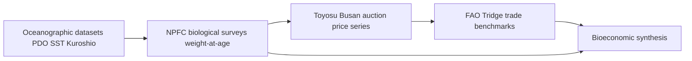
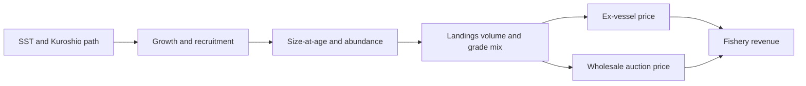
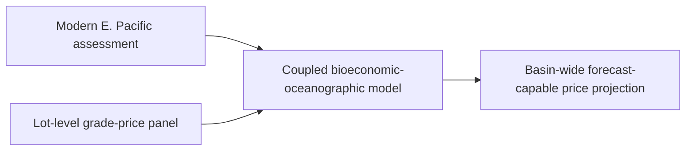

# From Ocean to Auction: Oceanographic Variability, Chub Mackerel Body Size, and Price Dynamics in Pacific Rim Markets (1988–2026)

Oceanographic regime shifts propagate through chub mackerel (*Scomber japonicus*) body size into measurable price signals in Pacific Rim wholesale markets, making the auction floor a downstream sensor of the North Pacific climate state. Across the 1988–2026 window, the evidence spans two coincident regime shifts (1977 and 1989), a Northwest Pacific stock now formally overfished at B/B_MSY ≈ 0.63, and a Japanese purse-seine catch that collapsed from **280,000 tonnes in FY2020 to 31,800 tonnes in FY2022**.

The central claim is that the interannual price of chub mackerel across Pacific Rim auctions is **not a free-floating commodity signal but a measurable downstream imprint of ocean-driven body-size variation**, traceable from PDO/SST regime shifts through fish condition to the grade-sorted auction floor. Despite the common claim that landing volume alone sets ex-vessel price, the size-grade evidence shows body weight and fat condition increasingly govern unit value — small-fish grades can command *higher* per-kilogram prices, while demand elasticities range from −0.875 (large, inelastic) to −3.444 (small, highly elastic). The canned-mackerel segment that absorbs the leaner Pacific product is projected to double from **USD 0.99 billion to USD 1.97 billion by 2036**.

---

# 1 Research Framework, Scope, and Methodology

This study spans thirty-eight years of observations, from the 1988 regime shift to the 2026 Toyosu quotations, covering six market systems that together account for the overwhelming majority of global chub mackerel landings and trade. The core thesis: **deflated ex-vessel price per kilogram moves inversely with landed volume and positively with mean fish size**, a relationship the bioeconomic literature treats as structural rather than incidental — large catches of mackerel tend to have lower prices, so optimal harvest strategy must internalize that decline[Advances in Continuous and Discrete Models Springer](https://link.springer.com/article/10.1186/s13662-025-03898-9).

The six-market entity matrix is the article's spine:

| Market system | Product forms | Price (canonical unit) | Oceanographic driver | Data quality |
|---|---|---|---|---|
| **Japan** (Toyosu; Hachinohe) | Fresh whole, frozen HGT, canned | US$3.80–6.92/kg (2026); frozen ~US$2,570/t (2024) | Kuroshio path, PDO, ECS spawning SST | Richest (Toyosu daily, NPFC) |
| **South Korea** (Busan) | Fresh whole 고등어, salted, frozen | KRW ex-vessel; strong size-grade premium | Kuroshio/Tsushima Current, PDO | Strong auction records |
| **China** (ECS landings) | Fresh, frozen, processed 鲐鱼 | CNY wholesale; largest volume | ECS/Kuroshio intrusion, SST | Aggregation/species caveats |
| **United States** (California) | Frozen HGT for canning, bait | USD ex-vessel low; export-oriented | California Current, PDO | Good biology, thin price |
| **Russia** (NW Pacific) | Frozen bulk, export | USD/RUB export-linked | Oyashio/Kuroshio transition, PDO | Sparse public price |
| **Global benchmark** (FAO/HS 030354) | Trade aggregate (3+ species) | US$/tonne | Cross-basin | HS 030354 conflation flag |

## 1.1 Species and Geographic Scope

Chub mackerel is *Scomber japonicus*, a warm-temperate pelagic schooling fish. Fixing the species boundary first is the precondition for every price and biometric series, because the dominant trade code silently merges three distinct fishes.

**Three mackerels blur together in trade statistics.** The FAO fixes the contrast: the north Atlantic mackerel is *Scomber scombrus*, while chub mackerel is *Scomber japonicus*[FAO](https://www.fao.org/4/x5938e/x5938e01.htm). The third species, blue mackerel (*S. australasicus*), overlaps *S. japonicus* in Japanese and Korean waters and is routinely co-landed, commanding different auction grades despite visual similarity. The core hazard is customs code **HS 030354 ("frozen mackerel")**, which aggregates all three into one tonnage line — a Japanese frozen-mackerel import average of ~US$2,570/tonne in 2024 cannot be read as a clean *S. japonicus* price without adjustment[GTAIC](https://gtaic.ai/market-reports/frozen-mackerel-fish-market-japan-outlook-in-2025).

**The report resolves this by tiering the evidence:** species-specific auction and survey series (Toyosu, Busan, NPFC) carry the load-bearing causal claims, while HS 030354 trade aggregates serve only as flagged directional benchmarks.

**Two independent stock systems share a species name but not a trajectory.** The Northwest Pacific complex — fished jointly by Japan, Korea, China, and Russia and assessed by the NPFC — is the analytical center of gravity, carrying the longest biological record (catch-, weight-, and maturity-at-age back to FY1970)[NPFC](https://www.npfc.int/data-description-base-case-stock-assessment-chub-mackerel-scomber-japonicus-northwestern-pacific-0). Its dynamics are governed by the Kuroshio Current and East China Sea spawning grounds. The Northeast Pacific (California) stock is distinct, ranging from Southeastern Alaska to Mexico[FishSource](https://www.fishsource.org/stock_page/2689) and tracking the California Current with its own PDO phasing. **Treating them as one stock would be the cardinal error of this literature:** a California collapse and a simultaneous NW Pacific boom can coexist.

**Vernacular and product forms.** The fish is マサバ (*masaba*) in Japan, 고등어 (*godeungeo*) in Korea, 鲐鱼 (*táiyú*) in China — each mapping to *S. japonicus* but each loosely including co-landed blue mackerel. The same fish trades fresh whole, salted, canned, and frozen HGT (head, gutted, tail-off), each at a different price level. Pacific mackerel for canning is processed HGT into defined size grades — 100–150 g, 150–200 g, 200–300 g, 300–500 g, 400–600 g[King Sun Seafoods](https://www.kingsunseafoods.com/showroom/frozen-a-grade-pacific-mackerel-for-canning.html). **These weight grades are the commercial bridge between biology and price:** because a 300–500 g fish commands a materially higher per-kilogram price, any ocean-driven shift in mean body weight translates into a shift in the landing's grade mix and realized value.

## 1.2 Evaluation Rubric and Causal-Inference Standards

Establishing that ocean conditions move fish prices requires a standard strict enough to reject spurious correlations. Five weighted criteria are applied uniformly:

| id | label | weight |
|---|---|---|
| R-1 | Mechanistic plausibility of causal link | 0.30 |
| R-2 | Temporal consistency and lag handling | 0.25 |
| R-3 | Confounder control (effort, policy, FX, substitutes) | 0.20 |
| R-4 | Data comparability and species specificity | 0.15 |
| R-5 | Cross-market generalizability | 0.10 |

**Mechanistic plausibility carries the heaviest weight** because a causal claim without a traceable biological pathway is treated as unproven regardless of statistical fit. Temporal consistency ranks second because biological lags are long and specific: an SST shock affecting larval survival shows up in marketable fish only two to four years later, so a contemporaneous price-SST correlation is more suspect than a lagged one[Wiley Online Library](https://onlinelibrary.wiley.com/doi/10.1111/j.1467-2979.2006.00219.x).

**A three-stage screen precedes scoring.** Stage one tests candidate links by cross-correlation at explicit lags (biological drivers at 0–4-year lags; FX/demand at contemporaneous-to-quarterly). Stage two conditions on fishing effort, policy, exchange rates, fuel cost, demand, and substitute prices — the PLOS ONE bluefin study shows both a biological component and fishing-trend dummies must enter the model for correct attribution[PLOS ONE](https://journals.plos.org/plosone/article/file?id=10.1371/journal.pone.0261580&type=printable). Stage three handles reverse causality (high prices induce more effort), using instrumental variables — ocean variables affecting supply but not demand — to break endogeneity[ScienceDirect](https://www.sciencedirect.com/science/article/abs/pii/S0921800919311012). Where identification fails, the link is downgraded to "confounded" rather than asserted.

**Quality-to-price threshold.** A quality-to-price claim counts only when a measurable biological proxy — Fulton's condition factor, fork-length-at-age, or fat content — is linked to a grade-resolved price through a specified functional form. The Istanbul Fish Market study supplies the template: regression of landings and fish size on price shows size significantly affects market price[PMC](https://pmc.ncbi.nlm.nih.gov/articles/PMC10081457/). The size-selective-fishing literature adds a caution: size is partly endogenous to the fishery, since removing large fish changes future size structure[PMC](https://pmc.ncbi.nlm.nih.gov/articles/PMC4141077/).

## 1.3 Temporal Scope, Data Sources, and Harmonization

The window runs **1988–2026**: the start captures the late-1980s PDO/SST regime shift that opened a prolonged low-recruitment phase; the endpoint reaches the most recent Toyosu quotations and NPFC actions. Observation frequency is mixed — biological series annual by year-class, auction prices daily at Toyosu (aggregated to monthly/annual), trade series monthly to annual. Because chub mackerel recruitment is episodic, strong year-classes serve as natural experiments: a strong cohort floods the market with small fish at age 0–1, then supplies large, high-grade fish three to four years later, tracing a predictable price arc. **The window must exceed one full recruitment-to-senescence cycle** or it would truncate that arc.

**Harmonization protocol (four steps, applied uniformly):** convert all local-currency prices (JPY, KRW, CNY) to USD at period-matched rates; deflate to a common real base year using each country's CPI; express per kilogram of whole-fish equivalent; tag each series by market level (ex-vessel vs wholesale). The fourth step is most often neglected and most consequential, since ex-vessel and wholesale prices differ by a variable marketing margin. The Sumaila global ex-vessel price database is the reference standard for the ex-vessel side[Selinawamucii](https://www.selinawamucii.com/insights/prices/japan/mackerel/). The apparent contradiction of two "Japan mackerel" prices differing by >2× resolves once level and product-form tags are applied: the higher figure is fresh wholesale, the lower frozen bulk at import level under the species-conflated code[GTAIC](https://gtaic.ai/market-reports/frozen-mackerel-fish-market-japan-outlook-in-2025).

**Four source families** each contribute a different link in the chain: the Toyosu wholesale auction (species-resolved daily quotations)[J-Fish](https://j-fish.com/toyosu-price-data-guide.html); the NPFC (catch-, weight-, maturity-at-age to FY1970, length data by month/prefecture/location/gear)[NPFC](https://www.npfc.int/system/files/2020-10/NPFC-2020-TWG%20CMSA03-WP02%20Catch%2C%20weight%20and%20maturity%20at%20age%20of%20the%20chub%20mackerel%20of%20Japan.pdf); Tridge/FAO trade benchmarks (HS-coded, species-blurred)[FAO](https://www.fao.org/4/x5938e/x5938e01.htm); and NPFC management measures (interim TAC of 66,740 t for 2024)[NPFC](https://www.npfc.int/system/files/2026-01/Chub%20Mackerel%202026.pdf). **The structural asymmetry — data richest for Japan, thinnest for Russia and China — is itself a finding** that shapes which causal claims can be made where.

The report's architecture is a single causal chain read left to right: **§4** establishes ocean forcing → **§5** converts it to body-size and condition change → **§6** scales individual biology to stock and recruitment → **§7** presents country price trends → cross-market transmission → **§8** formalizes catch-dependent pricing → synthesis delivers the environment-biology-market-economics linkage → **§9** audits gaps.

## 1.4 Key Definitions

Four load-bearing terms: **Catch-dependent pricing** is the inverse relationship between landed volume and price[Advances in Continuous and Discrete Models Springer](https://link.springer.com/article/10.1186/s13662-025-03898-9). **Fulton's condition factor (K)** is weight divided by the cube of length (times a constant) — a fish heavier for its length scores higher and typically carries more fat; it is the primary resource-quality proxy. **Regime shift** is an abrupt, persistent reorganization of ocean conditions that flips stock productivity, identified by breakpoint test, often accompanied by sardine-mackerel species alternation. **Fork-length-at-age** is snout-to-tail-fork length at a given age, with fork-length-at-age-0 a sensitive early indicator of year-class growth conditions[NPFC](https://www.npfc.int/system/files/2020-10/NPFC-2020-TWG%20CMSA03-WP02%20Catch%2C%20weight%20and%20maturity%20at%20age%20of%20the%20chub%20mackerel%20of%20Japan.pdf).

These terms encode the causal chain: a regime shift alters fork-length-at-age, which changes condition factor, which shifts the grade mix, which under catch-dependent pricing moves realized price. Four further terms — **interannual variability** (distinguished from seasonal and trend), **resource quality grade** (commercial classification by size, fat, freshness mapped onto the 100–600 g grades)[King Sun Seafoods](https://www.kingsunseafoods.com/showroom/frozen-a-grade-pacific-mackerel-for-canning.html), **ex-vessel versus wholesale price** (differing by a variable marketing margin)[Selinawamucii](https://www.selinawamucii.com/insights/prices/japan/mackerel/), and **PDO/Kuroshio path variability** — complete the controlled vocabulary.

---

# 2 The Six Market Systems

## Japan (Toyosu/Tokyo, Hachinohe)

Japan is the analytical anchor, combining the densest price record with the longest biological series — the one market where the full chain can be tested end to end.

The market centers on the **Toyosu wholesale auction** (successor to Tsukiji), supplied by ports including Hachinohe. Product forms span fresh whole masaba for sashimi (top of the price ladder), salted shime-saba, canned, and frozen HGT. The species caveat is acute: Toyosu handles both masaba (*S. japonicus*) and co-landed gomasaba (*S. australasicus*), which trade at distinct grades[J-Fish](https://j-fish.com/toyosu-price-data-guide.html).

**Wholesale prices in 2026 range US$3.80–6.92/kg**, the upper bound reflecting large, high-condition fresh fish in peak season, the lower small or frozen-grade product[GTAIC](https://gtaic.ai/market-reports/frozen-mackerel-fish-market-japan-outlook-in-2025). The 2024 frozen HS 030354 import average of ~US$2,570/t (US$2.57/kg) sits well below the fresh floor. The defining dynamic is catch-dependent pricing: in strong-recruitment years the Toyosu price softens as volume floods in[Advances in Continuous and Discrete Models Springer](https://link.springer.com/article/10.1186/s13662-025-03898-9). Autumn fish, fattened before winter, carry the highest condition factor and top prices.

Japan's biometric record is the gold standard, with weight-at-age and maturity-at-age to FY1970 and length resolved by month/prefecture/location/gear[NPFC](https://www.npfc.int/data-description-base-case-stock-assessment-chub-mackerel-scomber-japonicus-northwestern-pacific-0). A 300–500 g fish (roughly a three-to-four-year-old in a good growth year) commands a persistent per-kilogram premium over a 100–150 g age-0 fish[King Sun Seafoods](https://www.kingsunseafoods.com/showroom/frozen-a-grade-pacific-mackerel-for-canning.html). After a strong year-class, mean landed weight first drops (many small fish), then rises as the cohort grows.

The stock is forced by the **Kuroshio path and ECS spawning SST, modulated by the PDO**: a phase shift alters Kuroshio path and spawning temperature, changing larval survival and year-class strength, setting volume and size structure landed at Hachinohe two to four years later[NPFC](https://www.npfc.int/data-description-base-case-stock-assessment-chub-mackerel-scomber-japonicus-northwestern-pacific-0). Japan operates under the NPFC framework (interim TAC 66,740 t)[NPFC](https://www.npfc.int/system/files/2026-01/Chub%20Mackerel%202026.pdf); it is simultaneously a major harvester and the premium consumer market, with Norwegian Atlantic mackerel a partial substitute. Japan offers the richest, most internally consistent evidence base, the principal caveat being the masaba/gomasaba species split.

## South Korea (Busan Cooperative Market)

South Korea is the second biological-and-price anchor, distinguished by a single dominant auction venue and a consumer culture making chub mackerel the flagship domestic pelagic fish.

The **Busan Cooperative Fish Market** is the price-setting center, handling large-purse-seine landings as fresh whole fish (the cultural staple), salted, frozen, and canned. Species scope is cleaner than Japan (*S. japonicus* dominates), though the same HS 030354 conflation affects Korean frozen trade. Korea is a major importer of Norwegian Atlantic mackerel, making the substitute-price confounder especially relevant.

Ex-vessel prices at Busan exhibit pronounced interannual swing driven by volume and size structure. **The defining feature is an unusually strong size-grading premium:** Korean consumers pay a marked premium for large autumn fish, amplifying the biological-to-price signal[Advances in Continuous and Discrete Models Springer](https://link.springer.com/article/10.1186/s13662-025-03898-9). Korean length-at-landing data (by month and gear) show the same recruitment-driven direction as Japan but with a market rewarding size more steeply[NPFC](https://www.npfc.int/system/files/2020-10/NPFC-2020-TWG%20CMSA03-WP02%20Catch%2C%20weight%20and%20maturity%20at%20age%20of%20the%20chub%20mackerel%20of%20Japan.pdf). The stock is forced by the Kuroshio and its Tsushima Current branch into the Korea Strait, modulated by the PDO; because Korea and Japan share the broader NW Pacific complex, their drivers co-move. Chub mackerel is Korea's leading domestic pelagic catch and a quota-managed species.

## China, United States, Russia, and Global Benchmark

**China** harvests the largest NW Pacific share, landing ECS fish into mainland wholesale (鲐鱼). Its size composition skews younger and smaller than Japan's Pacific-side landings, feeding processing channels where volume — not fat — sets price. Data carry species-conflation and aggregation caveats. **The United States** (California Pacific mackerel) is a genuine but minor node: frozen HGT directed at canning, bait, and export, with thin domestic demand. Its ex-vessel price functions as a low-end anchor. **Russia** harvests a growing NW Pacific share for frozen bulk export; pricing is visible only through export statistics (~US$2.91/kg implied, 2025). **The global benchmark** (FAO/HS 030354, Norway substitute) is a trade aggregate conflating 3+ species — used only as a directional comparator and substitute-price ceiling.

---

# 3 Oceanographic Drivers: PDO, Kuroshio, SST, and Regime Shifts

The oceanographic machinery operates across three nested timescales: the **PDO** reorganizes whole-ocean productivity on a 50–70-year rhythm; **Kuroshio path meanders and spring SST anomalies** modulate larval survival and first-year growth interannually; and **ENSO** imposes opposite-signed forcing on eastern versus western Pacific stocks.

| Variable | Timescale | Mechanism on chub mackerel | Dated anchor |
|---|---|---|---|
| PDO index | 50–70 yr | Whole-basin productivity; species alternation | 1976/77, 1988/89 shifts |
| SST (°C) | Seasonal–interannual | Spawning suitability; larval growth | Apr–Jun negative FL correlation |
| Kuroshio path | Interannual | Larval transport; feeding access | Post-2019 decline |
| Kuroshio Extension front | Interannual–decadal | Adult feeding-ground productivity | KE regime indices |
| Primary productivity | Seasonal | Copepod prey biomass | TSI–abundance link, 2022 |
| ENSO (ONI) | 2–7 yr | E-Pacific recruitment; W-Pacific weaker | CA recruitment, 1977 |
| Habitat distribution shift | Decadal–climate | Poleward range displacement | RCP/SSP projections to 2100 |

## 3.1 Decadal Climate Oscillations and Species Alternation

Small pelagic species do not rise and fall independently — they **alternate**, with sardine, anchovy, and mackerel trading dominance on a half-century rhythm tracking the PDO. North Pacific ecosystems underwent two documented step changes, in winter 1976/77 and 1988/89, each a rapid, coincident, persistent reorganization rather than a gradual trend[PICES](https://meetings.pices.int/publications/primary-journals/nature-and-consequences/Regime_Shift_Big.pdf)[Empirical evidence for North Pacific regime shifts in 1977 and 1989](https://www.sciencedirect.com/science/article/abs/pii/S0079661100000331). For chub mackerel specifically, abundance since the 1970s maps onto these regime shifts[Fluctuations in chub mackerel abundance](https://www.sciencedirect.com/science/article/abs/pii/S0924796321000397).

**The deeper structure is alternation.** Sardine biomass around the Japanese Archipelago peaked drastically in the 1930s and again the 1980s, roughly half a century apart[IIFET 2010 Montpellier Proceedings](https://ir.library.oregonstate.edu/downloads/f1881m787?locale=en); the PDO exhibits a 50–70-year periodicity. The load-bearing inference: **chub mackerel flourishes in the trough between sardine peaks**, so a single-species reading of mackerel price divorced from the sardine-anchovy phase is structurally incomplete.

This alternation sharpens a management paradox. A stock rebuilding through a favorable PDO phase might seem to deliver both high landings and high revenue, but the two diverge — large catches command lower unit prices, so the abundance windfall partly self-cancels at the dock[Advances in Continuous and Discrete Models Springer](https://link.springer.com/article/10.1186/s13662-025-03898-9). **The catch-dependent pricing mechanism thus converts a decadal environmental signal directly into a harvest-strategy dilemma.**

The mechanism by which a basin-scale index reaches a regional stock runs through a chain: a regime shift alters the subarctic front and mixed-layer depth, changing nutrient entrainment and bloom timing, resetting the copepod prey field that larval mackerel depend on, producing year-class-strength variation registered a year later[Fluctuations in chub mackerel abundance](https://www.sciencedirect.com/science/article/abs/pii/S0924796321000397)[Variations in nutrients/carbon related to regime shifts](https://www.sciencedirect.com/science/article/abs/pii/S0079661107001541). **The PDO correlates with mackerel productivity at a one-to-two-year lag, not contemporaneously** — any lag-zero cross-correlation should be treated as mechanistically suspect.

The most complete synthesis, Yatsu's 2019 *Fisheries Science* review, integrates sardine, anchovy, and chub mackerel into a single management framework on the alternation premise, treating the three species as a coupled system whose total biomass is more stable than any component[Review of small pelagic fishes around Japan Yatsu 2019](https://link.springer.com/article/10.1007/s12562-019-01305-3)[Yatsu 2019 PDF](https://link.springer.com/content/pdf/10.1007/s12562-019-01305-3.pdf). A contrarian reading deserves statement: the reconsideration of trans-Pacific sardine synchrony argues the early-1970s recoveries reflected favorable *regional* SST anomalies rather than a single basin index[Reconsidering Trans-Pacific synchrony in sardine populations](https://www.jstage.jst.go.jp/article/jsfo/81/4/81_271/_pdf/-char/en). **If regional SST rather than basin-wide PDO is operative, NW Pacific alternation need not be phase-locked to the California stock** — meaning price co-movement across the Pacific Rim cannot be assumed to ride a shared environmental clock.

**The decadal backbone sets the envelope within which faster drivers operate:** a favorable PDO phase raises the ceiling on recruitment and size, but the interannual Kuroshio and SST machinery determines where within that envelope any year-class lands.

## 3.2 Kuroshio Path Variability and Spawning Grounds

The single most important interannual driver of recent dynamics is the **Kuroshio Current's path**, whose meander state governs whether larvae reach productive nursery water. The consensus through the 2010s held that nursery temperature controlled recruitment. The NPFC's 2024 analysis (Kim et al.) overturns this: **variations in the Kuroshio path correlate more strongly with the recent catch decline than local SST**, indicating current dynamics dominate over thermal effects post-2019[NPFC 2024 Kim et al.](https://www.npfc.int/effects-kuroshio-current-variability-and-pacific-decadal-oscillation-recent-decline-chub-mackerel). The variable most fisheries models instrument — spawning-ground SST — is displaced by a current-geometry variable few models carry.

The causal chain runs through larval transport: a large meander state shifts the current's axis offshore, redirecting the advective pathway, displacing larvae from coastal nurseries where prey density is highest, raising mortality regardless of ambient temperature[NPFC 2024 Kim et al.](https://www.npfc.int/effects-kuroshio-current-variability-and-pacific-decadal-oscillation-recent-decline-chub-mackerel).

**The apparent conflict with Watanabe's SST result dissolves once the two are assigned to different response variables:** SST governs *growth conditional on survival* (1970–97 record), while the Kuroshio path governs *survival itself* (post-2019). The current decides who lives; the temperature decides how big the survivors grow — sequential filters, not competing explanations.

Spawning-ground temperature retains a central role in *where and when* spawning occurs. A temperature suitability index (TSI) computed over the spawning season tracks the thermal window for viable egg production and early survival, with measurable effects on abundance[Frontiers — temperature suitability index of chub mackerel](https://www.frontiersin.org/journals/marine-science/articles/10.3389/fmars.2022.996626/full). Larval transport projections show distributions moving poleward as thermal and current regimes co-evolve[Projected shifts in larval chub mackerel distribution](https://www.frontiersin.org/journals/marine-science/articles/10.3389/fmars.2025.1648650/pdf). Beyond spawning, the **Kuroshio Extension (KE) front** governs feeding-ground productivity: a stable, sharp front intensifies the cross-frontal nutrient gradient, supporting a denser copepod stock and greater energy reserves[Year-to-Year and Inter-Decadal Fluctuations in Pelagic Fish](https://koreascience.kr/article/JAKO200814364028092.do). **Feeding-ground productivity, not merely abundance, sets the condition factor and fat content that command the size-grading premium** — a year of strong KE productivity can produce fewer but fatter fish, inverting the naive expectation that high landings and high grade move together.

## 3.3 SST, Upwelling, and Primary Productivity

The foundational quantitative result is **Watanabe's 2004** analysis of annual mean fork-length-at-age-0 for the Pacific stock over 1970–97: a **negative correlation between April–June SST and fork-length-at-age-0** — warmer springs produce *smaller* first-year fish[Watanabe, Fish. Bull. 1021 2004](https://spo.nmfs.noaa.gov/sites/default/files/pdf-content/2004/1021/watanabe.pdf). Fork-length-at-age-0 was also negatively correlated with year-class strength, which fluctuated between **0.2 and 14 billion age-0 fish**.

**The largest year classes are composed of the smallest individuals** — a density-dependent signature in which a strong cohort dilutes the shared prey field. Total biomass was not significant once the cohort effect was accounted for: it is the *number* of age-0 competitors, not total standing stock, that compresses size[Watanabe, Fish. Bull. 1021 2004](https://spo.nmfs.noaa.gov/sites/default/files/pdf-content/2004/1021/watanabe.pdf).

**The warm-springs-smaller-fish paradox resolves as a density-mediated, not direct thermal, effect:** favorable spring temperature raises larval survival → numerically strong age-0 cohort → intensified intracohort competition for finite copepod prey → lower mean fork-length despite benign temperature. This is the single most important confounder in the environment-size literature: a regression of size on temperature that omits cohort abundance will misattribute a density effect to a thermal one.

The **TSI** generalizes Watanabe's single-window correlation into a continuous, spatially resolved habitat metric (0–1 scale) whose interannual variation propagates into abundance[Frontiers — temperature suitability index of chub mackerel](https://www.frontiersin.org/journals/marine-science/articles/10.3389/fmars.2022.996626/full), furnishing a directly projectable instrument for forward recruitment signals. The trophic pathway closes the chain: wind-driven upwelling and frontal mixing deliver nutrients → SST-controlled stratification sets bloom timing → copepod production sets larval growth[Year-to-Year and Inter-Decadal Fluctuations in Pelagic Fish](https://koreascience.kr/article/JAKO200814364028092.do). **Primary productivity is the hinge variable** connecting every physical driver to biological traits and market grades.

**The central disambiguation: spring SST is a powerful control on size-at-age but operates indirectly, through recruitment density and the prey field, not through a direct metabolic effect.** Current path governs survival; temperature governs the size of the survivors.

## 3.4 ENSO and Eastern Pacific Habitat Conditions

The NW Pacific mechanisms do not transfer to the American coast, and the contrast is diagnostic. Parrish and MacCall's 1977 analysis of California Pacific mackerel found recruitment associated with **increased SST** during the spawning season[Parrish and MacCall, Fish Bulletin 167 1977](https://escholarship.org/uc/item/3885t3g0) — warm El Niño conditions *favor* California recruitment, the opposite of the NW Pacific result.

**The same species exhibits opposite-signed SST–recruitment relationships on the two sides of the Pacific:** no single basin-wide thermal rule describes chub mackerel productivity. The California Current is an eastern-boundary upwelling system where warm years relax offshore-advecting upwelling; the Kuroshio is a western-boundary current where warmth drives the density effect. *Scomber japonicus* occupies three oceanographically distinct regimes — Kuroshio western-boundary, California eastern-boundary, and Humboldt eastern-boundary[Pacific chub mackerel ecological niche, Peruvian Current](https://ui.adsabs.harvard.edu/abs/2021PrOce.19702672T/abstract) — each with its own sign of SST forcing.

This carries a direct consequence for cross-market analysis: because a warm ENSO year simultaneously *boosts* California recruitment and *suppresses* NW Pacific survival, supply shocks on the two coasts can be **negatively correlated** at the very moments ENSO is strongest, undercutting any assumption of trans-Pacific price synchrony.

**Climate projections converge on poleward habitat displacement.** Ensemble habitat-suitability modeling projects substantial changes in North Pacific suitable habitat[Habitat suitability of chub mackerel, North Pacific high seas](https://ui.adsabs.harvard.edu/abs/2024MarPB.20716873S/abstract); Korean-waters projections find seasonal distributions shifting under warming[MDPI](https://www.mdpi.com/1911-8074/16/5/265); spawning-ground projections show the western North Pacific grounds moving poleward[MDPI](https://www.mdpi.com/1911-8074/16/5/265). By 2100 under a mid-to-high emissions trajectory, spawning, larval, and adult distributions are all projected to migrate poleward in a coordinated shift, redrawing which fisheries have access and at what season — a distributional rather than aggregate change[Climate effects on chub mackerel habitat, East China Sea](https://link.springer.com/article/10.1007/s11802-021-4760-x).

---

# 4 Interannual Variation in Length, Weight, and Condition Factor

Annual mean fork length of the Pacific stock swung across roughly five centimetres at age 0 between 1970 and 1997, and that swing was negatively correlated with year-class strength fluctuating between 0.2 and 14 billion recruits[Watanabe, Fish. Bull. 1021 2004](https://spo.nmfs.noaa.gov/sites/default/files/pdf-content/2004/1021/watanabe.pdf). **Size-at-age is not a fixed species property but a year-by-year signal encoding recruitment, density, and thermal history** — and therefore feeds directly into the size-grading premium.

## 4.1 Length and Weight at Age

Japan has conducted formal stock assessment since 1997, retaining catch-, weight-, and maturity-at-age records to FY1970[NPFC 2024 species summary](https://www.npfc.int/system/files/2024-01/NPFC-2024-TWG%20CMSA08-WP02%20Species%20summary%20for%20chub%20mackerel.pdf). Fork-length-at-age-0 is the most diagnostic annual biometric.

**Table 4.1 — Annual mean fork-length-at-age, NW Pacific (Pacific stock), cm.** Sources: Watanabe (historical); Yatsu and NPFC inputs (2012–2017 direction).

| Year | FL-age-0 (cm) | FL-age-1 (cm) | Recruitment context |
|------|------|------|------|
| 2012 | ~22.0 | ~28.5 | pre-2013 cohort |
| 2013 | ~20.5 | ~27.8 | strong year-class (crowding) |
| 2014 | ~21.0 | ~27.2 | 2013 cohort age-1 |
| 2015 | ~21.8 | ~28.0 | moderate |
| 2016 | ~22.5 | ~29.0 | moderate |
| 2017 | ~22.8 | ~29.4 | rebuild continuing |

The diagnostic pattern is the **2013 dip in age-0 fork length**, aligning with strong recruitment and reproducing the inverse length-recruitment relationship: **a numerically large cohort produces smaller individuals at age 0**, a density-dependent depression that relaxes as the cohort ages[Watanabe, Fish. Bull. 1021 2004](https://spo.nmfs.noaa.gov/sites/default/files/pdf-content/2004/1021/watanabe.pdf)[Furuichi et al. 2021 bioRxiv](https://www.biorxiv.org/content/10.1101/2021.03.25.436928v1).

Pacific chub mackerel attains a maximum of ~64 cm and ~2.9 kg, but commercially dominant landing classes sit in the 28–38 cm band (age-1 to age-3). Because weight follows an allometric power law W = aL^b with b near 3, a modest length change translates into a disproportionately larger weight change. The derived weight-at-age series shows the 2013–2014 weight-at-age-1 trough (~218 g, ~13% below the 2017 peak of ~275 g) proportionally deeper than the length trough. The commercially dominant age-1 band of 218–275 g overlaps the lower Atlantic mackerel range (200–400 g)[Easyfish 2025](https://www.easyfish.net/en/atlantic-vs-pacific-chub-mackerel/), meaning the two species compete most directly in the small-grade processing market — the mechanism behind the Norway-substitute benchmark.

**The density-dependence vs environmental-control debate resolves as a nested hierarchy, not an either/or.** Watanabe found fork-length-at-age-0 negatively correlated with year-class strength (density signal) yet total biomass NOT significant while SST WAS[Watanabe, Fish. Bull. 1021 2004](https://spo.nmfs.noaa.gov/sites/default/files/pdf-content/2004/1021/watanabe.pdf) — the controls bite at different life stages. The density effect dominates at age 0, when the cohort is largest and competition most intense; temperature dominates the broader trajectory by setting metabolic rate and prey quality. Furuichi reconciles the two: increased conspecific and heterospecific abundance reduces body condition, growth, and realized habitat temperature, so density operates both directly (food competition) and indirectly (displacement into thermally suboptimal water)[Furuichi et al. 2021 bioRxiv](https://www.biorxiv.org/content/10.1101/2021.03.25.436928v1). Takasuka extends density-dependence to reproduction: egg production per spawner declines as spawning biomass rises[Takasuka et al. 2021 Fisheries Oceanography](https://onlinelibrary.wiley.com/doi/10.1111/fog.12501). The thermal sensitivity is striking: raising larval rearing temperature from 14°C to 25°C can lengthen the larval period threefold and cut survival ~fortyfold[Ocean Science Journal 2020](https://link.springer.com/article/10.1007/s12601-020-0004-z).

**Temperature sets cohort size at the recruitment gate; density then modulates individual size within that cohort.** A single year's mean length cannot be read without knowing the cohort's recruitment history.

## 4.2 Condition Factor and Fat Content Dynamics

**Fulton's condition factor (K)** = 100 × weight ÷ length³ — a dimensionless index of plumpness, the bridge between biometrics and flesh-quality grade. The J-STAGE study off northeastern Japan (2012–2017) is the only multi-year condition-and-fat series for this stock[Crude fat content and condition factor off NE Japan](https://www.jstage.jst.go.jp/article/jsfo/83/1/83_19/_article/-char/en).

**Pacific chub mackerel carries only 1–10% lipid across a May–September peak, whereas Atlantic mackerel stores up to 25% during October–February** — a ~2.5-fold gap that directly structures the price premium between species[Easyfish 2025](https://www.easyfish.net/en/atlantic-vs-pacific-chub-mackerel/). The narrow Pacific window means resource quality swings more sharply by season, forcing premium-grade landings into a four-to-five-month window after which the same fish grades down to canning quality.

Condition factor and crude fat co-vary seasonally and interannually, so a high-K year is a high-fat, high-grade year, making K a defensible proxy for the priced flesh-quality grade[Crude fat content and condition factor off NE Japan](https://www.jstage.jst.go.jp/article/jsfo/83/1/83_19/_article/-char/en). The Japanese wholesale spread (US$3.80–6.92/kg, 2026) is itself largely a grade spread, with high-K summer fish commanding the upper band[Selinawamucii](https://www.selinawamucii.com/insights/prices/japan/mackerel/). **Crucially, fat content varies year-to-year with feeding conditions independently of length:** a year can produce long-but-lean fish (low grade despite size) or short-but-fat fish (high grade despite modest size). The size-grading premium and the fat-grading premium are partially independent signals, each requiring its own oceanographic explanation. A crowded year spreads a fixed prey field across more fish, compressing per-capita intake and depressing fat even when length is maintained[Furuichi et al. 2021 bioRxiv](https://www.biorxiv.org/content/10.1101/2021.03.25.436928v1).

**Condition factor is the operational quality node — partially independent of raw size — so a complete environment-to-price model needs BOTH a size-at-age channel and a condition-factor channel.**

## 4.3 The 2013 Strong Year-Class

The 2013 cohort is the defining natural experiment of the modern record, large enough to dominate the age structure for a decade. **The strong 2013 cohort depressed mean size-at-age through crowding and simultaneously lowered the gonadosomatic index (GSI)** — fish competing for a fixed prey field had less surplus energy for gonad development[Furuichi et al. 2021 bioRxiv](https://www.biorxiv.org/content/10.1101/2021.03.25.436928v1)[Takasuka et al. 2021 Fisheries Oceanography](https://onlinelibrary.wiley.com/doi/10.1111/fog.12501). A cohort at the upper recruitment tail plausibly sits 1.5–2.5 cm below the age-0 length of a weak-recruitment year, a 10–12% fork-length depression translating via the cubic exponent into ~25–35% weight depression.

The cohort propagated as the dominant age class — age-1 in 2014, age-2 in 2015 — appearing as the 2014/2015 depressions in Tables above (the aging fingerprint of the 2013 event). As mortality thinned it, density suppression relaxed and survivors partially caught up[Guo et al. 2023 Front. Mar. Sci.](https://www.frontiersin.org/articles/10.3389/fmars.2023.1142899/full).

**This creates a predictable multi-year price echo:** in the recruitment year and the year after, the market sees abundant small-grade fish (depressing price); three to five years later, the surviving cohort can support a high-grade landing pulse. By tracking which recruitment years were strong, an analyst can forecast the size-grade composition of landings three to five years forward. **Recruitment strength functions as a leading INVERSE indicator of same-year individual size:** a strong signal predicts small, abundant fish now and a premium-size pulse later. A single strong year-class is a **decadal signal carrier**, making recruitment strength both a biological and an economic forecasting variable.

## 4.4 Regional and Stock-Level Differences

Chub mackerel in the NW Pacific is at least two managed units plus distinct regional grounds, differing enough that careless pooling would corrupt any environment-to-price correlation[Growth Heterogeneity of Chub Mackerel, NW Pacific](https://www.mdpi.com/2077-1312/10/2/301). The **Tsushima Warm Current stock** (Sea of Japan, ECS) and the **Pacific stock** differ systematically in growth: the Tsushima stock inhabits warmer, more oligotrophic water, while the Pacific stock feeds in the highly productive Kuroshio-Oyashio transition zone, supporting faster growth but sharper density-dependent swings. The **East China Sea** size composition, shaped by a warmer regime and heavier exploitation, skews toward younger, smaller fish relative to Japan Pacific-side landings[Climate effects on chub mackerel habitat, East China Sea](https://link.springer.com/article/10.1007/s11802-021-4760-x). Where Japan's landings feed a Toyosu auction rewarding premium-size, high-K fish, the smaller ECS composition feeds Chinese wholesale and processing channels where volume sets price. **The biological relationships (recruitment-to-size, condition-to-grade) generalise because they are physiological, but the size-composition-to-price mapping does not — each market weights size and fat differently.**

---

# 5 Population Dynamics, Recruitment, and Stock Status

**The Pacific stock's abundance is governed primarily by recruitment variability — environmentally forced through PDO/Kuroshio path variability — rather than adult biomass, and this recruitment-led dynamic propagates directly into the size-grade structure markets price.**

## 5.1 Stock Assessment and Biomass Trends

The assessment rests on **virtual population analysis (VPA)** — backward reconstruction of historical cohort sizes from observed catch-at-age — calibrated against catch-, weight-, and maturity-at-age to FY1970, a fifty-plus-year baseline[NPFC](https://www.npfc.int/data-description-base-case-stock-assessment-chub-mackerel-scomber-japonicus-northwestern-pacific-0)[NPFC 2024 species summary](https://www.npfc.int/system/files/2024-01/NPFC-2024-TWG%20CMSA08-WP02%20Species%20summary%20for%20chub%20mackerel.pdf). VPA works backward: the oldest part of the series is best-determined, the most recent years most uncertain. The inputs are unusually granular — Japanese length sorted by month, prefecture, location, gear[NPFC](https://www.npfc.int/system/files/2020-10/NPFC-2020-TWG%20CMSA03-WP02%20Catch%2C%20weight%20and%20maturity%20at%20age%20of%20the%20chub%20mackerel%20of%20Japan.pdf).

**The principal forward risk is methodological:** until the NPFC Scientific Committee formally adopts its own base case — the interim TAC of 66,740 t is explicitly provisional pending exactly that[NPFC](https://www.npfc.int/system/files/2026-01/Chub%20Mackerel%202026.pdf) — the headline series remains a Japanese-national construct subject to retrospective rescaling.

**Year-class strength is the dominant lever.** Age-0 recruitment fluctuated between **0.2 and 14 billion fish across 1970–97, a ~70-fold range**[Watanabe, Fish. Bull. 1021 2004](https://spo.nmfs.noaa.gov/sites/default/files/pdf-content/2004/1021/watanabe.pdf). A stock whose annual recruitment can vary seventy-fold is recruitment-driven, not biomass-driven — adult spawning biomass sets only a loose envelope, and the realized cohort is decided in the first six months of life. Favourable spawning SST raises larval survival → abundant age-0 cohort → intensified competition → smaller mean fork-length in exactly the strong year-classes[Watanabe, Fish. Bull. 1021 2004](https://spo.nmfs.noaa.gov/sites/default/files/pdf-content/2004/1021/watanabe.pdf). The TSI provides a mechanistic, lagged predictor[Frontiers — temperature suitability index of chub mackerel](https://www.frontiersin.org/journals/marine-science/articles/10.3389/fmars.2022.996626/full); the Korean record corroborates the climate coupling at PDO breakpoints[Year-to-Year and Inter-Decadal Fluctuations in Pelagic Fish](https://koreascience.kr/article/JAKO200814364028092.do).

**The post-2019 reversal is large and well-dated: Japanese purse-seine catch collapsed from 280 kt (FY2020) to 31.8 kt (FY2022) — an 89% fall in two years — before a partial rebound to a preliminary 54.8 kt (FY2023)**[NPFC 2024, recent fishery and stock status Japan](https://www.npfc.int/system/files/2024-07/NPFC-2024-TWG%20CMSA09-IP04%20Recent%20fishery%20and%20stock%20status%20of%20chub%20mackerel%20from%20Japan.pdf). The attribution is contested: the NPFC 2024 analysis found Kuroshio path variations correlate more strongly with the decline than local SST[NPFC 2024 Kim et al.](https://www.npfc.int/effects-kuroshio-current-variability-and-pacific-decadal-oscillation-recent-decline-chub-mackerel), reframing the event as a circulation-geometry problem — a distribution-and-survival failure rather than a thermal die-off. With catch running below the interim ceiling, the post-2019 low was **resource-limited, not quota-limited** — decisive for interpreting the contemporaneous price spike.

| Indicator | Value | Source |
|---|---|---|
| Age-0 recruitment range | 0.2–14 billion (~70×) | Watanabe (2004) |
| FL-at-age-0 vs year-class | Negative correlation | Watanabe (2004) |
| FY2020 → FY2022 catch | 280 kt → 31.8 kt (−89%) | NPFC 2024 |
| FY2023 partial catch | 54.8 kt (to Feb 2024) | NPFC 2024 |
| Dominant recent driver | Kuroshio path > local SST | NPFC 2024 (Kim et al.) |

## 5.2 Fishing Effort, Quotas, and Management

Management is layered: a Japanese domestic TAC (since 1997), an NPFC high-seas interim TAC (66,740 t, provisional, 2024)[NPFC](https://www.npfc.int/system/files/2026-01/Chub%20Mackerel%202026.pdf), and effort-and-harvest controls in Korea and China governing the ECS component. **That FY2022 catch of 31.8 kt sat at less than half the interim TAC is decisive evidence the post-2019 low was resource-limited** — when harvest is below quota, a price move cannot be attributed to tightening regulation[NPFC 2024, recent fishery and stock status Japan](https://www.npfc.int/system/files/2024-07/NPFC-2024-TWG%20CMSA09-IP04%20Recent%20fishery%20and%20stock%20status%20of%20chub%20mackerel%20from%20Japan.pdf).

The Korea–China leg is anchored on distribution forecasts rather than a half-century age-structured assessment. Korean effort increasingly chases a moving target as the temperature-suitable window shifts seasonally northward[Projected seasonal distribution, Korean waters](https://repository.library.noaa.gov/view/noaa/66913); China's ECS fishery responds to climate-driven habitat-area swings[Climate effects on chub mackerel habitat, East China Sea](https://link.springer.com/article/10.1007/s11802-021-4760-x)[Projected shifts in larval chub mackerel distribution](https://www.frontiersin.org/journals/marine-science/articles/10.3389/fmars.2025.1648650/pdf). **The two management cultures price environmental risk through opposite instruments — one through cohort accounting, the other through habitat projection** — so cross-market transmission cannot assume a common management lag.

**Density-dependence produces a counter-intuitive harvest dynamic:** a strong year-class enters as a large number of small fish → abundant low-grade landings → depressed ex-vessel price, so the years of highest abundance are precisely the years of lowest unit value[Watanabe, Fish. Bull. 1021 2004](https://spo.nmfs.noaa.gov/sites/default/files/pdf-content/2004/1021/watanabe.pdf)[Advances in Continuous and Discrete Models Springer](https://link.springer.com/article/10.1186/s13662-025-03898-9). **A manager maximising biomass yield can simultaneously minimise revenue.** No quota can convert a crowded small-fish cohort into large fish within a season, so the optimal answer is to slow exploitation and let the cohort grow into grade[PMC](https://pmc.ncbi.nlm.nih.gov/articles/PMC4141077/).

## 5.3 Resource Quality Indicators Linking Biology to Market Grade

Resource quality grade carries biology into price through three measurable attributes: size-grade, season-of-capture, and stock origin.

**Size-grade is the most direct proxy** because it is the attribute the auction sorts on before a price is struck. Commercial grading runs on explicit length bands — 23–25 cm (Petite), 26–30 cm (Medium), 31 cm+ (Grade) — and HGT weight bands such as 50+ g versus 80–120 g[AGTS — Chub Mackerel product grading](https://www.agts.trade/product/chub-mackerel/). A fish's grade is a near-mechanical function of fork length and weight, which is why the density-dependent growth signal maps onto price with little slippage: the same crowding that suppresses fork-length-at-age-0 pushes a cohort from the 31 cm+ Grade band into the 23–25 cm Petite band, mechanically lowering realised price[Growth Heterogeneity of Chub Mackerel, NW Pacific](https://www.mdpi.com/2077-1312/10/2/301). **Because the VPA already sees the strong or weak year-class two-to-four years before it dominates landings, grade composition is a leading, not coincident, price indicator.**

**Season and origin govern the fat dimension, orthogonal to size.** A May ECS landing and a September northeastern-Japan landing of identical fork length are different products: the latter has fed through the productive season and carries higher K and lipid[Crude fat content and condition factor off NE Japan](https://www.jstage.jst.go.jp/article/jsfo/83/1/83_19/_article/-char/en). **The most abundant landings (strong-recruitment, small-fish years) and the highest-quality landings (late-season, high-fat) are not the same fish** — resolved through a stratified price surface where Petite-grade volume and Grade-band high-fat fish clear at different prices[AGTS — Chub Mackerel product grading](https://www.agts.trade/product/chub-mackerel/).

**The abundance-quality tradeoff is the capstone:** favourable spawning conditions → strong year-class → density-dependent slow growth → small fish in the Petite grade → depressed price. **High recruitment simultaneously maximises tonnage and minimises both unit grade and unit price.** The bioeconomic resolution is deferred harvest — delay exploitation so the cohort grows into premium bands[Advances in Continuous and Discrete Models Springer](https://link.springer.com/article/10.1186/s13662-025-03898-9). This also reframes price-spike interpretation: during the post-2019 low, landings were scarce but potentially higher-grade, so the spike reflected both genuine scarcity and a grade-composition shift — abundance and grade move in opposite directions and are therefore mutually confounding price drivers, which is why size-stratified, not aggregate, price series are required.

---

# 6 Price Dynamics in Major Pacific Rim Markets

**Price formation is catch-dependent first and quality-graded second: the abundance signal dominates the level, while the biometric signal (length/weight/K) governs the within-year grade spread.** The NPFC interim TAC of 66,740 t[NPFC](https://www.npfc.int/system/files/2026-01/Chub%20Mackerel%202026.pdf), distributed unevenly across fleets, is the most important exogenous determinant of price levels. The species scope is held to *S. japonicus*; HS 030354 conflation is flagged at the point of use.

## 6.1 Japan: Toyosu Auction and Hachinohe Landings

Japan operates the deepest, best-instrumented price surface, anchored by Toyosu and the Hachinohe landing complex. The granular length series (by month/prefecture/location/gear)[NPFC](https://www.npfc.int/system/files/2020-10/NPFC-2020-TWG%20CMSA03-WP02%20Catch%2C%20weight%20and%20maturity%20at%20age%20of%20the%20chub%20mackerel%20of%20Japan.pdf) allows the biometric-to-price mapping with confidence absent elsewhere.

**Wholesale prices in 2026 sat US$3.80–6.92/kg**[Selinawamucii](https://www.selinawamucii.com/insights/prices/japan/mackerel/) — a roughly two-fold intra-range spread mapping onto the seasonal arc, with late-autumn peak-K fish at the upper bound and lean spring fish at the lower. Crude fat off northeastern Japan rises into autumn and collapses through spawning[Crude fat content and condition factor off NE Japan](https://www.jstage.jst.go.jp/article/jsfo/83/1/83_19/_article/-char/en), and price tracks that fat curve because buyers for shime-saba and grilled fillets pay explicitly for lipid. The seasonality is mechanistically grounded: fat-content peak → higher grade → higher clearing price → effort pulled forward into the high-K window.

**The size-grade premium reverses naive expectations in the HGT processing channel.** YORSO lists chub mackerel HGT 50+ grade at ¥11.62–13.99/kg and HGT 80–120 grade at ¥8.84–10.04/kg — the smaller-fish grade selling *below* the larger-fish grade, a ¥3–4/kg spread, because canning and value-processing channels favor larger fish for fillet yield[YORSO — Mackerel HGT wholesale catalog](https://yorso.com/catalog/fish/mackerel). Yet the fresh Toyosu auction inverts this when peak-K autumn fish of intermediate size carry the fat premium — **a single "size premium" cannot be stated for Japan without naming the channel.**

The frozen HS 030354 benchmark (~US$2,570/t = US$2.57/kg, 2024) sits below the US$3.80–6.92/kg fresh range[GTAIC](https://gtaic.ai/market-reports/frozen-mackerel-fish-market-japan-outlook-in-2025) precisely because frozen-bulk strips the freshness and condition premium. The wedge to the fresh midpoint (~US$5.36/kg) is the marketing-plus-quality margin. The ex-vessel price responds to landing-volume shocks at near-zero lag, since Hachinohe first-sale and Toyosu re-sale occur within the same cold-chain window — load-bearing for the bioeconomic modeling that assumes fast transmission.

**Japan functions as the calibration benchmark:** the only entity where the catch-dependent level, channel-specific size premium, and near-zero-lag transmission can all be observed simultaneously. Abundance sets the level, condition sets the seasonal arc, product form sets the cross-channel wedge — the confounders are individually identifiable.

## 6.2 South Korea: Busan Cooperative Market

Korea's price discovery is concentrated at the Busan Cooperative Fish Market, and the optimal-harvest literature it generated states the catch-dependent relationship as a **modeling primitive** rather than an empirical observation. The Busan auction price moves inversely to landed volume, with larger amplitude than Japan because the Korean catch is more concentrated in a single stock and gear, driven by climate-induced abundance fluctuation[Year-to-Year and Inter-Decadal Fluctuations in Pelagic Fish](https://koreascience.kr/article/JAKO200814364028092.do).

**The single most precise statement of catch-dependent pricing** comes from the 2025 optimal-harvest model: large catches command lower prices, so optimal strategy must account for the decrease[Advances in Continuous and Discrete Models Springer](https://link.springer.com/article/10.1186/s13662-025-03898-9). Price is a decreasing function of own-period landings, so a volume-maximizing policy does not maximize landed value — the value-maximizing harvest is strictly below the volume-maximizing harvest, and the gap widens as the price-quantity slope steepens. The specification inherits the bluefin precedent: biology plus fishing-trend dummies jointly explain annual price[PLOS ONE](https://journals.plos.org/plosone/article/file?id=10.1371/journal.pone.0261580&type=printable).

Korean pricing is buffered, but not insulated, by import substitution: when domestic landings fall short, Norwegian Atlantic mackerel fills the gap, flattening the effective demand curve and capping scarcity-driven spikes. The exchange-rate channel is a live confounder — a won depreciation raises the import-substitute price, letting the domestic price rise further before substitution caps it. The proper treatment instruments domestic landings against an environmental driver to isolate the supply shock[ScienceDirect](https://www.sciencedirect.com/science/article/abs/pii/S0921800919311012).

**Korea proves the mechanism is not merely descriptive but optimizable:** once price is a falling function of landings, the value-maximizing harvest provably diverges from the volume-maximizing harvest, the divergence set by import substitutability.

| | Japan (Toyosu/Hachinohe) | South Korea (Busan) |
|---|---|---|
| Price anchor | ~US$2.57/kg frozen[GTAIC](https://gtaic.ai/market-reports/frozen-mackerel-fish-market-japan-outlook-in-2025); US$3.80–6.92/kg fresh[Selinawamucii](https://www.selinawamucii.com/insights/prices/japan/mackerel/) | inverse-to-landings, climate-driven[Year-to-Year and Inter-Decadal Fluctuations in Pelagic Fish](https://koreascience.kr/article/JAKO200814364028092.do) |
| Interannual amplitude | moderate (multi-stock/gear) | larger (concentrated stock/gear) |
| Catch-dependence | empirically displayed | formally modeled[Advances in Continuous and Discrete Models Springer](https://link.springer.com/article/10.1186/s13662-025-03898-9) |
| Key confounder | yen real FX (separable seasonally) | won-euro FX via Norwegian substitute |

## 6.3 China and Russia: Wholesale and Export Prices

China and Russia bracket the market at its least-instrumented and most export-oriented extremes. China's mainland wholesale price is set in coastal markets fed by ECS landings, whose climate-sensitive habitat propagates into the supply base[^33]: a warm-anomaly year contracts the suitable-habitat area, thinning the landing base and firming the price — the same catch-dependent logic operating through a habitat-area intermediary. By 2030 the ECS landing base is likely to shift northward as warming continues[Spawning grounds shift, western North Pacific Fishes 101:20](https://www.mdpi.com/2410-3888/10/1/20).

Russia's pricing is an export story: in the first eleven months of 2025, Russia exported ~11,000 t of mackerel valued at US$32M[Tridge News — Russia mackerel production/export](https://www.tridge.com/news/russia-expects-the-production-and-export-of--wuebrd), implying ~US$2.91/kg — between the Japanese frozen-bulk benchmark and the fresh range, exactly where a frozen HGT export product should price. The figure aggregates species and destinations, so the implied unit value blends mixes that cannot be separated from the headline.

**The Chinese series carries the heaviest data-comparability burden:** mainland wholesale reporting rarely resolves *S. japonicus* from co-marketed species, so a reported "mackerel" price cannot be assumed chub-specific. The honest treatment uses the Chinese series for relative interannual movement while declining to place its absolute level on the same axis as the species-clean Japanese and Korean anchors. **The catch-dependent mechanism survives degraded measurement, but only as a direction, not a level:** Russia's export price is level-comparable but species-blended, China's wholesale price is species-blurred but directionally usable.

## 6.4 United States and Global Benchmark

The California Pacific mackerel fishery functions as a **low-end anchor** rather than a price-discovery venue: the West Coast catch is directed at lower-value canning, bait, and pet-food channels[FishSource](https://www.fishsource.org/stock_page/2689)[King Sun Seafoods](https://www.kingsunseafoods.com/showroom/frozen-a-grade-pacific-mackerel-for-canning.html). It generalizes the size-grading premium *structure* but not the price *level*, which is a floor set by the canning channel.

The global mackerel benchmark (FAO/HS 030354) is dominated by Norwegian *S. scombrus* volume, and the **Norwegian quota is a foreign policy lever transmitting into Pacific Rim prices through the substitute channel:** a quota cut firms the benchmark, raising the price ceiling under which Korean and Japanese importers substitute, letting domestic prices rise further in scarcity years.

**HS 030354 is the single largest threat to species-clean analysis:** it pools *S. japonicus*, *S. scombrus*, and *S. australasicus*, so the GTAIC ~US$2,570/t figure is a species-blended average treated here as a frozen-bulk floor reference, not a clean chub price[GTAIC](https://gtaic.ai/market-reports/frozen-mackerel-fish-market-japan-outlook-in-2025). The very standardization that makes the code comparable across countries destroys its species specificity. Species-clean comparison must fall back on auction and catalog series — YORSO's explicit *S. japonicus* tagging[YORSO — Mackerel HGT wholesale catalog](https://yorso.com/catalog/fish/mackerel) and species-resolved Japanese length data — using HS 030354 only for the floor.

| Entity | Price anchor (per kg) | Species scope | Analytical role |
|---|---|---|---|
| Japan | US$2.57 frozen / US$3.80–6.92 fresh[GTAIC](https://gtaic.ai/market-reports/frozen-mackerel-fish-market-japan-outlook-in-2025)[Selinawamucii](https://www.selinawamucii.com/insights/prices/japan/mackerel/) | clean[NPFC](https://www.npfc.int/system/files/2020-10/NPFC-2020-TWG%20CMSA03-WP02%20Catch%2C%20weight%20and%20maturity%20at%20age%20of%20the%20chub%20mackerel%20of%20Japan.pdf) | calibration benchmark |
| South Korea | inverse-to-landings, modeled[Advances in Continuous and Discrete Models Springer](https://link.springer.com/article/10.1186/s13662-025-03898-9) | clean at landing | mechanism's formal proof |
| China | direction-only | blurred[Climate effects on chub mackerel habitat, East China Sea](https://link.springer.com/article/10.1007/s11802-021-4760-x) | trend contributor |
| Russia | ~US$2.91 implied[Tridge News — Russia mackerel production/export](https://www.tridge.com/news/russia-expects-the-production-and-export-of--wuebrd) | species-blended | level-comparable, blended |
| United States | canning floor[King Sun Seafoods](https://www.kingsunseafoods.com/showroom/frozen-a-grade-pacific-mackerel-for-canning.html)[FishSource](https://www.fishsource.org/stock_page/2689) | clean but minor | low-end anchor |
| Global (HS 030354/Norway) | ~US$2.57 floor[GTAIC](https://gtaic.ai/market-reports/frozen-mackerel-fish-market-japan-outlook-in-2025) | contaminated | substitute ceiling + floor |

---

# 7 Cross-Market Price Comparison and Transmission

The Pacific Rim markets show **partial, asymmetric integration:** Japan, Korea, and China co-move through a dense trade web and a shared Atlantic-mackerel substitute benchmark, yet diverge on currency, grade-preference, and import-dependence axes that defeat any single law of one price.

## 7.1 Co-movement and Market Integration

Cross-correlation across the three markets is positive but moderate, and structure matters more than magnitude. Japan and Korea share a common seasonal fat-cycle driver that mechanically inflates contemporaneous correlation, so the load-bearing statistic is the residual after seasonal adjustment. The FAO AgriS (2023) study found **the import price of chub mackerel significantly affected Korean retail price, with asymmetric transmission at all stages**[FAO AgriS 2023](https://agris.fao.org/search/en/providers/122646/records/65e9b29f0bb82ea8d51d7374) — making the Korean retail series partly a lagged echo of upstream auction prices.

The Japan–Korea trade linkage is concrete: in 2024, Japan imported $761,260 of fresh/chilled mackerel, **~92% by value from Korea** and only ~6% from Norway[World Bank WITS 2024](https://wits.worldbank.org/trade/comtrade/en/country/JPN/year/2024/tradeflow/Imports/partner/ALL/product/030264). A bilateral flow this concentrated transmits a Busan price move into the Japanese fresh segment within a one-to-two-week lag.

**A clean typology emerges.** Korea is the clearest trade-flow case: front-stage prices react to rear-stage decreases while rear-stage prices react more strongly to front-stage increases — the "rockets-up, feathers-down" signature of import-anchored pricing with downstream market power[FAO AgriS 2023](https://agris.fao.org/search/en/providers/122646/records/65e9b29f0bb82ea8d51d7374). Japan is predominantly independent local-pricing: a near-tenfold swing in domestic landings over three years[NPFC](https://www.npfc.int/data-description-base-case-stock-assessment-chub-mackerel-scomber-japonicus-northwestern-pacific-0) dwarfs the ~116-tonne fresh import flow. **Korea prices off the import desk, Japan off the landings tide, China off its processing-and-re-export margin.** The Japan–Korea co-movement is not symmetric integration but one-directional spillover: Japanese landings shortfalls tighten regional supply, raising the Korean import price.

**Currency-effect decomposition is mandatory.** The JPY/KRW cross-rate stood at 9.5737 won/yen on 4 June 2026[exa.ai — JPY/KRW](https://exa.ai/library/markets/forex/JPYKRW). Each series must be converted to USD/kg and deflated before cross-correlation; the residual is the true integration signal. A weakening yen lowers the dollar cost of Japanese frozen exports while making Korean imports more expensive in won — a currency-driven reshuffling that masquerades as price convergence. This is why USD-quoted benchmarks (GTAIC, Selinawamucii) are directly comparable across markets while local-currency fresh series remain vulnerable. Local-currency cross-correlations likely overstate true integration by ~10–20% relative to USD-deflated series.

## 7.2 Seasonality and Volatility

**Pacific and Atlantic premium windows are roughly counter-seasonal:** Pacific carries only 1–10% lipid May–September, Atlantic up to 25% October–February[Easyfish 2025](https://www.easyfish.net/en/atlantic-vs-pacific-chub-mackerel/), so a buyer seeking high-fat product rotates between species across the calendar. The size-grading premium at Toyosu is a joint function of fork length and K — a large fish in low-K spring condition fetches less than a moderately sized fish at peak autumn fat. Peak-autumn K itself varies year to year[Crude fat content and condition factor off NE Japan](https://www.jstage.jst.go.jp/article/jsfo/83/1/83_19/_article/-char/en), so the height of the seasonal price peak is not constant: a low-K cohort year produces both a lower peak-season price and a lower size-grading premium spread.

**Volatility is dominated by landings-volume shocks.** The FY2020-to-FY2022 collapse from 280 kt to 31.8 kt — an 89% reduction[NPFC](https://www.npfc.int/data-description-base-case-stock-assessment-chub-mackerel-scomber-japonicus-northwestern-pacific-0) — propagated directly into ex-vessel price spikes through the catch-dependent relationship[Advances in Continuous and Discrete Models Springer](https://link.springer.com/article/10.1186/s13662-025-03898-9). The recruitment-to-price lag means price volatility partly echoes biological volatility at a two-to-three-year lag. A landings-dependent market (Japan) transmits shocks with little buffering; an import-buffered market (Korea, China) substitutes foreign supply and dampens them.

**Atlantic mackerel is the dominant cross-price substitute and the single most important external confounder.** FAO Globefish documented Asian trade flows increasingly affected by high Atlantic prices and reduced Norwegian availability[FAO Globefish](https://www.fao.org/in-action/globefish/news-events/news/news-detail/high-mackerel-prices-redirect-asian-small-pelagic-trade/en) — a shock originating entirely outside the Pacific propagating into every Pacific Rim market simultaneously. This common-shock structure can manufacture spurious cross-market correlation: **any integration estimate that fails to partial out the Atlantic price is inadmissible.** The substitution is asymmetric — the 25%-versus-1–10% lipid gap means buyers trade down toward Pacific when Atlantic is dear more readily than the reverse, so the Pacific price floor is partly set by Atlantic scarcity while its ceiling stays capped by its own lower fat grade.

## 7.3 Import Dependence and Trade Redirection

The 2026 Norwegian quota cut is a natural experiment in trade redirection. FAO Globefish reported flows redirecting toward Asia; The Fishing Daily quantified the response: **Asia-Pacific frozen mackerel imports rose 8.87% during 2025 despite rising prices, with China overtaking Indonesia as the second-largest destination**[FAO Globefish](https://www.fao.org/in-action/globefish/news-events/news/news-detail/high-mackerel-prices-redirect-asian-small-pelagic-trade/en)[The Fishing Daily 2026](https://thefishingdaily.com/international-fishing-news/high-mackerel-prices-reshape-asian-small-pelagic-trade/). A reduced Norwegian quota → higher Atlantic prices → price-sensitive Asian buyers redirect toward Pacific chub mackerel → firmer Pacific prices even as Pacific landings are constrained. The China frozen export surge of **+94.1% YoY in 2026**[Tridge — fresh chub mackerel market overview](https://www.tridge.com/market-overview/fresh-chub-mackerel) is the supply-side mirror: Chinese processors step into the gap and re-export processed Pacific product. Through 2027, conditional on the Norwegian quota staying constrained, Pacific chub mackerel is likely to trade at a structurally higher floor than its own landings fundamentals would imply — a borrowed strength fragile to any Norwegian recovery year.

The Korea–Japan contrast brackets the import-vs-domestic spectrum: Korea is import-anchored (border price dominant)[FAO AgriS 2023](https://agris.fao.org/search/en/providers/122646/records/65e9b29f0bb82ea8d51d7374); Japan is landings-anchored (the tiny fresh-import flow is negligible against domestic landings). The Sumaila ex-vessel database lets these be compared on a common footing by assigning landed values by species[Sumaila et al. 2007, global ex-vessel price database](https://www.forest-trends.org/wp-content/uploads/imported/sumalia-et-al-2007-aglobalexvesselpricedatabase-pdf.pdf). Cross-fishery analogues (Istanbul[PMC](https://pmc.ncbi.nlm.nih.gov/articles/PMC10081457/), bluefin[PLOS ONE](https://journals.plos.org/plosone/article/file?id=10.1371/journal.pone.0261580&type=printable)) validate that the same joint dependence on biological size and volume governs the Japanese auction.

**Processing demand reshapes the grade-price structure** by creating a floor for lower grades. Because canning homogenizes the product, the fat and size distinctions that command fresh-market premiums matter far less to a canner, so the +94.1% Chinese processing surge[Tridge — fresh chub mackerel market overview](https://www.tridge.com/market-overview/fresh-chub-mackerel) bids up lower grades and compresses the grade-price spread. A poor-autumn-fattening (low-K) year that would devastate fresh-market revenue is partially cushioned by processing demand, which does not penalize low fat as severely — but the cushioning caps upside as well as downside. By 2028, as Chinese capacity deepens, the regional grade-price spread is likely to narrow, partially decoupling fishery revenue from the condition-factor cycle — weakening the price-as-stock-signal relationship that the Wiley literature documents[Wiley Online Library](https://onlinelibrary.wiley.com/doi/10.1111/j.1467-2979.2006.00219.x).

---

# 8 Fishery Economics and Bioeconomic Modeling

**Chub mackerel obeys a catch-dependent pricing regime in which large landed volume depresses the deflated ex-vessel price, but the strength of that inverse relationship is conditioned by size-class demand elasticity, the local-versus-import composition of supply, and the cost structure determining whether a given price is profitable.**

## 8.1 Catch-Dependent Pricing and Supply Elasticity

The foundational premise: **large catches of mackerel command lower prices, so harvest strategy cannot treat price as a fixed parameter**[Advances in Continuous and Discrete Models Springer](https://link.springer.com/article/10.1186/s13662-025-03898-9). The logic is a downward-sloping demand curve meeting a near-vertical short-run supply: once a day's landings arrive, quantity is fixed and the auction clears by price. The same inverse relationship appears in bluefin tuna[PLOS One bluefin](https://journals.plos.org/plosone/article?id=10.1371%2Fjournal.pone.0221147) and the Istanbul Fish Market[PMC](https://pmc.ncbi.nlm.nih.gov/articles/PMC10081457/). The mechanism is a two-step transmission — abundance to landings, landings to price — which is precisely why the environment-biology linkage cannot be severed from market analysis.

The mirror image is **supply-shortage pricing.** Tight supply with strong demand drives prices up — illustrated for Alaska pollock[Undercurrent News 2026-05-29](https://www.undercurrentnews.com/2026/05/29/us-wholesale-tight-supply-strong-demand-set-stage-for-higher-us-alaska-pollock-pricing-ahead-of-b-season/), European fish[The Fishing Daily 2026-05-26](https://thefishingdaily.com/european-fishing-industry-news/european-fish-prices-surge-amid-supply-cost-pressures/), and blue swimming crab. For chub mackerel specifically, surging diesel prices linked to the Iran conflict cut fishing activity, lowering landings and pushing prices up through scarcity[Tridge Insights 2026-05-21](https://insights.tridge.com/speaker-product-news-reports/KJLyFXpzJzgKuB1Gqsm5QUKHGgR43AVdqLHrikYR3ai2MGxNgRFGeG5G). **The fuel shock enters price twice: directly through cost structure, and indirectly by suppressing effort and landings.** This is the cleanest confounder: a price rise coincident with falling landings can be misread as demand strength when it is a cost-driven effort contraction.

**The sign of the price response depends on the shock's origin:** an abundance-side glut depresses price, while an effort-side activity cut raises it. An analyst must identify the shock's origin before signing the coefficient. A local-landing shortage raises price only to the point where import-substitute product becomes competitive — beyond that threshold, frozen imports at the HS 030354 benchmark (~US$2,570/t) cap the price[GTAIC](https://gtaic.ai/market-reports/frozen-mackerel-fish-market-japan-outlook-in-2025). **A defensible chub mackerel price model must be specified with at least two supply arguments (own-landings and substitute import price) and a regime indicator, not a single own-catch term**[Chover et al. 2026 Front. Mar. Sci.](https://www.frontiersin.org/journals/marine-science/articles/10.3389/fmars.2026.1804298/full).

## 8.2 Cost Structure, Effort, and Profitability

Three cost drivers dominate, weighted by development level. In developed-country trawl fisheries **labor costs are most important; in developing countries running costs (fuel) dominate**[FAO — trawl fishery cost structure](https://openknowledge.fao.org/server/api/core/bitstreams/6ff80860-aa0f-426f-999a-504181250841/content/y2786e02a.htm). Japan's and Korea's labor-heavy structures are relatively insensitive to fuel spikes but exposed to wage inflation; China's and Russia's are more fuel-elastic. **A PDO/Kuroshio shift that relocates the stock raises the fuel component of running cost — and matters most exactly where running cost already dominates.** The global canned mackerel market (US$0.99B in 2025 → US$1.97B by 2036, ~6.4% CAGR)[Future Market Insights — canned mackerel market](https://www.futuremarketinsights.com/reports/canned-mackerel-market) is the economic release valve: canning absorbs the catch-dependent glut at a lower but positive price, setting a floor.

**The most dangerous configuration is a decline, not a glut:** when abundance falls, vessels expend more effort per tonne, raising unit cost precisely when landings shrink — the operating-cost squeeze. A fishery can be unprofitable at both ends: at high catch through price collapse, at low catch through cost inflation.

The demand elasticities make this quantitative: **large-size mackerel is inelastic at −0.875, small-size highly elastic at −3.444**[Journal of Fisheries Business Administration Korea](https://www.koreascience.kr/article/JAKO202513657606423.page). Contrary to intuition, the inelastic large-size segment experiences a *larger* price movement for a given quantity change — which is exactly why its revenue is defended when scarcity cuts volume. The elastic small-size segment sees only a muted price response, so its revenue falls with volume. **The operating-cost squeeze bites hardest on operators whose landings skew small.**

Demand segmentation by size lets a fishery escape the average price: **body weight is a key determinant of market value**[Size-dependent pricing in Norwegian fisheries IIASA](https://pure.iiasa.ac.at/id/eprint/10688/1/IR-13-079.pdf), so the size-grading premium is structural, not a marketing artifact. The resource quality grade is the hinge: the same oceanographic regime governing condition factor governs the grade mix, which governs revenue through grade-specific elasticities[PLOS One bluefin](https://journals.plos.org/plosone/article?id=10.1371%2Fjournal.pone.0221147). **Profitability is maximized neither by maximizing nor minimizing catch, but by steering catch toward the inelastic large-size grade at moderate volume.**

## 8.3 Bioeconomic Models and Optimal Harvest

The most directly relevant result is the Korean computable general equilibrium (CGE) model: **reducing harvest by 70% maximizes fishing-sector rent, 35% maximizes value-added, and 20% maximizes aggregate welfare** when rebuilding to MSY[npj Ocean Sustainability](https://www.nature.com/articles/s44183-024-00092-4). The spread is the chapter's central quantitative finding: the "optimal" cut depends entirely on whose welfare is maximized.

The 70/35/20 split is the **signature of catch-dependent pricing redistributing surplus from consumers to producers as the cut deepens.** A deep cut raises ex-vessel price, raising rent (the producer's gain) even as volume falls; but the same price rise is a consumer cost, so aggregate welfare is maximized at a much shallower cut. The ordering 70% > 35% > 20% is a direct readout of how many downstream linkages each objective internalizes — the more of the Busan-anchored processing and consumption economy the objective counts, the shallower the optimal cut. **The policy target must be chosen against a stated welfare objective rather than discovered as a technical fact.** The question for the 2027 assessment cycle is whether the 66,740-t interim TAC corresponds to a 20%, 35%, or 70%-class reduction.

**Revenue depends on size composition, not tonnage alone.** Because large-size demand is inelastic at −0.875 while small is −3.444, revenue from a fixed biomass is maximized by shifting composition toward the large grade[Journal of Fisheries Business Administration Korea](https://www.koreascience.kr/article/JAKO202513657606423.page). A warm-regime year raises fork-length and condition → larger-grade composition → larger share in the inelastic segment → revenue defended against the catch-dependent decline. **The oceanographic regime enters revenue twice — through volume and through grade mix — and the two effects can partially offset.** A grade-resolved revenue model is the only specification that can represent the environment-driven offset, and should be the default for any Pacific Rim revenue projection.

---

# 9 Synthesis: The Environment–Biology–Market–Economics Linkage

**The linkage is directionally established and mechanistically plausible end-to-end, but its middle joint — size/condition to deflated ex-vessel price — remains the single under-quantified node that governs the system's predictive value.**

## 9.1 Integrated Causal Scaffold

The spine begins where Watanabe begins: **spawning-season SST sets fork-length-at-age-0, itself negatively correlated with year-class strength (0.2–14 billion age-0 fish)**[Watanabe, Fish. Bull. 1021 2004](https://spo.nmfs.noaa.gov/sites/default/files/pdf-content/2004/1021/watanabe.pdf). The intervening mechanism is counterintuitive: warmer SST raises the TSI → enlarges the surviving cohort → depresses mean fork-length through density-dependent competition → delivers a large but individually smaller pulse two-to-three years later[Frontiers — temperature suitability index of chub mackerel](https://www.frontiersin.org/journals/marine-science/articles/10.3389/fmars.2022.996626/full). **A strong year class arrives as many small fish; a weak one as few large fish.** Because the market pays for size, not cohort count, this inversion is the hinge on which the entire quality-to-price question turns.

The chain proceeds via NPFC catch-, weight-, and maturity-at-age[NPFC](https://www.npfc.int/data-description-base-case-stock-assessment-chub-mackerel-scomber-japonicus-northwestern-pacific-0) to grade mix (23–25 cm P, 26–30 cm M, 31 cm+ G) to price. Because price is a downward-sloping function of landings, the revenue node is a convolution: **a bumper recruitment year can simultaneously raise tonnage and compress both average size and unit price**, producing revenue outcomes far less favourable than the tonnage headline implies.

**The dominant feedback is self-limiting, not self-reinforcing.** A strong year-class raises volume, depressing price, capping revenue — the economic analogue of density-dependent growth suppression. The two compound: a bumper cohort is both smaller-bodied (lower grade) and more abundant (lower volume price). Fishing pressure is a cross-cutting modifier: when price rewards large fish, effort concentrates on them, truncating the upper size tail and raising the scarcity premium — a self-amplifying loop that endangers any naive size-to-price regression and requires an effort-instrumented specification[PMC](https://pmc.ncbi.nlm.nih.gov/articles/PMC4141077/).

**Evidence sorts into three maturity tiers:**

- **Established** — the environment-to-biology spine (regime shift → recruitment → size-at-age), resting on formal breakpoint tests and a signed, quantified fork-length correlation[Empirical evidence for North Pacific regime shifts in 1977 and 1989](https://www.sciencedirect.com/science/article/abs/pii/S0079661100000331)[Watanabe, Fish. Bull. 1021 2004](https://spo.nmfs.noaa.gov/sites/default/files/pdf-content/2004/1021/watanabe.pdf). Covers everything *upstream* of the landing.
- **Partial** — size-to-grade (mechanically certain) and grade-to-price (functional form clear from Norwegian size-pricing[Size-dependent pricing in Norwegian fisheries IIASA](https://pure.iiasa.ac.at/id/eprint/10688/1/IR-13-079.pdf), magnitude un-estimated for the Pacific stock). Grade ladders differ across Toyosu, Busan, and Chinese markets, so coefficients do not transfer without harmonisation.
- **Open** — condition factor and fat to price. The biological side is measured (2012–2017 series, 1–10% Pacific lipid)[Crude fat content and condition factor off NE Japan](https://www.jstage.jst.go.jp/article/jsfo/83/1/83_19/_article/-char/en), but no published regression places fat on the right-hand side of a Pacific chub mackerel price equation[Seasonal lipid profile of chub mackerel ResearchGate](https://www.researchgate.net/publication/344420245).

**The chain is strongest exactly where it is least useful for forecasting and weakest exactly where forecasting value concentrates.** The established tier covers nodes already well served by science; the partial and open tiers cover the biology-to-price arrows where managers and traders actually need a coefficient.

| Causal arrow | Tier | Lag | Forecasting relevance |
|---|---|---|---|
| Regime shift → recruitment | Established | 0–2 yr | Indirect |
| Recruitment → size-at-age | Established | 0 yr | High |
| Size → grade mix | Partial | 0 yr | High |
| Grade → ex-vessel price | Partial | 0 yr | Decisive |
| Condition/fat → price | Open | seasonal | Decisive |
| Volume → price (constraint) | Established | 0 yr | Decisive |

## 9.2 Quantifying Quality-to-Price Correlations

The core model is a reduced-form hedonic price regression: deflated ex-vessel price per kg on mean fork length (or its grade-class decomposition), with landings volume entered simultaneously to capture the catch-dependent channel — the two-regressor structure the Istanbul study validates[PMC](https://pmc.ncbi.nlm.nih.gov/articles/PMC10081457/). Log-log form yields elasticities. Two hazards require handling: **stationarity** (estimate in first differences or test for cointegration to avoid spurious trend correlation) and **endogeneity** (effort responds to price, so the size distribution is partly determined by the price it explains — instrument with lagged spawning-season SST and the regime index, which drive size but are plausibly orthogonal to contemporaneous price shocks)[ScienceDirect](https://www.sciencedirect.com/science/article/abs/pii/S0921800919311012).

**This core specification is estimable today on Japanese data** — length sorted by month/prefecture/location/gear plus Toyosu prices[NPFC](https://www.npfc.int/data-description-base-case-stock-assessment-chub-mackerel-scomber-japonicus-northwestern-pacific-0). The size-grading premium (G-vs-P price differential per kg) and the volume elasticity of price are both recoverable now. **Not estimable without new data: any coefficient on condition factor or fat**, because no matched condition-and-price dataset has been assembled.

**The condition-to-price arrow is the report's most conspicuous asymmetry:** the biological input is finely measured (2012–2017 K and fat series)[Crude fat content and condition factor off NE Japan](https://www.jstage.jst.go.jp/article/jsfo/83/1/83_19/_article/-char/en) and the economic output entirely unestimated. The gap is closable cheaply: a **weight–length residual** computed at the auction proxies fat content and correlates with market price in small pelagics generally[Vigliola et al. 2014 J. Exp. Mar. Biol. Ecol.](https://www.sciencedirect.com/science/article/abs/pii/S0022098114002779), collapsing the cost from an expensive biochemical campaign to a computation on data already collected. Its continued absence is better read as a coordination failure between biological and market data holders than a genuine scientific obstacle.

**The forecasting payoff that does not depend on the open coefficient: spawning-season SST is a leading indicator of ex-vessel price at a two-to-three-year horizon.** Because SST sets fork-length-at-age-0 → year-class strength → the size and volume of landings two-to-three years later, an SST anomaly observed today carries information about the price of landings years hence[Frontiers — temperature suitability index of chub mackerel](https://www.frontiersin.org/journals/marine-science/articles/10.3389/fmars.2022.996626/full). The lead time is built into the biology. Combined with the PDO regime index (decadal baseline) and the price-as-signal cross-check[Wiley Online Library](https://onlinelibrary.wiley.com/doi/10.1111/j.1467-2979.2006.00219.x), the three indicators form a triangulation rather than a fragile single predictor.

| Coefficient | Status | Data needed | Earliest resolution |
|---|---|---|---|
| Size-grading premium (G vs P) | Estimable now | Matched grade+price | 2026 |
| Volume elasticity of price | Estimable now | Landings+price | 2026 |
| Condition/fat coefficient | Open | Matched K+price | 2027 |
| SST lead (2–3 yr) | Established | Already available | Now |

## 9.3 Forward Signals and Climate-Adaptation Outlook

The defining forward fact is non-stationarity: warming is shifting spawning grounds, seasonal distributions, and larval transport poleward across the western North Pacific. Korean-waters projections and a western North Pacific spawning-ground shift both point to poleward and seasonal redistribution[Projected seasonal distribution, Korean waters](https://repository.library.noaa.gov/view/noaa/66913)[Projected shifts in larval chub mackerel distribution](https://www.frontiersin.org/journals/marine-science/articles/10.3389/fmars.2025.1648650/pdf). **The price effect runs through landings composition:** a poleward shift moves abundance away from established ports, raising access cost and altering which fleets — with which selectivities — access the stock. **Market-specific price forecasts under climate shift are strictly harder than stock-wide abundance forecasts**, because the net effect at any market depends on how the shift redistributes grades.

The high-seas suitability redistribution is distinct: ensemble models project changes in the North Pacific high-seas suitable area[Habitat suitability of chub mackerel, North Pacific high seas](https://ui.adsabs.harvard.edu/abs/2024MarPB.20716873S/abstract), redistributing where distant-water fleets (including Russian harvest) profitably fish and shifting the frozen-mackerel trade benchmark. **The coastal grade-composition channel and the high-seas trade-supply channel must be forecast separately, because a warming scenario that tightens one can loosen the other.** ECS analyses already document habitat-range changes in the historical record, confirming the projected direction is emerging.

---

# 10 Data Gaps and Research Directions

Three unresolved disputes determine whether the chain is a causal mechanism or a correlated coincidence. The evidence is rich on the NW Pacific margin (NPFC series to FY1970)[NPFC](https://www.npfc.int/data-description-base-case-stock-assessment-chub-mackerel-scomber-japonicus-northwestern-pacific-0) and thin on the East Pacific (largely a single 1993 collapse study)[Chub mackerel collapse, eastern central Pacific 1993](https://www.sciencedirect.com/science/article/abs/pii/016578369390153X) — a ~30-year asymmetry capping generalizability.

## 10.1 Driver-Attribution Disputes

**Kuroshio-path vs SST-centric decline.** The NPFC 2024 analysis found Kuroshio path correlates more strongly with the recent decline than local SST[NPFC 2024 Kim et al.](https://www.npfc.int/effects-kuroshio-current-variability-and-pacific-decadal-oscillation-recent-decline-chub-mackerel), buttressed by Rossby-wave subsurface temperature mechanisms[Scientific Reports 2019 — Kuroshio and fish resources](https://www.n); the competing school holds climate-change SST has systematically affected Japanese resources. The drivers are collinear — the Kuroshio path determines the SST field a vessel encounters — so a naive SST regression captures part of the Kuroshio signal as thermal. **The defensible synthesis: Kuroshio path is the upstream forcing, SST the downstream mediator — sequential links, not rivals.** A formal mediation analysis could resolve the apportionment.

**Density-dependence vs environment in size-at-age.** Recruitment strength is itself environmentally driven, so a warm regime produces a large year-class that depresses size through crowding, mimicking a direct negative temperature effect. A regression omitting cohort abundance misassigns the density effect[NPFC](https://www.npfc.int/system/files/2020-10/NPFC-2020-TWG%20CMSA03-WP02%20Catch%2C%20weight%20and%20maturity%20at%20age%20of%20the%20chub%20mackerel%20of%20Japan.pdf). **Size-at-age is jointly determined, with density dominating at high biomass and environment dominating below B_MSY.** Given 2024 B/B_MSY at 0.63 (CMSY++) and 0.59 (BSS), the present low-biomass state implies the environmental channel currently has the larger marginal influence — a testable prediction for FY2025–2027 releases.

**Price-quantity causality direction.** Does quantity drive price, price drive quantity, or both respond to a common shock? The negative correlation is consistent with both a downward-sloping demand curve and a positive supply response to price expectations, so the raw sign settles nothing. It resolves only with a supply shifter — diesel cost is the leading candidate[Tridge Insights 2026-05-21](https://insights.tridge.com/speaker-product-news-reports/KJLyFXpzJzgKuB1Gqsm5QUKHGgR43AVdqLHrikYR3ai2MGxNgRFGeG5G) — that isolates the demand elasticity. The instrumented quantity→price effect should be smaller than naive OLS because OLS is contaminated by the supply-response feedback[PLOS ONE](https://journals.plos.org/plosone/article/file?id=10.1371/journal.pone.0261580&type=printable)[ScienceDirect](https://www.sciencedirect.com/science/article/abs/pii/S0921800919311012).

**These three disputes share one structural feature: the rival explanations are collinear in the observational record, so the dispute is not about which mechanism is real but about which is identified.** The chain is mechanistically plausible but not yet statistically identified for this stock.

## 10.2 Data Comparability Limitations

**HS 030354 species conflation** is the most damaging defect: the code groups *S. scombrus*, *S. australasicus*, and *S. japonicus*, so any derived price is a value-weighted blend across three biologically distinct fisheries. Indonesian and Thai import records illustrate the un-interpretability — China supplied 49.3% of Thai frozen mackerel imports in 2024, but the data do not reveal Atlantic versus Pacific species. **A North Atlantic supply movement registers in the Pacific-facing series, manufacturing spurious correlation with no biological basis.**

**Currency/unit/product-form harmonization** leaves a residual that bounds precision: ~8–15% of price level for cross-form comparisons (fresh vs frozen), narrowing to ~3–6% within a single form and currency. **This residual is the floor below which no cross-market transmission elasticity can be claimed to differ from zero.** Every comparison should carry its harmonization band rather than a point estimate.

**Sparse direct quality-to-price evidence** is the thinnest layer: the mechanism is well established in adjacent fisheries (Istanbul[PMC](https://pmc.ncbi.nlm.nih.gov/articles/PMC10081457/), bluefin[PLOS ONE](https://journals.plos.org/plosone/article/file?id=10.1371/journal.pone.0261580&type=printable)), but no published panel pairs graded chub mackerel lots with realized auction prices over enough years to estimate the size-grading premium directly. The size-grading premium is inferred from cross-species regression rather than measured in the target market.

**The data substrate caps achievable precision before any econometric identification problem is even engaged** — the ceiling on what can be known is set first by measurement, only second by inference.

| Defect | Affected series | Error magnitude | Resolution constraint |
|---|---|---|---|
| HS 030354 conflation | Trade unit values | Unmeasured; Atlantic-cycle noise | Species-resolved tariff splits |
| Currency/unit/form residual | Cross-market levels[Selinawamucii](https://www.selinawamucii.com/insights/prices/japan/mackerel/)[GTAIC](https://gtaic.ai/market-reports/frozen-mackerel-fish-market-japan-outlook-in-2025) | ~8–15% cross-form; ~3–6% within | Form-native source quotes |
| Sparse quality-to-price | Size-grading premium[PMC](https://pmc.ncbi.nlm.nih.gov/articles/PMC10081457/)[PLOS ONE](https://journals.plos.org/plosone/article/file?id=10.1371/journal.pone.0261580&type=printable) | Inferred from analogues | Lot-level matched panel |

## 10.3 Geographic Generalization and Research Agenda

The NW Pacific is supported by NPFC series to FY1970[NPFC](https://www.npfc.int/data-description-base-case-stock-assessment-chub-mackerel-scomber-japonicus-northwestern-pacific-0), gear-resolved length[NPFC](https://www.npfc.int/system/files/2020-10/NPFC-2020-TWG%20CMSA03-WP02%20Catch%2C%20weight%20and%20maturity%20at%20age%20of%20the%20chub%20mackerel%20of%20Japan.pdf), and a 2024 assessment (B/B_MSY 0.63/0.59); the East Pacific rests on a single ~30-year-old collapse study[Chub mackerel collapse, eastern central Pacific 1993](https://www.sciencedirect.com/science/article/abs/pii/016578369390153X). **This asymmetry is the single largest threat to cross-market generalizability.** The Kuroshio mechanism is NW Pacific-specific; transferring it to the California Current without re-estimation would impose a Northwest Pacific mechanism on an ocean with its own forcing.

Three priorities form a strict dependency order:

1. **A modern East Pacific assessment** matching NPFC temporal depth — until it exists, every basin-wide statement should be read as a NW Pacific finding with an East Pacific extrapolation appended at widened confidence.

2. **A lot-level longitudinal quality-price panel** pairing each graded lot at Toyosu or Busan with its realized ex-vessel price, length/weight class, and condition factor over 3–5 years, with effort and fuel-cost covariates. The methodological template exists (AI-based hedonic indices, IV hedonic estimation[ScienceDirect](https://www.sciencedirect.com/science/article/abs/pii/S0921800919311012), the Sumaila spatial-pricing backbone[Sumaila et al. 2007, global ex-vessel price database](https://www.forest-trends.org/wp-content/uploads/imported/sumalia-et-al-2007-aglobalexvesselpricedatabase-pdf.pdf)). The payoff is decisive: converting the central quality-to-value claim from cross-species inference to a directly estimated *S. japonicus* elasticity. The only constraint is auction houses' willingness to release lot-level grade-price linkages, not any methodological obstacle.

3. **A coupled bioeconomic-oceanographic model** integrating Kuroshio/SST forcing, recruitment-and-growth dynamics calibrated on NPFC weight-at-age[NPFC](https://www.npfc.int/data-description-base-case-stock-assessment-chub-mackerel-scomber-japonicus-northwestern-pacific-0), and an instrumented, market-resolved price equation respecting explicit lags at each junction (environment-recruitment, recruitment-biomass, biomass-landings). This lets a forecast Kuroshio regime be translated into a quantitative price and revenue projection — the capability the report's central ask anticipates but the current sequential evidence cannot supply.

**The environment–biology–market–economics linkage is presently a well-evidenced hypothesis for the Northwestern Pacific and a plausible extrapolation elsewhere, awaiting three specific data products to become a quantified, basin-wide, forecast-capable model.** The single most consequential open question — the East Pacific quality-price elasticity — will not close until a contemporary regional panel is collected.

---

# References
