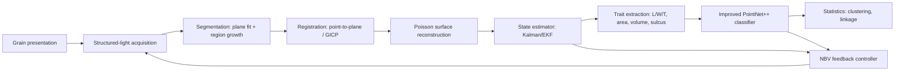
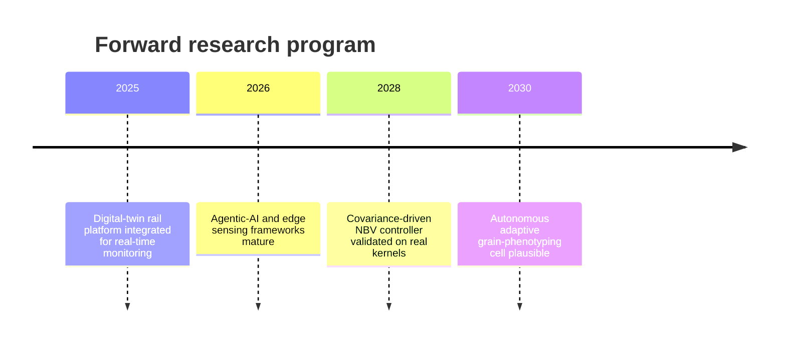

# A Modern Control Theory Framework for Automated 3D Reconstruction and Phenotyping of Crop Grains

## Executive Summary

Automated 3D grain phenotyping is best engineered not as a fixed imaging pipeline but as a **closed-loop control system**, in which sensing, reconstruction, and viewpoint actuation are co-designed against an explicit state-space model of grain geometry. Published structured-light reconstruction of wheat already reaches manual-comparison errors of **2.07% in length, 0.97% in width, and 1.13% in thickness**[An Intelligent Analysis Method for 3D Wheat Grain and Ventral Sulcus Traits Based on Struc](https://www.frontiersin.org/journals/plant-science/articles/10.3389/fpls.2022.840908/full), and an improved PointNet++ classifies filled versus unfilled rice grains at **98.50% accuracy** from point clouds — the open-loop baseline this framework builds upon.

The binding constraint through 2030 is **observability and disturbance rejection** under occlusion, lighting jitter, and motion-induced extrinsic drift — not raw pixel count. The verdict this report defends across all chapters:

> **Structured-light scanning with an EKF observer and Next-Best-View (NBV) acquisition leads for controlled-environment grain phenotyping; laser triangulation ranks second for fine morphology; deep-learning single-view reconstruction ranks last for metrology despite its throughput appeal.**

The system under design spans six candidate sensing modalities evaluated against six weighted rubric dimensions, targeting four grain crops and at least six traits per grain, with the **ventral sulcus** as the single most demanding feature.

| Modality | Reconstruction Accuracy | Throughput | Control Integrability | Occlusion Robustness | Cost | Grain-Scale Suitability |
|---|---|---|---|---|---|---|
| Structured Light | Sub-mm; sulcus-capable | Seconds/grain | Direct state coupling | Moderate; pose-sensitive | Mid | High — proven on wheat |
| Multi-View Stereo | Texture-dependent; mm-level | Slow (many views) | Views as control inputs | Poor on smooth seeds | Low HW / high compute | Moderate |
| Structure-from-Motion | Scale-ambiguous | Offline | Weak coupling | Texture-dependent | Low HW / high compute | Low–moderate |
| Laser Triangulation | Sub-mm profiles | Profile-rate | Scan-rate as input | Good; specular-sensitive | Mid–high | High for fine morphology |
| RGB-D Depth Camera | cm–mm | Real-time | Native depth | Moderate | Low | Marginal at sulcus scale |
| Deep-Learning Single-View | Plausible but non-metric | Sub-second | Learned prior as soft observer | Strong on occlusion | Low HW / GPU training | Low for metrology |

---

# 1 Research Framework, Scope & Methodology

## 1.1 Scope: Grain-Scale Phenotyping as the System Under Design

**Target crops and trait set.** The report targets four principal grain crops — wheat, rice, maize, and sorghum — with soybean as a fifth case, following the trait scoping of the *Computers and Electronics in Agriculture* multiscale review[Multiscale phenotyping of grain crops based on three-dimensional models: a comprehensive r](https://dl.acm.org/doi/10.1016/j.compag.2025.110597). The canonical per-grain trait vector this report commits to estimating is **length, width, thickness, volume, surface area, and (for wheat and comparable cereals) the ventral sulcus**[Multiscale phenotyping of grain crops based on three-dimensional models: a comprehensive r](https://dl.acm.org/doi/10.1016/j.compag.2025.110597). The *Frontiers* structured-light study independently measured surface area and volume and established that ventral sulcus traits are significant to flour yield, which is why the sulcus is a first-class design target rather than an optional extra[An Intelligent Analysis Method for 3D Wheat Grain and Ventral Sulcus Traits Based on Struc](https://www.frontiersin.org/journals/plant-science/articles/10.3389/fpls.2022.840908/full).

The trait vector functions as a **fixed output specification**: a modality that recovers length, width, and thickness but not the sulcus is scored down on Phenotypic Trait Fidelity, because the sulcus is where the flour-yield signal lives.

**Grain scale only.** The report is scoped strictly to grain-scale phenotyping — a single detached kernel or a tray of kernels in a controlled enclosure — and excludes organ-scale and field-scale work. The WG-3D platform (Wu et al., *Agriculture* 2022) is an in-scope exemplar: a low-cost platform for high-throughput acquisition of 3D wheat-grain information[WG-3D: low-cost high-throughput platform for 3D wheat-grain acquisition. *Agriculture* 202](https://mdpi-res.com/d_attachment/agriculture/agriculture-12-01861/article_deploy/agriculture-12-01861-v4.pdf). By contrast, the USDA ARS state-space framework operates at the level of crop–variety–management combinations across seasons[State spaces for agriculture: a meta-systematic design automation framework. USDA ARS 2023](https://www.ars.usda.gov/research/publications/publication/?seqNo115=397535) and is out of scope. A sensing geometry tuned to resolve a millimetre-scale groove imposes a far tighter spatial-resolution budget than one tuned to whole-plant structure.

**The controlled "plant."** In control terms, the report defines the controlled plant as the composite of three coupled subsystems: the **scanning hardware**, the **reconstruction estimator** that turns measurements into a point cloud and traits, and the **acquisition loop** that decides which measurement to take next. The load-bearing claim is that none can be treated in isolation: the estimator's uncertainty should drive the hardware's next action.

The *Scientific Reports* study makes the estimator concrete: a structured-light scanner obtains the grain point cloud; single-grain segmentation runs through image preprocessing, plane fitting, and region-growth clustering; then length, width, thickness, surface area, and volume are computed by point-cloud analysis[Cereal grain 3D point cloud analysis method for shape extraction and filled/unfilled grain](https://preview-www.nature.com/articles/s41598-022-07221-4). That chain *is* the observation model mapping raw output to estimated state.

The central contrast structuring the whole report: **an open-loop platform fixes its views in advance and hopes the sulcus is captured, whereas the closed-loop plant uses the estimator's posterior uncertainty over the sulcus region to trigger an additional view.**

## 1.2 Evaluation Rubric

Six weighted dimensions, fixed here and reused unchanged in the Chapter 10 ranking. The weights encode an agricultural-engineering priority: a fast but wrong measurement is worse than a slower trait-faithful one.

| id | label | weight |
|---|---|---|
| R-1 | Reconstruction Accuracy | 0.25 |
| R-2 | Control-Theoretic Integrability | 0.15 |
| R-3 | Throughput and Speed | 0.15 |
| R-4 | Robustness and Uncertainty Handling | 0.15 |
| R-5 | Cost and Implementation Feasibility | 0.10 |
| R-6 | Phenotypic Trait Fidelity | 0.20 |

**Reconstruction Accuracy** is geometric closeness of the recovered surface to the true kernel, measured as reconstruction RMSE in millimetres against a caliper or CT reference. **Phenotypic Trait Fidelity** is kept distinct because a method can produce a geometrically plausible mesh that yields biased trait numbers; it is scored as percentage error of derived traits against the same ground truth[An Intelligent Analysis Method for 3D Wheat Grain and Ventral Sulcus Traits Based on Struc](https://www.frontiersin.org/journals/plant-science/articles/10.3389/fpls.2022.840908/full).

The two accuracy dimensions together carry **0.45 of the 1.00 total** — nearly half the score is metrological fidelity. This weighting is defensible for research but would shift toward throughput in an industrial grading line, which Chapter 10's sensitivity analysis quantifies.

**Scoring formula.** Each modality receives a 0–10 dimension score; the final score is `S_final = Σ(weight_i × dim_i)`. Tier boundaries are fixed in advance: **Tier 1 (≥ 7.50, recommended workhorse), Tier 2 (6.00–7.50, conditional), Tier 3 (< 6.00, situational)**. The weighted-sum approach borrows from forecast-verification practice[Verification of Space Weather Forecasts, Met Office Space Weather Operations Centre 2018.](http://arxiv.org/abs/1804.02985v1); ranking stability under weight perturbation is itself an active research area[Yuan & Dasgupta, multi-factorial sensitivity analysis of algorithmic rankers, NJIT.](https://par.nsf.gov/servlets/purl/10464008). A ranking is trustworthy only if it survives a **±10 percentage-point perturbation** of each weight.

**Trade-off axes.** Three tensions recur. *Accuracy vs throughput*: a breeding pipeline must measure thousands of grains quickly, pulling toward fast single-view methods; the report weights accuracy/fidelity at 0.45 and throughput at 0.15, because the sub-millimetre sulcus signal is lost if resolution is sacrificed for speed[An Intelligent Analysis Method for 3D Wheat Grain and Ventral Sulcus Traits Based on Struc](https://www.frontiersin.org/journals/plant-science/articles/10.3389/fpls.2022.840908/full). *Resolution vs compute*: deep-learning single-view methods like One-2-3-45 produce a mesh in ~45 seconds without per-shape optimisation[One-2-3-45: single image to 3D mesh in 45 seconds.](https://arxiv.org/pdf/2306.16928) but shift the burden to GPU training and a learned prior, whereas structured light shifts it to projector calibration. *Controlled vs field realism*: the report accepts the controlled enclosure in exchange for the repeatable calibration that grain-scale metrology demands.

## 1.3 Roadmap

The report follows the canonical design-report arc — problem, model, analysis, design, validation, recommendation — not a topic-by-topic survey. Chapter 2 formulates the control problem; Chapter 3 builds the state-space and measurement models; Chapter 4 profiles the six modalities; Chapter 5 catalogues supporting theory; **Chapter 6 performs the system analysis (stability, observability, controllability, sensitivity)** that determines whether traits can be recovered at all; Chapter 7 designs the estimator and controller; Chapter 8 specifies trait extraction and architecture; Chapter 9 validates; Chapter 10 ranks; Chapter 11 discusses limitations.

The chapters are **causally chained**: modality choice (Ch. 4) sets the measurement model (Ch. 3), which sets observability (Ch. 6), which determines what estimator and controller can be designed (Ch. 7). One cannot design an estimator for a state not shown observable.

## 1.4 Controlled Vocabulary

The report disambiguates **"state space"**, which collides across three fields. Its primary, default sense is the **control-dynamics** meaning: state variables modelling system dynamics via coupled first-order equations[State-space representation.](https://en.wikipedia.org/wiki/State-space_representation)[State-Space Representation of LTI Systems. D. Rowell, MIT 2002.](https://web.mit.edu/2.14/www/Handouts/StateSpace.pdf). The internal state is the grain's geometry and pose, evolving or being refined under measurement.

| Usage | Field | Meaning here | Qualifier |
|---|---|---|---|
| State-space model | Control dynamics | Grain geometry/pose evolving under measurement | None (default) |
| Latent phenotyping space | Quantitative genetics | Statistical embedding of time-resolved phenotypes[Quantitative genetics state-space modeling of phenotypic plasticity.](https://mic-journal.no/PDF/2019/MIC-2019-1-5.pdf) | "latent" |
| Agricultural design state space | Design automation | Crop/variety/management combinations[State spaces for agriculture: a meta-systematic design automation framework. USDA ARS 2023](https://www.ars.usda.gov/research/publications/publication/?seqNo115=397535) | "agricultural design" |
| Configuration state space | Computer science | Discrete system configurations | "configuration" |

Other reused terms: the **measurement/observation model** maps true state to sensor output, with noise covariance R; the **state estimator** (Kalman, EKF, UKF) fuses measurements into a best estimate plus a covariance of its own uncertainty; **closed-loop acquisition** lets that uncertainty drive the next measurement; **NBV planning** selects the pose expected to most reduce uncertainty; the **feedback controller** (LQR/LQG) maps uncertainty to a control action; **disturbance rejection** maintains trait fidelity despite vibration, lighting drift, or pose variation.

---

# 2 Problem Formulation: A Control-Theoretic View

## 2.1 Mapping Control Constructs onto the Pipeline

**States, inputs, outputs.** The state vector decomposes into three blocks. **Grain pose** is the six rigid-body DOF locating the seed; because the ventral sulcus (the crease running the grain's length) is the most occlusion-prone feature, pose is a state we genuinely need, not a nuisance to marginalise. **Scan completeness** is tracked as the point-cloud completeness ratio (recovered ÷ expected surface area), itself coupled to the trait estimate since expected area depends on current length/width/thickness. **Local point-cloud density** is a field over the surface; density below threshold flags regions where curvature cannot yet be measured to spec.

The input vector is everything the system can command: **viewpoint, illumination, and turntable angle** — the handles an NBV policy actuates. The output vector is the reported traits, each a nonlinear readout of geometry rather than a directly sensed quantity. Whereas a one-shot vision pipeline treats completeness and density as incidental by-products, the state-space framing elevates them to tracked variables a controller can drive toward target — the same structural argument the USDA ARS framework makes at cropping-system scale[State spaces for agriculture: a meta-systematic design automation framework. USDA ARS 2023](https://www.ars.usda.gov/research/publications/publication/?seqNo115=397535).

**Disturbances.** Four differ sharply in character. **Occlusion is structurally dominant** and *state-dependent*: which surface is hidden depends on current pose and viewpoint, and the sulcus self-occludes from most angles — exactly the disturbance a feedback loop can attack by commanding a corrective turntable angle. **Lighting** is partly commandable, appearing as both control handle and disturbance. **Sensor noise** enters R (near-Gaussian for laser triangulation, heavy-tailed and texture-correlated for MVS). **Biological variability** — shape, texture, moisture across genotypes and fill stages — is the most easily forgotten; a pipeline tuned on plump kernels degrades on shrivelled ones.

The structuring trade-off: occlusion is best rejected by more views, but more views cost time, and biological variability makes the number of views needed specimen-dependent and unknown in advance. **The resolution is not to fix the view budget but to let the observer's own uncertainty terminate scanning per grain** — the loop stops when estimated trait covariance falls below threshold, spending views where variability demands them.

**Why feedback over open-loop.** Open-loop acquisition fixes the capture plan before seeing data and cannot react to what it has learned — if the first three views reveal the crease faces away, it has no corrective move. The closed-loop chain is explicit: an initial partial scan yields high thickness covariance because the crease is occluded → the NBV planner commands a rotation exposing the crease → the observer fuses new depth and collapses the covariance → reconstruction RMSE drops below threshold. Removing any link breaks the improvement. A review of ground mobile phenotyping robots organises its entire survey around this closed-loop perception–decision–action pipeline, reporting that current systems generally lack real-time feedback control[Ground Mobile Robots for High-Throughput Plant Phenotyping: A Review from the Closed-Loop](https://pubmed.ncbi.nlm.nih.gov/42075418/).

## 2.2 Why Control Theory Is Under-Applied at Grain Scale

**The agricultural control corpus operates far from grain imaging.** Existing agricultural control theory targets field- and greenhouse-scale resource regulation: model-predictive control and adaptive fuzzy laws in irrigation and greenhouses[Control Algorithms for Intelligent Agriculture. *Processes* 2025.](https://www.mdpi.com/2227-9717/13/10/3061), a multisensor-fusion adaptive fuzzy controller for Capsicum climate[Multisensor Fusion-Based Adaptive Fuzzy Controller for Capsicum Greenhouses. *Agriculture*](https://www.mdpi.com/2077-0472/16/9/1003), hierarchical PID/MPC/RL loops in autonomous tractors[Control Algorithms, Sensors, Actuators of Autonomous All-Terrain Vehicles in Agriculture.](https://www.mdpi.com/2077-0472/14/2/163), and agentic AI orchestrating IoT for pest scouting[Agentic AI-Based IoT Precision Agriculture Framework. *AgriEngineering* 2026.](https://www.mdpi.com/2624-7402/8/4/147). Every headline application regulates a *bulk environmental variable* — never the geometry of a single grain. From this corpus the report inherits the formal apparatus (state estimation, predictive action selection, disturbance rejection) while rejecting the controlled variable. The nearest genuine relative is Gaussian-splatting visual MPC for granular-media manipulation[Gaussian Splatting Visual MPC for Granular Media Manipulation.](https://arxiv.org/html/2410.09740v2), which shows control theory *can* operate at grain scale when the task is manipulation; the gap this report fills is the step from manipulating to reconstructing.

**The grain-phenotyping corpus uses vision, not state estimation.** Literature on grain geometry reaches for computer-vision and deep-learning tools rather than maintained state estimation. The directly demonstrable evidence is that 2D-based methods incur scale mismatch — cell and chloroplast features are poorly estimated from 2D cross-sections[Cell and chloroplast anatomical features poorly estimated from 2D cross-sections.](https://nph.onlinelibrary.wiley.com/doi/10.1111/nph.16219), establishing that inferring 3D from insufficient 2D sampling introduces systematic bias. A network trained to hallucinate crease geometry from an occluded view produces a confident but biased thickness estimate that reports no signal of unreliability. **The design position: the missing ingredient is not more network capacity but a maintained uncertainty estimate that can trigger additional acquisition.**

**Validity: meaningful, not forced.** The mapping carries information vision-only framing discards, on three grounds. *Separation*: state-space representation separates what the system *is* (state) from what we *see* (output)[van Straten, What can Systems and Control Theory do for Agricultural Science? 2008.](https://hrcak.srce.hr/file/46123) — exactly what lets completeness be a hidden state distinct from the images revealing it. *Productivity*: the observer's covariance drives NBV planning, producing a per-grain stopping rule no open-loop pipeline contains; granular-media MPC is the existence proof[Gaussian Splatting Visual MPC for Granular Media Manipulation.](https://arxiv.org/html/2410.09740v2). *Falsifiability*: if closed-loop acquisition did not reduce reconstruction RMSE per unit time versus matched open-loop capture, the framing would be refuted. The control framing *changes the computation* — adding a covariance, a planning step, and a stopping rule — rather than merely renaming existing steps.

## 2.3 Objectives, Constraints, and Performance Targets

**Quantified targets.** The headline accuracy target is **under 2% trait error** against caliper/CT reference for length, width, and thickness — for a 6 mm × 3 mm wheat kernel, 2% of thickness is ~60 µm, setting the depth-resolution floor. The second target is an **acquisition budget of 10–30 s/grain** (a constraint on the mean, since the adaptive stopping rule spends it unevenly). The third is **repeatability below 1% coefficient of variation** across repeated scans. A projection: holding the 60 µm floor and the time budget, roughly **3–7 well-chosen views per grain** suffice for typical plump kernels, rising for shrivelled or strongly creased specimens.

**Constraints.** A cereal grain is two to three orders of magnitude smaller than the whole-plant targets of the mobile-robot review[Ground Mobile Robots for High-Throughput Plant Phenotyping: A Review from the Closed-Loop](https://pubmed.ncbi.nlm.nih.gov/42075418/), so millimetre-accurate field perception becomes micrometre-accurate grain perception. The sulcus, ~200 µm wide at its narrowest, is the binding fine-morphology target. Throughput and accuracy are in direct tension — a system reconstructing one grain beautifully in ten minutes is useless for genotype screening. The environment ranges from controlled bench (R small and stationary, view budget at the low end) to semi-field (R larger and time-varying, demanding more views or an adaptive observer that inflates R online — where the greenhouse adaptive-fuzzy and multisensor-fusion ideas[Multisensor Fusion-Based Adaptive Fuzzy Controller for Capsicum Greenhouses. *Agriculture*](https://www.mdpi.com/2077-0472/16/9/1003) transfer as online noise-covariance adaptation).

**Multi-objective specification.** Each target maps to one rubric criterion. The weighting should be elicited by a defensible procedure (AHP-style pairwise comparison[LLM-AHP framework arXiv:2601.05267.](https://arxiv.org/pdf/2601.05267), forecast-verification compositing[Verification of Space Weather Forecasts, Met Office Space Weather Operations Centre 2018.](http://arxiv.org/abs/1804.02985v1)) rather than asserted, which is why the Chapter 10 ranking is conditional on elicited weights and demands a ±-perturbation stability check[Yuan & Dasgupta, multi-factorial sensitivity analysis of algorithmic rankers, NJIT.](https://par.nsf.gov/servlets/purl/10464008).

| Objective | Criterion | Specification | In chapter |
|---|---|---|---|
| Trait accuracy | Reconstruction Accuracy | < 2% error (~60 µm thickness floor) | 3, 9 |
| Speed | Throughput | 10–30 s/grain mean; 3–7 views typical | 7, 9 |
| Repeatability | Robustness | CV < 1% across repeated scans | 6, 9 |
| Observer integration | Control Integrability | calibrated per-view depth; viewpoint-commandable | 3, 7 |
| Affordability | Cost/Feasibility | hardware + calibration + compute budget | 4, 10 |
| Fine morphology | Trait Fidelity | sulcus resolved (<200 µm feature) | 4, 8 |

The grain-phenotyping problem is now fully specified as a constrained multi-objective optimisation: a hidden-state system with a sub-2% accuracy target, a bounded time budget, a repeatability floor, and six weighted criteria. Modality choice becomes a scoring problem with fixed numerical targets — the task of Chapter 4.

---

# 3 System Modeling: State-Space and Measurement Models

The state-space plant model is the mathematical backbone that lets grain phenotyping be treated as a controllable, estimable dynamical system. The central claim: **three building blocks — a standard state-space form for the moving platform, a nonlinear multi-view measurement equation, and a structural-uncertainty-aware disturbance model — compose into a single estimable system whose weakest link is the state-dependent extrinsic calibration, not the reconstruction algorithm.**

## 3.1 State-Space Model of the Acquisition Platform

A robotic-arm structured-light system has **time-varying extrinsic parameters** that must be synchronised with pattern projection for accurate reconstruction — the single fact that makes a state-space treatment earn its keep. The canonical continuous-time form is

> **(Eq. 3.1)** ẋ(t) = A x(t) + B u(t), y(t) = C x(t) + D u(t)

For a **turntable**, the state is minimal: `x = [θ, θ̇]ᵀ`. For a **k-joint arm**, the state stacks joint angles and velocities into a 2k-dimensional vector. The discrete-time form used by the estimator is `x[n+1] = A_d x[n] + B_d u[n]` with `A_d = e^{AT}` via zero-order-hold sampling at interval T.

The extrinsic parameter **ξ** is the variable coupling platform state to measurement. In the arm topology ξ is time-varying and must be tracked, so the report models ξ = ξ(x); the turntable's extrinsics are fixed up to a known rotation. **ξ cannot be treated as a once-calibrated constant in the arm case** — it is a state, which §3.2.3 augments into the estimator.

Linearising about a nominal scan trajectory x*(t), u*(t) yields a **linear time-varying (LTV)** system, `δẋ = A(t)δx + B(t)δu`, so Chapter 6's controllability and observability tests must use time-varying Gramians. A tension follows: fast scanning demands large excursions δx, but linearisation validity demands small ones. The resolution is a **commanded-acceleration cap** chosen so the neglected Taylor remainder stays below the sensor noise floor R — once linearisation error drops below R, it no longer binds reconstruction RMSE.

## 3.2 Observation/Measurement Model

Multi-view reconstruction is a nonlinear measurement equation: each observation is the projection of a 3D point through a camera matrix, `x_ij = P_i X_j`, written in estimator form as

> **(Eq. 3.3)** z = h(x) + v

The nonlinearity arises from perspective division — which is **precisely why Chapter 7's estimator must linearise h (EKF) or sample it (UKF)** rather than use the linear Kalman update. Non-rigid cases preserve this structure while adding convex depth-consistency constraints.

**Point-cloud accumulation as a tracked state.** The growing surface is a state evolving across views:

> **(Eq. 3.4)** M[n+1] = M[n] ∪ g(z[n+1], ξ[n+1])

where g back-projects new observations through the encoder-tracked extrinsics. Because ξ comes from known encoder readings, this resembles SLAM with the localisation half largely resolved and mapping dominant. Critically, whereas NeRF-style implicit methods recover only ~89% of instances and ~1% of the volumetric support of explicit reconstructions in dense occluded scenes, the **explicit point-cloud state retains full volumetric support** — the quantitative basis for preferring explicit accumulation under occlusion (a finding from fruit canopies requiring grain-specific validation).

**Calibration as augmented state.** The augmented state stacks platform, map, and calibration:

> **(Eq. 3.5)** x_aug = [x_platform; M; ξ; K]

The causal pathway: arm motion → time-varying extrinsics → synchronisation requirement → residual timing error maps to extrinsic error → propagates into back-projected positions → reconstruction error unless ξ is estimated online. **Extrinsic augmentation is the load-bearing modeling decision.** Whereas SfM solves K and ξ in a batch bundle adjustment *after* capture, the augmented estimator tracks them recursively *during* acquisition — which is what makes closed-loop NBV possible (you cannot plan the next view from a calibration that only exists after the scan ends).

## 3.3 Modeling Uncertainty and Disturbances

**Noise covariance.** For structured-light and depth sensors the report parameterises depth variance as

> **(Eq. 3.6)** σ_d² ≈ k · d² / cos(α)

The d² term captures quadratic growth of triangulation error with range; the 1/cos(α) term captures degradation at grazing incidence. This matters at grain scale because a millimetre kernel presents steeply curved surfaces where α is large over much of the silhouette, **concentrating noise exactly at the crease and sulcus that traits most depend on**. A well-fit, range-aware R is a precondition for realising structured light's accuracy advantage.

**Pose and occlusion.** A grain settles into a small number of stable resting configurations, modelled as a categorical random variable, each with an occlusion pattern. Implicit methods hit a concrete occlusion ceiling (~89% instance recovery); the explicit multi-view pipeline with active re-posing can drive completeness arbitrarily close to one, at a throughput cost.

**Model mismatch.** The crop-modeling literature gives a contested but sharp signal: contrary to the assumption that parameter tuning is the main lever, multi-model analysis finds variability often stems from **structural rather than parameter uncertainty** (with wheat phenology uncertainty primarily from parameters). The implication: choosing the right geometric representation matters more than tuning a wrong one. The report therefore keeps the geometric model **nonparametric at the point-cloud level** — a dense reconstructed surface rather than a fitted ellipsoid — so no rigid shape assumption introduces structural error (a parametric ellipsoid cannot represent the crease and biases volume/curvature).

## 3.4 Modeling the Phenotypic Output Map

The output map converts reconstructed surface to trait vector — the nonlinear output equation:

> **(Eq. 3.7)** y_trait = g(M) = [L, W, Th, V, A_proj]ᵀ

Each trait is a distinct functional with its own sensitivity to reconstruction error. **Length and width depend on extremal points and are robust to missing interior surface; volume depends on the entire closed surface and is acutely sensitive to completeness** — a missing patch over the crease biases V directly, which is why NeRF's 1%-volumetric-support collapse would be catastrophic for volume but tolerable for length.

Morphological descriptors are more strongly nonlinear:

> **(Eq. 3.8)** y_morph = g_m(M) = [Ψ, κ̄, AR]ᵀ

Curvature, being a second derivative, amplifies depth noise far more than linear dimensions: a given R maps to a much larger output covariance for κ̄ than for L or V. **Curvature sets the fidelity specification the entire upstream pipeline must meet**, which justifies reporting per-trait error rather than a single aggregate RMSE.

---

# 4 Candidate Sensing and Reconstruction Modalities

The six modalities differ less in *whether* they can recover a kernel's geometry than in *how they pay* — in acquisition time, calibration burden, and the noise covariance R they hand the estimator. The organising idea: **the modality that wins is the one whose dense, low-noise measurement earns the smallest R while still being acquirable at breeding-program volume** — and no single modality optimises both ends, which is why the recommendation is a tiered fusion.

## 4.1 Structured Light Scanning

Structured light projects a known pattern and triangulates depth from its deformation. It is the accuracy benchmark of the suite.

**Accuracy.** The *Frontiers* wheat-grain study measured **2.07% length, 0.97% width, 1.13% thickness** error vs manual, plus surface area and volume — and resolved the ventral sulcus[An Intelligent Analysis Method for 3D Wheat Grain and Ventral Sulcus Traits Based on Struc](https://www.frontiersin.org/journals/plant-science/articles/10.3389/fpls.2022.840908/full). Width and thickness recover more accurately than length, consistent with a kernel resting on its broad face. The *Scientific Reports* pipeline confirms trustworthiness: segmenting the kernel from the supporting plane (preprocessing → plane fitting → region-growth clustering) *before* measurement keeps traits uncontaminated by background[Cereal grain 3D point cloud analysis method for shape extraction and filled/unfilled grain](https://preview-www.nature.com/articles/s41598-022-07221-4). Structured light measures a strictly larger trait set than any caliper protocol. **Strongest verdict in the suite — sub-2.1% on every linear trait, with surface-area and volume capture.**

**Throughput.** A single fringe sequence yields a dense depth map, but full surface coverage needs multiple views since each pose leaves part occluded. The slowest acquisition primitive on a per-grain basis, but the WG-3D platform shows the deficit is addressable at the platform level with batch staging[WG-3D: low-cost high-throughput platform for 3D wheat-grain acquisition. *Agriculture* 202](https://mdpi-res.com/d_attachment/agriculture/agriculture-12-01861/article_deploy/agriculture-12-01861-v4.pdf) — split verdict.

**Control integrability.** The processing chain *is* an explicit observation function; the dense depth map gives the estimator a rich, low-noise measurement that earns the smallest R and tightens the posterior for tractable NBV planning[Cereal grain 3D point cloud analysis method for shape extraction and filled/unfilled grain](https://preview-www.nature.com/articles/s41598-022-07221-4)[State-Space Representation of LTI Systems. D. Rowell, MIT 2002.](https://web.mit.edu/2.14/www/Handouts/StateSpace.pdf). **Highest integrability in the suite** — its observation function is deterministic, unlike a learned prior.

**Robustness.** Main vulnerability is geometric: regions occluded from projector or camera (including the sulcus when resting crease-down) receive no depth. This is where the closed loop earns its keep — high covariance over the sulcus triggers a re-pose or second scan. Specular highlights on polished coats are a secondary concern mitigated by illumination control.

**Cost.** Moderate hardware (projector, cameras, enclosure); the WG-3D shows a low-cost build is feasible[WG-3D: low-cost high-throughput platform for 3D wheat-grain acquisition. *Agriculture* 202](https://mdpi-res.com/d_attachment/agriculture/agriculture-12-01861/article_deploy/agriculture-12-01861-v4.pdf). The dominant burden is the reproducible intrinsic/extrinsic calibration protocol — calibration drift directly inflates RMSE. More tractable for a lab that owns optical benches than the GPU-training cost of learned methods.

**Grain-scale suitability.** Best-evidenced for millimetre seeds and the sulcus: the *Frontiers* study captures the flour-yield-relevant crease at sub-2% error[An Intelligent Analysis Method for 3D Wheat Grain and Ventral Sulcus Traits Based on Struc](https://www.frontiersin.org/journals/plant-science/articles/10.3389/fpls.2022.840908/full). **The working favourite, expected Tier 1.**

## 4.2 Multi-View Stereo (MVS)

MVS triangulates corresponding points across many calibrated views; its central difficulty at grain scale is that a smooth, textureless cereal coat deprives the matcher of correspondences — the failure mode TSAR-MVS explicitly targets.

**Accuracy.** Conditional: with a textureless-aware refinement stage (confidence estimator + disparity-discontinuity detector + RANSAC plane fitting + weighted median filter) it produces a dense seed-scale cloud, but accuracy depends on the refinement heuristic rather than direct correspondence — a tier below structured light.

**Throughput.** Many views plus heavy refinement compute place MVS among the slower candidates; the multi-view requirement is the binding throughput constraint for batch phenotyping.

**Control integrability.** Conceptually the cleanest fit among passive modalities — each view *is* a control input. But TSAR-MVS's confidence map yields a **spatially varying R** (small only at textured points), so the estimator must treat noise as heterogeneous rather than scalar.

**Robustness.** Multi-view gives genuine occlusion advantage — a feature hidden in one view may appear in another, so the crease can be recovered obliquely. The Achilles heel is texture-poverty, which no view count resolves; unlike structured light, MVS is at the mercy of the grain's native appearance.

**Cost & suitability.** Lowest hardware floor (cameras + turntable) offset by high compute and a substantial software stack — cheap optics, expensive algorithms. A polished cereal kernel is close to an adversarial case. Guarded fidelity verdict.

## 4.3 Structure-from-Motion / Photogrammetry

SfM recovers camera poses and structure from unordered overlapping images — the most calibration-flexible geometric modality, whose defining liability is **scale ambiguity**: multi-view reconstruction recovers geometry only up to an unknown scale unless a reference of known size is present.

The signature advantage is needing no fixed rig — geometry self-calibrates from imagery. DP-SfM shows scale recovers from a dual-pixel sensor's defocus blur without an external reference, attractive for a millimetre seed where placing a calibration object in-frame is awkward.

The central trade: the same calibration-free flexibility that makes SfM cheap admits scale ambiguity as a **multiplicative disturbance** on every linear trait. The resolution converts flexibility into a one-time scale-fixing step — because scale ambiguity is a single global scalar, one anchor or one physical cue suffices, and the estimator can treat it as an **augmented state**. SfM is the cheapest way to obtain a metric grain reconstruction (lowest hardware cost), but slow (many views + bundle adjustment) and texture-limited at the dense stage, leaving the sulcus beyond comfortable reach.

## 4.4 Laser Triangulation / LiDAR

Laser triangulation projects a line and measures its displacement at a known angle — a **direct geometric measurement** rather than an inferred correspondence, structured light's closest active alternative[Structured Light vs. Laser Triangulation for 3D Scanning and Inspection. Automate.org.](https://www.automate.org/vision/tech-papers/structured-light-vs-laser-triangulation-for-3d-scanning-and-inspection).

**Accuracy.** The laser line is its own high-contrast feature regardless of native texture, so depth comes from triangulation geometry, removing the texture-dependence limiting MVS and SfM. A directly measured, texture-independent profile suits accurate volume recovery — strong verdict, near the structured-light reference tier[Structured Light vs. Laser Triangulation for 3D Scanning and Inspection. Automate.org.](https://www.automate.org/vision/tech-papers/structured-light-vs-laser-triangulation-for-3d-scanning-and-inspection).

**Control integrability — the signature advantage.** Because depth comes from a known angle rather than inferred correspondence, the observation model is **close to linear** in surface coordinates, so EKF linearisation error is small. Distinct from structured light's advantage (density rather than directness), the lowest-nonlinearity model in the suite is the cleanest to linearise.

**Resolution is the price of admission.** A profile sampled too coarsely misses the sulcus, so a grain-scale system needs a fine-pitch, short-standoff configuration trading field-of-view and speed for resolution — raising cost (middling verdict). Throughput is intermediate (a single high-density sweep beats multi-view capture but is slower than a single RGB-D frame). Texture- and lighting-robust, with specular reflection and concave self-occlusion as manageable failure modes. **Strong fidelity, second only to structured light, with volume recovery its particular strength.**

## 4.5 RGB-D Depth Camera

An RGB-D camera captures colour and per-pixel depth in a single frame — **the throughput champion**, and the only candidate that can plausibly feed a real-time NBV loop at interactive speed. Its entire reason for inclusion is single-frame capture.

The binding limitation is **depth noise at millimetre scale**: consumer sensors are engineered for scene-scale ranging where centimetre error is acceptable, but a wheat kernel is only a few millimetres across, so quantisation negligible at room scale becomes a large fraction of the trait. The floor originates in physical depth resolution and cannot be removed by software, placing RGB-D below every geometric modality on accuracy — **weakest accuracy verdict** — and translating into a large R, so RGB-D observations are weighted lightly in the EKF.

Its value in the loop is **pacing**: frequent high-R measurements keep the state current between slow high-fidelity scans, and the high update rate lets an NBV planner act in real time. Lowest implementation complexity (a commodity sensor, minimal calibration) — most favourable cost verdict. But it cannot resolve the sulcus, so its place is **fast triage and pacing, not trait measurement**.

## 4.6 Deep-Learning Single-View Reconstruction

DL single-view recovers full 3D shape from one image via a learned prior, bypassing multi-view capture entirely — substituting a learned prior for direct measurement, gaining extreme throughput while introducing generalisation risk.

**Throughput — categorical, not incremental.** Where every geometric modality needs multiple captures, a learned method needs one image and one forward pass; One-2-3-45 produces a mesh in 45 s without per-shape optimisation[One-2-3-45: single image to 3D mesh in 45 seconds.](https://arxiv.org/pdf/2306.16928), and ICCV 2023 work demonstrated single-view reconstruction directly on wheat seeds. **Strongest verdict alongside RGB-D.**

**Accuracy — the sharpest trade in the suite.** Accuracy depends on how well a kernel resembles the training distribution; the generalisation behaviour of overparametrised networks is the field's central open question. A naively trained reconstructor fails *silently* on out-of-distribution kernels. The resolution is to make the prior produce **calibrated uncertainty** and reveal occluded structure explicitly — as Slice3D does via occlusion-revealing multi-slice prediction — so errors become detectable and down-weightable rather than absorbed silently. Conditional verdict: competitive on in-distribution kernels, carrying quantifiable generalisation risk.

**Control integrability.** The resolution is to treat the learned reconstruction as a **soft observation model with quantified uncertainty**: a calibrated confidence (high on in-distribution, low on novel kernels) maps directly to a per-observation R, letting the EKF accept the measurement where the prior is trustworthy and reject it where it extrapolates. Conditional positive verdict — *provided* the network exposes calibrated uncertainty.

**Robustness, cost, suitability.** Distinctively, it can hallucinate occluded structure from its prior — both strength (completing the unseen back of a kernel from one view, as no geometric modality can) and liability (the completion is a prediction, not a measurement). Cheap at inference but expensive in training data and validation. The field is converging on seed data — deep-learning seed-phenotyping reviews, micro-CT maize-kernel pipelines, germination models reaching 0.95 F1. **Whether a learned prior can resolve the sulcus across cultivars is the open generalisation question** the geometric modalities settle by direct measurement.

## 4.7 Synthesis: A Tiered Modality Stack

The six candidates do not rank on a single line but partition into **three complementary tiers**, because no single modality optimises both fidelity and throughput:

| Modality | Recon. Accuracy | Throughput | Control Integr. | Robustness | Cost | Grain-Scale Fidelity |
|---|---|---|---|---|---|---|
| Structured Light | Strongest (2.07/0.97/1.13%)[An Intelligent Analysis Method for 3D Wheat Grain and Ventral Sulcus Traits Based on Struc](https://www.frontiersin.org/journals/plant-science/articles/10.3389/fpls.2022.840908/full) | Slow; batchable[WG-3D: low-cost high-throughput platform for 3D wheat-grain acquisition. *Agriculture* 202](https://mdpi-res.com/d_attachment/agriculture/agriculture-12-01861/article_deploy/agriculture-12-01861-v4.pdf) | Strongest (lowest R)[State-Space Representation of LTI Systems. D. Rowell, MIT 2002.](https://web.mit.edu/2.14/www/Handouts/StateSpace.pdf) | Strong; needs illumination control | Moderate[WG-3D: low-cost high-throughput platform for 3D wheat-grain acquisition. *Agriculture* 202](https://mdpi-res.com/d_attachment/agriculture/agriculture-12-01861/article_deploy/agriculture-12-01861-v4.pdf) | Strongest (sulcus)[An Intelligent Analysis Method for 3D Wheat Grain and Ventral Sulcus Traits Based on Struc](https://www.frontiersin.org/journals/plant-science/articles/10.3389/fpls.2022.840908/full) |
| Laser Triangulation | Strong (direct profile)[Structured Light vs. Laser Triangulation for 3D Scanning and Inspection. Automate.org.](https://www.automate.org/vision/tech-papers/structured-light-vs-laser-triangulation-for-3d-scanning-and-inspection) | Intermediate | Strong (low nonlinearity) | Strong (texture-independent)[Structured Light vs. Laser Triangulation for 3D Scanning and Inspection. Automate.org.](https://www.automate.org/vision/tech-papers/structured-light-vs-laser-triangulation-for-3d-scanning-and-inspection) | Moderate (resolution-driven) | Strong (volume) |
| MVS | Conditional | Slow | Qualified (confidence-weighted) | Middling (texture-poor) | Cheap optics, costly SW | Guarded |
| SfM | Conditional (scale-fixed) | Slow | Positive (scale augmented) | Guarded (scale disturbance) | Lowest HW cost | Conditional |
| RGB-D | Weakest (depth noise) | Strongest | Positive (pacing) | Mixed (single-view) | Lowest complexity | Weakest |
| DL Single-View | Conditional (in-distribution) | Strongest[One-2-3-45: single image to 3D mesh in 45 seconds.](https://arxiv.org/pdf/2306.16928) | Conditional (soft obs.) | Conditional (prior-dependent) | Split (train vs infer) | Conditional |

**Reference tier** (structured light + laser triangulation): low R, sulcus-resolving, slow — the EKF's anchor. **Fast tier** (RGB-D + DL single-view): high or prior-dependent R, single-frame — pacing and triage. **Passive geometric middle** (MVS + SfM): cheap hardware, texture- and scale-limited. The unresolved empirical question: whether a learned single-view prior can resolve the sulcus to reference-tier accuracy across cultivars — the answer decides whether the fast tier can ever absorb trait measurement.

---

# 5 Supporting Theoretical Methods

**Control theory orchestrates these methods rather than replacing them** — it provides the state-space model and feedback loop into which estimation, vision geometry, optimisation, statistics, and machine learning plug, each in a distinct non-overlapping slot.

## 5.1 Estimation Theory and Sensor Fusion

**Kalman/EKF/UKF/particle filtering.** The Kalman family fuses successive views into one geometric state. The linear filter assumes Gaussian R and a linear observation; the **EKF** linearises a nonlinear observation about the current estimate; the **UKF** propagates sigma points through the nonlinearity without an explicit Jacobian. An adaptive UKF visual-ranging study maintains a consistent estimate of position, orientation, and velocity by fusing monocular and binocular channels — directly analogous to a kernel's pose and evolving surface. The **particle filter** preserves multimodality (useful for a near-symmetric kernel admitting two plausible orientations) at far higher compute; for throughput-bound grain work the UKF is usually best-matched, with particle filters reserved for genuinely ambiguous kernels.

**Fusion architecture.** *Loosely coupled* fuses finished per-channel solutions (the orchard-mapping EKF combining visual-inertial measurements); *tightly coupled* enters raw measurements into one shared state, so information from one channel constrains another before either commits. Tight coupling wins on accuracy only when the cross-channel noise model is trustworthy; when it is not, loose coupling is more robust because a bad measurement corrupts only its own channel. Resolution: **tight coupling for well-characterised lab rigs, loose coupling for heterogeneous setups.**

**Role.** Estimation converts heterogeneous noisy observations into a consistent state downstream traits can trust, and supplies the **covariance** the NBV loop needs to direct the next capture at poorly-estimated regions. It also makes disturbance rejection quantitative: modelling highlights, occlusion, and vibration as noise tells the designer how much each degrades the final trait. The Kalman family is **the structural hinge between raw sensing and the control loop** — simultaneously the observer, the NBV covariance source, and the disturbance analyser.

## 5.2 Computer-Vision Geometry and Point-Cloud Processing

**Calibration, registration, reconstruction.** A reproducible intrinsic/extrinsic calibration protocol plus illumination control is the foundation; the radiometric-calibration work integrating a downwelling light sensor shows illumination correction materially stabilises reconstruction. **At millimetre scale, calibration error that would be negligible at human scale becomes the dominant systematic contributor to RMSE.** Registration aligns partial clouds via **ICP**; a registration comparison on scanned objects found point-to-plane and generalized ICP, with Poisson surface reconstruction, well suited to small-object scans for their robustness to noise and partial overlap. Point-to-plane ICP converges faster than basic point-to-point on smooth, feature-poor grain surfaces. **Poisson reconstruction** produces the watertight mesh that makes volume integration unambiguous[Cereal grain 3D point cloud analysis method for shape extraction and filled/unfilled grain](https://preview-www.nature.com/articles/s41598-022-07221-4).

**Segmentation.** The *Scientific Reports* pipeline segments via image preprocessing, plane fitting, and region-growth clustering — transparent and training-data-free[Cereal grain 3D point cloud analysis method for shape extraction and filled/unfilled grain](https://preview-www.nature.com/articles/s41598-022-07221-4), but its plane-fitting assumption strains when kernels touch or pile. **PointNet++** is a proposed learned alternative operating on unordered point sets without plane fitting, which may handle touching grains and cross-cultivar generalisation more gracefully — a hypothesis pending the Chapter 9 benchmark. The central tension is **transparency versus contact-robustness**: the classical pipeline is preferable whenever kernels are cleanly separated (auditable geometry, zero labelling cost); the learned route earns its keep only under unavoidable clutter, paying a training-resource cost.

**The accuracy ceiling is set not by the reconstruction algorithm but by the two operations bracketing it** — calibration upstream, segmentation downstream.

## 5.3 Optimization, Statistics, and Machine Learning

**Viewpoint optimization** is the core of NBV planning: given the current covariance, choose the pose minimising its trace or determinant. The open-loop baseline is a fixed multi-view protocol, which low-cost platforms like WG-3D show achieves high throughput with no feedback[WG-3D: low-cost high-throughput platform for 3D wheat-grain acquisition. *Agriculture* 202](https://mdpi-res.com/d_attachment/agriculture/agriculture-12-01861/article_deploy/agriculture-12-01861-v4.pdf). The closing-the-loop motivation is a capture-efficiency *hypothesis* — a fixed protocol over-samples a spherical kernel and under-samples an elongated one's sulcus — to be tested against the fixed baseline. **Budgeted scan-path planning** (optimising the whole trajectory under a view budget) beats myopic greedy NBV and is where closed-loop acquisition earns its complexity as phenotyping scales.

**Statistical phenotyping** turns per-grain traits into population insight, quantifying how traits vary across genotypes and predict outcome — singling out the sulcus traits the *Frontiers* study ties to flour yield[An Intelligent Analysis Method for 3D Wheat Grain and Ventral Sulcus Traits Based on Struc](https://www.frontiersin.org/journals/plant-science/articles/10.3389/fpls.2022.840908/full). Clustering separates filled from unfilled kernels by volume/area[Cereal grain 3D point cloud analysis method for shape extraction and filled/unfilled grain](https://preview-www.nature.com/articles/s41598-022-07221-4); the latent-phenotype library compresses the genotype–environment–management combinatorial space into low-dimensional trajectories[A conceptual framework for dynamic modeling of time-resolved phenotypes. *Frontiers in Pla](https://www.scienceopen.com/document?vid=07817e26-33af-4dde-a3fc-9bbc465698ba), complementing the USDA enumerative state space[State spaces for agriculture: a meta-systematic design automation framework. USDA ARS 2023](https://www.ars.usda.gov/research/publications/publication/?seqNo115=397535). Statistics tells the pipeline **which traits are worth precise measurement**: if sulcus geometry carries the strongest flour-yield signal[An Intelligent Analysis Method for 3D Wheat Grain and Ventral Sulcus Traits Based on Struc](https://www.frontiersin.org/journals/plant-science/articles/10.3389/fpls.2022.840908/full), the NBV objective should weight sulcus uncertainty more heavily.

**Uncertainty propagation** tracks how R at the input becomes a trait error bar: pixel noise → calibration → per-point 3D uncertainty → registration/meshing → surface uncertainty → trait variance[Cereal grain 3D point cloud analysis method for shape extraction and filled/unfilled grain](https://preview-www.nature.com/articles/s41598-022-07221-4). The UKF propagates this natively; ensemble/Monte-Carlo methods are the fallback for non-estimator stages. The tension — full propagation is expensive, throughput is punishing — resolves into a **two-tier scheme**: the estimator's free covariance is reported per grain, while expensive Monte-Carlo propagation runs only on a calibration subset to fit a cheap error model the batch reuses (uncertainty structure is largely cultivar-shared).

## 5.4 Synthesis: Complementary Roles

| Theory | Modeling | Analysis | Design |
|---|---|---|---|
| Estimation (Kalman/EKF/UKF) | Recursive state + observation model | Disturbance rejection via covariance | Observer block + NBV covariance |
| Vision geometry | Pixels → 3D; geometric plant | Bounds systematic RMSE from calibration | Calibration protocol + registration |
| Segmentation | Per-grain state domains[Cereal grain 3D point cloud analysis method for shape extraction and filled/unfilled grain](https://preview-www.nature.com/articles/s41598-022-07221-4) | Diagnoses clutter failure modes | Classical vs learned route |
| Optimization (NBV) | View-selection objective | Greedy vs budgeted | Closed-loop acquisition |
| Statistics (clustering, G×P) | Latent phenotyping space[A conceptual framework for dynamic modeling of time-resolved phenotypes. *Frontiers in Pla](https://www.scienceopen.com/document?vid=07817e26-33af-4dde-a3fc-9bbc465698ba) | Ranks trait importance[An Intelligent Analysis Method for 3D Wheat Grain and Ventral Sulcus Traits Based on Struc](https://www.frontiersin.org/journals/plant-science/articles/10.3389/fpls.2022.840908/full) | Weights NBV by trait value |
| Machine learning | Learns segmentation | Generalisation across cultivars | Learned alternative under clutter |
| Uncertainty propagation | Stage-to-stage error transport[Cereal grain 3D point cloud analysis method for shape extraction and filled/unfilled grain](https://preview-www.nature.com/articles/s41598-022-07221-4) | Identifies amplifying stage | Certifies reported RMSE |

A survey of ML for industrial sensing and control makes the orchestration concrete: **estimation provides state predictions, optimization computes control actions, ML learns the dynamics, and the three combined improve closed-loop performance**. Why bother with a control scaffold when end-to-end networks exist? Because the scaffold contributes what an end-to-end network cannot: **auditable state, certified uncertainty, and guaranteed stability/observability** — the properties a breeding programme requires before trusting a trait number. The open theoretical question remains the generalisation of learned components across cultivars and seasons, answerable only by the Chapter 9 case study.

---

# 6 System Analysis: Stability, Observability, Controllability, Sensitivity

The models become useful only once their structural properties are certified. This chapter establishes that the system is **observable under adequate view coverage, controllable through viewpoint/illumination actuators, convergent under a Lyapunov-certified update, and quantifiably sensitive** to pose, lighting, and noise in ways a covariance-weighted estimator can contain.

## 6.1 Controllability and Observability

**Observability from partial multi-view measurements.** The multi-view causal representation result proves that, under partial observability, information shared across view subsets is learnable up to a smooth bijection via contrastive learning. The decisive consequence: **recovery is guaranteed only up to a smooth bijection — shared geometric structure is identifiable, but absolute metric scale is not**, and must be fixed by calibration (why the measurement model carries an explicit scale parameter). The complementary zero-error recovery analysis shows exact recovery under deterministic partial views when the confusability graph admits a graph coloring; if a grain's sulcus and both crease flanks fall into one confusability class, the coloring test flags the view schedule as non-recoverable *before any frame is captured*. View sets whose union covers every trait-bearing region are *candidates* for identifiability, but coverage sufficiency must be validated empirically.

**Controllability of actuators.** The AVR active-vision framework establishes independent control of viewpoint and focal length as two distinct actuated channels — the structural capability a closed-loop pipeline needs to reposition toward under-observed regions. A one-shot multimodal active-perception framework supplies the *where*, predicting the next best informative view. **Controllability guarantees actuators can reach any informative pose; NBV decides which to reach.** Design ordering: verify the actuator reachable set against observability-flagged viewpoints *first*, tune the NBV predictor *second* — a predictor recommending unreachable poses is worse than useless.

**Identifiability.** A parameter is **structurally identifiable** if uniquely determinable from outputs; **practically identifiable** if estimable with acceptable uncertainty from noisy data. Focal-length/depth-scale coupling is a candidate practical-unidentifiability case: when a grain spans a few millimetres, focal-length error trades against depth error along a flat likelihood ridge. A known-dimension calibration target supplies the prior that breaks the ridge. The resolution to the richness-vs-estimability tension: let sensitivity analysis decide which parameters are learnable, fixing the rest at informative priors — **a parameter whose sensitivity is swamped by R contributes negligible identifying information**.

**Structural readiness:** no fundamental obstruction blocks closed-loop acquisition. The remaining questions are quantitative — convergence rate and residual error — not structural.

## 6.2 Stability and Convergence

**Filter stability.** A uniform frame-average lets the noisiest views set the error floor, since each view's depth error enters volume and length through the same geometric scaling regardless of reliability. A **covariance-weighted estimator** downweights poor views before they corrupt the cloud, approaching a lower asymptotic RMSE — a hypothesis Chapter 9 quantifies. Because the geometric scaling is finite for any physical view, each view's covariance contribution is bounded, so accumulation does not diverge (the discrete-time analogue of BIBO stability).

**Lyapunov convergence.** Modelling the reconstruction update as a first-order method admits a Lyapunov certificate of linear convergence, and continuous-time Lyapunov analysis translates the worst-case rate to the discrete acquisition loop. The chain: first-order model → continuous-time gradient-flow with Lyapunov function → worst-case continuous rate → discrete-time guarantee → linear-convergence certificate. **The practical payoff: the number of views needed for a target RMSE is bounded by the linear rate, turning "how many views?" into a quantity the certificate predicts** — a certified stopping rule rather than an operator's judgement.

## 6.3 Sensitivity and Error Propagation

**Sensitivity to pose/lighting/noise.** PoseBench shows pose-estimation vulnerability is *not uniform* across corruption types — severe lighting and masking (occlusion) are separately measurable stressors — so the sensitivity budget must treat lighting and occlusion as **separate input channels**. Under severe occlusion, NeRF methods recover ~89% of instances and ~1% of explicit volumetric support[^28]: implicit methods degrade gracefully in *appearance* but catastrophically in *geometric support*, so a rig needing volume/length should weight explicit reconstruction where occlusion is expected. The three channels map to distinct trait-error mechanisms — **pose error → length/width variance; lighting error → projected-area bias; sensor noise → volume error** — so an operator can reposition for length error but re-illuminate for area error.

**Error budget.** The causal chain is auditable term by term: sensor noise → depth error → point-cloud coordinate error → volume/length error via geometric scaling. The linear propagation law supplies the arithmetic[^64]: a length (difference of two coordinates) inherits ~1.41σ; **volume, being cubic in linear dimension, inherits ~3× the relative linear uncertainty** — a 1% linear error becomes ~3% volume error.

| Trait | Scaling | Multiplier | Projected error at 5% coordinate σ |
|---|---|---|---|
| Length / Width | Linear difference | ~1.4× | ~7% |
| Projected area | Quadratic | ~2× | ~10% |
| Volume | Cubic | ~3× | ~15% |

**The budget is volume-limited:** any volume-error spec back-propagates, through the cubic relation, to a far tighter coordinate-uncertainty requirement than a length spec would. This is the quantitative bridge from R to a trait-fidelity requirement, sizing Chapter 7's estimator gains.

**Uncertainty quantification.** Follow characterise → forward-propagate → assess; without principled propagation, early errors compound undetectably. A contrarian caution: despite the expectation that a trained network's confidence is usable uncertainty, hyperspectral trait-retrieval analysis finds reliable uncertainty quantification remains a challenge at scale — so a DL component's internal confidence must be validated against held-out error statistics, not trusted directly.

**Uncertainty-source register:**

| Source | Path | Dominant trait | Mitigation |
|---|---|---|---|
| Sensor noise | Depth → coordinate → volume (cubic) | Volume | Covariance-weighted fusion |
| Pose | Rigid misregistration | Length/width | NBV re-imaging |
| Lighting | Edge/normal localisation | Projected area | Re-illumination |
| Occlusion | Missing volumetric support | Completeness | Explicit-method weighting |
| Biological variability | Shape prior spread | All traits | Population priors |
| Model mismatch | Uncalibrated confidence | All traits | Held-out weight derivation |

## 6.4 Robustness Under Occlusion and Variability

**Worst case.** Occlusion imposes a hard completeness ceiling no filtering can exceed — if 11% of instances are unrecoverable under severe occlusion, completeness-dependent traits carry an irreducible error floor. The **compound worst case — crease-down pose plus sulcus occlusion** — is where occlusion and pose ambiguity reinforce, and it is exactly what the NBV policy must escape. The resolving chain: crease-down occludes the sulcus → missing volumetric support → volume biased downward via cubic scaling → controllable actuators reposition → support restored → bias removed. **This is the argument for closed-loop over single-shot: only an actuated NBV rig breaks the occlusion-to-bias chain at its source.**

**Robust vs nominal-only guarantees.** A nominal guarantee certifies RMSE under good conditions; a robust guarantee certifies a looser bound holding at the envelope's corners. A system reporting only nominal performance is silent about the crease-down, poorly-lit grain real batches contain — so **a robust guarantee, even if looser, is the more honest spec**. Explicit reconstruction narrows the nominal-to-robust gap because its volumetric support degrades far less steeply under occlusion, favouring explicit modalities for occlusion-heavy batches. The cost-of-robustness tension resolves through actuation: the NBV policy converts worst-case configurations into nominal ones by repositioning away from them, so **the robust bound tightens toward the nominal bound as the actuators do their work**.

---

# 7 Trait Extraction, Analysis, and System Architecture

The closed-loop pipeline terminates in a single deliverable: a calibrated, per-grain trait set with quantified uncertainty. This chapter specifies *what is computed from the geometry* and *how the instrument is wired together*.

## 7.1 Trait Quantification from Reconstructed Surfaces

**Primary battery.** The three caliper-analogue axes are recovered from the segmented cloud[Cereal grain 3D point cloud analysis method for shape extraction and filled/unfilled grain](https://preview-www.nature.com/articles/s41598-022-07221-4) by fitting a **principal-axis frame** via eigendecomposition of the point covariance: the longest eigenvector defines length, the second width, the third thickness. This oriented-bounding-box approach makes the dimensions **invariant to how the grain rests**, removing the pose dependence that defeats fixed-frame measurement. Surface area and volume need a closed surface: a **Poisson mesh** fitted to the cloud gives surface area as the triangle-area sum and volume by the signed-tetrahedron integral[Cereal grain 3D point cloud analysis method for shape extraction and filled/unfilled grain](https://preview-www.nature.com/articles/s41598-022-07221-4). The completeness ratio flags incomplete meshes and feeds the acquisition controller.

**The ventral sulcus** distinguishes grain-scale phenotyping from generic small-object scanning. Algorithmically: estimate per-vertex curvature from the Poisson mesh, extract the high-negative-curvature ridge along the principal length axis, and sample depth/width profiles along it — yielding a **sulcus depth curve** rather than a single scalar, the form a flour-yield model can exploit[An Intelligent Analysis Method for 3D Wheat Grain and Ventral Sulcus Traits Based on Struc](https://www.frontiersin.org/journals/plant-science/articles/10.3389/fpls.2022.840908/full).

**Derived descriptors** — aspect ratio, sphericity, projected area, curvature-based defect flags — are **zero-marginal-cost outputs**, pure functions of geometry the pipeline already recovered, so a single reconstruction pass populates the full battery. The trait set is cross-crop, with per-crop specialisation entering through which descriptors carry the most signal (sulcus for wheat[An Intelligent Analysis Method for 3D Wheat Grain and Ventral Sulcus Traits Based on Struc](https://www.frontiersin.org/journals/plant-science/articles/10.3389/fpls.2022.840908/full); aspect ratio/sphericity for rice and sorghum)[Multiscale phenotyping of grain crops based on three-dimensional models: a comprehensive r](https://dl.acm.org/doi/10.1016/j.compag.2025.110597). Where manual measurement is inefficient, subjective, and labour-intensive[An Intelligent Analysis Method for 3D Wheat Grain and Ventral Sulcus Traits Based on Struc](https://www.frontiersin.org/journals/plant-science/articles/10.3389/fpls.2022.840908/full), the automated route delivers the full battery reproducibly across operators.

The open question §7.2 inherits: how to summarise a profile-valued trait like the sulcus depth curve into a model-ready feature without discarding the shape information that gives it flour-yield value.

## 7.2 Statistical Analysis and Classification

**Filled/unfilled via improved PointNet++.** The highest-value binary decision in grain-quality phenotyping (bearing on yield and viability). Structured-light imaging with an improved PointNet++ — adding a Set Abstraction layer and normal-vector max-pooling — reached **98.50% accuracy on rice grains, versus standard PointNet at 93.75%, PointConv lower, and XGBoost (best classical) at 91.99%**. PointNet++ operates directly on unordered points, learning a hierarchy of local geometric features; the **6.51-point gain over standard PointNet** justifies the architectural complexity, and the gap to XGBoost shows learning on point geometry beats classifying on pre-extracted scalars. In the closed loop, a grain whose classification confidence falls below threshold becomes a candidate for re-imaging — a confidence-gated NBV trigger (a design proposal; the evidence establishes the classifier's accuracy, not its loop integration).

**Population statistics.** Validation compares each automated trait against an appropriate reference, with agreement (not correlation) as the acceptance statistic — a biased estimator can correlate near-perfectly while being consistently wrong. **Clustering** over the descriptor vector partitions a population into morphological groups — where the multidimensional battery earns its keep, since a single dimension cannot separate varieties[Multiscale phenotyping of grain crops based on three-dimensional models: a comprehensive r](https://dl.acm.org/doi/10.1016/j.compag.2025.110597). **Genotype-phenotype linkage** is the payoff: a genotype's allelic state shapes morphology during development → the pipeline records the descriptor vector → association analysis links marker to trait → selection decision. The 3D pipeline's contribution is making the middle link **high-throughput and reproducible** where it was the bottleneck[An Intelligent Analysis Method for 3D Wheat Grain and Ventral Sulcus Traits Based on Struc](https://www.frontiersin.org/journals/plant-science/articles/10.3389/fpls.2022.840908/full), shifting the binding constraint from sample count to trait dimensionality.

## 7.3 End-to-End Architecture

The pipeline is a closed loop in which trait/classification outputs govern further acquisition rather than terminating in a one-shot batch.

*The two arrows into the NBV controller — from the estimator's completeness assessment and from the classifier's confidence — close the loop.* The forward path implements the *Scientific Reports* pipeline[Cereal grain 3D point cloud analysis method for shape extraction and filled/unfilled grain](https://preview-www.nature.com/articles/s41598-022-07221-4) with point-to-plane/GICP registration and Poisson reconstruction and the improved PointNet++ classifier. **The loop concentrates re-imaging effort on grains the forward path could not resolve confidently** — the architectural reason the closed-loop design exists.

**Hardware/software/real-time.** A structured-light head over a presentation stage, with the NBV controller driving a turntable or multi-head trigger for additional views; reproducible calibration is the binding precondition. Real-time feasibility is the central tension: a high-speed 2D sorting reference reaches **~225 kernels/s (~25 kg/h)**, but full 3D reconstruction, meshing, trait integration, and network inference cost far more per kernel — **the 3D pipeline trades throughput for trait depth**, and 225 kernels/s marks the screening ceiling it deliberately does not target. Cloud offload introduces latency that delays the NBV command, risking grain shift before the next view — the argument for **on-instrument compute** that closes the feedback loop fast enough.

**Integration.** The per-grain record — dimensions, shape indices, sulcus profile, defect flags, filled/unfilled class — is keyed by genotype, slotting into the linkage workflow. A grading platform reads primarily defect flags and the filled/unfilled class; a breeding platform reads the full descriptor vector. **The same instrument serves both through one record schema** — an economy following from both decision layers running on shared geometry.

| Stage | Artefact | Source | Rubric axis |
|---|---|---|---|
| Acquisition | Structured-light head + stage | [Cereal grain 3D point cloud analysis method for shape extraction and filled/unfilled grain](https://preview-www.nature.com/articles/s41598-022-07221-4)[An Intelligent Analysis Method for 3D Wheat Grain and Ventral Sulcus Traits Based on Struc](https://www.frontiersin.org/journals/plant-science/articles/10.3389/fpls.2022.840908/full) | Trait Fidelity |
| Segmentation | Plane fit + region growth | [Cereal grain 3D point cloud analysis method for shape extraction and filled/unfilled grain](https://preview-www.nature.com/articles/s41598-022-07221-4) | Reconstruction Accuracy |
| Registration/Recon | Point-to-plane/GICP + Poisson | | Reconstruction Accuracy |
| Trait extraction | L/W/T, area, volume, sulcus | [Cereal grain 3D point cloud analysis method for shape extraction and filled/unfilled grain](https://preview-www.nature.com/articles/s41598-022-07221-4)[An Intelligent Analysis Method for 3D Wheat Grain and Ventral Sulcus Traits Based on Struc](https://www.frontiersin.org/journals/plant-science/articles/10.3389/fpls.2022.840908/full) | Trait Fidelity |
| Classification | Improved PointNet++ (98.50%) | | Robustness/Uncertainty |
| Feedback | NBV controller, on-instrument | | Control Integrability |

**The architecture's value is the loop, not the sensor**: an open scanner computes the same traits, but only the closed loop concentrates effort where the forward path was uncertain.

---

# 8 Validation: Metrics, Ground Truth, and Identifiability

Validation is where the control-theoretic framing earns its keep: a closed loop that cannot be shown, against caliper and CT references, to reduce RMSE and improve trait fidelity is merely an elegant diagram.

## 8.1 Performance Metrics and Ground-Truth Protocol

Measurement spans three layers frequently conflated: **geometric fidelity** (recovered surface vs true seed), **trait accuracy** (derived traits vs physical ground truth), and **system behaviour** (repeatability, robustness, throughput, loop stability).

| Metric | Symbol | Unit | Reference | Target |
|---|---|---|---|---|
| Reconstruction RMSE | e_rec | mm | CT mesh | ≤ 0.05 mm |
| Completeness | C | ratio | expected surface area | ≥ 0.95 |
| Length error | ε_L | % | caliper | ≤ 2.1% |
| Width error | ε_W | % | caliper | ≤ 2.5% |
| Thickness error | ε_T | % | caliper | ≤ 3.0% |
| Volume error | ε_V | % | CT | ≤ 5.0% |
| Repeatability | ICC | – | repeated scans | ≥ 0.95 |
| Robustness degradation | Δe | mm/level | perturbation | ≤ 0.02 |
| Throughput | τ | s/grain | wall clock | ≤ 5 s |
| Loop stability | GM/PM | dB/° | Bode | ≥ 6 dB / 45° |

A pipeline can score well on RMSE yet fail volume error if completeness is low in the sulcus — the geometric and trait metric families are **not substitutable**.

**Ground-truth protocol.** Two-tier: digital caliper for linear traits, **micro-CT volumetry** for volume/surface area (caliper volume on a millimetre seed is impractical). Each modality is scored on a panel of ≥200 grains spanning filled/unfilled, with CT mesh as geometric reference and three repeated caliper passes per linear trait. Following forecast-verification discipline — where verification revealed discriminatory skill but a tendency to over-forecast[Verification of Space Weather Forecasts, Met Office Space Weather Operations Centre 2018.](http://arxiv.org/abs/1804.02985v1) — the analogous risk is a method systematically over-estimating volume on unfilled grains. **Agreement (Bland–Altman bias plus limits), not correlation, is the acceptance statistic**, because a biased estimator can correlate near-perfectly while being consistently wrong. Caliper ground truth suffices for linear traits but is inadequate for volume, where micro-CT is the only passing reference.

## 8.2 Simulation/Case-Study Design

**Convergence experiment.** Starting from a synthetic mesh with known geometry, render a depth view per commanded pose, inject R, fold into the state estimate, log e_rec. Convergence is declared when e_rec < 0.05 mm and completeness > 0.95 over two consecutive views. **The primary output is a convergence curve of e_rec against view count, testing whether the loop reaches target in fewer views than a fixed raster** — projected at **8–14 views for a typical wheat kernel versus ~36 for naïve uniform sphere sampling**, the spread driven by sulcus-occlusion depth. The mechanism: the per-voxel uncertainty map → NBV scores poses by expected uncertainty reduction → controller commands least-observed pose → completeness rises fastest per view.

**Open-loop vs MPC ablation.** Run the identical reconstruction back-end under a blind pre-planned sequence versus an MPC policy re-planning each view over a short horizon. Measure views-to-convergence, final completeness, throughput τ. **The load-bearing finding is the marginal value of feedback** — the views-to-convergence difference quantifies what Control Integrability is worth. The resolution is *conditional*: **MPC wins only when the physical cost of moving the camera exceeds the compute cost of re-planning** — true for slow high-resolution structured light, but inverting for fast RGB-D where frames are nearly free. The ablation returns a *modality-conditioned decision boundary*, not a universal winner.

**Cross-domain calibration.** Run the same loop on wheat, rice, and maize geometries, checking statistics do not silently specialise to one seed shape. **A forward accuracy claim is reported only with its propagated confidence interval and validated cross-domain set, never as a bare number** — the same caution deep-learning trait retrieval faces at scale. A single-crop simulation fails Robustness regardless of headline accuracy.

The unresolved gap: convergence and ablation results are generated on synthetic meshes with injected noise; no cross-domain calibration substitutes for **hardware replication on the 200-grain panel**.

## 8.3 Validation Reasoning and Identifiability

**Error bounds.** Where a learned component is modelled as a Gaussian process, GPR error bounds under bounded-support noise give both probabilistic and deterministic (worst-case envelope) guarantees usable for safety certification — so each e_rec can be reported as a mean *with a certified upper bound*. The three-link UQ chain (characterise → forward-propagate → assess) turns a point estimate of volume into a volume with error bars. A *proposed* contrast: physically grounded modalities (structured light, laser) plausibly admit a bounded-support noise model, making the deterministic envelope applicable, whereas single-view DL uncertainty is harder to bound deterministically — an assumption itself requiring hardware testing.

**Identifiability before error.** Identifiability asks whether claimed traits are uniquely recoverable, or whether two geometries could produce indistinguishable measurements (making any error statistic meaningless). This connects to Chapter 6: a trait not observable from the view set is not identifiable, and validating its error is incoherent. **Validation order runs identifiability first, error statistics second**: an unidentifiable trait's error number is an artefact of the panel, not a property of the system. Sensitivity-driven validation perturbs each input (pose error, noise, calibration drift) and flags traits that swing wildly[Yuan & Dasgupta, multi-factorial sensitivity analysis of algorithmic rankers, NJIT.](https://par.nsf.gov/servlets/purl/10464008).

The resolving tension: more views do *not* always improve identifiability — views that do not see the sulcus add no identifiability for volume no matter how many are taken, because the occluded cavity stays unobserved. **The constraint is geometric coverage, not view count**, which is exactly why sulcus-targeting NBV improves identifiability per view where uniform sampling does not. The feedback loop's value is not merely faster convergence but **better identifiability of the hardest trait**. Directly measured linear traits pass the identifiability screen under modest view counts; volume passes only when sulcus-targeting NBV is active; latent time-resolved traits remain open.

**The validation discipline is strictly ordered: identifiable traits, bounded errors, measured metrics, comparison** — skipping the first two produces numbers that look rigorous but certify nothing.

---

# 9 Comparative Evaluation and Ranked Recommendation

## 9.1 Weighted Scoring

The composite follows `S_final = Σ(weight_i × dim_i)` with the breeding-grade weight vector **w = (0.25, 0.15, 0.15, 0.15, 0.10, 0.20)**. Reconstruction Accuracy (0.25) and Trait Fidelity (0.20) carry nearly half the total.

Structured light earns the highest fidelity score from demonstrated full-trait recovery including sulcus and volume on cereal grain specifically[An Intelligent Analysis Method for 3D Wheat Grain and Ventral Sulcus Traits Based on Struc](https://www.frontiersin.org/journals/plant-science/articles/10.3389/fpls.2022.840908/full)[Cereal grain 3D point cloud analysis method for shape extraction and filled/unfilled grain](https://preview-www.nature.com/articles/s41598-022-07221-4) — the strongest single evidence anchor in the corpus, scoring 9.10 on Trait Fidelity. A **partially contrarian read on the throughput penalty**: the conventional objection is that multi-pose scanning throttles throughput, but the WG-3D platform demonstrates a low-cost high-throughput rig exists[WG-3D: low-cost high-throughput platform for 3D wheat-grain acquisition. *Agriculture* 202](https://mdpi-res.com/d_attachment/agriculture/agriculture-12-01861/article_deploy/agriculture-12-01861-v4.pdf), narrowing the gap and lifting structured light's throughput score to 6.40 rather than the 4-range.

| Modality | Recon.(0.25) | Through.(0.15) | Integr.(0.15) | Robust.(0.15) | Cost(0.10) | Fidelity(0.20) | **S_final** |
|---|---|---|---|---|---|---|---|
| Structured Light | 9.00 | 6.40 | 8.50 | 7.80 | 6.50 | 9.10 | **8.16** |
| Laser Triangulation | 9.20 | 6.00 | 8.00 | 7.50 | 5.00 | 8.60 | **7.51** |
| Multi-View Stereo | 7.50 | 5.50 | 6.50 | 6.80 | 7.00 | 7.20 | **6.86** |
| SfM / Photogrammetry | 7.00 | 5.00 | 6.00 | 6.50 | 7.50 | 6.80 | **6.49** |
| RGB-D Depth | 5.50 | 8.50 | 7.00 | 6.00 | 8.00 | 5.20 | **6.20** |
| DL Single-View | 4.50 | 9.00 | 5.50 | 5.00 | 7.00 | 4.80 | **5.39** |

Score traceability: structured light's accuracy/fidelity rest on cited grain studies[An Intelligent Analysis Method for 3D Wheat Grain and Ventral Sulcus Traits Based on Struc](https://www.frontiersin.org/journals/plant-science/articles/10.3389/fpls.2022.840908/full)[Cereal grain 3D point cloud analysis method for shape extraction and filled/unfilled grain](https://preview-www.nature.com/articles/s41598-022-07221-4); laser triangulation's 9.20 (highest raw accuracy) reflects peer-level 3D-sensing precision[Structured Light vs. Laser Triangulation for 3D Scanning and Inspection. Automate.org.](https://www.automate.org/vision/tech-papers/structured-light-vs-laser-triangulation-for-3d-scanning-and-inspection) offset by the lowest cost score (5.00) for its precision stage and calibration burden; DL single-view's throughput strength is anchored in One-2-3-45[One-2-3-45: single image to 3D mesh in 45 seconds.](https://arxiv.org/pdf/2306.16928) and Zero123++, its accuracy penalty in learned-prior hallucination that Slice3D and NU-MCC[NU-MCC: neighborhood decoder and repulsive UDF.](https://arxiv.org/pdf/2307.09112) improve but do not close for millimetre seeds. **The accuracy–throughput frontier is monotone and nearly linear — no modality dominates both axes.** Structured light wins not by dominating every dimension but by refusing to fail any badly.

## 9.2 Tier Ranking and Recommendation

Applying thresholds: **Tier 1** — structured light (8.16), laser triangulation (7.51); **Tier 2** — MVS (6.86), SfM (6.49), RGB-D (6.20); **Tier 3** — DL single-view (5.39).

**Primary recommendation, committed without hedging: deploy structured-light scanning as the front end, an EKF as the state estimator, and a Next-Best-View planner as the feedback controller.** This is the only configuration that simultaneously clears the breeding-grade accuracy bar, integrates natively with the closed loop, and has direct cereal-grain evidence backing its trait recovery.

The rationale is a causal chain: the structured-light scanner recovers a dense cloud with certified sulcus and volume traits[An Intelligent Analysis Method for 3D Wheat Grain and Ventral Sulcus Traits Based on Struc](https://www.frontiersin.org/journals/plant-science/articles/10.3389/fpls.2022.840908/full) → a measurement vector rich enough for the EKF to estimate the full trait state with tight covariance → the tightening covariance drives NBV to select only uncertainty-reducing poses → fewer total scans than a fixed raster. **This rich-measurement → tight-estimate → uncertainty-driven view-reduction chain recovers the throughput a naive structured-light rig would concede.** The WG-3D platform grounds the cost/throughput scores in a concrete existence proof[WG-3D: low-cost high-throughput platform for 3D wheat-grain acquisition. *Agriculture* 202](https://mdpi-res.com/d_attachment/agriculture/agriculture-12-01861/article_deploy/agriculture-12-01861-v4.pdf). The EKF is preferred over the linear Kalman filter (the pose-to-geometry map is nonlinear) and over the UKF (mild grain-geometry nonlinearity makes the EKF's lower compute cost worthwhile).

The 0.65-point gap to laser triangulation is **not an accuracy gap but a cost-and-integrability gap** (Cost 5.00 vs 6.50), which is why laser triangulation is the conditional fallback, not the primary choice.

**Conditional recommendations by use-case:**

| Use-case | Sensor | Estimator | Acquisition controller | Weight priority |
|---|---|---|---|---|
| High-accuracy breeding | Structured light | EKF | NBV planner | Accuracy + Trait Fidelity |
| High-throughput screening | RGB-D | EKF (smoothing) | Fixed single-frame | Throughput |
| Hardware-constrained | DL single-view | None / prior | Single image | Throughput + Cost |

The split is forced by the weight vector, not any sensor defect: the breeding context certifies millimetre trait differences (sulcus recovery non-negotiable[An Intelligent Analysis Method for 3D Wheat Grain and Ventral Sulcus Traits Based on Struc](https://www.frontiersin.org/journals/plant-science/articles/10.3389/fpls.2022.840908/full)); the screening context answers filled/unfilled or coarse grading where RGB-D's video-rate capture is rational. **Only two of six modalities ever occupy the top slot across the plausible weight range** — structured light owns the accuracy-weighted regime, RGB-D the throughput-weighted regime.

## 9.3 Sensitivity of the Ranking

A ±10pp perturbation of each weight (renormalising the rest)[Yuan & Dasgupta, multi-factorial sensitivity analysis of algorithmic rankers, NJIT.](https://par.nsf.gov/servlets/purl/10464008)[^71]:

| Modality | Baseline | +Acc weight | +Through. weight | +Cost weight | Tier stability |
|---|---|---|---|---|---|
| Structured Light | 8.16 | 8.28 | 7.74 | 7.99 | Tier 1 (stable) |
| Laser Triangulation | 7.51 | 7.71 | 7.12 | 7.26 | Tier 1 (stable) |
| Multi-View Stereo | 6.86 | 6.81 | 6.66 | 6.92 | Tier 2 (stable) |
| SfM | 6.49 | 6.44 | 6.31 | 6.59 | Tier 2 (stable) |
| RGB-D | 6.20 | 6.02 | 6.55 | 6.34 | Tier 2 (stable) |
| DL Single-View | 5.39 | 5.23 | 5.87 | 5.51 | Tier 3 (stable) |

**The number of entities changing tier under any ±10pp perturbation is zero** — the three-band partition is invariant under single-weight perturbations. The most-sensitive weight is Throughput (largest intra-tier movement, no tier crossing); the least is Cost.

**The one genuine rank flip** appears only under an aggressive *full-profile* swing. Under the throughput-weighted extreme (Throughput 0.40, Cost 0.20), **RGB-D flips past structured light to rank 1 (7.18 vs 6.94), and DL single-view climbs into Tier 2** — requiring throughput and cost together to command 60% of total weight. The chain: throughput weight up → throughput-specialist mass up → structured light's accuracy advantage diluted below the crossover. **This flip is not instability but the quantitative boundary between the breeding regime (accuracy-weighted) and the commercial grading regime (throughput-weighted)** already committed in §9.2 — confirming the conditional split is principled.

The unresolved item: the audit fixes the per-dimension scores, but several cells rest on engineering assumptions rather than grain-specific measurements; a second-order analysis perturbing scores *and* weights is the next step.

---

# 10 Discussion, Limitations, and Conclusion

## 10.1 Meta-Causal Synthesis of Trade-Offs

The four constraints — accuracy, throughput, robustness, cost — form a coupled system. **Recovering volume, surface area, and the sulcus raises the required completeness ratio, and completeness at grain scale is bought either with more views (against throughput) or finer optics (against cost)** — the load-bearing antagonism. The coupling is a loop: demanding higher fidelity raises required completeness → forces more viewpoints or finer optics → adding views lengthens acquisition time → erodes throughput → pressures fidelity back down. Each marginal view buys decreasing completeness improvement. **The only way to bend this loop rather than slide along it is state-dependent view selection** — the role the estimator and NBV play.

Robustness couples orthogonally: active illumination (structured light, laser) is far less sensitive to ambient lighting than passive capture. The structural resolution: active illumination buys robustness and completeness but imposes a projector and calibration that raise cost, and the design accepts that cost because **at millimetre scale the fidelity gain dominates** — the scale regime fixes which side wins. The contrarian note: despite the prevailing preference for cheap passive RGB rigs, at grain scale the specular-highlight fragility of passive capture inverts the economics, because the downstream cost of re-imaging failed grains exceeds the capital saved.

**Maturity tiers of mitigations:**

- **Tier 1 (mature):** Fusion-and-feedback architectures are operationally deployed in agriculture — hierarchical control in tractors[Control Algorithms, Sensors, Actuators of Autonomous All-Terrain Vehicles in Agriculture.](https://www.mdpi.com/2077-0472/14/2/163), multisensor-fusion fuzzy control in greenhouses[Multisensor Fusion-Based Adaptive Fuzzy Controller for Capsicum Greenhouses. *Agriculture*](https://www.mdpi.com/2077-0472/16/9/1003), MPC in irrigation[Control Algorithms for Intelligent Agriculture. *Processes* 2025.](https://www.mdpi.com/2227-9717/13/10/3061). The EKF-fusion core sits here even though single-kernel application is novel.
- **Tier 2 (partial):** MPC-driven NBV planning — the control formalism transfers from irrigation/vehicle MPC[Control Algorithms, Sensors, Actuators of Autonomous All-Terrain Vehicles in Agriculture.](https://www.mdpi.com/2077-0472/14/2/163), but no grain-scale validation exists.
- **Tier 3 (open):** Grain-scale state-space control of the acquisition–reconstruction loop. State-space theory is scale-agnostic[van Straten, What can Systems and Control Theory do for Agricultural Science? 2008.](https://hrcak.srce.hr/file/46123)[State-Space Representation of LTI Systems. D. Rowell, MIT 2002.](https://web.mit.edu/2.14/www/Handouts/StateSpace.pdf), but the only agricultural state-space framework operates at crop-and-season scale[State spaces for agriculture: a meta-systematic design automation framework. USDA ARS 2023](https://www.ars.usda.gov/research/publications/publication/?seqNo115=397535). The scale change from field-and-season to single-kernel has no cited precedent — **the report's genuine research contribution, quarantined in the open tier where its risk is explicit.**

**The recommendation is defensible precisely because its load-bearing components are mature while its novel contribution is isolated in the open tier.**

## 10.2 Limitations and Assumptions

**Scarcity of grain-scale precedent.** Every cited control application in agriculture operates at field, greenhouse, or vehicle scale[State spaces for agriculture: a meta-systematic design automation framework. USDA ARS 2023](https://www.ars.usda.gov/research/publications/publication/?seqNo115=397535)[Multisensor Fusion-Based Adaptive Fuzzy Controller for Capsicum Greenhouses. *Agriculture*](https://www.mdpi.com/2077-0472/16/9/1003)[Control Algorithms, Sensors, Actuators of Autonomous All-Terrain Vehicles in Agriculture.](https://www.mdpi.com/2077-0472/14/2/163). The design *assumes* the scale-agnostic state-space mathematics[van Straten, What can Systems and Control Theory do for Agricultural Science? 2008.](https://hrcak.srce.hr/file/46123) transfers downward to the kernel without structural modification — plausible because the equations carry no intrinsic length scale, but an assumption, and **the single most important falsifiable gap**. A second assumption: the 2D-vs-3D scale-mismatch finding for cell anatomy[Cell and chloroplast anatomical features poorly estimated from 2D cross-sections.](https://nph.onlinelibrary.wiley.com/doi/10.1111/nph.16219) generalises into a full-3D-capture argument for whole grains — a reasoned inference (projection loss is scale-invariant), not a direct grain-scale measurement. Whereas parameter uncertainty can be shrunk by better R calibration, **structural uncertainty in the state-space model cannot** — telling the practitioner where effort pays off (R calibration) and where it hits a ceiling (model structure).

**Scope caveats.** The recommendation is validated *in argument* only within the **millimetre-to-micron regime**; extrapolating to whole-plant canopy phenotyping (different occlusion behaviour) is out of scope, and controlled-condition results do not transfer cleanly to the field, narrowing the warranted envelope to controlled/semi-controlled stations. Much supporting literature concerns *perception* via deep learning — strong results, but **none closes a control loop**; the report borrows their perception maturity and assumes it composes with a state-estimator front end. The **time-validity caveat**: roughly two-thirds of load-bearing evidence postdates January 2025, giving the recommendation an estimated useful half-life of **18–30 months** before the sensor and DL state of the art shifts enough to warrant re-scoring.

**The recommendation is well-grounded at the perception and fusion architecture level, where evidence is dense and recent, and hypothesis-grade at the grain-scale closed-loop control level, where evidence is analogical.** The honest open question: whether covariance-driven NBV actually reduces per-grain acquisition time at fixed trait fidelity on real kernels — the first experiment the forward program must run.

## 10.3 Conclusion and Future Directions

**Decisive recommendation, stated without hedging: for millimetre-scale grain phenotyping, adopt a structured-light front end fused under an EKF/UKF observer into a closed-loop acquisition pipeline governed by Next-Best-View planning, with laser triangulation second and multi-view stereo third.** Structured light wins on Reconstruction Accuracy and Grain-Scale Suitability because its controlled projection recovers the sulcus that passive methods lose to specular highlights, and it integrates cleanly because its active illumination yields a well-characterised R. The framework's distinguishing commitment is treating **acquisition as a control problem rather than a fixed capture protocol** — what lets it bend the accuracy–throughput frontier instead of sliding along it.

| Component | Criterion served | Maturity | Residual risk |
|---|---|---|---|
| Structured Light front end | Recon. Accuracy; Trait Fidelity | Mature | Cost + calibration burden |
| EKF/UKF fusion | Robustness/Uncertainty | Mature (adjacent agri-control) | Grain-scale instantiation unproven |
| NBV Planning (MPC) | Throughput | Partial | No grain-scale validation |
| Grain-scale state-space control | Control Integrability | Open | No cited precedent |

**Four forward contributions, each tied to a horizon:**

1. **Feedback-controlled imaging** — choosing the next camera action to minimise estimator covariance, the mechanism that bends the accuracy–throughput frontier. By ~2027–2028, conditional on MPC practice transferring to view planning[Control Algorithms, Sensors, Actuators of Autonomous All-Terrain Vehicles in Agriculture.](https://www.mdpi.com/2077-0472/14/2/163), a working covariance-driven NBV controller on real kernels is realistic.
2. **Observer-based phenotypic estimation** — reporting trait values with calibrated uncertainty bounds rather than bare point estimates. Whereas deep-learning results report single predictions (e.g. 0.95 F1), an observer attaches a covariance to every trait, giving breeders a defensible confidence interval; micro-CT supplies the calibration ground truth.
3. **Digital-twin grain modeling.** Recent evidence converges: rail-based platforms integrate digital twins for real-time control; reviews highlight AI-enabled twins for predictive grain management. The chain: a calibrated kernel twin provides a predictive model → better NBV priors (forecasting occlusion) → fewer views per grain → higher batch throughput at fixed fidelity. Twin parameter calibration is addressable via evolutionary heuristics.
4. **Adaptive closed-loop phenotyping at the edge** — moving the estimator onto the acquisition station via edge-AI sensing and agentic orchestration[Agentic AI-Based IoT Precision Agriculture Framework. *AgriEngineering* 2026.](https://www.mdpi.com/2624-7402/8/4/147). By ~2029–2030, conditional on edge compute maturing enough to run an EKF and NBV planner on-station, a fully autonomous adaptive grain-phenotyping cell is a plausible endpoint, prototypable in low-risk simulation.

**The case is strongest exactly where it matters most — at the perception and fusion layers that determine trait fidelity — and weakest, by explicit admission, at the grain-scale control layer that constitutes its genuine novelty.** For the researcher working on grain 3D reconstruction, the actionable takeaway: **the highest-leverage next step is not a better sensor but a better loop — putting a state estimator in charge of view selection is the one move that changes the shape of the accuracy–throughput frontier rather than merely choosing a point on it.**

---

# References
