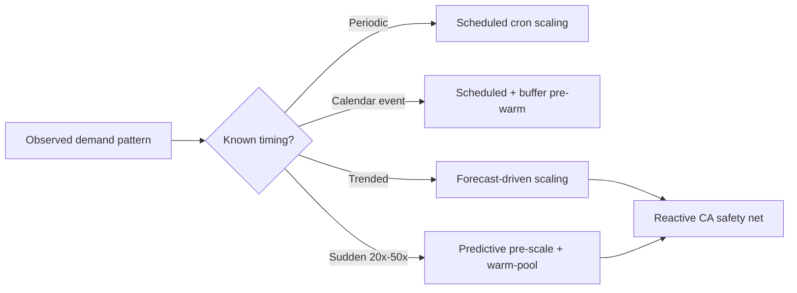
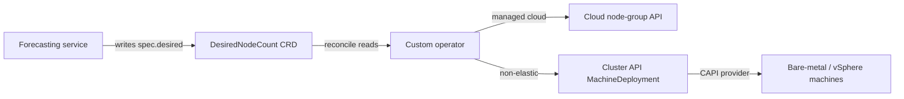

# Predictive and Scheduled Node Autoscaling for Kubernetes: Strategies, Best Practices, and a Ranked Recommendation

Proactive node scaling driven by business signals and forecasts — not pending pods — is the only reliable way to have Kubernetes capacity ready *before* a peak rather than 1–5 minutes after it. The right design combines a scheduled baseline, an event-driven layer (KEDA), a dynamic buffer, and predictive forecasting, in that order of dependency.

Across the production evidence reviewed here, **reactive end-to-end scaling lag runs 1–5 minutes**[HLD Handbook, "Auto-Scaling and Capacity Planning."](https://hld.handbook.academy/curriculum/reliability-and-operations/auto-scaling-capacity/), while **average cluster CPU utilization sits at just 8%**[Cast AI, "2026 State of Kubernetes Resource Optimization."](https://cast.ai/blog/2026-state-of-kubernetes-resource-optimization-cpu-at-8-memory-at-20-and-getting-worse/) (Cast AI's 2026 audit of tens of thousands of clusters). The dominant real-world failure is therefore simultaneous under-readiness *and* over-spend.

Despite the claim that Karpenter's sub-60-second provisioning makes proactive scaling unnecessary, Karpenter is **strictly reactive**: it acts only after the scheduler fails to place a pod, so it cannot pre-warm capacity for a known 9 a.m. peak or a non-elastic on-prem pool.

**The committed verdict:** scheduled cron scaling leads for predictable periodic peaks; KEDA event-driven scaling is the strongest general-purpose second; dynamic headroom buffers rank third; and ML/RL forecasting ranks fourth — high-ceiling but operationally costly and not yet a safe sole controller. **Layer them; do not pick one.**

---

# 1 Framework, Scope, and Vocabulary

Provisioning nodes ahead of a demand peak is a fundamentally different problem from scaling pod replicas, and that distinction governs every recommendation here. The standard Cluster Autoscaler waits for a pod to become unschedulable before adding a node, then forces workloads to wait several minutes for a Ready node[Red Hat CoP 2024, "proactive-node-scaling-operator."](https://github.com/redhat-cop/proactive-node-scaling-operator). For a service whose traffic climbs faster than nodes can be materialized, that latency is the entire problem.

## 1.1 The Node-Count vs. Pod-Replica Boundary

Two autoscaling questions are routinely conflated:

- **"How many copies of my app should run?"** — a pod-replica question answered by the Horizontal Pod Autoscaler (HPA) or Vertical Pod Autoscaler (VPA). Neither changes node count.
- **"How many machines host those pods?"** — the node-count question this report answers.

The two are linked but not identical: a replica increase becomes a node increase only if new replicas cannot fit on existing capacity. This indirection is the crux of the complaint about the Cluster Autoscaler. The causal path from "traffic rises" to "node is Ready" runs through several links — traffic raises a metric → HPA adds replicas → pods go Pending → Cluster Autoscaler provisions — and **each link adds latency, with the last alone costing several minutes**[Red Hat CoP 2024, "proactive-node-scaling-operator."](https://github.com/redhat-cop/proactive-node-scaling-operator).

**The analytical payoff:** any solution that shortens this chain collapses links — either by acting on a forecast before the metric rises, or by controlling node count directly and skipping the pod-pending trigger.

## 1.2 In-Scope Mechanisms and User Constraints

Four node-scaling families are in scope as primary solutions: **forecast-driven (predictive)**, **cron/calendar-aware (scheduled)**, **event-driven**, and **warm-pool/headroom overprovisioning**. Pure HPA and VPA are out of scope as primary solutions but remain supporting actors, since a predictive node strategy almost always sits downstream of a pod-scaling layer.

The brief names three constraints that drive scoring throughout:

1. **Proactive scale-out** — capacity added before peak load, not after pods go Pending.
2. **Prompt scale-in** — nodes decommissioned during troughs to avoid idle node-hours.
3. **Support for non-elastic node groups** — pools whose size changes only by explicit count adjustment, not on demand.

**The non-elastic constraint is the single most consequential filter.** A controller that scales by raising an ASG's desired capacity satisfies the proactive requirement perfectly on elastic cloud — yet on a fixed bare-metal rack the same action changes nothing. Tools are therefore scored on whether capacity *actually materializes* in the target environment, which is why the **Cluster API custom-controller pattern is treated as a first-class option** for bare-metal and vSphere.

## 1.3 Evaluation Rubric

A weighted scoring model prevents "whoever-speaks-loudest" decisions[SWOT Solutions 2026, "Technology Comparison Frameworks."](https://swot.co.in/blog/technology-comparison-frameworks/). Each candidate is scored 0–10 on six axes; the final score is **S_final = Σ(weight × axis score)**, with weights summing to 1.00.

| Axis | Weight | Rationale |
|---|---|---|
| **Proactivity** (acts before pending pods) | 0.25 | The defining requirement; the axis on which reactive CA fails |
| **Node-Level Control Fit** | 0.22 | Direct node-count control vs. indirect pod scaling |
| **Maturity & Production-Readiness** | 0.18 | Secondary but not negligible |
| **Non-Elastic / On-Prem Fit** | 0.15 | Whether control works where the cloud won't auto-materialize capacity |
| **Operational Simplicity** | 0.12 | Tie-breaker among already-fit options |
| **Cost-Efficiency** | 0.08 | Idle node-hour spend; prompt prioritizes readiness over last dollar |

Proactivity and Node-Level Control Fit together carry **0.47** — nearly half the score — because the stated problem is specifically that CA reacts only after pods are pending and that non-elastic pools need direct count control. A highly mature, cheap tool that cannot act proactively on a non-elastic pool is worth nothing to this user, and the weights encode that.

## 1.4 Controlled Vocabulary

**Infrastructure.** A *node group* (or *node pool* in GKE/AKS terms) is a set of worker machines managed as a unit. An *ASG* (AWS Auto Scaling Group) materializes EC2 instances when its desired capacity rises. The governing distinction:

- **Elastic pool** — incrementing the desired count is sufficient; the provider launches instances automatically.
- **Non-elastic pool** — a fixed-membership pool whose size must change by an explicit provisioning step. This covers fixed bare-metal racks and capacity-reserved vSphere clusters, where incrementing a count field does nothing without a controller to perform provisioning.

**Scaling verbs.**
- *Predictive (forecast-driven)* — provisions from a time-series demand forecast, ahead of demand.
- *Scheduled (cron/calendar-aware)* — provisions on a fixed calendar at operator-asserted times.
- *Reactive (pending-pod)* — provisions only after a pod is unschedulable (standard CA); the inadequate baseline.
- *Buffer/headroom (warm-pool)* — maintains spare or suspended capacity ahead of need.

**Timing parameters.** *Provisioning latency* is the trigger-to-Ready-node interval (several minutes cold)[Red Hat CoP 2024, "proactive-node-scaling-operator."](https://github.com/redhat-cop/proactive-node-scaling-operator). *Cooldown* is the minimum wait between scaling actions. *Hysteresis* is the deliberate asymmetry between scale-out and scale-in thresholds that prevents oscillation. A *warm pool* is a set of pre-provisioned or suspended nodes held ready.

**The core design requirement follows directly: a proactive strategy's forecast or schedule horizon must exceed the provisioning latency, or nodes arrive after the peak they were meant to serve.**

Two governing buffer modes carry sharply different cost: active buffers keep running nodes, while **standby buffers maintain suspended capacity at single-digit-percent overhead, reducing cost by up to 60% versus active buffers under identical loads**[Google Cloud 2026, "GKE standby buffers speed up autoscaling for less spend."](https://cloud.google.com/blog/products/containers-kubernetes/gke-standby-buffers-speed-up-autoscaling-for-less-spend).

---

# 2 Why Reactive Cluster Autoscaler Falls Short

Cluster Autoscaler is correctly built for a *different* problem — cost-efficiently matching capacity to *already-present* load — than the one posed here: matching capacity to *forecastable, not-yet-present* load on pools that may not be elastic.

## 2.1 How Cluster Autoscaler Works

**The scale-out trigger is a pending pod, full stop.** CA monitors for pods stuck in `Pending` with insufficient capacity, then adds nodes from a matching cloud node group[Kubernetes Visual Handbook, "Cluster Autoscaler."](https://k8s.info/docs/advanced/cluster-autoscaler)[AWS, "Cluster Autoscaler," EKS Best Practices Guide.](https://docs.aws.amazon.com/eks/latest/best-practices/cas.html)[Schrijvershof, J., "Kubernetes Cluster Autoscaler."](https://jorijn.com/en/knowledge-base/kubernetes/monitoring/kubernetes-cluster-autoscaler-node-scaling/). The actuator on the other end is the cloud provider's auto-scaling group[Microsoft, "Cluster autoscaling in AKS overview."](https://learn.microsoft.com/en-us/azure/aks/cluster-autoscaler-overview). CA adjusts node count based on pod resource needs[OneUptime 2026, "Implement Cluster Autoscaler for Dynamic Node Scaling."](https://oneuptime.com/blog/post/2026-02-09-cluster-autoscaler-dynamic/view) — not on any business-facing measure of demand.

**Scale-in** removes nodes below ~50% utilization once they are continuously unneeded for roughly ten minutes[Schrijvershof, J., "Kubernetes Cluster Autoscaler."](https://jorijn.com/en/knowledge-base/kubernetes/monitoring/kubernetes-cluster-autoscaler-node-scaling/)[AWS, "Cluster Autoscaler," EKS Best Practices Guide.](https://docs.aws.amazon.com/eks/latest/best-practices/cas.html), a deliberate conservatism that prevents thrashing through cooldown and hysteresis[kubernetes/autoscaler, "clusterstate.go."](https://github.com/kubernetes/autoscaler/blob/master/cluster-autoscaler/clusterstate/clusterstate.go). But that same delay guarantees scale-in during a genuine trough is slow — CA has no forecast distinguishing a brief dip from a sustained trough. A cron layer that *knows* the trough lasts 02:00–06:00 can scale in immediately.

**CA does not create infrastructure**; it asks a cloud API to change a desired-count integer, and that API must exist. Where a compatible elastic group exists, CA works. Where none exists, it has nothing to call. The `externalgrpc` provider lets an operator implement provisioning behind a gRPC service[MDNIX, "Writing a Cluster Autoscaler Provider with externalgrpc."](https://mdnix.io/posts/autoscaler-externalgrpc), but shifts the burden onto the team. TechPlained characterizes CA as working "slowly, rigidly, and with a frustrating dependency on pre-configured node groups," which Karpenter was designed to escape[TechPlained, "Karpenter vs Cluster Autoscaler 2026."](https://www.techplained.com/karpenter-vs-cluster-autoscaler).

## 2.2 The Pending-Pod Reactivity Gap

**The fatal gap is temporal: just before a known peak, there are no pending pods, so there is no scale-up signal.** At 08:55 the cluster is quiet, every pod scheduled. CA sees nothing. The spike arrives, pods go Pending, and only *then* — after the peak has already begun degrading service — does CA begin provisioning. This mirrors the HPA defect ScaleOps identifies: CPU utilization carries a **30-second-to-3-minute delay** through the HPA pipeline, so by the time it triggers, demand has already landed[Vermandé, N. 2026, "Why CPU Utilization Is the Worst Scaling Signal," ScaleOps.](https://scaleops.com/blog/blog-kubernetes-leading-scaling-metrics/)[ScaleOps 2026, "HPA's Three Architectural Flaws."](https://scaleops.com/blog/hpas-three-architectural-flaws-and-why-your-autoscaling-keeps-failing/).

**Two latencies stack in series**, and the node-level one is larger and more variable:

| Latency layer | Magnitude | Evidence |
|---|---|---|
| Metric poll + HPA compute | seconds–minutes | ScaleOps[Vermandé, N. 2026, "Why CPU Utilization Is the Worst Scaling Signal," ScaleOps.](https://scaleops.com/blog/blog-kubernetes-leading-scaling-metrics/), DZone |
| Pod scheduling → Ready | seconds–minutes | DZone |
| Node provisioning → Ready | ~30–90s+ realistic floor | Karpenter playbook[Engineering Playbook 2026, "Karpenter-based EKS Scaling Strategy."](https://devfloor9.github.io/engineering-playbook/en/docs/eks-best-practices/resource-cost/karpenter-autoscaling), issue #6165[aws/karpenter-provider-aws, Issue #6165 "scale out latency."](https://github.com/aws/karpenter-provider-aws/issues/6165) |

From the instant a pod goes Pending to the instant a new node runs it, **one to several minutes elapse** — precisely when SLOs are breached[AWS, "Eliminate Kubernetes node scaling lag with pod priority and over-provisioning."](https://aws.amazon.com/blogs/containers/eliminate-kubernetes-node-scaling-lag-with-pod-priority-and-over-provisioning/).

**The deepest problem is signal identity:** the pod-scheduling signal is a lagging proxy for business demand. The remedy, well documented at the pod layer, is to scale on the business signal directly — queue depth or request latency from Prometheus rather than CPU[OneUptime 2026, "Configure HPA with Custom Metrics from Prometheus."](https://oneuptime.com/blog/post/2026-02-16-how-to-configure-horizontal-pod-autoscaler-with-custom-metrics-from-prometheus-on-aks/view). The contrarian point: swapping CA for a faster pending-pod provisioner like Karpenter narrows but does not close the gap, because both still wait for the same lagging scheduling signal. **Only driving scaling from the business-demand signal acts *before* pods go pending.** None of the three roots of the gap — absent pre-peak signal, stacked latency, signal separation — is fixable by tuning CA's parameters.

## 2.3 Non-Elastic Failure Modes

Where §2.2 showed CA acting too late, here it cannot act at all. "Non-elastic" is not one failure mode but three:

| Failure mode | What breaks | External response |
|---|---|---|
| **Bare metal / Proxmox** | No cloud provider, no ASG API[Massoteau, M., "Kubernetes Cluster Autoscaler with Proxmox," Medium.](https://medium.com/@marcmassoteau/22-22-kubernetes-cluster-autoscaler-with-proxmox-1e9ce33b538c) | externalgrpc or CAPI controller |
| **On-prem capacity reservation** | Power/membership ≠ create-on-demand[MDNIX, "Writing a Cluster Autoscaler Provider with externalgrpc."](https://mdnix.io/posts/autoscaler-externalgrpc)[kubernetes/autoscaler, "clusterstate.go."](https://github.com/kubernetes/autoscaler/blob/master/cluster-autoscaler/clusterstate/clusterstate.go) | custom controller |
| **Manually managed pool** | Contested desired-count ownership[kubernetes/autoscaler, Issue #7812 "Autoscaler not balancing empty ASGs."](https://github.com/kubernetes/autoscaler/issues/7812) | single-owner CronJob |

On bare metal, CA "lacks support... because there is no official cloud provider, no managed node group API, and no autoscaling group integration"[Massoteau, M., "Kubernetes Cluster Autoscaler with Proxmox," Medium.](https://medium.com/@marcmassoteau/22-22-kubernetes-cluster-autoscaler-with-proxmox-1e9ce33b538c). For capacity-reservation pools, the machines physically exist but are suspended — a power-and-membership operation CA's create-on-demand vocabulary cannot express. For manually managed pools, a filed issue shows CA fails to balance node groups when desired count is zero[kubernetes/autoscaler, Issue #7812 "Autoscaler not balancing empty ASGs."](https://github.com/kubernetes/autoscaler/issues/7812); layering CA over an externally managed pool splits ownership and invites conflict.

## 2.4 Reframing: Demand-Driven Node Scaling

The diagnosis converts to a positive principle: **node scaling should be driven by the leading business-demand signal, not the lagging pod-scheduling signal.** To have nodes Ready at 09:00, the scale-out decision must be made before 08:58 — before any pod could be pending. The redhat-cop operator names this directly: without proactive measures, CA only creates nodes after a pod is pending, causing multi-minute waits[Red Hat CoP 2024, "proactive-node-scaling-operator."](https://github.com/redhat-cop/proactive-node-scaling-operator).

Two solution families follow, and **they are complementary, not competing:**

- **Signal fabrication** — CA PR #7145 injects fake pods that trigger the autoscaler, removing the wait for a real unschedulable pod[kubernetes/autoscaler 2024, "PR #7145: Proactive scale-up via fake-pod injection."](https://github.com/kubernetes/autoscaler/pull/7145).
- **Warm pools** — GKE's active buffer provides pre-provisioned running nodes to eliminate scale-out latency[Google Cloud 2026, "New GKE active buffer minimizes scale-out latency."](https://cloud.google.com/blog/products/containers-kubernetes/new-gke-active-buffer-minimizes-scale-out-latency), with standby buffers cutting that cost up to 60%[Google Cloud 2026, "GKE standby buffers speed up autoscaling for less spend."](https://cloud.google.com/blog/products/containers-kubernetes/gke-standby-buffers-speed-up-autoscaling-for-less-spend).

A forecast or cron layer handles the *predictable* component by provisioning ahead; a warm-pool buffer absorbs the *unpredictable* residual; and reactive CA or Karpenter remains underneath as the safety net for genuine surprises. **Standard CA retains a genuine role — as the reactive floor, never the proactive primary.**

---

# 3 Scaling Mechanism Taxonomy

The central move is to separate ***when* a scaling decision fires** (trigger source) from ***what* it resizes** (pod vs. node layer) — two axes practitioners routinely conflate, and whose conflation is the root of the "my HPA scales but my nodes don't" failure.

## 3.1 Trigger Source

Four trigger sources exhaust the production landscape:

- **Time-based** — fire on a clock ("08:55 weekday, raise floor to 40 nodes").
- **Forecast-based** — fire on a time-series prediction[KEDA 2026, "v2.20.0 Release — Elastic Forecast Scaler."](https://github.com/kedacore/keda/releases/tag/v2.20.0).
- **Metric-event** — fire on queue length or message rate[DevOps School, "What is event driven autoscaling?"](https://www.devopsschool.nl/event-driven-autoscaling/).
- **Static-buffer** — no signal; a standing reserve of headroom[Google Cloud 2026, "New GKE active buffer minimizes scale-out latency."](https://cloud.google.com/blog/products/containers-kubernetes/new-gke-active-buffer-minimizes-scale-out-latency).

The cost-of-error profiles differ. A cron trigger fails silently when demand arrives off-schedule; a forecast degrades gracefully. **Crucially, only the time, forecast, and static-buffer families pass the Proactivity test** — the metric-event and reactive families fail by construction, because their signal exists only once load is present and inherits the full 1–5-minute provisioning latency as user-visible degradation[HLD Handbook, "Auto-Scaling and Capacity Planning."](https://hld.handbook.academy/curriculum/reliability-and-operations/auto-scaling-capacity/).

## 3.2 Scaling Layer: Pod-Driven vs. Direct-Node

In the **pod-driven-node** model, a workload autoscaler changes replica count; new pods go Pending; only then does a node controller react. This chains two latencies in series and produces the several-minute wait the redhat-cop docs flag[Red Hat CoP 2024, "proactive-node-scaling-operator."](https://github.com/redhat-cop/proactive-node-scaling-operator). HPA, PHPA, and all KEDA scalers operate here.

In the **direct-node-control** model, a controller writes the desired node count straight to a cloud node-group API or cluster-management object, skipping the pending-pod round trip. CA PR #7145 is an instructive hybrid — it fabricates the pod-layer signal to get direct-node-control *timing* out of pod-driven *plumbing*[kubernetes/autoscaler 2024, "PR #7145: Proactive scale-up via fake-pod injection."](https://github.com/kubernetes/autoscaler/pull/7145).

**For the non-elastic case, only direct-node-control earns an unqualified pass.** A non-elastic pool does not auto-grow on pod pressure, so Model A's entire mechanism dead-ends at the pending-pod step. The only way to change capacity is to write the new count to the pool's control surface directly — a cloud desired-size API, a Cluster API MachineDeployment replica field, or equivalent.

| Property | Model A: pod-driven | Model B: direct-node |
|---|---|---|
| What it writes | Pod replica count | Node-group desired size |
| Node-level guarantee | None on its own | Yes |
| Provisioning latency | Pod-schedule + node-boot[Red Hat CoP 2024, "proactive-node-scaling-operator."](https://github.com/redhat-cop/proactive-node-scaling-operator) | Node-boot only |
| Non-elastic fit | Inert | Mandatory and sufficient |
| Examples | HPA, KEDA, PHPA[KEDA 2026, "v2.20.0 Release — Elastic Forecast Scaler."](https://github.com/kedacore/keda/releases/tag/v2.20.0)[kedacore/keda 2026, GitHub last push 2026-05-20.](https://github.com/kedacore/keda) | CAPI controller, node-group CronJob, GKE buffer[Google Cloud 2026, "New GKE active buffer minimizes scale-out latency."](https://cloud.google.com/blog/products/containers-kubernetes/new-gke-active-buffer-minimizes-scale-out-latency) |
| Proactive timing | Only via fake-pod injection[kubernetes/autoscaler 2024, "PR #7145: Proactive scale-up via fake-pod injection."](https://github.com/kubernetes/autoscaler/pull/7145) | Native |

## 3.3 Decision Tree and Information Conditions

The DevOps ARG analysis of breaking-news traffic supplies three canonical branches[^34]:



The three mechanisms partition the solution space by **how much is known about future load**: known timing selects cron, known trend selects forecast, known-nothing selects reactive.

- **Periodic peaks** → cron. Despite the assumption that forecasting dominates because it's "smarter," for strictly periodic peaks the simpler cron mechanism is the superior engineering choice — no model to train, no error to bound, no drift to monitor[DevOps ARG, "Predictive Pre-Scaling on Kubernetes."](https://www.devopsarg.com/en/blog/predictive-prescaling-kubernetes-breaking-news/).
- **Irregular 20x–50x spikes** → predictive pre-scale *plus* warm-pool buffer. The buffer is not redundant with the forecast; **it covers the forecast's own provisioning latency**[DevOps ARG, "Predictive Pre-Scaling on Kubernetes."](https://www.devopsarg.com/en/blog/predictive-prescaling-kubernetes-breaking-news/).
- **Known business events** (flash sales) → cron aligned to the calendar[DevOps ARG, "Predictive Pre-Scaling on Kubernetes."](https://www.devopsarg.com/en/blog/predictive-prescaling-kubernetes-breaking-news/).

| Mechanism | Trigger | Latency to Ready | Best-fit pattern |
|---|---|---|---|
| Scheduled (cron) | Clock | ~Zero (pre-warmed) | Known periodic peaks |
| Forecast-driven | Time-series | Horizon − model error | Trending load |
| Event-driven | Queue/event[DevOps School, "What is event driven autoscaling?"](https://www.devopsschool.nl/event-driven-autoscaling/) | Depends on node path | Bursty, signal-correlated |
| Buffer/headroom | Static reserve | Near-zero[Google Cloud 2026, "New GKE active buffer minimizes scale-out latency."](https://cloud.google.com/blog/products/containers-kubernetes/new-gke-active-buffer-minimizes-scale-out-latency) | Sudden spikes |
| Reactive | Unschedulable pod | 1–5 min[HLD Handbook, "Auto-Scaling and Capacity Planning."](https://hld.handbook.academy/curriculum/reliability-and-operations/auto-scaling-capacity/) | Unknown churn |

The canonical composition is **forecast-driven primary with a reactive backstop** — a defense-in-depth arrangement where the forecast is fast but fallible and the reactive path is slow but certain. Because a cheap standby reserve can sit beneath both[Google Cloud 2026, "GKE standby buffers speed up autoscaling for less spend."](https://cloud.google.com/blog/products/containers-kubernetes/gke-standby-buffers-speed-up-autoscaling-for-less-spend), the forecast layer can be tuned toward cost-efficiency rather than worst-case safety.

**Pick the trigger source from the demand pattern and the coupling model from the node group's elasticity; for any non-elastic pool the coupling model must be Model B.**

---

# 4 Scheduled (Cron/Calendar-Aware) Scaling

If you already know *when* demand arrives, you can provision against the wall clock rather than waiting for a pending pod. Cron scaling moves the decision point earlier so the provisioning latency is absorbed before traffic arrives.

**Headline finding:** for deterministic, calendar-correlated traffic on a non-elastic node group, cron scaling is the single most robust and operationally simple strategy available — but it fails hard and silently on any spike the calendar did not anticipate. The answer is a cron baseline *plus* a reactive overlay.

## 4.1 KEDA Cron Scaler (Pod Layer)

The KEDA Cron Scaler fires on a wall-clock schedule — `start`/`end` cron expressions, a `timezone`, and a `desiredReplicas` value[^2]:

```yaml
apiVersion: keda.sh/v1alpha1
kind: ScaledObject
metadata:
 name: checkout-business-hours
spec:
 scaleTargetRef:
 name: checkout-api
 minReplicaCount: 5
 maxReplicaCount: 60
 triggers:
 - type: cron
 metadata:
 timezone: America/New_York
 start: "0 8 * * 1-5"
 end: "0 19 * * 1-5"
 desiredReplicas: "40"
```

**The decisive advantage over reactive scaling is that scale-out begins at the window boundary, not after load saturates existing replicas.** The lead time is operator-defined and can be made arbitrarily large.

**But KEDA changes replica count, not nodes.** Translating to node scaling requires a cascade: cron raises replicas → new pods go Pending → node autoscaler provisions[kubernetes/autoscaler, "cluster-autoscaler/FAQ.md."](https://github.com/kubernetes/autoscaler/blob/master/cluster-autoscaler/FAQ.md)[Schrijvershof, J., "Kubernetes Cluster Autoscaler."](https://jorijn.com/en/knowledge-base/kubernetes/monitoring/kubernetes-cluster-autoscaler-node-scaling/). This reintroduces the full provisioning latency, because cron only front-runs the *pod* decision, not the *node* decision. The fix is a **pre-roll offset** — open the window at 07:50 so node provisioning completes before 08:00 traffic — or pairing with a warm-pool layer[AWS, "Eliminate Kubernetes node scaling lag with pod priority and over-provisioning."](https://aws.amazon.com/blogs/containers/eliminate-kubernetes-node-scaling-lag-with-pod-priority-and-over-provisioning/).

**Configuration traps:** omitting or mis-setting `timezone` drifts the window across daylight-saving transitions. For overlapping schedules, **KEDA resolves competing triggers by taking the largest desired replica count among all active triggers**[kedacore/keda 2026, GitHub last push 2026-05-20.](https://github.com/kedacore/keda) — a floor-not-ceiling model that makes layered windows compositional once internalized.

**Verdict:** strong pass on Proactivity, Maturity (CNCF graduated, last push 2026-05-20[kedacore/keda 2026, GitHub last push 2026-05-20.](https://github.com/kedacore/keda), v2.20.0 on 2026-06-01[KEDA 2026, "v2.20.0 Release — Elastic Forecast Scaler."](https://github.com/kedacore/keda/releases/tag/v2.20.0)), and Operational Simplicity. Conditional pass on Node-Level Control Fit — it never controls node count directly.

## 4.2 CronJob-Driven Node-Pool Resizing (Node Layer)

This family moves the calendar logic into a controller that calls the cloud node-group API directly — **the only way to achieve true direct node-count control on a non-elastic pool**:

```yaml
apiVersion: batch/v1
kind: CronJob
metadata:
 name: scale-out-morning
spec:
 schedule: "50 7 * * 1-5" # ten-minute pre-roll
 timeZone: "America/New_York" # native CronJob field
 concurrencyPolicy: Forbid # no stacked resizes
 jobTemplate:
 spec:
 template:
 spec:
 serviceAccountName: node-scaler
 containers:
 - name: resize
 image: amazon/aws-cli:2
 command: ["/bin/sh","-c"]
 args: ["aws autoscaling set-desired-capacity --auto-scaling-group-name prod-workers --desired-capacity 12 --honor-cooldown"]
 restartPolicy: OnFailure
```

**The load-bearing decision is naming an absolute desired capacity, not a delta** — making the operation idempotent so a missed or duplicated run cannot compound into drift. The chief caution is contention with any reactive autoscaler on the same pool[kubernetes/autoscaler, "clusterstate.go."](https://github.com/kubernetes/autoscaler/blob/master/cluster-autoscaler/clusterstate/clusterstate.go); resolve it by giving the CronJob exclusive authority over the pool's minimum (set CA's `min` to the scheduled floor).

**Per-provider count semantics differ and do not port cleanly:**

| Provider | API | Count semantics | Non-elastic fit |
|---|---|---|---|
| AWS | `set-desired-capacity` | Absolute group size | Strong |
| GKE | `gcloud container clusters resize --num-nodes` | **Per-zone multiple (×zones)** | Strong — watch zone multiplier |
| AKS | Node-pool count adjustment | Per-pool count[Microsoft, "Cluster autoscaling in AKS overview."](https://learn.microsoft.com/en-us/azure/aks/cluster-autoscaler-overview) | Strong |

The GKE per-zone multiplier is the single most common source of a 3× over/under-provision error — a three-zone cluster resized to `--num-nodes 2` runs six nodes. The economic case for overnight shrink is concrete: a pool live ~60 of 168 weekly hours falls to ~36% of an always-on baseline, a ~64% saving. For genuinely fixed/on-prem fleets, the `externalgrpc` provider bridges to infrastructure with no cloud node-group endpoint[MDNIX, "Writing a Cluster Autoscaler Provider with externalgrpc."](https://mdnix.io/posts/autoscaler-externalgrpc).

**Verdict:** strongest scheduled option for non-elastic/on-prem fit, because it names an explicit count. Its weakest axis is Operational Simplicity — you own the resize logic, per-provider semantics, and contention discipline.

## 4.3 Strengths, Limits, and Best-Fit

**Robust for deterministic traffic.** Cron scaling removes every source of inference error — no model to misforecast, no metric lag, no cold-start, no oscillation, only a clock and a committed number. Resilio Tech finds cron scaling has "low operational complexity and high reliability for regular patterns," whereas ML forecasting "adds significant complexity... and its reliability depends on forecast accuracy"[Resilio Tech, "Replacing Cron Jobs with Proper ML Pipeline Orchestration."](https://resiliotech.com/blog/replacing-cron-jobs-with-proper-ml-pipeline-orchestration).

**Fails on unforecast spikes.** The exact property making cron robust — indifference to actual load — makes it fail silently on any cliff. Flash-crowd events "do not ramp, they cliff"[DevOps.com, "When Millions Arrive in a Minute: Why Reactive Autoscaling Fails."](https://devops.com/when-millions-arrive-in-a-minute-why-reactive-autoscaling-fails-and-the-predictive-fix/); an unscheduled spike finds the cluster at the calendar floor with no mechanism to notice. If 85–95% of traffic is calendar-predictable and 5–15% arrives as unscheduled cliffs, a pure scheduled strategy leaves that high-value fraction fully exposed.

**The resolution is to layer:** cron sets the baseline floor covering the predictable 85–95%; a reactive or buffer overlay catches the remainder. Give cron exclusive authority over the node-group minimum and let the reactive layer add above it.

---

# 5 Forecast-Driven (Predictive) Scaling

Forecast-driven scaling is the only mechanism that acts on a *projection* of demand. **Headline verdict:** it is the highest-proactivity mechanism available, but **every tool emits a pod/replica target that something downstream must convert into reserved nodes** — the forecasting layer alone never closes the loop on node count.

## 5.1 Statistical Forecasting Models

Three interpretable model families form a complexity ladder:

- **Linear regression** — captures a trend line but has no seasonal term; will extrapolate a Monday ramp into a Saturday trough.
- **Holt-Winters** — decomposes the series into level, trend, and seasonal index; the right first choice for single-period, stable seasonality[DataOps School 2026, "Seasonality."](https://dataopsschool.com/blog/seasonality/).
- **Prophet** — handles overlaid seasonalities (daily + weekly + yearly) plus holiday regressors; the fit for retail/media calendar spikes.

The **Predictive HPA (PHPA)** is the canonical open-source embodiment: it runs the standard HPA replica calculation, then applies statistical models against the replica history to project forward[Predictive Horizontal Pod Autoscaler Docs.](https://predictive-horizontal-pod-autoscaler.readthedocs.io/). **PHPA emits a pod-replica number, not a node count** — firmly pod-driven. Its docs honestly warn that without proper tuning it may produce inaccurate counts, causing over- or under-provisioning[Predictive Horizontal Pod Autoscaler Docs.](https://predictive-horizontal-pod-autoscaler.readthedocs.io/).

**The single most important design constraint:** the forecast horizon must exceed the provisioning latency it hides. If a model predicts five minutes ahead but a non-elastic pool takes longer than five minutes to reach Ready, the forecast bought nothing[Vermandé, N. 2026, "Why CPU Utilization Is the Worst Scaling Signal," ScaleOps.](https://scaleops.com/blog/blog-kubernetes-leading-scaling-metrics/). A safe horizon sits above the metric pipeline delay (~30s–3min) plus node provisioning latency, with margin. This is why longer-horizon tools (PredictKube's two hours, Elastic Forecast's ten minutes) are more defensible for slow-provisioning environments than a five-minute statistical projection.

## 5.2 ML / Learned-Model Frameworks

### KEDA PredictKube (SaaS ML)
Combines Prometheus metrics with a hosted AI model, using a **history window of 7–14 days** and a **prediction horizon (e.g., two hours)**[KEDA Docs 2026, "PredictKube."](https://keda.sh/docs/2.19/scalers/predictkube/). That generous horizon comfortably exceeds any node group's provisioning latency. The binding constraints: it scales pods (indirect node control), and the **SaaS API dependency** disqualifies air-gapped deployments. Maturity is thin — the open protobuf repo carries just 2 GitHub stars[dysnix/predictkube-proto 2026, GitHub.](https://github.com/dynix/predictkube-proto). **Verdict:** passes Proactivity emphatically, but qualified caution on maturity and a fail on air-gapped fit.

### KEDA Elastic Forecast (self-hosted ML)
Newest entry, shipped in v2.20.0 on **2026-06-01**[KEDA 2026, "v2.20.0 Release — Elastic Forecast Scaler."](https://github.com/kedacore/keda/releases/tag/v2.20.0), scaling on Elastic ML forecasts at a configurable `lookAhead` (e.g., ten minutes)[KEDA Docs 2026, "Elastic Forecast."](https://keda.sh/docs/2.20/scalers/elastic-forecast/). Its self-hostable forecast source makes it a more plausible fit than PredictKube for regulated environments — *if* the team already runs Elastic. The hidden weight is upstream: standing up and maintaining the Elastic ML forecast. **Verdict:** passes Proactivity; stronger non-elastic fit than PredictKube; fails Maturity on recency — pilot, don't trust blindly.

### Academic Hybrid RL Frameworks
Deep-RL-plus-neural-forecaster designs pair a learned control policy with a neural forecaster. They are predominantly **research-stage for node-level control**, validated against pod-replica targets in simulation. Operationally the heaviest in the field — reward definition, training loops, safe exploration, retraining[Resilio Tech, "Replacing Cron Jobs with Proper ML Pipeline Orchestration."](https://resiliotech.com/blog/replacing-cron-jobs-with-proper-ml-pipeline-orchestration). **Verdict:** highest theoretical proactivity ceiling, but fails Maturity and Operational Simplicity for the non-elastic case today.

**The distributional point:** raising forecast sophistication raises the proactivity ceiling and operational cost in lockstep, while leaving the node-control gap exactly where the statistical tier left it.

## 5.3 Business-Volume-to-Capacity Mapping

This is the arithmetic bridge that makes every forecast tool useful. **There is no direct QPS-to-node function, only QPS-to-pod-to-node**[^49]:

1. Forecast peak QPS → replica count (÷ per-pod QPS capacity)
2. Replica count × per-pod request → total requested resources
3. Total ÷ allocatable per node → node count

Concretely: with per-pod requests of ~0.25 cores / 0.5 GiB and a node exposing ~7.2 cores / 28.8 GiB[CloudCostKit, "Requests & Limits Calculator."](https://cloudcostkit.com/calculators/kubernetes-requests-limits-calculator/), CPU binds at ~28 pods/node. A forecast of 280 replicas → 10 nodes before headroom. Node sizing must subtract system overhead and reserve headroom[CloudCostKit, "AWS EKS Node Sizing."](https://cloudcostkit.com/guides/aws-eks-node-sizing/), so round up.

**Four inputs bound output quality:** historical traffic (the material), seasonality (the structure)[DataOps School 2026, "Seasonality."](https://dataopsschool.com/blog/seasonality/), SLOs (the target percentile — size to the SLO-protecting peak, not the mean[Wang, S., "SLO-Driven Capacity Planning."](https://sheldonwangrjt.github.io/backend%20engineering/sre/capacity%20planning/system%20design/slo-driven-capacity-planning-for-backend-teams/)), and queue depth (real-time ground truth that rises before CPU saturates[OneUptime 2026, "Configure HPA with Custom Metrics from Prometheus."](https://oneuptime.com/blog/post/2026-02-16-how-to-configure-horizontal-pod-autoscaler-with-custom-metrics-from-prometheus-on-aks/view)[Vermandé, N. 2026, "Why CPU Utilization Is the Worst Scaling Signal," ScaleOps.](https://scaleops.com/blog/blog-kubernetes-leading-scaling-metrics/)).

**Buffer forecast error to the upper confidence bound, not the point estimate.** Held as a cheap standby buffer rather than active nodes, this captures most reliability benefit at single-digit-percent overhead[Google Cloud 2026, "GKE standby buffers speed up autoscaling for less spend."](https://cloud.google.com/blog/products/containers-kubernetes/gke-standby-buffers-speed-up-autoscaling-for-less-spend). A typical uplift sizes the node count to cover the forecast's tail error (~15–25%).

---

# 6 Buffer & Headroom (Overprovisioning)

Buffer strategies keep spare capacity standing ready so provisioning latency disappears at the moment a workload needs it — the most direct answer to CA's reactive weakness.

**Committed verdict:** GKE standby buffers are the strongest headroom option where available, cutting cost up to 60% vs. active buffers[Google Cloud 2026, "GKE standby buffers speed up autoscaling for less spend."](https://cloud.google.com/blog/products/containers-kubernetes/gke-standby-buffers-speed-up-autoscaling-for-less-spend); the portable pause-pod technique is the right pick outside GKE; and permanent static overprovisioning is "the most expensive form of risk avoidance"[ProlimeHost, "Overprovisioning Is the Most Expensive Form of Risk Avoidance."](https://www.prolimehost.com/blogs/overprovisioning-is-the-most-expensive-form-of-risk-avoidance/). Dynamic sizing tied to forecast confidence reconciles headroom with aggressive scale-in.

## 6.1 Warm-Pool Approaches

| Approach | Node-count control | Portability | Maintenance | Refill owner |
|---|---|---|---|---|
| **GKE Active Buffer** | Direct[Google Cloud 2026, "New GKE active buffer minimizes scale-out latency."](https://cloud.google.com/blog/products/containers-kubernetes/new-gke-active-buffer-minimizes-scale-out-latency) | GKE-only[Cast AI, "Is There a Karpenter Equivalent on GKE?"](https://cast.ai/blog/gke-vs-karpenter/) | Minimal (vendor-run) | Google |
| **redhat-cop operator** | Via CA[Red Hat CoP 2024, "proactive-node-scaling-operator."](https://github.com/redhat-cop/proactive-node-scaling-operator) | Self-hosted controller | Controller to patch | Operator |
| **Pause/balloon pods** | Via CA[AWS, "Eliminate Kubernetes node scaling lag with pod priority and over-provisioning."](https://aws.amazon.com/blogs/containers/eliminate-kubernetes-node-scaling-lag-with-pod-priority-and-over-provisioning/) | Portable (core primitives) | Manifest + priority class | Operator |

**GKE Active Buffer** maintains pre-provisioned running nodes that make capacity available almost instantly[Google Cloud 2026, "New GKE active buffer minimizes scale-out latency."](https://cloud.google.com/blog/products/containers-kubernetes/new-gke-active-buffer-minimizes-scale-out-latency) — genuine direct node-count control, turnkey but GKE-only. Its cost overhead is the trade-off; by 2027 the standby variant (single-digit overhead, up to 60% cheaper[Google Cloud 2026, "GKE standby buffers speed up autoscaling for less spend."](https://cloud.google.com/blog/products/containers-kubernetes/gke-standby-buffers-speed-up-autoscaling-for-less-spend)) is likely to become the default.

**The redhat-cop proactive-node-scaling-operator** brings the same standing-headroom behavior as a self-hosted controller wherever CA runs[Red Hat CoP 2024, "proactive-node-scaling-operator."](https://github.com/redhat-cop/proactive-node-scaling-operator) — more portable than GKE's feature, but a community operator you patch yourself.

**The pause-pod / balloon-pod technique** uses only core Kubernetes primitives: low-priority placeholder pods hold capacity open and yield it the instant a real workload preempts them, after which the evicted placeholder triggers CA to refill[AWS, "Eliminate Kubernetes node scaling lag with pod priority and over-provisioning."](https://aws.amazon.com/blogs/containers/eliminate-kubernetes-node-scaling-lag-with-pod-priority-and-over-provisioning/). The refill pays provisioning latency *after* the real workload is already served — latency moved off the critical path. **The most portable option, and the best fit for non-elastic/on-prem cases** where a managed buffer is unavailable.

The warm-pool spectrum runs from maximum convenience (GKE) to maximum portability (pause pods); the right point depends on whether you're on GKE and whether you can operate a controller.

## 6.2 Proactive Scale-Up via Fake Pods (CA PR #7145)

PR #7145 adds nodes by injecting fake pods that trigger CA, removing the wait for a real unschedulable pod[kubernetes/autoscaler 2024, "PR #7145: Proactive scale-up via fake-pod injection."](https://github.com/kubernetes/autoscaler/pull/7145). Its elegance is reusing CA's existing provisioning path — no new node code, observability inherited from CA's metrics.

**Distinctive value:** it closes CA's pending-pod gap *without any forecasting machinery*. When demand is known in advance but not statistically predictable (scheduled events, deployments about to scale), a known-signal injection provisions the exact capacity required — a cleaner guarantee than a forecast carrying prediction error.

**Limitations are load-bearing.** It moves the trigger earlier but does *not* compress provisioning latency. It inherits CA's node-group model and therefore its **non-elastic difficulties unchanged** — it changes *when* the count is adjusted, not *how*. And it remains a **pull request, not a released feature**, so adopters carry a patched build. **Verdict:** weakest Maturity of the headroom options by virtue of PR status; a conservative team should prefer pause pods today and revisit on merge.

## 6.3 Buffer vs. Cost Tension

Every headroom strategy buys latency relief with idle capacity. Permanent static overprovisioning is "expensive and still fails"[^51]: a fixed 30% buffer pays for peak protection around the clock and silently fails on spikes exceeding it. **Dynamic buffer sizing — adjusting capacity to predicted demand — avoids wasted spend during predictable lows while maintaining spike readiness**[ProlimeHost, "Overprovisioning Is the Most Expensive Form of Risk Avoidance."](https://www.prolimehost.com/blogs/overprovisioning-is-the-most-expensive-form-of-risk-avoidance/). The reconciling move is to size the buffer to the confidence band of the forecast, holding the error margin as cheap standby capacity[Google Cloud 2026, "GKE standby buffers speed up autoscaling for less spend."](https://cloud.google.com/blog/products/containers-kubernetes/gke-standby-buffers-speed-up-autoscaling-for-less-spend), which lets headroom coexist with prompt trough scale-in.

---

# 7 Tool Landscape and Profiles

The dominant distinction running through every entity is **pod-driven vs. direct node-count control** — a tool that only adds pods still waits on CA before any node appears.

## 7.1 KEDA-Family Scalers

KEDA scales pods on external events, runs on any cluster regardless of cloud, and scales to zero[Berton, L., "KEDA vs HPA 2026."](https://lucaberton.com/blog/keda-vs-hpa-2026/). **All three scalers share one hard ceiling on Node-Level Control Fit: they move replicas, never nodes.**

- **Cron Scaler** — fires on the calendar; lead time is whatever you write into `start`. With ASG provisioning at 3–4 minutes[Tasrie IT, "Cluster Autoscaler vs Karpenter: 100+ Clusters."](https://tasrieit.com/blog/cluster-autoscaler-vs-karpenter-2026), set `start` to 08:50 and nodes are Ready before users arrive. Strongest pass on Maturity and Simplicity; the benchmark for the whole chapter.
- **PredictKube** — SaaS-model forecast, two-hour horizon dwarfing provisioning latency[Tasrie IT, "Cluster Autoscaler vs Karpenter: 100+ Clusters."](https://tasrieit.com/blog/cluster-autoscaler-vs-karpenter-2026), but SaaS coupling[KEDA Docs 2026, "PredictKube."](https://keda.sh/docs/2.19/scalers/predictkube/) and 2-star open repo[dysnix/predictkube-proto 2026, GitHub.](https://github.com/dynix/predictkube-proto) cap it. For business-hours seasonality, a two-line cron rule outperforms it on simplicity, auditability, and independence while giving up nothing on lead time.
- **Elastic Forecast** — self-hosted, ten-minute lookAhead trading horizon length for accuracy, sourced from Elastic ML[KEDA Docs 2026, "Elastic Forecast."](https://keda.sh/docs/2.20/scalers/elastic-forecast/); released 2026-06-01[KEDA 2026, "v2.20.0 Release — Elastic Forecast Scaler."](https://github.com/kedacore/keda/releases/tag/v2.20.0) — excellent pedigree, no track record yet.

A KEDA scaler is **never a complete node solution** — always the demand-signal half of a pairing whose other half must own the node count.

## 7.2 Pod-Predictive Controllers

- **PHPA** — open-source predictive HPA[Sedai, "Predictive Autoscaling in Kubernetes."](https://sedai.io/blog/predictive-autoscaling-in-kubernetes), forecasting at the pod tier; a supporting component, not a solution. Open implementations carry single-maintainer bus-factor risk.
- **Vendor SaaS (Sedai / Kedify)** — package prediction as a managed service[Sedai, "Predictive Autoscaling in Kubernetes."](https://sedai.io/blog/predictive-autoscaling-in-kubernetes)[Kedify 2026, "Kedify Extends KEDA."](https://kedify.io/resources/blog/kedify-extends-keda-predictive-vertical-multicluster/). Kedify extends KEDA with predictive autoscaling, vertical optimization, and multi-cluster coordination[Kedify 2026, "Kedify Extends KEDA."](https://kedify.io/resources/blog/kedify-extends-keda-predictive-vertical-multicluster/). Lower day-to-day burden, but commercial/egress dependency and lower transparency. **The category most likely to close the pod-to-node gap by 2027** — ask specifically whether node-count actuation is in the product.

No amount of pod-layer forecasting sophistication substitutes for node-layer control.

## 7.3 Karpenter — Best Node Control, Still Reactive

Karpenter detects unschedulable pods, batches them, and provisions right-sized nodes directly via the cloud API[Tamang, B., "Karpenter in Depth."](https://babulal.com.np/blogs/karpenter-in-depth.html)[Medium, "How Karpenter Provisions Infrastructure End-to-End."](https://medium.com/@sivaveluri/architecture-deep-dive-how-karpenter-provisions-infrastructure-end-to-end-98731ddc9414). **The critical nuance: despite its next-generation reputation, its trigger is the same pending-pod signal CA uses — it is fundamentally reactive**[Medium, "How Karpenter Provisions Infrastructure End-to-End."](https://medium.com/@sivaveluri/architecture-deep-dive-how-karpenter-provisions-infrastructure-end-to-end-98731ddc9414)[Zesty, "Tuning Karpenter for workloads with spiky traffic."](https://zesty.co/finops-academy/auto-scaling/tuning-karpenter-for-workloads-with-spiky-traffic/).

- **Node-Level Capability:** best-in-class — direct, right-sized provisioning bypassing the node-group abstraction entirely[Tamang, B., "Karpenter in Depth."](https://babulal.com.np/blogs/karpenter-in-depth.html). The paradox: the tool with the best node control is reactive by default; making it proactive requires feeding it synthetic pending pods via a headroom pattern.
- **Lead Time:** fast *provisioning* (seconds) but proactive lead time is structurally zero — the trigger fires only after pods are Unschedulable[Zesty, "Tuning Karpenter for workloads with spiky traffic."](https://zesty.co/finops-academy/auto-scaling/tuning-karpenter-for-workloads-with-spiky-traffic/). The "ultra-fast" framing is partly marketing[Engineering Playbook 2026, "Karpenter-based EKS Scaling Strategy."](https://devfloor9.github.io/engineering-playbook/en/docs/eks-best-practices/resource-cost/karpenter-autoscaling); issue #6165 documents real-world scale-out latency[aws/karpenter-provider-aws, Issue #6165 "scale out latency."](https://github.com/aws/karpenter-provider-aws/issues/6165).
- **Cloud Fit:** AWS-first, beta Azure/GCP[Tamang, B., "Karpenter in Depth."](https://babulal.com.np/blogs/karpenter-in-depth.html); GKE still lacks a Karpenter equivalent[Cast AI, "Is There a Karpenter Equivalent on GKE?"](https://cast.ai/blog/gke-vs-karpenter/). Its whole value is bypassing fixed node groups, so it **fails the strict on-prem/non-elastic case** but is a strong pass for elastic cloud (~8,000 GitHub stars, EKS-recommended[Coding Protocols, "EKS vs GKE vs AKS: Managed K8s 2026."](https://codingprotocols.com/blog/managed-k8s-showdown)).

---

# 8 Architecture Patterns: Driving Node Scale from Business Signals

**Proactive node-level autoscaling reduces to one reusable shape — a forecast-driven control plane inserted between a business metric source and a node-count API.** The three patterns differ only in how they implement that control plane and what they write to.

## 8.1 Metric Pipeline and Forecasting Service

The canonical pipeline has four stages: **collection** (Prometheus scrapes a business-volume metric), **forecasting** (a service projects demand for a horizon matched to provisioning latency), **translation** (predicted demand ÷ per-node capacity → desired node count, written to a CRD), and **actuation** (a reconciler moves infrastructure toward it).

**The CRD boundary is the single most important blast-radius control:** it makes the forecasting model swappable without touching the code that holds cloud credentials. The forecasting service needs no cloud access; the actuator needs no time-series math.

```yaml
apiVersion: capacity.example.io/v1alpha1
kind: DesiredNodeCount
metadata:
 name: web-tier-pool
spec:
 poolRef: web-tier-asg
 desired: 18 # forecast ÷ per-node capacity
 min: 4 # proactive floor
 max: 40 # cost ceiling
 forecastTs: "2026-06-10T14:30:00Z"
 horizonMinutes: 15 # matched to provisioning latency
```

A mature pipeline needs **two parallel input paths into one CRD**: a *forecast path* (closed-loop, for smooth demand)[OneUptime 2026, "Configure HPA with Custom Metrics from Prometheus."](https://oneuptime.com/blog/post/2026-02-16-how-to-configure-horizontal-pod-autoscaler-with-custom-metrics-from-prometheus-on-aks/view) and an *event path* (open-loop feed-forward, for discrete announcements like a breaking-news CMS trigger), because no single model serves both demand shapes. The CMS controller minimizes the cost of error on the high-stakes side — a news site that drops a breaking story loses far more than a few idle node-hours.

**The reconciliation loop must be idempotent:** read the CRD, read the current count, issue exactly one *set* operation (not an increment), so a missed or duplicated reconcile cannot drift the cluster. The set-not-increment discipline matters most at the direct node-group-API level, where an increment bug can run a non-elastic pool straight into its quota[Microsoft, "Cluster autoscaling in AKS overview."](https://learn.microsoft.com/en-us/azure/aks/cluster-autoscaler-overview)[kubernetes/autoscaler 2024, "PR #7145: Proactive scale-up via fake-pod injection."](https://github.com/kubernetes/autoscaler/pull/7145).

## 8.2 Coordinating with HPA/KEDA/Scheduler

Layering a predictive node controller under reactive pod autoscalers creates a two-layer system that oscillates unless the layers have **distinct, non-overlapping jobs**[^26]:

- **Predictive node controller** — ensure capacity exists before the pod layer needs it; never touch pod counts.
- **Reactive pod layer (HPA/KEDA)** — match replicas to current load.

They communicate only through free capacity: the node controller makes room, the pod layer fills it. KubeDojo describes exactly this for KEDA + Karpenter[KubeDojo, "KEDA + Karpenter together."](https://kubedojo.com/keda-karpenter-together); the predictive variant simply moves the node trigger from unschedulable pods to a forecast.

**The sharpest conflict risk is dual ownership of a field.** KEDA issue #3087 documents an HPA and a ScaledObject fighting over the same replica count; the resolution is structural exclusion at admission, not runtime arbitration[kedacore/keda, Issue #3087.](https://github.com/kedacore/keda/issues/3087). Extended to nodes: **single writer per node group** — one controller reconciles the CRD, and every other proactive input (cron, CMS events, forecasts) writes into that one CRD rather than the cloud API directly. For node-count control, where a wrong set means quota exhaustion, single-writer discipline beats any runtime arbiter.

**Placement constraints turn proactive scale-out into wasted spend** if a freshly provisioned node sits empty while pods stay Pending elsewhere due to affinity or taints. The controller must provision nodes matching the workload's constraints, not just generic capacity. A per-zone floor of at least one node mitigates the zero-baseline balancing pathology CA suffers[kubernetes/autoscaler, Issue #7812 "Autoscaler not balancing empty ASGs."](https://github.com/kubernetes/autoscaler/issues/7812). Unlike Karpenter, which reads constraints from the unschedulable pod[TechPlained, "Karpenter vs Cluster Autoscaler 2026."](https://www.techplained.com/karpenter-vs-cluster-autoscaler), a predictive controller must encode instance-type and zone selectors in its capacity mapping.

## 8.3 Custom Controller / Operator Pattern

The operator owns the CRD, runs the reconcile loop, and writes to whatever node-count API exists[Kubernetes, "Node Autoscaling."](https://kubernetes.io/docs/concepts/cluster-administration/node-autoscaling/). Its CRD follows the spec/status split: spec carries intent (floor, ceiling, pool ref), status carries observed reality. **Its advantage over the managed autoscaler is not the write mechanism — identical — but the trigger: it writes the count from a forecast instead of a pending-pod signal**[Microsoft, "Cluster autoscaling in AKS overview."](https://learn.microsoft.com/en-us/azure/aks/cluster-autoscaler-overview)[AWS, "Cluster Autoscaler," EKS Best Practices Guide.](https://docs.aws.amazon.com/eks/latest/best-practices/cas.html).

```go
func (r *Reconciler) Reconcile(ctx, req) (Result, error) {
 dnc := r.Get(ctx, req.NamespacedName)
 if dnc == nil { return Done }
 target := clamp(dnc.Spec.Desired, dnc.Spec.Min, dnc.Spec.Max) // 1. clamp to band
 actual := r.Cloud.GetNodeCount(dnc.Spec.PoolRef) // 2. read source of truth
 if target == actual { // 3. idempotent
 r.SetStatus(dnc, actual, "Converged")
 return RequeueAfter(syncPeriod)
 }
 if time.Since(dnc.Status.LastScaleTime) < cooldown { // 4. cooldown/hysteresis
 return RequeueAfter(cooldown)
 }
 err := r.Cloud.SetNodeCount(dnc.Spec.PoolRef, target) // 5. SET, never increment
 if err != nil {
 r.SetStatus(dnc, actual, "Error: "+err.Error)
 return RequeueAfter(backoff)
 }
 r.SetStatus(dnc, target, "Scaling")
 return RequeueAfter(syncPeriod)
}
```

Five safety properties: **clamp** caps a runaway forecast at the cost ceiling; **reading actual** self-heals after manual changes; **the equality check** makes the loop idempotent; **cooldown** prevents thrashing (most autoscaling failures are cooldown misconfigurations, not machinery failures[Let's Build Solutions, "Designing an Autoscaling System."](https://letsbuildsolutions.com/blog/system-design/designing-an-autoscaling-system-metrics-driven-scaling-cooldown-policies-and-predictive-capacity-planning/)); and **SET-not-increment** makes duplicate reconciles harmless. The key tuning decision is **asymmetric cooldown** — near-instant scale-out (under-provisioning during a peak is costly) and deliberately slow scale-in (a premature scale-in followed by re-provision costs a full latency penalty plus churn).

**Cluster API (CAPI) integration is the path for non-elastic infrastructure.** CAPI replaces the cloud node-group API with a uniform MachineDeployment whose replica count the operator sets, translated to real machines on bare metal, vSphere, or OpenStack[MDNIX, "Writing a Cluster Autoscaler Provider with externalgrpc."](https://mdnix.io/posts/autoscaler-externalgrpc). The Proxmox case states the gap plainly: CA lacks a count field to write because there's no cloud provider[Massoteau, M., "Kubernetes Cluster Autoscaler with Proxmox," Medium.](https://medium.com/@marcmassoteau/22-22-kubernetes-cluster-autoscaler-with-proxmox-1e9ce33b538c). **CAPI turns the non-elastic problem into the elastic problem by supplying the writable count field the platform lacks.**



**The non-elastic problem is not a forecasting or coordination problem but an actuation problem** — the absence of a writable count field — and CAPI resolves it. The operator is infrastructure-agnostic at the CRD boundary and infrastructure-specific only at the write target, letting one codebase serve both managed-cloud and bare-metal.

## 8.4 Reference Architecture for Non-Elastic Pools

On-prem inverts the cloud assumption: the total fleet already exists, and orchestration decides which nodes are active members. The forecast control plane applies unchanged; only actuation changes from a cloud API call to a reservation decision over finite inventory.

**The economics change.** In the cloud, an unused node costs nothing; on bare metal, the machine exists regardless, so the standby cost is dominated by power, not a metered charge. **The on-prem warm-pool decision is almost entirely a power-versus-latency trade-off.** Because a full power-down saves only power (small relative to standing hardware cost) while a cold boot's latency is large, the architecture favors keeping standby nodes **cordoned-but-powered** rather than powered-off. Scaling out is then a single uncordon (seconds), not a power-on-boot-join (minutes).

---

# 9 Best Practices and Safeguards

A proactive system manages the cost of being wrong in two directions: provisioning too early burns idle node-hours; provisioning too late burns SLA. **The guardrail that matters most is always the fallback to reactive scaling when the forecast is wrong.**

## 9.1 Safe Proactive Scale-Up

**Lead time ≥ provisioning latency + pod warmup.** ADAPT states the dependency directly: proactive autoscaling depends on knowing the provisioning delay between decision and ready capacity[ADAPT 2026, "Provisioning-delay-aware proactive autoscaling," arXiv 2605.15788v1.](https://arxiv.org/html/2605.15788v1). A realistic envelope is 60–180s for node Ready plus 15–120s for image pull and warmup. Set the horizon to a high percentile (p95) of the measured latency distribution, with the warm-pool buffer covering the long tail. A non-elastic pool sits at the high end, pushing the horizon out and making the warm-pool hybrid more attractive[Google Cloud 2026, "New GKE active buffer minimizes scale-out latency."](https://cloud.google.com/blog/products/containers-kubernetes/new-gke-active-buffer-minimizes-scale-out-latency).

**Hard min/max bounds.** The max bound caps the blast radius of a runaway forecast — without it a forecasting bug becomes a cloud-bill incident[Qubit.host 2026, "From Forecasts to Autoscaling."](https://qubit.host/from-forecasts-to-autoscaling-embedding-predictive-models-in). The min bound guarantees a recovery floor: a complete forecast failure degrades only to a statically-sized cluster. Between them, **provision against the upper bound of the confidence band, not the median** — biasing toward over-provisioning in proportion to model uncertainty, automatically trading cost for safety exactly when safety is least certain.

**Shadow mode before actuation.** No forecast should move production capacity on day one. Shadow mode logs and scores decisions without actuating, accumulating a measured accuracy track record[Qubit.host 2026, "From Forecasts to Autoscaling."](https://qubit.host/from-forecasts-to-autoscaling-embedding-predictive-models-in). Then roll out in stages — shadow → capped actuation → one non-critical node group → full fleet — each a rollback checkpoint that catches degrading forecast error before it becomes an SLA breach[Prepared.cloud 2026, "Model Selection and Rollback Playbook."](https://prepared.cloud/model-selection-and-rollback-playbook-for-live-workload-fore). For a non-elastic pool where a mis-sized resize is slow to reverse, staging is a hard requirement.

## 9.2 Safe Prompt Scale-Down

**Cooldown and hysteresis** are the primary defense against oscillation — scale out quickly, scale in slowly and only after sustained low demand. Routing proactive scale-in *through* the existing CA inherits its hysteresis-aware removal logic[kubernetes/autoscaler 2024, "PR #7145: Proactive scale-up via fake-pod injection."](https://github.com/kubernetes/autoscaler/pull/7145); Karpenter's consolidation is aggressive by design and must be tuned for spiky traffic[Zesty, "Tuning Karpenter for workloads with spiky traffic."](https://zesty.co/finops-academy/auto-scaling/tuning-karpenter-for-workloads-with-spiky-traffic/). The asymmetric resolution: short cooldown/tight hysteresis on scale-out, long cooldown/wide hysteresis on scale-in.

**Cordon → drain → terminate.** A node must never be terminated while it hosts pods that haven't shut down gracefully. A **PodDisruptionBudget** governs drain speed (a quorum system should set `maxUnavailable: 1`), and `terminationGracePeriodSeconds` lets applications finish in-flight requests. Driving scale-in by withdrawing fake pods and letting CA remove the empty node inherits this entire safe-removal path[Red Hat CoP 2024, "proactive-node-scaling-operator."](https://github.com/redhat-cop/proactive-node-scaling-operator) — the key reason the fake-pod pattern is attractive.

**Protect stateful/critical pods.** Some pods must be ineligible for eviction (CA's "not safe to evict" annotation, or `maxUnavailable: 0`). Co-locate protected stateful pods onto a dedicated, statically-sized pool excluded from autoscaling, leaving the stateless tier freely scalable — separating two conflicting objectives onto different infrastructure.

## 9.3 Observability and Fallback

**Scale-up lead time is the metric that separates proactive from reactive** — positive means the forecast won, negative means capacity arrived late[ADAPT 2026, "Provisioning-delay-aware proactive autoscaling," arXiv 2605.15788v1.](https://arxiv.org/html/2605.15788v1). Pending pods are a dual-purpose signal: a reactive-fallback trigger *and* a health check (sustained nonzero on a forecasted ramp means the forecast is lagging).

| Metric | Healthy state | Failure it detects |
|---|---|---|
| Scale-up lead time | Positive, ≥ warmup | Capacity arriving late |
| Request latency p99 | Within SLA | Under-provisioning reaching users |
| Pending pods | Near zero on ramps | Forecast lagging; fallback firing |
| Node utilization | Target band | Over/under-provisioning |

**Score forecast error continuously against SLA-tied windows**, weighting under-prediction (which risks SLA) more heavily than over-prediction (which merely wastes cost)[Prepared.cloud 2026, "Model Selection and Rollback Playbook."](https://prepared.cloud/model-selection-and-rollback-playbook-for-live-workload-fore). Distinguish slow accuracy alerts (feed the model-rollback loop) from fast scaling-failure alerts (feed the reactive-fallback loop).

**The ultimate safeguard: reactive CA or Karpenter must always remain active beneath the proactive layer, never replaced.** The layers need no coordination — if the forecast is correct, pods schedule onto pre-provisioned nodes and the reactive layer does nothing; if the forecast under-predicts, pods go Pending and CA/Karpenter fires on its native trigger[Zesty, "Tuning Karpenter for workloads with spiky traffic."](https://zesty.co/finops-academy/auto-scaling/tuning-karpenter-for-workloads-with-spiky-traffic/)[Qubit.host 2026, "From Forecasts to Autoscaling."](https://qubit.host/from-forecasts-to-autoscaling-embedding-predictive-models-in). **A forecast failure degrades performance only to the level of a purely reactive cluster, never below it** — the precise guarantee that makes proactive scaling safe to adopt.

## 9.4 Operational Checklist

| Best practice | Failure prevented |
|---|---|
| Forecast horizon ≥ provisioning latency + warmup | Capacity arriving after demand |
| Hard min/max node bounds | Runaway over-scaling; no recovery floor |
| Provision against confidence-band upper bound | Under-provisioning under uncertainty |
| Shadow mode before actuating | Trusting an unproven forecast |
| Staged rollout with rollback checkpoints | Fleet-wide blast radius |
| Asymmetric cooldown and hysteresis | Oscillation / flapping |
| Cordon-drain-PDB scale-in | Abrupt eviction; availability breach |
| Protect stateful/critical pods | Quorum loss; data corruption |
| Instrument lead time + pending pods | Blind operation |
| Score forecast error vs. SLA windows | Drift reaching users |
| Keep reactive CA/Karpenter always active | Unbounded worst case on forecast miss |

The three highest-leverage items for a non-elastic pool are the **horizon inequality**, the **hard max bound**, and the **always-on reactive fallback** — together they bound both directional risks even before the forecast model is tuned.

---

# 10 Cost vs. Performance and Environment Applicability

**There is no unconditional winner:** the right posture is a function of forecast error tolerance, fully-loaded node-hour cost, provisioning latency, and elasticity. The industry default is already severe over-provisioning — Cast AI measured average CPU at 8%, memory at 20%, GPU at 5% across tens of thousands of clusters[Cast AI, "2026 State of Kubernetes Resource Optimization."](https://cast.ai/blog/2026-state-of-kubernetes-resource-optimization-cpu-at-8-memory-at-20-and-getting-worse/).

## 10.1 The Trade-off Triangle

Cost, reliability, and latency form a closed triangle with **provisioning latency as the pivot variable** — shrink it and both the buffer and the scale-in damping can relax without SLA loss.

| Trade | What you buy | What you pay | Anchor | Lever |
|---|---|---|---|---|
| Active vs. standby buffer | Near-immediate scheduling | Idle node-hours | Standby cuts cost ~60%[Google Cloud 2026, "GKE standby buffers speed up autoscaling for less spend."](https://cloud.google.com/blog/products/containers-kubernetes/gke-standby-buffers-speed-up-autoscaling-for-less-spend) | Suspended capacity |
| Lead time vs. waste | Spike survivability | Pre-paid warm pool | Karpenter seconds vs. CA pending-pod lag[Coding Protocols, "EKS vs GKE vs AKS: Managed K8s 2026."](https://codingprotocols.com/blog/managed-k8s-showdown)[Kubernetes Visual Handbook, "Cluster Autoscaler."](https://k8s.info/docs/advanced/cluster-autoscaler) | Faster provisioner shrinks buffer |
| Scale-down speed vs. disruption | Trough savings | Reschedule/re-provision risk | CA removes below 50% util[Schrijvershof, J., "Kubernetes Cluster Autoscaler."](https://jorijn.com/en/knowledge-base/kubernetes/monitoring/kubernetes-cluster-autoscaler-node-scaling/) | Cooldown/hysteresis[Let's Build Solutions, "Designing an Autoscaling System."](https://letsbuildsolutions.com/blog/system-design/designing-an-autoscaling-system-metrics-driven-scaling-cooldown-policies-and-predictive-capacity-planning/) |

Static active overprovisioning "is rarely framed as waste — it's framed as safety," but idle capital carries opportunity cost; dynamic buffer sizing escapes the monotonic curve[ProlimeHost, "Overprovisioning Is the Most Expensive Form of Risk Avoidance."](https://www.prolimehost.com/blogs/overprovisioning-is-the-most-expensive-form-of-risk-avoidance/). **A FinOps team should spend on provisioning speed before standing headroom**, because speed relaxes two corners at once while headroom relaxes only one.

## 10.2 Environment Applicability

**The elastic-versus-fixed divide dominates the cloud-versus-cloud divide:**

| Environment | Provisioning primitive | Cheapest lever | Non-elastic fit |
|---|---|---|---|
| **EKS** | Karpenter (seconds)[Coding Protocols, "EKS vs GKE vs AKS: Managed K8s 2026."](https://codingprotocols.com/blog/managed-k8s-showdown) | Lead time | Elastic-oriented |
| **GKE** | CA + NAP + standby buffer[Cast AI, "Is There a Karpenter Equivalent on GKE?"](https://cast.ai/blog/gke-vs-karpenter/) | Buffer cost | Elastic-oriented |
| **AKS** | Node Auto Provisioning (Karpenter)[ScaleOps, "Multi-Cloud Kubernetes Optimization: 2026."](https://scaleops.com/blog/single-cloud-vs-multi-cloud-kubernetes-resource-automation-cost-optimization-in-practice/) | Lead time | Elastic-oriented |
| **On-prem** | Static pool / manual resize[Google Cloud, "About node types | Cluster Toolkit."](https://docs.cloud.google.com/cluster-toolkit/docs/slurm/node-types) | Headroom size only | Native fit |

GKE is the environment where buffer-based posture is first-class, because it still lacks a Karpenter equivalent[Cast AI, "Is There a Karpenter Equivalent on GKE?"](https://cast.ai/blog/gke-vs-karpenter/) but its standby buffers deliver near-immediate scheduling at single-digit overhead[Google Cloud 2026, "GKE standby buffers speed up autoscaling for less spend."](https://cloud.google.com/blog/products/containers-kubernetes/gke-standby-buffers-speed-up-autoscaling-for-less-spend). **On-prem breaks the fast-provisioner-first corollary entirely:** with no elastic API to call, "the only remaining lever is the expensive one — standing headroom — and the question collapses from 'how fast' to 'how much'"[Google Cloud, "About node types | Cluster Toolkit."](https://docs.cloud.google.com/cluster-toolkit/docs/slurm/node-types). For genuinely fixed pools, the reactive pending-pod model is not merely slow but *inapplicable*, since there is no group membership to expand; the `externalgrpc`/CAPI route attaches autoscaling logic to backends the built-in providers don't cover[MDNIX, "Writing a Cluster Autoscaler Provider with externalgrpc."](https://mdnix.io/posts/autoscaler-externalgrpc).

**Procurement layering** for elastic clouds: reserved capacity provides a guaranteed availability floor, Spot covers the cost-sensitive elastic spike with on-demand fallback on interruption[AWS, "Using Amazon EC2 Spot Instances with Karpenter."](https://aws.amazon.com/blogs/containers/using-amazon-ec2-spot-instances-with-karpenter/)[Cast AI, "AWS capacity reservations."](https://docs.cast.ai/docs/aws-capacity-reservations). A forecast-driven controller can size the reserved floor to the predicted baseline and let Spot absorb the spike[Cast AI, "AWS capacity reservations."](https://docs.cast.ai/docs/aws-capacity-reservations). On-prem has no Spot market — the only cost lever is how tightly the schedule tracks the demand curve.

## 10.3 The Master Lever: Forecast Accuracy

The four quantities are one closed loop: larger forecast error → larger buffer → higher cost → pressure for aggressive scale-down → which amplifies the damage error does[University of Virginia, "Responsive Padding RPRP for Provisioning."](https://www.cs.virginia.edu/~hs6ms/publishedPaper/Conference/2016/FFT-bigdata-CameraReady.pdf). **Forecast accuracy is the single upstream variable that relaxes all three downstream ones at once** — every other lever trades one corner for another, but improving the forecast shrinks the buffer, cuts cost, and makes scale-down safer simultaneously.

This explains why the predictive-scaling trend[KubeHA 2025, "The Role of AI in Kubernetes Autoscaling."](https://kubeha.com/the-role-of-ai-in-kubernetes-autoscaling-are-you-ready/)[HdM Stuttgart Blog 2025, "How AI is Revolutionizing Kubernetes Autoscaling."](https://blog.mi.hdm-stuttgart.de/index.php/2025/07/24/beyond-reactive-how-ai-is-revolutionizing-kubernetes-autoscaling/)[DEV Community 2025, "AI-Powered Predictive Scaling in Kubernetes."](https://dev.to/sarthakkarora/ai-powered-predictive-scaling-in-kubernetes-reducing-cloud-costs-while-maintaining-high-4ah0) is economically load-bearing, not merely fashionable: it attacks the one variable that relaxes the whole loop. The paradox: **the environment with the fewest elastic levers (fixed pools) has the most to gain from the least-mature forecast tools**, because a better forecast is the only way a fixed pool can reduce peak-sized headroom without risking SLA — it cannot fall back on fast provisioning when wrong. The constraint is operational maturity, which many fixed-pool operators lack.

**Maturity tiers:**

| Tier | Approaches | Proactivity | Readiness |
|---|---|---|---|
| **Mature** | Cron node-pool scaling, scheduled APIs, CA, Karpenter (reactive) | Scheduled only | First-party[kubernetes/autoscaler, "cluster-autoscaler/FAQ.md."](https://github.com/kubernetes/autoscaler/blob/master/cluster-autoscaler/FAQ.md)[Coding Protocols, "EKS vs GKE vs AKS: Managed K8s 2026."](https://codingprotocols.com/blog/managed-k8s-showdown) |
| **Partial** | Karpenter + buffer/cron, PHPA, GKE buffers | Real, needs assembly | Production-capable[Google Cloud 2026, "GKE standby buffers speed up autoscaling for less spend."](https://cloud.google.com/blog/products/containers-kubernetes/gke-standby-buffers-speed-up-autoscaling-for-less-spend) |
| **Open** | KEDA elastic-forecast, Kedastral, RL, vendor SaaS | Strongest in principle | Emerging[KEDA 2026, "v2.20.0 Release — Elastic Forecast Scaler."](https://github.com/kedacore/keda/releases/tag/v2.20.0)[Kedastral project 2025.](https://github.com/kedastral/kedastral) |

Against the 2025 "AI autoscaling" enthusiasm, the most mature and operationally simple proactive option for a predictable diurnal workload remains the least glamorous: **a cron schedule against a node-group API.**

---

# 11 Ranked Recommendation

This chapter converts the inventory into a single committed ranking, stress-tests it against weight perturbation, and resolves it into per-scenario picks.

## 11.1 Weighted Scoring and Tiers

Tier thresholds are fixed in advance: Tier 1 ≥ 7.00, Tier 2 = 5.50–6.99, Tier 3 < 5.50.

| Candidate | Proact (.25) | NodeCtrl (.22) | NonElastic (.15) | Maturity (.18) | OpSimpl (.12) | Cost (.08) | **S_final** | Tier |
|---|---|---|---|---|---|---|---|---|
| Cloud-native scheduled node-pool / ASG | 8.0 | 8.0 | 6.5 | 9.0 | 7.5 | 8.5 | **7.84** | 1 |
| Karpenter | 7.0 | 9.0 | 4.0 | 8.5 | 7.0 | 8.5 | **7.45** | 1 |
| KEDA Cron Scaler | 8.5 | 5.0 | 7.0 | 8.5 | 8.0 | 8.0 | **7.34** | 1 |
| Custom CronJob + node-group API | 8.0 | 8.5 | 7.5 | 6.0 | 5.0 | 7.5 | **7.34** | 1 |
| GKE Active Buffer | 8.0 | 9.0 | 3.0 | 8.0 | 8.0 | 5.5 | **7.18** | 1 |
| Cluster API (CAPI) controller | 6.5 | 8.5 | 8.0 | 6.5 | 4.0 | 7.0 | **6.94** | 2 |
| proactive-node-scaling-operator | 7.5 | 8.0 | 6.5 | 5.5 | 6.0 | 6.5 | **6.86** | 2 |
| Vendor SaaS predictive (Kedify) | 8.5 | 7.0 | 5.5 | 5.5 | 8.0 | 4.5 | **6.65** | 2 |
| CA + Proactive Scale-Up (PR #7145) | 7.5 | 7.0 | 5.0 | 5.5 | 6.0 | 7.0 | **6.58** | 2 |
| KEDA elastic-forecast | 8.5 | 5.0 | 6.0 | 5.0 | 6.0 | 6.5 | **6.30** | 2 |
| Cluster Autoscaler (baseline) | 2.0 | 8.5 | 3.5 | 9.5 | 8.0 | 7.5 | **6.18** | 2 |
| KEDA PredictKube | 8.5 | 5.0 | 6.0 | 4.5 | 5.5 | 6.5 | **6.16** | 2 |
| Predictive HPA (PHPA) | 8.0 | 4.5 | 6.0 | 5.0 | 5.5 | 6.5 | **5.98** | 2 |

**Five candidates clear Tier 1, each coupling a proactive trigger to node-level control.** The pod-scaling forecasters cap at Tier 2 on Node-Level Control Fit, not proactivity.

**The Cluster Autoscaler baseline ranks mid-pack (6.18) despite top maturity (9.50)** because its defining reactive design earns a Proactivity score of 2.00, and that heaviest-weighted axis drags it below the Tier 1 line. This is the structural confirmation that **standard CA cannot be the primary mechanism** — not because it is immature or complex, but because its pending-pod trigger is orthogonal to the proactive requirement.

## 11.2 Sensitivity Check

Recomputing under ±10pp perturbations of three weights (renormalized to sum 1.00):

| Candidate | Baseline | A: +Proactivity | B: +Maturity | C: +Cost |
|---|---|---|---|---|
| Cloud-native scheduled | 1 | 1 | 1 | 1 |
| Karpenter | 1 | 1 | 1 | 1 |
| KEDA Cron Scaler | 1 | 1 | 1 | 1 |
| Custom CronJob + node-group API | 1 | 1 | 2 | 1 |
| GKE Active Buffer | 1 | 1 | 1 | 2 |
| Kedify SaaS | 2 | 2 | 2 | 3 |
| KEDA PredictKube | 2 | 2 | 3 | 2 |
| PHPA | 2 | 2 | 3 | 2 |
| Cluster Autoscaler | 2 | **3** | **1** | 2 |

**The three clear leaders hold Tier 1 across all perturbations** — the headline recommendation does not depend on exact weights. Of 39 placements, 33 hold their baseline tier (85% stability); no Tier 1 leader ever falls below Tier 1. The most sensitive weight is **Maturity**: raising it lifts the CA baseline to Tier 1 — **the one defensible reading under which reactive CA ranks first, available only by explicitly down-weighting the proactivity the prompt treats as central.** Conversely, raising Proactivity drops CA to Tier 3, exposing its central weakness.

## 11.3 Decision Guidance by Scenario

**Elastic cloud with periodic traffic** → **native scheduled node-pool scaling as the baseline, Karpenter layered on for bin-packing within each window**, CA demoted to a reactive safety net. Scheduled scaling "eliminates latency and reduces cost" for predictable traffic[OneUptime, "Set Up Scheduled Scaling for Predictable Traffic."](https://oneuptime.com/blog/post/2026-02-12-scheduled-scaling-predictable-traffic-patterns/view); both it and the KEDA Cron Scaler hold Tier 1 across all sensitivity scenarios.

**Irregular spikes** → a **two-layer composition**: a forecast-driven KEDA scaler (elastic-forecast[KEDA 2026, "v2.20.0 Release — Elastic Forecast Scaler."](https://github.com/kedacore/keda/releases/tag/v2.20.0), PredictKube, or Kedastral[Kedastral project 2025.](https://github.com/kedastral/kedastral)) over a **standby-buffer headroom base**[Google Cloud 2026, "GKE standby buffers speed up autoscaling for less spend."](https://cloud.google.com/blog/products/containers-kubernetes/gke-standby-buffers-speed-up-autoscaling-for-less-spend), with Karpenter turning raised pod demand into nodes and reactive CA beneath as the last resort. The buffer absorbs forecast error at negligible cost — suspended capacity resumes fast enough to cover the gap between the forecast's miss and the node layer's catch-up.

**Non-elastic / on-prem** → a **Cluster API controller** (highest Non-Elastic Fit at 8.0) or a **custom CronJob against the resize/power-management API**, with a forecast-sized headroom floor[Google Cloud, "About node types | Cluster Toolkit."](https://docs.cloud.google.com/cluster-toolkit/docs/slurm/node-types). This is the only honest fit where no cloud API can compress provisioning latency.

**The standard Cluster Autoscaler is recommended nowhere as the primary mechanism** — it serves only as a reactive safety net beneath a proactive layer.

---

# References
