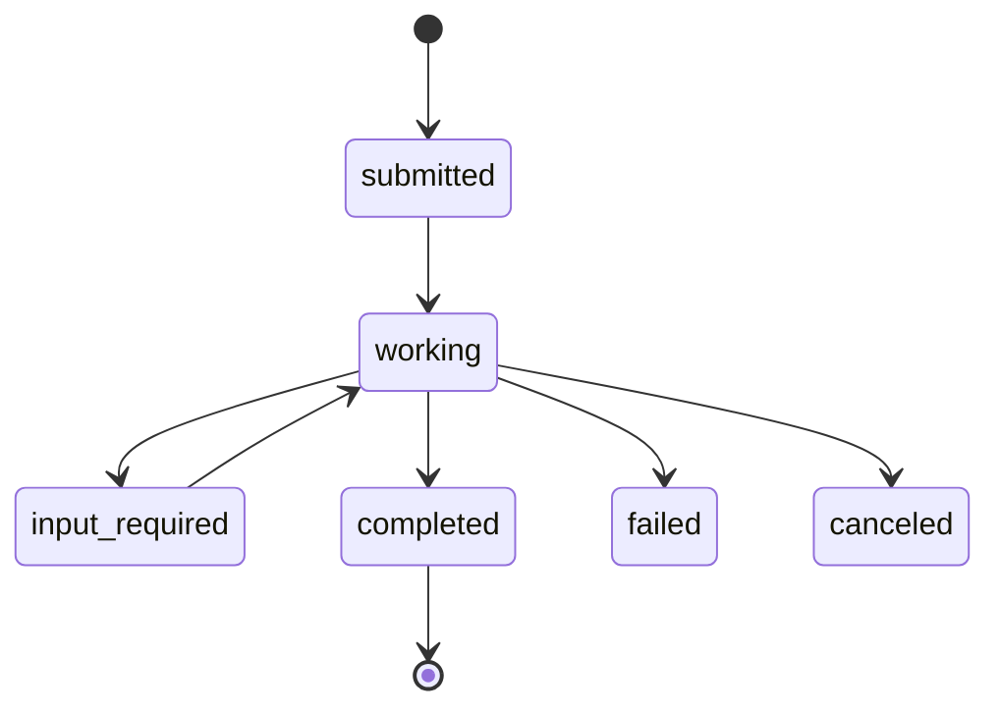

# A2A vs. MCP: How Google's Agent2Agent Protocol Differs From and Complements the Model Context Protocol

Google's **Agent2Agent (A2A)** and Anthropic's **Model Context Protocol (MCP)** are complementary infrastructure layers, not competitors for the same slot in the agentic stack. **MCP standardizes how a single agent reaches tools and data vertically; A2A standardizes how independent agents discover, delegate, and coordinate horizontally.** By early 2026 both anchor a stack adopted at measurable scale — MCP surpassing **97 million monthly SDK downloads** and A2A reaching **150-plus participating organizations**, both co-governed under the Linux Foundation's Agentic AI Foundation (146 member organizations by February 2026).

Despite frequent framing of A2A as a rival to MCP, field evidence shows agents routinely running both simultaneously — MCP for tool access, A2A for peer coordination. The open question through 2027 is not which protocol wins but whether A2A's deferred security primitives (zero built-in prompt-injection defense at v1.0) mature fast enough to satisfy the Five Eyes cryptographic-identity guidance issued May 2026.

**The verdict: MCP owns the agent-to-tool layer, A2A owns the agent-to-agent layer, and the right enterprise answer is almost always "both" — with A2A's discovery and trust gaps the decisive near-term risk.**

---

# 1. Research Framework and Comparison Matrix

The agent-interoperability landscape spans at least four named protocols, but the analytical core of this report is the **A2A/MCP pairing**.

| Entity | Originator & Release | Primary Layer | Core Role |
|---|---|---|---|
| Google A2A | Google, Apr 2025 | Horizontal | Agent-to-agent delegation |
| Anthropic MCP | Anthropic, Nov 2024 | Vertical | Agent-to-tool/data access |
| IBM ACP | IBM/BeeAI | Coordination | REST-based invocation |
| ANP | Open community | Identity/federation | Decentralized discovery |
| A2A+MCP | Combined | Both | Full-stack agentic |

**MCP was released by Anthropic in November 2024 as a vertical model-to-capability link; A2A was released by Google in April 2025 with over 50 enterprise partners**[Chaitanya Prabuddha, "A2A vs MCP: A Technical Comparison"](https://www.chaitanyaprabuddha.com/blog/a2a-vs-mcp-protocol-comparison). This two-layer split governs every comparison that follows.

## Scope and Boundaries

This report examines two precisely identified protocols. Google's **A2A (Agent2Agent) launched April 9, 2025** and defines horizontal agent-to-agent communication across vendors[Chaitanya Prabuddha, "A2A vs MCP: A Technical Comparison"](https://www.chaitanyaprabuddha.com/blog/a2a-vs-mcp-protocol-comparison). Anthropic's **MCP (Model Context Protocol) released November 25, 2024** and defines how a model connects to tools and data sources as a vertical link[Chaitanya Prabuddha, "A2A vs MCP: A Technical Comparison"](https://www.chaitanyaprabuddha.com/blog/a2a-vs-mcp-protocol-comparison). Similarly-named technologies outside the AI-agent domain ("A2A" in telecom, "MCP" for multi-chip packages) are explicitly excluded.

**The boundary that matters most is the vertical/horizontal line: MCP connects models to tools and data, whereas A2A connects agents to each other** — the distinction Atlan identifies as the reason production systems require both[Atlan, "MCP vs A2A Protocol"](https://atlan.com/know/mcp/mcp-vs-a2a-protocol/). The layer-separation framing lets both protocols occupy distinct niches simultaneously rather than forcing a winner.

## Master Comparison Matrix

| Dimension | A2A | MCP | ACP | ANP |
|---|---|---|---|---|
| Primary layer | Horizontal agent-to-agent[Stellagent, "A2A Protocol: Google Agent-to-Agent"](https://stellagent.ai/insights/a2a-protocol-google-agent-to-agent) | Vertical agent-to-tool[Chaitanya Prabuddha, "A2A vs MCP: A Technical Comparison"](https://www.chaitanyaprabuddha.com/blog/a2a-vs-mcp-protocol-comparison) | REST invocation[AgentMarketCap 2026, "Four-Protocol Agent Interoperability"](https://agentmarketcap.ai/blog/2026/05/19/four-protocol-agent-interoperability-mcp-a2a-acp-anp) | Decentralized discovery |
| Participants | Client + remote agent[DigitalOcean, "A2A vs MCP AI Agent Protocols"](https://www.digitalocean.com/community/tutorials/a2a-vs-mcp-ai-agent-protocols) | Model + tools/data[StackA2A, "A2A vs MCP Comparison"](https://stacka2a.dev/blog/a2a-vs-mcp-comparison) | REST caller + service[arXiv 2025, "Agent Communication Protocols"](https://arxiv.org/html/2505.02279) | Open-internet agents[Zylos Research 2026, "Multi-Agent Communication Protocols Comparison"](https://zylos.ai/research/2026-03-05-multi-agent-communication-protocols-comparison) |
| Transport | JSON-RPC over HTTP/gRPC/SSE[DEV Community, "MCP vs A2A vs ANP"](https://dev.to/artem_a/mcp-vs-a2a-vs-anp-what-each-one-actually-does-and-what-none-of-them-solve-26pa) | Tool-call oriented[StackA2A, "A2A vs MCP Comparison"](https://stacka2a.dev/blog/a2a-vs-mcp-comparison) | HTTP REST, multipart[arXiv 2025, "Agent Communication Protocols"](https://arxiv.org/html/2505.02279) | W3C DID-based[Zylos Research 2026, "Multi-Agent Communication Protocols Comparison"](https://zylos.ai/research/2026-03-05-multi-agent-communication-protocols-comparison) |
| Discovery | Agent Cards at well-known URI[amux.io, "A2A and MCP Agent Protocols"](https://amux.io/guides/a2a-mcp-agent-protocols/) | Config file (mcp.json)[amux.io, "A2A and MCP Agent Protocols"](https://amux.io/guides/a2a-mcp-agent-protocols/) | REST endpoints[AgentMarketCap 2026, "Four-Protocol Agent Interoperability"](https://agentmarketcap.ai/blog/2026/05/19/four-protocol-agent-interoperability-mcp-a2a-acp-anp) | DID identity[Zylos Research 2026, "Multi-Agent Communication Protocols Comparison"](https://zylos.ai/research/2026-03-05-multi-agent-communication-protocols-comparison) |
| State/task | Eight-state lifecycle[A2A Protocol Specification v1.0](https://a2a-protocol.org/v1.0.0/specification/) | Tool access[StackA2A, "A2A vs MCP Comparison"](https://stacka2a.dev/blog/a2a-vs-mcp-comparison) | General invocation[AgentMarketCap 2026, "Four-Protocol Agent Interoperability"](https://agentmarketcap.ai/blog/2026/05/19/four-protocol-agent-interoperability-mcp-a2a-acp-anp) | Federation[TURION.AI 2026, "AI Agent Protocol Stack 2026"](https://turion.ai/blog/ai-agent-protocol-stack-2026/) |
| Security | Five auth schemes, opaque agents[A2A Protocol Specification v1.0](https://a2a-protocol.org/v1.0.0/specification/) | Tool-access role | REST-based[arXiv 2025, "Agent Communication Protocols"](https://arxiv.org/html/2505.02279) | DID identity[Zylos Research 2026, "Multi-Agent Communication Protocols Comparison"](https://zylos.ai/research/2026-03-05-multi-agent-communication-protocols-comparison) |
| Maturity | v1.0, signed Agent Cards[Zylos Research 2026, "Agent-to-Agent Interoperability Protocols"](https://zylos.ai/research/2026-04-18-agent-to-agent-interoperability-protocols) | 97M+ downloads[Particula, "MCP vs A2A vs AG-UI"](https://particula.tech/blog/mcp-vs-a2a-vs-ag-ui-agent-protocol-comparison) | Merged into A2A[Zylos Research 2026, "Agent-to-Agent Interoperability Protocols"](https://zylos.ai/research/2026-04-18-agent-to-agent-interoperability-protocols) | Open-internet complement[Zylos Research 2026, "Agent-to-Agent Interoperability Protocols"](https://zylos.ai/research/2026-04-18-agent-to-agent-interoperability-protocols) |

**A2A uses Agent Cards as capability advertisements at well-known URLs and exchanges tasks via JSON-RPC 2.0 over HTTP, gRPC, or SSE**[DEV Community, "MCP vs A2A vs ANP"](https://dev.to/artem_a/mcp-vs-a2a-vs-anp-what-each-one-actually-does-and-what-none-of-them-solve-26pa). The academic survey summarized by AgentMarketCap confirms the matrix's central claim: **MCP handles tool integration, A2A handles peer-agent delegation, ACP provides general-purpose REST invocation, and ANP enables decentralized internet-scale discovery**[AgentMarketCap 2026, "Four-Protocol Agent Interoperability"](https://agentmarketcap.ai/blog/2026/05/19/four-protocol-agent-interoperability-mcp-a2a-acp-anp) — four protocols, four layers, no direct competition. No single row shows two protocols occupying identical cells, which is the empirical basis for the complementarity verdict.

## Controlled Vocabulary

Ten terms recur throughout this report:

- **A2A** — Google's horizontal interoperability protocol (Apr 2025)[Chaitanya Prabuddha, "A2A vs MCP: A Technical Comparison"](https://www.chaitanyaprabuddha.com/blog/a2a-vs-mcp-protocol-comparison).
- **MCP** — Anthropic's vertical interoperability protocol (Nov 2024)[Chaitanya Prabuddha, "A2A vs MCP: A Technical Comparison"](https://www.chaitanyaprabuddha.com/blog/a2a-vs-mcp-protocol-comparison).
- **Agent Card** — A2A's machine-readable capability descriptor, fetched from a well-known URI[amux.io, "A2A and MCP Agent Protocols"](https://amux.io/guides/a2a-mcp-agent-protocols/).
- **Task** — A2A's unit of delegation: long-running work one agent hands to another that decides how to complete it[StackA2A, "A2A vs MCP Comparison"](https://stacka2a.dev/blog/a2a-vs-mcp-comparison).
- **Tools, Resources, Prompts** — MCP's three core abstractions (model-invoked capability, context data source, reusable template)[StackA2A, "A2A vs MCP Comparison"](https://stacka2a.dev/blog/a2a-vs-mcp-comparison).
- **Opaque agents** — A2A's principle that an agent can be delegated work without exposing internal state, tools, or reasoning[DigitalOcean, "A2A vs MCP AI Agent Protocols"](https://www.digitalocean.com/community/tutorials/a2a-vs-mcp-ai-agent-protocols).
- **Horizontal vs. vertical integration** — MCP connects models to tools (vertical); A2A connects agents to each other (horizontal)[Atlan, "MCP vs A2A Protocol"](https://atlan.com/know/mcp/mcp-vs-a2a-protocol/).
- **JSON-RPC 2.0 transport** — A2A's message foundation over HTTP, gRPC, or SSE[DEV Community, "MCP vs A2A vs ANP"](https://dev.to/artem_a/mcp-vs-a2a-vs-anp-what-each-one-actually-does-and-what-none-of-them-solve-26pa).
- **Capability negotiation** — reading a remote agent's Agent Card before delegating.
- **Client agent and remote agent** — A2A's two roles: initiator and autonomous executor.

---

# 2. Entity Profiles

## Google A2A (Agent2Agent)

**Purpose & Layer.** A2A occupies the horizontal agent-to-agent layer, connecting peer agents rather than a single agent to its tools. Where MCP asks "how does my agent reach a database," A2A asks "how does my agent reach another agent built by a different vendor"[Stellagent, "A2A Protocol: Google Agent-to-Agent"](https://stellagent.ai/insights/a2a-protocol-google-agent-to-agent). The StackAhead metaphor captures it: **MCP is the agent's USB port; A2A is the agent's LinkedIn**, enabling discovery, negotiation, and delegation across organizational boundaries[StackAhead AI, "A2A + MCP: The Protocol Stack That Will Replace Enterprise Integration"](https://www.stackaheadai.com/blog/a2a-mcp-protocol-stack).

**Participants & Abstractions.** A client agent initiates delegation; a remote agent executes it. The two central objects are the **Agent Card** (capability descriptor at a well-known URI) and the **Task** (delegated work). A2A enables **cross-vendor delegation without exposing internal state**[DigitalOcean, "A2A vs MCP AI Agent Protocols"](https://www.digitalocean.com/community/tutorials/a2a-vs-mcp-ai-agent-protocols) — the opaque-by-design abstraction that lets two competing vendors interoperate without sharing proprietary detail.

**Transport.** A2A exchanges tasks via JSON-RPC 2.0 over HTTP, gRPC, or SSE[DEV Community, "MCP vs A2A vs ANP"](https://dev.to/artem_a/mcp-vs-a2a-vs-anp-what-each-one-actually-does-and-what-none-of-them-solve-26pa), with the specification documenting **eleven JSON-RPC methods alongside three update mechanisms**[A2A Protocol Specification v1.0](https://a2a-protocol.org/v1.0.0/specification/). The multi-mechanism surface signals A2A was designed for interactions richer than a single request-response.

**Discovery.** Agent Cards are fetched from `/.well-known/agent-card.json` — a predictable path requiring no prior configuration[amux.io, "A2A and MCP Agent Protocols"](https://amux.io/guides/a2a-mcp-agent-protocols/). This configuration-free discovery makes cross-vendor interoperability tractable at internet scale.

**State & Task Management.** A2A defines an **eight-state task lifecycle**[A2A Protocol Specification v1.0](https://a2a-protocol.org/v1.0.0/specification/), because delegation to an autonomous remote agent that **decides how to complete the task**[StackA2A, "A2A vs MCP Comparison"](https://stacka2a.dev/blog/a2a-vs-mcp-comparison) requires tracking work over its lifetime — the sharpest structural contrast with MCP's bounded tool-call model.

**Security.** The opaque-agent principle resolves a real tension: cross-vendor interoperability seems to demand exposing capabilities, yet competitors won't reveal internals. The Agent Card advertises only *what* a remote agent can do, not *how*. By April 2026, **A2A v1.0 added cryptographically signed Agent Cards**[Zylos Research 2026, "Agent-to-Agent Interoperability Protocols"](https://zylos.ai/research/2026-04-18-agent-to-agent-interoperability-protocols), hardening the trust layer.

**Maturity.** A2A reached v1.0 by April 2026 with **signed Agent Cards, gRPC bindings, and production deployments in Azure AI Foundry, Amazon Bedrock AgentCore, and Google Agent Engine**[Zylos Research 2026, "Agent-to-Agent Interoperability Protocols"](https://zylos.ai/research/2026-04-18-agent-to-agent-interoperability-protocols). Particula notes A2A is **used by 150+ organizations**[Particula, "MCP vs A2A vs AG-UI"](https://particula.tech/blog/mcp-vs-a2a-vs-ag-ui-agent-protocol-comparison), and **ACP's roadmap was merged into A2A**[Zylos Research 2026, "Agent-to-Agent Interoperability Protocols"](https://zylos.ai/research/2026-04-18-agent-to-agent-interoperability-protocols), consolidating the coordination layer.

**Use Cases.** Cross-vendor delegation. Before A2A, **cross-vendor agent communication required brittle one-off integrations** because each vendor used proprietary RPC[LLM4Agents, "A2A Protocol: The Agent Interoperability Standard"](https://llm4agents.com/blog/a2a-protocol-agent-interop-standard). Archetypes: a Salesforce agent delegating to a ServiceNow agent; a scheduling agent handing a booking task to a travel agent; an orchestrator fanning work across specialists.

## Anthropic MCP (Model Context Protocol)

**Purpose & Layer.** MCP occupies the vertical agent-to-tool layer. Atlan fixes it precisely: **MCP operates vertically connecting models to tools and data**[Atlan, "MCP vs A2A Protocol"](https://atlan.com/know/mcp/mcp-vs-a2a-protocol/). The functional framing: **MCP provides tool access allowing an LLM to call functions like reading a file or querying a database**[StackA2A, "A2A vs MCP Comparison"](https://stacka2a.dev/blog/a2a-vs-mcp-comparison).

**Participants & Abstractions.** MCP connects models to tools and data via **Tools, Resources, and Prompts** — a Tool is a model-invoked capability, a Resource is a context source, a Prompt is a reusable template. Whereas A2A's Task delegates open-ended work to an autonomous peer, MCP's Tool exposes a bounded function for direct invocation.

**Transport.** MCP is tool-call oriented, structured around the model invoking discrete functions[StackA2A, "A2A vs MCP Comparison"](https://stacka2a.dev/blog/a2a-vs-mcp-comparison). Where A2A carries open-ended tasks across vendor boundaries, MCP carries bounded tool invocations within a single agent's operation.

**Discovery.** MCP discovery is **typically done via a client configuration file (mcp.json) or known server endpoints**[amux.io, "A2A and MCP Agent Protocols"](https://amux.io/guides/a2a-mcp-agent-protocols/) — appropriate for the vertical layer, where an agent's tool set is known at deployment time.

**State & Task Management.** MCP's tool calls are bounded function invocations rather than stateful tasks. This is why the protocols compose rather than compete: **a single A2A task, delegated to a remote agent, may internally drive many MCP tool calls** as that agent gathers data — exactly as Atlan's need-both framing predicts[Atlan, "MCP vs A2A Protocol"](https://atlan.com/know/mcp/mcp-vs-a2a-protocol/).

**Security.** Because MCP operates within a single agent's tool-access relationship rather than across an untrusted vendor boundary, the opaque-agent principle has no direct MCP analogue[DigitalOcean, "A2A vs MCP AI Agent Protocols"](https://www.digitalocean.com/community/tutorials/a2a-vs-mcp-ai-agent-protocols). The vertical and horizontal links face different threat models.

**Maturity.** Released November 2024[Chaitanya Prabuddha, "A2A vs MCP: A Technical Comparison"](https://www.chaitanyaprabuddha.com/blog/a2a-vs-mcp-protocol-comparison), MCP is the most widely adopted agent-tool standard: **97M+ monthly SDK downloads**[Particula, "MCP vs A2A vs AG-UI"](https://particula.tech/blog/mcp-vs-a2a-vs-ag-ui-agent-protocol-comparison). Its seven-month head start helped establish the vertical layer before the horizontal layer matured. TURION.AI places MCP at the base of the converged three-layer architecture[TURION.AI 2026, "AI Agent Protocol Stack 2026"](https://turion.ai/blog/ai-agent-protocol-stack-2026/).

**Use Cases.** Tool and data access — **reading a file or querying a database**[StackA2A, "A2A vs MCP Comparison"](https://stacka2a.dev/blog/a2a-vs-mcp-comparison). The practical heuristic: **a Postgres server exhibits no reasoning, no state, and no autonomy, so it is a tool accessed via MCP**[callsphere.ai, "MCP vs A2A: When To Use Which Protocol 2026 Decision Guide"](https://callsphere.ai/blog/tw26w19-mcp-vs-a2a-when-to-use-which-protocol-2026.md). Tools get MCP; agents get A2A.

---

# 3. The Rise of Multi-Agent AI and the Need for Protocols

The shift from a single model answering prompts to coordinated systems of autonomous agents created **two distinct integration gaps** no single protocol was built to close.

## From Single LLMs to Multi-Agent Systems

The trajectory involves two capability jumps. The first gave a model the ability to invoke external capabilities — MCP standardizes this vertical model-to-capability link[Chaitanya Prabuddha, "A2A vs MCP: A Technical Comparison"](https://www.chaitanyaprabuddha.com/blog/a2a-vs-mcp-protocol-comparison). The defining property of a tool is the **absence of autonomy**: it executes, it does not decide. The second jump gave one agent the ability to delegate to **another agent that decides how to complete the task**[StackA2A, "A2A vs MCP Comparison"](https://stacka2a.dev/blog/a2a-vs-mcp-comparison).

The autonomy distinction propagates everywhere:

- **Transport.** A non-autonomous tool call is naturally request-and-response; a peer delegation must tolerate the peer reasoning and reporting incrementally — hence A2A's eight-state lifecycle and three update mechanisms[A2A Protocol Specification v1.0](https://a2a-protocol.org/v1.0.0/specification/).
- **Discovery.** MCP's config-file model presumes the operator already knows the capability; A2A's Agent Card model presumes runtime discovery across organizational boundaries[amux.io, "A2A and MCP Agent Protocols"](https://amux.io/guides/a2a-mcp-agent-protocols/).
- **State.** A2A elevates the task to a first-class, trackable object; the tool-access pattern centers on immediate function invocation[A2A Protocol Specification v1.0](https://a2a-protocol.org/v1.0.0/specification/).
- **Security.** The horizontal layer requires the opaque-agents principle — a remote agent consumed as a capability, not inspected as a codebase[DigitalOcean, "A2A vs MCP AI Agent Protocols"](https://www.digitalocean.com/community/tutorials/a2a-vs-mcp-ai-agent-protocols).

Both protocols arrived within roughly one quarter of each other — MCP November 2024, A2A early 2025[Chaitanya Prabuddha, "A2A vs MCP: A Technical Comparison"](https://www.chaitanyaprabuddha.com/blog/a2a-vs-mcp-protocol-comparison) — reflecting the tool layer maturing first and the agent layer following.

## The Integration Fragmentation Problem (N×M Connectors)

The economic pressure that made standardized protocols inevitable is the **combinatorial cost of point-to-point integration**. When every agent connects to every tool and peer through a bespoke adapter, connector count grows as the product of the two populations, not their sum: **M components interacting with N others handled individually yields M×N total interactions**[thingsithinkithink 2025, "The M×N Problem in Software Architecture"](https://thingsithinkithink.blog/posts/2025/04-08-the-m-x-n-problem-in-software-architecture/).

The agent-to-agent face was concrete: **before A2A, Salesforce's Einstein agents talked only to Salesforce, ServiceNow's Now Assist only to ServiceNow, and Microsoft Copilot Studio only to Microsoft Graph**[LLM4Agents, "A2A Protocol: The Agent Interoperability Standard"](https://llm4agents.com/blog/a2a-protocol-agent-interop-standard). Each vendor's proprietary RPC became a wall turning cross-vendor communication into a backlog of one-off adapters.

**An interoperability protocol collapses the M×N connector matrix into M+N** by giving every participant one standard interface. A2A answers this by standardizing on JSON-RPC 2.0 over HTTP, gRPC, or SSE[DEV Community, "MCP vs A2A vs ANP"](https://dev.to/artem_a/mcp-vs-a2a-vs-anp-what-each-one-actually-does-and-what-none-of-them-solve-26pa); consolidating onto a well-known Agent Card URI[amux.io, "A2A and MCP Agent Protocols"](https://amux.io/guides/a2a-mcp-agent-protocols/); and standardizing **five defined auth schemes**[A2A Protocol Specification v1.0](https://a2a-protocol.org/v1.0.0/specification/) in place of per-adapter improvisation. As one analysis put it, **without standards, AI infrastructure becomes 80% integration code and only 20% actual intelligence**[Mindset AI, "Why Protocol-Based AI Infrastructure Is Replacing Custom Integrations"](https://mindset.ai/blogs/why-protocol-based-ai-infrastructure-is-replacing-custom-integrations).

## Two Distinct Gaps: Agent-to-Tool vs. Agent-to-Agent

The decisive insight is that the integration problem is **not one gap but two, running perpendicular**. Conflating them is the most common error in early commentary.

| Dimension | Agent-to-Tool (vertical) | Agent-to-Agent (horizontal) |
|---|---|---|
| Protocol | MCP[Stellagent, "A2A Protocol: Google Agent-to-Agent"](https://stellagent.ai/insights/a2a-protocol-google-agent-to-agent) | A2A[Stellagent, "A2A Protocol: Google Agent-to-Agent"](https://stellagent.ai/insights/a2a-protocol-google-agent-to-agent) |
| Counterparty | Non-autonomous tool[callsphere.ai, "MCP vs A2A: When To Use Which Protocol 2026 Decision Guide"](https://callsphere.ai/blog/tw26w19-mcp-vs-a2a-when-to-use-which-protocol-2026.md) | Autonomous peer[StackA2A, "A2A vs MCP Comparison"](https://stacka2a.dev/blog/a2a-vs-mcp-comparison) |
| Discovery | Config file[amux.io, "A2A and MCP Agent Protocols"](https://amux.io/guides/a2a-mcp-agent-protocols/) | Agent Card at well-known URI[amux.io, "A2A and MCP Agent Protocols"](https://amux.io/guides/a2a-mcp-agent-protocols/) |
| State | Stateless call[callsphere.ai, "MCP vs A2A: When To Use Which Protocol 2026 Decision Guide"](https://callsphere.ai/blog/tw26w19-mcp-vs-a2a-when-to-use-which-protocol-2026.md) | Eight-state lifecycle[A2A Protocol Specification v1.0](https://a2a-protocol.org/v1.0.0/specification/) |
| Trust | Passive, nothing to hide[callsphere.ai, "MCP vs A2A: When To Use Which Protocol 2026 Decision Guide"](https://callsphere.ai/blog/tw26w19-mcp-vs-a2a-when-to-use-which-protocol-2026.md) | Opaque agent[DigitalOcean, "A2A vs MCP AI Agent Protocols"](https://www.digitalocean.com/community/tutorials/a2a-vs-mcp-ai-agent-protocols) |
| Use case | Database/file/API[StackA2A, "A2A vs MCP Comparison"](https://stacka2a.dev/blog/a2a-vs-mcp-comparison) | Cross-vendor delegation[LLM4Agents, "A2A Protocol: The Agent Interoperability Standard"](https://llm4agents.com/blog/a2a-protocol-agent-interop-standard) |

The 2026 academic survey ratified this reading: **MCP, A2A, ACP and ANP do not compete for the same layer**[AgentMarketCap 2026, "Four-Protocol Agent Interoperability"](https://agentmarketcap.ai/blog/2026/05/19/four-protocol-agent-interoperability-mcp-a2a-acp-anp). Production systems use both — Atlan notes they require **MCP for data access per agent and A2A for coordination between agents**[Atlan, "MCP vs A2A Protocol"](https://atlan.com/know/mcp/mcp-vs-a2a-protocol/). The "A2A versus MCP" framing is a category error: they are distinct answers to two different questions.

---

# 4. The Model Context Protocol in Depth

MCP is Anthropic's answer to a narrow but universal problem: how a model reliably reaches the world outside its own weights.

## Origin and "USB-C for AI" Positioning

Anthropic published MCP on **November 25, 2024** as shared infrastructure the whole industry could adopt — a universal, open standard for connecting to data sources, tools, and services, replacing fragmented integrations[Anthropic 2024, "Introducing the Model Context Protocol"](https://www.anthropic.com/news/model-context-protocol). It is the vertical connector and makes no claim on the horizontal layer, a deliberate scope choice that hands the agent-to-agent problem to A2A.

## Client-Host-Server Architecture

MCP uses a **client-host-server arrangement** in which an AI application (the host) manages one or more clients, each connecting to one MCP server[Model Context Protocol 2025, "Architecture"](https://modelcontextprotocol.io/docs/learn/architecture).

- **Host as orchestrator.** The host (e.g., Claude Code, Claude Desktop) is where the model lives and reasoning happens; it decides which tools to invoke and which resources to load[Model Context Protocol 2025, "Architecture"](https://modelcontextprotocol.io/docs/learn/architecture). It mediates every interaction, enforcing the distinction between **model-controlled tools and application-controlled resources**[Microsoft Community Hub 2025, "MCP Demystified: Tools vs Resources vs Prompts"](https://techcommunity.microsoft.com/blog/azuredevcommunityblog/mcp-demystified-tools-vs-resources-vs-prompts-explained-simply/4508057). This centralized control keeps MCP stateless at the server level — state lives in the host's conversation context.
- **Clients as connection managers.** Each client manages exactly one connection to one server, speaking JSON-RPC 2.0[Model Context Protocol 2025, "Architecture"](https://modelcontextprotocol.io/docs/learn/architecture). This isolation means a fault in one server connection doesn't contaminate others.
- **Servers as capability providers.** A server exposes tools, resources, and prompts and waits to be called[Model Context Protocol 2025, "Architecture"](https://modelcontextprotocol.io/docs/learn/architecture). Its defining property — separating it from an A2A remote agent — is that it **does not reason or hold autonomous state**[callsphere.ai, "MCP vs A2A: When To Use Which Protocol 2026 Decision Guide"](https://callsphere.ai/blog/tw26w19-mcp-vs-a2a-when-to-use-which-protocol-2026.md).

This produces MCP's characteristic **star topology**: one host at the center, many passive servers at the spokes. It contrasts sharply with A2A's peer mesh, where any agent may be both client and remote depending on direction of delegation. MCP's server is built to be dumb and legible; A2A's remote agent is built to be smart and opaque.

## Tools, Resources, and Prompts

MCP's entire vocabulary is three object types, cleanest understood **by who controls each**[^22]:

- **Tools** are *model-controlled* actions the AI invokes autonomously, mid-reasoning, without a human in the loop — reading a file, querying a database[StackA2A, "A2A vs MCP Comparison"](https://stacka2a.dev/blog/a2a-vs-mcp-comparison)[Microsoft Community Hub 2025, "MCP Demystified: Tools vs Resources vs Prompts"](https://techcommunity.microsoft.com/blog/azuredevcommunityblog/mcp-demystified-tools-vs-resources-vs-prompts-explained-simply/4508057). This is the highest-risk object, which is why the host decides at configuration time which tools the model may invoke. A tool call runs from the model *down* to a capability and returns; it does not delegate a goal to an autonomous peer.
- **Resources** are *application-controlled* context data the host loads deliberately[Microsoft Community Hub 2025, "MCP Demystified: Tools vs Resources vs Prompts"](https://techcommunity.microsoft.com/blog/azuredevcommunityblog/mcp-demystified-tools-vs-resources-vs-prompts-explained-simply/4508057) — a file, a database record, an API response loaded as grounding. Splitting data reads into an application-controlled category keeps the host in control of what the model sees.
- **Prompts** are *user-controlled* templates that structure interactions[Microsoft Community Hub 2025, "MCP Demystified: Tools vs Resources vs Prompts"](https://techcommunity.microsoft.com/blog/azuredevcommunityblog/mcp-demystified-tools-vs-resources-vs-prompts-explained-simply/4508057) — repeatable patterns a human wants available on demand.

**The three-way control split (model/application/user) is MCP's signature governance mechanism: it encodes governance directly into the object taxonomy rather than bolting on a separate permission layer.** Where A2A needs five auth schemes to govern peer-to-peer exchange[A2A Protocol Specification v1.0](https://a2a-protocol.org/v1.0.0/specification/), MCP achieves much of its governance through the object-type taxonomy alone — because its participants are a single host and passive servers, not mutually distrustful peers.

## Transport, JSON-RPC, and Lifecycle

MCP exposes its tools, resources, and prompts via **JSON-RPC 2.0**[Model Context Protocol 2025, "Architecture"](https://modelcontextprotocol.io/docs/learn/architecture) — the deepest technical link between MCP and A2A, since both build on the same RPC envelope. A2A adds eleven methods and an eight-state lifecycle on top of the identical envelope[A2A Protocol Specification v1.0](https://a2a-protocol.org/v1.0.0/specification/), which is why a combined A2A+MCP stack is the path of least resistance rather than an awkward bridge.

The **connection lifecycle** is deliberately simple: the host connects, each client negotiates and learns the server's tools, then issues method calls as reasoning requires[Model Context Protocol 2025, "Architecture"](https://modelcontextprotocol.io/docs/learn/architecture). Where A2A manages an eight-state task lifecycle to track delegated work, MCP's lifecycle is dominated by short request/response exchanges with no long-running task state. **MCP's default rhythm is synchronous; A2A streams incrementally** via its three update mechanisms[A2A Protocol Specification v1.0](https://a2a-protocol.org/v1.0.0/specification/). A tool call reading a file completes in milliseconds; a delegated task running for minutes needs incremental progress reporting. The shared JSON-RPC 2.0 envelope lets both coexist without either compromising its model.

| MCP dimension | Established fact | Source |
|---|---|---|
| Provenance | Anthropic, Nov 2024 | [Anthropic 2024, "Introducing the Model Context Protocol"](https://www.anthropic.com/news/model-context-protocol)[Chaitanya Prabuddha, "A2A vs MCP: A Technical Comparison"](https://www.chaitanyaprabuddha.com/blog/a2a-vs-mcp-protocol-comparison) |
| Layer | Vertical agent-to-tool | [Stellagent, "A2A Protocol: Google Agent-to-Agent"](https://stellagent.ai/insights/a2a-protocol-google-agent-to-agent)[Atlan, "MCP vs A2A Protocol"](https://atlan.com/know/mcp/mcp-vs-a2a-protocol/) |
| Architecture | Client-host-server, star | [Model Context Protocol 2025, "Architecture"](https://modelcontextprotocol.io/docs/learn/architecture) |
| Objects | Tools (model), resources (app), prompts (user) | [Microsoft Community Hub 2025, "MCP Demystified: Tools vs Resources vs Prompts"](https://techcommunity.microsoft.com/blog/azuredevcommunityblog/mcp-demystified-tools-vs-resources-vs-prompts-explained-simply/4508057) |
| Transport | JSON-RPC 2.0, synchronous | [Model Context Protocol 2025, "Architecture"](https://modelcontextprotocol.io/docs/learn/architecture) |
| Discovery | Config file (mcp.json) | [amux.io, "A2A and MCP Agent Protocols"](https://amux.io/guides/a2a-mcp-agent-protocols/) |
| State | Stateless calls, no lifecycle | [callsphere.ai, "MCP vs A2A: When To Use Which Protocol 2026 Decision Guide"](https://callsphere.ai/blog/tw26w19-mcp-vs-a2a-when-to-use-which-protocol-2026.md) |
| Maturity | 97M+ monthly SDK downloads | [Particula, "MCP vs A2A vs AG-UI"](https://particula.tech/blog/mcp-vs-a2a-vs-ag-ui-agent-protocol-comparison) |

**MCP is a deliberately scoped, deliberately simple vertical connector** — and every choice that looks like a limitation (static discovery, stateless calls, no task lifecycle) is a scope decision that hands the agent-to-agent problem to A2A.

---

# 5. The Agent2Agent Protocol in Depth

A2A is the open interoperability protocol for the horizontal gap MCP leaves untouched: how two independently built, separately governed autonomous agents discover one another and hand off work.

## Origin, Google Launch, and Linux Foundation Donation

A2A was introduced by Google to define horizontal agent-to-agent communication[Chaitanya Prabuddha, "A2A vs MCP: A Technical Comparison"](https://www.chaitanyaprabuddha.com/blog/a2a-vs-mcp-protocol-comparison). Its **governance trajectory is its most distinctive maturity signal**: A2A reached **version 1.0 in early 2026, was declared production-ready, and is governed by a Technical Steering Committee including Google, Microsoft, AWS, Salesforce, SAP, ServiceNow, IBM Research, and Cisco**[Linux Foundation 2026, "A2A Protocol Surpasses 150 Organizations"](https://www.linuxfoundation.org/press/a2a-protocol-surpasses-150-organizations-lands-in-major-cloud-platforms-and-sees-enterprise-production-use-in-first-year), surpassing **150 organizations at its one-year mark**[Linux Foundation 2026, "A2A Protocol Surpasses 150 Organizations"](https://www.linuxfoundation.org/press/a2a-protocol-surpasses-150-organizations-lands-in-major-cloud-platforms-and-sees-enterprise-production-use-in-first-year). The launch itself drew **more than 50 technology partners** including Atlassian, Box, Cohere, Intuit, Langchain, MongoDB, PayPal, Salesforce, SAP, ServiceNow, UKG, and Workday, plus service providers such as Accenture, BCG, and Capgemini[Google Developers Blog 2025, "A2A: A New Era of Agent Interoperability"](https://developers.googleblog.com/a2a-a-new-era-of-agent-interoperability/).

**That a single-vendor announcement converted into a Linux Foundation project with a multi-cloud steering committee inside twelve months is the structural reason A2A is credibly positioned as neutral infrastructure rather than a Google product.** The fifty-partner coalition created governance expectations no single vendor could satisfy, leading to donation to a neutral foundation and the cross-cloud production deployments in Azure AI Foundry, Amazon Bedrock AgentCore, and Google Agent Engine[Zylos Research 2026, "Agent-to-Agent Interoperability Protocols"](https://zylos.ai/research/2026-04-18-agent-to-agent-interoperability-protocols).

## Client Agent and Remote Agent Roles

A2A interactions run between a **client agent** that originates delegation and a **remote agent** that fulfills it. The defining feature: the delegating agent **surrenders procedural control** — it states a goal and accepts that the fulfilling agent chooses its own method[StackA2A, "A2A vs MCP Comparison"](https://stacka2a.dev/blog/a2a-vs-mcp-comparison). This is categorically different from the MCP host invoking a specific function and expecting that function's result.

In a multi-vendor workflow, the same agent routinely plays both roles — delegating downstream while fulfilling upstream — which makes A2A a **peer protocol rather than a strict client-server one**. Cross-framework delegation works because the role boundary is enforced by message semantics, not shared code: a client agent on one framework can contact a remote agent on another without a vendor-specific binding[LLM4Agents, "A2A Protocol: The Agent Interoperability Standard"](https://llm4agents.com/blog/a2a-protocol-agent-interop-standard).

## Agent Cards and Capability Advertising

The **Agent Card** is A2A's signature invention — a JSON document serving as an agent's digital business card, describing identity, endpoint, capabilities, authentication, and skills, hosted at **`/.well-known/agent-card.json`**[A2A Protocol Community, "Agent Card"](https://agent2agent.info/docs/concepts/agentcard/). Each skill is an `AgentSkill` object with `id`, `name`, `description`, `inputModes`, `outputModes`, and `examples`[A2A Protocol Documentation, "Agent Discovery"](https://a2a-protocol.org/v0.3.0/topics/agent-discovery/). The typed mode fields are consequential: they let a prospective delegator match capabilities **programmatically** rather than by reading documentation.

Fetching a card is an ordinary HTTPS GET — discovery transport is separate from delegation transport, so any HTTP client can read a card even without implementing JSON-RPC. By April 2026 cards became **cryptographically signed**[Zylos Research 2026, "Agent-to-Agent Interoperability Protocols"](https://zylos.ai/research/2026-04-18-agent-to-agent-interoperability-protocols), letting a delegating peer trust an advertised identity precisely because it is cryptographically attributable. Because the card never describes execution internals, this is identity-and-capability trust, consistent with the opaque-agent principle[DigitalOcean, "A2A vs MCP AI Agent Protocols"](https://www.digitalocean.com/community/tutorials/a2a-vs-mcp-ai-agent-protocols).

| Agent Card field | Advertises | Source |
|---|---|---|
| identity / endpoint | who and where | [A2A Protocol Community, "Agent Card"](https://agent2agent.info/docs/concepts/agentcard/) |
| capabilities / authentication | what it supports, how to auth | [A2A Protocol Community, "Agent Card"](https://agent2agent.info/docs/concepts/agentcard/) |
| skills (AgentSkill objects) | id, name, description per skill | [A2A Protocol Documentation, "Agent Discovery"](https://a2a-protocol.org/v0.3.0/topics/agent-discovery/) |
| inputModes / outputModes | content modes accepted/produced | [A2A Protocol Documentation, "Agent Discovery"](https://a2a-protocol.org/v0.3.0/topics/agent-discovery/) |
| signature (by Apr 2026) | cryptographic attribution | [Zylos Research 2026, "Agent-to-Agent Interoperability Protocols"](https://zylos.ai/research/2026-04-18-agent-to-agent-interoperability-protocols) |

## Tasks, Messages, Artifacts, and Streaming

If the Agent Card is how agents find each other, the **Task** is how they collaborate — A2A's unit of delegated, long-running work. The lifecycle is explicit: **submitted, working, input-required, completed, canceled, failed, unknown**, with support for long-running tasks via streaming[A2A Protocol Community, "Task"](https://agent2agent.info/docs/concepts/task/). The `input-required` state is load-bearing: it lets a task pause mid-execution to request more input and then resume — multi-turn collaboration a stateless call cannot express.

The v1.0 specification enumerates **eleven JSON-RPC methods, an eight-state lifecycle, three update mechanisms, and five authentication schemes**[A2A Protocol Specification v1.0](https://a2a-protocol.org/v1.0.0/specification/). For incremental results, A2A uses **Server-Sent Events to stream updates and final results in real time**[A2A Protocol, "Streaming and Async"](https://a2a-protocol.org/dev/topics/streaming-and-async/). Throughout, the Task carries the goal and results, not the fulfilling agent's internal procedure — the opacity holds across the whole lifecycle.

**A2A's four primitives are mutually reinforcing**: the well-known Agent Card makes zero-prior-knowledge discovery possible, role symmetry makes the relationship a peer one, the JSON-RPC transport makes it cross-vendor, and the Task lifecycle makes the work long-running and observable. Removing any one collapses the protocol back toward the per-vendor integration world A2A replaced.

---

# 6. The Four Structural Differences

## Difference 1: Purpose and Abstraction Layer

The single most load-bearing distinction is not transport or message format but the **abstraction layer each protocol occupies**. **MCP operates vertically, connecting models to tools and data; A2A operates horizontally, connecting agents to each other — and production multi-agent systems require both**[Atlan, "MCP vs A2A Protocol"](https://atlan.com/know/mcp/mcp-vs-a2a-protocol/).

The architectural rationale traces to established software practice: **vertical layers handle internal system functionality while horizontal layers enable communication between systems**[Herkommer, M., "Horizontal and Vertical Layers in Software Development," Medium](https://markusherkommer.medium.com/horizontal-and-vertical-layers-in-software-development-4af12e54c08a) — the same separation of concerns that lets the two protocols evolve independently. The practical payoff is eliminating the brittle one-off integrations that preceded A2A[LLM4Agents, "A2A Protocol: The Agent Interoperability Standard"](https://llm4agents.com/blog/a2a-protocol-agent-interop-standard).

| Dimension | MCP (vertical) | A2A (horizontal) |
|---|---|---|
| Connects | Model→tools/data[Atlan, "MCP vs A2A Protocol"](https://atlan.com/know/mcp/mcp-vs-a2a-protocol/) | Agent→agent[DigitalOcean, "A2A vs MCP AI Agent Protocols"](https://www.digitalocean.com/community/tutorials/a2a-vs-mcp-ai-agent-protocols) |
| Unit | Tool call | Delegated task[A2A Protocol Specification v1.0](https://a2a-protocol.org/v1.0.0/specification/) |
| Discovery | mcp.json[amux.io, "A2A and MCP Agent Protocols"](https://amux.io/guides/a2a-mcp-agent-protocols/) | Agent Card[amux.io, "A2A and MCP Agent Protocols"](https://amux.io/guides/a2a-mcp-agent-protocols/) |
| Internal state | Tool surface exposed | Kept opaque[DigitalOcean, "A2A vs MCP AI Agent Protocols"](https://www.digitalocean.com/community/tutorials/a2a-vs-mcp-ai-agent-protocols) |

The classification test, from the 2026 decision guide, is the operational line: **reasoning, state, autonomy → A2A; their absence → MCP**[callsphere.ai, "MCP vs A2A: When To Use Which Protocol 2026 Decision Guide"](https://callsphere.ai/blog/tw26w19-mcp-vs-a2a-when-to-use-which-protocol-2026.md).

## Difference 2: Communication Participants and Topology

The participant model dictates the achievable communication graph. **A2A enables one agent to delegate work to another agent that decides how to complete the task**[StackA2A, "A2A vs MCP Comparison"](https://stacka2a.dev/blog/a2a-vs-mcp-comparison) — the operative word "decides" marks the A2A remote agent as a peer, where the MCP server is a tool invoked to perform a named function.

The decisive heuristic: **a participant's autonomy, not its technical sophistication, decides whether it belongs on A2A or MCP**[callsphere.ai, "MCP vs A2A: When To Use Which Protocol 2026 Decision Guide"](https://callsphere.ai/blog/tw26w19-mcp-vs-a2a-when-to-use-which-protocol-2026.md). A Postgres database is a tool (MCP); a counterpart agent at another firm is a peer (A2A).

| Axis | MCP (model→tool) | A2A (agent→agent) |
|---|---|---|
| Requesting side | MCP host/client | Client agent |
| Responding side | Server (tool/data) | Remote agent (decides how) |
| Exchanged object | tool/data access | Task via JSON-RPC |
| Discovery | config / known endpoints | Agent Card at well-known URI |
| Opacity | function access | internal state hidden |

Topologically, **A2A forms horizontal peer graphs across vendor boundaries; MCP forms vertical model-to-tool links**. A tool's lack of autonomy prevents it from originating the peer edges A2A needs, so the two topologies remain structurally distinct — a tool cannot absorb a peer's role.

## Difference 3: Discovery, State, and Task Management

This is where the two protocols diverge most sharply at runtime. **A2A treats a delegated unit of work as a long-lived, named, state-bearing object; MCP treats a capability invocation as a configured call against a known server.**

**Discovery.** A2A discovery is a *network* operation — fetch a remote descriptor from `/.well-known/agent-card.json`; MCP discovery is a *local configuration* operation against servers the host already trusts[amux.io, "A2A and MCP Agent Protocols"](https://amux.io/guides/a2a-mcp-agent-protocols/). The consequence: **an A2A client can discover an agent it was never pre-configured to know about; an MCP host cannot discover a tool it was never configured to reach.** For the vertical layer, that constraint is a feature.

**State.** A2A's eight-state lifecycle with the `input-required` pause-resume capability supports long-running, human-in-the-loop delegation[A2A Protocol Community, "Task"](https://agent2agent.info/docs/concepts/task/). MCP carries no long-running task lifecycle — its invocation is bounded and returns. The 2026 decision guide makes the classification crisp: a stateless, no-autonomy entity is a tool accessed via MCP[callsphere.ai, "MCP vs A2A: When To Use Which Protocol 2026 Decision Guide"](https://callsphere.ai/blog/tw26w19-mcp-vs-a2a-when-to-use-which-protocol-2026.md); a self-directing peer needs the A2A task. MCP doesn't *fail* the state axis; it scores not-applicable, because a stateless call is the correct primitive for the entities assigned to it.

**Streaming and artifacts.** A2A streams updates and final results over SSE for tasks producing incremental results, with three named update mechanisms[A2A Protocol, "Streaming and Async"](https://a2a-protocol.org/dev/topics/streaming-and-async/)[A2A Protocol Specification v1.0](https://a2a-protocol.org/v1.0.0/specification/); MCP returns a single bounded tool result. Streamed artifacts suit minutes-long delegated work; bounded returns suit discrete lookups.

**The two protocols differ not in degree but in the runtime category of their core object — a long-lived state-bearing task versus a bounded capability call** — and every operational property descends from that one categorical choice.

## Difference 4: Security, Trust, and Governance

**A2A assumes bilateral, identity-anchored trust between opaque peers; MCP assumes a single trust boundary around the host and delegates enforcement to the implementer.** These postures imply opposite failure modes.

**A2A's posture.** The opaque-agent principle locates A2A's trust boundary at the organizational edge — a client/remote pair may belong to different companies[DigitalOcean, "A2A vs MCP AI Agent Protocols"](https://www.digitalocean.com/community/tutorials/a2a-vs-mcp-ai-agent-protocols). The v1.0 specification defines **five authentication schemes**[A2A Protocol Specification v1.0](https://a2a-protocol.org/v1.0.0/specification/) riding on standard HTTPS, OAuth, and bearer-token machinery, so security teams can apply existing API-gateway controls. The Agent Card declares which auth scheme a caller must satisfy, and **signed Agent Cards close the spoofing gap** that unsigned advertisements would leave open[Zylos Research 2026, "Agent-to-Agent Interoperability Protocols"](https://zylos.ai/research/2026-04-18-agent-to-agent-interoperability-protocols). The opaque-agent model shifts the trust question from "what does this agent contain?" to "can I prove who this agent is and hold it liable?" — an identity-first resolution matching how inter-company contracts already work. **A2A earns a clear pass: cryptographic identity, enumerated auth schemes, and per-task auditability are protocol-level features.**

**MCP's posture.** MCP exposes tool surfaces directly to a model inside one trust boundary and pushes enforcement onto whoever builds the server. **MCP itself cannot enforce security best practices**[Rafter, "MCP Security Weaknesses"](https://rafter.so/blog/mcp-security-weaknesses). An arXiv analysis names three structural vulnerabilities: **no capability attestation, bidirectional sampling enabling prompt injection, and implicit trust propagation**["Model Context Protocol Vulnerabilities," arXiv preprint 2601.17549](https://arxiv.org/pdf/2601.17549). Trust is conferred at configuration time, making mcp.json a high-value target — WorkOS documents a September 2025 **Cross-Agent Privilege Escalation** where a prompt-injected agent rewrites another agent's config file in a shared codebase[WorkOS, "How to Secure AI Agent Delegation and Multi-Agent Communication"](https://workos.com/blog/ai-agent-delegation-multi-agent-security). **MCP earns a conditional pass: safe when wrapped in disciplined external controls (OAuth scopes, per-tool allow-lists, sandboxing), structurally exposed when deployed naively.**

**The cross-vendor seam.** The hardest problem is neither protocol's alone. WorkOS describes the chain: **agents from different vendors lack shared identity systems, requiring custom trust setup, with no centralized way to manage permissions, fragmented audit trails, and gaps in governance oversight**[WorkOS, "How to Secure AI Agent Delegation and Multi-Agent Communication"](https://workos.com/blog/ai-agent-delegation-multi-agent-security). The 2026 stack pushes this to a dedicated identity layer (ANP)[TURION.AI 2026, "AI Agent Protocol Stack 2026"](https://turion.ai/blog/ai-agent-protocol-stack-2026/).

| Dimension | A2A | MCP | Cross-Vendor Seam |
|---|---|---|---|
| Trust anchor | Signed Agent Card | Config-file trust | None shared |
| Auth schemes | Five, protocol-defined | Implementer-supplied | Federated, immature |
| Enforcement | Protocol + enterprise IdP | Implementer entirely | Architectural isolation |
| Audit | Per-task, eight-state | Host logging only | Fragmented |
| Verdict | Pass | Conditional pass | Open gap |

---

# 7. Shared Foundations and Complementarity

## What A2A and MCP Have in Common

Despite operating on different axes, the two share a **web-oriented discovery philosophy and a capability-first, vendor-neutral design**.

**JSON-RPC and web-native design.** A2A's horizontal layer is built on JSON-RPC 2.0 over HTTP, gRPC, or SSE[DEV Community, "MCP vs A2A vs ANP"](https://dev.to/artem_a/mcp-vs-a2a-vs-anp-what-each-one-actually-does-and-what-none-of-them-solve-26pa) — a fixed set of eleven methods on an existing RPC standard, not a bespoke wire format[A2A Protocol Specification v1.0](https://a2a-protocol.org/v1.0.0/specification/). Both protocols advertise capabilities for consumption by a conformant caller, though A2A uses a fetchable well-known URI while MCP uses a config file[amux.io, "A2A and MCP Agent Protocols"](https://amux.io/guides/a2a-mcp-agent-protocols/). **The shared JSON-RPC envelope is why a combined stack composes rather than conflicts.**

**Capability-based, vendor-neutral philosophy.** Both were built to break vendor silos at different layers. The pre-A2A world saw **proprietary RPC leading to ecosystem lock-in, leading to brittle adapters**[LLM4Agents, "A2A Protocol: The Agent Interoperability Standard"](https://llm4agents.com/blog/a2a-protocol-agent-interop-standard). A2A's opaque-agent principle — delegation without exposing internals — is the capability abstraction that makes cross-vendor delegation safe: because internals stay hidden, the delegating agent never needs access to the remote agent's secrets[DigitalOcean, "A2A vs MCP AI Agent Protocols"](https://www.digitalocean.com/community/tutorials/a2a-vs-mcp-ai-agent-protocols). Adoption quantifies the traction: **MCP at 97M+ monthly SDK downloads, A2A across 150+ organizations**[Particula, "MCP vs A2A vs AG-UI"](https://particula.tech/blog/mcp-vs-a2a-vs-ag-ui-agent-protocol-comparison) — MCP diffusing through the long tail of individual tool integrations, A2A through a narrower band of enterprise coordination.

## How A2A and MCP Complement Each Other

**MCP handles the vertical agent-to-tools layer while A2A handles the horizontal agent-to-agent layer, so the two are complementary rather than substitutable**[Stellagent, "A2A Protocol: Google Agent-to-Agent"](https://stellagent.ai/insights/a2a-protocol-google-agent-to-agent). The 2026 academic survey is explicit that **the "versus" framing is a category error** — the protocols are not on the same axis[AgentMarketCap 2026, "Four-Protocol Agent Interoperability"](https://agentmarketcap.ai/blog/2026/05/19/four-protocol-agent-interoperability-mcp-a2a-acp-anp).

**The combined architecture.** A single agent can be **an MCP host (discovering tools via config) and an A2A peer (discovering peers via Agent Cards) at the same time**[CallSphere, "Agent-to-Agent Protocol A2A: Google's 2026 Open Standard"](https://callsphere.ai/blog/agent-to-agent-protocol-a2a-2026-google-open-standard). The metaphor: **the Agent Card is the agent's public profile; the MCP server list is its private toolbox**[StackAhead AI, "A2A + MCP: The Protocol Stack That Will Replace Enterprise Integration"](https://www.stackaheadai.com/blog/a2a-mcp-protocol-stack). Both halves ride HTTP-family transports, so adding the horizontal plane imposes no second transport stack. State is cleanly partitioned: long-running state on the A2A side, bounded calls on the MCP side. The canonical scenario: a travel-planning agent delegates flight search to a booking agent over A2A (peer), and the booking agent queries an airline API through an MCP server (tool).

**The boundary rule.** Every dependency is classified: **something that reasons, holds state, or acts autonomously is a peer reached over A2A; the Postgres server with no reasoning, no state, no autonomy is a tool accessed via MCP**[callsphere.ai, "MCP vs A2A: When To Use Which Protocol 2026 Decision Guide"](https://callsphere.ai/blog/tw26w19-mcp-vs-a2a-when-to-use-which-protocol-2026.md). A misclassification surfaces immediately as a discovery failure — you cannot attach to a peer as if it were a server, nor fetch an Agent Card from a database.

**The three-layer convergence.** As of May 2026, the ecosystem converged on an architecture where **MCP handles tool integration, A2A and ACP handle coordination, and ANP provides identity/federation**[TURION.AI 2026, "AI Agent Protocol Stack 2026"](https://turion.ai/blog/ai-agent-protocol-stack-2026/). ACP overlapped A2A enough that **ACP's roadmap was merged into A2A**[Zylos Research 2026, "Agent-to-Agent Interoperability Protocols"](https://zylos.ai/research/2026-04-18-agent-to-agent-interoperability-protocols) rather than maintained as a competitor.

**A2A and MCP are not two answers to one question but one answer apiece to two orthogonal questions — coordination across agents and reach into tools — composed at the agent node rather than chosen between.**

---

# 8. A2A's Four Innovations

## Innovation 1: Standardized Cross-Vendor Agent Discovery

A2A's first genuine innovation is a **machine-readable, vendor-neutral way for one agent to locate another and learn what it can do** before any work changes hands. The Agent Card — a JSON document at a well-known URL functioning as a digital business card[A2A Protocol Community, "Agent Card"](https://agent2agent.info/docs/concepts/agentcard/) — moves discovery from a closed-world, operator-configured act into an open-world, self-describing one.

**MCP discovery is closed-world** (operator already knows which servers exist via mcp.json); **A2A discovery is open-world** (a client can discover a peer it was never configured to know)[amux.io, "A2A and MCP Agent Protocols"](https://amux.io/guides/a2a-mcp-agent-protocols/). The tension — open-world reach invites impersonation — is resolved by **card signing**[Zylos Research 2026, "Agent-to-Agent Interoperability Protocols"](https://zylos.ai/research/2026-04-18-agent-to-agent-interoperability-protocols), so discoverability and authenticity stop being zero-sum. Capability negotiation then matches a skill's `inputModes`/`outputModes`[A2A Protocol Documentation, "Agent Discovery"](https://a2a-protocol.org/v0.3.0/topics/agent-discovery/) programmatically, enabling routing across otherwise incompatible frameworks (a LangGraph agent and a CrewAI agent need only share a card format).

| Dimension | A2A | MCP |
|---|---|---|
| Discovery artifact | Agent Card at well-known URI[A2A Protocol Community, "Agent Card"](https://agent2agent.info/docs/concepts/agentcard/) | Config file / endpoints[amux.io, "A2A and MCP Agent Protocols"](https://amux.io/guides/a2a-mcp-agent-protocols/) |
| World model | Open-world | Closed-world |
| What is found | Peer agents + skills[A2A Protocol Documentation, "Agent Discovery"](https://a2a-protocol.org/v0.3.0/topics/agent-discovery/) | Tools on configured servers[StackA2A, "A2A vs MCP Comparison"](https://stacka2a.dev/blog/a2a-vs-mcp-comparison) |
| Trust | Signed Agent Cards[Zylos Research 2026, "Agent-to-Agent Interoperability Protocols"](https://zylos.ai/research/2026-04-18-agent-to-agent-interoperability-protocols) | Operator configuration |

## Innovation 2: Opaque-Agent Interoperability

A2A's most distinctive architectural commitment: **agents collaborate without needing access to each other's internal state, memory, or tools**[Google, "A2A Protocol Specification" commit 7b900e77, GitHub](https://github.com/google/A2A/blob/7b900e77/docs/specification.md). Opacity is not a limitation but the property that makes A2A compatible with commercial boundaries tool-level protocols cannot respect.

**The commercial tension is real:** a vendor refuses to interoperate if doing so exposes its proprietary tools or model weights. The resolution: because the remote agent reveals only its Agent Card and never its internals, **two rival vendors can delegate tasks to one another without either surrendering intellectual property**[Google, "A2A Protocol Specification" commit 7b900e77, GitHub](https://github.com/google/A2A/blob/7b900e77/docs/specification.md). MCP sits at the opposite pole — its tool surface is exposed by necessity, because a model cannot autonomously invoke a function whose signature it cannot read[Microsoft Community Hub 2025, "MCP Demystified: Tools vs Resources vs Prompts"](https://techcommunity.microsoft.com/blog/azuredevcommunityblog/mcp-demystified-tools-vs-resources-vs-prompts-explained-simply/4508057).

**Why opacity enables enterprise adoption.** Opacity **naturally aligns with standard client-server security paradigms, treating remote agents as standard HTTP-based enterprise applications that leverage existing infrastructure**[a2aproject/A2A 2025, "Enterprise-Ready"](https://github.com/a2aproject/A2A/blob/aca981ce/docs/topics/enterprise-ready.md). The causal chain: opaque agents share no internals → they can be treated as standard web services → they fit existing authentication, network, and governance infrastructure → far lower integration burden. A standard requiring vendors to expose internal tools would have been rejected by every commercial platform that treats those tools as its moat. **Opacity's deeper value is economic, not merely security: it preserves the commercial moat that makes vendors willing to participate in a shared standard at all.**

## Innovation 3: Task Delegation and Long-Running Workflows

A2A elevates the unit of work into a **durable, multi-state task abstraction that survives the transport layer's timeout limits**. The necessity is concrete: **enterprise workflows routinely exceed 30-second synchronous limits — cloud functions time out, load balancers kill idle connections, mobile clients sleep**[Tianpan 2026, "Async Agent Workflows"](https://tianpan.co/blog/2026-03-07-async-agent-workflows-long-running-task-design) — so durable asynchronous tasks with persistent handles become the only reliable substrate.

The eight-state lifecycle is the load-bearing innovation: each transition is a checkpoint at which delegation can resume, cancel, or supply input, with `input-required` explicitly signaling the task needs more[A2A Protocol Community, "Task"](https://agent2agent.info/docs/concepts/task/). For incremental results, A2A streams via SSE[A2A Protocol, "Streaming and Async"](https://a2a-protocol.org/dev/topics/streaming-and-async/). A2A also permits **multimodal artifacts — text, images, audio, video, structured JSON, binary data**[A2A Overview, a2a.plus](https://a2a.plus/docs/a2a-overview).

A contrarian note: despite native multimodal support, the arXiv MMA2A study finds baseline A2A can collapse modalities into a text bottleneck — **MMA2A achieves 52% task-completion accuracy versus 32% for the text-bottleneck baseline** on vision-dependent workloads (20-point gap, McNemar p=0.006)[arXiv, "Modality-Native Routing for A2A MMA2A"](https://arxiv.org/html/2604.12213), suggesting theoretical multimodality and realized fidelity can diverge without a routing extension.

| Dimension | A2A task delegation | MCP vertical tool link |
|---|---|---|
| Unit of work | Stateful, eight-state[A2A Protocol Community, "Task"](https://agent2agent.info/docs/concepts/task/)[A2A Protocol Specification v1.0](https://a2a-protocol.org/v1.0.0/specification/) | Stateless call[callsphere.ai, "MCP vs A2A: When To Use Which Protocol 2026 Decision Guide"](https://callsphere.ai/blog/tw26w19-mcp-vs-a2a-when-to-use-which-protocol-2026.md) |
| Duration | Long-running async[Tianpan 2026, "Async Agent Workflows"](https://tianpan.co/blog/2026-03-07-async-agent-workflows-long-running-task-design) | Single round-trip[StackA2A, "A2A vs MCP Comparison"](https://stacka2a.dev/blog/a2a-vs-mcp-comparison) |
| Updates | SSE streaming[A2A Protocol, "Streaming and Async"](https://a2a-protocol.org/dev/topics/streaming-and-async/) | Response return[Atlan, "MCP vs A2A Protocol"](https://atlan.com/know/mcp/mcp-vs-a2a-protocol/) |
| Output | Multimodal artifacts[A2A Overview, a2a.plus](https://a2a.plus/docs/a2a-overview) | Tool result data[StackA2A, "A2A vs MCP Comparison"](https://stacka2a.dev/blog/a2a-vs-mcp-comparison) |

## Innovation 4: Protocol-Level Multi-Agent Ecosystem

A2A's fourth and most structural innovation is the **shift from point-to-point integration glue to a shared protocol layer** that removes the combinatorial cost of connecting agents across boundaries. The combined A2A+MCP stack is now the mainstream enterprise pattern, with TURION.AI confirming the converged three-layer architecture[TURION.AI 2026, "AI Agent Protocol Stack 2026"](https://turion.ai/blog/ai-agent-protocol-stack-2026/).

An honest audit separates novelty from repackaged convention: **A2A's transport and discovery idioms (JSON-RPC, well-known URIs) are largely standardization of existing web plumbing; its coordination contract — the Agent Card schema plus the task lifecycle — is the substantive contribution.** The Shanghai Jiao Tong survey classifies A2A as an inter-agent protocol distinct from MCP's context-oriented role[Shanghai Jiao Tong University 2025, "A Survey of Agent Protocols," arXiv](https://arxiv.org/html/2504.16736v2). The deliberately "boring" transport choices are a feature: reusing HTTP and JSON-RPC is what made adoption cheap. The genuinely novel parts are the machine-readable capability advertisement and the eight-state lifecycle for long-running, asynchronous delegation that commodity RPC does not provide.

---

# 9. Problems A2A Solves

A2A's value proposition is not raw capability but the **elimination of integration overhead that grows combinatorially** with agent count.

**Fragmented ecosystems and vendor lock-in.** Before a shared protocol, each platform shipped its own RPC and agents lived in walled gardens[LLM4Agents, "A2A Protocol: The Agent Interoperability Standard"](https://llm4agents.com/blog/a2a-protocol-agent-interop-standard). A2A makes horizontal delegation work across vendors so the ecosystem stops being isolated islands — and the opaque-agent principle is what makes de-fragmentation acceptable to competing vendors, since a vendor participates without surrendering its proprietary implementation[DigitalOcean, "A2A vs MCP AI Agent Protocols"](https://www.digitalocean.com/community/tutorials/a2a-vs-mcp-ai-agent-protocols). MCP's 97M+ downloads prove the vertical layer is settled; A2A's 150+ organizations prove the horizontal de-fragmentation is the contested frontier[Particula, "MCP vs A2A vs AG-UI"](https://particula.tech/blog/mcp-vs-a2a-vs-ag-ui-agent-protocol-comparison).

**Custom point-to-point integration overhead.** Without standards, infrastructure becomes 80% integration code[Mindset AI, "Why Protocol-Based AI Infrastructure Is Replacing Custom Integrations"](https://mindset.ai/blogs/why-protocol-based-ai-infrastructure-is-replacing-custom-integrations). The IETF draft on agent discovery frames the chain: without standard discovery, each agent pair needs custom integration → a common metadata format lets agents advertise capabilities → requesting agents discover at runtime → point-to-point adapters are eliminated[IETF, draft-cui-ai-agent-discovery-invocation-01](https://datatracker.ietf.org/doc/html/draft-cui-ai-agent-discovery-invocation-01). The combined architecture removes both the horizontal agent-to-agent glue and the vertical agent-to-tool glue at once[Atlan, "MCP vs A2A Protocol"](https://atlan.com/know/mcp/mcp-vs-a2a-protocol/).

**Coordinating specialized agents at scale.** Once an orchestrator must fan work to several long-running specialists, the synchronous model breaks against the 30-second wall[Tianpan 2026, "Async Agent Workflows"](https://tianpan.co/blog/2026-03-07-async-agent-workflows-long-running-task-design). A2A's task lifecycle gives the orchestrator a handle that survives. MCP structurally cannot fill this role: a server has no task lifecycle and no async model[callsphere.ai, "MCP vs A2A: When To Use Which Protocol 2026 Decision Guide"](https://callsphere.ai/blog/tw26w19-mcp-vs-a2a-when-to-use-which-protocol-2026.md). The two are not rivals here but occupants of different layers — coordination is where the layer split becomes non-negotiable.

**Enterprise workflow delegation across platforms.** The apex problem — handing a sub-task from one organization's agent to another's, across a trust boundary, without exposing internals or requiring a bespoke adapter — is exactly what the opaque-agent principle was purpose-built for[DigitalOcean, "A2A vs MCP AI Agent Protocols"](https://www.digitalocean.com/community/tutorials/a2a-vs-mcp-ai-agent-protocols).

---

# 10. Adjacent Protocols: ACP and ANP

The protocol landscape is not a two-horse race. The May 2026 academic survey describes a **non-competing, layered arrangement: MCP for tool integration, A2A for peer-agent delegation, ACP for general-purpose REST invocation, ANP for decentralized internet-scale discovery**[AgentMarketCap 2026, "Four-Protocol Agent Interoperability"](https://agentmarketcap.ai/blog/2026/05/19/four-protocol-agent-interoperability-mcp-a2a-acp-anp).

## IBM ACP (Agent Communication Protocol)

ACP occupies the middle ground between MCP's tool plumbing and A2A's structured peer delegation, and its most consequential fact is governance: **in August 2025 ACP was formally merged into A2A under the Linux Foundation's Agentic AI Foundation**[Cowork.ink 2026, "The AI Agent Protocol Stack"](https://cowork.ink/blog/ai-agent-protocol-stack/).

ACP is a **general-purpose REST-based protocol over HTTP with MIME-typed multipart messages, whereas A2A focuses on task-centric peer interaction**[arXiv 2025, "Agent Communication Protocols"](https://arxiv.org/html/2505.02279). REST-plus-multipart is maximally familiar and offered **the lowest barrier to entry**[Zylos Research 2026, "Multi-Agent Communication Protocols Comparison"](https://zylos.ai/research/2026-03-05-multi-agent-communication-protocols-comparison), but it gives up the structured request/response semantics that A2A's eleven JSON-RPC methods and eight-state lifecycle supply[A2A Protocol Specification v1.0](https://a2a-protocol.org/v1.0.0/specification/). ACP carries no inherent long-running task state — the clearest reason A2A, not ACP, became the surviving delegation standard. The conflict between "lowest barrier" and "richest semantics" resolved not on merit but through the governance merge: ACP's REST ergonomics and A2A's task semantics were placed under one roadmap.

## ANP (Agent Network Protocol)

ANP is the most architecturally distinct of the four, pursuing a **fully decentralized "Agentic Web"** where agents discover one another across the open internet rather than inside a single vendor's directory[Zylos Research 2026, "Multi-Agent Communication Protocols Comparison"](https://zylos.ai/research/2026-03-05-multi-agent-communication-protocols-comparison). It provides the **identity and federation layer** via **W3C DIDs (Decentralized Identifiers)**[Zylos Research 2026, "Multi-Agent Communication Protocols Comparison"](https://zylos.ai/research/2026-03-05-multi-agent-communication-protocols-comparison), letting agents establish identity without routing through a central registry — the sharpest contrast with A2A's Agent Card, which still presupposes a discoverable host.

ANP and A2A compose more than they compete: ANP answers "which agent, and can I trust it," while A2A answers "now delegate this task to it." ANP is the least enterprise-entrenched of the four, **evolving as an open-internet complement to A2A** rather than a rival[Zylos Research 2026, "Agent-to-Agent Interoperability Protocols"](https://zylos.ai/research/2026-04-18-agent-to-agent-interoperability-protocols). Its relevance scales with genuinely cross-organizational, trustless interaction; if most 2026–2027 deployments stay inside or between known enterprises, A2A's directory-style discovery suffices and ANP's decentralization premium goes unredeemed.

## Where A2A Sits

By May 2026 the ecosystem stopped treating these as rivals. **A2A's contribution is not that it beat alternatives on a shared axis but that it cleanly owns the peer-agent delegation layer** — absorbing its nearest REST-based competitor (ACP) and composing with a decentralized identity layer (ANP) it never tried to replace.

The strongest signal that the protocol wars are ending is institutional: **the Linux Foundation launched the Agentic AI Foundation in December 2025 with eight platinum members (AWS, Anthropic, Google, Microsoft, OpenAI, and others), growing to 146 organizations by February 2026**[Swarm Signal 2026, "MCP/A2A Convergence"](https://swarmsignal.net/mcp-a2a-convergence/). **Both MCP and A2A are governed by that same body**[Cowork.ink 2026, "The AI Agent Protocol Stack"](https://cowork.ink/blog/ai-agent-protocol-stack/). The adoption asymmetry — MCP's 97M+ downloads against A2A's 150+ organizations[Jitendra Zaa 2026, "MCP vs A2A vs ACP vs ANP: Complete Guide"](https://www.jitendrazaa.com/blog/ai/mcp-vs-a2a-vs-acp-vs-anp-complete-ai-agent-protocol-guide/)[Particula, "MCP vs A2A vs AG-UI"](https://particula.tech/blog/mcp-vs-a2a-vs-ag-ui-agent-protocol-comparison) — is expected, not contradictory: tool integration is invoked on every model call, so download volume dwarfs the organizational count measuring cross-vendor delegation. The two numbers measure different layers.

---

# 11. Decision Guide: When to Use A2A, MCP, or Both

The choice is determined entirely by the **autonomy and statefulness of the entity on the far side of the wire**, not by any contest between the protocols. The guiding heuristic: production multi-agent systems need both — MCP for per-agent data access, A2A for coordination between agents[Atlan, "MCP vs A2A Protocol"](https://atlan.com/know/mcp/mcp-vs-a2a-protocol/).

## MCP-Only Scenarios (Single Agent + Tools)

Applies wherever a single agent needs reliable tool/data access but never delegates reasoning to another autonomous peer. **The classification test: if the capability cannot reason, holds no independent state, and never chooses its own approach, it is an MCP tool**[callsphere.ai, "MCP vs A2A: When To Use Which Protocol 2026 Decision Guide"](https://callsphere.ai/blog/tw26w19-mcp-vs-a2a-when-to-use-which-protocol-2026.md). An internal analytics copilot reading a warehouse, rendering a chart, and writing a summary has no second reasoning party — introducing A2A would add Agent Card discovery and task-lifecycle machinery that buys nothing.

Static `mcp.json` configuration is a *feature* here: a security reviewer can enumerate the entire attack surface by reading one config file. For single-agent deployments with a fixed toolset, the cost of static binding is zero while its governance benefit is real. Given MCP's 97M+ download base[Particula, "MCP vs A2A vs AG-UI"](https://particula.tech/blog/mcp-vs-a2a-vs-ag-ui-agent-protocol-comparison), the MCP-only pattern is a permanent majority of deployments, not a transitional state.

## A2A-Only and Multi-Agent Scenarios

A2A becomes primary the moment a system coordinates two or more autonomous agents that each decide their own method. **The defining property is opacity — delegating work without revealing how the remote agent reasons**[DigitalOcean, "A2A vs MCP AI Agent Protocols"](https://www.digitalocean.com/community/tutorials/a2a-vs-mcp-ai-agent-protocols).

- **Cross-vendor delegation** — a client agent in one vendor's framework delegating to a remote agent in another's, neither exposing internals. This resolves the proprietary-RPC silo problem A2A was built for[LLM4Agents, "A2A Protocol: The Agent Interoperability Standard"](https://llm4agents.com/blog/a2a-protocol-agent-interop-standard).
- **Opaque collaboration** — a remote agent can be a competitor's proprietary model, a regulated system, or a legacy service wrapped in an A2A facade, and still participate as a first-class peer. Trust shifts from inspecting internals to verifying cryptographically signed identity[Zylos Research 2026, "Agent-to-Agent Interoperability Protocols"](https://zylos.ai/research/2026-04-18-agent-to-agent-interoperability-protocols).
- **Long-running multi-agent workflows** — a coordinator delegating drafting, citation-checking, and compliance review to three peers, each running for minutes, tracked through the eight-state lifecycle[A2A Protocol Specification v1.0](https://a2a-protocol.org/v1.0.0/specification/).

## Combined Enterprise Workflows

The realistic enterprise architecture uses both. **MCP is the agent's USB port linking it to tools; A2A is the agent's LinkedIn enabling discovery, negotiation, and delegation across boundaries**[StackAhead AI, "A2A + MCP: The Protocol Stack That Will Replace Enterprise Integration"](https://www.stackaheadai.com/blog/a2a-mcp-protocol-stack). Neither protocol needs to know about the other: a coordinator receiving an A2A task may fulfill it partly by calling its own MCP tools and partly by delegating sub-tasks to A2A peers, with the MCP layer invisible to the delegating peer.

The combined architecture **recurses: every A2A peer may be an MCP host in its own right.** A travel coordinator delegates a forecasting task to a partner analytics agent (A2A, opaque), while that partner uses MCP internally to reach its own tools (invisible to the coordinator) and the coordinator reaches its own Postgres through MCP (tool). The apparent complexity cost resolves into **two independently debuggable layers rather than one entangled system** — MCP failures are contained within an agent's tool layer; A2A failures surface as task-state transitions the lifecycle already models.

| Dimension | MCP-Only | A2A-Only | Combined |
|---|---|---|---|
| Reasoning parties | One agent | Two+ peers | Coordinator + peers |
| Target autonomy | None (tool) | Full (peer decides) | Mixed per target |
| Discovery | mcp.json | Agent Card | Both, per layer |
| State | Stateless calls | Eight-state lifecycle | Both |
| Opacity | N/A | Opaque agent | Opaque peers + own tools |
| Transport | Server endpoints | JSON-RPC over HTTP/gRPC/SSE | Both stacks |
| Example | Postgres assistant | Cross-vendor delegation | Enterprise research assistant |

A contrarian argument — that A2A could subsume MCP by wrapping every tool as a minimal agent — fails on efficiency: wrapping a stateless Postgres server as an A2A peer adds Agent Card discovery and eight-state task machinery the tool can never use[callsphere.ai, "MCP vs A2A: When To Use Which Protocol 2026 Decision Guide"](https://callsphere.ai/blog/tw26w19-mcp-vs-a2a-when-to-use-which-protocol-2026.md). The two-protocol architecture survives the subsumption argument.

---

# 12. Ecosystem, Adoption, and Governance

The protocols live or die on who backs them and how fast enterprises deploy them. **As of April 2026, more than 150 organizations supported A2A with deep integration across Google, Microsoft, and AWS clouds, while MCP surpassed 97 million monthly SDK downloads**[PR Newswire 2026, "A2A Protocol Surpasses 150 Organizations"](https://www.prnewswire.com/news-releases/a2a-protocol-surpasses-150-organizations-302737641.html).

## A2A: Partners, Foundation, v1.0 Maturity

A2A's arc — from Google launch announcement to Linux Foundation-governed v1.0 in roughly a year — is the fastest cross-vendor standardization in agentic AI. The Technical Steering Committee spans Google, Microsoft, AWS, Salesforce, SAP, ServiceNow, IBM Research, and Cisco[Linux Foundation 2026, "A2A Protocol Surpasses 150 Organizations"](https://www.linuxfoundation.org/press/a2a-protocol-surpasses-150-organizations-lands-in-major-cloud-platforms-and-sees-enterprise-production-use-in-first-year). The provenance chain: Google's 50-partner launch[Google Developers Blog 2025, "A2A: A New Era of Agent Interoperability"](https://developers.googleblog.com/a2a-a-new-era-of-agent-interoperability/) gave enough mass that Microsoft committed in May 2025, which made donation to a neutral foundation the only credible next step, leading to v1.0 under Linux Foundation governance.

By April 2026 A2A shipped **cryptographically signed Agent Cards, gRPC bindings, and production deployments across three competing clouds**[Zylos Research 2026, "Agent-to-Agent Interoperability Protocols"](https://zylos.ai/research/2026-04-18-agent-to-agent-interoperability-protocols). Signed cards convert capability discovery from trust-on-first-use into a verifiable claim — the governance feature enterprises demanded before letting third-party agents advertise into their environments. The HR/payroll (UKG, Workday), CRM/ITSM (Salesforce, ServiceNow), and payments (PayPal, Intuit) launch clusters map directly to the workflows with real commercial pull for cross-vendor delegation.

## MCP: Adoption and Ecosystem Momentum

MCP's story is **raw installed-base volume — measured in SDK downloads, not steering-committee seats**. Its configuration-file model is simpler to stand up for a single developer, with almost no onboarding friction — partly explaining the **97M+ monthly downloads across Python and TypeScript**[PR Newswire 2026, "A2A Protocol Surpasses 150 Organizations"](https://www.prnewswire.com/news-releases/a2a-protocol-surpasses-150-organizations-302737641.html).

But MCP's enterprise adoption has run ahead of its security hardening. **Enterprise MCP adoption faces security barriers that must be addressed before full implementation**[Airia 2026, "Why Enterprise MCP Adoption Stalls"](https://airia.com/why-enterprise-mcp-adoption-stalls-and-how-to-fix-it/), and **most enterprise MCP projects fail due to organizational challenges, not technical flaws**[Vindler, "MCP Enterprise Guide"](https://vindler.solutions/blog/mcp-enterprise-guide). The paradox of a 97M-download protocol where most enterprise projects fail resolves through the layer split: MCP wins the developer base because local tool wiring is trivial, but enterprise rollout stalls on governance and org process — exactly the gap A2A's signed-card trust model was built to close. MCP was later donated to the Linux Foundation for vendor-neutral governance[Wikipedia 2026, "Model Context Protocol"](https://en.wikipedia.org/wiki/Model_Context_Protocol).

## Convergence and Standardization Trends

The two adoption stories converged in late 2025 into a single governance structure. The **Agentic AI Foundation launched December 2025 with eight platinum members and grew to 146 organizations by February 2026**[Swarm Signal 2026, "MCP/A2A Convergence"](https://swarmsignal.net/mcp-a2a-convergence/), with both MCP and A2A under one roof and Anthropic (MCP's originator) and Google (A2A's originator) as co-founders[Cowork.ink 2026, "The AI Agent Protocol Stack"](https://cowork.ink/blog/ai-agent-protocol-stack/). **That a single foundation holds both the horizontal and vertical protocols is institutional proof they are treated as complementary rather than rival.**

The standardization frontier is consolidating the security gaps the protocols left open. **NIST launched its AI Agent Standards Initiative on February 17, 2026**, focusing on agent security and identity[CSA Lab Space 2026, "NIST AI Agent Standards Initiative"](https://labs.cloudsecurityalliance.org/research/csa-research-note-nist-ai-agent-standards-initiative-2026040/); **six national cybersecurity agencies issued joint Five Eyes guidance on May 1, 2026 requiring verifiable, cryptographically anchored agent identity with short-lived credentials**[CSA Lab Space 2026, "Agentic AI Governance: CISA, NIST, CAISI"](https://labs.cloudsecurityalliance.org/research/csa-research-note-agentic-ai-governance-cisa-nist-caisi-2026/); and OWASP's State of Agentic AI Security and Governance 2.01 mapped the regulatory landscape. By 2027, cryptographically anchored agent identity is likely to become a baseline compliance requirement rather than a differentiator.

| Dimension | A2A | MCP | Combined Stack |
|---|---|---|---|
| Layer | Horizontal[Stellagent, "A2A Protocol: Google Agent-to-Agent"](https://stellagent.ai/insights/a2a-protocol-google-agent-to-agent) | Vertical[Stellagent, "A2A Protocol: Google Agent-to-Agent"](https://stellagent.ai/insights/a2a-protocol-google-agent-to-agent) | Both[Atlan, "MCP vs A2A Protocol"](https://atlan.com/know/mcp/mcp-vs-a2a-protocol/) |
| Discovery | Signed Agent Cards[Zylos Research 2026, "Agent-to-Agent Interoperability Protocols"](https://zylos.ai/research/2026-04-18-agent-to-agent-interoperability-protocols) | mcp.json[amux.io, "A2A and MCP Agent Protocols"](https://amux.io/guides/a2a-mcp-agent-protocols/) | Card + config |
| Adoption | 150+ orgs, v1.0[Linux Foundation 2026, "A2A Protocol Surpasses 150 Organizations"](https://www.linuxfoundation.org/press/a2a-protocol-surpasses-150-organizations-lands-in-major-cloud-platforms-and-sees-enterprise-production-use-in-first-year)[PR Newswire 2026, "A2A Protocol Surpasses 150 Organizations"](https://www.prnewswire.com/news-releases/a2a-protocol-surpasses-150-organizations-302737641.html) | 97M+ downloads[PR Newswire 2026, "A2A Protocol Surpasses 150 Organizations"](https://www.prnewswire.com/news-releases/a2a-protocol-surpasses-150-organizations-302737641.html)[Jitendra Zaa 2026, "MCP vs A2A vs ACP vs ANP: Complete Guide"](https://www.jitendrazaa.com/blog/ai/mcp-vs-a2a-vs-acp-vs-anp-complete-ai-agent-protocol-guide/) | Same foundation[Cowork.ink 2026, "The AI Agent Protocol Stack"](https://cowork.ink/blog/ai-agent-protocol-stack/) |
| Governance | Linux Foundation TSC[Linux Foundation 2026, "A2A Protocol Surpasses 150 Organizations"](https://www.linuxfoundation.org/press/a2a-protocol-surpasses-150-organizations-lands-in-major-cloud-platforms-and-sees-enterprise-production-use-in-first-year) | Donated to LF[Wikipedia 2026, "Model Context Protocol"](https://en.wikipedia.org/wiki/Model_Context_Protocol) | Agentic AI Foundation[Swarm Signal 2026, "MCP/A2A Convergence"](https://swarmsignal.net/mcp-a2a-convergence/) |
| Production | Azure, Bedrock, Agent Engine[Zylos Research 2026, "Agent-to-Agent Interoperability Protocols"](https://zylos.ai/research/2026-04-18-agent-to-agent-interoperability-protocols) | Tool substrate[callsphere.ai, "MCP vs A2A: When To Use Which Protocol 2026 Decision Guide"](https://callsphere.ai/blog/tw26w19-mcp-vs-a2a-when-to-use-which-protocol-2026.md) | Reference arch[TURION.AI 2026, "AI Agent Protocol Stack 2026"](https://turion.ai/blog/ai-agent-protocol-stack-2026/) |

**Governance convergence, not technical victory, decided the contest:** interoperability became the winning strategy, and the vendors that backed both protocols captured more value than any single-protocol holdout could.

---

# 13. Limitations and Open Questions

Every claim rests on specifications still moving, vendor blogs with incentives to overstate maturity, and unaudited adoption figures. **A2A v1.0 shipped "production-ready" on March 12, 2026, yet its most consequential mechanics — cross-vendor discovery, first-contact authentication, and prompt-injection defense — remain undefined or explicitly optional**[ChatForest, "A2A Protocol v1.0 Production Ready"](https://chatforest.com/guides/a2a-protocol-v1-production-ready/).

## Specification and Data Granularity

The v1.0 specification fixes the transport layer precisely (eleven methods, eight-state lifecycle, three update mechanisms, five auth schemes)[A2A Protocol Specification v1.0](https://a2a-protocol.org/v1.0.0/specification/) but **defines no mechanism for finding or registering agents across organizational boundaries**[Groundy, "A2A v1.0 Left Agent Discovery Blank"](https://groundy.com/articles/a2a-v10-left-agent-discovery-blank/). Adoption figures diverge wildly across partisan sources, and the most damaging finding is the **gap between advertised and actual compliance: a GitHub survey of 50 agents found 100% advertised A2A support, yet only 0–4% returned a valid Agent Card on a GET request**[a2aproject/A2A, "A2A advertised vs actual compliance survey," GitHub issue #1755](https://github.com/a2aproject/A2A/issues/1755). If this generalizes, headline "150+ organizations" figures should be discounted by one to two orders of magnitude when estimating functioning endpoints.

## Security and Governance Gaps

A2A's effectiveness at eliminating integration friction **removes the natural governance checks that brittle manual integrations imposed** — integration debt borrowed at tomorrow's cost[O'Reilly Radar, "AI, A2A, and the Governance Gap"](https://www.oreilly.com/radar/ai-a2a-and-the-governance-gap/). The core defect: **agent-to-agent authentication is explicitly optional in the specification, so agents can claim any identity, announce any capability, and receive task delegation without behavioral verification**[Armalo AI, "Google A2A Protocol: The Trust Gap It Leaves Open"](https://www.armalo.ai/blog/google-a2a-protocol-trust-gap-what-it-leaves-open). The default point-to-point model produces roughly **O(n²) connection complexity**[Kekula, C., "Everything Wrong With Agent2Agent A2A Protocol," Medium](https://medium.com/@ckekula/everything-wrong-with-agent2agent-a2a-protocol-7e5ae8d4ab2b), distributing trust across n² edges. Most severe: **A2A v1.0 has zero built-in defenses against prompt injection** — the #1 OWASP LLM vulnerability[grith.ai 2026, "A2A Protocol: Zero Defenses Against Prompt Injection"](https://grith.ai/blog/a2a-protocol-zero-defenses-prompt-injection) — combined with a cross-org first-contact problem where OAuth delegation requires federation that does not exist[a2aproject/A2A, "Cross-org first-contact authentication," GitHub issue #1713](https://github.com/a2aproject/A2A/issues/1713). The Security verdict at v1.0 is a **fail**.

MCP's weakness is delegation, not absence: it names security responsibilities but assigns them to the implementer[Rafter, "MCP Security Weaknesses"](https://rafter.so/blog/mcp-security-weaknesses), with three structural vulnerabilities — no capability attestation, prompt-injection-enabling sampling, implicit trust propagation["Model Context Protocol Vulnerabilities," arXiv preprint 2601.17549](https://arxiv.org/pdf/2601.17549). Its hub-and-spoke topology gives a diligent host a chokepoint to stand on, so MCP earns a **conditional pass** where A2A fails. **Neither protocol owns the cross-vendor identity layer** — both delegate it outward, and the 2026 regulatory activity (NIST, Five Eyes, OWASP) is moving to fill the vacuum.

## Falsifiers

The complementarity thesis is falsifiable. It would be refuted if:

1. **Cross-vendor adoption stays near zero** — if the 0–4% compliance figure persists through 2027 rather than converging toward advertised support, the interoperability premise fails in practice regardless of specification elegance[a2aproject/A2A, "A2A advertised vs actual compliance survey," GitHub issue #1755](https://github.com/a2aproject/A2A/issues/1755).
2. **A security incident freezes cross-org deployment** — a publicized cross-vendor A2A breach before the Five Eyes identity mandate is implemented would drive enterprises back to MCP-only or intra-org-only architectures[CSA Lab Space 2026, "Agentic AI Governance: CISA, NIST, CAISI"](https://labs.cloudsecurityalliance.org/research/csa-research-note-agentic-ai-governance-cisa-nist-caisi-2026/).
3. **MCP-only architectures prove sufficient** — if the dominant pattern is a single orchestrator calling many MCP tools with no genuine peer delegation, A2A's horizontal layer solves a problem most deployments don't have. A census showing <10% of systems using A2A peer delegation versus >90% using MCP tool calls would collapse the two-protocol thesis toward an MCP-primary reality.
4. **Discovery fragmentation persists** — if by end-2027 there is still no dominant cross-vendor registry and ANP's DID-based discovery hasn't filled the gap, the cross-vendor discovery innovation claim is falsified[Groundy, "A2A v1.0 Left Agent Discovery Blank"](https://groundy.com/articles/a2a-v10-left-agent-discovery-blank/).

**A sampling bias conditions all four:** the source base leans on vendor blogs and sponsor documentation that overstate adoption, while systematically under-sampling the enterprise that evaluated A2A and declined. Every conclusion is pinned to a fast-moving snapshot — beyond roughly end-2027, the version status, adoption figures, and vulnerability catalog cited here should be treated as expired. A v2.0 mandating signed Agent Cards and prompt-injection defenses would invalidate the Security fail verdict.

---

# 14. Conclusion: A Complementary Two-Protocol Future

**MCP and A2A are not competitors but complementary layers — MCP governing the vertical agent-to-tools relationship, A2A governing the horizontal agent-to-agent relationship**[Stellagent, "A2A Protocol: Google Agent-to-Agent"](https://stellagent.ai/insights/a2a-protocol-google-agent-to-agent). Treating them as rivals is a category error: they span orthogonal axes of the same stack, and any production-grade multi-agent system that does real work will instantiate both.

The differences reduce to one axis of orientation. **MCP connects a model to tools and data; A2A connects autonomous agents to one another**[Atlan, "MCP vs A2A Protocol"](https://atlan.com/know/mcp/mcp-vs-a2a-protocol/). From this follow the divergent actor models (MCP host invoking exposed servers vs. client agent delegating to opaque remote agents)[DigitalOcean, "A2A vs MCP AI Agent Protocols"](https://www.digitalocean.com/community/tutorials/a2a-vs-mcp-ai-agent-protocols), discovery mechanisms (config file vs. well-known Agent Card)[amux.io, "A2A and MCP Agent Protocols"](https://amux.io/guides/a2a-mcp-agent-protocols/), and state models (stateless tool calls vs. eight-state task lifecycle)[A2A Protocol Specification v1.0](https://a2a-protocol.org/v1.0.0/specification/). The decisive connection: in the combined architecture, an A2A remote agent can itself be an MCP host, calling MCP tools to fulfill a delegated task — the two protocols nest rather than collide[DEV Community, "AI Agents Need Two Protocols, Not One"](https://dev.to/chunxiaoxx/ai-agents-need-two-protocols-not-one-1h2n).

The strategic outlook through 2027 is unambiguous:

- **Sequence MCP first, A2A second.** Data access is prerequisite to useful agent behavior — an A2A remote agent that cannot reach its tools has nothing to delegate. A single-agent chatbot ships on MCP alone; any system crossing organizational boundaries needs A2A's delegation semantics[LLM4Agents, "A2A Protocol: The Agent Interoperability Standard"](https://llm4agents.com/blog/a2a-protocol-agent-interop-standard).
- **The layered architecture hedges the protocol-tax bet.** Because the two address different layers, adopting both is not a mutually exclusive wager but building on two standards the same foundation now shepherds[Aimadetools 2026, "The Future of AI Protocols"](https://www.aimadetools.com/blog/future-of-ai-protocols/).
- **Cryptographic agent identity is becoming a baseline.** The convergence of NIST's identity focus, the Five Eyes mandate, and AWS's scope-based autonomy framework is likely to make it a compliance requirement[CSA Lab Space 2026, "NIST AI Agent Standards Initiative"](https://labs.cloudsecurityalliance.org/research/csa-research-note-nist-ai-agent-standards-initiative-2026040/).
- **The three-layer topology is settling:** MCP for tools, A2A for enterprise coordination, ANP for open-internet federation[TURION.AI 2026, "AI Agent Protocol Stack 2026"](https://turion.ai/blog/ai-agent-protocol-stack-2026/), with ACP merged into A2A and ANP an open-internet complement[Zylos Research 2026, "Agent-to-Agent Interoperability Protocols"](https://zylos.ai/research/2026-04-18-agent-to-agent-interoperability-protocols).

**The net implication: multi-agent collaboration will standardize around a complementary two-protocol core, with A2A and MCP as the load-bearing layers and ANP as the federation frontier.** What remains unresolved is whether the opaque-agent auditability gap can be closed without compromising the very encapsulation that makes cross-vendor delegation tractable — a tension the 2026 cryptographic-identity mandates address at the edges but do not fully dissolve.

The complementary two-protocol future is, in short, already here.

---

# References
