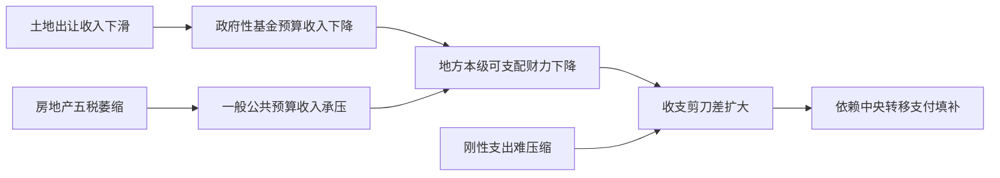
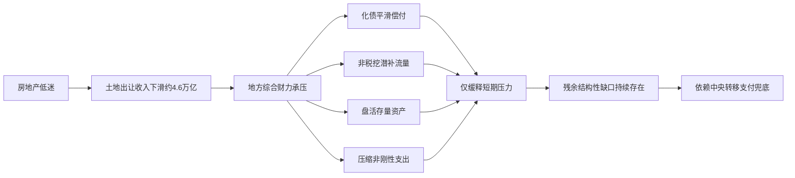

# 房地产市场低迷对中国地方政府财政收入的影响：税收减少、土地财政收缩与传导机制的量化解析

房地产深度调整对中国地方政府综合财力的年度冲击，经三角验证后的中枢估计为**约6万亿元/年（区间5.5–6.5万亿元/年），约占地方综合财力的15–20%**。

这一缺口的主体并非舆论普遍聚焦的房地产相关税收，而是政府性基金账下的土地出让收入。2025年全国国有土地使用权出让收入为41,518亿元，同比下降14.7%，较2021年8.7万亿元的峰值已累计回落约4.6万亿元、降幅达52.3%。尽管市场常言"税收减少拖垮地方财政"，但2025年地方一般公共预算本级收入仍实际同比增长2.4%，契税与土地增值税合计的年度萎缩量仅以千亿元计，真正的断崖出现在"第二本账"。

本报告以四本账框架厘清口径，对土地、税收两条传导链分别量化并展望至2030年。

---

# 1 研究框架与口径界定

回答"房地产低迷在多大程度上影响地方财政"这一核心问题，首先必须区分两套口径：**一般公共预算（税收为主的第一本账）与政府性基金预算（土地出让收入所在的第二本账）**。一种常见误读是把"税收减少"直接等同于"财政收入减少"，本报告据此论证：房地产冲击的主战场恰恰在非税的土地渠道，而非税收渠道。

研究边界锁定三条：**分析对象为地方政府财政收入，时间背景为当前房地产下行周期（2024–2026年），收入渠道同时纳入房地产相关税收与土地出让收入。**

为量化"多大程度"，本报告复用一套五维评估框架：房地产相关收入占地方综合财力比重、土地出让收入净冲击幅度、房地产五税降幅与占地方税比重、财政自给率与缺口扩大幅度、短期冲击对比中长期结构性影响。

---

# 2 地方财政收入结构与四本账框架

## 2.1 四本账定位与地方综合财力

中国政府预算体系区分四本相互衔接的账户，其中与房地产—财政传导链关系最密切的是**一般公共预算**与**政府性基金预算**两本账。

**一般公共预算**是主体账户，由税收与非税收入构成。2025年全国一般公共预算收入216,045亿元，其中税收176,363亿元、非税39,682亿元；地方本级收入122,082亿元，比上年增长2.4%。

**政府性基金预算**是第二本账，实行"以收定支、专款专用"，其最大单一收入项即国有土地使用权出让收入。

后两本账（国有资本经营、社会保险基金）因对房地产周期敏感度低，本报告不作主分析对象。

| 账户 | 定位 | 主要收入 | 房地产敏感度 |
|---|---|---|---|
| 一般公共预算 | 第一本账，主体 | 税收（含房地产五税）+非税 | 中（经税收渠道） |
| 政府性基金预算 | 第二本账，以收定支 | 土地出让收入为主 | 高（直接冲击） |
| 国有资本经营预算 | 第三本账 | 国企利润上缴 | 较低 |
| 社会保险基金预算 | 第四本账 | 社保缴费 | 低 |

**一个对非专业读者关键的区分是：第一本账口径下的"税收减少"与第二本账口径下的"土地出让收入滑坡"属于不同账户，不能混为一谈。房地产对地方财政的冲击主要落在第二本账。** 仅看税收会系统性低估冲击，因为土地出让收入不计入税收，却是第二本账的主体。

## 2.2 土地出让收入的主导地位

在第二本账内部，国有土地使用权出让收入长期占据主导，历史高峰时期长期处于约80%–90%区间。2025年全国土地出让收入41,518亿元，比上年下降14.7%。

这一结构意味着第二本账的波动性远高于第一本账。粤开证券首席经济学家罗志恒指出，房地产市场深度调整直接导致地方土地出让收入持续下滑，减少了地方可用财力，加大偿债压力。

两本账的抗冲击能力分野鲜明：一般公共预算由增值税、企业所得税、个人所得税等多税种分散支撑，单一税种波动不致颠覆全局；第二本账则高度依赖单一收入来源，结构性脆弱。**正是这一"分散对集中"的对照，构成了土地财政依赖度高的地区在本轮下行中受创更深的结构原因。**

## 2.3 地方综合财力口径

**地方综合财力**是本报告衡量房地产冲击相对规模的分母口径，取"一般公共预算＋政府性基金预算"的合并为核心。罗志恒团队据此测算，2024年全国土地出让收入4.87万亿元，相当于GDP比重降至3.6%，占两本账收入之和的17.3%。

**采用合并口径的关键意义在于：它把房地产冲击的分子（相关收入减少）与分母（综合财力）放在同一账户体系内比较，避免把第二本账的减少放到仅含第一本账的分母上而夸大占比。本报告15–20%的占比即建立在这一口径之上。**

一个口径陷阱需警惕：土地出让收入为毛收入口径，其中包含征地拆迁补偿、土地开发等成本性支出，并非全部可自由支配。从财政可用财力角度看，真正重要的是扣除成本后的净收益变化（详见第6章净冲击测算）。

## 2.4 房地产五税：高暴露但小盘子

地方税收真正能完整留用的税种，集中在与不动产直接相关的小税种上。**房地产五税**通常指契税、土地增值税、房产税、城镇土地使用税及耕地占用税，它们在地方专属税种中合计占比约85.5%，构成主体份额。

清华大学不动产金融研究中心研究指出，房地产行业深度调控下，土地出让收入减少对地方财政形成明显压力，"重塑地方财政收入结构"成为转型方向。

按本报告测算口径，2024年房地产五税规模约1.72万亿元，对应当年地方一般公共预算本级收入119,266亿元。把这一规模与同年土地出让收入约4.87万亿元对照，差距悬殊：**基金渠道约为税收渠道的2.8倍。这一量级差，是"税收减少不能涵盖土地财政冲击全部"这一核心命题的算术基础。**

一个值得关注的历史先例：早在2016年，上海、北京、海南、黑龙江等地的房产税收入已超过当地土地出让收入。这提示，随着土地出让收入趋势性下行，持有环节税种的相对重要性有可能上升。

## 2.5 非税收入与转移支付的缓冲边界

非税收入与中央转移支付在传导链中分别扮演"被动承压"与"主动对冲"两种角色。

**非税收入并非独立于房地产周期的"安全垫"。** 据Caixin Global报道，2024年4月非税收入增速放缓至5.8%、较3月回落6.4个百分点，反映土地出让收入走弱。其与税收呈"跷跷板"：2024年税收下降3.4%而非税增长25.4%，2025年反转为税收微增0.8%、非税下降11.3%。这种"先大增、后回落"轨迹，提示非税收入在承压期常被用作临时补充，难以持续。

罚没等非税手段则受税基承受力硬约束。据观察，激进的税收稽查有"杀鸡取卵"之虞，可能逼使企业关停，最终反而减少政府收入。

**中央转移支付是系统层面的主动对冲机制。** 据测算，2023年中央转移支付与地方政府债券合计提供15.94万亿元财力，覆盖了14.68万亿元广义财政赤字。这意味着"地方本级收入减少"与"地方可用财力减少"并非等号。但转移支付能力本身受中央财力约束——2025年中央一般公共预算收入下降6.5%，缓冲空间并非无限。

地方对土地与转移支付的双重依赖，根源可追溯至1994年分税制改革：该改革将增值税等主体税种大部分上收中央，而地方支出责任并未相应减少，从而逐步把土地出让收入培育为财力的重要补充，形成路径依赖。

## 2.6 双渠道框架：为何"税收减少"不能涵盖全部

房地产对地方财政的贡献，沿"税收渠道"（第一本账房地产五税）与"基金渠道"（第二本账土地出让收入）两条路径同时展开。

| 渠道 | 对应账户 | 2024年规模 | 降幅 |
|---|---|---|---|
| 税收渠道 | 第一本账（房地产五税） | 约1.72万亿元 | 随房地产景气承压 |
| 基金渠道 | 第二本账（土地出让收入） | 约4.87万亿元 | 2024年-16%；2025年-14.7% |

**基金渠道规模约为税收渠道的近三倍，且降幅更陡，这两点共同决定了房地产对地方财政的主冲击落在基金渠道。**

除房地产五税这类"直接相关"税种外，房地产还通过上下游产业形成"间接相关"贡献。据产业链信用风险研究，房地产低迷沿"开工下降—建材需求萎缩—中间品增值税下降—企业所得税收缩"链条向上游传导。IMF测算，中国房地产投资每下降1%，约拉低GDP 0.1%，GDP收缩又反映为增值税、企业所得税地方分成下降。**间接渠道虽不计入房地产五税，却经由产业链多环节侵蚀地方共享税分成，是"税收减少"被低估的隐性部分。** 因难以精确剥离，本报告头部测算不纳入间接渠道，这意味着真实总冲击可能略大于头部数字。

**核心结论：把视野局限于"税收减少"会系统性低估真实冲击，因为土地财政的主体——土地出让收入——根本不计入税收。** 与2021年峰值相比，2025年地方土地出让收入已减少约4.6万亿元、降幅52.3%，仅这一项就占了头部测算减少规模的绝大部分。"税收减少"至多只能解释房地产冲击地方财政的较小部分，主体冲击来自不计入税收的土地出让收入。

---

# 3 房地产市场低迷的现状及其财政关联

房地产市场的低迷不是抽象概念，而是由销售、价格、土地、投资四组可量化变量共同刻画的系统性收缩，这四组变量恰好对应地方财政收入的不同税基入口。据国家统计局，2026年1—4月，全国房地产开发投资同比下降13.7%，新房销售额下降14.6%，住宅销售额下降15.7%，三项指标同步两位数下行，意味着市场尚未脱离深度调整区间。

**房地产低迷之所以对地方财政构成系统性冲击，关键在于它同时打击了交易、开发两个环节，从而在第一本账与第二本账上形成"双账承压"。**

## 3.1 四组市场变量的下行

- **商品房销售与房价**：销售是财政链条的最前端，一笔成交同时触发契税、增值税等多个税基。当前特征是绝对量持续低于2021年峰值、二手房与新房分化。

- **土地市场成交**：土地市场是连接销售与第二本账的枢纽。开发企业拿地意愿由销售预期决定，土地成交又直接决定土地出让收入规模。需特别辨析城投平台托底拿地对"真实"土地收入的扭曲。

- **房企投资、新开工与资金链**：房企资金链紧张沿"投资收缩—开工下降—税基萎缩"链条向财政传导，并冲击土地增值税清算、企业所得税及建安环节税费。

## 3.2 从市场变量到财政税基的映射

房地产的财政税基可按"交易—开发—持有"三环节结构化映射：

| 环节 | 主要税种 | 税基驱动变量 | 所属账本 | 当前承压证据 |
|---|---|---|---|---|
| 交易 | 契税、交易增值税 | 成交价格×成交量 | 第一本账 | 新房销售额-14.6% |
| 开发 | 增值税、土地增值税、企业所得税 | 销售进度、项目利润 | 第一本账 | 土地增值税-15.6% |
| 持有 | 房产税（理论环节） | 房产价值/租金（存量驱动） | 第一本账 | 制度尚未全面展开 |
| 土地出让 | 国有土地出让收入 | 土地成交量价 | 第二本账 | 2025年-14.7% |

**交易环节**对应契税，税基为成交价格，销售面积下降直接减少应税交易量。**开发环节**对应土地增值税等，税基为项目利润，房企利润下滑与降价促销使其2026年1—4月同比下降15.6%。**持有环节**理论对应房产税，由存量驱动；但现有证据未提供其规模细节，本报告不作定量判断，其对冲能力取决于房产税制度后续演进（详见第11章）。

**本章核心判断：房地产低迷之所以构成系统性冲击，根本在于销售、价格、土地、投资四组变量分别映射到交易税、开发所得税与土地出让金等不同税基入口，从而在两本账上形成同步叠加的"双账承压"。单看任一指标都会低估冲击总规模——真正的量级来自多通道叠加。**

---

# 4 土地出让收入的断崖式下滑

土地出让收入是政府性基金预算的主体科目，也是过去二十年"土地财政"模式的核心载体。国有土地使用权出让收入自2022年起连续四年出现两位数降幅，构成改革开放以来最陡峭的一轮收缩。**核心判断是：土地出让收入的毛收入降幅虽剧烈，但其对可用财力的净冲击需经成本性支出调整后方能准确衡量。**

## 4.1 从峰值到谷底的逐年轨迹

2021年是历史高点，约8.7万亿元。此后呈现明确的台阶式下滑：

| 年份 | 土地出让收入 | 同比降幅 | 较2021峰值累计减少 |
|---|---|---|---|
| 2021 | 约87,000亿元（峰值） | — | — |
| 2023 | — | -13.2% | — |
| 2024 | 48,699亿元 | -16% | 约3.8万亿 |
| 2025 | 41,518亿元 | -14.7% | 约4.6万亿（-52.3%） |
| 2026预测（袁海霞） | 约38,000亿元 | 约-8.5% | — |
| 2026Q1实际 | 5,176亿元 | -24.4% | — |

**从因果链看，商品房销售持续低迷导致房企现金流承压，抑制拿地意愿，使土地成交规模与溢价率同步回落，最终传导至土地出让收入逐年缩水。** 克而瑞2026年3月土拍监测显示，仅核心城市优质地块维持热度，多数城市成交理性平淡。

**52.3%降幅的口径界定**：累计降幅系毛收入口径的名义降幅，而非净收益口径。2024年累计缺口约3.8万亿元、2025年扩大到约4.6万亿元，两个口径在时间序列上自洽，表明这是稳健的毛收入测算而非单点异常。

**2026年一季度数据进一步恶化**：谢逸枫援引数据指出，2026年一季度全国卖地收入仅5,176亿元，同比下降24.4%，跌破6,000亿元，创2021年同期以来最低，跌幅较2025年同期15.9%扩大了8.5个百分点。

**2026年走势存在分歧**：袁海霞通过预测模型给出约3.8万亿元的判断（隐含约8.5%下滑，相对乐观的"缓降企稳"）；野村则预计继续回落。**两派实质分歧不在方向——双方均认同2026年仍将下滑——而在于是否已接近底部。** 结合一季度跌幅反而扩大至24.4%，开年实际数据更偏向野村的谨慎判断。

## 4.2 毛收入与净收益的口径辨析

土地出让金口径辨析是评估净财力冲击的前提，也是"冲击有限"与"断崖崩塌"两派观点的分水岭。

**毛收入中约八成需用于征地拆迁补偿、土地开发整理等成本性支出。** 申学峰研究指出，土地出让收入支出结构中成本性支出占据主导，真正留存地方可支配的净收益比例有限。这一收支联动机制意味着：毛收入下滑会同步带动成本性支出下降，因而净收益降幅在理论上小于毛收入降幅——这正是"冲击有限"论的制度基础。

**八成成本率是关键但存在区间的参数。** 若取80%成本率，净收益率仅20%；取更保守的70%，净收益率升至30%。在20%–30%敏感性区间内，4.6万亿元的毛收入缺口对应净财力缺口约0.92–1.38万亿元。需正视的方法论张力是：八成成本率是全国平均的粗略假设，各地因征地难度、地价差异巨大。本报告通过区间测算而非单点估计消化这一不确定性。

| 维度 | 收支联动派（"净冲击小于数字"） | 断崖崩塌派（"断崖式崩塌"） |
|---|---|---|
| 代表观点 | 财政部基调、罗志恒、张启迪 | 谢逸枫 |
| 衡量口径 | 净财力损失（会计口径） | 毛现金流枯竭（流动性口径） |
| 对4.6万亿缺口的解读 | 扣除约八成成本后净影响约0.92-1.38万亿 | 毛收入暴跌冲击偿债链条，难以折扣 |
| 政策含义 | 财政有韧性，缺口可对冲 | 债务链脆弱，风险外溢 |

**两派分歧看似对立，实则可在口径层面调和：收支联动派关注"净财力损失"这一会计口径，崩塌论关注"毛现金流枯竭对债务链的冲击"这一流动性口径——两者各自在其口径内都成立。** 崩塌论的实质反驳在于：即便净收益降幅小于毛收入，地方用于偿债、基建配套的可支配资金是实打实地蒸发了。**更稳健的判断是：断崖式下滑的毛收入事实不容否认，但对可用财力的净冲击需打七到八成折扣——真相位于两派之间。**

## 4.3 政府性基金整体收缩与基建约束

**整本账降幅小于土地单项。** 2025年地方政府性基金预算本级收入同比下降8.2%，显著小于土地出让收入单项14.7%的降幅。差异源于结构稀释——基金账除土地外还包含其他科目，这些非土地科目的相对稳定，使加权后整本账降幅收窄至8.2%。这提示：用土地单项降幅直接外推整体基金财力冲击会高估实际影响。

**基金账是基建投资的重要资金来源。** 申学峰指出，2021年土地出让收入占地方财政支出的比例达26.42%，卖地收入下滑对支出端的约束是系统性的。其传导链为：土地收入下滑→基金账可用财力收缩→压缩城市建设支出→基建项目面临资金缺口。

**"缩量提质"供地策略加剧分化。** 自然资源部3月"38号文件"明确新增建设用地原则上不用于经营性房地产开发，意味着全年土地出让规模进一步走低。这构成政策张力：地方既需卖地支撑基金账与偿债，又面临去库存约束主动放缓供地。化解路径是结构替代——转向核心城市优质地块的高溢价成交（如广州天河马场地块236亿元、溢价率26.6%）。但这一替代仅在少数核心城市有效，从而放大区域分化。

**专项债是有约束的补位工具。** 专项债属显性债务，需由对应项目收益偿还，而非无限制的缺口填补。其补位累积了地方显性债务余额，对缺乏收益支撑的项目则构成新的偿付压力，无法完全替代土地出让收入的无偿性财力属性。

**三层对比清晰勾勒梯度**：一般公共预算本级正增长2.4%、整本账基金降8.2%、土地单项降14.7%——显示第二本账承压明显大于第一本账，但因专项债等科目支撑，其收缩又温和于土地单项。

## 4.4 净财力冲击测算

净影响测算核心公式：**净财力缺口 = 毛收入缺口 × （1 − 成本率）**。

以4.6万亿元毛收入缺口为基础：
- 取80%成本率（20%净收益率）：净缺口 ≈ 4.6万亿 × 20% = 0.92万亿元
- 取70%成本率（30%净收益率）：净缺口 ≈ 4.6万亿 × 30% = 1.38万亿元

**因此，2025年较2021峰值的净财力缺口约为0.92–1.38万亿元，中枢约1.1万亿元。** 这一区间显著小于4.6万亿元的毛收入缺口，验证了收支联动派"净冲击小于数字"的判断，同时也确认了崩塌派关注的毛口径冲击确实巨大。

正视不确定性而非掩盖它是审慎测算的要求：本报告给出区间而非单一精确值，正是为诚实反映成本率假设的敏感性。这一净冲击区间将在第6章纳入三角验证框架。

---

# 5 房地产相关税收的萎缩及其占比

房地产相关税收属一般公共预算口径，是"四本账"中第一本账受房地产下行冲击的核心渠道。其冲击机制不同于土地出让收入的直接断崖，而是沿"交易—开发—持有"三条不同滞后性的链条分别传导：**交易环节税种（以契税为代表）反应最即期，开发环节税种（以土地增值税为代表）因清算机制而显著滞后，持有环节税种（房产税）因税基狭窄而缺乏对冲能力。**

## 5.1 契税与交易环节税收

契税是对土地、房屋权属转移征收的税费，纳税人为承受权属的单位和个人。**契税计税依据直接等于不含增值税的房屋成交价格**，意味着契税税基与商品房销售金额近乎一比一挂钩。其传导链清晰：商品房销售面积与价格下降→应税权属转移交易量萎缩→契税计税依据收缩→契税收入随销售额同向下行。

契税纳税义务锚定当期交易行为而非存量资产，**因此对交易活跃度下降的反应相对即期，不存在开发环节那种跨年度清算滞后**，这与下文土地增值税形成鲜明对照。

值得注意的是，当房地产交易低迷压制契税这类高弹性税种时，个人所得税、国内增值税等非房地产税种的增长构成结构性支撑——2025年个人所得税增长11.5%、国内增值税增长3.4%。正是这一对冲，使得2025年地方一般公共预算本级收入仍录得2.4%正增长，尽管房地产相关税种承压。

## 5.2 土地增值税与开发环节税收

土地增值税与房地产开发利润挂钩。2026年1—4月土地增值税1,522亿元，同比下降15.6%，主因房企利润下滑和降价促销导致盈利能力下降。

其下行链条为：房地产市场低迷压低售价→开发项目增值额收窄→土地增值税应税基础下降。**降价促销恰恰是压低土地增值税的直接原因**——房企为回笼现金流而主动让利，反过来侵蚀项目增值额。这里存在一个张力：降价促销本是房企应对流动性压力的理性选择，其结果却削减了地方税收；最终由市场出清的优先级主导——房企保生存的需求压倒了税基维持。

**城镇土地使用税、耕地占用税面临结构性收缩**。在"缩量提质"导向下，土地成交面积大幅收缩而核心城市地价维持高位（如广州天河马场地块236亿元、26.6%溢价率），这意味着以面积为税基的土地占用类税种，下行压力可能大于以金额计的土地出让收入。"38号文件"明确新增建设用地原则上不用于经营性开发，更对耕地占用税税基增量形成结构性压制。

**开发环节税收的滞后性**根源于扣除机制。土地增值税与增值税的土地价款扣除按"当期销售建筑面积÷可供销售建筑面积"计算，销售放缓影响的是当期销售面积这一分子，去化越慢、可扣除土地价款越少。**契税在权属转移当期即反映市场冷暖，而土地增值税的清算跟随项目跨年度开发进度，因此当土地成交某年塌缩时，开发环节税收的下行往往要跟随项目周期逐步释放。** 由于2022年以来土地成交持续收缩，对应开发项目减少将在未来年度清算中逐步显现，**这使开发环节税收的修复大概率晚于交易环节的契税**。

## 5.3 房产税与持有环节的对冲缺位

房产税是持有环节代表性税种，但现行制度下规模有限、对交易周期敏感度低，**难以对交易环节税收下降形成有效对冲**。

地方税收对房地产呈现明显的结构非对称：交易环节的契税与开发环节的土地增值税对周期高度敏感且规模较大，而持有环节税收规模相对有限。**当房地产下行压制高弹性的交易、开发环节税种时，持有环节缺乏足够体量的稳定税源来填补缺口。** 上海、重庆房产税试点虽是重要探索，但其绝对规模难以与交易、开发环节税种相比，不在同一量级，无法成为有效对冲工具。

这一对冲缺位本质上是制度结构与财政需求之间的张力：要使持有环节形成有意义的规模，必须突破现行窄税基边界，而这一突破无法短期内完成。**在持有环节税基扩围取得实质进展之前，地方对房地产税收下行压力的消化，更多需依赖非房地产税种增长与转移支付等外部缓冲。**

## 5.4 房地产五税合计降幅与占比

房地产五税合计约1.72万亿元、占地方税约85.5%（2024年）。**其约85.5%的高比重意味着地方税体系对房地产的暴露高度集中，使地方一般公共预算收入对房地产景气波动高度敏感。**

| 税种 | 环节 | 计税依据 | 敏感度 | 滞后特性 | 已披露降幅 |
|---|---|---|---|---|---|
| 契税 | 交易 | 房屋成交价格 | 高 | 即期 | 随成交额同向收缩 |
| 土地增值税 | 开发 | 项目增值额 | 高 | 滞后（清算） | 2026年1-4月-15.6% |
| 城镇土地使用税 | 开发/持有 | 占用土地面积 | 中 | 较稳定 | 跟随土地成交收缩 |
| 耕地占用税 | 开发 | 占用耕地面积 | 中 | 结构性收缩 | 受38号文件压制 |
| 房产税 | 持有 | 经营性房产 | 低 | 稳定 | 规模有限、难对冲 |

房地产相关财政收入（房地产五税＋土地出让收入）较2021峰值的年度减少规模约6万亿元/年、约占地方综合财力15–20%，**其中土地出让收入减少约4.6万亿元构成主体，房地产五税的减少构成一般公共预算侧的直接拖累**。这一拖累在2025年表现为：地方本级收入2.4%的正增长，是在房地产五税下行拖累下，由非房地产税种增长所支撑实现的。

**本章核心判断：地方一般公共预算收入对房地产的暴露不仅集中度极高（房地产五税占地方税约85.5%），而且因高弹性交易/开发环节税种主导、低弹性持有环节税种规模有限，在房地产下行期缺乏内生对冲机制。** 契税的即期下行、土地增值税的滞后释放、持有税的对冲缺位三者叠加，使房地产五税整体处于难以由地方税内部消化的下行通道。

---

# 6 影响幅度的三角验证与中枢估计

本章运用三角验证方法，将土地、税收两条独立的收入下降路径收敛到一个可核验的中枢：**房地产低迷导致的地方政府房地产相关财政收入较2021峰值的年度减少规模约6万亿元/年（区间5.5-6.5万亿元/年），约占地方综合财力的15-20%**。这一中枢通过自下而上分项加总法与自上而下占比反推法两条相互独立的路径交叉验证得出。

三层口径需预先界定：土地出让收入采用政府性基金毛收入口径；房地产相关税收采用一般公共预算口径；地方综合财力指两本账、转移支付与债务收入的合并口径。

## 6.1 自下而上分项加总法

分项加总法将房地产相关收入逐项拆解，分别测算相对2021峰值的降幅再汇总。其优势是每项均可追溯至财政部决算、口径透明；局限是未纳入上下游税收会形成系统性低估，由此构成中枢区间的下沿。

| 分项 | 数值 | 年份 | 口径 |
|---|---|---|---|
| 土地出让收入峰值 | 8.7万亿元 | 2021 | 地方·基金·决算 |
| 土地出让收入 | 41,518亿元 | 2025 | 地方·基金·决算 |
| 土地出让收入降幅 | 约4.6万亿（-52.3%） | 2021→2025 | 地方·基金·决算 |
| 土地出让收入 | 4.87万亿元 | 2024 | 全国·基金·决算 |
| 一季度卖地收入 | 5,176亿元（-24.4%） | 2026Q1 | 全国·基金 |

**自下而上分项加总法在狭义口径下得出约5.5万亿元/年**：土地出让收入降幅约4.6万亿元构成主体，叠加房地产五税合计降幅，两者并表后逼近5.5万亿元。

这一狭义结果定位为中枢区间的下沿而非中枢本身，根源在于系统性遗漏：它只计入直接挂钩房地产的收入项，而房地产低迷会通过产业链向上下游传导，导致建材、钢铁、家居等行业增值税与企业所得税同步下滑。**这部分"广义口径"税收损失未被纳入狭义加总，因此5.5万亿元是一个有意保守的下沿。**

## 6.2 自上而下占比反推法

占比反推法从房地产相关收入占地方综合财力的整体比重入手，以比重乘财力总量反推冲击规模。其优势在于天然纳入了上下游间接税收（只要这些税收体现在综合财力的整体波动中），因而反推规模在结构上略高于纯分项加总，**对应区间上沿约6.5万亿元/年**。

**分项法与占比法不是相互替代，而是上下界互补**：分项法从可核验的直接收入项给出下沿，占比法从综合财力比重纳入间接税收给出上沿，二者共同框定中枢区间。

## 6.3 两法收敛与中枢估计

本报告为敏感性检验自设±20%作为两法收敛的可接受区间（系本报告自行设定，非外部权威标准）。

| 测算路径 | 口径 | 年度减少规模 | 相对中枢偏离 | 落入±20% |
|---|---|---|---|---|
| 自下而上分项加总法 | 狭义 | 约5.5万亿元/年 | -8.3% | 是 |
| 自上而下占比反推法 | 广义 | 约6.5万亿元/年 | +8.3% | 是 |
| 中枢估计 | 综合 | 约6万亿元/年 | 0% | 基准 |

**两法的狭义与广义结果分别锚定下沿5.5万亿元与上沿6.5万亿元，相对6万亿元中枢的偏离均为±8.3%，远落在±20%可接受区间内，据此判定为两法收敛。** 需诚实指出，这一收敛建立于若干中间参数的量级估计之上，中枢6万亿元宜理解为有依据的量级估计，而非精确到小数点的决算数。

**两组关键口径差异需系统披露**：

第一组是毛收入与净收益差异。一个值得关注的结构性问题是成本性支出的刚性——当毛收入骤降时，征地拆迁等成本难以同步压缩。这种刚性意味着，**净收益的实际降幅比例往往不低于毛收入降幅，土地出让收入对可用财力的实际冲击可能比毛收入降幅更深**。

第二组是狭义与广义差异：狭义口径仅含土地出让收入与房地产五税（下沿5.5万亿元），广义口径额外纳入上下游产业链税收（上沿6.5万亿元）。这并非测算误差，而是口径选择的必然结果。

## 6.4 本章综合

**房地产低迷对地方财政的冲击并非单一收入项的波动，而是一场以政府性基金预算（土地出让金腰斩约4.6万亿元）为主体，以一般公共预算（房地产五税中等萎缩）为次，并通过产业链向上下游税收扩散的系统性收缩，其年度减少规模收敛于约6万亿元/年，约占地方综合财力的15–20%。**

| 指标维度 | 分母 | 冲击量级 |
|---|---|---|
| 占政府性基金收入比例 | 政府性基金预算 | 主体性·腰斩级（-52.3%） |
| 占一般公共预算收入比例 | 一般公共预算 | 中等量级（个位数百分点） |
| 占地方综合财力比例 | 地方综合财力 | 约15-20% |
| 财政自给率恶化 | 一般公共预算支出 | 达标省份从13→1→0 |

本章尚不能单独定论的开放问题是：6万亿元中枢中归属上下游间接税收的部分（广义减狭义约1万亿元的上修），缺乏分税种决算精确支撑，仅是基于产业链弹性的量级外推。

---

# 7 传导机制：从收入下降到债务与公共服务压力

**约6万亿元/年的房地产相关财政收入减少并非一次性的会计事件，而是经由抵押品、现金流、刚性支出与产业链四条机制放大，并向债务与公共服务领域扩散的结构性冲击。**

## 7.1 收入端→支出端的硬约束

土地出让收入下滑率先在收入侧撕开缺口，而支出端的调整弹性远不及收入端。**核心机制是：政府性基金预算收入萎缩直接压缩相关支出，一般公共预算中的民生与人员支出难以同步压减，二者叠加导致收支剪刀差被动扩大。**

剪刀差的规模触目惊心：2026年一季度，全国31个省份中无任何一个财政自给率达到100%，地方本级收入仅能覆盖约50%的支出，剩余部分需依赖中央转移支付。

**地方本级收入仅覆盖约50%的支出、剩余依赖中央转移支付，这一结构表明收支剪刀差已不再是边际性紧张，而是结构性的外部输血依赖。**

## 7.2 土地财政→城投债务的反馈链

土地财政与地方债务存在双向关联：土地相关收入既为偿债提供现金流，土地资产又构成融资增信基础。土地市场一旦低迷，两条渠道便同时收紧。

**债务规模口径争议放大了风险评估的不确定性。** 据报道，IMF与BIS估计2024年中国政府债务已达约100万亿元，这一广义估计与纳入预算管理的法定债务口径之间存在显著差距。核心张力在于：风险真实量级取决于是否将城投平台等承担的隐性债务纳入统计。**当广义口径远高于狭义口径时，差额部分所代表的隐性债务正是房地产低迷冲击下最脆弱的环节，因为这部分债务的偿付保障与土地相关现金流和土地资产价值高度绑定，而后两者恰恰是房地产低迷直接打击的对象。**

## 7.3 对公共服务与基建投资的挤出

**核心机制：当可支配财力收缩而刚性支出难以压减时，相对可调节的基建投资首当其冲被压缩，基本公共服务陷入"既要维持又缺资金"的两难，区县级"保基本运转"的压力在基层最为集中。**

## 7.4 间接税源的连锁收缩

房地产与建筑业下行通过产业链间接税源传导，引发增值税、企业所得税、个人所得税的连锁收缩。

**建筑、建材产业链税收下降**：住房开工收缩减少钢铁、水泥、玻璃需求，压低中间品产出及增值税；产出下降削减利润，压缩企业所得税，税收损失沿供应链向上传导。这与IMF判断相互印证：房地产投资每下降1%拖累GDP 0.1%。

**房企利润下滑拖累企业所得税**：由于企业所得税以利润为税基，房地产及关联行业利润下滑比收入下降更敏感地反映在所得税萎缩上，**这使该渠道成为高弹性路径**。与土地出让收入当期即体现不同，企业所得税萎缩随利润实现与征缴节奏逐步显现，意味着拖累将在土地财政已下台阶之后仍持续释放。

**居民收入与消费疲弱的二阶影响**：经济活动收缩抑制就业与居民收入，波及个人所得税税基与消费相关税收。需审慎指出，本节证据足以支持该渠道存在与方向的判断，但不足以独立量化其精确量级；**居民部门渠道更多体现为对整体冲击的放大，而非可单独叠加的独立税源损失。** 因此本节所述间接税源收缩应主要理解为对6万亿元中枢估计的放大因素，而非可简单叠加的独立项目，以避免重复计算。

## 7.5 本章综合

| 传导链 | 源头 | 关键中间机制 | 终点压力 |
|---|---|---|---|
| 收入端→支出端硬约束 | 土地出让收入降、占两本账17.3% | 收入下台阶+刚性支出黏性→剪刀差扩大 | 地方本级仅覆盖约50%支出 |
| 土地财政→城投债务反馈 | 非税增速放缓6.4个百分点 | 现金流收缩+土地增信弱化 | 约100万亿广义债务下风险敞口放大 |
| 公共服务与基建挤出 | 政府性基金财力萎缩 | 可调节支出先压缩 | 基建放缓、区县"保基本运转"承压 |
| 间接税源连锁收缩 | 房地产投资每降1%拖累GDP 0.1% | 产业链税收收缩+居民消费二阶冲击 | 一般公共预算多税种连锁萎缩 |

**这条闭合的因果链表明：约6万亿元/年、约占地方综合财力15–20%的房地产相关财政收入减少，绝非孤立的收入事件，而是经由剪刀差、债务反馈、支出挤出与产业链连锁四条机制被系统放大，并向债务可持续性与基本民生保障扩散的结构性冲击。**

---

# 8 地方财政自给率恶化与收支矛盾

财政自给率是房地产低迷向地方财政传导的最具综合性的压力读数——它是土地出让收入断崖与房地产五税萎缩两条裂缝在收支层面汇合后的总水位线。**核心判断：截至2026年一季度，全国没有任何一个省级行政区的财政自给率达到100%，地方本级收入仅能覆盖约一半支出。**

## 8.1 财政自给率的全国性下行

财政自给率从一个区域分化指标演变为全国普遍承压，只用了不到五年。

**顶部样本归零**：2021年尚有约13个城市自给率达100%以上，到2024年上半年全国仅剩上海一地超过100%，到2026年一季度全国无一省份达100%。即便是上海，一季度支出同比暴增20.3%，自给率已降至90%以下。**顶部样本的沦陷说明压力已穿透最富裕的财政梯队，恶化是系统性而非局部的。**

**口径辨析**：财政自给率 = 地方一般公共预算本级收入 / 同口径支出。分子剔除了中央转移支付和债务收入，**专门排除了第二本账的土地出让收入**，因此它不直接体现土地财政萎缩，而是体现第一本账层面的收支失衡。土地收入下滑是通过"第二本账对第一本账的补位能力下降"来间接影响自给率的。德邦证券测算，2022年土地出让收入减少约2万亿元，相当于当年一般公共预算收入的3.7%。

**相关性带滞后**：自给率并非随房地产单调恶化。界面新闻援引测算显示，2023年全国平均财政自给率为44.7%，较2022年的43.3%反而回升，26个省份较上年改善。这构成对"自给率必然随房地产单调恶化"简单叙事的有力反例——**自给率是收入端与支出端共同作用的结果**：在非房税源仍有正增长、支出受约束时，自给率可逆着土地收入暂时回升。真正的恶化发生在2024—2026年，当支出刚性增长遭遇收入端多源承压时。

## 8.2 收入恢复叙事与实质承压的背离

围绕地方财政是否"已经企稳回升"，存在两种立场鲜明对立的解读。

**"广泛复苏"叙事**：2025年地方一般公共预算本级收入122,082亿元，比上年增长2.4%。在全国收入下降1.7%、中央本级收入下降6.5%的背景下，地方逆势增长易被解读为"广泛复苏"。地方本级收入三年连增（7.8%→1.7%→2.4%），似乎与"财政承压"叙事矛盾。

**实质是国有资产货币化填洞**：然而，"正增长"无法告诉我们增长来自何处。Caixin Global明确指出，各省正依靠国有资产货币化填补土地出让等传统收入崩塌后的缺口。非税收入的剧烈波动佐证了恢复质量问题：2024年非税收入大增25.4%，2025年又下降11.3%。**这种"先激增、后回落"的波动，正是"一次性填洞"资源难以平滑持续的典型特征——资产变现可以集中释放，却无法年复一年复制同等规模。**

**裁断**：就短期冲击对比中长期结构性影响这一判断轴而言，"广泛复苏"叙事只在短期现金流层面成立，在收入结构层面不成立。**地方第一本账的名义增长掩盖了常规税基被土地与房地产相关收入掏空的结构性事实，因而这一恢复的质量不合格，不能据此判定财政压力已缓解。**

## 8.3 对转移支付依赖度上升

当本级收入只能覆盖约一半支出，另一半就必然落到中央转移支付身上。

**转移支付已从"补充性财源"升格为"结构性支柱"**：2026年一季度剩余约一半支出需靠中央转移支付承接。但其对冲能力存在明确边界：2023年中央转移支付与地方债券合计提供15.94万亿元财力、覆盖14.68万亿元广义财政赤字。核心矛盾在于，**转移支付本身很大程度上由债务收入支撑，它缓解了地方当期收支矛盾，却把压力转移到了更高层级的债务可持续性上**。这一能力又受中央财力约束——2025年中央本级收入下降6.5%，缓冲空间收窄。

**区域间分配高度不均**：

| 地区 | 2026Q1自给率 | 缺口性质 | 房地产低迷的边际冲击 |
|---|---|---|---|
| 广东 | 约73%-76% | 大省绝对规模缺口 | 关键（土地收入骤降致转入缺口） |
| 北京 | 约79% | 核心城市支出刚性缺口 | 较大 |
| 上海 | 约90%以下 | 顶部样本转入缺口 | 显著（支出暴增20.3%） |
| 西藏 | 约8% | 高度依附型结构性缺口 | 有限（本就靠转移支付） |

从广东的七成多到西藏的不足一成，近十倍的落差揭示了分配逻辑的两端。**西藏约8%自给率意味着其逾九成支出依赖中央，房地产低迷对其边际影响有限；广东则是"原本能自给、现因土地收入骤降而转入缺口"，房地产低迷对其是边际上的关键冲击。** 展望未来，随着经济大省普遍转入缺口、而中央本级收入也在下降，转移支付体系的再分配压力将系统性上升。

## 8.4 短期收入缺口的量化

衡量房地产低迷对地方财力的年度侵蚀，最稳健的锚是土地出让收入较峰值的回落：2025年较2021年8.7万亿元峰值减少约4.6万亿元、降幅52.3%。这约4.6万亿元是本报告所有缺口测算中证据最扎实的一项。叠加房地产五税萎缩，构成核心口径的合并冲击。

---

# 9 地方政府的应对与财政缓冲机制

地方政府动用了一整套财政缓冲工具：化债置换、非税挖潜、盘活存量资产与支出压缩。**核心判断是：它们能显著缓释短期偿付与运转压力，却难以填补收入端的结构性缺口。**

## 9.1 化债与债务置换

债务置换是最直接的缓冲工具，本质是用期限更长、利率更低的显性债务，置换到期的隐性债务与高息存量债务。2024年前四个月，当局已宣布发行4.4万亿元专项债与1.3万亿元超长期特别国债。

**化债的真正价值在于争取时间而非消除债务**：它把集中到期的偿付压力在时间轴上重新分布。但存在内在张力——用新债置换旧债虽降低利率，却抬高了债务余额本身。网易数据显示，专项债项目收益落实率不足四成，2023年专项债付息达7,000多亿元、项目收入仅2,000多亿元，付息缺口由约5,000亿元的规模持续累积。

**化债的根本边界在于它作用于债务账户而非收入账户。** 土地出让收入下滑是收入端的流量萎缩，而化债处理的是历史积累的存量债务。**化债能延缓债务风险暴露，却不增加一分钱可支配的经常性财力。** 即便化债把所有到期债务都平滑到未来，收入端的窟窿不会因债务展期而缩小。

## 9.2 非税收入与查税罚没

**非税收入的逆势高增本质是被动替代**：2024年全国非税收入44,730亿元、增长25.4%，与同期税收下降3.4%形成鲜明对照。但2025年回落至39,682亿元、下降11.3%，表明这种高增缺乏可持续性。

**查税补税是争议最大的手段。** 核心悖论在于：加强征管本意是增加收入，但过度查税可能适得其反——"企业关停，他们更拿不到钱了，这是杀鸡取卵"。约束查税力度上限的，正是企业经营的可承受边界；一旦清缴力度超过现金流承受能力，税源本身被摧毁，增收就转为减收。

**非税收入"先激增、后回落"的剧烈波动，恰恰暴露其作为缓冲工具的脆弱性**：它能在某一年顶上税收缺口，却无法形成稳定的多年财力支撑，且罚没与查税过度会反噬税基。

## 9.3 盘活存量资产与国有资本

盘活存量资产是从地方政府自身资产负债表左侧挖掘资源，但受存量规模与变现能力双重约束。**所有基于存量的缓冲工具，都无法突破"一次性变现对冲持续性缺口"这一根本悖论**——今年盘活的资产明年无法再盘活，而收入缺口明年依然存在。

资产盘活还面临顺周期困境：在房地产低迷、资产价格承压的环境下，国有资产变现价格往往不理想。**地方最需要盘活资产的时候，恰恰是资产最难卖出好价钱的时候**，因为财政承压与资产贬值同源于房地产下行这一共同冲击。

国有资本经营预算调入一般公共预算虽是无债务成本的内部腾挪，但量级相对有限，难以对冲土地财政萎缩的缺口。

## 9.4 支出端压缩与保基本

当收入端缓冲工具逐一逼近边界，调整必然转向支出端，但支出压缩受支出刚性严格约束。

**"三公"压减杯水车薪**：与土地出让收入减少约4.6万亿元的缺口相比，压缩"三公"经费所能节省的规模几乎可忽略不计。项目支出收缩则受限于债务承诺——已上马的项目不仅无法压缩省钱，反而需要持续投入以避免烂尾、维持付息。

**"三保"优先序锁死调整空间**：保基本民生、保工资、保运转三类支出必须优先保障，构成不可逾越的刚性底线。**支出压缩的真实空间，仅限于"三保"之外的那部分。** 当可压缩的非刚性支出被压减殆尽后，地方就会触及"三保"底线，此时支出端缓冲能力便告枯竭。

支出刚性带来的核心困境是：收入端大幅萎缩、支出端却难以同步压缩，二者之间的缺口只能靠债务与转移支付填补——**这正是地方财政从"紧平衡"滑向"硬缺口"的结构性根源。**

## 9.5 四类缓冲机制的综合评估

| 缓冲工具 | 作用账户 | 典型量级 | 可持续性 | 核心边界 |
|---|---|---|---|---|
| 化债与债务置换 | 债务账户（存量） | 万亿元级 | 受限于项目自偿性（落实率<40%） | 不增加经常性财力，仅平滑偿付 |
| 非税挖潜 | 一般公共预算（收入侧） | 千亿—万亿级 | 波动剧烈 | 反噬税基、规范性下降 |
| 盘活存量资产 | 资产端（存量） | 难达土地出让量级 | 一次性、不可再生 | 顺周期困境，低价变现 |
| 支出压缩 | 支出侧 | 边际节省，杯水车薪 | 受"三保"+付息刚性锁死 | 触及民生/运转底线 |

**四类工具处理的都是存量问题或一次性压力，而房地产低迷造成的是持续性的收入端结构性缺口——正是这种"存量工具对冲流量缺口"的根本错配，决定了它们只能部分对冲、无法根本解决。**

**四类缓冲工具虽从不同路径切入，却都汇聚于"仅缓释短期压力"，残余的结构性缺口持续存在，最终只能由中央转移支付兜底。** 而最终兜底方——中央转移支付——本身也受约束：2025年中央本级收入也下降6.5%。当地方普遍依赖中央兜底时，中央财力本身也在承压，因为二者面对的是同一个宏观冲击，无法通过内部转移凭空创造财力。

**缓冲机制是"时间工具"而非"解决工具"——它们买来的是调整的窗口期，而真正的出路在于财政转型。**

---

# 10 区域、城市层级与财政脆弱性差异

**房地产财政冲击的分布高度不均：土地财政依赖度越高、城市能级越低、人口净流出越严重的地区，受冲击的烈度与持续性越强，三者往往叠加共振。**

## 10.1 土地财政依赖度的口径不可比性

土地财政依赖度的数值高度依赖分子分母的口径选择，跨研究不可简单横向比较，差异源于三个维度：

- **分子的毛/净之争**：以毛收入为分子（如41.47%口径）会显著高估土地对"可用财力"的真实贡献。张启迪主张用净收益评估冲击。
- **分母的两本账边界**：仅以一般公共预算收入为分母会得出畸高依赖度；纳入政府性基金后比值回落。
- **时间基准**：动态降幅与静态比重描述的是完全不同的现象。

| 口径来源 | 分子 | 分母 | 年份 | 读数 |
|---|---|---|---|---|
| 申学峰 | 土地出让收入（毛） | 两本账收入 | 2021 | 41.47% |
| 罗志恒 | 土地出让收入（毛） | 两本账收入（全国合并） | 2024 | 17.3% |
| 第一财经 | 动态降幅 | 2021峰值8.7万亿 | 2025 | 累计降幅52.3% |

**真正难点不在于"哪个数字更对"，而在于不同口径服务于不同分析目的。** 化解之道是明确标注口径并坚持同口径纵向比较：评估冲击烈度宜用净收益/一般公共预算收入，评估结构占比宜用毛收入/两本账，二者各司其职。

## 10.2 城市能级与人口流向

城市能级构成冲击烈度的第一道分水岭：能级越高、土地市场韧性越强、财政冲击越缓；能级越低、断崖越陡。

人口流向是城市能级差异的深层解释变量：**人口流入地区的房地产需求与财政形成正向反馈循环，而人口流出地区将陷入财政与房地产的双重塌陷。**

## 10.3 高依赖度省份的承压案例

| 风险梯队 | 代表省份 | 2025土地收入跌幅 | 财政自给率 | 综合脆弱性 |
|---|---|---|---|---|
| 最高 | 青海、黑龙江、甘肃 | 83.4%/72.8%/68.1% | 薄弱 | 最高 |
| 较高 | 云南、山西、湖南 | 64.7%/63.0%/59.5% | 中偏低 | 较高 |
| 中等 | 河南及中部多省 | 58.0% | 中偏低 | 中等 |
| 较低 | 广东 | 66.2% | 偏高（约73%-76%） | 较低（税基厚实对冲高跌幅） |
| 最低 | 上海、北京 | — | 全国前列 | 最低 |

**最高风险梯队由青海、黑龙江、甘肃等中西部与东北省份构成：它们同时具备极高的土地收入跌幅与薄弱的自有财力基础。** 值得指出的是，广东、云南等省虽跌幅同样超过50%，风险等级却需分层看待——广东因税基厚实而综合脆弱性偏低。**这一分层提示：单纯依据土地跌幅排名会误导风险研判，必须叠加自给率与税基维度。最易触发财政风险的并非土地跌幅最大的省份，而是高跌幅、低自给率与单一税基三因子共振的省份。**

前瞻地看，在土地出让收入延续下滑、"38号文件"使全年土地出让规模进一步走低的双重压力下，中西部高依赖省份2026—2027年的自给率大概率继续下探，最高风险梯队呈扩大而非收窄趋势，对中央转移支付的结构性依赖将进一步前移。

---

# 11 短期冲击、中长期结构性影响与财政转型

短期、中期、长期的区分对应三种可逆性判断：短期冲击具有现金流性质、原则上可由缓冲工具填补；中期压力源于土地财政模式本身的退坡，缓冲难以逆转趋势；长期则取决于财政体制能否完成从土地财政向新税源的转换。**核心判断：约6万亿元/年、约占地方综合财力15-20%的冲击，其性质正在由"短期可填补"向"中期结构性下移"过渡。**

## 11.1 短期收入冲击：可逆性的区域分化

土地出让收入断崖在2026年一季度呈现最尖锐的即期形态——一季度仅5,176亿元、同比下降24.4%，创2021年同期以来最低。

**即期缺口的填补在短期内主要依赖三条渠道**：化债资金、非税收入扩张与中央转移支付。其中非税扩张受本地税基制约（2024年4月非税增速放缓6.4个百分点反映土地出让走弱），**转移支付是三条渠道中最具韧性的一条**（不受本地税基萎缩制约），但代价是财政自主性下降。

**可逆性本身是区域分化的**：
- 就核心一二线城市而言，即期冲击具有显著可逆性——核心城市优质地块仍维持较高溢价，广州天河马场地块历经9小时243轮竞价以236亿元、26.6%溢价率成交。
- 就全国尤其三四线城市而言，修复基础薄弱，土地需求存在趋势性下移压力。全国市场呈"弱复苏、强分化"，三四线城市交易规模基本触底。

**这一张力通过需求端的结构差异化解：核心城市修复对应需求仍在，三四线下移对应需求见顶**——2016年后新增城镇人口趋势性下降，对新增建设用地需求随之减少。因此"短期可填补"的乐观判断只对核心城市成立。

## 11.2 中期土地财政退坡

中期压力的核心词是"退坡"——土地财政模式的不可持续是结构性的，而非单纯周期波动。

**依赖度的结构性下降是关键证据**：从申学峰测算的2021年41.47%（毛口径）降至罗志恒测算的2024年17.3%，已下降逾五成。虽两者口径不完全可比，但下降幅度表明土地出让收入作为地方财力支柱的地位正在结构性弱化。**与"市场企稳即可恢复土地财政"的常见预期相反，依赖度下降是不可逆的结构变量**：即便核心城市土拍回暖，全国新增建设用地需求因城镇化放缓而趋势下移。"38号文件"明确新增建设用地原则上不用于经营性开发，是政策层面对增量土地财政退坡的制度确认。

**收入中枢结构性下移**：综合各方数据，2025年土地出让收入约4.2万亿元（财政部口径41,518亿元），部分预测认为2026年约3.8万亿元且仍可能继续回落。**收入中枢从2021年8.7万亿元峰值下移至4万亿元量级，下移幅度超过50%，构成"结构性而非周期性"的明确判断。** 这一中枢下移正是短期与中长期区分的枢纽：即期缺口可由缓冲填补，但中枢下移意味着缓冲只能平滑过渡、无法逆转趋势。

| 维度 | 短期冲击（即期） | 中期退坡（2025-2028） |
|---|---|---|
| 核心性质 | 现金流断裂，毛缺口剧烈 | 收入中枢结构性下移 |
| 土地出让收入 | 2026Q1为5,176亿元，-24.4% | 2025年约4.2万亿，2026年部分预测约3.8万亿 |
| 可逆性 | 核心城市可逆、三四线趋势下移 | 趋势性退坡，难以逆转 |
| 主要缓冲 | 化债+非税+转移支付 | 新增税源、财政转型 |

## 11.3 房地产税改革与新增收入来源

面对土地财政退坡，培育持有环节的稳定税源，是地方财政从"一次性土地出让"转向"可持续税收"的关键制度选项。

**房产税扩围的核心价值在于：持有环节税源不依赖土地一次性出让，而是对存量不动产逐年课征，具有土地出让收入所不具备的可持续性与稳定性。** 与土地出让收入这一"一次性、顺周期、毛收入口径"的税源相比，房产税是"持续性、逆周期稳定、净收入"的税源，因此其扩围不仅是填补缺口，更是对地方税源顺周期性的结构性纠偏。

然而存在两难：**房产税扩围在房地产低迷期推出，存在"抑制需求、加剧市场下行"与"培育稳定税源"之间的张力。** 缓解路径是设定免征面积门槛——对小户型自住房免征，将课征聚焦于多套房与大户型。

**消费税后移**是另一条互补路径：将征收环节从生产端后移至批发零售端并下划地方，提供与消费规模挂钩的稳定税源。但需指出，**消费税后移与房产税扩围合计，难以在中期内完全对冲约6万亿元/年的房地产相关财政收入缺口，这正是转型期"收入空窗"风险的根源。** 因此新增税源的培育是"逐步补位"而非"一步替代"。

**改革落地受三重约束**：上海、重庆已将房产税试点延长至2031年1月，原本五年试点若不再延期，意味着2027年可能启动全国立法。核心张力是：房地产市场越低迷、地方越需要房产税，但市场越低迷时推出持有环节税越可能加剧抛售。现实缓解方式是将立法窗口推迟至市场底部确认之后——试点延长至2031年正是这一两难下的缓冲安排。**房产税扩围作为持有环节稳定税源的潜力"达标"，但其填补缺口的时效性"不达标"，这是转型期"收入空窗"的制度根源。**

## 11.4 财政转型路径展望

财政转型的本质，是地方政府收入基础从"土地"这一单一支柱，向产业、股权、数据等多元税源与资产收益的转换，并伴随央地财权事权关系的再平衡。

**结构性判断是：持有环节税源的"可持续性"恰恰以"慢培育"为代价，这一慢与土地财政退坡之快形成的错配，正是转型期风险的核心。** 土地财政退坡不可逆，新增税源培育却需时日，二者之间的"收入空窗"将是2026—2030年地方财政再平衡必须穿越的关键阶段。届时房产税立法落地与土地财政转型将共同决定地方财政再平衡的路径与节奏。

---

# References
