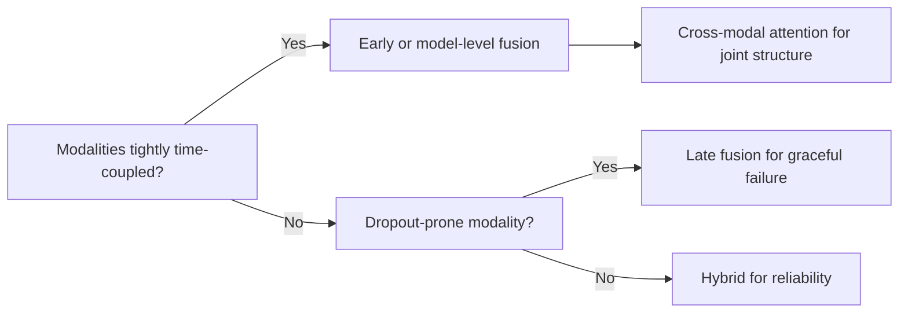
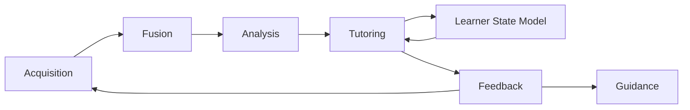

# Construction and Application of a Sports Intelligent Tutoring System Driven by Multimodal Data Fusion

A sports intelligent tutoring system (ITS) that fuses pose, inertial, and physiological streams can deliver corrective motor-skill feedback at a fidelity traditional physical-education assessment cannot reach — but only when its fusion pipeline treats **time-synchronization quality, not raw sensor count, as the binding constraint on accuracy**. The opportunity is large and measurable: the global wearables market reaches roughly **$100 billion in 2026** at 14.5% annual growth (about four times the smartphone market's pace), and multi-level fusion of IMU, GPS, positioning, and physiological signals has already demonstrated a **42.3% gain in positional accuracy and an 8.6 dB signal-quality improvement** over single-source baselines in team sport.

Against the common claim that adding modalities monotonically improves outcomes, the machine-learning record proves the opposite can occur: in jointly trained late-fusion networks, modalities compete and **the best unimodal network can outperform the multimodal one**[ICML 2022 Proceedings](https://proceedings.mlr.press/v162/huang22e.html). That contrarian finding governs this entire report: **fusion must be justified, not assumed.**

This report builds a mechanistic account of how such a system acquires, fuses, models, and tutors — and where its design choices bind against one another through 2030, when the post-ESSER device-funding cliff and on-device privacy mandates will jointly reshape what is deployable at scale.

---

## 1 Research Framework, Scope and Methodology

The system under study is a **closed-loop, model-driven coaching apparatus** that senses a learner's movement, physiology, and behavior through synchronized modality-specific streams, fuses them into a single learner-state model, and returns a corrective guidance signal fast enough to change the next repetition. Its defining engineering act is **not the recognition of any single signal but the temporally aligned fusion of many.**

### 1.1 The Eight Modalities

| Modality | Signal Characteristics | Pedagogical Information | Fusion Role | Key Limitation |
|---|---|---|---|---|
| **Video / Vision** | 30–240 fps, high-dim, lighting-sensitive | Whole-body geometry, technique form | Anchors spatial pose | Occlusion, privacy, 2D ambiguity |
| **Motion-capture / IMU** | 100–1000 Hz, 6–9 DoF, drift-prone | Joint kinematics, acceleration peaks | Complements video in occlusion | Drift, calibration, attachment artifact |
| **Physiological (HR/EMG/resp)** | 1–2000 Hz, low-amp, motion-artifact | Internal load, muscle activation | Adds load axis video cannot see | Sweat, electrode shift, latency |
| **Force / pressure / plantar** | 100–2000 Hz, localized | Ground reaction, balance, landing | Validates landing mechanics | Fixed location, cost |
| **Audio / verbal** | 8–48 kHz, sparse semantics | Coach intent, breathing cadence | Carries instruction semantics | Noise, privacy, ASR error |
| **Behavior / interaction logs** | event-driven, irregular | Engagement, practice volume | Contextualizes off-task states | Sparse, proxy-only |
| **Performance / assessment** | per-trial scalar | Ground-truth outcome label | Supervises the learner-state model | Coarse, lagging |
| **Subjective / self-report** | per-session ordinal | Perceived exertion, confidence | Calibrates internal-load estimate | Recall bias, low frequency |

### 1.2 Scope Boundary

**A sports ITS is defined here as a system whose output is a real-time movement-correction signal grounded in a fused estimate of the learner's physical state** — not a report about past learning. This distinguishes it cleanly from generic AIEd platforms such as conversational learning-analytics assistants, which close a loop between a human analyst and a corpus of records[eLearning Industry](https://elearningindustry.com/learning-analytics-2-0-how-ai-). The sports system closes a loop between **a moving body and a corrective cue**.

**Three settings are in scope:** school physical education (novices acquiring fundamental patterns), athletic training (refining automated skills at high intensity), and rehabilitation (movement relearned under medical constraint). Out of scope: pure fitness trackers that count steps without a pedagogical loop, esports and cognitive-skill tutors lacking a biomechanical substrate, and clinical diagnostic systems. The functional test for inclusion: **a device enters scope only when its fused output drives an instructional action** — the same insole is out of scope as a step counter and in scope when its plantar signal corrects a landing pattern.

The system serves four roles. The **learner/athlete** is the sensed subject receiving immediate correction within the repetition; the **teacher/coach** receives an aggregated, interpretable view and retains authority to override. This two-tier structure is the basis of **Human-AI Collaborative Coaching**: the system extends the coach's perceptual bandwidth rather than replacing it.

### 1.3 Evaluation Rubric

Six weighted criteria score the construction, with fusion-centrality carrying the largest weight by design:

| ID | Criterion | Weight |
|---|---|---|
| R-1 | Fusion-Centrality of Mechanism | 25 |
| R-2 | Construction Completeness | 18 |
| R-3 | Application Breadth & Validity | 17 |
| R-4 | Pedagogical & Sports-Science Grounding | 16 |
| R-5 | Evaluation & Effectiveness Logic | 14 |
| R-6 | Risk, Ethics & Feasibility Rigor | 10 |

The weighting encodes a deliberate tradeoff. Placing R-1 at 25 while holding R-6 at 10 could signal that safety matters less — indefensible where a bad landing cue can injure a learner. The resolution: **R-6 functions as a gate, not a summand.** A system scoring below a floor on safety cannot compensate through fusion elegance, so its nominal weight understates its veto power.

**Fusion-centrality is scored through a falsifiable ablation test:** the measured drop in guidance quality when each modality is removed. A system earns full marks only when no single modality can be removed without material loss. If a system's ablation delta is near zero for all but one modality, the rubric treats it as a disguised unimodal system and scores R-1 low even when raw accuracy is high. This directly confronts the modality-competition literature: capacity-driven overfitting under joint training is precisely what the ablation test exposes.

### 1.4 Controlled Vocabulary

**Four fusion levels** are distinguished throughout: *feature-level (early)* concatenates features before a single model; *decision-level (late)* runs a separate model per modality and combines outputs; *model-level* shares intermediate representations across sub-networks; *hybrid* mixes strategies by stage. The choice is a genuine tradeoff — late fusion is robust to a missing modality but cannot exploit fine cross-modal correlations; early fusion captures correlations but is brittle when a stream drops. Deeper fusion layers also prolong the unimodal-learning phase, risking permanent unimodal bias in over-parameterized regimes. **Hybrid fusion is the report's default** precisely because it negotiates this axis per stage.

The **learner-state model** is the running estimate of one person, combining a knowledge-tracing estimate (what the learner understands) with a motion-quality metric (how well they execute). **Closed-Loop Learning Guidance** is the cycle where this state drives a corrective signal, the learner responds, the response is re-sensed, and the state is updated. Its defining constraint is latency: asynchrony-detection thresholds show half of participants detect delays outside roughly −75 to 110 ms, so **synchronization errors beyond approximately ±90 ms break multimodal perception** — a design budget that forces heavy computation to the edge.

The pedagogical anchor is the **Fitts & Posner three-stage model** of motor-skill acquisition (cognitive → associative → autonomous). The optimal guidance signal differs by stage: a cognitive-stage novice needs frequent explicit cues; an autonomous-stage athlete needs sparse, high-precision ones to avoid disrupting automaticity. The **Acute:Chronic Workload Ratio (ACWR)** serves as the system's primary injury-risk guardrail.

---

## 2 Problem Context and System Objectives

### 2.1 Limitations of Traditional Instruction

Conventional coaching distributes one expert's attention across many simultaneously moving bodies, producing three structural deficits.

**The feedback bottleneck.** Physical-education teachers themselves rate the absence of real-time feedback as the single largest obstacle to effective instruction, ranking it first among barriers (mean 2.66, SD 0.76). The damage is not merely that feedback arrives late: delaying feedback **selectively disrupts the implicit adaptation component of learning** while leaving explicit strategy use comparatively intact. The very error-correction channel that automates a skill is the one most sensitive to one-to-many coaching latency.

Yet the fix is not "feedback as fast as possible." **Continuous concurrent feedback actively degrades skill learning**, because the learner becomes dependent on the external signal and fails to build the internal reference needed for retention. The constraint that resolves the tension is **latency-bounded, intelligently scheduled guidance**: fast enough to preserve implicit adaptation, sparse enough to avoid dependency — a scheduling problem only a learner-state-aware controller can solve.

**Subjectivity of manual assessment.** A 2025 analysis found traditional PE assessments frequently subjective and unable to capture the nuances of complex motor skills. Where a human rater produces an ordinal, drift-prone judgment, a model-driven motion-quality metric produces a continuous, reproducible number; instrumented PE systems already reach 97.14% accuracy in predicting student performance, a consistency no panel of raters reproduces. As instrumented assessment displaces subjective rating, the unit of pedagogical record shifts from remembered impression to a **longitudinal time series** of motion-quality metrics.

**Inability to individualize pacing and load.** A single coach delivering a common session plan cannot tailor load to each learner's readiness. The design rationale rests on the ACWR — recent training stress against a longer baseline — which a uniform plan cannot respect because it applies the same acute stimulus to learners with divergent chronic baselines. The right feedback frequency is likewise not a constant but a function of individual learner state, which a uniform human-delivered plan cannot compute.

These three deficits share a single root: **the absence of a sensing-and-inference layer** that can observe every repetition, measure it reproducibly, and individualize the response.

### 2.2 Why Multimodal Data and AI Now

Three converging developments explain the timing.

**Cheap wearables plus mature pose estimation.** Both principal movement-sensing modalities — body-worn inertial sensors and camera-based motion capture — have crossed cost and accuracy thresholds for ordinary settings, with the wearable market at ~$100 billion in 2026 and 14.5% annual growth. A unified framework integrating visual and wearable sensing for robust human-motion monitoring has been demonstrated outside the laboratory. But the maturity is methodological as much as commercial: the accumulated understanding of **how to fuse without falling into the competition trap**[ICML 2022 Proceedings](https://proceedings.mlr.press/v162/huang22e.html) is what makes the timing right.

**Data-driven personalization as an unmet need.** The learning-analytics field framed its 2026 flagship meeting around "Learning Analytics and AI Synergy", with workshops exploring generative AI as a "sensor for semantics". Deployed work tracking middle-school distress states via multimodal fusion already outperforms unimodal classifiers. **The Multimodal Learner Profile that the cognitive-learning community has operationalized for distress and engagement is the direct conceptual template for the sports learner-state model**, with the motion-quality metric substituted for the affective signal.

**The gap between single-modality tools and holistic guidance.** A step counter, heart-rate strap, or bar-velocity tracker each captures one channel. The limitation is not inaccuracy but that a single channel cannot disambiguate pedagogically distinct states: a cadence sensor registering an interruption cannot tell whether it was a deliberate squat, a rest pause, or a balance loss. As single-modality retrieval analogously misses exact matches, **the gap is in the dimensionality of the learner state any one sensor can reconstruct** — exactly what fusion is defined to close.

Jointly, these conditions prove that **the binding constraint has shifted from capability to integration:** the components exist, and the remaining work is the fusion architecture that turns them into a closed loop.

### 2.3 Core Learning Problems Targeted

The system commits to three concrete problems, each mapping to a diagnosed deficit.

**Movement error correction with timing constraints.** The constraint is two-sided: delayed feedback disrupts implicit adaptation, so correction must arrive while the motor trace is warm; continuous feedback degrades learning, so it must not be constant. The resolution is **learner-state conditioning** — latency-bounded correction serves the single repetition, reduced frequency serves the training block, and only a system that knows the learner's Fitts & Posner stage can decide whether to speak or stay silent.

**Fatigue and injury-risk monitoring.** Early fatigue signatures appear simultaneously across modalities — falling movement symmetry, rising heart rate at fixed workload, shifting plantar loading — none decisive alone but jointly diagnostic. A heart-rate strap cannot distinguish productive training from injury-compensating mechanics; the pose stream sees the altered mechanics but not the internal cost. A fusion-specific failure threatens this: when one stream drops, the fused estimate can collapse onto the survivor and lose diagnostic power. For a safety function this is intolerable, requiring **explicit degradation handling.**

**Motivation and adaptive pacing.** A chronically over-challenged learner disengages; an under-challenged one stagnates. The system treats engagement not as the objective but as a **constraint** — pushing difficulty as hard as the learner's measured distress state permits without crossing into disengagement, so skill growth is the maximand and motivation the bound.

No single modality suffices for any of the three, and **the same fused learner-state model serves all three simultaneously** — the economic case for fusion over a bank of independent single-purpose tools.

---

## 3 The Eight Modalities Profiled

The modalities form a designed complement system in which sampling rate and pedagogical role are nearly orthogonal, genuine redundancy is rare, and complementarity is the source of every fusion gain.

### 3.1 Vision and Inertial: Complementary Failure Modes

**Video / Vision.** Markerless pose estimation (OpenPose, MediaPipe, BlazePose) runs on commercial RGB, depth, and infrared cameras, collapsing ~10⁶ pixels per frame to ~24 skeletal keypoints. Its central advantage is delivering full-body spatial configuration **from a single environmental sensor without instrumenting the athlete**, anchoring the form-focused motion-quality metric the tutoring loop consumes. Its two structural weaknesses are **occlusion** (a hidden joint vanishes; camera occlusion produces significant fusion-performance drops) and **privacy** (raw video identifies minors, making it the most privacy-sensitive modality).

The estimator choice sets the deployment envelope. OpenPose pioneered high-accuracy multi-person tracking but demands substantial compute, while MediaPipe delivers lightweight real-time performance on mobile and embedded devices. The recommended pattern is **tiered**: a lightweight estimator at the edge for live guidance, a high-accuracy estimator for offline reprocessing. Because both reduce identifying pixels to an anonymized skeleton, running estimation at capture and discarding frames is the natural **privacy-by-design** instantiation.

**Motion-capture / IMU.** Inertial sensors stream acceleration and angular velocity far above video rates. 800 Hz IMU systems agree with force plates — the gold standard — at an intraclass correlation of **0.94 (MAE 1.2 cm) for jump height**. The signal-processing logic is a chain: a brief impact event concentrates signal energy into high frequencies, forcing a high sampling rate to avoid aliasing the peak, which yields force-plate-level agreement. Its noise profile is drift, the mirror image of vision's occlusion noise — **which is exactly why the two fuse well.**

The structural basis for fusing them: **vision loses an occluded joint entirely; the IMU on that joint streams uninterrupted but cannot place it in the global skeleton.** Their failure modes are complementary rather than overlapping. The market sustains the high-rate regime economically, keeping force-plate-level inertial sensing within reach of educational deployments.

### 3.2 Physiological and Biomechanical: The Missing Dimensions

**Physiological (HR/EMG/respiration).** These streams report internal cost that vision and IMU cannot see. The SiFi Band captures eight EMG channels at 1,500 Hz and single-lead ECG at 500 Hz; the Bitbrain Versatile Bio monitors up to 35 variables with millisecond synchronization. The threefold gap between EMG and ECG rates illustrates rate-matching: hardware spends its sampling budget where the signal's frequency content demands it. Physiology is the **orthogonal complement** to kinematics — two athletes can produce identical skeletons while differing entirely in internal cost. Millisecond synchronization is what lets a muscle-activation spike be tied to the movement phase that produced it. The hardest constraint is contact: motion artifact during the most intense efforts corrupts exactly the signals the load model most needs.

**Force / pressure / plantar.** A force platform outputs the 3D ground-reaction force vector; a pressure platform outputs a plantar-pressure heatmap — total load versus its spatial distribution. Wireless insoles carry measurement onto the field but read systematically low: validation showed shorter medial-lateral center-of-pressure trajectories and lower vertical forces than reference plates. The resolution is to **calibrate the insole's underestimate against plate accuracy** before its features enter the load model.

**Training-load proxies** are where these meet. A heart-rate-derived proxy captures internal cardiovascular cost; an IMU/force-plate proxy captures external mechanical load. Their divergence is informative: high internal but moderate external load flags an athlete internally fatigued yet mechanically fresh. Both feed the ACWR that Chapter 5 uses to model fatigue and injury risk.

### 3.3 Behavioral, Performance, and Subjective: Observing Learning

These modalities capture not the physics of movement but the learner's relationship to instruction.

**Audio / verbal** carries instructional intent and learner understanding in natural language. The LAK'26 CROSSMMLA framing treats generative AI as a "sensor for semantics", inverting the conventional instinct to suppress audio in favor of cleaner numeric streams.

**Interaction logs** are the lowest-cost modality — a byproduct of the system's own operation, recording which corrections are accepted or overridden. They report **whether corrective guidance is even being received**, a dimension no body-worn sensor can observe. The distress-prediction evidence proves behavioral logs carry affective and engagement signal, not mere usage counts; their interpretive ambiguity (an ignored correction may mean disengagement *or* mastery) is why they must be fused rather than read alone.

**Assessment scores** are the supervisory anchor — the outcome variable every other stream is trying to predict. Sparse and ordinal, they localize a learner within the Fitts & Posner stages and supply the labels that let the system learn **which sensed patterns drive measured improvement** — a relationship no quantity of unlabeled sensor data could establish.

**Self-report (RPE, motivation)** is the only window into the learner's internal experience. Its sharpest value is as a **discrepancy detector**: a learner reporting low exertion at high measured heart rate is mis-calibrated about their own body — a coachable finding the objective stream alone could never surface. Fusing it with objective streams lets measurement anchor the subjective signal and the subjective report interpret the measured one.

### 3.4 Acquisition in Realistic Environments

Three field problems determine whether the fused stack is physically realizable.

**Placement** splits by location: environmental cameras cover every learner at near-zero marginal cost, while body-worn sensors scale linearly per learner — making vision the natural backbone for group instruction. Camera count is **occlusion-driven**: viewpoints are added until critical-joint visibility is adequate and no further, then each camera's output is reduced to keypoints at the edge, bounding the surveillance footprint.

**Synchronization** is make-or-break. The rate spread is extreme (video at tens of Hz, IMU at 800 Hz, EMG at 1,500 Hz), so every sample must be timestamped against a shared clock with bounded error. The tolerance is perceptual: synchronization errors exceeding ~±90 ms break multimodal perception. This converts directly into an engineering spec: capture, edge pose estimation, fusion, and feedback rendering must fit their end-to-end latency inside that window. Independent device clocks drift; a shared trigger pulse collapses that drift into a bounded offset — without which the 42.3% positional-accuracy gain is unrealizable.

**Data volume** is bounded by the high-rate streams. The skeleton-at-source pattern resolves two problems at once: discarding raw frames after edge pose estimation removes the identifying pixels *and* eliminates the largest storage contributor — a rare case where the ethical and engineering optima coincide. The remaining edge discipline is **selective rate allocation**: impact-dominated streams keep their high rates where validation justifies the cost; gentler channels run slower.

### 3.5 Comparative Profile

| Modality | Sampling | Pedagogical Information | Fusion Role | Key Limitation |
|---|---|---|---|---|
| Video / Vision | Tens of Hz | Spatial geometry → motion-quality | Global configuration; fails on occlusion | Privacy + occlusion |
| Motion-capture / IMU | 800 Hz | Movement dynamics, impact metrics | Streams through occlusion; lacks global frame | Drift, placement |
| Physiological | EMG 1,500 / ECG 500 Hz | Internal effort/load | Orthogonal internal-cost signal | Motion artifact |
| Force / pressure | High-rate | Ground interaction, balance | Grounds kinematics in measured load | Plate confines; insole under-reads |
| Audio / verbal | kHz | Instructional intent | Semantic labeling of kinematics | Noise, privacy |
| Behavior logs | Event-driven | Engagement, intent | Engagement complement | Interpretive ambiguity |
| Performance scores | Per-session | Achievement ground truth | Supervisory anchor | Sparsity, subjectivity |
| Self-report | Per-session | Internal experience | Discrepancy detector | Recall bias |

**The load-bearing pattern: sampling rate and pedagogical role are orthogonal.** The highest-rate streams carry the physics of movement; the lowest-rate streams carry the meaning and outcome of learning — so no rate-based prioritization could substitute for the slow, sparse modalities, which is the structural argument against a sensor-only system.

Genuine redundancy is rare. The strongest complementarities are structural (vision↔IMU; physiology orthogonal to both; self-report orthogonal again). Even apparently redundant pairs are complementary: 800 Hz IMUs agreeing with force plates at 0.94 is a cross-*validation* between complementary sources, not evidence one is superfluous. Where partial redundancy exists, it buys robustness. But the modality-competition findings[ICML 2022 Proceedings](https://proceedings.mlr.press/v162/huang22e.html) are a direct caution: **the fix is to control fusion depth and training schedule, not to add modalities indiscriminately.**

No single modality is mandatory across all scenarios, and **no scenario is served by sensors alone** — every scenario pairs a physical modality with a learning-observation modality:

| Scenario | Mandatory | Enhancing |
|---|---|---|
| Form / technique correction | Vision, IMU | Audio, self-report |
| Load / fatigue management | Physiology, IMU/force | Vision, self-report |
| Skill-progression tracking | Scores, vision | Logs, IMU |
| Engagement / motivation | Logs, self-report | Audio |
| Injury-risk screening | Force/pressure, physiology | IMU |

---

## 4 Multimodal Data Processing and Fusion Mechanisms

**Fusion is the load-bearing mechanism that converts noisy, asynchronous, partially missing streams into a diagnosis reliable enough to act on in real time** — not an optional accuracy booster. Each stage is a causal link: preprocessing conditions, feature extraction compresses, fusion combines, and only then can the learner-state model produce a corrective signal.

### 4.1 Preprocessing, Synchronization, Annotation

**Cleaning** must be configured per modality (jitter and dropped frames for inertial/video, baseline drift and motion artifact for physiology), and its quality sets a hard upper bound on downstream fusion accuracy. The recurring tradeoff: aggressive filtering removes noise but also erases the fast genuine transients — peak angular velocity — that distinguish a correct throw from a flawed one. The resolution is to **preserve the sport's own motion bandwidth**, calibrating filters to the action's dynamics.

**Temporal alignment** is the decisive operation. Fusion accuracy is limited either by intrinsic sensor noise *or* by synchronization quality — whichever is worse — so beyond a threshold, buying better sensors yields nothing unless synchronization improves in step. The causal chain runs from a small cross-sensor delay, to spatially inconsistent evidence at the fusion step, to a fused estimate worse than either modality alone. For heterogeneous rates, naive upsampling of slow video manufactures synthetic samples a downstream model cannot distinguish from real observations; **multi-rate estimation keeps each stream at its native cadence**. Poor alignment measurably degrades the learned model itself.

**Annotation** marks meaningful movement segments. The key cost-reduction mechanism is **cross-modal supervision**: a force-plate spike at ground contact gives a precise timestamp that anchors a segment boundary on co-recorded video the eye alone could not place frame-accurately. Segment labels are dual — aligned both to the movement and to the Fitts & Posner stage it evidences — which is what lets the Multimodal Learner Profile connect a motion-quality metric to a developmental stage rather than scoring movements in isolation.

| Modality family | Dominant artefact | Primary cleaning | Alignment property |
|---|---|---|---|
| Inertial / wearable | Jitter, drift | Per-axis filtering | High native rate |
| Physiological | Baseline drift, artefact | Drift removal + gating | Slow-varying |
| Video-pose | Occlusion, dropped frames | Keypoint imputation | Lowest rate, frame-quantised |
| Force / pressure | Sensor offset | Offset removal | Event-sharp, easy anchor |

### 4.2 Feature Extraction per Modality

**Kinematic features** (velocity, acceleration, curvature from coordinate sequences) are the most interpretable — a coach can read a joint-angle curve — and the backbone of the motion-quality metric. But differentiation amplifies noise: residual jitter in position yields a noisy velocity estimate and an acceleration estimate dominated by noise, so **kinematic feature quality cannot exceed cleaning quality.**

**Video features** via CNN/Transformer encoders capture context sparse keypoints miss. Cross-modal attention is where Transformers earn their place: a visual token can attend directly to an inertial token describing the same instant, resolving a visually ambiguous frame with co-occurring motion signal. Because self-attention scales quadratically, the practical resolution is hybrid — a convolutional stem extracting cheap local features that a shallow attention layer contextualizes.

**Physiological features** are principled derived quantities over windows. The ACWR is itself an engineered feature — a recent acute window against a longer chronic baseline — and **the clearest case where the system passes the Pedagogical & Sports-Science Grounding bar: it ties a fused feature to an established safety construct rather than inventing an ad hoc metric.**

### 4.3 Fusion Strategy and Selection Logic

The four levels differ in where modalities meet. Empirically, **feature-level fusion enhances information extraction, decision-level fusion improves diagnostic accuracy, and a hybrid approach ensures greater reliability**. Selecting a level is a causal decision over three properties:

When modalities are tightly coupled and the diagnosis depends on their joint structure, early/model-level fusion preserves cross-modal interaction. When one is dropout-prone, **late fusion fails gracefully** — a failure in one channel degrades only one branch rather than corrupting a shared representation. Cross-modal attention has become the dominant model-level mechanism, with parameter-efficient adaptation (LoRA on query/value projections) giving the best quality-latency tradeoff.

The contrarian point: despite the intuition that earlier fusion preserves the most information, modalities can compete during joint training so the best unimodal network wins[ICML 2022 Proceedings](https://proceedings.mlr.press/v162/huang22e.html). **Fusion architecture must be designed to prevent one modality from starving the others, not merely assembled.**

| Level | Combination | Strength | Failure mode |
|---|---|---|---|
| Feature (early) | Input representation | Maximal cross-modal info | One dropout corrupts shared rep |
| Model-level | Inside joint model | Learned cross-modal attention | Compute cost |
| Decision (late) | Output combination | Graceful degradation | Discards cross-modal interaction |
| Hybrid | Multiple levels | Greater reliability | Design complexity |

### 4.4 Why Fusion Outperforms Single Modality

The advantage decomposes into three conditionally-realized mechanisms.

**Complementarity reduces ambiguity.** A video frame at the bottom of a squat is visually ambiguous between a controlled descent and a collapse; the co-recorded inertial deceleration profile distinguishes them. Neither modality resolves it alone — **the resolution is a joint property.** This is what makes Fusion-Centrality a passing property rather than a slogan.

**Redundancy tolerates dropout.** A marker occluded would blind a video-only system, but the overlapping inertial stream maintains the estimate. The robustness benefit is architecture-dependent, not automatic. Stale data that appears fresh can poison a redundant estimate worse than honest silence, so redundancy helps only when the fusion knows which source is currently trustworthy.

**Conflict resolution arbitrates disagreement** — the hardest mechanism, since getting it wrong produces an estimate worse than either input. Synchronization quality is upstream: misalignment manufactures spurious conflict by making two modalities describe different instants. The contrarian observation — **adding a noisy modality can reduce accuracy**[ICML 2022 Proceedings](https://proceedings.mlr.press/v162/huang22e.html) — means conflict resolution and training dynamics must be co-designed, with explicit attention gating, recency weighting, or modality dropout to prevent a loud-but-wrong modality from winning the arbitration or the gradient.

### 4.5 Latency-Accuracy Tradeoff

Late fusion yields the highest accuracy while early fusion offers the lowest inference latency in a hybrid model on edge hardware — the two objectives pull in opposite directions because early fusion runs a single forward pass while late fusion evaluates per-modality sub-networks. For Real-Time Movement Correction, this frontier is the first-order deployment constraint.

---

## 5 System Architecture

The architecture is a directed flow from the moment a learner executes a movement to the moment they receive an actionable cue. **Fusion cannot be a single monolithic stage; it must be distributed across six layers, each with its own latency budget and fusion level.**

### 5.1 Six-Layer Stack

The **acquisition layer** owns every modality-specific stream; the **fusion layer** performs temporal alignment then combines; the **analysis layer** produces a motion-quality metric and error diagnosis; the **tutoring layer** selects the next adaptive task; the **feedback layer** renders the corrective signal; the **guidance layer** governs cross-session progression. Where the ITAS architecture separates tutoring into three layers, the sports system requires six because **perception spans two full tiers before any tutoring logic can run.**

The learner-state model is both a read dependency and a write target of the tutoring layer. **The two feedback arcs — model update and physical re-execution — are the defining signature of Closed-Loop Learning Guidance**, distinguishing this from open-loop analytics dashboards that report but never adapt.

**The edge–cloud boundary is a perceptually derived constraint, not an engineering convenience.** Any processing feeding a real-time cue — capture, alignment, fast-path analysis — must live at the edge, because a cloud round trip injects variable latency that breaks the ±90 ms threshold and produces the desynchronized feedback Schmidt and Wulf showed degrades adaptation. Compute-heavy, latency-tolerant work (storage, knowledge-base queries, skill prediction) belongs in the cloud. The asymmetry resolves through **asymmetric model placement**: the edge runs a lightweight estimator for the single most safety-critical fault (e.g., knee valgus); the cloud runs the full diagnostic model.

### 5.2 Data and Knowledge Infrastructure

The storage tier reconciles streams whose native rates differ by three orders of magnitude. Rather than resampling globally — which destroys high-frequency EMG or wastefully up-samples sparse self-report — the pipeline **preserves each stream at native rate and defers reconciliation to the fusion layer**, using a two-store design: a hot edge time-series store for real-time fusion and a cold columnar cloud store for batch training.

The knowledge base encodes the domain model as a formal movement ontology. The Kinetic Human Movement Ontology provides 1,954 classes, 42 properties, and 1,921 logical axioms, so a "squat" is a class linked to component movements, prerequisite skills, and fault modes — letting the recommendation engine refuse to advance a learner to a weighted squat before the bodyweight pattern is stable.

The movement-standards repository anchors reference kinematics to **ISO/TS 23541-2:2025**, which defines a categorical structure for 3D body movement, and stores standards as **parametric tolerance functions of learner stage** rather than static thresholds — letting one repository serve beginners and elite athletes from the same ontology.

### 5.3 Analysis and Learner-Modeling Engine

This is the perception–decision boundary. The **motion-analysis module** uses feature-level fusion of pose and IMU to localize a fault to a specific joint at a specific phase, paired with explanation because an unexplainable diagnosis cannot be acted on. A contrarian caution governs the fusion choice: because modalities compete and the best unimodal network can win[ICML 2022 Proceedings](https://proceedings.mlr.press/v162/huang22e.html), **the module must validate that its fused diagnostic actually beats the best single-modality one** rather than assuming fusion helps. When a modality drops, a confidence-weighted fallback computes from whichever streams remain trustworthy.

The **dynamic learner model** combines a knowledge-tracing estimate with a motion-quality estimate, updating after every diagnosed repetition. It **must incorporate the ACWR as a first-class state variable**: physiological streams feed a running workload estimate that gates the recommendation engine's candidate set, preventing a high-load drill when the ratio signals elevated risk. When objective and subjective evidence conflict, the profile raises uncertainty rather than forcing false consensus.

The **skill-progress prediction component** projects the model forward, reporting a **confidence range rather than a point estimate** because sparse early-stage data cannot support false precision, and smoothing projections over a rolling window so only a sustained trend shifts the estimate.

### 5.4 Tutoring, Feedback, and Recommendation

The **recommendation engine** is prerequisite-aware rather than difficulty-only, and its candidate set is **filtered by the ACWR before being ranked by skill fit** — making safety a hard structural constraint rather than a soft preference. It combines semantic ranking with exact ontology-tag matching, since pure-semantic retrieval can miss exact matches.

The **feedback generation module** defaults to intermittent, not continuous, guidance — a pedagogical constraint derived from evidence that continuous concurrent feedback degrades retention. Feedback frequency and timing are exposed as tunable, learner-controllable policy parameters where safety permits.

The **interfaces** differ by audience: the learner interface optimizes for immediacy and low cognitive load; the teacher interface optimizes for oversight, shifting from static report toward conversational data assistant[eLearning Industry](https://elearningindustry.com/learning-analytics-2-0-how-ai-). The interface is the locus of Human-AI Collaborative Coaching: every recommendation is endorseable or overridable, and **overrides feed back into the learner model as labeled corrections** so the system learns from the human rather than merely deferring.

| Module | Primary inputs | Output | Tier | Governing constraint |
|---|---|---|---|---|
| Recommendation | Diagnosis, state, prerequisite graph | Next task | Cloud | Workload filter before skill rank |
| Feedback generation | Diagnosis, timing policy | Corrective signal | Edge | Intermittent, learner-controllable |
| Learner interface | Guidance signal | Rendered cue | Edge | Immediacy, low load |
| Teacher interface | Aggregated state, predictions | Plan + override | Cloud | Override feeds learner model |

---

## 6 Sports Science, Pedagogy, and Learner Modeling

**Every corrective guidance signal traces to a named sports-science finding; where the system departs from the literature, it does so as an explicit, flagged design hypothesis rather than silent invention.**

### 6.1 Motor-Skill Acquisition Theory

**Fitts & Posner stages mapped to feedback.** The three-stage model — cognitive, associative, autonomous — has been recovered empirically as discrete learning states, with the largest performance gains produced by transitions *between* states. The system treats the current stage as a first-class variable conditioning the entire guidance policy: a cognitive-stage novice gets coarse verbal cues on the one or two largest faults; an associative-stage learner gets finer kinematic detail; an autonomous-stage athlete gets deliberately faded intervention to avoid disrupting automaticity. Critically, the stage is inferred not from quiz correctness but from **the magnitude and trial-to-trial variability of kinematic error** — a structurally richer signal than classroom knowledge-tracing.

**Schmidt schema theory and feedback timing.** The single most consequential constraint contradicts the intuition behind real-time AI tutoring: continuous concurrent feedback degrades skill learning. The frequency question is meta-analyzed, so the system defaults to a reduced schedule, denser in the cognitive stage and sparser later. Timing delay is a separate axis: delayed feedback selectively disrupts implicit adaptation but spares strategy use, and can even *facilitate* retention of novel skills. The system makes its latency budget **task-conditional** — tight for adaptation-dominated drills, relaxed for consolidation drills. The contrarian payoff: **the pedagogically optimal system often withholds the very real-time stream it is capable of producing.**

**Biomechanical movement-quality criteria** (proposed design choices, not literature-mandated universals): joint-angle accuracy against a *scaled* reference, inter-segment coordination timing, movement smoothness, and inter-limb symmetry. The "scaled reference" qualifier is load-bearing — comparing against a per-learner normalized template avoids falsely penalizing a correctly executed movement performed by a differently proportioned body. None of the four is computable from a single modality with full confidence, so the movement-quality layer **genuinely depends on fusion.**

**Self-controlled feedback** is exposed as a configurable mode where the learner requests guidance when ready, preserving the internal error-detection processing continuous imposed feedback substitutes for. The system gates this on stage: dense system-scheduled feedback in the cognitive stage (the beginner cannot yet judge when correction is needed), handing control to the learner as the associative stage establishes error-detection capacity.

**The motor-learning literature fully specifies the feedback module as a four-dimensional policy space** indexed by stage, frequency, timing delay, and agency — each independently evidenced, composed into one governed scheduler conditioned on the fused movement-quality signal.

### 6.2 Training Load and Safety Science

The system's **safety envelope is itself a fusion product** — three partly-independent views cross-confirmed before acting.

**ACWR for injury risk** compares a rolling short window (commonly 7 days) against a longer baseline (commonly 28 days), with default governance bands of roughly 0.8–1.3 (lower risk) and above ~1.5 (elevated risk), explicitly flagged as parameters requiring local validation. A named caveat shapes computation: the coupled-versus-uncoupled chronic-window choice shifts the thresholds, so the system documents its choice transparently and treats the ratio as one input to a fused estimate rather than a standalone verdict.

**Fatigue indicators from physiological fusion** combine autonomic (HR/HRV), neuromuscular (EMG median-frequency downshift), and kinematic (degrading smoothness) signatures. Each channel alone admits multiple confounds — HRV is confounded by caffeine and arousal, EMG is placement-sensitive, kinematic degradation can reflect distraction — but **their conjunction narrows the interpretation to genuine fatigue.** The estimate degrades gracefully to a two-channel configuration when EMG is unavailable, reporting lower confidence accordingly.

**Overtraining-prevention thresholds** define three escalating tiers — caution (reduce intensity), deload (recovery session), halt (block high-load work until recovery markers return to baseline). Tier boundaries are driven jointly by ACWR and the fused fatigue estimate: when the two disagree, the system triggers only caution; only when they agree does it escalate. **This cross-confirmation is the concrete mechanism by which multimodal fusion improves safety over a single-indicator monitor.**

| Construct | Source signals | Default band | Action | Fusion role |
|---|---|---|---|---|
| ACWR | Session load (7d/28d) | 0.8–1.3 safe; >1.5 danger | Caution on danger entry | Workload history |
| Fatigue estimate | HR/HRV + EMG + kinematics | Channel-agreement gated | Deload on multi-channel strain | Real-time strain |
| Recovery markers | Resting HRV, readiness, sleep | Return toward baseline | Halt release condition | Recovery view |

### 6.3 Personalized Learner Profiles

The Multimodal Learner Profile is structured along **three orthogonal dimensions**: ability (current stage per skill, motion-quality baselines, physiological capacity — changes fastest), history (accumulated load feeding the ACWR, injury and recovery record), and goal (skill mastery, competition, rehabilitation, or fitness — sets the risk tolerance). Removing any one breaks a specific decision: without ability, feedback resolution cannot be set; without history, the ACWR cannot be computed; without goal, the safety-versus-progression tradeoff cannot be resolved.

**Individual differences are signal, not noise.** Anthropometric differences are handled by the scaled-reference mechanism; rate-of-learning differences by advancing on the evidence of the learner's own kinematic-error trajectory rather than elapsed time; physiological-capacity differences by per-learner baselining so the fatigue fusion operates on deviations from each learner's own baseline. A contrarian note: a fusion well-calibrated for the average learner may be silently dominated by one modality for an atypical individual[ICML 2022 Proceedings](https://proceedings.mlr.press/v162/huang22e.html), arguing for monitoring per-learner modality contribution rather than trusting a globally trained fusion.

Every guided session updates all three dimensions in a closed loop — ability from motion-quality metrics, history from realized load, goal only on explicit learner action. **This adaptive learner-model update is what distinguishes the system from a one-shot assessment tool.**

---

## 7 Tutoring and Learning Guidance Mechanisms

The mechanisms divide into two families: **intelligent tutoring** (diagnosis — what went wrong and why) and **learning guidance** (action — correction, plans, recommendation, risk warning, teacher support). The unifying contribution is the closed-loop logic binding them: every diagnosis is corroborated across at least two streams, and every guidance act is conditioned on the fused learner state.

### 7.1 From Fused Data to Diagnosis

Diagnosis proceeds through named stages, not a single leap: **a fused feature vector is compared against a movement reference to produce a deviation score, which triggers an error-detection flag, which is classified into a named error type** (e.g., "knee valgus," "insufficient depth"). Each arrow is a separable computation, so the chain is debuggable stage by stage. The fused chain's advantage over a pose-only pipeline is that the classification stage can condition on IMU dynamics — angular velocity at the bottom of a squat — that pose alone cannot resolve.

**Confidence is a control variable, not a cosmetic annotation.** A workable gating policy routes diagnoses below ~0.5 confidence to "request more data," 0.5–0.8 to human review, and above 0.8 to automatic correction — band boundaries treated as deployment parameters tuned against false-correction rates. The asymmetry: the cost of a confident-but-wrong correction (teaching an error) exceeds the cost of a deferred one. When occlusion degrades the pose stream, the confidence model down-weights pose-derived deviations and leans on the IMU.

**Corroboration must be enforced at the decision level.** An error appearing in both video-pose deviation and IMU dynamics is promoted to high confidence; one in a single stream is held pending review. The paradox — a second modality is supposed to increase reliability, yet joint training lets modalities compete so the best unimodal network wins[ICML 2022 Proceedings](https://proceedings.mlr.press/v162/huang22e.html) — resolves architecturally: **decision-level (late) fusion preserves each stream's independent diagnostic vote even when joint training would let one modality dominate.**

### 7.2 Real-Time Movement Correction

**Feedback modality selection is load-adaptive, not fixed.** Visual-auditory feedback is most effective for single tasks under normal workload (g = 0.87), while visual-tactile feedback overtakes it for multiple tasks under high workload (g = 0.84). Multisensory signals can both improve detection and *decrease* measured workload by offloading the congested channel. A visual correction superimposed on a visually demanding skill steals attention; a haptic cue does not.

**The latency budget is bounded by perceptual physiology:** cross-modal feedback components must align within ~±90 ms or read as separate events. This budget is shared between alignment overhead and compute overhead, and synchronization quality consumes part of it before any correction is computed. A 30 fps video stream and a 100–1000 Hz IMU are inherently multi-rate, so naive resampling injects exactly the misalignment the budget cannot absorb.

**Feedback granularity must be rationed, not maximized** — the most counterintuitive result the guidance layer respects. Continuous concurrent feedback degrades learning via the guidance hypothesis: rich constant feedback blocks the learner from developing internal error detection, so retention collapses once it is withdrawn. The granularity policy varies with stage — somewhat more explicit early when the learner cannot self-detect error, faded later — and accepts slightly worse in-session performance to secure the retention that is the actual objective.

### 7.3 Adaptive Training Plans

Planning is a nested set of closed loops at different time constants, all driven by the same fused learner state.

The **recommendation policy** selects the task that most advances the learner's weakest currently-trainable skill component while remaining within demonstrated prerequisite mastery, with safe fallback when state is ambiguous. Model-driven tools help most where the human coach has least experience.

**Difficulty adaptation is dual-gated.** Difficulty rises when both success rate and movement quality exceed target bands, lowered when either falls, and **capped by a workload ceiling no within-session success can override.** Pedagogical readiness is a *necessary but not sufficient* condition for escalation; the ACWR ceiling is the sufficient-condition gate. The two signals are computed from different streams (movement quality from pose/IMU, load from HR/EMG), so the ceiling cannot be spoofed by good technique alone.

**Progress prediction** converts the plan from reactive to anticipatory: a predicted plateau triggers plan adjustment before the learner stalls, with the forecast feeding back to alter the recommender's next offerings.

### 7.4 Injury-Risk Warning and Teacher Support

The system advises and the human decides — both an ethical commitment and a performance-enhancing division of labor.

**A banded risk index** combines acute load, movement-quality degradation, and physiological strain. The graded structure resolves the false-alarm problem: a single conservative threshold floods the coach and is ignored, while a permissive one misses real risk — so the design is **conservative about logging and permissive about interrupting**. The fused index does not fire on benign exertion because the movement-quality and workload inputs contextualize the physiological signal.

The **teacher dashboard** surfaces diagnoses as ranked intervention prompts rather than raw data, directing a coach's limited attention to the highest-value learners. AI-driven clip detection has cut one coach's weekly film time from two hours to forty-five minutes. As prompt accuracy commoditizes, **prompt-ranking quality** — strategic utility estimation — becomes the binding constraint on the collaboration's value.

**Post-training reports** aggregate the same fused state that drove in-session guidance, guaranteeing consistency, and feed back as historical context for progress prediction — privacy and bias in this aggregation governed per Chapter 9.

### 7.5 Causal Justification of the Closed Loop

**Each iteration — sense, fuse, diagnose, correct, re-sense — produces a measured state change that updates the next diagnosis, yielding a more targeted correction and accelerating convergence faster than open-loop instruction.** If the targeted error resolves, the loop advances to the next-severity fault; if it persists, it escalates the correction's modality or granularity. This resolve-and-advance dynamic is what open-loop instruction, bound to a fixed lesson plan, cannot do. The loop must respect the guidance hypothesis — correcting too aggressively re-introduces the dependence that degrades retention. On the basis of the g = 0.87 feedback-modality effects, a correctly-tuned loop should produce a moderate-to-large advantage over open-loop instruction, **conditional on accurate diagnosis and correct modality matching** — shrinking toward zero where either fails.

The **human-AI division of labor** assigns each decision to whichever agent has the comparative advantage: the AI owns high-frequency perception and triage; the human owns low-frequency, high-stakes judgment and the motivational relationship. The confidence and warning gates are the handoff points, and the boundary migrates toward greater autonomy exactly as fast as calibrated confidence permits.

**The loop fails along four identifiable paths:** diagnostic error propagating into wrong correction (the worst outcome — teaching an error, which is why the confidence gate is not optional); modality collapse when corroboration becomes unavailable; latency violation beyond ±90 ms detaching cue from action; and the joint-training competition effect collapsing fusion to effectively unimodal behavior[ICML 2022 Proceedings](https://proceedings.mlr.press/v162/huang22e.html). The fourth requires **active defense of modality independence** — decision-level corroboration plus per-modality contribution monitoring — which is the price of the corroboration benefit.

| Mechanism | Primary inputs | Output | Binding constraint | Human checkpoint |
|---|---|---|---|---|
| Diagnosis | Pose + IMU corroboration | Confidence-gated verdict | Confidence calibration | Review queue (mid-confidence) |
| Correction | Diagnosis + load state | Modality-matched signal | ±90 ms; guidance hypothesis | Learner self-control |
| Planning | State + workload | Task + difficulty + forecast | Workload ceiling precedence | Plan review |
| Risk/Teacher | Physio + biomech + workload | Banded warning + prompts | False-alarm vs miss | Dashboard triage; hard-stop |

---

## 8 Application Scenarios

**The perception layer and fusion network generalize across all contexts, but the Pedagogical Inference layer — the mapping from fused state to corrective signal — must be re-specified per scenario.** A single universal analysis backbone (one adapter auto-configuring per sport) is achievable at the perception tier; a single universal pedagogy is not.

### 8.1 School Physical Education

The highest-volume, lowest-instrumentation context inverts the priorities of every other scenario: **throughput over per-learner fidelity, engagement over performance, reproducibility over richness.** The automation contribution is a **vision-only assessment path** that watches every learner in frame simultaneously, converting the instructor's serial-attention bottleneck into a parallel machine-observation channel, with one universal adapter reused across curriculum rotations. The failure mode is occlusion in dense formations — a cheap single-camera economy creating a blind spot resolved by a second viewpoint.

**Throughput, not peak accuracy, is the binding constraint.** An IoT-enabled monitoring system tested with 147 student-athletes over twelve months reached 93.45% prediction accuracy, a reference ceiling for multi-learner monitoring. The vision-only path deliberately sacrifices kinetic and physiological channels to achieve a zero-body-worn footprint, accepting a lower ceiling in exchange for assessing thirty learners who will never wear a sensor.

For **standardized grading**, the system supplies a reproducible motion-quality metric as decision-support, not autonomous grading. A genuine tension: **reproducibility and validity are orthogonal — a metric that reliably measures the wrong thing is reproducibly wrong.** The reference template must be validated against outcomes (did the serve go in), not only against form resemblance. The contrarian reading: automated grading does not remove subjectivity but *relocates* it into the reference template, where it becomes harder to contest than a teacher's visible judgment — which is why the grading-support framing is the defensible one, and why fairness across body types is a future governance obligation.

For **engagement sensing** — frequently PE's primary objective — the distress-detection precedent transfers, but with a critical confound: the physiological signal indexing distress in sedentary gameplay is confounded by exertion in sport. The video channel must supply activity-level context that conditions the interpretation of the physiological channel. **The same Pedagogical Inference Controller architecture serves both PE and elite training; only the utility function's weights differ** — the first concrete instance of pedagogy-layer reconfiguration.

### 8.2 Professional and Competitive Training

The maximal-instrumentation mirror image: a single athlete receives the full compute budget, every channel is available, and the success metric is measurable performance.

**Kinetics must supplement kinematics.** Two athletes can produce visually similar joint trajectories while generating different ground-reaction forces, so the kinematic channel that sufficed for school-PE form assessment cannot certify elite technique. The force/pressure channel is fused with pose at the feature level; IMU sensing resolves fine angular velocity directly. **This is the only scenario where full three-way fusion of video, inertial, and kinetic channels earns its cost** — only at this tier do the fine distinctions change a competitively meaningful outcome.

Elite athletes sit at the Fitts & Posner autonomous stage, needing sub-perceptual corrections they cannot feel — exactly what the fused kinetic channel surfaces and unaided proprioception cannot. The frontier alternative to metric-only scoring is a multimodal LLM (DeepSport) that reasons about movement in context; its risk is fluent imprecision — describing a serve as "good technique with room to improve" without the quantified deviation a coach can act on. Elite deployments will likely run both: **the reproducible metric for the defensible number, the reasoning model for the contextual explanation.**

**Load management** makes the ACWR the physiological spine. The closed loop here is deliberately human-supervised because the cost of an erroneous load recommendation to a high-value athlete is too high to remove the coach. The controller's **uncertainty-aware deferral** — expressing uncertainty and deferring to the coach when high — is the mechanism that makes the loop safe enough for elite stakes. The 93.45% performance-prediction figure should not be read as an injury-prediction guarantee.

### 8.3 Remote and Self-Directed Learning

The instrumentation floor drops below even the school setting: no institutional hardware, frequently no reliable network. **Video-based pose estimation is the accessible default** because it needs only a phone the learner already owns. Asynchronous correction breaks the Real-Time Movement Correction property, substituting a reflect-and-retry loop that suits the cognitive and associative stages (the learner can use a post-hoc correction on the next attempt) better than the autonomous stage. This scenario most severely tests whether the fusion design degrades gracefully or collapses when channels drop.

---

## 9 Evaluation, Experimental Design, and Metrics

Evaluation must answer whether fusion produces measurable motor-skill gains single-modality systems cannot. The discipline: **separate model-level accuracy, learning-outcome gains, and usability into distinct metric planes, then bind them through explicit causal attribution** — so a high pose-recognition F1 is never mistaken for a skill-improvement claim.

### 9.1 Experimental Design

**Controlled comparison with traditional instruction** is the foundation. AI-assisted tactical instruction produced significantly greater knowledge gains than traditional teaching (t = 8.16, p < 0.001); a randomised parallel-group trial of 94 primary-school students evaluated AI-integrated blended learning against conventional teaching; and a 10-month RCT found AI coaching as effective as human coaching, both beating control. **The right contrast is often three-armed** — model-driven guidance, human-coach guidance, untreated control — because a two-arm comparison cannot distinguish "the algorithm adds value" from "any structured attention adds value." For durable motor skill, parallel groups are required over crossover designs, which contaminate the second period with grooved skill.

**Within-system A/B structures** vary a single pipeline parameter — feedback timing, frequency, or learner control — while holding the rest fixed. By 2027, pilots are likely to converge on a hybrid: a short within-subject A/B to tune guidance parameters, then a parallel-cohort RCT to certify durable gain.

**Confounders** specific to this domain: the acquisition-versus-retention dissociation (a manipulation can improve performance while harming durable learning — the single most dangerous confound, since it inverts the conclusion's sign); differential attrition over long studies; and measurement reactivity from being instrumented and observed. The standard mitigation is an **instrumented-but-unguided control arm** — same sensors and dashboards minus the adaptive corrective signal — so reactivity and novelty load equally on both arms and cancel. **No downstream metric can be read as a fusion benefit until the design has neutralised these threats.**

### 9.2 Model-Level Accuracy

For **continuous movement quality**, MAE/RMSE per pedagogically relevant joint angle — not a pooled statistic that averages away the localised failures that ruin a coaching cue, given joint-angle error amplification through the kinematic chain. For **risk prediction**, precision/recall/F1 on the rare event class, not raw accuracy, which a trivial "no event" predictor games. Because a missed high-risk movement can precede injury while a false alarm costs only an unnecessary caution, **the system is tuned to a recall-weighted operating point**, and any reported figure is meaningless without its operating point.

The **fusion-vs-single-modality benchmark** justifies the architecture — and fusion does not automatically win. Modalities compete during joint training, the best unimodal can win[ICML 2022 Proceedings](https://proceedings.mlr.press/v162/huang22e.html); multimodal networks overfit because modalities generalize at different rates; deeper fusion layers entrench permanent unimodal bias. **The benchmark must compare against the strongest single-modality model, not a strawman**, and report which fusion architecture was used, because the answer can flip with that choice. Model accuracy is a precondition for, never a substitute for, a learning-benefit claim.

### 9.3 Learning-Outcome Metrics

**Movement-quality improvement** is the shrinking distance to expert kinematics on coached joints, requiring an explanation-paired estimator to distinguish real learning from instrument drift and an instrumented-but-unguided arm to subtract regression to the mean.

**Skill-acquisition rate and retention must be reported together**, because a manipulation can accelerate acquisition while degrading retention. The single most important commitment is a **delayed retention test** after a no-practice interval — frequent feedback fosters dependence that suppresses error-detection processing, producing a retention deficit only a delayed test reveals. Acquisition rate should be **stratified by Fitts & Posner stage**, since the optimal feedback schedule inverts from frequent (cognitive) to sparse (autonomous).

**Injury-incidence reduction** operates on two levels: arm-by-arm rate ratio over the longest feasible horizon, and a continuous risk surrogate that accrues power faster than rare-event counts. The threat is surrogate gaming — a system can reduce a risk score without reducing injuries — so **the surrogate must be validated against actual incidence before it is trusted standalone.**

### 9.4 Usability and Engagement

**Feedback timeliness** is bounded by the ±90 ms cross-modal binding window, but the relationship to learning is non-monotonic — a deliberate delay can strengthen retention by forcing error-evaluation before the answer arrives. **Acceptance** is the behavioral complement: a correct cue buried beneath less relevant ones is behaviorally a rejected cue, so the system must rank cues by actionability.

**Teacher workload reduction** shifts the coach from compiling data to querying a synthesised state[eLearning Industry](https://elearningindustry.com/learning-analytics-2-0-how-ai-), but must be measured **net of any new oversight or correction** the coach performs on the system's outputs, lest it overstate the relief while risking deskilling.

**Learner engagement** drives the practice volume skill acquisition requires, but the novelty effect inflates early numbers, so the honest estimate is the post-novelty plateau over a long window. The subtlety: engagement and durable learning can pull in opposite directions, since the most engaging configuration — constant rich feedback — is precisely the one that degrades retention. **Engagement must be interpreted jointly with retention, not maximised on its own.**

### 9.5 Causal Evaluation Logic

The core chain: **fusion produces a more complete movement estimate → enables a more precise corrective signal → delivered within the perceptual window drives in-session correction → accumulated across retention-tested practice produces durable gain.** Each link is independently instrumented (fusion quality by the benchmark, precision by per-joint error, correction by acceptance/timeliness, durable gain by delayed retention), so the chain is **falsifiable at every joint.**

**Attribution requires ablation** — removing one module while holding the rest fixed. The strongest single ablation is fusion-vs-best-single-modality, the only design that tells a procuring institution which components are worth the cost. Whole-system A/B answers "does the assembled system help"; module ablation answers "which part helps and by how much."

**Threats to validity** include the acquisition-retention dissociation, construct narrowness (ITS for psychomotor skills mainly target fine, closed, discrete skills and may not generalise to open, externally-paced sport), and the deepest one — **the multimodal fusion responsible for the benefit is also the most fragile link** (synchronisation error or a failed modality silently degrades the estimate). The resolution: the evaluation must include **adversarial robustness tests** — deliberate stream dropout, injected latency beyond ±90 ms, sensor occlusion — so the benefit claim is qualified by the operating envelope within which fusion holds, rather than asserted unconditionally.

---

## 10 Deployment Constraints

**The binding constraint on a sports ITS is rarely the model and almost always the deployment envelope — temporal alignment, calibration labor, and recurring cost jointly determine whether the closed loop ever closes in the field.**

### 10.1 Hardware and Sensing

A cost-conscious deployment evaluates a single commodity camera plus inexpensive IMUs rather than an optical capture studio — buying affordability at the cost of per-frame fidelity the fusion network must recover. In field conditions, **placement error is the dominant source of systematic bias** in IMU-derived joint angles; the fusion redundancy mitigates this (the camera sees where the IMU sits), since a misplaced sensor produces a biased angle → corrupted metric → guidance toward the wrong target.

**The calibration burden is the most underestimated operational cost.** Temporal alignment degrades continuously and must be re-established; below a threshold, synchronization — not sensor hardware — becomes the binding accuracy constraint. Manual per-session calibration leads to teacher abandonment; the resolution is **self-calibration from a brief standardized movement.** Tighter on-board timestamping in clinical-grade wearables should reduce this burden in future hardware generations.

### 10.2 Computing and Latency

**Edge computing is chosen for determinism, not power** — keeping the feedback path short and predictable versus a cloud round-trip whose latency is neither short nor reliably bounded. A bigger cloud model is not automatically better: modality competition can make a smaller edge model that avoids it outperform a larger cloud model that succumbs[ICML 2022 Proceedings](https://proceedings.mlr.press/v162/huang22e.html).

The latency budget must fit the ±90 ms perceptual ceiling. An illustrative ledger — capture ~15 ms, alignment ~5 ms, fusion inference ~45 ms, decision ~10 ms, rendering ~15 ms — approaches the ceiling with little margin, so **the fusion model must be sized to its latency budget first and its accuracy second**; the instinct to deepen the network is defeated by the unimodal-bias result and the latency ceiling simultaneously. In bandwidth-limited remote settings, edge pre-processing transmits compact features (keypoints, not frames), and the fusion must tolerate stale/intermittent streams rather than failing hard.

### 10.3 Integration and Scalability

The integration target shifts from static LMS reports to **conversational real-time analytics**[eLearning Industry](https://elearningindustry.com/learning-analytics-2-0-how-ai-). The incumbent K12 SaaS subscription model has become financially unsustainable and operationally fragmented, so a sports system entering as yet another standalone subscription inherits a failing structure — **the integration strategy that survives consolidates into an existing platform.**

Scaling multiplies every calibration cost non-linearly: heterogeneous venue timing produces divergent per-venue synchronization → divergent fused feature distributions → a motion-quality metric that means different things in different gyms. The decision reduces to a governance question: how much per-venue accuracy to trade for operational uniformity, with the synchronization evidence favoring **standardized alignment** as the safer fleet-scale default.

Maintenance is precarious: after the 2020–2022 surge funded by **$112 billion of ESSER money, schools now face a "device refresh cliff"** as that funding expired. A deployment on that hardware inherits the cliff. The resolution is to **plan total cost of ownership as a multi-year recurring line item from the outset** rather than a one-time capital purchase.

### 10.4 Cost, Adoption, and Usability

**The dominant hidden cost is not the sensors but recurring subscription, calibration labor, and device refresh** that outlast the one-time funding. The multimodal case is worse than a single-modality tool — more devices to refresh, more calibration, heavier compute — so the business case for extra modalities **must be proven empirically per deployment, not assumed**, especially given that multimodal networks can underperform their best unimodal counterpart.

Acceptance follows a behavioral calculus: habit, performance expectancy, self-efficacy, and response efficacy positively predict adoption, while **perceived response cost acts as a barrier**. This creates a self-reinforcing trap — high calibration burden raises response cost → lowers intention → sparse use → starves the adaptive learner-model update loop of data → improves slowest. The Human-AI Collaborative Coaching model must be introduced as **augmentation rather than replacement**, because self-efficacy rises when the teacher retains agency over the corrective signal.

**Robustness in messy environments is the precondition for the response efficacy that drives adoption.** Fusion not designed for failure fails badly exactly when the environment is hardest; a deliberately redundant bimodal design degrades gracefully. The contrarian implication: **adding a modality can reduce robustness if the fusion is naive** — a system depending on all streams being present is more fragile than a well-designed single-modality one. Vague or wrong explanations erode the trust on which adoption rests, so failure-aware design and grounded explanations are the engineering precondition for field survival.

---

## 11 Ethics, Privacy, and Safety

**The Risk, Ethics & Feasibility Rigor dimension is a design input that reshapes the fusion pipeline, storage topology, and guidance policy from the first sensor placement — not a compliance appendix.**

### 11.1 Biometric and Video Privacy

The eight modalities form a **sensitivity ladder**: interaction logs and assessment scores resemble ordinary educational records; video and physiological signals are health-adjacent and visually identifying. Athletic wearables are frequently worn all day, extending capture far beyond the training session, and the market trajectory implies continuous, ambient capture by 2030 — so the retention layer must be architected as if the stream never stops.

**Fusion amplifies identifiability.** Motion models that ignore individual body shape rely on a standardized average body — a simplification that itself reveals the real signal carries per-individual shape information. The conservative principle: **a fused pose-plus-IMU representation should be treated as potentially re-identifying even when no single channel would be.** Discarding raw video does not resolve this, because derived motion features carry body-specific structure; they should be retained under **biometric-grade controls** even after raw frames are discarded.

**Consent design treats guardian authorization as the floor, not the ceiling.** The rise of wearables forces a reassessment of FERPA's scope in collegiate athletics; secondary-school minors cannot have a weaker standard. The system adds **age-appropriate learner assent and data minimization** — a three-part standard the report advances as its own ethical position. For minors, the governance default inverts the consumer one: **no derived metric leaves the institution without explicit, purpose-bound authorization**, renewed per purpose and per season, because distribution is the source of privacy violation.

Tabular anonymization fails on continuous biometrics — generalization that protects a discrete grade field provides weak protection for a high-dimensional gait trace whose distinctive structure survives coarse binning. The system cannot claim strong anonymization and full personalization simultaneously, defaulting to **on-device processing**. The economics align rarely: 50,000 daily students on cloud AI incur $180,000–$450,000/year in API fees and trigger FERPA-required district consent, **whereas on-device AI eliminates that consent burden entirely**, and is increasingly practical. The residual: any signal reviewed by a human coach leaves the device, and a personalized on-device model encodes the learner — **removing one learner's contribution without full retraining remains an open engineering gap.**

### 11.2 Data Governance and Security

Storage is **tiered by sensitivity**: raw video retained only long enough to compute the metric then discarded, derived features under biometric-grade controls, assessment scores for enrollment. The ACWR can be maintained from session-level summaries rather than a continuously retained physiological stream, letting the system discard raw streams aggressively.

**The coach boundary is the most consequential access control** — least-privilege scoping makes over-access technically impossible rather than merely prohibited, with auditable, time-boxed elevation for exceptional needs. **FERPA is the anchoring obligation**, and its awkward fit to high-frequency streams is itself evidence of an ill-fitting regime: if the fit were clean, no reassessment would be needed.

**Minimization is the primary breach control** — a breach exposes only what exists, so on-device processing prevents the high-value central store from accumulating. Whatever persists is encrypted and network-segmented so a breach of the assessment tier does not reach the motion signatures, with the biometric-grade tier treated as the highest-severity incident class.

### 11.3 Algorithmic Fairness and Reliability

**Motion-model bias is documented at the origin:** early motion-capture systems were built on white, athletic males, producing biased representations for other body types and genders. The contemporary form is the standardized-average-body assumption, producing a corrective signal least accurate for the learners the training data under-represented. The mitigation is **body-shape-conditioned modeling**, computed on-device so the fairness gain is realized without the identifying representation leaving the learner's control. Fairness across sports requires per-discipline validation; **a claimed universal cross-sport validity fails the rubric** because body-shape and movement-pattern priors do not transfer.

**The multimodal generalization paradox:** adding modalities does not guarantee better generalization and can make it worse[ICML 2022 Proceedings](https://proceedings.mlr.press/v162/huang22e.html). A deeper fairness concern is that a fusion system can be fair on each modality alone yet **unfair in combination if biases across modalities are correlated** — if a pose model under-performs for certain body types and a wearable model under-performs for overlapping subpopulations, the fused estimate *concentrates* the disadvantage rather than averaging it away. No standard method for auditing the joint error distribution exists in the surveyed literature, so the system **fails this axis as currently specified.**

---

## 12 Strategic Synthesis and Outlook

**The dominant constraints are not independent problems but a tightly coupled triad — latency, accuracy, privacy — whose interactions determine whether a closed-loop system can be built at all.**

### 12.1 Coupling Paths

**Latency–accuracy coupling** runs through temporal alignment: accuracy and latency are not independently tunable, because fused-estimate accuracy degrades as a direct function of misalignment, and below a threshold synchronization error dominates sensor noise. For a tutoring system the failure is insidious rather than catastrophic — **a misaligned fusion does not crash, it silently mis-attributes a motion error to the wrong phase, producing a confidently wrong cue** the learner acts on.

**Privacy–latency coupling** runs through edge-vs-cloud placement: pushing inference to the edge simultaneously reduces latency *and* removes the FERPA consent burden of transmitting raw streams. **Privacy-by-architecture is a performance enabler, not a tax** — the privacy-motivated choice to keep raw data on-device is also the choice that most improves the accuracy-at-latency frontier by removing the network round-trip consuming the alignment budget. Edge-optimized perception has closed enough of the accuracy gap to make the tradeoff non-sharp.

The **data-quality → reliability → trust loop** runs virtuous or vicious depending on whether guidance is uncertainty-aware. Poor alignment corrupts the training distribution, degrading the metric; an unreliable confident signal erodes trust, which degrades the interaction-log and self-report modalities the model depends on — a self-amplifying decay. **The highest-leverage intervention is uncertainty-aware guidance**[^9]: a system that withholds a low-confidence correction never spends the trust an unreliable confident one would.

**Temporal alignment is the master key** — solving synchronization to within the motor-control window simultaneously raises accuracy, shortens effective latency, and stabilizes the trust loop. A counterintuitive second unlock: reducing feedback frequency improves retention, so **the latency constraint is partly self-relaxing** — a system delivering fewer, well-timed, learner-requested corrections is both cheaper to build and better for retention.

### 12.2 Technology Maturity Tiers

| Technology | Tier | Evidence | Verdict |
|---|---|---|---|
| Video pose estimation | **Mature** | 67.0% AP COCO-WholeBody; edge-optimized YOLO26; field use | Fusion anchor validated |
| Wearable / IMU / physiological | **Mature** | ~$100B market; 1,021 interventional trials 2001–2025 | Clinical-grade validity inferred |
| Cross-modal fusion | **Partial** | Strong benign-case; robustness-under-degradation unresolved | Pass on capability, fail on robustness |
| Learner modeling (joint) | **Partial** | MMLA maturing; joint Fitts-Posner profile unvalidated | Research gap, not artifact |
| Long-horizon prediction | **Open** | No reliable method; schedule-dependence compounds | Fail as posed |
| Cross-modal fairness | **Open** | No standard joint-distribution audit | Risk/Ethics axis unmet |

**The mature perception and sensing layers are externally validated; the fusion and learner-modeling layers work in benign conditions but lack validated robustness and joint cognition-plus-motion profiling; long-horizon prediction and cross-modal fairness are genuinely open.** Readiness of the whole is gated by the partial and open tiers, not the mature ones — the inverse of the optimistic reading in which mature perception implies a mature system. Long-horizon prediction is open because it requires forecasting the learner's *future practice schedule*, which itself has non-trivial trajectory effects — a fundamentally harder task than extrapolating a fixed curve.

### 12.3 Forward Feasibility

**The deployable near-term system is an edge-first hybrid:** pose and IMU/physiological feature extraction on-device to meet the latency budget and discharge FERPA consent, while slow-loop profile updates and the meta-cognitive controller run on relaxed-cadence cloud compute — feasible because the pedagogically optimal update cadence is far slower than the perception cadence. It deliberately **omits the open-tier components**, placing them behind Human-AI Collaborative Coaching oversight so their failure degrades guidance quality without producing unsafe autonomous action.

The **minimal viable modality set** fuses pose + IMU (the two mature modalities) + heart rate for ACWR load management, deferring EMG, force-plate, and audio to later phases. The field is **at an inflection, not an origin**: multimodal learning analytics has transitioned from nascent to maturing, with adjacent proof points clustering in mid-2026 — three districts launched multi-model AI pilots and FIFA 2026 debuted AI-assisted officiating. The sports system sits at the intersection of two independently-proven trajectories, lowering paradigm risk while the sport-specific integration risk remains.

**Component-level TRL:** perception at 8–9, fusion and learner modeling at 5–6, long-horizon prediction and cross-modal fairness at 3–4. The system-level verdict: **the near-term hybrid configuration is deployable at TRL 6–7 because it deliberately places the immature components behind human oversight** — operationally ready as a collaborative coaching tool while remaining a research system as a fully autonomous one. By 2028, conditional on fusion-robustness and joint-profile validation closing, system TRL plausibly rises to 7–8; the open components remain TRL 3–4 absent a methodological breakthrough.

### 12.4 Recommendations

**Design.** (1) Make temporal alignment a **first-class, monitored, latency-bounded service** — instrument residual misalignment continuously and treat crossing the Syncline threshold as a fault condition, adopting multi-rate estimation and learned misalignment handling. (2) Build **uncertainty into the guidance signal**, not just the model — hedge, defer, or escalate when low-confidence, and make confidence legible to the learner. (3) Architect the **Multimodal Learner Profile as an explicitly joint cognition-and-motion state** co-indexed against the Fitts & Posner stages, even before scale validation, because building the structure is what makes validation possible.

**Deployment.** (4) Deploy **edge-first and minimal-modality** first, expanding only as each addition clears its synchronization bar, tuning feedback toward the learner-controlled reduced-frequency regime that relaxes latency and improves retention together. (5) **Stage autonomy behind human oversight** and instrument the human override rate as the promotion criterion — a capability whose override rate falls below a pre-registered threshold has earned promotion. (6) Require **graceful degradation** to single-modality estimates with honest reduced confidence, because deployment guarantees the modality dropout benign-case validation did not test.

**Research.** (7) **Validate the joint learner profile longitudinally** across the Fitts & Posner stages, varying practice and feedback schedules to characterize the schedule-dependence that makes prediction hard. (8) **Develop fusion-fairness auditing** for correlated cross-modal bias — the joint-error-distribution method no surveyed source provides. (9) **Establish sport-specific synchronization-quality benchmarks** for fused physiological-plus-kinematic streams, since the existing threshold is an extrapolation from unrelated domains — the most tractable priority and the one whose closure would most directly raise the fusion layer's TRL.

---

## 13 Limitations and Future Research

This chapter converts the report's confidence into checkable boundary conditions, naming the falsifiers that would overturn the central thesis that fusion improves learning outcomes.

### 13.1 Data Granularity Limits

**The report's mechanism-level rigor consistently exceeds its evidence-level resolution, and the gap is widest exactly where the system is most distinctive.** The evidence base contains **no sport-specific labeled motion corpus** — the fusion-failure literature is sport-agnostic, and the only motion-prediction benchmark does not stratify by sport. The per-sport accuracy ceiling is unresolved, so claims about Application Breadth concern the *mechanism's* breadth, not the *evidence's*.

**Cross-subject generalization fails:** a model trained on one subject "exhibits significant instability and may even completely fail" on individuals with different body shape, and generic musculoskeletal models disregard considerable inter-individual variation — so the report cannot resolve how anatomically far from the calibration cohort a learner can sit before the metric becomes misleading. **Modality representation is uneven** — physiological, force, and audio claims lean on general fusion theory and the ±90 ms threshold borrowed from a seated audio-haptic experiment. The LiDAR-camera dropout analogy has limits: in contact sport, occlusion is endemic and expected, not an exogenous fault.

The **ground-truth problem** sits beneath all others: the evidence contains **no inter-rater reliability study for sports-movement annotation**, so the motion-quality metric inherits an unmeasured ceiling — if expert coaches disagree on whether a repetition is correct, no architecture can recover a ground truth the labels do not contain. Vision-language annotators add a fluency-versus-fidelity risk, emitting confident, quantitatively empty descriptions.

### 13.2 Scope Caps

**The report is best read as a validated *design* and an unvalidated *deployment*.** Its mechanisms are specified at the architecture and pedagogical-logic level, not against deployment telemetry — it sits on the *proposed-framework* side of the line that separates proposed from deployed systems. Sophisticated control-layer components like the Pedagogical Inference Controller are imported by reference, their behavior inside a sports loop projected rather than observed.

The mechanisms are specified for the **technique-isolable closed-skill case**. Open-skill team sports (tactical decisions under opposition) and judged aesthetic sports (contested ground truth) are outside the analysed set. Pure-endurance activities are served by shifting which modality dominates — the motion-quality output recedes and physiological streams carry the load — narrowing the system's distinctive advantage. **Claims hold for the modal, in-distribution learner under continuous sampling and weaken systematically as each condition is relaxed**.

### 13.3 Time Validity

Claims are stratified by half-life. The **fusion-failure foundation is a moving target** — mitigation (Gradient-Blending) was advancing even as the failure was characterized, so the "fusion can underperform unimodal" warning should be dated and re-checked at each method release. The Fusion Levels taxonomy may become *incomplete* as edge-inference substitution and generative-semantic sensing reorganize the substrate. Benchmark numbers (±90 ms, LiDAR-camera figures) are properties of their datasets, not constants of nature, and can age *upward* as methods improve or *downward* as harder benchmarks expose hidden failure. **Market-contingent feasibility claims should be treated as valid through ~2028** — two doublings of the 14.5%-growth wearable market from its 2026 base — and re-derived thereafter. Sports-science grounding has the longest half-life, measured in decades.

### 13.4 Evidence Basis

**The evidence is broad in mechanism and narrow in sports-native outcome.** It rests on secondary, cross-domain methodological literature rather than primary sports-pilot data — autonomous driving, audio-haptic perception, middle-school gameplay — each carrying a domain-transfer discount, since none was run on athletes performing sports skills. **The only deployed multimodal-fusion outcome study that beat unimodal classifiers was in a different domain entirely**; the central thesis remains a well-argued hypothesis until a sports-native pilot reports the analogous comparison. A minimum-viable pilot must report fusion-vs-unimodal outcomes on a sports skill, cross-subject (not pooled) error, inter-rater reliability for motion-quality labels, and physiological time-series completeness. The report partly corrects the field's optimism bias by foregrounding the fusion-*failure* literature, but remains biased toward well-resourced settings, under-serving learners in resource-poor contexts and those who decline capture on privacy grounds.

### 13.5 Falsifiers and Boundary Conditions

**The central, falsifiable thesis: multimodal fusion improves sports learning guidance relative to unimodal alternatives under closed-loop conditions.** A four-test battery would refute it:

| Test | Observable refuting the claim | Resolution constraint |
|---|---|---|
| **Fusion vs best unimodal** | Fused accuracy < best unimodal *after* competition correction | Holds only with Gradient-Blending training |
| **Cross-subject error** | High failure rate on out-of-distribution learners | Subject-specific modelling reduces but costs |
| **Stream synchronisation** | Alignment outside ±90 ms | Edge-inference targets the sync debt |
| **Acceptance vs objective change** | High satisfaction, flat objective gain | Requires independent objective measurement |

The **modality-competition falsifier** is the most direct: if a deployed system's fused estimate is reliably *less* accurate than its best single-modality one, fusion-centrality is refuted — though this refutes *naive* joint fusion, not correctly-trained fusion. The **synchronisation falsifier** is a runtime failure that can pass every offline benchmark. The **sensor-dropout falsifier** tests redundancy and is most likely to fire in contact sport where occlusion is continuous. The **cross-subject falsifier** is the equity-critical scenario where an out-of-distribution learner receives confidently-wrong guidance that degrades technique — requiring the system to **detect and abstain** rather than coach blindly. The **empty-fluency falsifier** is dangerous precisely because it passes acceptance metrics, demanding objective measurement independent of learner satisfaction.

**The fusion advantage is real within a boundary — closed skills, in-distribution learners, sub-±90 ms synchronisation, competition-corrected training, objective-outcome measurement — and disappears outside it.** The report's contribution is drawing that boundary precisely rather than asserting an unconditional advantage. The open question the whole report points toward: **no cited source reports a sports-native, cross-subject, objective-outcome trial of fusion versus unimodal guidance**, so the central thesis remains a well-bounded hypothesis until that trial is run — the single most valuable next research step the report identifies.

---

## References
