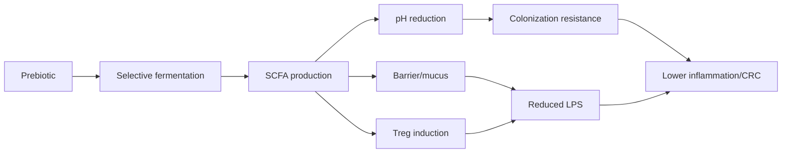

# From Microbes to Meals: Gut Microbiota, Probiotics, Prebiotics, and Pathobionts in Colorectal Health and Cancer

The gut microbiota is best understood not as a passenger but as a **metabolic organ** whose output determines whether the colon trends toward homeostasis or toward the inflammation-driven cascade that culminates in colorectal cancer (CRC). Roughly **38 trillion microbial cells across 500–1,000 species** colonize the human gut. This report profiles the dominant beneficial probiotic genera, the major prebiotic substrate classes, and the pro-carcinogenic pathobionts whose toxins—colibactin, fragilysin, FadA—rewire host epithelial signaling.

Despite the popular claim that any commercial probiotic broadly "boosts gut health," the strain- and disease-specific evidence shows benefit is **narrow, conditional, and frequently absent in healthy populations** (McFarland 2018; ISAPP 2024).

**The central verdict:** beneficial-microbe-favoring diets and fermentable-fiber prebiotics deliver the most robust colorectal protection; next-generation live biotherapeutics rank second; and avoidance of *pks⁺ E. coli*-, ETBF-, and *F. nucleatum*-promoting dietary patterns matters more than any single probiotic capsule.

---

# 1 Framework, Scope, and Methodology

This report holds beneficial and detrimental microbes on **one shared comparison grid** so their opposing mechanisms are legible side by side. The World Gastroenterology Organisation (WGO) 2023 guideline anchors the clinical definitions used throughout.

| Microbe | Type | Role | Key Metabolites / Factors | CRC Mechanism | Evidence |
|---|---|---|---|---|---|
| *Lactobacillus* spp. | Probiotic | Beneficial; lowers pH | Lactate, bacteriocins | Barrier support, NF-κB damping | RCT |
| *Bifidobacterium* spp. | Probiotic | Ferments fiber, primes immunity | Acetate, lactate | Acetate cross-feeds butyrate | Clinical |
| *S. boulardii* | Yeast probiotic | Antagonizes toxins | Proteases | Neutralizes *C. difficile* toxins | RCT |
| *S. thermophilus* | Probiotic | Aids lactose digestion | Lactate, folate | Reduces oxidative stress | Supportive |
| *Bacillus* spp. | Spore-former | Survives transit | Surfactin | Competitive exclusion | Emerging |
| *A. muciniphila* | Next-gen | Mucus regulator | Propionate, Amuc_1100 | Thickens mucus, barrier | Early trials |
| *F. prausnitzii* | Next-gen | Butyrate producer | Butyrate, MAM | Fuels colonocytes, anti-inflammatory | Preclinical |
| *F. nucleatum* | Pathobiont | Adheres to tumors | FadA, Fap2 | β-catenin, immune evasion | Observational |
| ETBF (*B. fragilis*) | Pathobiont | Toxin-driven colitis | Fragilysin (BFT) | E-cadherin cleavage, IL-17 | Systematic review |
| *pks⁺ E. coli* | Pathobiont | Genotoxic | Colibactin | DNA double-strand breaks | Mechanistic |
| *E. faecalis* | Pathobiont | Pro-proliferative | Biliverdin, superoxide | ROS genomic instability | Preclinical |
| *C. difficile* | Pathobiont | Toxigenic colitis | TcdA/TcdB | Tight-junction disruption | Clinical |
| *Salmonella* spp. | Pathobiont | Invasive | T3SS, AvrA | Sustains inflammation | Observational |

## 1.1 Scope and the Beneficial–Detrimental Axis

This report is bounded to the **human intestinal microbiome** and its mechanistic link to CRC, tracing the chain from microbe → metabolite → mucosa → dietary lever. **Excluded** are oncology drug regimens, non-intestinal microbiomes, surgical management, and generic calorie-based nutrition claims.

The organizing tension is that **the same niche hosts microbes with diametrically opposed effects.** Where *F. prausnitzii* fuels colonocytes with butyrate, *pks⁺ E. coli* in the identical lumen secretes colibactin that fractures host DNA. Dietary fiber feeds both beneficial fermenters and, under dysbiosis, can sustain pathobionts; the resolution lies in baseline community composition. **The report's central claim is that beneficial and detrimental outcomes are properties not of foods in isolation but of the microbe–substrate–host triad**.

## 1.2 Vocabulary and Evidence Rubric

Each claim is tagged by its highest available tier:

| Tier | Label | Weight |
|---|---|---|
| R-1 | Mechanistic / in-vitro | Low |
| R-2 | Animal-model | Moderate |
| R-3 | Observational human | Moderate–High |
| R-4 | Clinical-trial / guideline | High |

**Key definitions:** **Eubiosis** is a balanced, diverse community; **dysbiosis** its disruption (lost diversity, pathobiont bloom). A **probiotic** is a live microorganism conferring a health benefit in adequate amounts (FAO-WHO/ISAPP). A **prebiotic** is a selectively utilized substrate conferring benefit (ISAPP 2017)—distinct from fiber because not all fiber is selectively fermented. A **synbiotic** combines both; a **postbiotic** is a preparation of inanimate microbes. **SCFAs** are acetate, propionate, and butyrate. A **pathobiont** is a resident microbe harmful under permissive conditions; a **genotoxin** directly damages host DNA.

## 1.3 Translating Mechanism into Daily Choices

The operative dietary logic is simple: **feed the butyrate producers, starve the proteolytic pathobionts.**

| Daily lever | Mechanism | Target | Evidence |
|---|---|---|---|
| 25–35 g mixed fiber/day | SCFA fermentation, pH drop | *Bifidobacterium*, *F. prausnitzii* | Observational–Clinical |
| Fermented foods | Live probiotic delivery | *Lactobacillus*, *S. thermophilus* | Clinical |
| Inulin/FOS (onion, garlic, chicory) | Acetate cross-feeding | *Bifidobacterium* | Clinical |
| Limit red/processed meat | Cuts pathobiont fuel | Suppresses ETBF, *pks⁺ E. coli* | Observational |
| Polyphenol-rich plants | Emerging substrate | *Akkermansia* | Mechanistic–Animal |

**The single highest-yield action is reaching roughly 25–35 g of diverse fermentable fiber daily**, because selective fermentation lowers luminal pH, which suppresses acid-sensitive pathobionts and favors butyrate producers, reinforcing the epithelial barrier. A genuine tradeoff: rapidly fermented prebiotics can cause transient bloating, so the answer is **dose titration, not avoidance**.

---

# 2 Composition and Core Functions

The gut microbiota numbers ~10¹³–10¹⁴ cells, encoding roughly **150-fold more genes than the host genome**.

## 2.1 Compositional Architecture

A healthy adult colon is dominated by **Bacillota (Firmicutes) and Bacteroidota (Bacteroidetes)**, with Actinobacteriota, Pseudomonadota, and Verrucomicrobiota as minor members. The defining signature of health is not a fixed species list but **high alpha-diversity and functional redundancy**—multiple taxa performing the same metabolic job, the single most predictive marker of a resilient configuration. The luminal community is Bacteroidota-rich, while the mucosa-associated community is enriched for Bacillota and *Akkermansia muciniphila*, a spatial stratification reflecting a redox gradient from anaerobic lumen to oxygenated epithelium.

## 2.2 The Four Core Functions

**The community simultaneously defends territory, fuels the epithelium, educates immunity, and completes host metabolism—and removing any one function destabilizes the others.**

1. **Colonization resistance** — exclusion of pathogens through nutrient competition, niche occupancy, and bacteriocins, achieved jointly with host immunity.
2. **Barrier/mucus maintenance** — microbial colonization drives epithelial renewal and mucus secretion (§4).
3. **Immune modulation** — the renewed barrier conditions gut-associated lymphoid tissue to calibrate tolerance.
4. **Metabolism** — fermenting fiber into SCFAs and transforming primary bile acids into secondary acids (DCA, LCA). **Butyrate is the pivotal node**, fueling colonocytes and maintaining epithelial hypoxia.

## 2.3 Why the System Is Fragile

The same integration that makes the microbiota powerful makes it vulnerable. **The paradox—a redundant system that antibiotics, diet, and infection readily break—resolves through keystone dependence:** a few high-output taxa (notably the butyrate producer *F. prausnitzii*) carry disproportionate weight, so their loss collapses output despite nominal diversity elsewhere. Importantly, **diversity is a proxy, not the mechanism**—a community can be diverse yet functionally impoverished if it lacks SCFA producers.

| Function | Beneficial exemplar | Detrimental exemplar | Contrast |
|---|---|---|---|
| SCFA output | *F. prausnitzii* (butyrate) | *F. nucleatum* (FadA) | Fuel vs. β-catenin signaling |
| Barrier | *A. muciniphila* (mucus) | ETBF (BFT) | Renewal vs. E-cadherin cleavage |
| Genotoxicity | — | *pks⁺ E. coli* (colibactin) | DNA alkylation |
| Colonization resistance | Commensal consortium | *Salmonella*, *C. difficile* | Exclusion vs. inflammation blooms |

Beneficial functions rest on strong mechanistic and animal evidence; clinical-trial evidence for causal benefit remains strongest for established probiotic genera and weakest for next-generation candidates.

---

# 3 Colonization Resistance

Colonization resistance is the microbiota's primary protective service: a dense community that denies incoming pathogens the nutrients, space, and chemistry to establish.

## 3.1 The Ecological Architecture

**Competitive exclusion** is the most direct mechanism: commensals consume simple sugars and amino acids to near-exhaustion, starving incoming pathogens of substrates and capping replication below the threshold needed to breach the mucus. *Salmonella* and *Klebsiella* expand only when a perturbation frees a nutrient they can exploit. **Chemical antagonism** kills rather than starves: *Bacillus* spore-formers secrete bacteriocins and lipopeptides that lyse competitors.

**Cross-feeding** stabilizes the system: primary fiber degraders release oligosaccharides and lactate that butyrate producers consume. This drives an oxygen-gated chain central to resistance: **butyrate fuels colonocyte β-oxidation, which consumes epithelial oxygen and maintains luminal hypoxia, which suppresses facultative-anaerobe pathobionts like *Salmonella*** that require oxygen to bloom.

**Host immunity is co-architect.** Microbial signals tune secretory IgA, antimicrobial peptides, and gut-associated lymphoid tissue; colonization resistance is a joint output. Contrary to the framing that resistance is a fixed trait, it is **context-dependent**, varying with diet, environment, and host genotype.

## 3.2 Ecosystem Modifiers

Four modifiers dominate: **diversity** buffers against perturbation through functional redundancy; **diet** is the fastest lever, setting which cross-feeding chains persist; **antibiotics** are most destructive, depleting commensals, freeing niches, and raising luminal oxygen to permit *C. difficile* or *Klebsiella* blooms; **host genetics** sets the achievable diversity ceiling.

**The central therapeutic tradeoff:** antibiotics that clear a target infection simultaneously dismantle colonization resistance—the resolution is microbiota-remodeling adjuncts. By 2030, **phage-based precision tools** may achieve targeted pathogen removal that spares commensals where antibiotics would not.

| Mechanism | Actor | Output | Evidence |
|---|---|---|---|
| Niche exclusion | Fiber degraders | Pathogen starvation | Animal |
| Chemical antagonism | *Bacillus* | Bacteriocin lysis | Mechanistic |
| Cross-feeding hypoxia | Butyrate producers | Luminal O₂ depletion | Animal |
| Immune co-regulation | GALT + commensals | AMP/IgA priming | Observational |

---

# 4 The Mucosal Barrier

The intestinal barrier separates a microbial population of ~10¹³–10¹⁴ organisms from sterile host tissue, and its integrity depends on continuous microbial signaling.

## 4.1 The Two-Layer Mucus System

Colonic mucus, built from the glycoprotein MUC2, partitions into a **firmly adherent inner layer** (normally bacteria-free) and a **loose, colonized outer layer** whose glycans feed resident microbes. The inner layer's sterility is microbially tuned: germ-free mice show thinner, penetrable mucus that normalizes upon colonization. While *A. muciniphila* thins mucus locally by degrading MUC2 glycans, the net effect at moderate abundance is **stimulatory**—liberated oligosaccharides cross-feed butyrate producers whose SCFAs upregulate MUC2.

Beyond the gel, the GPI-anchored protein **Lypd8** coats flagellated bacteria and blocks their attachment; Lypd8-deficient mice show spontaneous bacterial-epithelial contact and heightened colitis susceptibility.

## 4.2 Microbial Tight-Junction Reinforcement

Commensal fermentation products, chiefly **butyrate, reinforce tight junctions** by upregulating claudin-1 and redistributing occludin and ZO-1. The pathway is multi-link: butyrate fuels colonocytes → drives oxygen consumption and hypoxia → stabilizes HIF-1α → promotes tight-junction and mucin gene expression. **Butyrate dominates junction effects while acetate and propionate act more on systemic metabolism**.

When microbial support fails, the barrier becomes permeable ("leaky gut"), permitting lipopolysaccharide translocation that ignites the mucosal inflammation tracing toward carcinogenesis. The structural tradeoff—permeable enough to absorb nutrients yet sealed enough to exclude microbes—resolves through **dynamic microbial tuning**, not maximal tightness.

## 4.3 Pathogen Subversion

*Salmonella* penetrates most efficiently when protective microbiota are depleted, establishing that **barrier breach is contingent on prior dysbiosis rather than virulence alone**. Barrier resilience also depends on commensal bile-salt handling; without it, raw primary bile acids injure the epithelium directly.

| Tier | Maintainer | Mechanism | Failure |
|---|---|---|---|
| Outer mucus | Butyrate producers, *Akkermansia* | MUC2 stimulation | Pathogen contact |
| Inner mucus | Commensals | Goblet stimulation | Penetrable gel |
| Lypd8 coat | Host (microbially induced) | Flagellin exclusion | Colitis |
| Tight junctions | Butyrate | HIF-1α/claudin | Leaky gut |
| Bile tolerance | Bile-metabolizing commensals | Detoxification | Epithelial injury |

---

# 5 Immune Modulation

The intestinal immune system must tolerate trillions of commensals while eliminating pathogens. **The microbiota functions as an instructional organ teaching the host to distinguish friend from foe**.

## 5.1 Microbial Instruction of Immune Cells

**Regulatory T cells (Tregs)** suppress inflammatory responses; their colonic population is directly expanded by commensal SCFAs. Butyrate inhibits histone deacetylase in naive T cells, de-repressing the Foxp3 locus to yield peripheral Tregs—**the clearest mechanistic bridge between a dietary substrate and an anti-inflammatory phenotype.** Tryptophan derivatives act in parallel through the aryl hydrocarbon receptor.

**Macrophage tone** is tuned toward a tolerogenic, tissue-repair phenotype by commensal signals; loss of this conditioning under dysbiosis shifts macrophages toward inflammation, feeding CRC pathways.

**Secretory IgA** maturation is driven by colonization, creating a feedback loop in which the community shapes the antibody that shapes the community. This is **why early-life microbial exposure has lifelong immune consequences**—a window not fully recapitulable in adulthood.

## 5.2 The Tolerance–Surveillance Tradeoff

Maximal tolerance risks pathobiont expansion; maximal surveillance risks chronic inflammation. The resolution: **a resilient microbiota holds the immune set-point in a tolerant-but-vigilant middle state**, and it is loss of resilience, not tolerance or surveillance alone, that tips toward disease. Contrary to the framing that a "strong" immune response is protective, an over-reactive mucosal tone is itself a disease driver—reframing therapeutic goals toward **immune calibration, not stimulation**.

| Arm | Signal | Failure under dysbiosis |
|---|---|---|
| Treg induction | Butyrate (HDAC); tryptophan–AhR | Lost tolerance |
| Macrophage tone | Commensal products; iron | Pro-inflammatory shift |
| Secretory IgA | Colonization-driven | Impaired containment |
| Pathobiont restraint | Resistance + mucus | *Salmonella* penetration |

---

# 6 Nutrient and Bile-Acid Metabolism

The microbiota completes digestion the host cannot perform alone.

## 6.1 Carbohydrate Salvage

Colonic bacteria ferment resistant starch and non-starch polysaccharides into acetate, propionate, and butyrate, with **butyrate supplying ~70% of the colonocyte's energy demand**. Butyrate oxidation consumes oxygen → epithelial hypoxia → HIF-1α stabilization → barrier and antimicrobial gene expression. A contrarian qualification: **not every transformation is benign**—proteolytic salvage of undigested protein yields both fuel and potentially toxic nitrogenous products, sitting "on a knife-edge between nutrition and toxicity".

## 6.2 Bile-Acid Transformation

The host secretes conjugated primary bile acids; microbial **bile-salt hydrolase (BSH)** (abundant in *Lactobacillus*, *Bifidobacterium*) deconjugates them, and a specialist guild led by ***Clostridium scindens* 7α-dehydroxylates** them into secondary bile acids (DCA, LCA).

This carries a genuine tradeoff. The protective reading: secondary bile acids sharpen colonization resistance, directly inhibiting *C. difficile* germination. Yet **the same DCA and LCA at elevated concentrations become genotoxic and pro-inflammatory CRC drivers**. **The constraint that resolves the paradox is concentration:** a diverse microbiota keeps secondary bile acids in the protective band, while dysbiotic over-production tips them into the carcinogenic range.

Critically, bile-acid transformation depends on a **narrow taxonomic guild rather than broad redundancy**—losing *C. scindens* has no easy backup, making this the more vulnerable node and the earlier marker of emerging dysbiosis.

| Axis | Substrate | Taxa | Products | Consequence |
|---|---|---|---|---|
| Carbohydrate salvage | Fiber, starch | *Bifidobacterium*, *Faecalibacterium* | SCFAs | Colonocyte fuel |
| Primary deconjugation | Conjugated bile acids | *Lactobacillus*, *Bifidobacterium* | Unconjugated acids | FXR signaling |
| Secondary formation | Unconjugated acids | *C. scindens* | DCA, LCA | Dose-dependent: resistance vs. genotoxicity |

---

# 7 Short-Chain Fatty Acids: The Unifying Bridge

SCFAs—principally **acetate, propionate, and butyrate**—are the chemical currency connecting diet to intestinal behavior, allowing diet and microbes to be discussed as one system.

## 7.1 The Diet–Microbe–SCFA Axis

SCFA production is an **ecological relay**, not a single organism's output. Primary degraders (*Bifidobacterium*) break fibers into acetate and lactate; secondary fermenters (*F. prausnitzii*, *Roseburia*) convert these into butyrate—**a cross-feeding chain making butyrate yield dependent on community structure**. This is why restoring butyrate after antibiotic disruption requires rebuilding a consortium, not reseeding a strain.

**Fiber type determines the acid:** inulin and FOS favor *Bifidobacterium*-driven acetate, whereas **resistant starch is the most reliably butyrogenic** substrate. The tension: the same fiber that maximizes butyrate in a well-colonized gut produces only gas in a depleted one, because the secondary-fermenter tier converting acetate to butyrate is missing.

## 7.2 Actions on Barrier and Immunity

Butyrate supplies ~70% of colonocyte energy; when colonocytes oxidize it, they consume oxygen, keeping the lumen anaerobic and suppressing Enterobacteriaceae. Butyrate also upregulates tight-junction proteins and stimulates goblet-cell MUC2 secretion.

Beyond the gut, **butyrate functions as a histone deacetylase inhibitor**, driving regulatory T-cell differentiation. By suppressing NF-κB signaling and promoting apoptosis of damaged colonocytes, it links the SCFA economy to anti-tumor mechanism. Where *pks⁺ E. coli* damages DNA and tilts the epithelium toward malignancy, **butyrate tilts it the opposite way**.

## 7.3 The Butyrate Paradox

Despite butyrate's portrayal as uniformly beneficial, its effects are context-dependent: in transformed cells with dysregulated energetics, it can accumulate and promote proliferation. **The paradox resolves through tissue context**—in a healthy epithelium butyrate fuels and protects; in an energy-dysregulated tumor it can act differently.

| SCFA | Producers | Substrate | Host action |
|---|---|---|---|
| Acetate | *Bifidobacterium* | Inulin, FOS | Cross-feeding; systemic energy |
| Propionate | *Bacteroides* | Fermentable fibers | Hepatic gluconeogenesis; satiety |
| Butyrate | *F. prausnitzii*, *Roseburia* | Resistant starch | Colonocyte fuel; barrier + Treg |

**The most therapeutically prized acid, butyrate, sits at the end of the longest cross-feeding chain**, which is why it is the first metabolite to fall when diversity collapses and the hardest to restore. Fecal butyrate is proposed as a rapid microbiome readout, though absorption confounds the stool measurement.

---

# 8 Dysbiosis: Definition and Hallmarks

**A narrow, operational definition—dysbiosis as a stable community state that functionally contributes to disease—is more useful than vague "imbalance" shorthand**.

## 8.1 The Three Cardinal Hallmarks

**Loss of diversity** is the most reproducible: contraction of taxonomic richness recurs across IBD, recurrent infection, and metabolic disease, eroding the functional redundancy that buffers perturbation.

**Bloom of pathobionts** is the second: dysbiosis features overgrowth of Proteobacteria (especially Enterobacteriaceae) at the expense of obligate anaerobes. Loss of butyrate producers raises luminal oxygen → favors facultative anaerobes → amplifies endotoxin and inflammation.

**Loss of beneficial function—chiefly SCFA output—is the most clinically actionable.** Depletion of *F. prausnitzii* shifts metabolic output, and fecal butyrate quantitation is now proposed as a rapid functional readout. By the late 2020s, **paired butyrate-and-deoxycholic-acid panels are positioned to move dysbiosis assessment from taxonomic description toward functional diagnosis.**

| Hallmark | What shifts | Marker | Method |
|---|---|---|---|
| Diversity loss | Richness falls | Low Shannon index | 16S/metagenomics |
| Pathobiont bloom | Proteobacteria expand | Enterobacteriaceae rise | 16S/metagenomics |
| Function loss | SCFA output falls | Low fecal butyrate | Metabolite assay |

## 8.2 Measurement and What Remains Unresolved

No universally validated dysbiosis index exists, because each encodes a different reference population, and **no single taxonomic configuration defines health**. The resolution is functional: **because healthy communities converge on core outputs like SCFA production despite varied membership, defining dysbiosis by lost function sidesteps the baseline problem.**

**Whether dysbiosis is cause or consequence is the field's deepest open question.** The apparent paradox—dysbiosis both precedes and follows inflammation—resolves through a **feed-forward loop**: an insult tips the community, resulting inflammation further favors pathobionts, and the cause-versus-consequence framing collapses into a self-reinforcing cycle that only functional restoration breaks.

---

# 9 From Dysbiosis to Inflammation

**Dysbiosis initiates inflammation through a three-stage causal chain: barrier degradation → translocation → immune dysregulation**, with each transition gated by a specific mechanism.

## 9.1 Stage One: Barrier Degradation

Dysbiosis degrades the mucus layer by **starving the mucus-feeding economy**: when SCFA producers decline, butyrate falls, goblet-cell mucin synthesis contracts, and mucus-foraging pathobionts thin the gel. Under substrate scarcity, the same mucolytic capacity that renews mucus in moderation instead erodes it net-negatively. **Restoring fermentable substrate is likely to remain the most tractable upstream lever against barrier erosion.** Weakened surface-exclusion systems (Lypd8) then allow direct bacterial contact.

## 9.2 Stage Two: Translocation

Once the buffer thins, luminal microbes, lipopolysaccharide, and antigens cross into the lamina propria. **The decisive contrast is colonization resistance intact versus lost:** a eubiotic community competitively excludes invaders, whereas a depleted one opens both a nutritional niche and a physical portal. Tight-junction tone is actively tuned by microbial metabolites and fails only when that signal collapses.

## 9.3 Stage Three: Immune Dysregulation

Translocated LPS and flagellin engage TLR4 and TLR5, activating **NF-κB to drive TNF-α, IL-6, and IL-1β, recruiting neutrophils**. SCFA depletion impairs Treg differentiation, tipping the balance toward Th17 cells. **This butyrate-to-Treg-to-Th17 axis is the mechanistic hinge on which the entire chain turns**.

**The self-amplifying loop:** inflammation-generated reactive species furnish electron acceptors like nitrate that favor Enterobacteriaceae, deepening the Proteobacteria bloom. This converts a linear chain into a vicious circle—**the same inflammatory tools that clear acute threats, chronically engaged, reward the very pathobionts driving the damage.**

| Stage | Mechanism | Mediator | Evidence |
|---|---|---|---|
| Barrier degradation | Mucus thinning + Lypd8 loss | SCFA decline | Strong (mechanistic) |
| Translocation | LPS/flagellin penetration | Endotoxin | Strong (animal) |
| Immune dysregulation | TLR–NF-κB; Treg/Th17 imbalance | TNF-α, IL-6 | Strong (animal) + human |
| Feedback | ROS/nitrate favoring Enterobacteriaceae | Electron acceptors | Moderate |

**Each stage is a candidate intervention point**, and the highest-value interventions are likely to target stage one nutritionally rather than stage three pharmacologically, arresting the loop before feedback takes hold. The chain earns a differentiated verdict: convincing mechanistically and in animals, correlative in humans, partially tested at the clinical-trial tier.

---

# 10 From Inflammation to Colorectal Cancer

**CRC arises from at least four distinct, partially overlapping microbial mechanisms: direct genotoxin-induced DNA damage, secondary bile-acid promotion, chronic oxidative stress, and immunosuppressive tumor-microenvironment remodeling—jointly converting reversible dysbiosis into fixed transformation.**

## 10.1 The Inflammation-to-Carcinoma Sequence

The histological ladder runs from normal mucosa → aberrant crypt foci → adenoma → carcinoma, with microbiota acting at every rung. The "driver–passenger" model holds that certain pathobionts initiate changes (drivers) and are later displaced by opportunists thriving in the altered niche (passengers). **The defining tradeoff is reversibility:** a dysbiotic, inflamed colon can return to eubiosis, but once genotoxic mutations fix, the process becomes irreversible. Inflammation is necessary but not sufficient—**a concurrent genotoxic "second hit" is the rate-limiting constraint**.

## 10.2 Genotoxin Exposure

**Colibactin**, the polyketide-peptide toxin from *pks⁺ E. coli*, cross-links DNA at adenine residues, producing double-strand breaks and a characteristic mutational signature (SBS88) detectable in a substantial fraction of human CRC genomes—marking it as etiologic, not merely correlative. The **B. fragilis toxin (BFT)** of ETBF acts indirectly, cleaving E-cadherin to liberate β-catenin, activating Wnt signaling and a Th17 cascade. **Colibactin is a covalent mutagen, BFT a signaling-and-inflammation mutagen**—which is why co-colonization is more oncogenic than either alone. Colibactin genotoxicity passes mechanistic and animal-model tiers decisively; eradication-based prevention remains untested.

## 10.3 Altered Bile-Acid Metabolism

Under high-fat diets, microbial 7α-dehydroxylation generates excess **DCA and LCA that act as tumor promoters** via membrane oxidative damage and sustained NF-κB. The commensal community normally buffers this exposure, so dysbiosis removes a brake. **The contrarian nuance:** bile acids are not uniformly carcinogenic—at physiologic concentrations they are essential FXR/TGR5 ligands maintaining barrier integrity, and only dysbiosis-driven excess tips them into promotion. This **dose-dependence distinguishes the bile-acid route from the colibactin route**, where no protective low-dose regime exists.

## 10.4 Oxidative Stress and Immunosuppression

Pathobiont expansion activates immune cells releasing reactive species that damage DNA and degrade the barrier, in a self-reinforcing loop. Inflammatory iron reprogramming both fuels Fenton-reaction damage and feeds iron-scavenging pathobionts. Whereas the bile-acid route is diet-gated, **the oxidative loop is self-perpetuating once initiated**, making early interruption more valuable.

***F. nucleatum* remodels the tumor microenvironment into an immunosuppressive state.** Its Fap2 adhesin binds the inhibitory TIGIT receptor on NK and T cells, suppressing cytotoxic activity. **The paradox—a microbe strongly associated with CRC yet not a tumor initiator—resolves through temporal sequencing:** *F. nucleatum* is a late-stage progression factor enriching in established tumors, protecting already-transformed clones rather than initiating them. *E. faecalis* contributes convergently via biliverdin.

| Mechanism | Driver | Action | Reversibility |
|---|---|---|---|
| Genotoxin | Colibactin, BFT | DNA cross-links; E-cadherin cleavage | Irreversible once fixed |
| Bile acids | DCA, LCA | Oxidative damage; NF-κB | Diet-reversible at low dose |
| Oxidative loop | ROS/RNS, iron | Self-amplifying DNA damage | Reversible if interrupted early |
| Immunosuppression | *F. nucleatum*, *E. faecalis* | TIGIT binding; immune evasion | Late-stage, entrenched |

## 10.5 Convergence

**These four routes establish CRC as a microbially multi-hit disease in which no single taxon is necessary but their functional combination is sufficient—which is precisely why single-organism eradication has underperformed relative to community restoration**. The distinction between reversible (oxidative, bile-acid) and irreversible (genotoxic, late-TME) steps is the most decision-relevant variable, making **early microbiota restoration the highest-leverage intervention point.** Blocking any single route may interrupt convergence before it fixes—the mechanistic justification for the fiber-forward dietary pattern.

---

# 11 Probiotics: Definitions and Roster

A probiotic qualifies only when it is **viable, dosed, and backed by strain-specific evidence—genus-level generalization is scientifically impermissible**. The adequate-dose threshold is typically 10⁸–10¹¹ CFU/day, though strain-dependent. **Strain-specific gene content, not species identity, determines adhesion, bacteriocin production, and immunomodulation**; efficacy data from *L. rhamnosus* GG cannot be extrapolated to an unrelated *L. rhamnosus* isolate.

| Genus / species | Type | Strain | Core function |
|---|---|---|---|
| *Lactobacillus* spp. | LAB | *L. rhamnosus* GG | Lactate, adhesion, barrier |
| *Bifidobacterium* spp. | LAB | *B. longum* | Acetate cross-feeding |
| *S. boulardii* | Yeast | CNCM I-745 | Antibiotic-resistant; anti-toxin |
| *S. thermophilus* | LAB | — | Lactose hydrolysis |
| *Bacillus* spp. | Spore | *B. coagulans* | Shelf-stable delivery |
| *A. muciniphila* | Next-gen | MucT | Mucus reinforcement |
| *F. prausnitzii* | Next-gen | A2-165 | Butyrate, anti-inflammatory |

The four tiers diverge sharply: *Lactobacillus*, *Bifidobacterium*, and *S. boulardii* satisfy the clinical-trial criterion with named RCT support; ***A. muciniphila* and *F. prausnitzii* currently pass only mechanistic and animal tiers**, with observational evidence emerging. **By 2030, these two are the likeliest to graduate into clinical endorsement, conditional on resolving strict-anaerobe manufacturing constraints.**

---

# 12 Lactobacillus

*Lactobacillus* is the archetypal probiotic genus: Gram-positive, facultatively anaerobic, lactic-acid-producing rods. The clinical literature is **strain-resolved, not genus-resolved**. The most validated strain is **L. rhamnosus GG, carrying level-1 evidence for shortening acute infectious diarrhea and preventing antibiotic-associated diarrhea**.

Unlike obligate-anaerobe *Bifidobacterium*, *Lactobacillus* tolerates oxygen and acid, predominating proximally and in fermented foods. It reinforces **colonization resistance** through a multi-link chain: lactate and bacteriocin secretion lower luminal pH and antagonize pathobionts, depleting nutrient and adhesion niches, raising the inoculum threshold a pathogen must exceed. Certain *L. reuteri* and *L. rhamnosus* strains expand regulatory T cells and condition dendritic cells toward tolerogenic phenotypes.

**The honest contrarian reading:** no *Lactobacillus* strain has level-1 RCT evidence for preventing CRC in humans; the anti-CRC claim rests on mechanistic and animal evidence with confounded observational data. The genus's strength—extreme strain-level specificity—is its weakness: benefit is real where the exact strain has been trialed for the exact condition, and absent otherwise. **The practical rule: match a documented strain to a documented indication.** Dietary sources include yogurt, kefir, sauerkraut, kimchi, and aged cheeses.

---

# 13 Bifidobacterium

*Bifidobacterium* dominates the infant gut and is the **single most consistently depleted beneficial genus across dysbiosis, IBD, and CRC cohorts**. Its defining feature is the "bifid shunt," yielding acetate and lactate at a characteristic 3:2 ratio.

**Its key contribution is high-flux acetate output**, which acidifies the proximal colon and serves as substrate for downstream butyrate producers. The mechanism is multi-step: bifidobacterial fermentation releases acetate → taken up by butyrogenic Firmicutes (*F. prausnitzii*) → produces butyrate that fuels colonocytes. **The paradox—a genus celebrated for butyrate effects that makes almost none—resolves through the division of metabolic labor:** *Bifidobacterium* supplies the acetate precursor and acidification, while specialist Firmicutes complete the conversion.

*B. longum*, *B. breve*, and *B. infantis* promote Treg expansion and secretory IgA. Bifidobacterial acetate and lactate lower luminal pH, suppressing *pks⁺ E. coli* and ETBF. **A contrarian caveat:** despite the claim that any *Bifidobacterium* supplement boosts butyrate, the effect is strictly strain- and substrate-dependent.

**The genus's therapeutic value is conditional, not intrinsic: it delivers only when paired with fermentable prebiotics**—which is why synbiotic logic treats it as one half of a feeding relationship. Bifidobacterial abundance is modifiable through inulin, FOS, GOS, and human milk.

---

# 14 Saccharomyces boulardii

*S. boulardii* is the most widely deployed **non-bacterial probiotic**—a yeast, not a bacterium. Because it is eukaryotic, it is **intrinsically resistant to antibacterial antibiotics**, so it can be co-administered during antibiotic therapy without being killed. The WGO assigns it some of the **strongest evidence grades of any probiotic** for antibiotic-associated diarrhea and *C. difficile* recurrence.

Its benefit is a **transient, pharmacological effect rather than a durable ecological one**: it produces no meaningful SCFA and washes out within days. It secretes a **54-kDa serine protease that cleaves C. difficile toxins A and B**, reducing toxin binding and preserving barrier integrity. It also traps *Salmonella* and *E. coli* on mannose residues, achieving colonization resistance by decoy.

**The central tension:** a probiotic with guideline-grade backing for diarrhea has almost no direct CRC evidence. This **resolves through mechanism-to-endpoint distance**—the outcome it prevents (acute toxin-driven diarrhea) is proximate to its mechanism, whereas carcinogenesis unfolds over years. Its place is as an **antibiotic-resistant firebreak** during the exact window when bacterial probiotics are vulnerable to the patient's antibiotics—best positioned for inclusion in hospital antibiotic bundles.

---

# 15 Streptococcus thermophilus

*S. thermophilus* is a thermophilic lactic-acid bacterium functioning as a **fermentation starter rather than a colonizer**. The WGO recognizes it, co-administered with *L. bulgaricus*, for improving lactose digestion.

**Its signature contribution is delivering bacterial lactase (β-galactosidase) to the small intestine**, where the enzyme survives long enough to hydrolyze dietary lactose. This is the most robustly supported claim for any probiotic under European regulation. As a homofermentative species it produces L-lactate rather than SCFAs, but **the lactate serves as substrate for butyrate-producing commensals**, making it an indirect upstream contributor.

A mechanistic finding: its β-galactosidase functions as a tumor suppressor by depleting NADP and restraining oncogenic metabolic reprogramming. However, **clinical-trial evidence passes only for lactose digestion, not CRC prevention**. The colonization paradox—an organism that barely colonizes the colon credited with colonic benefits—**resolves because it delivers value as a biochemical payload vehicle: its enzymes and lactate act during transit and feed resident butyrate producers**, so benefit is intake-dependent and vanishes when fermented dairy stops. Traditional live-culture yogurt supplies 10⁸–10⁹ CFU/g.

---

# 16 Bacillus Spore-Forming Probiotics

*Bacillus* probiotics are defined by the **endospore: a dormant, heat- and acid-resistant cell form that survives gastric transit** where vegetative LAB perish. Commercial taxa include *B. subtilis*, *B. coagulans*, *Alkalihalobacillus clausii*, and *B. licheniformis*.

**The central mechanism is not colonization but transient passage:** germinated cells secrete bioactive metabolites then are excreted. *Bacillus* produces antimicrobial lipopeptides (surfactin, fengycin, iturin) and bacteriocins that antagonize enteric pathogens through **competitive exclusion and quorum-sensing disruption**. *B. coagulans* GBI-30 carries the strongest human trial file.

***A. clausii*** is the most clinically characterized, with antibiotic resistance allowing co-administration. **This is simultaneously its asset and chief safety concern:** the same resistance genes raise theoretical horizontal-transfer risk. The resolution is **strain-level genomic screening**—strains with chromosomal, non-transmissible resistance clear the bar; those with mobile elements are excluded.

On CRC, the signal is **indirect**: lipopeptide secretion suppresses colibactin-producing *E. coli*, lowering genotoxic burden. **The translational advance by 2030 is likely strain-engineered *Bacillus* delivering defined anti-pathogen lipopeptides as standardized postbiotic payloads.** Dietary sources include fermented soy (nattō)—**the only probiotic class practical for shelf-stable foods.**

---

# 17 Akkermansia muciniphila (Next-Generation)

*A. muciniphila* is a mucin-degrading commensal whose defining paradox anchors this profile: **a bacterium whose core activity is eating the host's protective mucus nonetheless strengthens the epithelial barrier.** It is the archetypal "next-generation probiotic," identified through microbiome analysis, and its depletion is a reproducible signature of dysbiosis.

**The paradox resolves through turnover, not destruction:** mucin foraging liberates oligosaccharides and generates acetate/propionate that feed butyrate producers; this SCFA flux signals goblet cells to upregulate mucin, yielding a net thicker mucus layer. Its outer-membrane protein **Amuc_1100 engages TLR2, tightening junctions and reducing LPS translocation**, dampening the low-grade inflammation of metabolic syndrome.

Remarkably, **pasteurized *A. muciniphila* retains—and sometimes exceeds—the metabolic benefit of the live organism**, circumventing the viability barrier that strict anaerobes face. In CRC it limits translocation, raises butyrate, enhances CD8⁺ T-cell infiltration, and improves checkpoint-blockade response. 

**The evidence verdict is asymmetric:** mechanistic and animal evidence are strong, observational human evidence consistent (depletion in obesity, diabetes, IBD, CRC), but clinical-trial evidence remains the weak link—no WGO recommendation yet. **A contrarian caution:** excessive mucin degradation under fiber-starved conditions could thin the barrier. **The operational lesson: *A. muciniphila* is best cultivated indirectly—through polyphenols and fermentable fiber—rather than swallowed.**

---

# 18 Faecalibacterium prausnitzii (Next-Generation)

*F. prausnitzii* is the **most abundant butyrate-producing commensal**, typically 5–15% of the healthy fecal microbiota, and its depletion is among the most reproducible signatures of intestinal disease. An **obligate anaerobe so oxygen-sensitive it dies within minutes of air exposure**, it has historically been impossible to formulate as a conventional supplement.

**Its defining metabolite is butyrate, supplying ~70% of colonocyte fuel**. The anti-inflammatory chain: it ferments fiber and cross-feeds on *Bifidobacterium*-derived acetate → high butyrate → colonocyte oxidation deepens hypoxia → suppresses NF-κB and induces Tregs. It additionally secretes a **15-kDa Microbial Anti-inflammatory Molecule (MAM)** that independently blocks NF-κB.

Mechanistic and animal evidence are strong; observational evidence tying depletion to Crohn's and CRC is consistent; **clinical-trial evidence for a live therapeutic remains absent**. The translational tension: **the very oxygen sensitivity making it an effective surface colonizer blocks its manufacture as a capsule.** The field pursues two workarounds—**postbiotic MAM peptide/butyrate precursors, and fiber-based prebiotics** coaxing the residual population to rebound.

It cannot be obtained from food; **abundance is governed almost entirely by fermentable fiber intake**—inulin, resistant starch, and pectin reliably drive blooms. A growing view holds its loss is **itself a driver, not merely a biomarker**, because supplementing its metabolites reverses colitis even where the organism is never reintroduced. Its most probable near-term deployment is as a **synbiotic target** within a butyrogenic consortium.

---

# 19 Probiotic Anti-Inflammatory and Anti-CRC Mechanisms

Probiotic benefit resolves into four convergent axes: **barrier reinforcement, immune recalibration, colonization resistance, and metabolite output. Probiotic protection is mechanistically real but strain- and tier-stratified—strongest on mechanistic and animal evidence, weakest on clinical CRC endpoints.**

## 19.1 Barrier and Colonization-Resistance Routes

**Competitive exclusion** is the oldest, best-validated action: *Lactobacillus* and *Bifidobacterium* occupy adhesion sites and deplete nutrients, denying *Salmonella* and *C. difficile* a foothold. The **spore-forming *Bacillus* route** achieves the same by germinating and secreting antimicrobial peptides, surviving gastric transit where LAB degrade. **Barrier tightening** follows: probiotic SCFA output feeds colonocytes → tighter junctions → reduced LPS translocation → blunted NF-κB.

## 19.2 Immune and Anti-Tumor Routes

**Treg induction** is the central immune effect: probiotic butyrate engages GPR43/GPR109A, inhibits HDAC, promotes FoxP3⁺ Treg expansion, and releases IL-10. **Genotoxin suppression** is where next-generation candidates excel: *A. muciniphila* and *F. prausnitzii* restore mucus and butyrate, limiting access of *pks⁺ E. coli*; a butyrate-replete mucosa maintains apoptosis of damaged cells. **Bile-acid protection** limits accumulation of tumor-promoting DCA and LCA.

| Taxon | Dominant mechanism | Anti-CRC link | Evidence |
|---|---|---|---|
| *Lactobacillus* | Exclusion + barrier | Indirect | Clinical (diarrhea) |
| *Bifidobacterium* | Barrier + cross-feeding | Indirect (butyrate) | Observational+animal |
| *S. boulardii* | Toxin neutralization | Indirect | Clinical (CDI) |
| *Bacillus* | Exclusion + AMPs | Indirect | Animal+mechanistic |
| *A. muciniphila* | Mucus restoration | Direct (barrier) | Animal+early human |
| *F. prausnitzii* | Butyrate supply | Direct (anti-proliferative) | Observational+animal |

**Classic LAB and spore probiotics act chiefly by exclusion and toxin handling—indirect anti-CRC—while next-generation mucosal specialists act directly on the barrier and proliferative tone that govern carcinogenesis.**

**The genuine tension:** mechanistic data show robust anti-tumor effects, yet randomized human CRC-prevention trials remain scarce. The resolution: **strain, dose, and host baseline govern whether the mechanism fires**—genus-level generalization overstates what any single strain delivers. Probiotic benefit is **function-defined, not name-defined**: two strains of one species may differ more than two species sharing a metabolic guild.

---

# 20 Strain Specificity, Dose, Viability, and Synbiotics

**Probiotic efficacy is strain-specific, dose-dependent, viability-contingent, and substrate-modulated**.

## 20.1 Strain-Level Determinism

The McFarland review found efficacy both **strain-specific and disease-specific**: a strain effective for antibiotic-associated diarrhea showed no guaranteed transfer to IBS. Only a minority of marketed strains pass the clinical-trial bar—the WGO grades by specific strain and indication. **By the late 2020s, genus-level supplement claims are likely to become commercially untenable in regulated markets.**

## 20.2 Dose and Viability

Most regimens cluster at 10⁹–10¹¹ CFU/day, but the dose-response is indication-specific, not "more is better". **The labeled CFU describes the dose at manufacture, not the viable dose delivered**—viability decays across shelf life, gastric acid, and bile. *Bacillus* spores hold an advantage: they transit with minimal loss. The field is shifting toward **"potency at end of shelf life" labeling**.

## 20.3 Synbiotic Design

ISAPP distinguishes **complementary synbiotics** (probiotic and prebiotic act independently) from **synergistic synbiotics** (the substrate is selectively utilized by the co-administered strain). A synergistic pairing requires matching a strain to a substrate it can ferment—co-delivering inulin with a matching *Bifidobacterium* raises local SCFAs and reinforces colonization resistance.

**A contrarian qualifier:** across trials, treatment efficacy is predicted by **the recipient's baseline microbiome, not the dose alone**—the same synbiotic can succeed in one host and fail in another. The resolution is **baseline-stratified matching**.

| Class | Strain resolution | Delivery | Strongest tier |
|---|---|---|---|
| *Lactobacillus* | Hundreds of strains | Acid-sensitive | Clinical (select strains) |
| *Bifidobacterium* | Multi-strain, synergy documented | Microencapsulation | Clinical + synbiotic |
| *S. boulardii* | Single dominant strain | Acid-tolerant | Clinical/guideline |
| *Bacillus* | Strain-defined, screened | Heat/acid robust | Mechanistic + trial |
| *A. muciniphila*/*F. prausnitzii* | Genome-defined | Oxygen-sensitive | Mechanistic + animal |

**Probiotic benefit is conditional, not categorical—the joint product of a named strain, verified viable dose, matched substrate, and permissive host baseline; failure of any one term collapses the effect.** For generally healthy adults, **a fiber-rich pattern feeding the resident community may deliver more reliable benefit than a single supplemented strain**.

---

# 21 Prebiotics: Definition and the Substrate–Organism Divide

A prebiotic is **a substrate selectively utilized by host microorganisms conferring a health benefit** (ISAPP 2017). Three criteria must hold: it must (1) resist host digestion, (2) be *selectively* utilized by a restricted set of beneficial taxa, and (3) yield a documented benefit, typically via SCFAs. **Selectivity, not fiber status, is the discriminating test—dietary fiber and prebiotic are not synonyms.**

**The cleanest distinction:** a probiotic is a live organism; a prebiotic is the food that organism eats. The four 'biotic' terms form a single causal pipeline: a **prebiotic** feeds commensals → ferment it into SCFAs → which act as **postbiotic**-like effectors; a **synbiotic** unites prebiotic and probiotic.

**Most dietary fiber fails the selectivity test.** Cellulose is fermented slowly and non-selectively and does not qualify. The paradox—a fiber can boost SCFAs yet fail prebiotic status—**resolves once selectivity, not SCFA yield, is recognized as the gatekeeper:** a broadly fermented fiber feeds the whole community including pathobionts, whereas a prebiotic directs benefit toward beneficial taxa specifically. What remains unresolved is the regulatory boundary for **polyphenols**, whose benefits are real but whose selectivity is harder to demonstrate.

---

# 22 Inulin and Fructo-Oligosaccharides (FOS)

Inulin and FOS are the most extensively characterized prebiotics, both **fructans**: fructose chains terminated by glucose, linked by β(2→1) bonds human enzymes cannot cleave. **Chain length is the load-bearing variable.**

**Inulin** is a long-chain fructan (degree of polymerization 2–60, mean ~10–12), abundant in chicory root, Jerusalem artichoke, garlic, onion, and banana. Its longer chains ferment slowly, **reaching the distal colon—the principal site of tumorigenesis**. The WGO names inulin-type fructans among the best-substantiated prebiotics for bifidogenic effect.

**FOS** is the short-chain member (DP 2–10), **fermenting rapidly and proximally**—a fast bifidogenic bloom but more proximally-confined SCFA yield. A genuine tradeoff: rapid fermentation generates gas abruptly, so the resolution is dose titration and blending with longer-chain inulin.

**The shared mechanism:** fermentation by *Bifidobacterium* and *F. prausnitzii* produces SCFAs → acidifies the lumen and nourishes colonocytes → suppresses acid-sensitive pathobionts and stabilizes the hypoxic mucosa. **Where *pks⁺ E. coli* damages DNA via colibactin, inulin-fed butyrate producers push the opposite direction**, favoring apoptosis of damaged cells.

| Feature | Inulin | FOS |
|---|---|---|
| Chain length | DP ~2–60 | DP ~2–10 |
| Fermentation site | Proximal to distal | Predominantly proximal |
| Anti-CRC mechanism | Distal butyrate → HDAC inhibition | Bifidogenic bloom → resistance |
| Sources | Chicory, artichoke, garlic | Allium, infant formula |
| Evidence | Guideline-endorsed; surrogate CRC | Guideline-endorsed; tolerability-limited |

Individuals already depleted in *Bifidobacterium* and *F. prausnitzii* may respond weakly to inulin alone—the rationale for synbiotic co-delivery. The open question: whether distal-colon butyrate translates into measurable CRC-incidence reduction, as opposed to surrogate-marker improvements.

---

# 23 Galacto-Oligosaccharides (GOS)

GOS are non-digestible carbohydrates built from galactose terminating in glucose, produced by transgalactosylation of lactose. **The structural mimicry of human milk oligosaccharides most differentiates GOS from fructans**, explaining its prominence in infant nutrition. Infant-associated bifidobacteria carry dedicated galactoside transporters that *Lactobacillus* cannot match.

GOS achieves bifidobacterial enrichment at **shorter chain lengths than inulin, giving a faster proximal-colon profile**. Although fermentation yields predominantly acetate and lactate rather than butyrate directly, these are **cross-fed to butyrate producers** (*F. prausnitzii*), establishing the chain: GOS → acetate/lactate → colonocyte butyrate → HIF-1α barrier integrity.

The WGO recognizes GOS among established prebiotics. **The tension:** robust mechanistic signals yet thinner direct-outcome trial data. This **resolves because its pathway is shared with butyrate biology already validated in CRC contexts**. A practical advantage: **GOS is generally better tolerated than inulin/FOS at comparable doses**, owing to gentler fermentation kinetics—making it preferred for sensitive populations and infant formula.

---

# 24 Resistant Starch

Resistant starch escapes small-intestinal digestion and reaches the colon intact. Unlike oligosaccharide prebiotics, it is a glucose polymer whose **resistance arises from physical or structural inaccessibility**.

**Five structural classes target different colonic regions:** RS1 (entrapped in cell walls), RS2 (crystalline native granules, raw potato/green banana), RS3 (retrograded, formed when cooked starch cools), RS4 (chemically modified), RS5 (amylose-lipid). **RS2 and RS3 ferment slowly enough to reach the distal colon—where CRC most frequently arises**. Whereas inulin is consumed proximally, retrograded RS3 delivers fermentable carbon to the left colon and rectum.

***Ruminococcus bromii*** is the keystone degrader, liberating oligosaccharides that cross-feed *F. prausnitzii* and *E. rectale*; this trophic chain makes **resistant starch among the most reliably butyrogenic of all fibers**. RS3-derived butyrate acts as an HDAC inhibitor, arresting transformed colonocytes.

**A key tension:** powerful preclinical anti-tumor mechanisms yet a failed primary CRC endpoint in the only large trial (CAPP2). **The resolution lies in dose and duration:** ~30 g/day for two years was likely insufficient against a decades-long process, and a protective signal emerged only on extended follow-up. **The everyday relevance:** RS content is cooking-dependent—**chilling cooked starchy foods converts digestible starch into RS3, so the same potato delivers more substrate cold than hot**.

---

# 25 Pectin, Beta-Glucans, and Other Fermentable Fibers

**Pectin** is a galacturonic-acid-rich soluble fiber abundant in apples and citrus. **Pectin fermentation preferentially enriches *Bacteroides* and *F. prausnitzii*, generating an acetate- and propionate-skewed pool** rather than the butyrate-dominant output of resistant starch. Where resistant starch drives butyrogenic cross-feeding, **pectin routes carbon toward propiogenic *Bacteroides* fermentation**.

**Beta-glucans** are linear glucose polymers concentrated in oat and barley. **Cereal beta-glucan's high viscosity is inseparable from its benefit: the gel slows nutrient absorption while delivering fermentable substrate distally.** The tension—viscosity blunts fermentation rate relative to FOS—**resolves because slow distal fermentation shifts SCFA production toward where tumors arise**. By contrast, yeast-derived β-(1,3)/(1,6) beta-glucan acts as a Dectin-1 immunomodulator. **Cereal beta-glucan uniquely clears the clinical-trial bar** among these fibers, owing to recognized cholesterol claims.

**Not all fermentable fiber is a qualifying prebiotic; selectivity, not fermentability, is the gatekeeper**. Arabinoxylan, guar gum, and mixed fibers find clearest expression in synbiotic formulations.

| Fiber | SCFA / metabolite | Mechanism | Evidence |
|---|---|---|---|
| Pectin | Acetate, propionate | *Bacteroides* propiogenesis | Strong preclinical, fewer RCTs |
| Cereal beta-glucan | Distal butyrate | Viscosity + distal fermentation | Guideline-recognized |
| Yeast beta-glucan | Dectin-1 (non-SCFA) | Innate immune priming | Immune-trial data |
| Mixed fibers | Mixed SCFA | Synbiotic co-delivery | Meta-analysis-supported |

**Fiber chemistry is a tunable determinant of colonic SCFA geography**, positioning pectin and beta-glucans as complementary rather than interchangeable substrates.

---

# 26 Polyphenols and Emerging Substrates

Polyphenols—flavonoids, phenolic acids, stilbenes, tannins from berries, tea, cocoa, olive oil—sit at the **contested frontier of the prebiotic definition**. ISAPP listed them as *candidate* substances; their qualification remains provisional.

The tension: polyphenols demonstrably shift microbiota composition, yet qualifying demands *selective* utilization plus demonstrated benefit. **The resolution: most polyphenol evidence shows community-wide rather than selective effects, and the bioactive agents are frequently microbial metabolites of the parent compound—placing them closer to postbiotic logic**. Only 5–10% of dietary polyphenols are absorbed; the bulk undergoes colonic transformation, reframing them as **microbiome-activated prodrugs**.

Mechanistically: unabsorbed polyphenols → bacterial cleavage → low-molecular-weight phenolics that suppress *Clostridium* and *Enterococcus* while enriching SCFA-producers. **Green-tea catechins and ellagitannins elevate *A. muciniphila***. In CRC, **urolithin A (a microbial metabolite of ellagitannins) drives mitophagy and attenuates NF-κB**—a distinct, complementary anti-tumor route to butyrate's HDAC inhibition.

Polyphenols pass mechanistic and animal tiers but deliver only partial human evidence and remain short of the clinical-trial threshold. **Polyphenols function less as a classical prebiotic substrate than as a microbiota-activated precursor system**, bridging fiber substrates and postbiotic mechanisms.

---

# 27 Prebiotic Mechanism: The Four-Stage Cascade

The prebiotic effect resolves into a single ordered cascade:

**1. Selective fermentation.** A prebiotic is metabolized by a restricted set of beneficial taxa—inulin and GOS by *Bifidobacterium* and *Lactobacillus* whose fructanase and β-galactosidase the wider community lacks. **The structural determinant is glycosidic linkage and degree of polymerization.**

**2. SCFA production and pH reduction.** Fermentation yields SCFAs and lowers luminal pH, suppressing acid-sensitive pathobionts (Enterobacteriaceae) while favoring acid-tolerant commensals. **Butyrate carries the dominant signal**, keeping the epithelial surface hypoxic and disfavoring facultative-anaerobe blooms.

**3. Barrier and mucus reinforcement.** Butyrate upregulates tight-junction proteins and stimulates goblet-cell mucin, thickening the inner mucus and reducing LPS translocation. The central tension—excessive fermentation generates gas—resolves through **graduated dosing and chain-length selection**.

**4. Immune modulation.** Butyrate engages GPR43/GPR109A and inhibits HDAC, promoting colonic Tregs, raising IL-10, and dampening NF-κB. For CRC: butyrate promotes apoptosis of transformed colonocytes while the dampened inflammatory field reduces mutagenic pressure.

**The prebiotic effect is a chemistry-first intervention: it reshapes luminal environment, and the barrier, immune, and anti-tumor benefits follow as downstream consequences.**

---

# 28 The Pathobiont Roster

The harmful arm is a **heterogeneous set whose capacity to drive CRC depends on context, dose, and the collapse of colonization resistance**. A **pathobiont** turns harmful only when community structure shifts; a frank pathogen (*Salmonella*) causes disease even in eubiosis.

**The unifying theme: pathogenicity is conditional, not categorical—most coexist harmlessly until dysbiosis removes the ecological brakes.** Three convergent hubs recur:

1. **Genotoxicity** — *pks⁺ E. coli* assembles colibactin via a nonribosomal peptide synthetase cluster → DNA crosslinks → mutational signature. ETBF's fragilysin cleaves E-cadherin rather than damaging DNA.
2. **Sustained inflammation** — *E. faecalis* biliverdin promotes CRC. **The tension—a commensal harmless in one host, tumor-promoting in another—resolves through strain-level and metabolic context:** virulence is encoded at the strain level and activated by surrounding dysbiosis.
3. **Barrier erosion** — *F. nucleatum* adheres via FadA and recruits suppressor cells.

| Agent | Class | Virulence factor | Dominant mechanism |
|---|---|---|---|
| *F. nucleatum* | Pathobiont | FadA, Fap2 | Barrier adhesion + immune evasion |
| ETBF | Pathobiont | Fragilysin (BFT) | E-cadherin cleavage, IL-17 |
| *pks⁺ E. coli* | Pathobiont | Colibactin | Direct DNA crosslinking |
| *E. faecalis* | Pathobiont | Biliverdin, ROS | Oxidative + metabolite-driven |
| *C. difficile* | Pathogen | TcdA/TcdB | Acute toxin colitis |
| *Salmonella* spp. | Pathogen | T3SS effectors | Invasion-driven inflammation |

**CRC-promoting activity is mechanistically plural—no single toxin defines the threat—which is why countermeasures must target the ecological conditions licensing these agents rather than any one organism**. The genotoxic and toxin mechanisms rest on strong mechanistic and animal evidence; **causation in humans is best graded as probable rather than proven** for most agents. The unresolved question is directionality—whether the pathobiont initiates the tumor or exploits an altered microenvironment as a passenger.

---

# 29 Fusobacterium nucleatum

*F. nucleatum* is a Gram-negative anaerobic oral commensal behaving as a pathobiont once it translocates to the colon, where its enrichment is **among the most reproducible CRC signatures across continents**. Unlike *pks⁺ E. coli*, it operates not through direct DNA mutation but through **adhesion, immune subversion, and a pro-tumor microenvironment.**

## 29.1 FadA Adhesion and Fap2 Tropism

The defining step is oral-to-gut translocation. **The load-bearing factor is FadA, which binds host E-cadherin and triggers β-catenin signaling:** FadA engagement releases β-catenin → activates Wnt transcription of cyclin D1 and Myc → drives proliferation. A second adhesin, **Fap2, binds the tumor-displayed sugar Gal-GalNAc**, concentrating the organism at lesions. By the later 2020s, *F. nucleatum* load is likely to enter CRC screening panels.

## 29.2 Immune Subversion

The second arm is active suppression of antitumor immunity. **Fap2 binds the inhibitory receptor TIGIT on NK and cytotoxic T cells, shutting down their tumor-killing activity**. It also recruits tumor-associated macrophages and activates TLR4–NF-κB. **The paradox—a microbe that both inflames tissue and blunts the immune response—resolves as complementary arms:** TLR4-driven inflammation feeds proliferation while Fap2–TIGIT removes the cytotoxic brake. It additionally activates autophagy that protects tumor cells from oxaliplatin and 5-FU.

## 29.3 Strain Heterogeneity

The single most important 2026 caveat: **"F. nucleatum" is not one organism but a cluster of genomically distinct subspecies with sharply different disease associations.** The CRC signal tracks specifically to **F. nucleatum subsp. animalis**, not the type strain. **Strain-level designation, not genus-level overgeneralization, is now the minimum standard.** A contrarian reading cautions some associations may be passenger rather than driver.

The pro-carcinogenic case passes mechanistic, animal, and observational tiers but **remains short of clinical-trial evidence**—no intervention guideline yet targets it. **The load-bearing conclusion: strain-level resolution, specifically subsp. animalis, is the analytical pivot any future program must respect.**

---

# 30 Enterotoxigenic Bacteroides fragilis (ETBF)

ETBF is distinguished from harmless commensal *B. fragilis* by a single acquired determinant: the capacity to secrete **B. fragilis toxin (BFT, fragilysin), a zinc-dependent metalloprotease**. **The distinction is functional, not taxonomic**—where commensal *B. fragilis* participates in immune education, the bft-positive strain drives inflammation and tumorigenesis.

BFT cleaves **E-cadherin**, releasing β-catenin → Wnt activation → c-Myc and proliferation. The same cleavage compromises the barrier. A second arm: **BFT triggers NF-κB → IL-8 → a Th17 infiltrate**, with spermine-oxidase induction generating ROS and DNA damage.

**ETBF differs instructively from colibactin:** whereas colibactin alkylates DNA directly and imprints a mutational signature, **BFT acts indirectly via inflammation and spermine oxidase**—leaving an inflammatory fingerprint detectable via cytokine profiling rather than a sequence signature.

Evidence is uneven: mechanistic and animal tiers pass decisively (ETBF reproducibly induces tumors in Min mice via IL-17), observational human evidence is moderate, **clinical-trial evidence does not pass**. **The central tradeoff:** *B. fragilis* as a species is simultaneously protective (polysaccharide A induces Tregs) and dangerous (bft-positive subset is oncogenic). The resolution is **strain-resolved**—target the bft determinant specifically, preserving the beneficial function. A contrarian caveat: ETBF's potency is **substantially context-dependent**, amplified when co-aggregated with *F. nucleatum* and *pks⁺ E. coli* in biofilms.

---

# 31 pks⁺ Escherichia coli

*pks⁺ E. coli* is **the single organism most directly tied to a defined mutational signature in human CRC**. The "pks" label denotes a ~54-kb polyketide synthase island encoding colibactin. These strains belong predominantly to the B2 phylogroup.

**Colibactin alkylates adenine residues, then DNA interstrand cross-links and double-strand breaks**. Because the molecule is chemically unstable and short-lived, it acts only at close range—making the strains' capacity to breach the mucus and adhere to the epithelium mechanistically decisive. The chain: adhesion → DNA cross-linking → mutagenic mis-repair → a characteristic single-base-substitution signature detected in human tumors.

**This elevates it from correlation to a genuine initiator**—most tumor-associated bacteria promote existing lesions rather than imprint founding mutations. The three-way division clarifies the field: **genotoxic initiator (pks⁺ E. coli) versus toxin-driven inflammation (ETBF) versus adhesin-mediated promotion (F. nucleatum)**. Co-occurrence of a genotoxic initiator and toxin-driven promoter in the same biofilm suggests a **cooperative two-hit model**.

A cautious qualification: **mere detection of the pks genotype does not equate to active production**—output varies with iron, growth phase, and microenvironment. Observational human evidence is robust (mutational signature in tumors); **no clinical-trial evidence establishes that eradication reduces incidence**. The translational resolution is **not eradication but neutralization of the genotoxin**—small-molecule inhibitors of the pks assembly line, or restoring colonization resistance to deny epithelial access. Red and processed meat raise luminal heme iron that plausibly amplifies colibactin biosynthesis.

---

# 32 Enterococcus faecalis

*E. faecalis* occupies a genuinely ambiguous position: an unremarkable commensal at low density that expands into a **pathobiont under dysbiosis**. Unlike obligately toxigenic species, it carries no single dedicated genotoxin; its potential is distributed across oxidative, metabolic, and immunomodulatory routes.

**It generates extracellular superoxide and hydrogen peroxide**, delivering oxidative DNA damage and chromosomal instability via a diffusible metabolite. A more recently characterized route centers on **biliverdin**, a heme-derived metabolite that independently promotes CRC progression. **The reactive-oxygen pathway acts as an initiator seeding mutations; the biliverdin pathway functions as a promoter amplifying transformed clones**—a two-hit division distinguishing it from single-mechanism *pks⁺ E. coli*.

It also **polarizes macrophages toward a chromosome-destabilizing phenotype**, closing a self-reinforcing inflammatory loop. Clinically, the dominant concern is **antimicrobial resistance and biofilm-associated nosocomial infection**—vancomycin-resistant enterococci complicate treatment, and the WGO treats enterococcal probiotic use with caution. The tension resolves through strict strain-level discrimination, since cytolysin and gelatinase carriage vary sharply.

Evidence passes mechanistic and animal tiers but rates only moderate observational and weak clinical-trial evidence for CRC. **It is best read as a conditional, field-effect promoter rather than a primary driver**—frequently detected in tumor-adjacent tissue but rarely the initiating lesion. Because it acts by secreted metabolites, **metabolite interception plus restoration of SCFA-producers** is the most actionable angle.

---

# 33 Clostridioides difficile

*C. difficile* is the **archetypal opportunistic pathobiont**: suppressed to low abundance in eubiosis, expanding only when protective community is dismantled. Unlike the pro-carcinogenic taxa, it is **an acute inflammatory agent, not a genotoxic tumor promoter**.

**It weaponizes the dysbiosis antibiotics create.** The sequence: broad-spectrum antibiotics deplete commensal Clostridia and Bacteroides → reduce conversion of primary to secondary bile acids (DCA, LCA) → loss of inhibitory secondary acids permits spore germination → vegetative cells elaborate toxin. Its virulence is concentrated in two glucosyltransferase exotoxins, **TcdA and TcdB**, which inactivate Rho-family GTPases, producing tight-junction disassembly, fluid secretion, and pseudomembranes. Hypervirulent ribotype 027 adds binary toxin (CDT).

**C. difficile is the best-validated pathobiont in the matrix:** the causal chain is confirmed by randomized trials showing **faecal microbiota transplantation resolves recurrent infection by reconstituting the community**—a passing verdict on the highest tier that no pro-carcinogenic taxon can yet claim. **The therapeutic paradox:** the same antibiotics that treat infection are the dominant risk factor. The resolution is a **shift from killing the organism to restoring the competing community**, so recovered colonization resistance and regenerated secondary bile acids do the suppressive work antibiotics cannot.

**A fibre-rich diet sustaining butyrate producers and bile-acid-converting commensals is the front-line structural defence**, maintaining the low-pH environment that resists germination. By the late 2020s, defined consortia delivering bile-acid-restoring function will increasingly displace unscreened FMT.

| Feature | *C. difficile* | *pks⁺ E. coli* | ETBF | *F. nucleatum* |
|---|---|---|---|---|
| Key factor | TcdA/TcdB | Colibactin | BFT | FadA, Fap2 |
| Primary harm | Acute colitis | DNA alkylation | E-cadherin cleavage | Immune evasion |
| Highest tier | Clinical (FMT) | Mechanistic + observational | Animal + observational | Observational |

---

# 34 Salmonella and Other Pathobionts

*Salmonella enterica* is the archetype of the **opportunistic enteric invader**—a facultative anaerobe that exploits a transient breach in colonization resistance to dominate the inflamed gut. It **weaponizes acute inflammation itself as an ecological resource**.

Type-III secretion systems inject effectors triggering epithelial invasion and neutrophil-rich enterocolitis. The self-reinforcing chain: Salmonella effectors provoke inflammation → host releases reactive species → oxidizes luminal thiosulphate to **tetrathionate, an anaerobic respiratory acceptor unavailable to fermenting commensals**, giving Salmonella a growth advantage that amplifies the inflammation that created the niche. **This is the inverse of SCFA-mediated colonization resistance:** where butyrate producers starve invaders, Salmonella manufactures its own niche.

Its carcinogenic relevance is more contingent: chronic infection is associated with **AvrA-mediated activation of β-catenin and STAT3**, but the signal is stronger for hepatobiliary than colorectal cancer. **By 2030, the tetrathionate-respiration node is the most translationally tractable target**, collapsing Salmonella's advantage without broad-spectrum antibiotics that degrade resistance.

The broader class—adherent-invasive *E. coli*, *Klebsiella*, *Proteus*—are **released by the loss of SCFA-producing commensals** rather than introduced from outside. **No over-the-counter probiotic is validated to treat Salmonella, yet the same eubiosis-restoring measures strengthen resistance**—the tension resolves by reframing the goal as **raising the invasion threshold**, not acting as an antimicrobial.

| Pathobiont | Virulence logic | CRC mechanism | Strongest tier |
|---|---|---|---|
| *Salmonella* | Tetrathionate bloom, T3SS | AvrA → β-catenin/STAT3 | Animal; observational |
| *pks⁺ E. coli* | Colibactin genotoxin | DNA mutagenesis | Animal + mechanistic |
| ETBF | BFT, E-cadherin cleavage | β-catenin + IL-17 | Observational + animal |
| *E. faecalis* | Biliverdin, ROS | Non-invasive promotion | Animal |
| *F. nucleatum* | FadA/Fap2 adhesion | Wnt, T-cell exclusion | Observational + animal |

**No single pathobiont is an obligate carcinogen; each requires a dysbiotic, inflamed, or barrier-breached host state to express its tumor-permissive program.**

---

# 35 Toxic Metabolites: The Inverse of the SCFA Economy

The toxic metabolites are **the molecular mirror-image of beneficial SCFAs**. Where a healthy ecosystem exports butyrate, propionate, and acetate, a dysbiotic community exports genotoxins, endotoxin, hydrogen sulfide, and secondary bile acids.

| Pathobiont | Toxin | Effect | Path to CRC |
|---|---|---|---|
| *pks⁺ E. coli* | Colibactin | DNA crosslinks | Direct mutagenesis |
| ETBF | BFT | E-cadherin cleavage | Barrier loss, Th17 |
| *F. nucleatum* | FadA, Fap2 | β-catenin, immune evasion | Proliferation, NK blockade |
| *Salmonella* | LPS, AvrA | TLR4 activation | Acute inflammation |
| Sulfate-reducers | Hydrogen sulfide | Inhibits butyrate oxidation | Energy starvation |
| Bile pathobionts | DCA, LCA | Membrane damage, ROS | Oxidative stress |
| Proteolytic taxa | Ammonia, nitrosamines | Cytotoxicity, DNA adducts | Alkylation |
| *C. difficile* | TcdA/TcdB | Rho-GTPase glucosylation | Pseudomembranous colitis |
| *E. faecalis* | Superoxide | ROS DNA damage | Chromosomal instability |

**Colibactin** is the paradigmatic genotoxin, performing the opposite molecular act to butyrate—writing heritable mutations rather than tuning gene expression. **BFT** attacks the barrier rather than the genome; the paradox that one metalloprotease produces both a growth and inflammatory signal resolves through **E-cadherin's dual role** as junctional staple and β-catenin sink. **Hydrogen sulfide competitively inhibits butyrate β-oxidation, starving the very cells that depend on it**—directly antagonizing the SCFA economy. **Secondary bile acids** are dose-dependent: protective at physiologic concentrations, genotoxic in excess.

**Proteolytic metabolites (ammonia, nitrosamines) are the most diet-actionable axis:** a diet rich in red/processed meat but poor in prebiotic substrate **shifts colonic fermentation from saccharolytic toward proteolytic**. The corollary: feeding the saccharolytic community displaces the proteolytic one by substrate competition.

**The pathogenic metabolome is a systematic inversion of the beneficial output that defines eubiosis—where the healthy community exports butyrate, the dysbiotic one exports sulfide blocking butyrate use; where commensals tighten junctions, BFT and LPS dissolve them; where probiotics protect DNA, colibactin and DCA mutate it.** The dietary strategy is the deliberate tilting of that balance: **feed the community that makes SCFAs, starve the one that makes genotoxins.** By 2030, stool-based **butyrate-to-deoxycholate ratio** panels could operationalize the eubiosis–dysbiosis axis as a single number.

---

# 36 Foods That Promote Beneficial Microbes

Beneficial foods fall into three mechanistic classes, **each feeding a distinct arm of the SCFA-producing consortium.**

## 36.1 Prebiotic-Rich Plant Foods

Whole foods rich in inulin, FOS, GOS, and resistant starch are the **highest-yield lever** for *Bifidobacterium* and *F. prausnitzii*. Chicory root, Jerusalem artichoke, garlic, onion, leek, asparagus, and under-ripe banana carry the densest inulin/FOS loads; legumes and cooled potato/rice supply resistant starch. **A daily target of ~3–5 g inulin-type fructans (two garlic cloves plus a serving of onion) measurably raises fecal *Bifidobacterium* within two weeks.** The payoff is a chain: fermentation → acetate/lactate → cross-feed *F. prausnitzii* → butyrate → colonocyte fuel and hypoxic niche.

## 36.2 Fermented Foods

Fermented foods are the **only class delivering live microorganisms directly**: yogurt and fermented milks (*Lactobacillus*, *S. thermophilus*), kefir (broader consortium), sauerkraut and kimchi (*Lactobacillus*). **Benefits are strain-specific**. The tension is viability versus palatability—**choose products labeled "live and active cultures" and refrigerated rather than shelf-stable**, since meta-analytic evidence shows benefit only when viable organisms reach the gut.

## 36.3 Polyphenol-Dense Foods

Berries, cocoa, green tea, red grapes, and extra-virgin olive oil feed **next-generation candidates classical fiber does not reach**. ***A. muciniphila* is consistently enriched by polyphenol-rich diets***—polyphenols act partly by antimicrobial pressure on pathobionts and partly by stimulating mucin turnover, expanding the *Akkermansia* niche.

| Food group | Taxa | Substrate | Evidence |
|---|---|---|---|
| Chicory, garlic, onion, asparagus | *Bifidobacterium*, *F. prausnitzii* | Inulin, FOS | Mechanistic + clinical |
| Legumes, cooled potato/rice | Butyrate producers | Resistant starch | Mechanistic + human |
| Yogurt, kefir, kimchi | *Lactobacillus*, *S. thermophilus* | Live organisms | Guideline + clinical |
| Berries, cocoa, green tea | *A. muciniphila* | Polyphenols | Mechanistic + animal |

Despite the claim that any high-fiber diet is equally protective, **only selectively fermented substrates reliably shift composition**—a bran-heavy but fructan-poor diet may normalize transit while leaving *Bifidobacterium* unchanged. **The single highest-confidence instruction: maximize diversity of fermentable plant substrates while including at least one daily source of live active cultures.**

---

# 37 Foods That Favor Dysbiosis

Several archetypes actively erode diversity, weaken colonization resistance, and enrich pathobionts. **The Western pattern—high refined sugar, animal fat, ultra-processed additives, low fermentable fiber—is the archetype most consistently linked to diversity loss and reduced SCFA output**.

## 37.1 Low-Fiber, High-Fat, High-Sugar Patterns

**The Western diet's defining deficit is fermentable substrate.** When fiber is scarce, saccharolytic fermenters decline, collapsing butyrate, which de-represses epithelial oxygen release, giving rise to an aerobic niche favoring **Proteobacteria including *E. coli***. High saturated fat adds
