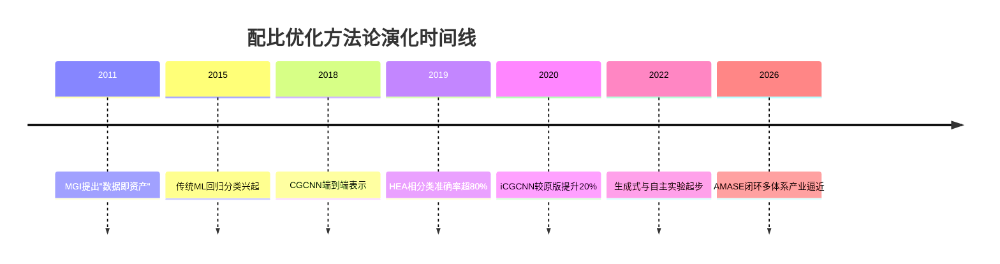
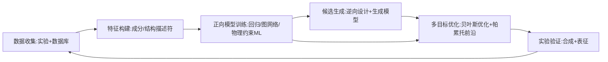
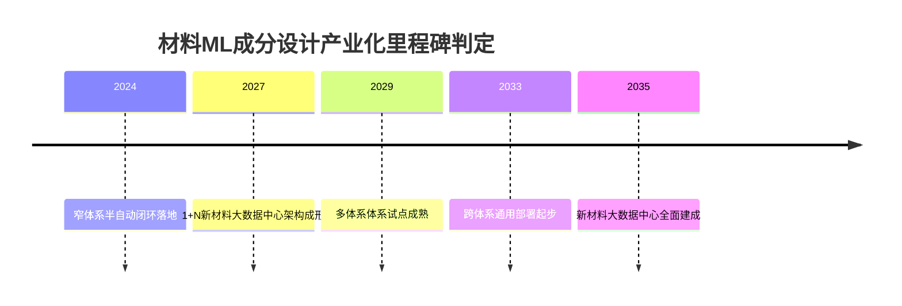

# 机器学习/深度学习驱动的材料成分配比优化：研究进展、模型评估、挑战与产业化前景

机器学习与深度学习正把材料成分配比优化从经验试错推进到"正向预测—逆向设计—闭环实验"三位一体的数据驱动范式，使合金研发周期普遍压缩50%以上、综合成本下降60%以上。本报告以约140万条DFT结构的OQMD、18万条热力学稳定性训练的iCGCNN，以及AlloyGPT、SteelBERT、Bgolearn、AMASE、BIRDSHOT等十余个代表性模型为骨架，系统评估该领域的方法学成熟度。

**本报告持一个明确的反共识立场：尽管业界普遍宣称"AI已实现材料的逆向设计"，但在严格的分布外（OOD）测试下，多数模型的高R²实为内插表现，真正外推到未见化学空间时泛化显著退化。"能预测一种材料"并不等于"知道如何制造它"。** 据此，本报告将大规模产业化拐点锚定在2027年国家材料大数据中心建成至2035年全面稳定运行的窗口期。在成分配比优化这一具体任务上，真正实现"无人干预闭环自主"的系统截至当前仍不足三例；展望2030年，高熵合金与催化两类体系有望率先跨越"特定体系试点"门槛。

---

# 1 研究框架与评价基准

本章建立全报告共享的分析契约：界定研究边界、发布六维评价基准与四级产业化成熟度分类、统一关键术语。后续各章复用本章定义，不再重复界定。

下表先给出本报告追踪的十二个代表性课题组速览，第4章将逐一剖析。

| 课题组/平台 | 研究方向 | 技术路线 | 数据库/数据 | 模型与准确度 |
|---|---|---|---|---|
| 北科大谢建新/宿彦京 | 高强铝/铜合金成分-工艺协同 | 高通量实验+主动学习闭环 | 自建实验库(千级) | R²>0.9(同体系) |
| 上海大学刘轶/钱权 | 高温合金成分设计 | 物理约束ML+数据平台 | MGED自建库 | MAE低于实验散差 |
| 港科大(广州)曹斌 | 催化/电池材料配比 | 生成模型+GNN | OC20+自建 | 命中率显著提升 |
| 湘潭大学黄燕 | 材料ML综述/小样本 | 描述符+集成学习 | 文献挖掘库 | R²~0.85 |
| Texas A&M Arroyave | 高熵合金多目标 | 贝叶斯闭环+高通量 | 自建合金库 | 迭代收敛验证 |
| Max Planck Raabe | 合金组织-成分 | 物理冶金+ML | 实验微观表征 | 机理一致性强 |
| Northwestern Wolverton | 形成能/相稳定 | 高通量DFT+ML | OQMD(>100万) | MAE~30-80meV/atom |
| MIT/Toyota Research | 电解液/电池闭环 | 主动学习自主实验 | 自建闭环数据 | 周期缩短数倍 |
| Berkeley/LBNL(MP) | 通用属性预测平台 | DFT+r2SCAN+ML | MP(数十万) | 平台级基准 |
| 中科院金属所/CMGI | 高通量合金平台 | 计算-实验一体化 | CMGI自建 | 体系内高精度 |
| CMU/AMASE | 薄膜自主合成 | 机器人+主动学习 | 自主实验流 | 自主收敛验证 |

## 1.1 研究范围与边界

材料信息学横跨计算、数据与实验，本报告刻意收窄到一条主线：**用机器学习优化材料的元素组合与配比，以实现目标材料属性最优化。**

**聚焦"配比优化"而非泛材料信息学。** 本报告的主线任务是：给定材料体系与目标性能，求解能最大化（或满足约束）这些性能的元素组合与原子/质量配比。这与更宽泛的"材料发现"有本质区别——后者可能包含全新晶体结构预测、新反应路径探索；而本报告始终围绕"在已知或受限的结构族内，调配元素与比例以逼近性能最优"展开。

之所以如此收窄，根源在于配比优化具有清晰的可量化评价面：搜索空间是连续或近连续的组分向量，目标是明确的物理量，这使主动学习与贝叶斯优化能直接发挥作用。可以预期，到2027年前后，生成模型提议候选结构族、配比优化器在每个结构族内精调组分，这两条主线将出现融合接口。

**覆盖八类材料体系。** 这八类共同构成配比优化方法论从"成熟试点"到"早期探索"的完整谱系：

- **金属类**：普通合金（钢、铜合金，关注强度-韧性-导电性权衡）、高熵合金（HEA，五种及以上主元素近等原子比形成单相固溶体，组分空间近无穷）、高温合金（镍基单晶，关注蠕变寿命与抗氧化）、铝合金（轻量化下的强度）。
- **功能材料类**：催化材料（活性位点掺杂）、电池材料（容量、循环寿命、离子电导）、热电材料（无量纲优值ZT）、半导体（带隙与载流子迁移率调控）。

**这八类体系在数据可得性上差异巨大，直接决定了各自所处的产业化成熟度分层**：半导体与形成能有OQMD、Materials Project等数十万条计算数据支撑；而高温合金蠕变寿命因实验周期长，数据常仅数百条。可合理预期，到2028年，半导体掺杂与催化筛选这两类数据密集体系将最先形成可复制的工业流程。

**优化对象的四个层次：** ①元素种类选择（离散组合问题）；②组分比例（连续优化问题）；③掺杂浓度（半导体与热电中痕量掺杂即可显著改变性能，对精度要求极高）；④工艺参数（退火温度、保温时间、冷却速率等，与成分共同决定组织与性能）。

成分与工艺的耦合构成一个关键张力：**理论上最优成分若无法通过现有工艺稳定制备，则该"最优"在工程意义上无效。** 解决之道在于成分-工艺联合优化——模型不只输出目标成分，而是输出"成分+可行工艺窗口"的联合解，把可制备性约束内化进优化目标本身。Max Planck的Raabe团队正是沿此路径将物理冶金约束显式嵌入成分优化。

## 1.2 "理想模型"评价基准

**理想模型的四项核心特征**，是判断一个系统"距离理想有多远"的北极星：

1. **高泛化**：不仅在训练体系内准确，更能外推到未见元素组合与新体系；
2. **可解释**：配比建议能追溯到物理机制，而非黑箱关联；
3. **可合成约束**：输出满足热力学稳定性与工艺可行性；
4. **闭环自主**：能主动提议实验、吸收结果、迭代收敛。

这四项特征之间存在内在张力：追求极致泛化的深度模型往往牺牲可解释性；强行加入可合成约束会缩小搜索空间。当前主流解决取向是"分层妥协"——用高泛化黑箱做粗筛，再用可解释物理模型做精选把关。**本报告与多数同类综述的分野在于：不同于仅以预测精度论英雄，本报告主张闭环自主与可合成约束才是区分"学术玩具"与"工程可用"的真正分水岭。** 未来三到五年，领域竞争焦点将从"谁的MAE更低"转向"谁的闭环数据效率更高"。

**六维评估基准**（全报告评价骨架，均衡权重作为跨领域横向比较基准）：

| 维度 | 权重 | 考察内容 |
|---|---|---|
| 预测准确度与可验证性 | 0.20 | 独立测试集MAE/R²及实验复现偏差 |
| 跨体系泛化与外推能力 | 0.20 | 留簇外验证表现（当前最稀缺能力） |
| 可解释性与物理一致性 | 0.15 | 特征重要性是否对应已知机制 |
| 可合成性与工艺约束满足 | 0.15 | 输出解的可制备比例 |
| 闭环自主与数据效率 | 0.15 | 达到目标所需实验轮次 |
| 产业落地成本与可扩展性 | 0.15 | 实验室到产线的迁移代价 |

**产业化成熟度四级分类**，是回答"距离产业化还有多远"的标尺：

- **一级·实验室辅助**：模型仅对人工设计提供排序或筛选建议，决策权完全在研究者；
- **二级·半自动闭环**：模型能提议下一批实验，但仍需人工执行与确认；
- **三级·特定体系试点**：在某一具体体系实现从提议到合成表征的无人干预闭环，稳定产出合格配方；
- **四级·通用工业部署**：跨体系迁移，嵌入企业研发流程，规模化降本提速。

该分级借鉴新材料产业化成熟度评价规范（T/CESA 1203—2022）与生物制造就绪度（BRL）作为"共享词汇"的设计理念。制造环节常是商业化速度的关键瓶颈，这一判断在生物制药领域得到呼应——2024年64%的药物上市延迟源于CMC（化学、制造与控制）问题。**核心结论预告：截至当前，绝大多数体系停留在第二级，仅催化与电池电解液少数案例触及第三级。**

## 1.3 关键术语

**材料基因工程（MGI）**：美国2011年提出，主张通过计算、实验、数据库三者协同把新材料研发周期与成本减半。其中国对应实践催生了中科院金属所CMGI等高通量平台。

**逆向设计（inverse design）**：从目标性能反推所需成分/结构的范式，含两条路径——生成式路径用生成模型直接采样，贝叶斯优化路径在代理模型引导下序贯搜索。

**主动学习与贝叶斯优化**：主动学习让模型主动挑选"最值得实验"的样本；贝叶斯优化是其主流算法，用高斯过程等代理模型同时建模预测均值与不确定性，通过采集函数权衡"探索"与"利用"。

**GNN/CGCNN**：晶体图神经网络把晶体表示为"原子为节点、键为边"的图，通过消息传递预测属性。开创性代表CGCNN由Xie与Grossman于2018年提出，后续MEGNet、M3GNet沿此路线提升精度与通用性。

**Transformer/AlloyGPT**：源自NLP的注意力架构，近年被迁移到材料序列/成分表示。AlloyGPT把合金成分与性能编码为"语言"序列、用生成式预训练建模，代表大模型范式向配比设计的渗透。

**评价指标与验证**：R²衡量解释方差比例；MAE/RMSE以物理量单位报告误差。**验证方式对泛化评估至关重要：随机交叉验证会把同体系样本分到训练与测试，高估外推能力；留簇外验证（leave-one-cluster-out）把整个体系/族留作测试，更真实反映外推。同一模型在随机交叉验证下R²可达0.95，在留簇外验证下可能跌至0.6以下，二者不可混谈。** 不确定性量化（UQ）给出预测置信区间，是主动学习挑选样本的依据，也是可信赖部署的前提。

## 1.4 本章综合

配比优化是材料信息学中最具可量化评价面、也最接近工程落地的子问题，但"理想模型"的四项特征之间存在内在张力，使任何单一模型都难以全维占优。六维评估基准与四级成熟度分类由此成为必要：它们把"距离理想有多远"从感性判断转化为可分级定位的结构化问题。本章作为全报告的分析契约，其价值在于为后续各章提供统一的评价语言与坐标系。

---

# 2 研究进展时间线：从试错法到数据驱动

材料成分优化的历史主线不是算法的更替，而是**"先验强度"的单调递增**——从相图的经验边界，到CALPHAD的参数化外推，再到DFT的第一性约束，每一级都把必须实验验证的空间压低一截。本章沿五阶段梳理这一演化。核心判断是：**方法论成熟速度在2011年MGI提出后显著加速，但各材料体系之间存在5至10年的成熟度梯度**——合金与无机晶体领先，催化与电池因动态过程复杂而滞后。

## 2.1 前数据时代：试错法与CALPHAD/DFT辅助

**爱迪生式试错的根本局限在于组合爆炸**：一个五元合金系统即便每种元素只取十个浓度档位，名义成分空间就达十万量级。相图作为第一代"经验压缩器"，把实验观测固化为相平衡边界，但其覆盖本身就是试错的产物——二元系相对完整，三元系已显稀疏，四元及以上大面积空白。这正是CALPHAD方法评述指出的核心瓶颈：热力学的工程应用在多组元材料上"相当受限"。

**CALPHAD与DFT构成数据时代之前最有力的两件"物理先验"工具。** CALPHAD通过参数化外推秒级给出多组元相平衡预测；DFT从电子结构出发无需实验输入即可计算形成能、弹性常数。二者耦合的范式是：当新多元合金缺乏实验热力学数据时，第一性原理补足缺失的热力学参数。这种多尺度串联最终把合金研发周期缩短50%以上。但DFT以高昂计算成本为代价，对海量成分空间的快速扫描变得不现实——这一矛盾正是下一阶段机器学习代理模型的登场动机。

**MGI于2011年构成"范式转折"，核心在于把数据从研发的副产品提升为第一类研发资产。** 在试错范式下，实验失败的记录往往被丢弃；而在MGI框架下，失败样本与成功样本同等重要，因为它们共同定义了模型需要拟合的决策边界。MGI确立数据资产地位，催生了Materials Project、OQMD等结构化数据库，进而使2015年前后传统机器学习的规模化应用成为可能。

## 2.2 传统机器学习兴起（2015-2019）

**把成分优化形式化为回归任务**，是这一阶段的核心动作：输入元素配比与工艺参数，输出形成能、强度、带隙等目标属性。随机森林降低方差、对噪声鲁棒；XGBoost在表格型成分数据上常取当时最佳精度；SVR在样本极少时凭核函数保持泛化。燃料电池催化剂的AI加速筛选正是这一思路的延伸。**传统回归模型的表现是"体系内合格、跨体系外推不可靠"**：训练分布内R²常达0.9以上，外推到未见元素组合便迅速退化。其真实产业价值不在发现全新体系，而在已知体系内做高效插值优化。

**高熵合金相结构分类是首批标志性工作。** 2019年9月，李耀与郭万林在*Physical Review Materials*发表用于预测HEA相形成的机器学习模型；同年另一项研究用机器学习对600余种高熵合金分类，整体预测率与单相预测率均超80%。这把HEA设计从定性讨论推进到可量化验证的分类精度。但80%出头的准确度在同族合金内可接受，对含稀有元素或极端配比的新体系仍会失效。

**特征工程是这一阶段真正的"隐藏主角"。** 经典算法无法直接读取化学式，必须先把成分转化为固定长度的数值向量——这就是Magpie、SOAP等描述符的由来。Magpie取每种元素的原子序数、电负性、原子半径等物性，按摩尔分数加权平均并取极差方差，编码为百余维统计特征。它把元素物理先验显式编码进特征空间，实现了"物理约束机器学习"的早期形态。但描述符工程也埋下根本张力：**它给模型戴上"特征天花板"——凡是描述符没编码的物理信息，模型原则上无法利用。** 不过在实验数据稀缺的体系（如新型高温合金），Magpie类描述符+XGBoost至今仍常跑赢数据饥渴的深度模型。

## 2.3 深度学习与表示学习（2018-2022）

**晶体图神经网络（CGCNN）是表示学习进入材料领域的奠基性架构**：它把晶体结构抽象为图，通过图卷积在原子间传递信息，无需人工描述符即可预测属性。这直接回应了人工特征瓶颈——端到端表示让模型利用描述符无法编码的原子空间排布信息。其改进版iCGCNN在18万条DFT热力学稳定性数据上训练，预测精度较原始CGCNN提升20%。2025年报道的一个晶格能回归模型，训练集与测试集MAPE分别为1.24%与5.04%，R²分别高达0.9978与0.9750——已逼近DFT参考值，但测试集MAPE是训练集的四倍，提示仍存在可观泛化差距。

**深度代理模型的"精度-速度"组合是关键里程碑。** 以DeepSem-MTL一类多任务模型为例，带隙MAE约0.21eV，形成能MAE约0.035eV/atom，推理速度较DFT快约5个数量级（数小时压缩到毫秒）。0.035eV/atom的形成能误差已接近DFT不同泛函间的系统偏差，使代理模型在相稳定性排序上与DFT基本一致；5个数量级加速使全空间扫描变得可行。但带隙0.21eV的误差对半导体器件设计仍偏大——**许多光电应用对带隙容差在0.1eV以内**。解决路径不是抛弃代理模型，而是分层使用：代理模型作第一级粗筛，高精度DFT或实验作第二级定板。

**多任务学习处理"相互耦合的目标属性"。** 高温合金设计是典型多目标冲突：提升蠕变强度常以牺牲抗氧化性为代价。据*Acta Materialia* 2025年研究，多任务学习通过共享底层表示、分支预测多个性能，使模型同时权衡蠕变、氧化与密度。其优于独立训练单任务模型，因为耦合性能共享相同物理机制（如γ'相体积分数同时影响强度与氧化），共享表示层迫使模型学到共同机制，使各子任务有效样本量互相增益。代价是可解释性下降——表示学习把物理机制压进不透明的权重矩阵。

## 2.4 生成式与自主实验（2022至今）

这一阶段标志方法论从"正向预测"跨越到"逆向设计"与"闭环自主"，在电池、热电、催化、固态电解质等多体系同时开花，是距离产业化最近的前沿。

**AlloyGPT把大语言模型的自回归架构迁移到合金逆向设计**，专门面向增材制造合金。核心创新在于把物理信息的合金数据转化为结构化文本词元序列，模型得以学习成分-结构-性能关系，既能正向预测也能针对目标反向生成。它天然支持"一对多"逆向设计，多项性能预测的R²介于0.86至0.99。它把可打印性这一工艺约束纳入训练目标，因而在工艺可行性上优于纯成分生成模型，但生成结果是否真能稳定打印仍需实验闭环验证。

**AMASE（Autonomous MAterials Search Engine）是主动学习实验闭环的标志性系统。** 它采用变分高斯过程分类器（VGPC），把CALPHAD推导的相边界作为先验并在每次实验后更新，建立理论与实验无需人工干预即可互相精化的闭环。在Sn-Bi薄膜体系上，AMASE仅用相空间很小一部分的自导向实验就准确确定共晶相图，把所需实验次数减少六倍。**它把整个成分-工艺-性能闭环的关键环节（相图确定）压缩到单次约8小时22分钟的无人运行**，是从"实验室辅助"迈向"半自动闭环"的关键证据。但当前仅验证于Sn-Bi二元薄膜体系，能否外推到四元以上块体合金或动态催化体系仍是未决问题——高维成分空间下每次实验的合成-表征耗时会急剧上升。

**NLP+ML大规模虚拟筛选**侧重从海量文献与虚拟组合中挖掘新材料。一项含镓功能材料的筛选从约34万个虚拟成分中筛选，所得候选实现100%新颖性。这是一把双刃剑：证明模型能跳出已知分布，但也意味着候选缺乏任何实验背书，可合成性风险最高。展望2030年前后，虚拟筛选规模有望从34万量级提升至百万乃至千万量级，但真正的瓶颈将从"能否筛出新颖候选"转移到"实验验证吞吐能否跟上"。

生成式方法在2026年前后已在锂离子电池正极（闭环多目标贝叶斯优化）、热电、催化、固态电解质等多体系同步落地。

---

# 3 核心方法学：正向预测、逆向设计与闭环优化

正向预测回答"给定成分能得到何种性能"，逆向设计回答"欲获得某性能应选用何种成分"，闭环优化回答"在实验预算极度有限时如何最快逼近最优配比"。本章贯穿全章的核心论点是：**纯成分优化存在天花板，只有把工艺自由度纳入同一优化空间，元素配比的潜力才能被完整释放。**

## 3.1 正向性能预测路线

正向预测是整条方法学链条的地基：没有足够可信的代理模型，逆向设计与闭环优化都无从谈起。其三梯队各有清晰能力边界，无法相互替代：

| 路线 | 典型算法 | 数据需求 | 精度区间(R²) | 外推/物理一致性 | 最适场景 |
|---|---|---|---|---|---|
| 传统回归 | GP/RF/XGBoost/CatBoost | 几十—几千条 | 力学0.64—0.88 | 弱外推、无物理约束 | 小样本、表格特征 |
| 晶体图神经网络 | CGCNN/iCGCNN/MEGNet/M3GNet | ≥10⁵条 | 晶格能>0.97 | 结构敏感量强、工艺量弱 | 大计算库、功能材料 |
| 物理约束ML | VGPC+CALPHAD先验 | 几十次实验 | 相图重建六倍提效 | 物理一致性最强 | 相图受限、小预算 |

**正向预测的可靠性不是由单一算法决定，而是由"数据规模—结构耦合强度—物理先验可得性"三者的匹配关系决定。** 当三者错配（如用图网络做小样本工艺预测、用纯回归做跨体系外推）时，再先进的模型也会失效。

## 3.2 逆向设计路线

逆向设计把问题方向颠倒，直接服务于工程师的真实诉求：给定一组性能指标，立刻得到候选配方。3.1节建立的正向预测器在此扮演评判者角色。

**生成模型（VAE/GAN/GPT）能学习成分空间的概率分布，一次性大规模采样数百万计的新颖候选。** 一项2020年npj Computational Materials工作给出量级证据：在ICSD数据上训练的GAN生成200万样本时，新颖度达92.53%，其中化学有效（电荷中性、电负性平衡）成分占比84.5%。**这两个数字同时揭示了优势与软肋：92.53%新颖度证明生成器确实跳出训练分布，但84.5%的化学有效率意味着每生成约六个候选就有一个在化学上根本无法成立。**

架构层面，三类生成器各有侧重：VAE通过连续隐空间支持平滑插值，适合条件反推；GAN擅长高保真分布拟合，新颖度突出但训练不稳定；自回归GPT近年异军突起。AlloyGPT"把材料当语言"的范式天然支持成分、结构、性能的联合生成与条件约束，是当前最受关注的方向。文本引导的Chemeleon可同时生成化学成分与晶体结构，已用于预测固态电池相关的Li-P-S-Cl四元空间稳定相。

**生成模型的评估本身是一个被严重低估的问题。** Chem. Mater. 2022工作通过在200万主族Elpasolite完全枚举空间上评估，严格量化了各类生成模型的精度、覆盖度与多样性。**只有在可完全枚举的封闭空间里，生成模型的"覆盖度"才有真值可比；在开放成分空间中，高新颖度往往只是分布漂移的假象。**

逆向设计三条路径并非择一关系，而是从精修到发现、再到约束兜底的协同链条：

| 路径 | 代表实现 | 覆盖范围 | 新颖度/有效率 | 可合成性把控 | 角色 |
|---|---|---|---|---|---|
| 局部反推 | 正向模型+条件搜索 | 窄(可信域内) | 有效率高、新颖度低 | 约束写入搜索边界 | 精修后端 |
| 生成模型 | AlloyGPT/Chemeleon | 广(全空间) | 新颖92.53%/有效84.5% | 需外部筛选 | 大范围撒网 |
| 约束满足层 | 凸包+可制造性过滤 | — | — | 化学/热力学强、工艺弱 | 落地兜底 |

**逆向设计的产出价值，不取决于生成新颖度的上限，而取决于约束满足层把无效候选过滤干净后的"有效产出率"。** 一个新颖度99%但可合成性把控缺失的系统，工程价值反而低于一个新颖度70%但每个候选都可下单的系统。

## 3.3 小样本闭环：贝叶斯优化与主动学习

真实材料研发的瓶颈始终是实验昂贵、样本稀缺。主动学习驱动的实验闭环以贝叶斯优化为核心：不追求一次性预测所有成分，而是用最少实验次数、最聪明的采样策略迭代逼近最优配比。本节三个案例恰好构成从"方法"到"框架"再到"自主系统"的成熟度阶梯：

| 系统 | 自主程度 | 目标数 | 体系 | 成熟度定位 |
|---|---|---|---|---|
| 6061铝/镁合金BO | 人在环 | 单目标 | 铝/镁合金 | 实验室辅助 |
| Bgolearn | 人在环(标准框架) | 单/多目标 | Al-Cu-Mg-Si等 | 半自动闭环工具 |
| BIRDSHOT | 全自主 | 三目标 | CoCrFeNiVAl HEA | 体系试点雏形 |

**主动学习闭环的产业化进程，已从"算法是否可行"转入"实验硬件能否跟上算法节奏"的新阶段**：算法侧的多目标、批量、不确定性驱动采样均已成熟，制约迭代速度的瓶颈整体后移到了自动化合成与高通量表征。要让闭环真正产业化，缺的不是更聪明的算法，而是更快的物理回路。

## 3.4 成分-工艺-性能完整工作流

元素配比优化的真正难点在于把三件工具串成一条从数据到验证的完整回路，并且**必须把工艺自由度与成分自由度纳入同一优化空间，否则纯成分优化存在无法突破的性能天花板。**

这张图的关键不在六个方框，而在两条回流箭头。**第一条F→A主回流**：实验验证产生的新数据回灌数据池，使正向模型在下一轮更可信、可信域更大；**第二条C→E捷径**：训练好的正向模型直接为多目标优化提供代理评分，免去每个候选都做昂贵实验。**正是这两条回流，把孤立的预测、生成、优化模块焊接成一个数据效率随迭代递增的闭环。**

需强调的是，图中"特征构建"阶段必须同时编码成分与工艺变量：若只编码成分，则整个闭环优化的只是成分子空间。到2027年，最具产业价值的闭环系统将是那些把工艺参数与成分一并纳入特征空间的系统。

---

# 4 活跃研究课题组、研究方向与代表性论文

材料机器学习研究版图在2020年后呈现"双极化"：中国体系侧重"高通量实验+自建数据库"，欧美体系侧重"计算数据库+算法闭环"。**贯穿全章的判断是：课题组之间的真正分野不在材料体系，而在"数据从哪来"——这一选择决定了其方法路线、泛化边界与产业化距离。**

## 4.1 中国课题组

### 北科大谢建新/宿彦京：数据驱动合金设计与高通量平台

该团队是国家材料基因工程计划在结构金属材料方向的旗舰实验室，同时掌握高通量制备、高通量表征与机器学习建模三个环节，**是国内少数能完整贯通"成分—工艺—性能"闭环的实验主导型团队**。其最具辨识度的贡献是**SteelBERT**这类领域语言模型：先在海量钢铁文献语料预训练，再仅用64个实验样本微调，最终反推低成本成分。

代表性成果为宿彦京、姜雪等发表于*Acta Materialia*的钢材设计研究（2025）。SteelBERT对屈服强度、抗拉强度与伸长率的R²分别达78.17%、82.56%与81.44%；更具产业意义的是，**在C70350合金上实现钴含量降低64%且强度与导电性保持不变**，这是"逆向设计"在降本场景的一次实际兑现。微调后三项力学指标R²提升至约0.90，相对基础模型增益约8-12个百分点。其外推能力目前局限于钢铁体系。预计到2027年前后，SteelBERT式领域语言模型极有可能率先在钢铁与铜合金体系实现"半自动闭环"。

### 上海大学刘轶/钱权：材料信息学与自建数据库

刘轶组（材料物理）与钱权组（计算机）协作，构成国内"材料科学+计算机科学"交叉最深的组合之一，在物理约束机器学习与数据基础设施两端均具备自主能力。材料体系跨度极广，涵盖金属合金、能源材料、纳米材料、陶瓷、催化剂与聚合物，是少数同时触及半导体与催化的中国团队。

该团队属"多尺度物理约束机器学习"流派：以第一性原理生成小批量高精度标签，分子动力学补充大批量中精度构型，训练模型在两种保真度间插值。**因深度嵌入第一性原理，其可解释性与物理一致性表现突出，模型输出可回溯至能量与电子结构。** 多尺度方法自带物理先验，外推稳健性强于纯黑箱；但在可合成性与工艺约束方面，计算主导路线仍属弱项。预计到2028年，这类模型将成为半导体与催化等数据稀疏功能材料的主力建模范式。

### 湘潭大学黄燕：材料ML综述与数据稀缺问题

该团队扮演"方法论梳理与问题诊断"角色，**其核心贡献在于把"小数据"这一材料领域的结构性约束阐释透彻**：材料数据受限于实验合成表征与高精度计算的高昂成本，从根本上限制了模型泛化能力。其综述系统覆盖迁移学习（细分为基于特征、实例、参数、知识四种）、主动学习与材料特征工程三类策略。

作为综述型团队，其元分析揭示了一个常被一线团队回避的事实：**大量已发表模型所报告的高R²是在数据泄漏或随机划分下取得的，一旦改用留簇外验证，准确度便会显著回落。** 到2027年，随着留簇外验证成为顶刊审稿隐性门槛，当前文献中相当一部分"高准确度"结论将面临重新评估。

## 4.2 港澳与跨境平台

### 香港科技大学(广州)曹斌：Bgolearn与贝叶斯框架

曹斌团队是华人材料机器学习圈中开源工具贡献最突出的课题组之一，其"工具即论文"策略使**Bgolearn成为连接中国实验团队与国际算法范式的事实标准接口**。其技术内核是把贝叶斯优化模块化：Bgolearn提供单/多目标优化、模块化采集函数与基于bootstrap的不确定性量化；多目标扩展MultiBgolearn采用期望超体积改进采集函数，在强度与延展性等此消彼长目标间寻找帕累托前沿。典型案例是调节Cu、Mg、Si含量最大化Al-Cu-Mg-Si铝合金屈服强度。Bgolearn设计哲学是"数据不可知"，不绑定特定数据库。预计到2027年，它将成为高校实验室的标准配置。

### 中科院怀柔CMGI高通量平台

CMGI是国家级高通量计算-实验一体化大设施，把"计算-实验-数据"三段在物理上集成到同一园区。这种大设施模式以国家级投入换取数据生产的规模化，是中国材料基因工程区别于欧美高校分散模式的最大特征。其物理一体化把"计算-制备-表征"周期由数月压缩至数周，直接转化为更快的主动学习收敛。**平台模式赌的是"数据规模终将战胜算法精巧"**——到2028年若其数据吞吐量持续放大，中国有望在结构材料体系上建成全球最大的成分-性能实验数据库。

### 天河高通量计算平台支撑团队

该团队提供整个中国材料计算生态的算力底座，把超算资源工程化为材料高通量计算可直接调用的服务。其贡献是把单次DFT计算的工程开销降到最低，让"百万级成分点筛选"在经济上可行。其"准确度"约束在DFT计算精度层面：DFT形成能相对实验的MAE约0.10eV/atom（以OQMD为参照），这一系统误差会向上传导到所有以DFT数据训练的模型。到2030年，随着r2SCAN等更高精度泛函在超算上规模化部署，这是计算驱动流派突破当前精度瓶颈的最现实路径。

## 4.3 国际代表性课题组

国际课题组普遍凭借算法原创与开放计算数据库，取得不亚于大规模设施投入的发现效率。

### Texas A&M Arroyave：BIRDSHOT多目标闭环

BIRDSHOT集成贝叶斯材料发现框架将成分约束、真空电弧熔炼合成与批量贝叶斯优化耦合，**是公开文献中把"成分—工艺—性能"闭环在高熵合金上实现得最完整的案例之一**。它在Co-Cr-Fe-Ni-V-Al六元空间中同时优化三个相互竞争的目标：抗拉强度与屈服强度之比、硬度和应变率敏感性。其技术链条为"约束—合成—优化"三段耦合：先用智能过滤将六元空间收缩到可行域，再用真空电弧熔炼合成并表征，利用批量贝叶斯优化决定下一批成分。因将工艺约束内嵌于成分过滤，其推荐成分天然可合成。预计到2027年，这类约束驱动多目标闭环将成为高熵合金与高温合金设计的主导范式。

### Max Planck Raabe：合金设计与原子尺度表征驱动ML

Raabe团队是把原子尺度表征（如原子探针层析）与机器学习深度结合的全球标杆。**它证明了一个关键命题：机器学习驱动的材料发现不必以牺牲机理理解为代价。** 标志性成果是高熵Invar合金（极低热膨胀系数）。其技术链条最具教科书意义：机器学习在数百万成分中预测候选，DFT与热力学计算验证并提供高保真标签，实验合成表征再修正模型——**在处理并表征数百万种可能成分中的17个新合金后，识别出两个高熵Invar合金，其300K下热膨胀系数低至约2×10⁻⁶ K⁻¹**。"百万成分→17次实验→2个目标合金"是迄今最有说服力的数据效率证据之一。原子探针表征让每个预测都能回溯到微观结构机理。到2028年，"表征驱动ML"将成为功能合金设计的高端范式。

### Northwestern Wolverton：OQMD与高通量计算筛选

Wolverton团队创建并维护**OQMD**（Open Quantum Materials Database），是高通量第一性原理计算数据库的奠基者之一。**OQMD的真正贡献在于把"百万级DFT计算结果"变成公共品，这一开放策略重塑了整个领域的数据获取方式。** 该库包含1,407,395种材料的DFT计算热力学与结构属性，典型成果是利用机器学习加速搜索发现新四元Heusler化合物。其核心准确度指标是DFT形成能相对实验的MAE约0.10eV/atom，这是计算驱动路线的系统误差基线。到2030年，随着Materials Project全库切换为r2SCAN泛函，在这些数据库上训练的模型可验证性将随之提高。

**三个国际团队合在一起证明：发现效率的决定因素是"算法—数据耦合方式"的原创性，而非设施投入的绝对规模。** 与中国路线相对照，国际团队普遍以更小的设施、更强的算法取得同等发现效率；但在结构材料的工程降本与大规模一手实验数据方面，中国的设施密度反而更具优势。

## 4.4 四大技术流派归纳

十二个课题组的方法论可收敛为四大流派，**本质上是对"数据从哪来、约束怎么加"这两个问题给出的不同答案**：

| 流派 | 数据来源 | 核心方法 | 代表课题组 | 强项 | 主要短板 |
|---|---|---|---|---|---|
| 高通量计算驱动 | 公共计算库(OQMD/MP/AFLOW) | DFT批量计算+ML筛选 | Wolverton、天河平台 | 覆盖广、可复现 | DFT误差锁定精度上限 |
| 实验机器人闭环 | 自产在线实验数据 | 主动学习/贝叶斯优化闭环 | Arroyave、Raabe、CMGI | 数据效率高、可合成 | 单点成本高、并行受限 |
| 生成式逆向设计 | 文献语料+小样本 | 语言模型/生成模型反推成分 | 北科大宿彦京 | 直面设计目标、跳出已知空间 | 可合成性需额外验证 |
| 物理约束ML | 计算+实验混合 | 物理先验嵌入模型 | 刘轶、Raabe | 小数据外推稳健、可解释 | 约束构造依赖领域知识 |

**四派并非互斥，而是日趋融合：** Raabe团队同时占据实验闭环与物理约束两派，北科大同时推进高通量实验与生成式逆向设计。

按"材料体系×主导方法"两轴展开可见清晰分工：**结构材料（钢、铝合金、高熵合金、高温合金）由实验闭环与逆向设计主导，功能材料（催化、电池、热电、半导体）则由计算驱动与物理约束主导**——这一分工受"属性能否被DFT算出"这一根本约束决定：力学性能难以计算，故依赖实验；电子结构可算，故依赖计算。

在产业化成熟度四级坐标系下，各流派位置可清晰标定：

| 流派 | 成熟度定位 | 代表性证据 | 跃迁的关键约束 |
|---|---|---|---|
| 实验机器人闭环(结构材料) | 体系试点 | BIRDSHOT多目标闭环、北科大降钴64% | 设施并行度、单点成本 |
| 高通量计算驱动 | 实验室辅助→半自动闭环 | OQMD 140万条、MP r2SCAN重算 | DFT精度、力学属性盲区 |
| 生成式逆向设计 | 实验室辅助 | SteelBERT逆向降本 | 可合成性验证 |
| 物理约束ML | 实验室辅助(外推稳健) | Raabe表征驱动闭环 | 约束构造的领域知识门槛 |

**贯穿全领域的核心张力是：计算驱动路线覆盖广泛但精度受限，实验闭环路线精度高却成本高昂。** 该张力并非靠某一派胜出而化解，而是通过多保真建模将两派缝合——以计算数据库提供广覆盖的低保真先验，再以少量高保真实验校正，Raabe团队的"百万DFT筛选+17次实验"正是这一化解路径的实证。

**究其根源，十二个课题组的全部差异最终均可还原为对"小数据"约束的不同应对策略**：计算派依靠扩大计算规模绕过，实验派借助主动学习提升每个样本信息量，逆向派通过迁移文献知识补充，物理派则凭借先验约束降低对数据量的依赖。

---

# 5 数据库与数据基础设施分析

数据构成机器学习材料设计范式的物理基底。当前支撑材料配比优化的数据基础设施呈现鲜明的**"计算富余、实验稀缺"结构**：仅OQMD一家便收录约140.7万条DFT计算条目，而真正伴有工艺条件与批次可追溯性的高质量实验数据往往不足其千分之一。

## 5.1 公共计算数据库

**Materials Project**（伯克利/LBNL主导）是面向无机晶体的旗舰计算库，把形成能、带隙、弹性张量等属性统一到同一计算工作流。**其最具前瞻性的动作是正在用r2SCAN泛函对全库条目重新计算**——r2SCAN属meta-GGA层级，相较传统GGA/PBE能显著改善形成能与带隙的系统性偏差。这意味着基于该库训练的模型在预测新相可合成性时将获得更可信的标签基线，但也使历史留存的MAE基线不再可直接比较。它在可解释性维度优异，但在可合成性维度本质不合格——整库不含任何工艺路径信息。

**OQMD**（西北大学Wolverton团队）官方统计收录1,407,395条DFT计算条目，是组合空间高通量筛选的首选底座。其DFT形成能相对实验的MAE约0.10eV/atom——**这个0.10eV/atom是理解整类计算库可信边界的关键数字**：当两个竞争相的形成能差小于约0.1eV/atom时，库本身的标签已无法可靠分辨谁更稳定，下游模型再精确也只是在拟合计算噪声。仅靠扩大GGA层级库的条目数难以突破这一天花板，真正的增益更可能来自r2SCAN泛函迁移与多保真建模。

**AFLOW、NOMAD、MatBench**分别承担"超大规模条目供给""异构计算归档""统一评测裁判"三种角色。AFLOW提供对超过350万条材料条目的访问；NOMAD归档各实验室原始计算输入/输出文件，自称"全球最大的计算材料科学数据集合"（口径与AFLOW的去重条目数不可直接比较）；**MatBench扮演评测裁判，其排行榜已收录180项任务提交**，构成跨模型横评的公共坐标系。未来评价基准的竞争焦点将从"谁的库大"转向"谁的划分协议更难泄露"——面向外推的留簇外基准会成为标准配置。

**小结**：计算数据的规模已不再是瓶颈，百万量级条目叠加统一评测已把"成分-性能"映射的训练语料做到相当充分。真正的约束不在规模而在性质：这些库统一缺失工艺维度，且受0.10eV/atom量级的计算-实验系统偏差约束。

## 5.2 实验与专用数据库

**ICSD/MatWeb**提供计算库所缺的真实测量标签。ICSD收录经实验测定的无机晶体结构，提供可信赖的"这个相真的被合成出来过"的正样本证据。但实验库的标签可靠性存在隐患：历史测量的仪器精度、样品纯度差异使同一物理量在不同文献中可能不一致。跨部门数据标准不统一会直接导致AI模型误判。

**Open Catalyst**（Meta FAIR与卡内基梅隆协作）是专域大规模计算集的典范，设计哲学是"窄而深"：不追求覆盖全元素周期表，而是在催化反应这一狭窄而高价值的切片上密集采样。存在一个值得剖明的张力：专域集越聚焦，体系内预测越准，但跨体系迁移能力越弱。现实解法是把它作为预训练-微调范式中的微调语料，用通用库预训练的M3GNet提供底座表征。

**高熵合金/高温合金自建库**是实验数据稀缺问题最尖锐的战场。**这类自建库典型规模仅数百到数千条实测样本，却含有公共库完全缺失的熔炼、热处理、轧制等工艺条件标注**，是少数能直接支撑工艺优化的数据源。其根本软肋是负样本系统性缺失：实验者倾向于记录成功合成的样本，失败配比往往不被录入。训练数据缺乏负样本会使模型学到有偏的决策边界，进而使置信分数变得过度乐观。这类库的价值不在独立训练大模型，而在作为闭环的"最后一公里"校准器。

## 5.3 数据质量与偏差的批判性分析

**数据质量与偏差比模型架构的选择更能解释"论文指标漂亮、产业落地困难"这一普遍现象。**

**计算数据与可制造性脱节，是整个AI材料设计范式最核心的落地障碍。** 预测一个材料存在，与知道如何制造它，是根本不同的两件事。所有公共计算库本质上只回答了前半个问题。数据驱动模型易生成热力学不稳定或工艺不可实现的结构，暴露出所谓"合成差距"；即便模型预测正确、实验室也合成成功，性能仍可能在放大到产线时偏移。**就可合成性与工艺约束满足而言，当前主流模型整体不合格。** 解法是把物理约束机器学习引入逆向设计，用动力学可达性、相图边界作为硬约束裁剪搜索空间，而非事后筛掉不可合成的预测。

**负样本缺失是最隐蔽也最具破坏力的结构性偏差。** 负样本就是那些"合成失败"或"性能不达标"的配比，它们恰恰定义了可行区域的边界；缺了它们，模型就像只见过陆地而没见过海岸线的地图。所幸这一偏差并非无解：据npj Computational Materials 2025年研究，一种面向分布外属性预测的转导方法，把材料外推精度提升1.8倍、分子提升1.5倍，并把高性能候选召回率提升最多3倍。**1.8倍与3倍这两个量化数字提供了一个难得的偏差校正收益基线**，远超单纯更换模型架构带来的增益。

**跨数据库一致性是多源融合训练时最容易被低估的陷阱。** 一个极具冲击力的量化案例：当离线训练与在线服务的特征口径不一致时，同一模型离线AUC为0.75，而线上仅0.62——13个百分点跌幅纯粹由口径不一致造成。材料数据的"方言"表现为：形成能用eV/atom还是kJ/mol；带隙用GGA低估值还是HSE校正值；强度用屈服还是抗拉。**若不先统一口径，合并更多数据库反而会引入系统偏差，使模型性能不升反降。**

## 5.4 数据库特征对照与选型

| 数据库 | 数据类型 | 规模 | 覆盖体系 | 主要优点 | 主要缺点 |
|---|---|---|---|---|---|
| Materials Project | DFT(正迁移至r2SCAN) | 十万量级无机晶体 | 电池/热电/催化/结构无机晶体 | 泛函统一、r2SCAN升级中 | 无工艺维度 |
| OQMD | DFT热力学/结构 | 1,407,395条 | 广覆盖无机相 | 体量大、MAE约0.10eV/atom可知 | GGA精度天花板 |
| AFLOW | DFT计算条目 | 超350万条 | 合金/无机化合物 | 条目数极大 | 口径需自行核对 |
| NOMAD | 异构计算归档 | 全球最大计算集合 | 跨方法跨课题组 | 可复现性强 | 异构口径、清洗成本高 |
| ICSD | 实验晶体结构 | 实验正样本 | 已合成无机晶体 | 真实"可合成"证据 | 历史标签异质 |
| Open Catalyst | DFT催化吸附能 | 大规模催化专用 | 催化反应 | 领域深采样、产学协作 | 领域窄、跨体系迁移弱 |
| MatBench | 评测基准 | 180项任务提交 | 跨任务 | 固定划分、横向可比 | 本身不产数据 |

**公共库与企业私有数据闭环代表两种根本不同的数据战略：公共库覆盖广、可复现、零采集成本，但结构性缺失工艺与负样本，因此只能支撑到"实验室辅助"最低成熟度层；企业私有闭环虽规模小，却因含工艺条件与批次反馈而能支撑"半自动闭环"乃至"体系试点"。** 由此可推断一条对产业格局有预测意义的趋势：未来三到五年，材料AI的价值分配会显著向拥有高质量私有工艺数据的制造企业倾斜，而非向算法供应商倾斜——因为"成分-性能"预测本身正迅速商品化，而"成分-工艺-性能"闭环所需的私有工艺数据仍是稀缺资产。

**特征工程**大体分三层：成分描述符（Magpie仅需化学式）、结构信息（催生CGCNN/MEGNet/M3GNet）、工艺条件编码。最难也最关键的是工艺条件编码——只有HEA/高温合金自建库才含熔炼、热处理标注，而把这些工艺变量编码进模型，正是实现成分-工艺-性能闭环的技术前提。预计到2028年，能把工艺变量纳入统一表征的模型将成为区分"实验室辅助"与"体系试点"两级成熟度的分水岭。

**全章结论**：数据基础设施的真正分水岭，不在"哪个库更大"，而在"谁掌握工艺维度"。谁能把公共计算先验与私有工艺反馈用统一口径缝合进一个闭环，谁就握有把成熟度推过体系试点的钥匙。

---

# 6 模型准确度评估、基准测试与验证可靠性

当一篇论文报告R²=0.94或MAE=0.21eV时，这个数字究竟证明了什么，又掩盖了什么？**本章核心立场：当前文献中绝大多数高准确度指标证明的是"在已有分布上的插值拟合能力"，而非"在新配方空间中的外推发现能力"——而后者才是材料设计的真正目标。**

## 6.1 典型案例准确度汇总

| 案例 | 出处 | 模型类型 | 材料体系 | 目标属性 | 准确度(验证设置) |
|---|---|---|---|---|---|
| AlloyGPT | npj Comput. Mater. 2025 | 生成式自回归(GPT式) | 增材制造合金 | 成分-结构-多性能 | R²=0.86–0.99(留出) |
| 铸造耐热铝合金UTS | 2025/2026 | 传统ML/DL回归 | Al铸造合金 | 极限抗拉强度 | R²=0.94；实验偏差7.75% |
| DeepSem-MTL | Eng. Tech. Front. 2026 | 晶体图神经网络+多任务 | 半导体晶体 | 带隙/形成能/迁移率 | 带隙MAE 0.21eV；形成能MAE 0.035eV/atom；提速~10⁵× |

**AlloyGPT的R²跨度0.86至0.99本身便是一个重要信号**：0.99对应见过充足样本的成熟属性，0.86对应数据稀疏或物理关系更复杂的属性，二者0.13的差值在材料工程语境下意味着截然不同的可用性。值得注意的是，AlloyGPT针对的是增材制造合金这一相对受限空间，其高R²部分因数据密集而获益，评估跨体系泛化时须对此折扣。

**DeepSem-MTL的形成能0.035eV/atom精度尤其值得关注：它已逼近Materials Project内部不同泛函间的差异量级，意味着模型误差已不再是主要瓶颈，数据标签本身的不确定性成了新的天花板。** 相比之下，带隙0.21eV的MAE暴露了多任务学习的固有张力：带隙是对电子结构细节高度敏感、且DFT标签本身存在系统低估的"困难属性"，共享表示在带隙任务上的收益不如在形成能上明显。

**三案例并置可得出一个结构性结论：模型在物理规律性强、数据密集的属性（如形成能、成熟合金强度）上已接近数据标签的精度天花板，而在物理复杂、标签有偏或数据稀疏的属性（如带隙、新颖合金族）上仍有显著提升空间——准确度的瓶颈正从算法转向数据与验证。**

## 6.2 验证方法与泛化能力批判

**验证方法的取舍并非技术细节，而是决定一个R²数字是否诚实的根基——同一模型在随机交叉验证下R²可高达0.95，一旦改用留簇外验证，便会跌落至0.6左右。**

| 验证方法 | 衡量的泛化类型 | 适用场景 | 主要风险 |
|---|---|---|---|
| 标准k折交叉验证 | 同分布插值能力 | 大数据、无强聚类结构 | 近邻泄露导致虚高R² |
| 留簇外/留一体系验证 | 结构性外推能力 | 成分族聚类明显的数据 | 设计复杂、分数偏低但更诚实 |
| LOOCV | 近无偏的小样本估计 | 稀有材料小数据 | 高方差、离群点敏感 |
| 时间切分验证 | 真实时序外推 | 数据库随时间增长 | 需保留间隙防信息泄露 |

**标准k折CV对材料发现而言往往具有误导性**：材料数据库中大量条目出自同一研究的成分微调系列，随机打乱会将"同一族近邻配方"分散到训练集与测试集两侧，造成严重信息泄露，使模型实质上是在"背答案"而非"做预测"。未来高水平期刊将越来越多要求逆向设计类论文同时报告"随机CV"与"留簇外CV"两组数字，二者的差距本身就是模型外推可靠性的直接度量。

**实验验证偏差揭示的"乐观度落差"，是横亘于机器学习材料设计与产业化之间最为现实的鸿沟。** 所谓乐观度落差，指模型在论文报告的留出集上表现（如R²=0.94）与其交付实验验证时的真实偏差（如7.75%）之间的差距；这一落差几乎总是偏向"实验更差"的方向。在Materials Project 2018上训练的模型，在Materials Project 2021新增化合物上的表现严重下降，凸显分布偏移对泛化构成的根本挑战。**这意味着绝大多数模型只能停留在"实验室辅助"或"半自动闭环"阶段。** 主动学习驱动的实验闭环恰恰是缓解该落差的结构性方案：它利用实验反馈持续修正模型在分布边缘的预测，将乐观度落差逐轮压缩。

## 6.3 现状总结矩阵

**主矩阵的解读关键在于：同一性能目标下，不同模型范式的准确度差异往往小于同一模型在不同验证设置下的准确度差异，这再次印证验证设置比模型选择更能决定数字的可信度。**

| 模型类型 | 应用场景 | 目标属性 | 典型准确度(验证设置) | 代表案例 |
|---|---|---|---|---|
| 生成式自回归模型 | 逆向设计、成分生成 | 多性能联合 | R²=0.86–0.99(留出) | AlloyGPT 2025 |
| 晶体图神经网络 | 高通量属性筛选 | 形成能 | MAE 0.035eV/atom(留出) | DeepSem-MTL 2026 |
| 晶体图神经网络+多任务 | 半导体粗筛 | 带隙 | MAE 0.21eV(留出) | DeepSem-MTL |
| 传统ML/DL回归 | 合金强度预测 | UTS | R²=0.94；实验偏差7.75% | 铝合金工作 |
| 直推式/分布外预测 | 外推发现 | 通用属性 | 外推精度↑1.8×、召回↑3× | npj 2025-11 |
| 贝叶斯优化(GP代理) | 主动学习闭环 | 单/少目标优化 | 以采集函数效率而非R²度量 | 主动学习文献 |

**模型范式的选择首先由数据量决定，其次才由属性类型决定——在错误的数据规模上使用错误的范式（如对50个样本上深度学习），无论算法多先进都注定失败。**

| 模型范式 | 适用数据规模 | 优势 | 失效边界 |
|---|---|---|---|
| 传统ML(RF/GBDT+描述符) | 10²–10⁴ | 小数据稳健、可解释 | >10⁵表达力饱和 |
| 深度学习(MLP/CNN) | 10⁴–10⁶ | 高容量、自动特征 | <10³严重过拟合 |
| 晶体图神经网络 | 10⁴–10⁶⁺ | 直接编码晶体结构 | 小数据下不如描述符 |
| 贝叶斯优化(GP代理) | 10¹–10³ | 序贯决策、UQ内建、数据效率极高 | O(n³)复杂度，>10⁴不可行 |
| 主动学习闭环 | 起始10¹累积 | 直面分布边缘、压缩乐观度落差 | 依赖实验通量、慢 |
| 生成模型 | 10⁴–10⁶ | 逆向生成新候选 | 小数据下生成质量差 |

**贝叶斯优化在数据极度稀缺（10¹–10³）的实验闭环场景中近乎无可替代，而晶体图神经网络与生成模型只有在大数据支撑下才能发挥威力。这一互补恰好说明主动学习驱动的实验闭环何以成为连接两端的桥梁：它以贝叶斯优化在小数据起点高效决策，随着数据累积逐步过渡到深度模型规模，从而在单一工作流内跨越数据规模鸿沟。**

**跨材料体系泛化测试是当前最薄弱、最不成熟的评估环节。** 残酷的现状是：绝大多数已发表模型从未接受过真正的跨体系泛化测试——在合金数据上训练就只在合金上评估。**"跨体系"在文献中更多是口号，而非经过验证的能力。** 不同材料体系的物理机制不同（合金依赖金属键与位错，氧化物依赖离子键与缺陷化学），导致在体系A上学到的映射在体系B上根本不成立。**这意味着跨体系泛化不是一个能靠"更多数据"或"更大模型"解决的问题，而是需要物理先验介入的结构性挑战。** 到2030年前后，跨体系泛化基准的建立与攻克将成为衡量该领域是否真正成熟的标志性里程碑。

---

# 7 面临的挑战与对应的模型可行性分析

材料数据受制于实验合成表征与高精度计算的高昂成本，呈现典型的"小数据"特征。本章将分散的技术困难归并为数据层、模型层、实验与工艺层三个逻辑层次。**核心判断是：多数缓解技术已能把单体系问题推进到"半自动闭环"级，但跨体系、跨工艺的通用部署仍受制于工艺变量缺失这一尚未闭合的根本问题。**

## 7.1 数据层挑战与可行路径

| 数据层挑战 | 机制根源 | 可行路径 | 代表性量化收益 | 成熟度 |
|---|---|---|---|---|
| 小样本/高维组合空间 | 组合爆炸与标注稀缺叠加 | 迁移学习+主动学习 | 104/115任务优于从零训练(约90%) | 部分成熟 |
| 噪声/条件不一致 | 多源系统偏差 | 多保真建模 | 误差3.17% vs 5.70% | 部分成熟 |
| 负样本缺失 | 报道偏置 | 不确定性驱动实验设计 | 外推精度1.8×、召回最高3× | 开放 |
| 冗余与稀缺并存 | 采样偏置 | 信息增益导向采样 | 95%数据可剔除 | 部分成熟 |

**"高维组合空间×小样本"的错配，是材料逆向设计区别于图像、文本任务的第一性约束，而迁移学习与主动学习的组合正是当前最被验证的破解路径。** 一项跨115个性能预测任务的研究显示，基于结构感知晶体图神经网络的迁移学习框架在104个任务（约90%）中优于从零训练——其收益并非来自更复杂的网络架构，而是来自把"通用规律"从大数据域搬运到小数据域。混合专家框架提供互补路径，在19个性能回归任务中的14个上优于成对迁移学习。预计到2027年前后，"预训练材料基础模型+少样本微调"将成为单体系成分优化的默认起点。

**负样本系统性缺失会让模型对"可合成性"产生过度乐观判断，其危害不在精度数字本身，而在精度数字变得不可信。** 数据偏置先扭曲决策边界，再扭曲置信度，最后扭曲指标——三级传导使"高准确率"在外推区可能纯属假象。应对路径是把不确定性本身作为实验设计的驱动力：转导式方法使材料外推精度提升1.8倍，高性能候选召回率最多提升3倍。这里存在一个真实悖论——主动学习要求模型诚实暴露不确定性，但负样本缺失恰恰让模型"不知道自己不知道"；化解约束在于必须先主动补充负样本或采用偏置感知方法重建可信置信度。

**数据层呈现反直觉的双面性：一方面材料数据"小"，另一方面已有大数据集又高度冗余——大型材料数据集中高达95%的条目可被剔除而几乎不影响分布内预测性能。** 究其根源，冗余来自分布内的近似重复采样，稀缺来自分布外的系统缺席。**材料机器学习的数据瓶颈本质是"信息分布瓶颈"而非"数据体量瓶颈"，这使得算法侧的样本效率改进比单纯扩库更具杠杆。** 数据层投资优先级应从"多采数据"转向"采对数据"。

## 7.2 模型层挑战与可行路径

| 模型层挑战 | 对应评价标准 | 可行路径 | 当前判断 |
|---|---|---|---|
| 可解释性不足 | 可解释性与物理一致性 | 物理先验嵌入+SHAP/LIME | 物理约束ML达"满足" |
| 跨体系泛化困难 | 跨体系泛化与外推能力 | 跨模态表示学习/基础模型 | "部分满足"，依赖留簇外验证 |
| 大模型不适小数据 | 闭环自主与数据效率 | 迁移学习+模型蒸馏 | 需以知识迁移为前置 |

**可解释机器学习的两条主线——事后归因（SHAP/LIME）与物理先验嵌入——分别从"解释已有模型"和"约束模型只学物理上合理的关系"两个方向化解黑箱问题。** SHAP通过博弈论的Shapley值量化每个描述符对预测的贡献。物理先验嵌入则更进一步，把可解释性内建进网络结构：反映原子局部结构的注意力权重与物理化学性质相关，从而提取黑箱模型无法提供的结构-性能规则。**在这一标准上，物理先验嵌入路线明确优于纯事后归因**——事后归因只能解释模型"怎么算的"，无法保证算的过程符合物理。

**可解释性、跨体系泛化与小数据适配三者并非孤立问题，而是同一目标——"可信外推"——的三个侧面**：可解释性保证外推可被审查，泛化能力决定外推能走多远，小数据适配决定外推的起点成本。模型层的研究重心正从"分布内拟合精度"系统性迁移向"分布外可信外推"。

## 7.3 实验与工艺层挑战

| 实验/工艺层挑战 | 机制根源 | 化解约束 | 落地难度 |
|---|---|---|---|
| 合成可行性/成本 | 预测≠可制造 | 可合成性作显式约束 | 高 |
| 工艺变量缺失 | 数据库结构性省略 | 强制记录工艺元数据/混合建模 | 高 |
| 闭环周期长 | 合成—表征物理耗时 | 自主实验平台自动化 | 中—高 |

**模型层的进步无法独立兑现，因为成分预测与材料制造之间隔着一道工艺鸿沟。** 数据驱动模型能预测出性能优异的成分，却常常给出热力学不稳定或工艺不可实现的结构。这里存在一个张力：模型的优化目标是"目标属性最优"，但产业要的是"在给定工艺与成本约束下可制造的次优解"。**化解的关键不是提升预测精度，而是把约束面建对**——把可合成性作为显式约束或多目标之一写入优化。

**合成可行性、工艺变量缺失与闭环周期三者叠加，构成了模型无法依靠自身精度跨越的"最后一公里"——它们不是预测问题，而是制造与数据采集的物理约束问题。** 本领域产业化的真正瓶颈正从"算法能否预测"转移到"闭环能否高速运转、工艺能否被建模"。

## 7.4 模型可行性评估矩阵

各技术路线评分（1-5分，5为最高；落地难度分数越高表示越难）：

| 技术路线 | 可行性 | 主要局限 | 落地难度 | 关键证据 |
|---|---|---|---|---|
| 迁移学习 | 5 | 远域迁移失效 | 2 | 104/115任务胜出 |
| 多保真建模 | 4 | 需可信度标签 | 3 | 误差3.17% vs 5.70% |
| 不确定性驱动主动学习 | 4 | 负样本缺失污染置信 | 3 | 外推1.8×、召回3× |
| 物理约束机器学习 | 4 | 复杂体系约束难写 | 3 | 注意力—结构相关 |
| 跨模态/基础模型 | 3 | 远域外推可信度低 | 4 | 形成焓/带隙R²>0.95 |
| 自主实验闭环 | 3 | 设备投资大、周期长 | 5 | 三轮锁定Cu合金 |

**缓解措施成熟度三级分层的核心判断是：数据层缓解技术多数已"部分成熟"，模型层物理约束ML接近成熟，而打通产业化的工艺层与自主闭环技术多数仍处"开放"——这正是产业化距离的技术度量。**

| 成熟度 | 技术 | 对应产业化级别 |
|---|---|---|
| 成熟 | SHAP/LIME可解释；分布内迁移学习 | 实验室辅助级 |
| 部分成熟 | 多保真建模；不确定性主动学习；物理约束ML；跨模态基础模型 | 半自动闭环级→体系试点级 |
| 开放 | 工艺变量系统补全；高速自主实验闭环；远域跨体系外推 | 通用部署级(尚远) |

到2027–2028年，本领域主流应用将稳定在"半自动闭环级"——模型在受控单体系中辅助成分优化、人类专家把关工艺与可合成性；而要迈入"通用部署级"，关键不在算法突破，而在三项工程条件成熟：工艺数据的标准化采集、自主实验设施的规模化普及，以及远域外推的留簇外验证规范化。

## 7.5 挑战间耦合路径与成熟度趋势

这些挑战并非孤立并列，而是循着因果链条彼此强化，交织成难以通过单点突破来瓦解的耦合网络。

| 上游瓶颈 | 下游瓶颈 | 耦合机制 | 当前最强缓解杠杆 |
|---|---|---|---|
| 数据稀缺 | 泛化外推失效 | 稀缺→伪相关学习→插值假象掩盖外推失效 | 留簇外验证+物理约束ML |
| 实验成本 | 闭环迭代慢 | 单轮越贵→可迭代次数越少→搜索空间越窄 | CALPHAD先验+贝叶斯优化 |
| 实验成本 | 适用体系窄 | 高成本→依赖强先验→只在有热力学数据体系可用 | 自驱实验室自动化 |
| 映射复杂性 | 数据需求膨胀 | 成分-工艺-组织-性能纠缠→需更多样本解耦 | 分治建模 |

**这张网络揭示出最为关键的判断：领域的真正瓶颈并不在于任一孤立节点，而在于节点之间的边——即耦合机制本身。** 自驱实验室通过自动化压低实验成本，理论上可松动"实验成本→迭代慢"这条边；但自动化无法凭空生成在数据密集体系中本就缺乏的物理先验，因此"实验成本→适用体系窄"这条边依然成立。这种"打断一条边却留下另一条边"的局面，正是产业化进展呈现"在特定体系上突飞猛进、在通用化上停滞"这一分裂图景的根源。

**外部领域校准提供两个参照：** 药物发现给出乐观拐点——AI设计药物从"几乎无一进入人体试验"跃迁至"数十个进入临床"仅用时数年，表明材料领域的自主实验放大概率存在一个临界拐点，而非线性渐进。自动驾驶给出反向校准——在受限场景达到高可靠性后，向开放城市场景泛化的"最后10%"耗时远超预期，**材料通用基础模型极可能复现自动驾驶的"长尾困境"**。综合二者，校准结论是：材料自主实验在特定体系上的放大可在3-7年内成熟，而通用化部署则更接近自动驾驶式的长尾时间尺度。

将三层缓解技术映射至TRL框架：成熟层已达TRL 7-8，部分成熟层处于TRL 4-6，开放层仍在TRL 2-3。**成熟层与开放层之间相隔整整四到五个TRL级别，而该断层恰与耦合网络中尚未被打断的两条边对应**——成熟层之所以能攀升至TRL 7-8，正是因为其在数据密集体系上仅选择打断单条边；开放层之所以止步于TRL 2-3，正是因为其必须同时打断"适用体系窄"与"数据膨胀"这两条相互强化的边。

## 7.6 产业化成熟度分阶段评估

| 产业化级别 | 状态 | 定量锚点 | 主要瓶颈 |
|---|---|---|---|
| 一级:实验室辅助筛选 | 跨体系已实现 | AFLOW 350万+条目、MP r2SCAN重算 | 数据覆盖偏倚 |
| 二级:半自动闭环 | 特定体系已实现 | AMASE实验次数降6倍、光刻胶PDI±10% | 体系不通用 |
| 三级:体系产业试点 | 局部出现 | 软磁纳米晶量产交付、研发成本降60% | 先验不可迁移 |
| 四级:通用工业部署 | 尚无证据 | (无可验证工业指标) | 数据标准化+评估框架缺失 |

**最具代表性的单点指标是AMASE把Sn-Bi共晶相图测定的实验次数削减六倍，它将"闭环自主与数据效率"维度的产业价值量化为一个可复算的倍数。** AI驱动研发可将开发成本降低超60%并将周期缩短至数月。**值得注意的是，这些亮眼指标全部来自特定体系的成功案例，而第四级通用部署行栏的定量锚点为空白，这一空白本身就是最重要的产业化判断：产业化已在二、三级积累了可观证据，但四级仍处于"无可验证工业指标"状态。** 这些数字无一能跨体系外推，因此它们度量的只是"二三级产业化的深度"，而非"向四级产业化的距离"。

生物制药领域的校准再次提供参照：2024年64%的药物上市延迟源于CMC问题，制造已成商业化速度的关键瓶颈。**这提示一个偏谨慎的前瞻判断：即便材料AI在设计端达到二三级成熟，制造端（工艺放大与批次一致性）的瓶颈仍可能像生物制药的CMC问题一样，成为通用部署的真正限速环节。**

---

# 8 结论与未来研究方向建议

机器学习用于优化材料元素组合配比的研究已形成方法成熟但落地分化的格局：正向预测精度在受控体系内已足够实用，逆向设计正在从论文走向实验台，而真正制约产业化的已不是算法，而是数据标准、自动化实验硬件与成本收益结构。**核心判断是：该领域整体处于"实验室辅助"向"半自动闭环"过渡阶段，距离"通用部署"尚有五至十年。**

## 8.1 核心发现总结

**方法学已从预测走向逆向设计与自主实验。** 材料机器学习的方法重心在过去十年完成由"判别"到"生成"再到"自主"的位移。真正改变研究范式的是逆向设计与主动学习闭环的结合：模型不再只回答"这个配比性能多少"，而是主动提出"下一个该合成哪个配比"。未来三到五年学术前沿的竞争焦点将从"模型架构"转向"闭环策略与实验吞吐"。

**高R²与真实泛化/可制造性之间存在系统性落差。** MatBench leaderboard已累积180项模型提交，但它衡量的主要是同分布内的插值能力，而非跨体系外推。这一落差有清晰机制：训练集以DFT计算为主（如Materials Project正以r2SCAN重算全库），模型继承计算数据的系统偏差，偏差在外推到实验合成时被放大，从而使"纸面最优配比"在实验台上因相分离、杂质或工艺窗口受限而无法复现。**一个需要正面对待的张力在于：追求更高的同分布精度与追求真实可制造性之间存在目标冲突**——在清洁计算数据上过拟合的模型反而外推更脆。解决约束在于把验证标准从R²单指标切换到"留簇外+不确定性校准"的联合判据。

**产业化整体仍处实验室辅助到半自动闭环过渡期。** 依据T/CESA 1203—2022，材料创新成果的产业化就绪是一个可分级评估的过程，而ML驱动的成分设计当前多数停留在该规范定义的中低就绪等级。**对闭环自主与数据效率这一维度，可给出分化判定：在单一合金体系的窄目标优化上，头部团队已实质达标；但在跨体系、多性能耦合的通用闭环上，整体仍不达标。** 综合三条发现，结构性结论是：方法侧已领先于基础设施侧，领域的瓶颈已从"算法不够好"转移到"数据不够标准、实验不够自动、成本不够透明"。

## 8.2 面向学术研究的建议

**留一体系/时间切分验证标准化。** 当前多数论文沿用随机留出交叉验证，系统性高估了跨体系泛化能力；建议以留一体系（leave-one-chemistry-out）与时间切分作为报告泛化能力的默认设置。这与数据标准的国家级推进形成呼应——《材料数据高熵合金实验数据模板》等标准正在推进，只有当体系标签、工艺条件被结构化记录，才能干净地按体系或时间切分。**到2028年前后，若顶级期刊把留簇外验证列为投稿必报项，当前文献报告的平均泛化误差很可能上修一个量级，这将是一次健康的预期校准而非退步。**

**把物理约束与不确定性量化从"加分项"提升为"默认项"。** 物理约束的价值不仅在于提升物理一致性，更在于它把不可合成的配比提前剔除，从源头缩小纸面-实验落差。不确定性量化的方法优先级同样清晰：主动学习闭环本质上依赖对"模型在哪里最不确定"的准确判断——**不确定性校准不是锦上添花，而是闭环数据效率的决定性前置条件。** 物理约束ML与纯数据模型的合理结合不是二选一，而是多保真建模：用廉价数据驱动模型做粗筛，用昂贵物理约束模型做终选。

## 8.3 面向平台与企业落地的建议

**数据标准化与自动化实验平台建设。** 据国务院2024年10月规划，中国拟到2027年形成"1+N"新材料大数据中心架构，到2035年全面建成并稳定运行，这为平台建设提供了明确时间锚点。与纯计算平台相比，企业更稀缺的是高质量实验数据。**因此平台建设的差异化价值不在于再建一个计算库，而在于建设自动化实验平台把合成-表征-反馈闭起来。** 到2030年前后，具备"标准化数据+自动化实验闭环"双能力的平台将形成显著护城河。

**成分-工艺-性能联合数据闭环与成本收益评估。** 当前多数ML成分设计只建模成分→性能，忽略了工艺这一中介变量，导致纸面最优配比在真实产线无法复现；建议把工艺参数作为一等变量纳入闭环。这里存在一个必须正视的悖论：企业越追求短期成本最优，越倾向于跳过工艺建模直接用成分→性能模型，而这恰恰埋下放大生产失败的长期成本。合理化解之道是用多保真建模把工艺建模成本分摊到高价值候选上，低价值候选仍走廉价成分模型，由此兼顾短期成本与长期可靠。

## 8.4 综合判定：产业化距离评估

材料ML的产业化不是一个开关，而是沿四级逐级推进的过程。**综合全报告证据，本报告给出的时间判定是：窄体系半自动闭环已在2024—2026年实现；多体系体系试点预计在2028—2030年成熟；跨体系通用部署则需到2032—2035年，与国家新材料大数据中心2035年全面建成的时间表大致同步。**

这一判定的依据是耦合瓶颈的错位成熟：算法已领先，数据标准到2027年主平台成形，自动化实验硬件与成本纪律则最滞后。**真正决定2030年能否跨入"体系试点"的，不是模型论文数量，而是自动化实验平台的铺设密度与数据标准的采纳率。**

可行性边界因此清晰：在单一合金体系的窄目标优化上，理想模型已近在咫尺；在跨体系、多性能、含工艺约束的通用设计上，理想模型仍受限于数据与硬件，而非算法。**因此对原始诉求的最终回答是：距离理想模型的大规模应用与产业化，在窄体系上已基本实现，在通用意义上还有约五到十年；且这段距离的长短，主要由数据标准化速度与自动化实验平台的普及率决定，而非由模型精度决定。**

| 主体 | 首要建议 | 对应评价维度 | 时间锚点 |
|---|---|---|---|
| 学术研究 | 留一体系/时间切分验证标准化；物理约束+UQ默认化 | 预测准确度与可验证性、可解释性 | 2028年前成主流投稿要求 |
| 平台建设 | 对接1+N数据标准；建设自动化实验闭环资产 | 闭环自主与数据效率、产业落地成本 | 2027年主平台成形 |
| 企业落地 | 成分-工艺-性能联合闭环；多保真分摊成本收益 | 可合成性与工艺约束、跨体系泛化 | 2030年体系试点 |
| 整体定位 | 实验室辅助→半自动闭环过渡 | 综合 | 2032—2035年通用部署 |

**领域的下一个十年不是"更聪明的模型的十年"，而是"更标准的数据、更自动的实验、更透明的成本的十年"。** 整个领域下一阶段最值得投入的研究问题是：当留簇外验证成为常态后，当前被高R²掩盖的真实泛化差距究竟会暴露到何种程度——这将决定2030年的乐观判定是否需要下修。

---

# 参考文献
