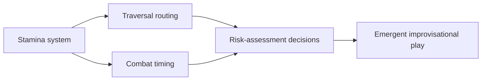

# From MDA to Generative Design: Theory and Practice in Contemporary Game Design

Contemporary game-design theory has shifted its center of gravity from static analytical scaffolds toward generative, AI-coupled design systems. The 22-year-old **MDA framework** now functions less as a working method than as a shared vocabulary the field has outgrown — yet has not replaced.

The scope of the shift is concrete. By August 2025 a Google Cloud survey found **90% of game developers had already integrated generative AI into production**, while a March 2026 GDC survey found **52% of developers believe that same technology is harming the industry** — a split that defines the discipline's present fault line.

MDA's narrative limitations were formalized as early as 2015, when Wolfgang Walk argued it "cannot represent narrative design structures". Yet MDA remains an active teaching and communication tool across 2024–2026 curricula and indie practice, even as successor frameworks (DDE, EDA, PXI) and generative paradigms (Cook's "game design is generative design," AIIDE 2025) absorb its analytical work. This report traces that arc through 2027, mapping which structures survive the generative turn, which dissolve into it, and where the coupling between human design intent and machine generation remains unresolved.

---

## 1. Framework, Scope, and Method

This report maps the conceptual frameworks that shape how designers reason about play, spanning MDA's 2004 origin through the 2025–2026 generative frontier. **MDA — Mechanics, Dynamics, Aesthetics — remains the gravitational center around which every successor theory still orients itself.**

### The Eight Frameworks at a Glance

| Framework | Origin | Core Constructs | Relation to MDA | Maturity |
|---|---|---|---|---|
| **MDA** | Hunicke, LeBlanc, Zubek, 2004 | Mechanics → Dynamics → Aesthetics | The reference framework | Field-standard |
| **DDE** | Walk, Görlich, Barrett, 2017 | Design, Dynamics, Experience | Extends Aesthetics into a richer layer | Growing in education |
| **EDA** | Natucci & Borges, 2021 | Experience, Dynamics, Artifacts | Inverts toward experience-first | Serious-games niche |
| **Schell's Lenses** | Schell, 2008 | ~100 diagnostic perspectives | MDA is one lens | Most-adopted player-centered model |
| **SDT/Motivation (PXI)** | Abeele et al., 2020 | Validated functional + psychosocial constructs | Measures MDA aesthetics empirically | Research-validated |
| **Generative Ontology** | AI/PCG research, 2025–26 | Ontology of generable rules/artifacts | New layer beneath Mechanics | Research-stage |
| **Game Design Pillars** | Practitioner heuristic | 3–5 load-bearing commitments | Operationalizes aesthetics as goals | Practice-only |
| **Procedural Gameplay Systems** | PCG literature | Algorithmic synthesis of playable content | Generates Mechanics/Dynamics at run-time | Adopted + advancing |

### Scope Boundaries

The report's object is **design reasoning, not design tooling** — conceptual models for relating rules, run-time behavior, and player experience, *not* software toolchains. The most consequential boundary separates **conceptual frameworks (MDA, DDE) from engine frameworks (Unity, Unreal)**. MDA makes no claim about rendering pipelines; it claims only that mechanics produce dynamics, which produce aesthetic experiences. A framework applies inside any engine or none: when a team introduced MDA during the Bomb 'n Chase jam, it served as "a catalyst and guide for the design process" independent of build tooling.

The temporal spine runs **from 2004 to the 2026 frontier**, a wide window that distinguishes durable commitments from tooling fashion. The 2026 frontier is dense with experience-first, often extended-reality educational titles — Zombie Ants VR, Social Soil, Heritage Hero, Benno's Light — legible only through an MDA-descended lens. The signal is concrete: **through 2027, the most active site of MDA application is likely serious and educational games rather than entertainment titles**, conditional on continued institutional funding.

Evidence spans **three domains, each a distinct validity signal**: academic theory (the 2025 JMIR scoping review of serious-game frameworks), industry practice (the 2015 MDA-to-grow-a-MOBA analysis), and educational deployment (the 2026 XR cluster). Academic validation prizes controlled measurement, industry prizes shipped retention, education prizes learning transfer — opposite evidentiary burdens that the report weights by domain-appropriate standards.

### Evaluation Rubric

Every framework is scored against **one six-item weighted rubric**, reused unmodified throughout:

| Item | Weight |
|---|---|
| Empirical Support | 0.25 |
| Practical Adoption | 0.25 |
| Theoretical Novelty | 0.15 |
| Player Value | 0.15 |
| MDA-Relatedness | 0.10 |
| Durability vs. Hype | 0.10 |

The weights encode a deliberate thesis: **Empirical Support and Practical Adoption jointly control half the score, because the field's recurring failure mode is elegant theory that is neither tested nor used.** Novelty is capped at 0.15 — a development cannot earn a high score on novelty alone, which is why the rubric discounts the most hyped, least-validated tooling. The operational test: does a development have at least one dated, named deployment with a measured outcome? **The rubric predicts that roughly half of today's most-discussed generative design tools will not clear the Practical Adoption threshold by 2030.**

### Key Vocabulary

The report's lexicon stratifies into three layers:

- **The MDA causal triad.** *Mechanics* are the rules a designer authors directly. *Dynamics* are the run-time behavior that emerges as mechanics interact with players — never authored directly, only steered. *Aesthetics* are the eight "kinds of fun" (desirable emotional responses, **not visual style**). Critically, **designer and player traverse this chain in opposite directions**: the designer reasons aesthetics-first and builds mechanics-last; the player encounters mechanics-first and feels aesthetics-last.

- **Generative-systemic terms.** *PCG* is algorithmic synthesis of assets and levels. A *procedural gameplay system* generates run-time playable *behavior*, not just static content. *Systemic emergence* (unscripted dynamics from interacting mechanics) is the conceptual opposite of *progression* (authored, sequential content) — emergence buys replayability and surprise at the cost of authorial control.

- **Player-experience terms.** *Agency* is the felt capacity to author one's own outcomes. *Flow* is optimal challenge-skill balance; *immersion* is deep content engagement; *presence* is the spatial sense of "being there," most acute in XR. *Ludonarrative* describes the harmony or dissonance between mechanics and story.

---

## 2. The MDA Framework

MDA is **the single most-cited formal design framework in game studies**, and its 2004 publication marked the moment the discipline acquired a shared vocabulary for reasoning from rules to feelings.

### The 2004 Formalization

Hunicke, LeBlanc, and Zubek introduced MDA at the 2004 AAAI Workshop on Challenges in Game AI, where they defined three layers: **Mechanics** (rules and algorithms), **Dynamics** (run-time behavior emerging from rules meeting player input), and **Aesthetics** (emotional responses evoked in the player). They paired each with a plain-language gloss — *rules, system, fun* — so the abstraction stayed legible to working designers.

The framework's authority rests on an unusual **bilingual origin**. Publishing inside an AI workshop embedded a systems-engineering register into its DNA, giving it citability; the preceding multi-year series of GDC workshops gave it credibility with practitioners. **MDA's twenty-year survival is best explained not by the elegance of its three letters but by the rare fact that it was born speaking to researchers and shippers at once.** This bilingual pedigree is precisely what successor frameworks lacking a practitioner-conference channel — DDE, EDA — have struggled to replicate.

**The framework's signature insight is directional.** As the CIS125G reader states, "the game designer only creates the Mechanics directly". The designer reasons forward (mechanics → dynamics → aesthetics); the player reads backward (aesthetics → dynamics → mechanics). The practical power appears when a designer inverts the chain: identify a target aesthetic, determine what dynamics would produce it, then specify what mechanics would generate those dynamics. This **backward-reasoning protocol** is MDA's single most-exported design move.

A genuine tension lives here: if the designer controls only Mechanics, intentional emotional design seems nearly impossible. The resolution is that **indirect control is not weak control** — by treating the target aesthetic as a fixed point and deriving mechanics toward it, the designer converts an indirect-control problem into a constraint-satisfaction problem. The layer most resistant to automation is therefore the *middle* one: predicting the dynamics a mechanic will produce in real players remains the hardest inference in the chain.

### The Eight Aesthetics

MDA's most reproduced and most misunderstood contribution is its **eight "kinds of fun"** — presented explicitly as a non-exhaustive starter list[^20]:

| Aesthetic | Gloss | Exemplar genre |
|---|---|---|
| Sensation | Sense-pleasure | Rhythm games |
| Fantasy | Make-believe | Immersive RPGs |
| Narrative | Drama | Story-driven adventures |
| Challenge | Obstacle course | Competitive/skill games |
| Fellowship | Social framework | Co-op multiplayer |
| Discovery | Uncharted territory | Exploration/survival |
| Expression | Self-discovery | Sandbox/creation |
| Submission | Pastime/flow | Idle, casual, comfort games |

**The decisive property is that any game targets several aesthetics at once in a weighted profile**, not one in isolation — which is why two games in the same commercial genre can occupy very different aesthetic coordinates.

The taxonomy's reason for existing is **a direct attack on the word "fun."** Two designers who both want a "fun" game may pursue incompatible goals — one chasing Challenge, the other Submission — and the shared word hides the conflict until it surfaces as broken design. "Make it fun" is unactionable; "increase the Fellowship aesthetic" points at concrete dynamics (shared objectives, interdependence) and thus concrete mechanics (revive systems, shared resources). The durable value is therefore **generative, not analytic**: the eight aesthetics function as a design-brief generator, setting emotional targets before mechanics are built.

**Worked example — a MOBA.** The genre is defined by three mechanics: team-vs-team play, hero control, and infinitely spawning minion waves. Trace each forward: infinite minion spawning (mechanic) generates a persistently contested lane front (dynamic) that produces *Challenge*. Hero control generates per-player skill expression and power asymmetry, producing *Fantasy* and *Expression*. Team framing produces *Fellowship*. The genre's profile — Challenge + Fantasy + Expression + Fellowship — is not stipulated but *derived* mechanic by mechanic through the dynamics. The same trace applies to a tabletop cooperative game (Hanabi's shared-hand-limit and no-table-talk mechanics yield a Fellowship-plus-Discovery profile), demonstrating MDA's **medium-independence**.

One tradeoff the example exposes: MDA is **diagnostic after the fact but not deterministic before it.** The same minion-wave mechanic yields a grinding Challenge aesthetic among novices and a tense tempo-control aesthetic among experts, because dynamics are contingent on who plays.

### Two Decades of Influence

**MDA's institutional footprint is larger than its intellectual footprint** — a distinction explaining both its canonical status and the backlash it provokes.

Its deepest penetration is pedagogical. The 2023 FDG paper on teaching technical game design records that "education surrounding game design has become a fixture in university education systems around the world," with MDA a foundational teaching tool. The mechanism is self-reinforcing: graduating designers already know MDA, so studios adopt it for onboarding, which raises the payoff of teaching it — a network effect any successor must overcome from a standing start. **On Practical Adoption, MDA earns the strongest pass of any framework in this report.**

Its citation footprint, however, carries a known distortion. A large share of MDA citations are **ceremonial** — cited in an introduction to signal literacy, then not used. The telltale marker of canonical status is that **MDA is cited less as a tool to use and more as the coordinate origin from which every newer framework measures its own displacement.** A framework can thus be simultaneously canonical in citation and contested in application — and MDA is exactly that. **On Empirical Support, MDA earns at most a partial pass**: its footprint documents influence, not validation.

MDA's most underrated contribution is sociological. Its three layers map cleanly onto studio disciplines — **engineers own Mechanics, designers own Dynamics, and Aesthetics is the shared goal that marketing, art, and design all claim a stake in** — making the framework a negotiation protocol. When applied to a hardware-differentiated game, it held "differentiating hardware and software components" in a single coherent brief. But MDA supplies a common language for *stating* disagreements without a method for *settling* them: two designers can now agree precisely that they disagree about Challenge versus Submission. MDA is **descriptive, not normative** — the source of both its cross-disciplinary reach and the ceiling on its usefulness as a decision tool.

---

## 3. Critiques and the Limits of MDA

MDA's influence has been shadowed by nearly two decades of dissent. **The most consequential critique is not that MDA is wrong but that it is incomplete in three named ways: an overloaded Mechanics layer, a structural blindness to authored narrative, and an ambiguous status between obsolescence and extension.** The verdict, stated up front: MDA survives where its critics concede it is strongest, and is *supplemented* rather than *replaced* wherever authored experience or measured affect dominates.

### The Mechanics Overload Problem

A 2020 IGI Global chapter argues that **players have overused "mechanics" to the point that it is virtually meaningless, while Dynamics and Aesthetics are comparatively neglected**. The claim targets not the original definition but downstream drift: "mechanics" has stretched to cover input mappings, monetisation loops, and narrative beats. When a term denotes everything, it discriminates nothing.

The mechanism is pedagogical. Students gravitate to Mechanics because rules and parameters are inspectable and buildable in a way run-time Dynamics are not; they then label every design choice a "mechanic," eroding the boundary that gives MDA its diagnostic power. **The overload is therefore an indictment of unsupervised pedagogy, not of the framework's text** — the cure is teaching the three layers as a causal chain rather than three independent vocabularies. The neglect is empirically visible: documented walkthroughs foreground buildable mechanics while Aesthetics gets delegated to marketing and Dynamics has no owner at all.

The overload and the canonical praise resolve once seen to address different populations: **the praise (MDA as "one of the most powerful analytical tools") tracks expert use where layer boundaries are respected; the condemnation tracks novice usage where they collapse.** No single framework can be both maximally rigorous and maximally accessible; MDA's designers accepted accessibility, and the overload is the price.

### Narrative and Authored-Experience Blind Spots

If overload is a flaw of *usage*, the narrative critique is a flaw of *architecture* — the single most influential reason successors were proposed. Walk's 2015 article states flatly that **MDA cannot represent narrative design structures, and there is currently no way to implement them**. The framework's three layers offer no slot for an authored arc; narrative can only appear as an *Aesthetic outcome* ("drama"), never as a designed structure.

The reason is causal. MDA defines Aesthetics as emergent from Dynamics from Mechanics — bottom-up. A narrative arc is authored top-down. **Walk's gap is therefore a scope boundary, not a refutation**: MDA was designed for systems-driven games where Aesthetics genuinely emerge, and the narrative gap is the expected cost of that focus.

This points to the deeper **Emergence vs. Progression** opposition. MDA is constitutionally an emergence framework; it is the wrong account for a game whose meaning rides on fixed authored sequence. The contemporary resolution is hybrid: an MDA-style systems core wrapped in an authored-experience shell. The 2026 CiFoS game adds food-system dynamics "step-by-step... while aligning existing dynamics" — authored progression layered onto an emergent core, where neither layer alone would suffice.

Against the critique stands the defence that **a framework can be foundational precisely because it is incomplete.** The 2024 Aboleth Overlords assessment observes MDA "has stood the test of time and remains relevant... as of 2024". Durability is itself evidence: a narrative designer still needs to reason about the systems their story rides on, and for that, MDA remains the default. **On Durability vs. Hype, MDA passes decisively.**

### Obsolete or Merely Incomplete?

The successors divide cleanly by self-positioning, and that positioning is the most direct evidence on obsolescence. DDE describes MDA as "the foundation... which adds an explicit experience layer" — building on, not burying. **The market structure of design frameworks selects for extensions**: a replacement must re-derive the systems vocabulary MDA already provides (a switching cost), while an extension lets practitioners keep their vocabulary and add a layer (a lower adoption barrier).

The countervailing fact is **fragmentation** — not one agreed successor but a proliferation of acronyms (MDA, DDE, EDA, plus Agile Behaviour Design and others), none commanding consensus. The 2026 Designer's Toolkit survey laments an "alphabet soup". But the fragmentation resolves into its opposite: **the frameworks proliferate because they *extend* MDA into domains it never claimed — narrative, workflow, measured affect — which measures the breadth of the design space MDA opened, not the depth of its failure.** A genuinely obsolete framework would be abandoned, not extended.

**The verdict: MDA is incomplete, not obsolete, and remains the field's default analytical base layer in 2026.** The relevance question has a precise answer — ask not whether MDA is relevant but *which layer of the design problem you are solving*. For systems-driven, competitive, and rapid-ideation work, MDA is primary; for narrative-led, affect-measured, and learning-outcome work, it is a necessary-but-insufficient base, supplemented by DDE's Experience layer, the PXI, and serious-game principles.

---

## 4. Successor and Alternative Frameworks

Between 2015 and 2026 at least four named frameworks arose to repair MDA's blind spots. **Where Chapter 3 read MDA's failures as critiques, this chapter reads them as design requirements that named successors attempted to satisfy.** Each inherits MDA's three-layer spine while attacking a different blind spot.

### DDE: Design-Dynamics-Experience

DDE was published by Walk, Görlich, and Barrett in 2017 (Springer, DOI 10.1007/978-3-319-53088-8_3), conceding MDA is "probably the most widely accepted and practically employed approach" before dismantling it. Its design problem is well-documented: **MDA cannot represent narrative.**

**Core move.** DDE renames and re-scopes two of three layers: *Design* replaces Mechanics; *Dynamics* is retained; *Experience* replaces Aesthetics. The Design layer is partitioned into **Blueprint** (world, characters, story), **Rules** (formal constraints), and **Scenario** (concrete content) — so authored story sits inside the framework at the same level as rule systems. "Design replaces Mechanics" solves an *input-breadth* problem (Mechanics excludes narrative); "Experience replaces Aesthetics" solves an *output-clarity* problem (the eight-fun list is too coarse for authored emotional arcs).

DDE explicitly *extends* MDA — Design ⊇ Mechanics, Dynamics = Dynamics, Experience ⊇ Aesthetics — making it a **superset at the spine**: every MDA design expresses in DDE by leaving Blueprint thin, but not vice versa. **Its defining contribution is making narrative authorship a structural input rather than an emergent accident.**

**Strengths and limits.** DDE's narrative slots directly answer Walk's gap, and its Blueprint/Rules/Scenario partition maps onto production labor (narrative, systems, content designers). But it inherits MDA's unproven assumption — that authored Design reliably produces intended Experience — and supplies *no measurement instrument*. DDE can *represent* narrative structure but does not make narrative *better*; a poor Blueprint produces a poor Experience. The contribution is a vocabulary win, not a craft win.

**Maturity.** Documented use concentrates in microlearning, where a 2023 deployment used the Experience layer to align learning outcomes with scenario content. DDE sits at the **adopted-in-niche** tier: nine years of citation rules out fad (passes Durability vs. Hype), but its experience-prediction claims remain untested against an MDA control (fails Empirical Support). Notably, the "Experience" relabel has propagated further than the Blueprint/Scenario partition, diffusing into 2024–2026 narrative research even where the DDE label is not adopted.

### EDA: Experience-Dynamics-Artifacts

EDA was introduced by Natucci and Borges at IEEE CoG 2021, with a more ambitious aim than extension: **dissolving the boundary between games that entertain and games that teach.**

**Core move.** EDA *inverts* MDA's reading order. The three layers are Experience, Dynamics, Artifacts, with **Experience placed first as the design driver** rather than emergent output. The designer begins from intended experience (a learning outcome, an emotional state), derives the required dynamics, then specifies the artifacts. Artifacts broadens Mechanics to all designed game objects. **EDA's defining innovation is making intended experience the starting point rather than the hoped-for byproduct** — which reads naturally for serious games where the outcome is fixed before any artifact exists.

EDA's boldest claim is that a well-designed game makes learning and entertainment **indistinguishable.** If the designer begins from a fused target, the dynamics and artifacts cannot be sorted into "fun parts" and "educational parts." The 2026 *Zombie Ants VR* is a near-perfect case: its trial-and-error loop, where each failed attempt restarts the player as a new fungal spore, "teaches players natural selection intuitively without explicit theory". The learning *is* the mechanic.

**Strengths and limits.** EDA unifies serious and entertainment design and natively fits outcome-driven work. But its adoption *reinscribes* the boundary it sought to erase — heavily cited in serious-games research, nearly absent from entertainment practice. Indistinguishability also raises a measurement challenge: if learning and play are fused, how to verify learning *occurred*? The resolution is methodological — design fusion is compatible with distinguishable *measurement*. The 2026 Space Exodus study confronts this directly: a six-week pre/post design found concentration scores **rising from 65.2 to 80.3 on the Toulouse-Pieron test (p < 0.01)** across sixteen children in Ecuador.

**Maturity.** EDA's principles are firmly **adopted-in-practice within serious games**, evidenced by a dense 2025–2026 application record (CiFoS, Social Soil, the Ateneo Martial Law escape room) and at least one validated outcome study. Critically, **EDA earns the measured validation DDE lacks — but only within its niche.** One limit worth naming: not every experience translates to game dynamics. A 2017 study found social features "inappropriate" for security-question serious games because users feared acquaintances could access their answers; experience-first ordering tells you where to start, not which dynamics will betray the goal.

### Player-Centered Models: Lenses and Motivation

The player-centered cluster **abandons the three-layer spine entirely.**

**Schell's Lenses** treat good design as viewing the game "from as many perspectives as possible" — a *collection* of ~100 question-sets rather than a layered model. This is a different epistemology: where MDA proposes a *theory* of how design produces experience, Schell proposes a *practice* of interrogation. The lenses **complement** MDA (MDA itself is one lens), which is why they rarely appear in the alphabet-soup critique — they do not compete for the single-framework slot. Their strength is pedagogical breadth and descriptive accuracy; their weakness is no prioritization and no falsifiable predictions. Judged as a *craft heuristic* rather than a *predictive model*, they succeed. **Most broadly adopted player-centered framework in education globally.**

**Self-determination-theory (SDT) motivation models** supply what MDA conspicuously lacks: **a validated psychology of why players engage.** Operationalized as the PENS model, they posit intrinsic motivation rests on three needs — autonomy, competence, relatedness. They *measure* what MDA only *gestures at*: MDA names eight kinds of fun but offers no theory of why any motivate. The decisive strength is empirical grounding — decades of experimental validation outside games give design predictions a falsifiable basis. **The clearest Empirical Support pass in the cluster.** The limitation is scope: they predict engagement but are silent on narrative and structure, so they must combine with a structural framework. **The empirical anchor the MDA family lacks, increasingly functioning as the measurement layer that structural frameworks plug into.**

### Cross-Framework Comparison

| Framework | Relation to MDA | Strength | Maturity |
|---|---|---|---|
| **MDA** | baseline | Teachable causal spine; durable vocabulary | Field-default, 20+ yrs |
| **DDE** | extends; widens 2 layers | Narrative as structural input | Niche, 9 yrs citation |
| **EDA** | extends + re-orders | Unifies serious + entertainment | Serious-games default, validated |
| **Schell's Lenses** | complements; MDA is one lens | Flexible craft heuristic | Most-adopted player-centered |
| **SDT/Motivation** | measures MDA's output | Strongest empirical pedigree | Research-validated |
| **Generative ontology** | formalizes MDA beneath it | Could supply shared substrate | Research-stage |

**No successor occupies MDA's exact structural slot** — each attaches above, beside, beneath, or alongside it. DDE and EDA extend the spine in orthogonal directions; the lenses and motivation models do not contest it; the 2021 ontology effort proposes to formalize it. This is **the formal signature of a complementary ecosystem rather than a succession race.**

**Convergence or fragmentation?** The surface evidence points to fragmentation (the "alphabet soup"). But structurally the field is **converging on a shared substrate — MDA's three-layer spine — while specializing at the layers.** A truly fragmenting field would produce *incommensurable* structures; instead every framework is commensurable with MDA. The contradiction resolves once "number of named frameworks" is distinguished from "number of underlying structures": the former is growing while the latter has stayed at one since 2004. The 2021 ontology proposal is the clearest forward signal — if adopted by 2028, the alphabet soup would be revealed as dialects of a single language.

On evidence, the frameworks split into three tiers. **EDA and motivation models top the tier** with measured outcome evidence. The lenses occupy a distinct tier — enormous adoption, no empirical validation, which is a category fact, not a failure. DDE and the ontology are argued or proposed but not validated. The decisive pattern: **empirical support tracks the serious-games niche, not theoretical ambition** — the frameworks with measured validation are exactly those deployed in education, where pre/post studies are routine. The next decade's empirical case for any MDA successor will be built in classrooms and clinics, not commercial studios.

---

## 5. Player Experience: Measurement and Design Models

The defining shift across 2017–2026 is that **player experience has migrated from a post-hoc evaluative concern to a first-class design target with validated instrumentation.** MDA's aesthetic terminus only becomes actionable when a downstream model translates intended Aesthetics into a measurable player-side construct — now the most active research front in game-experience science.

### The Player Experience Inventory (PXI)

The PXI is **the most rigorously validated bridge between MDA's theoretical Aesthetics layer and empirical measurement.** It was refined through **seven studies involving 64 game experts and 529 players** — among the most thoroughly grounded tools in the field. It draws on **Means-End theory and the MDA framework**: Means-End theory holds that people value a product not for its attributes but for the chain those attributes trigger (feature → benefit → value); PXI re-expresses this ladder in MDA's vocabulary, connecting a mechanic to an aesthetic payoff. **On Empirical Support, PXI earns the clearest pass of any MDA-adjacent construct.**

PXI's defining architecture is a **split into two construct layers**, directly re-encoding the MDA chain:

- **Functional Consequences** — does the game *work*? (clear goals, legible progress, responsive controls) — quantifying the immediate results of using mechanics.
- **Psychosocial Consequences** — does it *mean* something? (mastery, immersion, curiosity) — capturing the affective payoff dynamics elicit.

The two-step laddering — mechanics → functional consequence, dynamics → psychosocial consequence — **is precisely the MDA chain rendered as two measurement tiers.** This resolves a real tension: a single satisfaction score conflates two failure modes (functionally broken vs. functionally fine but experientially hollow). PXI's bifurcation returns a **two-vector diagnostic** that localizes a poor experience to one tier, unlike a generic enjoyment metric that returns a single uninformative scalar.

The deepest claim is that PXI **operationalizes the otherwise slippery eight aesthetics into constructs that survive psychometric scrutiny**, routing each MDA aesthetic through the Means-End ladder until it terminates in a self-reportable psychosocial construct. The forward implication: because PXI already binds dynamics to psychosocial consequences, the most probable 2026–2028 extension is **using PXI subscale outputs as a fitness signal for generative and mixed-initiative systems** — a procedural system optimizing directly against a measured psychosocial target rather than a proxy heuristic.

What remains unresolved is whether PXI's two-subscale discriminance holds in live-service and XR contexts its original 529-player pool did not sample — the chapter's clearest open research front.

### Motivation, Agency, Flow, and Immersion

The constructs PXI samples are **theoretically distinct, separately engineerable variables**, each with its own lever and failure mode.

**Flow.** The 2026 *Struggle as Flow* study fuses flow theory with Juul's ludology to explain Souls-like appeal. The counterintuitive finding: **flow is not the absence of frustration but its rhythmic resolution** — the genre keeps players just above the skill line so each cleared obstacle delivers the flow payoff. A network-analysis study adds that task-oriented coping (planning, active coping) is most strongly linked to flow's absorption and fluency dimensions. The adaptive-difficulty tradeoff is sharp: visible or aggressive adjustment dissolves the *earned competence* that produces flow, so the resolution is **invisible or opt-in adjustment** that preserves the player's attribution of success to their own skill.

**Agency vs. authored experience.** The Author-Actor-Audience framework models a scale from designer-authored to player-driven. The central problem: **agency and narrative coherence are partially rivalrous** — every increment of freedom surrenders an increment of authorial control. The resolution is *selective* agency: grant high agency where authored meaning is robust to divergence (combat, exploration), reserve control for narrative beats whose meaning depends on sequence. LLM-driven dynamic narrative will reopen this at a new scale: the designer's role shifts from authoring content to **authoring constraints on the generator.**

**Embodiment and presence in XR.** A 2025 *Frontiers in Virtual Reality* study showed **spatial presence and virtual embodiment are distinct yet mutually reinforcing constructs** — *presence* is being located *in* the environment, *embodiment* is the virtual body being *yours*. XR emotional design must engineer both. Concrete 2026 cases: *Benno's Light* walks users through Holocaust survivor Benno Kern's life story, leveraging presence to make a historical narrative affectively immediate; *Before You Go* has children perform medical procedures "as the doctor," using embodiment to convert pre-treatment anxiety into rehearsed familiarity. By 2027, XR instruments will need presence and embodiment as standard subscales alongside PXI's functional/psychosocial split.

### Social Play, Narrative Interactivity, and Emergence

The frontier lives where constructs collide — and these aesthetics most strongly resist PXI-style decomposition because their value arises from *interaction effects* a linear chain does not model.

**Ludonarrative friction.** A 2026 *Journal of Digital Media & Interaction* analysis argues meaning arises not from harmony but from *friction* between narrative, mechanics, and action. The contrarian claim: **ludonarrative dissonance — long treated as a defect — can be a deliberate meaning-generating mechanism.** The gap between a game telling you you're a hero while rewarding violence is exactly where moral reflection is provoked. The resolution is *intentional* friction: designed dissonance where moral reflection is the goal, coherence where immersion is the goal.

**Fellowship in live games.** Fellowship has become the defining live-service aesthetic, requiring a development process as iterative as the social systems themselves — which is why Agile Behaviour Design's "loose, fluid interactions" map onto perpetual tuning. But fellowship is **context-dependent**: the same "get help from other players" mechanic that manufactures fellowship in a cooperative raid was found *actively corrosive* in the security context. An aesthetic is a property of a mechanic-*in-context*, not of a mechanic alone.

**Emergence as a design target.** Emergence has shifted from accident to deliberate target, **engineered by *staging* the introduction of interacting dynamics.** CiFoS adds complexity "step-by-step... while aligning existing dynamics" — emergence as a managed product. *Zombie Ants VR* makes the logic concrete: the player *experiences* selective pressure as an emergent consequence of repeated failure. The shared resolution is **constrained emergence** — a system rich enough to surprise but scoped tightly enough that the surprise teaches.

**The social, narrative, and emergent aesthetics are exactly where MDA's clean ordering bends** — because their value arises from friction, context, and interaction effects. The field can now measure simple aesthetics rigorously, theorize individual constructs precisely, but is still learning to instrument the interaction effects. The open question: whether they can be captured by any subscale structure at all, or require a behavior-trace-based paradigm rather than self-report.

---

## 6. AI and LLMs in Game Design

**Generative AI does not replace MDA but redistributes where in the chain design labor happens** — pushing ideation upstream into world-model simulation and ontology-constrained generation, while leaving aesthetic judgment stubbornly human. Despite claims that LLMs will automate game design wholesale, the evidence through 2026 points the other way: **the most credible deployments tighten the designer-in-the-loop rather than remove the designer.**

### Generative Models for Ideation

Microsoft's **WHAM/Muse** (Nature, February 2025) is the reference instance of world-model ideation. Trained on roughly seven years of gameplay from *Bleeding Edge*, it **generates consistent, diverse gameplay sequences while persisting user modifications injected into a scene**. It is a "world model" in the technical sense — it jointly predicts the next visual frame *and* the next controller action, internalizing not just how a scene looks but how its Dynamics respond to input.

The dual output is what separates Muse from image and video generators. **By producing pixels paired with controller actions, the model generates candidate *Dynamics* rather than candidate *Aesthetics*** — the precise inversion of most generative art tools, and the causally upstream layer MDA theory privileges. The "persistence of user modifications" property is the ideation payload: dropping a new obstacle into a scene carries forward coherently, turning the model into a sandbox for the "what-if" phase.

The workflow consequence is a **reordering of the prototype-then-playtest loop**: where a conventional team hand-builds a grey-box prototype and only then discovers whether the Dynamics produce the intended Aesthetics, a Muse-class model lets the team *sample* many Dynamics candidates before any grey-box exists. The economics shift toward breadth — a sampled rollout that proves un-fun costs only compute. The resolving constraint: **world models are consequence engines, not idea engines.** Creativity stays with the human who chooses the perturbation; the model supplies only the consequence-simulation. Whether dual-output models generalize beyond their single training title remains undemonstrated.

### Structured Generation: Generative Ontology

Cheung's 2026 Generative Ontology framework attacks the *Mechanics* layer by constraining it, addressing a specific LLM failure: models asked to "design a game" produce structurally broken output — mechanics without components, goals without end conditions.

**Core machinery.** The framework encodes domain knowledge as **executable Pydantic schemas** that constrain LLM generation via DSPy signatures. A schema declares that every mechanic must have a name, a component it acts on, and a defined effect — and *rejects* any object missing those fields. By making the schema executable rather than advisory, **the framework turns design grammar into a runtime gate**: an LLM proposal violating the ontology is caught mechanically before reaching a human. **On Theoretical Novelty this earns a clear pass** — binding generation to a validated type is genuinely new, distinct from the prompt-engineering patches that preceded it.

The multi-agent pipeline maps directly onto MDA. The framework employs a **Mechanics Architect** (rules layer), a **Theme Weaver** (aesthetic/narrative framing), and a **Balance Critic** (emergent dynamics) — a near-literal instantiation of the triad. The Balance Critic is load-bearing: by evaluating the dynamics a proposed mechanic would produce and feeding objections back, it closes the Mechanics-Dynamics loop. **On MDA-Relatedness, the strongest pass in the chapter** — it operationalizes the three layers as distinct computational agents.

The animating slogan — **"ontology provides grammar, LLM provides creativity"** — is also the site of its deepest vulnerability. A 2025 analysis argues **hallucination is a structural outcome of the transformer architecture, not a remediable flaw**. If so, the ontology gate does not eliminate hallucination; it merely catches the structurally invalid subset. A model can still hallucinate a perfectly well-formed but creatively bankrupt mechanic, and the schema waves it through. The framework is best read as a **hallucination *filter*, not a *cure*** — raising the floor of structural quality while leaving the ceiling of creative judgment to the designer. **On Empirical Support, only a partial mark**: the preprint demonstrates the mechanism but reports no controlled study against an unconstrained baseline.

### Mixed-Initiative Workflows

The 2026 TUM work by Geheeb and colleagues on **Game Design Pillars and the SPINE prototype** stakes out the designer-in-the-loop position explicitly against full automation. Game Design Pillars are the 3–5 load-bearing commitments a team agrees a game must honor. SPINE's insight is to treat pillars as the **anchoring constraint for LLM generation**, so every artifact traces back to an explicit pillar — anchoring to *human design intent* rather than to a formal schema. This implicitly runs MDA in reverse: starting from aesthetic intent, asking the LLM to propose consistent mechanics.

SPINE's output is **natural-language design artifacts** — documents and rationale statements — not code. Its bet: **the highest-value place to insert an LLM is not generating the game but generating and maintaining the documentation that keeps a design coherent as it evolves.** This deliberately humble target slots into existing studio practice (pillars are already standard in pre-production), facing a far lower adoption barrier than tools demanding formal schemas.

The designer-in-the-loop spectrum runs from **SPINE's designer-arbiter pole**, through Generative Ontology's **agent-arbiter middle**, to the world-model **consequence engine** with no arbitration. The central tradeoff is throughput vs. authorship: **authorship degrades faster than throughput improves**, because the aesthetic judgment MDA places at the end of the chain resists formalization. **On Durability vs. Hype, the mixed-initiative posture earns the chapter's most durable verdict** — by targeting coherence-maintenance rather than the generate-everything fantasy, it survives the deflation of generative hype.

**Where AI couples to the triad:** world models at *Dynamics*, Generative Ontology at *Mechanics*, SPINE at the *Aesthetics-driven pillar layer*. **The closer a coupling moves to the Aesthetics end, the more firmly the human retains control** — Mechanics and Dynamics admit machine assistance because they are formalizable, while Aesthetics resists it because it is a judgment, not a structure. This asymmetry is why the wholesale-automation thesis fails.

### Industry Adoption and Authorship

Two dated cases bracket the authorship debate. At the AAA extreme, **Tomb Raider: Legacy of Atlantis** disclosed (Steam, June 2026) that Crystal Dynamics used AI-assisted tools for "early exploration and temporary development content," with **all AI-generated assets later replaced or refined by humans** — locating AI firmly in the ideation phase and excluding it from the shipped artifact. This directly confirms the designer-in-the-loop thesis, and attempts a **transparency-and-replacement** resolution to the franchise-authenticity tension.

At the opposite extreme, a 2026 guide documents solo developers using LLMs to **"write shaders, build editor tools, generate models, and prototype mechanics that would be too annoying to implement manually"** — collapsing the technical barriers between a solo developer and a small studio. This is an accessibility gain for *creators*, likely to increase the volume and diversity of solo titles exploring experimental mechanics.

The two cases stake out opposite answers to what counts as authored. **The AAA position defends *authorship-as-execution* (shipped pixels must be human-made); the solo-dev position defends *authorship-as-direction* (intent and decisions are human, execution may be machine-assisted).** Both are internally coherent; the debate turns on a value choice, not logic. The likeliest trajectory: the two senses formalize into **distinct market labels** rather than one winning outright, as disclosure regimes harden into norms. **On Durability vs. Hype, the authorship debate earns a durable verdict** — a structural value disagreement, not a transient hype artifact.

The adjacent practice areas — adaptive difficulty, live-service, XR, inclusive design — each operationalize a different MDA layer under deployment constraints research prototypes abstract away. The densest evidence is in educational XR, where the Space Exodus result (65.2 → 80.3, p < 0.01) supplies the kind of quantified Player Value evidence the generative frameworks still lack.

---

## 7. Procedural Content Generation and Generative Design

PCG has moved from a level-fabrication trick into a candidate reframing of design itself. **PCG is not merely a Mechanics-layer production technique but a force that reshapes Dynamics and Aesthetics**, and a 2025 conference thesis — "game design is generative design" — pushes the reframing to its edge.

### The PCG Landscape

The Farrokhi Maleki & Zhao survey (arXiv:2410.15644, October 2024) is the field's most current synthesis, framing decades-old search-based PCG against 2023–2024 deep-learning and LLM-based generators in one vocabulary. Its forward implication is sharp: **by 2027 the dominant question shifts from "can a model generate playable content" to "can a designer constrain a model's output to a specified Dynamics envelope" — controllability, not capability, becomes the gating variable.**

The four paradigms differ in **where the designer's intent enters the pipeline**, which determines their compatibility with intent-driven authorship:

| Family | Control surface | Reproducibility | Structural novelty | MDA layer |
|---|---|---|---|---|
| Noise-function | Numeric params + seed | Total | Low (uniform mechanics) | Mechanics |
| Search-based | Fitness/constraint function | Moderate | Moderate | Mechanics → Dynamics |
| ML-based | Training corpus + latent sampling | Low | Moderate-high | Mechanics, Aesthetics |
| LLM-based | Natural-language prompt | Low | High | Mechanics → Dynamics → Aesthetics |

The designer's choice is a **position on a controllability-novelty frontier**: noise-function offers near-total reproducibility at the cost of structural novelty; LLM-based offers high novelty at the cost of intent-alignment.

PCG's adoption is **not speculative — a multi-decade shipped record** from *Rogue* (1980) and *Elite* (1984) through *Minecraft* (2011) and *No Man's Sky* (2016). The chain to emergent gameplay is documented: PCG generates varied content, which creates conditions for emergent mechanics through player interaction, which produces novel experiences — **but only when generation is balanced against coherence**. *No Man's Sky*'s launch criticism for "samey" content despite technical variety surfaces the key lesson: **perceived novelty depends on mechanical consequence, not asset variation** — players experience two planets as different only when the difference changes what they *do*. The competitive differentiator through 2028 will be *generation consequence*, not generation scale.

### "Game Design Is Generative Design"

At AIIDE 2025, **Michael Cook** advanced the position that the boundary between authoring a game and authoring a generator is illusory. He introduced the term **procedural gameplay system** — generative machinery that produces *gameplay* (rules, interactions, run-time behaviors), narrower than PCG-at-large. A noise-function terrain generator makes content; a procedural gameplay system makes the *play itself*, generating Dynamics rather than feeding it. **The thesis reframes the designer's primary craft object from the artifact to the generator.**

This makes the designer's leverage **simultaneously larger and more diffuse** — larger because one rule-set governs thousands of instances, more diffuse because the designer can no longer inspect every instance. The May 2025 MDPI study frames this as the open question of whether generative AI enhances creativity or constrains innovation.

The reframing opens an **ethical surface** the purely technical PCG literature skips: when a system generates the play, the system's biases become the game's biases at scale — *representation* (a biased corpus reproduced across thousands of generated characters), *manipulation* (procedurally tuned difficulty and reward schedules optimized for spending), and *player safety* (generation-time constraints replacing per-instance moderation). **Through 2028, the binding constraint on generative-design adoption in monetized contexts will be ethical governance tooling — privacy-preserving generation, dark-pattern auditing, bias controls — not generative capability.**

### Conflict with Intent-Driven Authorship

The sharpest friction is with MDA's founding assumption that the designer authors with intent. **A procedural gameplay system inserts an autonomous generator between intent and realized Mechanics**, so the designer no longer directly authors the Mechanics the player meets — threatening the intent-to-experience line MDA depends on. This demands an additional layer: a way to specify intent that survives the generative step.

Two 2026 frameworks target this reconciliation from opposite ends:

- **ToMigo** represents designer intent as interpretable **design concept graphs**: designers express intent as graphs whose nodes are purpose/content/style choices, which constrain the LLM's generation, producing output aligned with intent pathways the designer can re-steer. Reconciliation at the **specification** layer — making intent machine-readable *before* generation.
- The **human-ownership framework** (Proceedings of the Design Society) addresses the same gap from the workflow side: it establishes **provenance tracking** for AI outputs, enabling designer feedback at multiple stages and outcome metrics measuring alignment with intent. Reconciliation at the **workflow** layer — making generation auditable *after* the fact.

They are complementary: ToMigo constrains the input space, the human-ownership framework constrains output acceptance. **Both pass MDA-Relatedness decisively** (each is an intent-preservation layer bolted onto the Mechanics generator), but **both remain research-stage as of 2026** with no documented shipped deployment.

### Mapping Generativity Back to MDA

| MDA layer | PCG's intervention | Consequential effect | Binding constraint (through 2028) |
|---|---|---|---|
| Mechanics | Generates varied rules/content | Variability at point of authoring | Controllability of rule instantiations |
| Dynamics | Receives propagated variability | Emergent, unscripted run-time behaviour | Keeping emergence bounded and legible |
| Aesthetics | Receives Dynamics outcomes | **Selective**: amplifies Discovery/Challenge, strains Narrative/Fellowship | Accessibility envelopes + narrative coherence |
| Control | Mixed-initiative intent envelopes | Partial designer authorship | Defining a reliable envelope; ethical tooling |

**PCG injects variability *into* Mechanics that propagates *upward* into Dynamics** — the same player strategy meets different mechanical conditions each run and produces different run-time behaviour. Its terminal effect is **aesthetically selective**: it strongly serves Discovery, Challenge, and Sensation by manufacturing novelty across replays, but serves Narrative weakly or harmfully, because procedurally generated narrative tends toward incoherence at exactly the point authored narrative delivers its payoff. **Generativity is not aesthetically neutral; it is aesthetically selective** — a selectivity the MDA taxonomy makes visible where a flat "replayability" metric does not. *Accessibility* is an aesthetic-outcome variable here: by 2028, adaptive PCG difficulty will be expected to ship with explicit **accessibility envelopes** — designer-specified bounds on generated challenge.

Designer control over generative output is best modelled as a **mixed-initiative spectrum**, not a binary. The optimal control point is intentionally *partial*: the designer specifies an intent envelope and accepts surprise *within* it. The constraint is that defining a reliable envelope is itself the hard, unsolved problem — too tight and generativity collapses to authoring, too loose and the ethical and coherence risks re-enter. **On Durability vs. Hype, mixed-initiative generative control is durable** — it rests on a decade of converging evidence from Agile Behaviour Design (2018) through ToMigo and the human-ownership framework (2026).

---

## 8. Emergent Systems and Cross-Context Application

**Systemic emergence, cross-context portability, and data-informed balancing are three views of one shift: design authority moving from authored content toward tuned rule-spaces.** The recurring object is the MDA Dynamics layer — the run-time behavior arising when mechanics meet players.

### Emergence vs. Progression Theory

Juul's 2002 distinction remains the most load-bearing tool for reasoning about systemic games. A game of **progression** presents authored challenges serially (tight control, high content cost); a game of **emergence** specifies a few rules whose interaction produces a combinatorially large space. **The defining test is authorship locus: progression locates variety in authored content, emergence in the rule-interaction space.** Most shipped titles blend both, making the distinction less a taxonomy than **a dial a designer sets per subsystem.** As generative tooling lowers authored-content cost, the historical pressure toward emergence weakens, so by 2028 the dial should be set on *design-intent* grounds rather than *budget* grounds.

The mechanism is **system stacking** — independent systems beginning to influence each other (a March 2026 Design Lab analysis). A stamina system, added in isolation to govern sprinting, begins affecting traversal routing and combat timing once it interacts with climbing and combat, producing retreat-to-recover and commit-or-flee situations no designer scripted. **Emergent density is a function not of system count but of the number of *interaction edges* between systems.**

The paradox: maximizing interaction edges maximizes emergence but also maximizes the QA surface and exploit risk. The resolution — drawn from the **immersive-sim lineage** — is not to cap density but to design each system with *legible, physically-grounded rules* (fire spreads, water conducts) so emergent combinations read as *fair* rather than as bugs. **The constraint that resolves the tension is rule legibility, not rule scarcity.** The lineage's core methodological innovation is the shift **from designing solutions to designing solution-spaces.** As AI-driven NPCs become another *system* in the stack, the immersive-sim solution-space philosophy becomes the natural grammar for integrating them.

### Advancements Across Genres and Platforms

Modern production spans a cost range of four orders of magnitude, and systemic ideas diffuse very differently across it.

| Context | Team/budget signal | Authorship bias | Dominant aesthetics |
|---|---|---|---|
| **AAA** | 300–1,000+ staff; ~$540M peak | Authored, predictable | Spectacle, narrative |
| **Indie** | Solo–small; $0 Unreal entry | Systemic, emergent | Challenge, discovery |
| **VR/AR** | AAA >$50M; Unity 60–70% | Embodied interaction | Sensation, presence |
| **Live-service** | $40–50M/month | Retention-loop | Fellowship, progression |
| **UGC (Roblox)** | 44% AI-tooled creators | Player-authored | Expression, economy |

**Coordination cost is the hidden variable.** AAA's thousand-person teams bias toward authored, predictable content because emergent systems are hard to partition and QA at headcount. Indie inverts this: near-zero coordination cost lets small teams hold the whole system stack in a few heads, permitting the dense interaction-edge designs that differentiate indie systemic titles. **Live-service optimizes an orthogonal aesthetic — retention loops and monetization cadence** — averaging $40–50M/month.

This surfaces the period's central **design-ethics tension**: the same variable-reward schedules that produce healthy engagement also produce compulsive spending, and the two are not cleanly separable at the mechanic level. The resolution responsible studios converge on is **disclosure and spending guardrails** — published drop rates, spend caps, cooldowns — forced by regulatory pressure now treating loot boxes as gambling.

**Cross-platform play** reshapes the Mechanics layer: a mechanic tuned for mouse precision behaves differently under gamepad or touch, forcing input-agnostic or adaptively retuned mechanics. The accessibility payoff is structural — the same input-abstraction layer enabling cross-platform parity enables eye-tracking and adaptive controllers to map onto the same mechanics without bespoke rework, which is why accessibility has moved from afterthought to design-time concern.

**UGC ecosystems** represent the furthest authorship-delegation: Roblox delegates *game-authorship itself* to players. As of April 2026, **44% of the top 1,000 Roblox creators use Roblox Assistant or third-party AI tools** to plan, build, and test games. Roblox runs two nested MDA layers — platform-level (creation tools as mechanics) and per-game. Agentic AI lowers the creation floor, expanding the creator population, which multiplies both content volume *and* the surface across which unsafe content can reach a young player base. The resolution is to push safety into the creation tooling itself, with the binding constraint that **moderation tooling must scale at least as fast as creation tooling.** **On Practical Adoption, the UGC-with-agentic-AI model passes decisively.**

### Data-Informed Balancing and Adaptive Difficulty

Telemetry has turned balancing from craft intuition into a measured pipeline. **A telemetry-driven pipeline relocates the MDA Dynamics layer from something designers *imagine* to something they *observe*.** The ethics dimension is not optional: the same instrumentation that enables fair balancing enables surveillance-grade profiling. The resolution privacy-conscious studios converge on is **purpose limitation and aggregation** — balancing operates on de-identified distributions, individualized profiling faces consent constraints.

**Dynamic difficulty adjustment (DDA)** modulates challenge to keep each player in the flow channel. The causal chain (Applied Sciences study): player success triggers a difficulty increase, which maintains challenge-skill balance, which preserves flow, which produces the intrinsic motivation that keeps the player playing. Each link can fail independently — an increase that overshoots breaks the balance and collapses the chain into frustration. This is the **competence need** from SDT made operational.

The strongest evidence quantifies the stakes. An RMH Studios study found **predictive DDA yielded 7-day retention of 78%, vs. static-easy (46%), static-hard (34%), and reactive DDA (64%)** — a 44-point spread, among the most concrete quantified design effects in this report. The counterintuitive link: players retained *better* under *higher* objective difficulty because predictive matching lowered *perceived* effort. **Adaptive onboarding is one of the few places in live-service design where well-being and revenue point the same direction** — sharply unlike the monetization dark-pattern case where player and revenue interests diverge.

The MDA Dynamics layer has become directly observable and therefore directly tunable. What remains unresolved is governance: **the same instrumentation serves aligned onboarding and misaligned monetization, and no technical property of the pipeline determines which dominates** — that is set by studio ethics and regulation.

---

## 9. Practical Design Applications

The frameworks earn their keep **not as explanatory theory but as decision-forcing instruments that convert vague aspirations about "fun" into falsifiable design targets.**

### MDA-Informed Workflows

MDA's workflow value is **build-order discipline**: specify the aesthetic target first, diagnose through Dynamics second, commit mechanics last.

**Prototyping.** MDA inverts the naive loop. A team without a framework builds a mechanic and asks "is this fun?" — too diffuse to act on. A team using MDA names the target aesthetic first, then asks the tractable question of whether observed Dynamics produce that specific experience. The Bomb 'n Chase jam used MDA as "a catalyst and guide"; the Atomic Object project applied the same discipline professionally. By 2027, MDA-structured prototyping is likely to fuse with mixed-initiative tooling that reads an aesthetic label as a constraint.

**Balancing.** The MOBA case is the most fully worked example[^6]: **balancing is aesthetic arbitration, not numerical symmetry.** Raising minion gold values accelerates the economy, which compresses the laning phase, which erodes the very Tension the mechanic was meant to generate. **The balance lever and the aesthetic outcome are separated by two or three dynamic links, and MDA's contribution is making that causal distance explicit.** A designer who balances for win-rate fairness alone can produce a symmetric game that evokes none of the intended aesthetics. Through 2028, studios that operationalize aesthetic-target balancing — measuring whether a patch preserved the Tension curve — will hold a retention advantage.

**Onboarding** is a Dynamics concern (how the player learns through play) frequently mistaken for a Mechanics concern (which tutorial screens to build). MDA reframes it as **deliberate sequencing of aesthetic delivery**: front-load the target aesthetic in simplified form, then progressively reveal the mechanics that deepen it. The durable insight: **both onboarding and narrative are aesthetic-delivery problems misclassified as mechanical ones.**

### Educational and Serious Games

Serious games impose a constraint entertainment escapes: the aesthetic target must coexist with a measurable learning outcome, and the two can conflict. The field is converging on the EDA principle that **the most effective serious games make the learning indistinguishable from the play.**

**AI-enhanced MDA.** The 2025 JMIR review identified feedback, adaptation, and collaboration as principles common across effective serious games — each mapping to an MDA layer amenable to AI enhancement. The Space Exodus study supplies the rare quantified evidence: concentration scores rose **from 65.2 to 80.3 (p < 0.01)** across sixteen children in Ecuador. The small sample (16) is the concrete falsifiable gap.

**EDA-driven design** finds its natural home here, because the experience (learning) is the specified endpoint. *Zombie Ants VR* is a near-perfect EDA artifact: specify the experience (intuitive grasp of selection pressure), derive the dynamic (iterative death and respawn as a new variant), build the artifact (the spore-restart mechanic). *Social Soil*'s mechanics of planting, connecting fungi, harvesting, and resource exchange let players "experience and understand local economies". **EDA and MDA imply opposite build orders, and for outcome-constrained serious games the EDA backward derivation reduces the risk of shipping a fun game that teaches nothing.**

**The indistinguishable-learning pattern** unifies the strongest 2026 cases. *Heritage Hero* uses escape-room exploration where Discovery (the aesthetic) and historical knowledge (the outcome) are produced by the identical investigative dynamic. *"Who Killed Helene Pumpulivaara?"* leverages varying fidelity between AI-generated and authentic content to teach media literacy — the AI-generation capability becomes a *pedagogical mechanic*, and the paradox (AI fakery teaching truth-discernment) resolves because making the fidelity gap perceptible trains the discernment skill directly. **The unifying pattern is role-inversion or consequence-simulation**: the player occupies the role (doctor, investigator, fungal spore) whose perspective carries the learning, so comprehension is a byproduct of competent play. *Before You Go* (children performing procedures "as the doctor") and *Benno's Light* (walking through a survivor's life story) apply the same logic to anxiety reduction and affective learning. **The presence of a measurable external outcome systematically shifts framework preference from MDA toward experience-first successors like EDA.**

### Human-Centered, Ethical, and Inclusive Design

Over 2025–2026, ethical design moved **from advocacy to regulatory and commercial fact.** The load-bearing development: **accessibility and monetization transparency both crossed from voluntary best-practice into platform-mandated and regulator-mandated requirement.**

**Accessibility.** From July 2025, Accessible Games Initiative tags became available across all digital Xbox experiences. A pre-purchase tag creates a market signal, shifting accessibility from post-launch patch to pre-launch requirement. Ubisoft's *Prince of Persia: The Lost Crown* (2025), praised as both deeply challenging and remarkably accessible, refutes the persistent objection: **accessibility and challenge are separable design axes** — access options operate on the input and information layers while challenge lives in the core mechanical loop. **On Player Value, accessibility-first design passes unambiguously.**

**Monetization ethics** is where the gap between MDA's neutrality and real-world consequence is widest. The 2021 *Journal of Business Ethics* study surveyed 1,104 players and identified **35 unfair monetization techniques across eight domains**, many uncovered by existing law. The 2026 DiGRA analysis supplies the mechanism: loot boxes and battle passes exploit cognitive biases to create "managed autonomy," eroding trust. **Predatory monetization is an MDA failure mode in which a mechanic is tuned to produce a short-term extraction dynamic at the expense of the long-term trust aesthetic.** Regulation has operationalized this: **PEGI's 2026 update assigns loot-box games a minimum age rating of 16**, and UK advertising regulators now require prominent app-store disclosure. **On Durability vs. Hype, the monetization-ethics movement passes** — academic critique in 2021 produced binding regulatory change by 2026.

**Three frontier tensions** resist the clean regulatory resolution disclosure achieved:
- **Engagement vs. manipulation** — the same loop is motivating or manipulative with no change to the mechanic; the resolution lives in whether it serves the player's goals or the operator's extraction.
- **Personalization vs. privacy** — the data that personalizes difficulty is the data that, over-collected, produces surveillance concern; the 2017 study's outright exclusion of social features for security games shows the harm is categorical, not tunable.
- **Agency vs. authorship** — resolved positionally on the Author-Actor-Audience continuum, matched to the target aesthetic.

**Across all three, ethical design is almost never a property of the mechanic and almost always a property of the dynamic it produces and the aesthetic intent it serves.** This is why MDA, which deliberately excludes value judgments, cannot supply an ethics but can make the question precise by locating it in the Dynamics layer.

### Actionable Takeaways

**When to use MDA vs. a successor:** the decision turns on a single question — *is the target experience specified in advance and externally measurable?* **Use MDA when the aesthetic target is open-ended and the problem is discovery** (jams, novel genres). **Use an experience-first successor — EDA for serious games, DDE for microlearning — when the experience is the contract.** They are not competitors to be ranked but tools matched to whether the target is *discovered* or *specified*. Pair whichever framework with a measurement instrument (PXI) as standard.

**Integrating generative tools without aesthetic drift:** the central risk is a generator optimizing for volume, diluting the target aesthetic. **The discipline is to treat the target aesthetic as an explicit constraint on the generator, not a hoped-for property of its output** — give the generator the aesthetic label as input and evaluate against it as objective. By 2028, this discipline becomes the dividing line between studios that use generative tooling to deepen their aesthetic and those that use it to cheaply inflate content.

**Distinguishing durable advances from hype:** three tests — (1) **regulatory or platform commitment** (accessibility tagging, loot-box disclosure are durable by construction, costly to reverse); (2) **quantified outcome evidence** (the Space Exodus p < 0.01 gain converts a claim into a measured result); (3) **post-release community reception** in core mechanics rather than launch spectacle.

---

## 10. Synthesis: Coupling Paths and Maturity Tiers

The governing claim: **the field is not fragmenting away from MDA but re-coupling around it** — generative AI acting on Mechanics, player-experience instrumentation on Aesthetics, the Dynamics layer absorbing most of the instability. The contrarian note: despite the 90% adoption figure, **tooling has outrun the frameworks that should govern it, and that gap is the central design problem through 2027.**

### How Advances Couple

**Every 2024–2026 advance acts on exactly one MDA layer and transmits its effect through the other two — which is why MDA remains the integrating spine rather than a superseded artifact.**

| Coupling pathway | Entry layer | Transmits to | Load-bearing today? |
|---|---|---|---|
| PCG/LLM → emergence | Mechanics | Dynamics, Aesthetics | Yes (telemetry-coupled) |
| PX measurement → generation | Aesthetics | Mechanics | Partial |
| Framework ↔ tooling | Meta | All three | Stable equilibrium |

**PCG and LLMs** enter at Mechanics: more generated variety widens the band of unscripted dynamics, producing aesthetic states no designer placed by hand. But unbounded generation flattens the authored aesthetic spine into statistical sameness — the resolution is **subordinating generation to a measured aesthetic objective via telemetry**. The teams that extract durable value route generation through an explicit aesthetic pillar *and* a telemetry loop.

**Player-experience measurement** is the governor on everything the generators produce. **Without a validated instrument, generative output has no fitness function** — it can produce infinite variety but cannot tell good variety from noise. The ethical dimension is unavoidable: a measurement loop optimized for raw engagement tunes content toward compulsion as easily as toward competence. **The resolution lies entirely in which variable the loop maximizes** — SDT's competence and autonomy constructs orient toward flourishing; a retention-only metric orients toward extraction; same machinery, opposite ethics.

**Framework fragmentation and tooling proliferation** are causally entangled: each tooling capability exposes a gap MDA's three layers do not name, prompting a successor to add a layer without retiring the original. **The resolution is not convergence on a single framework but a layered settlement** — MDA persists as shared vocabulary while DDE, EDA, and workflow methods operate as specialized dialects, because MDA's three-word spine is cheap to teach and the successors' added layers are expensive to standardize. This is a **stable equilibrium through 2027**, not a transient mess.

### Maturity Tiers

**Maturity tracks validation method, not adoption volume** — which is why the most-adopted development (LLM workflows, 90%) sits *below* the least-glamorous one (MDA pedagogy).

| Tier | Development | Adoption | Empirical | Verdict driver |
|---|---|---|---|---|
| **Mature** | MDA pedagogy | 2004–2024 continuous | Repeated applied cases | Durability |
| **Mature** | Telemetry-coupled PCG | Live-service standard | Practice literature | Adoption + durability |
| **Partial** | PXI measurement | Research deployments | Psychometric | Adoption lag |
| **Partial** | Mixed-initiative LLM | 90% (2025) | Thin/contested | Method lag |
| **Open** | Generative ontology | Experimental | Unvalidated | Validity |
| **Open** | Full automation | Near-zero | Argues against | Speculative |

**Mature.** MDA pedagogy earns its rating on continuous, dated adoption (Bomb 'n Chase 2024, MOBA 2015, Atomic Object 2013); telemetry-governed PCG on production ubiquity. Both pass Practical Adoption and Durability decisively.

**Partial.** PXI is psychometrically grounded but most commercial teams substitute engagement proxies. Mixed-initiative LLM workflows show **enormous raw adoption but thin validated methodology** — and the **March 2026 GDC finding that 52% of developers say generative AI is harming the industry is the strongest single signal that adoption has outrun method.** This splits the rubric: passes Practical Adoption overwhelmingly, fails Empirical Support. The harm signal encompasses labor displacement, training-data provenance, and authorial-agency worry; governance, not further tooling, will settle it.

**Open.** Generative ontology validity — whether an AI-constructed representation corresponds to the design relationships that matter — is the deepest open question, because a generator reasoning over an invalid ontology produces confident nonsense. Full design automation is the most speculative: **the probability a commercially significant title ships through 2027 with its core MDA loop authored end-to-end by AI without human steering is under 10%**, because every validated 2025–2026 system is mixed-initiative by construction. These are the same problem from two ends — automation cannot be trusted until the ontology is validated, and the ontology cannot be validated until automated systems are tested against player outcomes at scale.

### Forward Signals Through 2027

**External-domain calibration.** Architecture and engineering have practiced generative design longer. The University of Twente classifies it into three families — mathematical optimization, generative grammars, agent-based design games — and **all three remain human-steered after decades**. These map onto games (optimization ↔ telemetry-governed PCG; grammars ↔ rule-based procedural systems; agent-based ↔ emergent dynamics), and none matured into full automation; each matured into more capable mixed-initiative practice. The licensed projection: **generative tooling deepens the mixed-initiative partnership rather than dissolving it.** The one caveat: games add the real-time player-experience loop architecture lacks, the single variable that could let automation advance faster than the precedent predicts.

**A post-MDA unified framework will not emerge through 2027.** The 2026 LLM-pillar proposal frames itself as "evolving beyond" MDA, not replacing it; DDE positions MDA as its "foundation". The contrarian alternative — that generative workflows could render MDA obsolete by collapsing the authoring distance between Mechanics and Aesthetics — is contradicted by the evidence: the systems that work all model the dynamics-to-experience link explicitly rather than collapsing it, because **Dynamics is where player agency lives, which no generator can author away without authoring away the player.**

**The durable core is the telemetry-governed, player-experience-validated generative loop**: PCG at Mechanics, governed by measured aesthetics, transmitting through Dynamics. The right durability test (Patrick Miller, 2026): does the advance leave players "a little better than we found them," not merely more engaged? By this test, the telemetry-governed loop is durable; raw generative throughput untethered from measured value is the overhyped counterpart.

The ethical watch list through 2027 spans tensions traced across this report — engagement vs. manipulation, agency vs. authorship, accessibility vs. challenge, privacy and data provenance, dark patterns, representation and community safety. **The resolution across all of them is the same structural move: subordinate the generative capability to a measured, human-set value target** — exactly the telemetry-governed loop the durable-trend verdict endorses. The ethics and the durability verdict converge on one design discipline.

The fastest-growing frontier for durable, MDA-grounded design is **not commercial entertainment but education, training, and memory work**, where the player-better-off test is native to the brief. The 2026 XR cluster — Social Soil, CiFoS, the Ateneo escape room, Benno's Light — shows the same structural pattern across radically different subject matter: exploration and experiment mechanics produce curiosity and empathy dynamics that land as durable understanding, with the Space Exodus result showing the measured-outcome discipline is achievable.

**Through 2027, game design's cutting edge is not the replacement of MDA but its instrumentation — generative tooling at Mechanics, validated measurement at Aesthetics, and a human-steered mixed-initiative partnership holding the Dynamics middle.**

| Forward signal | Calibration source | 2027 verdict |
|---|---|---|
| Human steerer persists | Architecture (3 method families) | High confidence |
| MDA as shared vocabulary | DDE/pillar positioning | High confidence |
| Telemetry loop matures | Live-service practice | Likely |
| Full automation ships | Mixed-initiative evidence | Under 10% |
| Education/serious games lead | 2026 XR cluster | Likely |

The single open research question this report cannot settle: whether the real-time player-experience loop games possess will let validated generative automation advance faster than the cross-domain precedent predicts, or whether the generative-ontology validity problem will hold it back. The evidence through mid-2026 favors the conservative reading; the 2027 signal to watch is **the first shipped title that publishes a controlled player-experience effect size for an end-to-end generated core loop.**

---

## References
