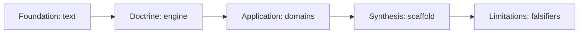
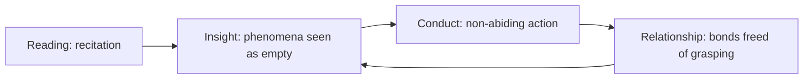

# The Diamond Sutra: Doctrine, Interpretation, and Living Application

The Diamond Sutra works by a single mechanism — the systematic dismantling of mental fixation — and every doctrine, image, and application in this 5,745-word text traces back to that one operation. Across its thirty-two traditional sections, it deploys the formula **"A is not A, therefore it is called A"** not as mysticism but as a repeatable cognitive procedure for severing the grip of self-referential concepts — the same procedure contemporary clinical psychology approaches under the names *cognitive defusion* and *decentering*.

Despite the common claim that the sutra teaches a bleak nihilism — that "emptiness" means nothing matters — the early-Mahāyāna text it belongs to (the core dating to roughly 150–200 CE) is better read, as Kenneth Leong argued in 2025, as **life-affirming**: emptiness is the open ground that makes compassion, generosity, and ordinary commitment possible[Kenneth Leong, "From Emptiness to Conviviality," Medium 2025.](https://kleong54.medium.com/from-emptiness-to-conviviality-cf03d838e28f). These notes trace the causal scaffold from doctrine to lived transformation across daily life, work, business ethics, marriage, parenting, and emotional regulation.

The *Vajracchedikā Prajñāpāramitā Sūtra* — rendered by the Buddha himself as "The Diamond that Cuts through Illusion"["The Diamond Sutra," Lifelong Learning Collaborative.](https://www.lifelonglearningcollaborative.org/silkroads/articles/diamond-sutra-translation.pdf) — stands alongside the Heart Sutra and Lotus Sutra among the most influential texts in East Asian Buddhism[Encyclopedia of Buddhism, "Diamond Sutra."](https://encyclopediaofbuddhism.org/wiki/Diamond_Sutra). Its apophatic formula is precisely what makes it operational for emotional regulation, work, and relationships; as recently as April 2026 it continues to be mobilized for parenting, marriage, and workplace ethics[Wisdom Network of Human Life 2026, instant-messaging response pressure, 21 April 2026.](https://human.lawtw.com/en/news/2026032308370323d4a4).

---

## 1 Framework, Scope, and Method

These notes read the Diamond Sutra as a single working instrument: a negation-text whose doctrine can be traced, step by step, into behavior across seven named life domains.

### 1.1 Scope and Boundaries

**The Diamond Sutra within the Prajñāpāramitā corpus.** The sutra belongs to the Prajñāpāramitā ("Perfection of Wisdom") family, which ranges from single-line verses to vast recensions["Prajnaparamita," Wikipedia.](https://en.wikipedia.org/wiki/Prajnaparamita_Sutra). The largest member, the *Mahāprajñāpāramitā-sūtra*, is "the largest of all" the Perfection-of-Wisdom texts[Digital Dictionary of Buddhism, "大般若波羅蜜多經."](http://www.buddhism-dict.net/ddb/pcache/59id(b5927-822c-82e5-6ce2-7f85-871c-591a-7d93), running to hundreds of thousands of lines["Large Prajñāpāramitā Sūtras," Wikipedia.](https://en.wikipedia.org/wiki/Large_Praj%C3%B1%C4%81p%C4%81ramit%C4%81_S%C5%ABtras). The Diamond Sutra, by contrast, is short enough to recite and copy in a single sitting — a portability directly tied to its survival, as the Dunhuang manuscript cache attests[International Dunhuang Programme, "The Diamond Sutra."](https://idp.bl.uk/discover/learning/buddhism-on-the-silk-roads/articles/buddhism-on-the-ground/buddhist-texts-the-diamond-sutra/). **The sutra is a portable distillation of a wisdom teaching whose full form is the largest scripture in the canon**, and this compression is the first structural fact that makes it usable as a behavioral anchor.

**In-scope domains.** These notes cover four textual domains (doctrine, structure, interpretation, paradoxical logic) and **seven applied domains**: daily life and emotional well-being, workplace and career, business ethics, marriage, parenting, interpersonal dynamics, and modern psychological resonances. Each applied claim is grounded in a dated source explicitly tying a Diamond Sutra line or doctrine to that domain — the Bodhi Path reading of non-abiding for long-distance relationships[Bodhi Path Buddhist Studies Network 2026, non-abiding and long-distance relationships, 26](https://bodhi.lawtw.com/en/news/202512271724529cd824), the HSA.HK "Waterway Parenting" article citing 應無所住而生其心[HSA.HK 2025, "Waterway Parenting," 6 October 2025.](https://www.hsa.hk/post/waterway-parenting-flowing-with-life-rooted-in-wisdom), the Wisdom Network's instant-messaging guidance[Wisdom Network of Human Life 2026, instant-messaging response pressure, 21 April 2026.](https://human.lawtw.com/en/news/2026032308370323d4a4).

**Out of scope.** The single most important exclusion is **general-purpose Buddhism or secular mindfulness not anchored to this sutra's particular doctrine**. These notes decline any contemplative claim that would read identically if the Diamond Sutra did not exist. The value lies in tracing a causal path from this text's specific negations to behavior; a claim untethered from the text cannot be checked against chapter and verse. Broader psychology-and-mindfulness resonances are handled in Chapter 6 as *analogical*, flagged as such.

### 1.2 Interpretive Rubric: Six Criteria

Every applied reading downstream is checked against six weighted criteria:

| ID | Criterion | Weight |
|----|-----------|--------|
| R-1 | Textual Fidelity to the Diamond Sutra | 0.22 |
| R-2 | Doctrinal Coherence with Core Teachings | 0.20 |
| R-3 | Misreading-Avoidance (no nihilism/coldness/passivity) | 0.18 |
| R-4 | Explicit Causal-Chain Reasoning | 0.16 |
| R-5 | Context-Sensitivity to the Named Life Domain | 0.13 |
| R-6 | Transformative Practical Value | 0.11 |

**Textual Fidelity outranks Doctrinal Coherence** because a reading with no textual anchor cannot be checked at all, whereas a textually anchored but doctrinally strained reading can at least be argued on the page. A reading can quote a line accurately yet violate coherence — for instance, quoting 應無所住而生其心 to justify *detachment* from a child, which the HSA.HK source reads the opposite way, as warmth that flows with life[HSA.HK 2025, "Waterway Parenting," 6 October 2025.](https://www.hsa.hk/post/waterway-parenting-flowing-with-life-rooted-in-wisdom).

**The Misreading-Avoidance check** guards the most common failure mode: hearing the negations as nihilism. **Śūnyatā names the absence of independent self-nature, not the non-existence of things** — a distinction that is the hinge on which every sound application turns["Emptiness Requires Contextualization," Buddhist Inquiry 2025.](https://www.buddhistinquiry.org/article/emptiness-requires-contextualization-on-rob-burbeas-seeing-that-frees/). The correct chain runs: the self lacks independent nature → loosened grip on fixed self-images → *more* responsive, not less engaged action. Seung-Jin Choi's 2025 work on Korean Seon grounds this in the non-dual formula that "afflictions are none other than enlightenment"[Choi, Seung-Jin 2025, "Korean Seon and the Diamond Sutra," PhilArchive.](https://philarchive.org/archive/CHOSZT).

**The Causal-Chain requirement** is the rubric's backbone: no reading may assert a doctrine "helps" a domain without showing the intervening links. "Non-attachment improves marriage" fails; "non-attachment loosens the grip on a fixed image of the partner → fewer projected expectations → reduced friction from expectation-violation" passes[Bodhi Path Buddhist Studies Network 2026, non-abiding in marriage and parenting, 11 March](https://bodhi.lawtw.com/en/news/202601291041105f2c31).

### 1.3 Roadmap

The chapters form a **precondition chain**: foundation (text) → doctrine (the engine) → application (seven domains) → synthesis (the scaffold) → limitations (falsifiers). No stage's work is usable until the prior stage's is complete — applications cannot be audited without doctrine, doctrine cannot be anchored without text.

### 1.4 Published Vocabulary

| Term | Original | Gloss |
|------|----------|-------|
| Prajñāpāramitā | प्रज्ञापारमिता | Perfection of Wisdom; the text family and the realized wisdom it aims at["Prajnaparamita," Wikipedia.](https://en.wikipedia.org/wiki/Prajnaparamita_Sutra) |
| Śūnyatā | शून्यता | Emptiness as absence of independent self-nature, not non-existence["Emptiness Requires Contextualization," Buddhist Inquiry 2025.](https://www.buddhistinquiry.org/article/emptiness-requires-contextualization-on-rob-burbeas-seeing-that-frees/) |
| The Four Marks | ātma/pudgala/sattva/jīva-saṃjñā | The four fixed notions (self, person, being, lifespan) the sutra dismantles[Thalira 2026, "Diamond Sutra Guide," 3 April 2026.](https://thalira.com/blogs/quantum-codex/diamond-sutra-guide) |
| Non-Abiding Mind | 應無所住而生其心 | A mind that arises in response without clinging to any fixed object[HSA.HK 2025, "Waterway Parenting," 6 October 2025.](https://www.hsa.hk/post/waterway-parenting-flowing-with-life-rooted-in-wisdom) |
| Dāna Without Grasping | dāna | Generosity without abiding in giver, recipient, or gift |
| The Raft Simile | — | The Dharma as a raft to be released once it has carried one across[just-buddha.org 2025, "Diamond Sutra Chapter 1 to 8," 2 September 2025.](https://just-buddha.org/en/articles/diamond-sutra-chapter-1-to-8-interpretation) |
| Dream-Bubble-Shadow Verse | — | Closing gāthā likening conditioned phenomena to dream, bubble, shadow["Vajra Sutra: Everything Is Empty and Illusory," 500 Yojanas.](https://www.500yojanas.org/vajra-sutra-everything-is-empty-and-illusory/) |
| Bodhisattva Paradox of Liberation | — | Vowing to liberate all beings while denying there are beings to liberate |

The **Bodhisattva Paradox** is the sutra's most famous structural tension: the bodhisattva vows to liberate all beings, yet no being is liberated, for holding the notion of a being-to-be-liberated would mark the absence of the four-marks realization. It resolves through the non-abiding mind: the bodhisattva acts fully to liberate while not abiding in the notion of beings or results — the denial targets the *grasping at a result*, not the action[Bodhi Path Buddhist Studies Network 2026, non-abiding and long-distance relationships, 26](https://bodhi.lawtw.com/en/news/202512271724529cd824).

---

## 2 Historical Origins and Transmission

**The Diamond Sutra's historical profile — early Mahāyāna stratum, oral-to-written transmission, short and copyable form — is not incidental to its doctrine but structurally bound to it.**

### 2.1 Place Within the Prajñāpāramitā Tradition

Within Mahāyāna self-understanding, the Perfection of Wisdom is personified as a goddess and venerated as the "Mother of Buddhas" — encoding a precise claim: that **wisdom, not merit or ritual alone, gives birth to awakening**["Prajnaparamita," Wikipedia.](https://en.wikipedia.org/wiki/Prajnaparamita_Sutra). The Diamond Sutra belongs to the *second turning of the dharma wheel*: where the first turning located liberation in the cessation of craving, the second-turning Prajñāpāramitā framework locates it in the direct seeing of śūnyatā. The two turnings imply different diagnostic targets — the first targets the *affective* root of suffering, the second the *cognitive* root, the reification of phenomena into independently existing things.

**Why a short text became canonically central** follows a clear causal chain: the sutra's brevity lowered the cost of recitation and copying → wider circulation among lay and monastic practitioners → sustained commentarial attention that fixed its canonical status. The economics of transmission resolve the apparent paradox that the tradition's most exhaustive recensions are not its most widely read: a text short enough to internalize circulates where a hundred-thousand-line recension cannot.

### 2.2 The Dating Question

Dating is bounded by a firm anchor and the difficulty of dating orally transmitted Indian texts. Kumārajīva's Chinese translation (c. 402 CE) is *shorter* than the Sanskrit edition Max Müller edited in 1881, indicating later textual changes to the Sanskrit[Jayarava's Raves, "The Use of Negation in the Vajracchedika."](http://jayarava.blogspot.com/2013/11/the-use-of-negation-in-vajracchedika.html). **The defensible position: the Diamond Sutra belongs to the early Mahāyāna stratum, composed primarily during the first centuries CE, and demonstrably existed in some form by Kumārajīva's c. 402 CE translation.**

The text was transmitted orally by specialist reciters, *dharmabhāṇakas*, whose disciplined memorization may have conserved archaic phrasing precisely because performance fidelity was the professional norm. This is why the 402 CE translation functions as a *latest-attestation* anchor rather than a composition date: the oral layer beneath the written text is older than any dated witness.

The length discrepancy is the concrete text-critical evidence:

| Model | Consistent with | Limit of the evidence |
|---|---|---|
| Single composition, first centuries CE | Early-stratum classification | Cannot explain the Kumārajīva–Müller length gap |
| Composite (later Sanskrit elaboration) | Kumārajīva's text shorter than Müller's[Jayarava's Raves, "The Use of Negation in the Vajracchedika."](http://jayarava.blogspot.com/2013/11/the-use-of-negation-in-vajracchedika.html) | Shows later change, not a dated chronology |
| Early core + sustained reception | Oral transmission; commentary 8th–12th c. | Does not date the specific framing layers |

The defensible reading is a **layered hypothesis**: an early core, conserved through specialist recitation, existed by 402 CE and continued to attract elaboration thereafter.

### 2.3 The 868 CE Dunhuang Printed Book

The material survival is dominated by one object: a printed scroll recovered from the Dunhuang Library Cave, dated precisely to **868 CE — the earliest dated, complete, printed book known to survive anywhere**["The world's earliest dated printed book," Cabinet Oxford.](https://www.cabinet.ox.ac.uk/worlds-earliest-dated-printed-book-diamond-sutra-868-ce). Its dated colophon is the load-bearing feature: many printed objects may be older, but the 868 scroll is the earliest whose date is recorded on the object itself. Its carved frontispiece shows that ninth-century woodblock printing could already reproduce both image and scripture in a single production run[Encyclopedia of Buddhism, "Diamond Sutra."](https://encyclopediaofbuddhism.org/wiki/Diamond_Sutra).

The text reaches the modern reader through multiple parallel streams — fragmentary Sanskrit (Harrison–Watanabe, via GRETIL)[Vajracchedika Prajñāpāramitā GRETIL fragment.](http://gretil.sub.uni-goettingen.de/gretil/corpustei/transformations/html/sa_vajracchedikA-prajJApAramitA-frag.htm), a Vaidya-based Sanskrit recension[Vaidya ed. 1961, "Vajracchedika Prajnaparamita," via GRETIL.](https://gretil.sub.uni-goettingen.de/gretil/1_sanskr/4_rellit/buddh/bsu051_u.htm), Tibetan[Vajracchedikāprajñāpāramitāsūtra, Bodhicitta.](https://bodhicitta.tsadra.org/index.php/Texts/Vajracchedik%C4%81praj%C3%B1%C4%81p%C4%81ramit%C4%81s%C5%ABtra), and Kumārajīva's Chinese[Fo Guang Shan bilingual edition.](https://ibpsottawa.org/wp-content/uploads/2021/11/Diamond-Sutra_ChiEng.pdf) — a breadth of attestation few Mahāyāna texts match. **The material record shows a scripture whose survival is bound to its ritual reproduction: copying it was an act of devotion, not only of preservation.** The apparent tension — a text teaching non-attachment, reproduced as a merit-relic — resolves through the doctrine of **Dāna Without Grasping**: copying earns merit precisely when performed without abiding in giver, gift, or reward.

### 2.4 The Title

The compound *Vajracchedikā* joins *vajra* (diamond/thunderbolt) with *chedikā* (cutting). The sutra's own self-naming as "The Diamond that Cuts through Illusion"["The Diamond Sutra," Lifelong Learning Collaborative.](https://www.lifelonglearningcollaborative.org/silkroads/articles/diamond-sutra-translation.pdf) selects the **active reading**: the diamond is the instrument, illusion is what it severs, making the title a statement about the *function* of wisdom rather than its hardness. The double sense of *vajra* is a doctrinal resource: the diamond connotes precise cutting (aligning with the gradual, analytic dismantling of the Four Marks), the thunderbolt connotes sudden force (aligning with the sudden-awakening emphasis Chan would draw out). The single word encodes both gradualist and suddenist readings.

---

## 3 Translations and Commentarial Traditions

**The "applied" Diamond Sutra a reader encounters is always recension- and commentary-dependent, never a neutral transcript.** The single most consequential interpretive choice in the sutra's reception is the **Chan decision to treat the Non-Abiding Mind line as a single awakening-pivot rather than one step in a graded sequence** — and most modern applied readings inherit that choice.

### 3.1 Major Translations and How They Diverge

The foundational divergence is one of length: Kumārajīva's shorter Chinese is very likely a witness to an earlier, leaner recension that the later Sanskrit expanded[Jayarava's Raves, "The Use of Negation in the Vajracchedika."](http://jayarava.blogspot.com/2013/11/the-use-of-negation-in-vajracchedika.html). The Chinese text East Asian commentary built on is the shorter one; the Sanskrit-based apparatus of Conze and Red Pine often works from the longer witness.

A study of English translations found teams pursuing texts "easy to read and strict with key concept terms" simultaneously — naming the tension every translation must negotiate: a rendering cannot maximize both fluent accessibility and rigid technical precision without cost.

| Rendering | Position on readability–strictness axis | Reader served |
|---|---|---|
| Conze | Strictness; technical Sanskrit preserved | Academic |
| Red Pine | Strictness with commentary scaffolding | Serious lay study |
| Mu Soeng | Mid-axis; practice-oriented | Meditator |
| Plum Village (Thich Nhat Hanh) | Readability pole; practice-usable["Thich Nhat Hanh's critique of scripture-based practice," NewBuddhist.](https://newbuddhist.com/discussion/17974/thich-nhat-hanhs-critique-of-scripture-based-practice) | General practitioner |
| Fo Guang Shan bilingual | Strictness-checkable (Chinese alongside)[Fo Guang Shan bilingual edition.](https://ibpsottawa.org/wp-content/uploads/2021/11/Diamond-Sutra_ChiEng.pdf) | Bilingual study |

**Translation choice materially changes the teaching at the level of the single word.** Three different English renderings of the identical Chinese line 應無所住而生其心 — "not dwell and give rise"[Bodhi Path Buddhist Studies Network 2026, non-abiding and long-distance relationships, 26](https://bodhi.lawtw.com/en/news/202512271724529cd824), "let the heart arise without attachment"[HSA.HK 2025, "Waterway Parenting," 6 October 2025.](https://www.hsa.hk/post/waterway-parenting-flowing-with-life-rooted-in-wisdom), "produce the mind without abiding"[Bodhi Path Buddhist Studies Network 2026, non-abiding in marriage and parenting, 11 March](https://bodhi.lawtw.com/en/news/202601291041105f2c31) — each route the practitioner toward a slightly different behavioral emphasis. The renderings that preserve the "arise"/"give rise" clause guard best against the nihilistic misreading, since that clause is the affirmative half of the non-abiding formula.

### 3.2 Indian Commentarial Lineage

The earliest systematic interpretation came from India, where three figures read the sutra as a *structured* object rather than loose negation:

- **Vasubandhu** imposed a framework of successive doubts: the sutra's apparent repetition is a diagnostic sequence, each restatement targeting a different residual doubt. This converts a circular text into a progressive one.
- **Asaṅga** read the sutra as a compressed map of the bodhisattva path: the negations become a sequence of training stages, each purifying a perfection of its residual grasping.
- **Kamalaśīla** insisted śūnyatā must be realized through *staged analytical meditation* rather than a single leap — the sharpest Indian counterpoint to Chan's sudden awakening. The 2025 essay "Emptiness Requires Contextualization" echoes this: emptiness cannot be grasped abstractly but only within "a particular network of causes and conditions"["Emptiness Requires Contextualization," Buddhist Inquiry 2025.](https://www.buddhistinquiry.org/article/emptiness-requires-contextualization-on-rob-burbeas-seeing-that-frees/).

**The Indian commentarial achievement was to turn an apparently repetitive, negation-driven text into a sequence** — whether dissolving doubts, climbing path-stages, or performing staged analysis. The sudden/gradual tension does not resolve by one side winning: the same apophatic formula can be read either as a single shock collapsing conceptual grasping or as a repeated operation performed stage by stage.

### 3.3 East Asian Commentary

The Chan and Korean Seon traditions **reversed the Indian direction, compressing the sutra back toward a single existential pivot** — the Non-Abiding Mind.

**Huineng's awakening** on the line "abide nowhere, let the mind arise" made the sutra a cornerstone of Chan's sudden-enlightenment tradition["The Origins of Chan."](https://www.dharmanet.org/coursesM/26/chan2f.htm). The causal chain is documented: hearing the line → his enlightenment → the tradition's adoption of "non-abiding, mind arising" as a doctrinal hallmark → its enduring emphasis on sudden, non-dual awareness[Dharma Drum Mountain.](https://www.dharmadrum.org/portal_d5_cnt_page.php?cnt_id=17&folder_id=7&up_page=1). **This is the proximate source of the entire "apply the non-abiding line directly to your situation" genre** that the application chapters survey. The Chan reading earns a strong pass for preserving the affirmative "let the mind arise" clause rather than reading non-abiding as mere cessation.

**Han Shan** held the apophatic formula as a meditative *instrument* rather than a logical puzzle — for the practitioner in daily life, a single portable operation (see the object, apply the negation, watch grasping loosen). **Gihwa** compiled the Korean *Oga hae*, gathering five commentaries side by side, implicitly conceding that the sutra rewards a plurality of approaches — modeling at the editorial level the same non-grasping the sutra teaches.

### 3.4 Modern Expository Voices

- **Hsing Yun** (Fo Guang Shan) reads the sutra as directly applicable to ordinary human life — the "Humanistic Buddhism" programme, the direct ancestor of the workplace applications. It stands closest to the Asaṅga staged-path reading.
- **Thich Nhat Hanh** reads the Four Marks through *interbeing*: the apprehension of a separate self dissolves not into nothing but into the recognition that each entity inter-is with everything else — directly guarding against the nihilistic misreading. He couples this with a critique of scripture-based practice, holding that insight "can't be found in sutras alone"["Thich Nhat Hanh's critique of scripture-based practice," NewBuddhist.](https://newbuddhist.com/discussion/17974/thich-nhat-hanhs-critique-of-scripture-based-practice).
- **Red Pine** supplies the scholarly line-by-line apparatus, serving the reader who wants the technical machinery intact.

---

## 4 Internal Structure: The Subhuti Dialogue

The Diamond Sutra is a *dialogue* before it is a doctrine. Its teaching on śūnyatā arrives through an exchange between two named speakers, and **the frame already teaches non-abiding before a single doctrinal proposition is uttered.**

### 4.1 The Narrative Frame

The sutra opens with "Thus have I heard" and locates its teaching in an everyday moment — the Buddha has just finished his daily alms-round["The Diamond Sutra," Lifelong Learning Collaborative.](https://www.lifelonglearningcollaborative.org/silkroads/articles/diamond-sutra-translation.pdf). **The most uncompromising teaching on emptiness in the Mahāyāna canon is framed not by cosmic spectacle but by the most routine act of monastic life.** Where the Lotus Sutra opens onto vast assemblies and supernatural displays, the Diamond Sutra stays resolutely at ground level — disarming the expectation of metaphysical fireworks and priming the hearer to receive non-abiding as continuous with daily conduct. This through-line connects directly to the 2025–2026 secular applications, which likewise locate realization *inside* ordinary activity.

**The thirty-two-section division** is best understood as an editorial and devotional overlay; the oldest Sanskrit witnesses present continuous prose[Vaidya ed. 1961, "Vajracchedika Prajnaparamita," via GRETIL.](https://gretil.sub.uni-goettingen.de/gretil/1_sanskr/4_rellit/buddh/bsu051_u.htm). Its value is navigational and mnemonic, not doctrinal. The ABZE commentary's faceting image — "a diamond with many surfaces" — guards against the risk that numbering tempts readers to reify each section as a self-contained doctrine: every section is another *angle* on the same stone.

**Subhuti** is the fixed interlocutor, traditionally "foremost in understanding emptiness." The repeated "what do you think, Subhuti?" gives the discourse a conversational spine and makes him a *co-constructor* of the teaching: the ritualized question-answer pattern creates "ritualised displays of epistemic stance" that prevent reification by continually refreshing the listener's perspective[ABZE commentary.](https://abzen.eu/wp-content/uploads/2024/08/ABZE-sutra-du-diamant-EN.pdf). Because the teaching is built collaboratively, the hearer's understanding is continually tested and destabilized — precisely the anti-reifying effect the sutra seeks.

### 4.2 The Catechetical Method

The text advances by a three-feature method:

- **The repeated question** presents the teaching from multiple angles like diamond facets, preventing conceptual fixation. Its predictable form licenses repeated conceptual destabilization of the content.
- **Repetition as contemplative device:** each return applies the same deconstructive move to a *new* object — the Buddha's marks, merit, the category of dharma — generalizing the insight across every category the mind might cling to. To a reader who has not grasped the faceting frame, this reads as redundancy; once internalized, it becomes navigable.
- **The affirmation-negation-reaffirmation rhythm** governs each exchange's content — the apophatic formula in motion:

| Topic | Affirmation | Negation | Reaffirmation |
|---|---|---|---|
| The Buddha's marks | The physical marks | Not truly marks | So they are called marks |
| Merit | A great heap of merit | Not truly a heap | So the Tathāgata speaks of merit |
| Beings liberated | Beings to be liberated | No being truly liberated | So the bodhisattva liberates |

**The reaffirmation beat is the structural feature that blocks the nihilist reading**: the negation is never the last word, and the reaffirmation restores functional language without restoring the illusion of essence. This is why the application chapters can draw engaged action from the text without collapsing into passivity.

### 4.3 Central Metaphors

**The raft simile** — "The Dharma is like a raft; it carries one across, but it is not something to cling to"[just-buddha.org 2025, "Diamond Sutra Chapter 1 to 8," 2 September 2025.](https://just-buddha.org/en/articles/diamond-sutra-chapter-1-to-8-interpretation) — extends the anti-reifying analysis to its most radical object, the teaching itself. Introduced early, it functions as a *reading instruction* for the rest of the sutra: it tells the hearer in advance not to convert the coming negations into new certainties. Its built-in logic resolves the antinomian risk — the raft is set down only *after* it has carried one across, not before.

**The grains-of-sand / countless-world-systems hyperbole** sets up a comparison the sutra then inverts: it first establishes an unimaginable quantity of merit, then claims even this is exceeded by holding and expounding four lines of the text.

---

## 5 Core Doctrines: Emptiness, No-Self, the Four Marks

The dialogue delivers doctrine not as propositions but as moves the mind performs. **The four interlocking teachings — śūnyatā, the dissolution of the Four Marks, anātman, and the reframing of merit and the bodhisattva vow — each operate by negating a fixed view rather than asserting a positive thesis.**

### 5.1 Śūnyatā: Emptiness Without the Word

The sutra approaches emptiness *obliquely*, through repeated negation rather than a recurring thesis-noun. **Read this way, emptiness functions as a verb rather than a noun: a procedure of relinquishing the mind's grip on each object it seizes, whose product is deliberately left unnamed so it cannot itself become an object of grasping.** Where the Heart Sutra compresses its teaching into a memorable equation, the Diamond Sutra offers a serial *operation*.

**What śūnyatā denies is inherent, independent existence — not appearance or function.** The two-truths framework secures this: conventionally beings appear and are liberated, while ultimately all phenomena are empty of inherent existence["The Theory of Two Truths in India," Stanford Encyclopedia of Philosophy.](https://plato.stanford.edu/entries/twotruths-india/). The registers are not rivals but the same reality at different grains. This blocks the failure chain at its first link: collapsing "empty of inherent existence" into "non-existent" leads to devaluation of conventional commitments → cold passivity → severance from the compassionate conduct the bodhisattva path requires.

### 5.2 The Four Marks and the Disqualified Bodhisattva

The Four Marks are **four grammatical positions the same reifying error can occupy**: the mark of self (an "I" that owns experience), person (an individual continuant), being (a bounded sentient unit), and lifespan (a possessed span)[Thalira 2026, "Diamond Sutra Guide," 3 April 2026.](https://thalira.com/blogs/quantum-codex/diamond-sutra-guide). Where the Heart Sutra dissolves the self by showing it is a *bundle* of aggregates, the Diamond Sutra works through *marks* — exposing the cognitive act of positing a standing entity, which is what interpersonal possessiveness depends on.

The sutra enforces relinquishment with an absolute disqualification: one who perceives these marks "is not to be called a bodhisattva." The crucial reading: **this disqualifies on grasped notions, not performed actions.** The City of 10,000 Buddhas commentary shows the exemplary bodhisattva remains maximally active in giving while not dwelling on marks[City of 10,000 Buddhas, The Vajra Sutra with Commentary.](https://www.cttbusa.org/vajrasutra/vs4.html). The clause sets a condition on the *quality of attention* brought to conduct, not a flawless behavioral record.

The **mechanism**: notion-grasping reifies a boundary between self and other → that boundary reintroduces the conceptual attachment the giving was meant to release → the attachment caps the compassion at the boundary it has drawn[City of 10,000 Buddhas, The Vajra Sutra with Commentary.](https://www.cttbusa.org/vajrasutra/vs4.html). The disqualification is diagnostic, not moralistic: a bodhisattva who perceives the marks has installed a cognitive structure that, by its own logic, limits compassion's reach.

### 5.3 Anātman / No-Self

**No-self in the Diamond Sutra denies not that seeing, hearing, and thinking happen, but that there is a unitary, independent see-er existing prior to and apart from the seeing.** The instruction to "produce the mind without abiding anywhere" presupposes exactly this dissolved subject: a mind that "abides nowhere" has let go of the fixed vantage point from which abiding would be done[HSA.HK 2025, "Waterway Parenting," 6 October 2025.](https://www.hsa.hk/post/waterway-parenting-flowing-with-life-rooted-in-wisdom).

This must be held apart from later **Tathāgatagarbha "true self"** formulations:

| | Diamond Sutra (no-self) | Tathāgatagarbha (true self) |
|---|---|---|
| Move | Negation of the mark of self[Thalira 2026, "Diamond Sutra Guide," 3 April 2026.](https://thalira.com/blogs/quantum-codex/diamond-sutra-guide) | Affirmation of inherent Buddha-nature["The Significance of Tathāgatagarbha."](https://buddhism.lib.ntu.edu.tw/FULLTEXT/JR-NX020/11_11.htm) |
| Emptiness | Operation of relinquishment | Affirmative predication of highest order["Tathāgatagarbha, Emptiness, and Monism," Buddha-Nature.](https://buddhanature.tsadra.org/index.php/Articles/Tath%C4%81gatagarbha,_Emptiness,_and_Monism) |
| Position | Negative moment | Affirmative moment presupposing prior negation |

The two operate at different points in the dialectic. Read in sequence, the "true self" of Chan is not the naive self the Diamond Sutra negates but a term introduced *on the far side* of that negation. The danger is *premature affirmation*: importing "true self" before completing the negation simply renames the ego.

**The conduct chain** runs from no-self → absence of a clinging locus → the non-abiding mind → conduct that responds fully without grasping outcomes[HSA.HK 2025, "Waterway Parenting," 6 October 2025.](https://www.hsa.hk/post/waterway-parenting-flowing-with-life-rooted-in-wisdom). The conduct is non-clinging, *not* non-responsive: the HSA.HK source speaks of parenting that "flows with life's rhythms," an active posture, the opposite of cold detachment[HSA.HK 2025, "Waterway Parenting," 6 October 2025.](https://www.hsa.hk/post/waterway-parenting-flowing-with-life-rooted-in-wisdom).

### 5.4 Merit, Generosity, and the Critique of Calculative Virtue

The sutra's striking claim: giving without dwelling on marks generates not great but **immeasurable** merit — "If a Bodhisattva does not dwell in marks when he gives, his blessings and virtues are immeasurable"[City of 10,000 Buddhas, The Vajra Sutra with Commentary.](https://www.cttbusa.org/vajrasutra/vs4.html). The mechanism derives the unboundedness from the removal of a specific structure: eliminating the conception of giver, gift, and receiver removes the boundary that would otherwise install a limit[City of 10,000 Buddhas, The Vajra Sutra with Commentary.](https://www.cttbusa.org/vajrasutra/vs4.html).

**Merit-counting paradoxically diminishes merit** because to count merit is to posit a giver who accumulates it — reinstalling the very mark the giving was meant to dissolve[City of 10,000 Buddhas, The Vajra Sutra with Commentary.](https://www.cttbusa.org/vajrasutra/vs4.html). The constraint is structural, not moral: the sutra does not scold the merit-counter for greed but observes that the counting operation *mathematically reinstalls the limit*. This **reframes virtue as non-instrumental**: the way to maximize the result is to stop aiming at it. The reframing cannot be reached by a more cunning instrumentalism — it must be lived, not adopted as strategy.

### 5.5 The Bodhisattva Vow and the Paradox of Liberation

The vow states two things that appear to cancel each other: the bodhisattva leads all beings to liberation, yet no being is truly liberated. The two-truths doctrine resolves this: **conventionally beings appear and are liberated; ultimately all phenomena are empty of inherent existence**["The Theory of Two Truths in India," Stanford Encyclopedia of Philosophy.](https://plato.stanford.edu/entries/twotruths-india/). The vow survives its own emptying because the two truths are complementary descriptions of one situation. The denial guards against savior-ego inflation: there is no independently existing being for the bodhisattva to take pride in saving.

---

## 6 Key Teachings and Images

The sutra's images convert abstract doctrine into instructions a practitioner can hold. **Each names a precise place where the mind tends to fixate and prescribes the release of that fixation.** The non-abiding mind is the master image; the other three are its specializations — applied to generosity, to the teachings, and to the whole field of conditioned experience[Vajracchedikā Prajñāpāramitā Sūtra, Wisdomlib Taishō 235.](https://www.wisdomlib.org/buddhism/scripture/vajracchedik%C4%81-praj%C3%B1%C4%81p%C4%81ramit%C4%81-s%C5%ABtra/d/doc7904.html).

### 6.1 The Non-Abiding Mind

In the chapter "Wonderful Conduct without Dwelling," the Buddha instructs that in giving, the mind should not dwell on forms, sounds, smells, tastes, tangibles, or mental objects[Diamond Sutra Part I, BuddhistDoor.](https://www.buddhistdoor.com/OldWeb/resources/sutras/diamond_sutra.htm) — walking through the six sense-bases one by one, closing off every channel by which the mind might seek a resting-place. **The load-bearing move is the separation of cognition from fixation: the sutra licenses full engagement with experience while withdrawing the reflex that turns engagement into attachment.** Picture the mind as a hand: a grasping hand clenches and is occupied; the non-abiding mind is the open hand that holds, uses, and releases in one continuous motion.

The causal sequence: a sense-object is perceived → ordinarily the mind settles on it as a support → settling gives rise to craving or aversion → grasping forms the Four Marks. Refusing the first link prevents the entire cascade.

**Non-abiding versus blankness** is the key distinction. The conjunction 而 binds two clauses a blankness reading would sever: 無所住 ("abiding nowhere") and 生其心 ("give rise to the mind"). **A blank mind abides nowhere because it is doing nothing; the non-abiding mind abides nowhere while doing everything.** The Chan error of "dead sitting" achieves non-abiding by shutting perception down; the Diamond Sutra achieves it by letting perception flow without snagging — one dims the light, the other lets light pass cleanly through glass. If the emotional-well-being application imports the blankness reading, it produces emotional numbing rather than equanimity.

### 6.2 Dāna Without Grasping

Giving is the action in which the reflex to abide — to keep account, claim credit, note the recipient's debt — is most visible. The sutra defines non-abiding giving by eliminating the **threefold conceptualization**: "Non-dwelling means not keeping in mind"["Non-Dwelling in Marvelous Conduct," Vajra Sutra.](https://vajrasutra.org/chapter-04/). The "giver" is ātma-saṃjñā; the "recipient" invokes pudgala- and sattva-saṃjñā; the reckoning across time invokes jīva-saṃjñā. **Non-abiding giving is the dismantling of all four marks performed in the theatre of a single generous act.**

**The causal chain:** non-abiding giving eliminates the conceptualization of giver/gift/receiver → prevents the karmic exhaustion of a reckoned transaction → allows merit to arise spontaneously from interdependent origination rather than being stored as a finite quantity["Non-Dwelling in Marvelous Conduct," Vajra Sutra.](https://vajrasutra.org/chapter-04/). The merit is "as immeasurable as the space in the four quarters" precisely *because* it is not reckoned[Conze translation.](https://www.lastelladelmattino.org/wp-content/uploads/2021/02/Sutra-Diamante-Conze.pdf). The behavioral payoff is the resolution of burnout: reckoned giving exhausts the giver because the ledger is finite; non-reckoned giving keeps no store to deplete.

| Dimension | Transactional Charity | Dāna Without Grasping |
|---|---|---|
| Mental registration | Three things held fixed | Threefold conceptualization eliminated["Non-Dwelling in Marvelous Conduct," Vajra Sutra.](https://vajrasutra.org/chapter-04/) |
| Merit structure | Reckoned, finite, debited | Arises dependently, inexhaustible["Non-Dwelling in Marvelous Conduct," Vajra Sutra.](https://vajrasutra.org/chapter-04/) |
| Recipient's position | Placed in debt | Released from debt |
| Failure mode | Donor fatigue, resentment | No store to deplete |

The objection that rewarding the giver "recruits self-interest into good ends" resolves thus: the reward structure of transactional charity is exactly what *caps* its volume — giving tied to return stops when the return stops.

### 6.3 The Raft Simile

The raft turns the non-abiding principle back on the sutra's own teachings: "The dharma is like a raft. It is useful for crossing over but not for holding onto"["The Buddhist Parable of the Raft," Tricycle.](https://tricycle.org/article/buddhist-parable-of-the-raft/). The teaching has the status of an *instrument*, not a possession. Inherited from the Alagaddūpama Sutta and sharpened within the Prajñāpāramitā frame, it resolves a tension internal to any liberation teaching: **the teaching that frees can itself become a new bondage.** The constraint is the simile's own logic — the raft is set down only *after* it has carried one across.

The simile diagnoses two pathologies sharing one structure: **dogmatism** (clutching doctrine as a banner) and **spiritual materialism** (accumulating realizations as wealth). Both convert the raft into cargo. The chapter "Nothing Attained, Nothing Spoken"[Diamond Sutra Part I, BuddhistDoor.](https://www.buddhistdoor.com/OldWeb/resources/sutras/diamond_sutra.htm) radicalizes this: if the Tathāgata has attained nothing graspable and spoken no fixed Dharma, there is nothing for the dogmatist to defend or the materialist to accumulate.

**Why clinging to "right view" becomes wrong view:** clinging reintroduces the Four Marks — the "I" who holds the correct view, the view as a possessed thing — reinstating the very grasping the view was meant to dissolve. The error is not in the proposition but in the ownership. This is the apophatic formula's most practical instance: right view is not right view (when clutched), therefore it is called right view (when held as a releasable instrument).

### 6.4 The Dream-Bubble-Shadow Verse

The closing gāthā gathers the chapter's whole movement: "All conditioned phenomena / Are like dreams, illusions, bubbles, shadows, / Like dew drops and a lightning flash: / Contemplate them thus"["Vajra Sutra: Everything Is Empty and Illusory," 500 Yojanas.](https://www.500yojanas.org/vajra-sutra-everything-is-empty-and-illusory/).

The six similes fall in two triads. The first — dream, illusion, bubble — names *insubstantiality*. The second — shadow, dew, lightning — names *dependency and transience*[Bodhi Path, "Like a dream, an illusion, a bubble, a shadow."](https://bodhi.lawtw.com/en/news/20251216073854d95324). Read across "what each negates," the similes negate the reality of appearances, the solidity of forms, and independent self-nature — **the vocabulary of emptiness, not merely of transience.**

This hinges on the **impermanence-versus-emptiness dispute**. An impermanence reading issues in a *reordering of priorities*: things pass, so hold them lightly[Bodhi Path, "Like a dream, an illusion, a bubble, a shadow."](https://bodhi.lawtw.com/en/news/20251216073854d95324). An emptiness reading issues in a *transformation of perception*: things were never the fixed entities you took them for. The two produce overlapping behavior but different depths; the matrix of "what each negates" supports the emptiness reading as the sutra's intent, with the first triad doing the work that a transience-only reading drops.

---

## 7 Paradoxical Logic and Hermeneutics

**Every paradox in the text performs a therapeutic operation on the reader's cognition rather than asserting a metaphysical contradiction**, and the two-truths framework supplies the interpretive key.

### 7.1 The "A is not-A, therefore called A" Formula

The formula proceeds in three logical moves: it asserts the conventional appearance of a term, negates its intrinsic existence, and affirms it as a *dependent designation*["The Logic of the Diamond Sutra," zensite.](http://www.thezensite.com/ZenEssays/Philosophical/Logic_of_Diamond_Sutra.pdf). The three beats are sequential operations, not redundant restatements. **The two-truths reading maps cleanly: beat one speaks conventional truth, beat two speaks ultimate truth, beat three holds the two together.** To say "the perfection of wisdom is not the perfection of wisdom" is contradictory only if both clauses operate at the same truth-level; distribute them across the two truths and the tension dissolves["The Theory of Two Truths in India," Stanford Encyclopedia of Philosophy.](https://plato.stanford.edu/entries/twotruths-india/).

The formula **deconstructs reification step by step**: a term appears conventionally → is recognized as lacking intrinsic nature → is affirmed as dependently arisen → its emptiness stands revealed["The Logic of the Diamond Sutra," zensite.](http://www.thezensite.com/ZenEssays/Philosophical/Logic_of_Diamond_Sutra.pdf). The order is irreversible: affirming the dependent designation before negating intrinsic nature would simply re-install the essence. Where Nāgārjuna's *catuṣkoṭi* enumerates four possibilities and negates each, the Diamond Sutra compresses the deconstruction into **a single repeatable gesture applicable to any noun whatsoever** — not a doctrine to memorize but an operation to perform.

### 7.2 "No Dharma Was Taught"

The Buddha's denial that he has taught any dharma is the formula turned reflexively on the act of teaching. By denying that he has taught any dharma, the Buddha **prevents students from reifying his words into a fixed doctrine, encouraging direct insight**["Why the Buddha Left Some Questions Unanswered," just-buddha.org.](https://just-buddha.org/en/articles/why-buddha-left-questions-unanswered). The denial is not a confession that nothing was said but a refusal to let what was said congeal into a graspable object — the pedagogical pairing with "Nothing Attained, Nothing Spoken"[Diamond Sutra Part I, BuddhistDoor.](https://www.buddhistdoor.com/OldWeb/resources/sutras/diamond_sutra.htm).

The raft makes this concrete: the denial states *negatively* that no fixed dharma exists to be grasped, while the raft states *positively* that the dharma has genuine instrumental value that expires at the far shore[just-buddha.org 2025, "Diamond Sutra Chapter 1 to 8," 2 September 2025.](https://just-buddha.org/en/articles/diamond-sutra-chapter-1-to-8-interpretation). This is why the self-erasing teaching does not collapse into nihilism: the raft is real, the crossing is real, and only the post-crossing clinging is negated.

### 7.3 Guarding Against Nihilism

**Śūnyatā denotes the absence of independent self-nature, not nihilistic non-existence.** Because reality is exhaustively comprised of two truths — and the conventional truth at which things appear and function is one of them — emptiness cannot mean things fail to appear["The Theory of Two Truths in India," Stanford Encyclopedia of Philosophy.](https://plato.stanford.edu/entries/twotruths-india/). The Heart Sutra states it positively: "emptiness itself is form"[Diamond Sutra, A. Charles Muller translation.](http://www.acmuller.net/bud-canon/diamond_sutra.html); if emptiness were non-existence, the clause would be incoherent.

The text builds the guard into its own architecture. The chapter **"Not Cut Off and Not Extinguished"** is a warning, by its very title, against the annihilationist view[Diamond Sutra Commentary Part X, BuddhistDoor.](https://www.buddhistdoor.com/OldWeb/bdoor/archive/sutra_comm/diamond/diamond_13.htm). The method is self-correcting: the sutra generates the nihilist temptation through its negations, then explicitly defuses it. **Ethical conduct survives emptiness** because conventional truth retains full force: understanding the emptiness of the self removes the egoistic motive that contaminates ordinary generosity, yielding *purer* conduct["The Theory of Two Truths in India," Stanford Encyclopedia of Philosophy.](https://plato.stanford.edu/entries/twotruths-india/). The Korean Seon reading — "afflictions are none other than enlightenment" — removes the grasping that made the moral field a theater of control, not the moral field itself[Choi, Seung-Jin 2025, "Korean Seon and the Diamond Sutra," PhilArchive.](https://philarchive.org/archive/CHOSZT).

### 7.4 Hermeneutic Methods for Reading Paradox

- **Read negation therapeutically, not as logical contradiction.** A logical assertion points at the world; a therapeutic negation points at the reader and dislodges a habit of grasping["The Logic of the Diamond Sutra," zensite.](http://www.thezensite.com/ZenEssays/Philosophical/Logic_of_Diamond_Sutra.pdf). The catuṣkoṭi requires a non-classical, paraconsistent logic that tolerates certain contradictions[Priest, "The Logic of the Catuṣkoṭi."](https://sjsu.edu/people/anand.vaidya/courses/comparativephilosophy/s1/The-Logic-of-the-Catuskoti-by-G.-Priest.pdf); read this way, "A is not A" is a disciplined device for exhausting and abandoning every position one might take toward a concept[Westerhoff, "Nāgārjuna's Negation."](https://philarchive.org/archive/WESNCK-2).
- **Read contradictory statements through skillful means (upāya).** The Buddha's statements are calibrated to the hearer's need: "what does this statement do to the grasping of the one who hears it?"["Why the Buddha Left Some Questions Unanswered," just-buddha.org.](https://just-buddha.org/en/articles/why-buddha-left-questions-unanswered). The contextualization requirement blocks upāya from degenerating into relativism — each skillful means is answerable to a specific condition["Emptiness Requires Contextualization," Buddhist Inquiry 2025.](https://www.buddhistinquiry.org/article/emptiness-requires-contextualization-on-rob-burbeas-seeing-that-frees/).
- **Detect modern misreadings.** Nihilism: if an interpretation makes conventional truth disappear, it is wrong["The Theory of Two Truths in India," Stanford Encyclopedia of Philosophy.](https://plato.stanford.edu/entries/twotruths-india/). Coldness: if non-attachment yields indifference, it has confused non-abiding with non-caring[Wisdom Network of Human Life 2026, instant-messaging response pressure, 21 April 2026.](https://human.lawtw.com/en/news/2026032308370323d4a4). Passivity: if egolessness abdicates agency, it has confused the dissolution of the self-mark with the dissolution of action[Thalira 2026, "Diamond Sutra Guide," 3 April 2026.](https://thalira.com/blogs/quantum-codex/diamond-sutra-guide).

---

## 8 Schools of Interpretation

A single scripture became the charter text of three traditions because each heard its governing instruction through a different question. **The Chan reception is the best-documented; the Madhyamaka, Yogācāra, and Tathāgatagarbha framings are interpretive reconstructions** grounded in the text's negating structure.

### 8.1 Madhyamaka: Radical Deconstruction

The Madhyamaka affinity is *structural*, not imported: the sutra's own title and vocabulary place it in the Prajñāpāramitā corpus whose concern with śūnyatā Nāgārjuna systematized["Prajnaparamita," Wikipedia.](https://en.wikipedia.org/wiki/Prajnaparamita_Sutra). The most demanding feature is that **śūnyatā must itself be empty.** The apophatic formula forecloses reifying emptiness into a hidden substance — the chapter "The One Mark is No Mark" negates the mark and then retains the designation[Diamond Sutra Part I, BuddhistDoor.](https://www.buddhistdoor.com/OldWeb/resources/sutras/diamond_sutra.htm). The double negation is the text's **immune system against nihilism**, and the chapter "Not Cut Off and Not Extinguished" shows the tradition enforcing that guardrail internally[Diamond Sutra Commentary Part X, BuddhistDoor.](https://www.buddhistdoor.com/OldWeb/bdoor/archive/sutra_comm/diamond/diamond_13.htm).

The deconstructive reading recurs persistently because it is the **most parsimonious**: to read the sutra as dismantling reified concepts, one need only take the negations at face value; the mind-centered readings must import a framework the text does not state.

### 8.2 Yogācāra and Tathāgatagarbha Inflections

Where Madhyamaka attends to the *negating* half of the central instruction, these mind-centered readings attend to the *affirming* half — the mind that arises. On the Yogācāra reading, "abide nowhere" describes how consciousness operates when it stops grasping. **The reading coheres only so long as "mind" is read as the activity of abiding-nowhere rather than a standing substrate** — the moment it hardens from verb into noun, it risks the reification the negations exist to prevent.

| Dimension | Diamond Sutra (deconstructive) | Diamond Sutra (mind-centered) | Awakening of Faith |
|---|---|---|---|
| Status of mind | Negated with all marks | Activity of abiding-nowhere | Standing "one mind" |
| Added premises | None beyond negations | Mind as process | Pure-ground architecture |
| Reification risk | Lowest | Moderate | Highest |

The genuine tension: the Tathāgatagarbha literature posits an innate awakened capacity, yet the sutra refuses every abiding entity. It resolves only under a **constraint**: the "true self" must itself pass back through the emptiness-of-emptiness operation — a Buddha-nature that is precisely *not a thing*. The deconstruction and the "mind arising" are best read as two moments of a single movement: the negation clears the ground; the arising is what remains active once grasping is released.

### 8.3 Chan/Zen and the Sixth Patriarch

The Chan reception is the **best-documented reading**, turning on Huineng's awakening on the line about abiding nowhere["The Origins of Chan."](https://www.dharmanet.org/coursesM/26/chan2f.htm). Where the Yogācāra reading *argues* that non-abiding describes awareness, the Chan reading simply *practices* it. The **sudden-awakening reading** follows from the content of the instruction: a graduated path presupposes an object — a rung to pause on — but "abide nowhere" denies the ladder any rung. The chain is explicit: the instruction removes any resting place → denies graduated stages → gives rise to sudden, non-dual awareness[Dharma Drum Mountain.](https://www.dharmadrum.org/portal_d5_cnt_page.php?cnt_id=17&folder_id=7&up_page=1).

Chan favored the Diamond Sutra over the **Laṅkāvatāra** on methodological grounds: the Diamond Sutra's directness matches sudden insight, whereas the Laṅkāvatāra's elaborate framework reintroduces the graduated structure non-abiding removes[Diamond Sutra, A. Charles Muller translation.](http://www.acmuller.net/bud-canon/diamond_sutra.html). The choice is between two conceptions of scripture: a map to be studied or a finger pointing at the moon.

### 8.4 Devotional and Korean Lineages

The **recitation-merit tradition** treats the sutra as a text to be recited and venerated, with practitioners reporting spiritual benefit["Diamond Sutra Introduction," hosted commentary.](https://www.buddhistdoor.com/OldWeb/bdoor/archive/sutra_comm/diamond/diamond_01.htm). The apparent tension with the sutra's teaching on dāna resolves through a developmental understanding: merit-seeking recitation ripens, through repeated exposure to the sutra's own negations, into recitation that no longer abides in the reward. **The text one recites for merit is the text that dismantles the grasping after merit.** The **Korean Seon** lineage sustains the non-dual realization that dissolves the duality of affliction and enlightenment[Choi, Seung-Jin 2025, "Korean Seon and the Diamond Sutra," PhilArchive.](https://philarchive.org/archive/CHOSZT).

---

## 9 Application: Daily Life and Emotional Well-Being

**The Non-Abiding Mind changes emotional life by changing the relationship to arising states, not by abolishing them; where misapplied it produces not peace but avoidance wearing peace's mask.**

### 9.1 Non-Abiding Mind to Reduced Reactivity

The four-step chain: **de-fixation** (non-abiding interrupts the mind's settling onto a self-referential thought) → **loosened identification** ("anger is arising" rather than "I am angry") → **gap before reaction** → **equanimity** as a stable disposition[drafty mountain hut 2026, "Understanding Non-Dwelling."](https://draftymountainhut.com/2026/01/22/understanding-non-dwelling/). The load-bearing move is that non-abiding acts at the level of fixation, *upstream* of the fully-formed reaction.

For **anger**, the fixation is on a self-as-wronged narrative; for **anxiety**, on a self-as-threatened projection into the future. A colleague takes credit; the perception still arises, but the mind builds no permanent residence on the self-as-victim thought, so the grievance loses fuel and a measured response becomes available. Anxiety follows the same logic aimed at the future tense.

**Named falsifier — when "detachment" masks avoidance.** Non-abiding releases an emotion *after* contact; avoidance prevents contact. Both produce a calmer surface, but the former leaves a known, met, released feeling while the latter leaves an unmet feeling merely routed around[drafty mountain hut 2026, "Understanding Non-Dwelling."](https://draftymountainhut.com/2026/01/22/understanding-non-dwelling/). The raft parable supplies the resolution: when "non-abiding" itself becomes a fortress against feeling, the raft has been turned into cargo. The self-check: after a week of "equanimity," ask whether difficult conversations were *met* or quietly routed around.

### 9.2 No-Self and Freedom From Rigid Self-Narratives

Each of the Four Marks is a *saṃjñā* — a constructed label the mind superimposes, not a substance it discovers[Diamond Sutra Part I, BuddhistDoor.](https://www.buddhistdoor.com/OldWeb/resources/sutras/diamond_sutra.htm). A self-image ("I am competent," "I am unlovable") belongs to exactly this category. The apophatic formula applied: the self is not a fixed self, therefore it is called self — the negation cuts clinging to the image as essence; the reaffirmation preserves conventional function.

**Insecurity is the felt cost of defending a self-image treated as fixed and fragile;** loosen the fixity and the defensive labor drops. Grief runs the same logic: much of its severity comes from the collapse of a self-image built around the other ("I am her husband"). The no-self reading does not diminish the love; it loosens the *secondary* identity-collapse.

The sharpest objection — that no-self dissolves agency — resolves because **the sutra negates the mark, not the function.** Ego-*function* (planning, keeping commitments) is the self as instrument; ego-*clinging* is the self as fortress to be garrisoned. The bodhisattva undertakes the most ambitious commitment imaginable — to liberate all beings — *while* holding no fixed mark of self[Diamond Sutra Part I, BuddhistDoor.](https://www.buddhistdoor.com/OldWeb/resources/sutras/diamond_sutra.htm), the strongest internal evidence that no-self was never meant to weaken resolve.

### 9.3 Impermanence and Grief

The six similes meet loss *without denial*: the loved presence was always a conditioned, dew-like arising, so its passing, while piercing, is continuous with its nature rather than a violation of it. The chain: contemplating the lost object as conditioned → loosening the demand that it should have been permanent → reduced secondary suffering of protest → cleaner primary grief. **The verse does not remove grief; it removes the argument with reality that compounds grief.**

**The crucial caution:** "it was all like a dream anyway" can become a license to *not* grieve — suppression masquerading as equanimity. Equanimity arrives *after* full contact; suppression substitutes for contact. The verse works for grief only when paired with clear seeing[Bodhi Path, "Classic Readings on Emptiness, Grief and Survivor's Guilt."](https://bodhi.lawtw.com/en/news/202601221341113afd15). A daily prompt keeps the structure honest: *what am I treating as permanent that the verse calls dew?*

### 9.4 Practice Reflections

Two micro-practices carry the mechanisms into a day. **The pause** is the gap-before-reaction at the scale of a single breath — a one-breath refusal to build a residence on "this is happening to me." **Non-grasping generosity** is dāna in ordinary acts, checkable by its residue: grasping generosity leaves a felt account receivable; non-grasping generosity leaves nothing owed.

**Decision-making without abiding in outcome** is not indifference but release of the demand that the outcome be controllable and permanent: deliberate fully, then release the demand for a guaranteed result, which loosens the grasping that produces decision-anxiety[drafty mountain hut 2026, "Understanding Non-Dwelling."](https://draftymountainhut.com/2026/01/22/understanding-non-dwelling/). The raft governs even this: turning "non-abiding in outcome" into a rigid law is itself clutching the raft.

| Doctrine | Emotion | Mechanism | Caution |
|---|---|---|---|
| Non-Abiding Mind | Anger, anxiety | De-fixation → gap → equanimity[drafty mountain hut 2026, "Understanding Non-Dwelling."](https://draftymountainhut.com/2026/01/22/understanding-non-dwelling/) | Detachment masking avoidance |
| Four marks / anātman | Insecurity, grief | Self-image as saṃjñā → lowered defense | Confusing negation of mark with loss of function |
| Dream-Bubble Verse | Grief, loss | Contemplate as dew → reduced protest["Vajra Sutra: Everything Is Empty and Illusory," 500 Yojanas.](https://www.500yojanas.org/vajra-sutra-everything-is-empty-and-illusory/) | Equanimity confused with suppression |
| Dāna, non-abiding | Decision-anxiety | Release demand for guaranteed outcome[drafty mountain hut 2026, "Understanding Non-Dwelling."](https://draftymountainhut.com/2026/01/22/understanding-non-dwelling/) | Clutching the raft |

---

## 10 Application: Workplace, Career, and Business Ethics

**The mind's habit of abiding in outcomes, titles, and transactional ledgers is the hidden engine of workplace suffering; loosening that abiding alters conduct rather than dissolving it.**

### 10.1 Ambition and Non-Attachment to Outcomes

The chain: **full diligence in the act → deliberate release of fixation on the result-image → resilience when outcomes disappoint** — because the self that would have been crushed was never staked on the result[Diamond Sutra Part I, BuddhistDoor.](https://www.buddhistdoor.com/OldWeb/resources/sutras/diamond_sutra.htm). The sutra never licenses sloppy work; the question it answers is "where should practitioners abide mentally," a *control* discipline, not a withdrawal[Diamond Sutra, A. Charles Muller translation.](http://www.acmuller.net/bud-canon/diamond_sutra.html). The apparent paradox — that caring less could improve the result — resolves through cognitive load: resources formerly consumed defending a result-staked self are freed for the task itself.

**The key caution — engaged effort versus passivity.** The formula couples 無所住 directly to 而生其心: the mind must still arise, still act[HSA.HK 2025, "Waterway Parenting," 6 October 2025.](https://www.hsa.hk/post/waterway-parenting-flowing-with-life-rooted-in-wisdom). Rigid control (micromanaging, escalating on a failing plan) is the pathology; passivity is a counterfeit wearing the sutra's language. The self-audit: *am I withdrawing effort or releasing fixation?*

**Reframing success and failure through the emptiness of fixed status.** A "success" has no independent self-nature; it is a conditioned phenomenon dependent on a chosen frame of measurement["Vajra Sutra: Everything Is Empty and Illusory," 500 Yojanas.](https://www.500yojanas.org/vajra-sutra-everything-is-empty-and-illusory/). This does not deny that a promotion and a layoff differ — only that either *fixes what the person is*. The status stops being load-bearing for self-worth, so its absence stops being catastrophic.

### 10.2 Ego in Professional Identity and Leadership

A title is the workplace's most concentrated form of the self-notion. When ātma-saṃjñā fuses with a title, a reorganization removing it is experienced as annihilation, and the anticipatory dread is status anxiety[Thalira 2026, "Diamond Sutra Guide," 3 April 2026.](https://thalira.com/blogs/quantum-codex/diamond-sutra-guide). The dissolution recategorizes the title as a *conditioned designation*: a director is not a director, therefore she is called a director — she still directs, but the role no longer carries the self.

**Bodhisattva-style leadership serves without the savior-ego.** The savior-leader develops a covert dependence on the team's dependence — the self-notion requires beings-to-be-saved. Because the bodhisattva holds no notion of a being saved, there is no ego requiring the team's helplessness, and the leader can work toward their own obsolescence["The Piercing Thunderbolt of the Perfection of Wisdom," Śraddhāpa.](https://www.sraddhapa.com/vajra).

**Non-abiding enables adaptive decision-making** by defusing the *escalation trap*: with no self-notion fused to a decision, new contrary evidence arrives as mere information rather than a threat to the self, and adaptive revision becomes available[HSA.HK 2025, "Waterway Parenting," 6 October 2025.](https://www.hsa.hk/post/waterway-parenting-flowing-with-life-rooted-in-wisdom).

### 10.3 Dāna Without Grasping as Business Ethic

Commerce is the sharpest test, because it is explicitly transactional and dāna is explicitly non-transactional. The shift is **from ledger-keeping generosity to non-transactional generosity** — giving within stakeholder relations without the mind abiding in expected reciprocation[Diamond Sutra Part I, BuddhistDoor.](https://www.buddhistdoor.com/OldWeb/resources/sutras/diamond_sutra.htm). A firm extending a supplier favorable terms as an unconditioned act, not a booked favor, feels no resentment if no return materializes — and the relationship is often stronger precisely because it was not instrumentalized. This differs categorically from "enlightened self-interest," which keeps the ledger intact while extending its time frame.

**Profit without abiding in profit:** if the ultimate attainment is held without abiding — the Tathāgata attains enlightenment with no fixed thing attained[Diamond Sutra Commentary Part X, BuddhistDoor.](https://www.buddhistdoor.com/OldWeb/bdoor/archive/sutra_comm/diamond/diamond_13.htm) — the lesser attainment of profit can be held the same way. Profit *abided in* becomes the telos justifying any means; profit *not abided in* remains a genuine objective held as one conditioned good among others, leaving room to forgo a profitable but harmful course.

**The gravest distortion is reducing śūnyatā to a productivity hack.** Emptiness instrumentalized as a performance tool reinstalls the abided-in outcome (productivity) as the ground and conscripts non-abiding into its service — the precise opposite of what non-abiding does["Emptiness Requires Contextualization," Buddhist Inquiry 2025.](https://www.buddhistinquiry.org/article/emptiness-requires-contextualization-on-rob-burbeas-seeing-that-frees/). The diagnostic separating legitimate application from instrumentalization is *which term sits in the ground position*: a legitimate application keeps liberation from suffering as the end and lets improved work follow as a by-product.

### 10.4 Competition and Responsibility

**Zero-sum reactivity is built on the reification of a bounded self competing against a bounded other;** dissolving both reifications collapses the frame and its envy, sabotage, and defensive hoarding[Choi, Seung-Jin 2025, "Korean Seon and the Diamond Sutra," PhilArchive.](https://philarchive.org/archive/CHOSZT). Unlike the secular "abundance mindset" (which claims the pie is large), the emptiness route holds even where resources are genuinely scarce, because it works on the eater rather than the pie.

**Responsibility survives — indeed deepens under — non-attachment.** The bodhisattva undertakes the most totalizing responsibility imaginable while holding no notion of a being[Thalira 2026, "Diamond Sutra Guide," 3 April 2026.](https://thalira.com/blogs/quantum-codex/diamond-sutra-guide). Non-attachment removes only the self's *proprietary stake*, leaving commitment intact and purified: non-attached responsibility, having no self to protect, acts for the sake of the beings or the work alone — a *more* reliable ground for accountability than self-interested virtue.

---

## 11 Application: Marriage, Parenting, and Interpersonal Dynamics

**The sutra does not counsel loving less; it counsels loving without the fixed mental image (saṃjñā) that quietly converts a living person into a possession.**

### 11.1 Marriage

**The chain from releasing fixed images to genuine seeing:** releasing the fixed image of the partner → reduced projection onto present behavior → genuine seeing of who the person actually is now[Thalira 2026, "Diamond Sutra Guide," 3 April 2026.](https://thalira.com/blogs/quantum-codex/diamond-sutra-guide). A spouse who arrives home quiet is met as a question rather than a verdict — the "Thus" Principle of seeing things as they thus-come[Diamond Sutra Part I, BuddhistDoor.](https://www.buddhistdoor.com/OldWeb/resources/sutras/diamond_sutra.htm). This differs from conventional advice that *upgrades* the image ("he is doing his best"): a flattering fixed image is still fixed, and shatters at the partner's next genuinely careless act. The release-the-image route has no picture to shatter.

**Non-attachment versus coldness — the load-bearing caution.** The line 應無所住而生其心 is a negation-affirmation pair; 而生其心 carries the affirmative half a coldness-reading deletes[Wisdom Network of Human Life 2026, instant-messaging response pressure, 21 April 2026.](https://human.lawtw.com/en/news/2026032308370323d4a4). Marital love follows the dāna shape: the spouse gives presence fully without holding a ledger of what is owed back. The coldness misreading amputates half the sentence.

**Conflict de-escalation through the emptiness of fixed positions.** A position in an argument presents itself as granite but is a conditioned phenomenon — it arose from a mood, a history, a tired evening["Vajra Sutra: Everything Is Empty and Illusory," 500 Yojanas.](https://www.500yojanas.org/vajra-sutra-everything-is-empty-and-illusory/). The chain: contemplating the position as empty → loosened identification ("a view has arisen in me") → reduced threat response → "enlightened letting go"[Bodhi Path Buddhist Studies Network 2026, non-abiding and long-distance relationships, 26](https://bodhi.lawtw.com/en/news/202512271724529cd824). The apophatic formula as conflict tool: "you are selfish" becomes "the selfishness I perceive is not a fixed attribute of you" — the difference between indicting an essence and describing a behavior.

### 11.2 Parenting Without Possessiveness

The phrase "my child" contains three marks at once: the **self-mark** in "my" (the child as ego-extension), and the **being-** and **person-marks** in the fixed portrait ("my shy one," "the athlete")[Thalira 2026, "Diamond Sutra Guide," 3 April 2026.](https://thalira.com/blogs/quantum-codex/diamond-sutra-guide). The antidote — 應無所住而生其心 as "the spiritual backbone for parenting that flows with life's rhythms"[HSA.HK 2025, "Waterway Parenting," 6 October 2025.](https://www.hsa.hk/post/waterway-parenting-flowing-with-life-rooted-in-wisdom) — is doctrinally apt: water flows with the terrain without abiding in a fixed shape. A parent who fixes "my shy child" partly *constructs* the shyness by treating it as fixed; the deconstruction releases the child into open development.

**Loving fully while holding outcomes lightly** maps onto dāna: the parent gives everything — attention, resources, teaching — without abiding in the outcome the giving is "supposed" to produce. The full effort is the dāna; the released outcome is the non-abiding. This occupies neither the controlling pole (fusing effort and outcome) nor the permissive pole (releasing both).

**The falsifier — detachment misused as neglect.** The parenting application is credible only if it can specify what would show it had gone wrong[^12]: a child materially or emotionally under-served while the parent invokes "holding outcomes lightly." Genuine non-abiding keeps the full effort and releases only the grasped outcome; neglect releases the effort and borrows the vocabulary of detachment. The test is observable: is the parent fully present and responsive, or has the child's need gone unmet?

### 11.3 Interpersonal Dynamics

**Fixed person-marks fuel judgment:** filing someone as "arrogant" stops the mind from perceiving their living behavior and perceives instead the manufactured label[Thalira 2026, "Diamond Sutra Guide," 3 April 2026.](https://thalira.com/blogs/quantum-codex/diamond-sutra-guide). The chain: fixing the person-mark → selective perception (filtering for confirmation) → accumulating grievance → defensive conduct → escalation. This explains why conflict outlives its occasion: the act has been absorbed into a fixed label that keeps generating grievance from fresh material.

**No-self deepens empathy.** The counterintuitive claim resolves thus: the self-mark generates the *defensive distance* between persons. When the self is held as fixed and separate, every other person is experienced first as a threat or resource. Loosening the self-mark removes the partition keeping the other's suffering at arm's length[Choi, Seung-Jin 2025, "Korean Seon and the Diamond Sutra," PhilArchive.](https://philarchive.org/archive/CHOSZT). The bodhisattva can act tirelessly for all beings precisely because the boundary that would exhaust a self-protecting helper has been seen through.

**Communication grounded in non-reification:** the apophatic discipline of naming behavior *provisionally* rather than essentially. "You are dismissive" becomes "in this conversation I experienced your response as dismissive" — not mere politeness but a doctrinally precise refusal to fix the person-mark[Wisdom Network of Human Life 2026, instant-messaging response pressure, 21 April 2026.](https://human.lawtw.com/en/news/2026032308370323d4a4). The Wisdom Network's "warm boundaries without attachment" is the worked example: a boundary about the specific need, not a judgment of the other's character.

---

## 12 Modern Psychological Resonances

The sutra's reentry into contemporary discourse arrives through clinical psychology, corporate wellness, and self-help — a migration that both illuminates and endangers the text. A BeFreed podcast frames it as a "tool for mental survival and professional success"["Ancient Wisdom for the Modern Workplace," BeFreed podcast 2026.](https://www.befreed.ai/podcast/ancient-wisdom-for-the-modern-workplace); an entrepreneur reports earning $1M in 2.5 years by applying its principles[Connie C, "How I apply the Diamond Sutra to make $1m," Medium 2025.](https://simplifiedbusinesscoach.medium.com/how-i-apply-the-ancient-wisdom-from-the-diamond-sutra-to-make-1m-in-2-5-years-6d88f3c2bfb4). The question is where the mapping holds, where it distorts, and what safeguards distinguish faithful application from the "stress-reduction" reduction.

### 12.1 Parallels With Cognitive and Acceptance-Based Psychology

**Cognitive defusion** (seeing a thought as a passing event, not a literal truth) and **decentering** describe "an objective, distanced, and open approach toward one's internal experiences"["Structure and Validity of Measures of Decentering and Defusion" 2017.](https://ubwp.buffalo.edu/socmetalab/wp-content/uploads/sites/241/2025/10/2017.N-GD.PsyAss.pdf) — a genuine functional overlap with the Non-Abiding Mind. But the divergence is decisive: **the two share a technique but not a terminus.** Defusion targets *symptom relief*; *apratiṣṭhita* presses on to the emptiness of the *thinker*.

Similarly, ACT's **self-as-context** loosens identification with self-stories but *preserves the observing self* as a stable standpoint, whereas the Diamond Sutra empties the observer too — a reified observer would itself be a sattva-saṃjñā[Choi, Seung-Jin 2025, "Korean Seon and the Diamond Sutra," PhilArchive.](https://philarchive.org/archive/CHOSZT). ACT gives the suffering client a floor to stand on; the sutra removes the floor on the claim that there was never a faller.

| Dimension | Acceptance-based psychology | Diamond Sutra | Where it breaks |
|---|---|---|---|
| Mechanism | Defusion / decentering | Apratiṣṭhita | Shared and faithful |
| Observer | Stable observing self preserved | Observer itself emptied | ACT keeps the floor |
| Goal | Symptom relief | Liberation via seeing through the self | Therapy stops at a stabilized self |
| Calm | The aim | A by-product of insight | Means/end inversion |

The parallel **illuminates** wherever it concerns mechanism; it **distorts** when the therapeutic assumption of a real self whose suffering is to be reduced is mistaken for the sutra's, since the sutra locates the root of suffering in the very *positing* of that self.

### 12.2 Mindfulness: Continuities and Distortions

**Where secular present-moment mindfulness rests the mind on the present as a reliable refuge, śūnyatā empties the present moment of the very solidity that would make it a refuge.** Secular mindfulness invites the practitioner to inhabit the present fully; the Dream-Bubble-Shadow Verse invites seeing that the present, like every conditioned phenomenon, lacks abiding substance["Vajra Sutra: Everything Is Empty and Illusory," 500 Yojanas.](https://www.500yojanas.org/vajra-sutra-everything-is-empty-and-illusory/).

**The gravest distortion is reduction** — shrinking Prajñāpāramitā into a stress-reduction protocol. The chain: commercial demand for wellness → market incentive to frame ancient texts as productivity tools → extraction of calming techniques from their doctrinal matrix → a reader expectation that the sutra exists to serve the self's success["Ancient Wisdom for the Modern Workplace," BeFreed podcast 2026.](https://www.befreed.ai/podcast/ancient-wisdom-for-the-modern-workplace). Each link is individually reasonable, yet the cumulative effect **inverts the sutra's own end, converting a text about relinquishing the self into a technology for fortifying it**[Connie C, "How I apply the Diamond Sutra to make $1m," Medium 2025.](https://simplifiedbusinesscoach.medium.com/how-i-apply-the-ancient-wisdom-from-the-diamond-sutra-to-make-1m-in-2-5-years-6d88f3c2bfb4).

**What is lost when the bodhisattva frame is stripped:** the orientation toward the liberation of all beings[Diamond Sutra, A. Charles Muller translation.](http://www.acmuller.net/bud-canon/diamond_sutra.html). The bodhisattva frame is what prevents non-abiding from collapsing into detachment-as-self-protection — the mind abides nowhere *precisely so that* it can respond to all beings without self-reference. Stripped of the frame, the Bodhisattva Paradox is incomprehensible, because there are no beings to liberate, only a self to soothe.

### 12.3 Three Common Misreadings

Each misreading hears a negation as a terminus when the sutra intends it as a clearing:

| Misreading | What it hears | Textual corrective | The restored affirmation |
|---|---|---|---|
| Emptiness = nihilism | Nothing exists or matters | Form-emptiness identity; dew/dream as appearance, not void["Vajra Sutra: Everything Is Empty and Illusory," 500 Yojanas.](https://www.500yojanas.org/vajra-sutra-everything-is-empty-and-illusory/) | Phenomena function genuinely while lacking abiding substance |
| Non-attachment = coldness | Feel nothing, withdraw | The generative clause 而生其心[Bodhi Path Buddhist Studies Network 2026, non-abiding in marriage and parenting, 11 March](https://bodhi.lawtw.com/en/news/202601291041105f2c31) | Warm responsiveness freed from possessive grip |
| Egolessness = passivity | No self, no ground for action | Bodhisattva frame; "highest form of action"["Unmoved and Unshaken," Bodhi Path 2026.](https://bodhi.lawtw.com/en/news/202603240236548d5031); "Not Cut Off"[Diamond Sutra Commentary Part X, BuddhistDoor.](https://www.buddhistdoor.com/OldWeb/bdoor/archive/sutra_comm/diamond/diamond_13.htm) | Purified, fearless agency in service of all beings |

A dream is not nothing; it is a vivid experience lacking the solidity ascribed to it[Kenneth Leong, "From Emptiness to Conviviality," Medium 2025.](https://kleong54.medium.com/from-emptiness-to-conviviality-cf03d838e28f). Non-attachment removes the *grasping* that makes caring painful, not the warmth[HSA.HK 2025, "Waterway Parenting," 6 October 2025.](https://www.hsa.hk/post/waterway-parenting-flowing-with-life-rooted-in-wisdom). The egoless agent acts more vigorously, because action is no longer throttled by self-protection["Unmoved and Unshaken," Bodhi Path 2026.](https://bodhi.lawtw.com/en/news/202603240236548d5031).

### 12.4 Calibrating Cross-Domain Claims

**Every productive analogy breaks at the self:** the modern construct reliably illuminates the sutra's *technique* and reliably fails to reach its deconstruction of the one who employs it. The Adlerian "separation of tasks" rests on a firm self whose boundaries are clarified; the sutra's detachment rests on śūnyatā, which empties the self the boundaries would bound. The safe zone is *mechanism*; the danger zone is *metaphysics*.

Three tests for responsible application: the **flagging test** (textual or analogical?), the **doctrinal-anchoring test** (would removing the anchor leave the advice intact? — if so, the Buddhist framing was decorative), and the **frame-preservation test** (is the bodhisattva orientation preserved, or silently converted to private self-improvement?). By this last test the financial self-help readings are most vulnerable, since the success frame structurally excludes the other-directed orientation[Connie C, "How I apply the Diamond Sutra to make $1m," Medium 2025.](https://simplifiedbusinesscoach.medium.com/how-i-apply-the-ancient-wisdom-from-the-diamond-sutra-to-make-1m-in-2-5-years-6d88f3c2bfb4).

---

## 13 Synthesis: The Master Chain

**The sutra's transformative power is not asserted but mechanically derivable: a chain runs from reading through insight to conduct to relationship, each link traceable to a named doctrine.**

### 13.1 Coupling Among the Core Doctrines

The three load-bearing doctrines form a **self-correcting closed loop**. Śūnyatā is the grounding ontological claim; if phenomena lack independent nature, the self does too (entailment to anātman); if neither self nor objects are fixed, a mind grasping them is mismatched to reality, and the corrective is non-abiding. The loop closes because *practicing* non-abiding produces experiential confirmation of emptiness that the doctrine alone states only propositionally.

The applied chapters drew different primary levers per domain:

| Domain | Primary driver | Applied effect |
|---|---|---|
| Emotional well-being | Non-Abiding Mind | Equanimity; non-clinging[Bodhi Path Buddhist Studies Network 2026, non-abiding and long-distance relationships, 26](https://bodhi.lawtw.com/en/news/202512271724529cd824) |
| Daily life / grief | Dream-Bubble Verse | Reordered priorities; grief as rebirth[Bodhi Path, "Classic Readings on Emptiness, Grief and Survivor's Guilt."](https://bodhi.lawtw.com/en/news/202601221341113afd15) |
| Workplace / ethics | Anātman | Reduced status anxiety; ethical giving |
| Marriage | Non-Abiding Mind | Non-grasping love[Bodhi Path Buddhist Studies Network 2026, non-abiding and long-distance relationships, 26](https://bodhi.lawtw.com/en/news/202512271724529cd824) |
| Parenting | Anātman | Releasing fixed child-image |
| Interpersonal | Anātman | Lowered defensiveness |
| Modern psychology | Śūnyatā | Cognitive de-fusion analogue |

**Each doctrine constrains the over-extension of its partners.** Emptiness alone tips into nihilism (blocked by the form-is-emptiness identity); non-abiding alone tips into passivity (blocked by the generative 而生其心 clause); no-self alone tips into coldness (blocked by the conventional reality of suffering). The deepest constraint is reflexive: the sutra applies its own emptiness to itself, refusing to become the new fixed object the mind grasps — the doctrinal basis of the raft.

### 13.2 Maturity Tiers of the Applications

Honesty requires stratifying the seven domains by the strength of their support. Two axes: doctrinal support (does a core teaching coherently generate the application?) and evidential support (does a documented source attest it?). Tier tracks the *weaker* axis.

| Domain | Doctrinal | Evidential | Tier | Bridge |
|---|---|---|---|---|
| Emotional well-being | High | High[Bodhi Path Buddhist Studies Network 2026, non-abiding and long-distance relationships, 26](https://bodhi.lawtw.com/en/news/202512271724529cd824) | Well-supported | Textual |
| Daily life / grief | High | High[Bodhi Path, "Classic Readings on Emptiness, Grief and Survivor's Guilt."](https://bodhi.lawtw.com/en/news/202601221341113afd15) | Well-supported | Textual |
| Marriage | High | Medium[Bodhi Path Buddhist Studies Network 2026, non-abiding and long-distance relationships, 26](https://bodhi.lawtw.com/en/news/202512271724529cd824) | Well-supported–partial | Textual–analogical |
| Interpersonal | High | Low | Partial | Analogical |
| Workplace / career | High | Low | Partial | Analogical |
| Business ethics | Medium | Low | Partial | Analogical |
| Parenting | Medium | None | Open | Double analogical |

**The drop from well-supported to open is driven almost entirely by the evidential axis collapsing, not the doctrinal one** — every domain retains at least medium doctrinal support. The crucial discipline is **honest labeling of textual versus analogical bridges**: a textual bridge fails only if the reader misreads the verse; an analogical bridge can fail even when the verse is read correctly, if the target domain has structural features the source doctrine never anticipated. Parenting is the clearest case (a second person depends on the parent's sustained engagement), which is why the analogical bridge, *honestly labeled*, still protects against the coldness distortion via the generative half of 應無所住而生其心.

### 13.3 The Master Chain: Reading → Insight → Conduct → Relationship

Four named stages, each producing the condition the next requires: **reading** (recitation, exposure) → **insight** (perception shifts, phenomena seen as empty) → **conduct** (non-abiding action) → **relationship** (bonds freed of grasping). The Bodhi Path long-distance case exemplifies the full traversal: reading the non-abiding line with impermanence produces the insight that clinging intensifies frustration → changes conduct toward "enlightened letting go" → transforms the relationship from grasping into caring equanimity[Bodhi Path Buddhist Studies Network 2026, non-abiding and long-distance relationships, 26](https://bodhi.lawtw.com/en/news/202512271724529cd824).

**The chain is a loop, not a line.** Transformed conduct supplies evidence insight alone cannot: when a practitioner acts from non-abiding and discovers the feared consequence does not materialize, the experience *confirms* the emptiness of the self-image in a way no reading could. This is why the sutra prescribes *repeated* recitation — each traversal returns the practitioner to the text with a changed perception. The loop, not the reading, is the engine.

**The single transformative mechanism:** the Diamond Sutra transforms conduct by dissolving the grasping between a person and reality, and it dissolves grasping by revealing that the objects grasped — including the self that grasps — lack the fixed nature grasping presupposes. Every applied effect is a specialization: grief is grasping at lost permanence, status anxiety is grasping at a self-image, parental over-control is grasping at a fixed future. The mechanism works by *subtraction*, which is why the sutra is named for *cutting* rather than building.

### 13.4 Practice Guide and Cross-Reference

Three exercises tie to the chain: **recitation** (the four-line verse, low-effort and high-frequency, for the many traversals the loop requires); **contemplation** (holding both halves of 應無所住而生其心 at once, so practice never drifts toward passivity); **journaling** (recording feared-versus-actual gaps, the mechanism by which conduct feeds back to deepen insight).

| Concept | Grounding | Domain expressions | Guards against |
|---|---|---|---|
| Śūnyatā | Dream-Bubble Verse["Vajra Sutra: Everything Is Empty and Illusory," 500 Yojanas.](https://www.500yojanas.org/vajra-sutra-everything-is-empty-and-illusory/) | Grief, priorities, psychology | Nihilism |
| Four Marks | Deconstruction of self/person/being/lifespan | Workplace, interpersonal, parenting | Fixed self-image |
| Non-Abiding Mind | The generative-clause line[Bodhi Path Buddhist Studies Network 2026, non-abiding and long-distance relationships, 26](https://bodhi.lawtw.com/en/news/202512271724529cd824) | Emotional, marriage, daily life | Passivity / withdrawal |
| Dāna Without Grasping | Non-dwelling giving["Diamond Sutra Introduction," hosted commentary.](https://www.buddhistdoor.com/OldWeb/bdoor/archive/sutra_comm/diamond/diamond_01.htm) | Business ethics, workplace | Transactional resentment |
| Raft Simile | Dharmas abandoned once they carry across | Hermeneutics; all domains | Reifying the teaching |
| Dream-Bubble Verse | Closing four-line verse["Vajra Sutra: Everything Is Empty and Illusory," 500 Yojanas.](https://www.500yojanas.org/vajra-sutra-everything-is-empty-and-illusory/) | Grief, daily life | Clinging to permanence |
| Bodhisattva Paradox | Liberating beings while holding no mark | Interpersonal, ethics | Self-congratulatory altruism |

The reflection prompts are sequenced to the chain so a reader cannot stop at insight — the stage at which contemplative practice most often stalls — but is carried forward to conduct and relationship: *Which passage addresses the grasping I am most caught in? What shifts when I see its object as a bubble? What would non-abiding action look like here? How has my changed conduct altered a specific relationship?*

---

## 14 Limitations and Falsifiers

These notes close with an explicit accounting of their own seams.

### 14.1 Source Thinness in Applied Domains

**The notes' confidence in any applied reading is a function of that reading's distance from a phrase the sutra actually states, not of how useful the reading is.** The marriage and parenting applications rest on a thin, recent body of blog-register interpretive material[HSA.HK 2025, "Waterway Parenting," 6 October 2025.](https://www.hsa.hk/post/waterway-parenting-flowing-with-life-rooted-in-wisdom)[Bodhi Path Buddhist Studies Network 2026, non-abiding and long-distance relationships, 26](https://bodhi.lawtw.com/en/news/202512271724529cd824) rather than documented commentarial lineage. The Non-Abiding Mind is well-anchored as a *sutra phrase* but weakly anchored as a *parenting doctrine* — the sutra never addresses child-rearing. **The marriage and parenting readings are the lowest-confidence applications precisely because the highest practical demand meets the lowest textual support.** They should be treated as doctrine-consistent extrapolation at stated low confidence, not exegesis at high confidence.

The notes interpolate most aggressively where a doctrinal phrase is claimed to produce a *measurable emotional change* — the link from 無住 to felt equanimity is asserted by modern commentators, not demonstrated by the text. (The contrarian counterpoint: Leong's 2025 reading implies behavioral application is the sutra's intended destination, making the interpolation faithful in spirit even where unattested in letter[Kenneth Leong, "From Emptiness to Conviviality," Medium 2025.](https://kleong54.medium.com/from-emptiness-to-conviviality-cf03d838e28f).)

### 14.2 Deliberate Scope Exclusions

Three exclusions follow from framing these as a doctrine-to-application study, not a critical edition: (1) **no full line-by-line of all 32 chapters** — notably the merit-comparison and pure-land passages get little direct treatment; (2) **comparative Prajñāpāramitā texts referenced, not surveyed** — so any claim about what is *distinctive* to this sutra rests on weaker ground than a reader might assume; (3) **ritual and liturgical dimensions treated lightly** — the notes present a philosophy-first Diamond Sutra, when for most of its readers across most of its history it was a recited and copied object of devotion as much as a doctrine["Imagining the Beginnings of the Cult of the Diamond Sutra" 2016.](https://cup.cuhk.edu.hk/image/data/25196111_2.pdf).

### 14.3 Time Validity

**The notes have a layered shelf life.** The Dream-Bubble imagery is nearly timeless. The doctrinal exposition is durable but exposed to philological revision (the Śraddhāpa/Harrison work argues the text has been "widely misunderstood"["The Piercing Thunderbolt of the Perfection of Wisdom," Śraddhāpa.](https://www.sraddhapa.com/vajra)). The historical framing is hostage to the unresolved 2nd-vs-4th-century dating debate, which determines whether the apophatic formula is a founding *innovation* or a later *crystallization*. The applied framings are the most perishable layer — "instant-messaging response pressure," "SOP for grief" — tied to a 2020s therapeutic idiom that guarantees both their relevance now and their obsolescence later[Wisdom Network of Human Life 2026, instant-messaging response pressure, 21 April 2026.](https://human.lawtw.com/en/news/2026032308370323d4a4). **Durability increases with proximity to the sutra's concrete images and decreases with proximity to contemporary application** — the inverse of the confidence gradient in §14.1.

### 14.4 Sampling Bias

The interpretive sources tilt heavily toward **Chinese Chan and Anglophone Zen**, with Tibetan scholastic and devotional lay voices markedly under-represented[Diamond Sutra Commentary Part X, BuddhistDoor.](https://www.buddhistdoor.com/OldWeb/bdoor/archive/sutra_comm/diamond/diamond_13.htm)["A Study of the Diamond Sūtra and its Different Versions."](https://www.atlantis-press.com/article/125939324.pdf). This biases the synthesis: the Chapter 13 doctrine-to-transformation scaffold is **the Chan-inflected route**, not the sutra's only route. A devotional reader would recognize the *endpoint* (a transformed relationship to attachment) but not the *path* (deconstruction of conceptual marks), arriving instead by way of devotion and accumulated merit. The scaffold is not wrong but presented with more universality than the sample warrants; a richer Tibetan and devotional sample would have traced two or three parallel causal routes.

### 14.5 Falsifiers

The chapter's central discipline is naming what would prove the readings wrong:

- **If the "mere impermanence" reading of the Dream-Bubble Verse is correct** (rather than the emptiness reading), several applications would shift from perceptual *transformation* toward priority *reordering*.
- **If the parenting non-abiding produces measurable detachment-as-neglect** in practitioners, the parenting application is falsified — the falsifier specified in §11.2.
- **If the non-abiding-to-equanimity link fails to produce the predicted affective change** in practitioners under test, the emotional applications lose their core empirical claim.

Each falsifier names a concrete, checkable observation. A claim surviving no risky test is unfounded["A Unified Framework to Quantify the Credibility of Scientific Findings," Sage 2018.](https://journals.sagepub.com/doi/full/10.1177/2515245918787489); these notes name theirs.

---

## References
