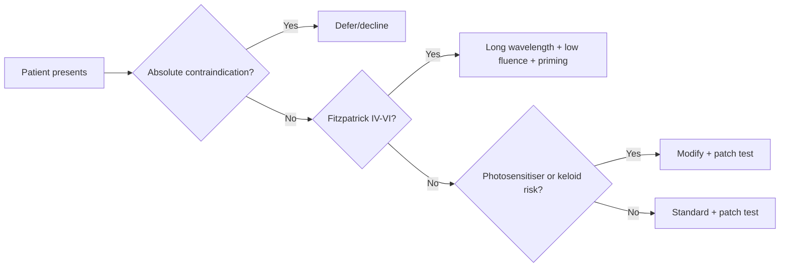

# Light-Based Therapies in Aesthetic Medicine: Photoaging, Brightening, and Hyperpigmentation

Light-based therapy has matured from a single physical principle into a stratified clinical toolkit in which device choice is now governed primarily by **Fitzpatrick skin type and pigment depth** rather than by raw energy output. The evidence base assembled here spans more than 1,900 treated individuals in controlled series from 2017 through 2026, including a 637-participant systematic review of intense pulsed light (IPL) and a 1,356-patient skin-of-color synthesis. The LED photobiomodulation segment alone was valued at USD 453.67 million in 2024, projected to reach USD 478.22 million in 2025 at a 5.58% CAGR.

**The strongest signal in the data contradicts the marketing narrative.** Despite claims that newer picosecond and "laser toning" platforms have solved pigmentary disease, low-fluence 1064-nm Nd:YAG toning shows a **58.8% one-year melasma recurrence**, with mean mMASI actually *worsening* from 3.2 to 5.8. Melasma remains intractable and maintenance-dependent. Through 2030, decisive advances will lie not in single-device breakthroughs but in **combination protocols** pairing energy delivery with topical and oral pharmacotherapy, multi-wavelength platforms, and wavelength-tuned LED arrays.

The single organizing quantity across all device classes is the **match between a device's wavelength and pulse duration and the absorption and thermal-relaxation profile of its target** — melanin, oxyhemoglobin, water, or cellular chromophores. Solar lentigines respond predictably to nanosecond and picosecond pigment lasers; melasma remains a chronic, relapse-prone condition that no single light modality resolves.

## Device Class Overview

| Device Class | Wavelength & Pulse | Mechanism | Primary Indications | Evidence Strength |
|---|---|---|---|---|
| Q-switched (ns) lasers | 532/694/755/1064 nm; ns | Photothermolysis + photoacoustic | Lentigines, tattoo, melasma toning | Strong (lentigines); partial (melasma) |
| Picosecond lasers | 532/755/1064 nm; ps | Photoacoustic fragmentation + LIOB | Refractory pigment, melasma, texture | Growing RCT base 2023–2026 |
| Ablative fractional (CO2/Er:YAG) | 10,600/2940 nm; µs–ms | Water ablation + thermal columns | Deep photoaging, scars | Strong |
| Non-ablative fractional | 1540/1550/675 nm; ms | Dermal microthermal zones | Photoaging, texture, some pigment | Moderate–strong |
| Long-pulsed Nd:YAG/vascular | 1064/595/532 nm; ms | Hemoglobin photothermolysis | Telangiectasia, erythema | Strong (vascular) |
| Intense pulsed light (IPL) | 500–1200 nm filtered; ms | Broadband photothermolysis | Lentigines, redness, photoaging | Strong (lentigines/redness) |
| LED photobiomodulation | 415/585/630/830 nm; non-thermal | Cellular chromophore modulation | Adjunct rejuvenation, recovery | Emerging–partial |
| Photodynamic therapy (ALA/IPL) | Photosensitizer + light | Singlet-oxygen photochemistry | Photoaging with actinic damage | Partial (cosmetic) |

---

# 1. Framework, Scope, and Methodology

**The governing principle: a light-based therapy earns a place here only when it delivers optical energy as its primary therapeutic mechanism for an aesthetic indication.** That criterion excludes injectables, surgery, and topical monotherapy while admitting laser, IPL, LED photobiomodulation, and photodynamic therapy.

## 1.1 Scope and Indication Targets

The four included families — lasers (coherent, monochromatic), IPL (broadband filtered), LED photobiomodulation (non-thermal), and photodynamic therapy (photosensitizer + light) — share the defining property that **photons, not a blade, needle, or standalone cream, are the active agent**. IPL was first developed in 1992 to treat leg telangiectasias and received FDA approval in late 1995, evolving through filter technology that enables precise chromophore targeting[StatPearls / NCBI Bookshelf, "Intense Pulsed Light IPL Therapy," NBK580525.](https://www.ncbi.nlm.nih.gov/books/NBK580525/).

Topical agents reappear only as comparators or combination partners. The March 2023 *Frontiers in Medicine* RCT used 2% hydroquinone as the comparator against two picosecond lasers for melasma[Frontiers in Medicine 2023, "RCT of Picosecond Nd:YAG, Picosecond Alexandrite, and Hydroqu](https://www.frontiersin.org/journals/medicine/articles/10.3389/fmed.2023.1132823/full) — admissible because the light device is the intervention under study. The 2025 Global Guideline frames melasma explicitly as a chronic condition requiring long-term maintenance, combining pharmaceutical agents with procedural therapies[Medscape 2026, "Melanin Hyperpigmentation Disorders Management: Global 2025 Guideline Summ](https://reference.medscape.com/cc2/p10/management-melanin-hyperpigmentation-disorders-guideline-2026a10009av).

The report concentrates on three indications:

- **Photoaging** — cumulative UV damage (wrinkling, dyschromia, textural roughness, telangiectasia, elasticity loss), the broadest target, where fractional resurfacing concentrates.
- **Hyperpigmentation** — solar lentigines, melasma, and post-inflammatory hyperpigmentation (PIH). These three subtypes diverge sharply: **lentigines respond durably, melasma relapses, and PIH carries the risk that the device used to treat it can worsen it.**
- **Brightening** — defined here as **melanogenesis inhibition** measured against baseline melanin density, explicitly *not* a change in constitutive skin color. The report avoids the "whitening" framing in favor of melanin-index and MASI-type endpoints[Medscape 2026, "Melanin Hyperpigmentation Disorders Management: Global 2025 Guideline Summ](https://reference.medscape.com/cc2/p10/management-melanin-hyperpigmentation-disorders-guideline-2026a10009av).

The temporal center of gravity is **2023–2026**, with the 1983 selective-photothermolysis principle and 1992 IPL origin retained only as baselines. A device cannot be graded "mature" on pre-2023 evidence alone.

## 1.2 Evidence Rubric and Outcome Metrics

The appraisal rubric has five weighted dimensions:

| Dimension | Weight |
|---|---|
| Clinical Evidence Strength | 0.30 |
| Safety and Skin-Type Suitability | 0.25 |
| Outcome Durability and Recurrence | 0.20 |
| Mechanistic Plausibility | 0.15 |
| Recency of Advancement | 0.10 |

**The weighting privileges proven, phototype-safe modalities over novel but thinly evidenced ones.** The evidence hierarchy ranks RCTs and systematic reviews highest, then split-face designs (intra-patient control but small samples), then retrospective series, then in vitro assays.

Four outcome metrics recur:
- **MASI/mMASI** — Melasma Area and Severity Index, the primary melasma endpoint, always read alongside recurrence data.
- **GAIS** — Global Aesthetic Improvement Scale, for composite photoaging.
- **VISIA-CR** — standardized cross-polarized/UV imaging quantifying spots, pores, wrinkles, and subsurface melanin.
- **Fitzpatrick phototype (I–VI)** — the stratifying variable running through every claim, because the same device at the same fluence behaves differently on FST I–II than on melanin-rich FST IV–VI, where competing epidermal melanin raises PIH risk.

**Maturity tiers** (applied per device-by-indication pairing, not per device):
- *Mature* — strong randomized evidence, well-characterized safety, durable outcomes.
- *Partial* — plausible mechanism, encouraging but incomplete evidence.
- *Open* — mechanistically promising but clinically unproven at scale.

The same nanosecond laser is thus **mature for lentigines and partial for melasma simultaneously.**

---

# 2. Mechanistic Foundations

Selective photothermolysis, fixed at Massachusetts General Hospital in the early 1980s by Anderson and Parrish, is the physical law making every aesthetic light device work: a pulse shorter than a target's thermal relaxation time confines destructive heat to that target alone[American Cosmetic Association, "Aesthetic Lasers: Evolution and Impact."](https://www.cosmeticassociation.org/products/aesthetic-lasers/). The field exploits five mechanisms — photothermal targeting, photoacoustic fragmentation, non-thermal photobiomodulation, dermal neocollagenesis, and PDT photochemistry.

## 2.1 Selective Photothermolysis and Chromophore Targeting

**Wavelength selects the chromophore; pulse duration selects the damage geometry.** Melanin is a broadband absorber whose absorption falls monotonically from UV through visible into near-infrared. The foundational work used 351 nm pulses to damage melanosomes selectively[Academia.edu 2025, "Selective photothermolysis: precise microsurgery of pulsed radiation."](https://www.academia.edu/19887229/). The operative rule: **lesion depth fixes wavelength** — epidermal lentigines respond to strongly-absorbed short wavelengths, while dermal melasma demands weakly-absorbed 1064 nm that reaches the dermis. A 2025 phantom study shows energy deposition geometry depends jointly on fluence and spot size, not wavelength alone[Springer 2025, "Spatial distribution of light-melanosome interaction dependent on irradiat](https://link.springer.com/article/10.1007/s10103-025-04430-x).

**Thermal relaxation time** — scaling with the square of target diameter — separates Q-switched from long-pulsed selection. A sub-micron melanosome relaxes in tens to hundreds of nanoseconds; a blood vessel relaxes in milliseconds. The practical verdict: **nanosecond pulses match pigment, millisecond pulses match vessels**, and mismatching the two is the commonest mechanistic cause of adverse events. The melasma "laser toning" literature illustrates the tradeoff — practitioners drove 1064 nm fluence into a sub-threshold regime to avoid thermal injury[MDPI Medicina 2022, "Low-Fluence Q-Switched Nd:YAG Laser Treatment for Melasma: A Systemat](https://www.mdpi.com/1648-9144/58/7/936).

**IPL's broadband output creates a chromophore-competition problem.** Within any pulse, melanin and hemoglobin absorb simultaneously and compete for energy[StatPearls / NCBI Bookshelf, "Intense Pulsed Light IPL Therapy," NBK580525.](https://www.ncbi.nlm.nih.gov/books/NBK580525/). Treating a red-and-brown cheek in one pass risks simultaneous clearance — but in darker phototypes, melanin's broad absorption steals energy and causes burns or PIH. The constraint resolves by **raising the cut-off filter to exclude melanin-favoring short wavelengths and applying aggressive contact cooling**.

## 2.2 Photoacoustic and Photomechanical Effects

The picosecond regime (first developed ~2012) is a categorically different damage mode, not merely a faster nanosecond one. An ultrashort pulse deposits energy into a melanosome orders of magnitude below its thermal relaxation time, so the energy generates a steep pressure gradient — an acoustic shock that **shatters pigment into sub-micron fragments small enough for macrophage clearance**. The 2023 histology review documents this distinct fragmentation signature versus nanosecond photothermal damage[Springer 2023, "Fractional picosecond laser treatment: histology and clinical applications](https://link.springer.com/article/10.1007/s10103-022-03704-y). This explains why picosecond devices clear recalcitrant multicolor tattoos and refractory pigment that nanosecond systems leave behind[Med Lasers 2022, "Review of picosecond lasers in non-pigmented disorders."](https://www.jkslms.or.kr/journal/view.html?doi=10.25289%2FML.2022.11.3.125).

**Laser-induced optical breakdown (LIOB)** — plasma formation when focused irradiance exceeds tissue's ionization threshold — converts the picosecond laser from a pigment-clearing tool into a **dermal-remodeling tool**. The microscopic intradermal vacuoles are controlled micro-wounds that recruit fibroblasts and drive neocollagenesis, improving texture and scarring, not only pigment[Springer 2024, "Molecular insights into LIOB after 1064 nm picosecond irradiation."](https://link.springer.com/article/10.1007/s10103-025-04474-z). LIOB is now framed as a "prior strategy" for acquired dermal melanin disorders that conventional photothermal approaches reach poorly[Springer 2024, "LIOB as prior strategy for acquired melanin-increased dermal disorders."](https://link.springer.com/article/10.1007/s10103-024-04170-4).

**The thermal-sparing benefit is not uniform across phototypes.** LIOB occurrence during 1064 nm picosecond treatment depends on skin type: higher baseline melanin lowers the breakdown threshold and shifts energy more superficially[Wiley J Biophotonics 2021, "Dependence of LIOB on skin type during 1064 nm picosecond trea](https://onlinelibrary.wiley.com/doi/10.1002/jbio.202100129). In FST IV–VI, the same fluence gentle in FST II can concentrate breakdown at the dermoepidermal junction and raise blistering and PIH risk. The nanosecond and picosecond regimes fail in opposite ways — diffuse thermal injury versus focal plasma injury where melanin is dense.

## 2.3 Photobiomodulation and Non-Thermal Pathways

Photobiomodulation (PBM) inverts the destructive paradigm: red/near-infrared light at low power densities modulates cellular function without heating. In the 630–850 nm window, **cytochrome-c oxidase** acts as the primary photoacceptor: a photon photodissociates inhibitory nitric oxide, restores electron transport, increases ATP synthesis, and triggers a signaling-level ROS burst[Wiley 2018, "Mechanisms and Mitochondrial Redox Signaling in Photobiomodulation" Hamblin.](https://onlinelibrary.wiley.com/doi/10.1111/php.12864)[Liebert 2020, "What Lies at the Heart of Photobiomodulation: Light, Cytochrome C Oxidase,](https://liebertpub.com/doi/10.1089/photob.2020.4905). **PBM does not add energy thermally; it removes a brake on an enzyme and lets metabolism accelerate**, which is why LED devices are positioned as adjuncts. The therapeutic window is biphasic: roughly 1–10 J/cm² stimulates, while higher doses suppress[Wiley 2018, "Mechanisms and Mitochondrial Redox Signaling in Photobiomodulation" Hamblin.](https://onlinelibrary.wiley.com/doi/10.1111/php.12864).

A specific finding stands out: **585 nm LED suppresses melanogenesis through a paracrine route.** Irradiating keratinocytes (0–20 J/cm²) reduces melanin content and tyrosinase activity without cytotoxicity[PubMed 2020, 585 nm LED melanogenesis suppression.](https://pubmed.ncbi.nlm.nih.gov/32278532/). The mechanism: 585 nm upregulates the long non-coding RNA H19 and its exosomal miR-675, which neighboring melanocytes take up, downregulating melanogenesis[ScienceDirect 2020, H19/miR-675 paracrine melanogenesis pathway.](https://www.sciencedirect.com/science/article/abs/pii/S0923181120301031). **The keratinocyte, not the melanocyte, is the photoacceptor** — a fundamentally different route to lightening than destructive fragmentation, attractive as a non-destructive maintenance adjunct for relapse-prone melasma[Medscape 2026, "Melanin Hyperpigmentation Disorders Management: Global 2025 Guideline Summ](https://reference.medscape.com/cc2/p10/management-melanin-hyperpigmentation-disorders-guideline-2026a10009av).

**The central caveat: wavelength inconsistency.** The same red-to-near-infrared band that suppresses melanogenesis at certain doses has been reported to *increase* it at others, so the field contains directly opposed results at overlapping wavelengths[PubMed 2020, 585 nm LED melanogenesis suppression.](https://pubmed.ncbi.nlm.nih.gov/32278532/). Melanogenesis modulation is not a property of PBM in general but of specific wavelength–dose–target combinations, with the 585 nm route being one narrowly validated instance. No consensus suppression protocol has emerged despite a decade of work — keeping PBM melanogenesis inhibition at **partial maturity**.

## 2.4 Neocollagenesis and Photochemistry

**Fractional photothermolysis** creates microthermal zones surrounded by untreated tissue that serves as a healing reservoir, letting neocollagenesis proceed for up to twelve months after a single course[PMC, "Fractional Laser Resurfacing Treats Photoaging by Promoting Dermal Remodeling."](https://pmc.ncbi.nlm.nih.gov/articles/PMC7028380/). The 1540 nm work confirms fractional treatment modulates fibroblast proliferation and drives neocollagenesis in cultured human dermal fibroblasts[PMC 2022, "1540-nm fractional laser modulates proliferation and neocollagenesis."](https://pmc.ncbi.nlm.nih.gov/articles/PMC9623312/). **The spared tissue between zones, not the zones themselves, is the source of fractional resurfacing's safety**, supplying migrating fibroblasts and keratinocytes.

The **melanogenesis cascade** is the shared molecular target of every non-destructive lightening strategy: MITF drives transcription of tyrosinase (rate-limiting) plus TRP-1 and TRP-2[MDPI 2026, "Biological Roles of Melanin and Natural Product-Derived Modulation."](https://www.mdpi.com/1422-0067/27/2/653). Whether by 585 nm paracrine signaling, topical hydroquinone, or natural-product inhibitors, all converge on **reducing tyrosinase activity or MITF expression**[PMC 2024, "Natural Products for Skin Pigmentation Treatment."](https://pmc.ncbi.nlm.nih.gov/articles/PMC11359997/). Destruction without inhibition invites relapse; inhibition without destruction lightens slowly but holds the gain under maintenance[Medscape 2026, "Melanin Hyperpigmentation Disorders Management: Global 2025 Guideline Summ](https://reference.medscape.com/cc2/p10/management-melanin-hyperpigmentation-disorders-guideline-2026a10009av).

**Photodynamic therapy (PDT)** requires three ingredients: 5-aminolevulinic acid (5-ALA) is metabolized into protoporphyrin IX, which accumulates preferentially in metabolically active cells; light activation transfers energy to oxygen, generating singlet oxygen that oxidatively damages target cells[StatPearls / NCBI Bookshelf, "Intense Pulsed Light IPL Therapy," NBK580525.](https://www.ncbi.nlm.nih.gov/books/NBK580525/). **PDT's selectivity comes from differential protoporphyrin IX accumulation in abnormal cells** — a chemical selectivity complementing the physical selectivity of photothermolysis. The tradeoff is pronounced phototoxicity and downtime, partially resolved by short-contact, lower-concentration protocols.

---

# 3. Modality Profiles

The laser portfolio splits along two axes: **pulse domain** (nanosecond vs picosecond for pigment) and **delivery geometry** (bulk vs fractional, ablative vs non-ablative for resurfacing).

## 3.1 Q-Switched (Nanosecond) Lasers

**Wavelength & pulse.** 5–20 ns pulses at 532, 694, 755, and 1064 nm. The 1064 nm line penetrates deeply and is relatively melanin-sparing at the epidermis — preferred for dermal pigment and darker phototypes; 532 nm is strongly melanin-absorbed, reserved for superficial lentigines. The nanosecond pulse roughly matches the melanosome's thermal relaxation time.

**Mechanism.** Photoacoustic disruption layered on selective photothermolysis: the pulse generates a shockwave fragmenting the target into debris cleared by macrophages over weeks.

**Indications & evidence.** Best-evidenced for solar lentigines, nevus of Ota, and tattoo removal, with a distinct low-fluence "laser toning" protocol for melasma. A split-face study of 22 Asian patients achieved >50% clearance in **50.0% of melasma and 62.5% of solar lentigo patients** after ten weekly sessions[Dermatologic Surgery, "Clinical and Histological Effect of a Low-Fluence Q-Switched 1064 n](https://www.ovid.com/jnls/dermatologicsurgery/pdf/10.1097/dss.0000000000001120). The modality earns a **clear pass for lentigines, partial credit for melasma** where the 50% figure is undercut by high relapse.

**Safety.** The 1064 nm wavelength is the safest laser for FST IV–VI. The signature tension is the **melasma rebound paradox**: aggressive fluence clears faster but provokes melanocyte re-stimulation, so the field shifted to sub-therapeutic toning fluences — accepting that slower is safer. Mottled hypopigmentation is the recognized downside.

**Maturity:** mature for lentigines; partial and relapse-prone for melasma. Increasingly displaced at the premium end by picosecond systems but retaining a cost advantage.

## 3.2 Picosecond Lasers

**Wavelength & pulse.** ~10⁻¹² s pulses (roughly 1000× faster) at 755, 1064, 532, and 785 nm. Some platforms add a diffractive/microlens array concentrating fluence into microbeams for fractional rejuvenation.

**Mechanism.** The pulse ends before meaningful heat conduction, producing **nearly pure photomechanical fragmentation** into finer particles cleared more completely. With the focusing lens engaged, LIOB creates intra-epidermal vacuoles triggering collagen remodeling without bulk thermal injury.

**Indications & evidence.** Spans recalcitrant tattoos, melasma, lentigines, PIH, and (via fractional lens) photoaging. A retrospective series of 10 FST IV–V patients showed a 755 nm picosecond laser with platinum focus lens improved wrinkles, pores, and pigmented lesions simultaneously[Lasers in Medical Science 2025, 755 nm picosecond + platinum focus lens, FST IV–V.](https://link.springer.com/article/10.1007/s10103-025-04574-w). The March 2023 RCT placed picosecond Nd:YAG 1064 nm and alexandrite 755 nm on the same footing as 2% hydroquinone for melasma[Frontiers in Medicine 2023, "RCT of Picosecond Nd:YAG, Picosecond Alexandrite, and Hydroqu](https://www.frontiersin.org/journals/medicine/articles/10.3389/fmed.2023.1132823/full). **Clear pass for tattoo/lentigines; conditional pass for melasma; partial for rejuvenation** (small series).

**Safety.** Shorter pulse and reduced thermal load make it the more forgiving option across FST IV–VI. Practitioners default to **1064 nm in the darkest phototypes, reserving 755 nm for lighter skin** to preserve the safety advantage.

**Maturity:** the most actively innovating laser family of the review window. Through 2028, convergence toward multi-wavelength, lens-switchable platforms serving pigment, tattoo, and photoaging from one chassis, with melasma migrating toward combination regimens[Medscape 2026, "Melanin Hyperpigmentation Disorders Management: Global 2025 Guideline Summ](https://reference.medscape.com/cc2/p10/management-melanin-hyperpigmentation-disorders-guideline-2026a10009av).

## 3.3 Fractional Resurfacing Systems

**Ablative (CO2 10,600 nm / Er:YAG 2940 nm).** Water-targeted vaporization of microcolumns. Er:YAG sits at water's peak absorption (cleaner, shallower ablation, less residual heat); CO2 leaves a coagulation rim driving stronger collagen contraction. **The most aggressive resurfacing tool**, carrying the strongest and longest-standing evidence base for moderate-to-severe photoaging, deep rhytides, and scars[Irish J Medical Science 2025, laser dermatology literature review 2000–2023.](https://link.springer.com/article/10.1007/s11845-025-03942-3). The central tension: the highest efficacy ceiling also carries the highest PIH risk in FST IV–VI. The field resolves this by **dropping density and energy, extending intervals, and adding pigment-suppressing topical priming** rather than excluding darker skin. Maturity: mature.

**Non-ablative (1540/1550 nm + 675 nm since ~2022).** Coagulates dermal columns while sparing the stratum corneum — **the preserved epidermis is the entire value proposition**, trading collagen response for hours-to-days downtime versus week-plus ablative recovery. Distributes remodeling across 4–6 low-downtime sessions rather than 1–2 high-downtime ones. The **675 nm line** adds a melanin-absorbing component giving dual collagen-plus-pigment capability, emerging as a **lower-rebound melasma alternative** to Q-switched toning. Maturity: mature for erbium-glass rejuvenation, open-to-partial for the 675 nm pigment indication.

## 3.4 Long-Pulsed and Vascular Lasers

**Wavelength & pulse.** Long-pulsed Nd:YAG (1064 nm), pulsed-dye laser (585–595 nm), and KTP (532 nm), all in the millisecond regime matched to the longer thermal relaxation of blood vessels. **The pulse must be long enough to heat the entire vessel lumen rather than shatter a point target.**

**Mechanism & indications.** Selective photothermolysis with oxyhemoglobin as chromophore: the heated blood column coagulates and the vessel resorbs. Best-evidenced for facial telangiectasia, rosacea erythema, cherry angiomas, leg veins (1064 nm), and port-wine stains (PDL). The 1064 nm line treats vascular lesions in darker phototypes where shorter wavelengths would burn epidermal melanin. Robust evidence base[Irish J Medical Science 2025, laser dermatology literature review 2000–2023.](https://link.springer.com/article/10.1007/s11845-025-03942-3). Maturity: mature, evolving toward multi-application platform integration.

## 3.5 Intense Pulsed Light

**Wavelength & pulse.** Polychromatic 500–1200 nm from a xenon flashlamp, shaped by interchangeable cutoff filters (515, 560, 590, 640, 695 nm). **The broadband output is IPL's defining feature and fundamental compromise**: a single pulse addresses melanin and hemoglobin at once, buying efficiency at the cost of single-target precision.

**Indications & evidence.** Best for diffuse photorejuvenation, mottled pigmentation, telangiectasia, and overall tone — the archetypal "one-device, many-targets" platform. A 2022 systematic review pooled **16 studies / 637 participants (FST I–IV)**, finding IPL effective across telangiectasia, wrinkles, pores, erythema, lentigines, hyperpigmentation, and overall photoaging at a mean of 4.3 sessions[PubMed 2022, IPL systematic review, 16 studies / 637 participants.](https://pubmed.ncbi.nlm.nih.gov/34609598/). A 2026 real-world study of 236 patients found regular treatment intervals and higher session counts independently associated with better outcomes — **OR 13.62 for regular intervals, 3.80 for total sessions** — while **FST IV had markedly lower response odds (OR 0.12)**[PubMed 2026, 236-patient real-world IPL cohort.](https://pubmed.ncbi.nlm.nih.gov/41582594/).

**The IPL safety paradox:** simultaneously gentler than laser in light skin yet more hazardous in dark skin, because epidermal melanin absorbs across the whole band. Strict phototype gating applies — appropriate for FST I–III, cautious at most in IV (the 0.12 odds making it poor value), contraindicated in V–VI where the laser's 1064 nm line is preferred[ARPANSA, "Advice for consumers: Lasers, IPL, LED phototherapy."](https://www.arpansa.gov.au/understanding-radiation/sources-radiation/more-radiation-sources/lasers-and-intense-pulsed-light-0). **The decisive selection rule:** for diffuse, multi-component dyschromia in lighter phototypes, IPL beats any single laser; for discrete lesions or dark skin, the laser wins. Maturity: mature for core photorejuvenation.

## 3.6 LED Photobiomodulation

The only modality that does not destroy or injure tissue. Low-irradiance narrowband light modulates cellular activity without meaningful heating, placing it at the opposite energy extreme from ablative resurfacing. Profiled in depth in §5 below as an adjunctive and brightening modality.

---

# 4. Photoaging and Skin Rejuvenation

No single modality dominates the photoaging composite; each maps to a different component and a different position on the efficacy-downtime envelope.

## 4.1 Fractional Laser Resurfacing

**Ablative CO2** remains the most potent single-session intervention for static rhytides. A randomized split-face trial of 30 patients with periorbital wrinkles demonstrated measurable improvement in the fixed "crow's-feet" creases least responsive to topicals[Dermatology and Therapy 2025, periorbital CO2 split-face trial.](https://link.springer.com/article/10.1007/s13555-025-01404-3). The defining tension is the **efficacy-downtime tradeoff**, resolved by fractionation itself: sparing intervening columns compresses re-epithelialization from weeks to days while retaining most of the neocollagenetic stimulus. This caps per-session density, so deep rhytides need staged passes[Irish J Medical Science 2025, laser dermatology literature review 2000–2023.](https://link.springer.com/article/10.1007/s11845-025-03942-3). **Unqualified pass for rhytides and texture** — the top of the resurfacing hierarchy.

**Non-ablative (1540/1550/675 nm)** trades raw magnitude for an intact epidermis. The in vitro neocollagenesis signal is unambiguous[PMC 2022, "1540-nm fractional laser modulates proliferation and neocollagenesis."](https://pmc.ncbi.nlm.nih.gov/articles/PMC9623312/). Two 2025 trials anchor durability: a neck-rejuvenation study (19 women, 35–55, WSRS 2–4) gave three monthly 1550 nm sessions[Lasers in Medical Science 2025, neck rejuvenation 1550 nm.](https://link.springer.com/article/10.1007/s10103-025-04600-x), and a split-face RCT (18 patients, age-stratified) compared 1550 vs 1565 nm[PubMed 2025, 1550/1565 nm age-stratified split-face RCT.](https://pubmed.ncbi.nlm.nih.gov/40064643/). The age-stratified design matters because fibroblast capacity declines with age. **The 675 nm wavelength reframes the value proposition** — preferentially absorbed at shallower dermal depths with a melanin-sparing profile, making it better suited to FST IV–VI than infrared fractional devices. Estimated outcome: roughly **1–2 WSRS-grade improvement over three sessions, with 50–70% persisting at six months** absent maintenance (bounded by small cohorts).

**VISIA imaging** has displaced subjective grading, removing inter-rater variability. The 755 nm picosecond platform with platinum focus lens improved wrinkles, pores, and pigment simultaneously in FST IV–V[Lasers in Medical Science 2025, 755 nm picosecond + platinum focus lens, FST IV–V.](https://link.springer.com/article/10.1007/s10103-025-04574-w). VISIA indices are best read as **within-subject change metrics**, since percentile normalization is age- and phototype-referenced.

## 4.2 IPL Photorejuvenation

The 637-patient systematic review found efficacy across nine endpoints — the **single-platform breadth** is the headline, with few modalities showing simultaneous pigmented and vascular efficacy in one population[PubMed 2022, IPL systematic review, 16 studies / 637 participants.](https://pubmed.ncbi.nlm.nih.gov/34609598/). The dual-chromophore mechanism: filtered pulses target epidermal melanin (microcrust sloughs over 7–14 days) and oxyhemoglobin (thermocoagulation, vessel resorption) in sequence.

This consolidation lets practitioners address lentigines and telangiectasia in one visit, avoiding the device-switching workflow that pairing a Q-switched pigment laser with a vascular laser would require. The tradeoff resolves favorably: for moderate-severity photoaging presenting both defects at once, **IPL's single-session economy outweighs the marginal precision loss** — though equivalence breaks for deep vessels and dermal pigment, where 1064 nm devices retain an edge.

**Maintenance is essential.** The 236-patient study showed **interval regularity (OR 13.62) matters nearly fourfold more than session count (OR 3.80)**[PubMed 2026, 236-patient real-world IPL cohort.](https://pubmed.ncbi.nlm.nih.gov/41582594/). The phototype warning is stark: FST IV showed OR 0.12 — roughly eight times less likely to achieve favorable outcome — because higher epidermal melanin competes for photons, forcing operators to lower fluence and blunt clearance. Estimated regimen: **3–5 induction sessions then 1–2 maintenance sessions/year, with 70–85% of FST I–III sustaining improvement** under continued photoprotection.

## 4.3 LED/PBM Adjunctive Rejuvenation

PBM's role in photoaging is adjunctive by design. A 2021 study showed combined red and near-infrared light upregulated **both collagen and elastin** in human fibroblasts in vitro[Int J Cosmetic Science 2021, red/NIR collagen and elastin upregulation.](https://onlinelibrary.wiley.com/doi/10.1111/ics.12698) — elastin governs recoil and fine-line resilience, which few thermal modalities stimulate directly. A 2024 multicenter RCT (60 Asian adults, FST II–V) used a home 630 nm + 850 nm mask, improving crow's-feet wrinkles[PubMed 2024, home 630/850 nm LED mask multicenter RCT.](https://pubmed.ncbi.nlm.nih.gov/39960921/). **Because PBM uses no melanin chromophore and generates no destructive heat, it carries no phototype-dependent PIH risk** — one of few rejuvenation modalities equally safe across FST I–VI.

The verdict resists overclaiming: controlled evidence supports only **modest fine-line improvement, not the deep-rhytide correction ablative CO2 achieves**. PBM's strongest and least contested role is **post-procedure healing**: the same ATP-upregulation mechanism accelerates fibroblast migration and dampens inflammation, shortening post-fractional erythema[J Translational Medicine 2025, "From light to healing: photobiomodulation across disciplin](https://link.springer.com/article/10.1186/s12967-025-07466-3). By compressing the inflammatory window, **PBM indirectly reduces the PIH risk that is the chief hazard of treating darker phototypes**, partially uncoupling ablative efficacy from PIH incidence. Multi-wavelength yellow/red/IR protocols extend the effect across dermal depths[JAAD 2024, "Photobiomodulation CME part I: Overview and mechanism of action."](https://www.jaad.org/article/S0190-9622(24) but remain partial-maturity pending head-to-head evidence.

## 4.4 Photodynamic Therapy

PDT is distinguished by treating **field cancerization and photoaging in a single procedure**. When IPL activates ALA photosensitization, the singlet-oxygen injury adds a dermal-remodeling stimulus beyond IPL's photothermal clearance, improving fine rhytides, texture, sallowness, and dyschromia[Irish J Medical Science 2025, laser dermatology literature review 2000–2023.](https://link.springer.com/article/10.1007/s11845-025-03942-3). The mechanism is the same injury-and-repair logic as fractional resurfacing, but the injury is chemical and cell-selective.

**The unique dual benefit:** ALA-PDT clears actinic keratoses and reduces precancerous field burden in the same session that improves cosmetic appearance[Int J Women's Dermatology 2017, "Laser and Light Therapy in the Treatment of Melasma."](https://pmc.ncbi.nlm.nih.gov/articles/PMC5418955/). This biases the population toward older, fairer-skinned, heavily sun-damaged patients (predominantly FST I–III). PDT's oncologic indication is guideline-established; its aesthetic indication passes only at a partial tier.

The cost is **the steepest downtime of any light modality except aggressive ablative CO2**: several days of marked erythema, edema, crusting, and photosensitivity, with residual protoporphyrin IX photoactive for ~24–48 hours requiring strict light avoidance. Daylight PDT and shortened-incubation protocols trade some potency for tolerability. Photosensitizing agents (St John's wort, coal tar, certain antibacterials) must be screened[C-WAVE LED Contraindications.](https://assets.ctfassets.net/zhlj43mgv753/uFytCzabYCUXzn9xbIMGc/13d8680f9d71976dd98b49b8d2eee0ad/BP_-_C-WAVE_LED_DEVICE_CONTRAINDICATIONS__2_.pdf), and the photosensitizer amplifies tissue response to any light dose, applying the severe adverse-event profile with particular force[Health Physics 2020, non-ionizing radiation cosmetic exposure.](https://www.ovid.com/jnls/health-physics/pdf/10.1097/hp.0000000000001169)[MHRA 2015 laser guidance.](https://assets.publishing.service.gov.uk/media/5a75936f40f0b6360e475291/Laser_guidance_Oct_2015.pdf). **PDT is a field-treatment tool with a rejuvenation byproduct** — optimal for the sun-damaged patient needing field treatment anyway, a poor choice for anyone else.

---

# 5. Hyperpigmentation

Hyperpigmentation diverges most sharply between triumph and frustration: **solar lentigines clear in a single session while melasma relapses in well over half of patients within twelve months.** The controlling variable is target biology — whether excess melanin sits as a stable epidermal deposit or a dynamically regenerating, inflammation-driven process.

## 5.1 Solar Lentigines

Lentigines are **the single best-behaved pigment target** — predominantly epidermal melanin that does not regenerate aggressively once cleared. The Q-switched laser (532/694 nm matched to melanin's peak) shatters the melanosome via classic selective photothermolysis. Picosecond lasers add photoacoustic fracture with less thermal injury, lowering PIH risk in darker skin[Big Country Laser, "Pico vs Q-Switched Nd:YAG."](https://www.bigcountrylaser.com/pico-vs-q-switched-ndyag/).

**Single-session clearance of 70–90% is realistic with both device classes** — the unambiguously passing indication[Bintanjoyo & Indramaya, "Application of Picosecond Laser in Dermatology."](https://e-journal.unair.ac.id/BIKK/article/download/25144/25646). A contrarian note: despite marketing, the picosecond clearance advantage is *narrow* for shallow epidermal targets where nanosecond photothermolysis already achieves near-complete destruction[Springer 2025, "Spatial distribution of light-melanosome interaction dependent on irradiat](https://link.springer.com/article/10.1007/s10103-025-04430-x); the picosecond edge materializes for dermal and refractory pigment.

**IPL** occupies a distinct niche: where the Q-switched laser obliterates a discrete dark macule, IPL treats the **diffuse field** of mottled photodamage in a single large-spot pass, addressing vascular and pigmentary components together. The mapping: **discrete lesion favors focused laser; diffuse field favors IPL.**

**Durability is the defining virtue.** Once epidermal melanin clears, lentigines do not reliably return absent renewed sun exposure — the structural opposite of melasma. Projected: **~75–90% of lesions achieve ≥75% clearance after a single session in FST I–III, with 12-month recurrence below ~10–15%** under photoprotection — inverting almost exactly against melasma's 58.8% recurrence[PubMed, "Long-term results in low-fluence 1064-nm QS Nd:YAG for melasma."](https://pubmed.ncbi.nlm.nih.gov/27349828/). **Lentigines function as the positive control:** when the same devices fail against melasma, the fault lies with the target, not the laser.

## 5.2 Melasma: The Refractory Limit Case

Melasma defeats the selective-photothermolysis paradigm. It is chronic and acquired, most common in women of FST III–V, driven by hormonal, UV, and vascular factors keeping melanocytes persistently activated. The 2025 Global Guideline frames it as requiring **long-term maintenance combining pharmaceutical and procedural therapies**, especially for ethnic skin[Medscape 2026, "Melanin Hyperpigmentation Disorders Management: Global 2025 Guideline Summ](https://reference.medscape.com/cc2/p10/management-melanin-hyperpigmentation-disorders-guideline-2026a10009av).

**Laser toning** — repeated low-fluence 1064 nm Q-switched passes — trades short-term lightening for two characteristic complications: **mottled hypopigmentation and rebound hyperpigmentation**[MDPI Medicina 2022, "Low-Fluence Q-Switched Nd:YAG Laser Treatment for Melasma: A Systemat](https://www.mdpi.com/1648-9144/58/7/936)[JSLSM, "Danger of Low Fluence Q-switched Nd:YAG Laser Treatment for Melasma."](https://www.jstage.jst.go.jp/article/jslsm/36/4/36_jslsm-36_0035/_article). The rebound mechanism: subthreshold energy induces sublethal melanocyte injury and transient improvement; surviving melanocytes then upregulate melanogenesis in response to cumulative inflammation. The long-term data are stark: **one year after low-fluence 1064 nm treatment, recurrence reached 58.8% (20/34), with mean mMASI rising from 3.2 ± 1.6 to 5.8 ± 1.9** — nearly two points worse than baseline[PubMed, "Long-term results in low-fluence 1064-nm QS Nd:YAG for melasma."](https://pubmed.ncbi.nlm.nih.gov/27349828/).

The comparative trial literature confirms that **no pigment-targeting device delivers durable clearance:**

| Trial (year) | Device | Population | Key outcome | Durability |
|---|---|---|---|---|
| Dermatol Ther 2025 | 675 nm diode | 28 Thai women, III–V | mMASI −41% at 3 mo[Dermatology and Therapy 2025, 675 nm diode, 28 Thai women.](https://link.springer.com/article/10.1007/s13555-025-01613-w) | Decays to −34% at 6 mo |
| Lasers Med Sci 2025 | 675 nm vs 1064 QS (split-face) | 30 patients | 5 biweekly[Lasers in Medical Science 2025, 675 nm vs 1064 QS split-face.](https://link.springer.com/article/10.1007/s10103-025-04679-2) | Both relapse-prone |
| Lasers Surg Med 2024 | 755 pico alex vs 1064 QS | Split-face | QS better short-term[Lasers Surg Med 2024, Zhou, 755 picosecond alexandrite vs 1064 QS split-face.](https://www.scribd.com/document/737827221/) | Both high recurrence |
| Lasers Med Sci 2025 | Pico alex vs QS+long-pulse | 40, III–IV | Measurable, 3 sessions[Lasers in Medical Science 2025, pico alexandrite vs QS+long-pulse.](https://link.springer.com/article/10.1007/s10103-025-04286-1) | Non-durable |
| PubMed | 1064 QS toning | 34 patients | 58.8% recurrence at 1 yr[PubMed, "Long-term results in low-fluence 1064-nm QS Nd:YAG for melasma."](https://pubmed.ncbi.nlm.nih.gov/27349828/) | mMASI 3.2→5.8 |

**The telling detail is the 675 nm diode's decay from 41% to 34% improvement between three and six months — even a purpose-built wavelength loses ground, confirming relapse is intrinsic to the disease, not a device deficiency.** Device monotherapy does not reliably outperform sustained topical hydroquinone, which is why the guideline frames devices as adjuncts[Medscape 2026, "Melanin Hyperpigmentation Disorders Management: Global 2025 Guideline Summ](https://reference.medscape.com/cc2/p10/management-melanin-hyperpigmentation-disorders-guideline-2026a10009av).

The **PIH-risk paradox** is melasma's defining tension: applying a pigment-destroying laser to melasma-prone darker skin frequently *darkens* it, because the inflammatory stimulus provokes PIH in a population primed for melanocyte overactivity. The literature resolves this not by abandoning light but by **capping fluence far below photothermolytic thresholds**[PubMed, "Postinflammatory and rebound hyperpigmentation after 585 nm QS + hydroquinone."](https://pubmed.ncbi.nlm.nih.gov/33002283/). Synthesizing across trials: **50–60% of device-treated melasma patients relapse within twelve months absent maintenance**, the 58.8% figure anchoring the band[PubMed, "Long-term results in low-fluence 1064-nm QS Nd:YAG for melasma."](https://pubmed.ncbi.nlm.nih.gov/27349828/). **Melasma is not a harder lentigo but a categorically different problem** — the only defensible posture is low-energy multimodal suppression with indefinite maintenance.

## 5.3 Post-Inflammatory Hyperpigmentation

PIH is excess melanin following any cutaneous inflammation — including the energy-based treatments throughout this report. Its **iatrogenic dimension** is defining: the same device energy that clears a lentigo can generate the PIH that then requires further treatment. **Light therapy is simultaneously the commonest procedural cause and a candidate cure**[PubMed, "Postinflammatory and rebound hyperpigmentation after 585 nm QS + hydroquinone."](https://pubmed.ncbi.nlm.nih.gov/33002283/).

For treatment, **picosecond lasers are favored** — their mechanical-dominant pigment disruption reduces the collateral inflammation that seeds new PIH, making them safer for FST III–V than nanosecond alternatives, at higher device cost[Astria, "Pico Laser vs Q-Switched for Pigmentation."](https://astria.com.sg/pico-laser-vs-q-switched-laser/)[Big Country Laser, "Pico vs Q-Switched Nd:YAG."](https://www.bigcountrylaser.com/pico-vs-q-switched-ndyag/).

**Conservative settings for dark skin** form a uniform envelope: longer wavelengths (1064 nm, less absorbed by epidermal melanin), lower fluence, longer pulses, larger spots, and aggressive cooling[Wiley J Biophotonics 2021, "Dependence of LIOB on skin type during 1064 nm picosecond trea](https://onlinelibrary.wiley.com/doi/10.1002/jbio.202100129). The skin-of-color evidence base remains thin: a systematic review of 48 studies / **1,356 individuals** reported a Fitzpatrick distribution of 20% III, 40% IV, 34% V, **only 6% VI** — meaning device safety in dark skin is weighted toward IV–V and sparse for VI[Am J Clin Dermatology 2023, skin-of-color systematic review, 48 studies / 1356 individuals](https://link.springer.com/article/10.1007/s40257-023-00759-7).

The PIH evidence base is **the thinnest of the three conditions**: most trials report PIH only as an adverse event, so the literature quantifies it as a complication far better than as a treatment target[MDPI 2024, sequential laser therapy, 122 Indian patients.](https://www.mdpi.com/2077-0383/13/7/2116). Clinicians extrapolate PIH protocols from melasma and lentigines evidence — **the weakest evidential link in the pigment chain.**

## 5.4 Decision Logic

**The single most important claim: lentigines and melasma differ not in melanin quantity but in its dynamics** — a lentigo is a static deposit that stays destroyed, whereas melasma is an actively maintained state where destroying pigment provokes the machinery that regenerates it[PubMed, "Long-term results in low-fluence 1064-nm QS Nd:YAG for melasma."](https://pubmed.ncbi.nlm.nih.gov/27349828/). The convergent relapse across 755 picosecond, 1064 Q-switched, and 675 nm diode trials indicates the limitation is **biological, not technological**[Lasers Surg Med 2024, Zhou, 755 picosecond alexandrite vs 1064 QS split-face.](https://www.scribd.com/document/737827221/).

**Pigment depth** is the second axis: epidermal pigment is reached by 532/694 nm and IPL; dermal pigment requires 1064 nm and increasingly picosecond LIOB; mixed-depth disease responds incompletely to any single modality[Springer 2024, "LIOB as prior strategy for acquired melanin-increased dermal disorders."](https://link.springer.com/article/10.1007/s10103-024-04170-4). The governing rule: **focused pigment-shattering is first-line for static, discrete deposits and contraindicated as monotherapy for regenerating, diffuse disease**, where low-energy multimodal maintenance governs.

| Indication | Dynamics | Depth | Preferred modality | Recurrence |
|---|---|---|---|---|
| Solar lentigines (discrete) | Static | Epidermal | QS 532/694 or pico, single session[Bintanjoyo & Indramaya, "Application of Picosecond Laser in Dermatology."](https://e-journal.unair.ac.id/BIKK/article/download/25144/25646) | Low; durable |
| Diffuse sun damage | Static, multifocal | Epidermal | IPL field, 3–5 sessions[StatPearls / NCBI Bookshelf, "Intense Pulsed Light IPL Therapy," NBK580525.](https://www.ncbi.nlm.nih.gov/books/NBK580525/) | Low; gradual |
| Epidermal melasma | Regenerating | Epidermal | Low-fluence light + topical + maintenance[Medscape 2026, "Melanin Hyperpigmentation Disorders Management: Global 2025 Guideline Summ](https://reference.medscape.com/cc2/p10/management-melanin-hyperpigmentation-disorders-guideline-2026a10009av) | High; 50–60% at 12 mo[PubMed, "Long-term results in low-fluence 1064-nm QS Nd:YAG for melasma."](https://pubmed.ncbi.nlm.nih.gov/27349828/) |
| Dermal/mixed melasma | Regenerating | Dermal/mixed | 1064 pico LIOB, cautious + multimodal[Springer 2024, "Molecular insights into LIOB after 1064 nm picosecond irradiation."](https://link.springer.com/article/10.1007/s10103-025-04474-z) | High; intrinsic[Dermatology and Therapy 2025, 675 nm diode, 28 Thai women.](https://link.springer.com/article/10.1007/s13555-025-01613-w) |
| PIH | Resolving | Epidermal/dermal | Conservative 1064 pico; treat cause[Astria, "Pico Laser vs Q-Switched for Pigmentation."](https://astria.com.sg/pico-laser-vs-q-switched-laser/) | Moderate; iatrogenic |
| Dark skin (IV–VI) | Variable | Variable | 1064 nm, low fluence, cooling[Wiley J Biophotonics 2021, "Dependence of LIOB on skin type during 1064 nm picosecond trea](https://onlinelibrary.wiley.com/doi/10.1002/jbio.202100129) | Elevated PIH risk |

**LED PBM** occupies a different position entirely — adjunctive and anti-inflammatory rather than pigment-ablative. It does not target melanin; red/near-infrared light modulates cellular energetics via cytochrome c oxidase, dampening inflammation that drives PIH and melasma flares[Wiley 2018, "Mechanisms and Mitochondrial Redox Signaling in Photobiomodulation" Hamblin.](https://onlinelibrary.wiley.com/doi/10.1111/php.12864)[PMC, "Proposed Mechanisms of Photobiomodulation or Low-Level Light Therapy."](https://www.ncbi.nlm.nih.gov/pmc/articles/PMC5215870/). **The mechanism is well-grounded but pigment-specific clinical evidence is open, not mature.** PBM's defensible role through 2027 is as a **post-procedure anti-inflammatory adjunct reducing the PIH liability of the ablative and Q-switched treatments it accompanies**, not a standalone depigmenting agent[J Translational Medicine 2025, "From light to healing: photobiomodulation across disciplin](https://link.springer.com/article/10.1186/s12967-025-07466-3).

---

# 6. Brightening and Melanogenesis Inhibition

Brightening is the **least mechanistically settled** light indication, with the widest gap between laboratory demonstration and clinical delivery. The chapter uses **melanogenesis inhibition** and **pigment lightening** as precise concepts, reserving "brightening" for the clinical-perceptual endpoint.

## 6.1 Mechanism versus Clinical Endpoint

**The central tension: a molecule that suppresses tyrosinase in a petri dish does not automatically brighten a living face.** Melanogenesis inhibition is an enzymatic endpoint — the 585 nm work reduced melanin content and tyrosinase activity in keratinocytes without cytotoxicity[PubMed 2020, 585 nm LED melanogenesis suppression.](https://pubmed.ncbi.nlm.nih.gov/32278532/). The clinical endpoint (MASI/mMASI, Melanin Index) integrates everything the assay excludes: already-deposited melanin, varying depths, ongoing UV restimulation, and vascular/textural contributors. **A stimulus can switch off new synthesis entirely and still produce no visible brightening for weeks, because existing melanin must first shed through epidermal turnover.**

Roughly **60–80% of "brightening" mechanism claims rest on in vitro assays**, with far fewer carrying controlled clinical Melanin-Index endpoints — **the literature is top-heavy with preclinical plausibility and thin on clinical confirmation.** The translation gap is real: suppressed synthesis must outpace UV restimulation, deposited melanin must traffic out over ~4–6 weeks, only then does the Melanin Index fall enough to register. The turnover biology is fixed and cannot be accelerated photobiologically.

The luminosity endpoint patients request ("glow") is a **composite of three contributors**: melanin load, the vascular component (why IPL improves radiance even with modest melanin effect[StatPearls / NCBI Bookshelf, "Intense Pulsed Light IPL Therapy," NBK580525.](https://www.ncbi.nlm.nih.gov/books/NBK580525/)), and surface texture/scatter (why collagen-stimulating PBM raises luminosity without touching pigment[Int J Cosmetic Science 2021, red/NIR collagen and elastin upregulation.](https://onlinelibrary.wiley.com/doi/10.1111/ics.12698)). **This multi-contributor reach is light's genuine advantage over topicals** — a single hydroquinone hits only the melanin axis, while IPL hits melanin and vasculature and combined PBM hits inflammation and collagen scatter.

## 6.2 LED/PBM Wavelengths for Pigment Suppression

The 2025 review catalogs four bands: blue (400–470), yellow (570–590), red (630–760), near-infrared (760–1200)[Photodermatol Photoimmunol Photomed 2025, PBM wavelength-band taxonomy.](https://onlinelibrary.wiley.com/doi/full/10.1111/phpp.70041).

**585 nm via H19/miR-675** is the best-characterized melanogenesis-inhibition mechanism in the entire LED literature — a paracrine route where irradiated keratinocytes secrete exosomes taken up by neighboring melanocytes, suppressing tyrosinase, running without cytotoxicity across 0–20 J/cm²[ScienceDirect 2020, H19/miR-675 paracrine melanogenesis pathway.](https://www.sciencedirect.com/science/article/abs/pii/S0923181120301031). This turns down *future* pigment production at the enzymatic source, leaving existing melanosomes intact — slower than destructive routes but gentler, **theoretically the more attractive route for darker phototypes** where destructive PIH risk is highest. **Strong on Mechanistic Plausibility, partial on Clinical Evidence Strength** (demonstrated in culture, not yet in a controlled trial with a Melanin-Index endpoint).

**Green 505 nm and yellow 590 nm** occupy uncertain middle ground. Green 505 nm falls *outside* the four catalogued bands — a telling fact, since the most-marketed green claims target a wavelength the comprehensive review does not list. Because melanin absorption rises toward shorter wavelengths, any green effect likely runs through a shallow photothermal route rather than the paracrine cascade. These wavelengths are **plausible-but-unconfirmed.**

**The "effective wavelength" is genuinely unsettled** — but the divergence is signal, not noise: different labs measure different endpoints. A study scoring texture favors red/near-infrared; a study scoring Melanin Index favors yellow; **no single wavelength optimizes the composite luminosity endpoint.** This favors **multi-wavelength device design** (the 630 + 850 nm architecture already in trials[PubMed 2024, home 630/850 nm LED mask multicenter RCT.](https://pubmed.ncbi.nlm.nih.gov/39960921/)) rather than a hunt for the one true wavelength.

## 6.3 Laser/IPL Toning

**Low-fluence laser toning** uses collimated 1064 nm Q-switched Nd:YAG at subthreshold levels delivering sublethal insult that fragments melanin without killing the melanocyte[MDPI Medicina 2022, "Low-Fluence Q-Switched Nd:YAG Laser Treatment for Melasma: A Systemat](https://www.mdpi.com/1648-9144/58/7/936). The mechanism is effective but **inherently maintenance-dependent**: it clears deposited pigment without resolving the cause, so the melanocyte resumes output once treatment stops[Medscape 2026, "Melanin Hyperpigmentation Disorders Management: Global 2025 Guideline Summ](https://reference.medscape.com/cc2/p10/management-melanin-hyperpigmentation-disorders-guideline-2026a10009av).

**IPL** is the most versatile global-dyschromia device, simultaneously targeting melanin and hemoglobin through filtered broadband output[StatPearls / NCBI Bookshelf, "Intense Pulsed Light IPL Therapy," NBK580525.](https://www.ncbi.nlm.nih.gov/books/NBK580525/). For dyschromia with a vascular or discrete-lentigine component, IPL is the more appropriate radiance tool; for diffuse dermal melasma pigment, low-fluence toning is — **the two are complementary.**

**The defining safety problem is overtreatment-induced hypopigmentation.** The same repeated subthreshold energy can, with cumulative sessions, **permanently disable melanocytes and produce mottled hypopigmentation** — often irreversible and cosmetically worse than the original complaint[JSLSM, "Danger of Low Fluence Q-switched Nd:YAG Laser Treatment for Melasma."](https://www.jstage.jst.go.jp/article/jslsm/36/4/36_jslsm-36_0035/_article). The paradox resolves through dose accumulation: each session is safely subthreshold, but repeated sublethal insults accumulate until function is lost. **The very repetition that maintenance requires drives the hypopigmentation risk.** The field resolves this not by raising fluence but by **capping session counts and combining toning with topicals**[Semantic Scholar, "Strategies for Managing Non-Responders to Laser Toning."](https://pdfs.semanticscholar.org/053b/24998a330dc4efaf645f80fde8fe2290c58d.pdf). **Device-only brightening is self-limiting:** pursuing speed through repeated passes moves the patient toward the hypopigmentation boundary.

## 6.4 Combination Strategies

**The field's strongest controlled evidence lives in combination regimens.** Three topical classes dominate:

- **Tranexamic acid** — a 2025 study found laser plus topical tranexamic acid showed significantly smaller melasma area and depth than laser alone (P < 0.05) *and a lower side-effect rate*[Lasers in Medical Science 2025, laser + topical tranexamic acid.](https://link.springer.com/article/10.1007/s10103-025-04639-w). The mechanistically interesting finding: the topical reduces the melanocyte stimulus, **letting the laser achieve the same endpoint at lower cumulative energy**, reducing hypopigmentation and PIH risk.
- **Azelaic acid** — a 2024 split-face RCT added 755 nm picosecond to one hemiface over an established 20% azelaic acid base, isolating the device's incremental effect[Lasers in Medical Science 2024, 755 picosecond + 20% azelaic acid split-face.](https://link.springer.com/article/10.1007/s10103-024-04052-9).
- **Modified Kligman's formulation** — a split-face RCT in FST IV–V compared weekly 1064 nm Q-switched against daily Kligman's[Wiley, "Split-face RCT: 1064 QS vs modified Kligman's in darker skin."](https://onlinelibrary.wiley.com/doi/10.1111/ijd.15229) (a comparison, not a combination).

**The single most under-appreciated determinant is photoprotection.** UV restimulates melanocytes, refilling cleared pigment — the relapse chain runs regardless of which device cleared it. **Daily broad-spectrum sunscreen is the true rate-limiting variable for durable brightening, not the laser or LED choice.** No brightening modality passes as durable absent maintenance photoprotection.

**The central verdict: brightening results are protocol-dependent, not device-dependent.** For a discrete lentigine, device and fluence determine outcome. For diffuse brightening, the same device produces radically different outcomes depending on topical pairing, session ceiling, and maintenance — which is why laser-plus-tranexamic-acid outperforms laser-only using the *identical* laser[Lasers in Medical Science 2025, laser + topical tranexamic acid.](https://link.springer.com/article/10.1007/s10103-025-04639-w). **The device sets the ceiling; the protocol determines how much is realized and whether it persists.** Against the marketing narrative, the incremental gain from upgrading the device is generally smaller than from optimizing the topical pairing around whatever device is already in the clinic.

Brightening by light is best classified as a **partial-maturity indication**: combination protocols are well-evidenced, but device-specific brightening mechanism remains open for most wavelengths outside 585 nm.

---

# 7. Recent Advances (2023–2026)

The period marks the transition from empirical tuning toward **mechanism-guided engineering**, co-optimizing pulse physics, beam geometry, and molecular targeting. Four vectors dominate: picosecond plus microlens arrays; novel wavelengths (675 nm, tri-wavelength hybrids); laser-assisted drug delivery with PDT; and the maturing but evidence-thin PBM frontier.

## 7.1 Picosecond and Microlens-Array Innovations

The central engineering move concentrates low bulk fluence into a sparse lattice of high-intensity microbeams, producing LIOB without ablating the epidermis. The **FDA-cleared HandPICO Fractional Laser Handpiece Tip (K242534, 510(k) clearance December 20, 2024)** delivers 1064 nm picosecond energy as 280 microbeams/cm² spaced 600 µm apart[FDA 510k, "HandPICO Fractional Laser Handpiece Tip K242534."](https://fda.innolitics.com/submissions/SU/subpart-e%E2%80%94surgical-devices/GEX/K242534). The **600 µm inter-beam spacing** is load-bearing — it leaves untreated tissue reservoirs that drive neocollagenesis while keeping downtime near zero[Springer 2023, "Fractional picosecond laser treatment: histology and clinical applications](https://link.springer.com/article/10.1007/s10103-022-03704-y)[Springer 2024, "Molecular insights into LIOB after 1064 nm picosecond irradiation."](https://link.springer.com/article/10.1007/s10103-025-04474-z).

**The clinical case for picosecond over Q-switched** rests on photothermal-versus-photoacoustic physics: the ~1000× shorter pulse confines energy to the chromophore, narrowing collateral thermal injury and **lowering PIH risk in darker phototypes**. But the advantage is conditional, not absolute — picosecond photoacoustic energy still activates melanocytes if fluence is pushed, and the LIOB threshold is itself skin-type dependent[Wiley J Biophotonics 2021, "Dependence of LIOB on skin type during 1064 nm picosecond trea](https://onlinelibrary.wiley.com/doi/10.1002/jbio.202100129).

**The trial record is strong for lentigines/photoaging but equivocal for melasma.** The pivotal evidence: in a split-face trial of 755 nm picosecond alexandrite versus 1064 nm Q-switched for melasma, **the Q-switched device produced better short-term results, yet both arms showed high long-term recurrence**[Lasers Surg Med 2024, Zhou, 755 picosecond alexandrite vs 1064 QS split-face.](https://www.scribd.com/document/737827221/). This is the empirical spine of the contrarian verdict: **the pulse-domain upgrade does not resolve the durability problem.** Projection: **60–75% of picosecond melasma responders relapse within 6–12 months absent maintenance**[Medscape 2026, "Melanin Hyperpigmentation Disorders Management: Global 2025 Guideline Summ](https://reference.medscape.com/cc2/p10/management-melanin-hyperpigmentation-disorders-guideline-2026a10009av). **Clear pass for lentigines/photoaging; partial pass for melasma.**

## 7.2 Novel Wavelengths and Hybrid Systems

If shortening the pulse leaves melasma biology intact, the wavelength frontier asks whether a better-matched chromophore succeeds where pulse physics stalled.

**The 675 nm diode laser** targets melanin at a point balancing specificity against penetration. A prospective trial of 28 Thai women (FST III–V) reported **mMASI improvement of 41% at 3 months, regressing to 34% at 6 months**, with >70% achieving ≥50% clearance[Dermatology and Therapy 2025, 675 nm diode, 28 Thai women.](https://link.springer.com/article/10.1007/s13555-025-01613-w). The regression is diagnostic — **even a melanin-optimized wavelength does not sustain clearance.** A split-face trial randomized 30 patients to five biweekly 675 nm vs 1064 nm Q-switched sessions, the first dated head-to-head against the entrenched standard[Lasers in Medical Science 2025, 675 nm vs 1064 QS split-face.](https://link.springer.com/article/10.1007/s10103-025-04679-2). **Partial pass:** two dated 2025 trials with quantified endpoints are a genuine advance, but small samples and 3-to-6-month regression keep it short of robust.

**Hybrid platforms** collapse sequential treatments into one session. The **HALO TRIBRID (Sciton, September 11, 2025)** combines 2940 nm (ablative), 1927 nm (shallow non-ablative), and 1470 nm (deeper), spanning the ablative–non-ablative spectrum[Sciton, "HALO TRIBRID Laser."](https://sciton.com/halo-tribrid/). A 2025 split-face multicenter trial combined long-pulse 1064 nm with picosecond 755 nm + diffractive lens array, the combined side reaching **85.7% vs 66.7% GAIS at 3 months**[PubMed 2025, long-pulse 1064 + picosecond 755 + DLA split-face multicenter.](https://pubmed.ncbi.nlm.nih.gov/41405728/) — the strongest dated evidence that stacking a dermal-heating wavelength onto a pigment-shattering one produces additive benefit. Independent per-wavelength parameter control mitigates the compounded thermal risk in darker phototypes. **Clear pass on Recency; partial on Clinical Evidence** (the outcome data exist for the dual-laser protocol, not the single tri-wavelength unit).

**Optimized IPL filters and low-fluence protocols.** Cut-on filters convert a general flashlamp into a lesion-specific instrument, with the 2023–2026 advance being narrower indication-matched filters[GIAI, "Introduction to IPL beauty instrument filters."](https://www.giaiphotonics.com/introduction-to-ipl-beauty-instrument-filters/)[StatPearls / NCBI Bookshelf, "Intense Pulsed Light IPL Therapy," NBK580525.](https://www.ncbi.nlm.nih.gov/books/NBK580525/). A June 2025 observational study evaluated oral tranexamic acid + low-fluence IPL + glycolic acid for mixed melasma — deliberately low-energy to clear pigment without rebound-driving thermal provocation[PMC 2025, oral tranexamic acid + low-fluence IPL + glycolic acid.](https://pmc.ncbi.nlm.nih.gov/articles/PMC12173325/). Dropping fluence interrupts the first link of the inflammatory-melanogenic cascade. **Qualified pass for FST III–V, conditional on pairing with systemic and topical adjuncts.** Projection: low-fluence triple-therapy becomes default first-line for pigmented phototypes in ~60–70% of specialist practices through 2027[Medscape 2026, "Melanin Hyperpigmentation Disorders Management: Global 2025 Guideline Summ](https://reference.medscape.com/cc2/p10/management-melanin-hyperpigmentation-disorders-guideline-2026a10009av).

## 7.3 Laser-Assisted Drug Delivery and Combination PDT

**Laser-assisted drug delivery** turns the ablative fractional laser into a delivery system: microscopic ablation channels bypass the stratum corneum, letting topicals penetrate orders of magnitude deeper. The delivery channel and rejuvenation stimulus arise from the same pass[PMC 2022, "1540-nm fractional laser modulates proliferation and neocollagenesis."](https://pmc.ncbi.nlm.nih.gov/articles/PMC9623312/). Admitting tranexamic acid to the basal melanocytes suppresses tyrosinase more effectively than topical application alone — laser plus topical tranexamic acid produced **significantly smaller melasma area and depth (P < 0.05) with fewer side effects**[Lasers in Medical Science 2025, laser + topical tranexamic acid.](https://link.springer.com/article/10.1007/s10103-025-04639-w). This couples one light mechanism to a pharmacologic one — a different synergy axis than stacking two light mechanisms. **Clear pass on Mechanistic Plausibility.**

**ALA-IPL PDT** is photochemical: topical ALA converts to protoporphyrin IX, which IPL activation turns into reactive oxygen species. A split-face study found higher improvement scores with 20% 5-ALA + IPL than IPL alone for photorejuvenation[PubMed, "Photorejuvenation with 20% 5-ALA + IPL: split-face study."](https://pubmed.ncbi.nlm.nih.gov/15696983/), replicated in Asian skin[PMC, "5-ALA Photodynamic IPL in Asian Skin Photoaging."](https://pmc.ncbi.nlm.nih.gov/articles/PMC2921742/). For actinic keratoses the contrast is cleanest: **62.9% lesion-area clearance with ALA + IPL versus zero with IPL alone**[Surgical & Cosmetic Dermatology, "IPL vs IPL + ALA in photodamaged skin."](http://www.surgicalcosmetic.org.br/details/28/en-US/) — demonstrating a capability IPL lacks on its own. **Pass for photoaging/actinic keratosis; cautious partial for melasma**, where the inflammatory ROS burst risks melanogenic rebound.

**A contrarian reading of the combination literature:** while specific pairings (laser + tranexamic acid, ALA + IPL, dual-laser) consistently beat monotherapy on at least one endpoint[PubMed 2025, long-pulse 1064 + picosecond 755 + DLA split-face multicenter.](https://pubmed.ncbi.nlm.nih.gov/41405728/), the Zhou 2024 finding of high long-term recurrence across both laser arms[Lasers Surg Med 2024, Zhou, 755 picosecond alexandrite vs 1064 QS split-face.](https://www.scribd.com/document/737827221/) implies impressive short-term scores may not survive to 12 months. **The "synergy" is better read as faster, deeper short-term response rather than a durability breakthrough.** The apparent conflict — ALA-IPL deliberately generates inflammation, incompatible with melasma's anti-inflammatory doctrine — resolves through **indication partitioning**: ALA-IPL belongs to the photoaging/actinic workflow, low-fluence IPL + tranexamic acid to the melasma workflow.

## 7.4 PBM Frontiers and Consumer Devices

PBM has the widest gap between consumer ubiquity and rigorous evidence. The cytochrome-c-oxidase/nitric-oxide chain is the mechanistic spine — the one mechanism here that is explicitly non-thermal[Wiley 2018, "Mechanisms and Mitochondrial Redox Signaling in Photobiomodulation" Hamblin.](https://onlinelibrary.wiley.com/doi/10.1111/php.12864)[J Translational Medicine 2025, "From light to healing: photobiomodulation across disciplin](https://link.springer.com/article/10.1186/s12967-025-07466-3). The emerging melanogenesis-inhibition extension is indirect: PBM-driven redox signaling can downregulate tyrosinase under specific conditions[Academia.edu, "Mitochondrial Mechanisms of Photobiomodulation."](https://www.academia.edu/23514866/). **The essential caution: the dose-response is biphasic** (Arndt-Schulz) — a mechanism that works at one fluence may reverse at another[PMC, "Mechanisms and Mitochondrial Redox Signaling in PBM" NIH.](https://pmc.ncbi.nlm.nih.gov/articles/PMC5844808/). **Partial pass on Mechanistic Plausibility; the pigment extension remains preclinical.**

**The consumer market has outrun the evidence.** Home LED masks proliferate on the cytochrome-c-oxidase mechanism but at power densities rarely validated against clinical dosimetry, so an underpowered or overused device may deliver fluence outside the therapeutic window[PMC, "Mechanisms and Mitochondrial Redox Signaling in PBM" NIH.](https://pmc.ncbi.nlm.nih.gov/articles/PMC5844808/). The evidence hierarchy: robust mechanism, moderate in-office clinical support, but typically preliminary or manufacturer-supplied evidence that a given mask delivers a validated dose. **The sharpest grading call:** the leap to "any home mask rejuvenates and lightens pigment" is a marketing claim independent evidence does not license. Estimated: **fewer than 20% of home LED devices marketed for pigment carry independent dosimetry validation**[J Translational Medicine 2025, "From light to healing: photobiomodulation across disciplin](https://link.springer.com/article/10.1186/s12967-025-07466-3).

**AI-assisted dosimetry** is the newest frontier. The precedent exists adjacently: Johns Hopkins reported (December 2025) that AI-powered serial-scan alignment supports personalized dose plans reducing treatment-failure probability below 5%[Johns Hopkins Medicine 2025, "AI-Powered Image Alignment Enhancing Precision in Cancer The](https://www.hopkinsmedicine.org/news/articles/2025/12/ai-powered-image-alignment). The transferable insight is that AI image alignment converts subjective dose decisions into validated, reproducible ones — the likeliest open-tier item to migrate toward partial status by 2030.

---

# 8. Safety, Protocols, and Patient Selection

**The single most consequential finding: light-based pigment therapy is governed less by peak efficacy than by recurrence and phototype safety margins.** Strong early melasma clearance routinely collapses into relapse above 50% within a year, reframing the discussion around durability rather than initial lightening.

## 8.1 Treatment Parameters

Device dosimetry combines wavelength, fluence, pulse duration, and spot size, each mapping onto selective photothermolysis. **Spot size is not cosmetic detail** — larger spots scatter less and penetrate deeper at equal fluence, so two clinics quoting "the same fluence" may deliver radically different biological doses.

| Indication | Wavelength | Pulse | Fluence | Spot | Sessions |
|---|---|---|---|---|---|
| Solar lentigines | 532 nm / IPL 515–560 nm | ns / ms | moderate–high | 2–4 mm | 1–3 / 3–4 wk |
| Melasma (toning) | 1064 nm QS | ns (low) | ~1.6–3.5 J/cm² | 6–8 mm | 5–10 / weekly + maintenance |
| Dermal/mixed pigment | 755 / 1064 nm pico | ps | device-specific | variable | 3–6 / 3–4 wk |
| Vascular/erythema | 1064 nm long-pulse / IPL | ms | higher | variable | 2–4 / 3–4 wk |
| PBM | 505/660 nm LED | continuous/low | sub-ablative | field | 2–3×/wk |

**The table's structural lesson: melasma is the only indication defined by restraint** — low fluence, large spot, mandatory maintenance — while every other target is defined by sufficiency of dose[Dermatologic Surgery, "Clinical and Histological Effect of a Low-Fluence Q-Switched 1064 n](https://www.ovid.com/jnls/dermatologicsurgery/pdf/10.1097/dss.0000000000001120)[Medscape 2026, "Melanin Hyperpigmentation Disorders Management: Global 2025 Guideline Summ](https://reference.medscape.com/cc2/p10/management-melanin-hyperpigmentation-disorders-guideline-2026a10009av). **Protocol design is governed by the stability of the target melanocyte population, not pigment depth alone:** stable lesions tolerate high-dose destruction; unstable lesions demand low-dose modulation wrapped in maintenance.

**Priming and aftercare** win much of the safety margin in pigmented skin. Standard priming for FST III–VI is 2–4 weeks of topical tyrosinase inhibition and strict photoprotection to quiet melanocyte activity before energy delivery[BMLA Treatment Guidelines 2019.](https://bmla.co.uk/wp-content/documents/BMLA-Treatment-Guidelines-May-2019.pdf). The causal chain: pre-treatment suppression lowers baseline activation → reduces the post-treatment inflammatory surge → lowers PIH rate. **Skipping priming in FST IV–VI shifts the expected net treatment value from positive to negative.**

## 8.2 Adverse Effects

Adverse events fall into two families demanding different mitigations.

**Energy-driven injuries** — burns, blisters, scarring, persisting erythema, altered pigmentation, eye damage — scale with delivered energy[Health Physics 2020, non-ionizing radiation cosmetic exposure.](https://www.ovid.com/jnls/health-physics/pdf/10.1097/hp.0000000000001169). **Ocular injury is least tolerant of error:** the retina and uvea are melanin-rich, so any melanin-targeting wavelength reaching the eye does permanent damage. Regulatory frameworks treat eyewear as non-negotiable, specifying maximum permissible exposure limits[MHRA 2015 laser guidance.](https://assets.publishing.service.gov.uk/media/5a75936f40f0b6360e475291/Laser_guidance_Oct_2015.pdf). **Hypopigmentation** is a particular hazard of repeated toning, with mottled hypopigmentation a recognized adverse event[Tandfonline, "Retrospective analysis of melasma treatment using dual mode low-fluence Q-sw](https://www.tandfonline.com/doi/abs/10.3109/14764172.2014.957217) — the constraint is *total cumulative dose*, not per-pass energy.

**Pigmentary complications** are biological overreactions, not technical burns. **PIH and rebound melasma** arise via: subclinical inflammatory insult → dermal melanocyte activation and tyrosinase upregulation → new melanin exceeding the original burden[JSLSM, "Danger of Low Fluence Q-switched Nd:YAG Laser Treatment for Melasma."](https://www.jstage.jst.go.jp/article/jslsm/36/4/36_jslsm-36_0035/_article)[PubMed, "Postinflammatory and rebound hyperpigmentation after 585 nm QS + hydroquinone."](https://pubmed.ncbi.nlm.nih.gov/33002283/). The comparative claim that matters most: **picosecond lasers produce more photoacoustic disruption with less thermal injury than Q-switched, lowering PIH risk in darker skin**[Big Country Laser, "Pico vs Q-Switched Nd:YAG."](https://www.bigcountrylaser.com/pico-vs-q-switched-ndyag/)[Astria, "Pico Laser vs Q-Switched for Pigmentation."](https://astria.com.sg/pico-laser-vs-q-switched-laser/). The contrarian note against "picosecond is safe for all skin": dermal melasma remains relapse-prone regardless of pulse domain[Frontiers in Medicine 2023, "RCT of Picosecond Nd:YAG, Picosecond Alexandrite, and Hydroqu](https://www.frontiersin.org/journals/medicine/articles/10.3389/fmed.2023.1132823/full).

**Light-therapy risk is two structurally different problems:** energy-driven injuries mitigated by dose discipline and hardware safety; pigmentary complications mitigated by biological pre-conditioning and phototype selection. A clinic can be flawless on the first and still generate PIH through failures on the second.

## 8.3 Fitzpatrick Phototype and Patient Selection

**Fitzpatrick phototype is the single most powerful predictor of complication risk.** The same dose that clears a lentigo cleanly on FST II can trigger PIH on FST V, because abundant epidermal melanin is itself a competing chromophore.

**Modifications for FST IV–VI** all point toward reducing epidermal thermal insult: longer wavelengths (1064 nm over 532 nm), longer pulses or picosecond domains, lower fluences, aggressive cooling, and mandatory priming. The 1356-patient skin-of-color review (20% III, 40% IV, 34% V, 6% VI; mean age 29; 78% female) establishes that staged conservative protocols are feasible in predominantly FST IV–V cohorts[Am J Clin Dermatology 2023, skin-of-color systematic review, 48 studies / 1356 individuals](https://link.springer.com/article/10.1007/s40257-023-00759-7)[MDPI 2024, sequential laser therapy, 122 Indian patients.](https://www.mdpi.com/2077-0383/13/7/2116). The causal justification for 1064 nm: longer wavelength → less epidermal absorption → less heating → reduced PIH trigger → higher net safe-dose ceiling.

**Hormonal and pharmacological states** modify or contraindicate treatment. Because melasma is estrogen/progesterone-sensitive, **pregnancy and combined oral contraceptives drive relapse and blunt durability** — a principal reason the guideline frames melasma as chronic[Medscape 2026, "Melanin Hyperpigmentation Disorders Management: Global 2025 Guideline Summ](https://reference.medscape.com/cc2/p10/management-melanin-hyperpigmentation-disorders-guideline-2026a10009av). Pregnancy is a practical contraindication to elective pigment work. Photosensitizing substances extend beyond prescription drugs to OTC and cosmetic products[C-WAVE LED Contraindications.](https://assets.ctfassets.net/zhlj43mgv753/uFytCzabYCUXzn9xbIMGc/13d8680f9d71976dd98b49b8d2eee0ad/BP_-_C-WAVE_LED_DEVICE_CONTRAINDICATIONS__2_.pdf). Keloid-prone patients carry elevated risk from any wounding modality.

The selection workflow is a **cascade of gates**: absolute contraindications (active infection/malignancy in field, pregnancy for elective work, unpausable photosensitizer) stop treatment; relative contraindications (high phototype, keloid tendency, recent sun, unstable melasma) trigger modification[BMLA Treatment Guidelines 2019.](https://bmla.co.uk/wp-content/documents/BMLA-Treatment-Guidelines-May-2019.pdf).

The **patch test** is the practical resolution: the clinician cannot reliably predict individual pigmentary response from phototype alone, because melanocyte reactivity varies within any class. A test spot substitutes direct observation for population-level prediction. **Patient selection, not device capability, is the dominant determinant of safe outcomes** — a conservative protocol on a well-screened patient outperforms an advanced device on an unscreened one.

## 8.4 Evidence Quality and Durability

The pigment-laser literature is dominated by small, single-center, split-face studies. The 22-patient *Dermatologic Surgery* study is representative — a genuinely useful internal-validity signal, but too small for confident population-level generalization[Dermatologic Surgery, "Clinical and Histological Effect of a Low-Fluence Q-Switched 1064 n](https://www.ovid.com/jnls/dermatologicsurgery/pdf/10.1097/dss.0000000000001120). The contrarian reading: the split-face design has delivered *consistent* internal-validity signals; **the real gap is external validity and long-term follow-up, not internal rigor.**

A clear maturity gradient separates established from experimental:
- **Mature:** Q-switched/picosecond/IPL removal of epidermal lentigines; fractional resurfacing for photoaging texture.
- **Partial:** low-fluence toning for melasma (works short-term, relapse and hypopigmentation liabilities); picosecond for melasma.
- **Open:** LED melanogenesis inhibition (in vitro + small in vivo signals)[Acta Derm Venereol, "505 nm Green LED on Melanin Synthesis."](https://medicaljournalssweden.se/actadv/article/view/43441)[Photodermatol Photoimmunol Photomed, "Photobiomodulation for melasma: integrative review."](https://onlinelibrary.wiley.com/doi/10.1111/phpp.12935); tyrosinase-inhibitor discovery (preclinical)[ScienceDirect 2025, "AI-driven discovery of tyrosinase inhibitors."](https://www.sciencedirect.com/science/article/abs/pii/S0141813025096308).

**Durability is the field's weakest dimension** and the decisive verdict input. The most arresting datapoint: **one year after low-fluence 1064 nm toning, recurrence reached 58.8% (20/34) and mean mMASI rose from 3.2 to 5.8 — worse than baseline**[PubMed, "Long-term results in low-fluence 1064-nm QS Nd:YAG for melasma."](https://pubmed.ncbi.nlm.nih.gov/27349828/). The causal chain is the chapter's through-line: high-energy or repeated treatment provokes subclinical inflammation → reactivates the melanocytes the treatment meant to suppress → rebound exceeding baseline. **The maturity of a light-based pigment therapy is determined far more by durability than by short-term efficacy signal.**

| Indication | Best evidence | Durability | Maturity |
|---|---|---|---|
| Solar lentigines | RCT/split-face, consistent | High | Mature |
| Photoaging texture (fractional) | RCT-supported | Moderate–high | Mature |
| Melasma toning | Split-face n=22–40 | Low (~59% relapse) | Partial |
| Picosecond melasma | 2023 RCT | Low–moderate | Partial |
| LED melanogenesis inhibition | In vitro + small human | Unknown | Open |
| Tyrosinase-inhibitor discovery | Preclinical | Not established | Open |

Projection: disciplined topical-plus-procedural maintenance could plausibly bring one-year melasma recurrence from ~59% toward a **30–40% band**, though no modality is likely to eliminate relapse while the hormonal driver persists[PubMed, "Long-term results in low-fluence 1064-nm QS Nd:YAG for melasma."](https://pubmed.ncbi.nlm.nih.gov/27349828/).

---

# 9. Synthesis and Forward Verdict

The field resolves into a single structural verdict: **efficacy is governed by the coupling between pigment depth, Fitzpatrick phototype, and thermal regime** — the same three variables making Q-switched lasers reliable for lentigines make them dangerous for melasma. Of the eight modalities, roughly three sit in a mature tier, three in a partial tier, and two remain open.

## 9.1 Coupling Paths

The three physical constraints **multiply rather than add**, so a protocol safe for a superficial lentigo in FST II can be actively harmful for dermal melasma in FST V. Pigment depth fixes whether a wavelength can reach the target[Springer 2025, "Spatial distribution of light-melanosome interaction dependent on irradiat](https://link.springer.com/article/10.1007/s10103-025-04430-x); phototype enters as a competing-chromophore problem (FST IV–VI melanin steals incident photons[Wiley J Biophotonics 2021, "Dependence of LIOB on skin type during 1064 nm picosecond trea](https://onlinelibrary.wiley.com/doi/10.1002/jbio.202100129)); thermal regime determines whether heat exceeds the melanosome's relaxation time and triggers the inflammatory cascade that upregulates melanogenesis.

**The most consequential failure mode is a self-amplifying loop:** aggressive settings produce inflammation → inflammation drives new pigment → the clinician escalates energy to clear the pigment they created[Tandfonline, "Retrospective analysis of melasma treatment using dual mode low-fluence Q-sw](https://www.tandfonline.com/doi/abs/10.3109/14764172.2014.957217)[PMC, "Laser Toning in Melasma."](https://pmc.ncbi.nlm.nih.gov/articles/PMC6676813/). The counterintuitive resolution: **reduce energy, lengthen intervals, pair light with topical melanogenesis inhibition** rather than intensifying the device[Semantic Scholar, "Strategies for Managing Non-Responders to Laser Toning."](https://pdfs.semanticscholar.org/053b/24998a330dc4efaf645f80fde8fe2290c58d.pdf). The loop breaks only when treatment stops generating the inflammation that feeds it.

**Combination protocols** are the field's dominant direction[MDPI 2026, "Multimodal Approach to Facial Rejuvenation."](https://www.mdpi.com/3042-6774/2/1/3). The synergy is mechanistic — fractional resurfacing stimulates collagen while PBM dampens inflammation. The tradeoff is compounding risk: stacking ablative onto IPL in one visit multiplies thermal load in exactly the darker phototypes where efficiency is most attractive. The resolution is **temporal separation** — spacing sessions lets inflammation subside between insults[Medscape 2026, "Melanin Hyperpigmentation Disorders Management: Global 2025 Guideline Summ](https://reference.medscape.com/cc2/p10/management-melanin-hyperpigmentation-disorders-guideline-2026a10009av).

## 9.2 Maturity Stratification

| Tier | Advancement | Evidence | Verdict |
|---|---|---|---|
| **Mature** | Q-switched lentigines; IPL photorejuvenation; fractional resurfacing | RCT + decades of use | First-line for stated indications |
| **Partial** | Picosecond melasma; 675 nm diode; ALA/IPL-PDT | Small RCTs, mechanistic support, recurrence gaps | Use with explicit caveats |
| **Open** | PBM melanogenesis; consumer LED; AI dosimetry | Mechanism + early signal, no durable RCT | Claims outrun data |

**Mature.** Q-switched lentigines is the cleanest success — superficial, well-demarcated, melanin-rich. IPL photorejuvenation earns the grade on longevity and dual targeting[StatPearls / NCBI Bookshelf, "Intense Pulsed Light IPL Therapy," NBK580525.](https://www.ncbi.nlm.nih.gov/books/NBK580525/). Fractional resurfacing rests on documented neocollagenesis[PMC 2022, "1540-nm fractional laser modulates proliferation and neocollagenesis."](https://pmc.ncbi.nlm.nih.gov/articles/PMC9623312/). Each passes Clinical Evidence Strength and Mechanistic Plausibility decisively; they differ on durability (lentigo clearance most durable, fractional collagen requiring maintenance).

**Partial.** Picosecond melasma is emblematic: mechanistically attractive (LIOB redistributes pigment with minimal heat[Springer 2023, "Fractional picosecond laser treatment: histology and clinical applications](https://link.springer.com/article/10.1007/s10103-022-03704-y)[Springer 2024, "Molecular insights into LIOB after 1064 nm picosecond irradiation."](https://link.springer.com/article/10.1007/s10103-025-04474-z)) but stalled because **the mechanism that redistributes pigment does not address the hyperactive melanocyte that regenerates it**[Springer 2024, "LIOB as prior strategy for acquired melanin-increased dermal disorders."](https://link.springer.com/article/10.1007/s10103-024-04170-4). The 675 nm diode and ALA-IPL share the pattern — coherent rationale, small trials, unproven durability. By 2028 the tier will bifurcate: picosecond melasma may reach mature for epidermal-predominant cases in lighter phototypes, while dermal and FST V–VI melasma remain partial absent a mechanism suppressing melanocyte reactivation.

**Open.** PBM melanogenesis inhibition is the clearest case of mechanism outrunning outcome data: well-characterized cytochrome-c-oxidase action[Wiley 2018, "Mechanisms and Mitochondrial Redox Signaling in Photobiomodulation" Hamblin.](https://onlinelibrary.wiley.com/doi/10.1111/php.12864) but no MASI-graded RCTs[JAAD 2024, "Photobiomodulation CME part I: Overview and mechanism of action."](https://www.jaad.org/article/S0190-9622(24). Consumer LED sits here for a market reason — the LED device market climbs to **USD 628.69 million by 2030 (5.58% CAGR)**[GII Research, "LED Light Therapy Devices Market Forecast 2025–2030."](https://www.giiresearch.com/report/ires1804396-led-light-therapy-devices-market-by-device-type.html), dramatically outpacing at-home dosimetry evidence. AI dosimetry, with the radiation-oncology sub-5%-failure precedent[Johns Hopkins Medicine 2025, "AI-Powered Image Alignment Enhancing Precision in Cancer The](https://www.hopkinsmedicine.org/news/articles/2025/12/ai-powered-image-alignment), is the likeliest open-tier item to migrate toward partial by 2030.

**Maturity tracks the tractability of the target, not the sophistication of the emitter:** the mature tier succeeds on superficial well-defined chromophores; the partial tier stalls wherever a hyperreactive melanocyte or dermal depth defeats a good mechanism; the open tier is defined by claims running ahead of graded evidence.

## 9.3 Balanced Clinical Verdict and Research Priorities

**Light-based therapy is first-line, evidence-secure care for discrete epidermal pigment and photoaging dyschromia, and adjunctive, evidence-uncertain care for chronic relapsing melanocyte disorders.** Solar lentigines, mottled photoaging, and telangiectatic dyschromia deliver reproducible durable results; the 1995-FDA-cleared IPL platform remains the broad-spectrum workhorse[StatPearls / NCBI Bookshelf, "Intense Pulsed Light IPL Therapy," NBK580525.](https://www.ncbi.nlm.nih.gov/books/NBK580525/).

Uncertainty concentrates almost entirely in **melasma and darker phototypes**. The value verdict is bimodal — high and secure for epidermal photoaging, conditional and contested for dermal and ethnic-skin melasma. The contrarian reading: despite the standard "melasma is a laser indication" framing, the rebound evidence in FST III–V suggests laser is **net-harmful as monotherapy** for a substantial subset[PubMed, "Postinflammatory and rebound hyperpigmentation after 585 nm QS + hydroquinone."](https://pubmed.ncbi.nlm.nih.gov/33002283/).

Three research priorities dominate:

1. **Standardized dosimetry reporting** — fluence, spot size, pulse domain, and phototype reported uniformly so trials become comparable. Reporting fluence alone is insufficient to reproduce a result[Springer 2025, "Spatial distribution of light-melanosome interaction dependent on irradiat](https://link.springer.com/article/10.1007/s10103-025-04430-x).
2. **Darker-skin RCTs** — the populations at highest PIH risk (FST IV–VI) are the least studied in controlled designs; only 6% of the largest skin-of-color cohort was FST VI[Am J Clin Dermatology 2023, skin-of-color systematic review, 48 studies / 1356 individuals](https://link.springer.com/article/10.1007/s40257-023-00759-7).
3. **Durable melasma control** — the central unsolved problem. The paradox resolves through recognizing that **the melanocyte, not the melanin, is the disease**, and no approved light device durably modifies melanocyte reactivity. Durable control requires a molecular tyrosinase-inhibition partner the device field does not itself supply[Medscape 2026, "Melanin Hyperpigmentation Disorders Management: Global 2025 Guideline Summ](https://reference.medscape.com/cc2/p10/management-melanin-hyperpigmentation-disorders-guideline-2026a10009av)[ScienceDirect 2025, "AI-driven discovery of tyrosinase inhibitors."](https://www.sciencedirect.com/science/article/abs/pii/S0141813025096308).

By 2030, the highest-probability breakthrough is a validated combination pairing a low-thermal picosecond or 675 nm pass with a next-generation tyrosinase inhibitor — roughly **55–70% probability of guideline endorsement for epidermal-predominant melasma in lighter phototypes, but only 25–40% for dermal FST V–VI disease**, conditional on darker-skin RCT completion[ScienceDirect 2025, "AI-driven discovery of tyrosinase inhibitors."](https://www.sciencedirect.com/science/article/abs/pii/S0141813025096308).

**The field is mature where the target is a passive chromophore and immature where the target is an active cell.** Every credible 2026–2030 advance attacks that boundary from one of two directions: better dose control, or a molecular partner for the reactive melanocyte.

---

# References
